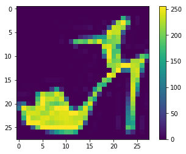
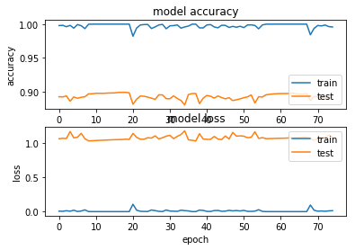
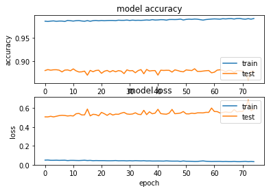

### Fine Tune Parameters and Hyper Parameters


```python
import tensorflow as tf
from tensorflow import keras
from keras import initializers
import numpy as np
import matplotlib.pyplot as plt
```


```python
fashion_mnist = keras.datasets.fashion_mnist

(train_images, train_labels), (test_images, test_labels) = fashion_mnist.load_data()
```


```python
class_names = ['T-shirt/top', 'Trouser', 'Pullover', 'Dress', 'Coat','Sandal', 'Shirt', 'Sneaker', 'Bag', 'Ankle boot']
```


```python
train_images.shape
```


    (60000, 28, 28)


```python
test_images.shape
```


    (10000, 28, 28)


```python
plt.figure()
plt.imshow(train_images[9])
plt.colorbar()
plt.grid(False)
plt.show()
```





```python
plt.figure(figsize=(10,10))
for i in range(36):
    plt.subplot(6,6,i+1)
    plt.xticks([])
    plt.yticks([])
    plt.grid(False)
    plt.imshow(train_images[i], cmap=plt.cm.RdYlGn)
    plt.xlabel(class_names[train_labels[i]])
plt.show()
```


```python
num_pixels = train_images.shape[1] * train_images.shape[2]
X_train = train_images.reshape(train_images.shape[0], num_pixels)
X_test = test_images.reshape(test_images.shape[0], num_pixels)

# normalize inputs from 0-255 to 0-1
X_train = X_train / 255
X_test = X_test / 255


Y_test = test_labels 
from keras.utils import np_utils
# one hot encode outputs
y_train = np_utils.to_categorical(train_labels )
y_test = np_utils.to_categorical(test_labels )


from keras.models import Sequential
from keras.layers import Dense
from keras import optimizers

hidden_nodes = 128
num_classes = y_test.shape[1]

def baseline_model():
    # create model
    model = Sequential()
    #model.add(Dense(hidden_nodes, input_dim= num_pixels, activation='relu'))
    #model.add(Dense(hidden_nodes, activation='relu'))
    #model.add(Dense(num_classes, activation='softmax'))
    model.add(Dense(hidden_nodes, input_dim= num_pixels, kernel_initializer=initializers.TruncatedNormal(mean=0.0, stddev=0.1), activation='relu'))
    model.add(Dense(hidden_nodes, kernel_initializer=initializers.TruncatedNormal(mean=0.0, stddev=0.1), activation='relu'))
    model.add(Dense(num_classes, kernel_initializer=initializers.TruncatedNormal(mean=0.0, stddev=0.1), activation='softmax'))
    #sgd = optimizers.SGD(lr=0.01, momentum=0.0, decay= 0.00)
    # Compile model
    model.compile(loss='categorical_crossentropy', optimizer='adam', metrics=['accuracy'])
    return model
```


```python
model = baseline_model()
# Fit the model
nn_simple = model.fit(X_train, y_train, epochs=80, batch_size=128)
# Final evaluation of the model
scores = model.evaluate(X_test, y_test)
print("Accuracy: %.2f%%" % (scores[1]*100))
```

    Epoch 1/80
    60000/60000 [==============================] - 4s 70us/step - loss: 0.5475 - acc: 0.8084
    Epoch 2/80
    60000/60000 [==============================] - 3s 57us/step - loss: 0.3831 - acc: 0.8619
    Epoch 3/80
    60000/60000 [==============================] - 4s 59us/step - loss: 0.3453 - acc: 0.8738
    Epoch 4/80
    60000/60000 [==============================] - 3s 57us/step - loss: 0.3163 - acc: 0.8835
    Epoch 5/80
    60000/60000 [==============================] - 4s 64us/step - loss: 0.2991 - acc: 0.8893
    Epoch 6/80
    60000/60000 [==============================] - 4s 61us/step - loss: 0.2836 - acc: 0.8955
    Epoch 7/80
    60000/60000 [==============================] - 4s 65us/step - loss: 0.2700 - acc: 0.8992
    Epoch 8/80
    60000/60000 [==============================] - 4s 60us/step - loss: 0.2551 - acc: 0.9041
    Epoch 9/80
    60000/60000 [==============================] - 3s 58us/step - loss: 0.2479 - acc: 0.9064
    Epoch 10/80
    60000/60000 [==============================] - 3s 58us/step - loss: 0.2385 - acc: 0.9101
    Epoch 11/80
    60000/60000 [==============================] - 3s 56us/step - loss: 0.2267 - acc: 0.9144
    Epoch 12/80
    60000/60000 [==============================] - 3s 57us/step - loss: 0.2199 - acc: 0.9171
    Epoch 13/80
    60000/60000 [==============================] - 4s 59us/step - loss: 0.2132 - acc: 0.9188
    Epoch 14/80
    60000/60000 [==============================] - 4s 59us/step - loss: 0.2052 - acc: 0.9224
    Epoch 15/80
    60000/60000 [==============================] - 3s 57us/step - loss: 0.2000 - acc: 0.9243
    Epoch 16/80
    60000/60000 [==============================] - 4s 58us/step - loss: 0.1914 - acc: 0.9267
    Epoch 17/80
    60000/60000 [==============================] - 3s 57us/step - loss: 0.1833 - acc: 0.9309
    Epoch 18/80
    60000/60000 [==============================] - 3s 58us/step - loss: 0.1784 - acc: 0.9325
    Epoch 19/80
    60000/60000 [==============================] - 4s 69us/step - loss: 0.1743 - acc: 0.9334
    Epoch 20/80
    60000/60000 [==============================] - 5s 77us/step - loss: 0.1681 - acc: 0.9355
    Epoch 21/80
    60000/60000 [==============================] - 4s 65us/step - loss: 0.1615 - acc: 0.9385
    Epoch 22/80
    60000/60000 [==============================] - 4s 61us/step - loss: 0.1568 - acc: 0.9400
    Epoch 23/80
    60000/60000 [==============================] - 4s 60us/step - loss: 0.1506 - acc: 0.9432
    Epoch 24/80
    60000/60000 [==============================] - 4s 66us/step - loss: 0.1462 - acc: 0.9438
    Epoch 25/80
    60000/60000 [==============================] - 3s 57us/step - loss: 0.1453 - acc: 0.9445
    Epoch 26/80
    60000/60000 [==============================] - 4s 59us/step - loss: 0.1353 - acc: 0.9489
    Epoch 27/80
    60000/60000 [==============================] - 4s 60us/step - loss: 0.1361 - acc: 0.9482
    Epoch 28/80
    60000/60000 [==============================] - 3s 57us/step - loss: 0.1276 - acc: 0.9509
    Epoch 29/80
    60000/60000 [==============================] - 4s 59us/step - loss: 0.1255 - acc: 0.9524
    Epoch 30/80
    60000/60000 [==============================] - 4s 66us/step - loss: 0.1252 - acc: 0.9524
    Epoch 31/80
    60000/60000 [==============================] - 3s 58us/step - loss: 0.1222 - acc: 0.9542
    Epoch 32/80
    60000/60000 [==============================] - 4s 75us/step - loss: 0.1135 - acc: 0.9564
    Epoch 33/80
    60000/60000 [==============================] - 4s 69us/step - loss: 0.1110 - acc: 0.9576
    Epoch 34/80
    60000/60000 [==============================] - 4s 62us/step - loss: 0.1106 - acc: 0.9576
    Epoch 35/80
    60000/60000 [==============================] - 4s 60us/step - loss: 0.1035 - acc: 0.9601
    Epoch 36/80
    60000/60000 [==============================] - 4s 59us/step - loss: 0.1058 - acc: 0.9596
    Epoch 37/80
    60000/60000 [==============================] - 4s 68us/step - loss: 0.0974 - acc: 0.9631
    Epoch 38/80
    60000/60000 [==============================] - 4s 59us/step - loss: 0.0957 - acc: 0.9634
    Epoch 39/80
    60000/60000 [==============================] - 4s 62us/step - loss: 0.0949 - acc: 0.9630
    Epoch 40/80
    60000/60000 [==============================] - 4s 61us/step - loss: 0.0921 - acc: 0.9651
    Epoch 41/80
    60000/60000 [==============================] - 4s 61us/step - loss: 0.0930 - acc: 0.9655
    Epoch 42/80
    60000/60000 [==============================] - 4s 59us/step - loss: 0.0882 - acc: 0.9664
    Epoch 43/80
    60000/60000 [==============================] - 4s 59us/step - loss: 0.0834 - acc: 0.9690
    Epoch 44/80
    60000/60000 [==============================] - 4s 58us/step - loss: 0.0844 - acc: 0.9677
    Epoch 45/80
    60000/60000 [==============================] - 4s 60us/step - loss: 0.0774 - acc: 0.9707
    Epoch 46/80
    60000/60000 [==============================] - 4s 59us/step - loss: 0.0799 - acc: 0.9694
    Epoch 47/80
    60000/60000 [==============================] - 4s 60us/step - loss: 0.0791 - acc: 0.9708
    Epoch 48/80
    60000/60000 [==============================] - 4s 59us/step - loss: 0.0759 - acc: 0.9716
    Epoch 49/80
    60000/60000 [==============================] - 4s 60us/step - loss: 0.0762 - acc: 0.9712
    Epoch 50/80
    60000/60000 [==============================] - 3s 58us/step - loss: 0.0764 - acc: 0.9716
    Epoch 51/80
    60000/60000 [==============================] - 4s 58us/step - loss: 0.0662 - acc: 0.9757
    Epoch 52/80
    60000/60000 [==============================] - 4s 61us/step - loss: 0.0661 - acc: 0.9755
    Epoch 53/80
    60000/60000 [==============================] - 4s 63us/step - loss: 0.0690 - acc: 0.9737
    Epoch 54/80
    60000/60000 [==============================] - 4s 63us/step - loss: 0.0719 - acc: 0.9725
    Epoch 55/80
    60000/60000 [==============================] - 4s 62us/step - loss: 0.0584 - acc: 0.9780
    Epoch 56/80
    60000/60000 [==============================] - 3s 58us/step - loss: 0.0609 - acc: 0.9772
    Epoch 57/80
    60000/60000 [==============================] - 4s 60us/step - loss: 0.0653 - acc: 0.9754
    Epoch 58/80
    60000/60000 [==============================] - 4s 65us/step - loss: 0.0588 - acc: 0.9775
    Epoch 59/80
    60000/60000 [==============================] - 4s 59us/step - loss: 0.0584 - acc: 0.9777
    Epoch 60/80
    60000/60000 [==============================] - 4s 60us/step - loss: 0.0621 - acc: 0.9768
    Epoch 61/80
    60000/60000 [==============================] - 4s 63us/step - loss: 0.0590 - acc: 0.9775
    Epoch 62/80
    60000/60000 [==============================] - 4s 73us/step - loss: 0.0534 - acc: 0.9800
    Epoch 63/80
    60000/60000 [==============================] - 4s 63us/step - loss: 0.0532 - acc: 0.9807
    Epoch 64/80
    60000/60000 [==============================] - 4s 63us/step - loss: 0.0537 - acc: 0.9802
    Epoch 65/80
    60000/60000 [==============================] - 4s 62us/step - loss: 0.0552 - acc: 0.9791
    Epoch 66/80
    60000/60000 [==============================] - 4s 66us/step - loss: 0.0519 - acc: 0.9815
    Epoch 67/80
    60000/60000 [==============================] - 4s 67us/step - loss: 0.0581 - acc: 0.9784
    Epoch 68/80
    60000/60000 [==============================] - 4s 64us/step - loss: 0.0502 - acc: 0.9811
    Epoch 69/80
    60000/60000 [==============================] - 4s 61us/step - loss: 0.0494 - acc: 0.9820
    Epoch 70/80
    60000/60000 [==============================] - 4s 62us/step - loss: 0.0493 - acc: 0.9817
    Epoch 71/80
    60000/60000 [==============================] - 4s 60us/step - loss: 0.0478 - acc: 0.9822
    Epoch 72/80
    60000/60000 [==============================] - 4s 68us/step - loss: 0.0444 - acc: 0.9836
    Epoch 73/80
    60000/60000 [==============================] - 4s 70us/step - loss: 0.0483 - acc: 0.9821
    Epoch 74/80
    60000/60000 [==============================] - 4s 64us/step - loss: 0.0447 - acc: 0.9834
    Epoch 75/80
    60000/60000 [==============================] - 4s 61us/step - loss: 0.0477 - acc: 0.9822
    Epoch 76/80
    60000/60000 [==============================] - 4s 64us/step - loss: 0.0418 - acc: 0.9840
    Epoch 77/80
    60000/60000 [==============================] - 4s 62us/step - loss: 0.0426 - acc: 0.9844
    Epoch 78/80
    60000/60000 [==============================] - 4s 59us/step - loss: 0.0460 - acc: 0.9838
    Epoch 79/80
    60000/60000 [==============================] - 4s 60us/step - loss: 0.0459 - acc: 0.9829
    Epoch 80/80
    60000/60000 [==============================] - 4s 60us/step - loss: 0.0432 - acc: 0.9836
    10000/10000 [==============================] - 1s 74us/step
    Accuracy: 88.66%
    

 #### Adam algorithm with epochs 5 through 75 incremented by a factor of 5


```python
model = baseline_model()
# Fit the model
i = 5
while True:
    print('Epochs: ' + str(i))
    nn_simple = model.fit(X_train, y_train, validation_data=(X_test, y_test), epochs=i, batch_size=128)
    scores = model.evaluate(X_test, y_test)
    print("Accuracy: %.2f%%" % (scores[1]*100))
    i += 5
    if (i > 75):
        break
    print('\n')
plt.subplot(2,1,1)
plt.plot(nn_simple.history['acc'])
plt.plot(nn_simple.history['val_acc'])
plt.title('model accuracy')
plt.ylabel('accuracy')
plt.xlabel('epoch')
plt.legend(['train', 'test'], loc='lower right')

plt.subplot(2,1,2)
plt.plot(nn_simple.history['loss'])
plt.plot(nn_simple.history['val_loss'])
plt.title('model loss')
plt.ylabel('loss')
plt.xlabel('epoch')
plt.legend(['train', 'test'], loc='upper right')
    
```

    Epochs: 5
    Train on 60000 samples, validate on 10000 samples
    Epoch 1/5
    60000/60000 [==============================] - 5s 82us/step - loss: 0.5504 - acc: 0.8090 - val_loss: 0.4400 - val_acc: 0.8471
    Epoch 2/5
    60000/60000 [==============================] - 4s 64us/step - loss: 0.3897 - acc: 0.8606 - val_loss: 0.3875 - val_acc: 0.8620
    Epoch 3/5
    60000/60000 [==============================] - 4s 64us/step - loss: 0.3437 - acc: 0.8757 - val_loss: 0.3674 - val_acc: 0.8623
    Epoch 4/5
    60000/60000 [==============================] - 4s 66us/step - loss: 0.3164 - acc: 0.8855 - val_loss: 0.3553 - val_acc: 0.8751
    Epoch 5/5
    60000/60000 [==============================] - 4s 65us/step - loss: 0.2970 - acc: 0.8901 - val_loss: 0.3453 - val_acc: 0.8746
    10000/10000 [==============================] - 1s 57us/step
    Accuracy: 87.46%
    
    
    Epochs: 10
    Train on 60000 samples, validate on 10000 samples
    Epoch 1/10
    60000/60000 [==============================] - 4s 62us/step - loss: 0.2831 - acc: 0.8956 - val_loss: 0.3405 - val_acc: 0.8752
    Epoch 2/10
    60000/60000 [==============================] - 4s 61us/step - loss: 0.2692 - acc: 0.9010 - val_loss: 0.3350 - val_acc: 0.8818
    Epoch 3/10
    60000/60000 [==============================] - 4s 60us/step - loss: 0.2574 - acc: 0.9046 - val_loss: 0.3260 - val_acc: 0.8827
    Epoch 4/10
    60000/60000 [==============================] - 4s 63us/step - loss: 0.2489 - acc: 0.9070 - val_loss: 0.3276 - val_acc: 0.8850
    Epoch 5/10
    60000/60000 [==============================] - 4s 61us/step - loss: 0.2385 - acc: 0.9101 - val_loss: 0.3286 - val_acc: 0.8816
    Epoch 6/10
    60000/60000 [==============================] - 4s 60us/step - loss: 0.2304 - acc: 0.9147 - val_loss: 0.3306 - val_acc: 0.8812
    Epoch 7/10
    60000/60000 [==============================] - 4s 63us/step - loss: 0.2203 - acc: 0.9178 - val_loss: 0.3262 - val_acc: 0.8873
    Epoch 8/10
    60000/60000 [==============================] - 4s 63us/step - loss: 0.2118 - acc: 0.9215 - val_loss: 0.3637 - val_acc: 0.8776
    Epoch 9/10
    60000/60000 [==============================] - 4s 62us/step - loss: 0.2089 - acc: 0.9221 - val_loss: 0.3236 - val_acc: 0.8896
    Epoch 10/10
    60000/60000 [==============================] - 4s 62us/step - loss: 0.2002 - acc: 0.9251 - val_loss: 0.3298 - val_acc: 0.8860
    10000/10000 [==============================] - 1s 61us/step
    Accuracy: 88.60%
    
    
    Epochs: 15
    Train on 60000 samples, validate on 10000 samples
    Epoch 1/15
    60000/60000 [==============================] - 4s 63us/step - loss: 0.1917 - acc: 0.9289 - val_loss: 0.3611 - val_acc: 0.8805
    Epoch 2/15
    60000/60000 [==============================] - 4s 73us/step - loss: 0.1907 - acc: 0.9284 - val_loss: 0.3419 - val_acc: 0.8868
    Epoch 3/15
    60000/60000 [==============================] - 4s 63us/step - loss: 0.1803 - acc: 0.9315 - val_loss: 0.3388 - val_acc: 0.8901
    Epoch 4/15
    60000/60000 [==============================] - 4s 62us/step - loss: 0.1761 - acc: 0.9344 - val_loss: 0.3579 - val_acc: 0.8888
    Epoch 5/15
    60000/60000 [==============================] - 4s 65us/step - loss: 0.1684 - acc: 0.9370 - val_loss: 0.3541 - val_acc: 0.8865
    Epoch 6/15
    60000/60000 [==============================] - 4s 66us/step - loss: 0.1659 - acc: 0.9377 - val_loss: 0.3543 - val_acc: 0.8870
    Epoch 7/15
    60000/60000 [==============================] - 4s 65us/step - loss: 0.1585 - acc: 0.9403 - val_loss: 0.3554 - val_acc: 0.8892
    Epoch 8/15
    60000/60000 [==============================] - 4s 63us/step - loss: 0.1558 - acc: 0.9416 - val_loss: 0.3656 - val_acc: 0.8853
    Epoch 9/15
    60000/60000 [==============================] - 4s 65us/step - loss: 0.1486 - acc: 0.9438 - val_loss: 0.3768 - val_acc: 0.8826
    Epoch 10/15
    60000/60000 [==============================] - 4s 65us/step - loss: 0.1417 - acc: 0.9469 - val_loss: 0.3682 - val_acc: 0.8895
    Epoch 11/15
    60000/60000 [==============================] - 4s 66us/step - loss: 0.1394 - acc: 0.9469 - val_loss: 0.3776 - val_acc: 0.8891
    Epoch 12/15
    60000/60000 [==============================] - 4s 63us/step - loss: 0.1352 - acc: 0.9491 - val_loss: 0.3906 - val_acc: 0.8850
    Epoch 13/15
    60000/60000 [==============================] - 4s 62us/step - loss: 0.1343 - acc: 0.9494 - val_loss: 0.3854 - val_acc: 0.8922
    Epoch 14/15
    60000/60000 [==============================] - 4s 60us/step - loss: 0.1320 - acc: 0.9506 - val_loss: 0.3658 - val_acc: 0.8942
    Epoch 15/15
    60000/60000 [==============================] - 5s 89us/step - loss: 0.1249 - acc: 0.9531 - val_loss: 0.3767 - val_acc: 0.8909
    10000/10000 [==============================] - 1s 106us/step
    Accuracy: 89.09%
    
    
    Epochs: 20
    Train on 60000 samples, validate on 10000 samples
    Epoch 1/20
    60000/60000 [==============================] - 4s 67us/step - loss: 0.1230 - acc: 0.9538 - val_loss: 0.3970 - val_acc: 0.8894
    Epoch 2/20
    60000/60000 [==============================] - 4s 62us/step - loss: 0.1162 - acc: 0.9566 - val_loss: 0.4162 - val_acc: 0.8850
    Epoch 3/20
    60000/60000 [==============================] - 4s 61us/step - loss: 0.1129 - acc: 0.9580 - val_loss: 0.4285 - val_acc: 0.8859
    Epoch 4/20
    60000/60000 [==============================] - 4s 62us/step - loss: 0.1097 - acc: 0.9582 - val_loss: 0.4089 - val_acc: 0.8922
    Epoch 5/20
    60000/60000 [==============================] - 4s 61us/step - loss: 0.1101 - acc: 0.9587 - val_loss: 0.4311 - val_acc: 0.8893
    Epoch 6/20
    60000/60000 [==============================] - 4s 60us/step - loss: 0.1074 - acc: 0.9597 - val_loss: 0.4088 - val_acc: 0.8919
    Epoch 7/20
    60000/60000 [==============================] - 4s 62us/step - loss: 0.1027 - acc: 0.9602 - val_loss: 0.4620 - val_acc: 0.8838
    Epoch 8/20
    60000/60000 [==============================] - 4s 70us/step - loss: 0.0994 - acc: 0.9619 - val_loss: 0.4489 - val_acc: 0.8880
    Epoch 9/20
    60000/60000 [==============================] - 4s 60us/step - loss: 0.0980 - acc: 0.9629 - val_loss: 0.4556 - val_acc: 0.8860
    Epoch 10/20
    60000/60000 [==============================] - 4s 62us/step - loss: 0.0966 - acc: 0.9634 - val_loss: 0.4629 - val_acc: 0.8914
    Epoch 11/20
    60000/60000 [==============================] - 4s 61us/step - loss: 0.0918 - acc: 0.9652 - val_loss: 0.4515 - val_acc: 0.8894
    Epoch 12/20
    60000/60000 [==============================] - 4s 61us/step - loss: 0.0898 - acc: 0.9649 - val_loss: 0.4630 - val_acc: 0.8901
    Epoch 13/20
    60000/60000 [==============================] - 4s 60us/step - loss: 0.0890 - acc: 0.9667 - val_loss: 0.4594 - val_acc: 0.8931
    Epoch 14/20
    60000/60000 [==============================] - 4s 60us/step - loss: 0.0829 - acc: 0.9689 - val_loss: 0.4700 - val_acc: 0.8897
    Epoch 15/20
    60000/60000 [==============================] - 4s 61us/step - loss: 0.0848 - acc: 0.9682 - val_loss: 0.4923 - val_acc: 0.8925
    Epoch 16/20
    60000/60000 [==============================] - 4s 59us/step - loss: 0.0816 - acc: 0.9697 - val_loss: 0.4925 - val_acc: 0.8865
    Epoch 17/20
    60000/60000 [==============================] - 4s 61us/step - loss: 0.0812 - acc: 0.9698 - val_loss: 0.4962 - val_acc: 0.8900
    Epoch 18/20
    60000/60000 [==============================] - 4s 66us/step - loss: 0.0747 - acc: 0.9715 - val_loss: 0.5075 - val_acc: 0.8904
    Epoch 19/20
    60000/60000 [==============================] - 4s 62us/step - loss: 0.0775 - acc: 0.9703 - val_loss: 0.4896 - val_acc: 0.8932
    Epoch 20/20
    60000/60000 [==============================] - 4s 60us/step - loss: 0.0742 - acc: 0.9717 - val_loss: 0.4851 - val_acc: 0.8890
    10000/10000 [==============================] - 1s 56us/step
    Accuracy: 88.90%
    
    
    Epochs: 25
    Train on 60000 samples, validate on 10000 samples
    Epoch 1/25
    60000/60000 [==============================] - 4s 61us/step - loss: 0.0684 - acc: 0.9748 - val_loss: 0.5005 - val_acc: 0.8881
    Epoch 2/25
    60000/60000 [==============================] - 4s 60us/step - loss: 0.0724 - acc: 0.9719 - val_loss: 0.5372 - val_acc: 0.8899
    Epoch 3/25
    60000/60000 [==============================] - 4s 61us/step - loss: 0.0688 - acc: 0.9740 - val_loss: 0.5362 - val_acc: 0.8880
    Epoch 4/25
    60000/60000 [==============================] - 4s 62us/step - loss: 0.0713 - acc: 0.9735 - val_loss: 0.5400 - val_acc: 0.8872
    Epoch 5/25
    60000/60000 [==============================] - 4s 60us/step - loss: 0.0649 - acc: 0.9764 - val_loss: 0.5785 - val_acc: 0.8863
    Epoch 6/25
    60000/60000 [==============================] - 4s 59us/step - loss: 0.0666 - acc: 0.9753 - val_loss: 0.5631 - val_acc: 0.8903
    Epoch 7/25
    60000/60000 [==============================] - 4s 63us/step - loss: 0.0673 - acc: 0.9747 - val_loss: 0.5536 - val_acc: 0.8901
    Epoch 8/25
    60000/60000 [==============================] - 3s 58us/step - loss: 0.0624 - acc: 0.9766 - val_loss: 0.5492 - val_acc: 0.8900
    Epoch 9/25
    60000/60000 [==============================] - 4s 58us/step - loss: 0.0602 - acc: 0.9776 - val_loss: 0.5544 - val_acc: 0.8909
    Epoch 10/25
    60000/60000 [==============================] - 3s 57us/step - loss: 0.0608 - acc: 0.9767 - val_loss: 0.5892 - val_acc: 0.8854
    Epoch 11/25
    60000/60000 [==============================] - 4s 58us/step - loss: 0.0546 - acc: 0.9801 - val_loss: 0.5611 - val_acc: 0.8916
    Epoch 12/25
    60000/60000 [==============================] - 3s 58us/step - loss: 0.0582 - acc: 0.9777 - val_loss: 0.5922 - val_acc: 0.8916
    Epoch 13/25
    60000/60000 [==============================] - 3s 58us/step - loss: 0.0557 - acc: 0.9794 - val_loss: 0.6028 - val_acc: 0.8928
    Epoch 14/25
    60000/60000 [==============================] - 3s 58us/step - loss: 0.0578 - acc: 0.9790 - val_loss: 0.5985 - val_acc: 0.8848
    Epoch 15/25
    60000/60000 [==============================] - 4s 60us/step - loss: 0.0571 - acc: 0.9787 - val_loss: 0.5828 - val_acc: 0.8884
    Epoch 16/25
    60000/60000 [==============================] - 4s 61us/step - loss: 0.0541 - acc: 0.9797 - val_loss: 0.5872 - val_acc: 0.8901
    Epoch 17/25
    60000/60000 [==============================] - 4s 59us/step - loss: 0.0481 - acc: 0.9821 - val_loss: 0.6082 - val_acc: 0.8901
    Epoch 18/25
    60000/60000 [==============================] - 4s 59us/step - loss: 0.0560 - acc: 0.9785 - val_loss: 0.6122 - val_acc: 0.8891
    Epoch 19/25
    60000/60000 [==============================] - 4s 61us/step - loss: 0.0544 - acc: 0.9801 - val_loss: 0.5900 - val_acc: 0.8906
    Epoch 20/25
    60000/60000 [==============================] - 4s 61us/step - loss: 0.0516 - acc: 0.9805 - val_loss: 0.6259 - val_acc: 0.8882
    Epoch 21/25
    60000/60000 [==============================] - 4s 61us/step - loss: 0.0466 - acc: 0.9827 - val_loss: 0.6126 - val_acc: 0.8912
    Epoch 22/25
    60000/60000 [==============================] - 4s 59us/step - loss: 0.0415 - acc: 0.9841 - val_loss: 0.6041 - val_acc: 0.8931
    Epoch 23/25
    60000/60000 [==============================] - 4s 60us/step - loss: 0.0521 - acc: 0.9803 - val_loss: 0.6256 - val_acc: 0.8906
    Epoch 24/25
    60000/60000 [==============================] - 4s 59us/step - loss: 0.0426 - acc: 0.9833 - val_loss: 0.6480 - val_acc: 0.8893
    Epoch 25/25
    60000/60000 [==============================] - 4s 59us/step - loss: 0.0502 - acc: 0.9814 - val_loss: 0.6347 - val_acc: 0.8878
    10000/10000 [==============================] - 1s 55us/step
    Accuracy: 88.78%
    
    
    Epochs: 30
    Train on 60000 samples, validate on 10000 samples
    Epoch 1/30
    60000/60000 [==============================] - ETA: 0s - loss: 0.0479 - acc: 0.982 - 4s 60us/step - loss: 0.0479 - acc: 0.9820 - val_loss: 0.6873 - val_acc: 0.8865
    Epoch 2/30
    60000/60000 [==============================] - 4s 58us/step - loss: 0.0495 - acc: 0.9817 - val_loss: 0.6298 - val_acc: 0.8895
    Epoch 3/30
    60000/60000 [==============================] - 4s 59us/step - loss: 0.0378 - acc: 0.9852 - val_loss: 0.6673 - val_acc: 0.8884
    Epoch 4/30
    60000/60000 [==============================] - 4s 60us/step - loss: 0.0445 - acc: 0.9834 - val_loss: 0.6668 - val_acc: 0.8893
    Epoch 5/30
    60000/60000 [==============================] - 4s 62us/step - loss: 0.0450 - acc: 0.9837 - val_loss: 0.6460 - val_acc: 0.8885
    Epoch 6/30
    60000/60000 [==============================] - 4s 65us/step - loss: 0.0369 - acc: 0.9865 - val_loss: 0.7019 - val_acc: 0.8811
    Epoch 7/30
    60000/60000 [==============================] - 4s 61us/step - loss: 0.0436 - acc: 0.9842 - val_loss: 0.6561 - val_acc: 0.8903
    Epoch 8/30
    60000/60000 [==============================] - 4s 59us/step - loss: 0.0438 - acc: 0.9838 - val_loss: 0.7038 - val_acc: 0.8872
    Epoch 9/30
    60000/60000 [==============================] - 4s 61us/step - loss: 0.0415 - acc: 0.9848 - val_loss: 0.7079 - val_acc: 0.8864
    Epoch 10/30
    60000/60000 [==============================] - 4s 61us/step - loss: 0.0431 - acc: 0.9842 - val_loss: 0.6899 - val_acc: 0.8853
    Epoch 11/30
    60000/60000 [==============================] - 4s 60us/step - loss: 0.0377 - acc: 0.9860 - val_loss: 0.6854 - val_acc: 0.8910
    Epoch 12/30
    60000/60000 [==============================] - 4s 60us/step - loss: 0.0317 - acc: 0.9887 - val_loss: 0.7047 - val_acc: 0.8893
    Epoch 13/30
    60000/60000 [==============================] - 4s 59us/step - loss: 0.0410 - acc: 0.9844 - val_loss: 0.7042 - val_acc: 0.8875
    Epoch 14/30
    60000/60000 [==============================] - 4s 61us/step - loss: 0.0427 - acc: 0.9843 - val_loss: 0.7235 - val_acc: 0.8866
    Epoch 15/30
    60000/60000 [==============================] - 4s 65us/step - loss: 0.0315 - acc: 0.9885 - val_loss: 0.7237 - val_acc: 0.8890
    Epoch 16/30
    60000/60000 [==============================] - 4s 60us/step - loss: 0.0374 - acc: 0.9861 - val_loss: 0.7066 - val_acc: 0.8911
    Epoch 17/30
    60000/60000 [==============================] - 4s 61us/step - loss: 0.0420 - acc: 0.9849 - val_loss: 0.6865 - val_acc: 0.8892
    Epoch 18/30
    60000/60000 [==============================] - 4s 61us/step - loss: 0.0307 - acc: 0.9887 - val_loss: 0.7161 - val_acc: 0.8875
    Epoch 19/30
    60000/60000 [==============================] - 4s 59us/step - loss: 0.0403 - acc: 0.9853 - val_loss: 0.7096 - val_acc: 0.8873
    Epoch 20/30
    60000/60000 [==============================] - 4s 61us/step - loss: 0.0316 - acc: 0.9886 - val_loss: 0.7079 - val_acc: 0.8875
    Epoch 21/30
    60000/60000 [==============================] - 4s 61us/step - loss: 0.0365 - acc: 0.9858 - val_loss: 0.7338 - val_acc: 0.8855
    Epoch 22/30
    60000/60000 [==============================] - 4s 60us/step - loss: 0.0373 - acc: 0.9861 - val_loss: 0.7792 - val_acc: 0.8827
    Epoch 23/30
    60000/60000 [==============================] - 4s 71us/step - loss: 0.0303 - acc: 0.9886 - val_loss: 0.7156 - val_acc: 0.8931
    Epoch 24/30
    60000/60000 [==============================] - 4s 61us/step - loss: 0.0352 - acc: 0.9865 - val_loss: 0.7476 - val_acc: 0.8909
    Epoch 25/30
    60000/60000 [==============================] - 4s 61us/step - loss: 0.0364 - acc: 0.9866 - val_loss: 0.7267 - val_acc: 0.8929
    Epoch 26/30
    60000/60000 [==============================] - 4s 60us/step - loss: 0.0265 - acc: 0.9903 - val_loss: 0.7500 - val_acc: 0.8888
    Epoch 27/30
    60000/60000 [==============================] - 4s 60us/step - loss: 0.0454 - acc: 0.9832 - val_loss: 0.7511 - val_acc: 0.8903
    Epoch 28/30
    60000/60000 [==============================] - 4s 62us/step - loss: 0.0354 - acc: 0.9873 - val_loss: 0.7616 - val_acc: 0.8929
    Epoch 29/30
    60000/60000 [==============================] - 4s 63us/step - loss: 0.0259 - acc: 0.9904 - val_loss: 0.7505 - val_acc: 0.8896
    Epoch 30/30
    60000/60000 [==============================] - 4s 61us/step - loss: 0.0333 - acc: 0.9880 - val_loss: 0.7400 - val_acc: 0.8858
    10000/10000 [==============================] - 1s 63us/step
    Accuracy: 88.58%
    
    
    Epochs: 35
    Train on 60000 samples, validate on 10000 samples
    Epoch 1/35
    60000/60000 [==============================] - 4s 62us/step - loss: 0.0264 - acc: 0.9904 - val_loss: 0.7557 - val_acc: 0.8934
    Epoch 2/35
    60000/60000 [==============================] - 4s 61us/step - loss: 0.0362 - acc: 0.9865 - val_loss: 0.7712 - val_acc: 0.8901
    Epoch 3/35
    60000/60000 [==============================] - 4s 63us/step - loss: 0.0287 - acc: 0.9891 - val_loss: 0.7582 - val_acc: 0.8871
    Epoch 4/35
    60000/60000 [==============================] - 4s 60us/step - loss: 0.0362 - acc: 0.9869 - val_loss: 0.7477 - val_acc: 0.8909
    Epoch 5/35
    60000/60000 [==============================] - 4s 62us/step - loss: 0.0403 - acc: 0.9856 - val_loss: 0.7603 - val_acc: 0.8864
    Epoch 6/35
    60000/60000 [==============================] - 4s 64us/step - loss: 0.0276 - acc: 0.9903 - val_loss: 0.7405 - val_acc: 0.8935
    Epoch 7/35
    60000/60000 [==============================] - 4s 61us/step - loss: 0.0268 - acc: 0.9910 - val_loss: 0.7571 - val_acc: 0.8871
    Epoch 8/35
    60000/60000 [==============================] - 4s 64us/step - loss: 0.0316 - acc: 0.9888 - val_loss: 0.7541 - val_acc: 0.8884
    Epoch 9/35
    60000/60000 [==============================] - 4s 60us/step - loss: 0.0325 - acc: 0.9883 - val_loss: 0.7727 - val_acc: 0.8946
    Epoch 10/35
    60000/60000 [==============================] - 3s 58us/step - loss: 0.0293 - acc: 0.9893 - val_loss: 0.7741 - val_acc: 0.8890
    Epoch 11/35
    60000/60000 [==============================] - 3s 58us/step - loss: 0.0288 - acc: 0.9899 - val_loss: 0.7780 - val_acc: 0.8877
    Epoch 12/35
    60000/60000 [==============================] - 4s 61us/step - loss: 0.0242 - acc: 0.9912 - val_loss: 0.8258 - val_acc: 0.8868
    Epoch 13/35
    60000/60000 [==============================] - 4s 60us/step - loss: 0.0339 - acc: 0.9875 - val_loss: 0.7836 - val_acc: 0.8932
    Epoch 14/35
    60000/60000 [==============================] - 4s 58us/step - loss: 0.0214 - acc: 0.9922 - val_loss: 0.7898 - val_acc: 0.8926
    Epoch 15/35
    60000/60000 [==============================] - 4s 59us/step - loss: 0.0343 - acc: 0.9883 - val_loss: 0.8287 - val_acc: 0.8778
    Epoch 16/35
    60000/60000 [==============================] - 3s 58us/step - loss: 0.0272 - acc: 0.9903 - val_loss: 0.8174 - val_acc: 0.8880
    Epoch 17/35
    60000/60000 [==============================] - 4s 59us/step - loss: 0.0171 - acc: 0.9941 - val_loss: 0.8351 - val_acc: 0.8878
    Epoch 18/35
    60000/60000 [==============================] - 4s 64us/step - loss: 0.0378 - acc: 0.9864 - val_loss: 0.8137 - val_acc: 0.8895
    Epoch 19/35
    60000/60000 [==============================] - 4s 58us/step - loss: 0.0222 - acc: 0.9921 - val_loss: 0.7760 - val_acc: 0.8908
    Epoch 20/35
    60000/60000 [==============================] - 4s 59us/step - loss: 0.0194 - acc: 0.9929 - val_loss: 0.8059 - val_acc: 0.8911
    Epoch 21/35
    60000/60000 [==============================] - 3s 58us/step - loss: 0.0326 - acc: 0.9886 - val_loss: 0.8205 - val_acc: 0.8895
    Epoch 22/35
    60000/60000 [==============================] - 3s 58us/step - loss: 0.0265 - acc: 0.9901 - val_loss: 0.8248 - val_acc: 0.8893
    Epoch 23/35
    60000/60000 [==============================] - 4s 59us/step - loss: 0.0290 - acc: 0.9898 - val_loss: 0.8306 - val_acc: 0.8893
    Epoch 24/35
    60000/60000 [==============================] - 3s 58us/step - loss: 0.0327 - acc: 0.9880 - val_loss: 0.7948 - val_acc: 0.8872
    Epoch 25/35
    60000/60000 [==============================] - 4s 59us/step - loss: 0.0187 - acc: 0.9932 - val_loss: 0.8257 - val_acc: 0.8890
    Epoch 26/35
    60000/60000 [==============================] - 4s 60us/step - loss: 0.0258 - acc: 0.9906 - val_loss: 0.8905 - val_acc: 0.8837
    Epoch 27/35
    60000/60000 [==============================] - 4s 59us/step - loss: 0.0314 - acc: 0.9886 - val_loss: 0.8682 - val_acc: 0.8903
    Epoch 28/35
    60000/60000 [==============================] - 4s 60us/step - loss: 0.0269 - acc: 0.9899 - val_loss: 0.8332 - val_acc: 0.8885
    Epoch 29/35
    60000/60000 [==============================] - 4s 59us/step - loss: 0.0290 - acc: 0.9896 - val_loss: 0.8535 - val_acc: 0.8832
    Epoch 30/35
    60000/60000 [==============================] - 4s 59us/step - loss: 0.0174 - acc: 0.9937 - val_loss: 0.8425 - val_acc: 0.8917
    Epoch 31/35
    60000/60000 [==============================] - 4s 61us/step - loss: 0.0196 - acc: 0.9932 - val_loss: 0.8543 - val_acc: 0.8853
    Epoch 32/35
    60000/60000 [==============================] - 4s 61us/step - loss: 0.0377 - acc: 0.9867 - val_loss: 0.8095 - val_acc: 0.8892
    Epoch 33/35
    60000/60000 [==============================] - 4s 59us/step - loss: 0.0228 - acc: 0.9919 - val_loss: 0.8207 - val_acc: 0.8915
    Epoch 34/35
    60000/60000 [==============================] - 4s 61us/step - loss: 0.0207 - acc: 0.9926 - val_loss: 0.8371 - val_acc: 0.8942
    Epoch 35/35
    60000/60000 [==============================] - 4s 60us/step - loss: 0.0316 - acc: 0.9894 - val_loss: 0.8523 - val_acc: 0.8901
    10000/10000 [==============================] - 1s 53us/step
    Accuracy: 89.01%
    
    
    Epochs: 40
    Train on 60000 samples, validate on 10000 samples
    Epoch 1/40
    60000/60000 [==============================] - 4s 60us/step - loss: 0.0197 - acc: 0.9930 - val_loss: 0.8511 - val_acc: 0.8911
    Epoch 2/40
    60000/60000 [==============================] - 4s 61us/step - loss: 0.0195 - acc: 0.9932 - val_loss: 0.8706 - val_acc: 0.8884
    Epoch 3/40
    60000/60000 [==============================] - 4s 59us/step - loss: 0.0210 - acc: 0.9926 - val_loss: 0.8285 - val_acc: 0.8900
    Epoch 4/40
    60000/60000 [==============================] - 4s 60us/step - loss: 0.0330 - acc: 0.9883 - val_loss: 0.9129 - val_acc: 0.8893
    Epoch 5/40
    60000/60000 [==============================] - 4s 61us/step - loss: 0.0200 - acc: 0.9929 - val_loss: 0.8410 - val_acc: 0.8900
    Epoch 6/40
    60000/60000 [==============================] - 4s 63us/step - loss: 0.0210 - acc: 0.9921 - val_loss: 0.8752 - val_acc: 0.8884
    Epoch 7/40
    60000/60000 [==============================] - 4s 62us/step - loss: 0.0380 - acc: 0.9868 - val_loss: 0.8283 - val_acc: 0.8926
    Epoch 8/40
    60000/60000 [==============================] - 4s 60us/step - loss: 0.0135 - acc: 0.9953 - val_loss: 0.8522 - val_acc: 0.8944
    Epoch 9/40
    60000/60000 [==============================] - 4s 59us/step - loss: 0.0166 - acc: 0.9941 - val_loss: 0.8907 - val_acc: 0.8857
    Epoch 10/40
    60000/60000 [==============================] - 4s 61us/step - loss: 0.0385 - acc: 0.9870 - val_loss: 0.8561 - val_acc: 0.8889
    Epoch 11/40
    60000/60000 [==============================] - 4s 60us/step - loss: 0.0230 - acc: 0.9915 - val_loss: 0.8766 - val_acc: 0.8906
    Epoch 12/40
    60000/60000 [==============================] - 4s 60us/step - loss: 0.0174 - acc: 0.9939 - val_loss: 0.8708 - val_acc: 0.8887
    Epoch 13/40
    60000/60000 [==============================] - 4s 62us/step - loss: 0.0199 - acc: 0.9929 - val_loss: 0.8978 - val_acc: 0.8849
    Epoch 14/40
    60000/60000 [==============================] - 4s 60us/step - loss: 0.0302 - acc: 0.9897 - val_loss: 0.8430 - val_acc: 0.8930
    Epoch 15/40
    60000/60000 [==============================] - 4s 62us/step - loss: 0.0144 - acc: 0.9948 - val_loss: 0.8857 - val_acc: 0.8894
    Epoch 16/40
    60000/60000 [==============================] - 4s 67us/step - loss: 0.0338 - acc: 0.9888 - val_loss: 0.8824 - val_acc: 0.8903
    Epoch 17/40
    60000/60000 [==============================] - 4s 60us/step - loss: 0.0210 - acc: 0.9927 - val_loss: 0.9067 - val_acc: 0.8852
    Epoch 18/40
    60000/60000 [==============================] - 4s 61us/step - loss: 0.0264 - acc: 0.9908 - val_loss: 0.8459 - val_acc: 0.8937
    Epoch 19/40
    60000/60000 [==============================] - 4s 61us/step - loss: 0.0090 - acc: 0.9969 - val_loss: 0.8563 - val_acc: 0.8929
    Epoch 20/40
    60000/60000 [==============================] - 4s 60us/step - loss: 0.0437 - acc: 0.9853 - val_loss: 0.8917 - val_acc: 0.8902
    Epoch 21/40
    60000/60000 [==============================] - 4s 63us/step - loss: 0.0229 - acc: 0.9921 - val_loss: 0.8697 - val_acc: 0.8919
    Epoch 22/40
    60000/60000 [==============================] - 4s 62us/step - loss: 0.0099 - acc: 0.9968 - val_loss: 0.9091 - val_acc: 0.8868
    Epoch 23/40
    60000/60000 [==============================] - 4s 61us/step - loss: 0.0249 - acc: 0.9916 - val_loss: 0.8921 - val_acc: 0.8874
    Epoch 24/40
    60000/60000 [==============================] - 4s 61us/step - loss: 0.0201 - acc: 0.9930 - val_loss: 0.8931 - val_acc: 0.8902
    Epoch 25/40
    60000/60000 [==============================] - 4s 61us/step - loss: 0.0323 - acc: 0.9885 - val_loss: 0.8835 - val_acc: 0.8903
    Epoch 26/40
    60000/60000 [==============================] - 4s 63us/step - loss: 0.0205 - acc: 0.9930 - val_loss: 0.8842 - val_acc: 0.8914
    Epoch 27/40
    60000/60000 [==============================] - 4s 64us/step - loss: 0.0127 - acc: 0.9957 - val_loss: 0.8673 - val_acc: 0.8949
    Epoch 28/40
    60000/60000 [==============================] - 4s 61us/step - loss: 0.0370 - acc: 0.9878 - val_loss: 0.9013 - val_acc: 0.8859
    Epoch 29/40
    60000/60000 [==============================] - 4s 63us/step - loss: 0.0212 - acc: 0.9923 - val_loss: 0.8624 - val_acc: 0.8907
    Epoch 30/40
    60000/60000 [==============================] - 4s 60us/step - loss: 0.0196 - acc: 0.9933 - val_loss: 0.8702 - val_acc: 0.8905
    Epoch 31/40
    60000/60000 [==============================] - 4s 59us/step - loss: 0.0084 - acc: 0.9970 - val_loss: 0.9128 - val_acc: 0.8903
    Epoch 32/40
    60000/60000 [==============================] - 4s 60us/step - loss: 0.0294 - acc: 0.9899 - val_loss: 0.9521 - val_acc: 0.8841
    Epoch 33/40
    60000/60000 [==============================] - 3s 58us/step - loss: 0.0179 - acc: 0.9937 - val_loss: 0.9006 - val_acc: 0.8890
    Epoch 34/40
    60000/60000 [==============================] - 4s 58us/step - loss: 0.0238 - acc: 0.9920 - val_loss: 0.9120 - val_acc: 0.8829
    Epoch 35/40
    60000/60000 [==============================] - 4s 59us/step - loss: 0.0268 - acc: 0.9912 - val_loss: 0.8820 - val_acc: 0.8927
    Epoch 36/40
    60000/60000 [==============================] - 4s 59us/step - loss: 0.0250 - acc: 0.9915 - val_loss: 0.9092 - val_acc: 0.8854
    Epoch 37/40
    60000/60000 [==============================] - ETA: 0s - loss: 0.0139 - acc: 0.995 - 4s 59us/step - loss: 0.0139 - acc: 0.9953 - val_loss: 0.8644 - val_acc: 0.8944
    Epoch 38/40
    60000/60000 [==============================] - 4s 59us/step - loss: 0.0169 - acc: 0.9945 - val_loss: 0.8904 - val_acc: 0.8865
    Epoch 39/40
    60000/60000 [==============================] - 4s 62us/step - loss: 0.0207 - acc: 0.9928 - val_loss: 0.9001 - val_acc: 0.8850
    Epoch 40/40
    60000/60000 [==============================] - 4s 69us/step - loss: 0.0201 - acc: 0.9927 - val_loss: 0.8699 - val_acc: 0.8916
    10000/10000 [==============================] - 1s 53us/step
    Accuracy: 89.16%
    
    
    Epochs: 45
    Train on 60000 samples, validate on 10000 samples
    Epoch 1/45
    60000/60000 [==============================] - 3s 58us/step - loss: 0.0111 - acc: 0.9963 - val_loss: 0.9007 - val_acc: 0.8912
    Epoch 2/45
    60000/60000 [==============================] - 4s 60us/step - loss: 0.0293 - acc: 0.9900 - val_loss: 0.9014 - val_acc: 0.8890
    Epoch 3/45
    60000/60000 [==============================] - 4s 61us/step - loss: 0.0279 - acc: 0.9910 - val_loss: 0.8859 - val_acc: 0.8894
    Epoch 4/45
    60000/60000 [==============================] - 4s 59us/step - loss: 0.0103 - acc: 0.9965 - val_loss: 0.8951 - val_acc: 0.8895
    Epoch 5/45
    60000/60000 [==============================] - 4s 60us/step - loss: 0.0217 - acc: 0.9924 - val_loss: 0.8891 - val_acc: 0.8906
    Epoch 6/45
    60000/60000 [==============================] - 4s 61us/step - loss: 0.0210 - acc: 0.9925 - val_loss: 0.8992 - val_acc: 0.8929
    Epoch 7/45
    60000/60000 [==============================] - 4s 59us/step - loss: 0.0082 - acc: 0.9969 - val_loss: 0.8970 - val_acc: 0.8935
    Epoch 8/45
    60000/60000 [==============================] - 4s 59us/step - loss: 0.0141 - acc: 0.9955 - val_loss: 0.9562 - val_acc: 0.8856
    Epoch 9/45
    60000/60000 [==============================] - 4s 66us/step - loss: 0.0437 - acc: 0.9859 - val_loss: 0.8712 - val_acc: 0.8930
    Epoch 10/45
    60000/60000 [==============================] - 4s 60us/step - loss: 0.0089 - acc: 0.9971 - val_loss: 0.9188 - val_acc: 0.8886
    Epoch 11/45
    60000/60000 [==============================] - 4s 59us/step - loss: 0.0140 - acc: 0.9952 - val_loss: 0.9239 - val_acc: 0.8905
    Epoch 12/45
    60000/60000 [==============================] - 4s 59us/step - loss: 0.0348 - acc: 0.9888 - val_loss: 0.9235 - val_acc: 0.8876
    Epoch 13/45
    60000/60000 [==============================] - 4s 60us/step - loss: 0.0108 - acc: 0.9961 - val_loss: 0.8975 - val_acc: 0.8899
    Epoch 14/45
    60000/60000 [==============================] - 4s 62us/step - loss: 0.0069 - acc: 0.9976 - val_loss: 0.9056 - val_acc: 0.8929
    Epoch 15/45
    60000/60000 [==============================] - 4s 59us/step - loss: 0.0360 - acc: 0.9886 - val_loss: 0.9323 - val_acc: 0.8868
    Epoch 16/45
    60000/60000 [==============================] - 4s 61us/step - loss: 0.0164 - acc: 0.9948 - val_loss: 0.8944 - val_acc: 0.8920
    Epoch 17/45
    60000/60000 [==============================] - 4s 61us/step - loss: 0.0100 - acc: 0.9966 - val_loss: 0.9520 - val_acc: 0.8877
    Epoch 18/45
    60000/60000 [==============================] - 4s 59us/step - loss: 0.0331 - acc: 0.9894 - val_loss: 0.9477 - val_acc: 0.8865
    Epoch 19/45
    60000/60000 [==============================] - 4s 60us/step - loss: 0.0119 - acc: 0.9959 - val_loss: 0.9262 - val_acc: 0.8918
    Epoch 20/45
    60000/60000 [==============================] - 4s 59us/step - loss: 0.0192 - acc: 0.9939 - val_loss: 0.9441 - val_acc: 0.8906
    Epoch 21/45
    60000/60000 [==============================] - 4s 60us/step - loss: 0.0289 - acc: 0.9902 - val_loss: 0.8986 - val_acc: 0.8919
    Epoch 22/45
    60000/60000 [==============================] - 4s 61us/step - loss: 0.0114 - acc: 0.9961 - val_loss: 0.9027 - val_acc: 0.8930
    Epoch 23/45
    60000/60000 [==============================] - 4s 60us/step - loss: 0.0079 - acc: 0.9973 - val_loss: 0.9098 - val_acc: 0.8917
    Epoch 24/45
    60000/60000 [==============================] - 4s 60us/step - loss: 0.0116 - acc: 0.9959 - val_loss: 0.9341 - val_acc: 0.8915
    Epoch 25/45
    60000/60000 [==============================] - 4s 61us/step - loss: 0.0404 - acc: 0.9870 - val_loss: 0.9027 - val_acc: 0.8879
    Epoch 26/45
    60000/60000 [==============================] - 4s 60us/step - loss: 0.0128 - acc: 0.9955 - val_loss: 0.9360 - val_acc: 0.8892
    Epoch 27/45
    60000/60000 [==============================] - 4s 61us/step - loss: 0.0129 - acc: 0.9954 - val_loss: 0.9508 - val_acc: 0.8875
    Epoch 28/45
    60000/60000 [==============================] - 4s 60us/step - loss: 0.0279 - acc: 0.9912 - val_loss: 0.9530 - val_acc: 0.8867
    Epoch 29/45
    60000/60000 [==============================] - 4s 61us/step - loss: 0.0217 - acc: 0.9926 - val_loss: 0.9079 - val_acc: 0.8939
    Epoch 30/45
    60000/60000 [==============================] - 4s 61us/step - loss: 0.0096 - acc: 0.9968 - val_loss: 0.9064 - val_acc: 0.8926
    Epoch 31/45
    60000/60000 [==============================] - 4s 63us/step - loss: 0.0048 - acc: 0.9987 - val_loss: 0.9166 - val_acc: 0.8920
    Epoch 32/45
    60000/60000 [==============================] - 4s 60us/step - loss: 0.0194 - acc: 0.9946 - val_loss: 1.0404 - val_acc: 0.8792
    Epoch 33/45
    60000/60000 [==============================] - 4s 63us/step - loss: 0.0407 - acc: 0.9877 - val_loss: 0.9307 - val_acc: 0.8889
    Epoch 34/45
    60000/60000 [==============================] - 4s 60us/step - loss: 0.0128 - acc: 0.9957 - val_loss: 0.9368 - val_acc: 0.8902
    Epoch 35/45
    60000/60000 [==============================] - 4s 60us/step - loss: 0.0094 - acc: 0.9969 - val_loss: 0.9495 - val_acc: 0.8885
    Epoch 36/45
    60000/60000 [==============================] - 4s 61us/step - loss: 0.0281 - acc: 0.9909 - val_loss: 0.9303 - val_acc: 0.8860
    Epoch 37/45
    60000/60000 [==============================] - 4s 64us/step - loss: 0.0208 - acc: 0.9936 - val_loss: 0.9520 - val_acc: 0.8911
    Epoch 38/45
    60000/60000 [==============================] - 4s 61us/step - loss: 0.0069 - acc: 0.9978 - val_loss: 0.9629 - val_acc: 0.8896
    Epoch 39/45
    60000/60000 [==============================] - ETA: 0s - loss: 0.0110 - acc: 0.996 - 4s 61us/step - loss: 0.0110 - acc: 0.9963 - val_loss: 0.9475 - val_acc: 0.8899
    Epoch 40/45
    60000/60000 [==============================] - 4s 60us/step - loss: 0.0324 - acc: 0.9893 - val_loss: 0.9594 - val_acc: 0.8910
    Epoch 41/45
    60000/60000 [==============================] - 4s 63us/step - loss: 0.0129 - acc: 0.9952 - val_loss: 0.9004 - val_acc: 0.8928
    Epoch 42/45
    60000/60000 [==============================] - 4s 67us/step - loss: 0.0019 - acc: 0.9996 - val_loss: 0.9275 - val_acc: 0.8942
    Epoch 43/45
    60000/60000 [==============================] - 4s 60us/step - loss: 0.0328 - acc: 0.9905 - val_loss: 1.0246 - val_acc: 0.8835
    Epoch 44/45
    60000/60000 [==============================] - 4s 62us/step - loss: 0.0252 - acc: 0.9916 - val_loss: 0.9730 - val_acc: 0.8904
    Epoch 45/45
    60000/60000 [==============================] - 4s 61us/step - loss: 0.0046 - acc: 0.9985 - val_loss: 0.9286 - val_acc: 0.8940
    10000/10000 [==============================] - 1s 54us/step
    Accuracy: 89.40%
    
    
    Epochs: 50
    Train on 60000 samples, validate on 10000 samples
    Epoch 1/50
    60000/60000 [==============================] - 4s 61us/step - loss: 0.0227 - acc: 0.9931 - val_loss: 1.0026 - val_acc: 0.8852
    Epoch 2/50
    60000/60000 [==============================] - 4s 61us/step - loss: 0.0284 - acc: 0.9909 - val_loss: 0.9544 - val_acc: 0.8891
    Epoch 3/50
    60000/60000 [==============================] - 4s 58us/step - loss: 0.0104 - acc: 0.9964 - val_loss: 0.9365 - val_acc: 0.8926
    Epoch 4/50
    60000/60000 [==============================] - 4s 59us/step - loss: 0.0088 - acc: 0.9972 - val_loss: 0.9894 - val_acc: 0.8907
    Epoch 5/50
    60000/60000 [==============================] - 4s 58us/step - loss: 0.0334 - acc: 0.9894 - val_loss: 0.9670 - val_acc: 0.8883
    Epoch 6/50
    60000/60000 [==============================] - 4s 59us/step - loss: 0.0117 - acc: 0.9959 - val_loss: 0.9408 - val_acc: 0.8914
    Epoch 7/50
    60000/60000 [==============================] - 4s 61us/step - loss: 0.0110 - acc: 0.9966 - val_loss: 0.9850 - val_acc: 0.8867
    Epoch 8/50
    60000/60000 [==============================] - 4s 58us/step - loss: 0.0263 - acc: 0.9914 - val_loss: 0.9230 - val_acc: 0.8909
    Epoch 9/50
    60000/60000 [==============================] - 4s 59us/step - loss: 0.0183 - acc: 0.9941 - val_loss: 0.9465 - val_acc: 0.8925
    Epoch 10/50
    60000/60000 [==============================] - 4s 60us/step - loss: 0.0056 - acc: 0.9982 - val_loss: 0.9344 - val_acc: 0.8940
    Epoch 11/50
    60000/60000 [==============================] - 4s 58us/step - loss: 0.0146 - acc: 0.9958 - val_loss: 1.0735 - val_acc: 0.8741
    Epoch 12/50
    60000/60000 [==============================] - 4s 60us/step - loss: 0.0431 - acc: 0.9870 - val_loss: 0.9193 - val_acc: 0.8910
    Epoch 13/50
    60000/60000 [==============================] - 4s 60us/step - loss: 0.0062 - acc: 0.9978 - val_loss: 0.9133 - val_acc: 0.8971
    Epoch 14/50
    60000/60000 [==============================] - 3s 58us/step - loss: 0.0010 - acc: 0.9999 - val_loss: 0.9133 - val_acc: 0.8973
    Epoch 15/50
    60000/60000 [==============================] - 4s 59us/step - loss: 6.7116e-04 - acc: 1.0000 - val_loss: 0.9307 - val_acc: 0.8948
    Epoch 16/50
    60000/60000 [==============================] - 4s 60us/step - loss: 0.0537 - acc: 0.9852 - val_loss: 0.9524 - val_acc: 0.8853
    Epoch 17/50
    60000/60000 [==============================] - 4s 59us/step - loss: 0.0176 - acc: 0.9936 - val_loss: 0.9747 - val_acc: 0.8904
    Epoch 18/50
    60000/60000 [==============================] - 4s 60us/step - loss: 0.0113 - acc: 0.9960 - val_loss: 0.9503 - val_acc: 0.8918
    Epoch 19/50
    60000/60000 [==============================] - 4s 60us/step - loss: 0.0068 - acc: 0.9978 - val_loss: 0.9643 - val_acc: 0.8918
    Epoch 20/50
    60000/60000 [==============================] - 4s 59us/step - loss: 0.0181 - acc: 0.9941 - val_loss: 0.9572 - val_acc: 0.8855
    Epoch 21/50
    60000/60000 [==============================] - 4s 60us/step - loss: 0.0216 - acc: 0.9928 - val_loss: 0.9478 - val_acc: 0.8905
    Epoch 22/50
    60000/60000 [==============================] - 4s 60us/step - loss: 0.0175 - acc: 0.9942 - val_loss: 0.9488 - val_acc: 0.8915
    Epoch 23/50
    60000/60000 [==============================] - 4s 60us/step - loss: 0.0113 - acc: 0.9958 - val_loss: 0.9491 - val_acc: 0.8911
    Epoch 24/50
    60000/60000 [==============================] - 4s 62us/step - loss: 0.0032 - acc: 0.9989 - val_loss: 0.9571 - val_acc: 0.8926
    Epoch 25/50
    60000/60000 [==============================] - 4s 60us/step - loss: 0.0404 - acc: 0.9880 - val_loss: 0.9217 - val_acc: 0.8886
    Epoch 26/50
    60000/60000 [==============================] - 4s 60us/step - loss: 0.0046 - acc: 0.9986 - val_loss: 0.9549 - val_acc: 0.8913
    Epoch 27/50
    60000/60000 [==============================] - 4s 68us/step - loss: 0.0227 - acc: 0.9927 - val_loss: 0.9847 - val_acc: 0.8851
    Epoch 28/50
    60000/60000 [==============================] - 5s 81us/step - loss: 0.0165 - acc: 0.9945 - val_loss: 0.9390 - val_acc: 0.8911
    Epoch 29/50
    60000/60000 [==============================] - 5s 89us/step - loss: 0.0050 - acc: 0.9985 - val_loss: 0.9226 - val_acc: 0.8948
    Epoch 30/50
    60000/60000 [==============================] - 5s 79us/step - loss: 0.0155 - acc: 0.9945 - val_loss: 0.9630 - val_acc: 0.8913
    Epoch 31/50
    60000/60000 [==============================] - 5s 81us/step - loss: 0.0202 - acc: 0.9932 - val_loss: 1.0406 - val_acc: 0.8868
    Epoch 32/50
    60000/60000 [==============================] - 5s 82us/step - loss: 0.0226 - acc: 0.9923 - val_loss: 1.0058 - val_acc: 0.8884
    Epoch 33/50
    60000/60000 [==============================] - 4s 68us/step - loss: 0.0138 - acc: 0.9955 - val_loss: 0.9777 - val_acc: 0.8893
    Epoch 34/50
    60000/60000 [==============================] - 4s 60us/step - loss: 0.0043 - acc: 0.9986 - val_loss: 0.9569 - val_acc: 0.8950
    Epoch 35/50
    60000/60000 [==============================] - 4s 69us/step - loss: 0.0148 - acc: 0.9950 - val_loss: 1.0122 - val_acc: 0.8849
    Epoch 36/50
    60000/60000 [==============================] - 4s 70us/step - loss: 0.0405 - acc: 0.9885 - val_loss: 0.9948 - val_acc: 0.8879
    Epoch 37/50
    60000/60000 [==============================] - 4s 60us/step - loss: 0.0091 - acc: 0.9969 - val_loss: 0.9409 - val_acc: 0.8932
    Epoch 38/50
    60000/60000 [==============================] - 4s 61us/step - loss: 0.0032 - acc: 0.9989 - val_loss: 0.9508 - val_acc: 0.8962
    Epoch 39/50
    60000/60000 [==============================] - 4s 62us/step - loss: 0.0221 - acc: 0.9930 - val_loss: 0.9993 - val_acc: 0.8898
    Epoch 40/50
    60000/60000 [==============================] - 4s 60us/step - loss: 0.0228 - acc: 0.9926 - val_loss: 0.9793 - val_acc: 0.8931
    Epoch 41/50
    60000/60000 [==============================] - 4s 62us/step - loss: 0.0106 - acc: 0.9966 - val_loss: 1.0060 - val_acc: 0.8879
    Epoch 42/50
    60000/60000 [==============================] - 4s 61us/step - loss: 0.0167 - acc: 0.9945 - val_loss: 1.0528 - val_acc: 0.8861
    Epoch 43/50
    60000/60000 [==============================] - 4s 61us/step - loss: 0.0156 - acc: 0.9948 - val_loss: 0.9806 - val_acc: 0.8890
    Epoch 44/50
    60000/60000 [==============================] - 4s 61us/step - loss: 0.0164 - acc: 0.9948 - val_loss: 1.0037 - val_acc: 0.8894
    Epoch 45/50
    60000/60000 [==============================] - 4s 61us/step - loss: 0.0216 - acc: 0.9934 - val_loss: 0.9754 - val_acc: 0.8930
    Epoch 46/50
    60000/60000 [==============================] - 4s 62us/step - loss: 0.0051 - acc: 0.9983 - val_loss: 0.9791 - val_acc: 0.8937
    Epoch 47/50
    60000/60000 [==============================] - 4s 60us/step - loss: 7.8485e-04 - acc: 1.0000 - val_loss: 0.9720 - val_acc: 0.8945
    Epoch 48/50
    60000/60000 [==============================] - 4s 62us/step - loss: 3.3509e-04 - acc: 1.0000 - val_loss: 0.9736 - val_acc: 0.8947
    Epoch 49/50
    60000/60000 [==============================] - 4s 62us/step - loss: 0.0030 - acc: 0.9991 - val_loss: 1.0889 - val_acc: 0.8803
    Epoch 50/50
    60000/60000 [==============================] - 4s 65us/step - loss: 0.0708 - acc: 0.9817 - val_loss: 0.9494 - val_acc: 0.8932
    10000/10000 [==============================] - 1s 55us/step
    Accuracy: 89.32%
    
    
    Epochs: 55
    Train on 60000 samples, validate on 10000 samples
    Epoch 1/55
    60000/60000 [==============================] - 4s 61us/step - loss: 0.0053 - acc: 0.9984 - val_loss: 0.9685 - val_acc: 0.8928
    Epoch 2/55
    60000/60000 [==============================] - 4s 62us/step - loss: 0.0016 - acc: 0.9997 - val_loss: 0.9701 - val_acc: 0.8951
    Epoch 3/55
    60000/60000 [==============================] - 4s 61us/step - loss: 0.0176 - acc: 0.9946 - val_loss: 1.0134 - val_acc: 0.8830
    Epoch 4/55
    60000/60000 [==============================] - 4s 62us/step - loss: 0.0327 - acc: 0.9901 - val_loss: 0.9854 - val_acc: 0.8913
    Epoch 5/55
    60000/60000 [==============================] - 4s 61us/step - loss: 0.0141 - acc: 0.9954 - val_loss: 0.9794 - val_acc: 0.8914
    Epoch 6/55
    60000/60000 [==============================] - 4s 61us/step - loss: 0.0092 - acc: 0.9971 - val_loss: 0.9546 - val_acc: 0.8956
    Epoch 7/55
    60000/60000 [==============================] - 4s 62us/step - loss: 0.0017 - acc: 0.9996 - val_loss: 0.9791 - val_acc: 0.8949
    Epoch 8/55
    60000/60000 [==============================] - 4s 67us/step - loss: 0.0377 - acc: 0.9900 - val_loss: 1.0407 - val_acc: 0.8845
    Epoch 9/55
    60000/60000 [==============================] - 4s 61us/step - loss: 0.0181 - acc: 0.9943 - val_loss: 0.9722 - val_acc: 0.8956
    Epoch 10/55
    60000/60000 [==============================] - 4s 71us/step - loss: 0.0069 - acc: 0.9978 - val_loss: 1.0402 - val_acc: 0.8836
    Epoch 11/55
    60000/60000 [==============================] - 3s 58us/step - loss: 0.0136 - acc: 0.9954 - val_loss: 0.9842 - val_acc: 0.8941
    Epoch 12/55
    60000/60000 [==============================] - 4s 59us/step - loss: 0.0166 - acc: 0.9943 - val_loss: 0.9786 - val_acc: 0.8938
    Epoch 13/55
    60000/60000 [==============================] - 4s 59us/step - loss: 0.0122 - acc: 0.9962 - val_loss: 0.9915 - val_acc: 0.8932
    Epoch 14/55
    60000/60000 [==============================] - 4s 60us/step - loss: 0.0014 - acc: 0.9996 - val_loss: 0.9633 - val_acc: 0.8975
    Epoch 15/55
    60000/60000 [==============================] - 4s 59us/step - loss: 3.7257e-04 - acc: 1.0000 - val_loss: 0.9866 - val_acc: 0.8964
    Epoch 16/55
    60000/60000 [==============================] - 4s 59us/step - loss: 2.6123e-04 - acc: 1.0000 - val_loss: 0.9877 - val_acc: 0.8965
    Epoch 17/55
    60000/60000 [==============================] - 4s 59us/step - loss: 2.3815e-04 - acc: 1.0000 - val_loss: 0.9805 - val_acc: 0.8963
    Epoch 18/55
    60000/60000 [==============================] - 4s 61us/step - loss: 0.1004 - acc: 0.9765 - val_loss: 0.9866 - val_acc: 0.8881
    Epoch 19/55
    60000/60000 [==============================] - 3s 58us/step - loss: 0.0139 - acc: 0.9956 - val_loss: 0.9802 - val_acc: 0.8889
    Epoch 20/55
    60000/60000 [==============================] - 4s 59us/step - loss: 0.0046 - acc: 0.9985 - val_loss: 0.9807 - val_acc: 0.8935
    Epoch 21/55
    60000/60000 [==============================] - 4s 59us/step - loss: 9.1472e-04 - acc: 0.9999 - val_loss: 0.9938 - val_acc: 0.8948
    Epoch 22/55
    60000/60000 [==============================] - 4s 58us/step - loss: 2.9373e-04 - acc: 1.0000 - val_loss: 0.9858 - val_acc: 0.8950
    Epoch 23/55
    60000/60000 [==============================] - 4s 59us/step - loss: 2.3312e-04 - acc: 1.0000 - val_loss: 0.9894 - val_acc: 0.8946
    Epoch 24/55
    60000/60000 [==============================] - 4s 61us/step - loss: 0.0514 - acc: 0.9884 - val_loss: 0.9914 - val_acc: 0.8799
    Epoch 25/55
    60000/60000 [==============================] - 4s 59us/step - loss: 0.0271 - acc: 0.9917 - val_loss: 0.9919 - val_acc: 0.8900
    Epoch 26/55
    60000/60000 [==============================] - 4s 61us/step - loss: 0.0074 - acc: 0.9975 - val_loss: 0.9828 - val_acc: 0.8893
    Epoch 27/55
    60000/60000 [==============================] - 4s 60us/step - loss: 0.0137 - acc: 0.9955 - val_loss: 0.9457 - val_acc: 0.8908
    Epoch 28/55
    60000/60000 [==============================] - 4s 60us/step - loss: 0.0096 - acc: 0.9968 - val_loss: 0.9734 - val_acc: 0.8896
    Epoch 29/55
    60000/60000 [==============================] - 4s 60us/step - loss: 0.0239 - acc: 0.9927 - val_loss: 0.9624 - val_acc: 0.8930
    Epoch 30/55
    60000/60000 [==============================] - 4s 59us/step - loss: 0.0072 - acc: 0.9979 - val_loss: 1.0118 - val_acc: 0.8876
    Epoch 31/55
    60000/60000 [==============================] - 4s 60us/step - loss: 0.0104 - acc: 0.9966 - val_loss: 1.0282 - val_acc: 0.8907
    Epoch 32/55
    60000/60000 [==============================] - 4s 63us/step - loss: 0.0188 - acc: 0.9940 - val_loss: 1.0141 - val_acc: 0.8895
    Epoch 33/55
    60000/60000 [==============================] - 4s 60us/step - loss: 0.0077 - acc: 0.9975 - val_loss: 1.0412 - val_acc: 0.8887
    Epoch 34/55
    60000/60000 [==============================] - 4s 61us/step - loss: 0.0205 - acc: 0.9930 - val_loss: 0.9820 - val_acc: 0.8910
    Epoch 35/55
    60000/60000 [==============================] - 4s 60us/step - loss: 0.0110 - acc: 0.9965 - val_loss: 1.0041 - val_acc: 0.8915
    Epoch 36/55
    60000/60000 [==============================] - 4s 60us/step - loss: 0.0179 - acc: 0.9947 - val_loss: 1.0550 - val_acc: 0.8890
    Epoch 37/55
    60000/60000 [==============================] - 4s 60us/step - loss: 0.0177 - acc: 0.9945 - val_loss: 1.0019 - val_acc: 0.8913
    Epoch 38/55
    60000/60000 [==============================] - 4s 60us/step - loss: 0.0017 - acc: 0.9996 - val_loss: 0.9907 - val_acc: 0.8942
    Epoch 39/55
    60000/60000 [==============================] - 4s 63us/step - loss: 4.2707e-04 - acc: 1.0000 - val_loss: 0.9989 - val_acc: 0.8956
    Epoch 40/55
    60000/60000 [==============================] - 4s 62us/step - loss: 3.4962e-04 - acc: 1.0000 - val_loss: 1.0053 - val_acc: 0.8944
    Epoch 41/55
    60000/60000 [==============================] - 4s 60us/step - loss: 2.0398e-04 - acc: 1.0000 - val_loss: 1.0086 - val_acc: 0.8955
    Epoch 42/55
    60000/60000 [==============================] - 4s 60us/step - loss: 1.5011e-04 - acc: 1.0000 - val_loss: 1.0068 - val_acc: 0.8964
    Epoch 43/55
    60000/60000 [==============================] - 4s 67us/step - loss: 1.7471e-04 - acc: 1.0000 - val_loss: 1.0118 - val_acc: 0.8971
    Epoch 44/55
    60000/60000 [==============================] - 4s 60us/step - loss: 0.0919 - acc: 0.9786 - val_loss: 0.9714 - val_acc: 0.8921
    Epoch 45/55
    60000/60000 [==============================] - 4s 61us/step - loss: 0.0087 - acc: 0.9973 - val_loss: 0.9453 - val_acc: 0.8928
    Epoch 46/55
    60000/60000 [==============================] - 4s 61us/step - loss: 0.0033 - acc: 0.9990 - val_loss: 0.9694 - val_acc: 0.8932
    Epoch 47/55
    60000/60000 [==============================] - 4s 60us/step - loss: 0.0192 - acc: 0.9936 - val_loss: 1.0381 - val_acc: 0.8824
    Epoch 48/55
    60000/60000 [==============================] - 4s 63us/step - loss: 0.0136 - acc: 0.9951 - val_loss: 0.9781 - val_acc: 0.8943
    Epoch 49/55
    60000/60000 [==============================] - 4s 61us/step - loss: 0.0139 - acc: 0.9955 - val_loss: 0.9988 - val_acc: 0.8922
    Epoch 50/55
    60000/60000 [==============================] - 4s 59us/step - loss: 0.0151 - acc: 0.9949 - val_loss: 0.9875 - val_acc: 0.8904
    Epoch 51/55
    60000/60000 [==============================] - 4s 62us/step - loss: 0.0119 - acc: 0.9962 - val_loss: 1.0037 - val_acc: 0.8916
    Epoch 52/55
    60000/60000 [==============================] - 4s 61us/step - loss: 0.0027 - acc: 0.9993 - val_loss: 0.9828 - val_acc: 0.8925
    Epoch 53/55
    60000/60000 [==============================] - 4s 60us/step - loss: 0.0274 - acc: 0.9917 - val_loss: 1.0542 - val_acc: 0.8857
    Epoch 54/55
    60000/60000 [==============================] - 4s 66us/step - loss: 0.0109 - acc: 0.9963 - val_loss: 0.9982 - val_acc: 0.8929
    Epoch 55/55
    60000/60000 [==============================] - 4s 61us/step - loss: 0.0136 - acc: 0.9957 - val_loss: 1.0595 - val_acc: 0.8848
    10000/10000 [==============================] - 1s 57us/step
    Accuracy: 88.48%
    
    
    Epochs: 60
    Train on 60000 samples, validate on 10000 samples
    Epoch 1/60
    60000/60000 [==============================] - 4s 62us/step - loss: 0.0164 - acc: 0.9947 - val_loss: 0.9996 - val_acc: 0.8941
    Epoch 2/60
    60000/60000 [==============================] - 4s 60us/step - loss: 0.0071 - acc: 0.9979 - val_loss: 1.0328 - val_acc: 0.8893
    Epoch 3/60
    60000/60000 [==============================] - 4s 62us/step - loss: 0.0207 - acc: 0.9931 - val_loss: 1.0102 - val_acc: 0.8890
    Epoch 4/60
    60000/60000 [==============================] - 4s 63us/step - loss: 0.0143 - acc: 0.9955 - val_loss: 1.0218 - val_acc: 0.8892
    Epoch 5/60
    60000/60000 [==============================] - 4s 61us/step - loss: 0.0101 - acc: 0.9965 - val_loss: 1.0251 - val_acc: 0.8901
    Epoch 6/60
    60000/60000 [==============================] - 4s 62us/step - loss: 0.0026 - acc: 0.9991 - val_loss: 1.0156 - val_acc: 0.8926
    Epoch 7/60
    60000/60000 [==============================] - 4s 62us/step - loss: 0.0225 - acc: 0.9927 - val_loss: 1.0314 - val_acc: 0.8863
    Epoch 8/60
    60000/60000 [==============================] - 4s 61us/step - loss: 0.0092 - acc: 0.9969 - val_loss: 1.0183 - val_acc: 0.8934
    Epoch 9/60
    60000/60000 [==============================] - 4s 61us/step - loss: 0.0019 - acc: 0.9995 - val_loss: 1.0134 - val_acc: 0.8948
    Epoch 10/60
    60000/60000 [==============================] - 4s 67us/step - loss: 0.0320 - acc: 0.9900 - val_loss: 1.0023 - val_acc: 0.8875
    Epoch 11/60
    60000/60000 [==============================] - 4s 65us/step - loss: 0.0110 - acc: 0.9966 - val_loss: 1.0144 - val_acc: 0.8908
    Epoch 12/60
    60000/60000 [==============================] - 4s 68us/step - loss: 0.0026 - acc: 0.9992 - val_loss: 0.9975 - val_acc: 0.8949
    Epoch 13/60
    60000/60000 [==============================] - ETA: 0s - loss: 2.5961e-04 - acc: 1.000 - 4s 61us/step - loss: 2.5951e-04 - acc: 1.0000 - val_loss: 0.9873 - val_acc: 0.8969
    Epoch 14/60
    60000/60000 [==============================] - 4s 59us/step - loss: 1.6533e-04 - acc: 1.0000 - val_loss: 0.9951 - val_acc: 0.8954
    Epoch 15/60
    60000/60000 [==============================] - 4s 58us/step - loss: 1.3663e-04 - acc: 1.0000 - val_loss: 0.9954 - val_acc: 0.8964
    Epoch 16/60
    60000/60000 [==============================] - ETA: 0s - loss: 1.2346e-04 - acc: 1.000 - 3s 58us/step - loss: 1.2306e-04 - acc: 1.0000 - val_loss: 1.0059 - val_acc: 0.8970
    Epoch 17/60
    60000/60000 [==============================] - 4s 59us/step - loss: 1.2744e-04 - acc: 1.0000 - val_loss: 1.0033 - val_acc: 0.8978
    Epoch 18/60
    60000/60000 [==============================] - 4s 61us/step - loss: 2.3367e-04 - acc: 1.0000 - val_loss: 1.0274 - val_acc: 0.8965
    Epoch 19/60
    60000/60000 [==============================] - 4s 58us/step - loss: 0.1362 - acc: 0.9721 - val_loss: 0.9744 - val_acc: 0.8930
    Epoch 20/60
    60000/60000 [==============================] - 4s 61us/step - loss: 0.0084 - acc: 0.9974 - val_loss: 0.9897 - val_acc: 0.8901
    Epoch 21/60
    60000/60000 [==============================] - 4s 63us/step - loss: 0.0025 - acc: 0.9994 - val_loss: 1.0032 - val_acc: 0.8951
    Epoch 22/60
    60000/60000 [==============================] - 4s 59us/step - loss: 0.0120 - acc: 0.9966 - val_loss: 1.0310 - val_acc: 0.8882
    Epoch 23/60
    60000/60000 [==============================] - 3s 58us/step - loss: 0.0174 - acc: 0.9944 - val_loss: 1.0668 - val_acc: 0.8820
    Epoch 24/60
    60000/60000 [==============================] - 4s 59us/step - loss: 0.0101 - acc: 0.9968 - val_loss: 0.9951 - val_acc: 0.8946
    Epoch 25/60
    60000/60000 [==============================] - 4s 60us/step - loss: 6.2486e-04 - acc: 0.9999 - val_loss: 1.0019 - val_acc: 0.8958
    Epoch 26/60
    60000/60000 [==============================] - 4s 63us/step - loss: 2.9199e-04 - acc: 1.0000 - val_loss: 1.0051 - val_acc: 0.8955
    Epoch 27/60
    60000/60000 [==============================] - 4s 60us/step - loss: 1.5788e-04 - acc: 1.0000 - val_loss: 1.0069 - val_acc: 0.8964
    Epoch 28/60
    60000/60000 [==============================] - 4s 61us/step - loss: 1.3294e-04 - acc: 1.0000 - val_loss: 1.0103 - val_acc: 0.8960
    Epoch 29/60
    60000/60000 [==============================] - 4s 61us/step - loss: 1.2039e-04 - acc: 1.0000 - val_loss: 1.0107 - val_acc: 0.8961
    Epoch 30/60
    60000/60000 [==============================] - 4s 65us/step - loss: 1.4092e-04 - acc: 1.0000 - val_loss: 1.0083 - val_acc: 0.8970
    Epoch 31/60
    60000/60000 [==============================] - 4s 75us/step - loss: 0.1104 - acc: 0.9753 - val_loss: 1.0153 - val_acc: 0.8876
    Epoch 32/60
    60000/60000 [==============================] - 4s 61us/step - loss: 0.0062 - acc: 0.9981 - val_loss: 1.0004 - val_acc: 0.8925
    Epoch 33/60
    60000/60000 [==============================] - 4s 62us/step - loss: 0.0050 - acc: 0.9987 - val_loss: 1.0180 - val_acc: 0.8899
    Epoch 34/60
    60000/60000 [==============================] - 4s 60us/step - loss: 0.0147 - acc: 0.9954 - val_loss: 1.0544 - val_acc: 0.8860
    Epoch 35/60
    60000/60000 [==============================] - 4s 61us/step - loss: 0.0170 - acc: 0.9949 - val_loss: 0.9945 - val_acc: 0.8900
    Epoch 36/60
    60000/60000 [==============================] - 4s 61us/step - loss: 0.0027 - acc: 0.9992 - val_loss: 1.0215 - val_acc: 0.8906
    Epoch 37/60
    60000/60000 [==============================] - 4s 60us/step - loss: 0.0237 - acc: 0.9933 - val_loss: 1.0174 - val_acc: 0.8907
    Epoch 38/60
    60000/60000 [==============================] - 4s 61us/step - loss: 0.0067 - acc: 0.9981 - val_loss: 0.9824 - val_acc: 0.8931
    Epoch 39/60
    60000/60000 [==============================] - 4s 61us/step - loss: 0.0069 - acc: 0.9982 - val_loss: 1.0068 - val_acc: 0.8928
    Epoch 40/60
    60000/60000 [==============================] - 4s 62us/step - loss: 0.0231 - acc: 0.9925 - val_loss: 1.0074 - val_acc: 0.8915
    Epoch 41/60
    60000/60000 [==============================] - 4s 60us/step - loss: 0.0124 - acc: 0.9963 - val_loss: 1.0412 - val_acc: 0.8861
    Epoch 42/60
    60000/60000 [==============================] - 4s 62us/step - loss: 0.0062 - acc: 0.9979 - val_loss: 1.0044 - val_acc: 0.8912
    Epoch 43/60
    60000/60000 [==============================] - 4s 61us/step - loss: 0.0137 - acc: 0.9958 - val_loss: 1.0471 - val_acc: 0.8870
    Epoch 44/60
    60000/60000 [==============================] - 4s 61us/step - loss: 0.0211 - acc: 0.9936 - val_loss: 1.0798 - val_acc: 0.8818
    Epoch 45/60
    60000/60000 [==============================] - 4s 61us/step - loss: 0.0142 - acc: 0.9954 - val_loss: 1.0092 - val_acc: 0.8922
    Epoch 46/60
    60000/60000 [==============================] - 4s 61us/step - loss: 0.0018 - acc: 0.9995 - val_loss: 1.0038 - val_acc: 0.8918
    Epoch 47/60
    60000/60000 [==============================] - 4s 61us/step - loss: 2.2485e-04 - acc: 1.0000 - val_loss: 1.0091 - val_acc: 0.8947
    Epoch 48/60
    60000/60000 [==============================] - 4s 60us/step - loss: 1.5712e-04 - acc: 1.0000 - val_loss: 1.0088 - val_acc: 0.8947
    Epoch 49/60
    60000/60000 [==============================] - 5s 80us/step - loss: 1.3961e-04 - acc: 1.0000 - val_loss: 1.0151 - val_acc: 0.8955
    Epoch 50/60
    60000/60000 [==============================] - 4s 63us/step - loss: 1.0606e-04 - acc: 1.0000 - val_loss: 1.0223 - val_acc: 0.8945
    Epoch 51/60
    60000/60000 [==============================] - 7s 124us/step - loss: 1.0689e-04 - acc: 1.0000 - val_loss: 1.0249 - val_acc: 0.8943
    Epoch 52/60
    60000/60000 [==============================] - 5s 84us/step - loss: 9.9397e-05 - acc: 1.0000 - val_loss: 1.0241 - val_acc: 0.8944
    Epoch 53/60
    60000/60000 [==============================] - 4s 68us/step - loss: 8.9605e-05 - acc: 1.0000 - val_loss: 1.0200 - val_acc: 0.8954
    Epoch 54/60
    60000/60000 [==============================] - 4s 64us/step - loss: 0.1091 - acc: 0.9774 - val_loss: 1.0143 - val_acc: 0.8905
    Epoch 55/60
    60000/60000 [==============================] - 4s 67us/step - loss: 0.0091 - acc: 0.9971 - val_loss: 0.9842 - val_acc: 0.8927
    Epoch 56/60
    60000/60000 [==============================] - 4s 75us/step - loss: 0.0026 - acc: 0.9994 - val_loss: 0.9924 - val_acc: 0.8945
    Epoch 57/60
    60000/60000 [==============================] - 3s 57us/step - loss: 3.6999e-04 - acc: 1.0000 - val_loss: 0.9895 - val_acc: 0.8949
    Epoch 58/60
    60000/60000 [==============================] - 4s 59us/step - loss: 1.9194e-04 - acc: 1.0000 - val_loss: 0.9985 - val_acc: 0.8947
    Epoch 59/60
    60000/60000 [==============================] - 3s 56us/step - loss: 1.5651e-04 - acc: 1.0000 - val_loss: 1.0028 - val_acc: 0.8950
    Epoch 60/60
    60000/60000 [==============================] - 3s 55us/step - loss: 1.3766e-04 - acc: 1.0000 - val_loss: 1.0050 - val_acc: 0.8951
    10000/10000 [==============================] - 1s 52us/step
    Accuracy: 89.51%
    
    
    Epochs: 65
    Train on 60000 samples, validate on 10000 samples
    Epoch 1/65
    60000/60000 [==============================] - 3s 58us/step - loss: 0.0471 - acc: 0.9906 - val_loss: 1.0312 - val_acc: 0.8759
    Epoch 2/65
    60000/60000 [==============================] - 3s 56us/step - loss: 0.0479 - acc: 0.9868 - val_loss: 0.9886 - val_acc: 0.8901
    Epoch 3/65
    60000/60000 [==============================] - 3s 54us/step - loss: 0.0063 - acc: 0.9978 - val_loss: 0.9953 - val_acc: 0.8930
    Epoch 4/65
    60000/60000 [==============================] - 4s 63us/step - loss: 0.0045 - acc: 0.9986 - val_loss: 1.0287 - val_acc: 0.8850
    Epoch 5/65
    60000/60000 [==============================] - 4s 59us/step - loss: 0.0181 - acc: 0.9944 - val_loss: 1.0201 - val_acc: 0.8873
    Epoch 6/65
    60000/60000 [==============================] - 4s 58us/step - loss: 0.0152 - acc: 0.9954 - val_loss: 0.9997 - val_acc: 0.8909
    Epoch 7/65
    60000/60000 [==============================] - 3s 58us/step - loss: 0.0102 - acc: 0.9965 - val_loss: 1.0222 - val_acc: 0.8911
    Epoch 8/65
    60000/60000 [==============================] - 4s 62us/step - loss: 0.0079 - acc: 0.9972 - val_loss: 1.0063 - val_acc: 0.8931
    Epoch 9/65
    60000/60000 [==============================] - 5s 86us/step - loss: 0.0150 - acc: 0.9960 - val_loss: 1.0360 - val_acc: 0.8843
    Epoch 10/65
    60000/60000 [==============================] - 3s 57us/step - loss: 0.0207 - acc: 0.9936 - val_loss: 0.9874 - val_acc: 0.8908
    Epoch 11/65
    60000/60000 [==============================] - 7s 108us/step - loss: 0.0072 - acc: 0.9976 - val_loss: 0.9966 - val_acc: 0.8915
    Epoch 12/65
    60000/60000 [==============================] - 4s 66us/step - loss: 0.0061 - acc: 0.9984 - val_loss: 1.1057 - val_acc: 0.8808
    Epoch 13/65
    60000/60000 [==============================] - 3s 55us/step - loss: 0.0209 - acc: 0.9940 - val_loss: 1.0227 - val_acc: 0.8907
    Epoch 14/65
    60000/60000 [==============================] - 3s 55us/step - loss: 0.0049 - acc: 0.9986 - val_loss: 0.9967 - val_acc: 0.8926
    Epoch 15/65
    60000/60000 [==============================] - 3s 55us/step - loss: 9.2095e-04 - acc: 0.9997 - val_loss: 0.9832 - val_acc: 0.8950
    Epoch 16/65
    60000/60000 [==============================] - 3s 55us/step - loss: 1.7104e-04 - acc: 1.0000 - val_loss: 0.9886 - val_acc: 0.8957
    Epoch 17/65
    60000/60000 [==============================] - 3s 54us/step - loss: 1.1863e-04 - acc: 1.0000 - val_loss: 0.9922 - val_acc: 0.8960
    Epoch 18/65
    60000/60000 [==============================] - 3s 58us/step - loss: 1.0195e-04 - acc: 1.0000 - val_loss: 0.9936 - val_acc: 0.8963
    Epoch 19/65
    60000/60000 [==============================] - 3s 56us/step - loss: 1.0190e-04 - acc: 1.0000 - val_loss: 0.9959 - val_acc: 0.8960
    Epoch 20/65
    60000/60000 [==============================] - 3s 56us/step - loss: 8.2894e-05 - acc: 1.0000 - val_loss: 1.0063 - val_acc: 0.8948
    Epoch 21/65
    60000/60000 [==============================] - 3s 54us/step - loss: 7.6666e-05 - acc: 1.0000 - val_loss: 1.0058 - val_acc: 0.8949
    Epoch 22/65
    60000/60000 [==============================] - 3s 55us/step - loss: 8.2888e-05 - acc: 1.0000 - val_loss: 1.0072 - val_acc: 0.8961
    Epoch 23/65
    60000/60000 [==============================] - 3s 55us/step - loss: 0.1219 - acc: 0.9765 - val_loss: 0.9625 - val_acc: 0.8925
    Epoch 24/65
    60000/60000 [==============================] - 4s 60us/step - loss: 0.0079 - acc: 0.9976 - val_loss: 0.9941 - val_acc: 0.8913
    Epoch 25/65
    60000/60000 [==============================] - 3s 55us/step - loss: 0.0020 - acc: 0.9996 - val_loss: 0.9921 - val_acc: 0.8935
    Epoch 26/65
    60000/60000 [==============================] - 3s 54us/step - loss: 0.0183 - acc: 0.9950 - val_loss: 1.0169 - val_acc: 0.8908
    Epoch 27/65
    60000/60000 [==============================] - 4s 59us/step - loss: 0.0110 - acc: 0.9965 - val_loss: 1.0785 - val_acc: 0.8855
    Epoch 28/65
    60000/60000 [==============================] - 4s 60us/step - loss: 0.0147 - acc: 0.9953 - val_loss: 1.0313 - val_acc: 0.8881
    Epoch 29/65
    60000/60000 [==============================] - 4s 71us/step - loss: 0.0061 - acc: 0.9978 - val_loss: 0.9810 - val_acc: 0.8943
    Epoch 30/65
    60000/60000 [==============================] - 4s 65us/step - loss: 0.0051 - acc: 0.9985 - val_loss: 1.0058 - val_acc: 0.8889
    Epoch 31/65
    60000/60000 [==============================] - 6s 102us/step - loss: 0.0311 - acc: 0.9910 - val_loss: 1.0574 - val_acc: 0.8888
    Epoch 32/65
    60000/60000 [==============================] - 11s 182us/step - loss: 0.0096 - acc: 0.9966 - val_loss: 1.0128 - val_acc: 0.8907
    Epoch 33/65
    60000/60000 [==============================] - 9s 151us/step - loss: 0.0057 - acc: 0.9983 - val_loss: 1.0114 - val_acc: 0.8935s - loss: 0.0069  - ETA: 1s - loss: 0.0065 - acc:  - ETA: 1s - loss: 0.0063
    Epoch 34/65
    60000/60000 [==============================] - 8s 142us/step - loss: 5.8341e-04 - acc: 0.9999 - val_loss: 1.0236 - val_acc: 0.8918s - loss: 4.211
    Epoch 35/65
    60000/60000 [==============================] - 4s 59us/step - loss: 0.0234 - acc: 0.9930 - val_loss: 1.0452 - val_acc: 0.8907
    Epoch 36/65
    60000/60000 [==============================] - 3s 55us/step - loss: 0.0169 - acc: 0.9944 - val_loss: 1.0174 - val_acc: 0.8919
    Epoch 37/65
    60000/60000 [==============================] - 3s 55us/step - loss: 0.0022 - acc: 0.9995 - val_loss: 1.0251 - val_acc: 0.8930
    Epoch 38/65
    60000/60000 [==============================] - 3s 55us/step - loss: 7.4635e-04 - acc: 0.9998 - val_loss: 0.9971 - val_acc: 0.8944
    Epoch 39/65
    60000/60000 [==============================] - 3s 54us/step - loss: 0.0297 - acc: 0.9917 - val_loss: 1.0338 - val_acc: 0.8905
    Epoch 40/65
    60000/60000 [==============================] - 4s 73us/step - loss: 0.0165 - acc: 0.9945 - val_loss: 1.0108 - val_acc: 0.8896
    Epoch 41/65
    60000/60000 [==============================] - 5s 75us/step - loss: 0.0015 - acc: 0.9997 - val_loss: 1.0394 - val_acc: 0.8909
    Epoch 42/65
    60000/60000 [==============================] - 3s 57us/step - loss: 0.0108 - acc: 0.9966 - val_loss: 1.0601 - val_acc: 0.8838
    Epoch 43/65
    60000/60000 [==============================] - 3s 57us/step - loss: 0.0145 - acc: 0.9953 - val_loss: 1.0223 - val_acc: 0.8910
    Epoch 44/65
    60000/60000 [==============================] - 3s 55us/step - loss: 0.0100 - acc: 0.9967 - val_loss: 1.0737 - val_acc: 0.8861
    Epoch 45/65
    60000/60000 [==============================] - 3s 54us/step - loss: 0.0099 - acc: 0.9967 - val_loss: 1.0592 - val_acc: 0.8900
    Epoch 46/65
    60000/60000 [==============================] - 3s 55us/step - loss: 0.0064 - acc: 0.9979 - val_loss: 1.0491 - val_acc: 0.8883
    Epoch 47/65
    60000/60000 [==============================] - 3s 55us/step - loss: 0.0169 - acc: 0.9947 - val_loss: 1.0242 - val_acc: 0.8905
    Epoch 48/65
    60000/60000 [==============================] - 3s 55us/step - loss: 0.0171 - acc: 0.9947 - val_loss: 1.0264 - val_acc: 0.8907
    Epoch 49/65
    60000/60000 [==============================] - 3s 54us/step - loss: 0.0072 - acc: 0.9978 - val_loss: 1.0543 - val_acc: 0.8929
    Epoch 50/65
    60000/60000 [==============================] - 3s 55us/step - loss: 0.0017 - acc: 0.9996 - val_loss: 1.0250 - val_acc: 0.8953
    Epoch 51/65
    60000/60000 [==============================] - 3s 54us/step - loss: 1.7477e-04 - acc: 1.0000 - val_loss: 1.0308 - val_acc: 0.8934
    Epoch 52/65
    60000/60000 [==============================] - 4s 59us/step - loss: 9.4930e-05 - acc: 1.0000 - val_loss: 1.0370 - val_acc: 0.8942
    Epoch 53/65
    60000/60000 [==============================] - 3s 55us/step - loss: 7.8967e-05 - acc: 1.0000 - val_loss: 1.0402 - val_acc: 0.8932
    Epoch 54/65
    60000/60000 [==============================] - 3s 55us/step - loss: 7.0394e-05 - acc: 1.0000 - val_loss: 1.0428 - val_acc: 0.8940
    Epoch 55/65
    60000/60000 [==============================] - 3s 57us/step - loss: 6.0824e-05 - acc: 1.0000 - val_loss: 1.0459 - val_acc: 0.8945
    Epoch 56/65
    60000/60000 [==============================] - 4s 61us/step - loss: 5.2376e-05 - acc: 1.0000 - val_loss: 1.0508 - val_acc: 0.8943
    Epoch 57/65
    60000/60000 [==============================] - 4s 63us/step - loss: 5.1932e-05 - acc: 1.0000 - val_loss: 1.0573 - val_acc: 0.8948
    Epoch 58/65
    60000/60000 [==============================] - 3s 55us/step - loss: 6.0710e-05 - acc: 1.0000 - val_loss: 1.0602 - val_acc: 0.8942
    Epoch 59/65
    60000/60000 [==============================] - 3s 55us/step - loss: 0.1230 - acc: 0.9777 - val_loss: 1.0367 - val_acc: 0.8928
    Epoch 60/65
    60000/60000 [==============================] - 3s 55us/step - loss: 0.0041 - acc: 0.9989 - val_loss: 1.0327 - val_acc: 0.8914
    Epoch 61/65
    60000/60000 [==============================] - 3s 54us/step - loss: 0.0014 - acc: 0.9996 - val_loss: 1.0218 - val_acc: 0.8941
    Epoch 62/65
    60000/60000 [==============================] - 3s 56us/step - loss: 3.2658e-04 - acc: 1.0000 - val_loss: 1.0193 - val_acc: 0.8966
    Epoch 63/65
    60000/60000 [==============================] - 3s 55us/step - loss: 1.4410e-04 - acc: 1.0000 - val_loss: 1.0180 - val_acc: 0.8965
    Epoch 64/65
    60000/60000 [==============================] - 4s 62us/step - loss: 1.1355e-04 - acc: 1.0000 - val_loss: 1.0248 - val_acc: 0.8961
    Epoch 65/65
    60000/60000 [==============================] - 3s 55us/step - loss: 9.7311e-05 - acc: 1.0000 - val_loss: 1.0254 - val_acc: 0.8974
    10000/10000 [==============================] - 1s 59us/step
    Accuracy: 89.74%
    
    
    Epochs: 70
    Train on 60000 samples, validate on 10000 samples
    Epoch 1/70
    60000/60000 [==============================] - 3s 56us/step - loss: 8.3209e-05 - acc: 1.0000 - val_loss: 1.0256 - val_acc: 0.8964
    Epoch 2/70
    60000/60000 [==============================] - 3s 54us/step - loss: 7.5825e-05 - acc: 1.0000 - val_loss: 1.0267 - val_acc: 0.8963
    Epoch 3/70
    60000/60000 [==============================] - 3s 57us/step - loss: 6.8064e-05 - acc: 1.0000 - val_loss: 1.0334 - val_acc: 0.8972
    Epoch 4/70
    60000/60000 [==============================] - 3s 56us/step - loss: 0.0015 - acc: 0.9997 - val_loss: 1.1987 - val_acc: 0.8760
    Epoch 5/70
    60000/60000 [==============================] - 3s 54us/step - loss: 0.1215 - acc: 0.9755 - val_loss: 1.0381 - val_acc: 0.8897
    Epoch 6/70
    60000/60000 [==============================] - 3s 55us/step - loss: 0.0090 - acc: 0.9972 - val_loss: 1.0278 - val_acc: 0.8941
    Epoch 7/70
    60000/60000 [==============================] - 3s 54us/step - loss: 0.0041 - acc: 0.9986 - val_loss: 1.0437 - val_acc: 0.8932
    Epoch 8/70
    60000/60000 [==============================] - 3s 55us/step - loss: 0.0091 - acc: 0.9971 - val_loss: 1.0181 - val_acc: 0.8927
    Epoch 9/70
    60000/60000 [==============================] - 3s 55us/step - loss: 0.0163 - acc: 0.9952 - val_loss: 1.0438 - val_acc: 0.8900
    Epoch 10/70
    60000/60000 [==============================] - 3s 58us/step - loss: 0.0064 - acc: 0.9980 - val_loss: 1.0376 - val_acc: 0.8937
    Epoch 11/70
    60000/60000 [==============================] - 3s 56us/step - loss: 7.9480e-04 - acc: 0.9999 - val_loss: 1.0329 - val_acc: 0.8933
    Epoch 12/70
    60000/60000 [==============================] - 3s 55us/step - loss: 0.0320 - acc: 0.9910 - val_loss: 1.0686 - val_acc: 0.8832
    Epoch 13/70
    60000/60000 [==============================] - 3s 55us/step - loss: 0.0088 - acc: 0.9975 - val_loss: 1.0154 - val_acc: 0.8960
    Epoch 14/70
    60000/60000 [==============================] - 3s 55us/step - loss: 0.0077 - acc: 0.9973 - val_loss: 1.0208 - val_acc: 0.8940
    Epoch 15/70
    60000/60000 [==============================] - 3s 55us/step - loss: 0.0041 - acc: 0.9987 - val_loss: 1.0261 - val_acc: 0.8940
    Epoch 16/70
    60000/60000 [==============================] - 3s 54us/step - loss: 0.0173 - acc: 0.9947 - val_loss: 1.0536 - val_acc: 0.8911
    Epoch 17/70
    60000/60000 [==============================] - 3s 56us/step - loss: 0.0070 - acc: 0.9977 - val_loss: 1.0521 - val_acc: 0.8884
    Epoch 18/70
    60000/60000 [==============================] - 3s 55us/step - loss: 0.0152 - acc: 0.9958 - val_loss: 1.0816 - val_acc: 0.8881
    Epoch 19/70
    60000/60000 [==============================] - 3s 55us/step - loss: 0.0188 - acc: 0.9945 - val_loss: 1.0502 - val_acc: 0.8883
    Epoch 20/70
    60000/60000 [==============================] - 3s 55us/step - loss: 0.0082 - acc: 0.9978 - val_loss: 1.0837 - val_acc: 0.8898
    Epoch 21/70
    60000/60000 [==============================] - 3s 54us/step - loss: 0.0127 - acc: 0.9959 - val_loss: 1.0373 - val_acc: 0.8891
    Epoch 22/70
    60000/60000 [==============================] - 3s 55us/step - loss: 0.0042 - acc: 0.9987 - val_loss: 1.0597 - val_acc: 0.8891
    Epoch 23/70
    60000/60000 [==============================] - 4s 60us/step - loss: 0.0125 - acc: 0.9959 - val_loss: 1.0646 - val_acc: 0.8871
    Epoch 24/70
    60000/60000 [==============================] - 3s 54us/step - loss: 0.0133 - acc: 0.9957 - val_loss: 1.0306 - val_acc: 0.8880
    Epoch 25/70
    60000/60000 [==============================] - 3s 55us/step - loss: 0.0139 - acc: 0.9957 - val_loss: 1.1127 - val_acc: 0.8887
    Epoch 26/70
    60000/60000 [==============================] - 3s 55us/step - loss: 0.0118 - acc: 0.9964 - val_loss: 1.0279 - val_acc: 0.8939
    Epoch 27/70
    60000/60000 [==============================] - 3s 54us/step - loss: 0.0076 - acc: 0.9976 - val_loss: 1.0811 - val_acc: 0.8940
    Epoch 28/70
    60000/60000 [==============================] - 3s 56us/step - loss: 0.0147 - acc: 0.9954 - val_loss: 1.0645 - val_acc: 0.8901
    Epoch 29/70
    60000/60000 [==============================] - 3s 56us/step - loss: 0.0046 - acc: 0.9987 - val_loss: 1.0488 - val_acc: 0.8909
    Epoch 30/70
    60000/60000 [==============================] - 3s 55us/step - loss: 0.0171 - acc: 0.9947 - val_loss: 1.0415 - val_acc: 0.8891
    Epoch 31/70
    60000/60000 [==============================] - 3s 55us/step - loss: 0.0108 - acc: 0.9972 - val_loss: 1.0367 - val_acc: 0.8929
    Epoch 32/70
    60000/60000 [==============================] - 3s 56us/step - loss: 0.0064 - acc: 0.9984 - val_loss: 1.0429 - val_acc: 0.8926
    Epoch 33/70
    60000/60000 [==============================] - 3s 55us/step - loss: 6.8695e-04 - acc: 0.9999 - val_loss: 1.0284 - val_acc: 0.8945
    Epoch 34/70
    60000/60000 [==============================] - 3s 54us/step - loss: 0.0264 - acc: 0.9934 - val_loss: 1.0979 - val_acc: 0.8780
    Epoch 35/70
    60000/60000 [==============================] - 3s 58us/step - loss: 0.0193 - acc: 0.9945 - val_loss: 1.0389 - val_acc: 0.8914
    Epoch 36/70
    60000/60000 [==============================] - 3s 55us/step - loss: 0.0082 - acc: 0.9974 - val_loss: 1.0399 - val_acc: 0.8930
    Epoch 37/70
    60000/60000 [==============================] - 3s 55us/step - loss: 0.0054 - acc: 0.9985 - val_loss: 1.0467 - val_acc: 0.8910
    Epoch 38/70
    60000/60000 [==============================] - 3s 56us/step - loss: 0.0069 - acc: 0.9978 - val_loss: 1.0831 - val_acc: 0.8914
    Epoch 39/70
    60000/60000 [==============================] - ETA: 0s - loss: 0.0261 - acc: 0.992 - 3s 55us/step - loss: 0.0259 - acc: 0.9922 - val_loss: 1.0381 - val_acc: 0.8863
    Epoch 40/70
    60000/60000 [==============================] - 3s 54us/step - loss: 0.0081 - acc: 0.9974 - val_loss: 1.0475 - val_acc: 0.8929
    Epoch 41/70
    60000/60000 [==============================] - 3s 56us/step - loss: 0.0036 - acc: 0.9989 - val_loss: 1.0294 - val_acc: 0.8943
    Epoch 42/70
    60000/60000 [==============================] - 3s 57us/step - loss: 5.9907e-04 - acc: 0.9999 - val_loss: 1.0191 - val_acc: 0.8979
    Epoch 43/70
    60000/60000 [==============================] - 4s 60us/step - loss: 1.5335e-04 - acc: 1.0000 - val_loss: 1.0176 - val_acc: 0.8976
    Epoch 44/70
    60000/60000 [==============================] - 4s 63us/step - loss: 7.9285e-05 - acc: 1.0000 - val_loss: 1.0263 - val_acc: 0.8976
    Epoch 45/70
    60000/60000 [==============================] - 4s 71us/step - loss: 6.0257e-05 - acc: 1.0000 - val_loss: 1.0317 - val_acc: 0.8983
    Epoch 46/70
    60000/60000 [==============================] - 4s 69us/step - loss: 5.4118e-05 - acc: 1.0000 - val_loss: 1.0303 - val_acc: 0.8987
    Epoch 47/70
    60000/60000 [==============================] - 4s 66us/step - loss: 4.5920e-05 - acc: 1.0000 - val_loss: 1.0395 - val_acc: 0.8980
    Epoch 48/70
    60000/60000 [==============================] - 4s 72us/step - loss: 4.3419e-05 - acc: 1.0000 - val_loss: 1.0390 - val_acc: 0.8986
    Epoch 49/70
    60000/60000 [==============================] - 4s 65us/step - loss: 4.0285e-05 - acc: 1.0000 - val_loss: 1.0423 - val_acc: 0.8982
    Epoch 50/70
    60000/60000 [==============================] - 4s 68us/step - loss: 3.4666e-05 - acc: 1.0000 - val_loss: 1.0457 - val_acc: 0.8982
    Epoch 51/70
    60000/60000 [==============================] - 5s 76us/step - loss: 3.1114e-05 - acc: 1.0000 - val_loss: 1.0478 - val_acc: 0.8979
    Epoch 52/70
    60000/60000 [==============================] - 4s 73us/step - loss: 0.1023 - acc: 0.9787 - val_loss: 1.0141 - val_acc: 0.8913
    Epoch 53/70
    60000/60000 [==============================] - 4s 70us/step - loss: 0.0042 - acc: 0.9988 - val_loss: 1.0153 - val_acc: 0.8963
    Epoch 54/70
    60000/60000 [==============================] - 4s 64us/step - loss: 0.0067 - acc: 0.9981 - val_loss: 1.0672 - val_acc: 0.8916
    Epoch 55/70
    60000/60000 [==============================] - 4s 64us/step - loss: 0.0092 - acc: 0.9972 - val_loss: 1.0371 - val_acc: 0.8961
    Epoch 56/70
    60000/60000 [==============================] - 4s 72us/step - loss: 0.0018 - acc: 0.9996 - val_loss: 1.0346 - val_acc: 0.8935
    Epoch 57/70
    60000/60000 [==============================] - 4s 71us/step - loss: 0.0201 - acc: 0.9938 - val_loss: 1.0377 - val_acc: 0.8898
    Epoch 58/70
    60000/60000 [==============================] - 4s 68us/step - loss: 0.0088 - acc: 0.9974 - val_loss: 1.0401 - val_acc: 0.8943
    Epoch 59/70
    60000/60000 [==============================] - 4s 64us/step - loss: 0.0063 - acc: 0.9980 - val_loss: 1.0664 - val_acc: 0.8916
    Epoch 60/70
    60000/60000 [==============================] - 4s 65us/step - loss: 0.0113 - acc: 0.9972 - val_loss: 1.0863 - val_acc: 0.8888
    Epoch 61/70
    60000/60000 [==============================] - 5s 75us/step - loss: 0.0187 - acc: 0.9947 - val_loss: 1.0461 - val_acc: 0.8957
    Epoch 62/70
    60000/60000 [==============================] - 4s 66us/step - loss: 0.0061 - acc: 0.9979 - val_loss: 1.0481 - val_acc: 0.8923
    Epoch 63/70
    60000/60000 [==============================] - 4s 63us/step - loss: 0.0134 - acc: 0.9958 - val_loss: 1.0377 - val_acc: 0.8943
    Epoch 64/70
    60000/60000 [==============================] - 4s 64us/step - loss: 0.0055 - acc: 0.9983 - val_loss: 1.0536 - val_acc: 0.8925
    Epoch 65/70
    60000/60000 [==============================] - 4s 60us/step - loss: 0.0186 - acc: 0.9945 - val_loss: 1.0380 - val_acc: 0.8934
    Epoch 66/70
    60000/60000 [==============================] - 4s 67us/step - loss: 0.0092 - acc: 0.9969 - val_loss: 1.0496 - val_acc: 0.8931
    Epoch 67/70
    60000/60000 [==============================] - 4s 60us/step - loss: 0.0083 - acc: 0.9974 - val_loss: 1.1478 - val_acc: 0.8881
    Epoch 68/70
    60000/60000 [==============================] - 4s 59us/step - loss: 0.0142 - acc: 0.9957 - val_loss: 1.0423 - val_acc: 0.8942
    Epoch 69/70
    60000/60000 [==============================] - 4s 60us/step - loss: 0.0130 - acc: 0.9961 - val_loss: 1.0640 - val_acc: 0.8932
    Epoch 70/70
    60000/60000 [==============================] - 4s 59us/step - loss: 0.0138 - acc: 0.9964 - val_loss: 1.0604 - val_acc: 0.8899
    10000/10000 [==============================] - 1s 58us/step
    Accuracy: 88.99%
    
    
    Epochs: 75
    Train on 60000 samples, validate on 10000 samples
    Epoch 1/75
    60000/60000 [==============================] - 4s 59us/step - loss: 0.0065 - acc: 0.9979 - val_loss: 1.0649 - val_acc: 0.8922
    Epoch 2/75
    60000/60000 [==============================] - 4s 59us/step - loss: 0.0048 - acc: 0.9983 - val_loss: 1.0713 - val_acc: 0.8919
    Epoch 3/75
    60000/60000 [==============================] - 4s 59us/step - loss: 0.0129 - acc: 0.9962 - val_loss: 1.0684 - val_acc: 0.8934
    Epoch 4/75
    60000/60000 [==============================] - 4s 60us/step - loss: 0.0055 - acc: 0.9982 - val_loss: 1.1697 - val_acc: 0.8856
    Epoch 5/75
    60000/60000 [==============================] - 4s 60us/step - loss: 0.0203 - acc: 0.9941 - val_loss: 1.0780 - val_acc: 0.8919
    Epoch 6/75
    60000/60000 [==============================] - 4s 63us/step - loss: 0.0016 - acc: 0.9994 - val_loss: 1.0872 - val_acc: 0.8899
    Epoch 7/75
    60000/60000 [==============================] - 4s 60us/step - loss: 0.0088 - acc: 0.9976 - val_loss: 1.1437 - val_acc: 0.8914
    Epoch 8/75
    60000/60000 [==============================] - 4s 60us/step - loss: 0.0252 - acc: 0.9934 - val_loss: 1.0654 - val_acc: 0.8921
    Epoch 9/75
    60000/60000 [==============================] - 4s 60us/step - loss: 6.9074e-04 - acc: 0.9999 - val_loss: 1.0342 - val_acc: 0.8965
    Epoch 10/75
    60000/60000 [==============================] - 4s 60us/step - loss: 1.0377e-04 - acc: 1.0000 - val_loss: 1.0356 - val_acc: 0.8966
    Epoch 11/75
    60000/60000 [==============================] - 4s 61us/step - loss: 6.9517e-05 - acc: 1.0000 - val_loss: 1.0388 - val_acc: 0.8973
    Epoch 12/75
    60000/60000 [==============================] - 4s 61us/step - loss: 5.6626e-05 - acc: 1.0000 - val_loss: 1.0409 - val_acc: 0.8973
    Epoch 13/75
    60000/60000 [==============================] - 4s 60us/step - loss: 4.7755e-05 - acc: 1.0000 - val_loss: 1.0435 - val_acc: 0.8972
    Epoch 14/75
    60000/60000 [==============================] - 4s 61us/step - loss: 4.2040e-05 - acc: 1.0000 - val_loss: 1.0456 - val_acc: 0.8976
    Epoch 15/75
    60000/60000 [==============================] - 4s 61us/step - loss: 3.7638e-05 - acc: 1.0000 - val_loss: 1.0488 - val_acc: 0.8978
    Epoch 16/75
    60000/60000 [==============================] - 4s 61us/step - loss: 3.3547e-05 - acc: 1.0000 - val_loss: 1.0508 - val_acc: 0.8979
    Epoch 17/75
    60000/60000 [==============================] - 4s 61us/step - loss: 2.9330e-05 - acc: 1.0000 - val_loss: 1.0530 - val_acc: 0.8985
    Epoch 18/75
    60000/60000 [==============================] - 4s 67us/step - loss: 2.6325e-05 - acc: 1.0000 - val_loss: 1.0537 - val_acc: 0.8987
    Epoch 19/75
    60000/60000 [==============================] - 4s 60us/step - loss: 2.5331e-05 - acc: 1.0000 - val_loss: 1.0576 - val_acc: 0.8987
    Epoch 20/75
    60000/60000 [==============================] - 4s 60us/step - loss: 2.1698e-05 - acc: 1.0000 - val_loss: 1.0553 - val_acc: 0.8980
    Epoch 21/75
    60000/60000 [==============================] - 4s 60us/step - loss: 0.1077 - acc: 0.9820 - val_loss: 1.1424 - val_acc: 0.8811
    Epoch 22/75
    60000/60000 [==============================] - 4s 60us/step - loss: 0.0207 - acc: 0.9942 - val_loss: 1.0850 - val_acc: 0.8886
    Epoch 23/75
    60000/60000 [==============================] - 4s 61us/step - loss: 0.0050 - acc: 0.9988 - val_loss: 1.0589 - val_acc: 0.8932
    Epoch 24/75
    60000/60000 [==============================] - 4s 61us/step - loss: 0.0021 - acc: 0.9994 - val_loss: 1.0569 - val_acc: 0.8929
    Epoch 25/75
    60000/60000 [==============================] - 4s 61us/step - loss: 0.0019 - acc: 0.9995 - val_loss: 1.0799 - val_acc: 0.8917
    Epoch 26/75
    60000/60000 [==============================] - 4s 60us/step - loss: 0.0235 - acc: 0.9935 - val_loss: 1.0743 - val_acc: 0.8901
    Epoch 27/75
    60000/60000 [==============================] - 4s 63us/step - loss: 0.0147 - acc: 0.9959 - val_loss: 1.1072 - val_acc: 0.8882
    Epoch 28/75
    60000/60000 [==============================] - 4s 62us/step - loss: 0.0038 - acc: 0.9988 - val_loss: 1.0618 - val_acc: 0.8951
    Epoch 29/75
    60000/60000 [==============================] - 4s 60us/step - loss: 0.0012 - acc: 0.9996 - val_loss: 1.0792 - val_acc: 0.8949
    Epoch 30/75
    60000/60000 [==============================] - 4s 63us/step - loss: 0.0238 - acc: 0.9932 - val_loss: 1.1026 - val_acc: 0.8893
    Epoch 31/75
    60000/60000 [==============================] - 4s 63us/step - loss: 0.0081 - acc: 0.9975 - val_loss: 1.1141 - val_acc: 0.8892
    Epoch 32/75
    60000/60000 [==============================] - 4s 61us/step - loss: 0.0063 - acc: 0.9978 - val_loss: 1.0662 - val_acc: 0.8935
    Epoch 33/75
    60000/60000 [==============================] - 4s 60us/step - loss: 0.0034 - acc: 0.9988 - val_loss: 1.0997 - val_acc: 0.8896
    Epoch 34/75
    60000/60000 [==============================] - 4s 61us/step - loss: 0.0209 - acc: 0.9940 - val_loss: 1.1264 - val_acc: 0.8866
    Epoch 35/75
    60000/60000 [==============================] - 4s 61us/step - loss: 0.0145 - acc: 0.9959 - val_loss: 1.1807 - val_acc: 0.8800
    Epoch 36/75
    60000/60000 [==============================] - 4s 61us/step - loss: 0.0098 - acc: 0.9971 - val_loss: 1.0489 - val_acc: 0.8954
    Epoch 37/75
    60000/60000 [==============================] - 4s 61us/step - loss: 4.8679e-04 - acc: 0.9999 - val_loss: 1.0421 - val_acc: 0.8969
    Epoch 38/75
    60000/60000 [==============================] - 4s 68us/step - loss: 1.6802e-04 - acc: 1.0000 - val_loss: 1.0326 - val_acc: 0.8970
    Epoch 39/75
    60000/60000 [==============================] - 4s 62us/step - loss: 0.0219 - acc: 0.9945 - val_loss: 1.1385 - val_acc: 0.8819
    Epoch 40/75
    60000/60000 [==============================] - 5s 86us/step - loss: 0.0174 - acc: 0.9944 - val_loss: 1.0606 - val_acc: 0.8901
    Epoch 41/75
    60000/60000 [==============================] - 4s 63us/step - loss: 0.0036 - acc: 0.9989 - val_loss: 1.0556 - val_acc: 0.8941
    Epoch 42/75
    60000/60000 [==============================] - 4s 66us/step - loss: 0.0024 - acc: 0.9993 - val_loss: 1.0564 - val_acc: 0.8929
    Epoch 43/75
    60000/60000 [==============================] - 4s 63us/step - loss: 0.0153 - acc: 0.9958 - val_loss: 1.0981 - val_acc: 0.8902
    Epoch 44/75
    60000/60000 [==============================] - 4s 65us/step - loss: 0.0172 - acc: 0.9946 - val_loss: 1.0598 - val_acc: 0.8934
    Epoch 45/75
    60000/60000 [==============================] - 4s 63us/step - loss: 0.0048 - acc: 0.9983 - val_loss: 1.0529 - val_acc: 0.8909
    Epoch 46/75
    60000/60000 [==============================] - 4s 62us/step - loss: 0.0065 - acc: 0.9982 - val_loss: 1.1049 - val_acc: 0.8891
    Epoch 47/75
    60000/60000 [==============================] - 4s 62us/step - loss: 0.0186 - acc: 0.9951 - val_loss: 1.0615 - val_acc: 0.8908
    Epoch 48/75
    60000/60000 [==============================] - 4s 61us/step - loss: 0.0110 - acc: 0.9967 - val_loss: 1.1573 - val_acc: 0.8865
    Epoch 49/75
    60000/60000 [==============================] - 4s 64us/step - loss: 0.0157 - acc: 0.9954 - val_loss: 1.1029 - val_acc: 0.8877
    Epoch 50/75
    60000/60000 [==============================] - 4s 61us/step - loss: 0.0095 - acc: 0.9969 - val_loss: 1.1067 - val_acc: 0.8891
    Epoch 51/75
    60000/60000 [==============================] - 4s 59us/step - loss: 0.0180 - acc: 0.9949 - val_loss: 1.1022 - val_acc: 0.8907
    Epoch 52/75
    60000/60000 [==============================] - 4s 59us/step - loss: 0.0041 - acc: 0.9988 - val_loss: 1.0798 - val_acc: 0.8920
    Epoch 53/75
    60000/60000 [==============================] - 4s 60us/step - loss: 0.0034 - acc: 0.9989 - val_loss: 1.0865 - val_acc: 0.8949
    Epoch 54/75
    60000/60000 [==============================] - 4s 60us/step - loss: 0.0070 - acc: 0.9981 - val_loss: 1.1663 - val_acc: 0.8829
    Epoch 55/75
    60000/60000 [==============================] - 5s 76us/step - loss: 0.0279 - acc: 0.9931 - val_loss: 1.0699 - val_acc: 0.8922
    Epoch 56/75
    60000/60000 [==============================] - 7s 117us/step - loss: 0.0035 - acc: 0.9988 - val_loss: 1.0812 - val_acc: 0.8918
    Epoch 57/75
    60000/60000 [==============================] - 4s 72us/step - loss: 2.9153e-04 - acc: 1.0000 - val_loss: 1.0660 - val_acc: 0.8951
    Epoch 58/75
    60000/60000 [==============================] - 4s 66us/step - loss: 6.3657e-05 - acc: 1.0000 - val_loss: 1.0666 - val_acc: 0.8958
    Epoch 59/75
    60000/60000 [==============================] - 4s 66us/step - loss: 4.4022e-05 - acc: 1.0000 - val_loss: 1.0692 - val_acc: 0.8964
    Epoch 60/75
    60000/60000 [==============================] - 4s 61us/step - loss: 3.6922e-05 - acc: 1.0000 - val_loss: 1.0708 - val_acc: 0.8967
    Epoch 61/75
    60000/60000 [==============================] - 4s 64us/step - loss: 3.2412e-05 - acc: 1.0000 - val_loss: 1.0720 - val_acc: 0.8969
    Epoch 62/75
    60000/60000 [==============================] - 4s 63us/step - loss: 2.9012e-05 - acc: 1.0000 - val_loss: 1.0728 - val_acc: 0.8969
    Epoch 63/75
    60000/60000 [==============================] - 4s 64us/step - loss: 2.6153e-05 - acc: 1.0000 - val_loss: 1.0759 - val_acc: 0.8970
    Epoch 64/75
    60000/60000 [==============================] - 4s 66us/step - loss: 2.3284e-05 - acc: 1.0000 - val_loss: 1.0796 - val_acc: 0.8976
    Epoch 65/75
    60000/60000 [==============================] - 4s 66us/step - loss: 2.0394e-05 - acc: 1.0000 - val_loss: 1.0813 - val_acc: 0.8967
    Epoch 66/75
    60000/60000 [==============================] - 4s 66us/step - loss: 1.8716e-05 - acc: 1.0000 - val_loss: 1.0825 - val_acc: 0.8961
    Epoch 67/75
    60000/60000 [==============================] - 4s 69us/step - loss: 1.6966e-05 - acc: 1.0000 - val_loss: 1.0865 - val_acc: 0.8961
    Epoch 68/75
    60000/60000 [==============================] - 4s 67us/step - loss: 1.5362e-05 - acc: 1.0000 - val_loss: 1.0869 - val_acc: 0.8968
    Epoch 69/75
    60000/60000 [==============================] - 4s 66us/step - loss: 0.0961 - acc: 0.9841 - val_loss: 1.0674 - val_acc: 0.8866
    Epoch 70/75
    60000/60000 [==============================] - 4s 66us/step - loss: 0.0199 - acc: 0.9937 - val_loss: 1.0393 - val_acc: 0.8925
    Epoch 71/75
    60000/60000 [==============================] - 4s 72us/step - loss: 0.0060 - acc: 0.9980 - val_loss: 1.0695 - val_acc: 0.8919
    Epoch 72/75
    60000/60000 [==============================] - 4s 64us/step - loss: 0.0091 - acc: 0.9974 - val_loss: 1.0834 - val_acc: 0.8902
    Epoch 73/75
    60000/60000 [==============================] - 4s 62us/step - loss: 0.0049 - acc: 0.9987 - val_loss: 1.0838 - val_acc: 0.8917
    Epoch 74/75
    60000/60000 [==============================] - 4s 64us/step - loss: 0.0108 - acc: 0.9963 - val_loss: 1.1172 - val_acc: 0.8889
    Epoch 75/75
    60000/60000 [==============================] - 4s 63us/step - loss: 0.0134 - acc: 0.9958 - val_loss: 1.0870 - val_acc: 0.8925
    10000/10000 [==============================] - 1s 60us/step
    Accuracy: 89.25%
    


    <matplotlib.legend.Legend at 0x20541789908>





#### SGD optimizer with epochs 5 through 75 incremented by a factor of 5


```python
def baseline_model():
    # create model
    model = Sequential()
    #model.add(Dense(hidden_nodes, input_dim= num_pixels, activation='relu'))
    #model.add(Dense(hidden_nodes, activation='relu'))
    #model.add(Dense(num_classes, activation='softmax'))
    model.add(Dense(hidden_nodes, input_dim= num_pixels, kernel_initializer=initializers.TruncatedNormal(mean=0.0, stddev=0.1), activation='relu'))
    model.add(Dense(hidden_nodes, kernel_initializer=initializers.TruncatedNormal(mean=0.0, stddev=0.1), activation='relu'))
    model.add(Dense(num_classes, kernel_initializer=initializers.TruncatedNormal(mean=0.0, stddev=0.1), activation='softmax'))
    sgd = optimizers.SGD(lr=0.01, momentum=0.0, decay= 0.00)
    # Compile model
    model.compile(loss='categorical_crossentropy', optimizer='sgd', metrics=['accuracy'])
    return model

model = baseline_model()
# Fit the model
i = 5
acc = []
val_acc = []
loss = []
val_loss = []
while True:
    print('Epochs: ' + str(i))
    nn_simple = model.fit(X_train, y_train, validation_data=(X_test, y_test), epochs=i, batch_size=128)
    scores = model.evaluate(X_test, y_test)
    print("Accuracy: %.2f%%" % (scores[1]*100))
    acc.append(nn_simple.history['acc'])
    val_acc.append(nn_simple.history['val_acc'])
    loss.append(nn_simple.history['loss'])
    val_loss.append(nn_simple.history['val_loss'])
    i += 5
    if (i > 75):
        break
    print('\n')
plt.subplot(2,1,1)
plt.plot(nn_simple.history['acc'])
plt.plot(nn_simple.history['val_acc'])
plt.title('model accuracy')
plt.ylabel('accuracy')
plt.xlabel('epoch')
plt.legend(['train', 'test'], loc='lower right')

plt.subplot(2,1,2)
plt.plot(nn_simple.history['loss'])
plt.plot(nn_simple.history['val_loss'])
plt.title('model loss')
plt.ylabel('loss')
plt.xlabel('epoch')
plt.legend(['train', 'test'], loc='upper right')
```

    Epochs: 5
    Train on 60000 samples, validate on 10000 samples
    Epoch 1/5
    60000/60000 [==============================] - 4s 69us/step - loss: 1.1843 - acc: 0.6352 - val_loss: 0.7873 - val_acc: 0.7301
    Epoch 2/5
    60000/60000 [==============================] - 4s 63us/step - loss: 0.6889 - acc: 0.7632 - val_loss: 0.6511 - val_acc: 0.7741
    Epoch 3/5
    60000/60000 [==============================] - 9s 151us/step - loss: 0.5943 - acc: 0.7961 - val_loss: 0.5960 - val_acc: 0.7887
    Epoch 4/5
    60000/60000 [==============================] - 4s 70us/step - loss: 0.5466 - acc: 0.8112 - val_loss: 0.5533 - val_acc: 0.8080
    Epoch 5/5
    60000/60000 [==============================] - 4s 66us/step - loss: 0.5176 - acc: 0.8195 - val_loss: 0.5329 - val_acc: 0.8093
    10000/10000 [==============================] - 1s 61us/step
    Accuracy: 80.93%
    
    
    Epochs: 10
    Train on 60000 samples, validate on 10000 samples
    Epoch 1/10
    60000/60000 [==============================] - 3s 52us/step - loss: 0.4964 - acc: 0.8266 - val_loss: 0.5233 - val_acc: 0.8140
    Epoch 2/10
    60000/60000 [==============================] - 3s 56us/step - loss: 0.4806 - acc: 0.8324 - val_loss: 0.5010 - val_acc: 0.8238
    Epoch 3/10
    60000/60000 [==============================] - 3s 53us/step - loss: 0.4686 - acc: 0.8369 - val_loss: 0.4975 - val_acc: 0.8235
    Epoch 4/10
    60000/60000 [==============================] - 3s 53us/step - loss: 0.4573 - acc: 0.8399 - val_loss: 0.4926 - val_acc: 0.8240
    Epoch 5/10
    60000/60000 [==============================] - 3s 52us/step - loss: 0.4486 - acc: 0.8429 - val_loss: 0.4753 - val_acc: 0.8316
    Epoch 6/10
    60000/60000 [==============================] - 3s 52us/step - loss: 0.4408 - acc: 0.8462 - val_loss: 0.4720 - val_acc: 0.8324
    Epoch 7/10
    60000/60000 [==============================] - 4s 59us/step - loss: 0.4338 - acc: 0.8476 - val_loss: 0.4639 - val_acc: 0.8385
    Epoch 8/10
    60000/60000 [==============================] - 3s 58us/step - loss: 0.4267 - acc: 0.8509 - val_loss: 0.4610 - val_acc: 0.8369
    Epoch 9/10
    60000/60000 [==============================] - 3s 53us/step - loss: 0.4210 - acc: 0.8533 - val_loss: 0.4507 - val_acc: 0.8414
    Epoch 10/10
    60000/60000 [==============================] - 3s 55us/step - loss: 0.4147 - acc: 0.8549 - val_loss: 0.4462 - val_acc: 0.8411
    10000/10000 [==============================] - 1s 94us/step
    Accuracy: 84.11%
    
    
    Epochs: 15
    Train on 60000 samples, validate on 10000 samples
    Epoch 1/15
    60000/60000 [==============================] - 3s 57us/step - loss: 0.4101 - acc: 0.8561 - val_loss: 0.4469 - val_acc: 0.8404
    Epoch 2/15
    60000/60000 [==============================] - 3s 55us/step - loss: 0.4057 - acc: 0.8583 - val_loss: 0.4342 - val_acc: 0.8463
    Epoch 3/15
    60000/60000 [==============================] - 12s 195us/step - loss: 0.4008 - acc: 0.8593 - val_loss: 0.4329 - val_acc: 0.8481
    Epoch 4/15
    60000/60000 [==============================] - 5s 83us/step - loss: 0.3968 - acc: 0.8604 - val_loss: 0.4284 - val_acc: 0.8472
    Epoch 5/15
    60000/60000 [==============================] - 5s 84us/step - loss: 0.3924 - acc: 0.8630 - val_loss: 0.4396 - val_acc: 0.8427
    Epoch 6/15
    60000/60000 [==============================] - 5s 84us/step - loss: 0.3887 - acc: 0.8635 - val_loss: 0.4228 - val_acc: 0.8489
    Epoch 7/15
    60000/60000 [==============================] - 5s 84us/step - loss: 0.3852 - acc: 0.8642 - val_loss: 0.4183 - val_acc: 0.8521
    Epoch 8/15
    60000/60000 [==============================] - 5s 81us/step - loss: 0.3815 - acc: 0.8665 - val_loss: 0.4194 - val_acc: 0.8517
    Epoch 9/15
    60000/60000 [==============================] - 5s 84us/step - loss: 0.3778 - acc: 0.8671 - val_loss: 0.4220 - val_acc: 0.8511
    Epoch 10/15
    60000/60000 [==============================] - 5s 81us/step - loss: 0.3755 - acc: 0.8683 - val_loss: 0.4124 - val_acc: 0.8531
    Epoch 11/15
    60000/60000 [==============================] - 5s 86us/step - loss: 0.3716 - acc: 0.8695 - val_loss: 0.4283 - val_acc: 0.8475
    Epoch 12/15
    60000/60000 [==============================] - 5s 86us/step - loss: 0.3681 - acc: 0.8702 - val_loss: 0.4077 - val_acc: 0.8553
    Epoch 13/15
    60000/60000 [==============================] - 5s 82us/step - loss: 0.3652 - acc: 0.8719 - val_loss: 0.4071 - val_acc: 0.8552
    Epoch 14/15
    60000/60000 [==============================] - 5s 86us/step - loss: 0.3623 - acc: 0.8732 - val_loss: 0.4009 - val_acc: 0.8582
    Epoch 15/15
    60000/60000 [==============================] - 6s 96us/step - loss: 0.3592 - acc: 0.8735 - val_loss: 0.4094 - val_acc: 0.8551
    10000/10000 [==============================] - 1s 106us/step
    Accuracy: 85.51%
    
    
    Epochs: 20
    Train on 60000 samples, validate on 10000 samples
    Epoch 1/20
    60000/60000 [==============================] - 5s 78us/step - loss: 0.3573 - acc: 0.8746 - val_loss: 0.4120 - val_acc: 0.8536
    Epoch 2/20
    60000/60000 [==============================] - 5s 84us/step - loss: 0.3543 - acc: 0.8753 - val_loss: 0.4023 - val_acc: 0.8576
    Epoch 3/20
    60000/60000 [==============================] - 5s 91us/step - loss: 0.3519 - acc: 0.8755 - val_loss: 0.3953 - val_acc: 0.8587
    Epoch 4/20
    60000/60000 [==============================] - 5s 81us/step - loss: 0.3498 - acc: 0.8770 - val_loss: 0.3996 - val_acc: 0.8572
    Epoch 5/20
    60000/60000 [==============================] - 5s 80us/step - loss: 0.3476 - acc: 0.8765 - val_loss: 0.3933 - val_acc: 0.8609
    Epoch 6/20
    60000/60000 [==============================] - 5s 80us/step - loss: 0.3450 - acc: 0.8787 - val_loss: 0.3962 - val_acc: 0.8608
    Epoch 7/20
    60000/60000 [==============================] - 5s 80us/step - loss: 0.3429 - acc: 0.8778 - val_loss: 0.3850 - val_acc: 0.8636
    Epoch 8/20
    60000/60000 [==============================] - 6s 93us/step - loss: 0.3399 - acc: 0.8793 - val_loss: 0.4034 - val_acc: 0.8569
    Epoch 9/20
    60000/60000 [==============================] - 7s 123us/step - loss: 0.3386 - acc: 0.8804 - val_loss: 0.3870 - val_acc: 0.8642
    Epoch 10/20
    60000/60000 [==============================] - 5s 88us/step - loss: 0.3370 - acc: 0.8805 - val_loss: 0.4014 - val_acc: 0.8560
    Epoch 11/20
    60000/60000 [==============================] - 5s 81us/step - loss: 0.3350 - acc: 0.8815 - val_loss: 0.3795 - val_acc: 0.8643
    Epoch 12/20
    60000/60000 [==============================] - 5s 87us/step - loss: 0.3322 - acc: 0.8824 - val_loss: 0.3783 - val_acc: 0.8657
    Epoch 13/20
    60000/60000 [==============================] - 5s 83us/step - loss: 0.3310 - acc: 0.8827 - val_loss: 0.3793 - val_acc: 0.8648
    Epoch 14/20
    60000/60000 [==============================] - 5s 77us/step - loss: 0.3287 - acc: 0.8824 - val_loss: 0.3787 - val_acc: 0.8641
    Epoch 15/20
    60000/60000 [==============================] - 5s 82us/step - loss: 0.3265 - acc: 0.8846 - val_loss: 0.3756 - val_acc: 0.8663
    Epoch 16/20
    60000/60000 [==============================] - 5s 83us/step - loss: 0.3252 - acc: 0.8844 - val_loss: 0.3758 - val_acc: 0.8650
    Epoch 17/20
    60000/60000 [==============================] - 5s 82us/step - loss: 0.3228 - acc: 0.8858 - val_loss: 0.3734 - val_acc: 0.8663
    Epoch 18/20
    60000/60000 [==============================] - 5s 78us/step - loss: 0.3214 - acc: 0.8850 - val_loss: 0.3753 - val_acc: 0.8648
    Epoch 19/20
    60000/60000 [==============================] - 5s 76us/step - loss: 0.3201 - acc: 0.8857 - val_loss: 0.3780 - val_acc: 0.8628
    Epoch 20/20
    60000/60000 [==============================] - 5s 86us/step - loss: 0.3186 - acc: 0.8868 - val_loss: 0.3687 - val_acc: 0.8681
    10000/10000 [==============================] - 1s 90us/step
    Accuracy: 86.81%
    
    
    Epochs: 25
    Train on 60000 samples, validate on 10000 samples
    Epoch 1/25
    60000/60000 [==============================] - 5s 82us/step - loss: 0.3168 - acc: 0.8863 - val_loss: 0.3845 - val_acc: 0.8624
    Epoch 2/25
    60000/60000 [==============================] - 5s 80us/step - loss: 0.3159 - acc: 0.8867 - val_loss: 0.3683 - val_acc: 0.8659
    Epoch 3/25
    60000/60000 [==============================] - 5s 78us/step - loss: 0.3136 - acc: 0.8874 - val_loss: 0.3700 - val_acc: 0.8667
    Epoch 4/25
    60000/60000 [==============================] - 5s 83us/step - loss: 0.3120 - acc: 0.8894 - val_loss: 0.3707 - val_acc: 0.8663
    Epoch 5/25
    60000/60000 [==============================] - 5s 76us/step - loss: 0.3106 - acc: 0.8891 - val_loss: 0.3741 - val_acc: 0.8663
    Epoch 6/25
    60000/60000 [==============================] - 5s 92us/step - loss: 0.3096 - acc: 0.8900 - val_loss: 0.3668 - val_acc: 0.8686
    Epoch 7/25
    60000/60000 [==============================] - 5s 76us/step - loss: 0.3077 - acc: 0.8894 - val_loss: 0.3679 - val_acc: 0.8669
    Epoch 8/25
    60000/60000 [==============================] - 5s 76us/step - loss: 0.3064 - acc: 0.8910 - val_loss: 0.3634 - val_acc: 0.8700
    Epoch 9/25
    60000/60000 [==============================] - 5s 82us/step - loss: 0.3046 - acc: 0.8909 - val_loss: 0.3653 - val_acc: 0.8685
    Epoch 10/25
    60000/60000 [==============================] - 5s 76us/step - loss: 0.3026 - acc: 0.8918 - val_loss: 0.3595 - val_acc: 0.8720
    Epoch 11/25
    60000/60000 [==============================] - 5s 77us/step - loss: 0.3009 - acc: 0.8923 - val_loss: 0.3658 - val_acc: 0.8666
    Epoch 12/25
    60000/60000 [==============================] - 5s 77us/step - loss: 0.2998 - acc: 0.8928 - val_loss: 0.3671 - val_acc: 0.8682
    Epoch 13/25
    60000/60000 [==============================] - 5s 75us/step - loss: 0.2994 - acc: 0.8923 - val_loss: 0.3600 - val_acc: 0.8706
    Epoch 14/25
    60000/60000 [==============================] - 5s 82us/step - loss: 0.2973 - acc: 0.8942 - val_loss: 0.3571 - val_acc: 0.8704
    Epoch 15/25
    60000/60000 [==============================] - 5s 77us/step - loss: 0.2968 - acc: 0.8941 - val_loss: 0.3544 - val_acc: 0.8710
    Epoch 16/25
    60000/60000 [==============================] - 5s 76us/step - loss: 0.2950 - acc: 0.8940 - val_loss: 0.3651 - val_acc: 0.8667
    Epoch 17/25
    60000/60000 [==============================] - 5s 77us/step - loss: 0.2940 - acc: 0.8949 - val_loss: 0.3607 - val_acc: 0.8730
    Epoch 18/25
    60000/60000 [==============================] - 5s 77us/step - loss: 0.2921 - acc: 0.8957 - val_loss: 0.3527 - val_acc: 0.8732
    Epoch 19/25
    60000/60000 [==============================] - 5s 78us/step - loss: 0.2914 - acc: 0.8957 - val_loss: 0.3641 - val_acc: 0.8703
    Epoch 20/25
    60000/60000 [==============================] - 5s 77us/step - loss: 0.2899 - acc: 0.8957 - val_loss: 0.3523 - val_acc: 0.8726
    Epoch 21/25
    60000/60000 [==============================] - 5s 90us/step - loss: 0.2895 - acc: 0.8966 - val_loss: 0.3608 - val_acc: 0.8707
    Epoch 22/25
    60000/60000 [==============================] - 5s 76us/step - loss: 0.2870 - acc: 0.8958 - val_loss: 0.3505 - val_acc: 0.8737
    Epoch 23/25
    60000/60000 [==============================] - 5s 86us/step - loss: 0.2861 - acc: 0.8964 - val_loss: 0.3505 - val_acc: 0.8719
    Epoch 24/25
    60000/60000 [==============================] - 5s 90us/step - loss: 0.2848 - acc: 0.8982 - val_loss: 0.3522 - val_acc: 0.8745
    Epoch 25/25
    60000/60000 [==============================] - 6s 96us/step - loss: 0.2832 - acc: 0.8980 - val_loss: 0.3605 - val_acc: 0.8699
    10000/10000 [==============================] - 1s 105us/step
    Accuracy: 86.99%
    
    
    Epochs: 30
    Train on 60000 samples, validate on 10000 samples
    Epoch 1/30
    60000/60000 [==============================] - 7s 123us/step - loss: 0.2825 - acc: 0.8977 - val_loss: 0.3497 - val_acc: 0.8741
    Epoch 2/30
    60000/60000 [==============================] - 10s 173us/step - loss: 0.2813 - acc: 0.8989 - val_loss: 0.3530 - val_acc: 0.8756
    Epoch 3/30
    60000/60000 [==============================] - 10s 164us/step - loss: 0.2805 - acc: 0.8995 - val_loss: 0.3517 - val_acc: 0.8730
    Epoch 4/30
    60000/60000 [==============================] - 5s 82us/step - loss: 0.2788 - acc: 0.8998 - val_loss: 0.3502 - val_acc: 0.8738
    Epoch 5/30
    60000/60000 [==============================] - 5s 83us/step - loss: 0.2782 - acc: 0.8997 - val_loss: 0.3541 - val_acc: 0.8723
    Epoch 6/30
    60000/60000 [==============================] - 5s 85us/step - loss: 0.2774 - acc: 0.9004 - val_loss: 0.3608 - val_acc: 0.8682
    Epoch 7/30
    60000/60000 [==============================] - 5s 89us/step - loss: 0.2759 - acc: 0.9005 - val_loss: 0.3582 - val_acc: 0.8709
    Epoch 8/30
    60000/60000 [==============================] - 6s 93us/step - loss: 0.2740 - acc: 0.9005 - val_loss: 0.3492 - val_acc: 0.8721
    Epoch 9/30
    60000/60000 [==============================] - 5s 90us/step - loss: 0.2736 - acc: 0.9010 - val_loss: 0.3485 - val_acc: 0.8735
    Epoch 10/30
    60000/60000 [==============================] - 6s 99us/step - loss: 0.2727 - acc: 0.9018 - val_loss: 0.3483 - val_acc: 0.8755
    Epoch 11/30
    60000/60000 [==============================] - 5s 88us/step - loss: 0.2709 - acc: 0.9017 - val_loss: 0.3438 - val_acc: 0.8755
    Epoch 12/30
    60000/60000 [==============================] - 6s 95us/step - loss: 0.2705 - acc: 0.9018 - val_loss: 0.3521 - val_acc: 0.8766
    Epoch 13/30
    60000/60000 [==============================] - 5s 85us/step - loss: 0.2682 - acc: 0.9037 - val_loss: 0.3598 - val_acc: 0.8714
    Epoch 14/30
    60000/60000 [==============================] - 6s 93us/step - loss: 0.2676 - acc: 0.9036 - val_loss: 0.3443 - val_acc: 0.8757
    Epoch 15/30
    60000/60000 [==============================] - 6s 93us/step - loss: 0.2671 - acc: 0.9036 - val_loss: 0.3530 - val_acc: 0.8706
    Epoch 16/30
    60000/60000 [==============================] - 6s 97us/step - loss: 0.2654 - acc: 0.9046 - val_loss: 0.3552 - val_acc: 0.8703
    Epoch 17/30
    60000/60000 [==============================] - 5s 84us/step - loss: 0.2652 - acc: 0.9044 - val_loss: 0.3469 - val_acc: 0.8742
    Epoch 18/30
    60000/60000 [==============================] - 5s 84us/step - loss: 0.2642 - acc: 0.9048 - val_loss: 0.3409 - val_acc: 0.8763
    Epoch 19/30
    60000/60000 [==============================] - 5s 91us/step - loss: 0.2626 - acc: 0.9048 - val_loss: 0.3399 - val_acc: 0.8776
    Epoch 20/30
    60000/60000 [==============================] - 6s 94us/step - loss: 0.2618 - acc: 0.9058 - val_loss: 0.3737 - val_acc: 0.8695
    Epoch 21/30
    60000/60000 [==============================] - 6s 98us/step - loss: 0.2607 - acc: 0.9056 - val_loss: 0.3572 - val_acc: 0.8703
    Epoch 22/30
    60000/60000 [==============================] - 6s 102us/step - loss: 0.2596 - acc: 0.9063 - val_loss: 0.3382 - val_acc: 0.8770
    Epoch 23/30
    60000/60000 [==============================] - 5s 91us/step - loss: 0.2587 - acc: 0.9068 - val_loss: 0.3408 - val_acc: 0.8755
    Epoch 24/30
    60000/60000 [==============================] - 6s 94us/step - loss: 0.2582 - acc: 0.9072 - val_loss: 0.3428 - val_acc: 0.8755
    Epoch 25/30
    60000/60000 [==============================] - 6s 97us/step - loss: 0.2579 - acc: 0.9062 - val_loss: 0.3621 - val_acc: 0.8684
    Epoch 26/30
    60000/60000 [==============================] - 5s 82us/step - loss: 0.2565 - acc: 0.9081 - val_loss: 0.3406 - val_acc: 0.8778
    Epoch 27/30
    60000/60000 [==============================] - 5s 82us/step - loss: 0.2546 - acc: 0.9085 - val_loss: 0.3414 - val_acc: 0.8807
    Epoch 28/30
    60000/60000 [==============================] - 5s 85us/step - loss: 0.2542 - acc: 0.9078 - val_loss: 0.3362 - val_acc: 0.8770
    Epoch 29/30
    60000/60000 [==============================] - 5s 82us/step - loss: 0.2528 - acc: 0.9087 - val_loss: 0.3376 - val_acc: 0.8761
    Epoch 30/30
    60000/60000 [==============================] - 5s 83us/step - loss: 0.2519 - acc: 0.9087 - val_loss: 0.3480 - val_acc: 0.8759
    10000/10000 [==============================] - 1s 88us/step
    Accuracy: 87.59%
    
    
    Epochs: 35
    Train on 60000 samples, validate on 10000 samples
    Epoch 1/35
    60000/60000 [==============================] - 5s 88us/step - loss: 0.2508 - acc: 0.9090 - val_loss: 0.3552 - val_acc: 0.8755
    Epoch 2/35
    60000/60000 [==============================] - 5s 85us/step - loss: 0.2502 - acc: 0.9087 - val_loss: 0.3398 - val_acc: 0.8761
    Epoch 3/35
    60000/60000 [==============================] - 5s 85us/step - loss: 0.2497 - acc: 0.9100 - val_loss: 0.3406 - val_acc: 0.8745
    Epoch 4/35
    60000/60000 [==============================] - 5s 78us/step - loss: 0.2487 - acc: 0.9100 - val_loss: 0.3414 - val_acc: 0.8778
    Epoch 5/35
    60000/60000 [==============================] - 5s 79us/step - loss: 0.2473 - acc: 0.9112 - val_loss: 0.3388 - val_acc: 0.8784
    Epoch 6/35
    60000/60000 [==============================] - 5s 77us/step - loss: 0.2470 - acc: 0.9113 - val_loss: 0.3363 - val_acc: 0.8796
    Epoch 7/35
    60000/60000 [==============================] - 5s 77us/step - loss: 0.2451 - acc: 0.9114 - val_loss: 0.3354 - val_acc: 0.8769
    Epoch 8/35
    60000/60000 [==============================] - 5s 77us/step - loss: 0.2439 - acc: 0.9112 - val_loss: 0.3374 - val_acc: 0.8801
    Epoch 9/35
    60000/60000 [==============================] - 5s 83us/step - loss: 0.2439 - acc: 0.9112 - val_loss: 0.3426 - val_acc: 0.8776
    Epoch 10/35
    60000/60000 [==============================] - 5s 78us/step - loss: 0.2429 - acc: 0.9121 - val_loss: 0.3366 - val_acc: 0.8810
    Epoch 11/35
    60000/60000 [==============================] - 5s 78us/step - loss: 0.2416 - acc: 0.9131 - val_loss: 0.3359 - val_acc: 0.8795
    Epoch 12/35
    60000/60000 [==============================] - 5s 77us/step - loss: 0.2407 - acc: 0.9134 - val_loss: 0.3451 - val_acc: 0.8761
    Epoch 13/35
    60000/60000 [==============================] - 5s 78us/step - loss: 0.2395 - acc: 0.9136 - val_loss: 0.3404 - val_acc: 0.8779
    Epoch 14/35
    60000/60000 [==============================] - 5s 76us/step - loss: 0.2390 - acc: 0.9138 - val_loss: 0.3515 - val_acc: 0.8738
    Epoch 15/35
    60000/60000 [==============================] - 5s 78us/step - loss: 0.2384 - acc: 0.9145 - val_loss: 0.3400 - val_acc: 0.8786
    Epoch 16/35
    60000/60000 [==============================] - 5s 78us/step - loss: 0.2374 - acc: 0.9144 - val_loss: 0.3362 - val_acc: 0.8789
    Epoch 17/35
    60000/60000 [==============================] - 5s 77us/step - loss: 0.2364 - acc: 0.9147 - val_loss: 0.3361 - val_acc: 0.8800
    Epoch 18/35
    60000/60000 [==============================] - 5s 76us/step - loss: 0.2362 - acc: 0.9151 - val_loss: 0.3303 - val_acc: 0.8811
    Epoch 19/35
    60000/60000 [==============================] - 5s 76us/step - loss: 0.2356 - acc: 0.9148 - val_loss: 0.3389 - val_acc: 0.8788
    Epoch 20/35
    60000/60000 [==============================] - 5s 85us/step - loss: 0.2338 - acc: 0.9149 - val_loss: 0.3363 - val_acc: 0.8764
    Epoch 21/35
    60000/60000 [==============================] - 5s 76us/step - loss: 0.2333 - acc: 0.9152 - val_loss: 0.3398 - val_acc: 0.8769
    Epoch 22/35
    60000/60000 [==============================] - 5s 80us/step - loss: 0.2318 - acc: 0.9163 - val_loss: 0.3450 - val_acc: 0.8738
    Epoch 23/35
    60000/60000 [==============================] - 5s 76us/step - loss: 0.2319 - acc: 0.9166 - val_loss: 0.3358 - val_acc: 0.8784
    Epoch 24/35
    60000/60000 [==============================] - 5s 80us/step - loss: 0.2317 - acc: 0.9162 - val_loss: 0.3335 - val_acc: 0.8791
    Epoch 25/35
    60000/60000 [==============================] - 5s 78us/step - loss: 0.2301 - acc: 0.9177 - val_loss: 0.3362 - val_acc: 0.8793
    Epoch 26/35
    60000/60000 [==============================] - 5s 81us/step - loss: 0.2292 - acc: 0.9176 - val_loss: 0.3323 - val_acc: 0.8816
    Epoch 27/35
    60000/60000 [==============================] - 5s 77us/step - loss: 0.2290 - acc: 0.9176 - val_loss: 0.3409 - val_acc: 0.8798
    Epoch 28/35
    60000/60000 [==============================] - 5s 79us/step - loss: 0.2272 - acc: 0.9182 - val_loss: 0.3421 - val_acc: 0.8756
    Epoch 29/35
    60000/60000 [==============================] - 5s 76us/step - loss: 0.2273 - acc: 0.9180 - val_loss: 0.3325 - val_acc: 0.8813
    Epoch 30/35
    60000/60000 [==============================] - 5s 77us/step - loss: 0.2261 - acc: 0.9186 - val_loss: 0.3346 - val_acc: 0.8828
    Epoch 31/35
    60000/60000 [==============================] - 5s 76us/step - loss: 0.2253 - acc: 0.9194 - val_loss: 0.3287 - val_acc: 0.8832
    Epoch 32/35
    60000/60000 [==============================] - 5s 76us/step - loss: 0.2237 - acc: 0.9197 - val_loss: 0.3336 - val_acc: 0.8803
    Epoch 33/35
    60000/60000 [==============================] - 5s 76us/step - loss: 0.2231 - acc: 0.9195 - val_loss: 0.3305 - val_acc: 0.8818
    Epoch 34/35
    60000/60000 [==============================] - 5s 85us/step - loss: 0.2230 - acc: 0.9197 - val_loss: 0.3457 - val_acc: 0.8769
    Epoch 35/35
    60000/60000 [==============================] - 5s 76us/step - loss: 0.2219 - acc: 0.9198 - val_loss: 0.3312 - val_acc: 0.8811
    10000/10000 [==============================] - 1s 87us/step
    Accuracy: 88.11%
    
    
    Epochs: 40
    Train on 60000 samples, validate on 10000 samples
    Epoch 1/40
    60000/60000 [==============================] - 5s 78us/step - loss: 0.2212 - acc: 0.9208 - val_loss: 0.3296 - val_acc: 0.8826
    Epoch 2/40
    60000/60000 [==============================] - 5s 88us/step - loss: 0.2200 - acc: 0.9212 - val_loss: 0.3305 - val_acc: 0.8824
    Epoch 3/40
    60000/60000 [==============================] - 5s 78us/step - loss: 0.2196 - acc: 0.9215 - val_loss: 0.3372 - val_acc: 0.8792
    Epoch 4/40
    60000/60000 [==============================] - 5s 77us/step - loss: 0.2192 - acc: 0.9204 - val_loss: 0.3384 - val_acc: 0.8813
    Epoch 5/40
    60000/60000 [==============================] - 5s 77us/step - loss: 0.2183 - acc: 0.9215 - val_loss: 0.3323 - val_acc: 0.8809
    Epoch 6/40
    60000/60000 [==============================] - 5s 78us/step - loss: 0.2175 - acc: 0.9225 - val_loss: 0.3343 - val_acc: 0.8813
    Epoch 7/40
    60000/60000 [==============================] - 5s 78us/step - loss: 0.2152 - acc: 0.9235 - val_loss: 0.3313 - val_acc: 0.8820
    Epoch 8/40
    60000/60000 [==============================] - 5s 79us/step - loss: 0.2166 - acc: 0.9227 - val_loss: 0.3337 - val_acc: 0.8830
    Epoch 9/40
    60000/60000 [==============================] - 5s 77us/step - loss: 0.2151 - acc: 0.9226 - val_loss: 0.3332 - val_acc: 0.8813
    Epoch 10/40
    60000/60000 [==============================] - 5s 86us/step - loss: 0.2153 - acc: 0.9230 - val_loss: 0.3306 - val_acc: 0.8839
    Epoch 11/40
    60000/60000 [==============================] - 5s 77us/step - loss: 0.2141 - acc: 0.9242 - val_loss: 0.3404 - val_acc: 0.8796
    Epoch 12/40
    60000/60000 [==============================] - 5s 77us/step - loss: 0.2135 - acc: 0.9237 - val_loss: 0.3297 - val_acc: 0.8829
    Epoch 13/40
    60000/60000 [==============================] - 5s 78us/step - loss: 0.2120 - acc: 0.9242 - val_loss: 0.3451 - val_acc: 0.8751
    Epoch 14/40
    60000/60000 [==============================] - 5s 83us/step - loss: 0.2118 - acc: 0.9236 - val_loss: 0.3493 - val_acc: 0.8746
    Epoch 15/40
    60000/60000 [==============================] - 5s 77us/step - loss: 0.2112 - acc: 0.9241 - val_loss: 0.3320 - val_acc: 0.8817
    Epoch 16/40
    60000/60000 [==============================] - 5s 91us/step - loss: 0.2106 - acc: 0.9244 - val_loss: 0.3408 - val_acc: 0.8781
    Epoch 17/40
    60000/60000 [==============================] - 5s 77us/step - loss: 0.2093 - acc: 0.9240 - val_loss: 0.3368 - val_acc: 0.8811
    Epoch 18/40
    60000/60000 [==============================] - 5s 78us/step - loss: 0.2091 - acc: 0.9246 - val_loss: 0.3310 - val_acc: 0.8839
    Epoch 19/40
    60000/60000 [==============================] - 5s 75us/step - loss: 0.2084 - acc: 0.9252 - val_loss: 0.3389 - val_acc: 0.8803
    Epoch 20/40
    60000/60000 [==============================] - 5s 78us/step - loss: 0.2069 - acc: 0.9257 - val_loss: 0.3443 - val_acc: 0.8795
    Epoch 21/40
    60000/60000 [==============================] - 5s 78us/step - loss: 0.2061 - acc: 0.9267 - val_loss: 0.3347 - val_acc: 0.8803
    Epoch 22/40
    60000/60000 [==============================] - 5s 77us/step - loss: 0.2054 - acc: 0.9267 - val_loss: 0.3300 - val_acc: 0.8851
    Epoch 23/40
    60000/60000 [==============================] - 5s 79us/step - loss: 0.2049 - acc: 0.9265 - val_loss: 0.3379 - val_acc: 0.8790
    Epoch 24/40
    60000/60000 [==============================] - 5s 89us/step - loss: 0.2043 - acc: 0.9260 - val_loss: 0.3372 - val_acc: 0.8800
    Epoch 25/40
    60000/60000 [==============================] - 5s 79us/step - loss: 0.2036 - acc: 0.9274 - val_loss: 0.3338 - val_acc: 0.8809
    Epoch 26/40
    60000/60000 [==============================] - 5s 81us/step - loss: 0.2022 - acc: 0.9282 - val_loss: 0.3432 - val_acc: 0.8805
    Epoch 27/40
    60000/60000 [==============================] - 6s 93us/step - loss: 0.2023 - acc: 0.9272 - val_loss: 0.3368 - val_acc: 0.8793
    Epoch 28/40
    60000/60000 [==============================] - 6s 106us/step - loss: 0.2016 - acc: 0.9281 - val_loss: 0.3324 - val_acc: 0.8821
    Epoch 29/40
    60000/60000 [==============================] - 6s 103us/step - loss: 0.2008 - acc: 0.9286 - val_loss: 0.3297 - val_acc: 0.8854
    Epoch 30/40
    60000/60000 [==============================] - 7s 108us/step - loss: 0.2007 - acc: 0.9289 - val_loss: 0.3361 - val_acc: 0.8822
    Epoch 31/40
    60000/60000 [==============================] - 5s 88us/step - loss: 0.1998 - acc: 0.9283 - val_loss: 0.3297 - val_acc: 0.8827
    Epoch 32/40
    60000/60000 [==============================] - 5s 79us/step - loss: 0.1990 - acc: 0.9284 - val_loss: 0.3358 - val_acc: 0.8822
    Epoch 33/40
    60000/60000 [==============================] - 5s 80us/step - loss: 0.1979 - acc: 0.9296 - val_loss: 0.3322 - val_acc: 0.8851
    Epoch 34/40
    60000/60000 [==============================] - 5s 89us/step - loss: 0.1979 - acc: 0.9293 - val_loss: 0.3292 - val_acc: 0.8834
    Epoch 35/40
    60000/60000 [==============================] - 5s 83us/step - loss: 0.1957 - acc: 0.9308 - val_loss: 0.3561 - val_acc: 0.8748
    Epoch 36/40
    60000/60000 [==============================] - 5s 80us/step - loss: 0.1949 - acc: 0.9298 - val_loss: 0.3287 - val_acc: 0.8842
    Epoch 37/40
    60000/60000 [==============================] - 5s 81us/step - loss: 0.1952 - acc: 0.9298 - val_loss: 0.3329 - val_acc: 0.8848
    Epoch 38/40
    60000/60000 [==============================] - 6s 103us/step - loss: 0.1949 - acc: 0.9305 - val_loss: 0.3284 - val_acc: 0.8844
    Epoch 39/40
    60000/60000 [==============================] - 6s 99us/step - loss: 0.1936 - acc: 0.9315 - val_loss: 0.3333 - val_acc: 0.8840
    Epoch 40/40
    60000/60000 [==============================] - 5s 92us/step - loss: 0.1946 - acc: 0.9302 - val_loss: 0.3387 - val_acc: 0.8815
    10000/10000 [==============================] - 1s 96us/step
    Accuracy: 88.15%
    
    
    Epochs: 45
    Train on 60000 samples, validate on 10000 samples
    Epoch 1/45
    60000/60000 [==============================] - 5s 84us/step - loss: 0.1926 - acc: 0.9320 - val_loss: 0.3427 - val_acc: 0.8797
    Epoch 2/45
    60000/60000 [==============================] - 5s 84us/step - loss: 0.1910 - acc: 0.9317 - val_loss: 0.3362 - val_acc: 0.8821
    Epoch 3/45
    60000/60000 [==============================] - 5s 86us/step - loss: 0.1912 - acc: 0.9317 - val_loss: 0.3338 - val_acc: 0.8834
    Epoch 4/45
    60000/60000 [==============================] - 5s 86us/step - loss: 0.1902 - acc: 0.9323 - val_loss: 0.3344 - val_acc: 0.8856
    Epoch 5/45
    60000/60000 [==============================] - 5s 85us/step - loss: 0.1896 - acc: 0.9324 - val_loss: 0.3353 - val_acc: 0.8848
    Epoch 6/45
    60000/60000 [==============================] - 6s 97us/step - loss: 0.1890 - acc: 0.9331 - val_loss: 0.3486 - val_acc: 0.8774
    Epoch 7/45
    60000/60000 [==============================] - 5s 86us/step - loss: 0.1880 - acc: 0.9331 - val_loss: 0.3293 - val_acc: 0.8846
    Epoch 8/45
    60000/60000 [==============================] - 5s 86us/step - loss: 0.1872 - acc: 0.9341 - val_loss: 0.3306 - val_acc: 0.8855
    Epoch 9/45
    60000/60000 [==============================] - 5s 86us/step - loss: 0.1871 - acc: 0.9340 - val_loss: 0.3381 - val_acc: 0.8829
    Epoch 10/45
    60000/60000 [==============================] - 5s 87us/step - loss: 0.1865 - acc: 0.9339 - val_loss: 0.3410 - val_acc: 0.8827
    Epoch 11/45
    60000/60000 [==============================] - 5s 87us/step - loss: 0.1855 - acc: 0.9345 - val_loss: 0.3361 - val_acc: 0.8841
    Epoch 12/45
    60000/60000 [==============================] - 5s 88us/step - loss: 0.1848 - acc: 0.9345 - val_loss: 0.3387 - val_acc: 0.8824
    Epoch 13/45
    60000/60000 [==============================] - 5s 88us/step - loss: 0.1845 - acc: 0.9349 - val_loss: 0.3330 - val_acc: 0.8857
    Epoch 14/45
    60000/60000 [==============================] - 5s 87us/step - loss: 0.1844 - acc: 0.9345 - val_loss: 0.3305 - val_acc: 0.8867
    Epoch 15/45
    60000/60000 [==============================] - 5s 86us/step - loss: 0.1834 - acc: 0.9349 - val_loss: 0.3349 - val_acc: 0.8821
    Epoch 16/45
    60000/60000 [==============================] - 6s 92us/step - loss: 0.1826 - acc: 0.9359 - val_loss: 0.3473 - val_acc: 0.8780
    Epoch 17/45
    60000/60000 [==============================] - 13s 212us/step - loss: 0.1816 - acc: 0.9358 - val_loss: 0.3524 - val_acc: 0.8798
    Epoch 18/45
    60000/60000 [==============================] - 3s 55us/step - loss: 0.1810 - acc: 0.9359 - val_loss: 0.3375 - val_acc: 0.8831
    Epoch 19/45
    60000/60000 [==============================] - 3s 53us/step - loss: 0.1807 - acc: 0.9359 - val_loss: 0.3421 - val_acc: 0.8800
    Epoch 20/45
    60000/60000 [==============================] - 4s 59us/step - loss: 0.1801 - acc: 0.9362 - val_loss: 0.3375 - val_acc: 0.8833
    Epoch 21/45
    60000/60000 [==============================] - 3s 55us/step - loss: 0.1787 - acc: 0.9372 - val_loss: 0.3409 - val_acc: 0.8812
    Epoch 22/45
    60000/60000 [==============================] - 3s 53us/step - loss: 0.1793 - acc: 0.9376 - val_loss: 0.3377 - val_acc: 0.8851
    Epoch 23/45
    60000/60000 [==============================] - 3s 57us/step - loss: 0.1781 - acc: 0.9372 - val_loss: 0.3342 - val_acc: 0.8860
    Epoch 24/45
    60000/60000 [==============================] - 3s 52us/step - loss: 0.1772 - acc: 0.9376 - val_loss: 0.3339 - val_acc: 0.8849
    Epoch 25/45
    60000/60000 [==============================] - 3s 56us/step - loss: 0.1767 - acc: 0.9387 - val_loss: 0.3327 - val_acc: 0.8859
    Epoch 26/45
    60000/60000 [==============================] - 3s 54us/step - loss: 0.1774 - acc: 0.9378 - val_loss: 0.3369 - val_acc: 0.8852
    Epoch 27/45
    60000/60000 [==============================] - 3s 55us/step - loss: 0.1750 - acc: 0.9378 - val_loss: 0.3424 - val_acc: 0.8840
    Epoch 28/45
    60000/60000 [==============================] - 3s 58us/step - loss: 0.1744 - acc: 0.9387 - val_loss: 0.3774 - val_acc: 0.8711
    Epoch 29/45
    60000/60000 [==============================] - 3s 52us/step - loss: 0.1738 - acc: 0.9381 - val_loss: 0.3370 - val_acc: 0.8818
    Epoch 30/45
    60000/60000 [==============================] - 3s 56us/step - loss: 0.1735 - acc: 0.9399 - val_loss: 0.3448 - val_acc: 0.8822
    Epoch 31/45
    60000/60000 [==============================] - 3s 53us/step - loss: 0.1731 - acc: 0.9396 - val_loss: 0.3600 - val_acc: 0.8760
    Epoch 32/45
    60000/60000 [==============================] - 3s 56us/step - loss: 0.1732 - acc: 0.9391 - val_loss: 0.3338 - val_acc: 0.8848
    Epoch 33/45
    60000/60000 [==============================] - 3s 56us/step - loss: 0.1721 - acc: 0.9398 - val_loss: 0.3362 - val_acc: 0.8860
    Epoch 34/45
    60000/60000 [==============================] - 3s 52us/step - loss: 0.1707 - acc: 0.9400 - val_loss: 0.3355 - val_acc: 0.8854
    Epoch 35/45
    60000/60000 [==============================] - 3s 57us/step - loss: 0.1708 - acc: 0.9398 - val_loss: 0.3377 - val_acc: 0.8854
    Epoch 36/45
    60000/60000 [==============================] - 3s 53us/step - loss: 0.1699 - acc: 0.9404 - val_loss: 0.3511 - val_acc: 0.8776
    Epoch 37/45
    60000/60000 [==============================] - 3s 55us/step - loss: 0.1692 - acc: 0.9408 - val_loss: 0.3348 - val_acc: 0.8873
    Epoch 38/45
    60000/60000 [==============================] - 3s 54us/step - loss: 0.1696 - acc: 0.9405 - val_loss: 0.3404 - val_acc: 0.8854
    Epoch 39/45
    60000/60000 [==============================] - 3s 56us/step - loss: 0.1687 - acc: 0.9412 - val_loss: 0.3512 - val_acc: 0.8829
    Epoch 40/45
    60000/60000 [==============================] - 4s 67us/step - loss: 0.1674 - acc: 0.9414 - val_loss: 0.3490 - val_acc: 0.8817
    Epoch 41/45
    60000/60000 [==============================] - 3s 55us/step - loss: 0.1662 - acc: 0.9424 - val_loss: 0.3348 - val_acc: 0.8876
    Epoch 42/45
    60000/60000 [==============================] - 3s 57us/step - loss: 0.1671 - acc: 0.9416 - val_loss: 0.3517 - val_acc: 0.8814
    Epoch 43/45
    60000/60000 [==============================] - 3s 54us/step - loss: 0.1663 - acc: 0.9421 - val_loss: 0.3389 - val_acc: 0.8875
    Epoch 44/45
    60000/60000 [==============================] - 4s 59us/step - loss: 0.1647 - acc: 0.9432 - val_loss: 0.3438 - val_acc: 0.8826
    Epoch 45/45
    60000/60000 [==============================] - 3s 57us/step - loss: 0.1656 - acc: 0.9405 - val_loss: 0.3396 - val_acc: 0.8863
    10000/10000 [==============================] - 1s 58us/step
    Accuracy: 88.63%
    
    
    Epochs: 50
    Train on 60000 samples, validate on 10000 samples
    Epoch 1/50
    60000/60000 [==============================] - 3s 53us/step - loss: 0.1639 - acc: 0.9428 - val_loss: 0.3474 - val_acc: 0.8850
    Epoch 2/50
    60000/60000 [==============================] - 3s 53us/step - loss: 0.1635 - acc: 0.9428 - val_loss: 0.3514 - val_acc: 0.8838
    Epoch 3/50
    60000/60000 [==============================] - 3s 57us/step - loss: 0.1624 - acc: 0.9433 - val_loss: 0.3390 - val_acc: 0.8844
    Epoch 4/50
    60000/60000 [==============================] - 3s 50us/step - loss: 0.1627 - acc: 0.9430 - val_loss: 0.3401 - val_acc: 0.8887
    Epoch 5/50
    60000/60000 [==============================] - 3s 54us/step - loss: 0.1611 - acc: 0.9443 - val_loss: 0.3462 - val_acc: 0.8855
    Epoch 6/50
    60000/60000 [==============================] - 3s 54us/step - loss: 0.1613 - acc: 0.9440 - val_loss: 0.3400 - val_acc: 0.8876
    Epoch 7/50
    60000/60000 [==============================] - 3s 50us/step - loss: 0.1614 - acc: 0.9436 - val_loss: 0.3535 - val_acc: 0.8808
    Epoch 8/50
    60000/60000 [==============================] - 3s 51us/step - loss: 0.1607 - acc: 0.9444 - val_loss: 0.3612 - val_acc: 0.8785
    Epoch 9/50
    60000/60000 [==============================] - 3s 51us/step - loss: 0.1584 - acc: 0.9448 - val_loss: 0.3398 - val_acc: 0.8862
    Epoch 10/50
    60000/60000 [==============================] - 3s 54us/step - loss: 0.1588 - acc: 0.9445 - val_loss: 0.3496 - val_acc: 0.8840
    Epoch 11/50
    60000/60000 [==============================] - 3s 53us/step - loss: 0.1576 - acc: 0.9457 - val_loss: 0.3407 - val_acc: 0.8875
    Epoch 12/50
    60000/60000 [==============================] - 3s 52us/step - loss: 0.1572 - acc: 0.9457 - val_loss: 0.3475 - val_acc: 0.8854
    Epoch 13/50
    60000/60000 [==============================] - 3s 52us/step - loss: 0.1580 - acc: 0.9451 - val_loss: 0.3453 - val_acc: 0.8859
    Epoch 14/50
    60000/60000 [==============================] - 3s 52us/step - loss: 0.1565 - acc: 0.9462 - val_loss: 0.3548 - val_acc: 0.8821
    Epoch 15/50
    60000/60000 [==============================] - 3s 54us/step - loss: 0.1564 - acc: 0.9453 - val_loss: 0.3453 - val_acc: 0.8852
    Epoch 16/50
    60000/60000 [==============================] - 3s 51us/step - loss: 0.1552 - acc: 0.9459 - val_loss: 0.3631 - val_acc: 0.8772
    Epoch 17/50
    60000/60000 [==============================] - ETA: 0s - loss: 0.1548 - acc: 0.946 - 3s 55us/step - loss: 0.1547 - acc: 0.9467 - val_loss: 0.3442 - val_acc: 0.8863
    Epoch 18/50
    60000/60000 [==============================] - 3s 52us/step - loss: 0.1528 - acc: 0.9472 - val_loss: 0.3832 - val_acc: 0.8749
    Epoch 19/50
    60000/60000 [==============================] - 3s 51us/step - loss: 0.1543 - acc: 0.9463 - val_loss: 0.3678 - val_acc: 0.8788
    Epoch 20/50
    60000/60000 [==============================] - 3s 53us/step - loss: 0.1528 - acc: 0.9468 - val_loss: 0.3528 - val_acc: 0.8862
    Epoch 21/50
    60000/60000 [==============================] - 3s 53us/step - loss: 0.1521 - acc: 0.9469 - val_loss: 0.3417 - val_acc: 0.8865
    Epoch 22/50
    60000/60000 [==============================] - 3s 52us/step - loss: 0.1516 - acc: 0.9472 - val_loss: 0.3543 - val_acc: 0.8822
    Epoch 23/50
    60000/60000 [==============================] - 3s 53us/step - loss: 0.1516 - acc: 0.9473 - val_loss: 0.3442 - val_acc: 0.8870
    Epoch 24/50
    60000/60000 [==============================] - 3s 53us/step - loss: 0.1510 - acc: 0.9474 - val_loss: 0.3573 - val_acc: 0.8846
    Epoch 25/50
    60000/60000 [==============================] - 3s 55us/step - loss: 0.1494 - acc: 0.9480 - val_loss: 0.3608 - val_acc: 0.8831
    Epoch 26/50
    60000/60000 [==============================] - 3s 54us/step - loss: 0.1503 - acc: 0.9478 - val_loss: 0.3478 - val_acc: 0.8863
    Epoch 27/50
    60000/60000 [==============================] - 3s 55us/step - loss: 0.1486 - acc: 0.9483 - val_loss: 0.3520 - val_acc: 0.8837
    Epoch 28/50
    60000/60000 [==============================] - 3s 52us/step - loss: 0.1505 - acc: 0.9478 - val_loss: 0.3507 - val_acc: 0.8870
    Epoch 29/50
    60000/60000 [==============================] - 3s 52us/step - loss: 0.1476 - acc: 0.9488 - val_loss: 0.3487 - val_acc: 0.8890
    Epoch 30/50
    60000/60000 [==============================] - 3s 53us/step - loss: 0.1473 - acc: 0.9499 - val_loss: 0.3418 - val_acc: 0.8873
    Epoch 31/50
    60000/60000 [==============================] - 3s 53us/step - loss: 0.1466 - acc: 0.9502 - val_loss: 0.3785 - val_acc: 0.8771
    Epoch 32/50
    60000/60000 [==============================] - 3s 53us/step - loss: 0.1463 - acc: 0.9490 - val_loss: 0.3723 - val_acc: 0.8782
    Epoch 33/50
    60000/60000 [==============================] - 3s 53us/step - loss: 0.1458 - acc: 0.9495 - val_loss: 0.3488 - val_acc: 0.8860
    Epoch 34/50
    60000/60000 [==============================] - 3s 53us/step - loss: 0.1448 - acc: 0.9501 - val_loss: 0.3510 - val_acc: 0.8865
    Epoch 35/50
    60000/60000 [==============================] - 3s 53us/step - loss: 0.1445 - acc: 0.9501 - val_loss: 0.3710 - val_acc: 0.8801
    Epoch 36/50
    60000/60000 [==============================] - 3s 55us/step - loss: 0.1439 - acc: 0.9505 - val_loss: 0.3483 - val_acc: 0.8867
    Epoch 37/50
    60000/60000 [==============================] - 3s 54us/step - loss: 0.1426 - acc: 0.9503 - val_loss: 0.3531 - val_acc: 0.8865
    Epoch 38/50
    60000/60000 [==============================] - 3s 52us/step - loss: 0.1426 - acc: 0.9505 - val_loss: 0.3580 - val_acc: 0.8842
    Epoch 39/50
    60000/60000 [==============================] - 3s 56us/step - loss: 0.1438 - acc: 0.9505 - val_loss: 0.3508 - val_acc: 0.8868
    Epoch 40/50
    60000/60000 [==============================] - 3s 58us/step - loss: 0.1416 - acc: 0.9511 - val_loss: 0.3502 - val_acc: 0.8877
    Epoch 41/50
    60000/60000 [==============================] - 3s 53us/step - loss: 0.1425 - acc: 0.9508 - val_loss: 0.3516 - val_acc: 0.8880
    Epoch 42/50
    60000/60000 [==============================] - 4s 63us/step - loss: 0.1424 - acc: 0.9505 - val_loss: 0.3501 - val_acc: 0.8882
    Epoch 43/50
    60000/60000 [==============================] - 4s 60us/step - loss: 0.1410 - acc: 0.9512 - val_loss: 0.3503 - val_acc: 0.8867
    Epoch 44/50
    60000/60000 [==============================] - 3s 52us/step - loss: 0.1400 - acc: 0.9510 - val_loss: 0.3499 - val_acc: 0.8874
    Epoch 45/50
    60000/60000 [==============================] - 3s 53us/step - loss: 0.1406 - acc: 0.9513 - val_loss: 0.3499 - val_acc: 0.8890
    Epoch 46/50
    60000/60000 [==============================] - 3s 53us/step - loss: 0.1387 - acc: 0.9523 - val_loss: 0.3584 - val_acc: 0.8860
    Epoch 47/50
    60000/60000 [==============================] - 3s 53us/step - loss: 0.1387 - acc: 0.9519 - val_loss: 0.3511 - val_acc: 0.8863
    Epoch 48/50
    60000/60000 [==============================] - 3s 54us/step - loss: 0.1375 - acc: 0.9524 - val_loss: 0.3528 - val_acc: 0.8866
    Epoch 49/50
    60000/60000 [==============================] - 3s 53us/step - loss: 0.1382 - acc: 0.9526 - val_loss: 0.3546 - val_acc: 0.8860
    Epoch 50/50
    60000/60000 [==============================] - 3s 53us/step - loss: 0.1380 - acc: 0.9526 - val_loss: 0.3562 - val_acc: 0.8863
    10000/10000 [==============================] - 1s 56us/step
    Accuracy: 88.63%
    
    
    Epochs: 55
    Train on 60000 samples, validate on 10000 samples
    Epoch 1/55
    60000/60000 [==============================] - 3s 54us/step - loss: 0.1363 - acc: 0.9528 - val_loss: 0.3819 - val_acc: 0.8774
    Epoch 2/55
    60000/60000 [==============================] - 3s 53us/step - loss: 0.1361 - acc: 0.9533 - val_loss: 0.3578 - val_acc: 0.8864
    Epoch 3/55
    60000/60000 [==============================] - 3s 53us/step - loss: 0.1351 - acc: 0.9536 - val_loss: 0.3587 - val_acc: 0.8853
    Epoch 4/55
    60000/60000 [==============================] - 3s 56us/step - loss: 0.1335 - acc: 0.9545 - val_loss: 0.3736 - val_acc: 0.8829
    Epoch 5/55
    60000/60000 [==============================] - 3s 52us/step - loss: 0.1350 - acc: 0.9534 - val_loss: 0.3551 - val_acc: 0.8873
    Epoch 6/55
    60000/60000 [==============================] - 3s 53us/step - loss: 0.1331 - acc: 0.9543 - val_loss: 0.3664 - val_acc: 0.8838
    Epoch 7/55
    60000/60000 [==============================] - 3s 57us/step - loss: 0.1326 - acc: 0.9542 - val_loss: 0.3558 - val_acc: 0.8863
    Epoch 8/55
    60000/60000 [==============================] - 3s 56us/step - loss: 0.1345 - acc: 0.9537 - val_loss: 0.3610 - val_acc: 0.8877
    Epoch 9/55
    60000/60000 [==============================] - 3s 56us/step - loss: 0.1319 - acc: 0.9545 - val_loss: 0.3578 - val_acc: 0.8852
    Epoch 10/55
    60000/60000 [==============================] - 3s 52us/step - loss: 0.1319 - acc: 0.9546 - val_loss: 0.3753 - val_acc: 0.8821
    Epoch 11/55
    60000/60000 [==============================] - 3s 52us/step - loss: 0.1315 - acc: 0.9545 - val_loss: 0.3872 - val_acc: 0.8785
    Epoch 12/55
    60000/60000 [==============================] - 3s 51us/step - loss: 0.1333 - acc: 0.9545 - val_loss: 0.3622 - val_acc: 0.8853
    Epoch 13/55
    60000/60000 [==============================] - 3s 50us/step - loss: 0.1319 - acc: 0.9547 - val_loss: 0.3710 - val_acc: 0.8820
    Epoch 14/55
    60000/60000 [==============================] - 3s 51us/step - loss: 0.1310 - acc: 0.9548 - val_loss: 0.3642 - val_acc: 0.8855
    Epoch 15/55
    60000/60000 [==============================] - 3s 55us/step - loss: 0.1299 - acc: 0.9553 - val_loss: 0.3628 - val_acc: 0.8886
    Epoch 16/55
    60000/60000 [==============================] - 3s 55us/step - loss: 0.1285 - acc: 0.9560 - val_loss: 0.3955 - val_acc: 0.8790
    Epoch 17/55
    60000/60000 [==============================] - 3s 54us/step - loss: 0.1284 - acc: 0.9562 - val_loss: 0.3575 - val_acc: 0.8886
    Epoch 18/55
    60000/60000 [==============================] - 3s 52us/step - loss: 0.1294 - acc: 0.9547 - val_loss: 0.3623 - val_acc: 0.8857
    Epoch 19/55
    60000/60000 [==============================] - 3s 54us/step - loss: 0.1267 - acc: 0.9572 - val_loss: 0.3689 - val_acc: 0.8827
    Epoch 20/55
    60000/60000 [==============================] - 3s 52us/step - loss: 0.1275 - acc: 0.9565 - val_loss: 0.3693 - val_acc: 0.8828
    Epoch 21/55
    60000/60000 [==============================] - 3s 51us/step - loss: 0.1270 - acc: 0.9555 - val_loss: 0.3833 - val_acc: 0.8818
    Epoch 22/55
    60000/60000 [==============================] - 3s 51us/step - loss: 0.1261 - acc: 0.9580 - val_loss: 0.3602 - val_acc: 0.8880
    Epoch 23/55
    60000/60000 [==============================] - 3s 52us/step - loss: 0.1258 - acc: 0.9574 - val_loss: 0.4305 - val_acc: 0.8674
    Epoch 24/55
    60000/60000 [==============================] - 3s 54us/step - loss: 0.1256 - acc: 0.9564 - val_loss: 0.3933 - val_acc: 0.8799
    Epoch 25/55
    60000/60000 [==============================] - 4s 74us/step - loss: 0.1248 - acc: 0.9573 - val_loss: 0.3666 - val_acc: 0.8855
    Epoch 26/55
    60000/60000 [==============================] - 4s 71us/step - loss: 0.1237 - acc: 0.9579 - val_loss: 0.4611 - val_acc: 0.8599
    Epoch 27/55
    60000/60000 [==============================] - 3s 54us/step - loss: 0.1238 - acc: 0.9582 - val_loss: 0.3706 - val_acc: 0.8837
    Epoch 28/55
    60000/60000 [==============================] - 3s 52us/step - loss: 0.1238 - acc: 0.9574 - val_loss: 0.3775 - val_acc: 0.8809
    Epoch 29/55
    60000/60000 [==============================] - 3s 55us/step - loss: 0.1234 - acc: 0.9578 - val_loss: 0.3610 - val_acc: 0.8891
    Epoch 30/55
    60000/60000 [==============================] - 3s 52us/step - loss: 0.1220 - acc: 0.9586 - val_loss: 0.3812 - val_acc: 0.8821
    Epoch 31/55
    60000/60000 [==============================] - 3s 52us/step - loss: 0.1220 - acc: 0.9586 - val_loss: 0.3616 - val_acc: 0.8850
    Epoch 32/55
    60000/60000 [==============================] - 3s 53us/step - loss: 0.1223 - acc: 0.9592 - val_loss: 0.3740 - val_acc: 0.8832
    Epoch 33/55
    60000/60000 [==============================] - 3s 57us/step - loss: 0.1198 - acc: 0.9590 - val_loss: 0.3755 - val_acc: 0.8836
    Epoch 34/55
    60000/60000 [==============================] - 3s 51us/step - loss: 0.1208 - acc: 0.9587 - val_loss: 0.3680 - val_acc: 0.8865
    Epoch 35/55
    60000/60000 [==============================] - 4s 74us/step - loss: 0.1206 - acc: 0.9591 - val_loss: 0.3750 - val_acc: 0.8826
    Epoch 36/55
    60000/60000 [==============================] - 4s 61us/step - loss: 0.1196 - acc: 0.9593 - val_loss: 0.3741 - val_acc: 0.8845
    Epoch 37/55
    60000/60000 [==============================] - 4s 71us/step - loss: 0.1191 - acc: 0.9596 - val_loss: 0.3894 - val_acc: 0.8780
    Epoch 38/55
    60000/60000 [==============================] - 4s 62us/step - loss: 0.1184 - acc: 0.9602 - val_loss: 0.3749 - val_acc: 0.8846
    Epoch 39/55
    60000/60000 [==============================] - 4s 59us/step - loss: 0.1188 - acc: 0.9590 - val_loss: 0.3659 - val_acc: 0.8883
    Epoch 40/55
    60000/60000 [==============================] - 4s 60us/step - loss: 0.1168 - acc: 0.9604 - val_loss: 0.3697 - val_acc: 0.8874
    Epoch 41/55
    60000/60000 [==============================] - 3s 55us/step - loss: 0.1166 - acc: 0.9607 - val_loss: 0.3683 - val_acc: 0.8879
    Epoch 42/55
    60000/60000 [==============================] - 3s 55us/step - loss: 0.1163 - acc: 0.9608 - val_loss: 0.3674 - val_acc: 0.8878
    Epoch 43/55
    60000/60000 [==============================] - 4s 59us/step - loss: 0.1174 - acc: 0.9606 - val_loss: 0.3695 - val_acc: 0.8879
    Epoch 44/55
    60000/60000 [==============================] - 3s 58us/step - loss: 0.1161 - acc: 0.9605 - val_loss: 0.3856 - val_acc: 0.8827
    Epoch 45/55
    60000/60000 [==============================] - 3s 54us/step - loss: 0.1156 - acc: 0.9609 - val_loss: 0.3744 - val_acc: 0.8842
    Epoch 46/55
    60000/60000 [==============================] - 3s 54us/step - loss: 0.1146 - acc: 0.9613 - val_loss: 0.3976 - val_acc: 0.8801
    Epoch 47/55
    60000/60000 [==============================] - 3s 55us/step - loss: 0.1145 - acc: 0.9617 - val_loss: 0.3753 - val_acc: 0.8864
    Epoch 48/55
    60000/60000 [==============================] - 3s 53us/step - loss: 0.1165 - acc: 0.9601 - val_loss: 0.3768 - val_acc: 0.8844
    Epoch 49/55
    60000/60000 [==============================] - 3s 54us/step - loss: 0.1129 - acc: 0.9616 - val_loss: 0.3783 - val_acc: 0.8854
    Epoch 50/55
    60000/60000 [==============================] - 3s 53us/step - loss: 0.1123 - acc: 0.9627 - val_loss: 0.3924 - val_acc: 0.8818
    Epoch 51/55
    60000/60000 [==============================] - 3s 53us/step - loss: 0.1129 - acc: 0.9623 - val_loss: 0.3789 - val_acc: 0.8859
    Epoch 52/55
    60000/60000 [==============================] - 3s 54us/step - loss: 0.1112 - acc: 0.9631 - val_loss: 0.3827 - val_acc: 0.8846
    Epoch 53/55
    60000/60000 [==============================] - 3s 53us/step - loss: 0.1111 - acc: 0.9625 - val_loss: 0.3839 - val_acc: 0.8863
    Epoch 54/55
    60000/60000 [==============================] - 3s 54us/step - loss: 0.1120 - acc: 0.9618 - val_loss: 0.3757 - val_acc: 0.8867
    Epoch 55/55
    60000/60000 [==============================] - 3s 56us/step - loss: 0.1119 - acc: 0.9624 - val_loss: 0.3956 - val_acc: 0.8787
    10000/10000 [==============================] - 1s 58us/step
    Accuracy: 87.87%
    
    
    Epochs: 60
    Train on 60000 samples, validate on 10000 samples
    Epoch 1/60
    60000/60000 [==============================] - 3s 56us/step - loss: 0.1102 - acc: 0.9635 - val_loss: 0.4201 - val_acc: 0.8769
    Epoch 2/60
    60000/60000 [==============================] - 3s 56us/step - loss: 0.1116 - acc: 0.9622 - val_loss: 0.3738 - val_acc: 0.8862
    Epoch 3/60
    60000/60000 [==============================] - 3s 58us/step - loss: 0.1100 - acc: 0.9634 - val_loss: 0.3801 - val_acc: 0.8841
    Epoch 4/60
    60000/60000 [==============================] - 3s 54us/step - loss: 0.1103 - acc: 0.9633 - val_loss: 0.3823 - val_acc: 0.8843
    Epoch 5/60
    60000/60000 [==============================] - 3s 54us/step - loss: 0.1104 - acc: 0.9628 - val_loss: 0.3896 - val_acc: 0.8844
    Epoch 6/60
    60000/60000 [==============================] - 4s 62us/step - loss: 0.1109 - acc: 0.9628 - val_loss: 0.3819 - val_acc: 0.8861
    Epoch 7/60
    60000/60000 [==============================] - 4s 59us/step - loss: 0.1077 - acc: 0.9648 - val_loss: 0.4196 - val_acc: 0.8770
    Epoch 8/60
    60000/60000 [==============================] - 4s 62us/step - loss: 0.1092 - acc: 0.9632 - val_loss: 0.3987 - val_acc: 0.8820
    Epoch 9/60
    60000/60000 [==============================] - 4s 65us/step - loss: 0.1062 - acc: 0.9645 - val_loss: 0.4051 - val_acc: 0.8798
    Epoch 10/60
    60000/60000 [==============================] - 4s 60us/step - loss: 0.1060 - acc: 0.9650 - val_loss: 0.3892 - val_acc: 0.8831
    Epoch 11/60
    60000/60000 [==============================] - 3s 58us/step - loss: 0.1073 - acc: 0.9639 - val_loss: 0.3948 - val_acc: 0.8827
    Epoch 12/60
    60000/60000 [==============================] - 3s 58us/step - loss: 0.1063 - acc: 0.9643 - val_loss: 0.4067 - val_acc: 0.8795
    Epoch 13/60
    60000/60000 [==============================] - 3s 56us/step - loss: 0.1066 - acc: 0.9638 - val_loss: 0.3835 - val_acc: 0.8860
    Epoch 14/60
    60000/60000 [==============================] - 3s 53us/step - loss: 0.1045 - acc: 0.9651 - val_loss: 0.3872 - val_acc: 0.8835
    Epoch 15/60
    60000/60000 [==============================] - 4s 74us/step - loss: 0.1054 - acc: 0.9649 - val_loss: 0.3898 - val_acc: 0.8862
    Epoch 16/60
    60000/60000 [==============================] - 10s 165us/step - loss: 0.1050 - acc: 0.9645 - val_loss: 0.3846 - val_acc: 0.8863
    Epoch 17/60
    60000/60000 [==============================] - 4s 72us/step - loss: 0.1025 - acc: 0.9658 - val_loss: 0.3880 - val_acc: 0.8857
    Epoch 18/60
    60000/60000 [==============================] - 5s 77us/step - loss: 0.1043 - acc: 0.9647 - val_loss: 0.4045 - val_acc: 0.8809
    Epoch 19/60
    60000/60000 [==============================] - 5s 78us/step - loss: 0.1035 - acc: 0.9656 - val_loss: 0.3906 - val_acc: 0.8842
    Epoch 20/60
    60000/60000 [==============================] - 7s 110us/step - loss: 0.1035 - acc: 0.9659 - val_loss: 0.3906 - val_acc: 0.8878
    Epoch 21/60
    60000/60000 [==============================] - 4s 67us/step - loss: 0.1027 - acc: 0.9657 - val_loss: 0.3908 - val_acc: 0.8852
    Epoch 22/60
    60000/60000 [==============================] - 3s 54us/step - loss: 0.1010 - acc: 0.9664 - val_loss: 0.4703 - val_acc: 0.8680
    Epoch 23/60
    60000/60000 [==============================] - 6s 98us/step - loss: 0.1026 - acc: 0.9656 - val_loss: 0.3921 - val_acc: 0.8854
    Epoch 24/60
    60000/60000 [==============================] - 3s 58us/step - loss: 0.1021 - acc: 0.9655 - val_loss: 0.4207 - val_acc: 0.8782
    Epoch 25/60
    60000/60000 [==============================] - 5s 83us/step - loss: 0.1020 - acc: 0.9666 - val_loss: 0.3895 - val_acc: 0.8873
    Epoch 26/60
    60000/60000 [==============================] - 4s 61us/step - loss: 0.1008 - acc: 0.9665 - val_loss: 0.3936 - val_acc: 0.8864
    Epoch 27/60
    60000/60000 [==============================] - 3s 54us/step - loss: 0.0997 - acc: 0.9674 - val_loss: 0.4194 - val_acc: 0.8811
    Epoch 28/60
    60000/60000 [==============================] - 3s 55us/step - loss: 0.0992 - acc: 0.9669 - val_loss: 0.4074 - val_acc: 0.8838
    Epoch 29/60
    60000/60000 [==============================] - 4s 60us/step - loss: 0.0997 - acc: 0.9664 - val_loss: 0.4027 - val_acc: 0.8839
    Epoch 30/60
    60000/60000 [==============================] - 3s 55us/step - loss: 0.0986 - acc: 0.9671 - val_loss: 0.4016 - val_acc: 0.8839
    Epoch 31/60
    60000/60000 [==============================] - 3s 53us/step - loss: 0.0990 - acc: 0.9667 - val_loss: 0.4226 - val_acc: 0.8767
    Epoch 32/60
    60000/60000 [==============================] - 3s 54us/step - loss: 0.0986 - acc: 0.9668 - val_loss: 0.3965 - val_acc: 0.8856
    Epoch 33/60
    60000/60000 [==============================] - 3s 54us/step - loss: 0.0969 - acc: 0.9679 - val_loss: 0.4016 - val_acc: 0.8844
    Epoch 34/60
    60000/60000 [==============================] - 3s 56us/step - loss: 0.0973 - acc: 0.9674 - val_loss: 0.4027 - val_acc: 0.8839
    Epoch 35/60
    60000/60000 [==============================] - 3s 56us/step - loss: 0.0972 - acc: 0.9679 - val_loss: 0.3961 - val_acc: 0.8855
    Epoch 36/60
    60000/60000 [==============================] - 3s 56us/step - loss: 0.0960 - acc: 0.9682 - val_loss: 0.4044 - val_acc: 0.8853
    Epoch 37/60
    60000/60000 [==============================] - 3s 57us/step - loss: 0.0962 - acc: 0.9688 - val_loss: 0.4066 - val_acc: 0.8826
    Epoch 38/60
    60000/60000 [==============================] - 3s 54us/step - loss: 0.0955 - acc: 0.9685 - val_loss: 0.4008 - val_acc: 0.8826
    Epoch 39/60
    60000/60000 [==============================] - 3s 58us/step - loss: 0.0971 - acc: 0.9682 - val_loss: 0.4070 - val_acc: 0.8822
    Epoch 40/60
    60000/60000 [==============================] - 3s 56us/step - loss: 0.0955 - acc: 0.9685 - val_loss: 0.4150 - val_acc: 0.8784
    Epoch 41/60
    60000/60000 [==============================] - 3s 54us/step - loss: 0.0956 - acc: 0.9688 - val_loss: 0.4048 - val_acc: 0.8837
    Epoch 42/60
    60000/60000 [==============================] - 3s 55us/step - loss: 0.0947 - acc: 0.9687 - val_loss: 0.4121 - val_acc: 0.8834
    Epoch 43/60
    60000/60000 [==============================] - 4s 59us/step - loss: 0.0931 - acc: 0.9695 - val_loss: 0.4052 - val_acc: 0.8827
    Epoch 44/60
    60000/60000 [==============================] - 4s 61us/step - loss: 0.0924 - acc: 0.9705 - val_loss: 0.4281 - val_acc: 0.8767
    Epoch 45/60
    60000/60000 [==============================] - 4s 59us/step - loss: 0.0941 - acc: 0.9694 - val_loss: 0.4016 - val_acc: 0.8864
    Epoch 46/60
    60000/60000 [==============================] - 3s 57us/step - loss: 0.0924 - acc: 0.9698 - val_loss: 0.4080 - val_acc: 0.8864
    Epoch 47/60
    60000/60000 [==============================] - 3s 56us/step - loss: 0.0922 - acc: 0.9699 - val_loss: 0.4237 - val_acc: 0.8810
    Epoch 48/60
    60000/60000 [==============================] - 3s 57us/step - loss: 0.0922 - acc: 0.9696 - val_loss: 0.4032 - val_acc: 0.8847
    Epoch 49/60
    60000/60000 [==============================] - 3s 56us/step - loss: 0.0928 - acc: 0.9690 - val_loss: 0.4334 - val_acc: 0.8800
    Epoch 50/60
    60000/60000 [==============================] - 4s 62us/step - loss: 0.0926 - acc: 0.9692 - val_loss: 0.4086 - val_acc: 0.8835
    Epoch 51/60
    60000/60000 [==============================] - 3s 58us/step - loss: 0.0910 - acc: 0.9699 - val_loss: 0.4095 - val_acc: 0.8862
    Epoch 52/60
    60000/60000 [==============================] - 3s 58us/step - loss: 0.0905 - acc: 0.9704 - val_loss: 0.4244 - val_acc: 0.8807
    Epoch 53/60
    60000/60000 [==============================] - 4s 63us/step - loss: 0.0895 - acc: 0.9712 - val_loss: 0.4114 - val_acc: 0.8834
    Epoch 54/60
    60000/60000 [==============================] - 3s 57us/step - loss: 0.0885 - acc: 0.9719 - val_loss: 0.4178 - val_acc: 0.8830
    Epoch 55/60
    60000/60000 [==============================] - 4s 62us/step - loss: 0.0891 - acc: 0.9708 - val_loss: 0.4192 - val_acc: 0.8811
    Epoch 56/60
    60000/60000 [==============================] - 3s 58us/step - loss: 0.0882 - acc: 0.9712 - val_loss: 0.4122 - val_acc: 0.8845
    Epoch 57/60
    60000/60000 [==============================] - 4s 61us/step - loss: 0.0883 - acc: 0.9710 - val_loss: 0.4236 - val_acc: 0.8829
    Epoch 58/60
    60000/60000 [==============================] - 3s 57us/step - loss: 0.0902 - acc: 0.9697 - val_loss: 0.4249 - val_acc: 0.8817
    Epoch 59/60
    60000/60000 [==============================] - 3s 58us/step - loss: 0.0883 - acc: 0.9710 - val_loss: 0.4133 - val_acc: 0.8850
    Epoch 60/60
    60000/60000 [==============================] - 3s 56us/step - loss: 0.0867 - acc: 0.9723 - val_loss: 0.4275 - val_acc: 0.8835
    10000/10000 [==============================] - 1s 63us/step
    Accuracy: 88.35%
    
    
    Epochs: 65
    Train on 60000 samples, validate on 10000 samples
    Epoch 1/65
    60000/60000 [==============================] - 3s 56us/step - loss: 0.0869 - acc: 0.9710 - val_loss: 0.4237 - val_acc: 0.8833
    Epoch 2/65
    60000/60000 [==============================] - 4s 64us/step - loss: 0.0863 - acc: 0.9722 - val_loss: 0.4210 - val_acc: 0.8829
    Epoch 3/65
    60000/60000 [==============================] - 3s 56us/step - loss: 0.0870 - acc: 0.9713 - val_loss: 0.4136 - val_acc: 0.8839
    Epoch 4/65
    60000/60000 [==============================] - 4s 74us/step - loss: 0.0847 - acc: 0.9723 - val_loss: 0.4178 - val_acc: 0.8849
    Epoch 5/65
    60000/60000 [==============================] - 3s 57us/step - loss: 0.0861 - acc: 0.9726 - val_loss: 0.4161 - val_acc: 0.8840
    Epoch 6/65
    60000/60000 [==============================] - 3s 57us/step - loss: 0.0837 - acc: 0.9732 - val_loss: 0.4170 - val_acc: 0.8852
    Epoch 7/65
    60000/60000 [==============================] - 3s 58us/step - loss: 0.0848 - acc: 0.9724 - val_loss: 0.4144 - val_acc: 0.8851
    Epoch 8/65
    60000/60000 [==============================] - 3s 57us/step - loss: 0.0843 - acc: 0.9731 - val_loss: 0.4269 - val_acc: 0.8819
    Epoch 9/65
    60000/60000 [==============================] - 3s 57us/step - loss: 0.0865 - acc: 0.9719 - val_loss: 0.4338 - val_acc: 0.8813
    Epoch 10/65
    60000/60000 [==============================] - 3s 58us/step - loss: 0.0835 - acc: 0.9738 - val_loss: 0.4312 - val_acc: 0.8825
    Epoch 11/65
    60000/60000 [==============================] - 3s 58us/step - loss: 0.0828 - acc: 0.9737 - val_loss: 0.4276 - val_acc: 0.8832
    Epoch 12/65
    60000/60000 [==============================] - 3s 51us/step - loss: 0.0829 - acc: 0.9733 - val_loss: 0.4256 - val_acc: 0.8819
    Epoch 13/65
    60000/60000 [==============================] - 4s 60us/step - loss: 0.0816 - acc: 0.9740 - val_loss: 0.4220 - val_acc: 0.8838
    Epoch 14/65
    60000/60000 [==============================] - 3s 53us/step - loss: 0.0822 - acc: 0.9743 - val_loss: 0.4535 - val_acc: 0.8788
    Epoch 15/65
    60000/60000 [==============================] - 3s 52us/step - loss: 0.0821 - acc: 0.9737 - val_loss: 0.4316 - val_acc: 0.8808
    Epoch 16/65
    60000/60000 [==============================] - 3s 52us/step - loss: 0.0842 - acc: 0.9729 - val_loss: 0.4307 - val_acc: 0.8838
    Epoch 17/65
    60000/60000 [==============================] - 3s 52us/step - loss: 0.0824 - acc: 0.9740 - val_loss: 0.4486 - val_acc: 0.8808
    Epoch 18/65
    60000/60000 [==============================] - 3s 51us/step - loss: 0.0810 - acc: 0.9741 - val_loss: 0.4187 - val_acc: 0.8840
    Epoch 19/65
    60000/60000 [==============================] - 3s 53us/step - loss: 0.0810 - acc: 0.9744 - val_loss: 0.4462 - val_acc: 0.8814
    Epoch 20/65
    60000/60000 [==============================] - 3s 52us/step - loss: 0.0808 - acc: 0.9737 - val_loss: 0.4395 - val_acc: 0.8801
    Epoch 21/65
    60000/60000 [==============================] - 3s 52us/step - loss: 0.0808 - acc: 0.9738 - val_loss: 0.4356 - val_acc: 0.8841
    Epoch 22/65
    60000/60000 [==============================] - 3s 52us/step - loss: 0.0802 - acc: 0.9744 - val_loss: 0.4712 - val_acc: 0.8722
    Epoch 23/65
    60000/60000 [==============================] - 3s 52us/step - loss: 0.0806 - acc: 0.9739 - val_loss: 0.4240 - val_acc: 0.8870
    Epoch 24/65
    60000/60000 [==============================] - 4s 59us/step - loss: 0.0782 - acc: 0.9759 - val_loss: 0.4294 - val_acc: 0.8824
    Epoch 25/65
    60000/60000 [==============================] - 3s 54us/step - loss: 0.0791 - acc: 0.9748 - val_loss: 0.5209 - val_acc: 0.8685
    Epoch 26/65
    60000/60000 [==============================] - 3s 52us/step - loss: 0.0790 - acc: 0.9750 - val_loss: 0.4267 - val_acc: 0.8868
    Epoch 27/65
    60000/60000 [==============================] - 3s 53us/step - loss: 0.0785 - acc: 0.9748 - val_loss: 0.4972 - val_acc: 0.8731
    Epoch 28/65
    60000/60000 [==============================] - 3s 53us/step - loss: 0.0791 - acc: 0.9748 - val_loss: 0.4335 - val_acc: 0.8848
    Epoch 29/65
    60000/60000 [==============================] - 3s 52us/step - loss: 0.0773 - acc: 0.9752 - val_loss: 0.4401 - val_acc: 0.8832
    Epoch 30/65
    60000/60000 [==============================] - 3s 53us/step - loss: 0.0767 - acc: 0.9759 - val_loss: 0.4355 - val_acc: 0.8845
    Epoch 31/65
    60000/60000 [==============================] - 3s 52us/step - loss: 0.0761 - acc: 0.9760 - val_loss: 0.4371 - val_acc: 0.8822
    Epoch 32/65
    60000/60000 [==============================] - 3s 57us/step - loss: 0.0756 - acc: 0.9757 - val_loss: 0.4707 - val_acc: 0.8762
    Epoch 33/65
    60000/60000 [==============================] - 3s 54us/step - loss: 0.0786 - acc: 0.9749 - val_loss: 0.4305 - val_acc: 0.8847
    Epoch 34/65
    60000/60000 [==============================] - 3s 52us/step - loss: 0.0765 - acc: 0.9763 - val_loss: 0.4354 - val_acc: 0.8833
    Epoch 35/65
    60000/60000 [==============================] - 3s 54us/step - loss: 0.0765 - acc: 0.9751 - val_loss: 0.4478 - val_acc: 0.8816
    Epoch 36/65
    60000/60000 [==============================] - 3s 53us/step - loss: 0.0768 - acc: 0.9753 - val_loss: 0.4357 - val_acc: 0.8835
    Epoch 37/65
    60000/60000 [==============================] - 3s 52us/step - loss: 0.0759 - acc: 0.9764 - val_loss: 0.5052 - val_acc: 0.8733
    Epoch 38/65
    60000/60000 [==============================] - 3s 53us/step - loss: 0.0743 - acc: 0.9763 - val_loss: 0.4354 - val_acc: 0.8835
    Epoch 39/65
    60000/60000 [==============================] - 3s 53us/step - loss: 0.0748 - acc: 0.9764 - val_loss: 0.4321 - val_acc: 0.8843
    Epoch 40/65
    60000/60000 [==============================] - 3s 55us/step - loss: 0.0740 - acc: 0.9765 - val_loss: 0.4465 - val_acc: 0.8815
    Epoch 41/65
    60000/60000 [==============================] - 3s 54us/step - loss: 0.0722 - acc: 0.9776 - val_loss: 0.4568 - val_acc: 0.8817
    Epoch 42/65
    60000/60000 [==============================] - 3s 53us/step - loss: 0.0742 - acc: 0.9765 - val_loss: 0.4443 - val_acc: 0.8825
    Epoch 43/65
    60000/60000 [==============================] - 3s 54us/step - loss: 0.0720 - acc: 0.9775 - val_loss: 0.4572 - val_acc: 0.8794
    Epoch 44/65
    60000/60000 [==============================] - 3s 56us/step - loss: 0.0739 - acc: 0.9763 - val_loss: 0.4454 - val_acc: 0.8844
    Epoch 45/65
    60000/60000 [==============================] - 3s 55us/step - loss: 0.0714 - acc: 0.9782 - val_loss: 0.4531 - val_acc: 0.8833
    Epoch 46/65
    60000/60000 [==============================] - 3s 57us/step - loss: 0.0728 - acc: 0.9774 - val_loss: 0.4716 - val_acc: 0.8772
    Epoch 47/65
    60000/60000 [==============================] - 3s 58us/step - loss: 0.0716 - acc: 0.9782 - val_loss: 0.4575 - val_acc: 0.8803
    Epoch 48/65
    60000/60000 [==============================] - 3s 58us/step - loss: 0.0724 - acc: 0.9776 - val_loss: 0.4520 - val_acc: 0.8801
    Epoch 49/65
    60000/60000 [==============================] - 4s 59us/step - loss: 0.0714 - acc: 0.9778 - val_loss: 0.4667 - val_acc: 0.8777
    Epoch 50/65
    60000/60000 [==============================] - 4s 63us/step - loss: 0.0737 - acc: 0.9767 - val_loss: 0.4491 - val_acc: 0.8850
    Epoch 51/65
    60000/60000 [==============================] - 4s 61us/step - loss: 0.0720 - acc: 0.9775 - val_loss: 0.4396 - val_acc: 0.8847
    Epoch 52/65
    60000/60000 [==============================] - 3s 56us/step - loss: 0.0690 - acc: 0.9783 - val_loss: 0.4497 - val_acc: 0.8820
    Epoch 53/65
    60000/60000 [==============================] - 3s 56us/step - loss: 0.0702 - acc: 0.9779 - val_loss: 0.4507 - val_acc: 0.8840
    Epoch 54/65
    60000/60000 [==============================] - 3s 56us/step - loss: 0.0685 - acc: 0.9785 - val_loss: 0.4468 - val_acc: 0.8826
    Epoch 55/65
    60000/60000 [==============================] - 3s 57us/step - loss: 0.0689 - acc: 0.9786 - val_loss: 0.4497 - val_acc: 0.8828
    Epoch 56/65
    60000/60000 [==============================] - 3s 56us/step - loss: 0.0692 - acc: 0.9784 - val_loss: 0.4764 - val_acc: 0.8776
    Epoch 57/65
    60000/60000 [==============================] - 3s 56us/step - loss: 0.0683 - acc: 0.9788 - val_loss: 0.4965 - val_acc: 0.8735
    Epoch 58/65
    60000/60000 [==============================] - 3s 58us/step - loss: 0.0697 - acc: 0.9781 - val_loss: 0.4617 - val_acc: 0.8833
    Epoch 59/65
    60000/60000 [==============================] - 4s 69us/step - loss: 0.0666 - acc: 0.9795 - val_loss: 0.5026 - val_acc: 0.8717
    Epoch 60/65
    60000/60000 [==============================] - 4s 75us/step - loss: 0.0680 - acc: 0.9792 - val_loss: 0.4538 - val_acc: 0.8833
    Epoch 61/65
    60000/60000 [==============================] - 4s 59us/step - loss: 0.0693 - acc: 0.9782 - val_loss: 0.4625 - val_acc: 0.8827
    Epoch 62/65
    60000/60000 [==============================] - 3s 58us/step - loss: 0.0689 - acc: 0.9792 - val_loss: 0.4723 - val_acc: 0.8801
    Epoch 63/65
    60000/60000 [==============================] - 4s 60us/step - loss: 0.0697 - acc: 0.9781 - val_loss: 0.4599 - val_acc: 0.8838
    Epoch 64/65
    60000/60000 [==============================] - 4s 70us/step - loss: 0.0676 - acc: 0.9791 - val_loss: 0.4911 - val_acc: 0.8737
    Epoch 65/65
    60000/60000 [==============================] - 4s 60us/step - loss: 0.0668 - acc: 0.9792 - val_loss: 0.4954 - val_acc: 0.8742
    10000/10000 [==============================] - 1s 70us/step
    Accuracy: 87.42%
    
    
    Epochs: 70
    Train on 60000 samples, validate on 10000 samples
    Epoch 1/70
    60000/60000 [==============================] - 4s 59us/step - loss: 0.0679 - acc: 0.9786 - val_loss: 0.4615 - val_acc: 0.8842
    Epoch 2/70
    60000/60000 [==============================] - 4s 60us/step - loss: 0.0656 - acc: 0.9798 - val_loss: 0.4586 - val_acc: 0.8822
    Epoch 3/70
    60000/60000 [==============================] - 3s 56us/step - loss: 0.0655 - acc: 0.9798 - val_loss: 0.4575 - val_acc: 0.8839
    Epoch 4/70
    60000/60000 [==============================] - 3s 57us/step - loss: 0.0671 - acc: 0.9793 - val_loss: 0.5470 - val_acc: 0.8632
    Epoch 5/70
    60000/60000 [==============================] - 3s 53us/step - loss: 0.0646 - acc: 0.9804 - val_loss: 0.4894 - val_acc: 0.8796
    Epoch 6/70
    60000/60000 [==============================] - 3s 51us/step - loss: 0.0640 - acc: 0.9805 - val_loss: 0.5040 - val_acc: 0.8745
    Epoch 7/70
    60000/60000 [==============================] - 3s 52us/step - loss: 0.0665 - acc: 0.9798 - val_loss: 0.4690 - val_acc: 0.8821
    Epoch 8/70
    60000/60000 [==============================] - 3s 52us/step - loss: 0.0639 - acc: 0.9807 - val_loss: 0.4697 - val_acc: 0.8797
    Epoch 9/70
    60000/60000 [==============================] - 3s 51us/step - loss: 0.0648 - acc: 0.9802 - val_loss: 0.4679 - val_acc: 0.8830
    Epoch 10/70
    60000/60000 [==============================] - 3s 51us/step - loss: 0.0632 - acc: 0.9808 - val_loss: 0.4680 - val_acc: 0.8827
    Epoch 11/70
    60000/60000 [==============================] - 3s 52us/step - loss: 0.0624 - acc: 0.9816 - val_loss: 0.4622 - val_acc: 0.8829
    Epoch 12/70
    60000/60000 [==============================] - 3s 53us/step - loss: 0.0636 - acc: 0.9805 - val_loss: 0.5105 - val_acc: 0.8719
    Epoch 13/70
    60000/60000 [==============================] - 3s 51us/step - loss: 0.0651 - acc: 0.9801 - val_loss: 0.5105 - val_acc: 0.8713
    Epoch 14/70
    60000/60000 [==============================] - 3s 54us/step - loss: 0.0629 - acc: 0.9809 - val_loss: 0.4667 - val_acc: 0.8838
    Epoch 15/70
    60000/60000 [==============================] - 3s 53us/step - loss: 0.0630 - acc: 0.9809 - val_loss: 0.4674 - val_acc: 0.8823
    Epoch 16/70
    60000/60000 [==============================] - 3s 52us/step - loss: 0.0632 - acc: 0.9804 - val_loss: 0.4644 - val_acc: 0.8824
    Epoch 17/70
    60000/60000 [==============================] - 3s 54us/step - loss: 0.0605 - acc: 0.9819 - val_loss: 0.4739 - val_acc: 0.8833
    Epoch 18/70
    60000/60000 [==============================] - 3s 53us/step - loss: 0.0623 - acc: 0.9812 - val_loss: 0.4806 - val_acc: 0.8796
    Epoch 19/70
    60000/60000 [==============================] - 3s 54us/step - loss: 0.0621 - acc: 0.9812 - val_loss: 0.5147 - val_acc: 0.8703
    Epoch 20/70
    60000/60000 [==============================] - 3s 57us/step - loss: 0.0628 - acc: 0.9809 - val_loss: 0.4640 - val_acc: 0.8837
    Epoch 21/70
    60000/60000 [==============================] - 3s 57us/step - loss: 0.0613 - acc: 0.9819 - val_loss: 0.4708 - val_acc: 0.8840
    Epoch 22/70
    60000/60000 [==============================] - 3s 55us/step - loss: 0.0627 - acc: 0.9811 - val_loss: 0.4800 - val_acc: 0.8806
    Epoch 23/70
    60000/60000 [==============================] - 3s 55us/step - loss: 0.0605 - acc: 0.9818 - val_loss: 0.4719 - val_acc: 0.8836
    Epoch 24/70
    60000/60000 [==============================] - 3s 56us/step - loss: 0.0594 - acc: 0.9818 - val_loss: 0.4939 - val_acc: 0.8767
    Epoch 25/70
    60000/60000 [==============================] - 3s 54us/step - loss: 0.0601 - acc: 0.9818 - val_loss: 0.4798 - val_acc: 0.8816
    Epoch 26/70
    60000/60000 [==============================] - 3s 55us/step - loss: 0.0617 - acc: 0.9816 - val_loss: 0.5173 - val_acc: 0.8726
    Epoch 27/70
    60000/60000 [==============================] - 3s 57us/step - loss: 0.0614 - acc: 0.9818 - val_loss: 0.4766 - val_acc: 0.8845
    Epoch 28/70
    60000/60000 [==============================] - 4s 64us/step - loss: 0.0584 - acc: 0.9823 - val_loss: 0.4886 - val_acc: 0.8821
    Epoch 29/70
    60000/60000 [==============================] - ETA: 0s - loss: 0.0587 - acc: 0.982 - 3s 55us/step - loss: 0.0587 - acc: 0.9825 - val_loss: 0.4714 - val_acc: 0.8833
    Epoch 30/70
    60000/60000 [==============================] - 3s 57us/step - loss: 0.0592 - acc: 0.9823 - val_loss: 0.4947 - val_acc: 0.8802
    Epoch 31/70
    60000/60000 [==============================] - 3s 55us/step - loss: 0.0592 - acc: 0.9821 - val_loss: 0.5202 - val_acc: 0.8724
    Epoch 32/70
    60000/60000 [==============================] - 4s 60us/step - loss: 0.0556 - acc: 0.9842 - val_loss: 0.4831 - val_acc: 0.8827
    Epoch 33/70
    60000/60000 [==============================] - 3s 57us/step - loss: 0.0575 - acc: 0.9835 - val_loss: 0.4818 - val_acc: 0.8830
    Epoch 34/70
    60000/60000 [==============================] - 3s 56us/step - loss: 0.0566 - acc: 0.9833 - val_loss: 0.5246 - val_acc: 0.8712
    Epoch 35/70
    60000/60000 [==============================] - 3s 56us/step - loss: 0.0596 - acc: 0.9824 - val_loss: 0.4876 - val_acc: 0.8833
    Epoch 36/70
    60000/60000 [==============================] - 3s 56us/step - loss: 0.0577 - acc: 0.9834 - val_loss: 1.1126 - val_acc: 0.8376
    Epoch 37/70
    60000/60000 [==============================] - 3s 57us/step - loss: 0.0606 - acc: 0.9832 - val_loss: 0.4908 - val_acc: 0.8785
    Epoch 38/70
    60000/60000 [==============================] - 4s 61us/step - loss: 0.0574 - acc: 0.9832 - val_loss: 0.4869 - val_acc: 0.8806
    Epoch 39/70
    60000/60000 [==============================] - 3s 57us/step - loss: 0.0568 - acc: 0.9831 - val_loss: 0.5010 - val_acc: 0.8798
    Epoch 40/70
    60000/60000 [==============================] - 3s 56us/step - loss: 0.0581 - acc: 0.9823 - val_loss: 0.4849 - val_acc: 0.8832
    Epoch 41/70
    60000/60000 [==============================] - 3s 56us/step - loss: 0.0550 - acc: 0.9836 - val_loss: 0.5015 - val_acc: 0.8799
    Epoch 42/70
    60000/60000 [==============================] - 3s 57us/step - loss: 0.0558 - acc: 0.9831 - val_loss: 0.4948 - val_acc: 0.8800
    Epoch 43/70
    60000/60000 [==============================] - 3s 56us/step - loss: 0.0549 - acc: 0.9839 - val_loss: 0.4895 - val_acc: 0.8800
    Epoch 44/70
    60000/60000 [==============================] - 3s 57us/step - loss: 0.0541 - acc: 0.9845 - val_loss: 0.6113 - val_acc: 0.8586
    Epoch 45/70
    60000/60000 [==============================] - 4s 59us/step - loss: 0.0560 - acc: 0.9830 - val_loss: 0.4882 - val_acc: 0.8824
    Epoch 46/70
    60000/60000 [==============================] - 3s 57us/step - loss: 0.0544 - acc: 0.9842 - val_loss: 0.5027 - val_acc: 0.8807
    Epoch 47/70
    60000/60000 [==============================] - 3s 57us/step - loss: 0.0526 - acc: 0.9849 - val_loss: 0.4961 - val_acc: 0.8813
    Epoch 48/70
    60000/60000 [==============================] - 4s 65us/step - loss: 0.0534 - acc: 0.9842 - val_loss: 0.4971 - val_acc: 0.8825
    Epoch 49/70
    60000/60000 [==============================] - 4s 69us/step - loss: 0.0569 - acc: 0.9835 - val_loss: 0.4936 - val_acc: 0.8814
    Epoch 50/70
    60000/60000 [==============================] - 3s 57us/step - loss: 0.0527 - acc: 0.9843 - val_loss: 0.5232 - val_acc: 0.8788
    Epoch 51/70
    60000/60000 [==============================] - 3s 56us/step - loss: 0.0526 - acc: 0.9850 - val_loss: 0.4958 - val_acc: 0.8808
    Epoch 52/70
    60000/60000 [==============================] - 3s 56us/step - loss: 0.0529 - acc: 0.9841 - val_loss: 0.5136 - val_acc: 0.8794
    Epoch 53/70
    60000/60000 [==============================] - 3s 56us/step - loss: 0.0514 - acc: 0.9857 - val_loss: 0.4891 - val_acc: 0.8823
    Epoch 54/70
    60000/60000 [==============================] - 3s 56us/step - loss: 0.0524 - acc: 0.9846 - val_loss: 0.4943 - val_acc: 0.8833
    Epoch 55/70
    60000/60000 [==============================] - 4s 64us/step - loss: 0.0517 - acc: 0.9855 - val_loss: 0.4944 - val_acc: 0.8816
    Epoch 56/70
    60000/60000 [==============================] - 4s 59us/step - loss: 0.0522 - acc: 0.9853 - val_loss: 0.5016 - val_acc: 0.8835
    Epoch 57/70
    60000/60000 [==============================] - 4s 58us/step - loss: 0.0519 - acc: 0.9847 - val_loss: 0.5006 - val_acc: 0.8801
    Epoch 58/70
    60000/60000 [==============================] - 4s 59us/step - loss: 0.0531 - acc: 0.9844 - val_loss: 0.4926 - val_acc: 0.8850
    Epoch 59/70
    60000/60000 [==============================] - 3s 56us/step - loss: 0.0510 - acc: 0.9852 - val_loss: 0.5014 - val_acc: 0.8789
    Epoch 60/70
    60000/60000 [==============================] - 3s 56us/step - loss: 0.0520 - acc: 0.9854 - val_loss: 0.6073 - val_acc: 0.8680
    Epoch 61/70
    60000/60000 [==============================] - 3s 58us/step - loss: 0.0509 - acc: 0.9850 - val_loss: 0.4997 - val_acc: 0.8810
    Epoch 62/70
    60000/60000 [==============================] - 3s 57us/step - loss: 0.0506 - acc: 0.9854 - val_loss: 0.5230 - val_acc: 0.8744
    Epoch 63/70
    60000/60000 [==============================] - 3s 58us/step - loss: 0.0529 - acc: 0.9848 - val_loss: 0.5123 - val_acc: 0.8788
    Epoch 64/70
    60000/60000 [==============================] - 3s 52us/step - loss: 0.0527 - acc: 0.9846 - val_loss: 0.5003 - val_acc: 0.8816
    Epoch 65/70
    60000/60000 [==============================] - 3s 53us/step - loss: 0.0477 - acc: 0.9869 - val_loss: 0.5191 - val_acc: 0.8767
    Epoch 66/70
    60000/60000 [==============================] - 3s 52us/step - loss: 0.0499 - acc: 0.9857 - val_loss: 0.5166 - val_acc: 0.8788
    Epoch 67/70
    60000/60000 [==============================] - 3s 52us/step - loss: 0.0503 - acc: 0.9852 - val_loss: 0.5104 - val_acc: 0.8821
    Epoch 68/70
    60000/60000 [==============================] - 3s 54us/step - loss: 0.0479 - acc: 0.9871 - val_loss: 0.5411 - val_acc: 0.8736
    Epoch 69/70
    60000/60000 [==============================] - 3s 53us/step - loss: 0.0492 - acc: 0.9860 - val_loss: 0.5329 - val_acc: 0.8754
    Epoch 70/70
    60000/60000 [==============================] - 3s 52us/step - loss: 0.0467 - acc: 0.9872 - val_loss: 0.5092 - val_acc: 0.8808
    10000/10000 [==============================] - 1s 60us/step
    Accuracy: 88.08%
    
    
    Epochs: 75
    Train on 60000 samples, validate on 10000 samples
    Epoch 1/75
    60000/60000 [==============================] - 3s 55us/step - loss: 0.0493 - acc: 0.9863 - val_loss: 0.5073 - val_acc: 0.8801
    Epoch 2/75
    60000/60000 [==============================] - 3s 58us/step - loss: 0.0504 - acc: 0.9858 - val_loss: 0.5070 - val_acc: 0.8821
    Epoch 3/75
    60000/60000 [==============================] - 4s 60us/step - loss: 0.0474 - acc: 0.9865 - val_loss: 0.5134 - val_acc: 0.8808
    Epoch 4/75
    60000/60000 [==============================] - ETA: 0s - loss: 0.0475 - acc: 0.986 - 4s 64us/step - loss: 0.0474 - acc: 0.9869 - val_loss: 0.5071 - val_acc: 0.8817
    Epoch 5/75
    60000/60000 [==============================] - 4s 69us/step - loss: 0.0484 - acc: 0.9861 - val_loss: 0.5137 - val_acc: 0.8818
    Epoch 6/75
    60000/60000 [==============================] - 4s 65us/step - loss: 0.0469 - acc: 0.9866 - val_loss: 0.5208 - val_acc: 0.8809
    Epoch 7/75
    60000/60000 [==============================] - 4s 61us/step - loss: 0.0478 - acc: 0.9866 - val_loss: 0.5238 - val_acc: 0.8771
    Epoch 8/75
    60000/60000 [==============================] - 3s 55us/step - loss: 0.0483 - acc: 0.9858 - val_loss: 0.5219 - val_acc: 0.8810
    Epoch 9/75
    60000/60000 [==============================] - 3s 58us/step - loss: 0.0446 - acc: 0.9879 - val_loss: 0.5168 - val_acc: 0.8814
    Epoch 10/75
    60000/60000 [==============================] - 3s 56us/step - loss: 0.0468 - acc: 0.9873 - val_loss: 0.5202 - val_acc: 0.8796
    Epoch 11/75
    60000/60000 [==============================] - 4s 72us/step - loss: 0.0468 - acc: 0.9865 - val_loss: 0.5168 - val_acc: 0.8836
    Epoch 12/75
    60000/60000 [==============================] - 3s 57us/step - loss: 0.0457 - acc: 0.9874 - val_loss: 0.5405 - val_acc: 0.8794
    Epoch 13/75
    60000/60000 [==============================] - 3s 57us/step - loss: 0.0450 - acc: 0.9877 - val_loss: 0.5438 - val_acc: 0.8770
    Epoch 14/75
    60000/60000 [==============================] - 3s 54us/step - loss: 0.0464 - acc: 0.9867 - val_loss: 0.5276 - val_acc: 0.8773
    Epoch 15/75
    60000/60000 [==============================] - 3s 55us/step - loss: 0.0482 - acc: 0.9862 - val_loss: 0.5283 - val_acc: 0.8788
    Epoch 16/75
    60000/60000 [==============================] - 3s 54us/step - loss: 0.0450 - acc: 0.9875 - val_loss: 0.5900 - val_acc: 0.8700
    Epoch 17/75
    60000/60000 [==============================] - 4s 60us/step - loss: 0.0466 - acc: 0.9862 - val_loss: 0.5179 - val_acc: 0.8804
    Epoch 18/75
    60000/60000 [==============================] - 4s 60us/step - loss: 0.0434 - acc: 0.9874 - val_loss: 0.5345 - val_acc: 0.8775
    Epoch 19/75
    60000/60000 [==============================] - 6s 108us/step - loss: 0.0449 - acc: 0.9879 - val_loss: 0.5315 - val_acc: 0.8802
    Epoch 20/75
    60000/60000 [==============================] - 4s 59us/step - loss: 0.0442 - acc: 0.9872 - val_loss: 0.5187 - val_acc: 0.8808
    Epoch 21/75
    60000/60000 [==============================] - 3s 56us/step - loss: 0.0441 - acc: 0.9878 - val_loss: 0.5548 - val_acc: 0.8741
    Epoch 22/75
    60000/60000 [==============================] - 4s 65us/step - loss: 0.0440 - acc: 0.9874 - val_loss: 0.5410 - val_acc: 0.8785
    Epoch 23/75
    60000/60000 [==============================] - 4s 58us/step - loss: 0.0430 - acc: 0.9878 - val_loss: 0.5234 - val_acc: 0.8803
    Epoch 24/75
    60000/60000 [==============================] - 3s 57us/step - loss: 0.0429 - acc: 0.9879 - val_loss: 0.5427 - val_acc: 0.8770
    Epoch 25/75
    60000/60000 [==============================] - 4s 66us/step - loss: 0.0434 - acc: 0.9879 - val_loss: 0.5268 - val_acc: 0.8800
    Epoch 26/75
    60000/60000 [==============================] - 3s 57us/step - loss: 0.0450 - acc: 0.9875 - val_loss: 0.5358 - val_acc: 0.8774
    Epoch 27/75
    60000/60000 [==============================] - 3s 56us/step - loss: 0.0424 - acc: 0.9884 - val_loss: 0.5345 - val_acc: 0.8799
    Epoch 28/75
    60000/60000 [==============================] - 3s 57us/step - loss: 0.0430 - acc: 0.9881 - val_loss: 0.5467 - val_acc: 0.8787
    Epoch 29/75
    60000/60000 [==============================] - 3s 56us/step - loss: 0.0431 - acc: 0.9882 - val_loss: 0.5547 - val_acc: 0.8735
    Epoch 30/75
    60000/60000 [==============================] - 3s 57us/step - loss: 0.0416 - acc: 0.9887 - val_loss: 0.5382 - val_acc: 0.8815
    Epoch 31/75
    60000/60000 [==============================] - 3s 56us/step - loss: 0.0434 - acc: 0.9879 - val_loss: 0.5347 - val_acc: 0.8795
    Epoch 32/75
    60000/60000 [==============================] - 4s 65us/step - loss: 0.0416 - acc: 0.9886 - val_loss: 0.5378 - val_acc: 0.8800
    Epoch 33/75
    60000/60000 [==============================] - 4s 61us/step - loss: 0.0436 - acc: 0.9881 - val_loss: 0.5504 - val_acc: 0.8753
    Epoch 34/75
    60000/60000 [==============================] - 4s 72us/step - loss: 0.0425 - acc: 0.9883 - val_loss: 0.5348 - val_acc: 0.8800
    Epoch 35/75
    60000/60000 [==============================] - 3s 58us/step - loss: 0.0415 - acc: 0.9881 - val_loss: 0.5317 - val_acc: 0.8821
    Epoch 36/75
    60000/60000 [==============================] - 8s 135us/step - loss: 0.0431 - acc: 0.9884 - val_loss: 0.5769 - val_acc: 0.8731
    Epoch 37/75
    60000/60000 [==============================] - 5s 89us/step - loss: 0.0404 - acc: 0.9889 - val_loss: 0.5310 - val_acc: 0.8824
    Epoch 38/75
    60000/60000 [==============================] - 4s 60us/step - loss: 0.0412 - acc: 0.9884 - val_loss: 0.5608 - val_acc: 0.8790
    Epoch 39/75
    60000/60000 [==============================] - 3s 58us/step - loss: 0.0397 - acc: 0.9896 - val_loss: 0.5402 - val_acc: 0.8799
    Epoch 40/75
    60000/60000 [==============================] - 3s 57us/step - loss: 0.0399 - acc: 0.9888 - val_loss: 0.5469 - val_acc: 0.8800
    Epoch 41/75
    60000/60000 [==============================] - 4s 67us/step - loss: 0.0401 - acc: 0.9890 - val_loss: 0.5876 - val_acc: 0.8702
    Epoch 42/75
    60000/60000 [==============================] - 6s 103us/step - loss: 0.0397 - acc: 0.9896 - val_loss: 0.5420 - val_acc: 0.8808
    Epoch 43/75
    60000/60000 [==============================] - 4s 60us/step - loss: 0.0391 - acc: 0.9895 - val_loss: 0.5378 - val_acc: 0.8803
    Epoch 44/75
    60000/60000 [==============================] - 4s 62us/step - loss: 0.0413 - acc: 0.9886 - val_loss: 0.5355 - val_acc: 0.8806
    Epoch 45/75
    60000/60000 [==============================] - 3s 56us/step - loss: 0.0395 - acc: 0.9898 - val_loss: 0.5471 - val_acc: 0.8805
    Epoch 46/75
    60000/60000 [==============================] - 3s 56us/step - loss: 0.0388 - acc: 0.9900 - val_loss: 0.5863 - val_acc: 0.8767
    Epoch 47/75
    60000/60000 [==============================] - 4s 61us/step - loss: 0.0387 - acc: 0.9898 - val_loss: 0.5408 - val_acc: 0.8815
    Epoch 48/75
    60000/60000 [==============================] - 3s 57us/step - loss: 0.0391 - acc: 0.9900 - val_loss: 0.5434 - val_acc: 0.8801
    Epoch 49/75
    60000/60000 [==============================] - 3s 56us/step - loss: 0.0365 - acc: 0.9908 - val_loss: 0.5479 - val_acc: 0.8782
    Epoch 50/75
    60000/60000 [==============================] - 4s 65us/step - loss: 0.0403 - acc: 0.9889 - val_loss: 0.5637 - val_acc: 0.8773
    Epoch 51/75
    60000/60000 [==============================] - 4s 61us/step - loss: 0.0375 - acc: 0.9901 - val_loss: 0.5396 - val_acc: 0.8814
    Epoch 52/75
    60000/60000 [==============================] - 3s 52us/step - loss: 0.0374 - acc: 0.9907 - val_loss: 0.5388 - val_acc: 0.8807
    Epoch 53/75
    60000/60000 [==============================] - 3s 56us/step - loss: 0.0367 - acc: 0.9903 - val_loss: 0.5464 - val_acc: 0.8801
    Epoch 54/75
    60000/60000 [==============================] - 3s 53us/step - loss: 0.0353 - acc: 0.9909 - val_loss: 0.5425 - val_acc: 0.8839
    Epoch 55/75
    60000/60000 [==============================] - 3s 56us/step - loss: 0.0357 - acc: 0.9906 - val_loss: 0.5499 - val_acc: 0.8782
    Epoch 56/75
    60000/60000 [==============================] - ETA: 0s - loss: 0.0386 - acc: 0.9896- ETA: 1s  - 4s 63us/step - loss: 0.0386 - acc: 0.9896 - val_loss: 0.5500 - val_acc: 0.8782
    Epoch 57/75
    60000/60000 [==============================] - 3s 56us/step - loss: 0.0409 - acc: 0.9887 - val_loss: 0.5495 - val_acc: 0.8789
    Epoch 58/75
    60000/60000 [==============================] - 4s 61us/step - loss: 0.0375 - acc: 0.9898 - val_loss: 0.5555 - val_acc: 0.8797
    Epoch 59/75
    60000/60000 [==============================] - 9s 149us/step - loss: 0.0362 - acc: 0.9904 - val_loss: 0.5548 - val_acc: 0.8801
    Epoch 60/75
    60000/60000 [==============================] - 4s 60us/step - loss: 0.0350 - acc: 0.9909 - val_loss: 0.6007 - val_acc: 0.8752
    Epoch 61/75
    60000/60000 [==============================] - 4s 59us/step - loss: 0.0357 - acc: 0.9912 - val_loss: 0.5641 - val_acc: 0.8765
    Epoch 62/75
    60000/60000 [==============================] - 3s 56us/step - loss: 0.0357 - acc: 0.9910 - val_loss: 0.5632 - val_acc: 0.8810
    Epoch 63/75
    60000/60000 [==============================] - 4s 58us/step - loss: 0.0359 - acc: 0.9906 - val_loss: 0.5486 - val_acc: 0.8817
    Epoch 64/75
    60000/60000 [==============================] - 3s 57us/step - loss: 0.0339 - acc: 0.9916 - val_loss: 0.5542 - val_acc: 0.8803
    Epoch 65/75
    60000/60000 [==============================] - 3s 55us/step - loss: 0.0352 - acc: 0.9912 - val_loss: 0.5594 - val_acc: 0.8778
    Epoch 66/75
    60000/60000 [==============================] - 3s 58us/step - loss: 0.0337 - acc: 0.9917 - val_loss: 0.5549 - val_acc: 0.8803
    Epoch 67/75
    60000/60000 [==============================] - 6s 93us/step - loss: 0.0336 - acc: 0.9919 - val_loss: 0.5551 - val_acc: 0.8799
    Epoch 68/75
    60000/60000 [==============================] - 3s 56us/step - loss: 0.0356 - acc: 0.9909 - val_loss: 0.5847 - val_acc: 0.8761
    Epoch 69/75
    60000/60000 [==============================] - 3s 54us/step - loss: 0.0332 - acc: 0.9921 - val_loss: 0.5604 - val_acc: 0.8800
    Epoch 70/75
    60000/60000 [==============================] - 3s 56us/step - loss: 0.0329 - acc: 0.9922 - val_loss: 0.5653 - val_acc: 0.8797
    Epoch 71/75
    60000/60000 [==============================] - 4s 68us/step - loss: 0.0345 - acc: 0.9911 - val_loss: 0.5646 - val_acc: 0.8785
    Epoch 72/75
    60000/60000 [==============================] - 3s 58us/step - loss: 0.0363 - acc: 0.9906 - val_loss: 0.5986 - val_acc: 0.8739
    Epoch 73/75
    60000/60000 [==============================] - 4s 70us/step - loss: 0.0329 - acc: 0.9918 - val_loss: 0.6866 - val_acc: 0.8593
    Epoch 74/75
    60000/60000 [==============================] - 4s 65us/step - loss: 0.0350 - acc: 0.9907 - val_loss: 0.5714 - val_acc: 0.8785
    Epoch 75/75
    60000/60000 [==============================] - 5s 80us/step - loss: 0.0330 - acc: 0.9920 - val_loss: 0.5905 - val_acc: 0.8779
    10000/10000 [==============================] - 1s 76us/step
    Accuracy: 87.79%
    


    <matplotlib.legend.Legend at 0x20542434f60>




