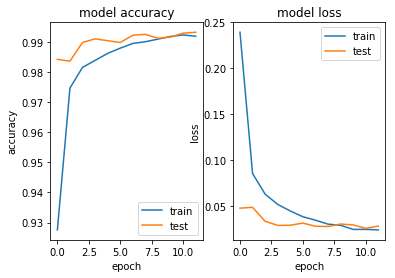

## 1. Implement OpenCV and Object Detection
     a. Capture a video
     b. Read a handwritten digit using webcam and predict the digit
     c. Face Recognition
## 2. Recurrent Neural Network and Text Classification on IMDb movie review dataset


```python
import cv2 
import numpy as np 

cap = cv2.VideoCapture(0) 

while True: 
    ret, frame= cap.read() # Forever it returns the frame and ret which is false or true 
    gray = cv2.cvtColor(frame, cv2.COLOR_BGR2GRAY) #if you want to convert the color 
    cv2.imshow('frame', frame) 
    cv2.imshow('gray', gray) # to show the gray video
    cv2.imwrite('abc.png', frame)
    if cv2.waitKey(100) & 0xFF == ord('q'): # If q is pressed stop 
        break
cap.release()
cv2.destroyAllWindows()
```

### Q1) Explain code above

VideoCapture is an object within cv2 that lets us capture a video or open a video file. The argument 0 is used to select a camera to capture the video.

"while True" is a infinite loop. It does something until interrupted by specifying "break".

"cap.read()" returns a boolean and gets the frame using "frame". If the frame is read, "ret" will be true.

"cv2.cvtColor" changes colorspaces. It takes two arguments: frame and desired conversion type.

"cv2.imshow" to display the image

"cv2.waitKey(1) & 0xFF == ord('q')" quits the loop/video capture when 'q' is pressed. "cv2.waitKey(1) & 0xFF" returns 32 bit integer of the pressed key with left 24 digits set to zero by logical 'and'. ord(x) return unicode code point of x.

"cap.release()" releases all the resources that we used thus far (camera) so that we can use it again later without encountering an exception.

"cv2.destroyAllWindows()" closes all the windows that are created thus far.

### 1.2 digit Recognition

### Q2


```python
from __future__ import print_function
import tensorflow.keras
import tensorflow
from tensorflow.keras.datasets import mnist
from tensorflow.keras.models import Sequential
from tensorflow.keras.layers import Dense, Dropout, Flatten
from tensorflow.keras.layers import Conv2D, MaxPooling2D
from tensorflow.keras import backend as K
```


```python
batch_size = 128
num_classes = 10
epochs = 12


# input image dimensions
img_rows, img_cols = 28, 28

# the data, split between train and test sets
(x_train, y_train), (x_test, y_test) = mnist.load_data()

if K.image_data_format() == 'channels_first':
    x_train = x_train.reshape(x_train.shape[0], 1, img_rows, img_cols)
    x_test = x_test.reshape(x_test.shape[0], 1, img_rows, img_cols)
    input_shape = (1, img_rows, img_cols)
else:
    x_train = x_train.reshape(x_train.shape[0], img_rows, img_cols, 1)
    x_test = x_test.reshape(x_test.shape[0], img_rows, img_cols, 1)
    input_shape = (img_rows, img_cols, 1)
    
x_train = x_train.astype('float32')
x_test = x_test.astype('float32')
x_train /= 255
x_test /= 255
print('x_train shape:', x_train.shape)
print(x_train.shape[0], 'train samples')
print(x_test.shape[0], 'test samples')


# convert class vectors to binary class matrices
y_train = keras.utils.to_categorical(y_train, num_classes)
y_test = keras.utils.to_categorical(y_test, num_classes)
```

    x_train shape: (60000, 28, 28, 1)
    60000 train samples
    10000 test samples
    


```python
def baseline_model():
    model = Sequential()
    model.add(Conv2D(32, kernel_size=(3, 3),
                 activation='relu',
                 input_shape=input_shape))
    model.add(Conv2D(64, (3, 3), activation='relu'))
    model.add(MaxPooling2D(pool_size=(2, 2)))
    model.add(Dropout(0.25))
    model.add(Flatten())
    model.add(Dense(128, activation='relu'))
    model.add(Dropout(0.5))
    model.add(Dense(num_classes, activation='softmax'))
    model.compile(loss='categorical_crossentropy', optimizer='Adam', metrics=['accuracy'])
    return model
```


```python
model = baseline_model()
nn_simple = model.fit(x_train, y_train,
          batch_size=batch_size,
          epochs=epochs,
          verbose=1,
          validation_data=(x_test, y_test))
```

    Train on 60000 samples, validate on 10000 samples
    Epoch 1/12
    60000/60000 [==============================] - 163s 3ms/sample - loss: 0.2391 - accuracy: 0.9276 - val_loss: 0.0474 - val_accuracy: 0.9842
    Epoch 2/12
    60000/60000 [==============================] - 157s 3ms/sample - loss: 0.0852 - accuracy: 0.9747 - val_loss: 0.0483 - val_accuracy: 0.9836
    Epoch 3/12
    60000/60000 [==============================] - 184s 3ms/sample - loss: 0.0627 - accuracy: 0.9815 - val_loss: 0.0331 - val_accuracy: 0.9898
    Epoch 4/12
    60000/60000 [==============================] - 168s 3ms/sample - loss: 0.0515 - accuracy: 0.9839 - val_loss: 0.0286 - val_accuracy: 0.9910
    Epoch 5/12
    60000/60000 [==============================] - 191s 3ms/sample - loss: 0.0444 - accuracy: 0.9862 - val_loss: 0.0288 - val_accuracy: 0.9904
    Epoch 6/12
    60000/60000 [==============================] - 177s 3ms/sample - loss: 0.0381 - accuracy: 0.9879 - val_loss: 0.0312 - val_accuracy: 0.9898
    Epoch 7/12
    60000/60000 [==============================] - 158s 3ms/sample - loss: 0.0343 - accuracy: 0.9895 - val_loss: 0.0277 - val_accuracy: 0.9922
    Epoch 8/12
    60000/60000 [==============================] - 147s 2ms/sample - loss: 0.0300 - accuracy: 0.9901 - val_loss: 0.0274 - val_accuracy: 0.9925
    Epoch 9/12
    60000/60000 [==============================] - 174s 3ms/sample - loss: 0.0288 - accuracy: 0.9909 - val_loss: 0.0302 - val_accuracy: 0.9912
    Epoch 10/12
    60000/60000 [==============================] - 171s 3ms/sample - loss: 0.0243 - accuracy: 0.9918 - val_loss: 0.0292 - val_accuracy: 0.9916
    Epoch 11/12
    60000/60000 [==============================] - 173s 3ms/sample - loss: 0.0243 - accuracy: 0.9923 - val_loss: 0.0254 - val_accuracy: 0.9929
    Epoch 12/12
    60000/60000 [==============================] - 154s 3ms/sample - loss: 0.0237 - accuracy: 0.9919 - val_loss: 0.0279 - val_accuracy: 0.9932
    


```python
score = model.evaluate(x_test, y_test, verbose=0)
print('Test loss:', score[0])
print('Test accuracy:', score[1])
```

    Test loss: 0.027914040101089076
    Test accuracy: 0.9932
    


```python
import cv2
import numpy as np

def get_img_contour_thresh(img):
    x, y, w, h = 0, 0, 300, 300
    gray = cv2.cvtColor(img, cv2.COLOR_BGR2GRAY)
    blur = cv2.GaussianBlur(gray, (35, 35), 0)
    ret, thresh1 = cv2.threshold(blur, 70, 255, cv2.THRESH_BINARY_INV + cv2.THRESH_OTSU)
    thresh1 = thresh1[y:y + h, x:x + w]
    contours, hierarchy = cv2.findContours(thresh1, cv2.RETR_TREE, cv2.CHAIN_APPROX_SIMPLE)[-2:]
    return img, contours, thresh1

cap = cv2.VideoCapture(0)

while (cap.isOpened()):
    ret, img = cap.read()
    ret
    img, contours, thresh = get_img_contour_thresh(img)
    ans1 = ''
    if len(contours) > 0:
        contour = max(contours, key=cv2.contourArea)
        if cv2.contourArea(contour) > 2500:
            # print(predict(w_from_model,b_from_model,contour))
            x, y, w, h = cv2.boundingRect(contour)
            # newImage = thresh[y - 15:y + h + 15, x - 15:x + w +15]
            newImage = thresh[y:y + h, x:x + w]
            newImage = cv2.resize(newImage, (28, 28))
            newImage = np.array(newImage)
            newImage = newImage.flatten()
            newImage = newImage.reshape(newImage.shape[0], 1)
            newImage2 = newImage.flatten().reshape(1,28,28,1)
            newImage2 = newImage2.astype('float32')
            newImage2 /= 255
            result = model.predict(newImage2)
            ans1= np.argmax(result)
            #ans1 = Digit_Recognizer_LR.predict(w_LR, b_LR, newImage)


    x, y, w, h = 0, 0, 300, 300
    cv2.rectangle(img, (x, y), (x + w, y + h), (0, 255, 0), 2)
    cv2.putText(img, "Prediction : " + str(ans1), (10, 320),  cv2.FONT_HERSHEY_SIMPLEX, 0.7, (0, 0, 255), 2)

    cv2.imshow("Frame", img)
    cv2.imshow("Contours", thresh)
    k = cv2.waitKey(10)
    if k == 27:
        break

cap.release()
cv2.destroyAllWindows()
```


```python
def get_img_contour_thresh(img): 
    x, y, w, h = 0, 0, 300, 300 
    gray = cv2.cvtColor(img, cv2.COLOR_BGR2GRAY) 
    blur = cv2.GaussianBlur(gray, (35, 35), 0) 
    ret, thresh1 = cv2.threshold(blur, 70, 255, cv2.THRESH_BINARY_INV + cv2.THRESH_OTSU) 
    thresh1 = thresh1[y:y + h, x:x + w] 
    contours, hierarchy = cv2.findContours(thresh1, cv2.RETR_TREE, cv2.CHAIN_APPROX_SIMPLE)[-2:]
    return img, contours, thresh1
```

### 1.3 Face recognition


```python
import cv2 

face_cascade = cv2.CascadeClassifier(r'C:/Users/mitikirim/Desktop/AN/535/L3/haarcascade_frontalface_default.xml') 
eye_cascade = cv2.CascadeClassifier(r'C:/Users/mitikirim/Desktop/AN/535/L3/haarcascade_eye.xml') 

cap = cv2.VideoCapture(0) 

while True: 
    ret, img = cap.read() 
    gray = cv2.cvtColor(img, cv2.COLOR_BGR2GRAY) 
    faces = face_cascade.detectMultiScale(gray, 1.3, 5) 
    
    for (x,y,w,h) in faces: 
        cv2.rectangle(img,(x,y),(x+w,y+h),(255,0,0),2)
        roi_gray = gray[y:y+h, x:x+w]
        roi_color = img[y:y+h, x:x+w]
        eyes = eye_cascade.detectMultiScale(roi_gray)
        for (ex,ey,ew,eh) in eyes: 
            cv2.rectangle(roi_color,(ex,ey),(ex+ew,ey+eh),(0,255,0),2) 
    cv2.imshow('Lab 3 Face recognition',img)
    k = cv2.waitKey(30) & 0xff
    if k == 27: 
        break
cap.release()
cv2.destroyAllWindows()

```

### RNN and text classification


```python
import tensorflow
from tensorflow.keras.datasets import imdb
from tensorflow.keras.models import Sequential
from tensorflow.keras.layers import Dense
from tensorflow.keras.layers import LSTM
from tensorflow.keras.layers import Embedding
from tensorflow.keras.layers import Conv1D
from tensorflow.keras.layers import Conv2D
from tensorflow.keras.layers import MaxPooling1D
from tensorflow.keras.preprocessing import sequence

# fix random seed for reproducibility 
np.random.seed(7)
```


```python
top_words = 5000 
(X_train, y_train), (X_test, y_test) = imdb.load_data(num_words=top_words)
```


```python
# truncate and pad input sequences 
max_review_length = 500 
X_train = sequence.pad_sequences(X_train, maxlen=max_review_length) 
X_test = sequence.pad_sequences(X_test, maxlen=max_review_length)
```

### Q3) Word embedding

Word embedding converts words into vectors that comprises of numbers. Words that are similar to each other in context, meaning etc have vectors that are closest to each other. By converting the words or any other representations into numbers, we can build good models since most models rely on numbers/digits than words.


```python
# design model 
embedding_vecor_length = 32 
model = Sequential() 
model.add(Embedding(top_words, embedding_vecor_length, input_length=max_review_length)) 
model.add(LSTM(100)) 
model.add(Dense(1, activation='sigmoid')) 
model.compile(loss='binary_crossentropy', optimizer='adam', metrics=['accuracy']) 
print(model.summary()) 
model.fit(X_train, y_train, validation_data=(X_test, y_test), epochs=5, batch_size=64)
```

    Model: "sequential_7"
    _________________________________________________________________
    Layer (type)                 Output Shape              Param #   
    =================================================================
    embedding_3 (Embedding)      (None, 500, 32)           160000    
    _________________________________________________________________
    lstm_3 (LSTM)                (None, 100)               53200     
    _________________________________________________________________
    dense_11 (Dense)             (None, 1)                 101       
    =================================================================
    Total params: 213,301
    Trainable params: 213,301
    Non-trainable params: 0
    _________________________________________________________________
    None
    Train on 25000 samples, validate on 25000 samples
    Epoch 1/5
    25000/25000 [==============================] - 918s 37ms/sample - loss: 0.4896 - accuracy: 0.7618 - val_loss: 0.3702 - val_accuracy: 0.8397
    Epoch 2/5
    25000/25000 [==============================] - 816s 33ms/sample - loss: 0.2970 - accuracy: 0.8810 - val_loss: 0.3387 - val_accuracy: 0.8548
    Epoch 3/5
    25000/25000 [==============================] - 685s 27ms/sample - loss: 0.2563 - accuracy: 0.8992 - val_loss: 0.2972 - val_accuracy: 0.8755
    Epoch 4/5
    25000/25000 [==============================] - 656s 26ms/sample - loss: 0.2153 - accuracy: 0.9172 - val_loss: 0.3187 - val_accuracy: 0.8662
    Epoch 5/5
    25000/25000 [==============================] - 656s 26ms/sample - loss: 0.1954 - accuracy: 0.9266 - val_loss: 0.4125 - val_accuracy: 0.8562
    


    <tensorflow.python.keras.callbacks.History at 0x1fc2c48a550>


```python
scores = model.evaluate(X_test, y_test, verbose=0)
print("Accuracy: %.2f%%" % (scores[1]*100))
```

    Accuracy: 85.62%
    

### Q4) Learning curves

Here, training accuracy is lower than the validation accuracy and the training loss is higher than the validation loss. This means the model fits well on unseen data due to absence of overfitting.


```python
plt.subplot(1,2,1)
plt.plot(nn_simple.history['accuracy'])
plt.plot(nn_simple.history['val_accuracy'])
plt.title('model accuracy')
plt.ylabel('accuracy')
plt.xlabel('epoch')
plt.legend(['train', 'test'], loc='lower right')

plt.subplot(1,2,2)
plt.plot(nn_simple.history['loss'])
plt.plot(nn_simple.history['val_loss'])
plt.title('model loss')
plt.ylabel('loss')
plt.xlabel('epoch')
plt.legend(['train', 'test'], loc='upper right')

plt.show()
```





```python
max_review_length

```


    500


### Q5) Adding a dropout


```python
embedding_vecor_length = 32 
model = Sequential() 
model.add(Embedding(top_words, embedding_vecor_length, input_length=max_review_length)) 
model.add(LSTM(100))
model.add(Dropout(0.5))
model.add(Dense(1, activation='sigmoid')) 
model.compile(loss='binary_crossentropy', optimizer='adam', metrics=['accuracy']) 
print(model.summary()) 
model.fit(X_train, y_train, validation_data=(X_test, y_test), epochs=5, batch_size=128)
```

    Model: "sequential_28"
    _________________________________________________________________
    Layer (type)                 Output Shape              Param #   
    =================================================================
    embedding_21 (Embedding)     (None, 500, 32)           160000    
    _________________________________________________________________
    lstm_21 (LSTM)               (None, 100)               53200     
    _________________________________________________________________
    dropout_9 (Dropout)          (None, 100)               0         
    _________________________________________________________________
    dense_30 (Dense)             (None, 1)                 101       
    =================================================================
    Total params: 213,301
    Trainable params: 213,301
    Non-trainable params: 0
    _________________________________________________________________
    None
    Train on 25000 samples, validate on 25000 samples
    Epoch 1/5
    25000/25000 [==============================] - 493s 20ms/sample - loss: 0.4995 - accuracy: 0.7528 - val_loss: 0.3382 - val_accuracy: 0.8593
    Epoch 2/5
    25000/25000 [==============================] - 496s 20ms/sample - loss: 0.2920 - accuracy: 0.8851 - val_loss: 0.3492 - val_accuracy: 0.8546
    Epoch 3/5
    25000/25000 [==============================] - 610s 24ms/sample - loss: 0.2429 - accuracy: 0.9073 - val_loss: 0.2938 - val_accuracy: 0.8794
    Epoch 4/5
    25000/25000 [==============================] - 510s 20ms/sample - loss: 0.2210 - accuracy: 0.9182 - val_loss: 0.3158 - val_accuracy: 0.8717
    Epoch 5/5
    25000/25000 [==============================] - 505s 20ms/sample - loss: 0.2035 - accuracy: 0.9256 - val_loss: 0.3316 - val_accuracy: 0.8741
    


    <tensorflow.python.keras.callbacks.History at 0x1fc59a9db38>


```python
scores = model.evaluate(X_test, y_test, verbose=0)
print("Accuracy: %.2f%%" % (scores[1]*100))
```

    Accuracy: 87.41%
    
