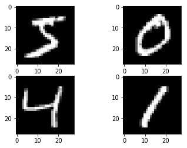
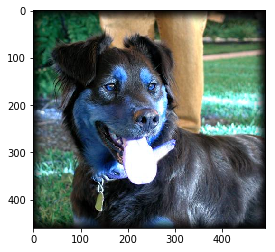
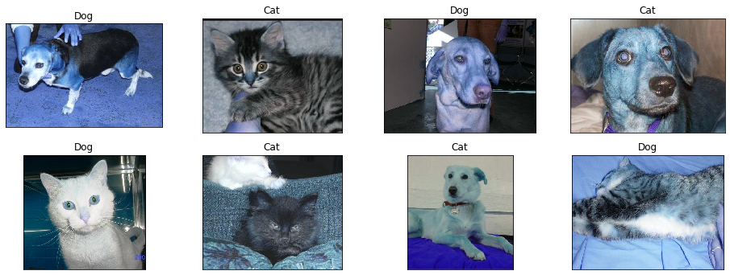
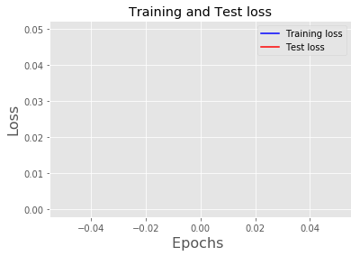
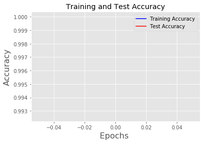
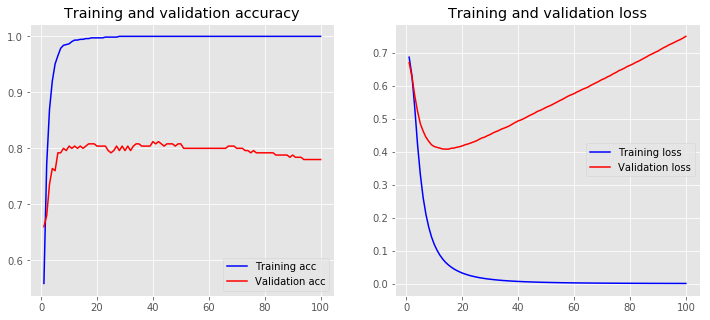
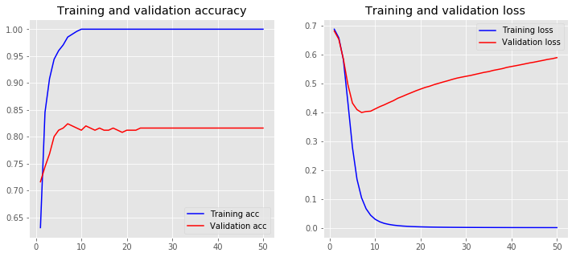

# **TensorFlow and Convolutional Neural Network**

> 1) GPU

> 2) Handwritten digits recognition using TensorFlow and CNN

> 3) Text mining using CNN: 

      3.1.   Pre-processing
      3.2.   Embedded Word
      3.3.   Model Training


**GPU using Google Colab**

_Hardware Accelerator: GPU_
_Python version: 3_


```python
from tensorflow.python.client import device_lib
print("Show System RAM Memory:\n\n")
print("\n\nShow Devices:\n\n"+str(device_lib.list_local_devices()))
```

    Show System RAM Memory:
    
    
    
    
    Show Devices:
    
    [name: "/device:CPU:0"
    device_type: "CPU"
    memory_limit: 268435456
    locality {
    }
    incarnation: 7440573163474723422
    , name: "/device:XLA_CPU:0"
    device_type: "XLA_CPU"
    memory_limit: 17179869184
    locality {
    }
    incarnation: 2058187342317199674
    physical_device_desc: "device: XLA_CPU device"
    , name: "/device:XLA_GPU:0"
    device_type: "XLA_GPU"
    memory_limit: 17179869184
    locality {
    }
    incarnation: 17869839355788304991
    physical_device_desc: "device: XLA_GPU device"
    , name: "/device:GPU:0"
    device_type: "GPU"
    memory_limit: 14912199066
    locality {
      bus_id: 1
      links {
      }
    }
    incarnation: 7561450417479076364
    physical_device_desc: "device: 0, name: Tesla T4, pci bus id: 0000:00:04.0, compute capability: 7.5"
    ]
    

## **Google drive and Colab**


```python
from google.colab import drive
drive.mount('/content/gdrive')
```

    Mounted at /content/gdrive
    

### Load the dataset


```python
from keras.preprocessing.image import ImageDataGenerator

train_datagen = ImageDataGenerator(rescale = 1./255, shear_range = 0.2, zoom_range = 0.2, horizontal_flip = True)

training_set = train_datagen.flow_from_directory('/content/gdrive/My Drive/Colab Notebooks/train/', target_size = (50, 50), batch_size = 32, class_mode = 'binary')
```

    Found 2000 images belonging to 2 classes.
    

## MNIST using CNN


```python
from __future__ import print_function
import keras
from keras.datasets import mnist
from keras.models import Sequential
from keras.layers import Dense, Dropout, Flatten, Activation
from keras.layers import Conv2D, MaxPooling2D
from keras.layers.normalization import BatchNormalization
import matplotlib.pyplot as plt
from keras.utils import np_utils
from keras.layers import Dense
from keras import optimizers
from keras import backend as K
```


```python
(X_train, y_train), (X_test, y_test) = mnist.load_data()
```

    Downloading data from https://s3.amazonaws.com/img-datasets/mnist.npz
    11493376/11490434 [==============================] - 1s 0us/step
    


```python
plt.subplot(221)
plt.imshow(X_train[0], cmap=plt.get_cmap('gray'))
plt.subplot(222)
plt.imshow(X_train[1], cmap=plt.get_cmap('gray'))
plt.subplot(223)
plt.imshow(X_train[2], cmap=plt.get_cmap('gray'))
plt.subplot(224)
plt.imshow(X_train[3], cmap=plt.get_cmap('gray'))
# show the plot
plt.show()
```





**Pre-processing**


```python
img_rows, img_cols = 28, 28

if K.image_data_format() == 'channels_first':
    X_train = X_train.reshape(X_train.shape[0], 1, img_rows, img_cols)
    X_test = X_test.reshape(X_test.shape[0], 1, img_rows, img_cols)
    input_shape = (1, img_rows, img_cols)
else:
    X_train = X_train.reshape(X_train.shape[0], img_rows, img_cols, 1)
    X_test = X_test.reshape(X_test.shape[0], img_rows, img_cols, 1)
    input_shape = (img_rows, img_cols, 1)
```


```python
num_pixels = X_train.shape[1] * X_train.shape[2]


# normalize inputs from 0-255 to 0-1
X_train = X_train/255
X_test = X_test/ 255

# one hot encode outputs
Y_test = y_test
y_train = np_utils.to_categorical(y_train)
y_test = np_utils.to_categorical(y_test)
num_classes = y_test.shape[1]
```

**Model**


```python
model = Sequential()

model.add(Conv2D(32, (3, 3), input_shape=(28,28,1)))
model.add(Activation('relu'))
BatchNormalization(axis=-1)
model.add(Conv2D(32, (3, 3)))
model.add(Activation('relu'))
model.add(MaxPooling2D(pool_size=(2,2)))

BatchNormalization(axis=-1)
model.add(Conv2D(64,(3, 3)))
model.add(Activation('relu'))
BatchNormalization(axis=-1)
model.add(Conv2D(64, (3, 3)))
model.add(Activation('relu'))
model.add(MaxPooling2D(pool_size=(2,2)))

model.add(Flatten())
# Fully connected layer

BatchNormalization()
model.add(Dense(512))
model.add(Activation('relu'))
BatchNormalization()
model.add(Dropout(0.2))
model.add(Dense(10))

model.add(Activation('softmax'))
```

    WARNING:tensorflow:From /usr/local/lib/python3.6/dist-packages/keras/backend/tensorflow_backend.py:66: The name tf.get_default_graph is deprecated. Please use tf.compat.v1.get_default_graph instead.
    
    WARNING:tensorflow:From /usr/local/lib/python3.6/dist-packages/keras/backend/tensorflow_backend.py:541: The name tf.placeholder is deprecated. Please use tf.compat.v1.placeholder instead.
    
    WARNING:tensorflow:From /usr/local/lib/python3.6/dist-packages/keras/backend/tensorflow_backend.py:4432: The name tf.random_uniform is deprecated. Please use tf.random.uniform instead.
    
    WARNING:tensorflow:From /usr/local/lib/python3.6/dist-packages/keras/backend/tensorflow_backend.py:4267: The name tf.nn.max_pool is deprecated. Please use tf.nn.max_pool2d instead.
    
    WARNING:tensorflow:From /usr/local/lib/python3.6/dist-packages/keras/backend/tensorflow_backend.py:148: The name tf.placeholder_with_default is deprecated. Please use tf.compat.v1.placeholder_with_default instead.
    
    WARNING:tensorflow:From /usr/local/lib/python3.6/dist-packages/keras/backend/tensorflow_backend.py:3733: calling dropout (from tensorflow.python.ops.nn_ops) with keep_prob is deprecated and will be removed in a future version.
    Instructions for updating:
    Please use `rate` instead of `keep_prob`. Rate should be set to `rate = 1 - keep_prob`.
    

**Loss and Accuracy**


```python
model.compile(loss='categorical_crossentropy', optimizer='adam',  metrics=['accuracy'])
model.fit(X_train, y_train, batch_size=128, epochs=10, validation_data=(X_test, y_test))
score = model.evaluate(X_test, y_test)

print('Test loss:', score[0])
print('Test accuracy:', score[1])
```

    WARNING:tensorflow:From /usr/local/lib/python3.6/dist-packages/keras/optimizers.py:793: The name tf.train.Optimizer is deprecated. Please use tf.compat.v1.train.Optimizer instead.
    
    WARNING:tensorflow:From /usr/local/lib/python3.6/dist-packages/keras/backend/tensorflow_backend.py:3576: The name tf.log is deprecated. Please use tf.math.log instead.
    
    WARNING:tensorflow:From /usr/local/lib/python3.6/dist-packages/tensorflow/python/ops/math_grad.py:1250: add_dispatch_support.<locals>.wrapper (from tensorflow.python.ops.array_ops) is deprecated and will be removed in a future version.
    Instructions for updating:
    Use tf.where in 2.0, which has the same broadcast rule as np.where
    Train on 60000 samples, validate on 10000 samples
    Epoch 1/10
    60000/60000 [==============================] - 11s 176us/step - loss: 0.1556 - acc: 0.9516 - val_loss: 0.0358 - val_acc: 0.9892
    Epoch 2/10
    60000/60000 [==============================] - 4s 69us/step - loss: 0.0410 - acc: 0.9872 - val_loss: 0.0265 - val_acc: 0.9906
    Epoch 3/10
    60000/60000 [==============================] - 4s 69us/step - loss: 0.0274 - acc: 0.9911 - val_loss: 0.0270 - val_acc: 0.9909
    Epoch 4/10
    60000/60000 [==============================] - 4s 68us/step - loss: 0.0213 - acc: 0.9932 - val_loss: 0.0401 - val_acc: 0.9888
    Epoch 5/10
    60000/60000 [==============================] - 4s 68us/step - loss: 0.0180 - acc: 0.9941 - val_loss: 0.0244 - val_acc: 0.9923
    Epoch 6/10
    60000/60000 [==============================] - 4s 69us/step - loss: 0.0147 - acc: 0.9954 - val_loss: 0.0191 - val_acc: 0.9941
    Epoch 7/10
    60000/60000 [==============================] - 4s 69us/step - loss: 0.0115 - acc: 0.9963 - val_loss: 0.0290 - val_acc: 0.9910
    Epoch 8/10
    60000/60000 [==============================] - 4s 68us/step - loss: 0.0110 - acc: 0.9966 - val_loss: 0.0208 - val_acc: 0.9932
    Epoch 9/10
    60000/60000 [==============================] - 4s 69us/step - loss: 0.0092 - acc: 0.9971 - val_loss: 0.0257 - val_acc: 0.9918
    Epoch 10/10
    60000/60000 [==============================] - 4s 68us/step - loss: 0.0088 - acc: 0.9973 - val_loss: 0.0221 - val_acc: 0.9943
    10000/10000 [==============================] - 1s 52us/step
    Test loss: 0.02211478928317847
    Test accuracy: 0.9943
    

## Cat Dog Classification using CNN


```python
from keras.preprocessing.image import ImageDataGenerator

train_datagen = ImageDataGenerator(rescale = 1./255, shear_range = 0.2, zoom_range = 0.2, horizontal_flip = True)
test_datagen = ImageDataGenerator(rescale = 1./255)

training_set = train_datagen.flow_from_directory('/content/gdrive/My Drive/Colab Notebooks/train/', target_size = (50, 50), 
                                                 batch_size = 32, class_mode = 'binary')
test_set = test_datagen.flow_from_directory('/content/gdrive/My Drive/Colab Notebooks/test/', target_size = (50, 50),
                                            batch_size = 32, class_mode = 'binary')
```

    Found 2000 images belonging to 2 classes.
    Found 152 images belonging to 2 classes.
    

### Building the model


```python
model = Sequential()

# Convolution
model.add(Conv2D(32, (3, 3), input_shape = (50, 50, 3), activation = 'relu'))

# Pooling
model.add(MaxPooling2D(pool_size = (2, 2)))

# Second convolutional layer
model.add(Conv2D(32, (3, 3), activation = 'relu'))
model.add(MaxPooling2D(pool_size = (2, 2)))

# Flattening
model.add(Flatten())

# Full connection
model.add(Dense(units = 128, activation = 'relu'))
model.add(Dense(units = 1, activation = 'sigmoid'))

# Compiling the CNN
model.compile(optimizer = 'adam', loss = 'binary_crossentropy', metrics = ['accuracy'])
```

### Training the model


```python
model.fit_generator(training_set,  steps_per_epoch = 8000,  epochs = 25,  validation_steps = 2000)
```

    Epoch 1/25
    8000/8000 [==============================] - 1722s 215ms/step - loss: 0.1591 - acc: 0.9289
    Epoch 2/25
    8000/8000 [==============================] - 949s 119ms/step - loss: 0.0163 - acc: 0.9946
    Epoch 3/25
    8000/8000 [==============================] - 948s 119ms/step - loss: 0.0120 - acc: 0.9961
    Epoch 4/25
    8000/8000 [==============================] - 950s 119ms/step - loss: 0.0083 - acc: 0.9975
    Epoch 5/25
    8000/8000 [==============================] - 924s 115ms/step - loss: 0.0081 - acc: 0.9976
    Epoch 6/25
    8000/8000 [==============================] - 926s 116ms/step - loss: 0.0071 - acc: 0.9979
    Epoch 7/25
    8000/8000 [==============================] - 928s 116ms/step - loss: 0.0061 - acc: 0.9982
    Epoch 8/25
    8000/8000 [==============================] - 923s 115ms/step - loss: 0.0060 - acc: 0.9985
    Epoch 9/25
    8000/8000 [==============================] - 910s 114ms/step - loss: 0.0047 - acc: 0.9988
    Epoch 10/25
    8000/8000 [==============================] - 903s 113ms/step - loss: 0.0048 - acc: 0.9987
    Epoch 11/25
    8000/8000 [==============================] - 894s 112ms/step - loss: 0.0053 - acc: 0.9988
    Epoch 12/25
    8000/8000 [==============================] - 895s 112ms/step - loss: 0.0041 - acc: 0.9989
    Epoch 13/25
    8000/8000 [==============================] - 897s 112ms/step - loss: 0.0038 - acc: 0.9991
    Epoch 14/25
    8000/8000 [==============================] - 896s 112ms/step - loss: 0.0046 - acc: 0.9989
    Epoch 15/25
    5627/8000 [====================>.........] - ETA: 4:25 - loss: 0.0038 - acc: 0.9991


    ---------------------------------------------------------------------------

    KeyboardInterrupt                         Traceback (most recent call last)

    <ipython-input-17-b506aabe235a> in <module>()
    ----> 1 model.fit_generator(training_set,  steps_per_epoch = 8000,  epochs = 25,  validation_steps = 2000)
    

    /usr/local/lib/python3.6/dist-packages/keras/legacy/interfaces.py in wrapper(*args, **kwargs)
         89                 warnings.warn('Update your `' + object_name + '` call to the ' +
         90                               'Keras 2 API: ' + signature, stacklevel=2)
    ---> 91             return func(*args, **kwargs)
         92         wrapper._original_function = func
         93         return wrapper
    

    /usr/local/lib/python3.6/dist-packages/keras/engine/training.py in fit_generator(self, generator, steps_per_epoch, epochs, verbose, callbacks, validation_data, validation_steps, validation_freq, class_weight, max_queue_size, workers, use_multiprocessing, shuffle, initial_epoch)
       1656             use_multiprocessing=use_multiprocessing,
       1657             shuffle=shuffle,
    -> 1658             initial_epoch=initial_epoch)
       1659 
       1660     @interfaces.legacy_generator_methods_support
    

    /usr/local/lib/python3.6/dist-packages/keras/engine/training_generator.py in fit_generator(model, generator, steps_per_epoch, epochs, verbose, callbacks, validation_data, validation_steps, validation_freq, class_weight, max_queue_size, workers, use_multiprocessing, shuffle, initial_epoch)
        179             batch_index = 0
        180             while steps_done < steps_per_epoch:
    --> 181                 generator_output = next(output_generator)
        182 
        183                 if not hasattr(generator_output, '__len__'):
    

    /usr/local/lib/python3.6/dist-packages/keras/utils/data_utils.py in get(self)
        601                 try:
        602                     future = self.queue.get(block=True)
    --> 603                     inputs = future.get(timeout=30)
        604                     self.queue.task_done()
        605                 except mp.TimeoutError:
    

    /usr/lib/python3.6/multiprocessing/pool.py in get(self, timeout)
        636 
        637     def get(self, timeout=None):
    --> 638         self.wait(timeout)
        639         if not self.ready():
        640             raise TimeoutError
    

    /usr/lib/python3.6/multiprocessing/pool.py in wait(self, timeout)
        633 
        634     def wait(self, timeout=None):
    --> 635         self._event.wait(timeout)
        636 
        637     def get(self, timeout=None):
    

    /usr/lib/python3.6/threading.py in wait(self, timeout)
        549             signaled = self._flag
        550             if not signaled:
    --> 551                 signaled = self._cond.wait(timeout)
        552             return signaled
        553 
    

    /usr/lib/python3.6/threading.py in wait(self, timeout)
        297             else:
        298                 if timeout > 0:
    --> 299                     gotit = waiter.acquire(True, timeout)
        300                 else:
        301                     gotit = waiter.acquire(False)
    

    KeyboardInterrupt: 


### Testing the model


```python
import cv2
# 1 is dog and 0 is cat
img = cv2.imread('/content/gdrive/My Drive/Colab Notebooks/test/190.jpg')
plt.imshow(img) 
plt.show()  # display it
img = cv2.resize(img,(50,50))
img = img.reshape(1,50,50,3)
if (model.predict(img).item()):
  print ("This is a dog")
else:
  print ("This is a cat")
```





    This is a dog
    


```python
fig=plt.figure(figsize=(16, 12))
num=0

for i in range(201,209):
    y = fig.add_subplot(4, 4, num+1)
    img = cv2.imread('/content/gdrive/My Drive/Colab Notebooks/test/'+str(i)+".jpg")
    y.imshow(img) 
    #plt.show()  # display it
    img = cv2.resize(img,(50,50))
    img = img.reshape(1,50,50,3)
    if (model.predict(img).item()):
      pred = "Dog"
    else:
      pred = "Cat"
    
    plt.title(pred)
    y.axes.get_xaxis().set_visible(False)
    y.axes.get_yaxis().set_visible(False)
    num = num+1
    
  
    
plt.show()
```





**Q1) The speed is certainly faster with the use of GPU compared to CPU**

## GPU vs CPU

**Run time on CPU for the following code: 2151.60 seconds**

**Run time using GPU: 61.25 seconds**


```python
import time
start = time.time()
!python3 '/content/gdrive/My Drive/Colab Notebooks/mnist_cnn.py'
end = time.time()
print('\n')
print(str(end - start) + 'seconds')
```

    Using TensorFlow backend.
    x_train shape: (60000, 28, 28, 1)
    60000 train samples
    10000 test samples
    WARNING:tensorflow:From /usr/local/lib/python3.6/dist-packages/keras/backend/tensorflow_backend.py:66: The name tf.get_default_graph is deprecated. Please use tf.compat.v1.get_default_graph instead.
    
    WARNING:tensorflow:From /usr/local/lib/python3.6/dist-packages/keras/backend/tensorflow_backend.py:541: The name tf.placeholder is deprecated. Please use tf.compat.v1.placeholder instead.
    
    WARNING:tensorflow:From /usr/local/lib/python3.6/dist-packages/keras/backend/tensorflow_backend.py:4432: The name tf.random_uniform is deprecated. Please use tf.random.uniform instead.
    
    WARNING:tensorflow:From /usr/local/lib/python3.6/dist-packages/keras/backend/tensorflow_backend.py:4267: The name tf.nn.max_pool is deprecated. Please use tf.nn.max_pool2d instead.
    
    WARNING:tensorflow:From /usr/local/lib/python3.6/dist-packages/keras/backend/tensorflow_backend.py:148: The name tf.placeholder_with_default is deprecated. Please use tf.compat.v1.placeholder_with_default instead.
    
    WARNING:tensorflow:From /usr/local/lib/python3.6/dist-packages/keras/backend/tensorflow_backend.py:3733: calling dropout (from tensorflow.python.ops.nn_ops) with keep_prob is deprecated and will be removed in a future version.
    Instructions for updating:
    Please use `rate` instead of `keep_prob`. Rate should be set to `rate = 1 - keep_prob`.
    WARNING:tensorflow:From /usr/local/lib/python3.6/dist-packages/keras/optimizers.py:793: The name tf.train.Optimizer is deprecated. Please use tf.compat.v1.train.Optimizer instead.
    
    WARNING:tensorflow:From /usr/local/lib/python3.6/dist-packages/keras/backend/tensorflow_backend.py:3576: The name tf.log is deprecated. Please use tf.math.log instead.
    
    WARNING:tensorflow:From /usr/local/lib/python3.6/dist-packages/tensorflow/python/ops/math_grad.py:1250: add_dispatch_support.<locals>.wrapper (from tensorflow.python.ops.array_ops) is deprecated and will be removed in a future version.
    Instructions for updating:
    Use tf.where in 2.0, which has the same broadcast rule as np.where
    Train on 60000 samples, validate on 10000 samples
    Epoch 1/12
    2019-09-23 02:37:05.423551: I tensorflow/core/platform/cpu_feature_guard.cc:142] Your CPU supports instructions that this TensorFlow binary was not compiled to use: AVX512F
    2019-09-23 02:37:05.427456: I tensorflow/core/platform/profile_utils/cpu_utils.cc:94] CPU Frequency: 2000155000 Hz
    2019-09-23 02:37:05.427757: I tensorflow/compiler/xla/service/service.cc:168] XLA service 0x1a8f2c0 executing computations on platform Host. Devices:
    2019-09-23 02:37:05.427786: I tensorflow/compiler/xla/service/service.cc:175]   StreamExecutor device (0): <undefined>, <undefined>
    2019-09-23 02:37:05.429670: I tensorflow/stream_executor/platform/default/dso_loader.cc:42] Successfully opened dynamic library libcuda.so.1
    2019-09-23 02:37:05.519535: I tensorflow/stream_executor/cuda/cuda_gpu_executor.cc:1005] successful NUMA node read from SysFS had negative value (-1), but there must be at least one NUMA node, so returning NUMA node zero
    2019-09-23 02:37:05.520259: I tensorflow/compiler/xla/service/service.cc:168] XLA service 0x84e8540 executing computations on platform CUDA. Devices:
    2019-09-23 02:37:05.520291: I tensorflow/compiler/xla/service/service.cc:175]   StreamExecutor device (0): Tesla T4, Compute Capability 7.5
    2019-09-23 02:37:05.520473: I tensorflow/stream_executor/cuda/cuda_gpu_executor.cc:1005] successful NUMA node read from SysFS had negative value (-1), but there must be at least one NUMA node, so returning NUMA node zero
    2019-09-23 02:37:05.520938: I tensorflow/core/common_runtime/gpu/gpu_device.cc:1640] Found device 0 with properties: 
    name: Tesla T4 major: 7 minor: 5 memoryClockRate(GHz): 1.59
    pciBusID: 0000:00:04.0
    2019-09-23 02:37:05.521241: I tensorflow/stream_executor/platform/default/dso_loader.cc:42] Successfully opened dynamic library libcudart.so.10.0
    2019-09-23 02:37:05.522325: I tensorflow/stream_executor/platform/default/dso_loader.cc:42] Successfully opened dynamic library libcublas.so.10.0
    2019-09-23 02:37:05.523468: I tensorflow/stream_executor/platform/default/dso_loader.cc:42] Successfully opened dynamic library libcufft.so.10.0
    2019-09-23 02:37:05.523798: I tensorflow/stream_executor/platform/default/dso_loader.cc:42] Successfully opened dynamic library libcurand.so.10.0
    2019-09-23 02:37:05.525144: I tensorflow/stream_executor/platform/default/dso_loader.cc:42] Successfully opened dynamic library libcusolver.so.10.0
    2019-09-23 02:37:05.526112: I tensorflow/stream_executor/platform/default/dso_loader.cc:42] Successfully opened dynamic library libcusparse.so.10.0
    2019-09-23 02:37:05.528806: I tensorflow/stream_executor/platform/default/dso_loader.cc:42] Successfully opened dynamic library libcudnn.so.7
    2019-09-23 02:37:05.528900: I tensorflow/stream_executor/cuda/cuda_gpu_executor.cc:1005] successful NUMA node read from SysFS had negative value (-1), but there must be at least one NUMA node, so returning NUMA node zero
    2019-09-23 02:37:05.529413: I tensorflow/stream_executor/cuda/cuda_gpu_executor.cc:1005] successful NUMA node read from SysFS had negative value (-1), but there must be at least one NUMA node, so returning NUMA node zero
    2019-09-23 02:37:05.529856: I tensorflow/core/common_runtime/gpu/gpu_device.cc:1763] Adding visible gpu devices: 0
    2019-09-23 02:37:05.529900: I tensorflow/stream_executor/platform/default/dso_loader.cc:42] Successfully opened dynamic library libcudart.so.10.0
    2019-09-23 02:37:05.530803: I tensorflow/core/common_runtime/gpu/gpu_device.cc:1181] Device interconnect StreamExecutor with strength 1 edge matrix:
    2019-09-23 02:37:05.530827: I tensorflow/core/common_runtime/gpu/gpu_device.cc:1187]      0 
    2019-09-23 02:37:05.530837: I tensorflow/core/common_runtime/gpu/gpu_device.cc:1200] 0:   N 
    2019-09-23 02:37:05.530927: I tensorflow/stream_executor/cuda/cuda_gpu_executor.cc:1005] successful NUMA node read from SysFS had negative value (-1), but there must be at least one NUMA node, so returning NUMA node zero
    2019-09-23 02:37:05.531458: I tensorflow/stream_executor/cuda/cuda_gpu_executor.cc:1005] successful NUMA node read from SysFS had negative value (-1), but there must be at least one NUMA node, so returning NUMA node zero
    2019-09-23 02:37:05.531913: W tensorflow/core/common_runtime/gpu/gpu_bfc_allocator.cc:40] Overriding allow_growth setting because the TF_FORCE_GPU_ALLOW_GROWTH environment variable is set. Original config value was 0.
    2019-09-23 02:37:05.531945: I tensorflow/core/common_runtime/gpu/gpu_device.cc:1326] Created TensorFlow device (/job:localhost/replica:0/task:0/device:GPU:0 with 13431 MB memory) -> physical GPU (device: 0, name: Tesla T4, pci bus id: 0000:00:04.0, compute capability: 7.5)
    2019-09-23 02:37:06.287354: I tensorflow/stream_executor/platform/default/dso_loader.cc:42] Successfully opened dynamic library libcublas.so.10.0
    2019-09-23 02:37:06.572655: I tensorflow/stream_executor/platform/default/dso_loader.cc:42] Successfully opened dynamic library libcudnn.so.7
    60000/60000 [==============================] - 7s 120us/step - loss: 0.2700 - acc: 0.9169 - val_loss: 0.0590 - val_acc: 0.9793
    Epoch 2/12
    60000/60000 [==============================] - 4s 74us/step - loss: 0.0894 - acc: 0.9734 - val_loss: 0.0442 - val_acc: 0.9857
    Epoch 3/12
    60000/60000 [==============================] - 4s 74us/step - loss: 0.0661 - acc: 0.9795 - val_loss: 0.0388 - val_acc: 0.9876
    Epoch 4/12
    60000/60000 [==============================] - 4s 74us/step - loss: 0.0541 - acc: 0.9835 - val_loss: 0.0306 - val_acc: 0.9895
    Epoch 5/12
    60000/60000 [==============================] - 4s 73us/step - loss: 0.0452 - acc: 0.9868 - val_loss: 0.0302 - val_acc: 0.9904
    Epoch 6/12
    60000/60000 [==============================] - 4s 73us/step - loss: 0.0420 - acc: 0.9872 - val_loss: 0.0261 - val_acc: 0.9919
    Epoch 7/12
    60000/60000 [==============================] - 4s 74us/step - loss: 0.0383 - acc: 0.9879 - val_loss: 0.0278 - val_acc: 0.9908
    Epoch 8/12
    60000/60000 [==============================] - 4s 73us/step - loss: 0.0331 - acc: 0.9901 - val_loss: 0.0276 - val_acc: 0.9922
    Epoch 9/12
    60000/60000 [==============================] - 4s 73us/step - loss: 0.0317 - acc: 0.9898 - val_loss: 0.0292 - val_acc: 0.9910
    Epoch 10/12
    60000/60000 [==============================] - 4s 73us/step - loss: 0.0280 - acc: 0.9914 - val_loss: 0.0250 - val_acc: 0.9921
    Epoch 11/12
    60000/60000 [==============================] - 4s 72us/step - loss: 0.0273 - acc: 0.9915 - val_loss: 0.0265 - val_acc: 0.9906
    Epoch 12/12
    60000/60000 [==============================] - 4s 73us/step - loss: 0.0252 - acc: 0.9926 - val_loss: 0.0270 - val_acc: 0.9912
    Test loss: 0.026984220345905852
    Test accuracy: 0.9912
    
    
    61.25383901596069seconds
    

## MIST in TensorFlow using CNN


```python
import tensorflow as tf 
from tensorflow.examples.tutorials.mnist import input_data 

mnist = input_data.read_data_sets("/tmp/data/", one_hot = True) 
batch_size = 128 
import matplotlib.pyplot as plt 
import random as ran 
import numpy as np 
# Functions that can define the size of train and test sets 
train_X = mnist.train.images.reshape(-1, 28, 28, 1) 
test_X = mnist.test.images.reshape(-1,28,28,1)

train_y = mnist.train.labels
test_y = mnist.test.labels

x = tf.placeholder("float", [None, 28,28,1]) 
y = tf.placeholder("float", [None, 10])
```

    WARNING:tensorflow:From <ipython-input-33-8bb997f54151>:4: read_data_sets (from tensorflow.contrib.learn.python.learn.datasets.mnist) is deprecated and will be removed in a future version.
    Instructions for updating:
    Please use alternatives such as official/mnist/dataset.py from tensorflow/models.
    WARNING:tensorflow:From /usr/local/lib/python3.6/dist-packages/tensorflow/contrib/learn/python/learn/datasets/mnist.py:260: maybe_download (from tensorflow.contrib.learn.python.learn.datasets.base) is deprecated and will be removed in a future version.
    Instructions for updating:
    Please write your own downloading logic.
    WARNING:tensorflow:From /usr/local/lib/python3.6/dist-packages/tensorflow/contrib/learn/python/learn/datasets/base.py:252: _internal_retry.<locals>.wrap.<locals>.wrapped_fn (from tensorflow.contrib.learn.python.learn.datasets.base) is deprecated and will be removed in a future version.
    Instructions for updating:
    Please use urllib or similar directly.
    Successfully downloaded train-images-idx3-ubyte.gz 9912422 bytes.
    WARNING:tensorflow:From /usr/local/lib/python3.6/dist-packages/tensorflow/contrib/learn/python/learn/datasets/mnist.py:262: extract_images (from tensorflow.contrib.learn.python.learn.datasets.mnist) is deprecated and will be removed in a future version.
    Instructions for updating:
    Please use tf.data to implement this functionality.
    Extracting /tmp/data/train-images-idx3-ubyte.gz
    Successfully downloaded train-labels-idx1-ubyte.gz 28881 bytes.
    WARNING:tensorflow:From /usr/local/lib/python3.6/dist-packages/tensorflow/contrib/learn/python/learn/datasets/mnist.py:267: extract_labels (from tensorflow.contrib.learn.python.learn.datasets.mnist) is deprecated and will be removed in a future version.
    Instructions for updating:
    Please use tf.data to implement this functionality.
    Extracting /tmp/data/train-labels-idx1-ubyte.gz
    WARNING:tensorflow:From /usr/local/lib/python3.6/dist-packages/tensorflow/contrib/learn/python/learn/datasets/mnist.py:110: dense_to_one_hot (from tensorflow.contrib.learn.python.learn.datasets.mnist) is deprecated and will be removed in a future version.
    Instructions for updating:
    Please use tf.one_hot on tensors.
    Successfully downloaded t10k-images-idx3-ubyte.gz 1648877 bytes.
    Extracting /tmp/data/t10k-images-idx3-ubyte.gz
    Successfully downloaded t10k-labels-idx1-ubyte.gz 4542 bytes.
    Extracting /tmp/data/t10k-labels-idx1-ubyte.gz
    WARNING:tensorflow:From /usr/local/lib/python3.6/dist-packages/tensorflow/contrib/learn/python/learn/datasets/mnist.py:290: DataSet.__init__ (from tensorflow.contrib.learn.python.learn.datasets.mnist) is deprecated and will be removed in a future version.
    Instructions for updating:
    Please use alternatives such as official/mnist/dataset.py from tensorflow/models.
    


```python
def conv2d(x, W, b, strides=1): 
  # Conv2D wrapper, with bias and relu activation 
  x = tf.nn.conv2d(x, W, strides=[1, strides, strides, 1], padding='SAME') 
  x = tf.nn.bias_add(x, b)
  return tf.nn.relu(x) 
 
def maxpool2d(x, k=2): 
  return tf.nn.max_pool(x, ksize=[1, k, k, 1], strides=[1, k, k, 1],padding='SAME')
```


```python
weights = { 
      'wc1': tf.get_variable('W0', shape=(3,3,1,32), initializer=tf.contrib.layers.xavier_initializer()), 
      'wc2': tf.get_variable('W1', shape=(3,3,32,64), initializer=tf.contrib.layers.xavier_initializer()), 
      'wc3': tf.get_variable('W2', shape=(3,3,64,128), initializer=tf.contrib.layers.xavier_initializer()), 
      'wd1': tf.get_variable('W3', shape=(4*4*128,128), initializer=tf.contrib.layers.xavier_initializer()), 
      'out': tf.get_variable('W6', shape=(128,10), initializer=tf.contrib.layers.xavier_initializer()), } 

biases = { 
      'bc1': tf.get_variable('B0', shape=(32), initializer=tf.contrib.layers.xavier_initializer()), 
      'bc2': tf.get_variable('B1', shape=(64), initializer=tf.contrib.layers.xavier_initializer()), 
      'bc3': tf.get_variable('B2', shape=(128), initializer=tf.contrib.layers.xavier_initializer()), 
      'bd1': tf.get_variable('B3', shape=(128), initializer=tf.contrib.layers.xavier_initializer()), 
      'out': tf.get_variable('B4', shape=(10), initializer=tf.contrib.layers.xavier_initializer()), }
```


```python
def conv_net(x, weights, biases): 
  # here we call the conv2d function we had defined above and pass the input image x, weights wc1 and bias bc1. 
  conv1 = conv2d(x, weights['wc1'], biases['bc1']) 
  # Max Pooling (down-sampling), this chooses the max value from a 2*2 matrix window and outputs a 14*14 matrix. 
  conv1 = maxpool2d(conv1, k=2) 
  # Convolution Layer 
  # here we call the conv2d function we had defined above and pass the input image x, weights wc2 and bias bc2. 
  conv2 = conv2d(conv1, weights['wc2'], biases['bc2']) 
  # Max Pooling (down-sampling), this chooses the max value from a 2*2 matrix window and outputs a 7*7 matrix. 
  conv2 = maxpool2d(conv2, k=2) 
  
  conv3 = conv2d(conv2, weights['wc3'], biases['bc3'])
  
  # Max Pooling (down-sampling), this chooses the max value from a 2*2 matrix window and outputs a 4*4. 
  conv3 = maxpool2d(conv3, k=2) 
  # Fully connected layer 
  # Reshape conv2 output to fit fully connected layer input 
  fc1 = tf.reshape(conv3, [-1, weights['wd1'].get_shape().as_list()[0]]) 
  fc1 = tf.add(tf.matmul(fc1, weights['wd1']), biases['bd1']) 
  fc1 = tf.nn.relu(fc1) 
  # Output, class prediction 
  # finally we multiply the fully connected layer with the weights and add a bias term. 
  out = tf.add(tf.matmul(fc1, weights['out']), biases['out']) 
  return out

```


```python
learning_rate = 0.001 

pred = conv_net(x, weights, biases) 

cost = tf.reduce_mean(tf.nn.softmax_cross_entropy_with_logits(logits=pred, labels=y)) 

optimizer = tf.train.AdamOptimizer(learning_rate=learning_rate).minimize(cost) 

#Here you check whether the index of the maximum value of the predicted image is equal to the actual labelled image. and both will be a column vector. 
correct_prediction = tf.equal(tf.argmax(pred, 1), tf.argmax(y, 1)) 
#calculate accuracy across all the given images and average them out. 
accuracy = tf.reduce_mean(tf.cast(correct_prediction, tf.float32))


init = tf.global_variables_initializer() 
epochs = 50 
with tf.Session() as sess: 
  sess.run(init) 
  train_loss = [] 
  test_loss = [] 
  train_accuracy = [] 
  test_accuracy = [] 
  summary_writer = tf.summary.FileWriter('./Output', sess.graph)
  
  for i in range(epochs): 
    for batch in range(len(train_X)//batch_size): 
      batch_x = train_X[batch*batch_size:min((batch+1)*batch_size,len(train_X))] 
      batch_y = train_y[batch*batch_size:min((batch+1)*batch_size,len(train_y))] 
      # Run optimization op (backprop). 
      # Calculate batch loss and accuracy 
      opt = sess.run(optimizer, feed_dict={x: batch_x, y: batch_y}) 
      loss, acc = sess.run([cost, accuracy], feed_dict={x: batch_x, y: batch_y}) 
      print("Iter " + str(i) + ", Loss= " + "{:.6f}".format(loss) + ", Training Accuracy= " + "{:.5f}".format(acc))
  print("Optimization Finished!") 
  # Calculate accuracy for all 10000 mnist test images 
  test_acc,valid_loss = sess.run([accuracy,cost], feed_dict={x: test_X,y : test_y}) 
  train_loss.append(loss) 
  test_loss.append(valid_loss) 
  train_accuracy.append(acc) 
  test_accuracy.append(test_acc) 
  print("Testing Accuracy:","{:.5f}".format(test_acc))
  summary_writer.close()
```

    Iter 0, Loss= 2.287428, Training Accuracy= 0.10938
    Iter 0, Loss= 2.286336, Training Accuracy= 0.12500
    Iter 0, Loss= 2.265810, Training Accuracy= 0.14844
    Iter 0, Loss= 2.264065, Training Accuracy= 0.10938
    Iter 0, Loss= 2.254582, Training Accuracy= 0.14062
    Iter 0, Loss= 2.227091, Training Accuracy= 0.27344
    Iter 0, Loss= 2.222953, Training Accuracy= 0.33594
    Iter 0, Loss= 2.188220, Training Accuracy= 0.50000
    Iter 0, Loss= 2.129883, Training Accuracy= 0.49219
    Iter 0, Loss= 2.147435, Training Accuracy= 0.43750
    Iter 0, Loss= 2.103298, Training Accuracy= 0.45312
    Iter 0, Loss= 2.034709, Training Accuracy= 0.55469
    Iter 0, Loss= 1.944859, Training Accuracy= 0.57812
    Iter 0, Loss= 1.914445, Training Accuracy= 0.52344
    Iter 0, Loss= 1.926565, Training Accuracy= 0.41406
    Iter 0, Loss= 1.737256, Training Accuracy= 0.50000
    Iter 0, Loss= 1.733726, Training Accuracy= 0.50000
    Iter 0, Loss= 1.689015, Training Accuracy= 0.57812
    Iter 0, Loss= 1.606390, Training Accuracy= 0.70312
    Iter 0, Loss= 1.480295, Training Accuracy= 0.67969
    Iter 0, Loss= 1.339879, Training Accuracy= 0.74219
    Iter 0, Loss= 1.337364, Training Accuracy= 0.65625
    Iter 0, Loss= 1.083211, Training Accuracy= 0.67969
    Iter 0, Loss= 1.046401, Training Accuracy= 0.68750
    Iter 0, Loss= 0.930449, Training Accuracy= 0.78125
    Iter 0, Loss= 1.028060, Training Accuracy= 0.70312
    Iter 0, Loss= 0.951572, Training Accuracy= 0.70312
    Iter 0, Loss= 0.659085, Training Accuracy= 0.80469
    Iter 0, Loss= 0.824780, Training Accuracy= 0.74219
    Iter 0, Loss= 0.872634, Training Accuracy= 0.71875
    Iter 0, Loss= 0.853230, Training Accuracy= 0.71875
    Iter 0, Loss= 0.513081, Training Accuracy= 0.84375
    Iter 0, Loss= 0.713980, Training Accuracy= 0.75000
    Iter 0, Loss= 0.681226, Training Accuracy= 0.78906
    Iter 0, Loss= 0.744593, Training Accuracy= 0.81250
    Iter 0, Loss= 0.670803, Training Accuracy= 0.77344
    Iter 0, Loss= 0.468934, Training Accuracy= 0.83594
    Iter 0, Loss= 0.704918, Training Accuracy= 0.78906
    Iter 0, Loss= 0.485339, Training Accuracy= 0.84375
    Iter 0, Loss= 0.636580, Training Accuracy= 0.82031
    Iter 0, Loss= 0.579638, Training Accuracy= 0.82812
    Iter 0, Loss= 0.476427, Training Accuracy= 0.83594
    Iter 0, Loss= 0.742559, Training Accuracy= 0.69531
    Iter 0, Loss= 0.531378, Training Accuracy= 0.75781
    Iter 0, Loss= 0.524723, Training Accuracy= 0.79688
    Iter 0, Loss= 0.474332, Training Accuracy= 0.83594
    Iter 0, Loss= 0.636427, Training Accuracy= 0.81250
    Iter 0, Loss= 0.526847, Training Accuracy= 0.79688
    Iter 0, Loss= 0.572563, Training Accuracy= 0.82031
    Iter 0, Loss= 0.445971, Training Accuracy= 0.85938
    Iter 0, Loss= 0.389683, Training Accuracy= 0.82812
    Iter 0, Loss= 0.651209, Training Accuracy= 0.81250
    Iter 0, Loss= 0.625197, Training Accuracy= 0.82812
    Iter 0, Loss= 0.376005, Training Accuracy= 0.89062
    Iter 0, Loss= 0.371101, Training Accuracy= 0.89844
    Iter 0, Loss= 0.375511, Training Accuracy= 0.87500
    Iter 0, Loss= 0.442362, Training Accuracy= 0.86719
    Iter 0, Loss= 0.455497, Training Accuracy= 0.89062
    Iter 0, Loss= 0.510436, Training Accuracy= 0.82812
    Iter 0, Loss= 0.634015, Training Accuracy= 0.82812
    Iter 0, Loss= 0.392603, Training Accuracy= 0.89062
    Iter 0, Loss= 0.382270, Training Accuracy= 0.88281
    Iter 0, Loss= 0.568051, Training Accuracy= 0.81250
    Iter 0, Loss= 0.555577, Training Accuracy= 0.82031
    Iter 0, Loss= 0.238043, Training Accuracy= 0.93750
    Iter 0, Loss= 0.328409, Training Accuracy= 0.89844
    Iter 0, Loss= 0.312578, Training Accuracy= 0.92969
    Iter 0, Loss= 0.318547, Training Accuracy= 0.89844
    Iter 0, Loss= 0.471797, Training Accuracy= 0.85938
    Iter 0, Loss= 0.339103, Training Accuracy= 0.89844
    Iter 0, Loss= 0.446214, Training Accuracy= 0.87500
    Iter 0, Loss= 0.366636, Training Accuracy= 0.87500
    Iter 0, Loss= 0.429019, Training Accuracy= 0.83594
    Iter 0, Loss= 0.356788, Training Accuracy= 0.87500
    Iter 0, Loss= 0.359365, Training Accuracy= 0.88281
    Iter 0, Loss= 0.553995, Training Accuracy= 0.82031
    Iter 0, Loss= 0.590412, Training Accuracy= 0.82812
    Iter 0, Loss= 0.290035, Training Accuracy= 0.89844
    Iter 0, Loss= 0.273586, Training Accuracy= 0.92188
    Iter 0, Loss= 0.353389, Training Accuracy= 0.89844
    Iter 0, Loss= 0.288530, Training Accuracy= 0.92188
    Iter 0, Loss= 0.250745, Training Accuracy= 0.92188
    Iter 0, Loss= 0.237276, Training Accuracy= 0.92188
    Iter 0, Loss= 0.306011, Training Accuracy= 0.89062
    Iter 0, Loss= 0.337676, Training Accuracy= 0.88281
    Iter 0, Loss= 0.349606, Training Accuracy= 0.89844
    Iter 0, Loss= 0.322352, Training Accuracy= 0.89844
    Iter 0, Loss= 0.229491, Training Accuracy= 0.92188
    Iter 0, Loss= 0.201810, Training Accuracy= 0.93750
    Iter 0, Loss= 0.177500, Training Accuracy= 0.95312
    Iter 0, Loss= 0.242824, Training Accuracy= 0.96094
    Iter 0, Loss= 0.286357, Training Accuracy= 0.89844
    Iter 0, Loss= 0.219642, Training Accuracy= 0.94531
    Iter 0, Loss= 0.225487, Training Accuracy= 0.92188
    Iter 0, Loss= 0.221705, Training Accuracy= 0.92969
    Iter 0, Loss= 0.279717, Training Accuracy= 0.90625
    Iter 0, Loss= 0.190650, Training Accuracy= 0.92188
    Iter 0, Loss= 0.290774, Training Accuracy= 0.90625
    Iter 0, Loss= 0.220718, Training Accuracy= 0.95312
    Iter 0, Loss= 0.292077, Training Accuracy= 0.90625
    Iter 0, Loss= 0.213752, Training Accuracy= 0.92188
    Iter 0, Loss= 0.213935, Training Accuracy= 0.93750
    Iter 0, Loss= 0.156474, Training Accuracy= 0.96875
    Iter 0, Loss= 0.152079, Training Accuracy= 0.94531
    Iter 0, Loss= 0.174631, Training Accuracy= 0.92969
    Iter 0, Loss= 0.197682, Training Accuracy= 0.93750
    Iter 0, Loss= 0.180261, Training Accuracy= 0.96094
    Iter 0, Loss= 0.195384, Training Accuracy= 0.93750
    Iter 0, Loss= 0.119171, Training Accuracy= 0.96094
    Iter 0, Loss= 0.137269, Training Accuracy= 0.96875
    Iter 0, Loss= 0.242127, Training Accuracy= 0.91406
    Iter 0, Loss= 0.199545, Training Accuracy= 0.96094
    Iter 0, Loss= 0.172359, Training Accuracy= 0.92188
    Iter 0, Loss= 0.181123, Training Accuracy= 0.95312
    Iter 0, Loss= 0.084387, Training Accuracy= 0.98438
    Iter 0, Loss= 0.201956, Training Accuracy= 0.94531
    Iter 0, Loss= 0.113227, Training Accuracy= 0.96875
    Iter 0, Loss= 0.210624, Training Accuracy= 0.92969
    Iter 0, Loss= 0.311483, Training Accuracy= 0.91406
    Iter 0, Loss= 0.129175, Training Accuracy= 0.97656
    Iter 0, Loss= 0.134124, Training Accuracy= 0.97656
    Iter 0, Loss= 0.244626, Training Accuracy= 0.92969
    Iter 0, Loss= 0.213299, Training Accuracy= 0.94531
    Iter 0, Loss= 0.304279, Training Accuracy= 0.91406
    Iter 0, Loss= 0.211531, Training Accuracy= 0.94531
    Iter 0, Loss= 0.171865, Training Accuracy= 0.93750
    Iter 0, Loss= 0.170331, Training Accuracy= 0.95312
    Iter 0, Loss= 0.209115, Training Accuracy= 0.94531
    Iter 0, Loss= 0.153969, Training Accuracy= 0.96094
    Iter 0, Loss= 0.190809, Training Accuracy= 0.94531
    Iter 0, Loss= 0.146340, Training Accuracy= 0.94531
    Iter 0, Loss= 0.079114, Training Accuracy= 0.96875
    Iter 0, Loss= 0.221295, Training Accuracy= 0.94531
    Iter 0, Loss= 0.208666, Training Accuracy= 0.92969
    Iter 0, Loss= 0.172386, Training Accuracy= 0.94531
    Iter 0, Loss= 0.091655, Training Accuracy= 0.97656
    Iter 0, Loss= 0.141135, Training Accuracy= 0.96875
    Iter 0, Loss= 0.236154, Training Accuracy= 0.92188
    Iter 0, Loss= 0.192773, Training Accuracy= 0.92188
    Iter 0, Loss= 0.139651, Training Accuracy= 0.93750
    Iter 0, Loss= 0.101647, Training Accuracy= 0.96875
    Iter 0, Loss= 0.222369, Training Accuracy= 0.93750
    Iter 0, Loss= 0.106194, Training Accuracy= 0.97656
    Iter 0, Loss= 0.100803, Training Accuracy= 0.96875
    Iter 0, Loss= 0.113740, Training Accuracy= 0.96875
    Iter 0, Loss= 0.147101, Training Accuracy= 0.96094
    Iter 0, Loss= 0.152909, Training Accuracy= 0.92188
    Iter 0, Loss= 0.175095, Training Accuracy= 0.95312
    Iter 0, Loss= 0.227213, Training Accuracy= 0.91406
    Iter 0, Loss= 0.130329, Training Accuracy= 0.96094
    Iter 0, Loss= 0.162585, Training Accuracy= 0.94531
    Iter 0, Loss= 0.080736, Training Accuracy= 0.98438
    Iter 0, Loss= 0.130396, Training Accuracy= 0.95312
    Iter 0, Loss= 0.196880, Training Accuracy= 0.92969
    Iter 0, Loss= 0.272548, Training Accuracy= 0.94531
    Iter 0, Loss= 0.138286, Training Accuracy= 0.96094
    Iter 0, Loss= 0.108856, Training Accuracy= 0.96094
    Iter 0, Loss= 0.155604, Training Accuracy= 0.93750
    Iter 0, Loss= 0.114550, Training Accuracy= 0.94531
    Iter 0, Loss= 0.035987, Training Accuracy= 0.99219
    Iter 0, Loss= 0.189495, Training Accuracy= 0.95312
    Iter 0, Loss= 0.150634, Training Accuracy= 0.94531
    Iter 0, Loss= 0.202729, Training Accuracy= 0.94531
    Iter 0, Loss= 0.144080, Training Accuracy= 0.95312
    Iter 0, Loss= 0.093310, Training Accuracy= 0.96875
    Iter 0, Loss= 0.067163, Training Accuracy= 0.98438
    Iter 0, Loss= 0.120895, Training Accuracy= 0.96094
    Iter 0, Loss= 0.194711, Training Accuracy= 0.95312
    Iter 0, Loss= 0.186328, Training Accuracy= 0.93750
    Iter 0, Loss= 0.266708, Training Accuracy= 0.90625
    Iter 0, Loss= 0.242849, Training Accuracy= 0.92188
    Iter 0, Loss= 0.070365, Training Accuracy= 0.97656
    Iter 0, Loss= 0.117485, Training Accuracy= 0.95312
    Iter 0, Loss= 0.163602, Training Accuracy= 0.94531
    Iter 0, Loss= 0.074353, Training Accuracy= 0.99219
    Iter 0, Loss= 0.191381, Training Accuracy= 0.95312
    Iter 0, Loss= 0.128960, Training Accuracy= 0.96875
    Iter 0, Loss= 0.087239, Training Accuracy= 0.98438
    Iter 0, Loss= 0.091171, Training Accuracy= 0.96875
    Iter 0, Loss= 0.112754, Training Accuracy= 0.95312
    Iter 0, Loss= 0.113215, Training Accuracy= 0.96875
    Iter 0, Loss= 0.077941, Training Accuracy= 0.99219
    Iter 0, Loss= 0.227233, Training Accuracy= 0.92969
    Iter 0, Loss= 0.084879, Training Accuracy= 0.98438
    Iter 0, Loss= 0.296261, Training Accuracy= 0.91406
    Iter 0, Loss= 0.191549, Training Accuracy= 0.93750
    Iter 0, Loss= 0.059065, Training Accuracy= 0.99219
    Iter 0, Loss= 0.151316, Training Accuracy= 0.94531
    Iter 0, Loss= 0.130372, Training Accuracy= 0.97656
    Iter 0, Loss= 0.125314, Training Accuracy= 0.96094
    Iter 0, Loss= 0.188022, Training Accuracy= 0.93750
    Iter 0, Loss= 0.170358, Training Accuracy= 0.96094
    Iter 0, Loss= 0.098387, Training Accuracy= 0.96875
    Iter 0, Loss= 0.145363, Training Accuracy= 0.94531
    Iter 0, Loss= 0.163058, Training Accuracy= 0.93750
    Iter 0, Loss= 0.123582, Training Accuracy= 0.95312
    Iter 0, Loss= 0.118361, Training Accuracy= 0.96094
    Iter 0, Loss= 0.085638, Training Accuracy= 0.96875
    Iter 0, Loss= 0.096484, Training Accuracy= 0.97656
    Iter 0, Loss= 0.188461, Training Accuracy= 0.94531
    Iter 0, Loss= 0.193515, Training Accuracy= 0.95312
    Iter 0, Loss= 0.118045, Training Accuracy= 0.96094
    Iter 0, Loss= 0.113229, Training Accuracy= 0.96094
    Iter 0, Loss= 0.098947, Training Accuracy= 0.97656
    Iter 0, Loss= 0.219034, Training Accuracy= 0.93750
    Iter 0, Loss= 0.222416, Training Accuracy= 0.92969
    Iter 0, Loss= 0.091557, Training Accuracy= 0.98438
    Iter 0, Loss= 0.092889, Training Accuracy= 0.98438
    Iter 0, Loss= 0.175472, Training Accuracy= 0.92969
    Iter 0, Loss= 0.114389, Training Accuracy= 0.96875
    Iter 0, Loss= 0.085724, Training Accuracy= 0.98438
    Iter 0, Loss= 0.173030, Training Accuracy= 0.93750
    Iter 0, Loss= 0.107100, Training Accuracy= 0.95312
    Iter 0, Loss= 0.154125, Training Accuracy= 0.93750
    Iter 0, Loss= 0.182504, Training Accuracy= 0.94531
    Iter 0, Loss= 0.073981, Training Accuracy= 0.98438
    Iter 0, Loss= 0.103358, Training Accuracy= 0.96094
    Iter 0, Loss= 0.214060, Training Accuracy= 0.94531
    Iter 0, Loss= 0.089640, Training Accuracy= 0.98438
    Iter 0, Loss= 0.114999, Training Accuracy= 0.96875
    Iter 0, Loss= 0.125188, Training Accuracy= 0.96094
    Iter 0, Loss= 0.110537, Training Accuracy= 0.96875
    Iter 0, Loss= 0.098667, Training Accuracy= 0.96875
    Iter 0, Loss= 0.089757, Training Accuracy= 0.98438
    Iter 0, Loss= 0.107830, Training Accuracy= 0.96875
    Iter 0, Loss= 0.036882, Training Accuracy= 1.00000
    Iter 0, Loss= 0.078881, Training Accuracy= 0.98438
    Iter 0, Loss= 0.038354, Training Accuracy= 1.00000
    Iter 0, Loss= 0.114485, Training Accuracy= 0.97656
    Iter 0, Loss= 0.179531, Training Accuracy= 0.94531
    Iter 0, Loss= 0.123450, Training Accuracy= 0.96875
    Iter 0, Loss= 0.115344, Training Accuracy= 0.94531
    Iter 0, Loss= 0.186553, Training Accuracy= 0.95312
    Iter 0, Loss= 0.221175, Training Accuracy= 0.93750
    Iter 0, Loss= 0.093422, Training Accuracy= 0.96875
    Iter 0, Loss= 0.084867, Training Accuracy= 0.96875
    Iter 0, Loss= 0.112095, Training Accuracy= 0.97656
    Iter 0, Loss= 0.053721, Training Accuracy= 0.97656
    Iter 0, Loss= 0.134254, Training Accuracy= 0.97656
    Iter 0, Loss= 0.129222, Training Accuracy= 0.97656
    Iter 0, Loss= 0.067708, Training Accuracy= 0.97656
    Iter 0, Loss= 0.142116, Training Accuracy= 0.96094
    Iter 0, Loss= 0.125461, Training Accuracy= 0.93750
    Iter 0, Loss= 0.112279, Training Accuracy= 0.96094
    Iter 0, Loss= 0.095507, Training Accuracy= 0.96875
    Iter 0, Loss= 0.108182, Training Accuracy= 0.96094
    Iter 0, Loss= 0.062460, Training Accuracy= 0.98438
    Iter 0, Loss= 0.099884, Training Accuracy= 0.98438
    Iter 0, Loss= 0.145103, Training Accuracy= 0.94531
    Iter 0, Loss= 0.062981, Training Accuracy= 0.99219
    Iter 0, Loss= 0.216996, Training Accuracy= 0.93750
    Iter 0, Loss= 0.080921, Training Accuracy= 0.96875
    Iter 0, Loss= 0.147739, Training Accuracy= 0.95312
    Iter 0, Loss= 0.169811, Training Accuracy= 0.96094
    Iter 0, Loss= 0.139191, Training Accuracy= 0.96094
    Iter 0, Loss= 0.117531, Training Accuracy= 0.94531
    Iter 0, Loss= 0.093830, Training Accuracy= 0.96094
    Iter 0, Loss= 0.074378, Training Accuracy= 0.97656
    Iter 0, Loss= 0.027689, Training Accuracy= 1.00000
    Iter 0, Loss= 0.058539, Training Accuracy= 0.99219
    Iter 0, Loss= 0.117184, Training Accuracy= 0.95312
    Iter 0, Loss= 0.081533, Training Accuracy= 0.98438
    Iter 0, Loss= 0.152112, Training Accuracy= 0.96094
    Iter 0, Loss= 0.119118, Training Accuracy= 0.96094
    Iter 0, Loss= 0.046727, Training Accuracy= 0.98438
    Iter 0, Loss= 0.086523, Training Accuracy= 0.97656
    Iter 0, Loss= 0.080873, Training Accuracy= 0.97656
    Iter 0, Loss= 0.140122, Training Accuracy= 0.96094
    Iter 0, Loss= 0.188830, Training Accuracy= 0.93750
    Iter 0, Loss= 0.081110, Training Accuracy= 0.97656
    Iter 0, Loss= 0.157535, Training Accuracy= 0.92969
    Iter 0, Loss= 0.142386, Training Accuracy= 0.94531
    Iter 0, Loss= 0.128744, Training Accuracy= 0.94531
    Iter 0, Loss= 0.077134, Training Accuracy= 0.97656
    Iter 0, Loss= 0.097370, Training Accuracy= 0.97656
    Iter 0, Loss= 0.105671, Training Accuracy= 0.97656
    Iter 0, Loss= 0.045777, Training Accuracy= 0.98438
    Iter 0, Loss= 0.105254, Training Accuracy= 0.96094
    Iter 0, Loss= 0.080986, Training Accuracy= 0.96875
    Iter 0, Loss= 0.101742, Training Accuracy= 0.97656
    Iter 0, Loss= 0.040693, Training Accuracy= 0.98438
    Iter 0, Loss= 0.114751, Training Accuracy= 0.96875
    Iter 0, Loss= 0.049571, Training Accuracy= 0.98438
    Iter 0, Loss= 0.171665, Training Accuracy= 0.93750
    Iter 0, Loss= 0.149190, Training Accuracy= 0.96094
    Iter 0, Loss= 0.124957, Training Accuracy= 0.96875
    Iter 0, Loss= 0.076385, Training Accuracy= 0.97656
    Iter 0, Loss= 0.054047, Training Accuracy= 0.99219
    Iter 0, Loss= 0.088283, Training Accuracy= 0.96875
    Iter 0, Loss= 0.153256, Training Accuracy= 0.95312
    Iter 0, Loss= 0.074877, Training Accuracy= 0.96094
    Iter 0, Loss= 0.073915, Training Accuracy= 0.98438
    Iter 0, Loss= 0.197984, Training Accuracy= 0.93750
    Iter 0, Loss= 0.136858, Training Accuracy= 0.96875
    Iter 0, Loss= 0.106241, Training Accuracy= 0.98438
    Iter 0, Loss= 0.168005, Training Accuracy= 0.95312
    Iter 0, Loss= 0.147057, Training Accuracy= 0.96875
    Iter 0, Loss= 0.082645, Training Accuracy= 0.96875
    Iter 0, Loss= 0.100958, Training Accuracy= 0.95312
    Iter 0, Loss= 0.038960, Training Accuracy= 0.97656
    Iter 0, Loss= 0.066794, Training Accuracy= 0.98438
    Iter 0, Loss= 0.128236, Training Accuracy= 0.95312
    Iter 0, Loss= 0.130400, Training Accuracy= 0.96875
    Iter 0, Loss= 0.065138, Training Accuracy= 0.97656
    Iter 0, Loss= 0.071470, Training Accuracy= 0.96875
    Iter 0, Loss= 0.129407, Training Accuracy= 0.95312
    Iter 0, Loss= 0.093868, Training Accuracy= 0.96875
    Iter 0, Loss= 0.095222, Training Accuracy= 0.98438
    Iter 0, Loss= 0.156323, Training Accuracy= 0.95312
    Iter 0, Loss= 0.059121, Training Accuracy= 0.97656
    Iter 0, Loss= 0.061667, Training Accuracy= 0.97656
    Iter 0, Loss= 0.118867, Training Accuracy= 0.94531
    Iter 0, Loss= 0.095105, Training Accuracy= 0.96875
    Iter 0, Loss= 0.087027, Training Accuracy= 0.97656
    Iter 0, Loss= 0.045413, Training Accuracy= 0.98438
    Iter 0, Loss= 0.108401, Training Accuracy= 0.94531
    Iter 0, Loss= 0.121864, Training Accuracy= 0.96094
    Iter 0, Loss= 0.086872, Training Accuracy= 0.97656
    Iter 0, Loss= 0.125512, Training Accuracy= 0.96875
    Iter 0, Loss= 0.150147, Training Accuracy= 0.95312
    Iter 0, Loss= 0.094100, Training Accuracy= 0.98438
    Iter 0, Loss= 0.108807, Training Accuracy= 0.94531
    Iter 0, Loss= 0.206443, Training Accuracy= 0.92188
    Iter 0, Loss= 0.199378, Training Accuracy= 0.94531
    Iter 0, Loss= 0.036290, Training Accuracy= 1.00000
    Iter 0, Loss= 0.080479, Training Accuracy= 0.96875
    Iter 0, Loss= 0.062392, Training Accuracy= 0.98438
    Iter 0, Loss= 0.052534, Training Accuracy= 0.98438
    Iter 0, Loss= 0.100637, Training Accuracy= 0.97656
    Iter 0, Loss= 0.102440, Training Accuracy= 0.98438
    Iter 0, Loss= 0.159360, Training Accuracy= 0.96875
    Iter 0, Loss= 0.174181, Training Accuracy= 0.94531
    Iter 0, Loss= 0.089781, Training Accuracy= 0.96875
    Iter 0, Loss= 0.080429, Training Accuracy= 0.99219
    Iter 0, Loss= 0.077144, Training Accuracy= 0.97656
    Iter 0, Loss= 0.145178, Training Accuracy= 0.96094
    Iter 0, Loss= 0.100073, Training Accuracy= 0.96875
    Iter 0, Loss= 0.049665, Training Accuracy= 0.96875
    Iter 0, Loss= 0.158195, Training Accuracy= 0.92969
    Iter 0, Loss= 0.039128, Training Accuracy= 0.98438
    Iter 0, Loss= 0.061903, Training Accuracy= 0.97656
    Iter 0, Loss= 0.062483, Training Accuracy= 0.98438
    Iter 0, Loss= 0.033759, Training Accuracy= 0.99219
    Iter 0, Loss= 0.195403, Training Accuracy= 0.91406
    Iter 0, Loss= 0.082000, Training Accuracy= 0.96875
    Iter 0, Loss= 0.115405, Training Accuracy= 0.98438
    Iter 0, Loss= 0.027565, Training Accuracy= 0.98438
    Iter 0, Loss= 0.154942, Training Accuracy= 0.94531
    Iter 0, Loss= 0.107397, Training Accuracy= 0.97656
    Iter 0, Loss= 0.048445, Training Accuracy= 0.99219
    Iter 0, Loss= 0.209166, Training Accuracy= 0.93750
    Iter 0, Loss= 0.050789, Training Accuracy= 0.96875
    Iter 0, Loss= 0.043085, Training Accuracy= 0.98438
    Iter 0, Loss= 0.148487, Training Accuracy= 0.96094
    Iter 0, Loss= 0.213108, Training Accuracy= 0.92969
    Iter 0, Loss= 0.139682, Training Accuracy= 0.97656
    Iter 0, Loss= 0.112275, Training Accuracy= 0.96875
    Iter 0, Loss= 0.174259, Training Accuracy= 0.93750
    Iter 0, Loss= 0.118266, Training Accuracy= 0.95312
    Iter 0, Loss= 0.029882, Training Accuracy= 0.99219
    Iter 0, Loss= 0.062592, Training Accuracy= 0.98438
    Iter 0, Loss= 0.155903, Training Accuracy= 0.93750
    Iter 0, Loss= 0.041541, Training Accuracy= 0.99219
    Iter 0, Loss= 0.033480, Training Accuracy= 1.00000
    Iter 0, Loss= 0.029591, Training Accuracy= 0.99219
    Iter 0, Loss= 0.053908, Training Accuracy= 0.99219
    Iter 0, Loss= 0.071471, Training Accuracy= 0.97656
    Iter 0, Loss= 0.113396, Training Accuracy= 0.96875
    Iter 0, Loss= 0.151039, Training Accuracy= 0.93750
    Iter 0, Loss= 0.067120, Training Accuracy= 0.97656
    Iter 0, Loss= 0.032195, Training Accuracy= 0.99219
    Iter 0, Loss= 0.022312, Training Accuracy= 0.99219
    Iter 0, Loss= 0.101878, Training Accuracy= 0.96094
    Iter 0, Loss= 0.088465, Training Accuracy= 0.96875
    Iter 0, Loss= 0.186424, Training Accuracy= 0.94531
    Iter 0, Loss= 0.058127, Training Accuracy= 0.98438
    Iter 0, Loss= 0.117934, Training Accuracy= 0.96094
    Iter 0, Loss= 0.017803, Training Accuracy= 0.99219
    Iter 0, Loss= 0.048780, Training Accuracy= 0.99219
    Iter 0, Loss= 0.168796, Training Accuracy= 0.96875
    Iter 0, Loss= 0.111862, Training Accuracy= 0.96094
    Iter 0, Loss= 0.091105, Training Accuracy= 0.96875
    Iter 0, Loss= 0.043248, Training Accuracy= 0.99219
    Iter 0, Loss= 0.082710, Training Accuracy= 0.97656
    Iter 0, Loss= 0.026913, Training Accuracy= 1.00000
    Iter 0, Loss= 0.065227, Training Accuracy= 0.97656
    Iter 0, Loss= 0.090804, Training Accuracy= 0.98438
    Iter 0, Loss= 0.063073, Training Accuracy= 0.98438
    Iter 0, Loss= 0.053590, Training Accuracy= 0.97656
    Iter 0, Loss= 0.067319, Training Accuracy= 0.97656
    Iter 0, Loss= 0.048960, Training Accuracy= 0.99219
    Iter 0, Loss= 0.027511, Training Accuracy= 0.98438
    Iter 0, Loss= 0.058934, Training Accuracy= 0.96875
    Iter 0, Loss= 0.071164, Training Accuracy= 0.97656
    Iter 0, Loss= 0.095469, Training Accuracy= 0.96094
    Iter 0, Loss= 0.043453, Training Accuracy= 0.97656
    Iter 0, Loss= 0.139468, Training Accuracy= 0.96094
    Iter 0, Loss= 0.068248, Training Accuracy= 0.97656
    Iter 0, Loss= 0.029984, Training Accuracy= 0.99219
    Iter 0, Loss= 0.066668, Training Accuracy= 0.98438
    Iter 0, Loss= 0.099412, Training Accuracy= 0.96094
    Iter 0, Loss= 0.098632, Training Accuracy= 0.95312
    Iter 0, Loss= 0.065524, Training Accuracy= 0.98438
    Iter 0, Loss= 0.095905, Training Accuracy= 0.95312
    Iter 0, Loss= 0.046205, Training Accuracy= 0.98438
    Iter 0, Loss= 0.050809, Training Accuracy= 0.98438
    Iter 0, Loss= 0.053601, Training Accuracy= 0.98438
    Iter 0, Loss= 0.023804, Training Accuracy= 0.99219
    Iter 0, Loss= 0.060148, Training Accuracy= 0.99219
    Iter 0, Loss= 0.024318, Training Accuracy= 1.00000
    Iter 0, Loss= 0.068635, Training Accuracy= 0.98438
    Iter 0, Loss= 0.110416, Training Accuracy= 0.96875
    Iter 0, Loss= 0.086622, Training Accuracy= 0.96875
    Iter 0, Loss= 0.013856, Training Accuracy= 1.00000
    Iter 0, Loss= 0.068691, Training Accuracy= 0.97656
    Iter 0, Loss= 0.026414, Training Accuracy= 0.98438
    Iter 0, Loss= 0.032136, Training Accuracy= 0.99219
    Iter 0, Loss= 0.056586, Training Accuracy= 0.97656
    Iter 0, Loss= 0.010042, Training Accuracy= 1.00000
    Iter 0, Loss= 0.012258, Training Accuracy= 1.00000
    Iter 0, Loss= 0.100079, Training Accuracy= 0.97656
    Iter 0, Loss= 0.008717, Training Accuracy= 0.99219
    Iter 0, Loss= 0.002487, Training Accuracy= 1.00000
    Iter 0, Loss= 0.002637, Training Accuracy= 1.00000
    Iter 0, Loss= 0.069418, Training Accuracy= 0.98438
    Iter 0, Loss= 0.029590, Training Accuracy= 0.99219
    Iter 0, Loss= 0.028944, Training Accuracy= 0.99219
    Iter 0, Loss= 0.293890, Training Accuracy= 0.93750
    Iter 0, Loss= 0.008863, Training Accuracy= 1.00000
    Iter 1, Loss= 0.102721, Training Accuracy= 0.97656
    Iter 1, Loss= 0.055348, Training Accuracy= 0.98438
    Iter 1, Loss= 0.121364, Training Accuracy= 0.96875
    Iter 1, Loss= 0.040687, Training Accuracy= 0.98438
    Iter 1, Loss= 0.099169, Training Accuracy= 0.96875
    Iter 1, Loss= 0.060860, Training Accuracy= 0.98438
    Iter 1, Loss= 0.098648, Training Accuracy= 0.96094
    Iter 1, Loss= 0.066684, Training Accuracy= 0.97656
    Iter 1, Loss= 0.088671, Training Accuracy= 0.98438
    Iter 1, Loss= 0.066352, Training Accuracy= 0.98438
    Iter 1, Loss= 0.042494, Training Accuracy= 0.99219
    Iter 1, Loss= 0.066707, Training Accuracy= 0.98438
    Iter 1, Loss= 0.047619, Training Accuracy= 0.97656
    Iter 1, Loss= 0.047425, Training Accuracy= 0.97656
    Iter 1, Loss= 0.143148, Training Accuracy= 0.95312
    Iter 1, Loss= 0.101873, Training Accuracy= 0.96094
    Iter 1, Loss= 0.077962, Training Accuracy= 0.97656
    Iter 1, Loss= 0.093728, Training Accuracy= 0.97656
    Iter 1, Loss= 0.048123, Training Accuracy= 0.99219
    Iter 1, Loss= 0.043393, Training Accuracy= 0.97656
    Iter 1, Loss= 0.056151, Training Accuracy= 0.98438
    Iter 1, Loss= 0.066469, Training Accuracy= 0.98438
    Iter 1, Loss= 0.032871, Training Accuracy= 0.98438
    Iter 1, Loss= 0.068830, Training Accuracy= 0.96875
    Iter 1, Loss= 0.092587, Training Accuracy= 0.94531
    Iter 1, Loss= 0.149931, Training Accuracy= 0.97656
    Iter 1, Loss= 0.045313, Training Accuracy= 0.98438
    Iter 1, Loss= 0.059142, Training Accuracy= 0.98438
    Iter 1, Loss= 0.078194, Training Accuracy= 0.98438
    Iter 1, Loss= 0.134118, Training Accuracy= 0.97656
    Iter 1, Loss= 0.132174, Training Accuracy= 0.94531
    Iter 1, Loss= 0.015789, Training Accuracy= 0.99219
    Iter 1, Loss= 0.066484, Training Accuracy= 0.99219
    Iter 1, Loss= 0.049867, Training Accuracy= 0.98438
    Iter 1, Loss= 0.075427, Training Accuracy= 0.96094
    Iter 1, Loss= 0.069316, Training Accuracy= 0.96875
    Iter 1, Loss= 0.066792, Training Accuracy= 0.96875
    Iter 1, Loss= 0.025237, Training Accuracy= 0.99219
    Iter 1, Loss= 0.018632, Training Accuracy= 1.00000
    Iter 1, Loss= 0.094786, Training Accuracy= 0.96875
    Iter 1, Loss= 0.064325, Training Accuracy= 0.97656
    Iter 1, Loss= 0.102772, Training Accuracy= 0.95312
    Iter 1, Loss= 0.071015, Training Accuracy= 0.98438
    Iter 1, Loss= 0.080218, Training Accuracy= 0.98438
    Iter 1, Loss= 0.148624, Training Accuracy= 0.94531
    Iter 1, Loss= 0.066313, Training Accuracy= 0.98438
    Iter 1, Loss= 0.119584, Training Accuracy= 0.96875
    Iter 1, Loss= 0.057280, Training Accuracy= 0.99219
    Iter 1, Loss= 0.074349, Training Accuracy= 0.97656
    Iter 1, Loss= 0.190078, Training Accuracy= 0.94531
    Iter 1, Loss= 0.082871, Training Accuracy= 0.96094
    Iter 1, Loss= 0.066689, Training Accuracy= 1.00000
    Iter 1, Loss= 0.108019, Training Accuracy= 0.97656
    Iter 1, Loss= 0.044343, Training Accuracy= 0.99219
    Iter 1, Loss= 0.052866, Training Accuracy= 0.99219
    Iter 1, Loss= 0.066109, Training Accuracy= 0.96875
    Iter 1, Loss= 0.088480, Training Accuracy= 0.96875
    Iter 1, Loss= 0.044729, Training Accuracy= 1.00000
    Iter 1, Loss= 0.079162, Training Accuracy= 0.97656
    Iter 1, Loss= 0.224802, Training Accuracy= 0.93750
    Iter 1, Loss= 0.063572, Training Accuracy= 0.97656
    Iter 1, Loss= 0.064820, Training Accuracy= 0.98438
    Iter 1, Loss= 0.119106, Training Accuracy= 0.96094
    Iter 1, Loss= 0.075261, Training Accuracy= 0.96875
    Iter 1, Loss= 0.018208, Training Accuracy= 1.00000
    Iter 1, Loss= 0.043622, Training Accuracy= 0.99219
    Iter 1, Loss= 0.026485, Training Accuracy= 1.00000
    Iter 1, Loss= 0.046514, Training Accuracy= 0.98438
    Iter 1, Loss= 0.077257, Training Accuracy= 0.97656
    Iter 1, Loss= 0.108472, Training Accuracy= 0.95312
    Iter 1, Loss= 0.122492, Training Accuracy= 0.97656
    Iter 1, Loss= 0.032865, Training Accuracy= 0.98438
    Iter 1, Loss= 0.054548, Training Accuracy= 0.98438
    Iter 1, Loss= 0.083178, Training Accuracy= 0.97656
    Iter 1, Loss= 0.104922, Training Accuracy= 0.96094
    Iter 1, Loss= 0.054786, Training Accuracy= 0.98438
    Iter 1, Loss= 0.108387, Training Accuracy= 0.94531
    Iter 1, Loss= 0.054441, Training Accuracy= 0.98438
    Iter 1, Loss= 0.022535, Training Accuracy= 1.00000
    Iter 1, Loss= 0.021345, Training Accuracy= 0.99219
    Iter 1, Loss= 0.058870, Training Accuracy= 0.97656
    Iter 1, Loss= 0.080755, Training Accuracy= 0.97656
    Iter 1, Loss= 0.043260, Training Accuracy= 0.99219
    Iter 1, Loss= 0.028339, Training Accuracy= 1.00000
    Iter 1, Loss= 0.115858, Training Accuracy= 0.97656
    Iter 1, Loss= 0.073194, Training Accuracy= 0.99219
    Iter 1, Loss= 0.053678, Training Accuracy= 0.97656
    Iter 1, Loss= 0.022595, Training Accuracy= 0.99219
    Iter 1, Loss= 0.067007, Training Accuracy= 0.99219
    Iter 1, Loss= 0.021069, Training Accuracy= 0.99219
    Iter 1, Loss= 0.067417, Training Accuracy= 0.98438
    Iter 1, Loss= 0.098509, Training Accuracy= 0.96094
    Iter 1, Loss= 0.059778, Training Accuracy= 0.99219
    Iter 1, Loss= 0.055937, Training Accuracy= 0.98438
    Iter 1, Loss= 0.112228, Training Accuracy= 0.96875
    Iter 1, Loss= 0.067311, Training Accuracy= 0.97656
    Iter 1, Loss= 0.022558, Training Accuracy= 0.99219
    Iter 1, Loss= 0.021411, Training Accuracy= 0.99219
    Iter 1, Loss= 0.106164, Training Accuracy= 0.97656
    Iter 1, Loss= 0.102497, Training Accuracy= 0.96875
    Iter 1, Loss= 0.076742, Training Accuracy= 0.97656
    Iter 1, Loss= 0.103685, Training Accuracy= 0.96875
    Iter 1, Loss= 0.032144, Training Accuracy= 0.99219
    Iter 1, Loss= 0.044421, Training Accuracy= 0.97656
    Iter 1, Loss= 0.088802, Training Accuracy= 0.96875
    Iter 1, Loss= 0.051542, Training Accuracy= 0.96875
    Iter 1, Loss= 0.016228, Training Accuracy= 1.00000
    Iter 1, Loss= 0.037835, Training Accuracy= 0.99219
    Iter 1, Loss= 0.012882, Training Accuracy= 1.00000
    Iter 1, Loss= 0.028311, Training Accuracy= 0.99219
    Iter 1, Loss= 0.079791, Training Accuracy= 0.98438
    Iter 1, Loss= 0.057220, Training Accuracy= 0.97656
    Iter 1, Loss= 0.110135, Training Accuracy= 0.96875
    Iter 1, Loss= 0.049931, Training Accuracy= 0.98438
    Iter 1, Loss= 0.016609, Training Accuracy= 1.00000
    Iter 1, Loss= 0.066910, Training Accuracy= 0.97656
    Iter 1, Loss= 0.025981, Training Accuracy= 0.99219
    Iter 1, Loss= 0.081499, Training Accuracy= 0.96875
    Iter 1, Loss= 0.068105, Training Accuracy= 0.96875
    Iter 1, Loss= 0.045296, Training Accuracy= 0.99219
    Iter 1, Loss= 0.009594, Training Accuracy= 1.00000
    Iter 1, Loss= 0.048991, Training Accuracy= 0.99219
    Iter 1, Loss= 0.069037, Training Accuracy= 0.97656
    Iter 1, Loss= 0.123808, Training Accuracy= 0.96875
    Iter 1, Loss= 0.065669, Training Accuracy= 0.97656
    Iter 1, Loss= 0.045164, Training Accuracy= 0.97656
    Iter 1, Loss= 0.052536, Training Accuracy= 0.97656
    Iter 1, Loss= 0.078273, Training Accuracy= 0.96875
    Iter 1, Loss= 0.027258, Training Accuracy= 0.99219
    Iter 1, Loss= 0.029803, Training Accuracy= 0.98438
    Iter 1, Loss= 0.028580, Training Accuracy= 0.99219
    Iter 1, Loss= 0.030489, Training Accuracy= 0.99219
    Iter 1, Loss= 0.048904, Training Accuracy= 0.98438
    Iter 1, Loss= 0.050607, Training Accuracy= 0.97656
    Iter 1, Loss= 0.031920, Training Accuracy= 0.99219
    Iter 1, Loss= 0.033875, Training Accuracy= 0.99219
    Iter 1, Loss= 0.049719, Training Accuracy= 0.97656
    Iter 1, Loss= 0.090413, Training Accuracy= 0.96875
    Iter 1, Loss= 0.063805, Training Accuracy= 0.96875
    Iter 1, Loss= 0.022357, Training Accuracy= 0.99219
    Iter 1, Loss= 0.014831, Training Accuracy= 0.99219
    Iter 1, Loss= 0.037274, Training Accuracy= 0.98438
    Iter 1, Loss= 0.020166, Training Accuracy= 0.99219
    Iter 1, Loss= 0.023867, Training Accuracy= 0.99219
    Iter 1, Loss= 0.043178, Training Accuracy= 0.98438
    Iter 1, Loss= 0.104628, Training Accuracy= 0.96875
    Iter 1, Loss= 0.032071, Training Accuracy= 0.99219
    Iter 1, Loss= 0.141501, Training Accuracy= 0.96875
    Iter 1, Loss= 0.035310, Training Accuracy= 0.99219
    Iter 1, Loss= 0.034261, Training Accuracy= 0.98438
    Iter 1, Loss= 0.046351, Training Accuracy= 0.97656
    Iter 1, Loss= 0.014822, Training Accuracy= 0.99219
    Iter 1, Loss= 0.068979, Training Accuracy= 0.99219
    Iter 1, Loss= 0.061877, Training Accuracy= 0.97656
    Iter 1, Loss= 0.098815, Training Accuracy= 0.98438
    Iter 1, Loss= 0.029972, Training Accuracy= 0.99219
    Iter 1, Loss= 0.016903, Training Accuracy= 1.00000
    Iter 1, Loss= 0.032322, Training Accuracy= 0.99219
    Iter 1, Loss= 0.044261, Training Accuracy= 0.99219
    Iter 1, Loss= 0.007211, Training Accuracy= 1.00000
    Iter 1, Loss= 0.090363, Training Accuracy= 0.97656
    Iter 1, Loss= 0.061230, Training Accuracy= 0.97656
    Iter 1, Loss= 0.099958, Training Accuracy= 0.96094
    Iter 1, Loss= 0.049356, Training Accuracy= 0.97656
    Iter 1, Loss= 0.039339, Training Accuracy= 0.98438
    Iter 1, Loss= 0.015821, Training Accuracy= 0.99219
    Iter 1, Loss= 0.037149, Training Accuracy= 0.98438
    Iter 1, Loss= 0.092373, Training Accuracy= 0.96094
    Iter 1, Loss= 0.182482, Training Accuracy= 0.96094
    Iter 1, Loss= 0.112038, Training Accuracy= 0.96094
    Iter 1, Loss= 0.092185, Training Accuracy= 0.98438
    Iter 1, Loss= 0.017136, Training Accuracy= 1.00000
    Iter 1, Loss= 0.038980, Training Accuracy= 0.98438
    Iter 1, Loss= 0.065284, Training Accuracy= 0.98438
    Iter 1, Loss= 0.015742, Training Accuracy= 1.00000
    Iter 1, Loss= 0.077271, Training Accuracy= 0.97656
    Iter 1, Loss= 0.088169, Training Accuracy= 0.96094
    Iter 1, Loss= 0.048158, Training Accuracy= 0.99219
    Iter 1, Loss= 0.055154, Training Accuracy= 0.99219
    Iter 1, Loss= 0.038054, Training Accuracy= 0.99219
    Iter 1, Loss= 0.058144, Training Accuracy= 0.98438
    Iter 1, Loss= 0.037481, Training Accuracy= 0.99219
    Iter 1, Loss= 0.091352, Training Accuracy= 0.95312
    Iter 1, Loss= 0.036917, Training Accuracy= 0.98438
    Iter 1, Loss= 0.188676, Training Accuracy= 0.96094
    Iter 1, Loss= 0.120486, Training Accuracy= 0.96875
    Iter 1, Loss= 0.033062, Training Accuracy= 0.98438
    Iter 1, Loss= 0.047524, Training Accuracy= 1.00000
    Iter 1, Loss= 0.065566, Training Accuracy= 0.97656
    Iter 1, Loss= 0.062117, Training Accuracy= 0.98438
    Iter 1, Loss= 0.055939, Training Accuracy= 0.97656
    Iter 1, Loss= 0.032989, Training Accuracy= 0.98438
    Iter 1, Loss= 0.030367, Training Accuracy= 0.99219
    Iter 1, Loss= 0.055392, Training Accuracy= 0.98438
    Iter 1, Loss= 0.047351, Training Accuracy= 1.00000
    Iter 1, Loss= 0.059922, Training Accuracy= 0.99219
    Iter 1, Loss= 0.081016, Training Accuracy= 0.96875
    Iter 1, Loss= 0.013532, Training Accuracy= 1.00000
    Iter 1, Loss= 0.034799, Training Accuracy= 0.99219
    Iter 1, Loss= 0.048593, Training Accuracy= 0.98438
    Iter 1, Loss= 0.103403, Training Accuracy= 0.97656
    Iter 1, Loss= 0.061607, Training Accuracy= 0.97656
    Iter 1, Loss= 0.067955, Training Accuracy= 0.97656
    Iter 1, Loss= 0.040597, Training Accuracy= 0.97656
    Iter 1, Loss= 0.079572, Training Accuracy= 0.96875
    Iter 1, Loss= 0.064082, Training Accuracy= 0.98438
    Iter 1, Loss= 0.033967, Training Accuracy= 0.98438
    Iter 1, Loss= 0.063621, Training Accuracy= 0.97656
    Iter 1, Loss= 0.083776, Training Accuracy= 0.97656
    Iter 1, Loss= 0.066230, Training Accuracy= 0.96875
    Iter 1, Loss= 0.046638, Training Accuracy= 0.97656
    Iter 1, Loss= 0.083504, Training Accuracy= 0.97656
    Iter 1, Loss= 0.016154, Training Accuracy= 1.00000
    Iter 1, Loss= 0.076415, Training Accuracy= 0.98438
    Iter 1, Loss= 0.079611, Training Accuracy= 0.97656
    Iter 1, Loss= 0.030413, Training Accuracy= 0.99219
    Iter 1, Loss= 0.031781, Training Accuracy= 0.99219
    Iter 1, Loss= 0.077326, Training Accuracy= 0.98438
    Iter 1, Loss= 0.015537, Training Accuracy= 0.99219
    Iter 1, Loss= 0.054984, Training Accuracy= 0.97656
    Iter 1, Loss= 0.064603, Training Accuracy= 0.97656
    Iter 1, Loss= 0.115899, Training Accuracy= 0.96875
    Iter 1, Loss= 0.040122, Training Accuracy= 0.99219
    Iter 1, Loss= 0.029244, Training Accuracy= 0.99219
    Iter 1, Loss= 0.089570, Training Accuracy= 0.97656
    Iter 1, Loss= 0.008810, Training Accuracy= 1.00000
    Iter 1, Loss= 0.034786, Training Accuracy= 0.98438
    Iter 1, Loss= 0.010176, Training Accuracy= 1.00000
    Iter 1, Loss= 0.020888, Training Accuracy= 0.99219
    Iter 1, Loss= 0.076591, Training Accuracy= 0.98438
    Iter 1, Loss= 0.076949, Training Accuracy= 0.97656
    Iter 1, Loss= 0.080118, Training Accuracy= 0.96875
    Iter 1, Loss= 0.081684, Training Accuracy= 0.97656
    Iter 1, Loss= 0.092935, Training Accuracy= 0.96094
    Iter 1, Loss= 0.035471, Training Accuracy= 0.98438
    Iter 1, Loss= 0.026773, Training Accuracy= 0.99219
    Iter 1, Loss= 0.070890, Training Accuracy= 0.98438
    Iter 1, Loss= 0.019125, Training Accuracy= 0.99219
    Iter 1, Loss= 0.107725, Training Accuracy= 0.98438
    Iter 1, Loss= 0.045468, Training Accuracy= 0.98438
    Iter 1, Loss= 0.014194, Training Accuracy= 1.00000
    Iter 1, Loss= 0.060948, Training Accuracy= 0.97656
    Iter 1, Loss= 0.063764, Training Accuracy= 0.96875
    Iter 1, Loss= 0.077684, Training Accuracy= 0.98438
    Iter 1, Loss= 0.059099, Training Accuracy= 0.97656
    Iter 1, Loss= 0.080585, Training Accuracy= 0.98438
    Iter 1, Loss= 0.014931, Training Accuracy= 1.00000
    Iter 1, Loss= 0.058210, Training Accuracy= 0.97656
    Iter 1, Loss= 0.060521, Training Accuracy= 0.97656
    Iter 1, Loss= 0.022755, Training Accuracy= 0.99219
    Iter 1, Loss= 0.094605, Training Accuracy= 0.96875
    Iter 1, Loss= 0.038769, Training Accuracy= 0.98438
    Iter 1, Loss= 0.052209, Training Accuracy= 0.97656
    Iter 1, Loss= 0.102643, Training Accuracy= 0.96094
    Iter 1, Loss= 0.037708, Training Accuracy= 0.99219
    Iter 1, Loss= 0.051897, Training Accuracy= 0.98438
    Iter 1, Loss= 0.060520, Training Accuracy= 0.96875
    Iter 1, Loss= 0.041068, Training Accuracy= 0.99219
    Iter 1, Loss= 0.014455, Training Accuracy= 1.00000
    Iter 1, Loss= 0.036373, Training Accuracy= 0.98438
    Iter 1, Loss= 0.068718, Training Accuracy= 0.98438
    Iter 1, Loss= 0.076858, Training Accuracy= 0.98438
    Iter 1, Loss= 0.039076, Training Accuracy= 0.98438
    Iter 1, Loss= 0.064881, Training Accuracy= 0.97656
    Iter 1, Loss= 0.014856, Training Accuracy= 1.00000
    Iter 1, Loss= 0.041099, Training Accuracy= 0.98438
    Iter 1, Loss= 0.019638, Training Accuracy= 0.99219
    Iter 1, Loss= 0.060872, Training Accuracy= 0.99219
    Iter 1, Loss= 0.179044, Training Accuracy= 0.93750
    Iter 1, Loss= 0.015831, Training Accuracy= 1.00000
    Iter 1, Loss= 0.066884, Training Accuracy= 0.97656
    Iter 1, Loss= 0.052874, Training Accuracy= 0.99219
    Iter 1, Loss= 0.055195, Training Accuracy= 0.98438
    Iter 1, Loss= 0.036592, Training Accuracy= 0.99219
    Iter 1, Loss= 0.066676, Training Accuracy= 0.99219
    Iter 1, Loss= 0.092162, Training Accuracy= 0.98438
    Iter 1, Loss= 0.047260, Training Accuracy= 0.98438
    Iter 1, Loss= 0.013424, Training Accuracy= 1.00000
    Iter 1, Loss= 0.017516, Training Accuracy= 1.00000
    Iter 1, Loss= 0.055480, Training Accuracy= 0.99219
    Iter 1, Loss= 0.033755, Training Accuracy= 0.99219
    Iter 1, Loss= 0.074794, Training Accuracy= 0.97656
    Iter 1, Loss= 0.029201, Training Accuracy= 1.00000
    Iter 1, Loss= 0.159468, Training Accuracy= 0.95312
    Iter 1, Loss= 0.122043, Training Accuracy= 0.96875
    Iter 1, Loss= 0.064927, Training Accuracy= 0.99219
    Iter 1, Loss= 0.034898, Training Accuracy= 0.99219
    Iter 1, Loss= 0.025290, Training Accuracy= 0.99219
    Iter 1, Loss= 0.049589, Training Accuracy= 0.97656
    Iter 1, Loss= 0.063260, Training Accuracy= 0.96875
    Iter 1, Loss= 0.055539, Training Accuracy= 0.97656
    Iter 1, Loss= 0.052559, Training Accuracy= 0.99219
    Iter 1, Loss= 0.064218, Training Accuracy= 0.97656
    Iter 1, Loss= 0.049959, Training Accuracy= 0.98438
    Iter 1, Loss= 0.028304, Training Accuracy= 1.00000
    Iter 1, Loss= 0.073327, Training Accuracy= 0.98438
    Iter 1, Loss= 0.062701, Training Accuracy= 0.98438
    Iter 1, Loss= 0.061123, Training Accuracy= 0.98438
    Iter 1, Loss= 0.037444, Training Accuracy= 0.98438
    Iter 1, Loss= 0.018273, Training Accuracy= 0.99219
    Iter 1, Loss= 0.073764, Training Accuracy= 0.98438
    Iter 1, Loss= 0.055313, Training Accuracy= 0.98438
    Iter 1, Loss= 0.056684, Training Accuracy= 0.98438
    Iter 1, Loss= 0.036911, Training Accuracy= 0.99219
    Iter 1, Loss= 0.021822, Training Accuracy= 1.00000
    Iter 1, Loss= 0.063256, Training Accuracy= 0.98438
    Iter 1, Loss= 0.027783, Training Accuracy= 0.99219
    Iter 1, Loss= 0.051917, Training Accuracy= 0.98438
    Iter 1, Loss= 0.103616, Training Accuracy= 0.97656
    Iter 1, Loss= 0.011265, Training Accuracy= 1.00000
    Iter 1, Loss= 0.030911, Training Accuracy= 0.99219
    Iter 1, Loss= 0.059628, Training Accuracy= 0.98438
    Iter 1, Loss= 0.040949, Training Accuracy= 0.97656
    Iter 1, Loss= 0.070603, Training Accuracy= 0.98438
    Iter 1, Loss= 0.030477, Training Accuracy= 0.99219
    Iter 1, Loss= 0.087159, Training Accuracy= 0.95312
    Iter 1, Loss= 0.050226, Training Accuracy= 0.98438
    Iter 1, Loss= 0.053163, Training Accuracy= 0.98438
    Iter 1, Loss= 0.058133, Training Accuracy= 0.97656
    Iter 1, Loss= 0.083793, Training Accuracy= 0.96875
    Iter 1, Loss= 0.038043, Training Accuracy= 0.99219
    Iter 1, Loss= 0.062228, Training Accuracy= 0.98438
    Iter 1, Loss= 0.088086, Training Accuracy= 0.96875
    Iter 1, Loss= 0.104361, Training Accuracy= 0.95312
    Iter 1, Loss= 0.014643, Training Accuracy= 1.00000
    Iter 1, Loss= 0.043148, Training Accuracy= 0.98438
    Iter 1, Loss= 0.046240, Training Accuracy= 0.98438
    Iter 1, Loss= 0.039680, Training Accuracy= 0.98438
    Iter 1, Loss= 0.072769, Training Accuracy= 0.97656
    Iter 1, Loss= 0.085487, Training Accuracy= 0.98438
    Iter 1, Loss= 0.143667, Training Accuracy= 0.95312
    Iter 1, Loss= 0.126735, Training Accuracy= 0.94531
    Iter 1, Loss= 0.057138, Training Accuracy= 0.97656
    Iter 1, Loss= 0.036015, Training Accuracy= 0.98438
    Iter 1, Loss= 0.052944, Training Accuracy= 0.97656
    Iter 1, Loss= 0.074663, Training Accuracy= 0.97656
    Iter 1, Loss= 0.064377, Training Accuracy= 0.97656
    Iter 1, Loss= 0.029488, Training Accuracy= 0.99219
    Iter 1, Loss= 0.081999, Training Accuracy= 0.96094
    Iter 1, Loss= 0.022295, Training Accuracy= 1.00000
    Iter 1, Loss= 0.021065, Training Accuracy= 0.99219
    Iter 1, Loss= 0.026182, Training Accuracy= 0.98438
    Iter 1, Loss= 0.024661, Training Accuracy= 0.98438
    Iter 1, Loss= 0.155810, Training Accuracy= 0.96094
    Iter 1, Loss= 0.088065, Training Accuracy= 0.96875
    Iter 1, Loss= 0.072203, Training Accuracy= 0.97656
    Iter 1, Loss= 0.010794, Training Accuracy= 1.00000
    Iter 1, Loss= 0.064140, Training Accuracy= 0.98438
    Iter 1, Loss= 0.048011, Training Accuracy= 0.98438
    Iter 1, Loss= 0.018913, Training Accuracy= 1.00000
    Iter 1, Loss= 0.130550, Training Accuracy= 0.95312
    Iter 1, Loss= 0.033690, Training Accuracy= 0.98438
    Iter 1, Loss= 0.022431, Training Accuracy= 0.99219
    Iter 1, Loss= 0.081776, Training Accuracy= 0.96875
    Iter 1, Loss= 0.115739, Training Accuracy= 0.96094
    Iter 1, Loss= 0.079442, Training Accuracy= 0.98438
    Iter 1, Loss= 0.029146, Training Accuracy= 0.99219
    Iter 1, Loss= 0.050130, Training Accuracy= 0.98438
    Iter 1, Loss= 0.042401, Training Accuracy= 0.99219
    Iter 1, Loss= 0.010070, Training Accuracy= 1.00000
    Iter 1, Loss= 0.019359, Training Accuracy= 0.99219
    Iter 1, Loss= 0.083637, Training Accuracy= 0.95312
    Iter 1, Loss= 0.012464, Training Accuracy= 1.00000
    Iter 1, Loss= 0.024956, Training Accuracy= 0.98438
    Iter 1, Loss= 0.054297, Training Accuracy= 0.98438
    Iter 1, Loss= 0.021281, Training Accuracy= 0.98438
    Iter 1, Loss= 0.053068, Training Accuracy= 0.99219
    Iter 1, Loss= 0.052382, Training Accuracy= 0.97656
    Iter 1, Loss= 0.069493, Training Accuracy= 0.97656
    Iter 1, Loss= 0.022124, Training Accuracy= 1.00000
    Iter 1, Loss= 0.020370, Training Accuracy= 0.99219
    Iter 1, Loss= 0.008350, Training Accuracy= 1.00000
    Iter 1, Loss= 0.067308, Training Accuracy= 0.97656
    Iter 1, Loss= 0.058715, Training Accuracy= 0.98438
    Iter 1, Loss= 0.146184, Training Accuracy= 0.95312
    Iter 1, Loss= 0.044327, Training Accuracy= 0.98438
    Iter 1, Loss= 0.084010, Training Accuracy= 0.98438
    Iter 1, Loss= 0.010673, Training Accuracy= 0.99219
    Iter 1, Loss= 0.046885, Training Accuracy= 0.98438
    Iter 1, Loss= 0.081511, Training Accuracy= 0.98438
    Iter 1, Loss= 0.050790, Training Accuracy= 0.97656
    Iter 1, Loss= 0.050239, Training Accuracy= 0.99219
    Iter 1, Loss= 0.019294, Training Accuracy= 1.00000
    Iter 1, Loss= 0.054708, Training Accuracy= 0.99219
    Iter 1, Loss= 0.021219, Training Accuracy= 0.99219
    Iter 1, Loss= 0.015706, Training Accuracy= 1.00000
    Iter 1, Loss= 0.056335, Training Accuracy= 0.99219
    Iter 1, Loss= 0.031219, Training Accuracy= 0.98438
    Iter 1, Loss= 0.034450, Training Accuracy= 0.99219
    Iter 1, Loss= 0.048223, Training Accuracy= 0.98438
    Iter 1, Loss= 0.022720, Training Accuracy= 1.00000
    Iter 1, Loss= 0.017898, Training Accuracy= 0.99219
    Iter 1, Loss= 0.021240, Training Accuracy= 0.99219
    Iter 1, Loss= 0.030084, Training Accuracy= 0.99219
    Iter 1, Loss= 0.047018, Training Accuracy= 0.97656
    Iter 1, Loss= 0.027217, Training Accuracy= 0.99219
    Iter 1, Loss= 0.080419, Training Accuracy= 0.96875
    Iter 1, Loss= 0.030513, Training Accuracy= 0.99219
    Iter 1, Loss= 0.020378, Training Accuracy= 0.99219
    Iter 1, Loss= 0.040098, Training Accuracy= 0.98438
    Iter 1, Loss= 0.046479, Training Accuracy= 0.99219
    Iter 1, Loss= 0.053715, Training Accuracy= 0.97656
    Iter 1, Loss= 0.039635, Training Accuracy= 0.98438
    Iter 1, Loss= 0.060831, Training Accuracy= 0.97656
    Iter 1, Loss= 0.018698, Training Accuracy= 1.00000
    Iter 1, Loss= 0.025308, Training Accuracy= 0.99219
    Iter 1, Loss= 0.024212, Training Accuracy= 0.99219
    Iter 1, Loss= 0.008836, Training Accuracy= 1.00000
    Iter 1, Loss= 0.047956, Training Accuracy= 0.99219
    Iter 1, Loss= 0.010028, Training Accuracy= 1.00000
    Iter 1, Loss= 0.019330, Training Accuracy= 1.00000
    Iter 1, Loss= 0.055186, Training Accuracy= 0.98438
    Iter 1, Loss= 0.054863, Training Accuracy= 0.98438
    Iter 1, Loss= 0.022880, Training Accuracy= 0.99219
    Iter 1, Loss= 0.049666, Training Accuracy= 0.98438
    Iter 1, Loss= 0.004563, Training Accuracy= 1.00000
    Iter 1, Loss= 0.006261, Training Accuracy= 1.00000
    Iter 1, Loss= 0.010547, Training Accuracy= 1.00000
    Iter 1, Loss= 0.007744, Training Accuracy= 1.00000
    Iter 1, Loss= 0.008414, Training Accuracy= 1.00000
    Iter 1, Loss= 0.016530, Training Accuracy= 0.99219
    Iter 1, Loss= 0.001419, Training Accuracy= 1.00000
    Iter 1, Loss= 0.001174, Training Accuracy= 1.00000
    Iter 1, Loss= 0.003025, Training Accuracy= 1.00000
    Iter 1, Loss= 0.048861, Training Accuracy= 0.98438
    Iter 1, Loss= 0.019888, Training Accuracy= 0.99219
    Iter 1, Loss= 0.011054, Training Accuracy= 1.00000
    Iter 1, Loss= 0.134707, Training Accuracy= 0.96094
    Iter 1, Loss= 0.009888, Training Accuracy= 0.99219
    Iter 2, Loss= 0.053027, Training Accuracy= 0.98438
    Iter 2, Loss= 0.018496, Training Accuracy= 1.00000
    Iter 2, Loss= 0.067363, Training Accuracy= 0.97656
    Iter 2, Loss= 0.015794, Training Accuracy= 1.00000
    Iter 2, Loss= 0.042499, Training Accuracy= 0.98438
    Iter 2, Loss= 0.053752, Training Accuracy= 0.97656
    Iter 2, Loss= 0.042755, Training Accuracy= 0.99219
    Iter 2, Loss= 0.050706, Training Accuracy= 0.99219
    Iter 2, Loss= 0.032551, Training Accuracy= 0.98438
    Iter 2, Loss= 0.034136, Training Accuracy= 0.99219
    Iter 2, Loss= 0.018734, Training Accuracy= 0.99219
    Iter 2, Loss= 0.030060, Training Accuracy= 0.98438
    Iter 2, Loss= 0.026477, Training Accuracy= 0.99219
    Iter 2, Loss= 0.021426, Training Accuracy= 1.00000
    Iter 2, Loss= 0.115479, Training Accuracy= 0.96875
    Iter 2, Loss= 0.066444, Training Accuracy= 0.96875
    Iter 2, Loss= 0.059802, Training Accuracy= 0.98438
    Iter 2, Loss= 0.060385, Training Accuracy= 0.98438
    Iter 2, Loss= 0.022127, Training Accuracy= 0.99219
    Iter 2, Loss= 0.021017, Training Accuracy= 0.99219
    Iter 2, Loss= 0.019006, Training Accuracy= 1.00000
    Iter 2, Loss= 0.044750, Training Accuracy= 0.98438
    Iter 2, Loss= 0.019507, Training Accuracy= 0.99219
    Iter 2, Loss= 0.033777, Training Accuracy= 0.99219
    Iter 2, Loss= 0.044359, Training Accuracy= 0.97656
    Iter 2, Loss= 0.113417, Training Accuracy= 0.97656
    Iter 2, Loss= 0.021804, Training Accuracy= 1.00000
    Iter 2, Loss= 0.027697, Training Accuracy= 0.98438
    Iter 2, Loss= 0.036113, Training Accuracy= 0.98438
    Iter 2, Loss= 0.081739, Training Accuracy= 0.98438
    Iter 2, Loss= 0.069656, Training Accuracy= 0.97656
    Iter 2, Loss= 0.007087, Training Accuracy= 1.00000
    Iter 2, Loss= 0.024288, Training Accuracy= 0.99219
    Iter 2, Loss= 0.026209, Training Accuracy= 0.99219
    Iter 2, Loss= 0.066378, Training Accuracy= 0.96094
    Iter 2, Loss= 0.049630, Training Accuracy= 0.97656
    Iter 2, Loss= 0.040380, Training Accuracy= 0.98438
    Iter 2, Loss= 0.011018, Training Accuracy= 1.00000
    Iter 2, Loss= 0.005149, Training Accuracy= 1.00000
    Iter 2, Loss= 0.034909, Training Accuracy= 0.97656
    Iter 2, Loss= 0.052032, Training Accuracy= 0.98438
    Iter 2, Loss= 0.073425, Training Accuracy= 0.95312
    Iter 2, Loss= 0.010175, Training Accuracy= 0.99219
    Iter 2, Loss= 0.009004, Training Accuracy= 1.00000
    Iter 2, Loss= 0.026986, Training Accuracy= 0.99219
    Iter 2, Loss= 0.067726, Training Accuracy= 0.97656
    Iter 2, Loss= 0.083921, Training Accuracy= 0.96875
    Iter 2, Loss= 0.024822, Training Accuracy= 0.99219
    Iter 2, Loss= 0.032028, Training Accuracy= 0.99219
    Iter 2, Loss= 0.079199, Training Accuracy= 0.96094
    Iter 2, Loss= 0.050137, Training Accuracy= 0.97656
    Iter 2, Loss= 0.052494, Training Accuracy= 1.00000
    Iter 2, Loss= 0.084556, Training Accuracy= 0.97656
    Iter 2, Loss= 0.022762, Training Accuracy= 0.99219
    Iter 2, Loss= 0.031260, Training Accuracy= 1.00000
    Iter 2, Loss= 0.042292, Training Accuracy= 0.99219
    Iter 2, Loss= 0.038030, Training Accuracy= 0.99219
    Iter 2, Loss= 0.007297, Training Accuracy= 1.00000
    Iter 2, Loss= 0.022826, Training Accuracy= 1.00000
    Iter 2, Loss= 0.123732, Training Accuracy= 0.96094
    Iter 2, Loss= 0.015301, Training Accuracy= 0.99219
    Iter 2, Loss= 0.022796, Training Accuracy= 1.00000
    Iter 2, Loss= 0.051155, Training Accuracy= 0.97656
    Iter 2, Loss= 0.039693, Training Accuracy= 0.99219
    Iter 2, Loss= 0.011330, Training Accuracy= 1.00000
    Iter 2, Loss= 0.024045, Training Accuracy= 0.99219
    Iter 2, Loss= 0.018022, Training Accuracy= 0.99219
    Iter 2, Loss= 0.016693, Training Accuracy= 0.99219
    Iter 2, Loss= 0.028701, Training Accuracy= 0.99219
    Iter 2, Loss= 0.033949, Training Accuracy= 0.99219
    Iter 2, Loss= 0.072729, Training Accuracy= 0.97656
    Iter 2, Loss= 0.014806, Training Accuracy= 1.00000
    Iter 2, Loss= 0.028160, Training Accuracy= 0.98438
    Iter 2, Loss= 0.047227, Training Accuracy= 0.98438
    Iter 2, Loss= 0.049386, Training Accuracy= 0.97656
    Iter 2, Loss= 0.038314, Training Accuracy= 0.99219
    Iter 2, Loss= 0.043526, Training Accuracy= 0.98438
    Iter 2, Loss= 0.021950, Training Accuracy= 0.99219
    Iter 2, Loss= 0.019019, Training Accuracy= 1.00000
    Iter 2, Loss= 0.008648, Training Accuracy= 1.00000
    Iter 2, Loss= 0.026559, Training Accuracy= 0.98438
    Iter 2, Loss= 0.072052, Training Accuracy= 0.98438
    Iter 2, Loss= 0.018868, Training Accuracy= 0.99219
    Iter 2, Loss= 0.016517, Training Accuracy= 1.00000
    Iter 2, Loss= 0.063998, Training Accuracy= 0.98438
    Iter 2, Loss= 0.042830, Training Accuracy= 0.98438
    Iter 2, Loss= 0.044470, Training Accuracy= 0.97656
    Iter 2, Loss= 0.010730, Training Accuracy= 1.00000
    Iter 2, Loss= 0.069646, Training Accuracy= 0.99219
    Iter 2, Loss= 0.024852, Training Accuracy= 0.99219
    Iter 2, Loss= 0.012549, Training Accuracy= 1.00000
    Iter 2, Loss= 0.055682, Training Accuracy= 0.97656
    Iter 2, Loss= 0.026724, Training Accuracy= 0.99219
    Iter 2, Loss= 0.018694, Training Accuracy= 1.00000
    Iter 2, Loss= 0.069601, Training Accuracy= 0.99219
    Iter 2, Loss= 0.041779, Training Accuracy= 0.98438
    Iter 2, Loss= 0.010566, Training Accuracy= 0.99219
    Iter 2, Loss= 0.025954, Training Accuracy= 0.99219
    Iter 2, Loss= 0.051421, Training Accuracy= 0.97656
    Iter 2, Loss= 0.095122, Training Accuracy= 0.96875
    Iter 2, Loss= 0.046100, Training Accuracy= 0.97656
    Iter 2, Loss= 0.065455, Training Accuracy= 0.97656
    Iter 2, Loss= 0.033811, Training Accuracy= 0.99219
    Iter 2, Loss= 0.018433, Training Accuracy= 0.99219
    Iter 2, Loss= 0.097731, Training Accuracy= 0.98438
    Iter 2, Loss= 0.014842, Training Accuracy= 1.00000
    Iter 2, Loss= 0.010667, Training Accuracy= 1.00000
    Iter 2, Loss= 0.038510, Training Accuracy= 0.98438
    Iter 2, Loss= 0.006812, Training Accuracy= 1.00000
    Iter 2, Loss= 0.021875, Training Accuracy= 0.99219
    Iter 2, Loss= 0.094854, Training Accuracy= 0.99219
    Iter 2, Loss= 0.036175, Training Accuracy= 0.98438
    Iter 2, Loss= 0.069788, Training Accuracy= 0.97656
    Iter 2, Loss= 0.038859, Training Accuracy= 0.98438
    Iter 2, Loss= 0.012928, Training Accuracy= 1.00000
    Iter 2, Loss= 0.025183, Training Accuracy= 0.98438
    Iter 2, Loss= 0.032786, Training Accuracy= 0.99219
    Iter 2, Loss= 0.051183, Training Accuracy= 0.97656
    Iter 2, Loss= 0.034501, Training Accuracy= 0.99219
    Iter 2, Loss= 0.037101, Training Accuracy= 0.99219
    Iter 2, Loss= 0.007565, Training Accuracy= 1.00000
    Iter 2, Loss= 0.030418, Training Accuracy= 0.99219
    Iter 2, Loss= 0.050109, Training Accuracy= 0.98438
    Iter 2, Loss= 0.076325, Training Accuracy= 0.98438
    Iter 2, Loss= 0.044870, Training Accuracy= 0.99219
    Iter 2, Loss= 0.024880, Training Accuracy= 0.99219
    Iter 2, Loss= 0.043623, Training Accuracy= 0.98438
    Iter 2, Loss= 0.037938, Training Accuracy= 0.99219
    Iter 2, Loss= 0.020729, Training Accuracy= 1.00000
    Iter 2, Loss= 0.010867, Training Accuracy= 1.00000
    Iter 2, Loss= 0.037147, Training Accuracy= 0.98438
    Iter 2, Loss= 0.009543, Training Accuracy= 1.00000
    Iter 2, Loss= 0.038420, Training Accuracy= 0.98438
    Iter 2, Loss= 0.026222, Training Accuracy= 0.99219
    Iter 2, Loss= 0.019276, Training Accuracy= 1.00000
    Iter 2, Loss= 0.016554, Training Accuracy= 0.99219
    Iter 2, Loss= 0.021183, Training Accuracy= 1.00000
    Iter 2, Loss= 0.045091, Training Accuracy= 0.97656
    Iter 2, Loss= 0.040092, Training Accuracy= 0.98438
    Iter 2, Loss= 0.022923, Training Accuracy= 0.98438
    Iter 2, Loss= 0.012050, Training Accuracy= 1.00000
    Iter 2, Loss= 0.016580, Training Accuracy= 1.00000
    Iter 2, Loss= 0.013237, Training Accuracy= 0.99219
    Iter 2, Loss= 0.025502, Training Accuracy= 0.99219
    Iter 2, Loss= 0.029821, Training Accuracy= 0.99219
    Iter 2, Loss= 0.072734, Training Accuracy= 0.98438
    Iter 2, Loss= 0.014941, Training Accuracy= 1.00000
    Iter 2, Loss= 0.089582, Training Accuracy= 0.97656
    Iter 2, Loss= 0.016881, Training Accuracy= 1.00000
    Iter 2, Loss= 0.019076, Training Accuracy= 1.00000
    Iter 2, Loss= 0.027355, Training Accuracy= 0.97656
    Iter 2, Loss= 0.002992, Training Accuracy= 1.00000
    Iter 2, Loss= 0.018013, Training Accuracy= 1.00000
    Iter 2, Loss= 0.033326, Training Accuracy= 1.00000
    Iter 2, Loss= 0.052572, Training Accuracy= 0.99219
    Iter 2, Loss= 0.014673, Training Accuracy= 0.99219
    Iter 2, Loss= 0.008537, Training Accuracy= 1.00000
    Iter 2, Loss= 0.021734, Training Accuracy= 0.99219
    Iter 2, Loss= 0.043310, Training Accuracy= 0.98438
    Iter 2, Loss= 0.003243, Training Accuracy= 1.00000
    Iter 2, Loss= 0.085364, Training Accuracy= 0.97656
    Iter 2, Loss= 0.023621, Training Accuracy= 0.99219
    Iter 2, Loss= 0.044136, Training Accuracy= 0.97656
    Iter 2, Loss= 0.017137, Training Accuracy= 1.00000
    Iter 2, Loss= 0.029799, Training Accuracy= 0.99219
    Iter 2, Loss= 0.005801, Training Accuracy= 1.00000
    Iter 2, Loss= 0.017865, Training Accuracy= 0.99219
    Iter 2, Loss= 0.058601, Training Accuracy= 0.97656
    Iter 2, Loss= 0.177055, Training Accuracy= 0.96094
    Iter 2, Loss= 0.086605, Training Accuracy= 0.98438
    Iter 2, Loss= 0.057337, Training Accuracy= 0.97656
    Iter 2, Loss= 0.005453, Training Accuracy= 1.00000
    Iter 2, Loss= 0.016982, Training Accuracy= 0.99219
    Iter 2, Loss= 0.064632, Training Accuracy= 0.98438
    Iter 2, Loss= 0.011015, Training Accuracy= 0.99219
    Iter 2, Loss= 0.024629, Training Accuracy= 0.99219
    Iter 2, Loss= 0.030298, Training Accuracy= 0.99219
    Iter 2, Loss= 0.031061, Training Accuracy= 0.99219
    Iter 2, Loss= 0.036087, Training Accuracy= 0.99219
    Iter 2, Loss= 0.018843, Training Accuracy= 0.99219
    Iter 2, Loss= 0.041717, Training Accuracy= 0.98438
    Iter 2, Loss= 0.014207, Training Accuracy= 1.00000
    Iter 2, Loss= 0.050803, Training Accuracy= 0.97656
    Iter 2, Loss= 0.014940, Training Accuracy= 1.00000
    Iter 2, Loss= 0.092935, Training Accuracy= 0.97656
    Iter 2, Loss= 0.082978, Training Accuracy= 0.96875
    Iter 2, Loss= 0.026149, Training Accuracy= 0.99219
    Iter 2, Loss= 0.026212, Training Accuracy= 1.00000
    Iter 2, Loss= 0.038688, Training Accuracy= 0.98438
    Iter 2, Loss= 0.031193, Training Accuracy= 1.00000
    Iter 2, Loss= 0.047977, Training Accuracy= 0.98438
    Iter 2, Loss= 0.021132, Training Accuracy= 0.99219
    Iter 2, Loss= 0.028439, Training Accuracy= 0.99219
    Iter 2, Loss= 0.039383, Training Accuracy= 0.98438
    Iter 2, Loss= 0.024071, Training Accuracy= 1.00000
    Iter 2, Loss= 0.032090, Training Accuracy= 0.99219
    Iter 2, Loss= 0.061221, Training Accuracy= 0.98438
    Iter 2, Loss= 0.003503, Training Accuracy= 1.00000
    Iter 2, Loss= 0.023776, Training Accuracy= 0.99219
    Iter 2, Loss= 0.021054, Training Accuracy= 1.00000
    Iter 2, Loss= 0.055311, Training Accuracy= 0.98438
    Iter 2, Loss= 0.050189, Training Accuracy= 0.97656
    Iter 2, Loss= 0.047374, Training Accuracy= 0.99219
    Iter 2, Loss= 0.026177, Training Accuracy= 0.98438
    Iter 2, Loss= 0.043375, Training Accuracy= 0.97656
    Iter 2, Loss= 0.047198, Training Accuracy= 0.99219
    Iter 2, Loss= 0.014438, Training Accuracy= 1.00000
    Iter 2, Loss= 0.061375, Training Accuracy= 0.97656
    Iter 2, Loss= 0.027885, Training Accuracy= 1.00000
    Iter 2, Loss= 0.031429, Training Accuracy= 0.98438
    Iter 2, Loss= 0.028822, Training Accuracy= 0.98438
    Iter 2, Loss= 0.058271, Training Accuracy= 0.98438
    Iter 2, Loss= 0.007889, Training Accuracy= 1.00000
    Iter 2, Loss= 0.074252, Training Accuracy= 0.98438
    Iter 2, Loss= 0.050295, Training Accuracy= 0.98438
    Iter 2, Loss= 0.024717, Training Accuracy= 0.99219
    Iter 2, Loss= 0.049272, Training Accuracy= 0.98438
    Iter 2, Loss= 0.032571, Training Accuracy= 0.99219
    Iter 2, Loss= 0.003377, Training Accuracy= 1.00000
    Iter 2, Loss= 0.025328, Training Accuracy= 0.99219
    Iter 2, Loss= 0.010545, Training Accuracy= 1.00000
    Iter 2, Loss= 0.076625, Training Accuracy= 0.97656
    Iter 2, Loss= 0.033734, Training Accuracy= 0.99219
    Iter 2, Loss= 0.012523, Training Accuracy= 0.99219
    Iter 2, Loss= 0.074309, Training Accuracy= 0.97656
    Iter 2, Loss= 0.003229, Training Accuracy= 1.00000
    Iter 2, Loss= 0.024653, Training Accuracy= 0.98438
    Iter 2, Loss= 0.003183, Training Accuracy= 1.00000
    Iter 2, Loss= 0.007481, Training Accuracy= 1.00000
    Iter 2, Loss= 0.050520, Training Accuracy= 0.99219
    Iter 2, Loss= 0.032209, Training Accuracy= 0.99219
    Iter 2, Loss= 0.060483, Training Accuracy= 0.97656
    Iter 2, Loss= 0.080616, Training Accuracy= 0.97656
    Iter 2, Loss= 0.055319, Training Accuracy= 0.98438
    Iter 2, Loss= 0.024405, Training Accuracy= 0.98438
    Iter 2, Loss= 0.012088, Training Accuracy= 0.99219
    Iter 2, Loss= 0.054170, Training Accuracy= 0.98438
    Iter 2, Loss= 0.012688, Training Accuracy= 1.00000
    Iter 2, Loss= 0.102870, Training Accuracy= 0.97656
    Iter 2, Loss= 0.034461, Training Accuracy= 0.98438
    Iter 2, Loss= 0.018079, Training Accuracy= 0.99219
    Iter 2, Loss= 0.034593, Training Accuracy= 0.99219
    Iter 2, Loss= 0.030841, Training Accuracy= 1.00000
    Iter 2, Loss= 0.082374, Training Accuracy= 0.98438
    Iter 2, Loss= 0.047535, Training Accuracy= 0.98438
    Iter 2, Loss= 0.062067, Training Accuracy= 0.98438
    Iter 2, Loss= 0.004871, Training Accuracy= 1.00000
    Iter 2, Loss= 0.028457, Training Accuracy= 0.99219
    Iter 2, Loss= 0.050842, Training Accuracy= 0.97656
    Iter 2, Loss= 0.010380, Training Accuracy= 1.00000
    Iter 2, Loss= 0.077069, Training Accuracy= 0.97656
    Iter 2, Loss= 0.041537, Training Accuracy= 0.99219
    Iter 2, Loss= 0.029458, Training Accuracy= 0.99219
    Iter 2, Loss= 0.084409, Training Accuracy= 0.96875
    Iter 2, Loss= 0.027028, Training Accuracy= 0.99219
    Iter 2, Loss= 0.029334, Training Accuracy= 0.99219
    Iter 2, Loss= 0.034823, Training Accuracy= 0.99219
    Iter 2, Loss= 0.027034, Training Accuracy= 1.00000
    Iter 2, Loss= 0.009244, Training Accuracy= 1.00000
    Iter 2, Loss= 0.023938, Training Accuracy= 0.99219
    Iter 2, Loss= 0.042580, Training Accuracy= 0.99219
    Iter 2, Loss= 0.065956, Training Accuracy= 0.98438
    Iter 2, Loss= 0.040214, Training Accuracy= 0.99219
    Iter 2, Loss= 0.042192, Training Accuracy= 0.97656
    Iter 2, Loss= 0.013213, Training Accuracy= 0.99219
    Iter 2, Loss= 0.040324, Training Accuracy= 0.99219
    Iter 2, Loss= 0.009339, Training Accuracy= 1.00000
    Iter 2, Loss= 0.047101, Training Accuracy= 0.99219
    Iter 2, Loss= 0.131812, Training Accuracy= 0.96094
    Iter 2, Loss= 0.019972, Training Accuracy= 0.99219
    Iter 2, Loss= 0.053297, Training Accuracy= 0.97656
    Iter 2, Loss= 0.034829, Training Accuracy= 0.99219
    Iter 2, Loss= 0.024886, Training Accuracy= 0.99219
    Iter 2, Loss= 0.021524, Training Accuracy= 0.99219
    Iter 2, Loss= 0.052147, Training Accuracy= 0.99219
    Iter 2, Loss= 0.065919, Training Accuracy= 0.99219
    Iter 2, Loss= 0.036319, Training Accuracy= 0.98438
    Iter 2, Loss= 0.011481, Training Accuracy= 1.00000
    Iter 2, Loss= 0.011359, Training Accuracy= 1.00000
    Iter 2, Loss= 0.038371, Training Accuracy= 0.99219
    Iter 2, Loss= 0.029390, Training Accuracy= 0.99219
    Iter 2, Loss= 0.037292, Training Accuracy= 0.98438
    Iter 2, Loss= 0.015027, Training Accuracy= 1.00000
    Iter 2, Loss= 0.100910, Training Accuracy= 0.96094
    Iter 2, Loss= 0.060414, Training Accuracy= 0.97656
    Iter 2, Loss= 0.048322, Training Accuracy= 0.99219
    Iter 2, Loss= 0.027872, Training Accuracy= 0.99219
    Iter 2, Loss= 0.013717, Training Accuracy= 1.00000
    Iter 2, Loss= 0.043876, Training Accuracy= 0.98438
    Iter 2, Loss= 0.019705, Training Accuracy= 1.00000
    Iter 2, Loss= 0.018951, Training Accuracy= 0.99219
    Iter 2, Loss= 0.027262, Training Accuracy= 0.99219
    Iter 2, Loss= 0.030630, Training Accuracy= 0.98438
    Iter 2, Loss= 0.027211, Training Accuracy= 0.99219
    Iter 2, Loss= 0.021336, Training Accuracy= 0.99219
    Iter 2, Loss= 0.045027, Training Accuracy= 0.99219
    Iter 2, Loss= 0.035763, Training Accuracy= 0.98438
    Iter 2, Loss= 0.056244, Training Accuracy= 0.98438
    Iter 2, Loss= 0.017643, Training Accuracy= 1.00000
    Iter 2, Loss= 0.011531, Training Accuracy= 1.00000
    Iter 2, Loss= 0.064269, Training Accuracy= 0.99219
    Iter 2, Loss= 0.035030, Training Accuracy= 0.98438
    Iter 2, Loss= 0.046455, Training Accuracy= 0.99219
    Iter 2, Loss= 0.025678, Training Accuracy= 1.00000
    Iter 2, Loss= 0.022534, Training Accuracy= 0.98438
    Iter 2, Loss= 0.040856, Training Accuracy= 0.99219
    Iter 2, Loss= 0.017707, Training Accuracy= 1.00000
    Iter 2, Loss= 0.035958, Training Accuracy= 0.99219
    Iter 2, Loss= 0.079753, Training Accuracy= 0.97656
    Iter 2, Loss= 0.007870, Training Accuracy= 1.00000
    Iter 2, Loss= 0.012852, Training Accuracy= 1.00000
    Iter 2, Loss= 0.038726, Training Accuracy= 0.99219
    Iter 2, Loss= 0.020286, Training Accuracy= 1.00000
    Iter 2, Loss= 0.045055, Training Accuracy= 0.97656
    Iter 2, Loss= 0.013702, Training Accuracy= 0.99219
    Iter 2, Loss= 0.056675, Training Accuracy= 0.99219
    Iter 2, Loss= 0.022679, Training Accuracy= 1.00000
    Iter 2, Loss= 0.034100, Training Accuracy= 0.99219
    Iter 2, Loss= 0.024552, Training Accuracy= 0.99219
    Iter 2, Loss= 0.068418, Training Accuracy= 0.97656
    Iter 2, Loss= 0.024605, Training Accuracy= 0.99219
    Iter 2, Loss= 0.051490, Training Accuracy= 0.99219
    Iter 2, Loss= 0.048336, Training Accuracy= 0.98438
    Iter 2, Loss= 0.053837, Training Accuracy= 0.96875
    Iter 2, Loss= 0.006120, Training Accuracy= 1.00000
    Iter 2, Loss= 0.027819, Training Accuracy= 0.99219
    Iter 2, Loss= 0.034845, Training Accuracy= 0.99219
    Iter 2, Loss= 0.029638, Training Accuracy= 0.99219
    Iter 2, Loss= 0.068912, Training Accuracy= 0.97656
    Iter 2, Loss= 0.066400, Training Accuracy= 0.98438
    Iter 2, Loss= 0.086361, Training Accuracy= 0.97656
    Iter 2, Loss= 0.075450, Training Accuracy= 0.97656
    Iter 2, Loss= 0.038189, Training Accuracy= 0.98438
    Iter 2, Loss= 0.020741, Training Accuracy= 0.99219
    Iter 2, Loss= 0.026114, Training Accuracy= 0.98438
    Iter 2, Loss= 0.044681, Training Accuracy= 0.98438
    Iter 2, Loss= 0.034155, Training Accuracy= 0.99219
    Iter 2, Loss= 0.034888, Training Accuracy= 0.99219
    Iter 2, Loss= 0.052450, Training Accuracy= 0.97656
    Iter 2, Loss= 0.022694, Training Accuracy= 0.99219
    Iter 2, Loss= 0.011264, Training Accuracy= 1.00000
    Iter 2, Loss= 0.007305, Training Accuracy= 1.00000
    Iter 2, Loss= 0.012001, Training Accuracy= 1.00000
    Iter 2, Loss= 0.103658, Training Accuracy= 0.96094
    Iter 2, Loss= 0.069667, Training Accuracy= 0.97656
    Iter 2, Loss= 0.048910, Training Accuracy= 0.98438
    Iter 2, Loss= 0.002936, Training Accuracy= 1.00000
    Iter 2, Loss= 0.052702, Training Accuracy= 0.98438
    Iter 2, Loss= 0.020022, Training Accuracy= 1.00000
    Iter 2, Loss= 0.015883, Training Accuracy= 1.00000
    Iter 2, Loss= 0.062203, Training Accuracy= 0.96094
    Iter 2, Loss= 0.022088, Training Accuracy= 0.99219
    Iter 2, Loss= 0.011421, Training Accuracy= 1.00000
    Iter 2, Loss= 0.042243, Training Accuracy= 0.97656
    Iter 2, Loss= 0.089857, Training Accuracy= 0.97656
    Iter 2, Loss= 0.044142, Training Accuracy= 0.98438
    Iter 2, Loss= 0.011896, Training Accuracy= 1.00000
    Iter 2, Loss= 0.019958, Training Accuracy= 1.00000
    Iter 2, Loss= 0.048719, Training Accuracy= 0.99219
    Iter 2, Loss= 0.015919, Training Accuracy= 0.99219
    Iter 2, Loss= 0.004138, Training Accuracy= 1.00000
    Iter 2, Loss= 0.045570, Training Accuracy= 0.99219
    Iter 2, Loss= 0.017348, Training Accuracy= 0.99219
    Iter 2, Loss= 0.012730, Training Accuracy= 1.00000
    Iter 2, Loss= 0.032313, Training Accuracy= 0.99219
    Iter 2, Loss= 0.016355, Training Accuracy= 0.99219
    Iter 2, Loss= 0.049749, Training Accuracy= 0.99219
    Iter 2, Loss= 0.029635, Training Accuracy= 0.99219
    Iter 2, Loss= 0.077834, Training Accuracy= 0.96875
    Iter 2, Loss= 0.018073, Training Accuracy= 1.00000
    Iter 2, Loss= 0.014411, Training Accuracy= 0.99219
    Iter 2, Loss= 0.005097, Training Accuracy= 1.00000
    Iter 2, Loss= 0.024929, Training Accuracy= 0.98438
    Iter 2, Loss= 0.055328, Training Accuracy= 0.98438
    Iter 2, Loss= 0.108046, Training Accuracy= 0.96094
    Iter 2, Loss= 0.031922, Training Accuracy= 0.98438
    Iter 2, Loss= 0.071405, Training Accuracy= 0.99219
    Iter 2, Loss= 0.011360, Training Accuracy= 0.99219
    Iter 2, Loss= 0.038756, Training Accuracy= 0.99219
    Iter 2, Loss= 0.076668, Training Accuracy= 0.98438
    Iter 2, Loss= 0.032644, Training Accuracy= 0.98438
    Iter 2, Loss= 0.031214, Training Accuracy= 0.99219
    Iter 2, Loss= 0.013657, Training Accuracy= 1.00000
    Iter 2, Loss= 0.039436, Training Accuracy= 0.99219
    Iter 2, Loss= 0.026456, Training Accuracy= 0.99219
    Iter 2, Loss= 0.010407, Training Accuracy= 1.00000
    Iter 2, Loss= 0.037165, Training Accuracy= 0.99219
    Iter 2, Loss= 0.016918, Training Accuracy= 0.99219
    Iter 2, Loss= 0.018787, Training Accuracy= 0.99219
    Iter 2, Loss= 0.044122, Training Accuracy= 0.98438
    Iter 2, Loss= 0.018327, Training Accuracy= 1.00000
    Iter 2, Loss= 0.005597, Training Accuracy= 1.00000
    Iter 2, Loss= 0.010471, Training Accuracy= 1.00000
    Iter 2, Loss= 0.016342, Training Accuracy= 1.00000
    Iter 2, Loss= 0.022599, Training Accuracy= 0.99219
    Iter 2, Loss= 0.015817, Training Accuracy= 0.99219
    Iter 2, Loss= 0.048177, Training Accuracy= 0.98438
    Iter 2, Loss= 0.020954, Training Accuracy= 0.99219
    Iter 2, Loss= 0.021419, Training Accuracy= 0.98438
    Iter 2, Loss= 0.018631, Training Accuracy= 1.00000
    Iter 2, Loss= 0.035368, Training Accuracy= 0.99219
    Iter 2, Loss= 0.030236, Training Accuracy= 0.99219
    Iter 2, Loss= 0.027351, Training Accuracy= 0.99219
    Iter 2, Loss= 0.037816, Training Accuracy= 0.99219
    Iter 2, Loss= 0.012215, Training Accuracy= 1.00000
    Iter 2, Loss= 0.018736, Training Accuracy= 0.99219
    Iter 2, Loss= 0.019827, Training Accuracy= 0.99219
    Iter 2, Loss= 0.007084, Training Accuracy= 1.00000
    Iter 2, Loss= 0.024072, Training Accuracy= 0.99219
    Iter 2, Loss= 0.007090, Training Accuracy= 1.00000
    Iter 2, Loss= 0.006326, Training Accuracy= 1.00000
    Iter 2, Loss= 0.040234, Training Accuracy= 0.99219
    Iter 2, Loss= 0.030596, Training Accuracy= 0.99219
    Iter 2, Loss= 0.012563, Training Accuracy= 1.00000
    Iter 2, Loss= 0.036095, Training Accuracy= 0.98438
    Iter 2, Loss= 0.003743, Training Accuracy= 1.00000
    Iter 2, Loss= 0.002312, Training Accuracy= 1.00000
    Iter 2, Loss= 0.004272, Training Accuracy= 1.00000
    Iter 2, Loss= 0.004670, Training Accuracy= 1.00000
    Iter 2, Loss= 0.008232, Training Accuracy= 0.99219
    Iter 2, Loss= 0.010517, Training Accuracy= 1.00000
    Iter 2, Loss= 0.001423, Training Accuracy= 1.00000
    Iter 2, Loss= 0.000611, Training Accuracy= 1.00000
    Iter 2, Loss= 0.002069, Training Accuracy= 1.00000
    Iter 2, Loss= 0.036253, Training Accuracy= 0.99219
    Iter 2, Loss= 0.009047, Training Accuracy= 1.00000
    Iter 2, Loss= 0.003334, Training Accuracy= 1.00000
    Iter 2, Loss= 0.084898, Training Accuracy= 0.97656
    Iter 2, Loss= 0.003116, Training Accuracy= 1.00000
    Iter 3, Loss= 0.043371, Training Accuracy= 0.98438
    Iter 3, Loss= 0.008623, Training Accuracy= 1.00000
    Iter 3, Loss= 0.032510, Training Accuracy= 0.99219
    Iter 3, Loss= 0.017438, Training Accuracy= 1.00000
    Iter 3, Loss= 0.024023, Training Accuracy= 1.00000
    Iter 3, Loss= 0.038482, Training Accuracy= 0.98438
    Iter 3, Loss= 0.030480, Training Accuracy= 0.99219
    Iter 3, Loss= 0.046125, Training Accuracy= 0.99219
    Iter 3, Loss= 0.014502, Training Accuracy= 0.99219
    Iter 3, Loss= 0.019212, Training Accuracy= 0.99219
    Iter 3, Loss= 0.010665, Training Accuracy= 1.00000
    Iter 3, Loss= 0.012149, Training Accuracy= 1.00000
    Iter 3, Loss= 0.020244, Training Accuracy= 0.99219
    Iter 3, Loss= 0.013851, Training Accuracy= 1.00000
    Iter 3, Loss= 0.059663, Training Accuracy= 0.97656
    Iter 3, Loss= 0.028878, Training Accuracy= 0.98438
    Iter 3, Loss= 0.044372, Training Accuracy= 0.99219
    Iter 3, Loss= 0.058285, Training Accuracy= 0.97656
    Iter 3, Loss= 0.019482, Training Accuracy= 0.99219
    Iter 3, Loss= 0.014959, Training Accuracy= 1.00000
    Iter 3, Loss= 0.008155, Training Accuracy= 1.00000
    Iter 3, Loss= 0.012136, Training Accuracy= 1.00000
    Iter 3, Loss= 0.009995, Training Accuracy= 1.00000
    Iter 3, Loss= 0.018843, Training Accuracy= 0.99219
    Iter 3, Loss= 0.021053, Training Accuracy= 1.00000
    Iter 3, Loss= 0.071823, Training Accuracy= 0.96875
    Iter 3, Loss= 0.014599, Training Accuracy= 1.00000
    Iter 3, Loss= 0.015468, Training Accuracy= 0.99219
    Iter 3, Loss= 0.017527, Training Accuracy= 1.00000
    Iter 3, Loss= 0.051597, Training Accuracy= 0.99219
    Iter 3, Loss= 0.036861, Training Accuracy= 0.97656
    Iter 3, Loss= 0.004906, Training Accuracy= 1.00000
    Iter 3, Loss= 0.023824, Training Accuracy= 0.98438
    Iter 3, Loss= 0.016724, Training Accuracy= 0.99219
    Iter 3, Loss= 0.065884, Training Accuracy= 0.97656
    Iter 3, Loss= 0.023167, Training Accuracy= 0.99219
    Iter 3, Loss= 0.033510, Training Accuracy= 0.98438
    Iter 3, Loss= 0.008482, Training Accuracy= 0.99219
    Iter 3, Loss= 0.003328, Training Accuracy= 1.00000
    Iter 3, Loss= 0.023999, Training Accuracy= 0.99219
    Iter 3, Loss= 0.025431, Training Accuracy= 0.99219
    Iter 3, Loss= 0.029291, Training Accuracy= 0.98438
    Iter 3, Loss= 0.005869, Training Accuracy= 1.00000
    Iter 3, Loss= 0.001560, Training Accuracy= 1.00000
    Iter 3, Loss= 0.010709, Training Accuracy= 1.00000
    Iter 3, Loss= 0.047360, Training Accuracy= 0.98438
    Iter 3, Loss= 0.082534, Training Accuracy= 0.98438
    Iter 3, Loss= 0.018490, Training Accuracy= 0.99219
    Iter 3, Loss= 0.037751, Training Accuracy= 0.99219
    Iter 3, Loss= 0.006464, Training Accuracy= 1.00000
    Iter 3, Loss= 0.019091, Training Accuracy= 0.99219
    Iter 3, Loss= 0.012932, Training Accuracy= 1.00000
    Iter 3, Loss= 0.044128, Training Accuracy= 0.98438
    Iter 3, Loss= 0.012441, Training Accuracy= 1.00000
    Iter 3, Loss= 0.020571, Training Accuracy= 1.00000
    Iter 3, Loss= 0.035259, Training Accuracy= 0.99219
    Iter 3, Loss= 0.018210, Training Accuracy= 1.00000
    Iter 3, Loss= 0.013069, Training Accuracy= 1.00000
    Iter 3, Loss= 0.012716, Training Accuracy= 1.00000
    Iter 3, Loss= 0.051111, Training Accuracy= 0.98438
    Iter 3, Loss= 0.004537, Training Accuracy= 1.00000
    Iter 3, Loss= 0.014947, Training Accuracy= 0.99219
    Iter 3, Loss= 0.030038, Training Accuracy= 0.99219
    Iter 3, Loss= 0.026309, Training Accuracy= 0.99219
    Iter 3, Loss= 0.003929, Training Accuracy= 1.00000
    Iter 3, Loss= 0.023303, Training Accuracy= 1.00000
    Iter 3, Loss= 0.023905, Training Accuracy= 0.99219
    Iter 3, Loss= 0.028507, Training Accuracy= 0.98438
    Iter 3, Loss= 0.020120, Training Accuracy= 0.99219
    Iter 3, Loss= 0.028041, Training Accuracy= 0.98438
    Iter 3, Loss= 0.055937, Training Accuracy= 0.98438
    Iter 3, Loss= 0.008730, Training Accuracy= 1.00000
    Iter 3, Loss= 0.016011, Training Accuracy= 0.99219
    Iter 3, Loss= 0.016748, Training Accuracy= 1.00000
    Iter 3, Loss= 0.032187, Training Accuracy= 0.99219
    Iter 3, Loss= 0.034271, Training Accuracy= 0.99219
    Iter 3, Loss= 0.033680, Training Accuracy= 0.99219
    Iter 3, Loss= 0.016980, Training Accuracy= 1.00000
    Iter 3, Loss= 0.015736, Training Accuracy= 0.99219
    Iter 3, Loss= 0.005621, Training Accuracy= 1.00000
    Iter 3, Loss= 0.024431, Training Accuracy= 0.98438
    Iter 3, Loss= 0.055316, Training Accuracy= 0.98438
    Iter 3, Loss= 0.009428, Training Accuracy= 1.00000
    Iter 3, Loss= 0.010069, Training Accuracy= 1.00000
    Iter 3, Loss= 0.028991, Training Accuracy= 0.99219
    Iter 3, Loss= 0.028358, Training Accuracy= 0.99219
    Iter 3, Loss= 0.036952, Training Accuracy= 0.97656
    Iter 3, Loss= 0.006694, Training Accuracy= 1.00000
    Iter 3, Loss= 0.030780, Training Accuracy= 0.99219
    Iter 3, Loss= 0.005089, Training Accuracy= 1.00000
    Iter 3, Loss= 0.005365, Training Accuracy= 1.00000
    Iter 3, Loss= 0.063735, Training Accuracy= 0.97656
    Iter 3, Loss= 0.012840, Training Accuracy= 0.99219
    Iter 3, Loss= 0.016866, Training Accuracy= 0.99219
    Iter 3, Loss= 0.058156, Training Accuracy= 0.99219
    Iter 3, Loss= 0.032900, Training Accuracy= 0.97656
    Iter 3, Loss= 0.005515, Training Accuracy= 1.00000
    Iter 3, Loss= 0.015670, Training Accuracy= 0.99219
    Iter 3, Loss= 0.019343, Training Accuracy= 0.98438
    Iter 3, Loss= 0.066568, Training Accuracy= 0.97656
    Iter 3, Loss= 0.023106, Training Accuracy= 0.99219
    Iter 3, Loss= 0.048925, Training Accuracy= 0.98438
    Iter 3, Loss= 0.022851, Training Accuracy= 0.99219
    Iter 3, Loss= 0.012092, Training Accuracy= 0.99219
    Iter 3, Loss= 0.070385, Training Accuracy= 0.97656
    Iter 3, Loss= 0.016983, Training Accuracy= 0.99219
    Iter 3, Loss= 0.005042, Training Accuracy= 1.00000
    Iter 3, Loss= 0.017106, Training Accuracy= 0.99219
    Iter 3, Loss= 0.006208, Training Accuracy= 1.00000
    Iter 3, Loss= 0.012172, Training Accuracy= 1.00000
    Iter 3, Loss= 0.057162, Training Accuracy= 0.99219
    Iter 3, Loss= 0.014995, Training Accuracy= 1.00000
    Iter 3, Loss= 0.044312, Training Accuracy= 0.98438
    Iter 3, Loss= 0.022420, Training Accuracy= 0.99219
    Iter 3, Loss= 0.005327, Training Accuracy= 1.00000
    Iter 3, Loss= 0.009535, Training Accuracy= 1.00000
    Iter 3, Loss= 0.032185, Training Accuracy= 0.98438
    Iter 3, Loss= 0.043736, Training Accuracy= 0.99219
    Iter 3, Loss= 0.029777, Training Accuracy= 1.00000
    Iter 3, Loss= 0.031197, Training Accuracy= 0.99219
    Iter 3, Loss= 0.004608, Training Accuracy= 1.00000
    Iter 3, Loss= 0.032504, Training Accuracy= 0.99219
    Iter 3, Loss= 0.029009, Training Accuracy= 0.99219
    Iter 3, Loss= 0.037392, Training Accuracy= 0.98438
    Iter 3, Loss= 0.022908, Training Accuracy= 0.99219
    Iter 3, Loss= 0.016349, Training Accuracy= 0.99219
    Iter 3, Loss= 0.019225, Training Accuracy= 0.99219
    Iter 3, Loss= 0.016371, Training Accuracy= 1.00000
    Iter 3, Loss= 0.011309, Training Accuracy= 0.99219
    Iter 3, Loss= 0.005836, Training Accuracy= 1.00000
    Iter 3, Loss= 0.021824, Training Accuracy= 0.99219
    Iter 3, Loss= 0.003523, Training Accuracy= 1.00000
    Iter 3, Loss= 0.018414, Training Accuracy= 0.99219
    Iter 3, Loss= 0.006631, Training Accuracy= 1.00000
    Iter 3, Loss= 0.030460, Training Accuracy= 0.99219
    Iter 3, Loss= 0.021512, Training Accuracy= 0.99219
    Iter 3, Loss= 0.008901, Training Accuracy= 1.00000
    Iter 3, Loss= 0.018441, Training Accuracy= 0.99219
    Iter 3, Loss= 0.021180, Training Accuracy= 1.00000
    Iter 3, Loss= 0.004744, Training Accuracy= 1.00000
    Iter 3, Loss= 0.009548, Training Accuracy= 1.00000
    Iter 3, Loss= 0.013610, Training Accuracy= 1.00000
    Iter 3, Loss= 0.013478, Training Accuracy= 0.99219
    Iter 3, Loss= 0.020497, Training Accuracy= 0.99219
    Iter 3, Loss= 0.016045, Training Accuracy= 0.99219
    Iter 3, Loss= 0.053007, Training Accuracy= 0.99219
    Iter 3, Loss= 0.011242, Training Accuracy= 1.00000
    Iter 3, Loss= 0.080874, Training Accuracy= 0.97656
    Iter 3, Loss= 0.011737, Training Accuracy= 1.00000
    Iter 3, Loss= 0.008900, Training Accuracy= 1.00000
    Iter 3, Loss= 0.015183, Training Accuracy= 0.99219
    Iter 3, Loss= 0.001268, Training Accuracy= 1.00000
    Iter 3, Loss= 0.007746, Training Accuracy= 1.00000
    Iter 3, Loss= 0.021431, Training Accuracy= 1.00000
    Iter 3, Loss= 0.020688, Training Accuracy= 0.99219
    Iter 3, Loss= 0.011315, Training Accuracy= 1.00000
    Iter 3, Loss= 0.004769, Training Accuracy= 1.00000
    Iter 3, Loss= 0.008635, Training Accuracy= 1.00000
    Iter 3, Loss= 0.055426, Training Accuracy= 0.98438
    Iter 3, Loss= 0.002574, Training Accuracy= 1.00000
    Iter 3, Loss= 0.071753, Training Accuracy= 0.98438
    Iter 3, Loss= 0.029200, Training Accuracy= 0.99219
    Iter 3, Loss= 0.027391, Training Accuracy= 0.98438
    Iter 3, Loss= 0.009819, Training Accuracy= 1.00000
    Iter 3, Loss= 0.022116, Training Accuracy= 0.99219
    Iter 3, Loss= 0.002436, Training Accuracy= 1.00000
    Iter 3, Loss= 0.020182, Training Accuracy= 0.99219
    Iter 3, Loss= 0.038210, Training Accuracy= 0.98438
    Iter 3, Loss= 0.137590, Training Accuracy= 0.96094
    Iter 3, Loss= 0.060326, Training Accuracy= 0.99219
    Iter 3, Loss= 0.019835, Training Accuracy= 0.99219
    Iter 3, Loss= 0.002997, Training Accuracy= 1.00000
    Iter 3, Loss= 0.009383, Training Accuracy= 1.00000
    Iter 3, Loss= 0.052126, Training Accuracy= 0.99219
    Iter 3, Loss= 0.011813, Training Accuracy= 0.99219
    Iter 3, Loss= 0.024009, Training Accuracy= 0.99219
    Iter 3, Loss= 0.012849, Training Accuracy= 1.00000
    Iter 3, Loss= 0.018539, Training Accuracy= 0.99219
    Iter 3, Loss= 0.017041, Training Accuracy= 0.99219
    Iter 3, Loss= 0.013857, Training Accuracy= 0.99219
    Iter 3, Loss= 0.027527, Training Accuracy= 0.99219
    Iter 3, Loss= 0.013526, Training Accuracy= 1.00000
    Iter 3, Loss= 0.029170, Training Accuracy= 0.99219
    Iter 3, Loss= 0.006375, Training Accuracy= 1.00000
    Iter 3, Loss= 0.052065, Training Accuracy= 0.98438
    Iter 3, Loss= 0.094360, Training Accuracy= 0.97656
    Iter 3, Loss= 0.010464, Training Accuracy= 1.00000
    Iter 3, Loss= 0.019662, Training Accuracy= 1.00000
    Iter 3, Loss= 0.033356, Training Accuracy= 0.98438
    Iter 3, Loss= 0.024916, Training Accuracy= 1.00000
    Iter 3, Loss= 0.038038, Training Accuracy= 0.97656
    Iter 3, Loss= 0.020900, Training Accuracy= 0.99219
    Iter 3, Loss= 0.024602, Training Accuracy= 0.99219
    Iter 3, Loss= 0.022327, Training Accuracy= 0.99219
    Iter 3, Loss= 0.016173, Training Accuracy= 1.00000
    Iter 3, Loss= 0.014584, Training Accuracy= 1.00000
    Iter 3, Loss= 0.042618, Training Accuracy= 0.99219
    Iter 3, Loss= 0.003663, Training Accuracy= 1.00000
    Iter 3, Loss= 0.016597, Training Accuracy= 0.99219
    Iter 3, Loss= 0.013324, Training Accuracy= 1.00000
    Iter 3, Loss= 0.025547, Training Accuracy= 0.98438
    Iter 3, Loss= 0.041269, Training Accuracy= 0.97656
    Iter 3, Loss= 0.025876, Training Accuracy= 0.98438
    Iter 3, Loss= 0.015700, Training Accuracy= 1.00000
    Iter 3, Loss= 0.028894, Training Accuracy= 0.99219
    Iter 3, Loss= 0.023224, Training Accuracy= 0.99219
    Iter 3, Loss= 0.006688, Training Accuracy= 1.00000
    Iter 3, Loss= 0.053901, Training Accuracy= 0.97656
    Iter 3, Loss= 0.021846, Training Accuracy= 1.00000
    Iter 3, Loss= 0.023224, Training Accuracy= 0.98438
    Iter 3, Loss= 0.017007, Training Accuracy= 0.99219
    Iter 3, Loss= 0.048486, Training Accuracy= 0.98438
    Iter 3, Loss= 0.013505, Training Accuracy= 0.99219
    Iter 3, Loss= 0.069883, Training Accuracy= 0.98438
    Iter 3, Loss= 0.024761, Training Accuracy= 0.99219
    Iter 3, Loss= 0.014150, Training Accuracy= 0.99219
    Iter 3, Loss= 0.033395, Training Accuracy= 0.98438
    Iter 3, Loss= 0.017197, Training Accuracy= 0.99219
    Iter 3, Loss= 0.001896, Training Accuracy= 1.00000
    Iter 3, Loss= 0.013707, Training Accuracy= 0.99219
    Iter 3, Loss= 0.004923, Training Accuracy= 1.00000
    Iter 3, Loss= 0.041987, Training Accuracy= 0.98438
    Iter 3, Loss= 0.030531, Training Accuracy= 0.99219
    Iter 3, Loss= 0.009448, Training Accuracy= 1.00000
    Iter 3, Loss= 0.069654, Training Accuracy= 0.99219
    Iter 3, Loss= 0.003422, Training Accuracy= 1.00000
    Iter 3, Loss= 0.016615, Training Accuracy= 0.99219
    Iter 3, Loss= 0.001418, Training Accuracy= 1.00000
    Iter 3, Loss= 0.004127, Training Accuracy= 1.00000
    Iter 3, Loss= 0.042250, Training Accuracy= 0.99219
    Iter 3, Loss= 0.015488, Training Accuracy= 1.00000
    Iter 3, Loss= 0.045616, Training Accuracy= 0.98438
    Iter 3, Loss= 0.067920, Training Accuracy= 0.97656
    Iter 3, Loss= 0.045305, Training Accuracy= 0.98438
    Iter 3, Loss= 0.022959, Training Accuracy= 0.98438
    Iter 3, Loss= 0.006092, Training Accuracy= 1.00000
    Iter 3, Loss= 0.050549, Training Accuracy= 0.97656
    Iter 3, Loss= 0.005774, Training Accuracy= 1.00000
    Iter 3, Loss= 0.069451, Training Accuracy= 0.99219
    Iter 3, Loss= 0.031158, Training Accuracy= 0.99219
    Iter 3, Loss= 0.016823, Training Accuracy= 1.00000
    Iter 3, Loss= 0.028454, Training Accuracy= 0.99219
    Iter 3, Loss= 0.013919, Training Accuracy= 1.00000
    Iter 3, Loss= 0.064696, Training Accuracy= 0.99219
    Iter 3, Loss= 0.029892, Training Accuracy= 0.98438
    Iter 3, Loss= 0.057357, Training Accuracy= 0.99219
    Iter 3, Loss= 0.002702, Training Accuracy= 1.00000
    Iter 3, Loss= 0.011805, Training Accuracy= 1.00000
    Iter 3, Loss= 0.037535, Training Accuracy= 0.98438
    Iter 3, Loss= 0.012726, Training Accuracy= 0.99219
    Iter 3, Loss= 0.058966, Training Accuracy= 0.98438
    Iter 3, Loss= 0.023818, Training Accuracy= 0.99219
    Iter 3, Loss= 0.011342, Training Accuracy= 1.00000
    Iter 3, Loss= 0.065756, Training Accuracy= 0.98438
    Iter 3, Loss= 0.010628, Training Accuracy= 1.00000
    Iter 3, Loss= 0.016016, Training Accuracy= 1.00000
    Iter 3, Loss= 0.020259, Training Accuracy= 0.99219
    Iter 3, Loss= 0.016374, Training Accuracy= 1.00000
    Iter 3, Loss= 0.006864, Training Accuracy= 1.00000
    Iter 3, Loss= 0.009315, Training Accuracy= 1.00000
    Iter 3, Loss= 0.026477, Training Accuracy= 0.98438
    Iter 3, Loss= 0.046329, Training Accuracy= 0.98438
    Iter 3, Loss= 0.029970, Training Accuracy= 0.99219
    Iter 3, Loss= 0.038857, Training Accuracy= 0.98438
    Iter 3, Loss= 0.005872, Training Accuracy= 1.00000
    Iter 3, Loss= 0.034965, Training Accuracy= 0.99219
    Iter 3, Loss= 0.003222, Training Accuracy= 1.00000
    Iter 3, Loss= 0.030821, Training Accuracy= 0.99219
    Iter 3, Loss= 0.080922, Training Accuracy= 0.97656
    Iter 3, Loss= 0.008311, Training Accuracy= 1.00000
    Iter 3, Loss= 0.044012, Training Accuracy= 0.98438
    Iter 3, Loss= 0.027550, Training Accuracy= 0.99219
    Iter 3, Loss= 0.010201, Training Accuracy= 1.00000
    Iter 3, Loss= 0.011077, Training Accuracy= 1.00000
    Iter 3, Loss= 0.054498, Training Accuracy= 0.99219
    Iter 3, Loss= 0.033835, Training Accuracy= 0.99219
    Iter 3, Loss= 0.027257, Training Accuracy= 0.98438
    Iter 3, Loss= 0.007008, Training Accuracy= 1.00000
    Iter 3, Loss= 0.008027, Training Accuracy= 1.00000
    Iter 3, Loss= 0.025783, Training Accuracy= 0.99219
    Iter 3, Loss= 0.014510, Training Accuracy= 1.00000
    Iter 3, Loss= 0.019116, Training Accuracy= 0.99219
    Iter 3, Loss= 0.013850, Training Accuracy= 1.00000
    Iter 3, Loss= 0.053091, Training Accuracy= 0.97656
    Iter 3, Loss= 0.026826, Training Accuracy= 0.98438
    Iter 3, Loss= 0.052433, Training Accuracy= 0.99219
    Iter 3, Loss= 0.014014, Training Accuracy= 0.99219
    Iter 3, Loss= 0.008544, Training Accuracy= 1.00000
    Iter 3, Loss= 0.042042, Training Accuracy= 0.97656
    Iter 3, Loss= 0.010890, Training Accuracy= 1.00000
    Iter 3, Loss= 0.011165, Training Accuracy= 1.00000
    Iter 3, Loss= 0.008708, Training Accuracy= 1.00000
    Iter 3, Loss= 0.018999, Training Accuracy= 1.00000
    Iter 3, Loss= 0.036019, Training Accuracy= 0.98438
    Iter 3, Loss= 0.015878, Training Accuracy= 0.99219
    Iter 3, Loss= 0.017113, Training Accuracy= 0.99219
    Iter 3, Loss= 0.037530, Training Accuracy= 0.98438
    Iter 3, Loss= 0.054761, Training Accuracy= 0.99219
    Iter 3, Loss= 0.010030, Training Accuracy= 1.00000
    Iter 3, Loss= 0.004497, Training Accuracy= 1.00000
    Iter 3, Loss= 0.058136, Training Accuracy= 0.99219
    Iter 3, Loss= 0.020599, Training Accuracy= 1.00000
    Iter 3, Loss= 0.033442, Training Accuracy= 0.98438
    Iter 3, Loss= 0.019940, Training Accuracy= 1.00000
    Iter 3, Loss= 0.018249, Training Accuracy= 0.99219
    Iter 3, Loss= 0.023217, Training Accuracy= 1.00000
    Iter 3, Loss= 0.016829, Training Accuracy= 1.00000
    Iter 3, Loss= 0.027854, Training Accuracy= 0.99219
    Iter 3, Loss= 0.059555, Training Accuracy= 0.99219
    Iter 3, Loss= 0.002411, Training Accuracy= 1.00000
    Iter 3, Loss= 0.004490, Training Accuracy= 1.00000
    Iter 3, Loss= 0.015461, Training Accuracy= 1.00000
    Iter 3, Loss= 0.013268, Training Accuracy= 1.00000
    Iter 3, Loss= 0.021144, Training Accuracy= 0.99219
    Iter 3, Loss= 0.004651, Training Accuracy= 1.00000
    Iter 3, Loss= 0.064582, Training Accuracy= 0.99219
    Iter 3, Loss= 0.017245, Training Accuracy= 1.00000
    Iter 3, Loss= 0.031690, Training Accuracy= 0.99219
    Iter 3, Loss= 0.009213, Training Accuracy= 1.00000
    Iter 3, Loss= 0.049997, Training Accuracy= 0.99219
    Iter 3, Loss= 0.019477, Training Accuracy= 0.99219
    Iter 3, Loss= 0.038455, Training Accuracy= 0.99219
    Iter 3, Loss= 0.029373, Training Accuracy= 0.99219
    Iter 3, Loss= 0.022796, Training Accuracy= 1.00000
    Iter 3, Loss= 0.002621, Training Accuracy= 1.00000
    Iter 3, Loss= 0.011460, Training Accuracy= 0.99219
    Iter 3, Loss= 0.008015, Training Accuracy= 1.00000
    Iter 3, Loss= 0.013913, Training Accuracy= 0.99219
    Iter 3, Loss= 0.058154, Training Accuracy= 0.97656
    Iter 3, Loss= 0.034741, Training Accuracy= 0.98438
    Iter 3, Loss= 0.043556, Training Accuracy= 0.98438
    Iter 3, Loss= 0.043619, Training Accuracy= 0.97656
    Iter 3, Loss= 0.040554, Training Accuracy= 0.98438
    Iter 3, Loss= 0.018271, Training Accuracy= 0.99219
    Iter 3, Loss= 0.011202, Training Accuracy= 1.00000
    Iter 3, Loss= 0.020143, Training Accuracy= 1.00000
    Iter 3, Loss= 0.020999, Training Accuracy= 0.99219
    Iter 3, Loss= 0.027901, Training Accuracy= 0.99219
    Iter 3, Loss= 0.029046, Training Accuracy= 0.98438
    Iter 3, Loss= 0.013013, Training Accuracy= 1.00000
    Iter 3, Loss= 0.008422, Training Accuracy= 1.00000
    Iter 3, Loss= 0.009057, Training Accuracy= 1.00000
    Iter 3, Loss= 0.011471, Training Accuracy= 1.00000
    Iter 3, Loss= 0.075196, Training Accuracy= 0.97656
    Iter 3, Loss= 0.064276, Training Accuracy= 0.98438
    Iter 3, Loss= 0.033593, Training Accuracy= 0.99219
    Iter 3, Loss= 0.001839, Training Accuracy= 1.00000
    Iter 3, Loss= 0.058965, Training Accuracy= 0.97656
    Iter 3, Loss= 0.016354, Training Accuracy= 0.99219
    Iter 3, Loss= 0.013902, Training Accuracy= 1.00000
    Iter 3, Loss= 0.045094, Training Accuracy= 0.97656
    Iter 3, Loss= 0.015845, Training Accuracy= 0.99219
    Iter 3, Loss= 0.006387, Training Accuracy= 1.00000
    Iter 3, Loss= 0.025428, Training Accuracy= 1.00000
    Iter 3, Loss= 0.057746, Training Accuracy= 0.98438
    Iter 3, Loss= 0.020057, Training Accuracy= 0.99219
    Iter 3, Loss= 0.009472, Training Accuracy= 1.00000
    Iter 3, Loss= 0.011431, Training Accuracy= 1.00000
    Iter 3, Loss= 0.040740, Training Accuracy= 0.99219
    Iter 3, Loss= 0.015058, Training Accuracy= 0.99219
    Iter 3, Loss= 0.004096, Training Accuracy= 1.00000
    Iter 3, Loss= 0.023022, Training Accuracy= 0.99219
    Iter 3, Loss= 0.011697, Training Accuracy= 0.99219
    Iter 3, Loss= 0.007868, Training Accuracy= 1.00000
    Iter 3, Loss= 0.007418, Training Accuracy= 1.00000
    Iter 3, Loss= 0.005533, Training Accuracy= 1.00000
    Iter 3, Loss= 0.043425, Training Accuracy= 0.99219
    Iter 3, Loss= 0.010834, Training Accuracy= 1.00000
    Iter 3, Loss= 0.049853, Training Accuracy= 0.98438
    Iter 3, Loss= 0.014494, Training Accuracy= 1.00000
    Iter 3, Loss= 0.003765, Training Accuracy= 1.00000
    Iter 3, Loss= 0.002903, Training Accuracy= 1.00000
    Iter 3, Loss= 0.010039, Training Accuracy= 1.00000
    Iter 3, Loss= 0.039872, Training Accuracy= 0.98438
    Iter 3, Loss= 0.086122, Training Accuracy= 0.97656
    Iter 3, Loss= 0.022991, Training Accuracy= 0.99219
    Iter 3, Loss= 0.056317, Training Accuracy= 0.99219
    Iter 3, Loss= 0.015540, Training Accuracy= 0.99219
    Iter 3, Loss= 0.030867, Training Accuracy= 0.99219
    Iter 3, Loss= 0.070713, Training Accuracy= 0.98438
    Iter 3, Loss= 0.022764, Training Accuracy= 0.99219
    Iter 3, Loss= 0.020960, Training Accuracy= 0.99219
    Iter 3, Loss= 0.015508, Training Accuracy= 1.00000
    Iter 3, Loss= 0.021879, Training Accuracy= 0.99219
    Iter 3, Loss= 0.023429, Training Accuracy= 0.99219
    Iter 3, Loss= 0.008047, Training Accuracy= 1.00000
    Iter 3, Loss= 0.015822, Training Accuracy= 0.99219
    Iter 3, Loss= 0.010463, Training Accuracy= 0.99219
    Iter 3, Loss= 0.014373, Training Accuracy= 1.00000
    Iter 3, Loss= 0.030333, Training Accuracy= 0.99219
    Iter 3, Loss= 0.009171, Training Accuracy= 1.00000
    Iter 3, Loss= 0.005486, Training Accuracy= 1.00000
    Iter 3, Loss= 0.007843, Training Accuracy= 1.00000
    Iter 3, Loss= 0.011123, Training Accuracy= 1.00000
    Iter 3, Loss= 0.013300, Training Accuracy= 1.00000
    Iter 3, Loss= 0.009565, Training Accuracy= 1.00000
    Iter 3, Loss= 0.020986, Training Accuracy= 0.98438
    Iter 3, Loss= 0.011427, Training Accuracy= 1.00000
    Iter 3, Loss= 0.015490, Training Accuracy= 0.99219
    Iter 3, Loss= 0.012707, Training Accuracy= 0.99219
    Iter 3, Loss= 0.026208, Training Accuracy= 0.99219
    Iter 3, Loss= 0.013922, Training Accuracy= 1.00000
    Iter 3, Loss= 0.021114, Training Accuracy= 0.99219
    Iter 3, Loss= 0.031946, Training Accuracy= 0.99219
    Iter 3, Loss= 0.009707, Training Accuracy= 1.00000
    Iter 3, Loss= 0.006352, Training Accuracy= 1.00000
    Iter 3, Loss= 0.010663, Training Accuracy= 1.00000
    Iter 3, Loss= 0.004058, Training Accuracy= 1.00000
    Iter 3, Loss= 0.015529, Training Accuracy= 0.99219
    Iter 3, Loss= 0.010993, Training Accuracy= 0.99219
    Iter 3, Loss= 0.004512, Training Accuracy= 1.00000
    Iter 3, Loss= 0.014464, Training Accuracy= 1.00000
    Iter 3, Loss= 0.030392, Training Accuracy= 0.98438
    Iter 3, Loss= 0.008510, Training Accuracy= 1.00000
    Iter 3, Loss= 0.028580, Training Accuracy= 0.98438
    Iter 3, Loss= 0.002047, Training Accuracy= 1.00000
    Iter 3, Loss= 0.002017, Training Accuracy= 1.00000
    Iter 3, Loss= 0.001820, Training Accuracy= 1.00000
    Iter 3, Loss= 0.004018, Training Accuracy= 1.00000
    Iter 3, Loss= 0.011919, Training Accuracy= 0.99219
    Iter 3, Loss= 0.004672, Training Accuracy= 1.00000
    Iter 3, Loss= 0.001325, Training Accuracy= 1.00000
    Iter 3, Loss= 0.000231, Training Accuracy= 1.00000
    Iter 3, Loss= 0.000950, Training Accuracy= 1.00000
    Iter 3, Loss= 0.015270, Training Accuracy= 1.00000
    Iter 3, Loss= 0.004782, Training Accuracy= 1.00000
    Iter 3, Loss= 0.003389, Training Accuracy= 1.00000
    Iter 3, Loss= 0.052594, Training Accuracy= 0.97656
    Iter 3, Loss= 0.001375, Training Accuracy= 1.00000
    Iter 4, Loss= 0.030750, Training Accuracy= 0.98438
    Iter 4, Loss= 0.005974, Training Accuracy= 1.00000
    Iter 4, Loss= 0.015358, Training Accuracy= 1.00000
    Iter 4, Loss= 0.009879, Training Accuracy= 1.00000
    Iter 4, Loss= 0.012093, Training Accuracy= 1.00000
    Iter 4, Loss= 0.023567, Training Accuracy= 0.99219
    Iter 4, Loss= 0.012194, Training Accuracy= 1.00000
    Iter 4, Loss= 0.038351, Training Accuracy= 0.99219
    Iter 4, Loss= 0.010908, Training Accuracy= 1.00000
    Iter 4, Loss= 0.018099, Training Accuracy= 0.99219
    Iter 4, Loss= 0.009410, Training Accuracy= 1.00000
    Iter 4, Loss= 0.006589, Training Accuracy= 1.00000
    Iter 4, Loss= 0.011288, Training Accuracy= 0.99219
    Iter 4, Loss= 0.011253, Training Accuracy= 0.99219
    Iter 4, Loss= 0.034043, Training Accuracy= 0.99219
    Iter 4, Loss= 0.022264, Training Accuracy= 1.00000
    Iter 4, Loss= 0.028705, Training Accuracy= 0.99219
    Iter 4, Loss= 0.038223, Training Accuracy= 0.97656
    Iter 4, Loss= 0.013211, Training Accuracy= 0.99219
    Iter 4, Loss= 0.010948, Training Accuracy= 1.00000
    Iter 4, Loss= 0.006041, Training Accuracy= 1.00000
    Iter 4, Loss= 0.009867, Training Accuracy= 1.00000
    Iter 4, Loss= 0.007533, Training Accuracy= 1.00000
    Iter 4, Loss= 0.011917, Training Accuracy= 1.00000
    Iter 4, Loss= 0.014134, Training Accuracy= 1.00000
    Iter 4, Loss= 0.054540, Training Accuracy= 0.98438
    Iter 4, Loss= 0.005670, Training Accuracy= 1.00000
    Iter 4, Loss= 0.011643, Training Accuracy= 1.00000
    Iter 4, Loss= 0.009925, Training Accuracy= 1.00000
    Iter 4, Loss= 0.034026, Training Accuracy= 0.99219
    Iter 4, Loss= 0.032400, Training Accuracy= 0.97656
    Iter 4, Loss= 0.003258, Training Accuracy= 1.00000
    Iter 4, Loss= 0.017634, Training Accuracy= 1.00000
    Iter 4, Loss= 0.035515, Training Accuracy= 0.98438
    Iter 4, Loss= 0.039388, Training Accuracy= 0.98438
    Iter 4, Loss= 0.016925, Training Accuracy= 1.00000
    Iter 4, Loss= 0.028406, Training Accuracy= 0.99219
    Iter 4, Loss= 0.003825, Training Accuracy= 1.00000
    Iter 4, Loss= 0.005141, Training Accuracy= 1.00000
    Iter 4, Loss= 0.029472, Training Accuracy= 0.99219
    Iter 4, Loss= 0.015061, Training Accuracy= 1.00000
    Iter 4, Loss= 0.019836, Training Accuracy= 0.99219
    Iter 4, Loss= 0.005820, Training Accuracy= 1.00000
    Iter 4, Loss= 0.005315, Training Accuracy= 1.00000
    Iter 4, Loss= 0.004201, Training Accuracy= 1.00000
    Iter 4, Loss= 0.018297, Training Accuracy= 0.99219
    Iter 4, Loss= 0.084137, Training Accuracy= 0.98438
    Iter 4, Loss= 0.016630, Training Accuracy= 0.99219
    Iter 4, Loss= 0.038147, Training Accuracy= 0.99219
    Iter 4, Loss= 0.004999, Training Accuracy= 1.00000
    Iter 4, Loss= 0.026730, Training Accuracy= 0.99219
    Iter 4, Loss= 0.015767, Training Accuracy= 1.00000
    Iter 4, Loss= 0.015894, Training Accuracy= 1.00000
    Iter 4, Loss= 0.007012, Training Accuracy= 1.00000
    Iter 4, Loss= 0.015042, Training Accuracy= 1.00000
    Iter 4, Loss= 0.018406, Training Accuracy= 0.99219
    Iter 4, Loss= 0.024333, Training Accuracy= 0.99219
    Iter 4, Loss= 0.015852, Training Accuracy= 1.00000
    Iter 4, Loss= 0.008343, Training Accuracy= 1.00000
    Iter 4, Loss= 0.019573, Training Accuracy= 0.99219
    Iter 4, Loss= 0.005720, Training Accuracy= 1.00000
    Iter 4, Loss= 0.012572, Training Accuracy= 1.00000
    Iter 4, Loss= 0.023340, Training Accuracy= 0.99219
    Iter 4, Loss= 0.011445, Training Accuracy= 1.00000
    Iter 4, Loss= 0.001014, Training Accuracy= 1.00000
    Iter 4, Loss= 0.008575, Training Accuracy= 1.00000
    Iter 4, Loss= 0.011137, Training Accuracy= 0.99219
    Iter 4, Loss= 0.023029, Training Accuracy= 0.99219
    Iter 4, Loss= 0.011614, Training Accuracy= 1.00000
    Iter 4, Loss= 0.026765, Training Accuracy= 0.99219
    Iter 4, Loss= 0.040743, Training Accuracy= 0.98438
    Iter 4, Loss= 0.004932, Training Accuracy= 1.00000
    Iter 4, Loss= 0.013223, Training Accuracy= 1.00000
    Iter 4, Loss= 0.006751, Training Accuracy= 1.00000
    Iter 4, Loss= 0.011063, Training Accuracy= 1.00000
    Iter 4, Loss= 0.021537, Training Accuracy= 0.99219
    Iter 4, Loss= 0.017029, Training Accuracy= 0.99219
    Iter 4, Loss= 0.004232, Training Accuracy= 1.00000
    Iter 4, Loss= 0.009392, Training Accuracy= 1.00000
    Iter 4, Loss= 0.005089, Training Accuracy= 1.00000
    Iter 4, Loss= 0.014757, Training Accuracy= 0.99219
    Iter 4, Loss= 0.026882, Training Accuracy= 0.98438
    Iter 4, Loss= 0.005577, Training Accuracy= 1.00000
    Iter 4, Loss= 0.005383, Training Accuracy= 1.00000
    Iter 4, Loss= 0.025848, Training Accuracy= 0.99219
    Iter 4, Loss= 0.014972, Training Accuracy= 1.00000
    Iter 4, Loss= 0.029381, Training Accuracy= 0.98438
    Iter 4, Loss= 0.003452, Training Accuracy= 1.00000
    Iter 4, Loss= 0.017421, Training Accuracy= 0.99219
    Iter 4, Loss= 0.001254, Training Accuracy= 1.00000
    Iter 4, Loss= 0.005901, Training Accuracy= 1.00000
    Iter 4, Loss= 0.041903, Training Accuracy= 0.98438
    Iter 4, Loss= 0.002646, Training Accuracy= 1.00000
    Iter 4, Loss= 0.008345, Training Accuracy= 1.00000
    Iter 4, Loss= 0.036704, Training Accuracy= 0.99219
    Iter 4, Loss= 0.021378, Training Accuracy= 0.98438
    Iter 4, Loss= 0.006118, Training Accuracy= 1.00000
    Iter 4, Loss= 0.002643, Training Accuracy= 1.00000
    Iter 4, Loss= 0.011466, Training Accuracy= 0.99219
    Iter 4, Loss= 0.021700, Training Accuracy= 0.99219
    Iter 4, Loss= 0.008197, Training Accuracy= 1.00000
    Iter 4, Loss= 0.024129, Training Accuracy= 0.99219
    Iter 4, Loss= 0.009125, Training Accuracy= 1.00000
    Iter 4, Loss= 0.009278, Training Accuracy= 1.00000
    Iter 4, Loss= 0.041774, Training Accuracy= 0.98438
    Iter 4, Loss= 0.020787, Training Accuracy= 0.99219
    Iter 4, Loss= 0.003152, Training Accuracy= 1.00000
    Iter 4, Loss= 0.013617, Training Accuracy= 1.00000
    Iter 4, Loss= 0.003096, Training Accuracy= 1.00000
    Iter 4, Loss= 0.003353, Training Accuracy= 1.00000
    Iter 4, Loss= 0.028874, Training Accuracy= 0.99219
    Iter 4, Loss= 0.018832, Training Accuracy= 0.99219
    Iter 4, Loss= 0.010232, Training Accuracy= 1.00000
    Iter 4, Loss= 0.010633, Training Accuracy= 0.99219
    Iter 4, Loss= 0.001499, Training Accuracy= 1.00000
    Iter 4, Loss= 0.005750, Training Accuracy= 1.00000
    Iter 4, Loss= 0.017593, Training Accuracy= 0.99219
    Iter 4, Loss= 0.032411, Training Accuracy= 0.99219
    Iter 4, Loss= 0.031182, Training Accuracy= 0.99219
    Iter 4, Loss= 0.020677, Training Accuracy= 0.99219
    Iter 4, Loss= 0.003159, Training Accuracy= 1.00000
    Iter 4, Loss= 0.031278, Training Accuracy= 0.99219
    Iter 4, Loss= 0.009868, Training Accuracy= 1.00000
    Iter 4, Loss= 0.018262, Training Accuracy= 0.99219
    Iter 4, Loss= 0.014828, Training Accuracy= 1.00000
    Iter 4, Loss= 0.019322, Training Accuracy= 0.99219
    Iter 4, Loss= 0.011315, Training Accuracy= 0.99219
    Iter 4, Loss= 0.010148, Training Accuracy= 1.00000
    Iter 4, Loss= 0.006949, Training Accuracy= 1.00000
    Iter 4, Loss= 0.005185, Training Accuracy= 1.00000
    Iter 4, Loss= 0.004728, Training Accuracy= 1.00000
    Iter 4, Loss= 0.002053, Training Accuracy= 1.00000
    Iter 4, Loss= 0.009934, Training Accuracy= 1.00000
    Iter 4, Loss= 0.004100, Training Accuracy= 1.00000
    Iter 4, Loss= 0.018144, Training Accuracy= 0.99219
    Iter 4, Loss= 0.008489, Training Accuracy= 1.00000
    Iter 4, Loss= 0.003110, Training Accuracy= 1.00000
    Iter 4, Loss= 0.016329, Training Accuracy= 1.00000
    Iter 4, Loss= 0.017927, Training Accuracy= 1.00000
    Iter 4, Loss= 0.002682, Training Accuracy= 1.00000
    Iter 4, Loss= 0.011095, Training Accuracy= 1.00000
    Iter 4, Loss= 0.016575, Training Accuracy= 1.00000
    Iter 4, Loss= 0.006314, Training Accuracy= 1.00000
    Iter 4, Loss= 0.018320, Training Accuracy= 0.99219
    Iter 4, Loss= 0.005786, Training Accuracy= 1.00000
    Iter 4, Loss= 0.046804, Training Accuracy= 0.99219
    Iter 4, Loss= 0.004319, Training Accuracy= 1.00000
    Iter 4, Loss= 0.049120, Training Accuracy= 0.98438
    Iter 4, Loss= 0.006266, Training Accuracy= 1.00000
    Iter 4, Loss= 0.003326, Training Accuracy= 1.00000
    Iter 4, Loss= 0.010180, Training Accuracy= 1.00000
    Iter 4, Loss= 0.000634, Training Accuracy= 1.00000
    Iter 4, Loss= 0.003629, Training Accuracy= 1.00000
    Iter 4, Loss= 0.020096, Training Accuracy= 0.99219
    Iter 4, Loss= 0.006846, Training Accuracy= 1.00000
    Iter 4, Loss= 0.005857, Training Accuracy= 1.00000
    Iter 4, Loss= 0.003599, Training Accuracy= 1.00000
    Iter 4, Loss= 0.005171, Training Accuracy= 1.00000
    Iter 4, Loss= 0.021143, Training Accuracy= 0.99219
    Iter 4, Loss= 0.000736, Training Accuracy= 1.00000
    Iter 4, Loss= 0.060465, Training Accuracy= 0.98438
    Iter 4, Loss= 0.015587, Training Accuracy= 0.99219
    Iter 4, Loss= 0.019215, Training Accuracy= 1.00000
    Iter 4, Loss= 0.005595, Training Accuracy= 1.00000
    Iter 4, Loss= 0.016612, Training Accuracy= 0.99219
    Iter 4, Loss= 0.003000, Training Accuracy= 1.00000
    Iter 4, Loss= 0.013896, Training Accuracy= 0.99219
    Iter 4, Loss= 0.020830, Training Accuracy= 0.99219
    Iter 4, Loss= 0.135697, Training Accuracy= 0.96875
    Iter 4, Loss= 0.031250, Training Accuracy= 0.99219
    Iter 4, Loss= 0.009784, Training Accuracy= 1.00000
    Iter 4, Loss= 0.002919, Training Accuracy= 1.00000
    Iter 4, Loss= 0.011115, Training Accuracy= 1.00000
    Iter 4, Loss= 0.030416, Training Accuracy= 0.99219
    Iter 4, Loss= 0.005955, Training Accuracy= 1.00000
    Iter 4, Loss= 0.026352, Training Accuracy= 0.99219
    Iter 4, Loss= 0.007388, Training Accuracy= 1.00000
    Iter 4, Loss= 0.010159, Training Accuracy= 1.00000
    Iter 4, Loss= 0.016688, Training Accuracy= 0.99219
    Iter 4, Loss= 0.009254, Training Accuracy= 0.99219
    Iter 4, Loss= 0.017364, Training Accuracy= 0.99219
    Iter 4, Loss= 0.009378, Training Accuracy= 1.00000
    Iter 4, Loss= 0.014904, Training Accuracy= 1.00000
    Iter 4, Loss= 0.003343, Training Accuracy= 1.00000
    Iter 4, Loss= 0.029416, Training Accuracy= 0.98438
    Iter 4, Loss= 0.073135, Training Accuracy= 0.98438
    Iter 4, Loss= 0.005297, Training Accuracy= 1.00000
    Iter 4, Loss= 0.010005, Training Accuracy= 1.00000
    Iter 4, Loss= 0.016415, Training Accuracy= 0.99219
    Iter 4, Loss= 0.020776, Training Accuracy= 1.00000
    Iter 4, Loss= 0.024110, Training Accuracy= 0.99219
    Iter 4, Loss= 0.011812, Training Accuracy= 0.99219
    Iter 4, Loss= 0.009683, Training Accuracy= 0.99219
    Iter 4, Loss= 0.015329, Training Accuracy= 1.00000
    Iter 4, Loss= 0.017640, Training Accuracy= 1.00000
    Iter 4, Loss= 0.010545, Training Accuracy= 1.00000
    Iter 4, Loss= 0.029952, Training Accuracy= 0.99219
    Iter 4, Loss= 0.002683, Training Accuracy= 1.00000
    Iter 4, Loss= 0.012999, Training Accuracy= 1.00000
    Iter 4, Loss= 0.006726, Training Accuracy= 1.00000
    Iter 4, Loss= 0.015266, Training Accuracy= 0.99219
    Iter 4, Loss= 0.027852, Training Accuracy= 0.98438
    Iter 4, Loss= 0.012924, Training Accuracy= 1.00000
    Iter 4, Loss= 0.010390, Training Accuracy= 1.00000
    Iter 4, Loss= 0.022745, Training Accuracy= 0.99219
    Iter 4, Loss= 0.011590, Training Accuracy= 1.00000
    Iter 4, Loss= 0.005438, Training Accuracy= 1.00000
    Iter 4, Loss= 0.044565, Training Accuracy= 0.97656
    Iter 4, Loss= 0.017105, Training Accuracy= 1.00000
    Iter 4, Loss= 0.013597, Training Accuracy= 1.00000
    Iter 4, Loss= 0.010091, Training Accuracy= 1.00000
    Iter 4, Loss= 0.037338, Training Accuracy= 0.97656
    Iter 4, Loss= 0.006121, Training Accuracy= 1.00000
    Iter 4, Loss= 0.059896, Training Accuracy= 0.99219
    Iter 4, Loss= 0.018288, Training Accuracy= 0.99219
    Iter 4, Loss= 0.018288, Training Accuracy= 0.99219
    Iter 4, Loss= 0.030507, Training Accuracy= 0.98438
    Iter 4, Loss= 0.008857, Training Accuracy= 1.00000
    Iter 4, Loss= 0.000834, Training Accuracy= 1.00000
    Iter 4, Loss= 0.005174, Training Accuracy= 1.00000
    Iter 4, Loss= 0.002352, Training Accuracy= 1.00000
    Iter 4, Loss= 0.027941, Training Accuracy= 0.99219
    Iter 4, Loss= 0.028506, Training Accuracy= 0.99219
    Iter 4, Loss= 0.005397, Training Accuracy= 1.00000
    Iter 4, Loss= 0.060291, Training Accuracy= 0.99219
    Iter 4, Loss= 0.001936, Training Accuracy= 1.00000
    Iter 4, Loss= 0.012667, Training Accuracy= 1.00000
    Iter 4, Loss= 0.001216, Training Accuracy= 1.00000
    Iter 4, Loss= 0.004162, Training Accuracy= 1.00000
    Iter 4, Loss= 0.031355, Training Accuracy= 0.99219
    Iter 4, Loss= 0.008917, Training Accuracy= 1.00000
    Iter 4, Loss= 0.034921, Training Accuracy= 0.98438
    Iter 4, Loss= 0.054489, Training Accuracy= 0.98438
    Iter 4, Loss= 0.034511, Training Accuracy= 0.99219
    Iter 4, Loss= 0.016127, Training Accuracy= 1.00000
    Iter 4, Loss= 0.002741, Training Accuracy= 1.00000
    Iter 4, Loss= 0.040643, Training Accuracy= 0.98438
    Iter 4, Loss= 0.004358, Training Accuracy= 1.00000
    Iter 4, Loss= 0.065324, Training Accuracy= 0.98438
    Iter 4, Loss= 0.026709, Training Accuracy= 0.99219
    Iter 4, Loss= 0.015657, Training Accuracy= 0.99219
    Iter 4, Loss= 0.019950, Training Accuracy= 0.99219
    Iter 4, Loss= 0.010354, Training Accuracy= 1.00000
    Iter 4, Loss= 0.055748, Training Accuracy= 0.99219
    Iter 4, Loss= 0.017175, Training Accuracy= 0.99219
    Iter 4, Loss= 0.046460, Training Accuracy= 0.99219
    Iter 4, Loss= 0.001433, Training Accuracy= 1.00000
    Iter 4, Loss= 0.011608, Training Accuracy= 1.00000
    Iter 4, Loss= 0.032768, Training Accuracy= 0.98438
    Iter 4, Loss= 0.009904, Training Accuracy= 0.99219
    Iter 4, Loss= 0.036545, Training Accuracy= 0.98438
    Iter 4, Loss= 0.022911, Training Accuracy= 0.98438
    Iter 4, Loss= 0.010359, Training Accuracy= 1.00000
    Iter 4, Loss= 0.066197, Training Accuracy= 0.98438
    Iter 4, Loss= 0.005495, Training Accuracy= 1.00000
    Iter 4, Loss= 0.015416, Training Accuracy= 1.00000
    Iter 4, Loss= 0.011015, Training Accuracy= 0.99219
    Iter 4, Loss= 0.011820, Training Accuracy= 1.00000
    Iter 4, Loss= 0.006560, Training Accuracy= 1.00000
    Iter 4, Loss= 0.006542, Training Accuracy= 1.00000
    Iter 4, Loss= 0.027280, Training Accuracy= 0.98438
    Iter 4, Loss= 0.036262, Training Accuracy= 0.99219
    Iter 4, Loss= 0.018580, Training Accuracy= 0.99219
    Iter 4, Loss= 0.039523, Training Accuracy= 0.98438
    Iter 4, Loss= 0.003199, Training Accuracy= 1.00000
    Iter 4, Loss= 0.029310, Training Accuracy= 0.99219
    Iter 4, Loss= 0.001920, Training Accuracy= 1.00000
    Iter 4, Loss= 0.008466, Training Accuracy= 1.00000
    Iter 4, Loss= 0.049567, Training Accuracy= 0.99219
    Iter 4, Loss= 0.005267, Training Accuracy= 1.00000
    Iter 4, Loss= 0.031378, Training Accuracy= 0.98438
    Iter 4, Loss= 0.021017, Training Accuracy= 0.99219
    Iter 4, Loss= 0.010706, Training Accuracy= 0.99219
    Iter 4, Loss= 0.007586, Training Accuracy= 1.00000
    Iter 4, Loss= 0.049408, Training Accuracy= 0.99219
    Iter 4, Loss= 0.018275, Training Accuracy= 1.00000
    Iter 4, Loss= 0.011372, Training Accuracy= 0.99219
    Iter 4, Loss= 0.004972, Training Accuracy= 1.00000
    Iter 4, Loss= 0.007796, Training Accuracy= 1.00000
    Iter 4, Loss= 0.017406, Training Accuracy= 0.99219
    Iter 4, Loss= 0.013448, Training Accuracy= 0.99219
    Iter 4, Loss= 0.009446, Training Accuracy= 1.00000
    Iter 4, Loss= 0.010616, Training Accuracy= 1.00000
    Iter 4, Loss= 0.033887, Training Accuracy= 0.98438
    Iter 4, Loss= 0.015194, Training Accuracy= 1.00000
    Iter 4, Loss= 0.044971, Training Accuracy= 0.99219
    Iter 4, Loss= 0.008432, Training Accuracy= 1.00000
    Iter 4, Loss= 0.010646, Training Accuracy= 1.00000
    Iter 4, Loss= 0.028789, Training Accuracy= 0.99219
    Iter 4, Loss= 0.008535, Training Accuracy= 1.00000
    Iter 4, Loss= 0.006613, Training Accuracy= 1.00000
    Iter 4, Loss= 0.005932, Training Accuracy= 1.00000
    Iter 4, Loss= 0.011116, Training Accuracy= 1.00000
    Iter 4, Loss= 0.018523, Training Accuracy= 0.99219
    Iter 4, Loss= 0.006098, Training Accuracy= 1.00000
    Iter 4, Loss= 0.010241, Training Accuracy= 0.99219
    Iter 4, Loss= 0.020759, Training Accuracy= 0.98438
    Iter 4, Loss= 0.051171, Training Accuracy= 0.99219
    Iter 4, Loss= 0.008066, Training Accuracy= 1.00000
    Iter 4, Loss= 0.002550, Training Accuracy= 1.00000
    Iter 4, Loss= 0.061634, Training Accuracy= 0.99219
    Iter 4, Loss= 0.014004, Training Accuracy= 1.00000
    Iter 4, Loss= 0.036575, Training Accuracy= 0.99219
    Iter 4, Loss= 0.007323, Training Accuracy= 1.00000
    Iter 4, Loss= 0.010219, Training Accuracy= 1.00000
    Iter 4, Loss= 0.019320, Training Accuracy= 0.99219
    Iter 4, Loss= 0.012261, Training Accuracy= 1.00000
    Iter 4, Loss= 0.022101, Training Accuracy= 0.99219
    Iter 4, Loss= 0.045042, Training Accuracy= 0.99219
    Iter 4, Loss= 0.001094, Training Accuracy= 1.00000
    Iter 4, Loss= 0.003171, Training Accuracy= 1.00000
    Iter 4, Loss= 0.007322, Training Accuracy= 1.00000
    Iter 4, Loss= 0.004892, Training Accuracy= 1.00000
    Iter 4, Loss= 0.008181, Training Accuracy= 1.00000
    Iter 4, Loss= 0.002498, Training Accuracy= 1.00000
    Iter 4, Loss= 0.063949, Training Accuracy= 0.99219
    Iter 4, Loss= 0.008995, Training Accuracy= 1.00000
    Iter 4, Loss= 0.014884, Training Accuracy= 1.00000
    Iter 4, Loss= 0.006516, Training Accuracy= 1.00000
    Iter 4, Loss= 0.038696, Training Accuracy= 0.99219
    Iter 4, Loss= 0.017799, Training Accuracy= 0.99219
    Iter 4, Loss= 0.017063, Training Accuracy= 0.99219
    Iter 4, Loss= 0.020190, Training Accuracy= 1.00000
    Iter 4, Loss= 0.012481, Training Accuracy= 1.00000
    Iter 4, Loss= 0.001041, Training Accuracy= 1.00000
    Iter 4, Loss= 0.008642, Training Accuracy= 0.99219
    Iter 4, Loss= 0.005983, Training Accuracy= 1.00000
    Iter 4, Loss= 0.012341, Training Accuracy= 0.99219
    Iter 4, Loss= 0.059452, Training Accuracy= 0.97656
    Iter 4, Loss= 0.014708, Training Accuracy= 1.00000
    Iter 4, Loss= 0.036323, Training Accuracy= 0.98438
    Iter 4, Loss= 0.030298, Training Accuracy= 0.98438
    Iter 4, Loss= 0.028031, Training Accuracy= 0.98438
    Iter 4, Loss= 0.012943, Training Accuracy= 0.99219
    Iter 4, Loss= 0.006617, Training Accuracy= 1.00000
    Iter 4, Loss= 0.018623, Training Accuracy= 0.99219
    Iter 4, Loss= 0.014167, Training Accuracy= 1.00000
    Iter 4, Loss= 0.013549, Training Accuracy= 1.00000
    Iter 4, Loss= 0.009931, Training Accuracy= 1.00000
    Iter 4, Loss= 0.011277, Training Accuracy= 1.00000
    Iter 4, Loss= 0.003056, Training Accuracy= 1.00000
    Iter 4, Loss= 0.003652, Training Accuracy= 1.00000
    Iter 4, Loss= 0.008900, Training Accuracy= 1.00000
    Iter 4, Loss= 0.051493, Training Accuracy= 0.98438
    Iter 4, Loss= 0.041421, Training Accuracy= 0.99219
    Iter 4, Loss= 0.036979, Training Accuracy= 0.96875
    Iter 4, Loss= 0.002480, Training Accuracy= 1.00000
    Iter 4, Loss= 0.031992, Training Accuracy= 0.99219
    Iter 4, Loss= 0.009209, Training Accuracy= 1.00000
    Iter 4, Loss= 0.007465, Training Accuracy= 1.00000
    Iter 4, Loss= 0.020038, Training Accuracy= 1.00000
    Iter 4, Loss= 0.008472, Training Accuracy= 1.00000
    Iter 4, Loss= 0.006549, Training Accuracy= 1.00000
    Iter 4, Loss= 0.008728, Training Accuracy= 1.00000
    Iter 4, Loss= 0.046207, Training Accuracy= 0.98438
    Iter 4, Loss= 0.011765, Training Accuracy= 1.00000
    Iter 4, Loss= 0.007385, Training Accuracy= 1.00000
    Iter 4, Loss= 0.007668, Training Accuracy= 1.00000
    Iter 4, Loss= 0.012386, Training Accuracy= 1.00000
    Iter 4, Loss= 0.016723, Training Accuracy= 0.99219
    Iter 4, Loss= 0.003557, Training Accuracy= 1.00000
    Iter 4, Loss= 0.007976, Training Accuracy= 1.00000
    Iter 4, Loss= 0.011185, Training Accuracy= 0.99219
    Iter 4, Loss= 0.008959, Training Accuracy= 1.00000
    Iter 4, Loss= 0.006291, Training Accuracy= 1.00000
    Iter 4, Loss= 0.002164, Training Accuracy= 1.00000
    Iter 4, Loss= 0.038992, Training Accuracy= 0.99219
    Iter 4, Loss= 0.005303, Training Accuracy= 1.00000
    Iter 4, Loss= 0.033550, Training Accuracy= 0.99219
    Iter 4, Loss= 0.011725, Training Accuracy= 1.00000
    Iter 4, Loss= 0.002276, Training Accuracy= 1.00000
    Iter 4, Loss= 0.001735, Training Accuracy= 1.00000
    Iter 4, Loss= 0.004449, Training Accuracy= 1.00000
    Iter 4, Loss= 0.035560, Training Accuracy= 0.98438
    Iter 4, Loss= 0.035800, Training Accuracy= 0.97656
    Iter 4, Loss= 0.008695, Training Accuracy= 1.00000
    Iter 4, Loss= 0.056339, Training Accuracy= 0.99219
    Iter 4, Loss= 0.010104, Training Accuracy= 0.99219
    Iter 4, Loss= 0.033103, Training Accuracy= 0.99219
    Iter 4, Loss= 0.034247, Training Accuracy= 0.98438
    Iter 4, Loss= 0.013430, Training Accuracy= 1.00000
    Iter 4, Loss= 0.016514, Training Accuracy= 0.99219
    Iter 4, Loss= 0.004595, Training Accuracy= 1.00000
    Iter 4, Loss= 0.019196, Training Accuracy= 0.99219
    Iter 4, Loss= 0.012872, Training Accuracy= 0.99219
    Iter 4, Loss= 0.009837, Training Accuracy= 0.99219
    Iter 4, Loss= 0.005924, Training Accuracy= 1.00000
    Iter 4, Loss= 0.006324, Training Accuracy= 1.00000
    Iter 4, Loss= 0.006135, Training Accuracy= 1.00000
    Iter 4, Loss= 0.010805, Training Accuracy= 1.00000
    Iter 4, Loss= 0.003636, Training Accuracy= 1.00000
    Iter 4, Loss= 0.002392, Training Accuracy= 1.00000
    Iter 4, Loss= 0.005886, Training Accuracy= 1.00000
    Iter 4, Loss= 0.004760, Training Accuracy= 1.00000
    Iter 4, Loss= 0.009190, Training Accuracy= 1.00000
    Iter 4, Loss= 0.007301, Training Accuracy= 1.00000
    Iter 4, Loss= 0.009789, Training Accuracy= 1.00000
    Iter 4, Loss= 0.008796, Training Accuracy= 1.00000
    Iter 4, Loss= 0.017231, Training Accuracy= 0.99219
    Iter 4, Loss= 0.008450, Training Accuracy= 1.00000
    Iter 4, Loss= 0.011971, Training Accuracy= 1.00000
    Iter 4, Loss= 0.014135, Training Accuracy= 1.00000
    Iter 4, Loss= 0.013828, Training Accuracy= 1.00000
    Iter 4, Loss= 0.025632, Training Accuracy= 0.99219
    Iter 4, Loss= 0.006498, Training Accuracy= 1.00000
    Iter 4, Loss= 0.002799, Training Accuracy= 1.00000
    Iter 4, Loss= 0.009742, Training Accuracy= 1.00000
    Iter 4, Loss= 0.001863, Training Accuracy= 1.00000
    Iter 4, Loss= 0.006087, Training Accuracy= 1.00000
    Iter 4, Loss= 0.003494, Training Accuracy= 1.00000
    Iter 4, Loss= 0.002338, Training Accuracy= 1.00000
    Iter 4, Loss= 0.009549, Training Accuracy= 0.99219
    Iter 4, Loss= 0.019407, Training Accuracy= 0.98438
    Iter 4, Loss= 0.003278, Training Accuracy= 1.00000
    Iter 4, Loss= 0.031544, Training Accuracy= 0.98438
    Iter 4, Loss= 0.001126, Training Accuracy= 1.00000
    Iter 4, Loss= 0.000683, Training Accuracy= 1.00000
    Iter 4, Loss= 0.001386, Training Accuracy= 1.00000
    Iter 4, Loss= 0.004533, Training Accuracy= 1.00000
    Iter 4, Loss= 0.015353, Training Accuracy= 0.99219
    Iter 4, Loss= 0.003718, Training Accuracy= 1.00000
    Iter 4, Loss= 0.000747, Training Accuracy= 1.00000
    Iter 4, Loss= 0.000106, Training Accuracy= 1.00000
    Iter 4, Loss= 0.000794, Training Accuracy= 1.00000
    Iter 4, Loss= 0.004596, Training Accuracy= 1.00000
    Iter 4, Loss= 0.005171, Training Accuracy= 1.00000
    Iter 4, Loss= 0.003427, Training Accuracy= 1.00000
    Iter 4, Loss= 0.052273, Training Accuracy= 0.97656
    Iter 4, Loss= 0.003554, Training Accuracy= 1.00000
    Iter 5, Loss= 0.013516, Training Accuracy= 1.00000
    Iter 5, Loss= 0.011912, Training Accuracy= 1.00000
    Iter 5, Loss= 0.022518, Training Accuracy= 0.99219
    Iter 5, Loss= 0.006686, Training Accuracy= 1.00000
    Iter 5, Loss= 0.011478, Training Accuracy= 1.00000
    Iter 5, Loss= 0.009512, Training Accuracy= 1.00000
    Iter 5, Loss= 0.009631, Training Accuracy= 1.00000
    Iter 5, Loss= 0.041291, Training Accuracy= 0.99219
    Iter 5, Loss= 0.005792, Training Accuracy= 1.00000
    Iter 5, Loss= 0.032078, Training Accuracy= 0.99219
    Iter 5, Loss= 0.010556, Training Accuracy= 1.00000
    Iter 5, Loss= 0.007255, Training Accuracy= 1.00000
    Iter 5, Loss= 0.017499, Training Accuracy= 0.99219
    Iter 5, Loss= 0.008328, Training Accuracy= 0.99219
    Iter 5, Loss= 0.017386, Training Accuracy= 1.00000
    Iter 5, Loss= 0.028030, Training Accuracy= 0.99219
    Iter 5, Loss= 0.029719, Training Accuracy= 0.99219
    Iter 5, Loss= 0.022700, Training Accuracy= 0.99219
    Iter 5, Loss= 0.006216, Training Accuracy= 1.00000
    Iter 5, Loss= 0.022186, Training Accuracy= 0.99219
    Iter 5, Loss= 0.008184, Training Accuracy= 1.00000
    Iter 5, Loss= 0.003040, Training Accuracy= 1.00000
    Iter 5, Loss= 0.006830, Training Accuracy= 1.00000
    Iter 5, Loss= 0.007964, Training Accuracy= 1.00000
    Iter 5, Loss= 0.015131, Training Accuracy= 1.00000
    Iter 5, Loss= 0.034637, Training Accuracy= 0.99219
    Iter 5, Loss= 0.006587, Training Accuracy= 1.00000
    Iter 5, Loss= 0.010153, Training Accuracy= 0.99219
    Iter 5, Loss= 0.005732, Training Accuracy= 1.00000
    Iter 5, Loss= 0.055870, Training Accuracy= 0.98438
    Iter 5, Loss= 0.009542, Training Accuracy= 1.00000
    Iter 5, Loss= 0.001935, Training Accuracy= 1.00000
    Iter 5, Loss= 0.006799, Training Accuracy= 1.00000
    Iter 5, Loss= 0.032904, Training Accuracy= 0.99219
    Iter 5, Loss= 0.021110, Training Accuracy= 0.99219
    Iter 5, Loss= 0.011033, Training Accuracy= 1.00000
    Iter 5, Loss= 0.017572, Training Accuracy= 0.99219
    Iter 5, Loss= 0.026734, Training Accuracy= 0.99219
    Iter 5, Loss= 0.003028, Training Accuracy= 1.00000
    Iter 5, Loss= 0.023594, Training Accuracy= 0.99219
    Iter 5, Loss= 0.015653, Training Accuracy= 1.00000
    Iter 5, Loss= 0.012618, Training Accuracy= 1.00000
    Iter 5, Loss= 0.034945, Training Accuracy= 0.98438
    Iter 5, Loss= 0.007111, Training Accuracy= 1.00000
    Iter 5, Loss= 0.029706, Training Accuracy= 0.99219
    Iter 5, Loss= 0.086130, Training Accuracy= 0.98438
    Iter 5, Loss= 0.067808, Training Accuracy= 0.99219
    Iter 5, Loss= 0.021565, Training Accuracy= 0.99219
    Iter 5, Loss= 0.022138, Training Accuracy= 0.99219
    Iter 5, Loss= 0.019692, Training Accuracy= 0.99219
    Iter 5, Loss= 0.012149, Training Accuracy= 1.00000
    Iter 5, Loss= 0.033828, Training Accuracy= 0.99219
    Iter 5, Loss= 0.039522, Training Accuracy= 0.98438
    Iter 5, Loss= 0.014766, Training Accuracy= 1.00000
    Iter 5, Loss= 0.029415, Training Accuracy= 0.98438
    Iter 5, Loss= 0.037485, Training Accuracy= 0.99219
    Iter 5, Loss= 0.021022, Training Accuracy= 0.99219
    Iter 5, Loss= 0.006526, Training Accuracy= 1.00000
    Iter 5, Loss= 0.009491, Training Accuracy= 1.00000
    Iter 5, Loss= 0.014850, Training Accuracy= 1.00000
    Iter 5, Loss= 0.008165, Training Accuracy= 1.00000
    Iter 5, Loss= 0.018728, Training Accuracy= 0.99219
    Iter 5, Loss= 0.020283, Training Accuracy= 0.99219
    Iter 5, Loss= 0.016626, Training Accuracy= 1.00000
    Iter 5, Loss= 0.001574, Training Accuracy= 1.00000
    Iter 5, Loss= 0.013039, Training Accuracy= 1.00000
    Iter 5, Loss= 0.013959, Training Accuracy= 0.99219
    Iter 5, Loss= 0.009085, Training Accuracy= 1.00000
    Iter 5, Loss= 0.009413, Training Accuracy= 1.00000
    Iter 5, Loss= 0.019506, Training Accuracy= 0.99219
    Iter 5, Loss= 0.027315, Training Accuracy= 0.99219
    Iter 5, Loss= 0.007117, Training Accuracy= 1.00000
    Iter 5, Loss= 0.027073, Training Accuracy= 0.99219
    Iter 5, Loss= 0.022317, Training Accuracy= 0.99219
    Iter 5, Loss= 0.022071, Training Accuracy= 0.99219
    Iter 5, Loss= 0.012155, Training Accuracy= 0.99219
    Iter 5, Loss= 0.012940, Training Accuracy= 0.99219
    Iter 5, Loss= 0.004085, Training Accuracy= 1.00000
    Iter 5, Loss= 0.006971, Training Accuracy= 1.00000
    Iter 5, Loss= 0.004803, Training Accuracy= 1.00000
    Iter 5, Loss= 0.008280, Training Accuracy= 1.00000
    Iter 5, Loss= 0.020223, Training Accuracy= 0.99219
    Iter 5, Loss= 0.004548, Training Accuracy= 1.00000
    Iter 5, Loss= 0.001666, Training Accuracy= 1.00000
    Iter 5, Loss= 0.032272, Training Accuracy= 0.99219
    Iter 5, Loss= 0.024501, Training Accuracy= 0.99219
    Iter 5, Loss= 0.026338, Training Accuracy= 0.98438
    Iter 5, Loss= 0.004979, Training Accuracy= 1.00000
    Iter 5, Loss= 0.062316, Training Accuracy= 0.99219
    Iter 5, Loss= 0.000554, Training Accuracy= 1.00000
    Iter 5, Loss= 0.004600, Training Accuracy= 1.00000
    Iter 5, Loss= 0.023638, Training Accuracy= 0.99219
    Iter 5, Loss= 0.002257, Training Accuracy= 1.00000
    Iter 5, Loss= 0.014369, Training Accuracy= 1.00000
    Iter 5, Loss= 0.038432, Training Accuracy= 0.98438
    Iter 5, Loss= 0.018256, Training Accuracy= 0.99219
    Iter 5, Loss= 0.002884, Training Accuracy= 1.00000
    Iter 5, Loss= 0.005055, Training Accuracy= 1.00000
    Iter 5, Loss= 0.030683, Training Accuracy= 0.98438
    Iter 5, Loss= 0.042891, Training Accuracy= 0.97656
    Iter 5, Loss= 0.019872, Training Accuracy= 0.99219
    Iter 5, Loss= 0.021383, Training Accuracy= 0.98438
    Iter 5, Loss= 0.011436, Training Accuracy= 1.00000
    Iter 5, Loss= 0.006081, Training Accuracy= 1.00000
    Iter 5, Loss= 0.029131, Training Accuracy= 0.99219
    Iter 5, Loss= 0.026330, Training Accuracy= 0.99219
    Iter 5, Loss= 0.004934, Training Accuracy= 1.00000
    Iter 5, Loss= 0.007135, Training Accuracy= 1.00000
    Iter 5, Loss= 0.008831, Training Accuracy= 1.00000
    Iter 5, Loss= 0.015336, Training Accuracy= 0.99219
    Iter 5, Loss= 0.015408, Training Accuracy= 0.99219
    Iter 5, Loss= 0.009197, Training Accuracy= 1.00000
    Iter 5, Loss= 0.004597, Training Accuracy= 1.00000
    Iter 5, Loss= 0.013819, Training Accuracy= 1.00000
    Iter 5, Loss= 0.001346, Training Accuracy= 1.00000
    Iter 5, Loss= 0.002894, Training Accuracy= 1.00000
    Iter 5, Loss= 0.008144, Training Accuracy= 1.00000
    Iter 5, Loss= 0.014903, Training Accuracy= 1.00000
    Iter 5, Loss= 0.035251, Training Accuracy= 0.98438
    Iter 5, Loss= 0.024809, Training Accuracy= 0.99219
    Iter 5, Loss= 0.001735, Training Accuracy= 1.00000
    Iter 5, Loss= 0.008284, Training Accuracy= 0.99219
    Iter 5, Loss= 0.021330, Training Accuracy= 0.99219
    Iter 5, Loss= 0.016273, Training Accuracy= 0.98438
    Iter 5, Loss= 0.014473, Training Accuracy= 1.00000
    Iter 5, Loss= 0.004813, Training Accuracy= 1.00000
    Iter 5, Loss= 0.010917, Training Accuracy= 0.99219
    Iter 5, Loss= 0.010937, Training Accuracy= 1.00000
    Iter 5, Loss= 0.006139, Training Accuracy= 1.00000
    Iter 5, Loss= 0.007006, Training Accuracy= 1.00000
    Iter 5, Loss= 0.013317, Training Accuracy= 1.00000
    Iter 5, Loss= 0.006239, Training Accuracy= 1.00000
    Iter 5, Loss= 0.008939, Training Accuracy= 1.00000
    Iter 5, Loss= 0.003654, Training Accuracy= 1.00000
    Iter 5, Loss= 0.021524, Training Accuracy= 0.99219
    Iter 5, Loss= 0.008740, Training Accuracy= 0.99219
    Iter 5, Loss= 0.034374, Training Accuracy= 0.99219
    Iter 5, Loss= 0.015847, Training Accuracy= 0.99219
    Iter 5, Loss= 0.016876, Training Accuracy= 0.99219
    Iter 5, Loss= 0.001122, Training Accuracy= 1.00000
    Iter 5, Loss= 0.007990, Training Accuracy= 1.00000
    Iter 5, Loss= 0.010097, Training Accuracy= 1.00000
    Iter 5, Loss= 0.008102, Training Accuracy= 1.00000
    Iter 5, Loss= 0.015333, Training Accuracy= 0.99219
    Iter 5, Loss= 0.009404, Training Accuracy= 0.99219
    Iter 5, Loss= 0.034425, Training Accuracy= 0.99219
    Iter 5, Loss= 0.007267, Training Accuracy= 1.00000
    Iter 5, Loss= 0.028585, Training Accuracy= 0.99219
    Iter 5, Loss= 0.004545, Training Accuracy= 1.00000
    Iter 5, Loss= 0.006432, Training Accuracy= 1.00000
    Iter 5, Loss= 0.003183, Training Accuracy= 1.00000
    Iter 5, Loss= 0.001124, Training Accuracy= 1.00000
    Iter 5, Loss= 0.004208, Training Accuracy= 1.00000
    Iter 5, Loss= 0.028185, Training Accuracy= 0.99219
    Iter 5, Loss= 0.003338, Training Accuracy= 1.00000
    Iter 5, Loss= 0.013190, Training Accuracy= 0.99219
    Iter 5, Loss= 0.002584, Training Accuracy= 1.00000
    Iter 5, Loss= 0.003059, Training Accuracy= 1.00000
    Iter 5, Loss= 0.005374, Training Accuracy= 1.00000
    Iter 5, Loss= 0.000981, Training Accuracy= 1.00000
    Iter 5, Loss= 0.045277, Training Accuracy= 0.97656
    Iter 5, Loss= 0.010848, Training Accuracy= 1.00000
    Iter 5, Loss= 0.029113, Training Accuracy= 0.98438
    Iter 5, Loss= 0.004704, Training Accuracy= 1.00000
    Iter 5, Loss= 0.006680, Training Accuracy= 1.00000
    Iter 5, Loss= 0.005522, Training Accuracy= 1.00000
    Iter 5, Loss= 0.008253, Training Accuracy= 1.00000
    Iter 5, Loss= 0.022787, Training Accuracy= 0.99219
    Iter 5, Loss= 0.147700, Training Accuracy= 0.96875
    Iter 5, Loss= 0.032489, Training Accuracy= 0.98438
    Iter 5, Loss= 0.009563, Training Accuracy= 1.00000
    Iter 5, Loss= 0.004367, Training Accuracy= 1.00000
    Iter 5, Loss= 0.003495, Training Accuracy= 1.00000
    Iter 5, Loss= 0.012300, Training Accuracy= 0.99219
    Iter 5, Loss= 0.005389, Training Accuracy= 1.00000
    Iter 5, Loss= 0.019265, Training Accuracy= 0.99219
    Iter 5, Loss= 0.012202, Training Accuracy= 1.00000
    Iter 5, Loss= 0.007800, Training Accuracy= 1.00000
    Iter 5, Loss= 0.013483, Training Accuracy= 1.00000
    Iter 5, Loss= 0.009670, Training Accuracy= 0.99219
    Iter 5, Loss= 0.008998, Training Accuracy= 1.00000
    Iter 5, Loss= 0.009838, Training Accuracy= 1.00000
    Iter 5, Loss= 0.007800, Training Accuracy= 1.00000
    Iter 5, Loss= 0.002095, Training Accuracy= 1.00000
    Iter 5, Loss= 0.044656, Training Accuracy= 0.99219
    Iter 5, Loss= 0.083942, Training Accuracy= 0.96875
    Iter 5, Loss= 0.004884, Training Accuracy= 1.00000
    Iter 5, Loss= 0.006172, Training Accuracy= 1.00000
    Iter 5, Loss= 0.014741, Training Accuracy= 1.00000
    Iter 5, Loss= 0.012659, Training Accuracy= 1.00000
    Iter 5, Loss= 0.016156, Training Accuracy= 1.00000
    Iter 5, Loss= 0.005783, Training Accuracy= 1.00000
    Iter 5, Loss= 0.003757, Training Accuracy= 1.00000
    Iter 5, Loss= 0.012349, Training Accuracy= 1.00000
    Iter 5, Loss= 0.007226, Training Accuracy= 1.00000
    Iter 5, Loss= 0.011803, Training Accuracy= 1.00000
    Iter 5, Loss= 0.010750, Training Accuracy= 1.00000
    Iter 5, Loss= 0.001761, Training Accuracy= 1.00000
    Iter 5, Loss= 0.004760, Training Accuracy= 1.00000
    Iter 5, Loss= 0.007008, Training Accuracy= 1.00000
    Iter 5, Loss= 0.014689, Training Accuracy= 0.99219
    Iter 5, Loss= 0.026242, Training Accuracy= 0.99219
    Iter 5, Loss= 0.011377, Training Accuracy= 1.00000
    Iter 5, Loss= 0.005055, Training Accuracy= 1.00000
    Iter 5, Loss= 0.020143, Training Accuracy= 0.99219
    Iter 5, Loss= 0.038817, Training Accuracy= 0.98438
    Iter 5, Loss= 0.002026, Training Accuracy= 1.00000
    Iter 5, Loss= 0.014713, Training Accuracy= 0.99219
    Iter 5, Loss= 0.015775, Training Accuracy= 1.00000
    Iter 5, Loss= 0.008664, Training Accuracy= 1.00000
    Iter 5, Loss= 0.005220, Training Accuracy= 1.00000
    Iter 5, Loss= 0.024040, Training Accuracy= 0.98438
    Iter 5, Loss= 0.007156, Training Accuracy= 1.00000
    Iter 5, Loss= 0.039641, Training Accuracy= 0.99219
    Iter 5, Loss= 0.013993, Training Accuracy= 0.99219
    Iter 5, Loss= 0.008583, Training Accuracy= 1.00000
    Iter 5, Loss= 0.007103, Training Accuracy= 1.00000
    Iter 5, Loss= 0.004793, Training Accuracy= 1.00000
    Iter 5, Loss= 0.000618, Training Accuracy= 1.00000
    Iter 5, Loss= 0.007030, Training Accuracy= 1.00000
    Iter 5, Loss= 0.005938, Training Accuracy= 1.00000
    Iter 5, Loss= 0.017395, Training Accuracy= 0.99219
    Iter 5, Loss= 0.033186, Training Accuracy= 0.99219
    Iter 5, Loss= 0.005701, Training Accuracy= 1.00000
    Iter 5, Loss= 0.019299, Training Accuracy= 0.99219
    Iter 5, Loss= 0.001234, Training Accuracy= 1.00000
    Iter 5, Loss= 0.008957, Training Accuracy= 1.00000
    Iter 5, Loss= 0.001129, Training Accuracy= 1.00000
    Iter 5, Loss= 0.001777, Training Accuracy= 1.00000
    Iter 5, Loss= 0.018505, Training Accuracy= 0.99219
    Iter 5, Loss= 0.008422, Training Accuracy= 1.00000
    Iter 5, Loss= 0.026287, Training Accuracy= 0.99219
    Iter 5, Loss= 0.047754, Training Accuracy= 0.98438
    Iter 5, Loss= 0.017897, Training Accuracy= 0.99219
    Iter 5, Loss= 0.008445, Training Accuracy= 1.00000
    Iter 5, Loss= 0.002351, Training Accuracy= 1.00000
    Iter 5, Loss= 0.041979, Training Accuracy= 0.99219
    Iter 5, Loss= 0.004384, Training Accuracy= 1.00000
    Iter 5, Loss= 0.074621, Training Accuracy= 0.98438
    Iter 5, Loss= 0.011705, Training Accuracy= 1.00000
    Iter 5, Loss= 0.012955, Training Accuracy= 1.00000
    Iter 5, Loss= 0.020750, Training Accuracy= 0.99219
    Iter 5, Loss= 0.003009, Training Accuracy= 1.00000
    Iter 5, Loss= 0.027073, Training Accuracy= 0.99219
    Iter 5, Loss= 0.005571, Training Accuracy= 1.00000
    Iter 5, Loss= 0.055622, Training Accuracy= 0.99219
    Iter 5, Loss= 0.002085, Training Accuracy= 1.00000
    Iter 5, Loss= 0.011539, Training Accuracy= 1.00000
    Iter 5, Loss= 0.013517, Training Accuracy= 1.00000
    Iter 5, Loss= 0.016224, Training Accuracy= 0.99219
    Iter 5, Loss= 0.035203, Training Accuracy= 0.98438
    Iter 5, Loss= 0.024242, Training Accuracy= 0.99219
    Iter 5, Loss= 0.006175, Training Accuracy= 1.00000
    Iter 5, Loss= 0.028710, Training Accuracy= 0.99219
    Iter 5, Loss= 0.006476, Training Accuracy= 1.00000
    Iter 5, Loss= 0.007211, Training Accuracy= 1.00000
    Iter 5, Loss= 0.017884, Training Accuracy= 0.99219
    Iter 5, Loss= 0.010308, Training Accuracy= 1.00000
    Iter 5, Loss= 0.005780, Training Accuracy= 1.00000
    Iter 5, Loss= 0.006178, Training Accuracy= 1.00000
    Iter 5, Loss= 0.008771, Training Accuracy= 1.00000
    Iter 5, Loss= 0.029485, Training Accuracy= 0.99219
    Iter 5, Loss= 0.020149, Training Accuracy= 0.99219
    Iter 5, Loss= 0.033781, Training Accuracy= 0.99219
    Iter 5, Loss= 0.002162, Training Accuracy= 1.00000
    Iter 5, Loss= 0.017793, Training Accuracy= 0.99219
    Iter 5, Loss= 0.002069, Training Accuracy= 1.00000
    Iter 5, Loss= 0.008349, Training Accuracy= 0.99219
    Iter 5, Loss= 0.036862, Training Accuracy= 0.99219
    Iter 5, Loss= 0.009123, Training Accuracy= 1.00000
    Iter 5, Loss= 0.026303, Training Accuracy= 0.99219
    Iter 5, Loss= 0.033175, Training Accuracy= 0.99219
    Iter 5, Loss= 0.011450, Training Accuracy= 0.99219
    Iter 5, Loss= 0.008453, Training Accuracy= 1.00000
    Iter 5, Loss= 0.047036, Training Accuracy= 0.99219
    Iter 5, Loss= 0.020783, Training Accuracy= 0.99219
    Iter 5, Loss= 0.013795, Training Accuracy= 0.99219
    Iter 5, Loss= 0.007289, Training Accuracy= 1.00000
    Iter 5, Loss= 0.007821, Training Accuracy= 1.00000
    Iter 5, Loss= 0.017930, Training Accuracy= 0.99219
    Iter 5, Loss= 0.006150, Training Accuracy= 1.00000
    Iter 5, Loss= 0.008214, Training Accuracy= 1.00000
    Iter 5, Loss= 0.007561, Training Accuracy= 1.00000
    Iter 5, Loss= 0.019837, Training Accuracy= 1.00000
    Iter 5, Loss= 0.010314, Training Accuracy= 1.00000
    Iter 5, Loss= 0.045795, Training Accuracy= 0.99219
    Iter 5, Loss= 0.005264, Training Accuracy= 1.00000
    Iter 5, Loss= 0.002935, Training Accuracy= 1.00000
    Iter 5, Loss= 0.017493, Training Accuracy= 0.98438
    Iter 5, Loss= 0.005856, Training Accuracy= 1.00000
    Iter 5, Loss= 0.006392, Training Accuracy= 1.00000
    Iter 5, Loss= 0.002940, Training Accuracy= 1.00000
    Iter 5, Loss= 0.007476, Training Accuracy= 1.00000
    Iter 5, Loss= 0.011329, Training Accuracy= 0.99219
    Iter 5, Loss= 0.009568, Training Accuracy= 0.99219
    Iter 5, Loss= 0.013125, Training Accuracy= 0.99219
    Iter 5, Loss= 0.014275, Training Accuracy= 0.99219
    Iter 5, Loss= 0.059266, Training Accuracy= 0.99219
    Iter 5, Loss= 0.004003, Training Accuracy= 1.00000
    Iter 5, Loss= 0.001774, Training Accuracy= 1.00000
    Iter 5, Loss= 0.049416, Training Accuracy= 0.99219
    Iter 5, Loss= 0.008841, Training Accuracy= 1.00000
    Iter 5, Loss= 0.025064, Training Accuracy= 0.99219
    Iter 5, Loss= 0.003210, Training Accuracy= 1.00000
    Iter 5, Loss= 0.010188, Training Accuracy= 1.00000
    Iter 5, Loss= 0.011642, Training Accuracy= 1.00000
    Iter 5, Loss= 0.009445, Training Accuracy= 1.00000
    Iter 5, Loss= 0.006915, Training Accuracy= 1.00000
    Iter 5, Loss= 0.052047, Training Accuracy= 0.99219
    Iter 5, Loss= 0.002908, Training Accuracy= 1.00000
    Iter 5, Loss= 0.001468, Training Accuracy= 1.00000
    Iter 5, Loss= 0.006969, Training Accuracy= 1.00000
    Iter 5, Loss= 0.003755, Training Accuracy= 1.00000
    Iter 5, Loss= 0.005314, Training Accuracy= 1.00000
    Iter 5, Loss= 0.013259, Training Accuracy= 0.99219
    Iter 5, Loss= 0.067451, Training Accuracy= 0.99219
    Iter 5, Loss= 0.009654, Training Accuracy= 1.00000
    Iter 5, Loss= 0.014690, Training Accuracy= 1.00000
    Iter 5, Loss= 0.009768, Training Accuracy= 1.00000
    Iter 5, Loss= 0.012989, Training Accuracy= 1.00000
    Iter 5, Loss= 0.020126, Training Accuracy= 0.99219
    Iter 5, Loss= 0.010788, Training Accuracy= 1.00000
    Iter 5, Loss= 0.018467, Training Accuracy= 1.00000
    Iter 5, Loss= 0.007735, Training Accuracy= 1.00000
    Iter 5, Loss= 0.000742, Training Accuracy= 1.00000
    Iter 5, Loss= 0.008107, Training Accuracy= 1.00000
    Iter 5, Loss= 0.004591, Training Accuracy= 1.00000
    Iter 5, Loss= 0.004239, Training Accuracy= 1.00000
    Iter 5, Loss= 0.051411, Training Accuracy= 0.98438
    Iter 5, Loss= 0.013865, Training Accuracy= 1.00000
    Iter 5, Loss= 0.024791, Training Accuracy= 0.99219
    Iter 5, Loss= 0.015228, Training Accuracy= 1.00000
    Iter 5, Loss= 0.006741, Training Accuracy= 1.00000
    Iter 5, Loss= 0.005066, Training Accuracy= 1.00000
    Iter 5, Loss= 0.004196, Training Accuracy= 1.00000
    Iter 5, Loss= 0.012489, Training Accuracy= 1.00000
    Iter 5, Loss= 0.008355, Training Accuracy= 1.00000
    Iter 5, Loss= 0.006492, Training Accuracy= 1.00000
    Iter 5, Loss= 0.007080, Training Accuracy= 1.00000
    Iter 5, Loss= 0.007817, Training Accuracy= 1.00000
    Iter 5, Loss= 0.003588, Training Accuracy= 1.00000
    Iter 5, Loss= 0.003432, Training Accuracy= 1.00000
    Iter 5, Loss= 0.005076, Training Accuracy= 1.00000
    Iter 5, Loss= 0.027262, Training Accuracy= 0.98438
    Iter 5, Loss= 0.009435, Training Accuracy= 1.00000
    Iter 5, Loss= 0.047595, Training Accuracy= 0.98438
    Iter 5, Loss= 0.002899, Training Accuracy= 1.00000
    Iter 5, Loss= 0.020499, Training Accuracy= 0.99219
    Iter 5, Loss= 0.006556, Training Accuracy= 1.00000
    Iter 5, Loss= 0.004977, Training Accuracy= 1.00000
    Iter 5, Loss= 0.017854, Training Accuracy= 0.99219
    Iter 5, Loss= 0.002953, Training Accuracy= 1.00000
    Iter 5, Loss= 0.000943, Training Accuracy= 1.00000
    Iter 5, Loss= 0.018018, Training Accuracy= 0.99219
    Iter 5, Loss= 0.048613, Training Accuracy= 0.98438
    Iter 5, Loss= 0.005647, Training Accuracy= 1.00000
    Iter 5, Loss= 0.001514, Training Accuracy= 1.00000
    Iter 5, Loss= 0.007931, Training Accuracy= 1.00000
    Iter 5, Loss= 0.014302, Training Accuracy= 0.99219
    Iter 5, Loss= 0.020352, Training Accuracy= 0.99219
    Iter 5, Loss= 0.005176, Training Accuracy= 1.00000
    Iter 5, Loss= 0.010124, Training Accuracy= 1.00000
    Iter 5, Loss= 0.013751, Training Accuracy= 0.99219
    Iter 5, Loss= 0.007896, Training Accuracy= 1.00000
    Iter 5, Loss= 0.010756, Training Accuracy= 0.99219
    Iter 5, Loss= 0.003452, Training Accuracy= 1.00000
    Iter 5, Loss= 0.062885, Training Accuracy= 0.99219
    Iter 5, Loss= 0.006163, Training Accuracy= 1.00000
    Iter 5, Loss= 0.015248, Training Accuracy= 0.99219
    Iter 5, Loss= 0.010975, Training Accuracy= 1.00000
    Iter 5, Loss= 0.001631, Training Accuracy= 1.00000
    Iter 5, Loss= 0.001838, Training Accuracy= 1.00000
    Iter 5, Loss= 0.012390, Training Accuracy= 0.99219
    Iter 5, Loss= 0.037049, Training Accuracy= 0.98438
    Iter 5, Loss= 0.037702, Training Accuracy= 0.99219
    Iter 5, Loss= 0.011813, Training Accuracy= 0.99219
    Iter 5, Loss= 0.019360, Training Accuracy= 0.99219
    Iter 5, Loss= 0.008794, Training Accuracy= 0.99219
    Iter 5, Loss= 0.053423, Training Accuracy= 0.99219
    Iter 5, Loss= 0.014649, Training Accuracy= 0.99219
    Iter 5, Loss= 0.029627, Training Accuracy= 0.99219
    Iter 5, Loss= 0.011087, Training Accuracy= 0.99219
    Iter 5, Loss= 0.006587, Training Accuracy= 1.00000
    Iter 5, Loss= 0.014342, Training Accuracy= 0.99219
    Iter 5, Loss= 0.021360, Training Accuracy= 0.99219
    Iter 5, Loss= 0.005503, Training Accuracy= 1.00000
    Iter 5, Loss= 0.004818, Training Accuracy= 1.00000
    Iter 5, Loss= 0.013249, Training Accuracy= 0.99219
    Iter 5, Loss= 0.003724, Training Accuracy= 1.00000
    Iter 5, Loss= 0.021187, Training Accuracy= 0.99219
    Iter 5, Loss= 0.005525, Training Accuracy= 1.00000
    Iter 5, Loss= 0.002212, Training Accuracy= 1.00000
    Iter 5, Loss= 0.004297, Training Accuracy= 1.00000
    Iter 5, Loss= 0.007074, Training Accuracy= 1.00000
    Iter 5, Loss= 0.010270, Training Accuracy= 1.00000
    Iter 5, Loss= 0.005558, Training Accuracy= 1.00000
    Iter 5, Loss= 0.015401, Training Accuracy= 0.99219
    Iter 5, Loss= 0.007806, Training Accuracy= 1.00000
    Iter 5, Loss= 0.023950, Training Accuracy= 0.98438
    Iter 5, Loss= 0.010720, Training Accuracy= 1.00000
    Iter 5, Loss= 0.013866, Training Accuracy= 1.00000
    Iter 5, Loss= 0.007653, Training Accuracy= 1.00000
    Iter 5, Loss= 0.013048, Training Accuracy= 1.00000
    Iter 5, Loss= 0.021686, Training Accuracy= 0.99219
    Iter 5, Loss= 0.006599, Training Accuracy= 1.00000
    Iter 5, Loss= 0.002495, Training Accuracy= 1.00000
    Iter 5, Loss= 0.002492, Training Accuracy= 1.00000
    Iter 5, Loss= 0.000781, Training Accuracy= 1.00000
    Iter 5, Loss= 0.014140, Training Accuracy= 1.00000
    Iter 5, Loss= 0.009145, Training Accuracy= 0.99219
    Iter 5, Loss= 0.001109, Training Accuracy= 1.00000
    Iter 5, Loss= 0.006559, Training Accuracy= 1.00000
    Iter 5, Loss= 0.018541, Training Accuracy= 0.99219
    Iter 5, Loss= 0.006615, Training Accuracy= 1.00000
    Iter 5, Loss= 0.031414, Training Accuracy= 0.98438
    Iter 5, Loss= 0.003504, Training Accuracy= 1.00000
    Iter 5, Loss= 0.000814, Training Accuracy= 1.00000
    Iter 5, Loss= 0.001459, Training Accuracy= 1.00000
    Iter 5, Loss= 0.004310, Training Accuracy= 1.00000
    Iter 5, Loss= 0.009209, Training Accuracy= 0.99219
    Iter 5, Loss= 0.002807, Training Accuracy= 1.00000
    Iter 5, Loss= 0.000368, Training Accuracy= 1.00000
    Iter 5, Loss= 0.000061, Training Accuracy= 1.00000
    Iter 5, Loss= 0.000951, Training Accuracy= 1.00000
    Iter 5, Loss= 0.002622, Training Accuracy= 1.00000
    Iter 5, Loss= 0.001055, Training Accuracy= 1.00000
    Iter 5, Loss= 0.003279, Training Accuracy= 1.00000
    Iter 5, Loss= 0.013023, Training Accuracy= 1.00000
    Iter 5, Loss= 0.000926, Training Accuracy= 1.00000
    Iter 6, Loss= 0.009069, Training Accuracy= 1.00000
    Iter 6, Loss= 0.007468, Training Accuracy= 1.00000
    Iter 6, Loss= 0.007712, Training Accuracy= 1.00000
    Iter 6, Loss= 0.003814, Training Accuracy= 1.00000
    Iter 6, Loss= 0.006918, Training Accuracy= 1.00000
    Iter 6, Loss= 0.012631, Training Accuracy= 1.00000
    Iter 6, Loss= 0.002820, Training Accuracy= 1.00000
    Iter 6, Loss= 0.009067, Training Accuracy= 0.99219
    Iter 6, Loss= 0.006780, Training Accuracy= 1.00000
    Iter 6, Loss= 0.009490, Training Accuracy= 1.00000
    Iter 6, Loss= 0.003626, Training Accuracy= 1.00000
    Iter 6, Loss= 0.004393, Training Accuracy= 1.00000
    Iter 6, Loss= 0.000879, Training Accuracy= 1.00000
    Iter 6, Loss= 0.004191, Training Accuracy= 1.00000
    Iter 6, Loss= 0.013619, Training Accuracy= 0.99219
    Iter 6, Loss= 0.010270, Training Accuracy= 0.99219
    Iter 6, Loss= 0.007419, Training Accuracy= 1.00000
    Iter 6, Loss= 0.034878, Training Accuracy= 0.99219
    Iter 6, Loss= 0.009126, Training Accuracy= 1.00000
    Iter 6, Loss= 0.007279, Training Accuracy= 1.00000
    Iter 6, Loss= 0.005229, Training Accuracy= 1.00000
    Iter 6, Loss= 0.002563, Training Accuracy= 1.00000
    Iter 6, Loss= 0.002127, Training Accuracy= 1.00000
    Iter 6, Loss= 0.004461, Training Accuracy= 1.00000
    Iter 6, Loss= 0.008859, Training Accuracy= 1.00000
    Iter 6, Loss= 0.012548, Training Accuracy= 0.99219
    Iter 6, Loss= 0.003702, Training Accuracy= 1.00000
    Iter 6, Loss= 0.002671, Training Accuracy= 1.00000
    Iter 6, Loss= 0.003962, Training Accuracy= 1.00000
    Iter 6, Loss= 0.012244, Training Accuracy= 1.00000
    Iter 6, Loss= 0.021469, Training Accuracy= 0.99219
    Iter 6, Loss= 0.001602, Training Accuracy= 1.00000
    Iter 6, Loss= 0.005538, Training Accuracy= 1.00000
    Iter 6, Loss= 0.019522, Training Accuracy= 0.99219
    Iter 6, Loss= 0.027865, Training Accuracy= 0.99219
    Iter 6, Loss= 0.010768, Training Accuracy= 1.00000
    Iter 6, Loss= 0.006848, Training Accuracy= 1.00000
    Iter 6, Loss= 0.003439, Training Accuracy= 1.00000
    Iter 6, Loss= 0.003428, Training Accuracy= 1.00000
    Iter 6, Loss= 0.016628, Training Accuracy= 0.99219
    Iter 6, Loss= 0.007604, Training Accuracy= 1.00000
    Iter 6, Loss= 0.010108, Training Accuracy= 1.00000
    Iter 6, Loss= 0.002182, Training Accuracy= 1.00000
    Iter 6, Loss= 0.005194, Training Accuracy= 1.00000
    Iter 6, Loss= 0.002027, Training Accuracy= 1.00000
    Iter 6, Loss= 0.049501, Training Accuracy= 0.99219
    Iter 6, Loss= 0.049369, Training Accuracy= 0.99219
    Iter 6, Loss= 0.008180, Training Accuracy= 1.00000
    Iter 6, Loss= 0.043483, Training Accuracy= 0.99219
    Iter 6, Loss= 0.006765, Training Accuracy= 1.00000
    Iter 6, Loss= 0.005282, Training Accuracy= 1.00000
    Iter 6, Loss= 0.018204, Training Accuracy= 0.98438
    Iter 6, Loss= 0.004993, Training Accuracy= 1.00000
    Iter 6, Loss= 0.006739, Training Accuracy= 1.00000
    Iter 6, Loss= 0.003182, Training Accuracy= 1.00000
    Iter 6, Loss= 0.008285, Training Accuracy= 1.00000
    Iter 6, Loss= 0.020562, Training Accuracy= 1.00000
    Iter 6, Loss= 0.027131, Training Accuracy= 1.00000
    Iter 6, Loss= 0.005144, Training Accuracy= 1.00000
    Iter 6, Loss= 0.020613, Training Accuracy= 0.99219
    Iter 6, Loss= 0.003281, Training Accuracy= 1.00000
    Iter 6, Loss= 0.024410, Training Accuracy= 0.99219
    Iter 6, Loss= 0.017964, Training Accuracy= 0.99219
    Iter 6, Loss= 0.009389, Training Accuracy= 1.00000
    Iter 6, Loss= 0.001353, Training Accuracy= 1.00000
    Iter 6, Loss= 0.007143, Training Accuracy= 1.00000
    Iter 6, Loss= 0.007206, Training Accuracy= 1.00000
    Iter 6, Loss= 0.013567, Training Accuracy= 0.99219
    Iter 6, Loss= 0.004598, Training Accuracy= 1.00000
    Iter 6, Loss= 0.017875, Training Accuracy= 0.99219
    Iter 6, Loss= 0.011918, Training Accuracy= 1.00000
    Iter 6, Loss= 0.006537, Training Accuracy= 1.00000
    Iter 6, Loss= 0.010441, Training Accuracy= 1.00000
    Iter 6, Loss= 0.004509, Training Accuracy= 1.00000
    Iter 6, Loss= 0.011528, Training Accuracy= 1.00000
    Iter 6, Loss= 0.009070, Training Accuracy= 0.99219
    Iter 6, Loss= 0.013124, Training Accuracy= 0.99219
    Iter 6, Loss= 0.010508, Training Accuracy= 0.99219
    Iter 6, Loss= 0.004661, Training Accuracy= 1.00000
    Iter 6, Loss= 0.002915, Training Accuracy= 1.00000
    Iter 6, Loss= 0.007784, Training Accuracy= 1.00000
    Iter 6, Loss= 0.013273, Training Accuracy= 0.99219
    Iter 6, Loss= 0.009603, Training Accuracy= 1.00000
    Iter 6, Loss= 0.001698, Training Accuracy= 1.00000
    Iter 6, Loss= 0.025554, Training Accuracy= 0.99219
    Iter 6, Loss= 0.005736, Training Accuracy= 1.00000
    Iter 6, Loss= 0.015573, Training Accuracy= 0.99219
    Iter 6, Loss= 0.002734, Training Accuracy= 1.00000
    Iter 6, Loss= 0.016399, Training Accuracy= 0.99219
    Iter 6, Loss= 0.000235, Training Accuracy= 1.00000
    Iter 6, Loss= 0.021246, Training Accuracy= 0.99219
    Iter 6, Loss= 0.018150, Training Accuracy= 0.99219
    Iter 6, Loss= 0.003456, Training Accuracy= 1.00000
    Iter 6, Loss= 0.008108, Training Accuracy= 1.00000
    Iter 6, Loss= 0.014858, Training Accuracy= 0.99219
    Iter 6, Loss= 0.009566, Training Accuracy= 1.00000
    Iter 6, Loss= 0.001260, Training Accuracy= 1.00000
    Iter 6, Loss= 0.002501, Training Accuracy= 1.00000
    Iter 6, Loss= 0.008663, Training Accuracy= 1.00000
    Iter 6, Loss= 0.005648, Training Accuracy= 1.00000
    Iter 6, Loss= 0.010185, Training Accuracy= 1.00000
    Iter 6, Loss= 0.008957, Training Accuracy= 0.99219
    Iter 6, Loss= 0.004426, Training Accuracy= 1.00000
    Iter 6, Loss= 0.003973, Training Accuracy= 1.00000
    Iter 6, Loss= 0.009250, Training Accuracy= 1.00000
    Iter 6, Loss= 0.016272, Training Accuracy= 0.99219
    Iter 6, Loss= 0.001209, Training Accuracy= 1.00000
    Iter 6, Loss= 0.004847, Training Accuracy= 1.00000
    Iter 6, Loss= 0.001658, Training Accuracy= 1.00000
    Iter 6, Loss= 0.001690, Training Accuracy= 1.00000
    Iter 6, Loss= 0.009651, Training Accuracy= 1.00000
    Iter 6, Loss= 0.008859, Training Accuracy= 1.00000
    Iter 6, Loss= 0.003238, Training Accuracy= 1.00000
    Iter 6, Loss= 0.005228, Training Accuracy= 1.00000
    Iter 6, Loss= 0.002638, Training Accuracy= 1.00000
    Iter 6, Loss= 0.002991, Training Accuracy= 1.00000
    Iter 6, Loss= 0.003922, Training Accuracy= 1.00000
    Iter 6, Loss= 0.020827, Training Accuracy= 0.99219
    Iter 6, Loss= 0.016787, Training Accuracy= 0.99219
    Iter 6, Loss= 0.035121, Training Accuracy= 0.99219
    Iter 6, Loss= 0.000359, Training Accuracy= 1.00000
    Iter 6, Loss= 0.004123, Training Accuracy= 1.00000
    Iter 6, Loss= 0.009046, Training Accuracy= 1.00000
    Iter 6, Loss= 0.007826, Training Accuracy= 1.00000
    Iter 6, Loss= 0.012358, Training Accuracy= 0.99219
    Iter 6, Loss= 0.003600, Training Accuracy= 1.00000
    Iter 6, Loss= 0.001449, Training Accuracy= 1.00000
    Iter 6, Loss= 0.004088, Training Accuracy= 1.00000
    Iter 6, Loss= 0.002209, Training Accuracy= 1.00000
    Iter 6, Loss= 0.001471, Training Accuracy= 1.00000
    Iter 6, Loss= 0.005998, Training Accuracy= 1.00000
    Iter 6, Loss= 0.001507, Training Accuracy= 1.00000
    Iter 6, Loss= 0.012392, Training Accuracy= 0.99219
    Iter 6, Loss= 0.004184, Training Accuracy= 1.00000
    Iter 6, Loss= 0.009932, Training Accuracy= 1.00000
    Iter 6, Loss= 0.001071, Training Accuracy= 1.00000
    Iter 6, Loss= 0.004169, Training Accuracy= 1.00000
    Iter 6, Loss= 0.005850, Training Accuracy= 1.00000
    Iter 6, Loss= 0.023586, Training Accuracy= 0.99219
    Iter 6, Loss= 0.001067, Training Accuracy= 1.00000
    Iter 6, Loss= 0.002890, Training Accuracy= 1.00000
    Iter 6, Loss= 0.025231, Training Accuracy= 0.99219
    Iter 6, Loss= 0.002900, Training Accuracy= 1.00000
    Iter 6, Loss= 0.011941, Training Accuracy= 0.99219
    Iter 6, Loss= 0.003585, Training Accuracy= 1.00000
    Iter 6, Loss= 0.024016, Training Accuracy= 0.99219
    Iter 6, Loss= 0.003560, Training Accuracy= 1.00000
    Iter 6, Loss= 0.038944, Training Accuracy= 0.99219
    Iter 6, Loss= 0.007259, Training Accuracy= 1.00000
    Iter 6, Loss= 0.003549, Training Accuracy= 1.00000
    Iter 6, Loss= 0.002736, Training Accuracy= 1.00000
    Iter 6, Loss= 0.000662, Training Accuracy= 1.00000
    Iter 6, Loss= 0.003995, Training Accuracy= 1.00000
    Iter 6, Loss= 0.007908, Training Accuracy= 1.00000
    Iter 6, Loss= 0.016693, Training Accuracy= 0.99219
    Iter 6, Loss= 0.010735, Training Accuracy= 1.00000
    Iter 6, Loss= 0.001281, Training Accuracy= 1.00000
    Iter 6, Loss= 0.004346, Training Accuracy= 1.00000
    Iter 6, Loss= 0.009343, Training Accuracy= 0.99219
    Iter 6, Loss= 0.000158, Training Accuracy= 1.00000
    Iter 6, Loss= 0.019147, Training Accuracy= 0.99219
    Iter 6, Loss= 0.023285, Training Accuracy= 0.99219
    Iter 6, Loss= 0.010641, Training Accuracy= 1.00000
    Iter 6, Loss= 0.008011, Training Accuracy= 1.00000
    Iter 6, Loss= 0.003467, Training Accuracy= 1.00000
    Iter 6, Loss= 0.006954, Training Accuracy= 1.00000
    Iter 6, Loss= 0.014423, Training Accuracy= 0.99219
    Iter 6, Loss= 0.009867, Training Accuracy= 1.00000
    Iter 6, Loss= 0.074089, Training Accuracy= 0.97656
    Iter 6, Loss= 0.013191, Training Accuracy= 1.00000
    Iter 6, Loss= 0.004216, Training Accuracy= 1.00000
    Iter 6, Loss= 0.004547, Training Accuracy= 1.00000
    Iter 6, Loss= 0.003913, Training Accuracy= 1.00000
    Iter 6, Loss= 0.013884, Training Accuracy= 0.99219
    Iter 6, Loss= 0.006567, Training Accuracy= 1.00000
    Iter 6, Loss= 0.007437, Training Accuracy= 1.00000
    Iter 6, Loss= 0.007517, Training Accuracy= 1.00000
    Iter 6, Loss= 0.004649, Training Accuracy= 1.00000
    Iter 6, Loss= 0.011617, Training Accuracy= 0.99219
    Iter 6, Loss= 0.012554, Training Accuracy= 0.99219
    Iter 6, Loss= 0.007184, Training Accuracy= 0.99219
    Iter 6, Loss= 0.004569, Training Accuracy= 1.00000
    Iter 6, Loss= 0.008925, Training Accuracy= 1.00000
    Iter 6, Loss= 0.004220, Training Accuracy= 1.00000
    Iter 6, Loss= 0.012413, Training Accuracy= 0.99219
    Iter 6, Loss= 0.072648, Training Accuracy= 0.99219
    Iter 6, Loss= 0.003481, Training Accuracy= 1.00000
    Iter 6, Loss= 0.009444, Training Accuracy= 1.00000
    Iter 6, Loss= 0.008701, Training Accuracy= 1.00000
    Iter 6, Loss= 0.008617, Training Accuracy= 1.00000
    Iter 6, Loss= 0.024890, Training Accuracy= 0.99219
    Iter 6, Loss= 0.001832, Training Accuracy= 1.00000
    Iter 6, Loss= 0.004925, Training Accuracy= 1.00000
    Iter 6, Loss= 0.008740, Training Accuracy= 1.00000
    Iter 6, Loss= 0.004562, Training Accuracy= 1.00000
    Iter 6, Loss= 0.004008, Training Accuracy= 1.00000
    Iter 6, Loss= 0.006704, Training Accuracy= 1.00000
    Iter 6, Loss= 0.000323, Training Accuracy= 1.00000
    Iter 6, Loss= 0.005079, Training Accuracy= 1.00000
    Iter 6, Loss= 0.004493, Training Accuracy= 1.00000
    Iter 6, Loss= 0.009021, Training Accuracy= 0.99219
    Iter 6, Loss= 0.022812, Training Accuracy= 0.99219
    Iter 6, Loss= 0.006284, Training Accuracy= 1.00000
    Iter 6, Loss= 0.004025, Training Accuracy= 1.00000
    Iter 6, Loss= 0.008260, Training Accuracy= 1.00000
    Iter 6, Loss= 0.020081, Training Accuracy= 0.99219
    Iter 6, Loss= 0.001706, Training Accuracy= 1.00000
    Iter 6, Loss= 0.021914, Training Accuracy= 0.99219
    Iter 6, Loss= 0.022271, Training Accuracy= 0.99219
    Iter 6, Loss= 0.017037, Training Accuracy= 0.98438
    Iter 6, Loss= 0.004689, Training Accuracy= 1.00000
    Iter 6, Loss= 0.008395, Training Accuracy= 1.00000
    Iter 6, Loss= 0.006866, Training Accuracy= 1.00000
    Iter 6, Loss= 0.023416, Training Accuracy= 0.99219
    Iter 6, Loss= 0.008591, Training Accuracy= 1.00000
    Iter 6, Loss= 0.008960, Training Accuracy= 1.00000
    Iter 6, Loss= 0.015865, Training Accuracy= 0.99219
    Iter 6, Loss= 0.008353, Training Accuracy= 1.00000
    Iter 6, Loss= 0.001805, Training Accuracy= 1.00000
    Iter 6, Loss= 0.005838, Training Accuracy= 1.00000
    Iter 6, Loss= 0.019955, Training Accuracy= 0.99219
    Iter 6, Loss= 0.030246, Training Accuracy= 0.98438
    Iter 6, Loss= 0.053858, Training Accuracy= 0.98438
    Iter 6, Loss= 0.003304, Training Accuracy= 1.00000
    Iter 6, Loss= 0.024350, Training Accuracy= 0.99219
    Iter 6, Loss= 0.001474, Training Accuracy= 1.00000
    Iter 6, Loss= 0.004010, Training Accuracy= 1.00000
    Iter 6, Loss= 0.000896, Training Accuracy= 1.00000
    Iter 6, Loss= 0.003976, Training Accuracy= 1.00000
    Iter 6, Loss= 0.009688, Training Accuracy= 1.00000
    Iter 6, Loss= 0.015120, Training Accuracy= 0.99219
    Iter 6, Loss= 0.025659, Training Accuracy= 0.98438
    Iter 6, Loss= 0.032168, Training Accuracy= 0.98438
    Iter 6, Loss= 0.009090, Training Accuracy= 1.00000
    Iter 6, Loss= 0.006842, Training Accuracy= 1.00000
    Iter 6, Loss= 0.001707, Training Accuracy= 1.00000
    Iter 6, Loss= 0.029620, Training Accuracy= 0.99219
    Iter 6, Loss= 0.003490, Training Accuracy= 1.00000
    Iter 6, Loss= 0.050744, Training Accuracy= 0.99219
    Iter 6, Loss= 0.008970, Training Accuracy= 1.00000
    Iter 6, Loss= 0.002484, Training Accuracy= 1.00000
    Iter 6, Loss= 0.005125, Training Accuracy= 1.00000
    Iter 6, Loss= 0.002745, Training Accuracy= 1.00000
    Iter 6, Loss= 0.022910, Training Accuracy= 0.99219
    Iter 6, Loss= 0.003249, Training Accuracy= 1.00000
    Iter 6, Loss= 0.026299, Training Accuracy= 0.99219
    Iter 6, Loss= 0.001900, Training Accuracy= 1.00000
    Iter 6, Loss= 0.005271, Training Accuracy= 1.00000
    Iter 6, Loss= 0.011412, Training Accuracy= 1.00000
    Iter 6, Loss= 0.014090, Training Accuracy= 0.99219
    Iter 6, Loss= 0.022935, Training Accuracy= 0.99219
    Iter 6, Loss= 0.008938, Training Accuracy= 1.00000
    Iter 6, Loss= 0.002143, Training Accuracy= 1.00000
    Iter 6, Loss= 0.020688, Training Accuracy= 1.00000
    Iter 6, Loss= 0.001880, Training Accuracy= 1.00000
    Iter 6, Loss= 0.009662, Training Accuracy= 1.00000
    Iter 6, Loss= 0.021496, Training Accuracy= 0.99219
    Iter 6, Loss= 0.006379, Training Accuracy= 1.00000
    Iter 6, Loss= 0.006801, Training Accuracy= 0.99219
    Iter 6, Loss= 0.002071, Training Accuracy= 1.00000
    Iter 6, Loss= 0.023921, Training Accuracy= 0.98438
    Iter 6, Loss= 0.024286, Training Accuracy= 0.99219
    Iter 6, Loss= 0.020117, Training Accuracy= 0.99219
    Iter 6, Loss= 0.040890, Training Accuracy= 0.98438
    Iter 6, Loss= 0.001602, Training Accuracy= 1.00000
    Iter 6, Loss= 0.006236, Training Accuracy= 1.00000
    Iter 6, Loss= 0.000626, Training Accuracy= 1.00000
    Iter 6, Loss= 0.008237, Training Accuracy= 1.00000
    Iter 6, Loss= 0.025992, Training Accuracy= 0.99219
    Iter 6, Loss= 0.003726, Training Accuracy= 1.00000
    Iter 6, Loss= 0.011608, Training Accuracy= 1.00000
    Iter 6, Loss= 0.025787, Training Accuracy= 0.98438
    Iter 6, Loss= 0.005070, Training Accuracy= 1.00000
    Iter 6, Loss= 0.005234, Training Accuracy= 1.00000
    Iter 6, Loss= 0.051541, Training Accuracy= 0.99219
    Iter 6, Loss= 0.009527, Training Accuracy= 1.00000
    Iter 6, Loss= 0.001221, Training Accuracy= 1.00000
    Iter 6, Loss= 0.003331, Training Accuracy= 1.00000
    Iter 6, Loss= 0.003781, Training Accuracy= 1.00000
    Iter 6, Loss= 0.012348, Training Accuracy= 0.99219
    Iter 6, Loss= 0.011548, Training Accuracy= 1.00000
    Iter 6, Loss= 0.016576, Training Accuracy= 0.99219
    Iter 6, Loss= 0.023279, Training Accuracy= 0.99219
    Iter 6, Loss= 0.018978, Training Accuracy= 0.98438
    Iter 6, Loss= 0.012952, Training Accuracy= 1.00000
    Iter 6, Loss= 0.015955, Training Accuracy= 1.00000
    Iter 6, Loss= 0.005404, Training Accuracy= 1.00000
    Iter 6, Loss= 0.003736, Training Accuracy= 1.00000
    Iter 6, Loss= 0.014844, Training Accuracy= 0.98438
    Iter 6, Loss= 0.005048, Training Accuracy= 1.00000
    Iter 6, Loss= 0.007686, Training Accuracy= 1.00000
    Iter 6, Loss= 0.003663, Training Accuracy= 1.00000
    Iter 6, Loss= 0.007876, Training Accuracy= 1.00000
    Iter 6, Loss= 0.007028, Training Accuracy= 1.00000
    Iter 6, Loss= 0.005438, Training Accuracy= 1.00000
    Iter 6, Loss= 0.006396, Training Accuracy= 1.00000
    Iter 6, Loss= 0.014280, Training Accuracy= 1.00000
    Iter 6, Loss= 0.052438, Training Accuracy= 0.99219
    Iter 6, Loss= 0.001762, Training Accuracy= 1.00000
    Iter 6, Loss= 0.001334, Training Accuracy= 1.00000
    Iter 6, Loss= 0.029362, Training Accuracy= 0.99219
    Iter 6, Loss= 0.019830, Training Accuracy= 0.99219
    Iter 6, Loss= 0.016437, Training Accuracy= 0.99219
    Iter 6, Loss= 0.007148, Training Accuracy= 1.00000
    Iter 6, Loss= 0.004590, Training Accuracy= 1.00000
    Iter 6, Loss= 0.005449, Training Accuracy= 1.00000
    Iter 6, Loss= 0.006650, Training Accuracy= 1.00000
    Iter 6, Loss= 0.003721, Training Accuracy= 1.00000
    Iter 6, Loss= 0.020492, Training Accuracy= 0.99219
    Iter 6, Loss= 0.002808, Training Accuracy= 1.00000
    Iter 6, Loss= 0.001189, Training Accuracy= 1.00000
    Iter 6, Loss= 0.010065, Training Accuracy= 0.99219
    Iter 6, Loss= 0.005470, Training Accuracy= 1.00000
    Iter 6, Loss= 0.005986, Training Accuracy= 1.00000
    Iter 6, Loss= 0.002484, Training Accuracy= 1.00000
    Iter 6, Loss= 0.054280, Training Accuracy= 0.99219
    Iter 6, Loss= 0.011529, Training Accuracy= 1.00000
    Iter 6, Loss= 0.004695, Training Accuracy= 1.00000
    Iter 6, Loss= 0.006314, Training Accuracy= 1.00000
    Iter 6, Loss= 0.005004, Training Accuracy= 1.00000
    Iter 6, Loss= 0.016999, Training Accuracy= 0.99219
    Iter 6, Loss= 0.003149, Training Accuracy= 1.00000
    Iter 6, Loss= 0.019365, Training Accuracy= 1.00000
    Iter 6, Loss= 0.008444, Training Accuracy= 1.00000
    Iter 6, Loss= 0.002442, Training Accuracy= 1.00000
    Iter 6, Loss= 0.010271, Training Accuracy= 0.99219
    Iter 6, Loss= 0.010661, Training Accuracy= 0.99219
    Iter 6, Loss= 0.007205, Training Accuracy= 0.99219
    Iter 6, Loss= 0.032980, Training Accuracy= 0.99219
    Iter 6, Loss= 0.012390, Training Accuracy= 1.00000
    Iter 6, Loss= 0.027341, Training Accuracy= 0.99219
    Iter 6, Loss= 0.008793, Training Accuracy= 1.00000
    Iter 6, Loss= 0.019575, Training Accuracy= 0.99219
    Iter 6, Loss= 0.016039, Training Accuracy= 0.99219
    Iter 6, Loss= 0.006225, Training Accuracy= 1.00000
    Iter 6, Loss= 0.009758, Training Accuracy= 1.00000
    Iter 6, Loss= 0.007160, Training Accuracy= 1.00000
    Iter 6, Loss= 0.003474, Training Accuracy= 1.00000
    Iter 6, Loss= 0.003999, Training Accuracy= 1.00000
    Iter 6, Loss= 0.004352, Training Accuracy= 1.00000
    Iter 6, Loss= 0.001829, Training Accuracy= 1.00000
    Iter 6, Loss= 0.002302, Training Accuracy= 1.00000
    Iter 6, Loss= 0.000643, Training Accuracy= 1.00000
    Iter 6, Loss= 0.014575, Training Accuracy= 1.00000
    Iter 6, Loss= 0.004820, Training Accuracy= 1.00000
    Iter 6, Loss= 0.026147, Training Accuracy= 0.99219
    Iter 6, Loss= 0.003198, Training Accuracy= 1.00000
    Iter 6, Loss= 0.009339, Training Accuracy= 1.00000
    Iter 6, Loss= 0.007402, Training Accuracy= 1.00000
    Iter 6, Loss= 0.002473, Training Accuracy= 1.00000
    Iter 6, Loss= 0.025665, Training Accuracy= 0.98438
    Iter 6, Loss= 0.004963, Training Accuracy= 1.00000
    Iter 6, Loss= 0.000320, Training Accuracy= 1.00000
    Iter 6, Loss= 0.006930, Training Accuracy= 1.00000
    Iter 6, Loss= 0.024100, Training Accuracy= 0.99219
    Iter 6, Loss= 0.005435, Training Accuracy= 1.00000
    Iter 6, Loss= 0.001165, Training Accuracy= 1.00000
    Iter 6, Loss= 0.005288, Training Accuracy= 1.00000
    Iter 6, Loss= 0.005598, Training Accuracy= 1.00000
    Iter 6, Loss= 0.016846, Training Accuracy= 0.99219
    Iter 6, Loss= 0.005422, Training Accuracy= 1.00000
    Iter 6, Loss= 0.003561, Training Accuracy= 1.00000
    Iter 6, Loss= 0.003305, Training Accuracy= 1.00000
    Iter 6, Loss= 0.008591, Training Accuracy= 0.99219
    Iter 6, Loss= 0.002512, Training Accuracy= 1.00000
    Iter 6, Loss= 0.005969, Training Accuracy= 1.00000
    Iter 6, Loss= 0.061481, Training Accuracy= 0.99219
    Iter 6, Loss= 0.007699, Training Accuracy= 1.00000
    Iter 6, Loss= 0.009968, Training Accuracy= 0.99219
    Iter 6, Loss= 0.020319, Training Accuracy= 0.99219
    Iter 6, Loss= 0.002929, Training Accuracy= 1.00000
    Iter 6, Loss= 0.002745, Training Accuracy= 1.00000
    Iter 6, Loss= 0.005085, Training Accuracy= 1.00000
    Iter 6, Loss= 0.010469, Training Accuracy= 0.99219
    Iter 6, Loss= 0.022785, Training Accuracy= 1.00000
    Iter 6, Loss= 0.002911, Training Accuracy= 1.00000
    Iter 6, Loss= 0.019856, Training Accuracy= 0.99219
    Iter 6, Loss= 0.003498, Training Accuracy= 1.00000
    Iter 6, Loss= 0.056974, Training Accuracy= 0.99219
    Iter 6, Loss= 0.007400, Training Accuracy= 1.00000
    Iter 6, Loss= 0.016731, Training Accuracy= 0.99219
    Iter 6, Loss= 0.001334, Training Accuracy= 1.00000
    Iter 6, Loss= 0.006884, Training Accuracy= 1.00000
    Iter 6, Loss= 0.007175, Training Accuracy= 1.00000
    Iter 6, Loss= 0.019448, Training Accuracy= 0.99219
    Iter 6, Loss= 0.015928, Training Accuracy= 0.99219
    Iter 6, Loss= 0.003505, Training Accuracy= 1.00000
    Iter 6, Loss= 0.005368, Training Accuracy= 1.00000
    Iter 6, Loss= 0.004381, Training Accuracy= 1.00000
    Iter 6, Loss= 0.013390, Training Accuracy= 0.99219
    Iter 6, Loss= 0.003656, Training Accuracy= 1.00000
    Iter 6, Loss= 0.007196, Training Accuracy= 1.00000
    Iter 6, Loss= 0.004905, Training Accuracy= 1.00000
    Iter 6, Loss= 0.007719, Training Accuracy= 1.00000
    Iter 6, Loss= 0.007829, Training Accuracy= 1.00000
    Iter 6, Loss= 0.007075, Training Accuracy= 1.00000
    Iter 6, Loss= 0.003568, Training Accuracy= 1.00000
    Iter 6, Loss= 0.003090, Training Accuracy= 1.00000
    Iter 6, Loss= 0.025239, Training Accuracy= 0.99219
    Iter 6, Loss= 0.003169, Training Accuracy= 1.00000
    Iter 6, Loss= 0.003703, Training Accuracy= 1.00000
    Iter 6, Loss= 0.001651, Training Accuracy= 1.00000
    Iter 6, Loss= 0.007256, Training Accuracy= 1.00000
    Iter 6, Loss= 0.010171, Training Accuracy= 1.00000
    Iter 6, Loss= 0.010709, Training Accuracy= 0.99219
    Iter 6, Loss= 0.000783, Training Accuracy= 1.00000
    Iter 6, Loss= 0.002355, Training Accuracy= 1.00000
    Iter 6, Loss= 0.001031, Training Accuracy= 1.00000
    Iter 6, Loss= 0.014919, Training Accuracy= 0.99219
    Iter 6, Loss= 0.010699, Training Accuracy= 0.99219
    Iter 6, Loss= 0.003449, Training Accuracy= 1.00000
    Iter 6, Loss= 0.008695, Training Accuracy= 1.00000
    Iter 6, Loss= 0.017214, Training Accuracy= 0.99219
    Iter 6, Loss= 0.005260, Training Accuracy= 1.00000
    Iter 6, Loss= 0.040711, Training Accuracy= 0.99219
    Iter 6, Loss= 0.001361, Training Accuracy= 1.00000
    Iter 6, Loss= 0.000148, Training Accuracy= 1.00000
    Iter 6, Loss= 0.001067, Training Accuracy= 1.00000
    Iter 6, Loss= 0.002807, Training Accuracy= 1.00000
    Iter 6, Loss= 0.003654, Training Accuracy= 1.00000
    Iter 6, Loss= 0.003841, Training Accuracy= 1.00000
    Iter 6, Loss= 0.000866, Training Accuracy= 1.00000
    Iter 6, Loss= 0.000019, Training Accuracy= 1.00000
    Iter 6, Loss= 0.002419, Training Accuracy= 1.00000
    Iter 6, Loss= 0.003886, Training Accuracy= 1.00000
    Iter 6, Loss= 0.002111, Training Accuracy= 1.00000
    Iter 6, Loss= 0.002475, Training Accuracy= 1.00000
    Iter 6, Loss= 0.010761, Training Accuracy= 1.00000
    Iter 6, Loss= 0.001939, Training Accuracy= 1.00000
    Iter 7, Loss= 0.007235, Training Accuracy= 1.00000
    Iter 7, Loss= 0.005668, Training Accuracy= 1.00000
    Iter 7, Loss= 0.011402, Training Accuracy= 0.99219
    Iter 7, Loss= 0.001613, Training Accuracy= 1.00000
    Iter 7, Loss= 0.004556, Training Accuracy= 1.00000
    Iter 7, Loss= 0.010657, Training Accuracy= 0.99219
    Iter 7, Loss= 0.010740, Training Accuracy= 0.99219
    Iter 7, Loss= 0.003857, Training Accuracy= 1.00000
    Iter 7, Loss= 0.004933, Training Accuracy= 1.00000
    Iter 7, Loss= 0.005068, Training Accuracy= 1.00000
    Iter 7, Loss= 0.003024, Training Accuracy= 1.00000
    Iter 7, Loss= 0.003965, Training Accuracy= 1.00000
    Iter 7, Loss= 0.001364, Training Accuracy= 1.00000
    Iter 7, Loss= 0.001186, Training Accuracy= 1.00000
    Iter 7, Loss= 0.009591, Training Accuracy= 1.00000
    Iter 7, Loss= 0.009345, Training Accuracy= 0.99219
    Iter 7, Loss= 0.007420, Training Accuracy= 1.00000
    Iter 7, Loss= 0.023048, Training Accuracy= 0.98438
    Iter 7, Loss= 0.005552, Training Accuracy= 1.00000
    Iter 7, Loss= 0.002743, Training Accuracy= 1.00000
    Iter 7, Loss= 0.011399, Training Accuracy= 0.99219
    Iter 7, Loss= 0.003798, Training Accuracy= 1.00000
    Iter 7, Loss= 0.008910, Training Accuracy= 0.99219
    Iter 7, Loss= 0.004084, Training Accuracy= 1.00000
    Iter 7, Loss= 0.040478, Training Accuracy= 0.99219
    Iter 7, Loss= 0.009797, Training Accuracy= 1.00000
    Iter 7, Loss= 0.012186, Training Accuracy= 0.99219
    Iter 7, Loss= 0.001000, Training Accuracy= 1.00000
    Iter 7, Loss= 0.003363, Training Accuracy= 1.00000
    Iter 7, Loss= 0.007869, Training Accuracy= 1.00000
    Iter 7, Loss= 0.005209, Training Accuracy= 1.00000
    Iter 7, Loss= 0.001496, Training Accuracy= 1.00000
    Iter 7, Loss= 0.008897, Training Accuracy= 1.00000
    Iter 7, Loss= 0.012484, Training Accuracy= 1.00000
    Iter 7, Loss= 0.013800, Training Accuracy= 0.99219
    Iter 7, Loss= 0.026677, Training Accuracy= 0.99219
    Iter 7, Loss= 0.007574, Training Accuracy= 1.00000
    Iter 7, Loss= 0.007159, Training Accuracy= 1.00000
    Iter 7, Loss= 0.000880, Training Accuracy= 1.00000
    Iter 7, Loss= 0.009493, Training Accuracy= 1.00000
    Iter 7, Loss= 0.009640, Training Accuracy= 1.00000
    Iter 7, Loss= 0.006910, Training Accuracy= 1.00000
    Iter 7, Loss= 0.016625, Training Accuracy= 0.99219
    Iter 7, Loss= 0.000384, Training Accuracy= 1.00000
    Iter 7, Loss= 0.000615, Training Accuracy= 1.00000
    Iter 7, Loss= 0.041791, Training Accuracy= 0.99219
    Iter 7, Loss= 0.026402, Training Accuracy= 0.99219
    Iter 7, Loss= 0.009207, Training Accuracy= 1.00000
    Iter 7, Loss= 0.018194, Training Accuracy= 0.99219
    Iter 7, Loss= 0.003562, Training Accuracy= 1.00000
    Iter 7, Loss= 0.000997, Training Accuracy= 1.00000
    Iter 7, Loss= 0.004946, Training Accuracy= 1.00000
    Iter 7, Loss= 0.004639, Training Accuracy= 1.00000
    Iter 7, Loss= 0.003720, Training Accuracy= 1.00000
    Iter 7, Loss= 0.004281, Training Accuracy= 1.00000
    Iter 7, Loss= 0.002609, Training Accuracy= 1.00000
    Iter 7, Loss= 0.006168, Training Accuracy= 1.00000
    Iter 7, Loss= 0.003092, Training Accuracy= 1.00000
    Iter 7, Loss= 0.002290, Training Accuracy= 1.00000
    Iter 7, Loss= 0.004909, Training Accuracy= 1.00000
    Iter 7, Loss= 0.004163, Training Accuracy= 1.00000
    Iter 7, Loss= 0.010459, Training Accuracy= 1.00000
    Iter 7, Loss= 0.006166, Training Accuracy= 1.00000
    Iter 7, Loss= 0.010223, Training Accuracy= 1.00000
    Iter 7, Loss= 0.004857, Training Accuracy= 1.00000
    Iter 7, Loss= 0.001894, Training Accuracy= 1.00000
    Iter 7, Loss= 0.000475, Training Accuracy= 1.00000
    Iter 7, Loss= 0.004659, Training Accuracy= 1.00000
    Iter 7, Loss= 0.002774, Training Accuracy= 1.00000
    Iter 7, Loss= 0.002816, Training Accuracy= 1.00000
    Iter 7, Loss= 0.006251, Training Accuracy= 1.00000
    Iter 7, Loss= 0.003649, Training Accuracy= 1.00000
    Iter 7, Loss= 0.004768, Training Accuracy= 1.00000
    Iter 7, Loss= 0.002592, Training Accuracy= 1.00000
    Iter 7, Loss= 0.011462, Training Accuracy= 0.99219
    Iter 7, Loss= 0.006508, Training Accuracy= 1.00000
    Iter 7, Loss= 0.007498, Training Accuracy= 1.00000
    Iter 7, Loss= 0.004624, Training Accuracy= 1.00000
    Iter 7, Loss= 0.001803, Training Accuracy= 1.00000
    Iter 7, Loss= 0.000602, Training Accuracy= 1.00000
    Iter 7, Loss= 0.001821, Training Accuracy= 1.00000
    Iter 7, Loss= 0.002984, Training Accuracy= 1.00000
    Iter 7, Loss= 0.003380, Training Accuracy= 1.00000
    Iter 7, Loss= 0.002591, Training Accuracy= 1.00000
    Iter 7, Loss= 0.012267, Training Accuracy= 1.00000
    Iter 7, Loss= 0.007123, Training Accuracy= 1.00000
    Iter 7, Loss= 0.023397, Training Accuracy= 0.99219
    Iter 7, Loss= 0.003963, Training Accuracy= 1.00000
    Iter 7, Loss= 0.007798, Training Accuracy= 1.00000
    Iter 7, Loss= 0.000849, Training Accuracy= 1.00000
    Iter 7, Loss= 0.004234, Training Accuracy= 1.00000
    Iter 7, Loss= 0.032162, Training Accuracy= 0.98438
    Iter 7, Loss= 0.001375, Training Accuracy= 1.00000
    Iter 7, Loss= 0.003363, Training Accuracy= 1.00000
    Iter 7, Loss= 0.000953, Training Accuracy= 1.00000
    Iter 7, Loss= 0.006605, Training Accuracy= 1.00000
    Iter 7, Loss= 0.001695, Training Accuracy= 1.00000
    Iter 7, Loss= 0.005495, Training Accuracy= 1.00000
    Iter 7, Loss= 0.009176, Training Accuracy= 1.00000
    Iter 7, Loss= 0.017852, Training Accuracy= 0.99219
    Iter 7, Loss= 0.009349, Training Accuracy= 0.99219
    Iter 7, Loss= 0.003137, Training Accuracy= 1.00000
    Iter 7, Loss= 0.006813, Training Accuracy= 1.00000
    Iter 7, Loss= 0.003360, Training Accuracy= 1.00000
    Iter 7, Loss= 0.009001, Training Accuracy= 1.00000
    Iter 7, Loss= 0.000440, Training Accuracy= 1.00000
    Iter 7, Loss= 0.000553, Training Accuracy= 1.00000
    Iter 7, Loss= 0.007873, Training Accuracy= 1.00000
    Iter 7, Loss= 0.004038, Training Accuracy= 1.00000
    Iter 7, Loss= 0.002063, Training Accuracy= 1.00000
    Iter 7, Loss= 0.015524, Training Accuracy= 0.99219
    Iter 7, Loss= 0.003806, Training Accuracy= 1.00000
    Iter 7, Loss= 0.003283, Training Accuracy= 1.00000
    Iter 7, Loss= 0.002606, Training Accuracy= 1.00000
    Iter 7, Loss= 0.000209, Training Accuracy= 1.00000
    Iter 7, Loss= 0.001486, Training Accuracy= 1.00000
    Iter 7, Loss= 0.001486, Training Accuracy= 1.00000
    Iter 7, Loss= 0.006215, Training Accuracy= 1.00000
    Iter 7, Loss= 0.008287, Training Accuracy= 1.00000
    Iter 7, Loss= 0.021332, Training Accuracy= 0.99219
    Iter 7, Loss= 0.001277, Training Accuracy= 1.00000
    Iter 7, Loss= 0.001801, Training Accuracy= 1.00000
    Iter 7, Loss= 0.004267, Training Accuracy= 1.00000
    Iter 7, Loss= 0.007714, Training Accuracy= 1.00000
    Iter 7, Loss= 0.004260, Training Accuracy= 1.00000
    Iter 7, Loss= 0.000694, Training Accuracy= 1.00000
    Iter 7, Loss= 0.009057, Training Accuracy= 0.99219
    Iter 7, Loss= 0.003462, Training Accuracy= 1.00000
    Iter 7, Loss= 0.004610, Training Accuracy= 1.00000
    Iter 7, Loss= 0.001866, Training Accuracy= 1.00000
    Iter 7, Loss= 0.001375, Training Accuracy= 1.00000
    Iter 7, Loss= 0.002077, Training Accuracy= 1.00000
    Iter 7, Loss= 0.003894, Training Accuracy= 1.00000
    Iter 7, Loss= 0.002870, Training Accuracy= 1.00000
    Iter 7, Loss= 0.003111, Training Accuracy= 1.00000
    Iter 7, Loss= 0.002592, Training Accuracy= 1.00000
    Iter 7, Loss= 0.001200, Training Accuracy= 1.00000
    Iter 7, Loss= 0.017864, Training Accuracy= 0.99219
    Iter 7, Loss= 0.005549, Training Accuracy= 1.00000
    Iter 7, Loss= 0.002706, Training Accuracy= 1.00000
    Iter 7, Loss= 0.003414, Training Accuracy= 1.00000
    Iter 7, Loss= 0.004246, Training Accuracy= 1.00000
    Iter 7, Loss= 0.003212, Training Accuracy= 1.00000
    Iter 7, Loss= 0.008908, Training Accuracy= 1.00000
    Iter 7, Loss= 0.000665, Training Accuracy= 1.00000
    Iter 7, Loss= 0.017041, Training Accuracy= 0.99219
    Iter 7, Loss= 0.003518, Training Accuracy= 1.00000
    Iter 7, Loss= 0.015987, Training Accuracy= 0.99219
    Iter 7, Loss= 0.002160, Training Accuracy= 1.00000
    Iter 7, Loss= 0.002608, Training Accuracy= 1.00000
    Iter 7, Loss= 0.001399, Training Accuracy= 1.00000
    Iter 7, Loss= 0.000898, Training Accuracy= 1.00000
    Iter 7, Loss= 0.002303, Training Accuracy= 1.00000
    Iter 7, Loss= 0.012389, Training Accuracy= 1.00000
    Iter 7, Loss= 0.001689, Training Accuracy= 1.00000
    Iter 7, Loss= 0.003463, Training Accuracy= 1.00000
    Iter 7, Loss= 0.000518, Training Accuracy= 1.00000
    Iter 7, Loss= 0.004186, Training Accuracy= 1.00000
    Iter 7, Loss= 0.004106, Training Accuracy= 1.00000
    Iter 7, Loss= 0.000254, Training Accuracy= 1.00000
    Iter 7, Loss= 0.034440, Training Accuracy= 0.98438
    Iter 7, Loss= 0.002211, Training Accuracy= 1.00000
    Iter 7, Loss= 0.007781, Training Accuracy= 1.00000
    Iter 7, Loss= 0.003493, Training Accuracy= 1.00000
    Iter 7, Loss= 0.001512, Training Accuracy= 1.00000
    Iter 7, Loss= 0.002680, Training Accuracy= 1.00000
    Iter 7, Loss= 0.004483, Training Accuracy= 1.00000
    Iter 7, Loss= 0.010602, Training Accuracy= 1.00000
    Iter 7, Loss= 0.076758, Training Accuracy= 0.97656
    Iter 7, Loss= 0.008970, Training Accuracy= 1.00000
    Iter 7, Loss= 0.005050, Training Accuracy= 1.00000
    Iter 7, Loss= 0.000766, Training Accuracy= 1.00000
    Iter 7, Loss= 0.000918, Training Accuracy= 1.00000
    Iter 7, Loss= 0.008198, Training Accuracy= 1.00000
    Iter 7, Loss= 0.002669, Training Accuracy= 1.00000
    Iter 7, Loss= 0.006097, Training Accuracy= 1.00000
    Iter 7, Loss= 0.006347, Training Accuracy= 1.00000
    Iter 7, Loss= 0.001205, Training Accuracy= 1.00000
    Iter 7, Loss= 0.003500, Training Accuracy= 1.00000
    Iter 7, Loss= 0.003417, Training Accuracy= 1.00000
    Iter 7, Loss= 0.004258, Training Accuracy= 1.00000
    Iter 7, Loss= 0.011790, Training Accuracy= 0.99219
    Iter 7, Loss= 0.010448, Training Accuracy= 1.00000
    Iter 7, Loss= 0.001004, Training Accuracy= 1.00000
    Iter 7, Loss= 0.018920, Training Accuracy= 0.99219
    Iter 7, Loss= 0.051803, Training Accuracy= 0.99219
    Iter 7, Loss= 0.001291, Training Accuracy= 1.00000
    Iter 7, Loss= 0.006416, Training Accuracy= 1.00000
    Iter 7, Loss= 0.010283, Training Accuracy= 1.00000
    Iter 7, Loss= 0.005149, Training Accuracy= 1.00000
    Iter 7, Loss= 0.005821, Training Accuracy= 1.00000
    Iter 7, Loss= 0.003018, Training Accuracy= 1.00000
    Iter 7, Loss= 0.002243, Training Accuracy= 1.00000
    Iter 7, Loss= 0.006447, Training Accuracy= 1.00000
    Iter 7, Loss= 0.007306, Training Accuracy= 1.00000
    Iter 7, Loss= 0.005007, Training Accuracy= 1.00000
    Iter 7, Loss= 0.001698, Training Accuracy= 1.00000
    Iter 7, Loss= 0.002816, Training Accuracy= 1.00000
    Iter 7, Loss= 0.001295, Training Accuracy= 1.00000
    Iter 7, Loss= 0.003809, Training Accuracy= 1.00000
    Iter 7, Loss= 0.004649, Training Accuracy= 1.00000
    Iter 7, Loss= 0.005180, Training Accuracy= 1.00000
    Iter 7, Loss= 0.001623, Training Accuracy= 1.00000
    Iter 7, Loss= 0.009008, Training Accuracy= 1.00000
    Iter 7, Loss= 0.003966, Training Accuracy= 1.00000
    Iter 7, Loss= 0.019804, Training Accuracy= 0.99219
    Iter 7, Loss= 0.001756, Training Accuracy= 1.00000
    Iter 7, Loss= 0.011529, Training Accuracy= 1.00000
    Iter 7, Loss= 0.010745, Training Accuracy= 1.00000
    Iter 7, Loss= 0.005579, Training Accuracy= 1.00000
    Iter 7, Loss= 0.004873, Training Accuracy= 1.00000
    Iter 7, Loss= 0.005948, Training Accuracy= 1.00000
    Iter 7, Loss= 0.003020, Training Accuracy= 1.00000
    Iter 7, Loss= 0.019319, Training Accuracy= 0.99219
    Iter 7, Loss= 0.002932, Training Accuracy= 1.00000
    Iter 7, Loss= 0.007612, Training Accuracy= 1.00000
    Iter 7, Loss= 0.001986, Training Accuracy= 1.00000
    Iter 7, Loss= 0.004100, Training Accuracy= 1.00000
    Iter 7, Loss= 0.001301, Training Accuracy= 1.00000
    Iter 7, Loss= 0.003087, Training Accuracy= 1.00000
    Iter 7, Loss= 0.025122, Training Accuracy= 0.99219
    Iter 7, Loss= 0.008443, Training Accuracy= 1.00000
    Iter 7, Loss= 0.038746, Training Accuracy= 0.99219
    Iter 7, Loss= 0.002632, Training Accuracy= 1.00000
    Iter 7, Loss= 0.006258, Training Accuracy= 1.00000
    Iter 7, Loss= 0.001823, Training Accuracy= 1.00000
    Iter 7, Loss= 0.012337, Training Accuracy= 0.99219
    Iter 7, Loss= 0.000625, Training Accuracy= 1.00000
    Iter 7, Loss= 0.000225, Training Accuracy= 1.00000
    Iter 7, Loss= 0.006904, Training Accuracy= 1.00000
    Iter 7, Loss= 0.005866, Training Accuracy= 1.00000
    Iter 7, Loss= 0.024754, Training Accuracy= 0.99219
    Iter 7, Loss= 0.008649, Training Accuracy= 1.00000
    Iter 7, Loss= 0.007046, Training Accuracy= 1.00000
    Iter 7, Loss= 0.003748, Training Accuracy= 1.00000
    Iter 7, Loss= 0.000850, Training Accuracy= 1.00000
    Iter 7, Loss= 0.027986, Training Accuracy= 0.98438
    Iter 7, Loss= 0.002052, Training Accuracy= 1.00000
    Iter 7, Loss= 0.032441, Training Accuracy= 0.99219
    Iter 7, Loss= 0.009462, Training Accuracy= 1.00000
    Iter 7, Loss= 0.006223, Training Accuracy= 1.00000
    Iter 7, Loss= 0.005432, Training Accuracy= 1.00000
    Iter 7, Loss= 0.003121, Training Accuracy= 1.00000
    Iter 7, Loss= 0.007481, Training Accuracy= 1.00000
    Iter 7, Loss= 0.002426, Training Accuracy= 1.00000
    Iter 7, Loss= 0.027131, Training Accuracy= 0.99219
    Iter 7, Loss= 0.001954, Training Accuracy= 1.00000
    Iter 7, Loss= 0.001946, Training Accuracy= 1.00000
    Iter 7, Loss= 0.004845, Training Accuracy= 1.00000
    Iter 7, Loss= 0.015906, Training Accuracy= 0.99219
    Iter 7, Loss= 0.009083, Training Accuracy= 1.00000
    Iter 7, Loss= 0.005807, Training Accuracy= 1.00000
    Iter 7, Loss= 0.000962, Training Accuracy= 1.00000
    Iter 7, Loss= 0.010497, Training Accuracy= 1.00000
    Iter 7, Loss= 0.000898, Training Accuracy= 1.00000
    Iter 7, Loss= 0.007206, Training Accuracy= 1.00000
    Iter 7, Loss= 0.012168, Training Accuracy= 0.99219
    Iter 7, Loss= 0.002925, Training Accuracy= 1.00000
    Iter 7, Loss= 0.002386, Training Accuracy= 1.00000
    Iter 7, Loss= 0.001390, Training Accuracy= 1.00000
    Iter 7, Loss= 0.007149, Training Accuracy= 1.00000
    Iter 7, Loss= 0.027460, Training Accuracy= 0.99219
    Iter 7, Loss= 0.008822, Training Accuracy= 1.00000
    Iter 7, Loss= 0.036225, Training Accuracy= 0.99219
    Iter 7, Loss= 0.000596, Training Accuracy= 1.00000
    Iter 7, Loss= 0.005644, Training Accuracy= 1.00000
    Iter 7, Loss= 0.000962, Training Accuracy= 1.00000
    Iter 7, Loss= 0.010172, Training Accuracy= 1.00000
    Iter 7, Loss= 0.022452, Training Accuracy= 0.99219
    Iter 7, Loss= 0.002446, Training Accuracy= 1.00000
    Iter 7, Loss= 0.007926, Training Accuracy= 1.00000
    Iter 7, Loss= 0.023430, Training Accuracy= 0.98438
    Iter 7, Loss= 0.004148, Training Accuracy= 1.00000
    Iter 7, Loss= 0.004462, Training Accuracy= 1.00000
    Iter 7, Loss= 0.071329, Training Accuracy= 0.99219
    Iter 7, Loss= 0.004840, Training Accuracy= 1.00000
    Iter 7, Loss= 0.002108, Training Accuracy= 1.00000
    Iter 7, Loss= 0.002743, Training Accuracy= 1.00000
    Iter 7, Loss= 0.003727, Training Accuracy= 1.00000
    Iter 7, Loss= 0.005342, Training Accuracy= 1.00000
    Iter 7, Loss= 0.010387, Training Accuracy= 0.99219
    Iter 7, Loss= 0.004139, Training Accuracy= 1.00000
    Iter 7, Loss= 0.010417, Training Accuracy= 1.00000
    Iter 7, Loss= 0.015372, Training Accuracy= 0.99219
    Iter 7, Loss= 0.006658, Training Accuracy= 1.00000
    Iter 7, Loss= 0.006841, Training Accuracy= 1.00000
    Iter 7, Loss= 0.006649, Training Accuracy= 1.00000
    Iter 7, Loss= 0.001462, Training Accuracy= 1.00000
    Iter 7, Loss= 0.009442, Training Accuracy= 1.00000
    Iter 7, Loss= 0.004963, Training Accuracy= 1.00000
    Iter 7, Loss= 0.005181, Training Accuracy= 1.00000
    Iter 7, Loss= 0.003578, Training Accuracy= 1.00000
    Iter 7, Loss= 0.005289, Training Accuracy= 1.00000
    Iter 7, Loss= 0.006199, Training Accuracy= 1.00000
    Iter 7, Loss= 0.007370, Training Accuracy= 1.00000
    Iter 7, Loss= 0.008597, Training Accuracy= 0.99219
    Iter 7, Loss= 0.008684, Training Accuracy= 1.00000
    Iter 7, Loss= 0.044662, Training Accuracy= 0.99219
    Iter 7, Loss= 0.001554, Training Accuracy= 1.00000
    Iter 7, Loss= 0.002126, Training Accuracy= 1.00000
    Iter 7, Loss= 0.018196, Training Accuracy= 0.99219
    Iter 7, Loss= 0.006956, Training Accuracy= 1.00000
    Iter 7, Loss= 0.009238, Training Accuracy= 1.00000
    Iter 7, Loss= 0.001597, Training Accuracy= 1.00000
    Iter 7, Loss= 0.004009, Training Accuracy= 1.00000
    Iter 7, Loss= 0.006365, Training Accuracy= 1.00000
    Iter 7, Loss= 0.007616, Training Accuracy= 1.00000
    Iter 7, Loss= 0.002990, Training Accuracy= 1.00000
    Iter 7, Loss= 0.016095, Training Accuracy= 1.00000
    Iter 7, Loss= 0.001233, Training Accuracy= 1.00000
    Iter 7, Loss= 0.001267, Training Accuracy= 1.00000
    Iter 7, Loss= 0.003070, Training Accuracy= 1.00000
    Iter 7, Loss= 0.003426, Training Accuracy= 1.00000
    Iter 7, Loss= 0.005371, Training Accuracy= 1.00000
    Iter 7, Loss= 0.001465, Training Accuracy= 1.00000
    Iter 7, Loss= 0.046196, Training Accuracy= 0.99219
    Iter 7, Loss= 0.005954, Training Accuracy= 1.00000
    Iter 7, Loss= 0.005661, Training Accuracy= 1.00000
    Iter 7, Loss= 0.002815, Training Accuracy= 1.00000
    Iter 7, Loss= 0.009337, Training Accuracy= 1.00000
    Iter 7, Loss= 0.020744, Training Accuracy= 0.99219
    Iter 7, Loss= 0.002550, Training Accuracy= 1.00000
    Iter 7, Loss= 0.007710, Training Accuracy= 1.00000
    Iter 7, Loss= 0.006967, Training Accuracy= 1.00000
    Iter 7, Loss= 0.000975, Training Accuracy= 1.00000
    Iter 7, Loss= 0.001349, Training Accuracy= 1.00000
    Iter 7, Loss= 0.001494, Training Accuracy= 1.00000
    Iter 7, Loss= 0.001829, Training Accuracy= 1.00000
    Iter 7, Loss= 0.035023, Training Accuracy= 0.98438
    Iter 7, Loss= 0.006425, Training Accuracy= 1.00000
    Iter 7, Loss= 0.016650, Training Accuracy= 0.99219
    Iter 7, Loss= 0.003621, Training Accuracy= 1.00000
    Iter 7, Loss= 0.006456, Training Accuracy= 1.00000
    Iter 7, Loss= 0.002937, Training Accuracy= 1.00000
    Iter 7, Loss= 0.006176, Training Accuracy= 1.00000
    Iter 7, Loss= 0.007069, Training Accuracy= 1.00000
    Iter 7, Loss= 0.005384, Training Accuracy= 1.00000
    Iter 7, Loss= 0.003809, Training Accuracy= 1.00000
    Iter 7, Loss= 0.005984, Training Accuracy= 1.00000
    Iter 7, Loss= 0.003049, Training Accuracy= 1.00000
    Iter 7, Loss= 0.001264, Training Accuracy= 1.00000
    Iter 7, Loss= 0.001039, Training Accuracy= 1.00000
    Iter 7, Loss= 0.003334, Training Accuracy= 1.00000
    Iter 7, Loss= 0.006640, Training Accuracy= 1.00000
    Iter 7, Loss= 0.011867, Training Accuracy= 0.99219
    Iter 7, Loss= 0.014804, Training Accuracy= 0.99219
    Iter 7, Loss= 0.002671, Training Accuracy= 1.00000
    Iter 7, Loss= 0.005963, Training Accuracy= 1.00000
    Iter 7, Loss= 0.004713, Training Accuracy= 1.00000
    Iter 7, Loss= 0.005238, Training Accuracy= 1.00000
    Iter 7, Loss= 0.007714, Training Accuracy= 1.00000
    Iter 7, Loss= 0.006401, Training Accuracy= 1.00000
    Iter 7, Loss= 0.000430, Training Accuracy= 1.00000
    Iter 7, Loss= 0.004137, Training Accuracy= 1.00000
    Iter 7, Loss= 0.005038, Training Accuracy= 1.00000
    Iter 7, Loss= 0.002481, Training Accuracy= 1.00000
    Iter 7, Loss= 0.001623, Training Accuracy= 1.00000
    Iter 7, Loss= 0.002219, Training Accuracy= 1.00000
    Iter 7, Loss= 0.002956, Training Accuracy= 1.00000
    Iter 7, Loss= 0.003400, Training Accuracy= 1.00000
    Iter 7, Loss= 0.000218, Training Accuracy= 1.00000
    Iter 7, Loss= 0.008339, Training Accuracy= 1.00000
    Iter 7, Loss= 0.001636, Training Accuracy= 1.00000
    Iter 7, Loss= 0.001645, Training Accuracy= 1.00000
    Iter 7, Loss= 0.001090, Training Accuracy= 1.00000
    Iter 7, Loss= 0.004772, Training Accuracy= 1.00000
    Iter 7, Loss= 0.049031, Training Accuracy= 0.99219
    Iter 7, Loss= 0.002419, Training Accuracy= 1.00000
    Iter 7, Loss= 0.005795, Training Accuracy= 1.00000
    Iter 7, Loss= 0.014450, Training Accuracy= 0.99219
    Iter 7, Loss= 0.001904, Training Accuracy= 1.00000
    Iter 7, Loss= 0.004815, Training Accuracy= 1.00000
    Iter 7, Loss= 0.003260, Training Accuracy= 1.00000
    Iter 7, Loss= 0.008572, Training Accuracy= 1.00000
    Iter 7, Loss= 0.009563, Training Accuracy= 1.00000
    Iter 7, Loss= 0.000900, Training Accuracy= 1.00000
    Iter 7, Loss= 0.002789, Training Accuracy= 1.00000
    Iter 7, Loss= 0.006705, Training Accuracy= 0.99219
    Iter 7, Loss= 0.054287, Training Accuracy= 0.99219
    Iter 7, Loss= 0.007399, Training Accuracy= 1.00000
    Iter 7, Loss= 0.006642, Training Accuracy= 1.00000
    Iter 7, Loss= 0.000625, Training Accuracy= 1.00000
    Iter 7, Loss= 0.001661, Training Accuracy= 1.00000
    Iter 7, Loss= 0.003601, Training Accuracy= 1.00000
    Iter 7, Loss= 0.007953, Training Accuracy= 0.99219
    Iter 7, Loss= 0.005516, Training Accuracy= 1.00000
    Iter 7, Loss= 0.001397, Training Accuracy= 1.00000
    Iter 7, Loss= 0.003449, Training Accuracy= 1.00000
    Iter 7, Loss= 0.005186, Training Accuracy= 1.00000
    Iter 7, Loss= 0.006342, Training Accuracy= 1.00000
    Iter 7, Loss= 0.002130, Training Accuracy= 1.00000
    Iter 7, Loss= 0.001314, Training Accuracy= 1.00000
    Iter 7, Loss= 0.002669, Training Accuracy= 1.00000
    Iter 7, Loss= 0.003600, Training Accuracy= 1.00000
    Iter 7, Loss= 0.005341, Training Accuracy= 1.00000
    Iter 7, Loss= 0.002857, Training Accuracy= 1.00000
    Iter 7, Loss= 0.004185, Training Accuracy= 1.00000
    Iter 7, Loss= 0.000870, Training Accuracy= 1.00000
    Iter 7, Loss= 0.003100, Training Accuracy= 1.00000
    Iter 7, Loss= 0.001389, Training Accuracy= 1.00000
    Iter 7, Loss= 0.003710, Training Accuracy= 1.00000
    Iter 7, Loss= 0.001709, Training Accuracy= 1.00000
    Iter 7, Loss= 0.003692, Training Accuracy= 1.00000
    Iter 7, Loss= 0.006791, Training Accuracy= 0.99219
    Iter 7, Loss= 0.004269, Training Accuracy= 1.00000
    Iter 7, Loss= 0.001452, Training Accuracy= 1.00000
    Iter 7, Loss= 0.001798, Training Accuracy= 1.00000
    Iter 7, Loss= 0.000557, Training Accuracy= 1.00000
    Iter 7, Loss= 0.002800, Training Accuracy= 1.00000
    Iter 7, Loss= 0.001358, Training Accuracy= 1.00000
    Iter 7, Loss= 0.002668, Training Accuracy= 1.00000
    Iter 7, Loss= 0.008218, Training Accuracy= 1.00000
    Iter 7, Loss= 0.004368, Training Accuracy= 1.00000
    Iter 7, Loss= 0.000345, Training Accuracy= 1.00000
    Iter 7, Loss= 0.011989, Training Accuracy= 0.99219
    Iter 7, Loss= 0.000327, Training Accuracy= 1.00000
    Iter 7, Loss= 0.000227, Training Accuracy= 1.00000
    Iter 7, Loss= 0.000166, Training Accuracy= 1.00000
    Iter 7, Loss= 0.000566, Training Accuracy= 1.00000
    Iter 7, Loss= 0.006581, Training Accuracy= 0.99219
    Iter 7, Loss= 0.000174, Training Accuracy= 1.00000
    Iter 7, Loss= 0.000060, Training Accuracy= 1.00000
    Iter 7, Loss= 0.000045, Training Accuracy= 1.00000
    Iter 7, Loss= 0.000111, Training Accuracy= 1.00000
    Iter 7, Loss= 0.003057, Training Accuracy= 1.00000
    Iter 7, Loss= 0.001206, Training Accuracy= 1.00000
    Iter 7, Loss= 0.002964, Training Accuracy= 1.00000
    Iter 7, Loss= 0.007371, Training Accuracy= 1.00000
    Iter 7, Loss= 0.000439, Training Accuracy= 1.00000
    Iter 8, Loss= 0.004200, Training Accuracy= 1.00000
    Iter 8, Loss= 0.001762, Training Accuracy= 1.00000
    Iter 8, Loss= 0.005063, Training Accuracy= 1.00000
    Iter 8, Loss= 0.001821, Training Accuracy= 1.00000
    Iter 8, Loss= 0.005844, Training Accuracy= 1.00000
    Iter 8, Loss= 0.005474, Training Accuracy= 1.00000
    Iter 8, Loss= 0.003068, Training Accuracy= 1.00000
    Iter 8, Loss= 0.006556, Training Accuracy= 1.00000
    Iter 8, Loss= 0.001591, Training Accuracy= 1.00000
    Iter 8, Loss= 0.008627, Training Accuracy= 1.00000
    Iter 8, Loss= 0.001569, Training Accuracy= 1.00000
    Iter 8, Loss= 0.002236, Training Accuracy= 1.00000
    Iter 8, Loss= 0.000212, Training Accuracy= 1.00000
    Iter 8, Loss= 0.000547, Training Accuracy= 1.00000
    Iter 8, Loss= 0.004409, Training Accuracy= 1.00000
    Iter 8, Loss= 0.003127, Training Accuracy= 1.00000
    Iter 8, Loss= 0.017166, Training Accuracy= 0.99219
    Iter 8, Loss= 0.011622, Training Accuracy= 0.99219
    Iter 8, Loss= 0.007055, Training Accuracy= 1.00000
    Iter 8, Loss= 0.005988, Training Accuracy= 1.00000
    Iter 8, Loss= 0.006174, Training Accuracy= 1.00000
    Iter 8, Loss= 0.002357, Training Accuracy= 1.00000
    Iter 8, Loss= 0.004903, Training Accuracy= 1.00000
    Iter 8, Loss= 0.001597, Training Accuracy= 1.00000
    Iter 8, Loss= 0.006149, Training Accuracy= 1.00000
    Iter 8, Loss= 0.004718, Training Accuracy= 1.00000
    Iter 8, Loss= 0.002504, Training Accuracy= 1.00000
    Iter 8, Loss= 0.003428, Training Accuracy= 1.00000
    Iter 8, Loss= 0.001569, Training Accuracy= 1.00000
    Iter 8, Loss= 0.005096, Training Accuracy= 1.00000
    Iter 8, Loss= 0.010388, Training Accuracy= 1.00000
    Iter 8, Loss= 0.002211, Training Accuracy= 1.00000
    Iter 8, Loss= 0.003764, Training Accuracy= 1.00000
    Iter 8, Loss= 0.016082, Training Accuracy= 0.99219
    Iter 8, Loss= 0.007422, Training Accuracy= 1.00000
    Iter 8, Loss= 0.003469, Training Accuracy= 1.00000
    Iter 8, Loss= 0.002385, Training Accuracy= 1.00000
    Iter 8, Loss= 0.011566, Training Accuracy= 0.99219
    Iter 8, Loss= 0.003041, Training Accuracy= 1.00000
    Iter 8, Loss= 0.002125, Training Accuracy= 1.00000
    Iter 8, Loss= 0.007408, Training Accuracy= 1.00000
    Iter 8, Loss= 0.003354, Training Accuracy= 1.00000
    Iter 8, Loss= 0.002663, Training Accuracy= 1.00000
    Iter 8, Loss= 0.000317, Training Accuracy= 1.00000
    Iter 8, Loss= 0.008346, Training Accuracy= 1.00000
    Iter 8, Loss= 0.032032, Training Accuracy= 0.99219
    Iter 8, Loss= 0.031784, Training Accuracy= 0.99219
    Iter 8, Loss= 0.006513, Training Accuracy= 1.00000
    Iter 8, Loss= 0.012022, Training Accuracy= 0.99219
    Iter 8, Loss= 0.003227, Training Accuracy= 1.00000
    Iter 8, Loss= 0.005111, Training Accuracy= 1.00000
    Iter 8, Loss= 0.006047, Training Accuracy= 1.00000
    Iter 8, Loss= 0.006344, Training Accuracy= 1.00000
    Iter 8, Loss= 0.002544, Training Accuracy= 1.00000
    Iter 8, Loss= 0.006271, Training Accuracy= 1.00000
    Iter 8, Loss= 0.002074, Training Accuracy= 1.00000
    Iter 8, Loss= 0.004312, Training Accuracy= 1.00000
    Iter 8, Loss= 0.005834, Training Accuracy= 1.00000
    Iter 8, Loss= 0.003744, Training Accuracy= 1.00000
    Iter 8, Loss= 0.001162, Training Accuracy= 1.00000
    Iter 8, Loss= 0.007759, Training Accuracy= 1.00000
    Iter 8, Loss= 0.008157, Training Accuracy= 1.00000
    Iter 8, Loss= 0.004281, Training Accuracy= 1.00000
    Iter 8, Loss= 0.005422, Training Accuracy= 1.00000
    Iter 8, Loss= 0.001379, Training Accuracy= 1.00000
    Iter 8, Loss= 0.002652, Training Accuracy= 1.00000
    Iter 8, Loss= 0.000197, Training Accuracy= 1.00000
    Iter 8, Loss= 0.003895, Training Accuracy= 1.00000
    Iter 8, Loss= 0.001022, Training Accuracy= 1.00000
    Iter 8, Loss= 0.002082, Training Accuracy= 1.00000
    Iter 8, Loss= 0.015720, Training Accuracy= 0.99219
    Iter 8, Loss= 0.000925, Training Accuracy= 1.00000
    Iter 8, Loss= 0.003480, Training Accuracy= 1.00000
    Iter 8, Loss= 0.005384, Training Accuracy= 1.00000
    Iter 8, Loss= 0.013492, Training Accuracy= 0.99219
    Iter 8, Loss= 0.003704, Training Accuracy= 1.00000
    Iter 8, Loss= 0.004350, Training Accuracy= 1.00000
    Iter 8, Loss= 0.003152, Training Accuracy= 1.00000
    Iter 8, Loss= 0.002052, Training Accuracy= 1.00000
    Iter 8, Loss= 0.000707, Training Accuracy= 1.00000
    Iter 8, Loss= 0.002201, Training Accuracy= 1.00000
    Iter 8, Loss= 0.004022, Training Accuracy= 1.00000
    Iter 8, Loss= 0.004352, Training Accuracy= 1.00000
    Iter 8, Loss= 0.000737, Training Accuracy= 1.00000
    Iter 8, Loss= 0.014390, Training Accuracy= 0.99219
    Iter 8, Loss= 0.006704, Training Accuracy= 1.00000
    Iter 8, Loss= 0.025880, Training Accuracy= 0.99219
    Iter 8, Loss= 0.001027, Training Accuracy= 1.00000
    Iter 8, Loss= 0.007670, Training Accuracy= 1.00000
    Iter 8, Loss= 0.000147, Training Accuracy= 1.00000
    Iter 8, Loss= 0.003265, Training Accuracy= 1.00000
    Iter 8, Loss= 0.027790, Training Accuracy= 0.99219
    Iter 8, Loss= 0.000794, Training Accuracy= 1.00000
    Iter 8, Loss= 0.003521, Training Accuracy= 1.00000
    Iter 8, Loss= 0.005250, Training Accuracy= 1.00000
    Iter 8, Loss= 0.003747, Training Accuracy= 1.00000
    Iter 8, Loss= 0.001310, Training Accuracy= 1.00000
    Iter 8, Loss= 0.002384, Training Accuracy= 1.00000
    Iter 8, Loss= 0.007922, Training Accuracy= 1.00000
    Iter 8, Loss= 0.008244, Training Accuracy= 0.99219
    Iter 8, Loss= 0.005185, Training Accuracy= 1.00000
    Iter 8, Loss= 0.004343, Training Accuracy= 1.00000
    Iter 8, Loss= 0.003087, Training Accuracy= 1.00000
    Iter 8, Loss= 0.002767, Training Accuracy= 1.00000
    Iter 8, Loss= 0.003782, Training Accuracy= 1.00000
    Iter 8, Loss= 0.000753, Training Accuracy= 1.00000
    Iter 8, Loss= 0.000221, Training Accuracy= 1.00000
    Iter 8, Loss= 0.005058, Training Accuracy= 1.00000
    Iter 8, Loss= 0.004217, Training Accuracy= 1.00000
    Iter 8, Loss= 0.001065, Training Accuracy= 1.00000
    Iter 8, Loss= 0.001488, Training Accuracy= 1.00000
    Iter 8, Loss= 0.002177, Training Accuracy= 1.00000
    Iter 8, Loss= 0.004447, Training Accuracy= 1.00000
    Iter 8, Loss= 0.003368, Training Accuracy= 1.00000
    Iter 8, Loss= 0.000750, Training Accuracy= 1.00000
    Iter 8, Loss= 0.000994, Training Accuracy= 1.00000
    Iter 8, Loss= 0.002747, Training Accuracy= 1.00000
    Iter 8, Loss= 0.001498, Training Accuracy= 1.00000
    Iter 8, Loss= 0.008061, Training Accuracy= 1.00000
    Iter 8, Loss= 0.011407, Training Accuracy= 0.99219
    Iter 8, Loss= 0.000400, Training Accuracy= 1.00000
    Iter 8, Loss= 0.002801, Training Accuracy= 1.00000
    Iter 8, Loss= 0.015202, Training Accuracy= 0.99219
    Iter 8, Loss= 0.003260, Training Accuracy= 1.00000
    Iter 8, Loss= 0.002182, Training Accuracy= 1.00000
    Iter 8, Loss= 0.001517, Training Accuracy= 1.00000
    Iter 8, Loss= 0.003222, Training Accuracy= 1.00000
    Iter 8, Loss= 0.001893, Training Accuracy= 1.00000
    Iter 8, Loss= 0.000981, Training Accuracy= 1.00000
    Iter 8, Loss= 0.000867, Training Accuracy= 1.00000
    Iter 8, Loss= 0.001181, Training Accuracy= 1.00000
    Iter 8, Loss= 0.000475, Training Accuracy= 1.00000
    Iter 8, Loss= 0.001970, Training Accuracy= 1.00000
    Iter 8, Loss= 0.001521, Training Accuracy= 1.00000
    Iter 8, Loss= 0.003865, Training Accuracy= 1.00000
    Iter 8, Loss= 0.000714, Training Accuracy= 1.00000
    Iter 8, Loss= 0.000468, Training Accuracy= 1.00000
    Iter 8, Loss= 0.005345, Training Accuracy= 1.00000
    Iter 8, Loss= 0.003595, Training Accuracy= 1.00000
    Iter 8, Loss= 0.002526, Training Accuracy= 1.00000
    Iter 8, Loss= 0.003022, Training Accuracy= 1.00000
    Iter 8, Loss= 0.006028, Training Accuracy= 1.00000
    Iter 8, Loss= 0.000528, Training Accuracy= 1.00000
    Iter 8, Loss= 0.000869, Training Accuracy= 1.00000
    Iter 8, Loss= 0.000326, Training Accuracy= 1.00000
    Iter 8, Loss= 0.009180, Training Accuracy= 0.99219
    Iter 8, Loss= 0.002619, Training Accuracy= 1.00000
    Iter 8, Loss= 0.006157, Training Accuracy= 1.00000
    Iter 8, Loss= 0.005258, Training Accuracy= 1.00000
    Iter 8, Loss= 0.004136, Training Accuracy= 1.00000
    Iter 8, Loss= 0.002640, Training Accuracy= 1.00000
    Iter 8, Loss= 0.000750, Training Accuracy= 1.00000
    Iter 8, Loss= 0.001166, Training Accuracy= 1.00000
    Iter 8, Loss= 0.005967, Training Accuracy= 1.00000
    Iter 8, Loss= 0.002744, Training Accuracy= 1.00000
    Iter 8, Loss= 0.004092, Training Accuracy= 1.00000
    Iter 8, Loss= 0.000249, Training Accuracy= 1.00000
    Iter 8, Loss= 0.002898, Training Accuracy= 1.00000
    Iter 8, Loss= 0.000968, Training Accuracy= 1.00000
    Iter 8, Loss= 0.000063, Training Accuracy= 1.00000
    Iter 8, Loss= 0.021670, Training Accuracy= 0.99219
    Iter 8, Loss= 0.003041, Training Accuracy= 1.00000
    Iter 8, Loss= 0.004629, Training Accuracy= 1.00000
    Iter 8, Loss= 0.005142, Training Accuracy= 1.00000
    Iter 8, Loss= 0.001006, Training Accuracy= 1.00000
    Iter 8, Loss= 0.001019, Training Accuracy= 1.00000
    Iter 8, Loss= 0.012142, Training Accuracy= 1.00000
    Iter 8, Loss= 0.006423, Training Accuracy= 1.00000
    Iter 8, Loss= 0.037995, Training Accuracy= 0.98438
    Iter 8, Loss= 0.005028, Training Accuracy= 1.00000
    Iter 8, Loss= 0.001645, Training Accuracy= 1.00000
    Iter 8, Loss= 0.004821, Training Accuracy= 1.00000
    Iter 8, Loss= 0.000488, Training Accuracy= 1.00000
    Iter 8, Loss= 0.003042, Training Accuracy= 1.00000
    Iter 8, Loss= 0.000494, Training Accuracy= 1.00000
    Iter 8, Loss= 0.003072, Training Accuracy= 1.00000
    Iter 8, Loss= 0.002424, Training Accuracy= 1.00000
    Iter 8, Loss= 0.001187, Training Accuracy= 1.00000
    Iter 8, Loss= 0.002547, Training Accuracy= 1.00000
    Iter 8, Loss= 0.000409, Training Accuracy= 1.00000
    Iter 8, Loss= 0.000567, Training Accuracy= 1.00000
    Iter 8, Loss= 0.002037, Training Accuracy= 1.00000
    Iter 8, Loss= 0.002023, Training Accuracy= 1.00000
    Iter 8, Loss= 0.000480, Training Accuracy= 1.00000
    Iter 8, Loss= 0.005090, Training Accuracy= 1.00000
    Iter 8, Loss= 0.042807, Training Accuracy= 0.99219
    Iter 8, Loss= 0.004588, Training Accuracy= 1.00000
    Iter 8, Loss= 0.005805, Training Accuracy= 1.00000
    Iter 8, Loss= 0.001341, Training Accuracy= 1.00000
    Iter 8, Loss= 0.003337, Training Accuracy= 1.00000
    Iter 8, Loss= 0.043125, Training Accuracy= 0.99219
    Iter 8, Loss= 0.003756, Training Accuracy= 1.00000
    Iter 8, Loss= 0.003519, Training Accuracy= 1.00000
    Iter 8, Loss= 0.003143, Training Accuracy= 1.00000
    Iter 8, Loss= 0.001605, Training Accuracy= 1.00000
    Iter 8, Loss= 0.003282, Training Accuracy= 1.00000
    Iter 8, Loss= 0.009753, Training Accuracy= 0.99219
    Iter 8, Loss= 0.000456, Training Accuracy= 1.00000
    Iter 8, Loss= 0.003852, Training Accuracy= 1.00000
    Iter 8, Loss= 0.001252, Training Accuracy= 1.00000
    Iter 8, Loss= 0.000392, Training Accuracy= 1.00000
    Iter 8, Loss= 0.028532, Training Accuracy= 0.98438
    Iter 8, Loss= 0.003403, Training Accuracy= 1.00000
    Iter 8, Loss= 0.003337, Training Accuracy= 1.00000
    Iter 8, Loss= 0.004459, Training Accuracy= 1.00000
    Iter 8, Loss= 0.003773, Training Accuracy= 1.00000
    Iter 8, Loss= 0.003261, Training Accuracy= 1.00000
    Iter 8, Loss= 0.010413, Training Accuracy= 1.00000
    Iter 8, Loss= 0.004391, Training Accuracy= 1.00000
    Iter 8, Loss= 0.017873, Training Accuracy= 0.99219
    Iter 8, Loss= 0.002195, Training Accuracy= 1.00000
    Iter 8, Loss= 0.006160, Training Accuracy= 1.00000
    Iter 8, Loss= 0.006323, Training Accuracy= 1.00000
    Iter 8, Loss= 0.016022, Training Accuracy= 0.99219
    Iter 8, Loss= 0.004123, Training Accuracy= 1.00000
    Iter 8, Loss= 0.005334, Training Accuracy= 1.00000
    Iter 8, Loss= 0.003192, Training Accuracy= 1.00000
    Iter 8, Loss= 0.003349, Training Accuracy= 1.00000
    Iter 8, Loss= 0.000168, Training Accuracy= 1.00000
    Iter 8, Loss= 0.001221, Training Accuracy= 1.00000
    Iter 8, Loss= 0.004215, Training Accuracy= 1.00000
    Iter 8, Loss= 0.005407, Training Accuracy= 1.00000
    Iter 8, Loss= 0.035650, Training Accuracy= 0.99219
    Iter 8, Loss= 0.003577, Training Accuracy= 1.00000
    Iter 8, Loss= 0.004795, Training Accuracy= 1.00000
    Iter 8, Loss= 0.004646, Training Accuracy= 1.00000
    Iter 8, Loss= 0.006975, Training Accuracy= 1.00000
    Iter 8, Loss= 0.000282, Training Accuracy= 1.00000
    Iter 8, Loss= 0.000315, Training Accuracy= 1.00000
    Iter 8, Loss= 0.007421, Training Accuracy= 1.00000
    Iter 8, Loss= 0.001811, Training Accuracy= 1.00000
    Iter 8, Loss= 0.009817, Training Accuracy= 1.00000
    Iter 8, Loss= 0.010978, Training Accuracy= 1.00000
    Iter 8, Loss= 0.014115, Training Accuracy= 1.00000
    Iter 8, Loss= 0.007852, Training Accuracy= 1.00000
    Iter 8, Loss= 0.001058, Training Accuracy= 1.00000
    Iter 8, Loss= 0.010249, Training Accuracy= 1.00000
    Iter 8, Loss= 0.003892, Training Accuracy= 1.00000
    Iter 8, Loss= 0.008557, Training Accuracy= 1.00000
    Iter 8, Loss= 0.007230, Training Accuracy= 1.00000
    Iter 8, Loss= 0.001494, Training Accuracy= 1.00000
    Iter 8, Loss= 0.005129, Training Accuracy= 1.00000
    Iter 8, Loss= 0.001493, Training Accuracy= 1.00000
    Iter 8, Loss= 0.028099, Training Accuracy= 0.99219
    Iter 8, Loss= 0.003032, Training Accuracy= 1.00000
    Iter 8, Loss= 0.012644, Training Accuracy= 0.99219
    Iter 8, Loss= 0.000700, Training Accuracy= 1.00000
    Iter 8, Loss= 0.004146, Training Accuracy= 1.00000
    Iter 8, Loss= 0.004385, Training Accuracy= 1.00000
    Iter 8, Loss= 0.001601, Training Accuracy= 1.00000
    Iter 8, Loss= 0.012742, Training Accuracy= 1.00000
    Iter 8, Loss= 0.005595, Training Accuracy= 1.00000
    Iter 8, Loss= 0.003745, Training Accuracy= 1.00000
    Iter 8, Loss= 0.008928, Training Accuracy= 1.00000
    Iter 8, Loss= 0.002827, Training Accuracy= 1.00000
    Iter 8, Loss= 0.017749, Training Accuracy= 0.99219
    Iter 8, Loss= 0.012649, Training Accuracy= 0.99219
    Iter 8, Loss= 0.002932, Training Accuracy= 1.00000
    Iter 8, Loss= 0.000748, Training Accuracy= 1.00000
    Iter 8, Loss= 0.001502, Training Accuracy= 1.00000
    Iter 8, Loss= 0.009815, Training Accuracy= 0.99219
    Iter 8, Loss= 0.020576, Training Accuracy= 0.99219
    Iter 8, Loss= 0.017307, Training Accuracy= 0.99219
    Iter 8, Loss= 0.042903, Training Accuracy= 0.99219
    Iter 8, Loss= 0.002937, Training Accuracy= 1.00000
    Iter 8, Loss= 0.002452, Training Accuracy= 1.00000
    Iter 8, Loss= 0.002007, Training Accuracy= 1.00000
    Iter 8, Loss= 0.005993, Training Accuracy= 1.00000
    Iter 8, Loss= 0.017371, Training Accuracy= 0.99219
    Iter 8, Loss= 0.002595, Training Accuracy= 1.00000
    Iter 8, Loss= 0.005400, Training Accuracy= 1.00000
    Iter 8, Loss= 0.012928, Training Accuracy= 0.99219
    Iter 8, Loss= 0.006249, Training Accuracy= 1.00000
    Iter 8, Loss= 0.002617, Training Accuracy= 1.00000
    Iter 8, Loss= 0.011822, Training Accuracy= 0.99219
    Iter 8, Loss= 0.004166, Training Accuracy= 1.00000
    Iter 8, Loss= 0.002359, Training Accuracy= 1.00000
    Iter 8, Loss= 0.006042, Training Accuracy= 1.00000
    Iter 8, Loss= 0.002021, Training Accuracy= 1.00000
    Iter 8, Loss= 0.004514, Training Accuracy= 1.00000
    Iter 8, Loss= 0.015512, Training Accuracy= 0.99219
    Iter 8, Loss= 0.007599, Training Accuracy= 1.00000
    Iter 8, Loss= 0.015757, Training Accuracy= 0.99219
    Iter 8, Loss= 0.003366, Training Accuracy= 1.00000
    Iter 8, Loss= 0.004162, Training Accuracy= 1.00000
    Iter 8, Loss= 0.007928, Training Accuracy= 1.00000
    Iter 8, Loss= 0.004175, Training Accuracy= 1.00000
    Iter 8, Loss= 0.003749, Training Accuracy= 1.00000
    Iter 8, Loss= 0.011128, Training Accuracy= 1.00000
    Iter 8, Loss= 0.002290, Training Accuracy= 1.00000
    Iter 8, Loss= 0.007581, Training Accuracy= 1.00000
    Iter 8, Loss= 0.004877, Training Accuracy= 1.00000
    Iter 8, Loss= 0.002211, Training Accuracy= 1.00000
    Iter 8, Loss= 0.003747, Training Accuracy= 1.00000
    Iter 8, Loss= 0.004561, Training Accuracy= 1.00000
    Iter 8, Loss= 0.001323, Training Accuracy= 1.00000
    Iter 8, Loss= 0.007964, Training Accuracy= 1.00000
    Iter 8, Loss= 0.013657, Training Accuracy= 0.99219
    Iter 8, Loss= 0.001532, Training Accuracy= 1.00000
    Iter 8, Loss= 0.002863, Training Accuracy= 1.00000
    Iter 8, Loss= 0.035773, Training Accuracy= 0.98438
    Iter 8, Loss= 0.005734, Training Accuracy= 1.00000
    Iter 8, Loss= 0.008996, Training Accuracy= 1.00000
    Iter 8, Loss= 0.004525, Training Accuracy= 1.00000
    Iter 8, Loss= 0.016979, Training Accuracy= 1.00000
    Iter 8, Loss= 0.008667, Training Accuracy= 1.00000
    Iter 8, Loss= 0.005430, Training Accuracy= 1.00000
    Iter 8, Loss= 0.003474, Training Accuracy= 1.00000
    Iter 8, Loss= 0.013526, Training Accuracy= 0.99219
    Iter 8, Loss= 0.001925, Training Accuracy= 1.00000
    Iter 8, Loss= 0.002525, Training Accuracy= 1.00000
    Iter 8, Loss= 0.032442, Training Accuracy= 0.98438
    Iter 8, Loss= 0.010060, Training Accuracy= 1.00000
    Iter 8, Loss= 0.017222, Training Accuracy= 0.99219
    Iter 8, Loss= 0.001546, Training Accuracy= 1.00000
    Iter 8, Loss= 0.056778, Training Accuracy= 0.99219
    Iter 8, Loss= 0.005593, Training Accuracy= 1.00000
    Iter 8, Loss= 0.002696, Training Accuracy= 1.00000
    Iter 8, Loss= 0.004019, Training Accuracy= 1.00000
    Iter 8, Loss= 0.003234, Training Accuracy= 1.00000
    Iter 8, Loss= 0.010098, Training Accuracy= 1.00000
    Iter 8, Loss= 0.009342, Training Accuracy= 0.99219
    Iter 8, Loss= 0.011816, Training Accuracy= 1.00000
    Iter 8, Loss= 0.007551, Training Accuracy= 1.00000
    Iter 8, Loss= 0.001472, Training Accuracy= 1.00000
    Iter 8, Loss= 0.005156, Training Accuracy= 1.00000
    Iter 8, Loss= 0.002826, Training Accuracy= 1.00000
    Iter 8, Loss= 0.000692, Training Accuracy= 1.00000
    Iter 8, Loss= 0.013782, Training Accuracy= 0.99219
    Iter 8, Loss= 0.008697, Training Accuracy= 1.00000
    Iter 8, Loss= 0.019066, Training Accuracy= 0.99219
    Iter 8, Loss= 0.009575, Training Accuracy= 1.00000
    Iter 8, Loss= 0.004244, Training Accuracy= 1.00000
    Iter 8, Loss= 0.004142, Training Accuracy= 1.00000
    Iter 8, Loss= 0.001656, Training Accuracy= 1.00000
    Iter 8, Loss= 0.003693, Training Accuracy= 1.00000
    Iter 8, Loss= 0.009020, Training Accuracy= 1.00000
    Iter 8, Loss= 0.003814, Training Accuracy= 1.00000
    Iter 8, Loss= 0.003037, Training Accuracy= 1.00000
    Iter 8, Loss= 0.004931, Training Accuracy= 1.00000
    Iter 8, Loss= 0.003667, Training Accuracy= 1.00000
    Iter 8, Loss= 0.004331, Training Accuracy= 1.00000
    Iter 8, Loss= 0.001376, Training Accuracy= 1.00000
    Iter 8, Loss= 0.002845, Training Accuracy= 1.00000
    Iter 8, Loss= 0.005026, Training Accuracy= 1.00000
    Iter 8, Loss= 0.015139, Training Accuracy= 0.99219
    Iter 8, Loss= 0.000594, Training Accuracy= 1.00000
    Iter 8, Loss= 0.006945, Training Accuracy= 1.00000
    Iter 8, Loss= 0.007789, Training Accuracy= 1.00000
    Iter 8, Loss= 0.002769, Training Accuracy= 1.00000
    Iter 8, Loss= 0.014954, Training Accuracy= 1.00000
    Iter 8, Loss= 0.004483, Training Accuracy= 1.00000
    Iter 8, Loss= 0.005725, Training Accuracy= 1.00000
    Iter 8, Loss= 0.002495, Training Accuracy= 1.00000
    Iter 8, Loss= 0.010920, Training Accuracy= 1.00000
    Iter 8, Loss= 0.001180, Training Accuracy= 1.00000
    Iter 8, Loss= 0.001094, Training Accuracy= 1.00000
    Iter 8, Loss= 0.004870, Training Accuracy= 1.00000
    Iter 8, Loss= 0.004655, Training Accuracy= 1.00000
    Iter 8, Loss= 0.002219, Training Accuracy= 1.00000
    Iter 8, Loss= 0.000543, Training Accuracy= 1.00000
    Iter 8, Loss= 0.003322, Training Accuracy= 1.00000
    Iter 8, Loss= 0.001508, Training Accuracy= 1.00000
    Iter 8, Loss= 0.003312, Training Accuracy= 1.00000
    Iter 8, Loss= 0.001998, Training Accuracy= 1.00000
    Iter 8, Loss= 0.001825, Training Accuracy= 1.00000
    Iter 8, Loss= 0.054252, Training Accuracy= 0.99219
    Iter 8, Loss= 0.005469, Training Accuracy= 1.00000
    Iter 8, Loss= 0.004230, Training Accuracy= 1.00000
    Iter 8, Loss= 0.007254, Training Accuracy= 1.00000
    Iter 8, Loss= 0.001569, Training Accuracy= 1.00000
    Iter 8, Loss= 0.000362, Training Accuracy= 1.00000
    Iter 8, Loss= 0.003892, Training Accuracy= 1.00000
    Iter 8, Loss= 0.007615, Training Accuracy= 1.00000
    Iter 8, Loss= 0.025123, Training Accuracy= 0.99219
    Iter 8, Loss= 0.002955, Training Accuracy= 1.00000
    Iter 8, Loss= 0.005648, Training Accuracy= 1.00000
    Iter 8, Loss= 0.000316, Training Accuracy= 1.00000
    Iter 8, Loss= 0.052637, Training Accuracy= 0.99219
    Iter 8, Loss= 0.007992, Training Accuracy= 1.00000
    Iter 8, Loss= 0.012797, Training Accuracy= 0.99219
    Iter 8, Loss= 0.002669, Training Accuracy= 1.00000
    Iter 8, Loss= 0.008271, Training Accuracy= 1.00000
    Iter 8, Loss= 0.002489, Training Accuracy= 1.00000
    Iter 8, Loss= 0.003958, Training Accuracy= 1.00000
    Iter 8, Loss= 0.002969, Training Accuracy= 1.00000
    Iter 8, Loss= 0.002650, Training Accuracy= 1.00000
    Iter 8, Loss= 0.002279, Training Accuracy= 1.00000
    Iter 8, Loss= 0.003892, Training Accuracy= 1.00000
    Iter 8, Loss= 0.008186, Training Accuracy= 1.00000
    Iter 8, Loss= 0.002202, Training Accuracy= 1.00000
    Iter 8, Loss= 0.001170, Training Accuracy= 1.00000
    Iter 8, Loss= 0.001892, Training Accuracy= 1.00000
    Iter 8, Loss= 0.004301, Training Accuracy= 1.00000
    Iter 8, Loss= 0.002960, Training Accuracy= 1.00000
    Iter 8, Loss= 0.000630, Training Accuracy= 1.00000
    Iter 8, Loss= 0.002449, Training Accuracy= 1.00000
    Iter 8, Loss= 0.000874, Training Accuracy= 1.00000
    Iter 8, Loss= 0.013065, Training Accuracy= 0.99219
    Iter 8, Loss= 0.003892, Training Accuracy= 1.00000
    Iter 8, Loss= 0.004918, Training Accuracy= 1.00000
    Iter 8, Loss= 0.004754, Training Accuracy= 1.00000
    Iter 8, Loss= 0.001756, Training Accuracy= 1.00000
    Iter 8, Loss= 0.004480, Training Accuracy= 1.00000
    Iter 8, Loss= 0.002564, Training Accuracy= 1.00000
    Iter 8, Loss= 0.000154, Training Accuracy= 1.00000
    Iter 8, Loss= 0.000931, Training Accuracy= 1.00000
    Iter 8, Loss= 0.000425, Training Accuracy= 1.00000
    Iter 8, Loss= 0.004405, Training Accuracy= 1.00000
    Iter 8, Loss= 0.001339, Training Accuracy= 1.00000
    Iter 8, Loss= 0.001419, Training Accuracy= 1.00000
    Iter 8, Loss= 0.007856, Training Accuracy= 1.00000
    Iter 8, Loss= 0.001662, Training Accuracy= 1.00000
    Iter 8, Loss= 0.001152, Training Accuracy= 1.00000
    Iter 8, Loss= 0.008604, Training Accuracy= 0.99219
    Iter 8, Loss= 0.000418, Training Accuracy= 1.00000
    Iter 8, Loss= 0.000539, Training Accuracy= 1.00000
    Iter 8, Loss= 0.000166, Training Accuracy= 1.00000
    Iter 8, Loss= 0.000848, Training Accuracy= 1.00000
    Iter 8, Loss= 0.011129, Training Accuracy= 0.99219
    Iter 8, Loss= 0.001674, Training Accuracy= 1.00000
    Iter 8, Loss= 0.000074, Training Accuracy= 1.00000
    Iter 8, Loss= 0.000107, Training Accuracy= 1.00000
    Iter 8, Loss= 0.000039, Training Accuracy= 1.00000
    Iter 8, Loss= 0.003843, Training Accuracy= 1.00000
    Iter 8, Loss= 0.002326, Training Accuracy= 1.00000
    Iter 8, Loss= 0.001215, Training Accuracy= 1.00000
    Iter 8, Loss= 0.005554, Training Accuracy= 1.00000
    Iter 8, Loss= 0.000293, Training Accuracy= 1.00000
    Iter 9, Loss= 0.004813, Training Accuracy= 1.00000
    Iter 9, Loss= 0.001686, Training Accuracy= 1.00000
    Iter 9, Loss= 0.005002, Training Accuracy= 1.00000
    Iter 9, Loss= 0.025043, Training Accuracy= 0.99219
    Iter 9, Loss= 0.004054, Training Accuracy= 1.00000
    Iter 9, Loss= 0.016585, Training Accuracy= 0.99219
    Iter 9, Loss= 0.003826, Training Accuracy= 1.00000
    Iter 9, Loss= 0.002080, Training Accuracy= 1.00000
    Iter 9, Loss= 0.007703, Training Accuracy= 1.00000
    Iter 9, Loss= 0.006015, Training Accuracy= 1.00000
    Iter 9, Loss= 0.001323, Training Accuracy= 1.00000
    Iter 9, Loss= 0.001015, Training Accuracy= 1.00000
    Iter 9, Loss= 0.000198, Training Accuracy= 1.00000
    Iter 9, Loss= 0.002952, Training Accuracy= 1.00000
    Iter 9, Loss= 0.010186, Training Accuracy= 0.99219
    Iter 9, Loss= 0.003759, Training Accuracy= 1.00000
    Iter 9, Loss= 0.001932, Training Accuracy= 1.00000
    Iter 9, Loss= 0.008977, Training Accuracy= 1.00000
    Iter 9, Loss= 0.005466, Training Accuracy= 1.00000
    Iter 9, Loss= 0.000419, Training Accuracy= 1.00000
    Iter 9, Loss= 0.000848, Training Accuracy= 1.00000
    Iter 9, Loss= 0.009204, Training Accuracy= 0.99219
    Iter 9, Loss= 0.004237, Training Accuracy= 1.00000
    Iter 9, Loss= 0.000460, Training Accuracy= 1.00000
    Iter 9, Loss= 0.004878, Training Accuracy= 1.00000
    Iter 9, Loss= 0.002132, Training Accuracy= 1.00000
    Iter 9, Loss= 0.001251, Training Accuracy= 1.00000
    Iter 9, Loss= 0.002734, Training Accuracy= 1.00000
    Iter 9, Loss= 0.005871, Training Accuracy= 1.00000
    Iter 9, Loss= 0.006190, Training Accuracy= 1.00000
    Iter 9, Loss= 0.008470, Training Accuracy= 1.00000
    Iter 9, Loss= 0.003408, Training Accuracy= 1.00000
    Iter 9, Loss= 0.002310, Training Accuracy= 1.00000
    Iter 9, Loss= 0.007120, Training Accuracy= 1.00000
    Iter 9, Loss= 0.005269, Training Accuracy= 1.00000
    Iter 9, Loss= 0.006516, Training Accuracy= 1.00000
    Iter 9, Loss= 0.004951, Training Accuracy= 1.00000
    Iter 9, Loss= 0.006781, Training Accuracy= 1.00000
    Iter 9, Loss= 0.000860, Training Accuracy= 1.00000
    Iter 9, Loss= 0.021110, Training Accuracy= 0.99219
    Iter 9, Loss= 0.003453, Training Accuracy= 1.00000
    Iter 9, Loss= 0.001961, Training Accuracy= 1.00000
    Iter 9, Loss= 0.002063, Training Accuracy= 1.00000
    Iter 9, Loss= 0.000226, Training Accuracy= 1.00000
    Iter 9, Loss= 0.000709, Training Accuracy= 1.00000
    Iter 9, Loss= 0.010120, Training Accuracy= 0.99219
    Iter 9, Loss= 0.094645, Training Accuracy= 0.98438
    Iter 9, Loss= 0.004287, Training Accuracy= 1.00000
    Iter 9, Loss= 0.005137, Training Accuracy= 1.00000
    Iter 9, Loss= 0.008438, Training Accuracy= 0.99219
    Iter 9, Loss= 0.001625, Training Accuracy= 1.00000
    Iter 9, Loss= 0.003881, Training Accuracy= 1.00000
    Iter 9, Loss= 0.008354, Training Accuracy= 1.00000
    Iter 9, Loss= 0.009138, Training Accuracy= 1.00000
    Iter 9, Loss= 0.043237, Training Accuracy= 0.98438
    Iter 9, Loss= 0.047111, Training Accuracy= 0.98438
    Iter 9, Loss= 0.038331, Training Accuracy= 0.99219
    Iter 9, Loss= 0.065856, Training Accuracy= 0.98438
    Iter 9, Loss= 0.004344, Training Accuracy= 1.00000
    Iter 9, Loss= 0.003632, Training Accuracy= 1.00000
    Iter 9, Loss= 0.001505, Training Accuracy= 1.00000
    Iter 9, Loss= 0.008563, Training Accuracy= 1.00000
    Iter 9, Loss= 0.007353, Training Accuracy= 1.00000
    Iter 9, Loss= 0.005390, Training Accuracy= 1.00000
    Iter 9, Loss= 0.000652, Training Accuracy= 1.00000
    Iter 9, Loss= 0.001473, Training Accuracy= 1.00000
    Iter 9, Loss= 0.004887, Training Accuracy= 1.00000
    Iter 9, Loss= 0.004633, Training Accuracy= 1.00000
    Iter 9, Loss= 0.004312, Training Accuracy= 1.00000
    Iter 9, Loss= 0.002854, Training Accuracy= 1.00000
    Iter 9, Loss= 0.004295, Training Accuracy= 1.00000
    Iter 9, Loss= 0.005423, Training Accuracy= 1.00000
    Iter 9, Loss= 0.006998, Training Accuracy= 1.00000
    Iter 9, Loss= 0.015664, Training Accuracy= 0.99219
    Iter 9, Loss= 0.004680, Training Accuracy= 1.00000
    Iter 9, Loss= 0.005345, Training Accuracy= 1.00000
    Iter 9, Loss= 0.001880, Training Accuracy= 1.00000
    Iter 9, Loss= 0.001059, Training Accuracy= 1.00000
    Iter 9, Loss= 0.004555, Training Accuracy= 1.00000
    Iter 9, Loss= 0.001591, Training Accuracy= 1.00000
    Iter 9, Loss= 0.001758, Training Accuracy= 1.00000
    Iter 9, Loss= 0.008112, Training Accuracy= 1.00000
    Iter 9, Loss= 0.002509, Training Accuracy= 1.00000
    Iter 9, Loss= 0.001145, Training Accuracy= 1.00000
    Iter 9, Loss= 0.015592, Training Accuracy= 1.00000
    Iter 9, Loss= 0.017433, Training Accuracy= 0.99219
    Iter 9, Loss= 0.018976, Training Accuracy= 0.99219
    Iter 9, Loss= 0.001456, Training Accuracy= 1.00000
    Iter 9, Loss= 0.002663, Training Accuracy= 1.00000
    Iter 9, Loss= 0.000213, Training Accuracy= 1.00000
    Iter 9, Loss= 0.006867, Training Accuracy= 0.99219
    Iter 9, Loss= 0.015541, Training Accuracy= 0.99219
    Iter 9, Loss= 0.005479, Training Accuracy= 1.00000
    Iter 9, Loss= 0.005357, Training Accuracy= 1.00000
    Iter 9, Loss= 0.004791, Training Accuracy= 1.00000
    Iter 9, Loss= 0.024112, Training Accuracy= 0.98438
    Iter 9, Loss= 0.006249, Training Accuracy= 1.00000
    Iter 9, Loss= 0.010073, Training Accuracy= 0.99219
    Iter 9, Loss= 0.010273, Training Accuracy= 0.99219
    Iter 9, Loss= 0.006410, Training Accuracy= 1.00000
    Iter 9, Loss= 0.003313, Training Accuracy= 1.00000
    Iter 9, Loss= 0.013512, Training Accuracy= 1.00000
    Iter 9, Loss= 0.007444, Training Accuracy= 1.00000
    Iter 9, Loss= 0.001652, Training Accuracy= 1.00000
    Iter 9, Loss= 0.006658, Training Accuracy= 1.00000
    Iter 9, Loss= 0.001644, Training Accuracy= 1.00000
    Iter 9, Loss= 0.002256, Training Accuracy= 1.00000
    Iter 9, Loss= 0.003531, Training Accuracy= 1.00000
    Iter 9, Loss= 0.004283, Training Accuracy= 1.00000
    Iter 9, Loss= 0.000392, Training Accuracy= 1.00000
    Iter 9, Loss= 0.007684, Training Accuracy= 1.00000
    Iter 9, Loss= 0.001485, Training Accuracy= 1.00000
    Iter 9, Loss= 0.006235, Training Accuracy= 1.00000
    Iter 9, Loss= 0.012678, Training Accuracy= 0.99219
    Iter 9, Loss= 0.001701, Training Accuracy= 1.00000
    Iter 9, Loss= 0.000422, Training Accuracy= 1.00000
    Iter 9, Loss= 0.003946, Training Accuracy= 1.00000
    Iter 9, Loss= 0.036189, Training Accuracy= 0.99219
    Iter 9, Loss= 0.013097, Training Accuracy= 1.00000
    Iter 9, Loss= 0.014325, Training Accuracy= 0.99219
    Iter 9, Loss= 0.000409, Training Accuracy= 1.00000
    Iter 9, Loss= 0.002674, Training Accuracy= 1.00000
    Iter 9, Loss= 0.006164, Training Accuracy= 1.00000
    Iter 9, Loss= 0.013487, Training Accuracy= 0.99219
    Iter 9, Loss= 0.007023, Training Accuracy= 1.00000
    Iter 9, Loss= 0.002691, Training Accuracy= 1.00000
    Iter 9, Loss= 0.004631, Training Accuracy= 1.00000
    Iter 9, Loss= 0.003534, Training Accuracy= 1.00000
    Iter 9, Loss= 0.000927, Training Accuracy= 1.00000
    Iter 9, Loss= 0.002715, Training Accuracy= 1.00000
    Iter 9, Loss= 0.001106, Training Accuracy= 1.00000
    Iter 9, Loss= 0.007128, Training Accuracy= 0.99219
    Iter 9, Loss= 0.003370, Training Accuracy= 1.00000
    Iter 9, Loss= 0.002243, Training Accuracy= 1.00000
    Iter 9, Loss= 0.001632, Training Accuracy= 1.00000
    Iter 9, Loss= 0.001236, Training Accuracy= 1.00000
    Iter 9, Loss= 0.002693, Training Accuracy= 1.00000
    Iter 9, Loss= 0.005705, Training Accuracy= 1.00000
    Iter 9, Loss= 0.007322, Training Accuracy= 1.00000
    Iter 9, Loss= 0.003017, Training Accuracy= 1.00000
    Iter 9, Loss= 0.002187, Training Accuracy= 1.00000
    Iter 9, Loss= 0.005285, Training Accuracy= 1.00000
    Iter 9, Loss= 0.025442, Training Accuracy= 0.99219
    Iter 9, Loss= 0.007158, Training Accuracy= 0.99219
    Iter 9, Loss= 0.000320, Training Accuracy= 1.00000
    Iter 9, Loss= 0.008400, Training Accuracy= 0.99219
    Iter 9, Loss= 0.003350, Training Accuracy= 1.00000
    Iter 9, Loss= 0.006316, Training Accuracy= 0.99219
    Iter 9, Loss= 0.002316, Training Accuracy= 1.00000
    Iter 9, Loss= 0.001581, Training Accuracy= 1.00000
    Iter 9, Loss= 0.001459, Training Accuracy= 1.00000
    Iter 9, Loss= 0.000206, Training Accuracy= 1.00000
    Iter 9, Loss= 0.002665, Training Accuracy= 1.00000
    Iter 9, Loss= 0.010801, Training Accuracy= 1.00000
    Iter 9, Loss= 0.003561, Training Accuracy= 1.00000
    Iter 9, Loss= 0.000712, Training Accuracy= 1.00000
    Iter 9, Loss= 0.000612, Training Accuracy= 1.00000
    Iter 9, Loss= 0.005582, Training Accuracy= 1.00000
    Iter 9, Loss= 0.004039, Training Accuracy= 1.00000
    Iter 9, Loss= 0.000149, Training Accuracy= 1.00000
    Iter 9, Loss= 0.012074, Training Accuracy= 0.99219
    Iter 9, Loss= 0.001900, Training Accuracy= 1.00000
    Iter 9, Loss= 0.013667, Training Accuracy= 0.99219
    Iter 9, Loss= 0.002365, Training Accuracy= 1.00000
    Iter 9, Loss= 0.001607, Training Accuracy= 1.00000
    Iter 9, Loss= 0.002073, Training Accuracy= 1.00000
    Iter 9, Loss= 0.011917, Training Accuracy= 0.99219
    Iter 9, Loss= 0.004778, Training Accuracy= 1.00000
    Iter 9, Loss= 0.068581, Training Accuracy= 0.98438
    Iter 9, Loss= 0.008157, Training Accuracy= 1.00000
    Iter 9, Loss= 0.002053, Training Accuracy= 1.00000
    Iter 9, Loss= 0.001459, Training Accuracy= 1.00000
    Iter 9, Loss= 0.003157, Training Accuracy= 1.00000
    Iter 9, Loss= 0.004782, Training Accuracy= 1.00000
    Iter 9, Loss= 0.003144, Training Accuracy= 1.00000
    Iter 9, Loss= 0.003230, Training Accuracy= 1.00000
    Iter 9, Loss= 0.002617, Training Accuracy= 1.00000
    Iter 9, Loss= 0.005373, Training Accuracy= 1.00000
    Iter 9, Loss= 0.017193, Training Accuracy= 0.99219
    Iter 9, Loss= 0.000664, Training Accuracy= 1.00000
    Iter 9, Loss= 0.004292, Training Accuracy= 1.00000
    Iter 9, Loss= 0.001148, Training Accuracy= 1.00000
    Iter 9, Loss= 0.006319, Training Accuracy= 1.00000
    Iter 9, Loss= 0.000414, Training Accuracy= 1.00000
    Iter 9, Loss= 0.014720, Training Accuracy= 0.99219
    Iter 9, Loss= 0.015823, Training Accuracy= 0.99219
    Iter 9, Loss= 0.000226, Training Accuracy= 1.00000
    Iter 9, Loss= 0.008067, Training Accuracy= 1.00000
    Iter 9, Loss= 0.005699, Training Accuracy= 1.00000
    Iter 9, Loss= 0.001428, Training Accuracy= 1.00000
    Iter 9, Loss= 0.010940, Training Accuracy= 1.00000
    Iter 9, Loss= 0.000252, Training Accuracy= 1.00000
    Iter 9, Loss= 0.001176, Training Accuracy= 1.00000
    Iter 9, Loss= 0.005414, Training Accuracy= 1.00000
    Iter 9, Loss= 0.001769, Training Accuracy= 1.00000
    Iter 9, Loss= 0.001238, Training Accuracy= 1.00000
    Iter 9, Loss= 0.006315, Training Accuracy= 1.00000
    Iter 9, Loss= 0.000092, Training Accuracy= 1.00000
    Iter 9, Loss= 0.000539, Training Accuracy= 1.00000
    Iter 9, Loss= 0.002318, Training Accuracy= 1.00000
    Iter 9, Loss= 0.000601, Training Accuracy= 1.00000
    Iter 9, Loss= 0.021273, Training Accuracy= 0.99219
    Iter 9, Loss= 0.002469, Training Accuracy= 1.00000
    Iter 9, Loss= 0.000689, Training Accuracy= 1.00000
    Iter 9, Loss= 0.003840, Training Accuracy= 1.00000
    Iter 9, Loss= 0.002721, Training Accuracy= 1.00000
    Iter 9, Loss= 0.000378, Training Accuracy= 1.00000
    Iter 9, Loss= 0.005827, Training Accuracy= 1.00000
    Iter 9, Loss= 0.006186, Training Accuracy= 1.00000
    Iter 9, Loss= 0.002181, Training Accuracy= 1.00000
    Iter 9, Loss= 0.003022, Training Accuracy= 1.00000
    Iter 9, Loss= 0.001173, Training Accuracy= 1.00000
    Iter 9, Loss= 0.005430, Training Accuracy= 1.00000
    Iter 9, Loss= 0.010395, Training Accuracy= 0.99219
    Iter 9, Loss= 0.004329, Training Accuracy= 1.00000
    Iter 9, Loss= 0.003753, Training Accuracy= 1.00000
    Iter 9, Loss= 0.002242, Training Accuracy= 1.00000
    Iter 9, Loss= 0.003473, Training Accuracy= 1.00000
    Iter 9, Loss= 0.000540, Training Accuracy= 1.00000
    Iter 9, Loss= 0.000917, Training Accuracy= 1.00000
    Iter 9, Loss= 0.003960, Training Accuracy= 1.00000
    Iter 9, Loss= 0.009159, Training Accuracy= 1.00000
    Iter 9, Loss= 0.025594, Training Accuracy= 0.99219
    Iter 9, Loss= 0.001432, Training Accuracy= 1.00000
    Iter 9, Loss= 0.008933, Training Accuracy= 0.99219
    Iter 9, Loss= 0.001451, Training Accuracy= 1.00000
    Iter 9, Loss= 0.002897, Training Accuracy= 1.00000
    Iter 9, Loss= 0.001783, Training Accuracy= 1.00000
    Iter 9, Loss= 0.000295, Training Accuracy= 1.00000
    Iter 9, Loss= 0.014864, Training Accuracy= 0.99219
    Iter 9, Loss= 0.000919, Training Accuracy= 1.00000
    Iter 9, Loss= 0.007866, Training Accuracy= 1.00000
    Iter 9, Loss= 0.020758, Training Accuracy= 0.99219
    Iter 9, Loss= 0.000791, Training Accuracy= 1.00000
    Iter 9, Loss= 0.001220, Training Accuracy= 1.00000
    Iter 9, Loss= 0.000069, Training Accuracy= 1.00000
    Iter 9, Loss= 0.008106, Training Accuracy= 1.00000
    Iter 9, Loss= 0.000732, Training Accuracy= 1.00000
    Iter 9, Loss= 0.010262, Training Accuracy= 0.99219
    Iter 9, Loss= 0.009126, Training Accuracy= 1.00000
    Iter 9, Loss= 0.005768, Training Accuracy= 1.00000
    Iter 9, Loss= 0.002407, Training Accuracy= 1.00000
    Iter 9, Loss= 0.006873, Training Accuracy= 1.00000
    Iter 9, Loss= 0.014152, Training Accuracy= 0.98438
    Iter 9, Loss= 0.001828, Training Accuracy= 1.00000
    Iter 9, Loss= 0.005817, Training Accuracy= 1.00000
    Iter 9, Loss= 0.000309, Training Accuracy= 1.00000
    Iter 9, Loss= 0.009629, Training Accuracy= 0.99219
    Iter 9, Loss= 0.005896, Training Accuracy= 1.00000
    Iter 9, Loss= 0.008708, Training Accuracy= 0.99219
    Iter 9, Loss= 0.003093, Training Accuracy= 1.00000
    Iter 9, Loss= 0.007953, Training Accuracy= 0.99219
    Iter 9, Loss= 0.000366, Training Accuracy= 1.00000
    Iter 9, Loss= 0.004440, Training Accuracy= 1.00000
    Iter 9, Loss= 0.002428, Training Accuracy= 1.00000
    Iter 9, Loss= 0.006294, Training Accuracy= 1.00000
    Iter 9, Loss= 0.006141, Training Accuracy= 1.00000
    Iter 9, Loss= 0.000978, Training Accuracy= 1.00000
    Iter 9, Loss= 0.000411, Training Accuracy= 1.00000
    Iter 9, Loss= 0.003809, Training Accuracy= 1.00000
    Iter 9, Loss= 0.005198, Training Accuracy= 1.00000
    Iter 9, Loss= 0.014302, Training Accuracy= 0.99219
    Iter 9, Loss= 0.001657, Training Accuracy= 1.00000
    Iter 9, Loss= 0.034098, Training Accuracy= 0.99219
    Iter 9, Loss= 0.001347, Training Accuracy= 1.00000
    Iter 9, Loss= 0.004489, Training Accuracy= 1.00000
    Iter 9, Loss= 0.000214, Training Accuracy= 1.00000
    Iter 9, Loss= 0.003702, Training Accuracy= 1.00000
    Iter 9, Loss= 0.019422, Training Accuracy= 0.99219
    Iter 9, Loss= 0.003081, Training Accuracy= 1.00000
    Iter 9, Loss= 0.003985, Training Accuracy= 1.00000
    Iter 9, Loss= 0.022341, Training Accuracy= 0.99219
    Iter 9, Loss= 0.004483, Training Accuracy= 1.00000
    Iter 9, Loss= 0.002830, Training Accuracy= 1.00000
    Iter 9, Loss= 0.007434, Training Accuracy= 0.99219
    Iter 9, Loss= 0.005921, Training Accuracy= 1.00000
    Iter 9, Loss= 0.006366, Training Accuracy= 1.00000
    Iter 9, Loss= 0.002093, Training Accuracy= 1.00000
    Iter 9, Loss= 0.002508, Training Accuracy= 1.00000
    Iter 9, Loss= 0.002235, Training Accuracy= 1.00000
    Iter 9, Loss= 0.009773, Training Accuracy= 1.00000
    Iter 9, Loss= 0.003891, Training Accuracy= 1.00000
    Iter 9, Loss= 0.004826, Training Accuracy= 1.00000
    Iter 9, Loss= 0.005204, Training Accuracy= 1.00000
    Iter 9, Loss= 0.006121, Training Accuracy= 1.00000
    Iter 9, Loss= 0.003682, Training Accuracy= 1.00000
    Iter 9, Loss= 0.006825, Training Accuracy= 1.00000
    Iter 9, Loss= 0.002639, Training Accuracy= 1.00000
    Iter 9, Loss= 0.003583, Training Accuracy= 1.00000
    Iter 9, Loss= 0.000680, Training Accuracy= 1.00000
    Iter 9, Loss= 0.002587, Training Accuracy= 1.00000
    Iter 9, Loss= 0.009867, Training Accuracy= 0.99219
    Iter 9, Loss= 0.006022, Training Accuracy= 1.00000
    Iter 9, Loss= 0.015248, Training Accuracy= 0.99219
    Iter 9, Loss= 0.012562, Training Accuracy= 0.99219
    Iter 9, Loss= 0.010362, Training Accuracy= 0.99219
    Iter 9, Loss= 0.001816, Training Accuracy= 1.00000
    Iter 9, Loss= 0.035581, Training Accuracy= 0.99219
    Iter 9, Loss= 0.001083, Training Accuracy= 1.00000
    Iter 9, Loss= 0.000793, Training Accuracy= 1.00000
    Iter 9, Loss= 0.041744, Training Accuracy= 0.98438
    Iter 9, Loss= 0.003335, Training Accuracy= 1.00000
    Iter 9, Loss= 0.003856, Training Accuracy= 1.00000
    Iter 9, Loss= 0.005865, Training Accuracy= 1.00000
    Iter 9, Loss= 0.006370, Training Accuracy= 1.00000
    Iter 9, Loss= 0.007324, Training Accuracy= 1.00000
    Iter 9, Loss= 0.044921, Training Accuracy= 0.98438
    Iter 9, Loss= 0.010298, Training Accuracy= 1.00000
    Iter 9, Loss= 0.007070, Training Accuracy= 1.00000
    Iter 9, Loss= 0.008878, Training Accuracy= 0.99219
    Iter 9, Loss= 0.001932, Training Accuracy= 1.00000
    Iter 9, Loss= 0.006206, Training Accuracy= 1.00000
    Iter 9, Loss= 0.004520, Training Accuracy= 1.00000
    Iter 9, Loss= 0.000778, Training Accuracy= 1.00000
    Iter 9, Loss= 0.021861, Training Accuracy= 0.99219
    Iter 9, Loss= 0.069465, Training Accuracy= 0.99219
    Iter 9, Loss= 0.003735, Training Accuracy= 1.00000
    Iter 9, Loss= 0.005229, Training Accuracy= 1.00000
    Iter 9, Loss= 0.002508, Training Accuracy= 1.00000
    Iter 9, Loss= 0.005074, Training Accuracy= 1.00000
    Iter 9, Loss= 0.017692, Training Accuracy= 0.99219
    Iter 9, Loss= 0.002121, Training Accuracy= 1.00000
    Iter 9, Loss= 0.008127, Training Accuracy= 1.00000
    Iter 9, Loss= 0.005012, Training Accuracy= 1.00000
    Iter 9, Loss= 0.002342, Training Accuracy= 1.00000
    Iter 9, Loss= 0.009025, Training Accuracy= 0.99219
    Iter 9, Loss= 0.003377, Training Accuracy= 1.00000
    Iter 9, Loss= 0.002616, Training Accuracy= 1.00000
    Iter 9, Loss= 0.002765, Training Accuracy= 1.00000
    Iter 9, Loss= 0.010783, Training Accuracy= 0.99219
    Iter 9, Loss= 0.015018, Training Accuracy= 0.99219
    Iter 9, Loss= 0.004715, Training Accuracy= 1.00000
    Iter 9, Loss= 0.000423, Training Accuracy= 1.00000
    Iter 9, Loss= 0.000336, Training Accuracy= 1.00000
    Iter 9, Loss= 0.000733, Training Accuracy= 1.00000
    Iter 9, Loss= 0.007864, Training Accuracy= 1.00000
    Iter 9, Loss= 0.008169, Training Accuracy= 1.00000
    Iter 9, Loss= 0.006676, Training Accuracy= 1.00000
    Iter 9, Loss= 0.004189, Training Accuracy= 1.00000
    Iter 9, Loss= 0.005688, Training Accuracy= 1.00000
    Iter 9, Loss= 0.001867, Training Accuracy= 1.00000
    Iter 9, Loss= 0.002636, Training Accuracy= 1.00000
    Iter 9, Loss= 0.004767, Training Accuracy= 1.00000
    Iter 9, Loss= 0.023102, Training Accuracy= 0.99219
    Iter 9, Loss= 0.004584, Training Accuracy= 1.00000
    Iter 9, Loss= 0.011895, Training Accuracy= 0.99219
    Iter 9, Loss= 0.000666, Training Accuracy= 1.00000
    Iter 9, Loss= 0.003497, Training Accuracy= 1.00000
    Iter 9, Loss= 0.001796, Training Accuracy= 1.00000
    Iter 9, Loss= 0.002321, Training Accuracy= 1.00000
    Iter 9, Loss= 0.002690, Training Accuracy= 1.00000
    Iter 9, Loss= 0.004805, Training Accuracy= 1.00000
    Iter 9, Loss= 0.000091, Training Accuracy= 1.00000
    Iter 9, Loss= 0.002233, Training Accuracy= 1.00000
    Iter 9, Loss= 0.002865, Training Accuracy= 1.00000
    Iter 9, Loss= 0.000971, Training Accuracy= 1.00000
    Iter 9, Loss= 0.002893, Training Accuracy= 1.00000
    Iter 9, Loss= 0.001951, Training Accuracy= 1.00000
    Iter 9, Loss= 0.008242, Training Accuracy= 1.00000
    Iter 9, Loss= 0.004632, Training Accuracy= 1.00000
    Iter 9, Loss= 0.000315, Training Accuracy= 1.00000
    Iter 9, Loss= 0.002749, Training Accuracy= 1.00000
    Iter 9, Loss= 0.001560, Training Accuracy= 1.00000
    Iter 9, Loss= 0.002947, Training Accuracy= 1.00000
    Iter 9, Loss= 0.000433, Training Accuracy= 1.00000
    Iter 9, Loss= 0.000721, Training Accuracy= 1.00000
    Iter 9, Loss= 0.046472, Training Accuracy= 0.99219
    Iter 9, Loss= 0.001141, Training Accuracy= 1.00000
    Iter 9, Loss= 0.001774, Training Accuracy= 1.00000
    Iter 9, Loss= 0.006065, Training Accuracy= 1.00000
    Iter 9, Loss= 0.000881, Training Accuracy= 1.00000
    Iter 9, Loss= 0.000476, Training Accuracy= 1.00000
    Iter 9, Loss= 0.002113, Training Accuracy= 1.00000
    Iter 9, Loss= 0.001231, Training Accuracy= 1.00000
    Iter 9, Loss= 0.005175, Training Accuracy= 1.00000
    Iter 9, Loss= 0.002444, Training Accuracy= 1.00000
    Iter 9, Loss= 0.002492, Training Accuracy= 1.00000
    Iter 9, Loss= 0.000625, Training Accuracy= 1.00000
    Iter 9, Loss= 0.006309, Training Accuracy= 1.00000
    Iter 9, Loss= 0.007438, Training Accuracy= 1.00000
    Iter 9, Loss= 0.001859, Training Accuracy= 1.00000
    Iter 9, Loss= 0.008530, Training Accuracy= 1.00000
    Iter 9, Loss= 0.010131, Training Accuracy= 0.99219
    Iter 9, Loss= 0.001718, Training Accuracy= 1.00000
    Iter 9, Loss= 0.005315, Training Accuracy= 1.00000
    Iter 9, Loss= 0.002648, Training Accuracy= 1.00000
    Iter 9, Loss= 0.008122, Training Accuracy= 1.00000
    Iter 9, Loss= 0.003229, Training Accuracy= 1.00000
    Iter 9, Loss= 0.004994, Training Accuracy= 1.00000
    Iter 9, Loss= 0.016335, Training Accuracy= 0.98438
    Iter 9, Loss= 0.001432, Training Accuracy= 1.00000
    Iter 9, Loss= 0.000763, Training Accuracy= 1.00000
    Iter 9, Loss= 0.009199, Training Accuracy= 0.99219
    Iter 9, Loss= 0.008477, Training Accuracy= 1.00000
    Iter 9, Loss= 0.002051, Training Accuracy= 1.00000
    Iter 9, Loss= 0.000517, Training Accuracy= 1.00000
    Iter 9, Loss= 0.001771, Training Accuracy= 1.00000
    Iter 9, Loss= 0.005349, Training Accuracy= 1.00000
    Iter 9, Loss= 0.002575, Training Accuracy= 1.00000
    Iter 9, Loss= 0.003166, Training Accuracy= 1.00000
    Iter 9, Loss= 0.004247, Training Accuracy= 1.00000
    Iter 9, Loss= 0.002162, Training Accuracy= 1.00000
    Iter 9, Loss= 0.002933, Training Accuracy= 1.00000
    Iter 9, Loss= 0.007095, Training Accuracy= 1.00000
    Iter 9, Loss= 0.004660, Training Accuracy= 1.00000
    Iter 9, Loss= 0.001774, Training Accuracy= 1.00000
    Iter 9, Loss= 0.004930, Training Accuracy= 1.00000
    Iter 9, Loss= 0.002086, Training Accuracy= 1.00000
    Iter 9, Loss= 0.013843, Training Accuracy= 0.99219
    Iter 9, Loss= 0.000252, Training Accuracy= 1.00000
    Iter 9, Loss= 0.001742, Training Accuracy= 1.00000
    Iter 9, Loss= 0.002249, Training Accuracy= 1.00000
    Iter 9, Loss= 0.001737, Training Accuracy= 1.00000
    Iter 9, Loss= 0.001470, Training Accuracy= 1.00000
    Iter 9, Loss= 0.004091, Training Accuracy= 1.00000
    Iter 9, Loss= 0.000027, Training Accuracy= 1.00000
    Iter 9, Loss= 0.001992, Training Accuracy= 1.00000
    Iter 9, Loss= 0.003819, Training Accuracy= 1.00000
    Iter 9, Loss= 0.003315, Training Accuracy= 1.00000
    Iter 9, Loss= 0.006088, Training Accuracy= 1.00000
    Iter 9, Loss= 0.002118, Training Accuracy= 1.00000
    Iter 9, Loss= 0.000014, Training Accuracy= 1.00000
    Iter 9, Loss= 0.000128, Training Accuracy= 1.00000
    Iter 9, Loss= 0.000021, Training Accuracy= 1.00000
    Iter 9, Loss= 0.004130, Training Accuracy= 1.00000
    Iter 9, Loss= 0.000789, Training Accuracy= 1.00000
    Iter 9, Loss= 0.000124, Training Accuracy= 1.00000
    Iter 9, Loss= 0.010681, Training Accuracy= 0.99219
    Iter 9, Loss= 0.000489, Training Accuracy= 1.00000
    Iter 10, Loss= 0.006721, Training Accuracy= 1.00000
    Iter 10, Loss= 0.001414, Training Accuracy= 1.00000
    Iter 10, Loss= 0.002986, Training Accuracy= 1.00000
    Iter 10, Loss= 0.001149, Training Accuracy= 1.00000
    Iter 10, Loss= 0.002443, Training Accuracy= 1.00000
    Iter 10, Loss= 0.007129, Training Accuracy= 1.00000
    Iter 10, Loss= 0.003793, Training Accuracy= 1.00000
    Iter 10, Loss= 0.007784, Training Accuracy= 1.00000
    Iter 10, Loss= 0.003310, Training Accuracy= 1.00000
    Iter 10, Loss= 0.008972, Training Accuracy= 1.00000
    Iter 10, Loss= 0.000852, Training Accuracy= 1.00000
    Iter 10, Loss= 0.004766, Training Accuracy= 1.00000
    Iter 10, Loss= 0.000638, Training Accuracy= 1.00000
    Iter 10, Loss= 0.000414, Training Accuracy= 1.00000
    Iter 10, Loss= 0.002312, Training Accuracy= 1.00000
    Iter 10, Loss= 0.004697, Training Accuracy= 1.00000
    Iter 10, Loss= 0.004392, Training Accuracy= 1.00000
    Iter 10, Loss= 0.045850, Training Accuracy= 0.98438
    Iter 10, Loss= 0.002228, Training Accuracy= 1.00000
    Iter 10, Loss= 0.004148, Training Accuracy= 1.00000
    Iter 10, Loss= 0.002088, Training Accuracy= 1.00000
    Iter 10, Loss= 0.004917, Training Accuracy= 1.00000
    Iter 10, Loss= 0.005674, Training Accuracy= 1.00000
    Iter 10, Loss= 0.001785, Training Accuracy= 1.00000
    Iter 10, Loss= 0.002835, Training Accuracy= 1.00000
    Iter 10, Loss= 0.003910, Training Accuracy= 1.00000
    Iter 10, Loss= 0.003109, Training Accuracy= 1.00000
    Iter 10, Loss= 0.004182, Training Accuracy= 1.00000
    Iter 10, Loss= 0.004383, Training Accuracy= 1.00000
    Iter 10, Loss= 0.026744, Training Accuracy= 0.99219
    Iter 10, Loss= 0.005001, Training Accuracy= 1.00000
    Iter 10, Loss= 0.001267, Training Accuracy= 1.00000
    Iter 10, Loss= 0.001517, Training Accuracy= 1.00000
    Iter 10, Loss= 0.003849, Training Accuracy= 1.00000
    Iter 10, Loss= 0.001200, Training Accuracy= 1.00000
    Iter 10, Loss= 0.003453, Training Accuracy= 1.00000
    Iter 10, Loss= 0.002139, Training Accuracy= 1.00000
    Iter 10, Loss= 0.010842, Training Accuracy= 0.99219
    Iter 10, Loss= 0.004483, Training Accuracy= 1.00000
    Iter 10, Loss= 0.008400, Training Accuracy= 0.99219
    Iter 10, Loss= 0.008036, Training Accuracy= 1.00000
    Iter 10, Loss= 0.002593, Training Accuracy= 1.00000
    Iter 10, Loss= 0.009296, Training Accuracy= 0.99219
    Iter 10, Loss= 0.000220, Training Accuracy= 1.00000
    Iter 10, Loss= 0.001286, Training Accuracy= 1.00000
    Iter 10, Loss= 0.003368, Training Accuracy= 1.00000
    Iter 10, Loss= 0.004245, Training Accuracy= 1.00000
    Iter 10, Loss= 0.003655, Training Accuracy= 1.00000
    Iter 10, Loss= 0.002932, Training Accuracy= 1.00000
    Iter 10, Loss= 0.001562, Training Accuracy= 1.00000
    Iter 10, Loss= 0.001863, Training Accuracy= 1.00000
    Iter 10, Loss= 0.004590, Training Accuracy= 1.00000
    Iter 10, Loss= 0.009658, Training Accuracy= 1.00000
    Iter 10, Loss= 0.002980, Training Accuracy= 1.00000
    Iter 10, Loss= 0.003542, Training Accuracy= 1.00000
    Iter 10, Loss= 0.000280, Training Accuracy= 1.00000
    Iter 10, Loss= 0.015408, Training Accuracy= 0.99219
    Iter 10, Loss= 0.003893, Training Accuracy= 1.00000
    Iter 10, Loss= 0.001970, Training Accuracy= 1.00000
    Iter 10, Loss= 0.002135, Training Accuracy= 1.00000
    Iter 10, Loss= 0.001274, Training Accuracy= 1.00000
    Iter 10, Loss= 0.007019, Training Accuracy= 1.00000
    Iter 10, Loss= 0.020493, Training Accuracy= 0.99219
    Iter 10, Loss= 0.013876, Training Accuracy= 1.00000
    Iter 10, Loss= 0.002119, Training Accuracy= 1.00000
    Iter 10, Loss= 0.000639, Training Accuracy= 1.00000
    Iter 10, Loss= 0.002897, Training Accuracy= 1.00000
    Iter 10, Loss= 0.005421, Training Accuracy= 1.00000
    Iter 10, Loss= 0.001768, Training Accuracy= 1.00000
    Iter 10, Loss= 0.003657, Training Accuracy= 1.00000
    Iter 10, Loss= 0.003530, Training Accuracy= 1.00000
    Iter 10, Loss= 0.005131, Training Accuracy= 1.00000
    Iter 10, Loss= 0.008257, Training Accuracy= 1.00000
    Iter 10, Loss= 0.003164, Training Accuracy= 1.00000
    Iter 10, Loss= 0.004409, Training Accuracy= 1.00000
    Iter 10, Loss= 0.000334, Training Accuracy= 1.00000
    Iter 10, Loss= 0.000710, Training Accuracy= 1.00000
    Iter 10, Loss= 0.000416, Training Accuracy= 1.00000
    Iter 10, Loss= 0.001347, Training Accuracy= 1.00000
    Iter 10, Loss= 0.000323, Training Accuracy= 1.00000
    Iter 10, Loss= 0.004327, Training Accuracy= 1.00000
    Iter 10, Loss= 0.001795, Training Accuracy= 1.00000
    Iter 10, Loss= 0.004136, Training Accuracy= 1.00000
    Iter 10, Loss= 0.003965, Training Accuracy= 1.00000
    Iter 10, Loss= 0.012403, Training Accuracy= 0.99219
    Iter 10, Loss= 0.008714, Training Accuracy= 1.00000
    Iter 10, Loss= 0.019510, Training Accuracy= 0.99219
    Iter 10, Loss= 0.000743, Training Accuracy= 1.00000
    Iter 10, Loss= 0.004619, Training Accuracy= 1.00000
    Iter 10, Loss= 0.000317, Training Accuracy= 1.00000
    Iter 10, Loss= 0.002219, Training Accuracy= 1.00000
    Iter 10, Loss= 0.017920, Training Accuracy= 0.99219
    Iter 10, Loss= 0.001012, Training Accuracy= 1.00000
    Iter 10, Loss= 0.002791, Training Accuracy= 1.00000
    Iter 10, Loss= 0.009178, Training Accuracy= 0.99219
    Iter 10, Loss= 0.002428, Training Accuracy= 1.00000
    Iter 10, Loss= 0.003098, Training Accuracy= 1.00000
    Iter 10, Loss= 0.002035, Training Accuracy= 1.00000
    Iter 10, Loss= 0.004788, Training Accuracy= 1.00000
    Iter 10, Loss= 0.008201, Training Accuracy= 1.00000
    Iter 10, Loss= 0.030007, Training Accuracy= 0.98438
    Iter 10, Loss= 0.003472, Training Accuracy= 1.00000
    Iter 10, Loss= 0.008014, Training Accuracy= 0.99219
    Iter 10, Loss= 0.005533, Training Accuracy= 1.00000
    Iter 10, Loss= 0.008170, Training Accuracy= 1.00000
    Iter 10, Loss= 0.001501, Training Accuracy= 1.00000
    Iter 10, Loss= 0.000156, Training Accuracy= 1.00000
    Iter 10, Loss= 0.002522, Training Accuracy= 1.00000
    Iter 10, Loss= 0.002093, Training Accuracy= 1.00000
    Iter 10, Loss= 0.001167, Training Accuracy= 1.00000
    Iter 10, Loss= 0.001520, Training Accuracy= 1.00000
    Iter 10, Loss= 0.003486, Training Accuracy= 1.00000
    Iter 10, Loss= 0.013924, Training Accuracy= 0.99219
    Iter 10, Loss= 0.002995, Training Accuracy= 1.00000
    Iter 10, Loss= 0.000109, Training Accuracy= 1.00000
    Iter 10, Loss= 0.001004, Training Accuracy= 1.00000
    Iter 10, Loss= 0.002353, Training Accuracy= 1.00000
    Iter 10, Loss= 0.002156, Training Accuracy= 1.00000
    Iter 10, Loss= 0.005062, Training Accuracy= 1.00000
    Iter 10, Loss= 0.017685, Training Accuracy= 0.99219
    Iter 10, Loss= 0.001266, Training Accuracy= 1.00000
    Iter 10, Loss= 0.001526, Training Accuracy= 1.00000
    Iter 10, Loss= 0.004100, Training Accuracy= 1.00000
    Iter 10, Loss= 0.003073, Training Accuracy= 1.00000
    Iter 10, Loss= 0.002867, Training Accuracy= 1.00000
    Iter 10, Loss= 0.000703, Training Accuracy= 1.00000
    Iter 10, Loss= 0.003649, Training Accuracy= 1.00000
    Iter 10, Loss= 0.000694, Training Accuracy= 1.00000
    Iter 10, Loss= 0.000348, Training Accuracy= 1.00000
    Iter 10, Loss= 0.002910, Training Accuracy= 1.00000
    Iter 10, Loss= 0.002689, Training Accuracy= 1.00000
    Iter 10, Loss= 0.005178, Training Accuracy= 1.00000
    Iter 10, Loss= 0.001930, Training Accuracy= 1.00000
    Iter 10, Loss= 0.000743, Training Accuracy= 1.00000
    Iter 10, Loss= 0.000877, Training Accuracy= 1.00000
    Iter 10, Loss= 0.000458, Training Accuracy= 1.00000
    Iter 10, Loss= 0.000633, Training Accuracy= 1.00000
    Iter 10, Loss= 0.006652, Training Accuracy= 1.00000
    Iter 10, Loss= 0.002135, Training Accuracy= 1.00000
    Iter 10, Loss= 0.000663, Training Accuracy= 1.00000
    Iter 10, Loss= 0.002052, Training Accuracy= 1.00000
    Iter 10, Loss= 0.001328, Training Accuracy= 1.00000
    Iter 10, Loss= 0.003089, Training Accuracy= 1.00000
    Iter 10, Loss= 0.000691, Training Accuracy= 1.00000
    Iter 10, Loss= 0.000302, Training Accuracy= 1.00000
    Iter 10, Loss= 0.004296, Training Accuracy= 1.00000
    Iter 10, Loss= 0.007063, Training Accuracy= 0.99219
    Iter 10, Loss= 0.004876, Training Accuracy= 1.00000
    Iter 10, Loss= 0.001582, Training Accuracy= 1.00000
    Iter 10, Loss= 0.001471, Training Accuracy= 1.00000
    Iter 10, Loss= 0.001024, Training Accuracy= 1.00000
    Iter 10, Loss= 0.001060, Training Accuracy= 1.00000
    Iter 10, Loss= 0.000912, Training Accuracy= 1.00000
    Iter 10, Loss= 0.003998, Training Accuracy= 1.00000
    Iter 10, Loss= 0.001732, Training Accuracy= 1.00000
    Iter 10, Loss= 0.000405, Training Accuracy= 1.00000
    Iter 10, Loss= 0.001938, Training Accuracy= 1.00000
    Iter 10, Loss= 0.002085, Training Accuracy= 1.00000
    Iter 10, Loss= 0.004379, Training Accuracy= 1.00000
    Iter 10, Loss= 0.000023, Training Accuracy= 1.00000
    Iter 10, Loss= 0.030530, Training Accuracy= 0.98438
    Iter 10, Loss= 0.001509, Training Accuracy= 1.00000
    Iter 10, Loss= 0.008093, Training Accuracy= 1.00000
    Iter 10, Loss= 0.002998, Training Accuracy= 1.00000
    Iter 10, Loss= 0.002088, Training Accuracy= 1.00000
    Iter 10, Loss= 0.001718, Training Accuracy= 1.00000
    Iter 10, Loss= 0.002317, Training Accuracy= 1.00000
    Iter 10, Loss= 0.003809, Training Accuracy= 1.00000
    Iter 10, Loss= 0.016495, Training Accuracy= 0.99219
    Iter 10, Loss= 0.005729, Training Accuracy= 1.00000
    Iter 10, Loss= 0.006797, Training Accuracy= 0.99219
    Iter 10, Loss= 0.003978, Training Accuracy= 1.00000
    Iter 10, Loss= 0.001180, Training Accuracy= 1.00000
    Iter 10, Loss= 0.000923, Training Accuracy= 1.00000
    Iter 10, Loss= 0.002957, Training Accuracy= 1.00000
    Iter 10, Loss= 0.005989, Training Accuracy= 1.00000
    Iter 10, Loss= 0.004730, Training Accuracy= 1.00000
    Iter 10, Loss= 0.003975, Training Accuracy= 1.00000
    Iter 10, Loss= 0.001517, Training Accuracy= 1.00000
    Iter 10, Loss= 0.003092, Training Accuracy= 1.00000
    Iter 10, Loss= 0.001711, Training Accuracy= 1.00000
    Iter 10, Loss= 0.002707, Training Accuracy= 1.00000
    Iter 10, Loss= 0.003302, Training Accuracy= 1.00000
    Iter 10, Loss= 0.000316, Training Accuracy= 1.00000
    Iter 10, Loss= 0.003060, Training Accuracy= 1.00000
    Iter 10, Loss= 0.013085, Training Accuracy= 0.99219
    Iter 10, Loss= 0.015746, Training Accuracy= 0.99219
    Iter 10, Loss= 0.004416, Training Accuracy= 1.00000
    Iter 10, Loss= 0.004727, Training Accuracy= 1.00000
    Iter 10, Loss= 0.003612, Training Accuracy= 1.00000
    Iter 10, Loss= 0.007520, Training Accuracy= 1.00000
    Iter 10, Loss= 0.000852, Training Accuracy= 1.00000
    Iter 10, Loss= 0.004510, Training Accuracy= 1.00000
    Iter 10, Loss= 0.003129, Training Accuracy= 1.00000
    Iter 10, Loss= 0.001335, Training Accuracy= 1.00000
    Iter 10, Loss= 0.002303, Training Accuracy= 1.00000
    Iter 10, Loss= 0.001563, Training Accuracy= 1.00000
    Iter 10, Loss= 0.001147, Training Accuracy= 1.00000
    Iter 10, Loss= 0.000765, Training Accuracy= 1.00000
    Iter 10, Loss= 0.000651, Training Accuracy= 1.00000
    Iter 10, Loss= 0.002188, Training Accuracy= 1.00000
    Iter 10, Loss= 0.004361, Training Accuracy= 1.00000
    Iter 10, Loss= 0.002178, Training Accuracy= 1.00000
    Iter 10, Loss= 0.002388, Training Accuracy= 1.00000
    Iter 10, Loss= 0.000472, Training Accuracy= 1.00000
    Iter 10, Loss= 0.002401, Training Accuracy= 1.00000
    Iter 10, Loss= 0.000873, Training Accuracy= 1.00000
    Iter 10, Loss= 0.010199, Training Accuracy= 1.00000
    Iter 10, Loss= 0.017089, Training Accuracy= 0.99219
    Iter 10, Loss= 0.006434, Training Accuracy= 1.00000
    Iter 10, Loss= 0.001121, Training Accuracy= 1.00000
    Iter 10, Loss= 0.001604, Training Accuracy= 1.00000
    Iter 10, Loss= 0.000528, Training Accuracy= 1.00000
    Iter 10, Loss= 0.009981, Training Accuracy= 1.00000
    Iter 10, Loss= 0.002797, Training Accuracy= 1.00000
    Iter 10, Loss= 0.004831, Training Accuracy= 1.00000
    Iter 10, Loss= 0.001494, Training Accuracy= 1.00000
    Iter 10, Loss= 0.006334, Training Accuracy= 1.00000
    Iter 10, Loss= 0.000105, Training Accuracy= 1.00000
    Iter 10, Loss= 0.003376, Training Accuracy= 1.00000
    Iter 10, Loss= 0.005182, Training Accuracy= 1.00000
    Iter 10, Loss= 0.002414, Training Accuracy= 1.00000
    Iter 10, Loss= 0.028267, Training Accuracy= 0.99219
    Iter 10, Loss= 0.000422, Training Accuracy= 1.00000
    Iter 10, Loss= 0.003434, Training Accuracy= 1.00000
    Iter 10, Loss= 0.001963, Training Accuracy= 1.00000
    Iter 10, Loss= 0.003034, Training Accuracy= 1.00000
    Iter 10, Loss= 0.000411, Training Accuracy= 1.00000
    Iter 10, Loss= 0.001155, Training Accuracy= 1.00000
    Iter 10, Loss= 0.006766, Training Accuracy= 1.00000
    Iter 10, Loss= 0.003313, Training Accuracy= 1.00000
    Iter 10, Loss= 0.003450, Training Accuracy= 1.00000
    Iter 10, Loss= 0.006107, Training Accuracy= 1.00000
    Iter 10, Loss= 0.001705, Training Accuracy= 1.00000
    Iter 10, Loss= 0.000650, Training Accuracy= 1.00000
    Iter 10, Loss= 0.000529, Training Accuracy= 1.00000
    Iter 10, Loss= 0.009799, Training Accuracy= 1.00000
    Iter 10, Loss= 0.001975, Training Accuracy= 1.00000
    Iter 10, Loss= 0.006511, Training Accuracy= 1.00000
    Iter 10, Loss= 0.001884, Training Accuracy= 1.00000
    Iter 10, Loss= 0.002141, Training Accuracy= 1.00000
    Iter 10, Loss= 0.001094, Training Accuracy= 1.00000
    Iter 10, Loss= 0.002154, Training Accuracy= 1.00000
    Iter 10, Loss= 0.009600, Training Accuracy= 0.99219
    Iter 10, Loss= 0.001808, Training Accuracy= 1.00000
    Iter 10, Loss= 0.008979, Training Accuracy= 0.99219
    Iter 10, Loss= 0.000305, Training Accuracy= 1.00000
    Iter 10, Loss= 0.002028, Training Accuracy= 1.00000
    Iter 10, Loss= 0.002316, Training Accuracy= 1.00000
    Iter 10, Loss= 0.003332, Training Accuracy= 1.00000
    Iter 10, Loss= 0.005503, Training Accuracy= 1.00000
    Iter 10, Loss= 0.003776, Training Accuracy= 1.00000
    Iter 10, Loss= 0.001202, Training Accuracy= 1.00000
    Iter 10, Loss= 0.008479, Training Accuracy= 1.00000
    Iter 10, Loss= 0.001977, Training Accuracy= 1.00000
    Iter 10, Loss= 0.001912, Training Accuracy= 1.00000
    Iter 10, Loss= 0.004760, Training Accuracy= 1.00000
    Iter 10, Loss= 0.001233, Training Accuracy= 1.00000
    Iter 10, Loss= 0.000206, Training Accuracy= 1.00000
    Iter 10, Loss= 0.001625, Training Accuracy= 1.00000
    Iter 10, Loss= 0.001970, Training Accuracy= 1.00000
    Iter 10, Loss= 0.006511, Training Accuracy= 1.00000
    Iter 10, Loss= 0.000396, Training Accuracy= 1.00000
    Iter 10, Loss= 0.023742, Training Accuracy= 0.99219
    Iter 10, Loss= 0.000766, Training Accuracy= 1.00000
    Iter 10, Loss= 0.001398, Training Accuracy= 1.00000
    Iter 10, Loss= 0.000057, Training Accuracy= 1.00000
    Iter 10, Loss= 0.000930, Training Accuracy= 1.00000
    Iter 10, Loss= 0.017961, Training Accuracy= 0.99219
    Iter 10, Loss= 0.000443, Training Accuracy= 1.00000
    Iter 10, Loss= 0.001586, Training Accuracy= 1.00000
    Iter 10, Loss= 0.010874, Training Accuracy= 0.99219
    Iter 10, Loss= 0.004675, Training Accuracy= 1.00000
    Iter 10, Loss= 0.000824, Training Accuracy= 1.00000
    Iter 10, Loss= 0.012546, Training Accuracy= 0.99219
    Iter 10, Loss= 0.000832, Training Accuracy= 1.00000
    Iter 10, Loss= 0.001608, Training Accuracy= 1.00000
    Iter 10, Loss= 0.006539, Training Accuracy= 0.99219
    Iter 10, Loss= 0.003278, Training Accuracy= 1.00000
    Iter 10, Loss= 0.000272, Training Accuracy= 1.00000
    Iter 10, Loss= 0.034022, Training Accuracy= 0.98438
    Iter 10, Loss= 0.008721, Training Accuracy= 1.00000
    Iter 10, Loss= 0.021121, Training Accuracy= 0.99219
    Iter 10, Loss= 0.005173, Training Accuracy= 1.00000
    Iter 10, Loss= 0.007920, Training Accuracy= 1.00000
    Iter 10, Loss= 0.005210, Training Accuracy= 1.00000
    Iter 10, Loss= 0.002527, Training Accuracy= 1.00000
    Iter 10, Loss= 0.000826, Training Accuracy= 1.00000
    Iter 10, Loss= 0.003900, Training Accuracy= 1.00000
    Iter 10, Loss= 0.000669, Training Accuracy= 1.00000
    Iter 10, Loss= 0.001747, Training Accuracy= 1.00000
    Iter 10, Loss= 0.006317, Training Accuracy= 1.00000
    Iter 10, Loss= 0.006273, Training Accuracy= 1.00000
    Iter 10, Loss= 0.002435, Training Accuracy= 1.00000
    Iter 10, Loss= 0.015211, Training Accuracy= 0.99219
    Iter 10, Loss= 0.002356, Training Accuracy= 1.00000
    Iter 10, Loss= 0.003545, Training Accuracy= 1.00000
    Iter 10, Loss= 0.020401, Training Accuracy= 0.99219
    Iter 10, Loss= 0.001809, Training Accuracy= 1.00000
    Iter 10, Loss= 0.003645, Training Accuracy= 1.00000
    Iter 10, Loss= 0.057175, Training Accuracy= 0.98438
    Iter 10, Loss= 0.002405, Training Accuracy= 1.00000
    Iter 10, Loss= 0.036780, Training Accuracy= 0.99219
    Iter 10, Loss= 0.000906, Training Accuracy= 1.00000
    Iter 10, Loss= 0.002419, Training Accuracy= 1.00000
    Iter 10, Loss= 0.001046, Training Accuracy= 1.00000
    Iter 10, Loss= 0.005147, Training Accuracy= 1.00000
    Iter 10, Loss= 0.002066, Training Accuracy= 1.00000
    Iter 10, Loss= 0.004574, Training Accuracy= 1.00000
    Iter 10, Loss= 0.001539, Training Accuracy= 1.00000
    Iter 10, Loss= 0.001255, Training Accuracy= 1.00000
    Iter 10, Loss= 0.006993, Training Accuracy= 1.00000
    Iter 10, Loss= 0.008653, Training Accuracy= 1.00000
    Iter 10, Loss= 0.002901, Training Accuracy= 1.00000
    Iter 10, Loss= 0.002808, Training Accuracy= 1.00000
    Iter 10, Loss= 0.031388, Training Accuracy= 0.99219
    Iter 10, Loss= 0.002460, Training Accuracy= 1.00000
    Iter 10, Loss= 0.002015, Training Accuracy= 1.00000
    Iter 10, Loss= 0.004241, Training Accuracy= 1.00000
    Iter 10, Loss= 0.002468, Training Accuracy= 1.00000
    Iter 10, Loss= 0.013866, Training Accuracy= 0.99219
    Iter 10, Loss= 0.001224, Training Accuracy= 1.00000
    Iter 10, Loss= 0.006049, Training Accuracy= 1.00000
    Iter 10, Loss= 0.006533, Training Accuracy= 1.00000
    Iter 10, Loss= 0.001781, Training Accuracy= 1.00000
    Iter 10, Loss= 0.001391, Training Accuracy= 1.00000
    Iter 10, Loss= 0.002810, Training Accuracy= 1.00000
    Iter 10, Loss= 0.001719, Training Accuracy= 1.00000
    Iter 10, Loss= 0.003431, Training Accuracy= 1.00000
    Iter 10, Loss= 0.005270, Training Accuracy= 1.00000
    Iter 10, Loss= 0.011004, Training Accuracy= 1.00000
    Iter 10, Loss= 0.001848, Training Accuracy= 1.00000
    Iter 10, Loss= 0.000740, Training Accuracy= 1.00000
    Iter 10, Loss= 0.001112, Training Accuracy= 1.00000
    Iter 10, Loss= 0.001321, Training Accuracy= 1.00000
    Iter 10, Loss= 0.002055, Training Accuracy= 1.00000
    Iter 10, Loss= 0.005427, Training Accuracy= 1.00000
    Iter 10, Loss= 0.000377, Training Accuracy= 1.00000
    Iter 10, Loss= 0.003471, Training Accuracy= 1.00000
    Iter 10, Loss= 0.008091, Training Accuracy= 0.99219
    Iter 10, Loss= 0.002088, Training Accuracy= 1.00000
    Iter 10, Loss= 0.001370, Training Accuracy= 1.00000
    Iter 10, Loss= 0.004370, Training Accuracy= 1.00000
    Iter 10, Loss= 0.011323, Training Accuracy= 0.99219
    Iter 10, Loss= 0.002066, Training Accuracy= 1.00000
    Iter 10, Loss= 0.004016, Training Accuracy= 1.00000
    Iter 10, Loss= 0.000130, Training Accuracy= 1.00000
    Iter 10, Loss= 0.007385, Training Accuracy= 1.00000
    Iter 10, Loss= 0.002936, Training Accuracy= 1.00000
    Iter 10, Loss= 0.002739, Training Accuracy= 1.00000
    Iter 10, Loss= 0.001888, Training Accuracy= 1.00000
    Iter 10, Loss= 0.001432, Training Accuracy= 1.00000
    Iter 10, Loss= 0.000114, Training Accuracy= 1.00000
    Iter 10, Loss= 0.005236, Training Accuracy= 1.00000
    Iter 10, Loss= 0.012638, Training Accuracy= 1.00000
    Iter 10, Loss= 0.000691, Training Accuracy= 1.00000
    Iter 10, Loss= 0.000274, Training Accuracy= 1.00000
    Iter 10, Loss= 0.001129, Training Accuracy= 1.00000
    Iter 10, Loss= 0.003754, Training Accuracy= 1.00000
    Iter 10, Loss= 0.002756, Training Accuracy= 1.00000
    Iter 10, Loss= 0.001001, Training Accuracy= 1.00000
    Iter 10, Loss= 0.003147, Training Accuracy= 1.00000
    Iter 10, Loss= 0.002488, Training Accuracy= 1.00000
    Iter 10, Loss= 0.001106, Training Accuracy= 1.00000
    Iter 10, Loss= 0.002084, Training Accuracy= 1.00000
    Iter 10, Loss= 0.002325, Training Accuracy= 1.00000
    Iter 10, Loss= 0.018918, Training Accuracy= 0.99219
    Iter 10, Loss= 0.005451, Training Accuracy= 1.00000
    Iter 10, Loss= 0.010550, Training Accuracy= 0.99219
    Iter 10, Loss= 0.003831, Training Accuracy= 1.00000
    Iter 10, Loss= 0.000793, Training Accuracy= 1.00000
    Iter 10, Loss= 0.000469, Training Accuracy= 1.00000
    Iter 10, Loss= 0.001923, Training Accuracy= 1.00000
    Iter 10, Loss= 0.007299, Training Accuracy= 0.99219
    Iter 10, Loss= 0.006204, Training Accuracy= 1.00000
    Iter 10, Loss= 0.001056, Training Accuracy= 1.00000
    Iter 10, Loss= 0.002849, Training Accuracy= 1.00000
    Iter 10, Loss= 0.000210, Training Accuracy= 1.00000
    Iter 10, Loss= 0.013349, Training Accuracy= 0.99219
    Iter 10, Loss= 0.010201, Training Accuracy= 1.00000
    Iter 10, Loss= 0.012287, Training Accuracy= 0.99219
    Iter 10, Loss= 0.002936, Training Accuracy= 1.00000
    Iter 10, Loss= 0.003592, Training Accuracy= 1.00000
    Iter 10, Loss= 0.003330, Training Accuracy= 1.00000
    Iter 10, Loss= 0.010846, Training Accuracy= 0.99219
    Iter 10, Loss= 0.004856, Training Accuracy= 1.00000
    Iter 10, Loss= 0.001330, Training Accuracy= 1.00000
    Iter 10, Loss= 0.005115, Training Accuracy= 1.00000
    Iter 10, Loss= 0.009641, Training Accuracy= 1.00000
    Iter 10, Loss= 0.003826, Training Accuracy= 1.00000
    Iter 10, Loss= 0.002458, Training Accuracy= 1.00000
    Iter 10, Loss= 0.001993, Training Accuracy= 1.00000
    Iter 10, Loss= 0.002615, Training Accuracy= 1.00000
    Iter 10, Loss= 0.001780, Training Accuracy= 1.00000
    Iter 10, Loss= 0.002003, Training Accuracy= 1.00000
    Iter 10, Loss= 0.000786, Training Accuracy= 1.00000
    Iter 10, Loss= 0.001025, Training Accuracy= 1.00000
    Iter 10, Loss= 0.001324, Training Accuracy= 1.00000
    Iter 10, Loss= 0.001418, Training Accuracy= 1.00000
    Iter 10, Loss= 0.002886, Training Accuracy= 1.00000
    Iter 10, Loss= 0.003749, Training Accuracy= 1.00000
    Iter 10, Loss= 0.001068, Training Accuracy= 1.00000
    Iter 10, Loss= 0.003602, Training Accuracy= 1.00000
    Iter 10, Loss= 0.024116, Training Accuracy= 0.99219
    Iter 10, Loss= 0.002064, Training Accuracy= 1.00000
    Iter 10, Loss= 0.000212, Training Accuracy= 1.00000
    Iter 10, Loss= 0.002217, Training Accuracy= 1.00000
    Iter 10, Loss= 0.000167, Training Accuracy= 1.00000
    Iter 10, Loss= 0.005149, Training Accuracy= 1.00000
    Iter 10, Loss= 0.001506, Training Accuracy= 1.00000
    Iter 10, Loss= 0.001978, Training Accuracy= 1.00000
    Iter 10, Loss= 0.005158, Training Accuracy= 1.00000
    Iter 10, Loss= 0.004399, Training Accuracy= 1.00000
    Iter 10, Loss= 0.015940, Training Accuracy= 0.99219
    Iter 10, Loss= 0.028172, Training Accuracy= 0.99219
    Iter 10, Loss= 0.000858, Training Accuracy= 1.00000
    Iter 10, Loss= 0.000585, Training Accuracy= 1.00000
    Iter 10, Loss= 0.000482, Training Accuracy= 1.00000
    Iter 10, Loss= 0.001981, Training Accuracy= 1.00000
    Iter 10, Loss= 0.000480, Training Accuracy= 1.00000
    Iter 10, Loss= 0.000380, Training Accuracy= 1.00000
    Iter 10, Loss= 0.000844, Training Accuracy= 1.00000
    Iter 10, Loss= 0.000013, Training Accuracy= 1.00000
    Iter 10, Loss= 0.001626, Training Accuracy= 1.00000
    Iter 10, Loss= 0.002392, Training Accuracy= 1.00000
    Iter 10, Loss= 0.000852, Training Accuracy= 1.00000
    Iter 10, Loss= 0.000135, Training Accuracy= 1.00000
    Iter 10, Loss= 0.019552, Training Accuracy= 0.99219
    Iter 10, Loss= 0.000266, Training Accuracy= 1.00000
    Iter 11, Loss= 0.005665, Training Accuracy= 1.00000
    Iter 11, Loss= 0.001808, Training Accuracy= 1.00000
    Iter 11, Loss= 0.001590, Training Accuracy= 1.00000
    Iter 11, Loss= 0.001431, Training Accuracy= 1.00000
    Iter 11, Loss= 0.009808, Training Accuracy= 0.99219
    Iter 11, Loss= 0.000960, Training Accuracy= 1.00000
    Iter 11, Loss= 0.005647, Training Accuracy= 1.00000
    Iter 11, Loss= 0.001687, Training Accuracy= 1.00000
    Iter 11, Loss= 0.004136, Training Accuracy= 1.00000
    Iter 11, Loss= 0.003477, Training Accuracy= 1.00000
    Iter 11, Loss= 0.004170, Training Accuracy= 1.00000
    Iter 11, Loss= 0.002271, Training Accuracy= 1.00000
    Iter 11, Loss= 0.000534, Training Accuracy= 1.00000
    Iter 11, Loss= 0.000649, Training Accuracy= 1.00000
    Iter 11, Loss= 0.001428, Training Accuracy= 1.00000
    Iter 11, Loss= 0.004053, Training Accuracy= 1.00000
    Iter 11, Loss= 0.023265, Training Accuracy= 0.99219
    Iter 11, Loss= 0.011107, Training Accuracy= 1.00000
    Iter 11, Loss= 0.003502, Training Accuracy= 1.00000
    Iter 11, Loss= 0.000283, Training Accuracy= 1.00000
    Iter 11, Loss= 0.002450, Training Accuracy= 1.00000
    Iter 11, Loss= 0.000849, Training Accuracy= 1.00000
    Iter 11, Loss= 0.001906, Training Accuracy= 1.00000
    Iter 11, Loss= 0.000342, Training Accuracy= 1.00000
    Iter 11, Loss= 0.003076, Training Accuracy= 1.00000
    Iter 11, Loss= 0.002984, Training Accuracy= 1.00000
    Iter 11, Loss= 0.004365, Training Accuracy= 1.00000
    Iter 11, Loss= 0.003272, Training Accuracy= 1.00000
    Iter 11, Loss= 0.003099, Training Accuracy= 1.00000
    Iter 11, Loss= 0.003544, Training Accuracy= 1.00000
    Iter 11, Loss= 0.003148, Training Accuracy= 1.00000
    Iter 11, Loss= 0.001945, Training Accuracy= 1.00000
    Iter 11, Loss= 0.001040, Training Accuracy= 1.00000
    Iter 11, Loss= 0.002370, Training Accuracy= 1.00000
    Iter 11, Loss= 0.003300, Training Accuracy= 1.00000
    Iter 11, Loss= 0.002521, Training Accuracy= 1.00000
    Iter 11, Loss= 0.001831, Training Accuracy= 1.00000
    Iter 11, Loss= 0.004596, Training Accuracy= 1.00000
    Iter 11, Loss= 0.007891, Training Accuracy= 0.99219
    Iter 11, Loss= 0.017759, Training Accuracy= 0.98438
    Iter 11, Loss= 0.004460, Training Accuracy= 1.00000
    Iter 11, Loss= 0.009575, Training Accuracy= 0.99219
    Iter 11, Loss= 0.000141, Training Accuracy= 1.00000
    Iter 11, Loss= 0.000545, Training Accuracy= 1.00000
    Iter 11, Loss= 0.000329, Training Accuracy= 1.00000
    Iter 11, Loss= 0.008282, Training Accuracy= 0.99219
    Iter 11, Loss= 0.032559, Training Accuracy= 0.99219
    Iter 11, Loss= 0.001059, Training Accuracy= 1.00000
    Iter 11, Loss= 0.002821, Training Accuracy= 1.00000
    Iter 11, Loss= 0.000948, Training Accuracy= 1.00000
    Iter 11, Loss= 0.001358, Training Accuracy= 1.00000
    Iter 11, Loss= 0.002374, Training Accuracy= 1.00000
    Iter 11, Loss= 0.005076, Training Accuracy= 1.00000
    Iter 11, Loss= 0.003238, Training Accuracy= 1.00000
    Iter 11, Loss= 0.004646, Training Accuracy= 1.00000
    Iter 11, Loss= 0.000319, Training Accuracy= 1.00000
    Iter 11, Loss= 0.001078, Training Accuracy= 1.00000
    Iter 11, Loss= 0.006449, Training Accuracy= 1.00000
    Iter 11, Loss= 0.002602, Training Accuracy= 1.00000
    Iter 11, Loss= 0.005092, Training Accuracy= 1.00000
    Iter 11, Loss= 0.001860, Training Accuracy= 1.00000
    Iter 11, Loss= 0.013146, Training Accuracy= 0.99219
    Iter 11, Loss= 0.003532, Training Accuracy= 1.00000
    Iter 11, Loss= 0.003160, Training Accuracy= 1.00000
    Iter 11, Loss= 0.000242, Training Accuracy= 1.00000
    Iter 11, Loss= 0.001849, Training Accuracy= 1.00000
    Iter 11, Loss= 0.001942, Training Accuracy= 1.00000
    Iter 11, Loss= 0.000738, Training Accuracy= 1.00000
    Iter 11, Loss= 0.003018, Training Accuracy= 1.00000
    Iter 11, Loss= 0.001515, Training Accuracy= 1.00000
    Iter 11, Loss= 0.002454, Training Accuracy= 1.00000
    Iter 11, Loss= 0.000489, Training Accuracy= 1.00000
    Iter 11, Loss= 0.004015, Training Accuracy= 1.00000
    Iter 11, Loss= 0.000780, Training Accuracy= 1.00000
    Iter 11, Loss= 0.003709, Training Accuracy= 1.00000
    Iter 11, Loss= 0.001047, Training Accuracy= 1.00000
    Iter 11, Loss= 0.002301, Training Accuracy= 1.00000
    Iter 11, Loss= 0.001446, Training Accuracy= 1.00000
    Iter 11, Loss= 0.001149, Training Accuracy= 1.00000
    Iter 11, Loss= 0.001871, Training Accuracy= 1.00000
    Iter 11, Loss= 0.002879, Training Accuracy= 1.00000
    Iter 11, Loss= 0.005168, Training Accuracy= 1.00000
    Iter 11, Loss= 0.001486, Training Accuracy= 1.00000
    Iter 11, Loss= 0.001675, Training Accuracy= 1.00000
    Iter 11, Loss= 0.007714, Training Accuracy= 1.00000
    Iter 11, Loss= 0.006687, Training Accuracy= 1.00000
    Iter 11, Loss= 0.025445, Training Accuracy= 0.99219
    Iter 11, Loss= 0.003485, Training Accuracy= 1.00000
    Iter 11, Loss= 0.000795, Training Accuracy= 1.00000
    Iter 11, Loss= 0.000753, Training Accuracy= 1.00000
    Iter 11, Loss= 0.000867, Training Accuracy= 1.00000
    Iter 11, Loss= 0.005203, Training Accuracy= 1.00000
    Iter 11, Loss= 0.000093, Training Accuracy= 1.00000
    Iter 11, Loss= 0.002970, Training Accuracy= 1.00000
    Iter 11, Loss= 0.001404, Training Accuracy= 1.00000
    Iter 11, Loss= 0.001542, Training Accuracy= 1.00000
    Iter 11, Loss= 0.001545, Training Accuracy= 1.00000
    Iter 11, Loss= 0.001357, Training Accuracy= 1.00000
    Iter 11, Loss= 0.001152, Training Accuracy= 1.00000
    Iter 11, Loss= 0.004198, Training Accuracy= 1.00000
    Iter 11, Loss= 0.007285, Training Accuracy= 1.00000
    Iter 11, Loss= 0.000318, Training Accuracy= 1.00000
    Iter 11, Loss= 0.023510, Training Accuracy= 0.99219
    Iter 11, Loss= 0.001497, Training Accuracy= 1.00000
    Iter 11, Loss= 0.004970, Training Accuracy= 1.00000
    Iter 11, Loss= 0.000665, Training Accuracy= 1.00000
    Iter 11, Loss= 0.000119, Training Accuracy= 1.00000
    Iter 11, Loss= 0.001095, Training Accuracy= 1.00000
    Iter 11, Loss= 0.000916, Training Accuracy= 1.00000
    Iter 11, Loss= 0.001537, Training Accuracy= 1.00000
    Iter 11, Loss= 0.005123, Training Accuracy= 1.00000
    Iter 11, Loss= 0.007878, Training Accuracy= 1.00000
    Iter 11, Loss= 0.000985, Training Accuracy= 1.00000
    Iter 11, Loss= 0.001121, Training Accuracy= 1.00000
    Iter 11, Loss= 0.000096, Training Accuracy= 1.00000
    Iter 11, Loss= 0.004438, Training Accuracy= 1.00000
    Iter 11, Loss= 0.003175, Training Accuracy= 1.00000
    Iter 11, Loss= 0.000961, Training Accuracy= 1.00000
    Iter 11, Loss= 0.004288, Training Accuracy= 1.00000
    Iter 11, Loss= 0.005506, Training Accuracy= 1.00000
    Iter 11, Loss= 0.000968, Training Accuracy= 1.00000
    Iter 11, Loss= 0.000596, Training Accuracy= 1.00000
    Iter 11, Loss= 0.002438, Training Accuracy= 1.00000
    Iter 11, Loss= 0.000702, Training Accuracy= 1.00000
    Iter 11, Loss= 0.005383, Training Accuracy= 1.00000
    Iter 11, Loss= 0.002871, Training Accuracy= 1.00000
    Iter 11, Loss= 0.001314, Training Accuracy= 1.00000
    Iter 11, Loss= 0.006270, Training Accuracy= 1.00000
    Iter 11, Loss= 0.004757, Training Accuracy= 1.00000
    Iter 11, Loss= 0.001469, Training Accuracy= 1.00000
    Iter 11, Loss= 0.002911, Training Accuracy= 1.00000
    Iter 11, Loss= 0.002126, Training Accuracy= 1.00000
    Iter 11, Loss= 0.004092, Training Accuracy= 1.00000
    Iter 11, Loss= 0.001183, Training Accuracy= 1.00000
    Iter 11, Loss= 0.006786, Training Accuracy= 1.00000
    Iter 11, Loss= 0.000074, Training Accuracy= 1.00000
    Iter 11, Loss= 0.000725, Training Accuracy= 1.00000
    Iter 11, Loss= 0.008703, Training Accuracy= 1.00000
    Iter 11, Loss= 0.002548, Training Accuracy= 1.00000
    Iter 11, Loss= 0.001154, Training Accuracy= 1.00000
    Iter 11, Loss= 0.003015, Training Accuracy= 1.00000
    Iter 11, Loss= 0.001200, Training Accuracy= 1.00000
    Iter 11, Loss= 0.002108, Training Accuracy= 1.00000
    Iter 11, Loss= 0.000410, Training Accuracy= 1.00000
    Iter 11, Loss= 0.000909, Training Accuracy= 1.00000
    Iter 11, Loss= 0.006602, Training Accuracy= 1.00000
    Iter 11, Loss= 0.001824, Training Accuracy= 1.00000
    Iter 11, Loss= 0.030072, Training Accuracy= 0.99219
    Iter 11, Loss= 0.002022, Training Accuracy= 1.00000
    Iter 11, Loss= 0.001143, Training Accuracy= 1.00000
    Iter 11, Loss= 0.000360, Training Accuracy= 1.00000
    Iter 11, Loss= 0.000261, Training Accuracy= 1.00000
    Iter 11, Loss= 0.001355, Training Accuracy= 1.00000
    Iter 11, Loss= 0.004662, Training Accuracy= 1.00000
    Iter 11, Loss= 0.001771, Training Accuracy= 1.00000
    Iter 11, Loss= 0.005829, Training Accuracy= 1.00000
    Iter 11, Loss= 0.003515, Training Accuracy= 1.00000
    Iter 11, Loss= 0.002528, Training Accuracy= 1.00000
    Iter 11, Loss= 0.012421, Training Accuracy= 0.99219
    Iter 11, Loss= 0.000015, Training Accuracy= 1.00000
    Iter 11, Loss= 0.015383, Training Accuracy= 0.99219
    Iter 11, Loss= 0.001634, Training Accuracy= 1.00000
    Iter 11, Loss= 0.003874, Training Accuracy= 1.00000
    Iter 11, Loss= 0.002021, Training Accuracy= 1.00000
    Iter 11, Loss= 0.001514, Training Accuracy= 1.00000
    Iter 11, Loss= 0.001581, Training Accuracy= 1.00000
    Iter 11, Loss= 0.003679, Training Accuracy= 1.00000
    Iter 11, Loss= 0.003540, Training Accuracy= 1.00000
    Iter 11, Loss= 0.013164, Training Accuracy= 1.00000
    Iter 11, Loss= 0.004616, Training Accuracy= 1.00000
    Iter 11, Loss= 0.003435, Training Accuracy= 1.00000
    Iter 11, Loss= 0.000936, Training Accuracy= 1.00000
    Iter 11, Loss= 0.000423, Training Accuracy= 1.00000
    Iter 11, Loss= 0.000782, Training Accuracy= 1.00000
    Iter 11, Loss= 0.000692, Training Accuracy= 1.00000
    Iter 11, Loss= 0.003045, Training Accuracy= 1.00000
    Iter 11, Loss= 0.003937, Training Accuracy= 1.00000
    Iter 11, Loss= 0.002458, Training Accuracy= 1.00000
    Iter 11, Loss= 0.001968, Training Accuracy= 1.00000
    Iter 11, Loss= 0.001871, Training Accuracy= 1.00000
    Iter 11, Loss= 0.018263, Training Accuracy= 0.99219
    Iter 11, Loss= 0.000589, Training Accuracy= 1.00000
    Iter 11, Loss= 0.002384, Training Accuracy= 1.00000
    Iter 11, Loss= 0.001092, Training Accuracy= 1.00000
    Iter 11, Loss= 0.011316, Training Accuracy= 1.00000
    Iter 11, Loss= 0.008084, Training Accuracy= 0.99219
    Iter 11, Loss= 0.000382, Training Accuracy= 1.00000
    Iter 11, Loss= 0.005226, Training Accuracy= 1.00000
    Iter 11, Loss= 0.005543, Training Accuracy= 1.00000
    Iter 11, Loss= 0.006658, Training Accuracy= 1.00000
    Iter 11, Loss= 0.016584, Training Accuracy= 1.00000
    Iter 11, Loss= 0.001975, Training Accuracy= 1.00000
    Iter 11, Loss= 0.000624, Training Accuracy= 1.00000
    Iter 11, Loss= 0.002930, Training Accuracy= 1.00000
    Iter 11, Loss= 0.004773, Training Accuracy= 1.00000
    Iter 11, Loss= 0.002943, Training Accuracy= 1.00000
    Iter 11, Loss= 0.001910, Training Accuracy= 1.00000
    Iter 11, Loss= 0.000679, Training Accuracy= 1.00000
    Iter 11, Loss= 0.001527, Training Accuracy= 1.00000
    Iter 11, Loss= 0.000203, Training Accuracy= 1.00000
    Iter 11, Loss= 0.002195, Training Accuracy= 1.00000
    Iter 11, Loss= 0.012672, Training Accuracy= 1.00000
    Iter 11, Loss= 0.001403, Training Accuracy= 1.00000
    Iter 11, Loss= 0.000928, Training Accuracy= 1.00000
    Iter 11, Loss= 0.001518, Training Accuracy= 1.00000
    Iter 11, Loss= 0.002807, Training Accuracy= 1.00000
    Iter 11, Loss= 0.003183, Training Accuracy= 1.00000
    Iter 11, Loss= 0.005113, Training Accuracy= 1.00000
    Iter 11, Loss= 0.008212, Training Accuracy= 1.00000
    Iter 11, Loss= 0.004706, Training Accuracy= 1.00000
    Iter 11, Loss= 0.001074, Training Accuracy= 1.00000
    Iter 11, Loss= 0.002810, Training Accuracy= 1.00000
    Iter 11, Loss= 0.003878, Training Accuracy= 1.00000
    Iter 11, Loss= 0.017999, Training Accuracy= 0.99219
    Iter 11, Loss= 0.004479, Training Accuracy= 1.00000
    Iter 11, Loss= 0.004506, Training Accuracy= 1.00000
    Iter 11, Loss= 0.026771, Training Accuracy= 0.99219
    Iter 11, Loss= 0.006092, Training Accuracy= 1.00000
    Iter 11, Loss= 0.000311, Training Accuracy= 1.00000
    Iter 11, Loss= 0.000992, Training Accuracy= 1.00000
    Iter 11, Loss= 0.003500, Training Accuracy= 1.00000
    Iter 11, Loss= 0.018041, Training Accuracy= 0.99219
    Iter 11, Loss= 0.008207, Training Accuracy= 0.99219
    Iter 11, Loss= 0.001468, Training Accuracy= 1.00000
    Iter 11, Loss= 0.015303, Training Accuracy= 1.00000
    Iter 11, Loss= 0.001766, Training Accuracy= 1.00000
    Iter 11, Loss= 0.011166, Training Accuracy= 1.00000
    Iter 11, Loss= 0.000515, Training Accuracy= 1.00000
    Iter 11, Loss= 0.000811, Training Accuracy= 1.00000
    Iter 11, Loss= 0.003306, Training Accuracy= 1.00000
    Iter 11, Loss= 0.001330, Training Accuracy= 1.00000
    Iter 11, Loss= 0.008812, Training Accuracy= 1.00000
    Iter 11, Loss= 0.028526, Training Accuracy= 0.99219
    Iter 11, Loss= 0.001320, Training Accuracy= 1.00000
    Iter 11, Loss= 0.000941, Training Accuracy= 1.00000
    Iter 11, Loss= 0.000097, Training Accuracy= 1.00000
    Iter 11, Loss= 0.004494, Training Accuracy= 1.00000
    Iter 11, Loss= 0.000669, Training Accuracy= 1.00000
    Iter 11, Loss= 0.003132, Training Accuracy= 1.00000
    Iter 11, Loss= 0.011593, Training Accuracy= 0.99219
    Iter 11, Loss= 0.000557, Training Accuracy= 1.00000
    Iter 11, Loss= 0.009769, Training Accuracy= 0.99219
    Iter 11, Loss= 0.000592, Training Accuracy= 1.00000
    Iter 11, Loss= 0.001587, Training Accuracy= 1.00000
    Iter 11, Loss= 0.001362, Training Accuracy= 1.00000
    Iter 11, Loss= 0.032867, Training Accuracy= 0.99219
    Iter 11, Loss= 0.001035, Training Accuracy= 1.00000
    Iter 11, Loss= 0.000344, Training Accuracy= 1.00000
    Iter 11, Loss= 0.005209, Training Accuracy= 1.00000
    Iter 11, Loss= 0.003700, Training Accuracy= 1.00000
    Iter 11, Loss= 0.004383, Training Accuracy= 1.00000
    Iter 11, Loss= 0.001949, Training Accuracy= 1.00000
    Iter 11, Loss= 0.001004, Training Accuracy= 1.00000
    Iter 11, Loss= 0.004883, Training Accuracy= 1.00000
    Iter 11, Loss= 0.001354, Training Accuracy= 1.00000
    Iter 11, Loss= 0.011962, Training Accuracy= 0.99219
    Iter 11, Loss= 0.012308, Training Accuracy= 0.99219
    Iter 11, Loss= 0.001977, Training Accuracy= 1.00000
    Iter 11, Loss= 0.007126, Training Accuracy= 0.99219
    Iter 11, Loss= 0.001355, Training Accuracy= 1.00000
    Iter 11, Loss= 0.003271, Training Accuracy= 1.00000
    Iter 11, Loss= 0.037052, Training Accuracy= 0.99219
    Iter 11, Loss= 0.001328, Training Accuracy= 1.00000
    Iter 11, Loss= 0.043948, Training Accuracy= 0.99219
    Iter 11, Loss= 0.000514, Training Accuracy= 1.00000
    Iter 11, Loss= 0.006779, Training Accuracy= 0.99219
    Iter 11, Loss= 0.000277, Training Accuracy= 1.00000
    Iter 11, Loss= 0.003198, Training Accuracy= 1.00000
    Iter 11, Loss= 0.010806, Training Accuracy= 1.00000
    Iter 11, Loss= 0.002275, Training Accuracy= 1.00000
    Iter 11, Loss= 0.005764, Training Accuracy= 1.00000
    Iter 11, Loss= 0.002574, Training Accuracy= 1.00000
    Iter 11, Loss= 0.000577, Training Accuracy= 1.00000
    Iter 11, Loss= 0.001574, Training Accuracy= 1.00000
    Iter 11, Loss= 0.036385, Training Accuracy= 0.99219
    Iter 11, Loss= 0.004423, Training Accuracy= 1.00000
    Iter 11, Loss= 0.001423, Training Accuracy= 1.00000
    Iter 11, Loss= 0.000715, Training Accuracy= 1.00000
    Iter 11, Loss= 0.000310, Training Accuracy= 1.00000
    Iter 11, Loss= 0.006548, Training Accuracy= 1.00000
    Iter 11, Loss= 0.002499, Training Accuracy= 1.00000
    Iter 11, Loss= 0.001860, Training Accuracy= 1.00000
    Iter 11, Loss= 0.000772, Training Accuracy= 1.00000
    Iter 11, Loss= 0.006084, Training Accuracy= 1.00000
    Iter 11, Loss= 0.003381, Training Accuracy= 1.00000
    Iter 11, Loss= 0.002668, Training Accuracy= 1.00000
    Iter 11, Loss= 0.001217, Training Accuracy= 1.00000
    Iter 11, Loss= 0.000374, Training Accuracy= 1.00000
    Iter 11, Loss= 0.005224, Training Accuracy= 1.00000
    Iter 11, Loss= 0.002181, Training Accuracy= 1.00000
    Iter 11, Loss= 0.001332, Training Accuracy= 1.00000
    Iter 11, Loss= 0.001256, Training Accuracy= 1.00000
    Iter 11, Loss= 0.002041, Training Accuracy= 1.00000
    Iter 11, Loss= 0.001854, Training Accuracy= 1.00000
    Iter 11, Loss= 0.003132, Training Accuracy= 1.00000
    Iter 11, Loss= 0.013273, Training Accuracy= 0.99219
    Iter 11, Loss= 0.007538, Training Accuracy= 1.00000
    Iter 11, Loss= 0.010966, Training Accuracy= 0.99219
    Iter 11, Loss= 0.003748, Training Accuracy= 1.00000
    Iter 11, Loss= 0.000450, Training Accuracy= 1.00000
    Iter 11, Loss= 0.023754, Training Accuracy= 0.99219
    Iter 11, Loss= 0.001762, Training Accuracy= 1.00000
    Iter 11, Loss= 0.009305, Training Accuracy= 0.99219
    Iter 11, Loss= 0.005202, Training Accuracy= 1.00000
    Iter 11, Loss= 0.000492, Training Accuracy= 1.00000
    Iter 11, Loss= 0.000624, Training Accuracy= 1.00000
    Iter 11, Loss= 0.004205, Training Accuracy= 1.00000
    Iter 11, Loss= 0.001620, Training Accuracy= 1.00000
    Iter 11, Loss= 0.002868, Training Accuracy= 1.00000
    Iter 11, Loss= 0.001040, Training Accuracy= 1.00000
    Iter 11, Loss= 0.000796, Training Accuracy= 1.00000
    Iter 11, Loss= 0.001955, Training Accuracy= 1.00000
    Iter 11, Loss= 0.001895, Training Accuracy= 1.00000
    Iter 11, Loss= 0.000797, Training Accuracy= 1.00000
    Iter 11, Loss= 0.002294, Training Accuracy= 1.00000
    Iter 11, Loss= 0.023853, Training Accuracy= 0.99219
    Iter 11, Loss= 0.003092, Training Accuracy= 1.00000
    Iter 11, Loss= 0.004085, Training Accuracy= 1.00000
    Iter 11, Loss= 0.001109, Training Accuracy= 1.00000
    Iter 11, Loss= 0.004118, Training Accuracy= 1.00000
    Iter 11, Loss= 0.006800, Training Accuracy= 1.00000
    Iter 11, Loss= 0.004916, Training Accuracy= 1.00000
    Iter 11, Loss= 0.007890, Training Accuracy= 1.00000
    Iter 11, Loss= 0.002914, Training Accuracy= 1.00000
    Iter 11, Loss= 0.000433, Training Accuracy= 1.00000
    Iter 11, Loss= 0.001541, Training Accuracy= 1.00000
    Iter 11, Loss= 0.000422, Training Accuracy= 1.00000
    Iter 11, Loss= 0.001494, Training Accuracy= 1.00000
    Iter 11, Loss= 0.018542, Training Accuracy= 0.99219
    Iter 11, Loss= 0.007358, Training Accuracy= 1.00000
    Iter 11, Loss= 0.009242, Training Accuracy= 1.00000
    Iter 11, Loss= 0.004105, Training Accuracy= 1.00000
    Iter 11, Loss= 0.000269, Training Accuracy= 1.00000
    Iter 11, Loss= 0.002432, Training Accuracy= 1.00000
    Iter 11, Loss= 0.000463, Training Accuracy= 1.00000
    Iter 11, Loss= 0.001352, Training Accuracy= 1.00000
    Iter 11, Loss= 0.004540, Training Accuracy= 1.00000
    Iter 11, Loss= 0.001393, Training Accuracy= 1.00000
    Iter 11, Loss= 0.001612, Training Accuracy= 1.00000
    Iter 11, Loss= 0.002701, Training Accuracy= 1.00000
    Iter 11, Loss= 0.001749, Training Accuracy= 1.00000
    Iter 11, Loss= 0.001330, Training Accuracy= 1.00000
    Iter 11, Loss= 0.003101, Training Accuracy= 1.00000
    Iter 11, Loss= 0.012562, Training Accuracy= 1.00000
    Iter 11, Loss= 0.013261, Training Accuracy= 0.99219
    Iter 11, Loss= 0.001546, Training Accuracy= 1.00000
    Iter 11, Loss= 0.000305, Training Accuracy= 1.00000
    Iter 11, Loss= 0.003628, Training Accuracy= 1.00000
    Iter 11, Loss= 0.001400, Training Accuracy= 1.00000
    Iter 11, Loss= 0.000750, Training Accuracy= 1.00000
    Iter 11, Loss= 0.004208, Training Accuracy= 1.00000
    Iter 11, Loss= 0.002507, Training Accuracy= 1.00000
    Iter 11, Loss= 0.000330, Training Accuracy= 1.00000
    Iter 11, Loss= 0.002003, Training Accuracy= 1.00000
    Iter 11, Loss= 0.004383, Training Accuracy= 1.00000
    Iter 11, Loss= 0.000604, Training Accuracy= 1.00000
    Iter 11, Loss= 0.000732, Training Accuracy= 1.00000
    Iter 11, Loss= 0.001025, Training Accuracy= 1.00000
    Iter 11, Loss= 0.002042, Training Accuracy= 1.00000
    Iter 11, Loss= 0.002599, Training Accuracy= 1.00000
    Iter 11, Loss= 0.000402, Training Accuracy= 1.00000
    Iter 11, Loss= 0.001965, Training Accuracy= 1.00000
    Iter 11, Loss= 0.002717, Training Accuracy= 1.00000
    Iter 11, Loss= 0.000480, Training Accuracy= 1.00000
    Iter 11, Loss= 0.000260, Training Accuracy= 1.00000
    Iter 11, Loss= 0.000428, Training Accuracy= 1.00000
    Iter 11, Loss= 0.016287, Training Accuracy= 0.99219
    Iter 11, Loss= 0.000526, Training Accuracy= 1.00000
    Iter 11, Loss= 0.004439, Training Accuracy= 1.00000
    Iter 11, Loss= 0.003559, Training Accuracy= 1.00000
    Iter 11, Loss= 0.001423, Training Accuracy= 1.00000
    Iter 11, Loss= 0.001640, Training Accuracy= 1.00000
    Iter 11, Loss= 0.000824, Training Accuracy= 1.00000
    Iter 11, Loss= 0.002279, Training Accuracy= 1.00000
    Iter 11, Loss= 0.006943, Training Accuracy= 1.00000
    Iter 11, Loss= 0.000673, Training Accuracy= 1.00000
    Iter 11, Loss= 0.000235, Training Accuracy= 1.00000
    Iter 11, Loss= 0.000057, Training Accuracy= 1.00000
    Iter 11, Loss= 0.029772, Training Accuracy= 0.99219
    Iter 11, Loss= 0.025341, Training Accuracy= 0.99219
    Iter 11, Loss= 0.001705, Training Accuracy= 1.00000
    Iter 11, Loss= 0.001208, Training Accuracy= 1.00000
    Iter 11, Loss= 0.005403, Training Accuracy= 1.00000
    Iter 11, Loss= 0.001077, Training Accuracy= 1.00000
    Iter 11, Loss= 0.007791, Training Accuracy= 0.99219
    Iter 11, Loss= 0.000283, Training Accuracy= 1.00000
    Iter 11, Loss= 0.001408, Training Accuracy= 1.00000
    Iter 11, Loss= 0.000876, Training Accuracy= 1.00000
    Iter 11, Loss= 0.000378, Training Accuracy= 1.00000
    Iter 11, Loss= 0.003296, Training Accuracy= 1.00000
    Iter 11, Loss= 0.001747, Training Accuracy= 1.00000
    Iter 11, Loss= 0.000633, Training Accuracy= 1.00000
    Iter 11, Loss= 0.000141, Training Accuracy= 1.00000
    Iter 11, Loss= 0.001013, Training Accuracy= 1.00000
    Iter 11, Loss= 0.003326, Training Accuracy= 1.00000
    Iter 11, Loss= 0.003352, Training Accuracy= 1.00000
    Iter 11, Loss= 0.005000, Training Accuracy= 1.00000
    Iter 11, Loss= 0.000140, Training Accuracy= 1.00000
    Iter 11, Loss= 0.001484, Training Accuracy= 1.00000
    Iter 11, Loss= 0.001102, Training Accuracy= 1.00000
    Iter 11, Loss= 0.002815, Training Accuracy= 1.00000
    Iter 11, Loss= 0.000974, Training Accuracy= 1.00000
    Iter 11, Loss= 0.000842, Training Accuracy= 1.00000
    Iter 11, Loss= 0.001606, Training Accuracy= 1.00000
    Iter 11, Loss= 0.001856, Training Accuracy= 1.00000
    Iter 11, Loss= 0.004252, Training Accuracy= 1.00000
    Iter 11, Loss= 0.001189, Training Accuracy= 1.00000
    Iter 11, Loss= 0.000521, Training Accuracy= 1.00000
    Iter 11, Loss= 0.001641, Training Accuracy= 1.00000
    Iter 11, Loss= 0.001894, Training Accuracy= 1.00000
    Iter 11, Loss= 0.004544, Training Accuracy= 1.00000
    Iter 11, Loss= 0.000432, Training Accuracy= 1.00000
    Iter 11, Loss= 0.002834, Training Accuracy= 1.00000
    Iter 11, Loss= 0.001584, Training Accuracy= 1.00000
    Iter 11, Loss= 0.000822, Training Accuracy= 1.00000
    Iter 11, Loss= 0.000008, Training Accuracy= 1.00000
    Iter 11, Loss= 0.000537, Training Accuracy= 1.00000
    Iter 11, Loss= 0.000102, Training Accuracy= 1.00000
    Iter 11, Loss= 0.000431, Training Accuracy= 1.00000
    Iter 11, Loss= 0.001063, Training Accuracy= 1.00000
    Iter 11, Loss= 0.000295, Training Accuracy= 1.00000
    Iter 11, Loss= 0.000005, Training Accuracy= 1.00000
    Iter 11, Loss= 0.000003, Training Accuracy= 1.00000
    Iter 11, Loss= 0.000273, Training Accuracy= 1.00000
    Iter 11, Loss= 0.001950, Training Accuracy= 1.00000
    Iter 11, Loss= 0.000532, Training Accuracy= 1.00000
    Iter 11, Loss= 0.001844, Training Accuracy= 1.00000
    Iter 11, Loss= 0.001405, Training Accuracy= 1.00000
    Iter 11, Loss= 0.000042, Training Accuracy= 1.00000
    Iter 12, Loss= 0.000585, Training Accuracy= 1.00000
    Iter 12, Loss= 0.001794, Training Accuracy= 1.00000
    Iter 12, Loss= 0.004042, Training Accuracy= 1.00000
    Iter 12, Loss= 0.000644, Training Accuracy= 1.00000
    Iter 12, Loss= 0.001745, Training Accuracy= 1.00000
    Iter 12, Loss= 0.000852, Training Accuracy= 1.00000
    Iter 12, Loss= 0.001265, Training Accuracy= 1.00000
    Iter 12, Loss= 0.001023, Training Accuracy= 1.00000
    Iter 12, Loss= 0.002396, Training Accuracy= 1.00000
    Iter 12, Loss= 0.013642, Training Accuracy= 0.99219
    Iter 12, Loss= 0.001146, Training Accuracy= 1.00000
    Iter 12, Loss= 0.000771, Training Accuracy= 1.00000
    Iter 12, Loss= 0.000062, Training Accuracy= 1.00000
    Iter 12, Loss= 0.000068, Training Accuracy= 1.00000
    Iter 12, Loss= 0.005479, Training Accuracy= 1.00000
    Iter 12, Loss= 0.006485, Training Accuracy= 1.00000
    Iter 12, Loss= 0.005221, Training Accuracy= 1.00000
    Iter 12, Loss= 0.008029, Training Accuracy= 0.99219
    Iter 12, Loss= 0.000990, Training Accuracy= 1.00000
    Iter 12, Loss= 0.001543, Training Accuracy= 1.00000
    Iter 12, Loss= 0.003089, Training Accuracy= 1.00000
    Iter 12, Loss= 0.000334, Training Accuracy= 1.00000
    Iter 12, Loss= 0.000818, Training Accuracy= 1.00000
    Iter 12, Loss= 0.000681, Training Accuracy= 1.00000
    Iter 12, Loss= 0.000954, Training Accuracy= 1.00000
    Iter 12, Loss= 0.000463, Training Accuracy= 1.00000
    Iter 12, Loss= 0.004033, Training Accuracy= 1.00000
    Iter 12, Loss= 0.001821, Training Accuracy= 1.00000
    Iter 12, Loss= 0.000726, Training Accuracy= 1.00000
    Iter 12, Loss= 0.005007, Training Accuracy= 1.00000
    Iter 12, Loss= 0.002720, Training Accuracy= 1.00000
    Iter 12, Loss= 0.000411, Training Accuracy= 1.00000
    Iter 12, Loss= 0.001334, Training Accuracy= 1.00000
    Iter 12, Loss= 0.001643, Training Accuracy= 1.00000
    Iter 12, Loss= 0.003990, Training Accuracy= 1.00000
    Iter 12, Loss= 0.004462, Training Accuracy= 1.00000
    Iter 12, Loss= 0.001583, Training Accuracy= 1.00000
    Iter 12, Loss= 0.003848, Training Accuracy= 1.00000
    Iter 12, Loss= 0.002251, Training Accuracy= 1.00000
    Iter 12, Loss= 0.002066, Training Accuracy= 1.00000
    Iter 12, Loss= 0.005375, Training Accuracy= 1.00000
    Iter 12, Loss= 0.002367, Training Accuracy= 1.00000
    Iter 12, Loss= 0.002051, Training Accuracy= 1.00000
    Iter 12, Loss= 0.001582, Training Accuracy= 1.00000
    Iter 12, Loss= 0.002516, Training Accuracy= 1.00000
    Iter 12, Loss= 0.006118, Training Accuracy= 1.00000
    Iter 12, Loss= 0.062750, Training Accuracy= 0.99219
    Iter 12, Loss= 0.009956, Training Accuracy= 1.00000
    Iter 12, Loss= 0.006830, Training Accuracy= 1.00000
    Iter 12, Loss= 0.008819, Training Accuracy= 1.00000
    Iter 12, Loss= 0.001489, Training Accuracy= 1.00000
    Iter 12, Loss= 0.004186, Training Accuracy= 1.00000
    Iter 12, Loss= 0.001562, Training Accuracy= 1.00000
    Iter 12, Loss= 0.001736, Training Accuracy= 1.00000
    Iter 12, Loss= 0.001297, Training Accuracy= 1.00000
    Iter 12, Loss= 0.006573, Training Accuracy= 1.00000
    Iter 12, Loss= 0.001759, Training Accuracy= 1.00000
    Iter 12, Loss= 0.003374, Training Accuracy= 1.00000
    Iter 12, Loss= 0.004484, Training Accuracy= 1.00000
    Iter 12, Loss= 0.003014, Training Accuracy= 1.00000
    Iter 12, Loss= 0.003636, Training Accuracy= 1.00000
    Iter 12, Loss= 0.003377, Training Accuracy= 1.00000
    Iter 12, Loss= 0.005163, Training Accuracy= 1.00000
    Iter 12, Loss= 0.010432, Training Accuracy= 1.00000
    Iter 12, Loss= 0.000611, Training Accuracy= 1.00000
    Iter 12, Loss= 0.002445, Training Accuracy= 1.00000
    Iter 12, Loss= 0.000916, Training Accuracy= 1.00000
    Iter 12, Loss= 0.008044, Training Accuracy= 0.99219
    Iter 12, Loss= 0.000455, Training Accuracy= 1.00000
    Iter 12, Loss= 0.011364, Training Accuracy= 0.99219
    Iter 12, Loss= 0.011961, Training Accuracy= 0.99219
    Iter 12, Loss= 0.002585, Training Accuracy= 1.00000
    Iter 12, Loss= 0.003080, Training Accuracy= 1.00000
    Iter 12, Loss= 0.000832, Training Accuracy= 1.00000
    Iter 12, Loss= 0.005719, Training Accuracy= 1.00000
    Iter 12, Loss= 0.002995, Training Accuracy= 1.00000
    Iter 12, Loss= 0.004369, Training Accuracy= 1.00000
    Iter 12, Loss= 0.000622, Training Accuracy= 1.00000
    Iter 12, Loss= 0.007168, Training Accuracy= 0.99219
    Iter 12, Loss= 0.000368, Training Accuracy= 1.00000
    Iter 12, Loss= 0.014165, Training Accuracy= 0.99219
    Iter 12, Loss= 0.001425, Training Accuracy= 1.00000
    Iter 12, Loss= 0.001235, Training Accuracy= 1.00000
    Iter 12, Loss= 0.002114, Training Accuracy= 1.00000
    Iter 12, Loss= 0.002262, Training Accuracy= 1.00000
    Iter 12, Loss= 0.001824, Training Accuracy= 1.00000
    Iter 12, Loss= 0.026446, Training Accuracy= 0.98438
    Iter 12, Loss= 0.000195, Training Accuracy= 1.00000
    Iter 12, Loss= 0.000926, Training Accuracy= 1.00000
    Iter 12, Loss= 0.000158, Training Accuracy= 1.00000
    Iter 12, Loss= 0.003467, Training Accuracy= 1.00000
    Iter 12, Loss= 0.013357, Training Accuracy= 0.99219
    Iter 12, Loss= 0.000874, Training Accuracy= 1.00000
    Iter 12, Loss= 0.005380, Training Accuracy= 1.00000
    Iter 12, Loss= 0.001047, Training Accuracy= 1.00000
    Iter 12, Loss= 0.005053, Training Accuracy= 1.00000
    Iter 12, Loss= 0.000903, Training Accuracy= 1.00000
    Iter 12, Loss= 0.001120, Training Accuracy= 1.00000
    Iter 12, Loss= 0.002363, Training Accuracy= 1.00000
    Iter 12, Loss= 0.014851, Training Accuracy= 1.00000
    Iter 12, Loss= 0.002247, Training Accuracy= 1.00000
    Iter 12, Loss= 0.000439, Training Accuracy= 1.00000
    Iter 12, Loss= 0.011193, Training Accuracy= 0.99219
    Iter 12, Loss= 0.001522, Training Accuracy= 1.00000
    Iter 12, Loss= 0.004125, Training Accuracy= 1.00000
    Iter 12, Loss= 0.000857, Training Accuracy= 1.00000
    Iter 12, Loss= 0.000056, Training Accuracy= 1.00000
    Iter 12, Loss= 0.001090, Training Accuracy= 1.00000
    Iter 12, Loss= 0.002352, Training Accuracy= 1.00000
    Iter 12, Loss= 0.001018, Training Accuracy= 1.00000
    Iter 12, Loss= 0.001577, Training Accuracy= 1.00000
    Iter 12, Loss= 0.000468, Training Accuracy= 1.00000
    Iter 12, Loss= 0.001935, Training Accuracy= 1.00000
    Iter 12, Loss= 0.001501, Training Accuracy= 1.00000
    Iter 12, Loss= 0.000312, Training Accuracy= 1.00000
    Iter 12, Loss= 0.001686, Training Accuracy= 1.00000
    Iter 12, Loss= 0.001179, Training Accuracy= 1.00000
    Iter 12, Loss= 0.002801, Training Accuracy= 1.00000
    Iter 12, Loss= 0.002587, Training Accuracy= 1.00000
    Iter 12, Loss= 0.002509, Training Accuracy= 1.00000
    Iter 12, Loss= 0.000087, Training Accuracy= 1.00000
    Iter 12, Loss= 0.000369, Training Accuracy= 1.00000
    Iter 12, Loss= 0.001817, Training Accuracy= 1.00000
    Iter 12, Loss= 0.004176, Training Accuracy= 1.00000
    Iter 12, Loss= 0.001172, Training Accuracy= 1.00000
    Iter 12, Loss= 0.001153, Training Accuracy= 1.00000
    Iter 12, Loss= 0.000985, Training Accuracy= 1.00000
    Iter 12, Loss= 0.000927, Training Accuracy= 1.00000
    Iter 12, Loss= 0.001384, Training Accuracy= 1.00000
    Iter 12, Loss= 0.000491, Training Accuracy= 1.00000
    Iter 12, Loss= 0.003099, Training Accuracy= 1.00000
    Iter 12, Loss= 0.000518, Training Accuracy= 1.00000
    Iter 12, Loss= 0.002323, Training Accuracy= 1.00000
    Iter 12, Loss= 0.000036, Training Accuracy= 1.00000
    Iter 12, Loss= 0.001705, Training Accuracy= 1.00000
    Iter 12, Loss= 0.001474, Training Accuracy= 1.00000
    Iter 12, Loss= 0.001478, Training Accuracy= 1.00000
    Iter 12, Loss= 0.003453, Training Accuracy= 1.00000
    Iter 12, Loss= 0.002838, Training Accuracy= 1.00000
    Iter 12, Loss= 0.001535, Training Accuracy= 1.00000
    Iter 12, Loss= 0.000474, Training Accuracy= 1.00000
    Iter 12, Loss= 0.000389, Training Accuracy= 1.00000
    Iter 12, Loss= 0.000944, Training Accuracy= 1.00000
    Iter 12, Loss= 0.000980, Training Accuracy= 1.00000
    Iter 12, Loss= 0.015880, Training Accuracy= 0.99219
    Iter 12, Loss= 0.018615, Training Accuracy= 0.99219
    Iter 12, Loss= 0.000755, Training Accuracy= 1.00000
    Iter 12, Loss= 0.004051, Training Accuracy= 1.00000
    Iter 12, Loss= 0.012510, Training Accuracy= 0.99219
    Iter 12, Loss= 0.001732, Training Accuracy= 1.00000
    Iter 12, Loss= 0.000829, Training Accuracy= 1.00000
    Iter 12, Loss= 0.000103, Training Accuracy= 1.00000
    Iter 12, Loss= 0.005730, Training Accuracy= 1.00000
    Iter 12, Loss= 0.013731, Training Accuracy= 0.99219
    Iter 12, Loss= 0.000990, Training Accuracy= 1.00000
    Iter 12, Loss= 0.000716, Training Accuracy= 1.00000
    Iter 12, Loss= 0.000312, Training Accuracy= 1.00000
    Iter 12, Loss= 0.001727, Training Accuracy= 1.00000
    Iter 12, Loss= 0.001735, Training Accuracy= 1.00000
    Iter 12, Loss= 0.000034, Training Accuracy= 1.00000
    Iter 12, Loss= 0.003790, Training Accuracy= 1.00000
    Iter 12, Loss= 0.006280, Training Accuracy= 1.00000
    Iter 12, Loss= 0.003086, Training Accuracy= 1.00000
    Iter 12, Loss= 0.003531, Training Accuracy= 1.00000
    Iter 12, Loss= 0.000864, Training Accuracy= 1.00000
    Iter 12, Loss= 0.000729, Training Accuracy= 1.00000
    Iter 12, Loss= 0.006478, Training Accuracy= 1.00000
    Iter 12, Loss= 0.011051, Training Accuracy= 1.00000
    Iter 12, Loss= 0.006502, Training Accuracy= 1.00000
    Iter 12, Loss= 0.001669, Training Accuracy= 1.00000
    Iter 12, Loss= 0.003921, Training Accuracy= 1.00000
    Iter 12, Loss= 0.001367, Training Accuracy= 1.00000
    Iter 12, Loss= 0.000061, Training Accuracy= 1.00000
    Iter 12, Loss= 0.001872, Training Accuracy= 1.00000
    Iter 12, Loss= 0.001841, Training Accuracy= 1.00000
    Iter 12, Loss= 0.001661, Training Accuracy= 1.00000
    Iter 12, Loss= 0.004460, Training Accuracy= 1.00000
    Iter 12, Loss= 0.001340, Training Accuracy= 1.00000
    Iter 12, Loss= 0.001635, Training Accuracy= 1.00000
    Iter 12, Loss= 0.011198, Training Accuracy= 0.99219
    Iter 12, Loss= 0.000405, Training Accuracy= 1.00000
    Iter 12, Loss= 0.000845, Training Accuracy= 1.00000
    Iter 12, Loss= 0.001495, Training Accuracy= 1.00000
    Iter 12, Loss= 0.000493, Training Accuracy= 1.00000
    Iter 12, Loss= 0.007683, Training Accuracy= 0.99219
    Iter 12, Loss= 0.000116, Training Accuracy= 1.00000
    Iter 12, Loss= 0.001108, Training Accuracy= 1.00000
    Iter 12, Loss= 0.000635, Training Accuracy= 1.00000
    Iter 12, Loss= 0.000479, Training Accuracy= 1.00000
    Iter 12, Loss= 0.002993, Training Accuracy= 1.00000
    Iter 12, Loss= 0.001591, Training Accuracy= 1.00000
    Iter 12, Loss= 0.000325, Training Accuracy= 1.00000
    Iter 12, Loss= 0.000401, Training Accuracy= 1.00000
    Iter 12, Loss= 0.001793, Training Accuracy= 1.00000
    Iter 12, Loss= 0.001849, Training Accuracy= 1.00000
    Iter 12, Loss= 0.004235, Training Accuracy= 1.00000
    Iter 12, Loss= 0.002780, Training Accuracy= 1.00000
    Iter 12, Loss= 0.000398, Training Accuracy= 1.00000
    Iter 12, Loss= 0.001243, Training Accuracy= 1.00000
    Iter 12, Loss= 0.000266, Training Accuracy= 1.00000
    Iter 12, Loss= 0.000475, Training Accuracy= 1.00000
    Iter 12, Loss= 0.007199, Training Accuracy= 1.00000
    Iter 12, Loss= 0.000485, Training Accuracy= 1.00000
    Iter 12, Loss= 0.001356, Training Accuracy= 1.00000
    Iter 12, Loss= 0.002039, Training Accuracy= 1.00000
    Iter 12, Loss= 0.001700, Training Accuracy= 1.00000
    Iter 12, Loss= 0.000489, Training Accuracy= 1.00000
    Iter 12, Loss= 0.008836, Training Accuracy= 0.99219
    Iter 12, Loss= 0.001303, Training Accuracy= 1.00000
    Iter 12, Loss= 0.000905, Training Accuracy= 1.00000
    Iter 12, Loss= 0.000904, Training Accuracy= 1.00000
    Iter 12, Loss= 0.063042, Training Accuracy= 0.99219
    Iter 12, Loss= 0.000556, Training Accuracy= 1.00000
    Iter 12, Loss= 0.003097, Training Accuracy= 1.00000
    Iter 12, Loss= 0.002351, Training Accuracy= 1.00000
    Iter 12, Loss= 0.009677, Training Accuracy= 1.00000
    Iter 12, Loss= 0.008527, Training Accuracy= 0.99219
    Iter 12, Loss= 0.029701, Training Accuracy= 0.99219
    Iter 12, Loss= 0.000124, Training Accuracy= 1.00000
    Iter 12, Loss= 0.000193, Training Accuracy= 1.00000
    Iter 12, Loss= 0.000250, Training Accuracy= 1.00000
    Iter 12, Loss= 0.001611, Training Accuracy= 1.00000
    Iter 12, Loss= 0.008804, Training Accuracy= 0.99219
    Iter 12, Loss= 0.000360, Training Accuracy= 1.00000
    Iter 12, Loss= 0.001898, Training Accuracy= 1.00000
    Iter 12, Loss= 0.001202, Training Accuracy= 1.00000
    Iter 12, Loss= 0.004235, Training Accuracy= 1.00000
    Iter 12, Loss= 0.001548, Training Accuracy= 1.00000
    Iter 12, Loss= 0.000475, Training Accuracy= 1.00000
    Iter 12, Loss= 0.004037, Training Accuracy= 1.00000
    Iter 12, Loss= 0.001063, Training Accuracy= 1.00000
    Iter 12, Loss= 0.002672, Training Accuracy= 1.00000
    Iter 12, Loss= 0.007963, Training Accuracy= 0.99219
    Iter 12, Loss= 0.001570, Training Accuracy= 1.00000
    Iter 12, Loss= 0.003057, Training Accuracy= 1.00000
    Iter 12, Loss= 0.000203, Training Accuracy= 1.00000
    Iter 12, Loss= 0.005404, Training Accuracy= 1.00000
    Iter 12, Loss= 0.007354, Training Accuracy= 1.00000
    Iter 12, Loss= 0.007715, Training Accuracy= 1.00000
    Iter 12, Loss= 0.002181, Training Accuracy= 1.00000
    Iter 12, Loss= 0.000327, Training Accuracy= 1.00000
    Iter 12, Loss= 0.000867, Training Accuracy= 1.00000
    Iter 12, Loss= 0.002569, Training Accuracy= 1.00000
    Iter 12, Loss= 0.005777, Training Accuracy= 1.00000
    Iter 12, Loss= 0.002609, Training Accuracy= 1.00000
    Iter 12, Loss= 0.003310, Training Accuracy= 1.00000
    Iter 12, Loss= 0.000756, Training Accuracy= 1.00000
    Iter 12, Loss= 0.002814, Training Accuracy= 1.00000
    Iter 12, Loss= 0.013231, Training Accuracy= 0.99219
    Iter 12, Loss= 0.000640, Training Accuracy= 1.00000
    Iter 12, Loss= 0.002209, Training Accuracy= 1.00000
    Iter 12, Loss= 0.000781, Training Accuracy= 1.00000
    Iter 12, Loss= 0.001309, Training Accuracy= 1.00000
    Iter 12, Loss= 0.007585, Training Accuracy= 1.00000
    Iter 12, Loss= 0.001108, Training Accuracy= 1.00000
    Iter 12, Loss= 0.001095, Training Accuracy= 1.00000
    Iter 12, Loss= 0.002334, Training Accuracy= 1.00000
    Iter 12, Loss= 0.001137, Training Accuracy= 1.00000
    Iter 12, Loss= 0.000467, Training Accuracy= 1.00000
    Iter 12, Loss= 0.001922, Training Accuracy= 1.00000
    Iter 12, Loss= 0.008036, Training Accuracy= 1.00000
    Iter 12, Loss= 0.008907, Training Accuracy= 0.99219
    Iter 12, Loss= 0.001519, Training Accuracy= 1.00000
    Iter 12, Loss= 0.030037, Training Accuracy= 0.99219
    Iter 12, Loss= 0.000969, Training Accuracy= 1.00000
    Iter 12, Loss= 0.002072, Training Accuracy= 1.00000
    Iter 12, Loss= 0.000172, Training Accuracy= 1.00000
    Iter 12, Loss= 0.001615, Training Accuracy= 1.00000
    Iter 12, Loss= 0.009519, Training Accuracy= 1.00000
    Iter 12, Loss= 0.001814, Training Accuracy= 1.00000
    Iter 12, Loss= 0.002336, Training Accuracy= 1.00000
    Iter 12, Loss= 0.001011, Training Accuracy= 1.00000
    Iter 12, Loss= 0.000768, Training Accuracy= 1.00000
    Iter 12, Loss= 0.000171, Training Accuracy= 1.00000
    Iter 12, Loss= 0.000999, Training Accuracy= 1.00000
    Iter 12, Loss= 0.005066, Training Accuracy= 1.00000
    Iter 12, Loss= 0.000740, Training Accuracy= 1.00000
    Iter 12, Loss= 0.000587, Training Accuracy= 1.00000
    Iter 12, Loss= 0.001408, Training Accuracy= 1.00000
    Iter 12, Loss= 0.000193, Training Accuracy= 1.00000
    Iter 12, Loss= 0.007903, Training Accuracy= 0.99219
    Iter 12, Loss= 0.001270, Training Accuracy= 1.00000
    Iter 12, Loss= 0.001457, Training Accuracy= 1.00000
    Iter 12, Loss= 0.005082, Training Accuracy= 1.00000
    Iter 12, Loss= 0.006104, Training Accuracy= 1.00000
    Iter 12, Loss= 0.002206, Training Accuracy= 1.00000
    Iter 12, Loss= 0.002240, Training Accuracy= 1.00000
    Iter 12, Loss= 0.000381, Training Accuracy= 1.00000
    Iter 12, Loss= 0.000640, Training Accuracy= 1.00000
    Iter 12, Loss= 0.001691, Training Accuracy= 1.00000
    Iter 12, Loss= 0.001967, Training Accuracy= 1.00000
    Iter 12, Loss= 0.001678, Training Accuracy= 1.00000
    Iter 12, Loss= 0.004466, Training Accuracy= 1.00000
    Iter 12, Loss= 0.002692, Training Accuracy= 1.00000
    Iter 12, Loss= 0.001010, Training Accuracy= 1.00000
    Iter 12, Loss= 0.001480, Training Accuracy= 1.00000
    Iter 12, Loss= 0.003024, Training Accuracy= 1.00000
    Iter 12, Loss= 0.018220, Training Accuracy= 0.99219
    Iter 12, Loss= 0.001309, Training Accuracy= 1.00000
    Iter 12, Loss= 0.002026, Training Accuracy= 1.00000
    Iter 12, Loss= 0.002644, Training Accuracy= 1.00000
    Iter 12, Loss= 0.014437, Training Accuracy= 0.99219
    Iter 12, Loss= 0.002803, Training Accuracy= 1.00000
    Iter 12, Loss= 0.000805, Training Accuracy= 1.00000
    Iter 12, Loss= 0.001854, Training Accuracy= 1.00000
    Iter 12, Loss= 0.004297, Training Accuracy= 1.00000
    Iter 12, Loss= 0.006228, Training Accuracy= 1.00000
    Iter 12, Loss= 0.001502, Training Accuracy= 1.00000
    Iter 12, Loss= 0.001028, Training Accuracy= 1.00000
    Iter 12, Loss= 0.002104, Training Accuracy= 1.00000
    Iter 12, Loss= 0.001824, Training Accuracy= 1.00000
    Iter 12, Loss= 0.000955, Training Accuracy= 1.00000
    Iter 12, Loss= 0.000847, Training Accuracy= 1.00000
    Iter 12, Loss= 0.000762, Training Accuracy= 1.00000
    Iter 12, Loss= 0.000105, Training Accuracy= 1.00000
    Iter 12, Loss= 0.007446, Training Accuracy= 1.00000
    Iter 12, Loss= 0.000432, Training Accuracy= 1.00000
    Iter 12, Loss= 0.002596, Training Accuracy= 1.00000
    Iter 12, Loss= 0.001185, Training Accuracy= 1.00000
    Iter 12, Loss= 0.002355, Training Accuracy= 1.00000
    Iter 12, Loss= 0.006913, Training Accuracy= 1.00000
    Iter 12, Loss= 0.001599, Training Accuracy= 1.00000
    Iter 12, Loss= 0.003930, Training Accuracy= 1.00000
    Iter 12, Loss= 0.001242, Training Accuracy= 1.00000
    Iter 12, Loss= 0.001163, Training Accuracy= 1.00000
    Iter 12, Loss= 0.001848, Training Accuracy= 1.00000
    Iter 12, Loss= 0.000203, Training Accuracy= 1.00000
    Iter 12, Loss= 0.000901, Training Accuracy= 1.00000
    Iter 12, Loss= 0.000790, Training Accuracy= 1.00000
    Iter 12, Loss= 0.004114, Training Accuracy= 1.00000
    Iter 12, Loss= 0.004024, Training Accuracy= 1.00000
    Iter 12, Loss= 0.000551, Training Accuracy= 1.00000
    Iter 12, Loss= 0.000841, Training Accuracy= 1.00000
    Iter 12, Loss= 0.000896, Training Accuracy= 1.00000
    Iter 12, Loss= 0.000992, Training Accuracy= 1.00000
    Iter 12, Loss= 0.002385, Training Accuracy= 1.00000
    Iter 12, Loss= 0.005006, Training Accuracy= 1.00000
    Iter 12, Loss= 0.001455, Training Accuracy= 1.00000
    Iter 12, Loss= 0.001957, Training Accuracy= 1.00000
    Iter 12, Loss= 0.002976, Training Accuracy= 1.00000
    Iter 12, Loss= 0.000601, Training Accuracy= 1.00000
    Iter 12, Loss= 0.000221, Training Accuracy= 1.00000
    Iter 12, Loss= 0.000089, Training Accuracy= 1.00000
    Iter 12, Loss= 0.002473, Training Accuracy= 1.00000
    Iter 12, Loss= 0.002288, Training Accuracy= 1.00000
    Iter 12, Loss= 0.003835, Training Accuracy= 1.00000
    Iter 12, Loss= 0.000028, Training Accuracy= 1.00000
    Iter 12, Loss= 0.006625, Training Accuracy= 1.00000
    Iter 12, Loss= 0.000531, Training Accuracy= 1.00000
    Iter 12, Loss= 0.000851, Training Accuracy= 1.00000
    Iter 12, Loss= 0.004145, Training Accuracy= 1.00000
    Iter 12, Loss= 0.004873, Training Accuracy= 1.00000
    Iter 12, Loss= 0.000639, Training Accuracy= 1.00000
    Iter 12, Loss= 0.000571, Training Accuracy= 1.00000
    Iter 12, Loss= 0.003987, Training Accuracy= 1.00000
    Iter 12, Loss= 0.000299, Training Accuracy= 1.00000
    Iter 12, Loss= 0.000557, Training Accuracy= 1.00000
    Iter 12, Loss= 0.001727, Training Accuracy= 1.00000
    Iter 12, Loss= 0.002838, Training Accuracy= 1.00000
    Iter 12, Loss= 0.002137, Training Accuracy= 1.00000
    Iter 12, Loss= 0.000217, Training Accuracy= 1.00000
    Iter 12, Loss= 0.005585, Training Accuracy= 1.00000
    Iter 12, Loss= 0.003067, Training Accuracy= 1.00000
    Iter 12, Loss= 0.001070, Training Accuracy= 1.00000
    Iter 12, Loss= 0.001443, Training Accuracy= 1.00000
    Iter 12, Loss= 0.004480, Training Accuracy= 1.00000
    Iter 12, Loss= 0.023108, Training Accuracy= 0.99219
    Iter 12, Loss= 0.001134, Training Accuracy= 1.00000
    Iter 12, Loss= 0.001861, Training Accuracy= 1.00000
    Iter 12, Loss= 0.002068, Training Accuracy= 1.00000
    Iter 12, Loss= 0.001349, Training Accuracy= 1.00000
    Iter 12, Loss= 0.003515, Training Accuracy= 1.00000
    Iter 12, Loss= 0.000133, Training Accuracy= 1.00000
    Iter 12, Loss= 0.003211, Training Accuracy= 1.00000
    Iter 12, Loss= 0.004147, Training Accuracy= 1.00000
    Iter 12, Loss= 0.002461, Training Accuracy= 1.00000
    Iter 12, Loss= 0.001194, Training Accuracy= 1.00000
    Iter 12, Loss= 0.002176, Training Accuracy= 1.00000
    Iter 12, Loss= 0.033920, Training Accuracy= 0.99219
    Iter 12, Loss= 0.003507, Training Accuracy= 1.00000
    Iter 12, Loss= 0.021725, Training Accuracy= 0.98438
    Iter 12, Loss= 0.004120, Training Accuracy= 1.00000
    Iter 12, Loss= 0.003295, Training Accuracy= 1.00000
    Iter 12, Loss= 0.010777, Training Accuracy= 0.99219
    Iter 12, Loss= 0.004095, Training Accuracy= 1.00000
    Iter 12, Loss= 0.003260, Training Accuracy= 1.00000
    Iter 12, Loss= 0.001965, Training Accuracy= 1.00000
    Iter 12, Loss= 0.047533, Training Accuracy= 0.99219
    Iter 12, Loss= 0.002534, Training Accuracy= 1.00000
    Iter 12, Loss= 0.005670, Training Accuracy= 1.00000
    Iter 12, Loss= 0.004133, Training Accuracy= 1.00000
    Iter 12, Loss= 0.003565, Training Accuracy= 1.00000
    Iter 12, Loss= 0.000187, Training Accuracy= 1.00000
    Iter 12, Loss= 0.007947, Training Accuracy= 1.00000
    Iter 12, Loss= 0.007200, Training Accuracy= 1.00000
    Iter 12, Loss= 0.000714, Training Accuracy= 1.00000
    Iter 12, Loss= 0.005101, Training Accuracy= 1.00000
    Iter 12, Loss= 0.001656, Training Accuracy= 1.00000
    Iter 12, Loss= 0.007174, Training Accuracy= 0.99219
    Iter 12, Loss= 0.001888, Training Accuracy= 1.00000
    Iter 12, Loss= 0.015689, Training Accuracy= 0.99219
    Iter 12, Loss= 0.005264, Training Accuracy= 1.00000
    Iter 12, Loss= 0.008155, Training Accuracy= 1.00000
    Iter 12, Loss= 0.005342, Training Accuracy= 1.00000
    Iter 12, Loss= 0.015435, Training Accuracy= 0.99219
    Iter 12, Loss= 0.000013, Training Accuracy= 1.00000
    Iter 12, Loss= 0.005296, Training Accuracy= 1.00000
    Iter 12, Loss= 0.000618, Training Accuracy= 1.00000
    Iter 12, Loss= 0.004779, Training Accuracy= 1.00000
    Iter 12, Loss= 0.003918, Training Accuracy= 1.00000
    Iter 12, Loss= 0.002365, Training Accuracy= 1.00000
    Iter 12, Loss= 0.001996, Training Accuracy= 1.00000
    Iter 12, Loss= 0.000519, Training Accuracy= 1.00000
    Iter 12, Loss= 0.025341, Training Accuracy= 0.99219
    Iter 12, Loss= 0.008135, Training Accuracy= 1.00000
    Iter 12, Loss= 0.000013, Training Accuracy= 1.00000
    Iter 12, Loss= 0.000297, Training Accuracy= 1.00000
    Iter 12, Loss= 0.000658, Training Accuracy= 1.00000
    Iter 12, Loss= 0.000110, Training Accuracy= 1.00000
    Iter 12, Loss= 0.001929, Training Accuracy= 1.00000
    Iter 12, Loss= 0.001878, Training Accuracy= 1.00000
    Iter 12, Loss= 0.000008, Training Accuracy= 1.00000
    Iter 12, Loss= 0.000025, Training Accuracy= 1.00000
    Iter 12, Loss= 0.000735, Training Accuracy= 1.00000
    Iter 12, Loss= 0.001440, Training Accuracy= 1.00000
    Iter 12, Loss= 0.000935, Training Accuracy= 1.00000
    Iter 12, Loss= 0.001462, Training Accuracy= 1.00000
    Iter 12, Loss= 0.005915, Training Accuracy= 1.00000
    Iter 12, Loss= 0.001200, Training Accuracy= 1.00000
    Iter 13, Loss= 0.003423, Training Accuracy= 1.00000
    Iter 13, Loss= 0.004667, Training Accuracy= 1.00000
    Iter 13, Loss= 0.015350, Training Accuracy= 0.99219
    Iter 13, Loss= 0.001220, Training Accuracy= 1.00000
    Iter 13, Loss= 0.003743, Training Accuracy= 1.00000
    Iter 13, Loss= 0.008025, Training Accuracy= 1.00000
    Iter 13, Loss= 0.003102, Training Accuracy= 1.00000
    Iter 13, Loss= 0.000801, Training Accuracy= 1.00000
    Iter 13, Loss= 0.003276, Training Accuracy= 1.00000
    Iter 13, Loss= 0.004449, Training Accuracy= 1.00000
    Iter 13, Loss= 0.004992, Training Accuracy= 1.00000
    Iter 13, Loss= 0.007865, Training Accuracy= 0.99219
    Iter 13, Loss= 0.002232, Training Accuracy= 1.00000
    Iter 13, Loss= 0.009344, Training Accuracy= 0.99219
    Iter 13, Loss= 0.004258, Training Accuracy= 1.00000
    Iter 13, Loss= 0.004366, Training Accuracy= 1.00000
    Iter 13, Loss= 0.002424, Training Accuracy= 1.00000
    Iter 13, Loss= 0.004520, Training Accuracy= 1.00000
    Iter 13, Loss= 0.001824, Training Accuracy= 1.00000
    Iter 13, Loss= 0.000448, Training Accuracy= 1.00000
    Iter 13, Loss= 0.002372, Training Accuracy= 1.00000
    Iter 13, Loss= 0.002599, Training Accuracy= 1.00000
    Iter 13, Loss= 0.001425, Training Accuracy= 1.00000
    Iter 13, Loss= 0.000635, Training Accuracy= 1.00000
    Iter 13, Loss= 0.001492, Training Accuracy= 1.00000
    Iter 13, Loss= 0.002701, Training Accuracy= 1.00000
    Iter 13, Loss= 0.000659, Training Accuracy= 1.00000
    Iter 13, Loss= 0.006397, Training Accuracy= 1.00000
    Iter 13, Loss= 0.001649, Training Accuracy= 1.00000
    Iter 13, Loss= 0.003461, Training Accuracy= 1.00000
    Iter 13, Loss= 0.001405, Training Accuracy= 1.00000
    Iter 13, Loss= 0.001117, Training Accuracy= 1.00000
    Iter 13, Loss= 0.000835, Training Accuracy= 1.00000
    Iter 13, Loss= 0.004845, Training Accuracy= 1.00000
    Iter 13, Loss= 0.003156, Training Accuracy= 1.00000
    Iter 13, Loss= 0.024339, Training Accuracy= 0.99219
    Iter 13, Loss= 0.001546, Training Accuracy= 1.00000
    Iter 13, Loss= 0.000098, Training Accuracy= 1.00000
    Iter 13, Loss= 0.001029, Training Accuracy= 1.00000
    Iter 13, Loss= 0.007673, Training Accuracy= 0.99219
    Iter 13, Loss= 0.004556, Training Accuracy= 1.00000
    Iter 13, Loss= 0.001989, Training Accuracy= 1.00000
    Iter 13, Loss= 0.000069, Training Accuracy= 1.00000
    Iter 13, Loss= 0.000259, Training Accuracy= 1.00000
    Iter 13, Loss= 0.001329, Training Accuracy= 1.00000
    Iter 13, Loss= 0.022456, Training Accuracy= 0.99219
    Iter 13, Loss= 0.012453, Training Accuracy= 0.99219
    Iter 13, Loss= 0.000872, Training Accuracy= 1.00000
    Iter 13, Loss= 0.004105, Training Accuracy= 1.00000
    Iter 13, Loss= 0.000422, Training Accuracy= 1.00000
    Iter 13, Loss= 0.001360, Training Accuracy= 1.00000
    Iter 13, Loss= 0.001764, Training Accuracy= 1.00000
    Iter 13, Loss= 0.001669, Training Accuracy= 1.00000
    Iter 13, Loss= 0.004026, Training Accuracy= 1.00000
    Iter 13, Loss= 0.006942, Training Accuracy= 1.00000
    Iter 13, Loss= 0.000080, Training Accuracy= 1.00000
    Iter 13, Loss= 0.000799, Training Accuracy= 1.00000
    Iter 13, Loss= 0.001943, Training Accuracy= 1.00000
    Iter 13, Loss= 0.001649, Training Accuracy= 1.00000
    Iter 13, Loss= 0.001961, Training Accuracy= 1.00000
    Iter 13, Loss= 0.001452, Training Accuracy= 1.00000
    Iter 13, Loss= 0.002145, Training Accuracy= 1.00000
    Iter 13, Loss= 0.001460, Training Accuracy= 1.00000
    Iter 13, Loss= 0.003792, Training Accuracy= 1.00000
    Iter 13, Loss= 0.000634, Training Accuracy= 1.00000
    Iter 13, Loss= 0.000702, Training Accuracy= 1.00000
    Iter 13, Loss= 0.001619, Training Accuracy= 1.00000
    Iter 13, Loss= 0.001552, Training Accuracy= 1.00000
    Iter 13, Loss= 0.000879, Training Accuracy= 1.00000
    Iter 13, Loss= 0.000336, Training Accuracy= 1.00000
    Iter 13, Loss= 0.005435, Training Accuracy= 1.00000
    Iter 13, Loss= 0.000645, Training Accuracy= 1.00000
    Iter 13, Loss= 0.001365, Training Accuracy= 1.00000
    Iter 13, Loss= 0.000308, Training Accuracy= 1.00000
    Iter 13, Loss= 0.001537, Training Accuracy= 1.00000
    Iter 13, Loss= 0.000480, Training Accuracy= 1.00000
    Iter 13, Loss= 0.002314, Training Accuracy= 1.00000
    Iter 13, Loss= 0.000699, Training Accuracy= 1.00000
    Iter 13, Loss= 0.000256, Training Accuracy= 1.00000
    Iter 13, Loss= 0.000042, Training Accuracy= 1.00000
    Iter 13, Loss= 0.000264, Training Accuracy= 1.00000
    Iter 13, Loss= 0.001384, Training Accuracy= 1.00000
    Iter 13, Loss= 0.000789, Training Accuracy= 1.00000
    Iter 13, Loss= 0.001017, Training Accuracy= 1.00000
    Iter 13, Loss= 0.002261, Training Accuracy= 1.00000
    Iter 13, Loss= 0.001446, Training Accuracy= 1.00000
    Iter 13, Loss= 0.029973, Training Accuracy= 0.99219
    Iter 13, Loss= 0.000550, Training Accuracy= 1.00000
    Iter 13, Loss= 0.004141, Training Accuracy= 1.00000
    Iter 13, Loss= 0.001770, Training Accuracy= 1.00000
    Iter 13, Loss= 0.001019, Training Accuracy= 1.00000
    Iter 13, Loss= 0.004061, Training Accuracy= 1.00000
    Iter 13, Loss= 0.001355, Training Accuracy= 1.00000
    Iter 13, Loss= 0.003776, Training Accuracy= 1.00000
    Iter 13, Loss= 0.001944, Training Accuracy= 1.00000
    Iter 13, Loss= 0.000731, Training Accuracy= 1.00000
    Iter 13, Loss= 0.000515, Training Accuracy= 1.00000
    Iter 13, Loss= 0.001162, Training Accuracy= 1.00000
    Iter 13, Loss= 0.006722, Training Accuracy= 1.00000
    Iter 13, Loss= 0.004139, Training Accuracy= 1.00000
    Iter 13, Loss= 0.001758, Training Accuracy= 1.00000
    Iter 13, Loss= 0.000584, Training Accuracy= 1.00000
    Iter 13, Loss= 0.002311, Training Accuracy= 1.00000
    Iter 13, Loss= 0.001354, Training Accuracy= 1.00000
    Iter 13, Loss= 0.002200, Training Accuracy= 1.00000
    Iter 13, Loss= 0.001597, Training Accuracy= 1.00000
    Iter 13, Loss= 0.000432, Training Accuracy= 1.00000
    Iter 13, Loss= 0.001464, Training Accuracy= 1.00000
    Iter 13, Loss= 0.001917, Training Accuracy= 1.00000
    Iter 13, Loss= 0.000064, Training Accuracy= 1.00000
    Iter 13, Loss= 0.002179, Training Accuracy= 1.00000
    Iter 13, Loss= 0.001370, Training Accuracy= 1.00000
    Iter 13, Loss= 0.000925, Training Accuracy= 1.00000
    Iter 13, Loss= 0.001143, Training Accuracy= 1.00000
    Iter 13, Loss= 0.000095, Training Accuracy= 1.00000
    Iter 13, Loss= 0.002146, Training Accuracy= 1.00000
    Iter 13, Loss= 0.001355, Training Accuracy= 1.00000
    Iter 13, Loss= 0.000775, Training Accuracy= 1.00000
    Iter 13, Loss= 0.003456, Training Accuracy= 1.00000
    Iter 13, Loss= 0.002678, Training Accuracy= 1.00000
    Iter 13, Loss= 0.000007, Training Accuracy= 1.00000
    Iter 13, Loss= 0.003212, Training Accuracy= 1.00000
    Iter 13, Loss= 0.000552, Training Accuracy= 1.00000
    Iter 13, Loss= 0.002556, Training Accuracy= 1.00000
    Iter 13, Loss= 0.002257, Training Accuracy= 1.00000
    Iter 13, Loss= 0.000548, Training Accuracy= 1.00000
    Iter 13, Loss= 0.000221, Training Accuracy= 1.00000
    Iter 13, Loss= 0.000775, Training Accuracy= 1.00000
    Iter 13, Loss= 0.001132, Training Accuracy= 1.00000
    Iter 13, Loss= 0.000727, Training Accuracy= 1.00000
    Iter 13, Loss= 0.003522, Training Accuracy= 1.00000
    Iter 13, Loss= 0.000045, Training Accuracy= 1.00000
    Iter 13, Loss= 0.001436, Training Accuracy= 1.00000
    Iter 13, Loss= 0.000854, Training Accuracy= 1.00000
    Iter 13, Loss= 0.000600, Training Accuracy= 1.00000
    Iter 13, Loss= 0.000053, Training Accuracy= 1.00000
    Iter 13, Loss= 0.002019, Training Accuracy= 1.00000
    Iter 13, Loss= 0.002600, Training Accuracy= 1.00000
    Iter 13, Loss= 0.002563, Training Accuracy= 1.00000
    Iter 13, Loss= 0.000675, Training Accuracy= 1.00000
    Iter 13, Loss= 0.002660, Training Accuracy= 1.00000
    Iter 13, Loss= 0.000285, Training Accuracy= 1.00000
    Iter 13, Loss= 0.000858, Training Accuracy= 1.00000
    Iter 13, Loss= 0.000120, Training Accuracy= 1.00000
    Iter 13, Loss= 0.001214, Training Accuracy= 1.00000
    Iter 13, Loss= 0.006987, Training Accuracy= 0.99219
    Iter 13, Loss= 0.000880, Training Accuracy= 1.00000
    Iter 13, Loss= 0.008850, Training Accuracy= 0.99219
    Iter 13, Loss= 0.000558, Training Accuracy= 1.00000
    Iter 13, Loss= 0.000347, Training Accuracy= 1.00000
    Iter 13, Loss= 0.000366, Training Accuracy= 1.00000
    Iter 13, Loss= 0.001969, Training Accuracy= 1.00000
    Iter 13, Loss= 0.002044, Training Accuracy= 1.00000
    Iter 13, Loss= 0.003730, Training Accuracy= 1.00000
    Iter 13, Loss= 0.002484, Training Accuracy= 1.00000
    Iter 13, Loss= 0.000423, Training Accuracy= 1.00000
    Iter 13, Loss= 0.000477, Training Accuracy= 1.00000
    Iter 13, Loss= 0.001172, Training Accuracy= 1.00000
    Iter 13, Loss= 0.003528, Training Accuracy= 1.00000
    Iter 13, Loss= 0.000017, Training Accuracy= 1.00000
    Iter 13, Loss= 0.007966, Training Accuracy= 0.99219
    Iter 13, Loss= 0.005516, Training Accuracy= 1.00000
    Iter 13, Loss= 0.001100, Training Accuracy= 1.00000
    Iter 13, Loss= 0.001801, Training Accuracy= 1.00000
    Iter 13, Loss= 0.000214, Training Accuracy= 1.00000
    Iter 13, Loss= 0.000475, Training Accuracy= 1.00000
    Iter 13, Loss= 0.001467, Training Accuracy= 1.00000
    Iter 13, Loss= 0.005787, Training Accuracy= 1.00000
    Iter 13, Loss= 0.034355, Training Accuracy= 0.99219
    Iter 13, Loss= 0.005425, Training Accuracy= 1.00000
    Iter 13, Loss= 0.000993, Training Accuracy= 1.00000
    Iter 13, Loss= 0.000096, Training Accuracy= 1.00000
    Iter 13, Loss= 0.000962, Training Accuracy= 1.00000
    Iter 13, Loss= 0.001744, Training Accuracy= 1.00000
    Iter 13, Loss= 0.003661, Training Accuracy= 1.00000
    Iter 13, Loss= 0.002087, Training Accuracy= 1.00000
    Iter 13, Loss= 0.008712, Training Accuracy= 0.99219
    Iter 13, Loss= 0.000962, Training Accuracy= 1.00000
    Iter 13, Loss= 0.001858, Training Accuracy= 1.00000
    Iter 13, Loss= 0.000245, Training Accuracy= 1.00000
    Iter 13, Loss= 0.000449, Training Accuracy= 1.00000
    Iter 13, Loss= 0.000470, Training Accuracy= 1.00000
    Iter 13, Loss= 0.001523, Training Accuracy= 1.00000
    Iter 13, Loss= 0.001714, Training Accuracy= 1.00000
    Iter 13, Loss= 0.004243, Training Accuracy= 1.00000
    Iter 13, Loss= 0.001823, Training Accuracy= 1.00000
    Iter 13, Loss= 0.001368, Training Accuracy= 1.00000
    Iter 13, Loss= 0.006216, Training Accuracy= 1.00000
    Iter 13, Loss= 0.001274, Training Accuracy= 1.00000
    Iter 13, Loss= 0.001783, Training Accuracy= 1.00000
    Iter 13, Loss= 0.002233, Training Accuracy= 1.00000
    Iter 13, Loss= 0.000056, Training Accuracy= 1.00000
    Iter 13, Loss= 0.000259, Training Accuracy= 1.00000
    Iter 13, Loss= 0.005112, Training Accuracy= 1.00000
    Iter 13, Loss= 0.005705, Training Accuracy= 1.00000
    Iter 13, Loss= 0.000875, Training Accuracy= 1.00000
    Iter 13, Loss= 0.002603, Training Accuracy= 1.00000
    Iter 13, Loss= 0.000706, Training Accuracy= 1.00000
    Iter 13, Loss= 0.002064, Training Accuracy= 1.00000
    Iter 13, Loss= 0.000902, Training Accuracy= 1.00000
    Iter 13, Loss= 0.000188, Training Accuracy= 1.00000
    Iter 13, Loss= 0.013768, Training Accuracy= 0.99219
    Iter 13, Loss= 0.000489, Training Accuracy= 1.00000
    Iter 13, Loss= 0.000584, Training Accuracy= 1.00000
    Iter 13, Loss= 0.002120, Training Accuracy= 1.00000
    Iter 13, Loss= 0.003695, Training Accuracy= 1.00000
    Iter 13, Loss= 0.001021, Training Accuracy= 1.00000
    Iter 13, Loss= 0.001402, Training Accuracy= 1.00000
    Iter 13, Loss= 0.003751, Training Accuracy= 1.00000
    Iter 13, Loss= 0.000436, Training Accuracy= 1.00000
    Iter 13, Loss= 0.003546, Training Accuracy= 1.00000
    Iter 13, Loss= 0.001739, Training Accuracy= 1.00000
    Iter 13, Loss= 0.003193, Training Accuracy= 1.00000
    Iter 13, Loss= 0.004300, Training Accuracy= 1.00000
    Iter 13, Loss= 0.003527, Training Accuracy= 1.00000
    Iter 13, Loss= 0.006818, Training Accuracy= 1.00000
    Iter 13, Loss= 0.000261, Training Accuracy= 1.00000
    Iter 13, Loss= 0.001199, Training Accuracy= 1.00000
    Iter 13, Loss= 0.000827, Training Accuracy= 1.00000
    Iter 13, Loss= 0.000298, Training Accuracy= 1.00000
    Iter 13, Loss= 0.000971, Training Accuracy= 1.00000
    Iter 13, Loss= 0.003990, Training Accuracy= 1.00000
    Iter 13, Loss= 0.021962, Training Accuracy= 0.99219
    Iter 13, Loss= 0.001193, Training Accuracy= 1.00000
    Iter 13, Loss= 0.002083, Training Accuracy= 1.00000
    Iter 13, Loss= 0.000250, Training Accuracy= 1.00000
    Iter 13, Loss= 0.002166, Training Accuracy= 1.00000
    Iter 13, Loss= 0.001403, Training Accuracy= 1.00000
    Iter 13, Loss= 0.000390, Training Accuracy= 1.00000
    Iter 13, Loss= 0.002010, Training Accuracy= 1.00000
    Iter 13, Loss= 0.011153, Training Accuracy= 0.99219
    Iter 13, Loss= 0.003274, Training Accuracy= 1.00000
    Iter 13, Loss= 0.003169, Training Accuracy= 1.00000
    Iter 13, Loss= 0.002586, Training Accuracy= 1.00000
    Iter 13, Loss= 0.000404, Training Accuracy= 1.00000
    Iter 13, Loss= 0.000126, Training Accuracy= 1.00000
    Iter 13, Loss= 0.002732, Training Accuracy= 1.00000
    Iter 13, Loss= 0.001536, Training Accuracy= 1.00000
    Iter 13, Loss= 0.000782, Training Accuracy= 1.00000
    Iter 13, Loss= 0.003205, Training Accuracy= 1.00000
    Iter 13, Loss= 0.000049, Training Accuracy= 1.00000
    Iter 13, Loss= 0.000590, Training Accuracy= 1.00000
    Iter 13, Loss= 0.003459, Training Accuracy= 1.00000
    Iter 13, Loss= 0.002600, Training Accuracy= 1.00000
    Iter 13, Loss= 0.000887, Training Accuracy= 1.00000
    Iter 13, Loss= 0.013821, Training Accuracy= 0.99219
    Iter 13, Loss= 0.000202, Training Accuracy= 1.00000
    Iter 13, Loss= 0.000100, Training Accuracy= 1.00000
    Iter 13, Loss= 0.001313, Training Accuracy= 1.00000
    Iter 13, Loss= 0.001598, Training Accuracy= 1.00000
    Iter 13, Loss= 0.008285, Training Accuracy= 1.00000
    Iter 13, Loss= 0.000581, Training Accuracy= 1.00000
    Iter 13, Loss= 0.000841, Training Accuracy= 1.00000
    Iter 13, Loss= 0.002313, Training Accuracy= 1.00000
    Iter 13, Loss= 0.000136, Training Accuracy= 1.00000
    Iter 13, Loss= 0.002325, Training Accuracy= 1.00000
    Iter 13, Loss= 0.004193, Training Accuracy= 1.00000
    Iter 13, Loss= 0.002741, Training Accuracy= 1.00000
    Iter 13, Loss= 0.001297, Training Accuracy= 1.00000
    Iter 13, Loss= 0.001574, Training Accuracy= 1.00000
    Iter 13, Loss= 0.002491, Training Accuracy= 1.00000
    Iter 13, Loss= 0.002183, Training Accuracy= 1.00000
    Iter 13, Loss= 0.002384, Training Accuracy= 1.00000
    Iter 13, Loss= 0.017399, Training Accuracy= 0.99219
    Iter 13, Loss= 0.000718, Training Accuracy= 1.00000
    Iter 13, Loss= 0.002475, Training Accuracy= 1.00000
    Iter 13, Loss= 0.000105, Training Accuracy= 1.00000
    Iter 13, Loss= 0.003058, Training Accuracy= 1.00000
    Iter 13, Loss= 0.013210, Training Accuracy= 1.00000
    Iter 13, Loss= 0.003220, Training Accuracy= 1.00000
    Iter 13, Loss= 0.001306, Training Accuracy= 1.00000
    Iter 13, Loss= 0.020021, Training Accuracy= 0.99219
    Iter 13, Loss= 0.002659, Training Accuracy= 1.00000
    Iter 13, Loss= 0.011723, Training Accuracy= 0.99219
    Iter 13, Loss= 0.010820, Training Accuracy= 0.99219
    Iter 13, Loss= 0.000575, Training Accuracy= 1.00000
    Iter 13, Loss= 0.012141, Training Accuracy= 0.99219
    Iter 13, Loss= 0.002683, Training Accuracy= 1.00000
    Iter 13, Loss= 0.001595, Training Accuracy= 1.00000
    Iter 13, Loss= 0.001174, Training Accuracy= 1.00000
    Iter 13, Loss= 0.001174, Training Accuracy= 1.00000
    Iter 13, Loss= 0.000628, Training Accuracy= 1.00000
    Iter 13, Loss= 0.001227, Training Accuracy= 1.00000
    Iter 13, Loss= 0.006681, Training Accuracy= 1.00000
    Iter 13, Loss= 0.005938, Training Accuracy= 1.00000
    Iter 13, Loss= 0.002050, Training Accuracy= 1.00000
    Iter 13, Loss= 0.000463, Training Accuracy= 1.00000
    Iter 13, Loss= 0.000801, Training Accuracy= 1.00000
    Iter 13, Loss= 0.002910, Training Accuracy= 1.00000
    Iter 13, Loss= 0.000637, Training Accuracy= 1.00000
    Iter 13, Loss= 0.000560, Training Accuracy= 1.00000
    Iter 13, Loss= 0.000938, Training Accuracy= 1.00000
    Iter 13, Loss= 0.000700, Training Accuracy= 1.00000
    Iter 13, Loss= 0.003659, Training Accuracy= 1.00000
    Iter 13, Loss= 0.001637, Training Accuracy= 1.00000
    Iter 13, Loss= 0.002178, Training Accuracy= 1.00000
    Iter 13, Loss= 0.002189, Training Accuracy= 1.00000
    Iter 13, Loss= 0.012334, Training Accuracy= 0.99219
    Iter 13, Loss= 0.000464, Training Accuracy= 1.00000
    Iter 13, Loss= 0.000276, Training Accuracy= 1.00000
    Iter 13, Loss= 0.008538, Training Accuracy= 0.99219
    Iter 13, Loss= 0.002571, Training Accuracy= 1.00000
    Iter 13, Loss= 0.000727, Training Accuracy= 1.00000
    Iter 13, Loss= 0.000127, Training Accuracy= 1.00000
    Iter 13, Loss= 0.001565, Training Accuracy= 1.00000
    Iter 13, Loss= 0.002916, Training Accuracy= 1.00000
    Iter 13, Loss= 0.003668, Training Accuracy= 1.00000
    Iter 13, Loss= 0.004126, Training Accuracy= 1.00000
    Iter 13, Loss= 0.005171, Training Accuracy= 1.00000
    Iter 13, Loss= 0.001319, Training Accuracy= 1.00000
    Iter 13, Loss= 0.002780, Training Accuracy= 1.00000
    Iter 13, Loss= 0.005120, Training Accuracy= 1.00000
    Iter 13, Loss= 0.003100, Training Accuracy= 1.00000
    Iter 13, Loss= 0.003080, Training Accuracy= 1.00000
    Iter 13, Loss= 0.001609, Training Accuracy= 1.00000
    Iter 13, Loss= 0.030965, Training Accuracy= 0.99219
    Iter 13, Loss= 0.000621, Training Accuracy= 1.00000
    Iter 13, Loss= 0.001230, Training Accuracy= 1.00000
    Iter 13, Loss= 0.000739, Training Accuracy= 1.00000
    Iter 13, Loss= 0.001119, Training Accuracy= 1.00000
    Iter 13, Loss= 0.005959, Training Accuracy= 1.00000
    Iter 13, Loss= 0.001388, Training Accuracy= 1.00000
    Iter 13, Loss= 0.024182, Training Accuracy= 0.99219
    Iter 13, Loss= 0.001836, Training Accuracy= 1.00000
    Iter 13, Loss= 0.000498, Training Accuracy= 1.00000
    Iter 13, Loss= 0.003715, Training Accuracy= 1.00000
    Iter 13, Loss= 0.001617, Training Accuracy= 1.00000
    Iter 13, Loss= 0.001672, Training Accuracy= 1.00000
    Iter 13, Loss= 0.001850, Training Accuracy= 1.00000
    Iter 13, Loss= 0.004745, Training Accuracy= 1.00000
    Iter 13, Loss= 0.014739, Training Accuracy= 0.99219
    Iter 13, Loss= 0.001380, Training Accuracy= 1.00000
    Iter 13, Loss= 0.000653, Training Accuracy= 1.00000
    Iter 13, Loss= 0.001517, Training Accuracy= 1.00000
    Iter 13, Loss= 0.000926, Training Accuracy= 1.00000
    Iter 13, Loss= 0.002870, Training Accuracy= 1.00000
    Iter 13, Loss= 0.003689, Training Accuracy= 1.00000
    Iter 13, Loss= 0.000860, Training Accuracy= 1.00000
    Iter 13, Loss= 0.003103, Training Accuracy= 1.00000
    Iter 13, Loss= 0.005191, Training Accuracy= 1.00000
    Iter 13, Loss= 0.000965, Training Accuracy= 1.00000
    Iter 13, Loss= 0.001054, Training Accuracy= 1.00000
    Iter 13, Loss= 0.023351, Training Accuracy= 0.99219
    Iter 13, Loss= 0.005907, Training Accuracy= 1.00000
    Iter 13, Loss= 0.007646, Training Accuracy= 1.00000
    Iter 13, Loss= 0.004663, Training Accuracy= 1.00000
    Iter 13, Loss= 0.000050, Training Accuracy= 1.00000
    Iter 13, Loss= 0.013258, Training Accuracy= 0.99219
    Iter 13, Loss= 0.003347, Training Accuracy= 1.00000
    Iter 13, Loss= 0.006323, Training Accuracy= 0.99219
    Iter 13, Loss= 0.006608, Training Accuracy= 1.00000
    Iter 13, Loss= 0.001295, Training Accuracy= 1.00000
    Iter 13, Loss= 0.000889, Training Accuracy= 1.00000
    Iter 13, Loss= 0.000350, Training Accuracy= 1.00000
    Iter 13, Loss= 0.005125, Training Accuracy= 1.00000
    Iter 13, Loss= 0.002485, Training Accuracy= 1.00000
    Iter 13, Loss= 0.004423, Training Accuracy= 1.00000
    Iter 13, Loss= 0.003497, Training Accuracy= 1.00000
    Iter 13, Loss= 0.009495, Training Accuracy= 0.99219
    Iter 13, Loss= 0.003360, Training Accuracy= 1.00000
    Iter 13, Loss= 0.000349, Training Accuracy= 1.00000
    Iter 13, Loss= 0.001492, Training Accuracy= 1.00000
    Iter 13, Loss= 0.000700, Training Accuracy= 1.00000
    Iter 13, Loss= 0.002538, Training Accuracy= 1.00000
    Iter 13, Loss= 0.002341, Training Accuracy= 1.00000
    Iter 13, Loss= 0.001761, Training Accuracy= 1.00000
    Iter 13, Loss= 0.008492, Training Accuracy= 0.99219
    Iter 13, Loss= 0.002721, Training Accuracy= 1.00000
    Iter 13, Loss= 0.001593, Training Accuracy= 1.00000
    Iter 13, Loss= 0.001238, Training Accuracy= 1.00000
    Iter 13, Loss= 0.001261, Training Accuracy= 1.00000
    Iter 13, Loss= 0.000612, Training Accuracy= 1.00000
    Iter 13, Loss= 0.008184, Training Accuracy= 1.00000
    Iter 13, Loss= 0.001454, Training Accuracy= 1.00000
    Iter 13, Loss= 0.023582, Training Accuracy= 0.98438
    Iter 13, Loss= 0.015970, Training Accuracy= 0.99219
    Iter 13, Loss= 0.000443, Training Accuracy= 1.00000
    Iter 13, Loss= 0.000112, Training Accuracy= 1.00000
    Iter 13, Loss= 0.006652, Training Accuracy= 1.00000
    Iter 13, Loss= 0.001603, Training Accuracy= 1.00000
    Iter 13, Loss= 0.022765, Training Accuracy= 0.99219
    Iter 13, Loss= 0.004225, Training Accuracy= 1.00000
    Iter 13, Loss= 0.006527, Training Accuracy= 1.00000
    Iter 13, Loss= 0.001428, Training Accuracy= 1.00000
    Iter 13, Loss= 0.007461, Training Accuracy= 1.00000
    Iter 13, Loss= 0.009419, Training Accuracy= 0.99219
    Iter 13, Loss= 0.000599, Training Accuracy= 1.00000
    Iter 13, Loss= 0.001021, Training Accuracy= 1.00000
    Iter 13, Loss= 0.001752, Training Accuracy= 1.00000
    Iter 13, Loss= 0.002440, Training Accuracy= 1.00000
    Iter 13, Loss= 0.000658, Training Accuracy= 1.00000
    Iter 13, Loss= 0.000257, Training Accuracy= 1.00000
    Iter 13, Loss= 0.001212, Training Accuracy= 1.00000
    Iter 13, Loss= 0.001977, Training Accuracy= 1.00000
    Iter 13, Loss= 0.011844, Training Accuracy= 0.99219
    Iter 13, Loss= 0.001214, Training Accuracy= 1.00000
    Iter 13, Loss= 0.000540, Training Accuracy= 1.00000
    Iter 13, Loss= 0.000786, Training Accuracy= 1.00000
    Iter 13, Loss= 0.000301, Training Accuracy= 1.00000
    Iter 13, Loss= 0.001604, Training Accuracy= 1.00000
    Iter 13, Loss= 0.004924, Training Accuracy= 1.00000
    Iter 13, Loss= 0.003698, Training Accuracy= 1.00000
    Iter 13, Loss= 0.004976, Training Accuracy= 1.00000
    Iter 13, Loss= 0.006419, Training Accuracy= 1.00000
    Iter 13, Loss= 0.001271, Training Accuracy= 1.00000
    Iter 13, Loss= 0.000192, Training Accuracy= 1.00000
    Iter 13, Loss= 0.001539, Training Accuracy= 1.00000
    Iter 13, Loss= 0.001436, Training Accuracy= 1.00000
    Iter 13, Loss= 0.004229, Training Accuracy= 1.00000
    Iter 13, Loss= 0.001720, Training Accuracy= 1.00000
    Iter 13, Loss= 0.001977, Training Accuracy= 1.00000
    Iter 13, Loss= 0.016061, Training Accuracy= 0.98438
    Iter 13, Loss= 0.034960, Training Accuracy= 0.99219
    Iter 13, Loss= 0.000764, Training Accuracy= 1.00000
    Iter 13, Loss= 0.018854, Training Accuracy= 0.99219
    Iter 13, Loss= 0.000006, Training Accuracy= 1.00000
    Iter 13, Loss= 0.000129, Training Accuracy= 1.00000
    Iter 13, Loss= 0.000049, Training Accuracy= 1.00000
    Iter 13, Loss= 0.001999, Training Accuracy= 1.00000
    Iter 13, Loss= 0.001835, Training Accuracy= 1.00000
    Iter 13, Loss= 0.001432, Training Accuracy= 1.00000
    Iter 13, Loss= 0.000238, Training Accuracy= 1.00000
    Iter 13, Loss= 0.000258, Training Accuracy= 1.00000
    Iter 13, Loss= 0.000441, Training Accuracy= 1.00000
    Iter 13, Loss= 0.002761, Training Accuracy= 1.00000
    Iter 13, Loss= 0.011309, Training Accuracy= 0.99219
    Iter 13, Loss= 0.022434, Training Accuracy= 0.99219
    Iter 13, Loss= 0.008188, Training Accuracy= 1.00000
    Iter 13, Loss= 0.002165, Training Accuracy= 1.00000
    Iter 14, Loss= 0.007665, Training Accuracy= 1.00000
    Iter 14, Loss= 0.002405, Training Accuracy= 1.00000
    Iter 14, Loss= 0.003586, Training Accuracy= 1.00000
    Iter 14, Loss= 0.001783, Training Accuracy= 1.00000
    Iter 14, Loss= 0.003408, Training Accuracy= 1.00000
    Iter 14, Loss= 0.014752, Training Accuracy= 0.99219
    Iter 14, Loss= 0.005790, Training Accuracy= 1.00000
    Iter 14, Loss= 0.009724, Training Accuracy= 1.00000
    Iter 14, Loss= 0.005835, Training Accuracy= 1.00000
    Iter 14, Loss= 0.002178, Training Accuracy= 1.00000
    Iter 14, Loss= 0.003617, Training Accuracy= 1.00000
    Iter 14, Loss= 0.001594, Training Accuracy= 1.00000
    Iter 14, Loss= 0.001573, Training Accuracy= 1.00000
    Iter 14, Loss= 0.004541, Training Accuracy= 1.00000
    Iter 14, Loss= 0.014898, Training Accuracy= 0.99219
    Iter 14, Loss= 0.000971, Training Accuracy= 1.00000
    Iter 14, Loss= 0.024575, Training Accuracy= 0.99219
    Iter 14, Loss= 0.012566, Training Accuracy= 0.99219
    Iter 14, Loss= 0.001835, Training Accuracy= 1.00000
    Iter 14, Loss= 0.001933, Training Accuracy= 1.00000
    Iter 14, Loss= 0.009631, Training Accuracy= 1.00000
    Iter 14, Loss= 0.005959, Training Accuracy= 1.00000
    Iter 14, Loss= 0.007270, Training Accuracy= 0.99219
    Iter 14, Loss= 0.006393, Training Accuracy= 0.99219
    Iter 14, Loss= 0.006212, Training Accuracy= 1.00000
    Iter 14, Loss= 0.003414, Training Accuracy= 1.00000
    Iter 14, Loss= 0.002937, Training Accuracy= 1.00000
    Iter 14, Loss= 0.003216, Training Accuracy= 1.00000
    Iter 14, Loss= 0.002025, Training Accuracy= 1.00000
    Iter 14, Loss= 0.003400, Training Accuracy= 1.00000
    Iter 14, Loss= 0.001317, Training Accuracy= 1.00000
    Iter 14, Loss= 0.002089, Training Accuracy= 1.00000
    Iter 14, Loss= 0.002709, Training Accuracy= 1.00000
    Iter 14, Loss= 0.004412, Training Accuracy= 1.00000
    Iter 14, Loss= 0.004290, Training Accuracy= 1.00000
    Iter 14, Loss= 0.000271, Training Accuracy= 1.00000
    Iter 14, Loss= 0.003098, Training Accuracy= 1.00000
    Iter 14, Loss= 0.000567, Training Accuracy= 1.00000
    Iter 14, Loss= 0.000200, Training Accuracy= 1.00000
    Iter 14, Loss= 0.005582, Training Accuracy= 1.00000
    Iter 14, Loss= 0.006460, Training Accuracy= 1.00000
    Iter 14, Loss= 0.001345, Training Accuracy= 1.00000
    Iter 14, Loss= 0.001591, Training Accuracy= 1.00000
    Iter 14, Loss= 0.000051, Training Accuracy= 1.00000
    Iter 14, Loss= 0.000079, Training Accuracy= 1.00000
    Iter 14, Loss= 0.000797, Training Accuracy= 1.00000
    Iter 14, Loss= 0.006231, Training Accuracy= 1.00000
    Iter 14, Loss= 0.000430, Training Accuracy= 1.00000
    Iter 14, Loss= 0.000462, Training Accuracy= 1.00000
    Iter 14, Loss= 0.000331, Training Accuracy= 1.00000
    Iter 14, Loss= 0.000177, Training Accuracy= 1.00000
    Iter 14, Loss= 0.001558, Training Accuracy= 1.00000
    Iter 14, Loss= 0.003786, Training Accuracy= 1.00000
    Iter 14, Loss= 0.001207, Training Accuracy= 1.00000
    Iter 14, Loss= 0.000722, Training Accuracy= 1.00000
    Iter 14, Loss= 0.000567, Training Accuracy= 1.00000
    Iter 14, Loss= 0.000980, Training Accuracy= 1.00000
    Iter 14, Loss= 0.000890, Training Accuracy= 1.00000
    Iter 14, Loss= 0.000316, Training Accuracy= 1.00000
    Iter 14, Loss= 0.009197, Training Accuracy= 0.99219
    Iter 14, Loss= 0.000641, Training Accuracy= 1.00000
    Iter 14, Loss= 0.012822, Training Accuracy= 1.00000
    Iter 14, Loss= 0.009138, Training Accuracy= 0.99219
    Iter 14, Loss= 0.004958, Training Accuracy= 1.00000
    Iter 14, Loss= 0.001398, Training Accuracy= 1.00000
    Iter 14, Loss= 0.000719, Training Accuracy= 1.00000
    Iter 14, Loss= 0.002273, Training Accuracy= 1.00000
    Iter 14, Loss= 0.000398, Training Accuracy= 1.00000
    Iter 14, Loss= 0.000370, Training Accuracy= 1.00000
    Iter 14, Loss= 0.006026, Training Accuracy= 1.00000
    Iter 14, Loss= 0.002126, Training Accuracy= 1.00000
    Iter 14, Loss= 0.001511, Training Accuracy= 1.00000
    Iter 14, Loss= 0.002767, Training Accuracy= 1.00000
    Iter 14, Loss= 0.002100, Training Accuracy= 1.00000
    Iter 14, Loss= 0.015641, Training Accuracy= 0.98438
    Iter 14, Loss= 0.003778, Training Accuracy= 1.00000
    Iter 14, Loss= 0.002388, Training Accuracy= 1.00000
    Iter 14, Loss= 0.002625, Training Accuracy= 1.00000
    Iter 14, Loss= 0.002008, Training Accuracy= 1.00000
    Iter 14, Loss= 0.000198, Training Accuracy= 1.00000
    Iter 14, Loss= 0.001067, Training Accuracy= 1.00000
    Iter 14, Loss= 0.002510, Training Accuracy= 1.00000
    Iter 14, Loss= 0.000577, Training Accuracy= 1.00000
    Iter 14, Loss= 0.002763, Training Accuracy= 1.00000
    Iter 14, Loss= 0.009044, Training Accuracy= 0.99219
    Iter 14, Loss= 0.003205, Training Accuracy= 1.00000
    Iter 14, Loss= 0.011938, Training Accuracy= 0.99219
    Iter 14, Loss= 0.001351, Training Accuracy= 1.00000
    Iter 14, Loss= 0.000077, Training Accuracy= 1.00000
    Iter 14, Loss= 0.000782, Training Accuracy= 1.00000
    Iter 14, Loss= 0.000208, Training Accuracy= 1.00000
    Iter 14, Loss= 0.006954, Training Accuracy= 1.00000
    Iter 14, Loss= 0.000084, Training Accuracy= 1.00000
    Iter 14, Loss= 0.001499, Training Accuracy= 1.00000
    Iter 14, Loss= 0.002261, Training Accuracy= 1.00000
    Iter 14, Loss= 0.001848, Training Accuracy= 1.00000
    Iter 14, Loss= 0.002668, Training Accuracy= 1.00000
    Iter 14, Loss= 0.002143, Training Accuracy= 1.00000
    Iter 14, Loss= 0.004796, Training Accuracy= 1.00000
    Iter 14, Loss= 0.004367, Training Accuracy= 1.00000
    Iter 14, Loss= 0.000920, Training Accuracy= 1.00000
    Iter 14, Loss= 0.001161, Training Accuracy= 1.00000
    Iter 14, Loss= 0.000639, Training Accuracy= 1.00000
    Iter 14, Loss= 0.000882, Training Accuracy= 1.00000
    Iter 14, Loss= 0.002862, Training Accuracy= 1.00000
    Iter 14, Loss= 0.001478, Training Accuracy= 1.00000
    Iter 14, Loss= 0.000218, Training Accuracy= 1.00000
    Iter 14, Loss= 0.000374, Training Accuracy= 1.00000
    Iter 14, Loss= 0.002941, Training Accuracy= 1.00000
    Iter 14, Loss= 0.000144, Training Accuracy= 1.00000
    Iter 14, Loss= 0.001524, Training Accuracy= 1.00000
    Iter 14, Loss= 0.000857, Training Accuracy= 1.00000
    Iter 14, Loss= 0.003140, Training Accuracy= 1.00000
    Iter 14, Loss= 0.010339, Training Accuracy= 1.00000
    Iter 14, Loss= 0.000640, Training Accuracy= 1.00000
    Iter 14, Loss= 0.002206, Training Accuracy= 1.00000
    Iter 14, Loss= 0.000507, Training Accuracy= 1.00000
    Iter 14, Loss= 0.001107, Training Accuracy= 1.00000
    Iter 14, Loss= 0.001842, Training Accuracy= 1.00000
    Iter 14, Loss= 0.001488, Training Accuracy= 1.00000
    Iter 14, Loss= 0.000092, Training Accuracy= 1.00000
    Iter 14, Loss= 0.000309, Training Accuracy= 1.00000
    Iter 14, Loss= 0.004856, Training Accuracy= 1.00000
    Iter 14, Loss= 0.001472, Training Accuracy= 1.00000
    Iter 14, Loss= 0.001169, Training Accuracy= 1.00000
    Iter 14, Loss= 0.000104, Training Accuracy= 1.00000
    Iter 14, Loss= 0.000708, Training Accuracy= 1.00000
    Iter 14, Loss= 0.002380, Training Accuracy= 1.00000
    Iter 14, Loss= 0.003076, Training Accuracy= 1.00000
    Iter 14, Loss= 0.000271, Training Accuracy= 1.00000
    Iter 14, Loss= 0.001186, Training Accuracy= 1.00000
    Iter 14, Loss= 0.000307, Training Accuracy= 1.00000
    Iter 14, Loss= 0.002252, Training Accuracy= 1.00000
    Iter 14, Loss= 0.000717, Training Accuracy= 1.00000
    Iter 14, Loss= 0.005274, Training Accuracy= 1.00000
    Iter 14, Loss= 0.001146, Training Accuracy= 1.00000
    Iter 14, Loss= 0.000332, Training Accuracy= 1.00000
    Iter 14, Loss= 0.003407, Training Accuracy= 1.00000
    Iter 14, Loss= 0.000733, Training Accuracy= 1.00000
    Iter 14, Loss= 0.000647, Training Accuracy= 1.00000
    Iter 14, Loss= 0.003292, Training Accuracy= 1.00000
    Iter 14, Loss= 0.000219, Training Accuracy= 1.00000
    Iter 14, Loss= 0.000854, Training Accuracy= 1.00000
    Iter 14, Loss= 0.000037, Training Accuracy= 1.00000
    Iter 14, Loss= 0.000071, Training Accuracy= 1.00000
    Iter 14, Loss= 0.000980, Training Accuracy= 1.00000
    Iter 14, Loss= 0.002988, Training Accuracy= 1.00000
    Iter 14, Loss= 0.001999, Training Accuracy= 1.00000
    Iter 14, Loss= 0.002134, Training Accuracy= 1.00000
    Iter 14, Loss= 0.000845, Training Accuracy= 1.00000
    Iter 14, Loss= 0.004772, Training Accuracy= 1.00000
    Iter 14, Loss= 0.000039, Training Accuracy= 1.00000
    Iter 14, Loss= 0.002266, Training Accuracy= 1.00000
    Iter 14, Loss= 0.000314, Training Accuracy= 1.00000
    Iter 14, Loss= 0.001415, Training Accuracy= 1.00000
    Iter 14, Loss= 0.003753, Training Accuracy= 1.00000
    Iter 14, Loss= 0.000592, Training Accuracy= 1.00000
    Iter 14, Loss= 0.000219, Training Accuracy= 1.00000
    Iter 14, Loss= 0.000521, Training Accuracy= 1.00000
    Iter 14, Loss= 0.000008, Training Accuracy= 1.00000
    Iter 14, Loss= 0.003288, Training Accuracy= 1.00000
    Iter 14, Loss= 0.002808, Training Accuracy= 1.00000
    Iter 14, Loss= 0.002752, Training Accuracy= 1.00000
    Iter 14, Loss= 0.000406, Training Accuracy= 1.00000
    Iter 14, Loss= 0.000402, Training Accuracy= 1.00000
    Iter 14, Loss= 0.000270, Training Accuracy= 1.00000
    Iter 14, Loss= 0.006152, Training Accuracy= 0.99219
    Iter 14, Loss= 0.003679, Training Accuracy= 1.00000
    Iter 14, Loss= 0.021346, Training Accuracy= 0.99219
    Iter 14, Loss= 0.003131, Training Accuracy= 1.00000
    Iter 14, Loss= 0.000578, Training Accuracy= 1.00000
    Iter 14, Loss= 0.000115, Training Accuracy= 1.00000
    Iter 14, Loss= 0.000346, Training Accuracy= 1.00000
    Iter 14, Loss= 0.000570, Training Accuracy= 1.00000
    Iter 14, Loss= 0.000142, Training Accuracy= 1.00000
    Iter 14, Loss= 0.001467, Training Accuracy= 1.00000
    Iter 14, Loss= 0.001971, Training Accuracy= 1.00000
    Iter 14, Loss= 0.000496, Training Accuracy= 1.00000
    Iter 14, Loss= 0.001129, Training Accuracy= 1.00000
    Iter 14, Loss= 0.001828, Training Accuracy= 1.00000
    Iter 14, Loss= 0.000369, Training Accuracy= 1.00000
    Iter 14, Loss= 0.000544, Training Accuracy= 1.00000
    Iter 14, Loss= 0.001422, Training Accuracy= 1.00000
    Iter 14, Loss= 0.000236, Training Accuracy= 1.00000
    Iter 14, Loss= 0.002495, Training Accuracy= 1.00000
    Iter 14, Loss= 0.000276, Training Accuracy= 1.00000
    Iter 14, Loss= 0.000352, Training Accuracy= 1.00000
    Iter 14, Loss= 0.005886, Training Accuracy= 1.00000
    Iter 14, Loss= 0.007062, Training Accuracy= 0.99219
    Iter 14, Loss= 0.001212, Training Accuracy= 1.00000
    Iter 14, Loss= 0.008587, Training Accuracy= 1.00000
    Iter 14, Loss= 0.000015, Training Accuracy= 1.00000
    Iter 14, Loss= 0.001909, Training Accuracy= 1.00000
    Iter 14, Loss= 0.000811, Training Accuracy= 1.00000
    Iter 14, Loss= 0.001219, Training Accuracy= 1.00000
    Iter 14, Loss= 0.000821, Training Accuracy= 1.00000
    Iter 14, Loss= 0.001625, Training Accuracy= 1.00000
    Iter 14, Loss= 0.000020, Training Accuracy= 1.00000
    Iter 14, Loss= 0.000205, Training Accuracy= 1.00000
    Iter 14, Loss= 0.004227, Training Accuracy= 1.00000
    Iter 14, Loss= 0.001068, Training Accuracy= 1.00000
    Iter 14, Loss= 0.019140, Training Accuracy= 0.99219
    Iter 14, Loss= 0.000096, Training Accuracy= 1.00000
    Iter 14, Loss= 0.000865, Training Accuracy= 1.00000
    Iter 14, Loss= 0.000071, Training Accuracy= 1.00000
    Iter 14, Loss= 0.000731, Training Accuracy= 1.00000
    Iter 14, Loss= 0.000193, Training Accuracy= 1.00000
    Iter 14, Loss= 0.000144, Training Accuracy= 1.00000
    Iter 14, Loss= 0.003456, Training Accuracy= 1.00000
    Iter 14, Loss= 0.005400, Training Accuracy= 1.00000
    Iter 14, Loss= 0.000171, Training Accuracy= 1.00000
    Iter 14, Loss= 0.002818, Training Accuracy= 1.00000
    Iter 14, Loss= 0.003262, Training Accuracy= 1.00000
    Iter 14, Loss= 0.004089, Training Accuracy= 1.00000
    Iter 14, Loss= 0.001574, Training Accuracy= 1.00000
    Iter 14, Loss= 0.007842, Training Accuracy= 0.99219
    Iter 14, Loss= 0.004122, Training Accuracy= 1.00000
    Iter 14, Loss= 0.001681, Training Accuracy= 1.00000
    Iter 14, Loss= 0.000381, Training Accuracy= 1.00000
    Iter 14, Loss= 0.000803, Training Accuracy= 1.00000
    Iter 14, Loss= 0.000286, Training Accuracy= 1.00000
    Iter 14, Loss= 0.019914, Training Accuracy= 0.99219
    Iter 14, Loss= 0.026466, Training Accuracy= 0.99219
    Iter 14, Loss= 0.003337, Training Accuracy= 1.00000
    Iter 14, Loss= 0.000111, Training Accuracy= 1.00000
    Iter 14, Loss= 0.001330, Training Accuracy= 1.00000
    Iter 14, Loss= 0.004415, Training Accuracy= 1.00000
    Iter 14, Loss= 0.000066, Training Accuracy= 1.00000
    Iter 14, Loss= 0.000316, Training Accuracy= 1.00000
    Iter 14, Loss= 0.004871, Training Accuracy= 1.00000
    Iter 14, Loss= 0.000106, Training Accuracy= 1.00000
    Iter 14, Loss= 0.000974, Training Accuracy= 1.00000
    Iter 14, Loss= 0.016399, Training Accuracy= 0.99219
    Iter 14, Loss= 0.002606, Training Accuracy= 1.00000
    Iter 14, Loss= 0.000114, Training Accuracy= 1.00000
    Iter 14, Loss= 0.001017, Training Accuracy= 1.00000
    Iter 14, Loss= 0.007767, Training Accuracy= 0.99219
    Iter 14, Loss= 0.000548, Training Accuracy= 1.00000
    Iter 14, Loss= 0.005859, Training Accuracy= 1.00000
    Iter 14, Loss= 0.010010, Training Accuracy= 0.99219
    Iter 14, Loss= 0.000233, Training Accuracy= 1.00000
    Iter 14, Loss= 0.003663, Training Accuracy= 1.00000
    Iter 14, Loss= 0.003097, Training Accuracy= 1.00000
    Iter 14, Loss= 0.006511, Training Accuracy= 1.00000
    Iter 14, Loss= 0.000324, Training Accuracy= 1.00000
    Iter 14, Loss= 0.006154, Training Accuracy= 0.99219
    Iter 14, Loss= 0.000073, Training Accuracy= 1.00000
    Iter 14, Loss= 0.002050, Training Accuracy= 1.00000
    Iter 14, Loss= 0.002965, Training Accuracy= 1.00000
    Iter 14, Loss= 0.003820, Training Accuracy= 1.00000
    Iter 14, Loss= 0.001462, Training Accuracy= 1.00000
    Iter 14, Loss= 0.006901, Training Accuracy= 1.00000
    Iter 14, Loss= 0.001440, Training Accuracy= 1.00000
    Iter 14, Loss= 0.006287, Training Accuracy= 1.00000
    Iter 14, Loss= 0.000161, Training Accuracy= 1.00000
    Iter 14, Loss= 0.000525, Training Accuracy= 1.00000
    Iter 14, Loss= 0.004288, Training Accuracy= 1.00000
    Iter 14, Loss= 0.000839, Training Accuracy= 1.00000
    Iter 14, Loss= 0.004604, Training Accuracy= 1.00000
    Iter 14, Loss= 0.000670, Training Accuracy= 1.00000
    Iter 14, Loss= 0.001752, Training Accuracy= 1.00000
    Iter 14, Loss= 0.006123, Training Accuracy= 1.00000
    Iter 14, Loss= 0.001204, Training Accuracy= 1.00000
    Iter 14, Loss= 0.019407, Training Accuracy= 0.99219
    Iter 14, Loss= 0.000605, Training Accuracy= 1.00000
    Iter 14, Loss= 0.001752, Training Accuracy= 1.00000
    Iter 14, Loss= 0.001024, Training Accuracy= 1.00000
    Iter 14, Loss= 0.002744, Training Accuracy= 1.00000
    Iter 14, Loss= 0.005425, Training Accuracy= 1.00000
    Iter 14, Loss= 0.000470, Training Accuracy= 1.00000
    Iter 14, Loss= 0.002573, Training Accuracy= 1.00000
    Iter 14, Loss= 0.003715, Training Accuracy= 1.00000
    Iter 14, Loss= 0.000589, Training Accuracy= 1.00000
    Iter 14, Loss= 0.001463, Training Accuracy= 1.00000
    Iter 14, Loss= 0.001974, Training Accuracy= 1.00000
    Iter 14, Loss= 0.001561, Training Accuracy= 1.00000
    Iter 14, Loss= 0.000365, Training Accuracy= 1.00000
    Iter 14, Loss= 0.000974, Training Accuracy= 1.00000
    Iter 14, Loss= 0.002014, Training Accuracy= 1.00000
    Iter 14, Loss= 0.000586, Training Accuracy= 1.00000
    Iter 14, Loss= 0.000841, Training Accuracy= 1.00000
    Iter 14, Loss= 0.005767, Training Accuracy= 1.00000
    Iter 14, Loss= 0.002658, Training Accuracy= 1.00000
    Iter 14, Loss= 0.004739, Training Accuracy= 1.00000
    Iter 14, Loss= 0.000664, Training Accuracy= 1.00000
    Iter 14, Loss= 0.001989, Training Accuracy= 1.00000
    Iter 14, Loss= 0.001400, Training Accuracy= 1.00000
    Iter 14, Loss= 0.000265, Training Accuracy= 1.00000
    Iter 14, Loss= 0.001098, Training Accuracy= 1.00000
    Iter 14, Loss= 0.000426, Training Accuracy= 1.00000
    Iter 14, Loss= 0.002780, Training Accuracy= 1.00000
    Iter 14, Loss= 0.000866, Training Accuracy= 1.00000
    Iter 14, Loss= 0.000648, Training Accuracy= 1.00000
    Iter 14, Loss= 0.000219, Training Accuracy= 1.00000
    Iter 14, Loss= 0.002989, Training Accuracy= 1.00000
    Iter 14, Loss= 0.005344, Training Accuracy= 1.00000
    Iter 14, Loss= 0.005497, Training Accuracy= 1.00000
    Iter 14, Loss= 0.002807, Training Accuracy= 1.00000
    Iter 14, Loss= 0.000171, Training Accuracy= 1.00000
    Iter 14, Loss= 0.002747, Training Accuracy= 1.00000
    Iter 14, Loss= 0.000778, Training Accuracy= 1.00000
    Iter 14, Loss= 0.001221, Training Accuracy= 1.00000
    Iter 14, Loss= 0.003587, Training Accuracy= 1.00000
    Iter 14, Loss= 0.002761, Training Accuracy= 1.00000
    Iter 14, Loss= 0.002737, Training Accuracy= 1.00000
    Iter 14, Loss= 0.000922, Training Accuracy= 1.00000
    Iter 14, Loss= 0.002202, Training Accuracy= 1.00000
    Iter 14, Loss= 0.000215, Training Accuracy= 1.00000
    Iter 14, Loss= 0.003157, Training Accuracy= 1.00000
    Iter 14, Loss= 0.000114, Training Accuracy= 1.00000
    Iter 14, Loss= 0.000236, Training Accuracy= 1.00000
    Iter 14, Loss= 0.001091, Training Accuracy= 1.00000
    Iter 14, Loss= 0.001066, Training Accuracy= 1.00000
    Iter 14, Loss= 0.006449, Training Accuracy= 1.00000
    Iter 14, Loss= 0.000779, Training Accuracy= 1.00000
    Iter 14, Loss= 0.013984, Training Accuracy= 0.99219
    Iter 14, Loss= 0.000693, Training Accuracy= 1.00000
    Iter 14, Loss= 0.001644, Training Accuracy= 1.00000
    Iter 14, Loss= 0.000648, Training Accuracy= 1.00000
    Iter 14, Loss= 0.003637, Training Accuracy= 1.00000
    Iter 14, Loss= 0.001956, Training Accuracy= 1.00000
    Iter 14, Loss= 0.000924, Training Accuracy= 1.00000
    Iter 14, Loss= 0.003881, Training Accuracy= 1.00000
    Iter 14, Loss= 0.003128, Training Accuracy= 1.00000
    Iter 14, Loss= 0.002495, Training Accuracy= 1.00000
    Iter 14, Loss= 0.002742, Training Accuracy= 1.00000
    Iter 14, Loss= 0.001164, Training Accuracy= 1.00000
    Iter 14, Loss= 0.024897, Training Accuracy= 0.99219
    Iter 14, Loss= 0.011172, Training Accuracy= 0.99219
    Iter 14, Loss= 0.003408, Training Accuracy= 1.00000
    Iter 14, Loss= 0.024093, Training Accuracy= 0.99219
    Iter 14, Loss= 0.005008, Training Accuracy= 1.00000
    Iter 14, Loss= 0.002696, Training Accuracy= 1.00000
    Iter 14, Loss= 0.002356, Training Accuracy= 1.00000
    Iter 14, Loss= 0.001111, Training Accuracy= 1.00000
    Iter 14, Loss= 0.005811, Training Accuracy= 1.00000
    Iter 14, Loss= 0.005380, Training Accuracy= 1.00000
    Iter 14, Loss= 0.002914, Training Accuracy= 1.00000
    Iter 14, Loss= 0.002581, Training Accuracy= 1.00000
    Iter 14, Loss= 0.003560, Training Accuracy= 1.00000
    Iter 14, Loss= 0.001046, Training Accuracy= 1.00000
    Iter 14, Loss= 0.001403, Training Accuracy= 1.00000
    Iter 14, Loss= 0.004070, Training Accuracy= 1.00000
    Iter 14, Loss= 0.001254, Training Accuracy= 1.00000
    Iter 14, Loss= 0.002098, Training Accuracy= 1.00000
    Iter 14, Loss= 0.011367, Training Accuracy= 0.99219
    Iter 14, Loss= 0.000625, Training Accuracy= 1.00000
    Iter 14, Loss= 0.002424, Training Accuracy= 1.00000
    Iter 14, Loss= 0.002218, Training Accuracy= 1.00000
    Iter 14, Loss= 0.002480, Training Accuracy= 1.00000
    Iter 14, Loss= 0.004779, Training Accuracy= 1.00000
    Iter 14, Loss= 0.000433, Training Accuracy= 1.00000
    Iter 14, Loss= 0.001404, Training Accuracy= 1.00000
    Iter 14, Loss= 0.017778, Training Accuracy= 0.99219
    Iter 14, Loss= 0.011287, Training Accuracy= 1.00000
    Iter 14, Loss= 0.001210, Training Accuracy= 1.00000
    Iter 14, Loss= 0.000309, Training Accuracy= 1.00000
    Iter 14, Loss= 0.000479, Training Accuracy= 1.00000
    Iter 14, Loss= 0.000487, Training Accuracy= 1.00000
    Iter 14, Loss= 0.003264, Training Accuracy= 1.00000
    Iter 14, Loss= 0.000174, Training Accuracy= 1.00000
    Iter 14, Loss= 0.002367, Training Accuracy= 1.00000
    Iter 14, Loss= 0.001593, Training Accuracy= 1.00000
    Iter 14, Loss= 0.001042, Training Accuracy= 1.00000
    Iter 14, Loss= 0.000129, Training Accuracy= 1.00000
    Iter 14, Loss= 0.000158, Training Accuracy= 1.00000
    Iter 14, Loss= 0.007467, Training Accuracy= 0.99219
    Iter 14, Loss= 0.002200, Training Accuracy= 1.00000
    Iter 14, Loss= 0.002707, Training Accuracy= 1.00000
    Iter 14, Loss= 0.003865, Training Accuracy= 1.00000
    Iter 14, Loss= 0.001032, Training Accuracy= 1.00000
    Iter 14, Loss= 0.000434, Training Accuracy= 1.00000
    Iter 14, Loss= 0.001115, Training Accuracy= 1.00000
    Iter 14, Loss= 0.001351, Training Accuracy= 1.00000
    Iter 14, Loss= 0.001370, Training Accuracy= 1.00000
    Iter 14, Loss= 0.002607, Training Accuracy= 1.00000
    Iter 14, Loss= 0.000364, Training Accuracy= 1.00000
    Iter 14, Loss= 0.000003, Training Accuracy= 1.00000
    Iter 14, Loss= 0.000933, Training Accuracy= 1.00000
    Iter 14, Loss= 0.002738, Training Accuracy= 1.00000
    Iter 14, Loss= 0.000621, Training Accuracy= 1.00000
    Iter 14, Loss= 0.002465, Training Accuracy= 1.00000
    Iter 14, Loss= 0.000651, Training Accuracy= 1.00000
    Iter 14, Loss= 0.013277, Training Accuracy= 0.99219
    Iter 14, Loss= 0.000286, Training Accuracy= 1.00000
    Iter 14, Loss= 0.000061, Training Accuracy= 1.00000
    Iter 14, Loss= 0.002486, Training Accuracy= 1.00000
    Iter 14, Loss= 0.004834, Training Accuracy= 1.00000
    Iter 14, Loss= 0.001322, Training Accuracy= 1.00000
    Iter 14, Loss= 0.007872, Training Accuracy= 1.00000
    Iter 14, Loss= 0.000342, Training Accuracy= 1.00000
    Iter 14, Loss= 0.000238, Training Accuracy= 1.00000
    Iter 14, Loss= 0.000225, Training Accuracy= 1.00000
    Iter 14, Loss= 0.000789, Training Accuracy= 1.00000
    Iter 14, Loss= 0.000288, Training Accuracy= 1.00000
    Iter 14, Loss= 0.002681, Training Accuracy= 1.00000
    Iter 14, Loss= 0.000707, Training Accuracy= 1.00000
    Iter 14, Loss= 0.000080, Training Accuracy= 1.00000
    Iter 14, Loss= 0.002161, Training Accuracy= 1.00000
    Iter 14, Loss= 0.002068, Training Accuracy= 1.00000
    Iter 14, Loss= 0.007219, Training Accuracy= 1.00000
    Iter 14, Loss= 0.000401, Training Accuracy= 1.00000
    Iter 14, Loss= 0.000049, Training Accuracy= 1.00000
    Iter 14, Loss= 0.002841, Training Accuracy= 1.00000
    Iter 14, Loss= 0.005244, Training Accuracy= 1.00000
    Iter 14, Loss= 0.000015, Training Accuracy= 1.00000
    Iter 14, Loss= 0.000538, Training Accuracy= 1.00000
    Iter 14, Loss= 0.000012, Training Accuracy= 1.00000
    Iter 14, Loss= 0.000424, Training Accuracy= 1.00000
    Iter 14, Loss= 0.008412, Training Accuracy= 0.99219
    Iter 14, Loss= 0.002108, Training Accuracy= 1.00000
    Iter 14, Loss= 0.000181, Training Accuracy= 1.00000
    Iter 14, Loss= 0.001737, Training Accuracy= 1.00000
    Iter 14, Loss= 0.000707, Training Accuracy= 1.00000
    Iter 14, Loss= 0.001536, Training Accuracy= 1.00000
    Iter 14, Loss= 0.002111, Training Accuracy= 1.00000
    Iter 14, Loss= 0.000082, Training Accuracy= 1.00000
    Iter 14, Loss= 0.000384, Training Accuracy= 1.00000
    Iter 14, Loss= 0.008733, Training Accuracy= 0.99219
    Iter 14, Loss= 0.000122, Training Accuracy= 1.00000
    Iter 14, Loss= 0.000918, Training Accuracy= 1.00000
    Iter 14, Loss= 0.000002, Training Accuracy= 1.00000
    Iter 14, Loss= 0.000060, Training Accuracy= 1.00000
    Iter 14, Loss= 0.000033, Training Accuracy= 1.00000
    Iter 14, Loss= 0.002321, Training Accuracy= 1.00000
    Iter 14, Loss= 0.004753, Training Accuracy= 1.00000
    Iter 14, Loss= 0.019419, Training Accuracy= 0.99219
    Iter 14, Loss= 0.007944, Training Accuracy= 1.00000
    Iter 14, Loss= 0.000037, Training Accuracy= 1.00000
    Iter 15, Loss= 0.001163, Training Accuracy= 1.00000
    Iter 15, Loss= 0.002047, Training Accuracy= 1.00000
    Iter 15, Loss= 0.000140, Training Accuracy= 1.00000
    Iter 15, Loss= 0.001193, Training Accuracy= 1.00000
    Iter 15, Loss= 0.002968, Training Accuracy= 1.00000
    Iter 15, Loss= 0.020126, Training Accuracy= 0.99219
    Iter 15, Loss= 0.003769, Training Accuracy= 1.00000
    Iter 15, Loss= 0.005463, Training Accuracy= 1.00000
    Iter 15, Loss= 0.004988, Training Accuracy= 1.00000
    Iter 15, Loss= 0.005461, Training Accuracy= 1.00000
    Iter 15, Loss= 0.003964, Training Accuracy= 1.00000
    Iter 15, Loss= 0.001537, Training Accuracy= 1.00000
    Iter 15, Loss= 0.000398, Training Accuracy= 1.00000
    Iter 15, Loss= 0.000859, Training Accuracy= 1.00000
    Iter 15, Loss= 0.003932, Training Accuracy= 1.00000
    Iter 15, Loss= 0.001095, Training Accuracy= 1.00000
    Iter 15, Loss= 0.020181, Training Accuracy= 0.99219
    Iter 15, Loss= 0.010915, Training Accuracy= 0.99219
    Iter 15, Loss= 0.001876, Training Accuracy= 1.00000
    Iter 15, Loss= 0.003135, Training Accuracy= 1.00000
    Iter 15, Loss= 0.000618, Training Accuracy= 1.00000
    Iter 15, Loss= 0.001670, Training Accuracy= 1.00000
    Iter 15, Loss= 0.000277, Training Accuracy= 1.00000
    Iter 15, Loss= 0.009080, Training Accuracy= 1.00000
    Iter 15, Loss= 0.012768, Training Accuracy= 0.99219
    Iter 15, Loss= 0.003164, Training Accuracy= 1.00000
    Iter 15, Loss= 0.004259, Training Accuracy= 1.00000
    Iter 15, Loss= 0.001496, Training Accuracy= 1.00000
    Iter 15, Loss= 0.003373, Training Accuracy= 1.00000
    Iter 15, Loss= 0.004300, Training Accuracy= 1.00000
    Iter 15, Loss= 0.004132, Training Accuracy= 1.00000
    Iter 15, Loss= 0.003113, Training Accuracy= 1.00000
    Iter 15, Loss= 0.004615, Training Accuracy= 1.00000
    Iter 15, Loss= 0.013234, Training Accuracy= 0.99219
    Iter 15, Loss= 0.001198, Training Accuracy= 1.00000
    Iter 15, Loss= 0.001503, Training Accuracy= 1.00000
    Iter 15, Loss= 0.000762, Training Accuracy= 1.00000
    Iter 15, Loss= 0.000149, Training Accuracy= 1.00000
    Iter 15, Loss= 0.004329, Training Accuracy= 1.00000
    Iter 15, Loss= 0.011259, Training Accuracy= 0.99219
    Iter 15, Loss= 0.002615, Training Accuracy= 1.00000
    Iter 15, Loss= 0.002302, Training Accuracy= 1.00000
    Iter 15, Loss= 0.000151, Training Accuracy= 1.00000
    Iter 15, Loss= 0.000097, Training Accuracy= 1.00000
    Iter 15, Loss= 0.000096, Training Accuracy= 1.00000
    Iter 15, Loss= 0.003670, Training Accuracy= 1.00000
    Iter 15, Loss= 0.000596, Training Accuracy= 1.00000
    Iter 15, Loss= 0.000747, Training Accuracy= 1.00000
    Iter 15, Loss= 0.001116, Training Accuracy= 1.00000
    Iter 15, Loss= 0.000848, Training Accuracy= 1.00000
    Iter 15, Loss= 0.000788, Training Accuracy= 1.00000
    Iter 15, Loss= 0.011752, Training Accuracy= 0.99219
    Iter 15, Loss= 0.002774, Training Accuracy= 1.00000
    Iter 15, Loss= 0.002187, Training Accuracy= 1.00000
    Iter 15, Loss= 0.000868, Training Accuracy= 1.00000
    Iter 15, Loss= 0.001250, Training Accuracy= 1.00000
    Iter 15, Loss= 0.000604, Training Accuracy= 1.00000
    Iter 15, Loss= 0.001940, Training Accuracy= 1.00000
    Iter 15, Loss= 0.000082, Training Accuracy= 1.00000
    Iter 15, Loss= 0.000487, Training Accuracy= 1.00000
    Iter 15, Loss= 0.001189, Training Accuracy= 1.00000
    Iter 15, Loss= 0.005144, Training Accuracy= 1.00000
    Iter 15, Loss= 0.001672, Training Accuracy= 1.00000
    Iter 15, Loss= 0.002700, Training Accuracy= 1.00000
    Iter 15, Loss= 0.000527, Training Accuracy= 1.00000
    Iter 15, Loss= 0.000087, Training Accuracy= 1.00000
    Iter 15, Loss= 0.001140, Training Accuracy= 1.00000
    Iter 15, Loss= 0.000834, Training Accuracy= 1.00000
    Iter 15, Loss= 0.000042, Training Accuracy= 1.00000
    Iter 15, Loss= 0.000193, Training Accuracy= 1.00000
    Iter 15, Loss= 0.000673, Training Accuracy= 1.00000
    Iter 15, Loss= 0.000386, Training Accuracy= 1.00000
    Iter 15, Loss= 0.000555, Training Accuracy= 1.00000
    Iter 15, Loss= 0.001096, Training Accuracy= 1.00000
    Iter 15, Loss= 0.004898, Training Accuracy= 1.00000
    Iter 15, Loss= 0.003042, Training Accuracy= 1.00000
    Iter 15, Loss= 0.001607, Training Accuracy= 1.00000
    Iter 15, Loss= 0.002264, Training Accuracy= 1.00000
    Iter 15, Loss= 0.000757, Training Accuracy= 1.00000
    Iter 15, Loss= 0.000155, Training Accuracy= 1.00000
    Iter 15, Loss= 0.001014, Training Accuracy= 1.00000
    Iter 15, Loss= 0.002622, Training Accuracy= 1.00000
    Iter 15, Loss= 0.002196, Training Accuracy= 1.00000
    Iter 15, Loss= 0.000501, Training Accuracy= 1.00000
    Iter 15, Loss= 0.002272, Training Accuracy= 1.00000
    Iter 15, Loss= 0.001642, Training Accuracy= 1.00000
    Iter 15, Loss= 0.027115, Training Accuracy= 0.99219
    Iter 15, Loss= 0.000196, Training Accuracy= 1.00000
    Iter 15, Loss= 0.001587, Training Accuracy= 1.00000
    Iter 15, Loss= 0.000204, Training Accuracy= 1.00000
    Iter 15, Loss= 0.001893, Training Accuracy= 1.00000
    Iter 15, Loss= 0.006191, Training Accuracy= 1.00000
    Iter 15, Loss= 0.005674, Training Accuracy= 0.99219
    Iter 15, Loss= 0.000918, Training Accuracy= 1.00000
    Iter 15, Loss= 0.000785, Training Accuracy= 1.00000
    Iter 15, Loss= 0.001699, Training Accuracy= 1.00000
    Iter 15, Loss= 0.000246, Training Accuracy= 1.00000
    Iter 15, Loss= 0.000935, Training Accuracy= 1.00000
    Iter 15, Loss= 0.002116, Training Accuracy= 1.00000
    Iter 15, Loss= 0.003310, Training Accuracy= 1.00000
    Iter 15, Loss= 0.001218, Training Accuracy= 1.00000
    Iter 15, Loss= 0.000702, Training Accuracy= 1.00000
    Iter 15, Loss= 0.005790, Training Accuracy= 1.00000
    Iter 15, Loss= 0.003045, Training Accuracy= 1.00000
    Iter 15, Loss= 0.005788, Training Accuracy= 1.00000
    Iter 15, Loss= 0.000281, Training Accuracy= 1.00000
    Iter 15, Loss= 0.000055, Training Accuracy= 1.00000
    Iter 15, Loss= 0.001916, Training Accuracy= 1.00000
    Iter 15, Loss= 0.001128, Training Accuracy= 1.00000
    Iter 15, Loss= 0.000285, Training Accuracy= 1.00000
    Iter 15, Loss= 0.012688, Training Accuracy= 0.99219
    Iter 15, Loss= 0.003937, Training Accuracy= 1.00000
    Iter 15, Loss= 0.002871, Training Accuracy= 1.00000
    Iter 15, Loss= 0.001979, Training Accuracy= 1.00000
    Iter 15, Loss= 0.000167, Training Accuracy= 1.00000
    Iter 15, Loss= 0.001447, Training Accuracy= 1.00000
    Iter 15, Loss= 0.000388, Training Accuracy= 1.00000
    Iter 15, Loss= 0.000635, Training Accuracy= 1.00000
    Iter 15, Loss= 0.000998, Training Accuracy= 1.00000
    Iter 15, Loss= 0.000884, Training Accuracy= 1.00000
    Iter 15, Loss= 0.000112, Training Accuracy= 1.00000
    Iter 15, Loss= 0.001082, Training Accuracy= 1.00000
    Iter 15, Loss= 0.000720, Training Accuracy= 1.00000
    Iter 15, Loss= 0.000805, Training Accuracy= 1.00000
    Iter 15, Loss= 0.000869, Training Accuracy= 1.00000
    Iter 15, Loss= 0.000662, Training Accuracy= 1.00000
    Iter 15, Loss= 0.001930, Training Accuracy= 1.00000
    Iter 15, Loss= 0.002794, Training Accuracy= 1.00000
    Iter 15, Loss= 0.000497, Training Accuracy= 1.00000
    Iter 15, Loss= 0.000546, Training Accuracy= 1.00000
    Iter 15, Loss= 0.000266, Training Accuracy= 1.00000
    Iter 15, Loss= 0.000221, Training Accuracy= 1.00000
    Iter 15, Loss= 0.002306, Training Accuracy= 1.00000
    Iter 15, Loss= 0.000322, Training Accuracy= 1.00000
    Iter 15, Loss= 0.001217, Training Accuracy= 1.00000
    Iter 15, Loss= 0.000040, Training Accuracy= 1.00000
    Iter 15, Loss= 0.000550, Training Accuracy= 1.00000
    Iter 15, Loss= 0.008254, Training Accuracy= 1.00000
    Iter 15, Loss= 0.001009, Training Accuracy= 1.00000
    Iter 15, Loss= 0.001157, Training Accuracy= 1.00000
    Iter 15, Loss= 0.001787, Training Accuracy= 1.00000
    Iter 15, Loss= 0.002051, Training Accuracy= 1.00000
    Iter 15, Loss= 0.000115, Training Accuracy= 1.00000
    Iter 15, Loss= 0.000195, Training Accuracy= 1.00000
    Iter 15, Loss= 0.000075, Training Accuracy= 1.00000
    Iter 15, Loss= 0.001267, Training Accuracy= 1.00000
    Iter 15, Loss= 0.001702, Training Accuracy= 1.00000
    Iter 15, Loss= 0.023659, Training Accuracy= 0.99219
    Iter 15, Loss= 0.001615, Training Accuracy= 1.00000
    Iter 15, Loss= 0.000408, Training Accuracy= 1.00000
    Iter 15, Loss= 0.003230, Training Accuracy= 1.00000
    Iter 15, Loss= 0.000621, Training Accuracy= 1.00000
    Iter 15, Loss= 0.001314, Training Accuracy= 1.00000
    Iter 15, Loss= 0.000412, Training Accuracy= 1.00000
    Iter 15, Loss= 0.001433, Training Accuracy= 1.00000
    Iter 15, Loss= 0.001870, Training Accuracy= 1.00000
    Iter 15, Loss= 0.000575, Training Accuracy= 1.00000
    Iter 15, Loss= 0.001497, Training Accuracy= 1.00000
    Iter 15, Loss= 0.005661, Training Accuracy= 0.99219
    Iter 15, Loss= 0.000063, Training Accuracy= 1.00000
    Iter 15, Loss= 0.000786, Training Accuracy= 1.00000
    Iter 15, Loss= 0.002945, Training Accuracy= 1.00000
    Iter 15, Loss= 0.004545, Training Accuracy= 1.00000
    Iter 15, Loss= 0.000423, Training Accuracy= 1.00000
    Iter 15, Loss= 0.000641, Training Accuracy= 1.00000
    Iter 15, Loss= 0.006303, Training Accuracy= 1.00000
    Iter 15, Loss= 0.001249, Training Accuracy= 1.00000
    Iter 15, Loss= 0.002837, Training Accuracy= 1.00000
    Iter 15, Loss= 0.031784, Training Accuracy= 0.99219
    Iter 15, Loss= 0.002937, Training Accuracy= 1.00000
    Iter 15, Loss= 0.001201, Training Accuracy= 1.00000
    Iter 15, Loss= 0.000149, Training Accuracy= 1.00000
    Iter 15, Loss= 0.000044, Training Accuracy= 1.00000
    Iter 15, Loss= 0.002605, Training Accuracy= 1.00000
    Iter 15, Loss= 0.000536, Training Accuracy= 1.00000
    Iter 15, Loss= 0.001289, Training Accuracy= 1.00000
    Iter 15, Loss= 0.003868, Training Accuracy= 1.00000
    Iter 15, Loss= 0.000881, Training Accuracy= 1.00000
    Iter 15, Loss= 0.000284, Training Accuracy= 1.00000
    Iter 15, Loss= 0.000079, Training Accuracy= 1.00000
    Iter 15, Loss= 0.000487, Training Accuracy= 1.00000
    Iter 15, Loss= 0.000101, Training Accuracy= 1.00000
    Iter 15, Loss= 0.001774, Training Accuracy= 1.00000
    Iter 15, Loss= 0.001681, Training Accuracy= 1.00000
    Iter 15, Loss= 0.002231, Training Accuracy= 1.00000
    Iter 15, Loss= 0.000817, Training Accuracy= 1.00000
    Iter 15, Loss= 0.000795, Training Accuracy= 1.00000
    Iter 15, Loss= 0.004905, Training Accuracy= 1.00000
    Iter 15, Loss= 0.002215, Training Accuracy= 1.00000
    Iter 15, Loss= 0.001143, Training Accuracy= 1.00000
    Iter 15, Loss= 0.002097, Training Accuracy= 1.00000
    Iter 15, Loss= 0.000176, Training Accuracy= 1.00000
    Iter 15, Loss= 0.001542, Training Accuracy= 1.00000
    Iter 15, Loss= 0.003825, Training Accuracy= 1.00000
    Iter 15, Loss= 0.000408, Training Accuracy= 1.00000
    Iter 15, Loss= 0.001891, Training Accuracy= 1.00000
    Iter 15, Loss= 0.000636, Training Accuracy= 1.00000
    Iter 15, Loss= 0.000569, Training Accuracy= 1.00000
    Iter 15, Loss= 0.000396, Training Accuracy= 1.00000
    Iter 15, Loss= 0.000070, Training Accuracy= 1.00000
    Iter 15, Loss= 0.000733, Training Accuracy= 1.00000
    Iter 15, Loss= 0.010179, Training Accuracy= 0.99219
    Iter 15, Loss= 0.000274, Training Accuracy= 1.00000
    Iter 15, Loss= 0.000157, Training Accuracy= 1.00000
    Iter 15, Loss= 0.004665, Training Accuracy= 1.00000
    Iter 15, Loss= 0.003361, Training Accuracy= 1.00000
    Iter 15, Loss= 0.010479, Training Accuracy= 0.99219
    Iter 15, Loss= 0.002392, Training Accuracy= 1.00000
    Iter 15, Loss= 0.011785, Training Accuracy= 0.99219
    Iter 15, Loss= 0.008285, Training Accuracy= 1.00000
    Iter 15, Loss= 0.000643, Training Accuracy= 1.00000
    Iter 15, Loss= 0.000399, Training Accuracy= 1.00000
    Iter 15, Loss= 0.000704, Training Accuracy= 1.00000
    Iter 15, Loss= 0.009685, Training Accuracy= 1.00000
    Iter 15, Loss= 0.000908, Training Accuracy= 1.00000
    Iter 15, Loss= 0.000408, Training Accuracy= 1.00000
    Iter 15, Loss= 0.001616, Training Accuracy= 1.00000
    Iter 15, Loss= 0.005844, Training Accuracy= 1.00000
    Iter 15, Loss= 0.000229, Training Accuracy= 1.00000
    Iter 15, Loss= 0.000054, Training Accuracy= 1.00000
    Iter 15, Loss= 0.002055, Training Accuracy= 1.00000
    Iter 15, Loss= 0.000847, Training Accuracy= 1.00000
    Iter 15, Loss= 0.010399, Training Accuracy= 0.99219
    Iter 15, Loss= 0.000639, Training Accuracy= 1.00000
    Iter 15, Loss= 0.000332, Training Accuracy= 1.00000
    Iter 15, Loss= 0.000321, Training Accuracy= 1.00000
    Iter 15, Loss= 0.001868, Training Accuracy= 1.00000
    Iter 15, Loss= 0.000732, Training Accuracy= 1.00000
    Iter 15, Loss= 0.000073, Training Accuracy= 1.00000
    Iter 15, Loss= 0.001997, Training Accuracy= 1.00000
    Iter 15, Loss= 0.000161, Training Accuracy= 1.00000
    Iter 15, Loss= 0.004253, Training Accuracy= 1.00000
    Iter 15, Loss= 0.022000, Training Accuracy= 0.99219
    Iter 15, Loss= 0.004967, Training Accuracy= 1.00000
    Iter 15, Loss= 0.000046, Training Accuracy= 1.00000
    Iter 15, Loss= 0.000465, Training Accuracy= 1.00000
    Iter 15, Loss= 0.001211, Training Accuracy= 1.00000
    Iter 15, Loss= 0.000388, Training Accuracy= 1.00000
    Iter 15, Loss= 0.002432, Training Accuracy= 1.00000
    Iter 15, Loss= 0.012108, Training Accuracy= 0.99219
    Iter 15, Loss= 0.000563, Training Accuracy= 1.00000
    Iter 15, Loss= 0.002593, Training Accuracy= 1.00000
    Iter 15, Loss= 0.000129, Training Accuracy= 1.00000
    Iter 15, Loss= 0.001462, Training Accuracy= 1.00000
    Iter 15, Loss= 0.006434, Training Accuracy= 1.00000
    Iter 15, Loss= 0.001961, Training Accuracy= 1.00000
    Iter 15, Loss= 0.000768, Training Accuracy= 1.00000
    Iter 15, Loss= 0.001530, Training Accuracy= 1.00000
    Iter 15, Loss= 0.009448, Training Accuracy= 0.99219
    Iter 15, Loss= 0.003245, Training Accuracy= 1.00000
    Iter 15, Loss= 0.002570, Training Accuracy= 1.00000
    Iter 15, Loss= 0.000853, Training Accuracy= 1.00000
    Iter 15, Loss= 0.000586, Training Accuracy= 1.00000
    Iter 15, Loss= 0.001977, Training Accuracy= 1.00000
    Iter 15, Loss= 0.000124, Training Accuracy= 1.00000
    Iter 15, Loss= 0.003170, Training Accuracy= 1.00000
    Iter 15, Loss= 0.008862, Training Accuracy= 0.99219
    Iter 15, Loss= 0.000522, Training Accuracy= 1.00000
    Iter 15, Loss= 0.003425, Training Accuracy= 1.00000
    Iter 15, Loss= 0.001224, Training Accuracy= 1.00000
    Iter 15, Loss= 0.003999, Training Accuracy= 1.00000
    Iter 15, Loss= 0.000172, Training Accuracy= 1.00000
    Iter 15, Loss= 0.000487, Training Accuracy= 1.00000
    Iter 15, Loss= 0.020136, Training Accuracy= 0.99219
    Iter 15, Loss= 0.002421, Training Accuracy= 1.00000
    Iter 15, Loss= 0.004321, Training Accuracy= 1.00000
    Iter 15, Loss= 0.001331, Training Accuracy= 1.00000
    Iter 15, Loss= 0.000745, Training Accuracy= 1.00000
    Iter 15, Loss= 0.004494, Training Accuracy= 1.00000
    Iter 15, Loss= 0.005775, Training Accuracy= 1.00000
    Iter 15, Loss= 0.001478, Training Accuracy= 1.00000
    Iter 15, Loss= 0.001206, Training Accuracy= 1.00000
    Iter 15, Loss= 0.002245, Training Accuracy= 1.00000
    Iter 15, Loss= 0.000293, Training Accuracy= 1.00000
    Iter 15, Loss= 0.005118, Training Accuracy= 1.00000
    Iter 15, Loss= 0.000920, Training Accuracy= 1.00000
    Iter 15, Loss= 0.000797, Training Accuracy= 1.00000
    Iter 15, Loss= 0.002211, Training Accuracy= 1.00000
    Iter 15, Loss= 0.000456, Training Accuracy= 1.00000
    Iter 15, Loss= 0.004276, Training Accuracy= 1.00000
    Iter 15, Loss= 0.001799, Training Accuracy= 1.00000
    Iter 15, Loss= 0.005531, Training Accuracy= 1.00000
    Iter 15, Loss= 0.000564, Training Accuracy= 1.00000
    Iter 15, Loss= 0.003744, Training Accuracy= 1.00000
    Iter 15, Loss= 0.003555, Training Accuracy= 1.00000
    Iter 15, Loss= 0.003209, Training Accuracy= 1.00000
    Iter 15, Loss= 0.001282, Training Accuracy= 1.00000
    Iter 15, Loss= 0.002371, Training Accuracy= 1.00000
    Iter 15, Loss= 0.000473, Training Accuracy= 1.00000
    Iter 15, Loss= 0.002504, Training Accuracy= 1.00000
    Iter 15, Loss= 0.002177, Training Accuracy= 1.00000
    Iter 15, Loss= 0.001462, Training Accuracy= 1.00000
    Iter 15, Loss= 0.000195, Training Accuracy= 1.00000
    Iter 15, Loss= 0.000442, Training Accuracy= 1.00000
    Iter 15, Loss= 0.000664, Training Accuracy= 1.00000
    Iter 15, Loss= 0.002465, Training Accuracy= 1.00000
    Iter 15, Loss= 0.000301, Training Accuracy= 1.00000
    Iter 15, Loss= 0.012480, Training Accuracy= 0.99219
    Iter 15, Loss= 0.000401, Training Accuracy= 1.00000
    Iter 15, Loss= 0.000277, Training Accuracy= 1.00000
    Iter 15, Loss= 0.004635, Training Accuracy= 1.00000
    Iter 15, Loss= 0.001544, Training Accuracy= 1.00000
    Iter 15, Loss= 0.000701, Training Accuracy= 1.00000
    Iter 15, Loss= 0.000326, Training Accuracy= 1.00000
    Iter 15, Loss= 0.000140, Training Accuracy= 1.00000
    Iter 15, Loss= 0.000107, Training Accuracy= 1.00000
    Iter 15, Loss= 0.002524, Training Accuracy= 1.00000
    Iter 15, Loss= 0.032775, Training Accuracy= 0.99219
    Iter 15, Loss= 0.002180, Training Accuracy= 1.00000
    Iter 15, Loss= 0.005610, Training Accuracy= 1.00000
    Iter 15, Loss= 0.000911, Training Accuracy= 1.00000
    Iter 15, Loss= 0.000488, Training Accuracy= 1.00000
    Iter 15, Loss= 0.000556, Training Accuracy= 1.00000
    Iter 15, Loss= 0.000246, Training Accuracy= 1.00000
    Iter 15, Loss= 0.001005, Training Accuracy= 1.00000
    Iter 15, Loss= 0.002835, Training Accuracy= 1.00000
    Iter 15, Loss= 0.001919, Training Accuracy= 1.00000
    Iter 15, Loss= 0.001936, Training Accuracy= 1.00000
    Iter 15, Loss= 0.000622, Training Accuracy= 1.00000
    Iter 15, Loss= 0.002029, Training Accuracy= 1.00000
    Iter 15, Loss= 0.021587, Training Accuracy= 0.99219
    Iter 15, Loss= 0.001949, Training Accuracy= 1.00000
    Iter 15, Loss= 0.001565, Training Accuracy= 1.00000
    Iter 15, Loss= 0.001442, Training Accuracy= 1.00000
    Iter 15, Loss= 0.001122, Training Accuracy= 1.00000
    Iter 15, Loss= 0.002339, Training Accuracy= 1.00000
    Iter 15, Loss= 0.000528, Training Accuracy= 1.00000
    Iter 15, Loss= 0.001432, Training Accuracy= 1.00000
    Iter 15, Loss= 0.001443, Training Accuracy= 1.00000
    Iter 15, Loss= 0.007085, Training Accuracy= 1.00000
    Iter 15, Loss= 0.003402, Training Accuracy= 1.00000
    Iter 15, Loss= 0.001334, Training Accuracy= 1.00000
    Iter 15, Loss= 0.003031, Training Accuracy= 1.00000
    Iter 15, Loss= 0.001254, Training Accuracy= 1.00000
    Iter 15, Loss= 0.000882, Training Accuracy= 1.00000
    Iter 15, Loss= 0.001258, Training Accuracy= 1.00000
    Iter 15, Loss= 0.005066, Training Accuracy= 1.00000
    Iter 15, Loss= 0.001455, Training Accuracy= 1.00000
    Iter 15, Loss= 0.000274, Training Accuracy= 1.00000
    Iter 15, Loss= 0.002091, Training Accuracy= 1.00000
    Iter 15, Loss= 0.001253, Training Accuracy= 1.00000
    Iter 15, Loss= 0.001139, Training Accuracy= 1.00000
    Iter 15, Loss= 0.000059, Training Accuracy= 1.00000
    Iter 15, Loss= 0.004863, Training Accuracy= 1.00000
    Iter 15, Loss= 0.002529, Training Accuracy= 1.00000
    Iter 15, Loss= 0.004812, Training Accuracy= 1.00000
    Iter 15, Loss= 0.000274, Training Accuracy= 1.00000
    Iter 15, Loss= 0.001419, Training Accuracy= 1.00000
    Iter 15, Loss= 0.001386, Training Accuracy= 1.00000
    Iter 15, Loss= 0.000271, Training Accuracy= 1.00000
    Iter 15, Loss= 0.001428, Training Accuracy= 1.00000
    Iter 15, Loss= 0.001039, Training Accuracy= 1.00000
    Iter 15, Loss= 0.000239, Training Accuracy= 1.00000
    Iter 15, Loss= 0.000169, Training Accuracy= 1.00000
    Iter 15, Loss= 0.004028, Training Accuracy= 1.00000
    Iter 15, Loss= 0.002030, Training Accuracy= 1.00000
    Iter 15, Loss= 0.005455, Training Accuracy= 1.00000
    Iter 15, Loss= 0.000552, Training Accuracy= 1.00000
    Iter 15, Loss= 0.000379, Training Accuracy= 1.00000
    Iter 15, Loss= 0.001571, Training Accuracy= 1.00000
    Iter 15, Loss= 0.000811, Training Accuracy= 1.00000
    Iter 15, Loss= 0.002832, Training Accuracy= 1.00000
    Iter 15, Loss= 0.001035, Training Accuracy= 1.00000
    Iter 15, Loss= 0.000445, Training Accuracy= 1.00000
    Iter 15, Loss= 0.000674, Training Accuracy= 1.00000
    Iter 15, Loss= 0.001579, Training Accuracy= 1.00000
    Iter 15, Loss= 0.005165, Training Accuracy= 1.00000
    Iter 15, Loss= 0.000674, Training Accuracy= 1.00000
    Iter 15, Loss= 0.001443, Training Accuracy= 1.00000
    Iter 15, Loss= 0.006303, Training Accuracy= 1.00000
    Iter 15, Loss= 0.002798, Training Accuracy= 1.00000
    Iter 15, Loss= 0.001470, Training Accuracy= 1.00000
    Iter 15, Loss= 0.000785, Training Accuracy= 1.00000
    Iter 15, Loss= 0.000717, Training Accuracy= 1.00000
    Iter 15, Loss= 0.003894, Training Accuracy= 1.00000
    Iter 15, Loss= 0.000915, Training Accuracy= 1.00000
    Iter 15, Loss= 0.000481, Training Accuracy= 1.00000
    Iter 15, Loss= 0.000019, Training Accuracy= 1.00000
    Iter 15, Loss= 0.014468, Training Accuracy= 0.99219
    Iter 15, Loss= 0.001958, Training Accuracy= 1.00000
    Iter 15, Loss= 0.000224, Training Accuracy= 1.00000
    Iter 15, Loss= 0.001020, Training Accuracy= 1.00000
    Iter 15, Loss= 0.005802, Training Accuracy= 1.00000
    Iter 15, Loss= 0.000985, Training Accuracy= 1.00000
    Iter 15, Loss= 0.001256, Training Accuracy= 1.00000
    Iter 15, Loss= 0.000273, Training Accuracy= 1.00000
    Iter 15, Loss= 0.000714, Training Accuracy= 1.00000
    Iter 15, Loss= 0.000430, Training Accuracy= 1.00000
    Iter 15, Loss= 0.000973, Training Accuracy= 1.00000
    Iter 15, Loss= 0.001891, Training Accuracy= 1.00000
    Iter 15, Loss= 0.002598, Training Accuracy= 1.00000
    Iter 15, Loss= 0.000118, Training Accuracy= 1.00000
    Iter 15, Loss= 0.000421, Training Accuracy= 1.00000
    Iter 15, Loss= 0.001426, Training Accuracy= 1.00000
    Iter 15, Loss= 0.001717, Training Accuracy= 1.00000
    Iter 15, Loss= 0.001221, Training Accuracy= 1.00000
    Iter 15, Loss= 0.001624, Training Accuracy= 1.00000
    Iter 15, Loss= 0.000050, Training Accuracy= 1.00000
    Iter 15, Loss= 0.000988, Training Accuracy= 1.00000
    Iter 15, Loss= 0.001260, Training Accuracy= 1.00000
    Iter 15, Loss= 0.000600, Training Accuracy= 1.00000
    Iter 15, Loss= 0.003069, Training Accuracy= 1.00000
    Iter 15, Loss= 0.000977, Training Accuracy= 1.00000
    Iter 15, Loss= 0.002472, Training Accuracy= 1.00000
    Iter 15, Loss= 0.001520, Training Accuracy= 1.00000
    Iter 15, Loss= 0.000169, Training Accuracy= 1.00000
    Iter 15, Loss= 0.001554, Training Accuracy= 1.00000
    Iter 15, Loss= 0.000014, Training Accuracy= 1.00000
    Iter 15, Loss= 0.000164, Training Accuracy= 1.00000
    Iter 15, Loss= 0.000145, Training Accuracy= 1.00000
    Iter 15, Loss= 0.001741, Training Accuracy= 1.00000
    Iter 15, Loss= 0.000527, Training Accuracy= 1.00000
    Iter 15, Loss= 0.002337, Training Accuracy= 1.00000
    Iter 15, Loss= 0.000084, Training Accuracy= 1.00000
    Iter 15, Loss= 0.001622, Training Accuracy= 1.00000
    Iter 15, Loss= 0.000007, Training Accuracy= 1.00000
    Iter 15, Loss= 0.000761, Training Accuracy= 1.00000
    Iter 15, Loss= 0.000994, Training Accuracy= 1.00000
    Iter 15, Loss= 0.000665, Training Accuracy= 1.00000
    Iter 15, Loss= 0.001561, Training Accuracy= 1.00000
    Iter 15, Loss= 0.000320, Training Accuracy= 1.00000
    Iter 15, Loss= 0.000006, Training Accuracy= 1.00000
    Iter 15, Loss= 0.000000, Training Accuracy= 1.00000
    Iter 15, Loss= 0.000002, Training Accuracy= 1.00000
    Iter 15, Loss= 0.000617, Training Accuracy= 1.00000
    Iter 15, Loss= 0.000037, Training Accuracy= 1.00000
    Iter 15, Loss= 0.000135, Training Accuracy= 1.00000
    Iter 15, Loss= 0.002420, Training Accuracy= 1.00000
    Iter 15, Loss= 0.000001, Training Accuracy= 1.00000
    Iter 16, Loss= 0.000757, Training Accuracy= 1.00000
    Iter 16, Loss= 0.001529, Training Accuracy= 1.00000
    Iter 16, Loss= 0.064686, Training Accuracy= 0.99219
    Iter 16, Loss= 0.000509, Training Accuracy= 1.00000
    Iter 16, Loss= 0.001150, Training Accuracy= 1.00000
    Iter 16, Loss= 0.000967, Training Accuracy= 1.00000
    Iter 16, Loss= 0.001307, Training Accuracy= 1.00000
    Iter 16, Loss= 0.000985, Training Accuracy= 1.00000
    Iter 16, Loss= 0.000690, Training Accuracy= 1.00000
    Iter 16, Loss= 0.001594, Training Accuracy= 1.00000
    Iter 16, Loss= 0.001020, Training Accuracy= 1.00000
    Iter 16, Loss= 0.000681, Training Accuracy= 1.00000
    Iter 16, Loss= 0.000432, Training Accuracy= 1.00000
    Iter 16, Loss= 0.001589, Training Accuracy= 1.00000
    Iter 16, Loss= 0.004132, Training Accuracy= 1.00000
    Iter 16, Loss= 0.011668, Training Accuracy= 0.99219
    Iter 16, Loss= 0.003251, Training Accuracy= 1.00000
    Iter 16, Loss= 0.002677, Training Accuracy= 1.00000
    Iter 16, Loss= 0.004573, Training Accuracy= 1.00000
    Iter 16, Loss= 0.000180, Training Accuracy= 1.00000
    Iter 16, Loss= 0.003296, Training Accuracy= 1.00000
    Iter 16, Loss= 0.001156, Training Accuracy= 1.00000
    Iter 16, Loss= 0.000243, Training Accuracy= 1.00000
    Iter 16, Loss= 0.000085, Training Accuracy= 1.00000
    Iter 16, Loss= 0.024645, Training Accuracy= 0.99219
    Iter 16, Loss= 0.008487, Training Accuracy= 1.00000
    Iter 16, Loss= 0.000627, Training Accuracy= 1.00000
    Iter 16, Loss= 0.004238, Training Accuracy= 1.00000
    Iter 16, Loss= 0.001752, Training Accuracy= 1.00000
    Iter 16, Loss= 0.002086, Training Accuracy= 1.00000
    Iter 16, Loss= 0.008020, Training Accuracy= 1.00000
    Iter 16, Loss= 0.000893, Training Accuracy= 1.00000
    Iter 16, Loss= 0.001276, Training Accuracy= 1.00000
    Iter 16, Loss= 0.006030, Training Accuracy= 1.00000
    Iter 16, Loss= 0.003627, Training Accuracy= 1.00000
    Iter 16, Loss= 0.001694, Training Accuracy= 1.00000
    Iter 16, Loss= 0.001400, Training Accuracy= 1.00000
    Iter 16, Loss= 0.000317, Training Accuracy= 1.00000
    Iter 16, Loss= 0.000221, Training Accuracy= 1.00000
    Iter 16, Loss= 0.000941, Training Accuracy= 1.00000
    Iter 16, Loss= 0.005025, Training Accuracy= 1.00000
    Iter 16, Loss= 0.000468, Training Accuracy= 1.00000
    Iter 16, Loss= 0.000008, Training Accuracy= 1.00000
    Iter 16, Loss= 0.000070, Training Accuracy= 1.00000
    Iter 16, Loss= 0.000174, Training Accuracy= 1.00000
    Iter 16, Loss= 0.011375, Training Accuracy= 0.99219
    Iter 16, Loss= 0.042741, Training Accuracy= 0.99219
    Iter 16, Loss= 0.000772, Training Accuracy= 1.00000
    Iter 16, Loss= 0.000088, Training Accuracy= 1.00000
    Iter 16, Loss= 0.001307, Training Accuracy= 1.00000
    Iter 16, Loss= 0.001112, Training Accuracy= 1.00000
    Iter 16, Loss= 0.004016, Training Accuracy= 1.00000
    Iter 16, Loss= 0.011067, Training Accuracy= 0.99219
    Iter 16, Loss= 0.002429, Training Accuracy= 1.00000
    Iter 16, Loss= 0.002925, Training Accuracy= 1.00000
    Iter 16, Loss= 0.000893, Training Accuracy= 1.00000
    Iter 16, Loss= 0.000913, Training Accuracy= 1.00000
    Iter 16, Loss= 0.001213, Training Accuracy= 1.00000
    Iter 16, Loss= 0.000061, Training Accuracy= 1.00000
    Iter 16, Loss= 0.000426, Training Accuracy= 1.00000
    Iter 16, Loss= 0.000240, Training Accuracy= 1.00000
    Iter 16, Loss= 0.002001, Training Accuracy= 1.00000
    Iter 16, Loss= 0.003104, Training Accuracy= 1.00000
    Iter 16, Loss= 0.002293, Training Accuracy= 1.00000
    Iter 16, Loss= 0.000162, Training Accuracy= 1.00000
    Iter 16, Loss= 0.000333, Training Accuracy= 1.00000
    Iter 16, Loss= 0.001825, Training Accuracy= 1.00000
    Iter 16, Loss= 0.001228, Training Accuracy= 1.00000
    Iter 16, Loss= 0.001087, Training Accuracy= 1.00000
    Iter 16, Loss= 0.000746, Training Accuracy= 1.00000
    Iter 16, Loss= 0.001285, Training Accuracy= 1.00000
    Iter 16, Loss= 0.000427, Training Accuracy= 1.00000
    Iter 16, Loss= 0.001991, Training Accuracy= 1.00000
    Iter 16, Loss= 0.002641, Training Accuracy= 1.00000
    Iter 16, Loss= 0.005099, Training Accuracy= 1.00000
    Iter 16, Loss= 0.000296, Training Accuracy= 1.00000
    Iter 16, Loss= 0.002248, Training Accuracy= 1.00000
    Iter 16, Loss= 0.031817, Training Accuracy= 0.99219
    Iter 16, Loss= 0.001393, Training Accuracy= 1.00000
    Iter 16, Loss= 0.000184, Training Accuracy= 1.00000
    Iter 16, Loss= 0.000274, Training Accuracy= 1.00000
    Iter 16, Loss= 0.000820, Training Accuracy= 1.00000
    Iter 16, Loss= 0.002205, Training Accuracy= 1.00000
    Iter 16, Loss= 0.001194, Training Accuracy= 1.00000
    Iter 16, Loss= 0.002395, Training Accuracy= 1.00000
    Iter 16, Loss= 0.000604, Training Accuracy= 1.00000
    Iter 16, Loss= 0.017226, Training Accuracy= 0.99219
    Iter 16, Loss= 0.000108, Training Accuracy= 1.00000
    Iter 16, Loss= 0.000084, Training Accuracy= 1.00000
    Iter 16, Loss= 0.000076, Training Accuracy= 1.00000
    Iter 16, Loss= 0.000536, Training Accuracy= 1.00000
    Iter 16, Loss= 0.003361, Training Accuracy= 1.00000
    Iter 16, Loss= 0.000127, Training Accuracy= 1.00000
    Iter 16, Loss= 0.009400, Training Accuracy= 0.99219
    Iter 16, Loss= 0.000383, Training Accuracy= 1.00000
    Iter 16, Loss= 0.001102, Training Accuracy= 1.00000
    Iter 16, Loss= 0.001045, Training Accuracy= 1.00000
    Iter 16, Loss= 0.000269, Training Accuracy= 1.00000
    Iter 16, Loss= 0.001181, Training Accuracy= 1.00000
    Iter 16, Loss= 0.000376, Training Accuracy= 1.00000
    Iter 16, Loss= 0.001078, Training Accuracy= 1.00000
    Iter 16, Loss= 0.000465, Training Accuracy= 1.00000
    Iter 16, Loss= 0.000153, Training Accuracy= 1.00000
    Iter 16, Loss= 0.000466, Training Accuracy= 1.00000
    Iter 16, Loss= 0.000165, Training Accuracy= 1.00000
    Iter 16, Loss= 0.000606, Training Accuracy= 1.00000
    Iter 16, Loss= 0.000100, Training Accuracy= 1.00000
    Iter 16, Loss= 0.000240, Training Accuracy= 1.00000
    Iter 16, Loss= 0.000644, Training Accuracy= 1.00000
    Iter 16, Loss= 0.000781, Training Accuracy= 1.00000
    Iter 16, Loss= 0.002953, Training Accuracy= 1.00000
    Iter 16, Loss= 0.000895, Training Accuracy= 1.00000
    Iter 16, Loss= 0.001555, Training Accuracy= 1.00000
    Iter 16, Loss= 0.000217, Training Accuracy= 1.00000
    Iter 16, Loss= 0.000058, Training Accuracy= 1.00000
    Iter 16, Loss= 0.002099, Training Accuracy= 1.00000
    Iter 16, Loss= 0.000516, Training Accuracy= 1.00000
    Iter 16, Loss= 0.002903, Training Accuracy= 1.00000
    Iter 16, Loss= 0.004303, Training Accuracy= 1.00000
    Iter 16, Loss= 0.003659, Training Accuracy= 1.00000
    Iter 16, Loss= 0.000049, Training Accuracy= 1.00000
    Iter 16, Loss= 0.000383, Training Accuracy= 1.00000
    Iter 16, Loss= 0.000655, Training Accuracy= 1.00000
    Iter 16, Loss= 0.001653, Training Accuracy= 1.00000
    Iter 16, Loss= 0.000832, Training Accuracy= 1.00000
    Iter 16, Loss= 0.001574, Training Accuracy= 1.00000
    Iter 16, Loss= 0.000872, Training Accuracy= 1.00000
    Iter 16, Loss= 0.007035, Training Accuracy= 0.99219
    Iter 16, Loss= 0.000139, Training Accuracy= 1.00000
    Iter 16, Loss= 0.000251, Training Accuracy= 1.00000
    Iter 16, Loss= 0.000357, Training Accuracy= 1.00000
    Iter 16, Loss= 0.000083, Training Accuracy= 1.00000
    Iter 16, Loss= 0.001453, Training Accuracy= 1.00000
    Iter 16, Loss= 0.000274, Training Accuracy= 1.00000
    Iter 16, Loss= 0.001244, Training Accuracy= 1.00000
    Iter 16, Loss= 0.000340, Training Accuracy= 1.00000
    Iter 16, Loss= 0.000244, Training Accuracy= 1.00000
    Iter 16, Loss= 0.001337, Training Accuracy= 1.00000
    Iter 16, Loss= 0.002153, Training Accuracy= 1.00000
    Iter 16, Loss= 0.000169, Training Accuracy= 1.00000
    Iter 16, Loss= 0.000195, Training Accuracy= 1.00000
    Iter 16, Loss= 0.000170, Training Accuracy= 1.00000
    Iter 16, Loss= 0.000342, Training Accuracy= 1.00000
    Iter 16, Loss= 0.000032, Training Accuracy= 1.00000
    Iter 16, Loss= 0.000152, Training Accuracy= 1.00000
    Iter 16, Loss= 0.001536, Training Accuracy= 1.00000
    Iter 16, Loss= 0.000811, Training Accuracy= 1.00000
    Iter 16, Loss= 0.001584, Training Accuracy= 1.00000
    Iter 16, Loss= 0.003380, Training Accuracy= 1.00000
    Iter 16, Loss= 0.000109, Training Accuracy= 1.00000
    Iter 16, Loss= 0.002802, Training Accuracy= 1.00000
    Iter 16, Loss= 0.000030, Training Accuracy= 1.00000
    Iter 16, Loss= 0.000597, Training Accuracy= 1.00000
    Iter 16, Loss= 0.000743, Training Accuracy= 1.00000
    Iter 16, Loss= 0.001311, Training Accuracy= 1.00000
    Iter 16, Loss= 0.000449, Training Accuracy= 1.00000
    Iter 16, Loss= 0.000098, Training Accuracy= 1.00000
    Iter 16, Loss= 0.000115, Training Accuracy= 1.00000
    Iter 16, Loss= 0.000034, Training Accuracy= 1.00000
    Iter 16, Loss= 0.000006, Training Accuracy= 1.00000
    Iter 16, Loss= 0.000854, Training Accuracy= 1.00000
    Iter 16, Loss= 0.000771, Training Accuracy= 1.00000
    Iter 16, Loss= 0.000824, Training Accuracy= 1.00000
    Iter 16, Loss= 0.000201, Training Accuracy= 1.00000
    Iter 16, Loss= 0.000125, Training Accuracy= 1.00000
    Iter 16, Loss= 0.000476, Training Accuracy= 1.00000
    Iter 16, Loss= 0.000965, Training Accuracy= 1.00000
    Iter 16, Loss= 0.001103, Training Accuracy= 1.00000
    Iter 16, Loss= 0.003851, Training Accuracy= 1.00000
    Iter 16, Loss= 0.000603, Training Accuracy= 1.00000
    Iter 16, Loss= 0.000284, Training Accuracy= 1.00000
    Iter 16, Loss= 0.000762, Training Accuracy= 1.00000
    Iter 16, Loss= 0.000292, Training Accuracy= 1.00000
    Iter 16, Loss= 0.000065, Training Accuracy= 1.00000
    Iter 16, Loss= 0.000962, Training Accuracy= 1.00000
    Iter 16, Loss= 0.000573, Training Accuracy= 1.00000
    Iter 16, Loss= 0.001176, Training Accuracy= 1.00000
    Iter 16, Loss= 0.000225, Training Accuracy= 1.00000
    Iter 16, Loss= 0.000067, Training Accuracy= 1.00000
    Iter 16, Loss= 0.000103, Training Accuracy= 1.00000
    Iter 16, Loss= 0.000315, Training Accuracy= 1.00000
    Iter 16, Loss= 0.000872, Training Accuracy= 1.00000
    Iter 16, Loss= 0.000348, Training Accuracy= 1.00000
    Iter 16, Loss= 0.000067, Training Accuracy= 1.00000
    Iter 16, Loss= 0.004355, Training Accuracy= 1.00000
    Iter 16, Loss= 0.000701, Training Accuracy= 1.00000
    Iter 16, Loss= 0.000368, Training Accuracy= 1.00000
    Iter 16, Loss= 0.002004, Training Accuracy= 1.00000
    Iter 16, Loss= 0.000539, Training Accuracy= 1.00000
    Iter 16, Loss= 0.001756, Training Accuracy= 1.00000
    Iter 16, Loss= 0.004340, Training Accuracy= 1.00000
    Iter 16, Loss= 0.000253, Training Accuracy= 1.00000
    Iter 16, Loss= 0.001048, Training Accuracy= 1.00000
    Iter 16, Loss= 0.000261, Training Accuracy= 1.00000
    Iter 16, Loss= 0.001004, Training Accuracy= 1.00000
    Iter 16, Loss= 0.000830, Training Accuracy= 1.00000
    Iter 16, Loss= 0.000932, Training Accuracy= 1.00000
    Iter 16, Loss= 0.000036, Training Accuracy= 1.00000
    Iter 16, Loss= 0.000276, Training Accuracy= 1.00000
    Iter 16, Loss= 0.000323, Training Accuracy= 1.00000
    Iter 16, Loss= 0.000446, Training Accuracy= 1.00000
    Iter 16, Loss= 0.000150, Training Accuracy= 1.00000
    Iter 16, Loss= 0.001936, Training Accuracy= 1.00000
    Iter 16, Loss= 0.000054, Training Accuracy= 1.00000
    Iter 16, Loss= 0.000085, Training Accuracy= 1.00000
    Iter 16, Loss= 0.000849, Training Accuracy= 1.00000
    Iter 16, Loss= 0.000075, Training Accuracy= 1.00000
    Iter 16, Loss= 0.000646, Training Accuracy= 1.00000
    Iter 16, Loss= 0.001232, Training Accuracy= 1.00000
    Iter 16, Loss= 0.000284, Training Accuracy= 1.00000
    Iter 16, Loss= 0.000210, Training Accuracy= 1.00000
    Iter 16, Loss= 0.000877, Training Accuracy= 1.00000
    Iter 16, Loss= 0.000986, Training Accuracy= 1.00000
    Iter 16, Loss= 0.003832, Training Accuracy= 1.00000
    Iter 16, Loss= 0.001690, Training Accuracy= 1.00000
    Iter 16, Loss= 0.001400, Training Accuracy= 1.00000
    Iter 16, Loss= 0.000223, Training Accuracy= 1.00000
    Iter 16, Loss= 0.001251, Training Accuracy= 1.00000
    Iter 16, Loss= 0.000252, Training Accuracy= 1.00000
    Iter 16, Loss= 0.000583, Training Accuracy= 1.00000
    Iter 16, Loss= 0.000071, Training Accuracy= 1.00000
    Iter 16, Loss= 0.001287, Training Accuracy= 1.00000
    Iter 16, Loss= 0.014381, Training Accuracy= 0.99219
    Iter 16, Loss= 0.003551, Training Accuracy= 1.00000
    Iter 16, Loss= 0.000399, Training Accuracy= 1.00000
    Iter 16, Loss= 0.000729, Training Accuracy= 1.00000
    Iter 16, Loss= 0.001002, Training Accuracy= 1.00000
    Iter 16, Loss= 0.000133, Training Accuracy= 1.00000
    Iter 16, Loss= 0.000279, Training Accuracy= 1.00000
    Iter 16, Loss= 0.001220, Training Accuracy= 1.00000
    Iter 16, Loss= 0.004873, Training Accuracy= 1.00000
    Iter 16, Loss= 0.002096, Training Accuracy= 1.00000
    Iter 16, Loss= 0.004575, Training Accuracy= 1.00000
    Iter 16, Loss= 0.000757, Training Accuracy= 1.00000
    Iter 16, Loss= 0.000159, Training Accuracy= 1.00000
    Iter 16, Loss= 0.000064, Training Accuracy= 1.00000
    Iter 16, Loss= 0.001425, Training Accuracy= 1.00000
    Iter 16, Loss= 0.003592, Training Accuracy= 1.00000
    Iter 16, Loss= 0.001574, Training Accuracy= 1.00000
    Iter 16, Loss= 0.001370, Training Accuracy= 1.00000
    Iter 16, Loss= 0.000239, Training Accuracy= 1.00000
    Iter 16, Loss= 0.000219, Training Accuracy= 1.00000
    Iter 16, Loss= 0.000137, Training Accuracy= 1.00000
    Iter 16, Loss= 0.000607, Training Accuracy= 1.00000
    Iter 16, Loss= 0.000103, Training Accuracy= 1.00000
    Iter 16, Loss= 0.003804, Training Accuracy= 1.00000
    Iter 16, Loss= 0.000106, Training Accuracy= 1.00000
    Iter 16, Loss= 0.000668, Training Accuracy= 1.00000
    Iter 16, Loss= 0.000750, Training Accuracy= 1.00000
    Iter 16, Loss= 0.000596, Training Accuracy= 1.00000
    Iter 16, Loss= 0.001156, Training Accuracy= 1.00000
    Iter 16, Loss= 0.003761, Training Accuracy= 1.00000
    Iter 16, Loss= 0.002410, Training Accuracy= 1.00000
    Iter 16, Loss= 0.001036, Training Accuracy= 1.00000
    Iter 16, Loss= 0.000013, Training Accuracy= 1.00000
    Iter 16, Loss= 0.002124, Training Accuracy= 1.00000
    Iter 16, Loss= 0.004410, Training Accuracy= 1.00000
    Iter 16, Loss= 0.000669, Training Accuracy= 1.00000
    Iter 16, Loss= 0.001217, Training Accuracy= 1.00000
    Iter 16, Loss= 0.000543, Training Accuracy= 1.00000
    Iter 16, Loss= 0.002151, Training Accuracy= 1.00000
    Iter 16, Loss= 0.000761, Training Accuracy= 1.00000
    Iter 16, Loss= 0.001172, Training Accuracy= 1.00000
    Iter 16, Loss= 0.009294, Training Accuracy= 0.99219
    Iter 16, Loss= 0.000036, Training Accuracy= 1.00000
    Iter 16, Loss= 0.000313, Training Accuracy= 1.00000
    Iter 16, Loss= 0.000168, Training Accuracy= 1.00000
    Iter 16, Loss= 0.000652, Training Accuracy= 1.00000
    Iter 16, Loss= 0.003608, Training Accuracy= 1.00000
    Iter 16, Loss= 0.000899, Training Accuracy= 1.00000
    Iter 16, Loss= 0.003522, Training Accuracy= 1.00000
    Iter 16, Loss= 0.001867, Training Accuracy= 1.00000
    Iter 16, Loss= 0.000523, Training Accuracy= 1.00000
    Iter 16, Loss= 0.000210, Training Accuracy= 1.00000
    Iter 16, Loss= 0.002707, Training Accuracy= 1.00000
    Iter 16, Loss= 0.001429, Training Accuracy= 1.00000
    Iter 16, Loss= 0.001033, Training Accuracy= 1.00000
    Iter 16, Loss= 0.000635, Training Accuracy= 1.00000
    Iter 16, Loss= 0.001127, Training Accuracy= 1.00000
    Iter 16, Loss= 0.000532, Training Accuracy= 1.00000
    Iter 16, Loss= 0.000952, Training Accuracy= 1.00000
    Iter 16, Loss= 0.000870, Training Accuracy= 1.00000
    Iter 16, Loss= 0.000765, Training Accuracy= 1.00000
    Iter 16, Loss= 0.004085, Training Accuracy= 1.00000
    Iter 16, Loss= 0.000339, Training Accuracy= 1.00000
    Iter 16, Loss= 0.001094, Training Accuracy= 1.00000
    Iter 16, Loss= 0.000822, Training Accuracy= 1.00000
    Iter 16, Loss= 0.000383, Training Accuracy= 1.00000
    Iter 16, Loss= 0.001976, Training Accuracy= 1.00000
    Iter 16, Loss= 0.002497, Training Accuracy= 1.00000
    Iter 16, Loss= 0.000369, Training Accuracy= 1.00000
    Iter 16, Loss= 0.001846, Training Accuracy= 1.00000
    Iter 16, Loss= 0.001886, Training Accuracy= 1.00000
    Iter 16, Loss= 0.000696, Training Accuracy= 1.00000
    Iter 16, Loss= 0.000845, Training Accuracy= 1.00000
    Iter 16, Loss= 0.001504, Training Accuracy= 1.00000
    Iter 16, Loss= 0.000243, Training Accuracy= 1.00000
    Iter 16, Loss= 0.000337, Training Accuracy= 1.00000
    Iter 16, Loss= 0.000148, Training Accuracy= 1.00000
    Iter 16, Loss= 0.000684, Training Accuracy= 1.00000
    Iter 16, Loss= 0.002621, Training Accuracy= 1.00000
    Iter 16, Loss= 0.000764, Training Accuracy= 1.00000
    Iter 16, Loss= 0.002515, Training Accuracy= 1.00000
    Iter 16, Loss= 0.000166, Training Accuracy= 1.00000
    Iter 16, Loss= 0.000034, Training Accuracy= 1.00000
    Iter 16, Loss= 0.002903, Training Accuracy= 1.00000
    Iter 16, Loss= 0.000664, Training Accuracy= 1.00000
    Iter 16, Loss= 0.000603, Training Accuracy= 1.00000
    Iter 16, Loss= 0.000875, Training Accuracy= 1.00000
    Iter 16, Loss= 0.000017, Training Accuracy= 1.00000
    Iter 16, Loss= 0.000203, Training Accuracy= 1.00000
    Iter 16, Loss= 0.000123, Training Accuracy= 1.00000
    Iter 16, Loss= 0.000109, Training Accuracy= 1.00000
    Iter 16, Loss= 0.001728, Training Accuracy= 1.00000
    Iter 16, Loss= 0.000349, Training Accuracy= 1.00000
    Iter 16, Loss= 0.018621, Training Accuracy= 0.99219
    Iter 16, Loss= 0.000713, Training Accuracy= 1.00000
    Iter 16, Loss= 0.000655, Training Accuracy= 1.00000
    Iter 16, Loss= 0.000789, Training Accuracy= 1.00000
    Iter 16, Loss= 0.002448, Training Accuracy= 1.00000
    Iter 16, Loss= 0.007132, Training Accuracy= 0.99219
    Iter 16, Loss= 0.001018, Training Accuracy= 1.00000
    Iter 16, Loss= 0.002299, Training Accuracy= 1.00000
    Iter 16, Loss= 0.001916, Training Accuracy= 1.00000
    Iter 16, Loss= 0.000151, Training Accuracy= 1.00000
    Iter 16, Loss= 0.000151, Training Accuracy= 1.00000
    Iter 16, Loss= 0.000073, Training Accuracy= 1.00000
    Iter 16, Loss= 0.000184, Training Accuracy= 1.00000
    Iter 16, Loss= 0.001078, Training Accuracy= 1.00000
    Iter 16, Loss= 0.000165, Training Accuracy= 1.00000
    Iter 16, Loss= 0.006919, Training Accuracy= 0.99219
    Iter 16, Loss= 0.001562, Training Accuracy= 1.00000
    Iter 16, Loss= 0.000909, Training Accuracy= 1.00000
    Iter 16, Loss= 0.000591, Training Accuracy= 1.00000
    Iter 16, Loss= 0.001997, Training Accuracy= 1.00000
    Iter 16, Loss= 0.001580, Training Accuracy= 1.00000
    Iter 16, Loss= 0.001300, Training Accuracy= 1.00000
    Iter 16, Loss= 0.000071, Training Accuracy= 1.00000
    Iter 16, Loss= 0.001387, Training Accuracy= 1.00000
    Iter 16, Loss= 0.001469, Training Accuracy= 1.00000
    Iter 16, Loss= 0.000383, Training Accuracy= 1.00000
    Iter 16, Loss= 0.000517, Training Accuracy= 1.00000
    Iter 16, Loss= 0.000041, Training Accuracy= 1.00000
    Iter 16, Loss= 0.003046, Training Accuracy= 1.00000
    Iter 16, Loss= 0.000492, Training Accuracy= 1.00000
    Iter 16, Loss= 0.000485, Training Accuracy= 1.00000
    Iter 16, Loss= 0.000163, Training Accuracy= 1.00000
    Iter 16, Loss= 0.000690, Training Accuracy= 1.00000
    Iter 16, Loss= 0.001495, Training Accuracy= 1.00000
    Iter 16, Loss= 0.000589, Training Accuracy= 1.00000
    Iter 16, Loss= 0.002823, Training Accuracy= 1.00000
    Iter 16, Loss= 0.000996, Training Accuracy= 1.00000
    Iter 16, Loss= 0.001166, Training Accuracy= 1.00000
    Iter 16, Loss= 0.000631, Training Accuracy= 1.00000
    Iter 16, Loss= 0.003556, Training Accuracy= 1.00000
    Iter 16, Loss= 0.000522, Training Accuracy= 1.00000
    Iter 16, Loss= 0.003324, Training Accuracy= 1.00000
    Iter 16, Loss= 0.000340, Training Accuracy= 1.00000
    Iter 16, Loss= 0.000801, Training Accuracy= 1.00000
    Iter 16, Loss= 0.000071, Training Accuracy= 1.00000
    Iter 16, Loss= 0.000333, Training Accuracy= 1.00000
    Iter 16, Loss= 0.004431, Training Accuracy= 1.00000
    Iter 16, Loss= 0.005045, Training Accuracy= 1.00000
    Iter 16, Loss= 0.001219, Training Accuracy= 1.00000
    Iter 16, Loss= 0.000012, Training Accuracy= 1.00000
    Iter 16, Loss= 0.000891, Training Accuracy= 1.00000
    Iter 16, Loss= 0.000619, Training Accuracy= 1.00000
    Iter 16, Loss= 0.000355, Training Accuracy= 1.00000
    Iter 16, Loss= 0.000986, Training Accuracy= 1.00000
    Iter 16, Loss= 0.000639, Training Accuracy= 1.00000
    Iter 16, Loss= 0.000008, Training Accuracy= 1.00000
    Iter 16, Loss= 0.000004, Training Accuracy= 1.00000
    Iter 16, Loss= 0.000585, Training Accuracy= 1.00000
    Iter 16, Loss= 0.020909, Training Accuracy= 0.99219
    Iter 16, Loss= 0.003964, Training Accuracy= 1.00000
    Iter 16, Loss= 0.000461, Training Accuracy= 1.00000
    Iter 16, Loss= 0.000150, Training Accuracy= 1.00000
    Iter 16, Loss= 0.000013, Training Accuracy= 1.00000
    Iter 16, Loss= 0.004792, Training Accuracy= 1.00000
    Iter 16, Loss= 0.001063, Training Accuracy= 1.00000
    Iter 16, Loss= 0.001293, Training Accuracy= 1.00000
    Iter 16, Loss= 0.037022, Training Accuracy= 0.99219
    Iter 16, Loss= 0.002812, Training Accuracy= 1.00000
    Iter 16, Loss= 0.001919, Training Accuracy= 1.00000
    Iter 16, Loss= 0.048761, Training Accuracy= 0.99219
    Iter 16, Loss= 0.000062, Training Accuracy= 1.00000
    Iter 16, Loss= 0.000582, Training Accuracy= 1.00000
    Iter 16, Loss= 0.000074, Training Accuracy= 1.00000
    Iter 16, Loss= 0.002768, Training Accuracy= 1.00000
    Iter 16, Loss= 0.000975, Training Accuracy= 1.00000
    Iter 16, Loss= 0.000640, Training Accuracy= 1.00000
    Iter 16, Loss= 0.000530, Training Accuracy= 1.00000
    Iter 16, Loss= 0.000970, Training Accuracy= 1.00000
    Iter 16, Loss= 0.000840, Training Accuracy= 1.00000
    Iter 16, Loss= 0.001229, Training Accuracy= 1.00000
    Iter 16, Loss= 0.000366, Training Accuracy= 1.00000
    Iter 16, Loss= 0.002592, Training Accuracy= 1.00000
    Iter 16, Loss= 0.000964, Training Accuracy= 1.00000
    Iter 16, Loss= 0.000781, Training Accuracy= 1.00000
    Iter 16, Loss= 0.001723, Training Accuracy= 1.00000
    Iter 16, Loss= 0.001405, Training Accuracy= 1.00000
    Iter 16, Loss= 0.000277, Training Accuracy= 1.00000
    Iter 16, Loss= 0.002483, Training Accuracy= 1.00000
    Iter 16, Loss= 0.023607, Training Accuracy= 0.99219
    Iter 16, Loss= 0.000653, Training Accuracy= 1.00000
    Iter 16, Loss= 0.000193, Training Accuracy= 1.00000
    Iter 16, Loss= 0.001893, Training Accuracy= 1.00000
    Iter 16, Loss= 0.000901, Training Accuracy= 1.00000
    Iter 16, Loss= 0.003151, Training Accuracy= 1.00000
    Iter 16, Loss= 0.001490, Training Accuracy= 1.00000
    Iter 16, Loss= 0.000269, Training Accuracy= 1.00000
    Iter 16, Loss= 0.002207, Training Accuracy= 1.00000
    Iter 16, Loss= 0.000947, Training Accuracy= 1.00000
    Iter 16, Loss= 0.000707, Training Accuracy= 1.00000
    Iter 16, Loss= 0.005916, Training Accuracy= 1.00000
    Iter 16, Loss= 0.000144, Training Accuracy= 1.00000
    Iter 16, Loss= 0.000539, Training Accuracy= 1.00000
    Iter 16, Loss= 0.000026, Training Accuracy= 1.00000
    Iter 16, Loss= 0.000098, Training Accuracy= 1.00000
    Iter 16, Loss= 0.001726, Training Accuracy= 1.00000
    Iter 16, Loss= 0.000331, Training Accuracy= 1.00000
    Iter 16, Loss= 0.000005, Training Accuracy= 1.00000
    Iter 16, Loss= 0.000306, Training Accuracy= 1.00000
    Iter 16, Loss= 0.000021, Training Accuracy= 1.00000
    Iter 16, Loss= 0.009625, Training Accuracy= 0.99219
    Iter 16, Loss= 0.000692, Training Accuracy= 1.00000
    Iter 16, Loss= 0.000273, Training Accuracy= 1.00000
    Iter 16, Loss= 0.000708, Training Accuracy= 1.00000
    Iter 16, Loss= 0.000011, Training Accuracy= 1.00000
    Iter 17, Loss= 0.000489, Training Accuracy= 1.00000
    Iter 17, Loss= 0.000347, Training Accuracy= 1.00000
    Iter 17, Loss= 0.001119, Training Accuracy= 1.00000
    Iter 17, Loss= 0.000185, Training Accuracy= 1.00000
    Iter 17, Loss= 0.002312, Training Accuracy= 1.00000
    Iter 17, Loss= 0.002203, Training Accuracy= 1.00000
    Iter 17, Loss= 0.001107, Training Accuracy= 1.00000
    Iter 17, Loss= 0.001542, Training Accuracy= 1.00000
    Iter 17, Loss= 0.000589, Training Accuracy= 1.00000
    Iter 17, Loss= 0.000439, Training Accuracy= 1.00000
    Iter 17, Loss= 0.001006, Training Accuracy= 1.00000
    Iter 17, Loss= 0.001903, Training Accuracy= 1.00000
    Iter 17, Loss= 0.000913, Training Accuracy= 1.00000
    Iter 17, Loss= 0.000444, Training Accuracy= 1.00000
    Iter 17, Loss= 0.026277, Training Accuracy= 0.99219
    Iter 17, Loss= 0.000193, Training Accuracy= 1.00000
    Iter 17, Loss= 0.002183, Training Accuracy= 1.00000
    Iter 17, Loss= 0.003284, Training Accuracy= 1.00000
    Iter 17, Loss= 0.000135, Training Accuracy= 1.00000
    Iter 17, Loss= 0.000421, Training Accuracy= 1.00000
    Iter 17, Loss= 0.000274, Training Accuracy= 1.00000
    Iter 17, Loss= 0.006164, Training Accuracy= 0.99219
    Iter 17, Loss= 0.000509, Training Accuracy= 1.00000
    Iter 17, Loss= 0.000090, Training Accuracy= 1.00000
    Iter 17, Loss= 0.000320, Training Accuracy= 1.00000
    Iter 17, Loss= 0.001520, Training Accuracy= 1.00000
    Iter 17, Loss= 0.005496, Training Accuracy= 1.00000
    Iter 17, Loss= 0.001175, Training Accuracy= 1.00000
    Iter 17, Loss= 0.001265, Training Accuracy= 1.00000
    Iter 17, Loss= 0.004207, Training Accuracy= 1.00000
    Iter 17, Loss= 0.000934, Training Accuracy= 1.00000
    Iter 17, Loss= 0.000322, Training Accuracy= 1.00000
    Iter 17, Loss= 0.001079, Training Accuracy= 1.00000
    Iter 17, Loss= 0.000654, Training Accuracy= 1.00000
    Iter 17, Loss= 0.000122, Training Accuracy= 1.00000
    Iter 17, Loss= 0.003073, Training Accuracy= 1.00000
    Iter 17, Loss= 0.001272, Training Accuracy= 1.00000
    Iter 17, Loss= 0.009186, Training Accuracy= 0.99219
    Iter 17, Loss= 0.000747, Training Accuracy= 1.00000
    Iter 17, Loss= 0.002215, Training Accuracy= 1.00000
    Iter 17, Loss= 0.003736, Training Accuracy= 1.00000
    Iter 17, Loss= 0.000986, Training Accuracy= 1.00000
    Iter 17, Loss= 0.000848, Training Accuracy= 1.00000
    Iter 17, Loss= 0.002591, Training Accuracy= 1.00000
    Iter 17, Loss= 0.000038, Training Accuracy= 1.00000
    Iter 17, Loss= 0.001821, Training Accuracy= 1.00000
    Iter 17, Loss= 0.013109, Training Accuracy= 0.99219
    Iter 17, Loss= 0.002033, Training Accuracy= 1.00000
    Iter 17, Loss= 0.001231, Training Accuracy= 1.00000
    Iter 17, Loss= 0.001832, Training Accuracy= 1.00000
    Iter 17, Loss= 0.002948, Training Accuracy= 1.00000
    Iter 17, Loss= 0.000035, Training Accuracy= 1.00000
    Iter 17, Loss= 0.000713, Training Accuracy= 1.00000
    Iter 17, Loss= 0.004875, Training Accuracy= 1.00000
    Iter 17, Loss= 0.001311, Training Accuracy= 1.00000
    Iter 17, Loss= 0.001302, Training Accuracy= 1.00000
    Iter 17, Loss= 0.000499, Training Accuracy= 1.00000
    Iter 17, Loss= 0.000462, Training Accuracy= 1.00000
    Iter 17, Loss= 0.001091, Training Accuracy= 1.00000
    Iter 17, Loss= 0.000434, Training Accuracy= 1.00000
    Iter 17, Loss= 0.000279, Training Accuracy= 1.00000
    Iter 17, Loss= 0.003335, Training Accuracy= 1.00000
    Iter 17, Loss= 0.001119, Training Accuracy= 1.00000
    Iter 17, Loss= 0.002367, Training Accuracy= 1.00000
    Iter 17, Loss= 0.000116, Training Accuracy= 1.00000
    Iter 17, Loss= 0.001867, Training Accuracy= 1.00000
    Iter 17, Loss= 0.000076, Training Accuracy= 1.00000
    Iter 17, Loss= 0.000807, Training Accuracy= 1.00000
    Iter 17, Loss= 0.001170, Training Accuracy= 1.00000
    Iter 17, Loss= 0.000478, Training Accuracy= 1.00000
    Iter 17, Loss= 0.002501, Training Accuracy= 1.00000
    Iter 17, Loss= 0.000208, Training Accuracy= 1.00000
    Iter 17, Loss= 0.001190, Training Accuracy= 1.00000
    Iter 17, Loss= 0.000828, Training Accuracy= 1.00000
    Iter 17, Loss= 0.003410, Training Accuracy= 1.00000
    Iter 17, Loss= 0.000895, Training Accuracy= 1.00000
    Iter 17, Loss= 0.001158, Training Accuracy= 1.00000
    Iter 17, Loss= 0.000569, Training Accuracy= 1.00000
    Iter 17, Loss= 0.000222, Training Accuracy= 1.00000
    Iter 17, Loss= 0.001159, Training Accuracy= 1.00000
    Iter 17, Loss= 0.000481, Training Accuracy= 1.00000
    Iter 17, Loss= 0.002561, Training Accuracy= 1.00000
    Iter 17, Loss= 0.001518, Training Accuracy= 1.00000
    Iter 17, Loss= 0.016856, Training Accuracy= 0.99219
    Iter 17, Loss= 0.001700, Training Accuracy= 1.00000
    Iter 17, Loss= 0.000500, Training Accuracy= 1.00000
    Iter 17, Loss= 0.020358, Training Accuracy= 0.99219
    Iter 17, Loss= 0.000584, Training Accuracy= 1.00000
    Iter 17, Loss= 0.001235, Training Accuracy= 1.00000
    Iter 17, Loss= 0.000271, Training Accuracy= 1.00000
    Iter 17, Loss= 0.002375, Training Accuracy= 1.00000
    Iter 17, Loss= 0.004448, Training Accuracy= 1.00000
    Iter 17, Loss= 0.000153, Training Accuracy= 1.00000
    Iter 17, Loss= 0.004134, Training Accuracy= 1.00000
    Iter 17, Loss= 0.000459, Training Accuracy= 1.00000
    Iter 17, Loss= 0.001219, Training Accuracy= 1.00000
    Iter 17, Loss= 0.001387, Training Accuracy= 1.00000
    Iter 17, Loss= 0.002267, Training Accuracy= 1.00000
    Iter 17, Loss= 0.007731, Training Accuracy= 0.99219
    Iter 17, Loss= 0.001804, Training Accuracy= 1.00000
    Iter 17, Loss= 0.003826, Training Accuracy= 1.00000
    Iter 17, Loss= 0.000399, Training Accuracy= 1.00000
    Iter 17, Loss= 0.002213, Training Accuracy= 1.00000
    Iter 17, Loss= 0.000727, Training Accuracy= 1.00000
    Iter 17, Loss= 0.003002, Training Accuracy= 1.00000
    Iter 17, Loss= 0.000603, Training Accuracy= 1.00000
    Iter 17, Loss= 0.000316, Training Accuracy= 1.00000
    Iter 17, Loss= 0.000831, Training Accuracy= 1.00000
    Iter 17, Loss= 0.002669, Training Accuracy= 1.00000
    Iter 17, Loss= 0.001580, Training Accuracy= 1.00000
    Iter 17, Loss= 0.006760, Training Accuracy= 1.00000
    Iter 17, Loss= 0.002053, Training Accuracy= 1.00000
    Iter 17, Loss= 0.000493, Training Accuracy= 1.00000
    Iter 17, Loss= 0.001198, Training Accuracy= 1.00000
    Iter 17, Loss= 0.000886, Training Accuracy= 1.00000
    Iter 17, Loss= 0.000613, Training Accuracy= 1.00000
    Iter 17, Loss= 0.001615, Training Accuracy= 1.00000
    Iter 17, Loss= 0.001969, Training Accuracy= 1.00000
    Iter 17, Loss= 0.001608, Training Accuracy= 1.00000
    Iter 17, Loss= 0.001385, Training Accuracy= 1.00000
    Iter 17, Loss= 0.000030, Training Accuracy= 1.00000
    Iter 17, Loss= 0.002357, Training Accuracy= 1.00000
    Iter 17, Loss= 0.001616, Training Accuracy= 1.00000
    Iter 17, Loss= 0.001628, Training Accuracy= 1.00000
    Iter 17, Loss= 0.000334, Training Accuracy= 1.00000
    Iter 17, Loss= 0.000713, Training Accuracy= 1.00000
    Iter 17, Loss= 0.002132, Training Accuracy= 1.00000
    Iter 17, Loss= 0.000396, Training Accuracy= 1.00000
    Iter 17, Loss= 0.000657, Training Accuracy= 1.00000
    Iter 17, Loss= 0.000511, Training Accuracy= 1.00000
    Iter 17, Loss= 0.003031, Training Accuracy= 1.00000
    Iter 17, Loss= 0.000140, Training Accuracy= 1.00000
    Iter 17, Loss= 0.001341, Training Accuracy= 1.00000
    Iter 17, Loss= 0.000062, Training Accuracy= 1.00000
    Iter 17, Loss= 0.000873, Training Accuracy= 1.00000
    Iter 17, Loss= 0.000103, Training Accuracy= 1.00000
    Iter 17, Loss= 0.001360, Training Accuracy= 1.00000
    Iter 17, Loss= 0.003988, Training Accuracy= 1.00000
    Iter 17, Loss= 0.000169, Training Accuracy= 1.00000
    Iter 17, Loss= 0.000959, Training Accuracy= 1.00000
    Iter 17, Loss= 0.000672, Training Accuracy= 1.00000
    Iter 17, Loss= 0.000492, Training Accuracy= 1.00000
    Iter 17, Loss= 0.000074, Training Accuracy= 1.00000
    Iter 17, Loss= 0.000088, Training Accuracy= 1.00000
    Iter 17, Loss= 0.000186, Training Accuracy= 1.00000
    Iter 17, Loss= 0.000299, Training Accuracy= 1.00000
    Iter 17, Loss= 0.001897, Training Accuracy= 1.00000
    Iter 17, Loss= 0.003689, Training Accuracy= 1.00000
    Iter 17, Loss= 0.000715, Training Accuracy= 1.00000
    Iter 17, Loss= 0.000146, Training Accuracy= 1.00000
    Iter 17, Loss= 0.000050, Training Accuracy= 1.00000
    Iter 17, Loss= 0.000049, Training Accuracy= 1.00000
    Iter 17, Loss= 0.000329, Training Accuracy= 1.00000
    Iter 17, Loss= 0.001773, Training Accuracy= 1.00000
    Iter 17, Loss= 0.001418, Training Accuracy= 1.00000
    Iter 17, Loss= 0.000122, Training Accuracy= 1.00000
    Iter 17, Loss= 0.000718, Training Accuracy= 1.00000
    Iter 17, Loss= 0.001348, Training Accuracy= 1.00000
    Iter 17, Loss= 0.001323, Training Accuracy= 1.00000
    Iter 17, Loss= 0.000009, Training Accuracy= 1.00000
    Iter 17, Loss= 0.004548, Training Accuracy= 1.00000
    Iter 17, Loss= 0.000644, Training Accuracy= 1.00000
    Iter 17, Loss= 0.001460, Training Accuracy= 1.00000
    Iter 17, Loss= 0.000818, Training Accuracy= 1.00000
    Iter 17, Loss= 0.001339, Training Accuracy= 1.00000
    Iter 17, Loss= 0.002989, Training Accuracy= 1.00000
    Iter 17, Loss= 0.008976, Training Accuracy= 0.99219
    Iter 17, Loss= 0.004138, Training Accuracy= 1.00000
    Iter 17, Loss= 0.011873, Training Accuracy= 0.99219
    Iter 17, Loss= 0.002479, Training Accuracy= 1.00000
    Iter 17, Loss= 0.001739, Training Accuracy= 1.00000
    Iter 17, Loss= 0.002211, Training Accuracy= 1.00000
    Iter 17, Loss= 0.000103, Training Accuracy= 1.00000
    Iter 17, Loss= 0.000266, Training Accuracy= 1.00000
    Iter 17, Loss= 0.000275, Training Accuracy= 1.00000
    Iter 17, Loss= 0.000452, Training Accuracy= 1.00000
    Iter 17, Loss= 0.004395, Training Accuracy= 1.00000
    Iter 17, Loss= 0.000643, Training Accuracy= 1.00000
    Iter 17, Loss= 0.000942, Training Accuracy= 1.00000
    Iter 17, Loss= 0.000222, Training Accuracy= 1.00000
    Iter 17, Loss= 0.000092, Training Accuracy= 1.00000
    Iter 17, Loss= 0.000684, Training Accuracy= 1.00000
    Iter 17, Loss= 0.000365, Training Accuracy= 1.00000
    Iter 17, Loss= 0.000365, Training Accuracy= 1.00000
    Iter 17, Loss= 0.001475, Training Accuracy= 1.00000
    Iter 17, Loss= 0.025178, Training Accuracy= 0.98438
    Iter 17, Loss= 0.000068, Training Accuracy= 1.00000
    Iter 17, Loss= 0.001025, Training Accuracy= 1.00000
    Iter 17, Loss= 0.002157, Training Accuracy= 1.00000
    Iter 17, Loss= 0.001566, Training Accuracy= 1.00000
    Iter 17, Loss= 0.004033, Training Accuracy= 1.00000
    Iter 17, Loss= 0.000207, Training Accuracy= 1.00000
    Iter 17, Loss= 0.000834, Training Accuracy= 1.00000
    Iter 17, Loss= 0.002751, Training Accuracy= 1.00000
    Iter 17, Loss= 0.005119, Training Accuracy= 1.00000
    Iter 17, Loss= 0.000643, Training Accuracy= 1.00000
    Iter 17, Loss= 0.000310, Training Accuracy= 1.00000
    Iter 17, Loss= 0.000582, Training Accuracy= 1.00000
    Iter 17, Loss= 0.000474, Training Accuracy= 1.00000
    Iter 17, Loss= 0.000077, Training Accuracy= 1.00000
    Iter 17, Loss= 0.000078, Training Accuracy= 1.00000
    Iter 17, Loss= 0.002009, Training Accuracy= 1.00000
    Iter 17, Loss= 0.000353, Training Accuracy= 1.00000
    Iter 17, Loss= 0.001117, Training Accuracy= 1.00000
    Iter 17, Loss= 0.000257, Training Accuracy= 1.00000
    Iter 17, Loss= 0.000824, Training Accuracy= 1.00000
    Iter 17, Loss= 0.000038, Training Accuracy= 1.00000
    Iter 17, Loss= 0.001802, Training Accuracy= 1.00000
    Iter 17, Loss= 0.001800, Training Accuracy= 1.00000
    Iter 17, Loss= 0.000552, Training Accuracy= 1.00000
    Iter 17, Loss= 0.001560, Training Accuracy= 1.00000
    Iter 17, Loss= 0.000873, Training Accuracy= 1.00000
    Iter 17, Loss= 0.000170, Training Accuracy= 1.00000
    Iter 17, Loss= 0.001941, Training Accuracy= 1.00000
    Iter 17, Loss= 0.000169, Training Accuracy= 1.00000
    Iter 17, Loss= 0.000239, Training Accuracy= 1.00000
    Iter 17, Loss= 0.000268, Training Accuracy= 1.00000
    Iter 17, Loss= 0.000094, Training Accuracy= 1.00000
    Iter 17, Loss= 0.000088, Training Accuracy= 1.00000
    Iter 17, Loss= 0.000009, Training Accuracy= 1.00000
    Iter 17, Loss= 0.000147, Training Accuracy= 1.00000
    Iter 17, Loss= 0.000819, Training Accuracy= 1.00000
    Iter 17, Loss= 0.002133, Training Accuracy= 1.00000
    Iter 17, Loss= 0.000160, Training Accuracy= 1.00000
    Iter 17, Loss= 0.000968, Training Accuracy= 1.00000
    Iter 17, Loss= 0.000102, Training Accuracy= 1.00000
    Iter 17, Loss= 0.000698, Training Accuracy= 1.00000
    Iter 17, Loss= 0.000013, Training Accuracy= 1.00000
    Iter 17, Loss= 0.000054, Training Accuracy= 1.00000
    Iter 17, Loss= 0.000855, Training Accuracy= 1.00000
    Iter 17, Loss= 0.000236, Training Accuracy= 1.00000
    Iter 17, Loss= 0.001380, Training Accuracy= 1.00000
    Iter 17, Loss= 0.002174, Training Accuracy= 1.00000
    Iter 17, Loss= 0.001700, Training Accuracy= 1.00000
    Iter 17, Loss= 0.000125, Training Accuracy= 1.00000
    Iter 17, Loss= 0.000018, Training Accuracy= 1.00000
    Iter 17, Loss= 0.000983, Training Accuracy= 1.00000
    Iter 17, Loss= 0.000015, Training Accuracy= 1.00000
    Iter 17, Loss= 0.000346, Training Accuracy= 1.00000
    Iter 17, Loss= 0.000072, Training Accuracy= 1.00000
    Iter 17, Loss= 0.000340, Training Accuracy= 1.00000
    Iter 17, Loss= 0.000326, Training Accuracy= 1.00000
    Iter 17, Loss= 0.000870, Training Accuracy= 1.00000
    Iter 17, Loss= 0.002575, Training Accuracy= 1.00000
    Iter 17, Loss= 0.000080, Training Accuracy= 1.00000
    Iter 17, Loss= 0.000589, Training Accuracy= 1.00000
    Iter 17, Loss= 0.000053, Training Accuracy= 1.00000
    Iter 17, Loss= 0.000962, Training Accuracy= 1.00000
    Iter 17, Loss= 0.000403, Training Accuracy= 1.00000
    Iter 17, Loss= 0.000103, Training Accuracy= 1.00000
    Iter 17, Loss= 0.000596, Training Accuracy= 1.00000
    Iter 17, Loss= 0.000096, Training Accuracy= 1.00000
    Iter 17, Loss= 0.000075, Training Accuracy= 1.00000
    Iter 17, Loss= 0.002536, Training Accuracy= 1.00000
    Iter 17, Loss= 0.000194, Training Accuracy= 1.00000
    Iter 17, Loss= 0.000121, Training Accuracy= 1.00000
    Iter 17, Loss= 0.000418, Training Accuracy= 1.00000
    Iter 17, Loss= 0.000049, Training Accuracy= 1.00000
    Iter 17, Loss= 0.001103, Training Accuracy= 1.00000
    Iter 17, Loss= 0.000658, Training Accuracy= 1.00000
    Iter 17, Loss= 0.003154, Training Accuracy= 1.00000
    Iter 17, Loss= 0.003715, Training Accuracy= 1.00000
    Iter 17, Loss= 0.000211, Training Accuracy= 1.00000
    Iter 17, Loss= 0.009476, Training Accuracy= 0.99219
    Iter 17, Loss= 0.000159, Training Accuracy= 1.00000
    Iter 17, Loss= 0.002061, Training Accuracy= 1.00000
    Iter 17, Loss= 0.000016, Training Accuracy= 1.00000
    Iter 17, Loss= 0.001347, Training Accuracy= 1.00000
    Iter 17, Loss= 0.005193, Training Accuracy= 1.00000
    Iter 17, Loss= 0.000233, Training Accuracy= 1.00000
    Iter 17, Loss= 0.000215, Training Accuracy= 1.00000
    Iter 17, Loss= 0.002181, Training Accuracy= 1.00000
    Iter 17, Loss= 0.000671, Training Accuracy= 1.00000
    Iter 17, Loss= 0.000033, Training Accuracy= 1.00000
    Iter 17, Loss= 0.001897, Training Accuracy= 1.00000
    Iter 17, Loss= 0.000157, Training Accuracy= 1.00000
    Iter 17, Loss= 0.000239, Training Accuracy= 1.00000
    Iter 17, Loss= 0.000122, Training Accuracy= 1.00000
    Iter 17, Loss= 0.000043, Training Accuracy= 1.00000
    Iter 17, Loss= 0.000596, Training Accuracy= 1.00000
    Iter 17, Loss= 0.001545, Training Accuracy= 1.00000
    Iter 17, Loss= 0.000763, Training Accuracy= 1.00000
    Iter 17, Loss= 0.001612, Training Accuracy= 1.00000
    Iter 17, Loss= 0.000542, Training Accuracy= 1.00000
    Iter 17, Loss= 0.000539, Training Accuracy= 1.00000
    Iter 17, Loss= 0.001252, Training Accuracy= 1.00000
    Iter 17, Loss= 0.000461, Training Accuracy= 1.00000
    Iter 17, Loss= 0.000196, Training Accuracy= 1.00000
    Iter 17, Loss= 0.006276, Training Accuracy= 1.00000
    Iter 17, Loss= 0.000005, Training Accuracy= 1.00000
    Iter 17, Loss= 0.000114, Training Accuracy= 1.00000
    Iter 17, Loss= 0.000181, Training Accuracy= 1.00000
    Iter 17, Loss= 0.000556, Training Accuracy= 1.00000
    Iter 17, Loss= 0.000277, Training Accuracy= 1.00000
    Iter 17, Loss= 0.000516, Training Accuracy= 1.00000
    Iter 17, Loss= 0.002050, Training Accuracy= 1.00000
    Iter 17, Loss= 0.001395, Training Accuracy= 1.00000
    Iter 17, Loss= 0.000592, Training Accuracy= 1.00000
    Iter 17, Loss= 0.000936, Training Accuracy= 1.00000
    Iter 17, Loss= 0.000068, Training Accuracy= 1.00000
    Iter 17, Loss= 0.000386, Training Accuracy= 1.00000
    Iter 17, Loss= 0.000147, Training Accuracy= 1.00000
    Iter 17, Loss= 0.000312, Training Accuracy= 1.00000
    Iter 17, Loss= 0.000007, Training Accuracy= 1.00000
    Iter 17, Loss= 0.000143, Training Accuracy= 1.00000
    Iter 17, Loss= 0.001223, Training Accuracy= 1.00000
    Iter 17, Loss= 0.000286, Training Accuracy= 1.00000
    Iter 17, Loss= 0.000334, Training Accuracy= 1.00000
    Iter 17, Loss= 0.000676, Training Accuracy= 1.00000
    Iter 17, Loss= 0.000035, Training Accuracy= 1.00000
    Iter 17, Loss= 0.000049, Training Accuracy= 1.00000
    Iter 17, Loss= 0.000659, Training Accuracy= 1.00000
    Iter 17, Loss= 0.000356, Training Accuracy= 1.00000
    Iter 17, Loss= 0.001164, Training Accuracy= 1.00000
    Iter 17, Loss= 0.000696, Training Accuracy= 1.00000
    Iter 17, Loss= 0.000888, Training Accuracy= 1.00000
    Iter 17, Loss= 0.000330, Training Accuracy= 1.00000
    Iter 17, Loss= 0.002346, Training Accuracy= 1.00000
    Iter 17, Loss= 0.000606, Training Accuracy= 1.00000
    Iter 17, Loss= 0.001412, Training Accuracy= 1.00000
    Iter 17, Loss= 0.012324, Training Accuracy= 0.99219
    Iter 17, Loss= 0.000887, Training Accuracy= 1.00000
    Iter 17, Loss= 0.001729, Training Accuracy= 1.00000
    Iter 17, Loss= 0.000831, Training Accuracy= 1.00000
    Iter 17, Loss= 0.001046, Training Accuracy= 1.00000
    Iter 17, Loss= 0.000955, Training Accuracy= 1.00000
    Iter 17, Loss= 0.000208, Training Accuracy= 1.00000
    Iter 17, Loss= 0.001674, Training Accuracy= 1.00000
    Iter 17, Loss= 0.001109, Training Accuracy= 1.00000
    Iter 17, Loss= 0.000858, Training Accuracy= 1.00000
    Iter 17, Loss= 0.004704, Training Accuracy= 1.00000
    Iter 17, Loss= 0.003782, Training Accuracy= 1.00000
    Iter 17, Loss= 0.001254, Training Accuracy= 1.00000
    Iter 17, Loss= 0.006603, Training Accuracy= 0.99219
    Iter 17, Loss= 0.000494, Training Accuracy= 1.00000
    Iter 17, Loss= 0.000581, Training Accuracy= 1.00000
    Iter 17, Loss= 0.003002, Training Accuracy= 1.00000
    Iter 17, Loss= 0.000655, Training Accuracy= 1.00000
    Iter 17, Loss= 0.006200, Training Accuracy= 0.99219
    Iter 17, Loss= 0.002497, Training Accuracy= 1.00000
    Iter 17, Loss= 0.000615, Training Accuracy= 1.00000
    Iter 17, Loss= 0.002143, Training Accuracy= 1.00000
    Iter 17, Loss= 0.000311, Training Accuracy= 1.00000
    Iter 17, Loss= 0.002135, Training Accuracy= 1.00000
    Iter 17, Loss= 0.000908, Training Accuracy= 1.00000
    Iter 17, Loss= 0.000382, Training Accuracy= 1.00000
    Iter 17, Loss= 0.001316, Training Accuracy= 1.00000
    Iter 17, Loss= 0.006356, Training Accuracy= 1.00000
    Iter 17, Loss= 0.000846, Training Accuracy= 1.00000
    Iter 17, Loss= 0.002158, Training Accuracy= 1.00000
    Iter 17, Loss= 0.002278, Training Accuracy= 1.00000
    Iter 17, Loss= 0.020358, Training Accuracy= 0.99219
    Iter 17, Loss= 0.002409, Training Accuracy= 1.00000
    Iter 17, Loss= 0.001938, Training Accuracy= 1.00000
    Iter 17, Loss= 0.002780, Training Accuracy= 1.00000
    Iter 17, Loss= 0.000734, Training Accuracy= 1.00000
    Iter 17, Loss= 0.000926, Training Accuracy= 1.00000
    Iter 17, Loss= 0.000544, Training Accuracy= 1.00000
    Iter 17, Loss= 0.001031, Training Accuracy= 1.00000
    Iter 17, Loss= 0.000034, Training Accuracy= 1.00000
    Iter 17, Loss= 0.001110, Training Accuracy= 1.00000
    Iter 17, Loss= 0.000316, Training Accuracy= 1.00000
    Iter 17, Loss= 0.000058, Training Accuracy= 1.00000
    Iter 17, Loss= 0.001564, Training Accuracy= 1.00000
    Iter 17, Loss= 0.000025, Training Accuracy= 1.00000
    Iter 17, Loss= 0.000265, Training Accuracy= 1.00000
    Iter 17, Loss= 0.001769, Training Accuracy= 1.00000
    Iter 17, Loss= 0.000064, Training Accuracy= 1.00000
    Iter 17, Loss= 0.001337, Training Accuracy= 1.00000
    Iter 17, Loss= 0.001179, Training Accuracy= 1.00000
    Iter 17, Loss= 0.000724, Training Accuracy= 1.00000
    Iter 17, Loss= 0.001585, Training Accuracy= 1.00000
    Iter 17, Loss= 0.000345, Training Accuracy= 1.00000
    Iter 17, Loss= 0.003550, Training Accuracy= 1.00000
    Iter 17, Loss= 0.001434, Training Accuracy= 1.00000
    Iter 17, Loss= 0.004220, Training Accuracy= 1.00000
    Iter 17, Loss= 0.004166, Training Accuracy= 1.00000
    Iter 17, Loss= 0.000043, Training Accuracy= 1.00000
    Iter 17, Loss= 0.000802, Training Accuracy= 1.00000
    Iter 17, Loss= 0.001451, Training Accuracy= 1.00000
    Iter 17, Loss= 0.000933, Training Accuracy= 1.00000
    Iter 17, Loss= 0.000135, Training Accuracy= 1.00000
    Iter 17, Loss= 0.000719, Training Accuracy= 1.00000
    Iter 17, Loss= 0.000085, Training Accuracy= 1.00000
    Iter 17, Loss= 0.001727, Training Accuracy= 1.00000
    Iter 17, Loss= 0.002200, Training Accuracy= 1.00000
    Iter 17, Loss= 0.000137, Training Accuracy= 1.00000
    Iter 17, Loss= 0.000738, Training Accuracy= 1.00000
    Iter 17, Loss= 0.000455, Training Accuracy= 1.00000
    Iter 17, Loss= 0.002006, Training Accuracy= 1.00000
    Iter 17, Loss= 0.002435, Training Accuracy= 1.00000
    Iter 17, Loss= 0.000361, Training Accuracy= 1.00000
    Iter 17, Loss= 0.001203, Training Accuracy= 1.00000
    Iter 17, Loss= 0.002786, Training Accuracy= 1.00000
    Iter 17, Loss= 0.000573, Training Accuracy= 1.00000
    Iter 17, Loss= 0.000587, Training Accuracy= 1.00000
    Iter 17, Loss= 0.001160, Training Accuracy= 1.00000
    Iter 17, Loss= 0.000527, Training Accuracy= 1.00000
    Iter 17, Loss= 0.000123, Training Accuracy= 1.00000
    Iter 17, Loss= 0.000347, Training Accuracy= 1.00000
    Iter 17, Loss= 0.001741, Training Accuracy= 1.00000
    Iter 17, Loss= 0.000114, Training Accuracy= 1.00000
    Iter 17, Loss= 0.000066, Training Accuracy= 1.00000
    Iter 17, Loss= 0.001277, Training Accuracy= 1.00000
    Iter 17, Loss= 0.001790, Training Accuracy= 1.00000
    Iter 17, Loss= 0.000262, Training Accuracy= 1.00000
    Iter 17, Loss= 0.000405, Training Accuracy= 1.00000
    Iter 17, Loss= 0.000106, Training Accuracy= 1.00000
    Iter 17, Loss= 0.000995, Training Accuracy= 1.00000
    Iter 17, Loss= 0.000026, Training Accuracy= 1.00000
    Iter 17, Loss= 0.000618, Training Accuracy= 1.00000
    Iter 17, Loss= 0.000749, Training Accuracy= 1.00000
    Iter 17, Loss= 0.000879, Training Accuracy= 1.00000
    Iter 17, Loss= 0.000333, Training Accuracy= 1.00000
    Iter 17, Loss= 0.000515, Training Accuracy= 1.00000
    Iter 17, Loss= 0.000001, Training Accuracy= 1.00000
    Iter 17, Loss= 0.000167, Training Accuracy= 1.00000
    Iter 17, Loss= 0.000258, Training Accuracy= 1.00000
    Iter 17, Loss= 0.000014, Training Accuracy= 1.00000
    Iter 17, Loss= 0.001768, Training Accuracy= 1.00000
    Iter 17, Loss= 0.000011, Training Accuracy= 1.00000
    Iter 17, Loss= 0.000012, Training Accuracy= 1.00000
    Iter 17, Loss= 0.000003, Training Accuracy= 1.00000
    Iter 17, Loss= 0.000004, Training Accuracy= 1.00000
    Iter 17, Loss= 0.000019, Training Accuracy= 1.00000
    Iter 17, Loss= 0.000026, Training Accuracy= 1.00000
    Iter 17, Loss= 0.000192, Training Accuracy= 1.00000
    Iter 17, Loss= 0.000681, Training Accuracy= 1.00000
    Iter 17, Loss= 0.000006, Training Accuracy= 1.00000
    Iter 18, Loss= 0.002400, Training Accuracy= 1.00000
    Iter 18, Loss= 0.000105, Training Accuracy= 1.00000
    Iter 18, Loss= 0.001400, Training Accuracy= 1.00000
    Iter 18, Loss= 0.000075, Training Accuracy= 1.00000
    Iter 18, Loss= 0.001656, Training Accuracy= 1.00000
    Iter 18, Loss= 0.001961, Training Accuracy= 1.00000
    Iter 18, Loss= 0.000086, Training Accuracy= 1.00000
    Iter 18, Loss= 0.000055, Training Accuracy= 1.00000
    Iter 18, Loss= 0.000557, Training Accuracy= 1.00000
    Iter 18, Loss= 0.002447, Training Accuracy= 1.00000
    Iter 18, Loss= 0.000142, Training Accuracy= 1.00000
    Iter 18, Loss= 0.000181, Training Accuracy= 1.00000
    Iter 18, Loss= 0.000944, Training Accuracy= 1.00000
    Iter 18, Loss= 0.000434, Training Accuracy= 1.00000
    Iter 18, Loss= 0.000639, Training Accuracy= 1.00000
    Iter 18, Loss= 0.000751, Training Accuracy= 1.00000
    Iter 18, Loss= 0.000954, Training Accuracy= 1.00000
    Iter 18, Loss= 0.001654, Training Accuracy= 1.00000
    Iter 18, Loss= 0.000043, Training Accuracy= 1.00000
    Iter 18, Loss= 0.000018, Training Accuracy= 1.00000
    Iter 18, Loss= 0.000129, Training Accuracy= 1.00000
    Iter 18, Loss= 0.000459, Training Accuracy= 1.00000
    Iter 18, Loss= 0.000182, Training Accuracy= 1.00000
    Iter 18, Loss= 0.000078, Training Accuracy= 1.00000
    Iter 18, Loss= 0.000105, Training Accuracy= 1.00000
    Iter 18, Loss= 0.000411, Training Accuracy= 1.00000
    Iter 18, Loss= 0.002961, Training Accuracy= 1.00000
    Iter 18, Loss= 0.002268, Training Accuracy= 1.00000
    Iter 18, Loss= 0.000144, Training Accuracy= 1.00000
    Iter 18, Loss= 0.000296, Training Accuracy= 1.00000
    Iter 18, Loss= 0.000773, Training Accuracy= 1.00000
    Iter 18, Loss= 0.001205, Training Accuracy= 1.00000
    Iter 18, Loss= 0.000340, Training Accuracy= 1.00000
    Iter 18, Loss= 0.002418, Training Accuracy= 1.00000
    Iter 18, Loss= 0.001620, Training Accuracy= 1.00000
    Iter 18, Loss= 0.000096, Training Accuracy= 1.00000
    Iter 18, Loss= 0.001089, Training Accuracy= 1.00000
    Iter 18, Loss= 0.002568, Training Accuracy= 1.00000
    Iter 18, Loss= 0.000062, Training Accuracy= 1.00000
    Iter 18, Loss= 0.001533, Training Accuracy= 1.00000
    Iter 18, Loss= 0.010040, Training Accuracy= 0.99219
    Iter 18, Loss= 0.000736, Training Accuracy= 1.00000
    Iter 18, Loss= 0.000015, Training Accuracy= 1.00000
    Iter 18, Loss= 0.000011, Training Accuracy= 1.00000
    Iter 18, Loss= 0.000027, Training Accuracy= 1.00000
    Iter 18, Loss= 0.001576, Training Accuracy= 1.00000
    Iter 18, Loss= 0.000474, Training Accuracy= 1.00000
    Iter 18, Loss= 0.000022, Training Accuracy= 1.00000
    Iter 18, Loss= 0.000352, Training Accuracy= 1.00000
    Iter 18, Loss= 0.000018, Training Accuracy= 1.00000
    Iter 18, Loss= 0.000175, Training Accuracy= 1.00000
    Iter 18, Loss= 0.001843, Training Accuracy= 1.00000
    Iter 18, Loss= 0.000835, Training Accuracy= 1.00000
    Iter 18, Loss= 0.000450, Training Accuracy= 1.00000
    Iter 18, Loss= 0.000253, Training Accuracy= 1.00000
    Iter 18, Loss= 0.000734, Training Accuracy= 1.00000
    Iter 18, Loss= 0.012089, Training Accuracy= 0.99219
    Iter 18, Loss= 0.000439, Training Accuracy= 1.00000
    Iter 18, Loss= 0.000112, Training Accuracy= 1.00000
    Iter 18, Loss= 0.000119, Training Accuracy= 1.00000
    Iter 18, Loss= 0.001868, Training Accuracy= 1.00000
    Iter 18, Loss= 0.013458, Training Accuracy= 0.99219
    Iter 18, Loss= 0.000573, Training Accuracy= 1.00000
    Iter 18, Loss= 0.004618, Training Accuracy= 1.00000
    Iter 18, Loss= 0.000068, Training Accuracy= 1.00000
    Iter 18, Loss= 0.000317, Training Accuracy= 1.00000
    Iter 18, Loss= 0.000488, Training Accuracy= 1.00000
    Iter 18, Loss= 0.000336, Training Accuracy= 1.00000
    Iter 18, Loss= 0.000482, Training Accuracy= 1.00000
    Iter 18, Loss= 0.000134, Training Accuracy= 1.00000
    Iter 18, Loss= 0.001320, Training Accuracy= 1.00000
    Iter 18, Loss= 0.000062, Training Accuracy= 1.00000
    Iter 18, Loss= 0.003415, Training Accuracy= 1.00000
    Iter 18, Loss= 0.000931, Training Accuracy= 1.00000
    Iter 18, Loss= 0.001114, Training Accuracy= 1.00000
    Iter 18, Loss= 0.000208, Training Accuracy= 1.00000
    Iter 18, Loss= 0.000167, Training Accuracy= 1.00000
    Iter 18, Loss= 0.000485, Training Accuracy= 1.00000
    Iter 18, Loss= 0.000126, Training Accuracy= 1.00000
    Iter 18, Loss= 0.001315, Training Accuracy= 1.00000
    Iter 18, Loss= 0.001679, Training Accuracy= 1.00000
    Iter 18, Loss= 0.000905, Training Accuracy= 1.00000
    Iter 18, Loss= 0.000535, Training Accuracy= 1.00000
    Iter 18, Loss= 0.001851, Training Accuracy= 1.00000
    Iter 18, Loss= 0.001410, Training Accuracy= 1.00000
    Iter 18, Loss= 0.003064, Training Accuracy= 1.00000
    Iter 18, Loss= 0.018229, Training Accuracy= 0.99219
    Iter 18, Loss= 0.000477, Training Accuracy= 1.00000
    Iter 18, Loss= 0.000023, Training Accuracy= 1.00000
    Iter 18, Loss= 0.000081, Training Accuracy= 1.00000
    Iter 18, Loss= 0.000408, Training Accuracy= 1.00000
    Iter 18, Loss= 0.005472, Training Accuracy= 1.00000
    Iter 18, Loss= 0.000537, Training Accuracy= 1.00000
    Iter 18, Loss= 0.001087, Training Accuracy= 1.00000
    Iter 18, Loss= 0.000342, Training Accuracy= 1.00000
    Iter 18, Loss= 0.001791, Training Accuracy= 1.00000
    Iter 18, Loss= 0.000344, Training Accuracy= 1.00000
    Iter 18, Loss= 0.002063, Training Accuracy= 1.00000
    Iter 18, Loss= 0.000177, Training Accuracy= 1.00000
    Iter 18, Loss= 0.001544, Training Accuracy= 1.00000
    Iter 18, Loss= 0.002876, Training Accuracy= 1.00000
    Iter 18, Loss= 0.001515, Training Accuracy= 1.00000
    Iter 18, Loss= 0.001433, Training Accuracy= 1.00000
    Iter 18, Loss= 0.002303, Training Accuracy= 1.00000
    Iter 18, Loss= 0.000750, Training Accuracy= 1.00000
    Iter 18, Loss= 0.000882, Training Accuracy= 1.00000
    Iter 18, Loss= 0.000549, Training Accuracy= 1.00000
    Iter 18, Loss= 0.000162, Training Accuracy= 1.00000
    Iter 18, Loss= 0.000170, Training Accuracy= 1.00000
    Iter 18, Loss= 0.002202, Training Accuracy= 1.00000
    Iter 18, Loss= 0.006071, Training Accuracy= 0.99219
    Iter 18, Loss= 0.004076, Training Accuracy= 1.00000
    Iter 18, Loss= 0.000194, Training Accuracy= 1.00000
    Iter 18, Loss= 0.001750, Training Accuracy= 1.00000
    Iter 18, Loss= 0.001568, Training Accuracy= 1.00000
    Iter 18, Loss= 0.000048, Training Accuracy= 1.00000
    Iter 18, Loss= 0.000713, Training Accuracy= 1.00000
    Iter 18, Loss= 0.002515, Training Accuracy= 1.00000
    Iter 18, Loss= 0.001227, Training Accuracy= 1.00000
    Iter 18, Loss= 0.004632, Training Accuracy= 1.00000
    Iter 18, Loss= 0.000120, Training Accuracy= 1.00000
    Iter 18, Loss= 0.000325, Training Accuracy= 1.00000
    Iter 18, Loss= 0.000292, Training Accuracy= 1.00000
    Iter 18, Loss= 0.054536, Training Accuracy= 0.99219
    Iter 18, Loss= 0.000116, Training Accuracy= 1.00000
    Iter 18, Loss= 0.001188, Training Accuracy= 1.00000
    Iter 18, Loss= 0.001400, Training Accuracy= 1.00000
    Iter 18, Loss= 0.001166, Training Accuracy= 1.00000
    Iter 18, Loss= 0.000712, Training Accuracy= 1.00000
    Iter 18, Loss= 0.001106, Training Accuracy= 1.00000
    Iter 18, Loss= 0.000103, Training Accuracy= 1.00000
    Iter 18, Loss= 0.007497, Training Accuracy= 0.99219
    Iter 18, Loss= 0.000349, Training Accuracy= 1.00000
    Iter 18, Loss= 0.001326, Training Accuracy= 1.00000
    Iter 18, Loss= 0.000878, Training Accuracy= 1.00000
    Iter 18, Loss= 0.000130, Training Accuracy= 1.00000
    Iter 18, Loss= 0.002403, Training Accuracy= 1.00000
    Iter 18, Loss= 0.002242, Training Accuracy= 1.00000
    Iter 18, Loss= 0.000620, Training Accuracy= 1.00000
    Iter 18, Loss= 0.000298, Training Accuracy= 1.00000
    Iter 18, Loss= 0.000427, Training Accuracy= 1.00000
    Iter 18, Loss= 0.001724, Training Accuracy= 1.00000
    Iter 18, Loss= 0.000239, Training Accuracy= 1.00000
    Iter 18, Loss= 0.000215, Training Accuracy= 1.00000
    Iter 18, Loss= 0.000625, Training Accuracy= 1.00000
    Iter 18, Loss= 0.001627, Training Accuracy= 1.00000
    Iter 18, Loss= 0.003397, Training Accuracy= 1.00000
    Iter 18, Loss= 0.001541, Training Accuracy= 1.00000
    Iter 18, Loss= 0.000916, Training Accuracy= 1.00000
    Iter 18, Loss= 0.000193, Training Accuracy= 1.00000
    Iter 18, Loss= 0.000131, Training Accuracy= 1.00000
    Iter 18, Loss= 0.000047, Training Accuracy= 1.00000
    Iter 18, Loss= 0.000732, Training Accuracy= 1.00000
    Iter 18, Loss= 0.005250, Training Accuracy= 1.00000
    Iter 18, Loss= 0.001697, Training Accuracy= 1.00000
    Iter 18, Loss= 0.001109, Training Accuracy= 1.00000
    Iter 18, Loss= 0.000535, Training Accuracy= 1.00000
    Iter 18, Loss= 0.000973, Training Accuracy= 1.00000
    Iter 18, Loss= 0.000305, Training Accuracy= 1.00000
    Iter 18, Loss= 0.000010, Training Accuracy= 1.00000
    Iter 18, Loss= 0.002101, Training Accuracy= 1.00000
    Iter 18, Loss= 0.000267, Training Accuracy= 1.00000
    Iter 18, Loss= 0.001680, Training Accuracy= 1.00000
    Iter 18, Loss= 0.000850, Training Accuracy= 1.00000
    Iter 18, Loss= 0.000174, Training Accuracy= 1.00000
    Iter 18, Loss= 0.000083, Training Accuracy= 1.00000
    Iter 18, Loss= 0.001529, Training Accuracy= 1.00000
    Iter 18, Loss= 0.006947, Training Accuracy= 1.00000
    Iter 18, Loss= 0.004687, Training Accuracy= 1.00000
    Iter 18, Loss= 0.001253, Training Accuracy= 1.00000
    Iter 18, Loss= 0.001056, Training Accuracy= 1.00000
    Iter 18, Loss= 0.001330, Training Accuracy= 1.00000
    Iter 18, Loss= 0.000105, Training Accuracy= 1.00000
    Iter 18, Loss= 0.000025, Training Accuracy= 1.00000
    Iter 18, Loss= 0.000044, Training Accuracy= 1.00000
    Iter 18, Loss= 0.004031, Training Accuracy= 1.00000
    Iter 18, Loss= 0.000045, Training Accuracy= 1.00000
    Iter 18, Loss= 0.000123, Training Accuracy= 1.00000
    Iter 18, Loss= 0.000050, Training Accuracy= 1.00000
    Iter 18, Loss= 0.000260, Training Accuracy= 1.00000
    Iter 18, Loss= 0.000083, Training Accuracy= 1.00000
    Iter 18, Loss= 0.000098, Training Accuracy= 1.00000
    Iter 18, Loss= 0.000847, Training Accuracy= 1.00000
    Iter 18, Loss= 0.000042, Training Accuracy= 1.00000
    Iter 18, Loss= 0.000912, Training Accuracy= 1.00000
    Iter 18, Loss= 0.000017, Training Accuracy= 1.00000
    Iter 18, Loss= 0.000015, Training Accuracy= 1.00000
    Iter 18, Loss= 0.002031, Training Accuracy= 1.00000
    Iter 18, Loss= 0.000250, Training Accuracy= 1.00000
    Iter 18, Loss= 0.000502, Training Accuracy= 1.00000
    Iter 18, Loss= 0.002910, Training Accuracy= 1.00000
    Iter 18, Loss= 0.000681, Training Accuracy= 1.00000
    Iter 18, Loss= 0.001031, Training Accuracy= 1.00000
    Iter 18, Loss= 0.001138, Training Accuracy= 1.00000
    Iter 18, Loss= 0.000942, Training Accuracy= 1.00000
    Iter 18, Loss= 0.001622, Training Accuracy= 1.00000
    Iter 18, Loss= 0.000436, Training Accuracy= 1.00000
    Iter 18, Loss= 0.000433, Training Accuracy= 1.00000
    Iter 18, Loss= 0.000017, Training Accuracy= 1.00000
    Iter 18, Loss= 0.000068, Training Accuracy= 1.00000
    Iter 18, Loss= 0.000362, Training Accuracy= 1.00000
    Iter 18, Loss= 0.023183, Training Accuracy= 0.99219
    Iter 18, Loss= 0.000040, Training Accuracy= 1.00000
    Iter 18, Loss= 0.000054, Training Accuracy= 1.00000
    Iter 18, Loss= 0.000482, Training Accuracy= 1.00000
    Iter 18, Loss= 0.000997, Training Accuracy= 1.00000
    Iter 18, Loss= 0.000077, Training Accuracy= 1.00000
    Iter 18, Loss= 0.000608, Training Accuracy= 1.00000
    Iter 18, Loss= 0.000365, Training Accuracy= 1.00000
    Iter 18, Loss= 0.000134, Training Accuracy= 1.00000
    Iter 18, Loss= 0.000689, Training Accuracy= 1.00000
    Iter 18, Loss= 0.000779, Training Accuracy= 1.00000
    Iter 18, Loss= 0.001402, Training Accuracy= 1.00000
    Iter 18, Loss= 0.002341, Training Accuracy= 1.00000
    Iter 18, Loss= 0.000411, Training Accuracy= 1.00000
    Iter 18, Loss= 0.002004, Training Accuracy= 1.00000
    Iter 18, Loss= 0.000077, Training Accuracy= 1.00000
    Iter 18, Loss= 0.003959, Training Accuracy= 1.00000
    Iter 18, Loss= 0.000581, Training Accuracy= 1.00000
    Iter 18, Loss= 0.000111, Training Accuracy= 1.00000
    Iter 18, Loss= 0.000142, Training Accuracy= 1.00000
    Iter 18, Loss= 0.001709, Training Accuracy= 1.00000
    Iter 18, Loss= 0.002107, Training Accuracy= 1.00000
    Iter 18, Loss= 0.000028, Training Accuracy= 1.00000
    Iter 18, Loss= 0.000298, Training Accuracy= 1.00000
    Iter 18, Loss= 0.000307, Training Accuracy= 1.00000
    Iter 18, Loss= 0.012896, Training Accuracy= 0.99219
    Iter 18, Loss= 0.000015, Training Accuracy= 1.00000
    Iter 18, Loss= 0.000372, Training Accuracy= 1.00000
    Iter 18, Loss= 0.001348, Training Accuracy= 1.00000
    Iter 18, Loss= 0.002853, Training Accuracy= 1.00000
    Iter 18, Loss= 0.001152, Training Accuracy= 1.00000
    Iter 18, Loss= 0.001345, Training Accuracy= 1.00000
    Iter 18, Loss= 0.000364, Training Accuracy= 1.00000
    Iter 18, Loss= 0.000382, Training Accuracy= 1.00000
    Iter 18, Loss= 0.000024, Training Accuracy= 1.00000
    Iter 18, Loss= 0.010777, Training Accuracy= 0.99219
    Iter 18, Loss= 0.000908, Training Accuracy= 1.00000
    Iter 18, Loss= 0.004200, Training Accuracy= 1.00000
    Iter 18, Loss= 0.000233, Training Accuracy= 1.00000
    Iter 18, Loss= 0.001366, Training Accuracy= 1.00000
    Iter 18, Loss= 0.001629, Training Accuracy= 1.00000
    Iter 18, Loss= 0.001068, Training Accuracy= 1.00000
    Iter 18, Loss= 0.005056, Training Accuracy= 1.00000
    Iter 18, Loss= 0.000319, Training Accuracy= 1.00000
    Iter 18, Loss= 0.000292, Training Accuracy= 1.00000
    Iter 18, Loss= 0.000522, Training Accuracy= 1.00000
    Iter 18, Loss= 0.000637, Training Accuracy= 1.00000
    Iter 18, Loss= 0.002954, Training Accuracy= 1.00000
    Iter 18, Loss= 0.001177, Training Accuracy= 1.00000
    Iter 18, Loss= 0.001526, Training Accuracy= 1.00000
    Iter 18, Loss= 0.002396, Training Accuracy= 1.00000
    Iter 18, Loss= 0.002541, Training Accuracy= 1.00000
    Iter 18, Loss= 0.000149, Training Accuracy= 1.00000
    Iter 18, Loss= 0.000077, Training Accuracy= 1.00000
    Iter 18, Loss= 0.000355, Training Accuracy= 1.00000
    Iter 18, Loss= 0.002363, Training Accuracy= 1.00000
    Iter 18, Loss= 0.000347, Training Accuracy= 1.00000
    Iter 18, Loss= 0.001106, Training Accuracy= 1.00000
    Iter 18, Loss= 0.000816, Training Accuracy= 1.00000
    Iter 18, Loss= 0.002767, Training Accuracy= 1.00000
    Iter 18, Loss= 0.005717, Training Accuracy= 1.00000
    Iter 18, Loss= 0.001421, Training Accuracy= 1.00000
    Iter 18, Loss= 0.002246, Training Accuracy= 1.00000
    Iter 18, Loss= 0.001260, Training Accuracy= 1.00000
    Iter 18, Loss= 0.000206, Training Accuracy= 1.00000
    Iter 18, Loss= 0.000299, Training Accuracy= 1.00000
    Iter 18, Loss= 0.001950, Training Accuracy= 1.00000
    Iter 18, Loss= 0.003272, Training Accuracy= 1.00000
    Iter 18, Loss= 0.000183, Training Accuracy= 1.00000
    Iter 18, Loss= 0.000837, Training Accuracy= 1.00000
    Iter 18, Loss= 0.005865, Training Accuracy= 1.00000
    Iter 18, Loss= 0.001667, Training Accuracy= 1.00000
    Iter 18, Loss= 0.002856, Training Accuracy= 1.00000
    Iter 18, Loss= 0.039562, Training Accuracy= 0.99219
    Iter 18, Loss= 0.002084, Training Accuracy= 1.00000
    Iter 18, Loss= 0.002076, Training Accuracy= 1.00000
    Iter 18, Loss= 0.000361, Training Accuracy= 1.00000
    Iter 18, Loss= 0.000853, Training Accuracy= 1.00000
    Iter 18, Loss= 0.000067, Training Accuracy= 1.00000
    Iter 18, Loss= 0.001740, Training Accuracy= 1.00000
    Iter 18, Loss= 0.000394, Training Accuracy= 1.00000
    Iter 18, Loss= 0.000320, Training Accuracy= 1.00000
    Iter 18, Loss= 0.002981, Training Accuracy= 1.00000
    Iter 18, Loss= 0.000150, Training Accuracy= 1.00000
    Iter 18, Loss= 0.000506, Training Accuracy= 1.00000
    Iter 18, Loss= 0.000409, Training Accuracy= 1.00000
    Iter 18, Loss= 0.001491, Training Accuracy= 1.00000
    Iter 18, Loss= 0.000056, Training Accuracy= 1.00000
    Iter 18, Loss= 0.016001, Training Accuracy= 0.99219
    Iter 18, Loss= 0.000096, Training Accuracy= 1.00000
    Iter 18, Loss= 0.000397, Training Accuracy= 1.00000
    Iter 18, Loss= 0.000711, Training Accuracy= 1.00000
    Iter 18, Loss= 0.001230, Training Accuracy= 1.00000
    Iter 18, Loss= 0.001805, Training Accuracy= 1.00000
    Iter 18, Loss= 0.000688, Training Accuracy= 1.00000
    Iter 18, Loss= 0.000201, Training Accuracy= 1.00000
    Iter 18, Loss= 0.007209, Training Accuracy= 0.99219
    Iter 18, Loss= 0.001138, Training Accuracy= 1.00000
    Iter 18, Loss= 0.000625, Training Accuracy= 1.00000
    Iter 18, Loss= 0.006261, Training Accuracy= 0.99219
    Iter 18, Loss= 0.001367, Training Accuracy= 1.00000
    Iter 18, Loss= 0.000304, Training Accuracy= 1.00000
    Iter 18, Loss= 0.000234, Training Accuracy= 1.00000
    Iter 18, Loss= 0.000224, Training Accuracy= 1.00000
    Iter 18, Loss= 0.000571, Training Accuracy= 1.00000
    Iter 18, Loss= 0.001709, Training Accuracy= 1.00000
    Iter 18, Loss= 0.000534, Training Accuracy= 1.00000
    Iter 18, Loss= 0.002373, Training Accuracy= 1.00000
    Iter 18, Loss= 0.002018, Training Accuracy= 1.00000
    Iter 18, Loss= 0.001910, Training Accuracy= 1.00000
    Iter 18, Loss= 0.003336, Training Accuracy= 1.00000
    Iter 18, Loss= 0.000396, Training Accuracy= 1.00000
    Iter 18, Loss= 0.000060, Training Accuracy= 1.00000
    Iter 18, Loss= 0.001894, Training Accuracy= 1.00000
    Iter 18, Loss= 0.002373, Training Accuracy= 1.00000
    Iter 18, Loss= 0.001217, Training Accuracy= 1.00000
    Iter 18, Loss= 0.001097, Training Accuracy= 1.00000
    Iter 18, Loss= 0.001075, Training Accuracy= 1.00000
    Iter 18, Loss= 0.000680, Training Accuracy= 1.00000
    Iter 18, Loss= 0.001263, Training Accuracy= 1.00000
    Iter 18, Loss= 0.002725, Training Accuracy= 1.00000
    Iter 18, Loss= 0.001862, Training Accuracy= 1.00000
    Iter 18, Loss= 0.001396, Training Accuracy= 1.00000
    Iter 18, Loss= 0.000170, Training Accuracy= 1.00000
    Iter 18, Loss= 0.001702, Training Accuracy= 1.00000
    Iter 18, Loss= 0.000111, Training Accuracy= 1.00000
    Iter 18, Loss= 0.000291, Training Accuracy= 1.00000
    Iter 18, Loss= 0.002552, Training Accuracy= 1.00000
    Iter 18, Loss= 0.006274, Training Accuracy= 1.00000
    Iter 18, Loss= 0.002785, Training Accuracy= 1.00000
    Iter 18, Loss= 0.000595, Training Accuracy= 1.00000
    Iter 18, Loss= 0.001639, Training Accuracy= 1.00000
    Iter 18, Loss= 0.000067, Training Accuracy= 1.00000
    Iter 18, Loss= 0.001577, Training Accuracy= 1.00000
    Iter 18, Loss= 0.000636, Training Accuracy= 1.00000
    Iter 18, Loss= 0.001166, Training Accuracy= 1.00000
    Iter 18, Loss= 0.001947, Training Accuracy= 1.00000
    Iter 18, Loss= 0.000334, Training Accuracy= 1.00000
    Iter 18, Loss= 0.001470, Training Accuracy= 1.00000
    Iter 18, Loss= 0.001211, Training Accuracy= 1.00000
    Iter 18, Loss= 0.007226, Training Accuracy= 0.99219
    Iter 18, Loss= 0.000049, Training Accuracy= 1.00000
    Iter 18, Loss= 0.000991, Training Accuracy= 1.00000
    Iter 18, Loss= 0.001238, Training Accuracy= 1.00000
    Iter 18, Loss= 0.000635, Training Accuracy= 1.00000
    Iter 18, Loss= 0.000362, Training Accuracy= 1.00000
    Iter 18, Loss= 0.001341, Training Accuracy= 1.00000
    Iter 18, Loss= 0.001908, Training Accuracy= 1.00000
    Iter 18, Loss= 0.000435, Training Accuracy= 1.00000
    Iter 18, Loss= 0.003513, Training Accuracy= 1.00000
    Iter 18, Loss= 0.000329, Training Accuracy= 1.00000
    Iter 18, Loss= 0.001631, Training Accuracy= 1.00000
    Iter 18, Loss= 0.001109, Training Accuracy= 1.00000
    Iter 18, Loss= 0.000895, Training Accuracy= 1.00000
    Iter 18, Loss= 0.000617, Training Accuracy= 1.00000
    Iter 18, Loss= 0.000420, Training Accuracy= 1.00000
    Iter 18, Loss= 0.000781, Training Accuracy= 1.00000
    Iter 18, Loss= 0.000401, Training Accuracy= 1.00000
    Iter 18, Loss= 0.000464, Training Accuracy= 1.00000
    Iter 18, Loss= 0.000285, Training Accuracy= 1.00000
    Iter 18, Loss= 0.001508, Training Accuracy= 1.00000
    Iter 18, Loss= 0.000699, Training Accuracy= 1.00000
    Iter 18, Loss= 0.002709, Training Accuracy= 1.00000
    Iter 18, Loss= 0.000018, Training Accuracy= 1.00000
    Iter 18, Loss= 0.000028, Training Accuracy= 1.00000
    Iter 18, Loss= 0.000113, Training Accuracy= 1.00000
    Iter 18, Loss= 0.000100, Training Accuracy= 1.00000
    Iter 18, Loss= 0.000528, Training Accuracy= 1.00000
    Iter 18, Loss= 0.000596, Training Accuracy= 1.00000
    Iter 18, Loss= 0.000037, Training Accuracy= 1.00000
    Iter 18, Loss= 0.000083, Training Accuracy= 1.00000
    Iter 18, Loss= 0.000357, Training Accuracy= 1.00000
    Iter 18, Loss= 0.000075, Training Accuracy= 1.00000
    Iter 18, Loss= 0.000331, Training Accuracy= 1.00000
    Iter 18, Loss= 0.001133, Training Accuracy= 1.00000
    Iter 18, Loss= 0.001536, Training Accuracy= 1.00000
    Iter 18, Loss= 0.000008, Training Accuracy= 1.00000
    Iter 18, Loss= 0.000888, Training Accuracy= 1.00000
    Iter 18, Loss= 0.001029, Training Accuracy= 1.00000
    Iter 18, Loss= 0.000525, Training Accuracy= 1.00000
    Iter 18, Loss= 0.000682, Training Accuracy= 1.00000
    Iter 18, Loss= 0.001702, Training Accuracy= 1.00000
    Iter 18, Loss= 0.000051, Training Accuracy= 1.00000
    Iter 18, Loss= 0.001470, Training Accuracy= 1.00000
    Iter 18, Loss= 0.000006, Training Accuracy= 1.00000
    Iter 18, Loss= 0.001084, Training Accuracy= 1.00000
    Iter 18, Loss= 0.000403, Training Accuracy= 1.00000
    Iter 18, Loss= 0.000272, Training Accuracy= 1.00000
    Iter 18, Loss= 0.002533, Training Accuracy= 1.00000
    Iter 18, Loss= 0.000035, Training Accuracy= 1.00000
    Iter 18, Loss= 0.000024, Training Accuracy= 1.00000
    Iter 18, Loss= 0.000247, Training Accuracy= 1.00000
    Iter 18, Loss= 0.000399, Training Accuracy= 1.00000
    Iter 18, Loss= 0.000349, Training Accuracy= 1.00000
    Iter 18, Loss= 0.001417, Training Accuracy= 1.00000
    Iter 18, Loss= 0.000095, Training Accuracy= 1.00000
    Iter 18, Loss= 0.000022, Training Accuracy= 1.00000
    Iter 18, Loss= 0.000783, Training Accuracy= 1.00000
    Iter 18, Loss= 0.000384, Training Accuracy= 1.00000
    Iter 18, Loss= 0.001775, Training Accuracy= 1.00000
    Iter 18, Loss= 0.000715, Training Accuracy= 1.00000
    Iter 18, Loss= 0.002666, Training Accuracy= 1.00000
    Iter 18, Loss= 0.001272, Training Accuracy= 1.00000
    Iter 18, Loss= 0.001567, Training Accuracy= 1.00000
    Iter 18, Loss= 0.000039, Training Accuracy= 1.00000
    Iter 18, Loss= 0.000106, Training Accuracy= 1.00000
    Iter 18, Loss= 0.000094, Training Accuracy= 1.00000
    Iter 18, Loss= 0.001844, Training Accuracy= 1.00000
    Iter 18, Loss= 0.000037, Training Accuracy= 1.00000
    Iter 18, Loss= 0.000938, Training Accuracy= 1.00000
    Iter 18, Loss= 0.000668, Training Accuracy= 1.00000
    Iter 18, Loss= 0.001097, Training Accuracy= 1.00000
    Iter 18, Loss= 0.000119, Training Accuracy= 1.00000
    Iter 18, Loss= 0.000163, Training Accuracy= 1.00000
    Iter 18, Loss= 0.000000, Training Accuracy= 1.00000
    Iter 18, Loss= 0.000038, Training Accuracy= 1.00000
    Iter 18, Loss= 0.000065, Training Accuracy= 1.00000
    Iter 18, Loss= 0.000006, Training Accuracy= 1.00000
    Iter 18, Loss= 0.001750, Training Accuracy= 1.00000
    Iter 18, Loss= 0.000627, Training Accuracy= 1.00000
    Iter 18, Loss= 0.000001, Training Accuracy= 1.00000
    Iter 18, Loss= 0.000002, Training Accuracy= 1.00000
    Iter 18, Loss= 0.000001, Training Accuracy= 1.00000
    Iter 18, Loss= 0.000049, Training Accuracy= 1.00000
    Iter 18, Loss= 0.000296, Training Accuracy= 1.00000
    Iter 18, Loss= 0.000030, Training Accuracy= 1.00000
    Iter 18, Loss= 0.001641, Training Accuracy= 1.00000
    Iter 18, Loss= 0.000023, Training Accuracy= 1.00000
    Iter 19, Loss= 0.000457, Training Accuracy= 1.00000
    Iter 19, Loss= 0.000017, Training Accuracy= 1.00000
    Iter 19, Loss= 0.001669, Training Accuracy= 1.00000
    Iter 19, Loss= 0.000043, Training Accuracy= 1.00000
    Iter 19, Loss= 0.000432, Training Accuracy= 1.00000
    Iter 19, Loss= 0.000027, Training Accuracy= 1.00000
    Iter 19, Loss= 0.000070, Training Accuracy= 1.00000
    Iter 19, Loss= 0.000408, Training Accuracy= 1.00000
    Iter 19, Loss= 0.000053, Training Accuracy= 1.00000
    Iter 19, Loss= 0.000139, Training Accuracy= 1.00000
    Iter 19, Loss= 0.000505, Training Accuracy= 1.00000
    Iter 19, Loss= 0.000450, Training Accuracy= 1.00000
    Iter 19, Loss= 0.000022, Training Accuracy= 1.00000
    Iter 19, Loss= 0.000043, Training Accuracy= 1.00000
    Iter 19, Loss= 0.000412, Training Accuracy= 1.00000
    Iter 19, Loss= 0.000059, Training Accuracy= 1.00000
    Iter 19, Loss= 0.000698, Training Accuracy= 1.00000
    Iter 19, Loss= 0.000352, Training Accuracy= 1.00000
    Iter 19, Loss= 0.000521, Training Accuracy= 1.00000
    Iter 19, Loss= 0.000010, Training Accuracy= 1.00000
    Iter 19, Loss= 0.000145, Training Accuracy= 1.00000
    Iter 19, Loss= 0.000022, Training Accuracy= 1.00000
    Iter 19, Loss= 0.000043, Training Accuracy= 1.00000
    Iter 19, Loss= 0.000375, Training Accuracy= 1.00000
    Iter 19, Loss= 0.000020, Training Accuracy= 1.00000
    Iter 19, Loss= 0.001103, Training Accuracy= 1.00000
    Iter 19, Loss= 0.000014, Training Accuracy= 1.00000
    Iter 19, Loss= 0.000113, Training Accuracy= 1.00000
    Iter 19, Loss= 0.000024, Training Accuracy= 1.00000
    Iter 19, Loss= 0.001250, Training Accuracy= 1.00000
    Iter 19, Loss= 0.000811, Training Accuracy= 1.00000
    Iter 19, Loss= 0.000185, Training Accuracy= 1.00000
    Iter 19, Loss= 0.000131, Training Accuracy= 1.00000
    Iter 19, Loss= 0.000058, Training Accuracy= 1.00000
    Iter 19, Loss= 0.000091, Training Accuracy= 1.00000
    Iter 19, Loss= 0.000031, Training Accuracy= 1.00000
    Iter 19, Loss= 0.000150, Training Accuracy= 1.00000
    Iter 19, Loss= 0.000002, Training Accuracy= 1.00000
    Iter 19, Loss= 0.000366, Training Accuracy= 1.00000
    Iter 19, Loss= 0.002566, Training Accuracy= 1.00000
    Iter 19, Loss= 0.001374, Training Accuracy= 1.00000
    Iter 19, Loss= 0.000396, Training Accuracy= 1.00000
    Iter 19, Loss= 0.000538, Training Accuracy= 1.00000
    Iter 19, Loss= 0.000004, Training Accuracy= 1.00000
    Iter 19, Loss= 0.000025, Training Accuracy= 1.00000
    Iter 19, Loss= 0.000522, Training Accuracy= 1.00000
    Iter 19, Loss= 0.000405, Training Accuracy= 1.00000
    Iter 19, Loss= 0.000081, Training Accuracy= 1.00000
    Iter 19, Loss= 0.000467, Training Accuracy= 1.00000
    Iter 19, Loss= 0.000445, Training Accuracy= 1.00000
    Iter 19, Loss= 0.000999, Training Accuracy= 1.00000
    Iter 19, Loss= 0.000169, Training Accuracy= 1.00000
    Iter 19, Loss= 0.000792, Training Accuracy= 1.00000
    Iter 19, Loss= 0.000529, Training Accuracy= 1.00000
    Iter 19, Loss= 0.001298, Training Accuracy= 1.00000
    Iter 19, Loss= 0.000179, Training Accuracy= 1.00000
    Iter 19, Loss= 0.000118, Training Accuracy= 1.00000
    Iter 19, Loss= 0.000131, Training Accuracy= 1.00000
    Iter 19, Loss= 0.000001, Training Accuracy= 1.00000
    Iter 19, Loss= 0.000006, Training Accuracy= 1.00000
    Iter 19, Loss= 0.000947, Training Accuracy= 1.00000
    Iter 19, Loss= 0.000475, Training Accuracy= 1.00000
    Iter 19, Loss= 0.000598, Training Accuracy= 1.00000
    Iter 19, Loss= 0.000280, Training Accuracy= 1.00000
    Iter 19, Loss= 0.000103, Training Accuracy= 1.00000
    Iter 19, Loss= 0.000089, Training Accuracy= 1.00000
    Iter 19, Loss= 0.000424, Training Accuracy= 1.00000
    Iter 19, Loss= 0.000227, Training Accuracy= 1.00000
    Iter 19, Loss= 0.000049, Training Accuracy= 1.00000
    Iter 19, Loss= 0.000250, Training Accuracy= 1.00000
    Iter 19, Loss= 0.000310, Training Accuracy= 1.00000
    Iter 19, Loss= 0.000006, Training Accuracy= 1.00000
    Iter 19, Loss= 0.000114, Training Accuracy= 1.00000
    Iter 19, Loss= 0.000352, Training Accuracy= 1.00000
    Iter 19, Loss= 0.000255, Training Accuracy= 1.00000
    Iter 19, Loss= 0.000859, Training Accuracy= 1.00000
    Iter 19, Loss= 0.000031, Training Accuracy= 1.00000
    Iter 19, Loss= 0.000043, Training Accuracy= 1.00000
    Iter 19, Loss= 0.000334, Training Accuracy= 1.00000
    Iter 19, Loss= 0.000474, Training Accuracy= 1.00000
    Iter 19, Loss= 0.000390, Training Accuracy= 1.00000
    Iter 19, Loss= 0.000002, Training Accuracy= 1.00000
    Iter 19, Loss= 0.000043, Training Accuracy= 1.00000
    Iter 19, Loss= 0.000018, Training Accuracy= 1.00000
    Iter 19, Loss= 0.001286, Training Accuracy= 1.00000
    Iter 19, Loss= 0.000378, Training Accuracy= 1.00000
    Iter 19, Loss= 0.002637, Training Accuracy= 1.00000
    Iter 19, Loss= 0.000004, Training Accuracy= 1.00000
    Iter 19, Loss= 0.000099, Training Accuracy= 1.00000
    Iter 19, Loss= 0.000000, Training Accuracy= 1.00000
    Iter 19, Loss= 0.000218, Training Accuracy= 1.00000
    Iter 19, Loss= 0.000901, Training Accuracy= 1.00000
    Iter 19, Loss= 0.000451, Training Accuracy= 1.00000
    Iter 19, Loss= 0.000185, Training Accuracy= 1.00000
    Iter 19, Loss= 0.001179, Training Accuracy= 1.00000
    Iter 19, Loss= 0.000789, Training Accuracy= 1.00000
    Iter 19, Loss= 0.000204, Training Accuracy= 1.00000
    Iter 19, Loss= 0.000007, Training Accuracy= 1.00000
    Iter 19, Loss= 0.000484, Training Accuracy= 1.00000
    Iter 19, Loss= 0.000351, Training Accuracy= 1.00000
    Iter 19, Loss= 0.000431, Training Accuracy= 1.00000
    Iter 19, Loss= 0.000133, Training Accuracy= 1.00000
    Iter 19, Loss= 0.000029, Training Accuracy= 1.00000
    Iter 19, Loss= 0.001189, Training Accuracy= 1.00000
    Iter 19, Loss= 0.000066, Training Accuracy= 1.00000
    Iter 19, Loss= 0.000039, Training Accuracy= 1.00000
    Iter 19, Loss= 0.000073, Training Accuracy= 1.00000
    Iter 19, Loss= 0.000782, Training Accuracy= 1.00000
    Iter 19, Loss= 0.000692, Training Accuracy= 1.00000
    Iter 19, Loss= 0.000129, Training Accuracy= 1.00000
    Iter 19, Loss= 0.000123, Training Accuracy= 1.00000
    Iter 19, Loss= 0.001408, Training Accuracy= 1.00000
    Iter 19, Loss= 0.000984, Training Accuracy= 1.00000
    Iter 19, Loss= 0.000420, Training Accuracy= 1.00000
    Iter 19, Loss= 0.000001, Training Accuracy= 1.00000
    Iter 19, Loss= 0.000782, Training Accuracy= 1.00000
    Iter 19, Loss= 0.000598, Training Accuracy= 1.00000
    Iter 19, Loss= 0.000088, Training Accuracy= 1.00000
    Iter 19, Loss= 0.000813, Training Accuracy= 1.00000
    Iter 19, Loss= 0.002748, Training Accuracy= 1.00000
    Iter 19, Loss= 0.000010, Training Accuracy= 1.00000
    Iter 19, Loss= 0.000545, Training Accuracy= 1.00000
    Iter 19, Loss= 0.000875, Training Accuracy= 1.00000
    Iter 19, Loss= 0.000146, Training Accuracy= 1.00000
    Iter 19, Loss= 0.000501, Training Accuracy= 1.00000
    Iter 19, Loss= 0.000750, Training Accuracy= 1.00000
    Iter 19, Loss= 0.000565, Training Accuracy= 1.00000
    Iter 19, Loss= 0.000193, Training Accuracy= 1.00000
    Iter 19, Loss= 0.001243, Training Accuracy= 1.00000
    Iter 19, Loss= 0.001602, Training Accuracy= 1.00000
    Iter 19, Loss= 0.001356, Training Accuracy= 1.00000
    Iter 19, Loss= 0.000004, Training Accuracy= 1.00000
    Iter 19, Loss= 0.004987, Training Accuracy= 1.00000
    Iter 19, Loss= 0.000256, Training Accuracy= 1.00000
    Iter 19, Loss= 0.000901, Training Accuracy= 1.00000
    Iter 19, Loss= 0.000110, Training Accuracy= 1.00000
    Iter 19, Loss= 0.000082, Training Accuracy= 1.00000
    Iter 19, Loss= 0.001866, Training Accuracy= 1.00000
    Iter 19, Loss= 0.000683, Training Accuracy= 1.00000
    Iter 19, Loss= 0.000336, Training Accuracy= 1.00000
    Iter 19, Loss= 0.001151, Training Accuracy= 1.00000
    Iter 19, Loss= 0.006585, Training Accuracy= 0.99219
    Iter 19, Loss= 0.000174, Training Accuracy= 1.00000
    Iter 19, Loss= 0.001810, Training Accuracy= 1.00000
    Iter 19, Loss= 0.000382, Training Accuracy= 1.00000
    Iter 19, Loss= 0.000416, Training Accuracy= 1.00000
    Iter 19, Loss= 0.000503, Training Accuracy= 1.00000
    Iter 19, Loss= 0.001766, Training Accuracy= 1.00000
    Iter 19, Loss= 0.001219, Training Accuracy= 1.00000
    Iter 19, Loss= 0.000361, Training Accuracy= 1.00000
    Iter 19, Loss= 0.000073, Training Accuracy= 1.00000
    Iter 19, Loss= 0.000039, Training Accuracy= 1.00000
    Iter 19, Loss= 0.000510, Training Accuracy= 1.00000
    Iter 19, Loss= 0.000483, Training Accuracy= 1.00000
    Iter 19, Loss= 0.000815, Training Accuracy= 1.00000
    Iter 19, Loss= 0.000071, Training Accuracy= 1.00000
    Iter 19, Loss= 0.001722, Training Accuracy= 1.00000
    Iter 19, Loss= 0.000503, Training Accuracy= 1.00000
    Iter 19, Loss= 0.000077, Training Accuracy= 1.00000
    Iter 19, Loss= 0.000019, Training Accuracy= 1.00000
    Iter 19, Loss= 0.000658, Training Accuracy= 1.00000
    Iter 19, Loss= 0.001479, Training Accuracy= 1.00000
    Iter 19, Loss= 0.002449, Training Accuracy= 1.00000
    Iter 19, Loss= 0.001084, Training Accuracy= 1.00000
    Iter 19, Loss= 0.001216, Training Accuracy= 1.00000
    Iter 19, Loss= 0.000026, Training Accuracy= 1.00000
    Iter 19, Loss= 0.000368, Training Accuracy= 1.00000
    Iter 19, Loss= 0.001760, Training Accuracy= 1.00000
    Iter 19, Loss= 0.002732, Training Accuracy= 1.00000
    Iter 19, Loss= 0.000527, Training Accuracy= 1.00000
    Iter 19, Loss= 0.001820, Training Accuracy= 1.00000
    Iter 19, Loss= 0.000105, Training Accuracy= 1.00000
    Iter 19, Loss= 0.000371, Training Accuracy= 1.00000
    Iter 19, Loss= 0.001038, Training Accuracy= 1.00000
    Iter 19, Loss= 0.000321, Training Accuracy= 1.00000
    Iter 19, Loss= 0.000935, Training Accuracy= 1.00000
    Iter 19, Loss= 0.000067, Training Accuracy= 1.00000
    Iter 19, Loss= 0.006695, Training Accuracy= 0.99219
    Iter 19, Loss= 0.000439, Training Accuracy= 1.00000
    Iter 19, Loss= 0.000434, Training Accuracy= 1.00000
    Iter 19, Loss= 0.000732, Training Accuracy= 1.00000
    Iter 19, Loss= 0.000876, Training Accuracy= 1.00000
    Iter 19, Loss= 0.000771, Training Accuracy= 1.00000
    Iter 19, Loss= 0.000141, Training Accuracy= 1.00000
    Iter 19, Loss= 0.001051, Training Accuracy= 1.00000
    Iter 19, Loss= 0.000044, Training Accuracy= 1.00000
    Iter 19, Loss= 0.000425, Training Accuracy= 1.00000
    Iter 19, Loss= 0.000277, Training Accuracy= 1.00000
    Iter 19, Loss= 0.000186, Training Accuracy= 1.00000
    Iter 19, Loss= 0.001124, Training Accuracy= 1.00000
    Iter 19, Loss= 0.001785, Training Accuracy= 1.00000
    Iter 19, Loss= 0.000441, Training Accuracy= 1.00000
    Iter 19, Loss= 0.000101, Training Accuracy= 1.00000
    Iter 19, Loss= 0.002288, Training Accuracy= 1.00000
    Iter 19, Loss= 0.001412, Training Accuracy= 1.00000
    Iter 19, Loss= 0.000601, Training Accuracy= 1.00000
    Iter 19, Loss= 0.000740, Training Accuracy= 1.00000
    Iter 19, Loss= 0.000042, Training Accuracy= 1.00000
    Iter 19, Loss= 0.000984, Training Accuracy= 1.00000
    Iter 19, Loss= 0.000081, Training Accuracy= 1.00000
    Iter 19, Loss= 0.000201, Training Accuracy= 1.00000
    Iter 19, Loss= 0.000070, Training Accuracy= 1.00000
    Iter 19, Loss= 0.001094, Training Accuracy= 1.00000
    Iter 19, Loss= 0.000420, Training Accuracy= 1.00000
    Iter 19, Loss= 0.000106, Training Accuracy= 1.00000
    Iter 19, Loss= 0.002565, Training Accuracy= 1.00000
    Iter 19, Loss= 0.000066, Training Accuracy= 1.00000
    Iter 19, Loss= 0.002181, Training Accuracy= 1.00000
    Iter 19, Loss= 0.000640, Training Accuracy= 1.00000
    Iter 19, Loss= 0.000133, Training Accuracy= 1.00000
    Iter 19, Loss= 0.000202, Training Accuracy= 1.00000
    Iter 19, Loss= 0.000308, Training Accuracy= 1.00000
    Iter 19, Loss= 0.001842, Training Accuracy= 1.00000
    Iter 19, Loss= 0.003339, Training Accuracy= 1.00000
    Iter 19, Loss= 0.000921, Training Accuracy= 1.00000
    Iter 19, Loss= 0.001639, Training Accuracy= 1.00000
    Iter 19, Loss= 0.000522, Training Accuracy= 1.00000
    Iter 19, Loss= 0.000772, Training Accuracy= 1.00000
    Iter 19, Loss= 0.000081, Training Accuracy= 1.00000
    Iter 19, Loss= 0.000129, Training Accuracy= 1.00000
    Iter 19, Loss= 0.001801, Training Accuracy= 1.00000
    Iter 19, Loss= 0.001816, Training Accuracy= 1.00000
    Iter 19, Loss= 0.009151, Training Accuracy= 0.99219
    Iter 19, Loss= 0.001021, Training Accuracy= 1.00000
    Iter 19, Loss= 0.000134, Training Accuracy= 1.00000
    Iter 19, Loss= 0.000073, Training Accuracy= 1.00000
    Iter 19, Loss= 0.000623, Training Accuracy= 1.00000
    Iter 19, Loss= 0.000452, Training Accuracy= 1.00000
    Iter 19, Loss= 0.000063, Training Accuracy= 1.00000
    Iter 19, Loss= 0.001126, Training Accuracy= 1.00000
    Iter 19, Loss= 0.000090, Training Accuracy= 1.00000
    Iter 19, Loss= 0.001439, Training Accuracy= 1.00000
    Iter 19, Loss= 0.005455, Training Accuracy= 1.00000
    Iter 19, Loss= 0.000586, Training Accuracy= 1.00000
    Iter 19, Loss= 0.001812, Training Accuracy= 1.00000
    Iter 19, Loss= 0.000065, Training Accuracy= 1.00000
    Iter 19, Loss= 0.000265, Training Accuracy= 1.00000
    Iter 19, Loss= 0.000704, Training Accuracy= 1.00000
    Iter 19, Loss= 0.001780, Training Accuracy= 1.00000
    Iter 19, Loss= 0.000721, Training Accuracy= 1.00000
    Iter 19, Loss= 0.001060, Training Accuracy= 1.00000
    Iter 19, Loss= 0.000535, Training Accuracy= 1.00000
    Iter 19, Loss= 0.000635, Training Accuracy= 1.00000
    Iter 19, Loss= 0.006482, Training Accuracy= 0.99219
    Iter 19, Loss= 0.000599, Training Accuracy= 1.00000
    Iter 19, Loss= 0.002941, Training Accuracy= 1.00000
    Iter 19, Loss= 0.000033, Training Accuracy= 1.00000
    Iter 19, Loss= 0.000026, Training Accuracy= 1.00000
    Iter 19, Loss= 0.002549, Training Accuracy= 1.00000
    Iter 19, Loss= 0.000818, Training Accuracy= 1.00000
    Iter 19, Loss= 0.002926, Training Accuracy= 1.00000
    Iter 19, Loss= 0.000364, Training Accuracy= 1.00000
    Iter 19, Loss= 0.000657, Training Accuracy= 1.00000
    Iter 19, Loss= 0.001311, Training Accuracy= 1.00000
    Iter 19, Loss= 0.000330, Training Accuracy= 1.00000
    Iter 19, Loss= 0.014762, Training Accuracy= 0.99219
    Iter 19, Loss= 0.004006, Training Accuracy= 1.00000
    Iter 19, Loss= 0.003712, Training Accuracy= 1.00000
    Iter 19, Loss= 0.000340, Training Accuracy= 1.00000
    Iter 19, Loss= 0.000778, Training Accuracy= 1.00000
    Iter 19, Loss= 0.001125, Training Accuracy= 1.00000
    Iter 19, Loss= 0.001203, Training Accuracy= 1.00000
    Iter 19, Loss= 0.000955, Training Accuracy= 1.00000
    Iter 19, Loss= 0.003205, Training Accuracy= 1.00000
    Iter 19, Loss= 0.000634, Training Accuracy= 1.00000
    Iter 19, Loss= 0.000177, Training Accuracy= 1.00000
    Iter 19, Loss= 0.000204, Training Accuracy= 1.00000
    Iter 19, Loss= 0.001225, Training Accuracy= 1.00000
    Iter 19, Loss= 0.004723, Training Accuracy= 1.00000
    Iter 19, Loss= 0.000550, Training Accuracy= 1.00000
    Iter 19, Loss= 0.000385, Training Accuracy= 1.00000
    Iter 19, Loss= 0.004944, Training Accuracy= 1.00000
    Iter 19, Loss= 0.000235, Training Accuracy= 1.00000
    Iter 19, Loss= 0.000621, Training Accuracy= 1.00000
    Iter 19, Loss= 0.001064, Training Accuracy= 1.00000
    Iter 19, Loss= 0.000539, Training Accuracy= 1.00000
    Iter 19, Loss= 0.000061, Training Accuracy= 1.00000
    Iter 19, Loss= 0.000379, Training Accuracy= 1.00000
    Iter 19, Loss= 0.000688, Training Accuracy= 1.00000
    Iter 19, Loss= 0.012213, Training Accuracy= 0.99219
    Iter 19, Loss= 0.000753, Training Accuracy= 1.00000
    Iter 19, Loss= 0.000769, Training Accuracy= 1.00000
    Iter 19, Loss= 0.003470, Training Accuracy= 1.00000
    Iter 19, Loss= 0.000557, Training Accuracy= 1.00000
    Iter 19, Loss= 0.001892, Training Accuracy= 1.00000
    Iter 19, Loss= 0.000983, Training Accuracy= 1.00000
    Iter 19, Loss= 0.000280, Training Accuracy= 1.00000
    Iter 19, Loss= 0.000433, Training Accuracy= 1.00000
    Iter 19, Loss= 0.000944, Training Accuracy= 1.00000
    Iter 19, Loss= 0.005285, Training Accuracy= 1.00000
    Iter 19, Loss= 0.000315, Training Accuracy= 1.00000
    Iter 19, Loss= 0.000900, Training Accuracy= 1.00000
    Iter 19, Loss= 0.003513, Training Accuracy= 1.00000
    Iter 19, Loss= 0.000175, Training Accuracy= 1.00000
    Iter 19, Loss= 0.001015, Training Accuracy= 1.00000
    Iter 19, Loss= 0.001524, Training Accuracy= 1.00000
    Iter 19, Loss= 0.000515, Training Accuracy= 1.00000
    Iter 19, Loss= 0.009912, Training Accuracy= 0.99219
    Iter 19, Loss= 0.000235, Training Accuracy= 1.00000
    Iter 19, Loss= 0.000719, Training Accuracy= 1.00000
    Iter 19, Loss= 0.000557, Training Accuracy= 1.00000
    Iter 19, Loss= 0.003016, Training Accuracy= 1.00000
    Iter 19, Loss= 0.000823, Training Accuracy= 1.00000
    Iter 19, Loss= 0.000077, Training Accuracy= 1.00000
    Iter 19, Loss= 0.000456, Training Accuracy= 1.00000
    Iter 19, Loss= 0.000814, Training Accuracy= 1.00000
    Iter 19, Loss= 0.004307, Training Accuracy= 1.00000
    Iter 19, Loss= 0.001895, Training Accuracy= 1.00000
    Iter 19, Loss= 0.000651, Training Accuracy= 1.00000
    Iter 19, Loss= 0.000126, Training Accuracy= 1.00000
    Iter 19, Loss= 0.000596, Training Accuracy= 1.00000
    Iter 19, Loss= 0.000144, Training Accuracy= 1.00000
    Iter 19, Loss= 0.000933, Training Accuracy= 1.00000
    Iter 19, Loss= 0.000536, Training Accuracy= 1.00000
    Iter 19, Loss= 0.000421, Training Accuracy= 1.00000
    Iter 19, Loss= 0.018940, Training Accuracy= 0.99219
    Iter 19, Loss= 0.000474, Training Accuracy= 1.00000
    Iter 19, Loss= 0.000423, Training Accuracy= 1.00000
    Iter 19, Loss= 0.001396, Training Accuracy= 1.00000
    Iter 19, Loss= 0.004166, Training Accuracy= 1.00000
    Iter 19, Loss= 0.003890, Training Accuracy= 1.00000
    Iter 19, Loss= 0.000274, Training Accuracy= 1.00000
    Iter 19, Loss= 0.002830, Training Accuracy= 1.00000
    Iter 19, Loss= 0.002409, Training Accuracy= 1.00000
    Iter 19, Loss= 0.000587, Training Accuracy= 1.00000
    Iter 19, Loss= 0.000406, Training Accuracy= 1.00000
    Iter 19, Loss= 0.000135, Training Accuracy= 1.00000
    Iter 19, Loss= 0.000227, Training Accuracy= 1.00000
    Iter 19, Loss= 0.000845, Training Accuracy= 1.00000
    Iter 19, Loss= 0.002594, Training Accuracy= 1.00000
    Iter 19, Loss= 0.002973, Training Accuracy= 1.00000
    Iter 19, Loss= 0.000342, Training Accuracy= 1.00000
    Iter 19, Loss= 0.002169, Training Accuracy= 1.00000
    Iter 19, Loss= 0.000566, Training Accuracy= 1.00000
    Iter 19, Loss= 0.001602, Training Accuracy= 1.00000
    Iter 19, Loss= 0.001868, Training Accuracy= 1.00000
    Iter 19, Loss= 0.007203, Training Accuracy= 1.00000
    Iter 19, Loss= 0.001764, Training Accuracy= 1.00000
    Iter 19, Loss= 0.001417, Training Accuracy= 1.00000
    Iter 19, Loss= 0.001972, Training Accuracy= 1.00000
    Iter 19, Loss= 0.000643, Training Accuracy= 1.00000
    Iter 19, Loss= 0.001039, Training Accuracy= 1.00000
    Iter 19, Loss= 0.000482, Training Accuracy= 1.00000
    Iter 19, Loss= 0.006058, Training Accuracy= 1.00000
    Iter 19, Loss= 0.003471, Training Accuracy= 1.00000
    Iter 19, Loss= 0.009266, Training Accuracy= 1.00000
    Iter 19, Loss= 0.000163, Training Accuracy= 1.00000
    Iter 19, Loss= 0.021439, Training Accuracy= 0.99219
    Iter 19, Loss= 0.002094, Training Accuracy= 1.00000
    Iter 19, Loss= 0.002679, Training Accuracy= 1.00000
    Iter 19, Loss= 0.028566, Training Accuracy= 0.99219
    Iter 19, Loss= 0.001513, Training Accuracy= 1.00000
    Iter 19, Loss= 0.010990, Training Accuracy= 0.99219
    Iter 19, Loss= 0.001516, Training Accuracy= 1.00000
    Iter 19, Loss= 0.001879, Training Accuracy= 1.00000
    Iter 19, Loss= 0.000510, Training Accuracy= 1.00000
    Iter 19, Loss= 0.001185, Training Accuracy= 1.00000
    Iter 19, Loss= 0.008291, Training Accuracy= 0.99219
    Iter 19, Loss= 0.017980, Training Accuracy= 0.99219
    Iter 19, Loss= 0.001695, Training Accuracy= 1.00000
    Iter 19, Loss= 0.001390, Training Accuracy= 1.00000
    Iter 19, Loss= 0.000470, Training Accuracy= 1.00000
    Iter 19, Loss= 0.000318, Training Accuracy= 1.00000
    Iter 19, Loss= 0.002404, Training Accuracy= 1.00000
    Iter 19, Loss= 0.000071, Training Accuracy= 1.00000
    Iter 19, Loss= 0.000056, Training Accuracy= 1.00000
    Iter 19, Loss= 0.007841, Training Accuracy= 0.99219
    Iter 19, Loss= 0.001472, Training Accuracy= 1.00000
    Iter 19, Loss= 0.001094, Training Accuracy= 1.00000
    Iter 19, Loss= 0.002609, Training Accuracy= 1.00000
    Iter 19, Loss= 0.000111, Training Accuracy= 1.00000
    Iter 19, Loss= 0.000027, Training Accuracy= 1.00000
    Iter 19, Loss= 0.001061, Training Accuracy= 1.00000
    Iter 19, Loss= 0.000567, Training Accuracy= 1.00000
    Iter 19, Loss= 0.002003, Training Accuracy= 1.00000
    Iter 19, Loss= 0.005028, Training Accuracy= 1.00000
    Iter 19, Loss= 0.001921, Training Accuracy= 1.00000
    Iter 19, Loss= 0.000047, Training Accuracy= 1.00000
    Iter 19, Loss= 0.052505, Training Accuracy= 0.99219
    Iter 19, Loss= 0.002251, Training Accuracy= 1.00000
    Iter 19, Loss= 0.004479, Training Accuracy= 1.00000
    Iter 19, Loss= 0.004463, Training Accuracy= 1.00000
    Iter 19, Loss= 0.004355, Training Accuracy= 1.00000
    Iter 19, Loss= 0.000804, Training Accuracy= 1.00000
    Iter 19, Loss= 0.000244, Training Accuracy= 1.00000
    Iter 19, Loss= 0.000228, Training Accuracy= 1.00000
    Iter 19, Loss= 0.001272, Training Accuracy= 1.00000
    Iter 19, Loss= 0.000471, Training Accuracy= 1.00000
    Iter 19, Loss= 0.001430, Training Accuracy= 1.00000
    Iter 19, Loss= 0.009746, Training Accuracy= 0.99219
    Iter 19, Loss= 0.004064, Training Accuracy= 1.00000
    Iter 19, Loss= 0.001208, Training Accuracy= 1.00000
    Iter 19, Loss= 0.001663, Training Accuracy= 1.00000
    Iter 19, Loss= 0.002606, Training Accuracy= 1.00000
    Iter 19, Loss= 0.003519, Training Accuracy= 1.00000
    Iter 19, Loss= 0.003833, Training Accuracy= 1.00000
    Iter 19, Loss= 0.000956, Training Accuracy= 1.00000
    Iter 19, Loss= 0.001166, Training Accuracy= 1.00000
    Iter 19, Loss= 0.003179, Training Accuracy= 1.00000
    Iter 19, Loss= 0.000185, Training Accuracy= 1.00000
    Iter 19, Loss= 0.000909, Training Accuracy= 1.00000
    Iter 19, Loss= 0.000654, Training Accuracy= 1.00000
    Iter 19, Loss= 0.000620, Training Accuracy= 1.00000
    Iter 19, Loss= 0.008205, Training Accuracy= 1.00000
    Iter 19, Loss= 0.002766, Training Accuracy= 1.00000
    Iter 19, Loss= 0.000398, Training Accuracy= 1.00000
    Iter 19, Loss= 0.001628, Training Accuracy= 1.00000
    Iter 19, Loss= 0.000603, Training Accuracy= 1.00000
    Iter 19, Loss= 0.000807, Training Accuracy= 1.00000
    Iter 19, Loss= 0.001641, Training Accuracy= 1.00000
    Iter 19, Loss= 0.000085, Training Accuracy= 1.00000
    Iter 19, Loss= 0.001563, Training Accuracy= 1.00000
    Iter 19, Loss= 0.008854, Training Accuracy= 1.00000
    Iter 19, Loss= 0.000151, Training Accuracy= 1.00000
    Iter 19, Loss= 0.002405, Training Accuracy= 1.00000
    Iter 19, Loss= 0.000011, Training Accuracy= 1.00000
    Iter 19, Loss= 0.000441, Training Accuracy= 1.00000
    Iter 19, Loss= 0.000852, Training Accuracy= 1.00000
    Iter 19, Loss= 0.000909, Training Accuracy= 1.00000
    Iter 19, Loss= 0.001781, Training Accuracy= 1.00000
    Iter 19, Loss= 0.000048, Training Accuracy= 1.00000
    Iter 19, Loss= 0.000023, Training Accuracy= 1.00000
    Iter 19, Loss= 0.000004, Training Accuracy= 1.00000
    Iter 19, Loss= 0.000292, Training Accuracy= 1.00000
    Iter 19, Loss= 0.001849, Training Accuracy= 1.00000
    Iter 19, Loss= 0.000083, Training Accuracy= 1.00000
    Iter 19, Loss= 0.000657, Training Accuracy= 1.00000
    Iter 19, Loss= 0.002111, Training Accuracy= 1.00000
    Iter 19, Loss= 0.000500, Training Accuracy= 1.00000
    Iter 20, Loss= 0.003111, Training Accuracy= 1.00000
    Iter 20, Loss= 0.000503, Training Accuracy= 1.00000
    Iter 20, Loss= 0.000149, Training Accuracy= 1.00000
    Iter 20, Loss= 0.001087, Training Accuracy= 1.00000
    Iter 20, Loss= 0.002035, Training Accuracy= 1.00000
    Iter 20, Loss= 0.004714, Training Accuracy= 1.00000
    Iter 20, Loss= 0.001878, Training Accuracy= 1.00000
    Iter 20, Loss= 0.001927, Training Accuracy= 1.00000
    Iter 20, Loss= 0.004854, Training Accuracy= 1.00000
    Iter 20, Loss= 0.003135, Training Accuracy= 1.00000
    Iter 20, Loss= 0.001869, Training Accuracy= 1.00000
    Iter 20, Loss= 0.003164, Training Accuracy= 1.00000
    Iter 20, Loss= 0.000271, Training Accuracy= 1.00000
    Iter 20, Loss= 0.002183, Training Accuracy= 1.00000
    Iter 20, Loss= 0.003661, Training Accuracy= 1.00000
    Iter 20, Loss= 0.003918, Training Accuracy= 1.00000
    Iter 20, Loss= 0.000578, Training Accuracy= 1.00000
    Iter 20, Loss= 0.006236, Training Accuracy= 1.00000
    Iter 20, Loss= 0.000056, Training Accuracy= 1.00000
    Iter 20, Loss= 0.001790, Training Accuracy= 1.00000
    Iter 20, Loss= 0.001315, Training Accuracy= 1.00000
    Iter 20, Loss= 0.000251, Training Accuracy= 1.00000
    Iter 20, Loss= 0.000129, Training Accuracy= 1.00000
    Iter 20, Loss= 0.000105, Training Accuracy= 1.00000
    Iter 20, Loss= 0.001340, Training Accuracy= 1.00000
    Iter 20, Loss= 0.000932, Training Accuracy= 1.00000
    Iter 20, Loss= 0.001221, Training Accuracy= 1.00000
    Iter 20, Loss= 0.002712, Training Accuracy= 1.00000
    Iter 20, Loss= 0.000473, Training Accuracy= 1.00000
    Iter 20, Loss= 0.002798, Training Accuracy= 1.00000
    Iter 20, Loss= 0.001524, Training Accuracy= 1.00000
    Iter 20, Loss= 0.001881, Training Accuracy= 1.00000
    Iter 20, Loss= 0.002809, Training Accuracy= 1.00000
    Iter 20, Loss= 0.005404, Training Accuracy= 1.00000
    Iter 20, Loss= 0.002487, Training Accuracy= 1.00000
    Iter 20, Loss= 0.002307, Training Accuracy= 1.00000
    Iter 20, Loss= 0.000018, Training Accuracy= 1.00000
    Iter 20, Loss= 0.000016, Training Accuracy= 1.00000
    Iter 20, Loss= 0.000140, Training Accuracy= 1.00000
    Iter 20, Loss= 0.004345, Training Accuracy= 1.00000
    Iter 20, Loss= 0.004798, Training Accuracy= 1.00000
    Iter 20, Loss= 0.000198, Training Accuracy= 1.00000
    Iter 20, Loss= 0.000077, Training Accuracy= 1.00000
    Iter 20, Loss= 0.000880, Training Accuracy= 1.00000
    Iter 20, Loss= 0.000658, Training Accuracy= 1.00000
    Iter 20, Loss= 0.001829, Training Accuracy= 1.00000
    Iter 20, Loss= 0.000653, Training Accuracy= 1.00000
    Iter 20, Loss= 0.000405, Training Accuracy= 1.00000
    Iter 20, Loss= 0.008421, Training Accuracy= 0.99219
    Iter 20, Loss= 0.000355, Training Accuracy= 1.00000
    Iter 20, Loss= 0.000810, Training Accuracy= 1.00000
    Iter 20, Loss= 0.002492, Training Accuracy= 1.00000
    Iter 20, Loss= 0.002049, Training Accuracy= 1.00000
    Iter 20, Loss= 0.002637, Training Accuracy= 1.00000
    Iter 20, Loss= 0.004590, Training Accuracy= 1.00000
    Iter 20, Loss= 0.000305, Training Accuracy= 1.00000
    Iter 20, Loss= 0.000582, Training Accuracy= 1.00000
    Iter 20, Loss= 0.000897, Training Accuracy= 1.00000
    Iter 20, Loss= 0.000026, Training Accuracy= 1.00000
    Iter 20, Loss= 0.000131, Training Accuracy= 1.00000
    Iter 20, Loss= 0.000056, Training Accuracy= 1.00000
    Iter 20, Loss= 0.003066, Training Accuracy= 1.00000
    Iter 20, Loss= 0.002076, Training Accuracy= 1.00000
    Iter 20, Loss= 0.000275, Training Accuracy= 1.00000
    Iter 20, Loss= 0.000711, Training Accuracy= 1.00000
    Iter 20, Loss= 0.000133, Training Accuracy= 1.00000
    Iter 20, Loss= 0.003117, Training Accuracy= 1.00000
    Iter 20, Loss= 0.000845, Training Accuracy= 1.00000
    Iter 20, Loss= 0.000197, Training Accuracy= 1.00000
    Iter 20, Loss= 0.000144, Training Accuracy= 1.00000
    Iter 20, Loss= 0.002663, Training Accuracy= 1.00000
    Iter 20, Loss= 0.001721, Training Accuracy= 1.00000
    Iter 20, Loss= 0.000387, Training Accuracy= 1.00000
    Iter 20, Loss= 0.000042, Training Accuracy= 1.00000
    Iter 20, Loss= 0.000570, Training Accuracy= 1.00000
    Iter 20, Loss= 0.000946, Training Accuracy= 1.00000
    Iter 20, Loss= 0.000243, Training Accuracy= 1.00000
    Iter 20, Loss= 0.001578, Training Accuracy= 1.00000
    Iter 20, Loss= 0.000091, Training Accuracy= 1.00000
    Iter 20, Loss= 0.001418, Training Accuracy= 1.00000
    Iter 20, Loss= 0.000180, Training Accuracy= 1.00000
    Iter 20, Loss= 0.000348, Training Accuracy= 1.00000
    Iter 20, Loss= 0.000353, Training Accuracy= 1.00000
    Iter 20, Loss= 0.000422, Training Accuracy= 1.00000
    Iter 20, Loss= 0.002569, Training Accuracy= 1.00000
    Iter 20, Loss= 0.000708, Training Accuracy= 1.00000
    Iter 20, Loss= 0.002015, Training Accuracy= 1.00000
    Iter 20, Loss= 0.000025, Training Accuracy= 1.00000
    Iter 20, Loss= 0.000919, Training Accuracy= 1.00000
    Iter 20, Loss= 0.000031, Training Accuracy= 1.00000
    Iter 20, Loss= 0.002108, Training Accuracy= 1.00000
    Iter 20, Loss= 0.005312, Training Accuracy= 1.00000
    Iter 20, Loss= 0.000672, Training Accuracy= 1.00000
    Iter 20, Loss= 0.001482, Training Accuracy= 1.00000
    Iter 20, Loss= 0.026720, Training Accuracy= 0.99219
    Iter 20, Loss= 0.000402, Training Accuracy= 1.00000
    Iter 20, Loss= 0.000757, Training Accuracy= 1.00000
    Iter 20, Loss= 0.000145, Training Accuracy= 1.00000
    Iter 20, Loss= 0.001247, Training Accuracy= 1.00000
    Iter 20, Loss= 0.003396, Training Accuracy= 1.00000
    Iter 20, Loss= 0.004573, Training Accuracy= 1.00000
    Iter 20, Loss= 0.002846, Training Accuracy= 1.00000
    Iter 20, Loss= 0.000196, Training Accuracy= 1.00000
    Iter 20, Loss= 0.001493, Training Accuracy= 1.00000
    Iter 20, Loss= 0.001562, Training Accuracy= 1.00000
    Iter 20, Loss= 0.069724, Training Accuracy= 0.99219
    Iter 20, Loss= 0.000224, Training Accuracy= 1.00000
    Iter 20, Loss= 0.000455, Training Accuracy= 1.00000
    Iter 20, Loss= 0.001101, Training Accuracy= 1.00000
    Iter 20, Loss= 0.000909, Training Accuracy= 1.00000
    Iter 20, Loss= 0.000973, Training Accuracy= 1.00000
    Iter 20, Loss= 0.002097, Training Accuracy= 1.00000
    Iter 20, Loss= 0.000526, Training Accuracy= 1.00000
    Iter 20, Loss= 0.000858, Training Accuracy= 1.00000
    Iter 20, Loss= 0.000965, Training Accuracy= 1.00000
    Iter 20, Loss= 0.001385, Training Accuracy= 1.00000
    Iter 20, Loss= 0.002551, Training Accuracy= 1.00000
    Iter 20, Loss= 0.003463, Training Accuracy= 1.00000
    Iter 20, Loss= 0.016612, Training Accuracy= 0.99219
    Iter 20, Loss= 0.001711, Training Accuracy= 1.00000
    Iter 20, Loss= 0.000109, Training Accuracy= 1.00000
    Iter 20, Loss= 0.001811, Training Accuracy= 1.00000
    Iter 20, Loss= 0.000372, Training Accuracy= 1.00000
    Iter 20, Loss= 0.003855, Training Accuracy= 1.00000
    Iter 20, Loss= 0.006502, Training Accuracy= 1.00000
    Iter 20, Loss= 0.000115, Training Accuracy= 1.00000
    Iter 20, Loss= 0.000379, Training Accuracy= 1.00000
    Iter 20, Loss= 0.001814, Training Accuracy= 1.00000
    Iter 20, Loss= 0.000575, Training Accuracy= 1.00000
    Iter 20, Loss= 0.000881, Training Accuracy= 1.00000
    Iter 20, Loss= 0.003903, Training Accuracy= 1.00000
    Iter 20, Loss= 0.000178, Training Accuracy= 1.00000
    Iter 20, Loss= 0.021251, Training Accuracy= 0.99219
    Iter 20, Loss= 0.002980, Training Accuracy= 1.00000
    Iter 20, Loss= 0.011808, Training Accuracy= 0.99219
    Iter 20, Loss= 0.000054, Training Accuracy= 1.00000
    Iter 20, Loss= 0.002530, Training Accuracy= 1.00000
    Iter 20, Loss= 0.001869, Training Accuracy= 1.00000
    Iter 20, Loss= 0.001837, Training Accuracy= 1.00000
    Iter 20, Loss= 0.005342, Training Accuracy= 1.00000
    Iter 20, Loss= 0.000331, Training Accuracy= 1.00000
    Iter 20, Loss= 0.000843, Training Accuracy= 1.00000
    Iter 20, Loss= 0.000791, Training Accuracy= 1.00000
    Iter 20, Loss= 0.003654, Training Accuracy= 1.00000
    Iter 20, Loss= 0.001374, Training Accuracy= 1.00000
    Iter 20, Loss= 0.003643, Training Accuracy= 1.00000
    Iter 20, Loss= 0.001423, Training Accuracy= 1.00000
    Iter 20, Loss= 0.005551, Training Accuracy= 1.00000
    Iter 20, Loss= 0.001553, Training Accuracy= 1.00000
    Iter 20, Loss= 0.000970, Training Accuracy= 1.00000
    Iter 20, Loss= 0.002350, Training Accuracy= 1.00000
    Iter 20, Loss= 0.000074, Training Accuracy= 1.00000
    Iter 20, Loss= 0.000843, Training Accuracy= 1.00000
    Iter 20, Loss= 0.002624, Training Accuracy= 1.00000
    Iter 20, Loss= 0.000571, Training Accuracy= 1.00000
    Iter 20, Loss= 0.002837, Training Accuracy= 1.00000
    Iter 20, Loss= 0.000633, Training Accuracy= 1.00000
    Iter 20, Loss= 0.001001, Training Accuracy= 1.00000
    Iter 20, Loss= 0.000422, Training Accuracy= 1.00000
    Iter 20, Loss= 0.001172, Training Accuracy= 1.00000
    Iter 20, Loss= 0.005458, Training Accuracy= 1.00000
    Iter 20, Loss= 0.021988, Training Accuracy= 0.98438
    Iter 20, Loss= 0.001741, Training Accuracy= 1.00000
    Iter 20, Loss= 0.000300, Training Accuracy= 1.00000
    Iter 20, Loss= 0.000986, Training Accuracy= 1.00000
    Iter 20, Loss= 0.000352, Training Accuracy= 1.00000
    Iter 20, Loss= 0.000603, Training Accuracy= 1.00000
    Iter 20, Loss= 0.003320, Training Accuracy= 1.00000
    Iter 20, Loss= 0.014992, Training Accuracy= 0.99219
    Iter 20, Loss= 0.007088, Training Accuracy= 1.00000
    Iter 20, Loss= 0.000515, Training Accuracy= 1.00000
    Iter 20, Loss= 0.009409, Training Accuracy= 0.99219
    Iter 20, Loss= 0.001221, Training Accuracy= 1.00000
    Iter 20, Loss= 0.001186, Training Accuracy= 1.00000
    Iter 20, Loss= 0.001649, Training Accuracy= 1.00000
    Iter 20, Loss= 0.002243, Training Accuracy= 1.00000
    Iter 20, Loss= 0.000980, Training Accuracy= 1.00000
    Iter 20, Loss= 0.000345, Training Accuracy= 1.00000
    Iter 20, Loss= 0.000050, Training Accuracy= 1.00000
    Iter 20, Loss= 0.001262, Training Accuracy= 1.00000
    Iter 20, Loss= 0.000285, Training Accuracy= 1.00000
    Iter 20, Loss= 0.000358, Training Accuracy= 1.00000
    Iter 20, Loss= 0.001235, Training Accuracy= 1.00000
    Iter 20, Loss= 0.000148, Training Accuracy= 1.00000
    Iter 20, Loss= 0.002596, Training Accuracy= 1.00000
    Iter 20, Loss= 0.000842, Training Accuracy= 1.00000
    Iter 20, Loss= 0.001735, Training Accuracy= 1.00000
    Iter 20, Loss= 0.012454, Training Accuracy= 0.99219
    Iter 20, Loss= 0.001032, Training Accuracy= 1.00000
    Iter 20, Loss= 0.003656, Training Accuracy= 1.00000
    Iter 20, Loss= 0.003243, Training Accuracy= 1.00000
    Iter 20, Loss= 0.000185, Training Accuracy= 1.00000
    Iter 20, Loss= 0.002069, Training Accuracy= 1.00000
    Iter 20, Loss= 0.003760, Training Accuracy= 1.00000
    Iter 20, Loss= 0.001634, Training Accuracy= 1.00000
    Iter 20, Loss= 0.000375, Training Accuracy= 1.00000
    Iter 20, Loss= 0.000920, Training Accuracy= 1.00000
    Iter 20, Loss= 0.000023, Training Accuracy= 1.00000
    Iter 20, Loss= 0.000886, Training Accuracy= 1.00000
    Iter 20, Loss= 0.000203, Training Accuracy= 1.00000
    Iter 20, Loss= 0.000167, Training Accuracy= 1.00000
    Iter 20, Loss= 0.002737, Training Accuracy= 1.00000
    Iter 20, Loss= 0.001841, Training Accuracy= 1.00000
    Iter 20, Loss= 0.002893, Training Accuracy= 1.00000
    Iter 20, Loss= 0.002114, Training Accuracy= 1.00000
    Iter 20, Loss= 0.001023, Training Accuracy= 1.00000
    Iter 20, Loss= 0.000740, Training Accuracy= 1.00000
    Iter 20, Loss= 0.001194, Training Accuracy= 1.00000
    Iter 20, Loss= 0.020375, Training Accuracy= 0.99219
    Iter 20, Loss= 0.002531, Training Accuracy= 1.00000
    Iter 20, Loss= 0.001161, Training Accuracy= 1.00000
    Iter 20, Loss= 0.003198, Training Accuracy= 1.00000
    Iter 20, Loss= 0.000319, Training Accuracy= 1.00000
    Iter 20, Loss= 0.001046, Training Accuracy= 1.00000
    Iter 20, Loss= 0.001118, Training Accuracy= 1.00000
    Iter 20, Loss= 0.005671, Training Accuracy= 1.00000
    Iter 20, Loss= 0.000991, Training Accuracy= 1.00000
    Iter 20, Loss= 0.001776, Training Accuracy= 1.00000
    Iter 20, Loss= 0.001201, Training Accuracy= 1.00000
    Iter 20, Loss= 0.001047, Training Accuracy= 1.00000
    Iter 20, Loss= 0.001514, Training Accuracy= 1.00000
    Iter 20, Loss= 0.003670, Training Accuracy= 1.00000
    Iter 20, Loss= 0.001991, Training Accuracy= 1.00000
    Iter 20, Loss= 0.002192, Training Accuracy= 1.00000
    Iter 20, Loss= 0.001151, Training Accuracy= 1.00000
    Iter 20, Loss= 0.000903, Training Accuracy= 1.00000
    Iter 20, Loss= 0.001305, Training Accuracy= 1.00000
    Iter 20, Loss= 0.000669, Training Accuracy= 1.00000
    Iter 20, Loss= 0.000330, Training Accuracy= 1.00000
    Iter 20, Loss= 0.000669, Training Accuracy= 1.00000
    Iter 20, Loss= 0.000195, Training Accuracy= 1.00000
    Iter 20, Loss= 0.000237, Training Accuracy= 1.00000
    Iter 20, Loss= 0.007480, Training Accuracy= 0.99219
    Iter 20, Loss= 0.001553, Training Accuracy= 1.00000
    Iter 20, Loss= 0.000069, Training Accuracy= 1.00000
    Iter 20, Loss= 0.000342, Training Accuracy= 1.00000
    Iter 20, Loss= 0.000813, Training Accuracy= 1.00000
    Iter 20, Loss= 0.001271, Training Accuracy= 1.00000
    Iter 20, Loss= 0.001074, Training Accuracy= 1.00000
    Iter 20, Loss= 0.002002, Training Accuracy= 1.00000
    Iter 20, Loss= 0.000446, Training Accuracy= 1.00000
    Iter 20, Loss= 0.014622, Training Accuracy= 0.99219
    Iter 20, Loss= 0.001118, Training Accuracy= 1.00000
    Iter 20, Loss= 0.000774, Training Accuracy= 1.00000
    Iter 20, Loss= 0.000168, Training Accuracy= 1.00000
    Iter 20, Loss= 0.000173, Training Accuracy= 1.00000
    Iter 20, Loss= 0.000039, Training Accuracy= 1.00000
    Iter 20, Loss= 0.000692, Training Accuracy= 1.00000
    Iter 20, Loss= 0.000931, Training Accuracy= 1.00000
    Iter 20, Loss= 0.004964, Training Accuracy= 1.00000
    Iter 20, Loss= 0.003151, Training Accuracy= 1.00000
    Iter 20, Loss= 0.000168, Training Accuracy= 1.00000
    Iter 20, Loss= 0.000085, Training Accuracy= 1.00000
    Iter 20, Loss= 0.002956, Training Accuracy= 1.00000
    Iter 20, Loss= 0.000180, Training Accuracy= 1.00000
    Iter 20, Loss= 0.000268, Training Accuracy= 1.00000
    Iter 20, Loss= 0.004916, Training Accuracy= 1.00000
    Iter 20, Loss= 0.000187, Training Accuracy= 1.00000
    Iter 20, Loss= 0.011462, Training Accuracy= 0.99219
    Iter 20, Loss= 0.000732, Training Accuracy= 1.00000
    Iter 20, Loss= 0.000306, Training Accuracy= 1.00000
    Iter 20, Loss= 0.006310, Training Accuracy= 1.00000
    Iter 20, Loss= 0.000323, Training Accuracy= 1.00000
    Iter 20, Loss= 0.033447, Training Accuracy= 0.99219
    Iter 20, Loss= 0.000058, Training Accuracy= 1.00000
    Iter 20, Loss= 0.000714, Training Accuracy= 1.00000
    Iter 20, Loss= 0.000007, Training Accuracy= 1.00000
    Iter 20, Loss= 0.003044, Training Accuracy= 1.00000
    Iter 20, Loss= 0.002540, Training Accuracy= 1.00000
    Iter 20, Loss= 0.000235, Training Accuracy= 1.00000
    Iter 20, Loss= 0.000974, Training Accuracy= 1.00000
    Iter 20, Loss= 0.000165, Training Accuracy= 1.00000
    Iter 20, Loss= 0.000689, Training Accuracy= 1.00000
    Iter 20, Loss= 0.000550, Training Accuracy= 1.00000
    Iter 20, Loss= 0.000084, Training Accuracy= 1.00000
    Iter 20, Loss= 0.000329, Training Accuracy= 1.00000
    Iter 20, Loss= 0.001312, Training Accuracy= 1.00000
    Iter 20, Loss= 0.002298, Training Accuracy= 1.00000
    Iter 20, Loss= 0.000088, Training Accuracy= 1.00000
    Iter 20, Loss= 0.000994, Training Accuracy= 1.00000
    Iter 20, Loss= 0.000501, Training Accuracy= 1.00000
    Iter 20, Loss= 0.003415, Training Accuracy= 1.00000
    Iter 20, Loss= 0.000713, Training Accuracy= 1.00000
    Iter 20, Loss= 0.000551, Training Accuracy= 1.00000
    Iter 20, Loss= 0.002642, Training Accuracy= 1.00000
    Iter 20, Loss= 0.000242, Training Accuracy= 1.00000
    Iter 20, Loss= 0.001282, Training Accuracy= 1.00000
    Iter 20, Loss= 0.000074, Training Accuracy= 1.00000
    Iter 20, Loss= 0.000083, Training Accuracy= 1.00000
    Iter 20, Loss= 0.000182, Training Accuracy= 1.00000
    Iter 20, Loss= 0.000123, Training Accuracy= 1.00000
    Iter 20, Loss= 0.000555, Training Accuracy= 1.00000
    Iter 20, Loss= 0.000705, Training Accuracy= 1.00000
    Iter 20, Loss= 0.000312, Training Accuracy= 1.00000
    Iter 20, Loss= 0.000340, Training Accuracy= 1.00000
    Iter 20, Loss= 0.000595, Training Accuracy= 1.00000
    Iter 20, Loss= 0.000309, Training Accuracy= 1.00000
    Iter 20, Loss= 0.003820, Training Accuracy= 1.00000
    Iter 20, Loss= 0.000583, Training Accuracy= 1.00000
    Iter 20, Loss= 0.000157, Training Accuracy= 1.00000
    Iter 20, Loss= 0.000077, Training Accuracy= 1.00000
    Iter 20, Loss= 0.001072, Training Accuracy= 1.00000
    Iter 20, Loss= 0.000627, Training Accuracy= 1.00000
    Iter 20, Loss= 0.000125, Training Accuracy= 1.00000
    Iter 20, Loss= 0.000603, Training Accuracy= 1.00000
    Iter 20, Loss= 0.001241, Training Accuracy= 1.00000
    Iter 20, Loss= 0.005155, Training Accuracy= 1.00000
    Iter 20, Loss= 0.003930, Training Accuracy= 1.00000
    Iter 20, Loss= 0.000304, Training Accuracy= 1.00000
    Iter 20, Loss= 0.000227, Training Accuracy= 1.00000
    Iter 20, Loss= 0.001394, Training Accuracy= 1.00000
    Iter 20, Loss= 0.000749, Training Accuracy= 1.00000
    Iter 20, Loss= 0.000282, Training Accuracy= 1.00000
    Iter 20, Loss= 0.000655, Training Accuracy= 1.00000
    Iter 20, Loss= 0.000040, Training Accuracy= 1.00000
    Iter 20, Loss= 0.000695, Training Accuracy= 1.00000
    Iter 20, Loss= 0.000116, Training Accuracy= 1.00000
    Iter 20, Loss= 0.003102, Training Accuracy= 1.00000
    Iter 20, Loss= 0.001601, Training Accuracy= 1.00000
    Iter 20, Loss= 0.000808, Training Accuracy= 1.00000
    Iter 20, Loss= 0.003784, Training Accuracy= 1.00000
    Iter 20, Loss= 0.000061, Training Accuracy= 1.00000
    Iter 20, Loss= 0.000452, Training Accuracy= 1.00000
    Iter 20, Loss= 0.000793, Training Accuracy= 1.00000
    Iter 20, Loss= 0.000644, Training Accuracy= 1.00000
    Iter 20, Loss= 0.000175, Training Accuracy= 1.00000
    Iter 20, Loss= 0.000183, Training Accuracy= 1.00000
    Iter 20, Loss= 0.001902, Training Accuracy= 1.00000
    Iter 20, Loss= 0.002500, Training Accuracy= 1.00000
    Iter 20, Loss= 0.002015, Training Accuracy= 1.00000
    Iter 20, Loss= 0.000708, Training Accuracy= 1.00000
    Iter 20, Loss= 0.002041, Training Accuracy= 1.00000
    Iter 20, Loss= 0.000067, Training Accuracy= 1.00000
    Iter 20, Loss= 0.000031, Training Accuracy= 1.00000
    Iter 20, Loss= 0.003345, Training Accuracy= 1.00000
    Iter 20, Loss= 0.000268, Training Accuracy= 1.00000
    Iter 20, Loss= 0.000865, Training Accuracy= 1.00000
    Iter 20, Loss= 0.000533, Training Accuracy= 1.00000
    Iter 20, Loss= 0.000282, Training Accuracy= 1.00000
    Iter 20, Loss= 0.000280, Training Accuracy= 1.00000
    Iter 20, Loss= 0.000030, Training Accuracy= 1.00000
    Iter 20, Loss= 0.000022, Training Accuracy= 1.00000
    Iter 20, Loss= 0.000025, Training Accuracy= 1.00000
    Iter 20, Loss= 0.000822, Training Accuracy= 1.00000
    Iter 20, Loss= 0.000168, Training Accuracy= 1.00000
    Iter 20, Loss= 0.000040, Training Accuracy= 1.00000
    Iter 20, Loss= 0.000670, Training Accuracy= 1.00000
    Iter 20, Loss= 0.002176, Training Accuracy= 1.00000
    Iter 20, Loss= 0.000961, Training Accuracy= 1.00000
    Iter 20, Loss= 0.000368, Training Accuracy= 1.00000
    Iter 20, Loss= 0.000095, Training Accuracy= 1.00000
    Iter 20, Loss= 0.000005, Training Accuracy= 1.00000
    Iter 20, Loss= 0.000299, Training Accuracy= 1.00000
    Iter 20, Loss= 0.000485, Training Accuracy= 1.00000
    Iter 20, Loss= 0.000449, Training Accuracy= 1.00000
    Iter 20, Loss= 0.001173, Training Accuracy= 1.00000
    Iter 20, Loss= 0.000209, Training Accuracy= 1.00000
    Iter 20, Loss= 0.000310, Training Accuracy= 1.00000
    Iter 20, Loss= 0.000144, Training Accuracy= 1.00000
    Iter 20, Loss= 0.000524, Training Accuracy= 1.00000
    Iter 20, Loss= 0.000039, Training Accuracy= 1.00000
    Iter 20, Loss= 0.002655, Training Accuracy= 1.00000
    Iter 20, Loss= 0.000279, Training Accuracy= 1.00000
    Iter 20, Loss= 0.001296, Training Accuracy= 1.00000
    Iter 20, Loss= 0.000052, Training Accuracy= 1.00000
    Iter 20, Loss= 0.000025, Training Accuracy= 1.00000
    Iter 20, Loss= 0.003049, Training Accuracy= 1.00000
    Iter 20, Loss= 0.000634, Training Accuracy= 1.00000
    Iter 20, Loss= 0.000658, Training Accuracy= 1.00000
    Iter 20, Loss= 0.000396, Training Accuracy= 1.00000
    Iter 20, Loss= 0.001103, Training Accuracy= 1.00000
    Iter 20, Loss= 0.000322, Training Accuracy= 1.00000
    Iter 20, Loss= 0.000821, Training Accuracy= 1.00000
    Iter 20, Loss= 0.000097, Training Accuracy= 1.00000
    Iter 20, Loss= 0.002463, Training Accuracy= 1.00000
    Iter 20, Loss= 0.000116, Training Accuracy= 1.00000
    Iter 20, Loss= 0.000848, Training Accuracy= 1.00000
    Iter 20, Loss= 0.000003, Training Accuracy= 1.00000
    Iter 20, Loss= 0.001272, Training Accuracy= 1.00000
    Iter 20, Loss= 0.000961, Training Accuracy= 1.00000
    Iter 20, Loss= 0.000148, Training Accuracy= 1.00000
    Iter 20, Loss= 0.000617, Training Accuracy= 1.00000
    Iter 20, Loss= 0.000182, Training Accuracy= 1.00000
    Iter 20, Loss= 0.000112, Training Accuracy= 1.00000
    Iter 20, Loss= 0.000146, Training Accuracy= 1.00000
    Iter 20, Loss= 0.000004, Training Accuracy= 1.00000
    Iter 20, Loss= 0.001353, Training Accuracy= 1.00000
    Iter 20, Loss= 0.000508, Training Accuracy= 1.00000
    Iter 20, Loss= 0.001056, Training Accuracy= 1.00000
    Iter 20, Loss= 0.000464, Training Accuracy= 1.00000
    Iter 20, Loss= 0.000214, Training Accuracy= 1.00000
    Iter 20, Loss= 0.000071, Training Accuracy= 1.00000
    Iter 20, Loss= 0.000165, Training Accuracy= 1.00000
    Iter 20, Loss= 0.001870, Training Accuracy= 1.00000
    Iter 20, Loss= 0.000151, Training Accuracy= 1.00000
    Iter 20, Loss= 0.000030, Training Accuracy= 1.00000
    Iter 20, Loss= 0.000685, Training Accuracy= 1.00000
    Iter 20, Loss= 0.000113, Training Accuracy= 1.00000
    Iter 20, Loss= 0.000041, Training Accuracy= 1.00000
    Iter 20, Loss= 0.000203, Training Accuracy= 1.00000
    Iter 20, Loss= 0.001363, Training Accuracy= 1.00000
    Iter 20, Loss= 0.000802, Training Accuracy= 1.00000
    Iter 20, Loss= 0.002348, Training Accuracy= 1.00000
    Iter 20, Loss= 0.000648, Training Accuracy= 1.00000
    Iter 20, Loss= 0.000744, Training Accuracy= 1.00000
    Iter 20, Loss= 0.000004, Training Accuracy= 1.00000
    Iter 20, Loss= 0.000309, Training Accuracy= 1.00000
    Iter 20, Loss= 0.000521, Training Accuracy= 1.00000
    Iter 20, Loss= 0.000055, Training Accuracy= 1.00000
    Iter 20, Loss= 0.000269, Training Accuracy= 1.00000
    Iter 20, Loss= 0.001810, Training Accuracy= 1.00000
    Iter 20, Loss= 0.000951, Training Accuracy= 1.00000
    Iter 20, Loss= 0.001472, Training Accuracy= 1.00000
    Iter 20, Loss= 0.000107, Training Accuracy= 1.00000
    Iter 20, Loss= 0.002513, Training Accuracy= 1.00000
    Iter 20, Loss= 0.000001, Training Accuracy= 1.00000
    Iter 20, Loss= 0.000768, Training Accuracy= 1.00000
    Iter 20, Loss= 0.000001, Training Accuracy= 1.00000
    Iter 20, Loss= 0.000049, Training Accuracy= 1.00000
    Iter 20, Loss= 0.000253, Training Accuracy= 1.00000
    Iter 20, Loss= 0.000657, Training Accuracy= 1.00000
    Iter 20, Loss= 0.000002, Training Accuracy= 1.00000
    Iter 20, Loss= 0.000019, Training Accuracy= 1.00000
    Iter 20, Loss= 0.000001, Training Accuracy= 1.00000
    Iter 20, Loss= 0.000244, Training Accuracy= 1.00000
    Iter 20, Loss= 0.000101, Training Accuracy= 1.00000
    Iter 20, Loss= 0.000375, Training Accuracy= 1.00000
    Iter 20, Loss= 0.002605, Training Accuracy= 1.00000
    Iter 20, Loss= 0.000105, Training Accuracy= 1.00000
    Iter 21, Loss= 0.000916, Training Accuracy= 1.00000
    Iter 21, Loss= 0.000060, Training Accuracy= 1.00000
    Iter 21, Loss= 0.000917, Training Accuracy= 1.00000
    Iter 21, Loss= 0.000293, Training Accuracy= 1.00000
    Iter 21, Loss= 0.000761, Training Accuracy= 1.00000
    Iter 21, Loss= 0.000611, Training Accuracy= 1.00000
    Iter 21, Loss= 0.000019, Training Accuracy= 1.00000
    Iter 21, Loss= 0.000267, Training Accuracy= 1.00000
    Iter 21, Loss= 0.000499, Training Accuracy= 1.00000
    Iter 21, Loss= 0.001364, Training Accuracy= 1.00000
    Iter 21, Loss= 0.000275, Training Accuracy= 1.00000
    Iter 21, Loss= 0.000285, Training Accuracy= 1.00000
    Iter 21, Loss= 0.000018, Training Accuracy= 1.00000
    Iter 21, Loss= 0.000961, Training Accuracy= 1.00000
    Iter 21, Loss= 0.001758, Training Accuracy= 1.00000
    Iter 21, Loss= 0.000152, Training Accuracy= 1.00000
    Iter 21, Loss= 0.000807, Training Accuracy= 1.00000
    Iter 21, Loss= 0.000500, Training Accuracy= 1.00000
    Iter 21, Loss= 0.000238, Training Accuracy= 1.00000
    Iter 21, Loss= 0.000005, Training Accuracy= 1.00000
    Iter 21, Loss= 0.001040, Training Accuracy= 1.00000
    Iter 21, Loss= 0.000323, Training Accuracy= 1.00000
    Iter 21, Loss= 0.000471, Training Accuracy= 1.00000
    Iter 21, Loss= 0.000171, Training Accuracy= 1.00000
    Iter 21, Loss= 0.000848, Training Accuracy= 1.00000
    Iter 21, Loss= 0.000123, Training Accuracy= 1.00000
    Iter 21, Loss= 0.000831, Training Accuracy= 1.00000
    Iter 21, Loss= 0.000350, Training Accuracy= 1.00000
    Iter 21, Loss= 0.000520, Training Accuracy= 1.00000
    Iter 21, Loss= 0.000611, Training Accuracy= 1.00000
    Iter 21, Loss= 0.000475, Training Accuracy= 1.00000
    Iter 21, Loss= 0.000017, Training Accuracy= 1.00000
    Iter 21, Loss= 0.000565, Training Accuracy= 1.00000
    Iter 21, Loss= 0.000403, Training Accuracy= 1.00000
    Iter 21, Loss= 0.000997, Training Accuracy= 1.00000
    Iter 21, Loss= 0.001430, Training Accuracy= 1.00000
    Iter 21, Loss= 0.000397, Training Accuracy= 1.00000
    Iter 21, Loss= 0.000092, Training Accuracy= 1.00000
    Iter 21, Loss= 0.000034, Training Accuracy= 1.00000
    Iter 21, Loss= 0.001572, Training Accuracy= 1.00000
    Iter 21, Loss= 0.001570, Training Accuracy= 1.00000
    Iter 21, Loss= 0.004164, Training Accuracy= 1.00000
    Iter 21, Loss= 0.000032, Training Accuracy= 1.00000
    Iter 21, Loss= 0.000040, Training Accuracy= 1.00000
    Iter 21, Loss= 0.000181, Training Accuracy= 1.00000
    Iter 21, Loss= 0.000047, Training Accuracy= 1.00000
    Iter 21, Loss= 0.027521, Training Accuracy= 0.99219
    Iter 21, Loss= 0.002765, Training Accuracy= 1.00000
    Iter 21, Loss= 0.000136, Training Accuracy= 1.00000
    Iter 21, Loss= 0.004014, Training Accuracy= 1.00000
    Iter 21, Loss= 0.000164, Training Accuracy= 1.00000
    Iter 21, Loss= 0.000116, Training Accuracy= 1.00000
    Iter 21, Loss= 0.000056, Training Accuracy= 1.00000
    Iter 21, Loss= 0.000120, Training Accuracy= 1.00000
    Iter 21, Loss= 0.001079, Training Accuracy= 1.00000
    Iter 21, Loss= 0.000555, Training Accuracy= 1.00000
    Iter 21, Loss= 0.002063, Training Accuracy= 1.00000
    Iter 21, Loss= 0.000311, Training Accuracy= 1.00000
    Iter 21, Loss= 0.001726, Training Accuracy= 1.00000
    Iter 21, Loss= 0.000826, Training Accuracy= 1.00000
    Iter 21, Loss= 0.000040, Training Accuracy= 1.00000
    Iter 21, Loss= 0.001695, Training Accuracy= 1.00000
    Iter 21, Loss= 0.001259, Training Accuracy= 1.00000
    Iter 21, Loss= 0.000093, Training Accuracy= 1.00000
    Iter 21, Loss= 0.000024, Training Accuracy= 1.00000
    Iter 21, Loss= 0.000322, Training Accuracy= 1.00000
    Iter 21, Loss= 0.000858, Training Accuracy= 1.00000
    Iter 21, Loss= 0.004911, Training Accuracy= 1.00000
    Iter 21, Loss= 0.000386, Training Accuracy= 1.00000
    Iter 21, Loss= 0.000830, Training Accuracy= 1.00000
    Iter 21, Loss= 0.001005, Training Accuracy= 1.00000
    Iter 21, Loss= 0.040864, Training Accuracy= 0.99219
    Iter 21, Loss= 0.000027, Training Accuracy= 1.00000
    Iter 21, Loss= 0.001534, Training Accuracy= 1.00000
    Iter 21, Loss= 0.001062, Training Accuracy= 1.00000
    Iter 21, Loss= 0.000041, Training Accuracy= 1.00000
    Iter 21, Loss= 0.000062, Training Accuracy= 1.00000
    Iter 21, Loss= 0.000140, Training Accuracy= 1.00000
    Iter 21, Loss= 0.000051, Training Accuracy= 1.00000
    Iter 21, Loss= 0.000444, Training Accuracy= 1.00000
    Iter 21, Loss= 0.000357, Training Accuracy= 1.00000
    Iter 21, Loss= 0.000036, Training Accuracy= 1.00000
    Iter 21, Loss= 0.000069, Training Accuracy= 1.00000
    Iter 21, Loss= 0.000062, Training Accuracy= 1.00000
    Iter 21, Loss= 0.002020, Training Accuracy= 1.00000
    Iter 21, Loss= 0.001462, Training Accuracy= 1.00000
    Iter 21, Loss= 0.002536, Training Accuracy= 1.00000
    Iter 21, Loss= 0.000041, Training Accuracy= 1.00000
    Iter 21, Loss= 0.000027, Training Accuracy= 1.00000
    Iter 21, Loss= 0.000010, Training Accuracy= 1.00000
    Iter 21, Loss= 0.000027, Training Accuracy= 1.00000
    Iter 21, Loss= 0.000512, Training Accuracy= 1.00000
    Iter 21, Loss= 0.000564, Training Accuracy= 1.00000
    Iter 21, Loss= 0.000566, Training Accuracy= 1.00000
    Iter 21, Loss= 0.000708, Training Accuracy= 1.00000
    Iter 21, Loss= 0.000031, Training Accuracy= 1.00000
    Iter 21, Loss= 0.000083, Training Accuracy= 1.00000
    Iter 21, Loss= 0.000163, Training Accuracy= 1.00000
    Iter 21, Loss= 0.000428, Training Accuracy= 1.00000
    Iter 21, Loss= 0.000864, Training Accuracy= 1.00000
    Iter 21, Loss= 0.000754, Training Accuracy= 1.00000
    Iter 21, Loss= 0.000141, Training Accuracy= 1.00000
    Iter 21, Loss= 0.000148, Training Accuracy= 1.00000
    Iter 21, Loss= 0.000354, Training Accuracy= 1.00000
    Iter 21, Loss= 0.000077, Training Accuracy= 1.00000
    Iter 21, Loss= 0.001474, Training Accuracy= 1.00000
    Iter 21, Loss= 0.000140, Training Accuracy= 1.00000
    Iter 21, Loss= 0.000466, Training Accuracy= 1.00000
    Iter 21, Loss= 0.000104, Training Accuracy= 1.00000
    Iter 21, Loss= 0.000114, Training Accuracy= 1.00000
    Iter 21, Loss= 0.000633, Training Accuracy= 1.00000
    Iter 21, Loss= 0.002425, Training Accuracy= 1.00000
    Iter 21, Loss= 0.000006, Training Accuracy= 1.00000
    Iter 21, Loss= 0.000734, Training Accuracy= 1.00000
    Iter 21, Loss= 0.000003, Training Accuracy= 1.00000
    Iter 21, Loss= 0.000434, Training Accuracy= 1.00000
    Iter 21, Loss= 0.000014, Training Accuracy= 1.00000
    Iter 21, Loss= 0.000362, Training Accuracy= 1.00000
    Iter 21, Loss= 0.000897, Training Accuracy= 1.00000
    Iter 21, Loss= 0.003056, Training Accuracy= 1.00000
    Iter 21, Loss= 0.000566, Training Accuracy= 1.00000
    Iter 21, Loss= 0.000156, Training Accuracy= 1.00000
    Iter 21, Loss= 0.001159, Training Accuracy= 1.00000
    Iter 21, Loss= 0.000329, Training Accuracy= 1.00000
    Iter 21, Loss= 0.000730, Training Accuracy= 1.00000
    Iter 21, Loss= 0.000024, Training Accuracy= 1.00000
    Iter 21, Loss= 0.000032, Training Accuracy= 1.00000
    Iter 21, Loss= 0.000557, Training Accuracy= 1.00000
    Iter 21, Loss= 0.000275, Training Accuracy= 1.00000
    Iter 21, Loss= 0.000250, Training Accuracy= 1.00000
    Iter 21, Loss= 0.002107, Training Accuracy= 1.00000
    Iter 21, Loss= 0.000024, Training Accuracy= 1.00000
    Iter 21, Loss= 0.001182, Training Accuracy= 1.00000
    Iter 21, Loss= 0.000004, Training Accuracy= 1.00000
    Iter 21, Loss= 0.000017, Training Accuracy= 1.00000
    Iter 21, Loss= 0.000119, Training Accuracy= 1.00000
    Iter 21, Loss= 0.000116, Training Accuracy= 1.00000
    Iter 21, Loss= 0.000449, Training Accuracy= 1.00000
    Iter 21, Loss= 0.005367, Training Accuracy= 1.00000
    Iter 21, Loss= 0.000082, Training Accuracy= 1.00000
    Iter 21, Loss= 0.000019, Training Accuracy= 1.00000
    Iter 21, Loss= 0.000030, Training Accuracy= 1.00000
    Iter 21, Loss= 0.000007, Training Accuracy= 1.00000
    Iter 21, Loss= 0.000751, Training Accuracy= 1.00000
    Iter 21, Loss= 0.000589, Training Accuracy= 1.00000
    Iter 21, Loss= 0.000683, Training Accuracy= 1.00000
    Iter 21, Loss= 0.000244, Training Accuracy= 1.00000
    Iter 21, Loss= 0.012100, Training Accuracy= 0.99219
    Iter 21, Loss= 0.000344, Training Accuracy= 1.00000
    Iter 21, Loss= 0.000161, Training Accuracy= 1.00000
    Iter 21, Loss= 0.000070, Training Accuracy= 1.00000
    Iter 21, Loss= 0.001135, Training Accuracy= 1.00000
    Iter 21, Loss= 0.000442, Training Accuracy= 1.00000
    Iter 21, Loss= 0.000206, Training Accuracy= 1.00000
    Iter 21, Loss= 0.000690, Training Accuracy= 1.00000
    Iter 21, Loss= 0.000456, Training Accuracy= 1.00000
    Iter 21, Loss= 0.000175, Training Accuracy= 1.00000
    Iter 21, Loss= 0.000398, Training Accuracy= 1.00000
    Iter 21, Loss= 0.001169, Training Accuracy= 1.00000
    Iter 21, Loss= 0.000034, Training Accuracy= 1.00000
    Iter 21, Loss= 0.001656, Training Accuracy= 1.00000
    Iter 21, Loss= 0.000625, Training Accuracy= 1.00000
    Iter 21, Loss= 0.000879, Training Accuracy= 1.00000
    Iter 21, Loss= 0.000092, Training Accuracy= 1.00000
    Iter 21, Loss= 0.000277, Training Accuracy= 1.00000
    Iter 21, Loss= 0.003881, Training Accuracy= 1.00000
    Iter 21, Loss= 0.002927, Training Accuracy= 1.00000
    Iter 21, Loss= 0.005276, Training Accuracy= 1.00000
    Iter 21, Loss= 0.004207, Training Accuracy= 1.00000
    Iter 21, Loss= 0.001674, Training Accuracy= 1.00000
    Iter 21, Loss= 0.000126, Training Accuracy= 1.00000
    Iter 21, Loss= 0.000057, Training Accuracy= 1.00000
    Iter 21, Loss= 0.000241, Training Accuracy= 1.00000
    Iter 21, Loss= 0.000374, Training Accuracy= 1.00000
    Iter 21, Loss= 0.000410, Training Accuracy= 1.00000
    Iter 21, Loss= 0.000249, Training Accuracy= 1.00000
    Iter 21, Loss= 0.000785, Training Accuracy= 1.00000
    Iter 21, Loss= 0.000346, Training Accuracy= 1.00000
    Iter 21, Loss= 0.000121, Training Accuracy= 1.00000
    Iter 21, Loss= 0.000057, Training Accuracy= 1.00000
    Iter 21, Loss= 0.000073, Training Accuracy= 1.00000
    Iter 21, Loss= 0.000904, Training Accuracy= 1.00000
    Iter 21, Loss= 0.000886, Training Accuracy= 1.00000
    Iter 21, Loss= 0.000578, Training Accuracy= 1.00000
    Iter 21, Loss= 0.001130, Training Accuracy= 1.00000
    Iter 21, Loss= 0.000012, Training Accuracy= 1.00000
    Iter 21, Loss= 0.000005, Training Accuracy= 1.00000
    Iter 21, Loss= 0.000154, Training Accuracy= 1.00000
    Iter 21, Loss= 0.000156, Training Accuracy= 1.00000
    Iter 21, Loss= 0.000866, Training Accuracy= 1.00000
    Iter 21, Loss= 0.000397, Training Accuracy= 1.00000
    Iter 21, Loss= 0.000008, Training Accuracy= 1.00000
    Iter 21, Loss= 0.000077, Training Accuracy= 1.00000
    Iter 21, Loss= 0.001171, Training Accuracy= 1.00000
    Iter 21, Loss= 0.000397, Training Accuracy= 1.00000
    Iter 21, Loss= 0.000835, Training Accuracy= 1.00000
    Iter 21, Loss= 0.000097, Training Accuracy= 1.00000
    Iter 21, Loss= 0.000054, Training Accuracy= 1.00000
    Iter 21, Loss= 0.000005, Training Accuracy= 1.00000
    Iter 21, Loss= 0.000169, Training Accuracy= 1.00000
    Iter 21, Loss= 0.000053, Training Accuracy= 1.00000
    Iter 21, Loss= 0.000345, Training Accuracy= 1.00000
    Iter 21, Loss= 0.000499, Training Accuracy= 1.00000
    Iter 21, Loss= 0.000092, Training Accuracy= 1.00000
    Iter 21, Loss= 0.000764, Training Accuracy= 1.00000
    Iter 21, Loss= 0.000853, Training Accuracy= 1.00000
    Iter 21, Loss= 0.001171, Training Accuracy= 1.00000
    Iter 21, Loss= 0.000307, Training Accuracy= 1.00000
    Iter 21, Loss= 0.000514, Training Accuracy= 1.00000
    Iter 21, Loss= 0.000644, Training Accuracy= 1.00000
    Iter 21, Loss= 0.000175, Training Accuracy= 1.00000
    Iter 21, Loss= 0.000741, Training Accuracy= 1.00000
    Iter 21, Loss= 0.000076, Training Accuracy= 1.00000
    Iter 21, Loss= 0.001998, Training Accuracy= 1.00000
    Iter 21, Loss= 0.000130, Training Accuracy= 1.00000
    Iter 21, Loss= 0.000019, Training Accuracy= 1.00000
    Iter 21, Loss= 0.000252, Training Accuracy= 1.00000
    Iter 21, Loss= 0.000331, Training Accuracy= 1.00000
    Iter 21, Loss= 0.000008, Training Accuracy= 1.00000
    Iter 21, Loss= 0.000530, Training Accuracy= 1.00000
    Iter 21, Loss= 0.000101, Training Accuracy= 1.00000
    Iter 21, Loss= 0.000122, Training Accuracy= 1.00000
    Iter 21, Loss= 0.002627, Training Accuracy= 1.00000
    Iter 21, Loss= 0.000452, Training Accuracy= 1.00000
    Iter 21, Loss= 0.000671, Training Accuracy= 1.00000
    Iter 21, Loss= 0.000222, Training Accuracy= 1.00000
    Iter 21, Loss= 0.000026, Training Accuracy= 1.00000
    Iter 21, Loss= 0.000257, Training Accuracy= 1.00000
    Iter 21, Loss= 0.000058, Training Accuracy= 1.00000
    Iter 21, Loss= 0.000211, Training Accuracy= 1.00000
    Iter 21, Loss= 0.000280, Training Accuracy= 1.00000
    Iter 21, Loss= 0.000163, Training Accuracy= 1.00000
    Iter 21, Loss= 0.001086, Training Accuracy= 1.00000
    Iter 21, Loss= 0.000771, Training Accuracy= 1.00000
    Iter 21, Loss= 0.000010, Training Accuracy= 1.00000
    Iter 21, Loss= 0.000004, Training Accuracy= 1.00000
    Iter 21, Loss= 0.001990, Training Accuracy= 1.00000
    Iter 21, Loss= 0.000147, Training Accuracy= 1.00000
    Iter 21, Loss= 0.000531, Training Accuracy= 1.00000
    Iter 21, Loss= 0.000872, Training Accuracy= 1.00000
    Iter 21, Loss= 0.000011, Training Accuracy= 1.00000
    Iter 21, Loss= 0.001788, Training Accuracy= 1.00000
    Iter 21, Loss= 0.000503, Training Accuracy= 1.00000
    Iter 21, Loss= 0.000415, Training Accuracy= 1.00000
    Iter 21, Loss= 0.000085, Training Accuracy= 1.00000
    Iter 21, Loss= 0.000094, Training Accuracy= 1.00000
    Iter 21, Loss= 0.000007, Training Accuracy= 1.00000
    Iter 21, Loss= 0.000013, Training Accuracy= 1.00000
    Iter 21, Loss= 0.004503, Training Accuracy= 1.00000
    Iter 21, Loss= 0.000081, Training Accuracy= 1.00000
    Iter 21, Loss= 0.000088, Training Accuracy= 1.00000
    Iter 21, Loss= 0.000148, Training Accuracy= 1.00000
    Iter 21, Loss= 0.000029, Training Accuracy= 1.00000
    Iter 21, Loss= 0.000692, Training Accuracy= 1.00000
    Iter 21, Loss= 0.000207, Training Accuracy= 1.00000
    Iter 21, Loss= 0.000322, Training Accuracy= 1.00000
    Iter 21, Loss= 0.005639, Training Accuracy= 1.00000
    Iter 21, Loss= 0.000841, Training Accuracy= 1.00000
    Iter 21, Loss= 0.000029, Training Accuracy= 1.00000
    Iter 21, Loss= 0.000392, Training Accuracy= 1.00000
    Iter 21, Loss= 0.000051, Training Accuracy= 1.00000
    Iter 21, Loss= 0.003771, Training Accuracy= 1.00000
    Iter 21, Loss= 0.000430, Training Accuracy= 1.00000
    Iter 21, Loss= 0.020810, Training Accuracy= 0.99219
    Iter 21, Loss= 0.000783, Training Accuracy= 1.00000
    Iter 21, Loss= 0.002254, Training Accuracy= 1.00000
    Iter 21, Loss= 0.000018, Training Accuracy= 1.00000
    Iter 21, Loss= 0.000176, Training Accuracy= 1.00000
    Iter 21, Loss= 0.007369, Training Accuracy= 1.00000
    Iter 21, Loss= 0.000830, Training Accuracy= 1.00000
    Iter 21, Loss= 0.000349, Training Accuracy= 1.00000
    Iter 21, Loss= 0.000503, Training Accuracy= 1.00000
    Iter 21, Loss= 0.000775, Training Accuracy= 1.00000
    Iter 21, Loss= 0.000017, Training Accuracy= 1.00000
    Iter 21, Loss= 0.000111, Training Accuracy= 1.00000
    Iter 21, Loss= 0.001252, Training Accuracy= 1.00000
    Iter 21, Loss= 0.000008, Training Accuracy= 1.00000
    Iter 21, Loss= 0.000293, Training Accuracy= 1.00000
    Iter 21, Loss= 0.000698, Training Accuracy= 1.00000
    Iter 21, Loss= 0.000067, Training Accuracy= 1.00000
    Iter 21, Loss= 0.000199, Training Accuracy= 1.00000
    Iter 21, Loss= 0.000717, Training Accuracy= 1.00000
    Iter 21, Loss= 0.001115, Training Accuracy= 1.00000
    Iter 21, Loss= 0.002859, Training Accuracy= 1.00000
    Iter 21, Loss= 0.000841, Training Accuracy= 1.00000
    Iter 21, Loss= 0.000581, Training Accuracy= 1.00000
    Iter 21, Loss= 0.000206, Training Accuracy= 1.00000
    Iter 21, Loss= 0.000648, Training Accuracy= 1.00000
    Iter 21, Loss= 0.000068, Training Accuracy= 1.00000
    Iter 21, Loss= 0.000049, Training Accuracy= 1.00000
    Iter 21, Loss= 0.000588, Training Accuracy= 1.00000
    Iter 21, Loss= 0.000987, Training Accuracy= 1.00000
    Iter 21, Loss= 0.000225, Training Accuracy= 1.00000
    Iter 21, Loss= 0.000426, Training Accuracy= 1.00000
    Iter 21, Loss= 0.001111, Training Accuracy= 1.00000
    Iter 21, Loss= 0.000036, Training Accuracy= 1.00000
    Iter 21, Loss= 0.000076, Training Accuracy= 1.00000
    Iter 21, Loss= 0.000325, Training Accuracy= 1.00000
    Iter 21, Loss= 0.000876, Training Accuracy= 1.00000
    Iter 21, Loss= 0.001800, Training Accuracy= 1.00000
    Iter 21, Loss= 0.000554, Training Accuracy= 1.00000
    Iter 21, Loss= 0.000475, Training Accuracy= 1.00000
    Iter 21, Loss= 0.005554, Training Accuracy= 1.00000
    Iter 21, Loss= 0.000034, Training Accuracy= 1.00000
    Iter 21, Loss= 0.000022, Training Accuracy= 1.00000
    Iter 21, Loss= 0.000137, Training Accuracy= 1.00000
    Iter 21, Loss= 0.000822, Training Accuracy= 1.00000
    Iter 21, Loss= 0.000146, Training Accuracy= 1.00000
    Iter 21, Loss= 0.000211, Training Accuracy= 1.00000
    Iter 21, Loss= 0.001679, Training Accuracy= 1.00000
    Iter 21, Loss= 0.000099, Training Accuracy= 1.00000
    Iter 21, Loss= 0.000661, Training Accuracy= 1.00000
    Iter 21, Loss= 0.000554, Training Accuracy= 1.00000
    Iter 21, Loss= 0.001702, Training Accuracy= 1.00000
    Iter 21, Loss= 0.000852, Training Accuracy= 1.00000
    Iter 21, Loss= 0.005746, Training Accuracy= 1.00000
    Iter 21, Loss= 0.000036, Training Accuracy= 1.00000
    Iter 21, Loss= 0.000632, Training Accuracy= 1.00000
    Iter 21, Loss= 0.000245, Training Accuracy= 1.00000
    Iter 21, Loss= 0.000488, Training Accuracy= 1.00000
    Iter 21, Loss= 0.003305, Training Accuracy= 1.00000
    Iter 21, Loss= 0.001134, Training Accuracy= 1.00000
    Iter 21, Loss= 0.000631, Training Accuracy= 1.00000
    Iter 21, Loss= 0.000812, Training Accuracy= 1.00000
    Iter 21, Loss= 0.000283, Training Accuracy= 1.00000
    Iter 21, Loss= 0.001093, Training Accuracy= 1.00000
    Iter 21, Loss= 0.000101, Training Accuracy= 1.00000
    Iter 21, Loss= 0.000055, Training Accuracy= 1.00000
    Iter 21, Loss= 0.000883, Training Accuracy= 1.00000
    Iter 21, Loss= 0.001983, Training Accuracy= 1.00000
    Iter 21, Loss= 0.010442, Training Accuracy= 1.00000
    Iter 21, Loss= 0.001489, Training Accuracy= 1.00000
    Iter 21, Loss= 0.000458, Training Accuracy= 1.00000
    Iter 21, Loss= 0.000201, Training Accuracy= 1.00000
    Iter 21, Loss= 0.000334, Training Accuracy= 1.00000
    Iter 21, Loss= 0.001375, Training Accuracy= 1.00000
    Iter 21, Loss= 0.001020, Training Accuracy= 1.00000
    Iter 21, Loss= 0.001175, Training Accuracy= 1.00000
    Iter 21, Loss= 0.002161, Training Accuracy= 1.00000
    Iter 21, Loss= 0.001178, Training Accuracy= 1.00000
    Iter 21, Loss= 0.000753, Training Accuracy= 1.00000
    Iter 21, Loss= 0.000134, Training Accuracy= 1.00000
    Iter 21, Loss= 0.000131, Training Accuracy= 1.00000
    Iter 21, Loss= 0.000564, Training Accuracy= 1.00000
    Iter 21, Loss= 0.000345, Training Accuracy= 1.00000
    Iter 21, Loss= 0.001752, Training Accuracy= 1.00000
    Iter 21, Loss= 0.000786, Training Accuracy= 1.00000
    Iter 21, Loss= 0.000484, Training Accuracy= 1.00000
    Iter 21, Loss= 0.000674, Training Accuracy= 1.00000
    Iter 21, Loss= 0.000234, Training Accuracy= 1.00000
    Iter 21, Loss= 0.000302, Training Accuracy= 1.00000
    Iter 21, Loss= 0.000789, Training Accuracy= 1.00000
    Iter 21, Loss= 0.001260, Training Accuracy= 1.00000
    Iter 21, Loss= 0.001869, Training Accuracy= 1.00000
    Iter 21, Loss= 0.001997, Training Accuracy= 1.00000
    Iter 21, Loss= 0.001575, Training Accuracy= 1.00000
    Iter 21, Loss= 0.000408, Training Accuracy= 1.00000
    Iter 21, Loss= 0.000650, Training Accuracy= 1.00000
    Iter 21, Loss= 0.002101, Training Accuracy= 1.00000
    Iter 21, Loss= 0.000357, Training Accuracy= 1.00000
    Iter 21, Loss= 0.000852, Training Accuracy= 1.00000
    Iter 21, Loss= 0.000498, Training Accuracy= 1.00000
    Iter 21, Loss= 0.000053, Training Accuracy= 1.00000
    Iter 21, Loss= 0.000270, Training Accuracy= 1.00000
    Iter 21, Loss= 0.000008, Training Accuracy= 1.00000
    Iter 21, Loss= 0.000006, Training Accuracy= 1.00000
    Iter 21, Loss= 0.000112, Training Accuracy= 1.00000
    Iter 21, Loss= 0.000086, Training Accuracy= 1.00000
    Iter 21, Loss= 0.000847, Training Accuracy= 1.00000
    Iter 21, Loss= 0.000554, Training Accuracy= 1.00000
    Iter 21, Loss= 0.000197, Training Accuracy= 1.00000
    Iter 21, Loss= 0.000428, Training Accuracy= 1.00000
    Iter 21, Loss= 0.000037, Training Accuracy= 1.00000
    Iter 21, Loss= 0.000118, Training Accuracy= 1.00000
    Iter 21, Loss= 0.002224, Training Accuracy= 1.00000
    Iter 21, Loss= 0.000331, Training Accuracy= 1.00000
    Iter 21, Loss= 0.000409, Training Accuracy= 1.00000
    Iter 21, Loss= 0.000004, Training Accuracy= 1.00000
    Iter 21, Loss= 0.001784, Training Accuracy= 1.00000
    Iter 21, Loss= 0.000259, Training Accuracy= 1.00000
    Iter 21, Loss= 0.000050, Training Accuracy= 1.00000
    Iter 21, Loss= 0.000546, Training Accuracy= 1.00000
    Iter 21, Loss= 0.000392, Training Accuracy= 1.00000
    Iter 21, Loss= 0.000252, Training Accuracy= 1.00000
    Iter 21, Loss= 0.000823, Training Accuracy= 1.00000
    Iter 21, Loss= 0.001304, Training Accuracy= 1.00000
    Iter 21, Loss= 0.000704, Training Accuracy= 1.00000
    Iter 21, Loss= 0.000548, Training Accuracy= 1.00000
    Iter 21, Loss= 0.000481, Training Accuracy= 1.00000
    Iter 21, Loss= 0.001847, Training Accuracy= 1.00000
    Iter 21, Loss= 0.001357, Training Accuracy= 1.00000
    Iter 21, Loss= 0.000072, Training Accuracy= 1.00000
    Iter 21, Loss= 0.000670, Training Accuracy= 1.00000
    Iter 21, Loss= 0.001063, Training Accuracy= 1.00000
    Iter 21, Loss= 0.000113, Training Accuracy= 1.00000
    Iter 21, Loss= 0.000234, Training Accuracy= 1.00000
    Iter 21, Loss= 0.000079, Training Accuracy= 1.00000
    Iter 21, Loss= 0.000202, Training Accuracy= 1.00000
    Iter 21, Loss= 0.000060, Training Accuracy= 1.00000
    Iter 21, Loss= 0.000033, Training Accuracy= 1.00000
    Iter 21, Loss= 0.000413, Training Accuracy= 1.00000
    Iter 21, Loss= 0.000120, Training Accuracy= 1.00000
    Iter 21, Loss= 0.000205, Training Accuracy= 1.00000
    Iter 21, Loss= 0.006259, Training Accuracy= 0.99219
    Iter 21, Loss= 0.002016, Training Accuracy= 1.00000
    Iter 21, Loss= 0.000106, Training Accuracy= 1.00000
    Iter 21, Loss= 0.000152, Training Accuracy= 1.00000
    Iter 21, Loss= 0.000021, Training Accuracy= 1.00000
    Iter 21, Loss= 0.000037, Training Accuracy= 1.00000
    Iter 21, Loss= 0.000038, Training Accuracy= 1.00000
    Iter 21, Loss= 0.000437, Training Accuracy= 1.00000
    Iter 21, Loss= 0.000693, Training Accuracy= 1.00000
    Iter 21, Loss= 0.001286, Training Accuracy= 1.00000
    Iter 21, Loss= 0.000406, Training Accuracy= 1.00000
    Iter 21, Loss= 0.001354, Training Accuracy= 1.00000
    Iter 21, Loss= 0.000002, Training Accuracy= 1.00000
    Iter 21, Loss= 0.000262, Training Accuracy= 1.00000
    Iter 21, Loss= 0.000004, Training Accuracy= 1.00000
    Iter 21, Loss= 0.000169, Training Accuracy= 1.00000
    Iter 21, Loss= 0.000429, Training Accuracy= 1.00000
    Iter 21, Loss= 0.000033, Training Accuracy= 1.00000
    Iter 21, Loss= 0.000005, Training Accuracy= 1.00000
    Iter 21, Loss= 0.000082, Training Accuracy= 1.00000
    Iter 21, Loss= 0.000008, Training Accuracy= 1.00000
    Iter 21, Loss= 0.000034, Training Accuracy= 1.00000
    Iter 21, Loss= 0.000646, Training Accuracy= 1.00000
    Iter 21, Loss= 0.000054, Training Accuracy= 1.00000
    Iter 21, Loss= 0.000045, Training Accuracy= 1.00000
    Iter 21, Loss= 0.000302, Training Accuracy= 1.00000
    Iter 22, Loss= 0.001036, Training Accuracy= 1.00000
    Iter 22, Loss= 0.001044, Training Accuracy= 1.00000
    Iter 22, Loss= 0.002825, Training Accuracy= 1.00000
    Iter 22, Loss= 0.000190, Training Accuracy= 1.00000
    Iter 22, Loss= 0.000137, Training Accuracy= 1.00000
    Iter 22, Loss= 0.001360, Training Accuracy= 1.00000
    Iter 22, Loss= 0.000740, Training Accuracy= 1.00000
    Iter 22, Loss= 0.000051, Training Accuracy= 1.00000
    Iter 22, Loss= 0.000738, Training Accuracy= 1.00000
    Iter 22, Loss= 0.001728, Training Accuracy= 1.00000
    Iter 22, Loss= 0.000931, Training Accuracy= 1.00000
    Iter 22, Loss= 0.000245, Training Accuracy= 1.00000
    Iter 22, Loss= 0.000292, Training Accuracy= 1.00000
    Iter 22, Loss= 0.000236, Training Accuracy= 1.00000
    Iter 22, Loss= 0.000570, Training Accuracy= 1.00000
    Iter 22, Loss= 0.000131, Training Accuracy= 1.00000
    Iter 22, Loss= 0.000102, Training Accuracy= 1.00000
    Iter 22, Loss= 0.002171, Training Accuracy= 1.00000
    Iter 22, Loss= 0.000123, Training Accuracy= 1.00000
    Iter 22, Loss= 0.000359, Training Accuracy= 1.00000
    Iter 22, Loss= 0.000176, Training Accuracy= 1.00000
    Iter 22, Loss= 0.002558, Training Accuracy= 1.00000
    Iter 22, Loss= 0.000090, Training Accuracy= 1.00000
    Iter 22, Loss= 0.000699, Training Accuracy= 1.00000
    Iter 22, Loss= 0.000027, Training Accuracy= 1.00000
    Iter 22, Loss= 0.000448, Training Accuracy= 1.00000
    Iter 22, Loss= 0.000067, Training Accuracy= 1.00000
    Iter 22, Loss= 0.000142, Training Accuracy= 1.00000
    Iter 22, Loss= 0.000607, Training Accuracy= 1.00000
    Iter 22, Loss= 0.000562, Training Accuracy= 1.00000
    Iter 22, Loss= 0.000204, Training Accuracy= 1.00000
    Iter 22, Loss= 0.000320, Training Accuracy= 1.00000
    Iter 22, Loss= 0.000808, Training Accuracy= 1.00000
    Iter 22, Loss= 0.000778, Training Accuracy= 1.00000
    Iter 22, Loss= 0.000550, Training Accuracy= 1.00000
    Iter 22, Loss= 0.000997, Training Accuracy= 1.00000
    Iter 22, Loss= 0.000539, Training Accuracy= 1.00000
    Iter 22, Loss= 0.000036, Training Accuracy= 1.00000
    Iter 22, Loss= 0.001491, Training Accuracy= 1.00000
    Iter 22, Loss= 0.000774, Training Accuracy= 1.00000
    Iter 22, Loss= 0.000859, Training Accuracy= 1.00000
    Iter 22, Loss= 0.001380, Training Accuracy= 1.00000
    Iter 22, Loss= 0.000634, Training Accuracy= 1.00000
    Iter 22, Loss= 0.000023, Training Accuracy= 1.00000
    Iter 22, Loss= 0.000019, Training Accuracy= 1.00000
    Iter 22, Loss= 0.000926, Training Accuracy= 1.00000
    Iter 22, Loss= 0.000719, Training Accuracy= 1.00000
    Iter 22, Loss= 0.000083, Training Accuracy= 1.00000
    Iter 22, Loss= 0.000054, Training Accuracy= 1.00000
    Iter 22, Loss= 0.000206, Training Accuracy= 1.00000
    Iter 22, Loss= 0.000661, Training Accuracy= 1.00000
    Iter 22, Loss= 0.000006, Training Accuracy= 1.00000
    Iter 22, Loss= 0.000316, Training Accuracy= 1.00000
    Iter 22, Loss= 0.000619, Training Accuracy= 1.00000
    Iter 22, Loss= 0.000053, Training Accuracy= 1.00000
    Iter 22, Loss= 0.000133, Training Accuracy= 1.00000
    Iter 22, Loss= 0.000474, Training Accuracy= 1.00000
    Iter 22, Loss= 0.000496, Training Accuracy= 1.00000
    Iter 22, Loss= 0.000066, Training Accuracy= 1.00000
    Iter 22, Loss= 0.002551, Training Accuracy= 1.00000
    Iter 22, Loss= 0.000049, Training Accuracy= 1.00000
    Iter 22, Loss= 0.002701, Training Accuracy= 1.00000
    Iter 22, Loss= 0.001525, Training Accuracy= 1.00000
    Iter 22, Loss= 0.000926, Training Accuracy= 1.00000
    Iter 22, Loss= 0.000014, Training Accuracy= 1.00000
    Iter 22, Loss= 0.000040, Training Accuracy= 1.00000
    Iter 22, Loss= 0.000292, Training Accuracy= 1.00000
    Iter 22, Loss= 0.000322, Training Accuracy= 1.00000
    Iter 22, Loss= 0.000085, Training Accuracy= 1.00000
    Iter 22, Loss= 0.000102, Training Accuracy= 1.00000
    Iter 22, Loss= 0.002458, Training Accuracy= 1.00000
    Iter 22, Loss= 0.000072, Training Accuracy= 1.00000
    Iter 22, Loss= 0.000116, Training Accuracy= 1.00000
    Iter 22, Loss= 0.001183, Training Accuracy= 1.00000
    Iter 22, Loss= 0.000377, Training Accuracy= 1.00000
    Iter 22, Loss= 0.000474, Training Accuracy= 1.00000
    Iter 22, Loss= 0.000432, Training Accuracy= 1.00000
    Iter 22, Loss= 0.000028, Training Accuracy= 1.00000
    Iter 22, Loss= 0.003360, Training Accuracy= 1.00000
    Iter 22, Loss= 0.000258, Training Accuracy= 1.00000
    Iter 22, Loss= 0.000460, Training Accuracy= 1.00000
    Iter 22, Loss= 0.001335, Training Accuracy= 1.00000
    Iter 22, Loss= 0.000784, Training Accuracy= 1.00000
    Iter 22, Loss= 0.000947, Training Accuracy= 1.00000
    Iter 22, Loss= 0.001577, Training Accuracy= 1.00000
    Iter 22, Loss= 0.001050, Training Accuracy= 1.00000
    Iter 22, Loss= 0.004614, Training Accuracy= 1.00000
    Iter 22, Loss= 0.000264, Training Accuracy= 1.00000
    Iter 22, Loss= 0.000169, Training Accuracy= 1.00000
    Iter 22, Loss= 0.000098, Training Accuracy= 1.00000
    Iter 22, Loss= 0.000460, Training Accuracy= 1.00000
    Iter 22, Loss= 0.002102, Training Accuracy= 1.00000
    Iter 22, Loss= 0.000382, Training Accuracy= 1.00000
    Iter 22, Loss= 0.001218, Training Accuracy= 1.00000
    Iter 22, Loss= 0.001871, Training Accuracy= 1.00000
    Iter 22, Loss= 0.000557, Training Accuracy= 1.00000
    Iter 22, Loss= 0.000007, Training Accuracy= 1.00000
    Iter 22, Loss= 0.001225, Training Accuracy= 1.00000
    Iter 22, Loss= 0.004556, Training Accuracy= 1.00000
    Iter 22, Loss= 0.001133, Training Accuracy= 1.00000
    Iter 22, Loss= 0.001232, Training Accuracy= 1.00000
    Iter 22, Loss= 0.001835, Training Accuracy= 1.00000
    Iter 22, Loss= 0.001674, Training Accuracy= 1.00000
    Iter 22, Loss= 0.000134, Training Accuracy= 1.00000
    Iter 22, Loss= 0.003811, Training Accuracy= 1.00000
    Iter 22, Loss= 0.000822, Training Accuracy= 1.00000
    Iter 22, Loss= 0.000222, Training Accuracy= 1.00000
    Iter 22, Loss= 0.000722, Training Accuracy= 1.00000
    Iter 22, Loss= 0.000852, Training Accuracy= 1.00000
    Iter 22, Loss= 0.000206, Training Accuracy= 1.00000
    Iter 22, Loss= 0.001647, Training Accuracy= 1.00000
    Iter 22, Loss= 0.001716, Training Accuracy= 1.00000
    Iter 22, Loss= 0.002054, Training Accuracy= 1.00000
    Iter 22, Loss= 0.000679, Training Accuracy= 1.00000
    Iter 22, Loss= 0.000424, Training Accuracy= 1.00000
    Iter 22, Loss= 0.000206, Training Accuracy= 1.00000
    Iter 22, Loss= 0.000166, Training Accuracy= 1.00000
    Iter 22, Loss= 0.001505, Training Accuracy= 1.00000
    Iter 22, Loss= 0.004347, Training Accuracy= 1.00000
    Iter 22, Loss= 0.000646, Training Accuracy= 1.00000
    Iter 22, Loss= 0.000025, Training Accuracy= 1.00000
    Iter 22, Loss= 0.000092, Training Accuracy= 1.00000
    Iter 22, Loss= 0.001309, Training Accuracy= 1.00000
    Iter 22, Loss= 0.000407, Training Accuracy= 1.00000
    Iter 22, Loss= 0.000482, Training Accuracy= 1.00000
    Iter 22, Loss= 0.000649, Training Accuracy= 1.00000
    Iter 22, Loss= 0.001121, Training Accuracy= 1.00000
    Iter 22, Loss= 0.006509, Training Accuracy= 1.00000
    Iter 22, Loss= 0.000263, Training Accuracy= 1.00000
    Iter 22, Loss= 0.002668, Training Accuracy= 1.00000
    Iter 22, Loss= 0.001792, Training Accuracy= 1.00000
    Iter 22, Loss= 0.000141, Training Accuracy= 1.00000
    Iter 22, Loss= 0.000812, Training Accuracy= 1.00000
    Iter 22, Loss= 0.000102, Training Accuracy= 1.00000
    Iter 22, Loss= 0.000386, Training Accuracy= 1.00000
    Iter 22, Loss= 0.000353, Training Accuracy= 1.00000
    Iter 22, Loss= 0.000486, Training Accuracy= 1.00000
    Iter 22, Loss= 0.000951, Training Accuracy= 1.00000
    Iter 22, Loss= 0.000815, Training Accuracy= 1.00000
    Iter 22, Loss= 0.000607, Training Accuracy= 1.00000
    Iter 22, Loss= 0.001570, Training Accuracy= 1.00000
    Iter 22, Loss= 0.000103, Training Accuracy= 1.00000
    Iter 22, Loss= 0.000248, Training Accuracy= 1.00000
    Iter 22, Loss= 0.000128, Training Accuracy= 1.00000
    Iter 22, Loss= 0.000018, Training Accuracy= 1.00000
    Iter 22, Loss= 0.000309, Training Accuracy= 1.00000
    Iter 22, Loss= 0.001126, Training Accuracy= 1.00000
    Iter 22, Loss= 0.000302, Training Accuracy= 1.00000
    Iter 22, Loss= 0.000458, Training Accuracy= 1.00000
    Iter 22, Loss= 0.000147, Training Accuracy= 1.00000
    Iter 22, Loss= 0.000534, Training Accuracy= 1.00000
    Iter 22, Loss= 0.000574, Training Accuracy= 1.00000
    Iter 22, Loss= 0.001336, Training Accuracy= 1.00000
    Iter 22, Loss= 0.000181, Training Accuracy= 1.00000
    Iter 22, Loss= 0.000107, Training Accuracy= 1.00000
    Iter 22, Loss= 0.000314, Training Accuracy= 1.00000
    Iter 22, Loss= 0.000288, Training Accuracy= 1.00000
    Iter 22, Loss= 0.000621, Training Accuracy= 1.00000
    Iter 22, Loss= 0.000011, Training Accuracy= 1.00000
    Iter 22, Loss= 0.000724, Training Accuracy= 1.00000
    Iter 22, Loss= 0.000914, Training Accuracy= 1.00000
    Iter 22, Loss= 0.000178, Training Accuracy= 1.00000
    Iter 22, Loss= 0.001027, Training Accuracy= 1.00000
    Iter 22, Loss= 0.000264, Training Accuracy= 1.00000
    Iter 22, Loss= 0.000462, Training Accuracy= 1.00000
    Iter 22, Loss= 0.000025, Training Accuracy= 1.00000
    Iter 22, Loss= 0.000325, Training Accuracy= 1.00000
    Iter 22, Loss= 0.000872, Training Accuracy= 1.00000
    Iter 22, Loss= 0.004369, Training Accuracy= 1.00000
    Iter 22, Loss= 0.000100, Training Accuracy= 1.00000
    Iter 22, Loss= 0.000584, Training Accuracy= 1.00000
    Iter 22, Loss= 0.000002, Training Accuracy= 1.00000
    Iter 22, Loss= 0.000608, Training Accuracy= 1.00000
    Iter 22, Loss= 0.000166, Training Accuracy= 1.00000
    Iter 22, Loss= 0.000445, Training Accuracy= 1.00000
    Iter 22, Loss= 0.002451, Training Accuracy= 1.00000
    Iter 22, Loss= 0.000021, Training Accuracy= 1.00000
    Iter 22, Loss= 0.000289, Training Accuracy= 1.00000
    Iter 22, Loss= 0.000951, Training Accuracy= 1.00000
    Iter 22, Loss= 0.000089, Training Accuracy= 1.00000
    Iter 22, Loss= 0.000018, Training Accuracy= 1.00000
    Iter 22, Loss= 0.000890, Training Accuracy= 1.00000
    Iter 22, Loss= 0.000295, Training Accuracy= 1.00000
    Iter 22, Loss= 0.000042, Training Accuracy= 1.00000
    Iter 22, Loss= 0.000671, Training Accuracy= 1.00000
    Iter 22, Loss= 0.000009, Training Accuracy= 1.00000
    Iter 22, Loss= 0.000057, Training Accuracy= 1.00000
    Iter 22, Loss= 0.001023, Training Accuracy= 1.00000
    Iter 22, Loss= 0.000036, Training Accuracy= 1.00000
    Iter 22, Loss= 0.004657, Training Accuracy= 1.00000
    Iter 22, Loss= 0.001305, Training Accuracy= 1.00000
    Iter 22, Loss= 0.001419, Training Accuracy= 1.00000
    Iter 22, Loss= 0.000341, Training Accuracy= 1.00000
    Iter 22, Loss= 0.001521, Training Accuracy= 1.00000
    Iter 22, Loss= 0.000489, Training Accuracy= 1.00000
    Iter 22, Loss= 0.000618, Training Accuracy= 1.00000
    Iter 22, Loss= 0.000025, Training Accuracy= 1.00000
    Iter 22, Loss= 0.000524, Training Accuracy= 1.00000
    Iter 22, Loss= 0.000028, Training Accuracy= 1.00000
    Iter 22, Loss= 0.000912, Training Accuracy= 1.00000
    Iter 22, Loss= 0.002157, Training Accuracy= 1.00000
    Iter 22, Loss= 0.003035, Training Accuracy= 1.00000
    Iter 22, Loss= 0.000121, Training Accuracy= 1.00000
    Iter 22, Loss= 0.000222, Training Accuracy= 1.00000
    Iter 22, Loss= 0.000055, Training Accuracy= 1.00000
    Iter 22, Loss= 0.000415, Training Accuracy= 1.00000
    Iter 22, Loss= 0.000955, Training Accuracy= 1.00000
    Iter 22, Loss= 0.001909, Training Accuracy= 1.00000
    Iter 22, Loss= 0.002645, Training Accuracy= 1.00000
    Iter 22, Loss= 0.000184, Training Accuracy= 1.00000
    Iter 22, Loss= 0.000179, Training Accuracy= 1.00000
    Iter 22, Loss= 0.001434, Training Accuracy= 1.00000
    Iter 22, Loss= 0.000252, Training Accuracy= 1.00000
    Iter 22, Loss= 0.002511, Training Accuracy= 1.00000
    Iter 22, Loss= 0.001974, Training Accuracy= 1.00000
    Iter 22, Loss= 0.000142, Training Accuracy= 1.00000
    Iter 22, Loss= 0.000171, Training Accuracy= 1.00000
    Iter 22, Loss= 0.001742, Training Accuracy= 1.00000
    Iter 22, Loss= 0.000015, Training Accuracy= 1.00000
    Iter 22, Loss= 0.000031, Training Accuracy= 1.00000
    Iter 22, Loss= 0.000614, Training Accuracy= 1.00000
    Iter 22, Loss= 0.000943, Training Accuracy= 1.00000
    Iter 22, Loss= 0.001242, Training Accuracy= 1.00000
    Iter 22, Loss= 0.000015, Training Accuracy= 1.00000
    Iter 22, Loss= 0.016217, Training Accuracy= 0.99219
    Iter 22, Loss= 0.004776, Training Accuracy= 1.00000
    Iter 22, Loss= 0.000351, Training Accuracy= 1.00000
    Iter 22, Loss= 0.000062, Training Accuracy= 1.00000
    Iter 22, Loss= 0.000035, Training Accuracy= 1.00000
    Iter 22, Loss= 0.000053, Training Accuracy= 1.00000
    Iter 22, Loss= 0.000009, Training Accuracy= 1.00000
    Iter 22, Loss= 0.000299, Training Accuracy= 1.00000
    Iter 22, Loss= 0.000377, Training Accuracy= 1.00000
    Iter 22, Loss= 0.001772, Training Accuracy= 1.00000
    Iter 22, Loss= 0.003786, Training Accuracy= 1.00000
    Iter 22, Loss= 0.000167, Training Accuracy= 1.00000
    Iter 22, Loss= 0.002185, Training Accuracy= 1.00000
    Iter 22, Loss= 0.002162, Training Accuracy= 1.00000
    Iter 22, Loss= 0.002758, Training Accuracy= 1.00000
    Iter 22, Loss= 0.000304, Training Accuracy= 1.00000
    Iter 22, Loss= 0.002066, Training Accuracy= 1.00000
    Iter 22, Loss= 0.000066, Training Accuracy= 1.00000
    Iter 22, Loss= 0.000559, Training Accuracy= 1.00000
    Iter 22, Loss= 0.000173, Training Accuracy= 1.00000
    Iter 22, Loss= 0.000530, Training Accuracy= 1.00000
    Iter 22, Loss= 0.002643, Training Accuracy= 1.00000
    Iter 22, Loss= 0.000027, Training Accuracy= 1.00000
    Iter 22, Loss= 0.001518, Training Accuracy= 1.00000
    Iter 22, Loss= 0.001394, Training Accuracy= 1.00000
    Iter 22, Loss= 0.001427, Training Accuracy= 1.00000
    Iter 22, Loss= 0.001099, Training Accuracy= 1.00000
    Iter 22, Loss= 0.000710, Training Accuracy= 1.00000
    Iter 22, Loss= 0.000146, Training Accuracy= 1.00000
    Iter 22, Loss= 0.001728, Training Accuracy= 1.00000
    Iter 22, Loss= 0.000039, Training Accuracy= 1.00000
    Iter 22, Loss= 0.000275, Training Accuracy= 1.00000
    Iter 22, Loss= 0.001363, Training Accuracy= 1.00000
    Iter 22, Loss= 0.000150, Training Accuracy= 1.00000
    Iter 22, Loss= 0.000015, Training Accuracy= 1.00000
    Iter 22, Loss= 0.000034, Training Accuracy= 1.00000
    Iter 22, Loss= 0.000756, Training Accuracy= 1.00000
    Iter 22, Loss= 0.003150, Training Accuracy= 1.00000
    Iter 22, Loss= 0.000975, Training Accuracy= 1.00000
    Iter 22, Loss= 0.001630, Training Accuracy= 1.00000
    Iter 22, Loss= 0.001184, Training Accuracy= 1.00000
    Iter 22, Loss= 0.000035, Training Accuracy= 1.00000
    Iter 22, Loss= 0.000032, Training Accuracy= 1.00000
    Iter 22, Loss= 0.004351, Training Accuracy= 1.00000
    Iter 22, Loss= 0.004824, Training Accuracy= 1.00000
    Iter 22, Loss= 0.001850, Training Accuracy= 1.00000
    Iter 22, Loss= 0.000963, Training Accuracy= 1.00000
    Iter 22, Loss= 0.002980, Training Accuracy= 1.00000
    Iter 22, Loss= 0.001537, Training Accuracy= 1.00000
    Iter 22, Loss= 0.000122, Training Accuracy= 1.00000
    Iter 22, Loss= 0.013008, Training Accuracy= 0.99219
    Iter 22, Loss= 0.002984, Training Accuracy= 1.00000
    Iter 22, Loss= 0.001043, Training Accuracy= 1.00000
    Iter 22, Loss= 0.000631, Training Accuracy= 1.00000
    Iter 22, Loss= 0.001166, Training Accuracy= 1.00000
    Iter 22, Loss= 0.000136, Training Accuracy= 1.00000
    Iter 22, Loss= 0.002728, Training Accuracy= 1.00000
    Iter 22, Loss= 0.002742, Training Accuracy= 1.00000
    Iter 22, Loss= 0.012331, Training Accuracy= 0.99219
    Iter 22, Loss= 0.000674, Training Accuracy= 1.00000
    Iter 22, Loss= 0.002150, Training Accuracy= 1.00000
    Iter 22, Loss= 0.000787, Training Accuracy= 1.00000
    Iter 22, Loss= 0.006513, Training Accuracy= 0.99219
    Iter 22, Loss= 0.002661, Training Accuracy= 1.00000
    Iter 22, Loss= 0.000670, Training Accuracy= 1.00000
    Iter 22, Loss= 0.015655, Training Accuracy= 0.99219
    Iter 22, Loss= 0.004885, Training Accuracy= 1.00000
    Iter 22, Loss= 0.002180, Training Accuracy= 1.00000
    Iter 22, Loss= 0.001876, Training Accuracy= 1.00000
    Iter 22, Loss= 0.007996, Training Accuracy= 0.99219
    Iter 22, Loss= 0.003731, Training Accuracy= 1.00000
    Iter 22, Loss= 0.002712, Training Accuracy= 1.00000
    Iter 22, Loss= 0.000884, Training Accuracy= 1.00000
    Iter 22, Loss= 0.000462, Training Accuracy= 1.00000
    Iter 22, Loss= 0.000343, Training Accuracy= 1.00000
    Iter 22, Loss= 0.000890, Training Accuracy= 1.00000
    Iter 22, Loss= 0.000594, Training Accuracy= 1.00000
    Iter 22, Loss= 0.003963, Training Accuracy= 1.00000
    Iter 22, Loss= 0.002776, Training Accuracy= 1.00000
    Iter 22, Loss= 0.001588, Training Accuracy= 1.00000
    Iter 22, Loss= 0.001168, Training Accuracy= 1.00000
    Iter 22, Loss= 0.002124, Training Accuracy= 1.00000
    Iter 22, Loss= 0.004155, Training Accuracy= 1.00000
    Iter 22, Loss= 0.002769, Training Accuracy= 1.00000
    Iter 22, Loss= 0.001062, Training Accuracy= 1.00000
    Iter 22, Loss= 0.000417, Training Accuracy= 1.00000
    Iter 22, Loss= 0.007815, Training Accuracy= 0.99219
    Iter 22, Loss= 0.001874, Training Accuracy= 1.00000
    Iter 22, Loss= 0.001232, Training Accuracy= 1.00000
    Iter 22, Loss= 0.009933, Training Accuracy= 0.99219
    Iter 22, Loss= 0.000788, Training Accuracy= 1.00000
    Iter 22, Loss= 0.033213, Training Accuracy= 0.99219
    Iter 22, Loss= 0.002777, Training Accuracy= 1.00000
    Iter 22, Loss= 0.003394, Training Accuracy= 1.00000
    Iter 22, Loss= 0.002036, Training Accuracy= 1.00000
    Iter 22, Loss= 0.000853, Training Accuracy= 1.00000
    Iter 22, Loss= 0.003064, Training Accuracy= 1.00000
    Iter 22, Loss= 0.001064, Training Accuracy= 1.00000
    Iter 22, Loss= 0.002591, Training Accuracy= 1.00000
    Iter 22, Loss= 0.002483, Training Accuracy= 1.00000
    Iter 22, Loss= 0.001848, Training Accuracy= 1.00000
    Iter 22, Loss= 0.017540, Training Accuracy= 0.99219
    Iter 22, Loss= 0.001483, Training Accuracy= 1.00000
    Iter 22, Loss= 0.003759, Training Accuracy= 1.00000
    Iter 22, Loss= 0.001702, Training Accuracy= 1.00000
    Iter 22, Loss= 0.005515, Training Accuracy= 1.00000
    Iter 22, Loss= 0.001920, Training Accuracy= 1.00000
    Iter 22, Loss= 0.000431, Training Accuracy= 1.00000
    Iter 22, Loss= 0.000076, Training Accuracy= 1.00000
    Iter 22, Loss= 0.000488, Training Accuracy= 1.00000
    Iter 22, Loss= 0.000325, Training Accuracy= 1.00000
    Iter 22, Loss= 0.001310, Training Accuracy= 1.00000
    Iter 22, Loss= 0.001391, Training Accuracy= 1.00000
    Iter 22, Loss= 0.001593, Training Accuracy= 1.00000
    Iter 22, Loss= 0.002357, Training Accuracy= 1.00000
    Iter 22, Loss= 0.002326, Training Accuracy= 1.00000
    Iter 22, Loss= 0.000703, Training Accuracy= 1.00000
    Iter 22, Loss= 0.000317, Training Accuracy= 1.00000
    Iter 22, Loss= 0.000760, Training Accuracy= 1.00000
    Iter 22, Loss= 0.000577, Training Accuracy= 1.00000
    Iter 22, Loss= 0.002025, Training Accuracy= 1.00000
    Iter 22, Loss= 0.000143, Training Accuracy= 1.00000
    Iter 22, Loss= 0.002327, Training Accuracy= 1.00000
    Iter 22, Loss= 0.008701, Training Accuracy= 0.99219
    Iter 22, Loss= 0.001320, Training Accuracy= 1.00000
    Iter 22, Loss= 0.000258, Training Accuracy= 1.00000
    Iter 22, Loss= 0.002387, Training Accuracy= 1.00000
    Iter 22, Loss= 0.000278, Training Accuracy= 1.00000
    Iter 22, Loss= 0.001354, Training Accuracy= 1.00000
    Iter 22, Loss= 0.000416, Training Accuracy= 1.00000
    Iter 22, Loss= 0.002183, Training Accuracy= 1.00000
    Iter 22, Loss= 0.003820, Training Accuracy= 1.00000
    Iter 22, Loss= 0.000173, Training Accuracy= 1.00000
    Iter 22, Loss= 0.000464, Training Accuracy= 1.00000
    Iter 22, Loss= 0.000787, Training Accuracy= 1.00000
    Iter 22, Loss= 0.000046, Training Accuracy= 1.00000
    Iter 22, Loss= 0.000321, Training Accuracy= 1.00000
    Iter 22, Loss= 0.014423, Training Accuracy= 0.99219
    Iter 22, Loss= 0.004459, Training Accuracy= 1.00000
    Iter 22, Loss= 0.001154, Training Accuracy= 1.00000
    Iter 22, Loss= 0.000406, Training Accuracy= 1.00000
    Iter 22, Loss= 0.000194, Training Accuracy= 1.00000
    Iter 22, Loss= 0.001196, Training Accuracy= 1.00000
    Iter 22, Loss= 0.000214, Training Accuracy= 1.00000
    Iter 22, Loss= 0.000916, Training Accuracy= 1.00000
    Iter 22, Loss= 0.000709, Training Accuracy= 1.00000
    Iter 22, Loss= 0.002007, Training Accuracy= 1.00000
    Iter 22, Loss= 0.004182, Training Accuracy= 1.00000
    Iter 22, Loss= 0.002471, Training Accuracy= 1.00000
    Iter 22, Loss= 0.036862, Training Accuracy= 0.99219
    Iter 22, Loss= 0.002576, Training Accuracy= 1.00000
    Iter 22, Loss= 0.000435, Training Accuracy= 1.00000
    Iter 22, Loss= 0.000553, Training Accuracy= 1.00000
    Iter 22, Loss= 0.000002, Training Accuracy= 1.00000
    Iter 22, Loss= 0.009475, Training Accuracy= 0.99219
    Iter 22, Loss= 0.000722, Training Accuracy= 1.00000
    Iter 22, Loss= 0.000164, Training Accuracy= 1.00000
    Iter 22, Loss= 0.000044, Training Accuracy= 1.00000
    Iter 22, Loss= 0.000339, Training Accuracy= 1.00000
    Iter 22, Loss= 0.001340, Training Accuracy= 1.00000
    Iter 22, Loss= 0.013657, Training Accuracy= 0.99219
    Iter 22, Loss= 0.000043, Training Accuracy= 1.00000
    Iter 22, Loss= 0.000115, Training Accuracy= 1.00000
    Iter 22, Loss= 0.000245, Training Accuracy= 1.00000
    Iter 22, Loss= 0.000128, Training Accuracy= 1.00000
    Iter 22, Loss= 0.001633, Training Accuracy= 1.00000
    Iter 22, Loss= 0.000974, Training Accuracy= 1.00000
    Iter 22, Loss= 0.000096, Training Accuracy= 1.00000
    Iter 22, Loss= 0.000496, Training Accuracy= 1.00000
    Iter 22, Loss= 0.002541, Training Accuracy= 1.00000
    Iter 22, Loss= 0.001406, Training Accuracy= 1.00000
    Iter 22, Loss= 0.000141, Training Accuracy= 1.00000
    Iter 22, Loss= 0.002602, Training Accuracy= 1.00000
    Iter 22, Loss= 0.000167, Training Accuracy= 1.00000
    Iter 22, Loss= 0.001853, Training Accuracy= 1.00000
    Iter 22, Loss= 0.000263, Training Accuracy= 1.00000
    Iter 22, Loss= 0.000594, Training Accuracy= 1.00000
    Iter 22, Loss= 0.002624, Training Accuracy= 1.00000
    Iter 22, Loss= 0.005549, Training Accuracy= 1.00000
    Iter 22, Loss= 0.009217, Training Accuracy= 0.99219
    Iter 22, Loss= 0.004582, Training Accuracy= 1.00000
    Iter 22, Loss= 0.000077, Training Accuracy= 1.00000
    Iter 22, Loss= 0.000974, Training Accuracy= 1.00000
    Iter 22, Loss= 0.000201, Training Accuracy= 1.00000
    Iter 22, Loss= 0.001165, Training Accuracy= 1.00000
    Iter 22, Loss= 0.000107, Training Accuracy= 1.00000
    Iter 22, Loss= 0.000218, Training Accuracy= 1.00000
    Iter 22, Loss= 0.000089, Training Accuracy= 1.00000
    Iter 22, Loss= 0.001978, Training Accuracy= 1.00000
    Iter 22, Loss= 0.000341, Training Accuracy= 1.00000
    Iter 22, Loss= 0.000931, Training Accuracy= 1.00000
    Iter 22, Loss= 0.000079, Training Accuracy= 1.00000
    Iter 22, Loss= 0.000136, Training Accuracy= 1.00000
    Iter 22, Loss= 0.000015, Training Accuracy= 1.00000
    Iter 22, Loss= 0.000154, Training Accuracy= 1.00000
    Iter 22, Loss= 0.000124, Training Accuracy= 1.00000
    Iter 22, Loss= 0.000208, Training Accuracy= 1.00000
    Iter 22, Loss= 0.000000, Training Accuracy= 1.00000
    Iter 22, Loss= 0.000002, Training Accuracy= 1.00000
    Iter 22, Loss= 0.000056, Training Accuracy= 1.00000
    Iter 22, Loss= 0.001509, Training Accuracy= 1.00000
    Iter 22, Loss= 0.000183, Training Accuracy= 1.00000
    Iter 22, Loss= 0.000037, Training Accuracy= 1.00000
    Iter 22, Loss= 0.000945, Training Accuracy= 1.00000
    Iter 22, Loss= 0.000006, Training Accuracy= 1.00000
    Iter 23, Loss= 0.001408, Training Accuracy= 1.00000
    Iter 23, Loss= 0.001218, Training Accuracy= 1.00000
    Iter 23, Loss= 0.000121, Training Accuracy= 1.00000
    Iter 23, Loss= 0.000118, Training Accuracy= 1.00000
    Iter 23, Loss= 0.002090, Training Accuracy= 1.00000
    Iter 23, Loss= 0.005142, Training Accuracy= 1.00000
    Iter 23, Loss= 0.000097, Training Accuracy= 1.00000
    Iter 23, Loss= 0.000135, Training Accuracy= 1.00000
    Iter 23, Loss= 0.000188, Training Accuracy= 1.00000
    Iter 23, Loss= 0.002508, Training Accuracy= 1.00000
    Iter 23, Loss= 0.001319, Training Accuracy= 1.00000
    Iter 23, Loss= 0.000679, Training Accuracy= 1.00000
    Iter 23, Loss= 0.000509, Training Accuracy= 1.00000
    Iter 23, Loss= 0.000692, Training Accuracy= 1.00000
    Iter 23, Loss= 0.003221, Training Accuracy= 1.00000
    Iter 23, Loss= 0.000288, Training Accuracy= 1.00000
    Iter 23, Loss= 0.001606, Training Accuracy= 1.00000
    Iter 23, Loss= 0.001520, Training Accuracy= 1.00000
    Iter 23, Loss= 0.001432, Training Accuracy= 1.00000
    Iter 23, Loss= 0.000025, Training Accuracy= 1.00000
    Iter 23, Loss= 0.000150, Training Accuracy= 1.00000
    Iter 23, Loss= 0.000227, Training Accuracy= 1.00000
    Iter 23, Loss= 0.000511, Training Accuracy= 1.00000
    Iter 23, Loss= 0.001404, Training Accuracy= 1.00000
    Iter 23, Loss= 0.000876, Training Accuracy= 1.00000
    Iter 23, Loss= 0.000795, Training Accuracy= 1.00000
    Iter 23, Loss= 0.001148, Training Accuracy= 1.00000
    Iter 23, Loss= 0.001618, Training Accuracy= 1.00000
    Iter 23, Loss= 0.000124, Training Accuracy= 1.00000
    Iter 23, Loss= 0.000335, Training Accuracy= 1.00000
    Iter 23, Loss= 0.000731, Training Accuracy= 1.00000
    Iter 23, Loss= 0.001036, Training Accuracy= 1.00000
    Iter 23, Loss= 0.001130, Training Accuracy= 1.00000
    Iter 23, Loss= 0.002075, Training Accuracy= 1.00000
    Iter 23, Loss= 0.000313, Training Accuracy= 1.00000
    Iter 23, Loss= 0.001481, Training Accuracy= 1.00000
    Iter 23, Loss= 0.000395, Training Accuracy= 1.00000
    Iter 23, Loss= 0.000107, Training Accuracy= 1.00000
    Iter 23, Loss= 0.000488, Training Accuracy= 1.00000
    Iter 23, Loss= 0.000311, Training Accuracy= 1.00000
    Iter 23, Loss= 0.001967, Training Accuracy= 1.00000
    Iter 23, Loss= 0.000814, Training Accuracy= 1.00000
    Iter 23, Loss= 0.000033, Training Accuracy= 1.00000
    Iter 23, Loss= 0.000023, Training Accuracy= 1.00000
    Iter 23, Loss= 0.000216, Training Accuracy= 1.00000
    Iter 23, Loss= 0.003612, Training Accuracy= 1.00000
    Iter 23, Loss= 0.000685, Training Accuracy= 1.00000
    Iter 23, Loss= 0.000469, Training Accuracy= 1.00000
    Iter 23, Loss= 0.000545, Training Accuracy= 1.00000
    Iter 23, Loss= 0.000019, Training Accuracy= 1.00000
    Iter 23, Loss= 0.004494, Training Accuracy= 1.00000
    Iter 23, Loss= 0.000607, Training Accuracy= 1.00000
    Iter 23, Loss= 0.000802, Training Accuracy= 1.00000
    Iter 23, Loss= 0.000365, Training Accuracy= 1.00000
    Iter 23, Loss= 0.001765, Training Accuracy= 1.00000
    Iter 23, Loss= 0.000050, Training Accuracy= 1.00000
    Iter 23, Loss= 0.000993, Training Accuracy= 1.00000
    Iter 23, Loss= 0.000546, Training Accuracy= 1.00000
    Iter 23, Loss= 0.000119, Training Accuracy= 1.00000
    Iter 23, Loss= 0.000109, Training Accuracy= 1.00000
    Iter 23, Loss= 0.001904, Training Accuracy= 1.00000
    Iter 23, Loss= 0.001893, Training Accuracy= 1.00000
    Iter 23, Loss= 0.000038, Training Accuracy= 1.00000
    Iter 23, Loss= 0.000103, Training Accuracy= 1.00000
    Iter 23, Loss= 0.000012, Training Accuracy= 1.00000
    Iter 23, Loss= 0.000017, Training Accuracy= 1.00000
    Iter 23, Loss= 0.000228, Training Accuracy= 1.00000
    Iter 23, Loss= 0.000022, Training Accuracy= 1.00000
    Iter 23, Loss= 0.000023, Training Accuracy= 1.00000
    Iter 23, Loss= 0.001165, Training Accuracy= 1.00000
    Iter 23, Loss= 0.000067, Training Accuracy= 1.00000
    Iter 23, Loss= 0.000702, Training Accuracy= 1.00000
    Iter 23, Loss= 0.000077, Training Accuracy= 1.00000
    Iter 23, Loss= 0.006901, Training Accuracy= 0.99219
    Iter 23, Loss= 0.000343, Training Accuracy= 1.00000
    Iter 23, Loss= 0.000597, Training Accuracy= 1.00000
    Iter 23, Loss= 0.000162, Training Accuracy= 1.00000
    Iter 23, Loss= 0.000091, Training Accuracy= 1.00000
    Iter 23, Loss= 0.000010, Training Accuracy= 1.00000
    Iter 23, Loss= 0.000080, Training Accuracy= 1.00000
    Iter 23, Loss= 0.000016, Training Accuracy= 1.00000
    Iter 23, Loss= 0.000803, Training Accuracy= 1.00000
    Iter 23, Loss= 0.000021, Training Accuracy= 1.00000
    Iter 23, Loss= 0.000293, Training Accuracy= 1.00000
    Iter 23, Loss= 0.001926, Training Accuracy= 1.00000
    Iter 23, Loss= 0.001681, Training Accuracy= 1.00000
    Iter 23, Loss= 0.015895, Training Accuracy= 0.99219
    Iter 23, Loss= 0.001842, Training Accuracy= 1.00000
    Iter 23, Loss= 0.000167, Training Accuracy= 1.00000
    Iter 23, Loss= 0.001610, Training Accuracy= 1.00000
    Iter 23, Loss= 0.000639, Training Accuracy= 1.00000
    Iter 23, Loss= 0.001500, Training Accuracy= 1.00000
    Iter 23, Loss= 0.000525, Training Accuracy= 1.00000
    Iter 23, Loss= 0.000446, Training Accuracy= 1.00000
    Iter 23, Loss= 0.000042, Training Accuracy= 1.00000
    Iter 23, Loss= 0.000742, Training Accuracy= 1.00000
    Iter 23, Loss= 0.000056, Training Accuracy= 1.00000
    Iter 23, Loss= 0.000135, Training Accuracy= 1.00000
    Iter 23, Loss= 0.000784, Training Accuracy= 1.00000
    Iter 23, Loss= 0.000154, Training Accuracy= 1.00000
    Iter 23, Loss= 0.000301, Training Accuracy= 1.00000
    Iter 23, Loss= 0.000142, Training Accuracy= 1.00000
    Iter 23, Loss= 0.000354, Training Accuracy= 1.00000
    Iter 23, Loss= 0.000203, Training Accuracy= 1.00000
    Iter 23, Loss= 0.000042, Training Accuracy= 1.00000
    Iter 23, Loss= 0.000242, Training Accuracy= 1.00000
    Iter 23, Loss= 0.000002, Training Accuracy= 1.00000
    Iter 23, Loss= 0.000683, Training Accuracy= 1.00000
    Iter 23, Loss= 0.000131, Training Accuracy= 1.00000
    Iter 23, Loss= 0.000816, Training Accuracy= 1.00000
    Iter 23, Loss= 0.001216, Training Accuracy= 1.00000
    Iter 23, Loss= 0.000113, Training Accuracy= 1.00000
    Iter 23, Loss= 0.000767, Training Accuracy= 1.00000
    Iter 23, Loss= 0.002019, Training Accuracy= 1.00000
    Iter 23, Loss= 0.000026, Training Accuracy= 1.00000
    Iter 23, Loss= 0.000488, Training Accuracy= 1.00000
    Iter 23, Loss= 0.000771, Training Accuracy= 1.00000
    Iter 23, Loss= 0.000404, Training Accuracy= 1.00000
    Iter 23, Loss= 0.001600, Training Accuracy= 1.00000
    Iter 23, Loss= 0.000769, Training Accuracy= 1.00000
    Iter 23, Loss= 0.000017, Training Accuracy= 1.00000
    Iter 23, Loss= 0.000015, Training Accuracy= 1.00000
    Iter 23, Loss= 0.000706, Training Accuracy= 1.00000
    Iter 23, Loss= 0.001105, Training Accuracy= 1.00000
    Iter 23, Loss= 0.000043, Training Accuracy= 1.00000
    Iter 23, Loss= 0.000039, Training Accuracy= 1.00000
    Iter 23, Loss= 0.000740, Training Accuracy= 1.00000
    Iter 23, Loss= 0.000342, Training Accuracy= 1.00000
    Iter 23, Loss= 0.000593, Training Accuracy= 1.00000
    Iter 23, Loss= 0.000152, Training Accuracy= 1.00000
    Iter 23, Loss= 0.000413, Training Accuracy= 1.00000
    Iter 23, Loss= 0.000337, Training Accuracy= 1.00000
    Iter 23, Loss= 0.000578, Training Accuracy= 1.00000
    Iter 23, Loss= 0.000043, Training Accuracy= 1.00000
    Iter 23, Loss= 0.000033, Training Accuracy= 1.00000
    Iter 23, Loss= 0.000091, Training Accuracy= 1.00000
    Iter 23, Loss= 0.000514, Training Accuracy= 1.00000
    Iter 23, Loss= 0.000595, Training Accuracy= 1.00000
    Iter 23, Loss= 0.001532, Training Accuracy= 1.00000
    Iter 23, Loss= 0.000423, Training Accuracy= 1.00000
    Iter 23, Loss= 0.000568, Training Accuracy= 1.00000
    Iter 23, Loss= 0.003995, Training Accuracy= 1.00000
    Iter 23, Loss= 0.000260, Training Accuracy= 1.00000
    Iter 23, Loss= 0.001139, Training Accuracy= 1.00000
    Iter 23, Loss= 0.000108, Training Accuracy= 1.00000
    Iter 23, Loss= 0.006265, Training Accuracy= 1.00000
    Iter 23, Loss= 0.056892, Training Accuracy= 0.99219
    Iter 23, Loss= 0.001199, Training Accuracy= 1.00000
    Iter 23, Loss= 0.002428, Training Accuracy= 1.00000
    Iter 23, Loss= 0.000164, Training Accuracy= 1.00000
    Iter 23, Loss= 0.001406, Training Accuracy= 1.00000
    Iter 23, Loss= 0.000023, Training Accuracy= 1.00000
    Iter 23, Loss= 0.001394, Training Accuracy= 1.00000
    Iter 23, Loss= 0.000851, Training Accuracy= 1.00000
    Iter 23, Loss= 0.000307, Training Accuracy= 1.00000
    Iter 23, Loss= 0.000200, Training Accuracy= 1.00000
    Iter 23, Loss= 0.000025, Training Accuracy= 1.00000
    Iter 23, Loss= 0.000023, Training Accuracy= 1.00000
    Iter 23, Loss= 0.000038, Training Accuracy= 1.00000
    Iter 23, Loss= 0.000026, Training Accuracy= 1.00000
    Iter 23, Loss= 0.000909, Training Accuracy= 1.00000
    Iter 23, Loss= 0.000489, Training Accuracy= 1.00000
    Iter 23, Loss= 0.001125, Training Accuracy= 1.00000
    Iter 23, Loss= 0.000560, Training Accuracy= 1.00000
    Iter 23, Loss= 0.000067, Training Accuracy= 1.00000
    Iter 23, Loss= 0.000124, Training Accuracy= 1.00000
    Iter 23, Loss= 0.005817, Training Accuracy= 1.00000
    Iter 23, Loss= 0.001551, Training Accuracy= 1.00000
    Iter 23, Loss= 0.003051, Training Accuracy= 1.00000
    Iter 23, Loss= 0.000187, Training Accuracy= 1.00000
    Iter 23, Loss= 0.000294, Training Accuracy= 1.00000
    Iter 23, Loss= 0.000490, Training Accuracy= 1.00000
    Iter 23, Loss= 0.000011, Training Accuracy= 1.00000
    Iter 23, Loss= 0.000514, Training Accuracy= 1.00000
    Iter 23, Loss= 0.000958, Training Accuracy= 1.00000
    Iter 23, Loss= 0.000214, Training Accuracy= 1.00000
    Iter 23, Loss= 0.000048, Training Accuracy= 1.00000
    Iter 23, Loss= 0.001401, Training Accuracy= 1.00000
    Iter 23, Loss= 0.000033, Training Accuracy= 1.00000
    Iter 23, Loss= 0.000118, Training Accuracy= 1.00000
    Iter 23, Loss= 0.000589, Training Accuracy= 1.00000
    Iter 23, Loss= 0.000953, Training Accuracy= 1.00000
    Iter 23, Loss= 0.003116, Training Accuracy= 1.00000
    Iter 23, Loss= 0.000068, Training Accuracy= 1.00000
    Iter 23, Loss= 0.000703, Training Accuracy= 1.00000
    Iter 23, Loss= 0.000017, Training Accuracy= 1.00000
    Iter 23, Loss= 0.000023, Training Accuracy= 1.00000
    Iter 23, Loss= 0.000554, Training Accuracy= 1.00000
    Iter 23, Loss= 0.001053, Training Accuracy= 1.00000
    Iter 23, Loss= 0.000368, Training Accuracy= 1.00000
    Iter 23, Loss= 0.000796, Training Accuracy= 1.00000
    Iter 23, Loss= 0.000094, Training Accuracy= 1.00000
    Iter 23, Loss= 0.000185, Training Accuracy= 1.00000
    Iter 23, Loss= 0.001244, Training Accuracy= 1.00000
    Iter 23, Loss= 0.001792, Training Accuracy= 1.00000
    Iter 23, Loss= 0.000886, Training Accuracy= 1.00000
    Iter 23, Loss= 0.000211, Training Accuracy= 1.00000
    Iter 23, Loss= 0.000248, Training Accuracy= 1.00000
    Iter 23, Loss= 0.000076, Training Accuracy= 1.00000
    Iter 23, Loss= 0.000006, Training Accuracy= 1.00000
    Iter 23, Loss= 0.000075, Training Accuracy= 1.00000
    Iter 23, Loss= 0.002515, Training Accuracy= 1.00000
    Iter 23, Loss= 0.000236, Training Accuracy= 1.00000
    Iter 23, Loss= 0.000966, Training Accuracy= 1.00000
    Iter 23, Loss= 0.001626, Training Accuracy= 1.00000
    Iter 23, Loss= 0.001116, Training Accuracy= 1.00000
    Iter 23, Loss= 0.001110, Training Accuracy= 1.00000
    Iter 23, Loss= 0.000204, Training Accuracy= 1.00000
    Iter 23, Loss= 0.000089, Training Accuracy= 1.00000
    Iter 23, Loss= 0.000957, Training Accuracy= 1.00000
    Iter 23, Loss= 0.000539, Training Accuracy= 1.00000
    Iter 23, Loss= 0.001744, Training Accuracy= 1.00000
    Iter 23, Loss= 0.001926, Training Accuracy= 1.00000
    Iter 23, Loss= 0.002066, Training Accuracy= 1.00000
    Iter 23, Loss= 0.002303, Training Accuracy= 1.00000
    Iter 23, Loss= 0.000584, Training Accuracy= 1.00000
    Iter 23, Loss= 0.000138, Training Accuracy= 1.00000
    Iter 23, Loss= 0.000250, Training Accuracy= 1.00000
    Iter 23, Loss= 0.000007, Training Accuracy= 1.00000
    Iter 23, Loss= 0.000101, Training Accuracy= 1.00000
    Iter 23, Loss= 0.000268, Training Accuracy= 1.00000
    Iter 23, Loss= 0.001530, Training Accuracy= 1.00000
    Iter 23, Loss= 0.002164, Training Accuracy= 1.00000
    Iter 23, Loss= 0.001404, Training Accuracy= 1.00000
    Iter 23, Loss= 0.000342, Training Accuracy= 1.00000
    Iter 23, Loss= 0.000095, Training Accuracy= 1.00000
    Iter 23, Loss= 0.001674, Training Accuracy= 1.00000
    Iter 23, Loss= 0.000842, Training Accuracy= 1.00000
    Iter 23, Loss= 0.000005, Training Accuracy= 1.00000
    Iter 23, Loss= 0.002424, Training Accuracy= 1.00000
    Iter 23, Loss= 0.001380, Training Accuracy= 1.00000
    Iter 23, Loss= 0.000421, Training Accuracy= 1.00000
    Iter 23, Loss= 0.003178, Training Accuracy= 1.00000
    Iter 23, Loss= 0.000432, Training Accuracy= 1.00000
    Iter 23, Loss= 0.000160, Training Accuracy= 1.00000
    Iter 23, Loss= 0.000568, Training Accuracy= 1.00000
    Iter 23, Loss= 0.001237, Training Accuracy= 1.00000
    Iter 23, Loss= 0.001091, Training Accuracy= 1.00000
    Iter 23, Loss= 0.000825, Training Accuracy= 1.00000
    Iter 23, Loss= 0.000447, Training Accuracy= 1.00000
    Iter 23, Loss= 0.000020, Training Accuracy= 1.00000
    Iter 23, Loss= 0.000679, Training Accuracy= 1.00000
    Iter 23, Loss= 0.001020, Training Accuracy= 1.00000
    Iter 23, Loss= 0.001226, Training Accuracy= 1.00000
    Iter 23, Loss= 0.000442, Training Accuracy= 1.00000
    Iter 23, Loss= 0.000702, Training Accuracy= 1.00000
    Iter 23, Loss= 0.000428, Training Accuracy= 1.00000
    Iter 23, Loss= 0.001077, Training Accuracy= 1.00000
    Iter 23, Loss= 0.001240, Training Accuracy= 1.00000
    Iter 23, Loss= 0.002413, Training Accuracy= 1.00000
    Iter 23, Loss= 0.000726, Training Accuracy= 1.00000
    Iter 23, Loss= 0.000575, Training Accuracy= 1.00000
    Iter 23, Loss= 0.000067, Training Accuracy= 1.00000
    Iter 23, Loss= 0.001426, Training Accuracy= 1.00000
    Iter 23, Loss= 0.000093, Training Accuracy= 1.00000
    Iter 23, Loss= 0.000671, Training Accuracy= 1.00000
    Iter 23, Loss= 0.001544, Training Accuracy= 1.00000
    Iter 23, Loss= 0.000790, Training Accuracy= 1.00000
    Iter 23, Loss= 0.000048, Training Accuracy= 1.00000
    Iter 23, Loss= 0.001090, Training Accuracy= 1.00000
    Iter 23, Loss= 0.002799, Training Accuracy= 1.00000
    Iter 23, Loss= 0.001042, Training Accuracy= 1.00000
    Iter 23, Loss= 0.000052, Training Accuracy= 1.00000
    Iter 23, Loss= 0.002287, Training Accuracy= 1.00000
    Iter 23, Loss= 0.000005, Training Accuracy= 1.00000
    Iter 23, Loss= 0.000165, Training Accuracy= 1.00000
    Iter 23, Loss= 0.000012, Training Accuracy= 1.00000
    Iter 23, Loss= 0.000306, Training Accuracy= 1.00000
    Iter 23, Loss= 0.001189, Training Accuracy= 1.00000
    Iter 23, Loss= 0.000096, Training Accuracy= 1.00000
    Iter 23, Loss= 0.001064, Training Accuracy= 1.00000
    Iter 23, Loss= 0.000650, Training Accuracy= 1.00000
    Iter 23, Loss= 0.000303, Training Accuracy= 1.00000
    Iter 23, Loss= 0.000013, Training Accuracy= 1.00000
    Iter 23, Loss= 0.000101, Training Accuracy= 1.00000
    Iter 23, Loss= 0.000010, Training Accuracy= 1.00000
    Iter 23, Loss= 0.000025, Training Accuracy= 1.00000
    Iter 23, Loss= 0.000223, Training Accuracy= 1.00000
    Iter 23, Loss= 0.000099, Training Accuracy= 1.00000
    Iter 23, Loss= 0.000445, Training Accuracy= 1.00000
    Iter 23, Loss= 0.001945, Training Accuracy= 1.00000
    Iter 23, Loss= 0.001163, Training Accuracy= 1.00000
    Iter 23, Loss= 0.000602, Training Accuracy= 1.00000
    Iter 23, Loss= 0.000120, Training Accuracy= 1.00000
    Iter 23, Loss= 0.001052, Training Accuracy= 1.00000
    Iter 23, Loss= 0.002694, Training Accuracy= 1.00000
    Iter 23, Loss= 0.003294, Training Accuracy= 1.00000
    Iter 23, Loss= 0.001243, Training Accuracy= 1.00000
    Iter 23, Loss= 0.000646, Training Accuracy= 1.00000
    Iter 23, Loss= 0.000376, Training Accuracy= 1.00000
    Iter 23, Loss= 0.000163, Training Accuracy= 1.00000
    Iter 23, Loss= 0.000283, Training Accuracy= 1.00000
    Iter 23, Loss= 0.000563, Training Accuracy= 1.00000
    Iter 23, Loss= 0.000080, Training Accuracy= 1.00000
    Iter 23, Loss= 0.000020, Training Accuracy= 1.00000
    Iter 23, Loss= 0.000013, Training Accuracy= 1.00000
    Iter 23, Loss= 0.001801, Training Accuracy= 1.00000
    Iter 23, Loss= 0.011511, Training Accuracy= 0.99219
    Iter 23, Loss= 0.001114, Training Accuracy= 1.00000
    Iter 23, Loss= 0.001221, Training Accuracy= 1.00000
    Iter 23, Loss= 0.002146, Training Accuracy= 1.00000
    Iter 23, Loss= 0.000168, Training Accuracy= 1.00000
    Iter 23, Loss= 0.000067, Training Accuracy= 1.00000
    Iter 23, Loss= 0.000371, Training Accuracy= 1.00000
    Iter 23, Loss= 0.000049, Training Accuracy= 1.00000
    Iter 23, Loss= 0.000964, Training Accuracy= 1.00000
    Iter 23, Loss= 0.001094, Training Accuracy= 1.00000
    Iter 23, Loss= 0.000068, Training Accuracy= 1.00000
    Iter 23, Loss= 0.000053, Training Accuracy= 1.00000
    Iter 23, Loss= 0.002670, Training Accuracy= 1.00000
    Iter 23, Loss= 0.000196, Training Accuracy= 1.00000
    Iter 23, Loss= 0.000203, Training Accuracy= 1.00000
    Iter 23, Loss= 0.000793, Training Accuracy= 1.00000
    Iter 23, Loss= 0.000181, Training Accuracy= 1.00000
    Iter 23, Loss= 0.000094, Training Accuracy= 1.00000
    Iter 23, Loss= 0.002520, Training Accuracy= 1.00000
    Iter 23, Loss= 0.000212, Training Accuracy= 1.00000
    Iter 23, Loss= 0.002694, Training Accuracy= 1.00000
    Iter 23, Loss= 0.000258, Training Accuracy= 1.00000
    Iter 23, Loss= 0.000635, Training Accuracy= 1.00000
    Iter 23, Loss= 0.012298, Training Accuracy= 0.99219
    Iter 23, Loss= 0.002463, Training Accuracy= 1.00000
    Iter 23, Loss= 0.001128, Training Accuracy= 1.00000
    Iter 23, Loss= 0.001080, Training Accuracy= 1.00000
    Iter 23, Loss= 0.000851, Training Accuracy= 1.00000
    Iter 23, Loss= 0.000315, Training Accuracy= 1.00000
    Iter 23, Loss= 0.000715, Training Accuracy= 1.00000
    Iter 23, Loss= 0.000061, Training Accuracy= 1.00000
    Iter 23, Loss= 0.004321, Training Accuracy= 1.00000
    Iter 23, Loss= 0.000386, Training Accuracy= 1.00000
    Iter 23, Loss= 0.001038, Training Accuracy= 1.00000
    Iter 23, Loss= 0.000804, Training Accuracy= 1.00000
    Iter 23, Loss= 0.001148, Training Accuracy= 1.00000
    Iter 23, Loss= 0.001174, Training Accuracy= 1.00000
    Iter 23, Loss= 0.000154, Training Accuracy= 1.00000
    Iter 23, Loss= 0.000714, Training Accuracy= 1.00000
    Iter 23, Loss= 0.001318, Training Accuracy= 1.00000
    Iter 23, Loss= 0.000407, Training Accuracy= 1.00000
    Iter 23, Loss= 0.000684, Training Accuracy= 1.00000
    Iter 23, Loss= 0.000290, Training Accuracy= 1.00000
    Iter 23, Loss= 0.000036, Training Accuracy= 1.00000
    Iter 23, Loss= 0.000007, Training Accuracy= 1.00000
    Iter 23, Loss= 0.000376, Training Accuracy= 1.00000
    Iter 23, Loss= 0.000290, Training Accuracy= 1.00000
    Iter 23, Loss= 0.001444, Training Accuracy= 1.00000
    Iter 23, Loss= 0.000991, Training Accuracy= 1.00000
    Iter 23, Loss= 0.000019, Training Accuracy= 1.00000
    Iter 23, Loss= 0.000227, Training Accuracy= 1.00000
    Iter 23, Loss= 0.000859, Training Accuracy= 1.00000
    Iter 23, Loss= 0.000354, Training Accuracy= 1.00000
    Iter 23, Loss= 0.002026, Training Accuracy= 1.00000
    Iter 23, Loss= 0.000092, Training Accuracy= 1.00000
    Iter 23, Loss= 0.000314, Training Accuracy= 1.00000
    Iter 23, Loss= 0.003072, Training Accuracy= 1.00000
    Iter 23, Loss= 0.002800, Training Accuracy= 1.00000
    Iter 23, Loss= 0.000738, Training Accuracy= 1.00000
    Iter 23, Loss= 0.000190, Training Accuracy= 1.00000
    Iter 23, Loss= 0.001017, Training Accuracy= 1.00000
    Iter 23, Loss= 0.001443, Training Accuracy= 1.00000
    Iter 23, Loss= 0.000301, Training Accuracy= 1.00000
    Iter 23, Loss= 0.000040, Training Accuracy= 1.00000
    Iter 23, Loss= 0.000039, Training Accuracy= 1.00000
    Iter 23, Loss= 0.000271, Training Accuracy= 1.00000
    Iter 23, Loss= 0.000235, Training Accuracy= 1.00000
    Iter 23, Loss= 0.000351, Training Accuracy= 1.00000
    Iter 23, Loss= 0.000019, Training Accuracy= 1.00000
    Iter 23, Loss= 0.001441, Training Accuracy= 1.00000
    Iter 23, Loss= 0.000057, Training Accuracy= 1.00000
    Iter 23, Loss= 0.000262, Training Accuracy= 1.00000
    Iter 23, Loss= 0.001257, Training Accuracy= 1.00000
    Iter 23, Loss= 0.000008, Training Accuracy= 1.00000
    Iter 23, Loss= 0.000007, Training Accuracy= 1.00000
    Iter 23, Loss= 0.000329, Training Accuracy= 1.00000
    Iter 23, Loss= 0.000011, Training Accuracy= 1.00000
    Iter 23, Loss= 0.000501, Training Accuracy= 1.00000
    Iter 23, Loss= 0.000700, Training Accuracy= 1.00000
    Iter 23, Loss= 0.000483, Training Accuracy= 1.00000
    Iter 23, Loss= 0.000001, Training Accuracy= 1.00000
    Iter 23, Loss= 0.000274, Training Accuracy= 1.00000
    Iter 23, Loss= 0.001851, Training Accuracy= 1.00000
    Iter 23, Loss= 0.000106, Training Accuracy= 1.00000
    Iter 23, Loss= 0.000650, Training Accuracy= 1.00000
    Iter 23, Loss= 0.000763, Training Accuracy= 1.00000
    Iter 23, Loss= 0.000301, Training Accuracy= 1.00000
    Iter 23, Loss= 0.000060, Training Accuracy= 1.00000
    Iter 23, Loss= 0.000010, Training Accuracy= 1.00000
    Iter 23, Loss= 0.000615, Training Accuracy= 1.00000
    Iter 23, Loss= 0.000051, Training Accuracy= 1.00000
    Iter 23, Loss= 0.000012, Training Accuracy= 1.00000
    Iter 23, Loss= 0.000384, Training Accuracy= 1.00000
    Iter 23, Loss= 0.000016, Training Accuracy= 1.00000
    Iter 23, Loss= 0.000034, Training Accuracy= 1.00000
    Iter 23, Loss= 0.000124, Training Accuracy= 1.00000
    Iter 23, Loss= 0.000915, Training Accuracy= 1.00000
    Iter 23, Loss= 0.000020, Training Accuracy= 1.00000
    Iter 23, Loss= 0.000144, Training Accuracy= 1.00000
    Iter 23, Loss= 0.000333, Training Accuracy= 1.00000
    Iter 23, Loss= 0.000022, Training Accuracy= 1.00000
    Iter 23, Loss= 0.000192, Training Accuracy= 1.00000
    Iter 23, Loss= 0.000106, Training Accuracy= 1.00000
    Iter 23, Loss= 0.000211, Training Accuracy= 1.00000
    Iter 23, Loss= 0.001321, Training Accuracy= 1.00000
    Iter 23, Loss= 0.000172, Training Accuracy= 1.00000
    Iter 23, Loss= 0.000620, Training Accuracy= 1.00000
    Iter 23, Loss= 0.000304, Training Accuracy= 1.00000
    Iter 23, Loss= 0.000017, Training Accuracy= 1.00000
    Iter 23, Loss= 0.000364, Training Accuracy= 1.00000
    Iter 23, Loss= 0.000018, Training Accuracy= 1.00000
    Iter 23, Loss= 0.000013, Training Accuracy= 1.00000
    Iter 23, Loss= 0.000027, Training Accuracy= 1.00000
    Iter 23, Loss= 0.000517, Training Accuracy= 1.00000
    Iter 23, Loss= 0.000174, Training Accuracy= 1.00000
    Iter 23, Loss= 0.000325, Training Accuracy= 1.00000
    Iter 23, Loss= 0.000271, Training Accuracy= 1.00000
    Iter 23, Loss= 0.000641, Training Accuracy= 1.00000
    Iter 23, Loss= 0.000001, Training Accuracy= 1.00000
    Iter 23, Loss= 0.000002, Training Accuracy= 1.00000
    Iter 23, Loss= 0.000001, Training Accuracy= 1.00000
    Iter 23, Loss= 0.000093, Training Accuracy= 1.00000
    Iter 23, Loss= 0.000344, Training Accuracy= 1.00000
    Iter 23, Loss= 0.000268, Training Accuracy= 1.00000
    Iter 23, Loss= 0.000000, Training Accuracy= 1.00000
    Iter 23, Loss= 0.000009, Training Accuracy= 1.00000
    Iter 23, Loss= 0.000000, Training Accuracy= 1.00000
    Iter 23, Loss= 0.000076, Training Accuracy= 1.00000
    Iter 23, Loss= 0.000091, Training Accuracy= 1.00000
    Iter 23, Loss= 0.000015, Training Accuracy= 1.00000
    Iter 23, Loss= 0.000348, Training Accuracy= 1.00000
    Iter 23, Loss= 0.000001, Training Accuracy= 1.00000
    Iter 24, Loss= 0.000339, Training Accuracy= 1.00000
    Iter 24, Loss= 0.000329, Training Accuracy= 1.00000
    Iter 24, Loss= 0.000078, Training Accuracy= 1.00000
    Iter 24, Loss= 0.000071, Training Accuracy= 1.00000
    Iter 24, Loss= 0.000256, Training Accuracy= 1.00000
    Iter 24, Loss= 0.000816, Training Accuracy= 1.00000
    Iter 24, Loss= 0.000471, Training Accuracy= 1.00000
    Iter 24, Loss= 0.000037, Training Accuracy= 1.00000
    Iter 24, Loss= 0.000243, Training Accuracy= 1.00000
    Iter 24, Loss= 0.000110, Training Accuracy= 1.00000
    Iter 24, Loss= 0.000785, Training Accuracy= 1.00000
    Iter 24, Loss= 0.000032, Training Accuracy= 1.00000
    Iter 24, Loss= 0.000018, Training Accuracy= 1.00000
    Iter 24, Loss= 0.000130, Training Accuracy= 1.00000
    Iter 24, Loss= 0.000041, Training Accuracy= 1.00000
    Iter 24, Loss= 0.000027, Training Accuracy= 1.00000
    Iter 24, Loss= 0.005098, Training Accuracy= 1.00000
    Iter 24, Loss= 0.000643, Training Accuracy= 1.00000
    Iter 24, Loss= 0.000005, Training Accuracy= 1.00000
    Iter 24, Loss= 0.000001, Training Accuracy= 1.00000
    Iter 24, Loss= 0.000108, Training Accuracy= 1.00000
    Iter 24, Loss= 0.000553, Training Accuracy= 1.00000
    Iter 24, Loss= 0.000025, Training Accuracy= 1.00000
    Iter 24, Loss= 0.000007, Training Accuracy= 1.00000
    Iter 24, Loss= 0.000069, Training Accuracy= 1.00000
    Iter 24, Loss= 0.000200, Training Accuracy= 1.00000
    Iter 24, Loss= 0.000043, Training Accuracy= 1.00000
    Iter 24, Loss= 0.000127, Training Accuracy= 1.00000
    Iter 24, Loss= 0.000122, Training Accuracy= 1.00000
    Iter 24, Loss= 0.000723, Training Accuracy= 1.00000
    Iter 24, Loss= 0.000747, Training Accuracy= 1.00000
    Iter 24, Loss= 0.000462, Training Accuracy= 1.00000
    Iter 24, Loss= 0.000867, Training Accuracy= 1.00000
    Iter 24, Loss= 0.001900, Training Accuracy= 1.00000
    Iter 24, Loss= 0.000219, Training Accuracy= 1.00000
    Iter 24, Loss= 0.000125, Training Accuracy= 1.00000
    Iter 24, Loss= 0.000349, Training Accuracy= 1.00000
    Iter 24, Loss= 0.000015, Training Accuracy= 1.00000
    Iter 24, Loss= 0.000004, Training Accuracy= 1.00000
    Iter 24, Loss= 0.003457, Training Accuracy= 1.00000
    Iter 24, Loss= 0.002327, Training Accuracy= 1.00000
    Iter 24, Loss= 0.000400, Training Accuracy= 1.00000
    Iter 24, Loss= 0.000033, Training Accuracy= 1.00000
    Iter 24, Loss= 0.000065, Training Accuracy= 1.00000
    Iter 24, Loss= 0.000627, Training Accuracy= 1.00000
    Iter 24, Loss= 0.000398, Training Accuracy= 1.00000
    Iter 24, Loss= 0.000230, Training Accuracy= 1.00000
    Iter 24, Loss= 0.000020, Training Accuracy= 1.00000
    Iter 24, Loss= 0.000213, Training Accuracy= 1.00000
    Iter 24, Loss= 0.000079, Training Accuracy= 1.00000
    Iter 24, Loss= 0.000216, Training Accuracy= 1.00000
    Iter 24, Loss= 0.001500, Training Accuracy= 1.00000
    Iter 24, Loss= 0.000173, Training Accuracy= 1.00000
    Iter 24, Loss= 0.001385, Training Accuracy= 1.00000
    Iter 24, Loss= 0.000044, Training Accuracy= 1.00000
    Iter 24, Loss= 0.000073, Training Accuracy= 1.00000
    Iter 24, Loss= 0.000618, Training Accuracy= 1.00000
    Iter 24, Loss= 0.000555, Training Accuracy= 1.00000
    Iter 24, Loss= 0.000003, Training Accuracy= 1.00000
    Iter 24, Loss= 0.000005, Training Accuracy= 1.00000
    Iter 24, Loss= 0.000119, Training Accuracy= 1.00000
    Iter 24, Loss= 0.000030, Training Accuracy= 1.00000
    Iter 24, Loss= 0.000100, Training Accuracy= 1.00000
    Iter 24, Loss= 0.000104, Training Accuracy= 1.00000
    Iter 24, Loss= 0.000002, Training Accuracy= 1.00000
    Iter 24, Loss= 0.000017, Training Accuracy= 1.00000
    Iter 24, Loss= 0.000378, Training Accuracy= 1.00000
    Iter 24, Loss= 0.000039, Training Accuracy= 1.00000
    Iter 24, Loss= 0.000069, Training Accuracy= 1.00000
    Iter 24, Loss= 0.000005, Training Accuracy= 1.00000
    Iter 24, Loss= 0.000371, Training Accuracy= 1.00000
    Iter 24, Loss= 0.000024, Training Accuracy= 1.00000
    Iter 24, Loss= 0.001228, Training Accuracy= 1.00000
    Iter 24, Loss= 0.000002, Training Accuracy= 1.00000
    Iter 24, Loss= 0.000003, Training Accuracy= 1.00000
    Iter 24, Loss= 0.000124, Training Accuracy= 1.00000
    Iter 24, Loss= 0.000008, Training Accuracy= 1.00000
    Iter 24, Loss= 0.000051, Training Accuracy= 1.00000
    Iter 24, Loss= 0.000041, Training Accuracy= 1.00000
    Iter 24, Loss= 0.000121, Training Accuracy= 1.00000
    Iter 24, Loss= 0.000015, Training Accuracy= 1.00000
    Iter 24, Loss= 0.000009, Training Accuracy= 1.00000
    Iter 24, Loss= 0.000654, Training Accuracy= 1.00000
    Iter 24, Loss= 0.000009, Training Accuracy= 1.00000
    Iter 24, Loss= 0.001069, Training Accuracy= 1.00000
    Iter 24, Loss= 0.001156, Training Accuracy= 1.00000
    Iter 24, Loss= 0.000123, Training Accuracy= 1.00000
    Iter 24, Loss= 0.000010, Training Accuracy= 1.00000
    Iter 24, Loss= 0.000042, Training Accuracy= 1.00000
    Iter 24, Loss= 0.000000, Training Accuracy= 1.00000
    Iter 24, Loss= 0.000004, Training Accuracy= 1.00000
    Iter 24, Loss= 0.000393, Training Accuracy= 1.00000
    Iter 24, Loss= 0.000046, Training Accuracy= 1.00000
    Iter 24, Loss= 0.000431, Training Accuracy= 1.00000
    Iter 24, Loss= 0.000086, Training Accuracy= 1.00000
    Iter 24, Loss= 0.000296, Training Accuracy= 1.00000
    Iter 24, Loss= 0.000038, Training Accuracy= 1.00000
    Iter 24, Loss= 0.000115, Training Accuracy= 1.00000
    Iter 24, Loss= 0.000065, Training Accuracy= 1.00000
    Iter 24, Loss= 0.000542, Training Accuracy= 1.00000
    Iter 24, Loss= 0.000302, Training Accuracy= 1.00000
    Iter 24, Loss= 0.000240, Training Accuracy= 1.00000
    Iter 24, Loss= 0.000949, Training Accuracy= 1.00000
    Iter 24, Loss= 0.000240, Training Accuracy= 1.00000
    Iter 24, Loss= 0.000045, Training Accuracy= 1.00000
    Iter 24, Loss= 0.000326, Training Accuracy= 1.00000
    Iter 24, Loss= 0.000002, Training Accuracy= 1.00000
    Iter 24, Loss= 0.000342, Training Accuracy= 1.00000
    Iter 24, Loss= 0.000007, Training Accuracy= 1.00000
    Iter 24, Loss= 0.000001, Training Accuracy= 1.00000
    Iter 24, Loss= 0.000192, Training Accuracy= 1.00000
    Iter 24, Loss= 0.000719, Training Accuracy= 1.00000
    Iter 24, Loss= 0.000392, Training Accuracy= 1.00000
    Iter 24, Loss= 0.000083, Training Accuracy= 1.00000
    Iter 24, Loss= 0.000260, Training Accuracy= 1.00000
    Iter 24, Loss= 0.000055, Training Accuracy= 1.00000
    Iter 24, Loss= 0.000045, Training Accuracy= 1.00000
    Iter 24, Loss= 0.000664, Training Accuracy= 1.00000
    Iter 24, Loss= 0.000381, Training Accuracy= 1.00000
    Iter 24, Loss= 0.000944, Training Accuracy= 1.00000
    Iter 24, Loss= 0.000001, Training Accuracy= 1.00000
    Iter 24, Loss= 0.000038, Training Accuracy= 1.00000
    Iter 24, Loss= 0.000397, Training Accuracy= 1.00000
    Iter 24, Loss= 0.001240, Training Accuracy= 1.00000
    Iter 24, Loss= 0.000035, Training Accuracy= 1.00000
    Iter 24, Loss= 0.001444, Training Accuracy= 1.00000
    Iter 24, Loss= 0.000545, Training Accuracy= 1.00000
    Iter 24, Loss= 0.000782, Training Accuracy= 1.00000
    Iter 24, Loss= 0.000597, Training Accuracy= 1.00000
    Iter 24, Loss= 0.000028, Training Accuracy= 1.00000
    Iter 24, Loss= 0.000198, Training Accuracy= 1.00000
    Iter 24, Loss= 0.000709, Training Accuracy= 1.00000
    Iter 24, Loss= 0.000625, Training Accuracy= 1.00000
    Iter 24, Loss= 0.000030, Training Accuracy= 1.00000
    Iter 24, Loss= 0.000045, Training Accuracy= 1.00000
    Iter 24, Loss= 0.000055, Training Accuracy= 1.00000
    Iter 24, Loss= 0.001988, Training Accuracy= 1.00000
    Iter 24, Loss= 0.001014, Training Accuracy= 1.00000
    Iter 24, Loss= 0.001064, Training Accuracy= 1.00000
    Iter 24, Loss= 0.000243, Training Accuracy= 1.00000
    Iter 24, Loss= 0.000076, Training Accuracy= 1.00000
    Iter 24, Loss= 0.000237, Training Accuracy= 1.00000
    Iter 24, Loss= 0.000009, Training Accuracy= 1.00000
    Iter 24, Loss= 0.000794, Training Accuracy= 1.00000
    Iter 24, Loss= 0.000006, Training Accuracy= 1.00000
    Iter 24, Loss= 0.000312, Training Accuracy= 1.00000
    Iter 24, Loss= 0.000123, Training Accuracy= 1.00000
    Iter 24, Loss= 0.001660, Training Accuracy= 1.00000
    Iter 24, Loss= 0.000931, Training Accuracy= 1.00000
    Iter 24, Loss= 0.000083, Training Accuracy= 1.00000
    Iter 24, Loss= 0.000009, Training Accuracy= 1.00000
    Iter 24, Loss= 0.000110, Training Accuracy= 1.00000
    Iter 24, Loss= 0.000174, Training Accuracy= 1.00000
    Iter 24, Loss= 0.000168, Training Accuracy= 1.00000
    Iter 24, Loss= 0.000126, Training Accuracy= 1.00000
    Iter 24, Loss= 0.000241, Training Accuracy= 1.00000
    Iter 24, Loss= 0.000077, Training Accuracy= 1.00000
    Iter 24, Loss= 0.000351, Training Accuracy= 1.00000
    Iter 24, Loss= 0.000367, Training Accuracy= 1.00000
    Iter 24, Loss= 0.000041, Training Accuracy= 1.00000
    Iter 24, Loss= 0.000080, Training Accuracy= 1.00000
    Iter 24, Loss= 0.000524, Training Accuracy= 1.00000
    Iter 24, Loss= 0.000169, Training Accuracy= 1.00000
    Iter 24, Loss= 0.000042, Training Accuracy= 1.00000
    Iter 24, Loss= 0.000011, Training Accuracy= 1.00000
    Iter 24, Loss= 0.000118, Training Accuracy= 1.00000
    Iter 24, Loss= 0.000674, Training Accuracy= 1.00000
    Iter 24, Loss= 0.001769, Training Accuracy= 1.00000
    Iter 24, Loss= 0.001742, Training Accuracy= 1.00000
    Iter 24, Loss= 0.000265, Training Accuracy= 1.00000
    Iter 24, Loss= 0.000487, Training Accuracy= 1.00000
    Iter 24, Loss= 0.000004, Training Accuracy= 1.00000
    Iter 24, Loss= 0.000577, Training Accuracy= 1.00000
    Iter 24, Loss= 0.000273, Training Accuracy= 1.00000
    Iter 24, Loss= 0.001238, Training Accuracy= 1.00000
    Iter 24, Loss= 0.000174, Training Accuracy= 1.00000
    Iter 24, Loss= 0.000005, Training Accuracy= 1.00000
    Iter 24, Loss= 0.000090, Training Accuracy= 1.00000
    Iter 24, Loss= 0.000046, Training Accuracy= 1.00000
    Iter 24, Loss= 0.000335, Training Accuracy= 1.00000
    Iter 24, Loss= 0.000109, Training Accuracy= 1.00000
    Iter 24, Loss= 0.000394, Training Accuracy= 1.00000
    Iter 24, Loss= 0.001481, Training Accuracy= 1.00000
    Iter 24, Loss= 0.000115, Training Accuracy= 1.00000
    Iter 24, Loss= 0.000994, Training Accuracy= 1.00000
    Iter 24, Loss= 0.000014, Training Accuracy= 1.00000
    Iter 24, Loss= 0.000003, Training Accuracy= 1.00000
    Iter 24, Loss= 0.000470, Training Accuracy= 1.00000
    Iter 24, Loss= 0.000190, Training Accuracy= 1.00000
    Iter 24, Loss= 0.000703, Training Accuracy= 1.00000
    Iter 24, Loss= 0.001132, Training Accuracy= 1.00000
    Iter 24, Loss= 0.000022, Training Accuracy= 1.00000
    Iter 24, Loss= 0.000469, Training Accuracy= 1.00000
    Iter 24, Loss= 0.000691, Training Accuracy= 1.00000
    Iter 24, Loss= 0.000426, Training Accuracy= 1.00000
    Iter 24, Loss= 0.000538, Training Accuracy= 1.00000
    Iter 24, Loss= 0.000331, Training Accuracy= 1.00000
    Iter 24, Loss= 0.000006, Training Accuracy= 1.00000
    Iter 24, Loss= 0.000007, Training Accuracy= 1.00000
    Iter 24, Loss= 0.000005, Training Accuracy= 1.00000
    Iter 24, Loss= 0.000006, Training Accuracy= 1.00000
    Iter 24, Loss= 0.000081, Training Accuracy= 1.00000
    Iter 24, Loss= 0.000867, Training Accuracy= 1.00000
    Iter 24, Loss= 0.000366, Training Accuracy= 1.00000
    Iter 24, Loss= 0.000180, Training Accuracy= 1.00000
    Iter 24, Loss= 0.001260, Training Accuracy= 1.00000
    Iter 24, Loss= 0.000050, Training Accuracy= 1.00000
    Iter 24, Loss= 0.000656, Training Accuracy= 1.00000
    Iter 24, Loss= 0.000042, Training Accuracy= 1.00000
    Iter 24, Loss= 0.001011, Training Accuracy= 1.00000
    Iter 24, Loss= 0.000146, Training Accuracy= 1.00000
    Iter 24, Loss= 0.000435, Training Accuracy= 1.00000
    Iter 24, Loss= 0.000051, Training Accuracy= 1.00000
    Iter 24, Loss= 0.000826, Training Accuracy= 1.00000
    Iter 24, Loss= 0.000045, Training Accuracy= 1.00000
    Iter 24, Loss= 0.000168, Training Accuracy= 1.00000
    Iter 24, Loss= 0.000590, Training Accuracy= 1.00000
    Iter 24, Loss= 0.000909, Training Accuracy= 1.00000
    Iter 24, Loss= 0.000040, Training Accuracy= 1.00000
    Iter 24, Loss= 0.000169, Training Accuracy= 1.00000
    Iter 24, Loss= 0.000498, Training Accuracy= 1.00000
    Iter 24, Loss= 0.004621, Training Accuracy= 1.00000
    Iter 24, Loss= 0.001485, Training Accuracy= 1.00000
    Iter 24, Loss= 0.000923, Training Accuracy= 1.00000
    Iter 24, Loss= 0.000042, Training Accuracy= 1.00000
    Iter 24, Loss= 0.000010, Training Accuracy= 1.00000
    Iter 24, Loss= 0.005064, Training Accuracy= 1.00000
    Iter 24, Loss= 0.000609, Training Accuracy= 1.00000
    Iter 24, Loss= 0.000523, Training Accuracy= 1.00000
    Iter 24, Loss= 0.000123, Training Accuracy= 1.00000
    Iter 24, Loss= 0.000348, Training Accuracy= 1.00000
    Iter 24, Loss= 0.000450, Training Accuracy= 1.00000
    Iter 24, Loss= 0.000243, Training Accuracy= 1.00000
    Iter 24, Loss= 0.000214, Training Accuracy= 1.00000
    Iter 24, Loss= 0.001575, Training Accuracy= 1.00000
    Iter 24, Loss= 0.000446, Training Accuracy= 1.00000
    Iter 24, Loss= 0.001025, Training Accuracy= 1.00000
    Iter 24, Loss= 0.000628, Training Accuracy= 1.00000
    Iter 24, Loss= 0.000517, Training Accuracy= 1.00000
    Iter 24, Loss= 0.000502, Training Accuracy= 1.00000
    Iter 24, Loss= 0.000101, Training Accuracy= 1.00000
    Iter 24, Loss= 0.000619, Training Accuracy= 1.00000
    Iter 24, Loss= 0.000396, Training Accuracy= 1.00000
    Iter 24, Loss= 0.000847, Training Accuracy= 1.00000
    Iter 24, Loss= 0.000750, Training Accuracy= 1.00000
    Iter 24, Loss= 0.000402, Training Accuracy= 1.00000
    Iter 24, Loss= 0.000238, Training Accuracy= 1.00000
    Iter 24, Loss= 0.000056, Training Accuracy= 1.00000
    Iter 24, Loss= 0.000427, Training Accuracy= 1.00000
    Iter 24, Loss= 0.000239, Training Accuracy= 1.00000
    Iter 24, Loss= 0.001379, Training Accuracy= 1.00000
    Iter 24, Loss= 0.000261, Training Accuracy= 1.00000
    Iter 24, Loss= 0.000483, Training Accuracy= 1.00000
    Iter 24, Loss= 0.000058, Training Accuracy= 1.00000
    Iter 24, Loss= 0.000007, Training Accuracy= 1.00000
    Iter 24, Loss= 0.000175, Training Accuracy= 1.00000
    Iter 24, Loss= 0.000035, Training Accuracy= 1.00000
    Iter 24, Loss= 0.002323, Training Accuracy= 1.00000
    Iter 24, Loss= 0.000030, Training Accuracy= 1.00000
    Iter 24, Loss= 0.000213, Training Accuracy= 1.00000
    Iter 24, Loss= 0.000625, Training Accuracy= 1.00000
    Iter 24, Loss= 0.007397, Training Accuracy= 0.99219
    Iter 24, Loss= 0.000185, Training Accuracy= 1.00000
    Iter 24, Loss= 0.013596, Training Accuracy= 0.99219
    Iter 24, Loss= 0.000095, Training Accuracy= 1.00000
    Iter 24, Loss= 0.000080, Training Accuracy= 1.00000
    Iter 24, Loss= 0.005922, Training Accuracy= 0.99219
    Iter 24, Loss= 0.001958, Training Accuracy= 1.00000
    Iter 24, Loss= 0.001827, Training Accuracy= 1.00000
    Iter 24, Loss= 0.000754, Training Accuracy= 1.00000
    Iter 24, Loss= 0.000717, Training Accuracy= 1.00000
    Iter 24, Loss= 0.001310, Training Accuracy= 1.00000
    Iter 24, Loss= 0.001909, Training Accuracy= 1.00000
    Iter 24, Loss= 0.000328, Training Accuracy= 1.00000
    Iter 24, Loss= 0.000749, Training Accuracy= 1.00000
    Iter 24, Loss= 0.000041, Training Accuracy= 1.00000
    Iter 24, Loss= 0.000920, Training Accuracy= 1.00000
    Iter 24, Loss= 0.000075, Training Accuracy= 1.00000
    Iter 24, Loss= 0.002655, Training Accuracy= 1.00000
    Iter 24, Loss= 0.000041, Training Accuracy= 1.00000
    Iter 24, Loss= 0.000413, Training Accuracy= 1.00000
    Iter 24, Loss= 0.002667, Training Accuracy= 1.00000
    Iter 24, Loss= 0.001493, Training Accuracy= 1.00000
    Iter 24, Loss= 0.002419, Training Accuracy= 1.00000
    Iter 24, Loss= 0.000370, Training Accuracy= 1.00000
    Iter 24, Loss= 0.000315, Training Accuracy= 1.00000
    Iter 24, Loss= 0.000600, Training Accuracy= 1.00000
    Iter 24, Loss= 0.001768, Training Accuracy= 1.00000
    Iter 24, Loss= 0.000087, Training Accuracy= 1.00000
    Iter 24, Loss= 0.000005, Training Accuracy= 1.00000
    Iter 24, Loss= 0.000032, Training Accuracy= 1.00000
    Iter 24, Loss= 0.000695, Training Accuracy= 1.00000
    Iter 24, Loss= 0.001360, Training Accuracy= 1.00000
    Iter 24, Loss= 0.000387, Training Accuracy= 1.00000
    Iter 24, Loss= 0.000539, Training Accuracy= 1.00000
    Iter 24, Loss= 0.000227, Training Accuracy= 1.00000
    Iter 24, Loss= 0.000261, Training Accuracy= 1.00000
    Iter 24, Loss= 0.000207, Training Accuracy= 1.00000
    Iter 24, Loss= 0.000793, Training Accuracy= 1.00000
    Iter 24, Loss= 0.000124, Training Accuracy= 1.00000
    Iter 24, Loss= 0.000962, Training Accuracy= 1.00000
    Iter 24, Loss= 0.000854, Training Accuracy= 1.00000
    Iter 24, Loss= 0.000008, Training Accuracy= 1.00000
    Iter 24, Loss= 0.000023, Training Accuracy= 1.00000
    Iter 24, Loss= 0.000042, Training Accuracy= 1.00000
    Iter 24, Loss= 0.000184, Training Accuracy= 1.00000
    Iter 24, Loss= 0.001039, Training Accuracy= 1.00000
    Iter 24, Loss= 0.000075, Training Accuracy= 1.00000
    Iter 24, Loss= 0.000685, Training Accuracy= 1.00000
    Iter 24, Loss= 0.000018, Training Accuracy= 1.00000
    Iter 24, Loss= 0.000039, Training Accuracy= 1.00000
    Iter 24, Loss= 0.000426, Training Accuracy= 1.00000
    Iter 24, Loss= 0.000068, Training Accuracy= 1.00000
    Iter 24, Loss= 0.001590, Training Accuracy= 1.00000
    Iter 24, Loss= 0.000843, Training Accuracy= 1.00000
    Iter 24, Loss= 0.002241, Training Accuracy= 1.00000
    Iter 24, Loss= 0.000926, Training Accuracy= 1.00000
    Iter 24, Loss= 0.000944, Training Accuracy= 1.00000
    Iter 24, Loss= 0.001329, Training Accuracy= 1.00000
    Iter 24, Loss= 0.001641, Training Accuracy= 1.00000
    Iter 24, Loss= 0.000740, Training Accuracy= 1.00000
    Iter 24, Loss= 0.000249, Training Accuracy= 1.00000
    Iter 24, Loss= 0.000750, Training Accuracy= 1.00000
    Iter 24, Loss= 0.000827, Training Accuracy= 1.00000
    Iter 24, Loss= 0.000014, Training Accuracy= 1.00000
    Iter 24, Loss= 0.000874, Training Accuracy= 1.00000
    Iter 24, Loss= 0.000021, Training Accuracy= 1.00000
    Iter 24, Loss= 0.000034, Training Accuracy= 1.00000
    Iter 24, Loss= 0.000823, Training Accuracy= 1.00000
    Iter 24, Loss= 0.000151, Training Accuracy= 1.00000
    Iter 24, Loss= 0.000853, Training Accuracy= 1.00000
    Iter 24, Loss= 0.001737, Training Accuracy= 1.00000
    Iter 24, Loss= 0.002363, Training Accuracy= 1.00000
    Iter 24, Loss= 0.000490, Training Accuracy= 1.00000
    Iter 24, Loss= 0.000053, Training Accuracy= 1.00000
    Iter 24, Loss= 0.001032, Training Accuracy= 1.00000
    Iter 24, Loss= 0.001490, Training Accuracy= 1.00000
    Iter 24, Loss= 0.000446, Training Accuracy= 1.00000
    Iter 24, Loss= 0.000655, Training Accuracy= 1.00000
    Iter 24, Loss= 0.000857, Training Accuracy= 1.00000
    Iter 24, Loss= 0.000088, Training Accuracy= 1.00000
    Iter 24, Loss= 0.000731, Training Accuracy= 1.00000
    Iter 24, Loss= 0.001247, Training Accuracy= 1.00000
    Iter 24, Loss= 0.000584, Training Accuracy= 1.00000
    Iter 24, Loss= 0.000916, Training Accuracy= 1.00000
    Iter 24, Loss= 0.000076, Training Accuracy= 1.00000
    Iter 24, Loss= 0.001232, Training Accuracy= 1.00000
    Iter 24, Loss= 0.000750, Training Accuracy= 1.00000
    Iter 24, Loss= 0.000577, Training Accuracy= 1.00000
    Iter 24, Loss= 0.000213, Training Accuracy= 1.00000
    Iter 24, Loss= 0.000391, Training Accuracy= 1.00000
    Iter 24, Loss= 0.000115, Training Accuracy= 1.00000
    Iter 24, Loss= 0.000108, Training Accuracy= 1.00000
    Iter 24, Loss= 0.000971, Training Accuracy= 1.00000
    Iter 24, Loss= 0.002934, Training Accuracy= 1.00000
    Iter 24, Loss= 0.000862, Training Accuracy= 1.00000
    Iter 24, Loss= 0.000807, Training Accuracy= 1.00000
    Iter 24, Loss= 0.000345, Training Accuracy= 1.00000
    Iter 24, Loss= 0.000511, Training Accuracy= 1.00000
    Iter 24, Loss= 0.000228, Training Accuracy= 1.00000
    Iter 24, Loss= 0.000004, Training Accuracy= 1.00000
    Iter 24, Loss= 0.000221, Training Accuracy= 1.00000
    Iter 24, Loss= 0.000610, Training Accuracy= 1.00000
    Iter 24, Loss= 0.000254, Training Accuracy= 1.00000
    Iter 24, Loss= 0.000861, Training Accuracy= 1.00000
    Iter 24, Loss= 0.000390, Training Accuracy= 1.00000
    Iter 24, Loss= 0.000297, Training Accuracy= 1.00000
    Iter 24, Loss= 0.000066, Training Accuracy= 1.00000
    Iter 24, Loss= 0.000999, Training Accuracy= 1.00000
    Iter 24, Loss= 0.000155, Training Accuracy= 1.00000
    Iter 24, Loss= 0.000238, Training Accuracy= 1.00000
    Iter 24, Loss= 0.000516, Training Accuracy= 1.00000
    Iter 24, Loss= 0.000143, Training Accuracy= 1.00000
    Iter 24, Loss= 0.000024, Training Accuracy= 1.00000
    Iter 24, Loss= 0.001709, Training Accuracy= 1.00000
    Iter 24, Loss= 0.000613, Training Accuracy= 1.00000
    Iter 24, Loss= 0.000049, Training Accuracy= 1.00000
    Iter 24, Loss= 0.000066, Training Accuracy= 1.00000
    Iter 24, Loss= 0.001680, Training Accuracy= 1.00000
    Iter 24, Loss= 0.004167, Training Accuracy= 1.00000
    Iter 24, Loss= 0.000010, Training Accuracy= 1.00000
    Iter 24, Loss= 0.000268, Training Accuracy= 1.00000
    Iter 24, Loss= 0.002391, Training Accuracy= 1.00000
    Iter 24, Loss= 0.000068, Training Accuracy= 1.00000
    Iter 24, Loss= 0.000016, Training Accuracy= 1.00000
    Iter 24, Loss= 0.000005, Training Accuracy= 1.00000
    Iter 24, Loss= 0.000059, Training Accuracy= 1.00000
    Iter 24, Loss= 0.000426, Training Accuracy= 1.00000
    Iter 24, Loss= 0.001074, Training Accuracy= 1.00000
    Iter 24, Loss= 0.000123, Training Accuracy= 1.00000
    Iter 24, Loss= 0.000624, Training Accuracy= 1.00000
    Iter 24, Loss= 0.000150, Training Accuracy= 1.00000
    Iter 24, Loss= 0.000099, Training Accuracy= 1.00000
    Iter 24, Loss= 0.000931, Training Accuracy= 1.00000
    Iter 24, Loss= 0.000015, Training Accuracy= 1.00000
    Iter 24, Loss= 0.000045, Training Accuracy= 1.00000
    Iter 24, Loss= 0.000813, Training Accuracy= 1.00000
    Iter 24, Loss= 0.000997, Training Accuracy= 1.00000
    Iter 24, Loss= 0.000417, Training Accuracy= 1.00000
    Iter 24, Loss= 0.000556, Training Accuracy= 1.00000
    Iter 24, Loss= 0.000239, Training Accuracy= 1.00000
    Iter 24, Loss= 0.000256, Training Accuracy= 1.00000
    Iter 24, Loss= 0.000149, Training Accuracy= 1.00000
    Iter 24, Loss= 0.000991, Training Accuracy= 1.00000
    Iter 24, Loss= 0.000950, Training Accuracy= 1.00000
    Iter 24, Loss= 0.000701, Training Accuracy= 1.00000
    Iter 24, Loss= 0.001472, Training Accuracy= 1.00000
    Iter 24, Loss= 0.000105, Training Accuracy= 1.00000
    Iter 24, Loss= 0.000714, Training Accuracy= 1.00000
    Iter 24, Loss= 0.000132, Training Accuracy= 1.00000
    Iter 24, Loss= 0.001445, Training Accuracy= 1.00000
    Iter 24, Loss= 0.000109, Training Accuracy= 1.00000
    Iter 24, Loss= 0.000142, Training Accuracy= 1.00000
    Iter 24, Loss= 0.000335, Training Accuracy= 1.00000
    Iter 24, Loss= 0.000088, Training Accuracy= 1.00000
    Iter 24, Loss= 0.000000, Training Accuracy= 1.00000
    Iter 24, Loss= 0.000004, Training Accuracy= 1.00000
    Iter 24, Loss= 0.000006, Training Accuracy= 1.00000
    Iter 24, Loss= 0.000014, Training Accuracy= 1.00000
    Iter 24, Loss= 0.000100, Training Accuracy= 1.00000
    Iter 24, Loss= 0.000008, Training Accuracy= 1.00000
    Iter 24, Loss= 0.000010, Training Accuracy= 1.00000
    Iter 24, Loss= 0.000015, Training Accuracy= 1.00000
    Iter 24, Loss= 0.000008, Training Accuracy= 1.00000
    Iter 24, Loss= 0.000602, Training Accuracy= 1.00000
    Iter 24, Loss= 0.000440, Training Accuracy= 1.00000
    Iter 24, Loss= 0.000187, Training Accuracy= 1.00000
    Iter 24, Loss= 0.000395, Training Accuracy= 1.00000
    Iter 24, Loss= 0.000519, Training Accuracy= 1.00000
    Iter 25, Loss= 0.000570, Training Accuracy= 1.00000
    Iter 25, Loss= 0.000247, Training Accuracy= 1.00000
    Iter 25, Loss= 0.000108, Training Accuracy= 1.00000
    Iter 25, Loss= 0.000053, Training Accuracy= 1.00000
    Iter 25, Loss= 0.000541, Training Accuracy= 1.00000
    Iter 25, Loss= 0.001189, Training Accuracy= 1.00000
    Iter 25, Loss= 0.000342, Training Accuracy= 1.00000
    Iter 25, Loss= 0.003894, Training Accuracy= 1.00000
    Iter 25, Loss= 0.000167, Training Accuracy= 1.00000
    Iter 25, Loss= 0.001832, Training Accuracy= 1.00000
    Iter 25, Loss= 0.003350, Training Accuracy= 1.00000
    Iter 25, Loss= 0.000167, Training Accuracy= 1.00000
    Iter 25, Loss= 0.000173, Training Accuracy= 1.00000
    Iter 25, Loss= 0.000036, Training Accuracy= 1.00000
    Iter 25, Loss= 0.001888, Training Accuracy= 1.00000
    Iter 25, Loss= 0.000030, Training Accuracy= 1.00000
    Iter 25, Loss= 0.004047, Training Accuracy= 1.00000
    Iter 25, Loss= 0.000673, Training Accuracy= 1.00000
    Iter 25, Loss= 0.000575, Training Accuracy= 1.00000
    Iter 25, Loss= 0.000202, Training Accuracy= 1.00000
    Iter 25, Loss= 0.001299, Training Accuracy= 1.00000
    Iter 25, Loss= 0.000014, Training Accuracy= 1.00000
    Iter 25, Loss= 0.000197, Training Accuracy= 1.00000
    Iter 25, Loss= 0.000848, Training Accuracy= 1.00000
    Iter 25, Loss= 0.000584, Training Accuracy= 1.00000
    Iter 25, Loss= 0.000340, Training Accuracy= 1.00000
    Iter 25, Loss= 0.000346, Training Accuracy= 1.00000
    Iter 25, Loss= 0.000280, Training Accuracy= 1.00000
    Iter 25, Loss= 0.001136, Training Accuracy= 1.00000
    Iter 25, Loss= 0.000438, Training Accuracy= 1.00000
    Iter 25, Loss= 0.000513, Training Accuracy= 1.00000
    Iter 25, Loss= 0.000023, Training Accuracy= 1.00000
    Iter 25, Loss= 0.000282, Training Accuracy= 1.00000
    Iter 25, Loss= 0.000054, Training Accuracy= 1.00000
    Iter 25, Loss= 0.000033, Training Accuracy= 1.00000
    Iter 25, Loss= 0.000282, Training Accuracy= 1.00000
    Iter 25, Loss= 0.000081, Training Accuracy= 1.00000
    Iter 25, Loss= 0.000013, Training Accuracy= 1.00000
    Iter 25, Loss= 0.000055, Training Accuracy= 1.00000
    Iter 25, Loss= 0.000793, Training Accuracy= 1.00000
    Iter 25, Loss= 0.000064, Training Accuracy= 1.00000
    Iter 25, Loss= 0.000277, Training Accuracy= 1.00000
    Iter 25, Loss= 0.000631, Training Accuracy= 1.00000
    Iter 25, Loss= 0.000022, Training Accuracy= 1.00000
    Iter 25, Loss= 0.000004, Training Accuracy= 1.00000
    Iter 25, Loss= 0.001278, Training Accuracy= 1.00000
    Iter 25, Loss= 0.000202, Training Accuracy= 1.00000
    Iter 25, Loss= 0.000208, Training Accuracy= 1.00000
    Iter 25, Loss= 0.000751, Training Accuracy= 1.00000
    Iter 25, Loss= 0.000037, Training Accuracy= 1.00000
    Iter 25, Loss= 0.000110, Training Accuracy= 1.00000
    Iter 25, Loss= 0.000112, Training Accuracy= 1.00000
    Iter 25, Loss= 0.000078, Training Accuracy= 1.00000
    Iter 25, Loss= 0.000688, Training Accuracy= 1.00000
    Iter 25, Loss= 0.000859, Training Accuracy= 1.00000
    Iter 25, Loss= 0.000201, Training Accuracy= 1.00000
    Iter 25, Loss= 0.000254, Training Accuracy= 1.00000
    Iter 25, Loss= 0.000198, Training Accuracy= 1.00000
    Iter 25, Loss= 0.000030, Training Accuracy= 1.00000
    Iter 25, Loss= 0.000431, Training Accuracy= 1.00000
    Iter 25, Loss= 0.000355, Training Accuracy= 1.00000
    Iter 25, Loss= 0.000954, Training Accuracy= 1.00000
    Iter 25, Loss= 0.000039, Training Accuracy= 1.00000
    Iter 25, Loss= 0.000069, Training Accuracy= 1.00000
    Iter 25, Loss= 0.000016, Training Accuracy= 1.00000
    Iter 25, Loss= 0.000855, Training Accuracy= 1.00000
    Iter 25, Loss= 0.000372, Training Accuracy= 1.00000
    Iter 25, Loss= 0.001162, Training Accuracy= 1.00000
    Iter 25, Loss= 0.000024, Training Accuracy= 1.00000
    Iter 25, Loss= 0.000041, Training Accuracy= 1.00000
    Iter 25, Loss= 0.000419, Training Accuracy= 1.00000
    Iter 25, Loss= 0.000094, Training Accuracy= 1.00000
    Iter 25, Loss= 0.000273, Training Accuracy= 1.00000
    Iter 25, Loss= 0.000018, Training Accuracy= 1.00000
    Iter 25, Loss= 0.000502, Training Accuracy= 1.00000
    Iter 25, Loss= 0.000322, Training Accuracy= 1.00000
    Iter 25, Loss= 0.000533, Training Accuracy= 1.00000
    Iter 25, Loss= 0.000530, Training Accuracy= 1.00000
    Iter 25, Loss= 0.000217, Training Accuracy= 1.00000
    Iter 25, Loss= 0.000043, Training Accuracy= 1.00000
    Iter 25, Loss= 0.000012, Training Accuracy= 1.00000
    Iter 25, Loss= 0.000199, Training Accuracy= 1.00000
    Iter 25, Loss= 0.000264, Training Accuracy= 1.00000
    Iter 25, Loss= 0.000056, Training Accuracy= 1.00000
    Iter 25, Loss= 0.001100, Training Accuracy= 1.00000
    Iter 25, Loss= 0.002432, Training Accuracy= 1.00000
    Iter 25, Loss= 0.002516, Training Accuracy= 1.00000
    Iter 25, Loss= 0.000016, Training Accuracy= 1.00000
    Iter 25, Loss= 0.000012, Training Accuracy= 1.00000
    Iter 25, Loss= 0.000012, Training Accuracy= 1.00000
    Iter 25, Loss= 0.000590, Training Accuracy= 1.00000
    Iter 25, Loss= 0.000552, Training Accuracy= 1.00000
    Iter 25, Loss= 0.000026, Training Accuracy= 1.00000
    Iter 25, Loss= 0.000436, Training Accuracy= 1.00000
    Iter 25, Loss= 0.000024, Training Accuracy= 1.00000
    Iter 25, Loss= 0.001241, Training Accuracy= 1.00000
    Iter 25, Loss= 0.000012, Training Accuracy= 1.00000
    Iter 25, Loss= 0.000072, Training Accuracy= 1.00000
    Iter 25, Loss= 0.000092, Training Accuracy= 1.00000
    Iter 25, Loss= 0.000101, Training Accuracy= 1.00000
    Iter 25, Loss= 0.000071, Training Accuracy= 1.00000
    Iter 25, Loss= 0.000098, Training Accuracy= 1.00000
    Iter 25, Loss= 0.000231, Training Accuracy= 1.00000
    Iter 25, Loss= 0.000291, Training Accuracy= 1.00000
    Iter 25, Loss= 0.000322, Training Accuracy= 1.00000
    Iter 25, Loss= 0.000040, Training Accuracy= 1.00000
    Iter 25, Loss= 0.000014, Training Accuracy= 1.00000
    Iter 25, Loss= 0.000424, Training Accuracy= 1.00000
    Iter 25, Loss= 0.000480, Training Accuracy= 1.00000
    Iter 25, Loss= 0.000022, Training Accuracy= 1.00000
    Iter 25, Loss= 0.000987, Training Accuracy= 1.00000
    Iter 25, Loss= 0.001069, Training Accuracy= 1.00000
    Iter 25, Loss= 0.000004, Training Accuracy= 1.00000
    Iter 25, Loss= 0.000550, Training Accuracy= 1.00000
    Iter 25, Loss= 0.000002, Training Accuracy= 1.00000
    Iter 25, Loss= 0.000074, Training Accuracy= 1.00000
    Iter 25, Loss= 0.000013, Training Accuracy= 1.00000
    Iter 25, Loss= 0.000139, Training Accuracy= 1.00000
    Iter 25, Loss= 0.000166, Training Accuracy= 1.00000
    Iter 25, Loss= 0.000984, Training Accuracy= 1.00000
    Iter 25, Loss= 0.000004, Training Accuracy= 1.00000
    Iter 25, Loss= 0.000015, Training Accuracy= 1.00000
    Iter 25, Loss= 0.000314, Training Accuracy= 1.00000
    Iter 25, Loss= 0.000054, Training Accuracy= 1.00000
    Iter 25, Loss= 0.000575, Training Accuracy= 1.00000
    Iter 25, Loss= 0.000096, Training Accuracy= 1.00000
    Iter 25, Loss= 0.000045, Training Accuracy= 1.00000
    Iter 25, Loss= 0.000691, Training Accuracy= 1.00000
    Iter 25, Loss= 0.000018, Training Accuracy= 1.00000
    Iter 25, Loss= 0.000026, Training Accuracy= 1.00000
    Iter 25, Loss= 0.004847, Training Accuracy= 1.00000
    Iter 25, Loss= 0.000042, Training Accuracy= 1.00000
    Iter 25, Loss= 0.000632, Training Accuracy= 1.00000
    Iter 25, Loss= 0.000149, Training Accuracy= 1.00000
    Iter 25, Loss= 0.000543, Training Accuracy= 1.00000
    Iter 25, Loss= 0.000017, Training Accuracy= 1.00000
    Iter 25, Loss= 0.000248, Training Accuracy= 1.00000
    Iter 25, Loss= 0.000992, Training Accuracy= 1.00000
    Iter 25, Loss= 0.001100, Training Accuracy= 1.00000
    Iter 25, Loss= 0.000490, Training Accuracy= 1.00000
    Iter 25, Loss= 0.000187, Training Accuracy= 1.00000
    Iter 25, Loss= 0.000071, Training Accuracy= 1.00000
    Iter 25, Loss= 0.000030, Training Accuracy= 1.00000
    Iter 25, Loss= 0.000283, Training Accuracy= 1.00000
    Iter 25, Loss= 0.000414, Training Accuracy= 1.00000
    Iter 25, Loss= 0.000890, Training Accuracy= 1.00000
    Iter 25, Loss= 0.001080, Training Accuracy= 1.00000
    Iter 25, Loss= 0.001000, Training Accuracy= 1.00000
    Iter 25, Loss= 0.001834, Training Accuracy= 1.00000
    Iter 25, Loss= 0.001623, Training Accuracy= 1.00000
    Iter 25, Loss= 0.000134, Training Accuracy= 1.00000
    Iter 25, Loss= 0.000001, Training Accuracy= 1.00000
    Iter 25, Loss= 0.000026, Training Accuracy= 1.00000
    Iter 25, Loss= 0.000852, Training Accuracy= 1.00000
    Iter 25, Loss= 0.014453, Training Accuracy= 0.99219
    Iter 25, Loss= 0.000375, Training Accuracy= 1.00000
    Iter 25, Loss= 0.000056, Training Accuracy= 1.00000
    Iter 25, Loss= 0.000202, Training Accuracy= 1.00000
    Iter 25, Loss= 0.000052, Training Accuracy= 1.00000
    Iter 25, Loss= 0.000098, Training Accuracy= 1.00000
    Iter 25, Loss= 0.001040, Training Accuracy= 1.00000
    Iter 25, Loss= 0.000685, Training Accuracy= 1.00000
    Iter 25, Loss= 0.000556, Training Accuracy= 1.00000
    Iter 25, Loss= 0.000063, Training Accuracy= 1.00000
    Iter 25, Loss= 0.002200, Training Accuracy= 1.00000
    Iter 25, Loss= 0.000146, Training Accuracy= 1.00000
    Iter 25, Loss= 0.000217, Training Accuracy= 1.00000
    Iter 25, Loss= 0.002007, Training Accuracy= 1.00000
    Iter 25, Loss= 0.000865, Training Accuracy= 1.00000
    Iter 25, Loss= 0.000243, Training Accuracy= 1.00000
    Iter 25, Loss= 0.000027, Training Accuracy= 1.00000
    Iter 25, Loss= 0.000002, Training Accuracy= 1.00000
    Iter 25, Loss= 0.000033, Training Accuracy= 1.00000
    Iter 25, Loss= 0.000603, Training Accuracy= 1.00000
    Iter 25, Loss= 0.000034, Training Accuracy= 1.00000
    Iter 25, Loss= 0.000018, Training Accuracy= 1.00000
    Iter 25, Loss= 0.000913, Training Accuracy= 1.00000
    Iter 25, Loss= 0.000059, Training Accuracy= 1.00000
    Iter 25, Loss= 0.000387, Training Accuracy= 1.00000
    Iter 25, Loss= 0.000713, Training Accuracy= 1.00000
    Iter 25, Loss= 0.000712, Training Accuracy= 1.00000
    Iter 25, Loss= 0.000165, Training Accuracy= 1.00000
    Iter 25, Loss= 0.000807, Training Accuracy= 1.00000
    Iter 25, Loss= 0.000166, Training Accuracy= 1.00000
    Iter 25, Loss= 0.001015, Training Accuracy= 1.00000
    Iter 25, Loss= 0.000927, Training Accuracy= 1.00000
    Iter 25, Loss= 0.000042, Training Accuracy= 1.00000
    Iter 25, Loss= 0.000497, Training Accuracy= 1.00000
    Iter 25, Loss= 0.000751, Training Accuracy= 1.00000
    Iter 25, Loss= 0.000295, Training Accuracy= 1.00000
    Iter 25, Loss= 0.001345, Training Accuracy= 1.00000
    Iter 25, Loss= 0.000024, Training Accuracy= 1.00000
    Iter 25, Loss= 0.000045, Training Accuracy= 1.00000
    Iter 25, Loss= 0.000081, Training Accuracy= 1.00000
    Iter 25, Loss= 0.000230, Training Accuracy= 1.00000
    Iter 25, Loss= 0.000158, Training Accuracy= 1.00000
    Iter 25, Loss= 0.000610, Training Accuracy= 1.00000
    Iter 25, Loss= 0.000004, Training Accuracy= 1.00000
    Iter 25, Loss= 0.000022, Training Accuracy= 1.00000
    Iter 25, Loss= 0.000054, Training Accuracy= 1.00000
    Iter 25, Loss= 0.000120, Training Accuracy= 1.00000
    Iter 25, Loss= 0.000563, Training Accuracy= 1.00000
    Iter 25, Loss= 0.000152, Training Accuracy= 1.00000
    Iter 25, Loss= 0.000342, Training Accuracy= 1.00000
    Iter 25, Loss= 0.000003, Training Accuracy= 1.00000
    Iter 25, Loss= 0.000083, Training Accuracy= 1.00000
    Iter 25, Loss= 0.000043, Training Accuracy= 1.00000
    Iter 25, Loss= 0.000628, Training Accuracy= 1.00000
    Iter 25, Loss= 0.000318, Training Accuracy= 1.00000
    Iter 25, Loss= 0.000004, Training Accuracy= 1.00000
    Iter 25, Loss= 0.000320, Training Accuracy= 1.00000
    Iter 25, Loss= 0.000384, Training Accuracy= 1.00000
    Iter 25, Loss= 0.000057, Training Accuracy= 1.00000
    Iter 25, Loss= 0.000343, Training Accuracy= 1.00000
    Iter 25, Loss= 0.000123, Training Accuracy= 1.00000
    Iter 25, Loss= 0.000036, Training Accuracy= 1.00000
    Iter 25, Loss= 0.000417, Training Accuracy= 1.00000
    Iter 25, Loss= 0.000089, Training Accuracy= 1.00000
    Iter 25, Loss= 0.000049, Training Accuracy= 1.00000
    Iter 25, Loss= 0.000064, Training Accuracy= 1.00000
    Iter 25, Loss= 0.000052, Training Accuracy= 1.00000
    Iter 25, Loss= 0.000609, Training Accuracy= 1.00000
    Iter 25, Loss= 0.000119, Training Accuracy= 1.00000
    Iter 25, Loss= 0.000218, Training Accuracy= 1.00000
    Iter 25, Loss= 0.001514, Training Accuracy= 1.00000
    Iter 25, Loss= 0.000029, Training Accuracy= 1.00000
    Iter 25, Loss= 0.000852, Training Accuracy= 1.00000
    Iter 25, Loss= 0.000349, Training Accuracy= 1.00000
    Iter 25, Loss= 0.003723, Training Accuracy= 1.00000
    Iter 25, Loss= 0.000319, Training Accuracy= 1.00000
    Iter 25, Loss= 0.000029, Training Accuracy= 1.00000
    Iter 25, Loss= 0.000443, Training Accuracy= 1.00000
    Iter 25, Loss= 0.000786, Training Accuracy= 1.00000
    Iter 25, Loss= 0.001458, Training Accuracy= 1.00000
    Iter 25, Loss= 0.000006, Training Accuracy= 1.00000
    Iter 25, Loss= 0.002763, Training Accuracy= 1.00000
    Iter 25, Loss= 0.001318, Training Accuracy= 1.00000
    Iter 25, Loss= 0.000212, Training Accuracy= 1.00000
    Iter 25, Loss= 0.000391, Training Accuracy= 1.00000
    Iter 25, Loss= 0.000305, Training Accuracy= 1.00000
    Iter 25, Loss= 0.000026, Training Accuracy= 1.00000
    Iter 25, Loss= 0.000362, Training Accuracy= 1.00000
    Iter 25, Loss= 0.000321, Training Accuracy= 1.00000
    Iter 25, Loss= 0.000209, Training Accuracy= 1.00000
    Iter 25, Loss= 0.000019, Training Accuracy= 1.00000
    Iter 25, Loss= 0.000725, Training Accuracy= 1.00000
    Iter 25, Loss= 0.000176, Training Accuracy= 1.00000
    Iter 25, Loss= 0.000041, Training Accuracy= 1.00000
    Iter 25, Loss= 0.005965, Training Accuracy= 1.00000
    Iter 25, Loss= 0.000065, Training Accuracy= 1.00000
    Iter 25, Loss= 0.000144, Training Accuracy= 1.00000
    Iter 25, Loss= 0.000274, Training Accuracy= 1.00000
    Iter 25, Loss= 0.000019, Training Accuracy= 1.00000
    Iter 25, Loss= 0.000350, Training Accuracy= 1.00000
    Iter 25, Loss= 0.000221, Training Accuracy= 1.00000
    Iter 25, Loss= 0.000302, Training Accuracy= 1.00000
    Iter 25, Loss= 0.001175, Training Accuracy= 1.00000
    Iter 25, Loss= 0.000177, Training Accuracy= 1.00000
    Iter 25, Loss= 0.000465, Training Accuracy= 1.00000
    Iter 25, Loss= 0.000516, Training Accuracy= 1.00000
    Iter 25, Loss= 0.000993, Training Accuracy= 1.00000
    Iter 25, Loss= 0.000050, Training Accuracy= 1.00000
    Iter 25, Loss= 0.000822, Training Accuracy= 1.00000
    Iter 25, Loss= 0.003084, Training Accuracy= 1.00000
    Iter 25, Loss= 0.000759, Training Accuracy= 1.00000
    Iter 25, Loss= 0.000036, Training Accuracy= 1.00000
    Iter 25, Loss= 0.000022, Training Accuracy= 1.00000
    Iter 25, Loss= 0.001164, Training Accuracy= 1.00000
    Iter 25, Loss= 0.009887, Training Accuracy= 0.99219
    Iter 25, Loss= 0.000085, Training Accuracy= 1.00000
    Iter 25, Loss= 0.000030, Training Accuracy= 1.00000
    Iter 25, Loss= 0.001050, Training Accuracy= 1.00000
    Iter 25, Loss= 0.000148, Training Accuracy= 1.00000
    Iter 25, Loss= 0.000169, Training Accuracy= 1.00000
    Iter 25, Loss= 0.001056, Training Accuracy= 1.00000
    Iter 25, Loss= 0.000019, Training Accuracy= 1.00000
    Iter 25, Loss= 0.004006, Training Accuracy= 1.00000
    Iter 25, Loss= 0.001108, Training Accuracy= 1.00000
    Iter 25, Loss= 0.000176, Training Accuracy= 1.00000
    Iter 25, Loss= 0.000537, Training Accuracy= 1.00000
    Iter 25, Loss= 0.000219, Training Accuracy= 1.00000
    Iter 25, Loss= 0.009119, Training Accuracy= 0.99219
    Iter 25, Loss= 0.000572, Training Accuracy= 1.00000
    Iter 25, Loss= 0.001399, Training Accuracy= 1.00000
    Iter 25, Loss= 0.000421, Training Accuracy= 1.00000
    Iter 25, Loss= 0.001652, Training Accuracy= 1.00000
    Iter 25, Loss= 0.000883, Training Accuracy= 1.00000
    Iter 25, Loss= 0.000495, Training Accuracy= 1.00000
    Iter 25, Loss= 0.000317, Training Accuracy= 1.00000
    Iter 25, Loss= 0.000165, Training Accuracy= 1.00000
    Iter 25, Loss= 0.000193, Training Accuracy= 1.00000
    Iter 25, Loss= 0.000040, Training Accuracy= 1.00000
    Iter 25, Loss= 0.000194, Training Accuracy= 1.00000
    Iter 25, Loss= 0.001652, Training Accuracy= 1.00000
    Iter 25, Loss= 0.000874, Training Accuracy= 1.00000
    Iter 25, Loss= 0.000500, Training Accuracy= 1.00000
    Iter 25, Loss= 0.000180, Training Accuracy= 1.00000
    Iter 25, Loss= 0.000138, Training Accuracy= 1.00000
    Iter 25, Loss= 0.000409, Training Accuracy= 1.00000
    Iter 25, Loss= 0.000072, Training Accuracy= 1.00000
    Iter 25, Loss= 0.000051, Training Accuracy= 1.00000
    Iter 25, Loss= 0.000744, Training Accuracy= 1.00000
    Iter 25, Loss= 0.000097, Training Accuracy= 1.00000
    Iter 25, Loss= 0.000072, Training Accuracy= 1.00000
    Iter 25, Loss= 0.000013, Training Accuracy= 1.00000
    Iter 25, Loss= 0.000068, Training Accuracy= 1.00000
    Iter 25, Loss= 0.000520, Training Accuracy= 1.00000
    Iter 25, Loss= 0.000051, Training Accuracy= 1.00000
    Iter 25, Loss= 0.000304, Training Accuracy= 1.00000
    Iter 25, Loss= 0.000018, Training Accuracy= 1.00000
    Iter 25, Loss= 0.000786, Training Accuracy= 1.00000
    Iter 25, Loss= 0.000026, Training Accuracy= 1.00000
    Iter 25, Loss= 0.003300, Training Accuracy= 1.00000
    Iter 25, Loss= 0.000236, Training Accuracy= 1.00000
    Iter 25, Loss= 0.000089, Training Accuracy= 1.00000
    Iter 25, Loss= 0.001194, Training Accuracy= 1.00000
    Iter 25, Loss= 0.000568, Training Accuracy= 1.00000
    Iter 25, Loss= 0.000044, Training Accuracy= 1.00000
    Iter 25, Loss= 0.000652, Training Accuracy= 1.00000
    Iter 25, Loss= 0.001037, Training Accuracy= 1.00000
    Iter 25, Loss= 0.017313, Training Accuracy= 0.99219
    Iter 25, Loss= 0.001369, Training Accuracy= 1.00000
    Iter 25, Loss= 0.001813, Training Accuracy= 1.00000
    Iter 25, Loss= 0.001755, Training Accuracy= 1.00000
    Iter 25, Loss= 0.000007, Training Accuracy= 1.00000
    Iter 25, Loss= 0.000229, Training Accuracy= 1.00000
    Iter 25, Loss= 0.000029, Training Accuracy= 1.00000
    Iter 25, Loss= 0.006446, Training Accuracy= 0.99219
    Iter 25, Loss= 0.001714, Training Accuracy= 1.00000
    Iter 25, Loss= 0.000483, Training Accuracy= 1.00000
    Iter 25, Loss= 0.003403, Training Accuracy= 1.00000
    Iter 25, Loss= 0.002726, Training Accuracy= 1.00000
    Iter 25, Loss= 0.000163, Training Accuracy= 1.00000
    Iter 25, Loss= 0.000262, Training Accuracy= 1.00000
    Iter 25, Loss= 0.000696, Training Accuracy= 1.00000
    Iter 25, Loss= 0.001415, Training Accuracy= 1.00000
    Iter 25, Loss= 0.007775, Training Accuracy= 0.99219
    Iter 25, Loss= 0.000203, Training Accuracy= 1.00000
    Iter 25, Loss= 0.000067, Training Accuracy= 1.00000
    Iter 25, Loss= 0.001931, Training Accuracy= 1.00000
    Iter 25, Loss= 0.000372, Training Accuracy= 1.00000
    Iter 25, Loss= 0.000174, Training Accuracy= 1.00000
    Iter 25, Loss= 0.001212, Training Accuracy= 1.00000
    Iter 25, Loss= 0.000610, Training Accuracy= 1.00000
    Iter 25, Loss= 0.000186, Training Accuracy= 1.00000
    Iter 25, Loss= 0.000578, Training Accuracy= 1.00000
    Iter 25, Loss= 0.000088, Training Accuracy= 1.00000
    Iter 25, Loss= 0.001622, Training Accuracy= 1.00000
    Iter 25, Loss= 0.002442, Training Accuracy= 1.00000
    Iter 25, Loss= 0.000516, Training Accuracy= 1.00000
    Iter 25, Loss= 0.000104, Training Accuracy= 1.00000
    Iter 25, Loss= 0.000601, Training Accuracy= 1.00000
    Iter 25, Loss= 0.001515, Training Accuracy= 1.00000
    Iter 25, Loss= 0.000192, Training Accuracy= 1.00000
    Iter 25, Loss= 0.003051, Training Accuracy= 1.00000
    Iter 25, Loss= 0.000382, Training Accuracy= 1.00000
    Iter 25, Loss= 0.000419, Training Accuracy= 1.00000
    Iter 25, Loss= 0.001689, Training Accuracy= 1.00000
    Iter 25, Loss= 0.000674, Training Accuracy= 1.00000
    Iter 25, Loss= 0.000741, Training Accuracy= 1.00000
    Iter 25, Loss= 0.001067, Training Accuracy= 1.00000
    Iter 25, Loss= 0.005194, Training Accuracy= 1.00000
    Iter 25, Loss= 0.000789, Training Accuracy= 1.00000
    Iter 25, Loss= 0.001200, Training Accuracy= 1.00000
    Iter 25, Loss= 0.000261, Training Accuracy= 1.00000
    Iter 25, Loss= 0.000119, Training Accuracy= 1.00000
    Iter 25, Loss= 0.000099, Training Accuracy= 1.00000
    Iter 25, Loss= 0.000787, Training Accuracy= 1.00000
    Iter 25, Loss= 0.000994, Training Accuracy= 1.00000
    Iter 25, Loss= 0.001667, Training Accuracy= 1.00000
    Iter 25, Loss= 0.001536, Training Accuracy= 1.00000
    Iter 25, Loss= 0.000069, Training Accuracy= 1.00000
    Iter 25, Loss= 0.000979, Training Accuracy= 1.00000
    Iter 25, Loss= 0.000057, Training Accuracy= 1.00000
    Iter 25, Loss= 0.000715, Training Accuracy= 1.00000
    Iter 25, Loss= 0.002125, Training Accuracy= 1.00000
    Iter 25, Loss= 0.000015, Training Accuracy= 1.00000
    Iter 25, Loss= 0.000016, Training Accuracy= 1.00000
    Iter 25, Loss= 0.001436, Training Accuracy= 1.00000
    Iter 25, Loss= 0.000475, Training Accuracy= 1.00000
    Iter 25, Loss= 0.018319, Training Accuracy= 0.99219
    Iter 25, Loss= 0.000666, Training Accuracy= 1.00000
    Iter 25, Loss= 0.000731, Training Accuracy= 1.00000
    Iter 25, Loss= 0.003188, Training Accuracy= 1.00000
    Iter 25, Loss= 0.021449, Training Accuracy= 0.99219
    Iter 25, Loss= 0.000633, Training Accuracy= 1.00000
    Iter 25, Loss= 0.012738, Training Accuracy= 0.99219
    Iter 25, Loss= 0.000225, Training Accuracy= 1.00000
    Iter 25, Loss= 0.002543, Training Accuracy= 1.00000
    Iter 25, Loss= 0.000948, Training Accuracy= 1.00000
    Iter 25, Loss= 0.000497, Training Accuracy= 1.00000
    Iter 25, Loss= 0.000088, Training Accuracy= 1.00000
    Iter 25, Loss= 0.000544, Training Accuracy= 1.00000
    Iter 25, Loss= 0.000688, Training Accuracy= 1.00000
    Iter 25, Loss= 0.000324, Training Accuracy= 1.00000
    Iter 25, Loss= 0.000104, Training Accuracy= 1.00000
    Iter 25, Loss= 0.001528, Training Accuracy= 1.00000
    Iter 25, Loss= 0.001798, Training Accuracy= 1.00000
    Iter 25, Loss= 0.001726, Training Accuracy= 1.00000
    Iter 25, Loss= 0.000332, Training Accuracy= 1.00000
    Iter 25, Loss= 0.005273, Training Accuracy= 1.00000
    Iter 25, Loss= 0.000298, Training Accuracy= 1.00000
    Iter 25, Loss= 0.001516, Training Accuracy= 1.00000
    Iter 25, Loss= 0.000500, Training Accuracy= 1.00000
    Iter 25, Loss= 0.003032, Training Accuracy= 1.00000
    Iter 25, Loss= 0.000353, Training Accuracy= 1.00000
    Iter 25, Loss= 0.000109, Training Accuracy= 1.00000
    Iter 25, Loss= 0.000010, Training Accuracy= 1.00000
    Iter 25, Loss= 0.000772, Training Accuracy= 1.00000
    Iter 25, Loss= 0.000221, Training Accuracy= 1.00000
    Iter 25, Loss= 0.000507, Training Accuracy= 1.00000
    Iter 25, Loss= 0.000235, Training Accuracy= 1.00000
    Iter 25, Loss= 0.001109, Training Accuracy= 1.00000
    Iter 25, Loss= 0.000035, Training Accuracy= 1.00000
    Iter 25, Loss= 0.000433, Training Accuracy= 1.00000
    Iter 25, Loss= 0.000003, Training Accuracy= 1.00000
    Iter 25, Loss= 0.000021, Training Accuracy= 1.00000
    Iter 25, Loss= 0.000001, Training Accuracy= 1.00000
    Iter 25, Loss= 0.000262, Training Accuracy= 1.00000
    Iter 25, Loss= 0.000379, Training Accuracy= 1.00000
    Iter 25, Loss= 0.000001, Training Accuracy= 1.00000
    Iter 25, Loss= 0.000042, Training Accuracy= 1.00000
    Iter 25, Loss= 0.000007, Training Accuracy= 1.00000
    Iter 25, Loss= 0.000512, Training Accuracy= 1.00000
    Iter 25, Loss= 0.000542, Training Accuracy= 1.00000
    Iter 25, Loss= 0.000014, Training Accuracy= 1.00000
    Iter 25, Loss= 0.000041, Training Accuracy= 1.00000
    Iter 25, Loss= 0.000112, Training Accuracy= 1.00000
    Iter 25, Loss= 0.000001, Training Accuracy= 1.00000
    Iter 26, Loss= 0.000975, Training Accuracy= 1.00000
    Iter 26, Loss= 0.000027, Training Accuracy= 1.00000
    Iter 26, Loss= 0.000207, Training Accuracy= 1.00000
    Iter 26, Loss= 0.000084, Training Accuracy= 1.00000
    Iter 26, Loss= 0.000057, Training Accuracy= 1.00000
    Iter 26, Loss= 0.000340, Training Accuracy= 1.00000
    Iter 26, Loss= 0.001810, Training Accuracy= 1.00000
    Iter 26, Loss= 0.000264, Training Accuracy= 1.00000
    Iter 26, Loss= 0.001172, Training Accuracy= 1.00000
    Iter 26, Loss= 0.000518, Training Accuracy= 1.00000
    Iter 26, Loss= 0.000981, Training Accuracy= 1.00000
    Iter 26, Loss= 0.000858, Training Accuracy= 1.00000
    Iter 26, Loss= 0.000402, Training Accuracy= 1.00000
    Iter 26, Loss= 0.001004, Training Accuracy= 1.00000
    Iter 26, Loss= 0.000982, Training Accuracy= 1.00000
    Iter 26, Loss= 0.000119, Training Accuracy= 1.00000
    Iter 26, Loss= 0.000160, Training Accuracy= 1.00000
    Iter 26, Loss= 0.004486, Training Accuracy= 1.00000
    Iter 26, Loss= 0.000022, Training Accuracy= 1.00000
    Iter 26, Loss= 0.000133, Training Accuracy= 1.00000
    Iter 26, Loss= 0.000256, Training Accuracy= 1.00000
    Iter 26, Loss= 0.002004, Training Accuracy= 1.00000
    Iter 26, Loss= 0.000013, Training Accuracy= 1.00000
    Iter 26, Loss= 0.000086, Training Accuracy= 1.00000
    Iter 26, Loss= 0.000047, Training Accuracy= 1.00000
    Iter 26, Loss= 0.001742, Training Accuracy= 1.00000
    Iter 26, Loss= 0.000776, Training Accuracy= 1.00000
    Iter 26, Loss= 0.000888, Training Accuracy= 1.00000
    Iter 26, Loss= 0.000243, Training Accuracy= 1.00000
    Iter 26, Loss= 0.002203, Training Accuracy= 1.00000
    Iter 26, Loss= 0.000705, Training Accuracy= 1.00000
    Iter 26, Loss= 0.001235, Training Accuracy= 1.00000
    Iter 26, Loss= 0.000729, Training Accuracy= 1.00000
    Iter 26, Loss= 0.001333, Training Accuracy= 1.00000
    Iter 26, Loss= 0.001968, Training Accuracy= 1.00000
    Iter 26, Loss= 0.001308, Training Accuracy= 1.00000
    Iter 26, Loss= 0.000329, Training Accuracy= 1.00000
    Iter 26, Loss= 0.000112, Training Accuracy= 1.00000
    Iter 26, Loss= 0.000196, Training Accuracy= 1.00000
    Iter 26, Loss= 0.005413, Training Accuracy= 1.00000
    Iter 26, Loss= 0.000303, Training Accuracy= 1.00000
    Iter 26, Loss= 0.000199, Training Accuracy= 1.00000
    Iter 26, Loss= 0.000013, Training Accuracy= 1.00000
    Iter 26, Loss= 0.000006, Training Accuracy= 1.00000
    Iter 26, Loss= 0.000034, Training Accuracy= 1.00000
    Iter 26, Loss= 0.001149, Training Accuracy= 1.00000
    Iter 26, Loss= 0.012353, Training Accuracy= 0.99219
    Iter 26, Loss= 0.000298, Training Accuracy= 1.00000
    Iter 26, Loss= 0.000734, Training Accuracy= 1.00000
    Iter 26, Loss= 0.001147, Training Accuracy= 1.00000
    Iter 26, Loss= 0.000128, Training Accuracy= 1.00000
    Iter 26, Loss= 0.000319, Training Accuracy= 1.00000
    Iter 26, Loss= 0.000367, Training Accuracy= 1.00000
    Iter 26, Loss= 0.000104, Training Accuracy= 1.00000
    Iter 26, Loss= 0.001275, Training Accuracy= 1.00000
    Iter 26, Loss= 0.000622, Training Accuracy= 1.00000
    Iter 26, Loss= 0.000079, Training Accuracy= 1.00000
    Iter 26, Loss= 0.000063, Training Accuracy= 1.00000
    Iter 26, Loss= 0.000811, Training Accuracy= 1.00000
    Iter 26, Loss= 0.000256, Training Accuracy= 1.00000
    Iter 26, Loss= 0.000274, Training Accuracy= 1.00000
    Iter 26, Loss= 0.001219, Training Accuracy= 1.00000
    Iter 26, Loss= 0.000864, Training Accuracy= 1.00000
    Iter 26, Loss= 0.001593, Training Accuracy= 1.00000
    Iter 26, Loss= 0.000426, Training Accuracy= 1.00000
    Iter 26, Loss= 0.000011, Training Accuracy= 1.00000
    Iter 26, Loss= 0.000021, Training Accuracy= 1.00000
    Iter 26, Loss= 0.000514, Training Accuracy= 1.00000
    Iter 26, Loss= 0.000018, Training Accuracy= 1.00000
    Iter 26, Loss= 0.000558, Training Accuracy= 1.00000
    Iter 26, Loss= 0.000281, Training Accuracy= 1.00000
    Iter 26, Loss= 0.003291, Training Accuracy= 1.00000
    Iter 26, Loss= 0.000134, Training Accuracy= 1.00000
    Iter 26, Loss= 0.000021, Training Accuracy= 1.00000
    Iter 26, Loss= 0.000102, Training Accuracy= 1.00000
    Iter 26, Loss= 0.000009, Training Accuracy= 1.00000
    Iter 26, Loss= 0.000045, Training Accuracy= 1.00000
    Iter 26, Loss= 0.000523, Training Accuracy= 1.00000
    Iter 26, Loss= 0.000019, Training Accuracy= 1.00000
    Iter 26, Loss= 0.000024, Training Accuracy= 1.00000
    Iter 26, Loss= 0.000358, Training Accuracy= 1.00000
    Iter 26, Loss= 0.000729, Training Accuracy= 1.00000
    Iter 26, Loss= 0.000154, Training Accuracy= 1.00000
    Iter 26, Loss= 0.000456, Training Accuracy= 1.00000
    Iter 26, Loss= 0.000831, Training Accuracy= 1.00000
    Iter 26, Loss= 0.000520, Training Accuracy= 1.00000
    Iter 26, Loss= 0.001155, Training Accuracy= 1.00000
    Iter 26, Loss= 0.000018, Training Accuracy= 1.00000
    Iter 26, Loss= 0.000123, Training Accuracy= 1.00000
    Iter 26, Loss= 0.000001, Training Accuracy= 1.00000
    Iter 26, Loss= 0.000877, Training Accuracy= 1.00000
    Iter 26, Loss= 0.000581, Training Accuracy= 1.00000
    Iter 26, Loss= 0.000030, Training Accuracy= 1.00000
    Iter 26, Loss= 0.001285, Training Accuracy= 1.00000
    Iter 26, Loss= 0.000342, Training Accuracy= 1.00000
    Iter 26, Loss= 0.000227, Training Accuracy= 1.00000
    Iter 26, Loss= 0.000007, Training Accuracy= 1.00000
    Iter 26, Loss= 0.000116, Training Accuracy= 1.00000
    Iter 26, Loss= 0.000021, Training Accuracy= 1.00000
    Iter 26, Loss= 0.002004, Training Accuracy= 1.00000
    Iter 26, Loss= 0.000234, Training Accuracy= 1.00000
    Iter 26, Loss= 0.000865, Training Accuracy= 1.00000
    Iter 26, Loss= 0.000963, Training Accuracy= 1.00000
    Iter 26, Loss= 0.000268, Training Accuracy= 1.00000
    Iter 26, Loss= 0.000955, Training Accuracy= 1.00000
    Iter 26, Loss= 0.000092, Training Accuracy= 1.00000
    Iter 26, Loss= 0.000009, Training Accuracy= 1.00000
    Iter 26, Loss= 0.000201, Training Accuracy= 1.00000
    Iter 26, Loss= 0.000016, Training Accuracy= 1.00000
    Iter 26, Loss= 0.000015, Training Accuracy= 1.00000
    Iter 26, Loss= 0.000097, Training Accuracy= 1.00000
    Iter 26, Loss= 0.000175, Training Accuracy= 1.00000
    Iter 26, Loss= 0.000389, Training Accuracy= 1.00000
    Iter 26, Loss= 0.000042, Training Accuracy= 1.00000
    Iter 26, Loss= 0.000184, Training Accuracy= 1.00000
    Iter 26, Loss= 0.000169, Training Accuracy= 1.00000
    Iter 26, Loss= 0.000715, Training Accuracy= 1.00000
    Iter 26, Loss= 0.000092, Training Accuracy= 1.00000
    Iter 26, Loss= 0.000446, Training Accuracy= 1.00000
    Iter 26, Loss= 0.000220, Training Accuracy= 1.00000
    Iter 26, Loss= 0.000046, Training Accuracy= 1.00000
    Iter 26, Loss= 0.000958, Training Accuracy= 1.00000
    Iter 26, Loss= 0.000424, Training Accuracy= 1.00000
    Iter 26, Loss= 0.001351, Training Accuracy= 1.00000
    Iter 26, Loss= 0.000127, Training Accuracy= 1.00000
    Iter 26, Loss= 0.001238, Training Accuracy= 1.00000
    Iter 26, Loss= 0.000356, Training Accuracy= 1.00000
    Iter 26, Loss= 0.000080, Training Accuracy= 1.00000
    Iter 26, Loss= 0.000108, Training Accuracy= 1.00000
    Iter 26, Loss= 0.001170, Training Accuracy= 1.00000
    Iter 26, Loss= 0.000202, Training Accuracy= 1.00000
    Iter 26, Loss= 0.000654, Training Accuracy= 1.00000
    Iter 26, Loss= 0.002390, Training Accuracy= 1.00000
    Iter 26, Loss= 0.000014, Training Accuracy= 1.00000
    Iter 26, Loss= 0.000325, Training Accuracy= 1.00000
    Iter 26, Loss= 0.000051, Training Accuracy= 1.00000
    Iter 26, Loss= 0.000107, Training Accuracy= 1.00000
    Iter 26, Loss= 0.000054, Training Accuracy= 1.00000
    Iter 26, Loss= 0.000041, Training Accuracy= 1.00000
    Iter 26, Loss= 0.000957, Training Accuracy= 1.00000
    Iter 26, Loss= 0.000771, Training Accuracy= 1.00000
    Iter 26, Loss= 0.000645, Training Accuracy= 1.00000
    Iter 26, Loss= 0.000060, Training Accuracy= 1.00000
    Iter 26, Loss= 0.000209, Training Accuracy= 1.00000
    Iter 26, Loss= 0.000007, Training Accuracy= 1.00000
    Iter 26, Loss= 0.000042, Training Accuracy= 1.00000
    Iter 26, Loss= 0.000183, Training Accuracy= 1.00000
    Iter 26, Loss= 0.001494, Training Accuracy= 1.00000
    Iter 26, Loss= 0.002163, Training Accuracy= 1.00000
    Iter 26, Loss= 0.000326, Training Accuracy= 1.00000
    Iter 26, Loss= 0.000028, Training Accuracy= 1.00000
    Iter 26, Loss= 0.000392, Training Accuracy= 1.00000
    Iter 26, Loss= 0.000544, Training Accuracy= 1.00000
    Iter 26, Loss= 0.000161, Training Accuracy= 1.00000
    Iter 26, Loss= 0.000359, Training Accuracy= 1.00000
    Iter 26, Loss= 0.000150, Training Accuracy= 1.00000
    Iter 26, Loss= 0.000626, Training Accuracy= 1.00000
    Iter 26, Loss= 0.000658, Training Accuracy= 1.00000
    Iter 26, Loss= 0.000605, Training Accuracy= 1.00000
    Iter 26, Loss= 0.000023, Training Accuracy= 1.00000
    Iter 26, Loss= 0.002398, Training Accuracy= 1.00000
    Iter 26, Loss= 0.001202, Training Accuracy= 1.00000
    Iter 26, Loss= 0.004772, Training Accuracy= 1.00000
    Iter 26, Loss= 0.000253, Training Accuracy= 1.00000
    Iter 26, Loss= 0.000048, Training Accuracy= 1.00000
    Iter 26, Loss= 0.000021, Training Accuracy= 1.00000
    Iter 26, Loss= 0.000764, Training Accuracy= 1.00000
    Iter 26, Loss= 0.001167, Training Accuracy= 1.00000
    Iter 26, Loss= 0.003168, Training Accuracy= 1.00000
    Iter 26, Loss= 0.000502, Training Accuracy= 1.00000
    Iter 26, Loss= 0.000218, Training Accuracy= 1.00000
    Iter 26, Loss= 0.000024, Training Accuracy= 1.00000
    Iter 26, Loss= 0.000339, Training Accuracy= 1.00000
    Iter 26, Loss= 0.000163, Training Accuracy= 1.00000
    Iter 26, Loss= 0.000028, Training Accuracy= 1.00000
    Iter 26, Loss= 0.000731, Training Accuracy= 1.00000
    Iter 26, Loss= 0.000075, Training Accuracy= 1.00000
    Iter 26, Loss= 0.000873, Training Accuracy= 1.00000
    Iter 26, Loss= 0.000038, Training Accuracy= 1.00000
    Iter 26, Loss= 0.000087, Training Accuracy= 1.00000
    Iter 26, Loss= 0.000009, Training Accuracy= 1.00000
    Iter 26, Loss= 0.000175, Training Accuracy= 1.00000
    Iter 26, Loss= 0.000149, Training Accuracy= 1.00000
    Iter 26, Loss= 0.000067, Training Accuracy= 1.00000
    Iter 26, Loss= 0.000103, Training Accuracy= 1.00000
    Iter 26, Loss= 0.000085, Training Accuracy= 1.00000
    Iter 26, Loss= 0.000002, Training Accuracy= 1.00000
    Iter 26, Loss= 0.000216, Training Accuracy= 1.00000
    Iter 26, Loss= 0.000653, Training Accuracy= 1.00000
    Iter 26, Loss= 0.000012, Training Accuracy= 1.00000
    Iter 26, Loss= 0.000190, Training Accuracy= 1.00000
    Iter 26, Loss= 0.000096, Training Accuracy= 1.00000
    Iter 26, Loss= 0.000349, Training Accuracy= 1.00000
    Iter 26, Loss= 0.000870, Training Accuracy= 1.00000
    Iter 26, Loss= 0.001366, Training Accuracy= 1.00000
    Iter 26, Loss= 0.000065, Training Accuracy= 1.00000
    Iter 26, Loss= 0.000035, Training Accuracy= 1.00000
    Iter 26, Loss= 0.000073, Training Accuracy= 1.00000
    Iter 26, Loss= 0.000032, Training Accuracy= 1.00000
    Iter 26, Loss= 0.000006, Training Accuracy= 1.00000
    Iter 26, Loss= 0.000017, Training Accuracy= 1.00000
    Iter 26, Loss= 0.000039, Training Accuracy= 1.00000
    Iter 26, Loss= 0.000020, Training Accuracy= 1.00000
    Iter 26, Loss= 0.000366, Training Accuracy= 1.00000
    Iter 26, Loss= 0.000003, Training Accuracy= 1.00000
    Iter 26, Loss= 0.000981, Training Accuracy= 1.00000
    Iter 26, Loss= 0.000022, Training Accuracy= 1.00000
    Iter 26, Loss= 0.000099, Training Accuracy= 1.00000
    Iter 26, Loss= 0.000203, Training Accuracy= 1.00000
    Iter 26, Loss= 0.001571, Training Accuracy= 1.00000
    Iter 26, Loss= 0.000922, Training Accuracy= 1.00000
    Iter 26, Loss= 0.000011, Training Accuracy= 1.00000
    Iter 26, Loss= 0.000002, Training Accuracy= 1.00000
    Iter 26, Loss= 0.000549, Training Accuracy= 1.00000
    Iter 26, Loss= 0.000547, Training Accuracy= 1.00000
    Iter 26, Loss= 0.000091, Training Accuracy= 1.00000
    Iter 26, Loss= 0.000164, Training Accuracy= 1.00000
    Iter 26, Loss= 0.000039, Training Accuracy= 1.00000
    Iter 26, Loss= 0.000104, Training Accuracy= 1.00000
    Iter 26, Loss= 0.000010, Training Accuracy= 1.00000
    Iter 26, Loss= 0.000521, Training Accuracy= 1.00000
    Iter 26, Loss= 0.000712, Training Accuracy= 1.00000
    Iter 26, Loss= 0.003258, Training Accuracy= 1.00000
    Iter 26, Loss= 0.000042, Training Accuracy= 1.00000
    Iter 26, Loss= 0.000008, Training Accuracy= 1.00000
    Iter 26, Loss= 0.000005, Training Accuracy= 1.00000
    Iter 26, Loss= 0.000106, Training Accuracy= 1.00000
    Iter 26, Loss= 0.000010, Training Accuracy= 1.00000
    Iter 26, Loss= 0.000001, Training Accuracy= 1.00000
    Iter 26, Loss= 0.000039, Training Accuracy= 1.00000
    Iter 26, Loss= 0.000492, Training Accuracy= 1.00000
    Iter 26, Loss= 0.000879, Training Accuracy= 1.00000
    Iter 26, Loss= 0.000070, Training Accuracy= 1.00000
    Iter 26, Loss= 0.000116, Training Accuracy= 1.00000
    Iter 26, Loss= 0.000004, Training Accuracy= 1.00000
    Iter 26, Loss= 0.000002, Training Accuracy= 1.00000
    Iter 26, Loss= 0.000763, Training Accuracy= 1.00000
    Iter 26, Loss= 0.000408, Training Accuracy= 1.00000
    Iter 26, Loss= 0.000562, Training Accuracy= 1.00000
    Iter 26, Loss= 0.000296, Training Accuracy= 1.00000
    Iter 26, Loss= 0.000008, Training Accuracy= 1.00000
    Iter 26, Loss= 0.000274, Training Accuracy= 1.00000
    Iter 26, Loss= 0.000053, Training Accuracy= 1.00000
    Iter 26, Loss= 0.000175, Training Accuracy= 1.00000
    Iter 26, Loss= 0.000124, Training Accuracy= 1.00000
    Iter 26, Loss= 0.000051, Training Accuracy= 1.00000
    Iter 26, Loss= 0.000061, Training Accuracy= 1.00000
    Iter 26, Loss= 0.000641, Training Accuracy= 1.00000
    Iter 26, Loss= 0.001556, Training Accuracy= 1.00000
    Iter 26, Loss= 0.000297, Training Accuracy= 1.00000
    Iter 26, Loss= 0.000831, Training Accuracy= 1.00000
    Iter 26, Loss= 0.000987, Training Accuracy= 1.00000
    Iter 26, Loss= 0.000443, Training Accuracy= 1.00000
    Iter 26, Loss= 0.003456, Training Accuracy= 1.00000
    Iter 26, Loss= 0.000813, Training Accuracy= 1.00000
    Iter 26, Loss= 0.001080, Training Accuracy= 1.00000
    Iter 26, Loss= 0.000224, Training Accuracy= 1.00000
    Iter 26, Loss= 0.000137, Training Accuracy= 1.00000
    Iter 26, Loss= 0.000061, Training Accuracy= 1.00000
    Iter 26, Loss= 0.000157, Training Accuracy= 1.00000
    Iter 26, Loss= 0.001635, Training Accuracy= 1.00000
    Iter 26, Loss= 0.000096, Training Accuracy= 1.00000
    Iter 26, Loss= 0.000722, Training Accuracy= 1.00000
    Iter 26, Loss= 0.000471, Training Accuracy= 1.00000
    Iter 26, Loss= 0.001502, Training Accuracy= 1.00000
    Iter 26, Loss= 0.000523, Training Accuracy= 1.00000
    Iter 26, Loss= 0.000009, Training Accuracy= 1.00000
    Iter 26, Loss= 0.000130, Training Accuracy= 1.00000
    Iter 26, Loss= 0.001662, Training Accuracy= 1.00000
    Iter 26, Loss= 0.000053, Training Accuracy= 1.00000
    Iter 26, Loss= 0.000186, Training Accuracy= 1.00000
    Iter 26, Loss= 0.000196, Training Accuracy= 1.00000
    Iter 26, Loss= 0.000159, Training Accuracy= 1.00000
    Iter 26, Loss= 0.000005, Training Accuracy= 1.00000
    Iter 26, Loss= 0.000031, Training Accuracy= 1.00000
    Iter 26, Loss= 0.000025, Training Accuracy= 1.00000
    Iter 26, Loss= 0.000076, Training Accuracy= 1.00000
    Iter 26, Loss= 0.000314, Training Accuracy= 1.00000
    Iter 26, Loss= 0.001323, Training Accuracy= 1.00000
    Iter 26, Loss= 0.000769, Training Accuracy= 1.00000
    Iter 26, Loss= 0.000155, Training Accuracy= 1.00000
    Iter 26, Loss= 0.000792, Training Accuracy= 1.00000
    Iter 26, Loss= 0.000403, Training Accuracy= 1.00000
    Iter 26, Loss= 0.004025, Training Accuracy= 1.00000
    Iter 26, Loss= 0.000546, Training Accuracy= 1.00000
    Iter 26, Loss= 0.000284, Training Accuracy= 1.00000
    Iter 26, Loss= 0.000752, Training Accuracy= 1.00000
    Iter 26, Loss= 0.000664, Training Accuracy= 1.00000
    Iter 26, Loss= 0.000288, Training Accuracy= 1.00000
    Iter 26, Loss= 0.000023, Training Accuracy= 1.00000
    Iter 26, Loss= 0.000253, Training Accuracy= 1.00000
    Iter 26, Loss= 0.000830, Training Accuracy= 1.00000
    Iter 26, Loss= 0.000607, Training Accuracy= 1.00000
    Iter 26, Loss= 0.000215, Training Accuracy= 1.00000
    Iter 26, Loss= 0.000314, Training Accuracy= 1.00000
    Iter 26, Loss= 0.000518, Training Accuracy= 1.00000
    Iter 26, Loss= 0.000114, Training Accuracy= 1.00000
    Iter 26, Loss= 0.000106, Training Accuracy= 1.00000
    Iter 26, Loss= 0.000423, Training Accuracy= 1.00000
    Iter 26, Loss= 0.000470, Training Accuracy= 1.00000
    Iter 26, Loss= 0.000122, Training Accuracy= 1.00000
    Iter 26, Loss= 0.001446, Training Accuracy= 1.00000
    Iter 26, Loss= 0.000109, Training Accuracy= 1.00000
    Iter 26, Loss= 0.013005, Training Accuracy= 0.99219
    Iter 26, Loss= 0.000022, Training Accuracy= 1.00000
    Iter 26, Loss= 0.000549, Training Accuracy= 1.00000
    Iter 26, Loss= 0.000366, Training Accuracy= 1.00000
    Iter 26, Loss= 0.000048, Training Accuracy= 1.00000
    Iter 26, Loss= 0.000046, Training Accuracy= 1.00000
    Iter 26, Loss= 0.000011, Training Accuracy= 1.00000
    Iter 26, Loss= 0.000606, Training Accuracy= 1.00000
    Iter 26, Loss= 0.000061, Training Accuracy= 1.00000
    Iter 26, Loss= 0.000588, Training Accuracy= 1.00000
    Iter 26, Loss= 0.000085, Training Accuracy= 1.00000
    Iter 26, Loss= 0.000025, Training Accuracy= 1.00000
    Iter 26, Loss= 0.000584, Training Accuracy= 1.00000
    Iter 26, Loss= 0.000419, Training Accuracy= 1.00000
    Iter 26, Loss= 0.000433, Training Accuracy= 1.00000
    Iter 26, Loss= 0.000903, Training Accuracy= 1.00000
    Iter 26, Loss= 0.000782, Training Accuracy= 1.00000
    Iter 26, Loss= 0.000612, Training Accuracy= 1.00000
    Iter 26, Loss= 0.000200, Training Accuracy= 1.00000
    Iter 26, Loss= 0.000880, Training Accuracy= 1.00000
    Iter 26, Loss= 0.000508, Training Accuracy= 1.00000
    Iter 26, Loss= 0.000003, Training Accuracy= 1.00000
    Iter 26, Loss= 0.000237, Training Accuracy= 1.00000
    Iter 26, Loss= 0.000625, Training Accuracy= 1.00000
    Iter 26, Loss= 0.002505, Training Accuracy= 1.00000
    Iter 26, Loss= 0.000971, Training Accuracy= 1.00000
    Iter 26, Loss= 0.000393, Training Accuracy= 1.00000
    Iter 26, Loss= 0.001092, Training Accuracy= 1.00000
    Iter 26, Loss= 0.001170, Training Accuracy= 1.00000
    Iter 26, Loss= 0.000486, Training Accuracy= 1.00000
    Iter 26, Loss= 0.000394, Training Accuracy= 1.00000
    Iter 26, Loss= 0.002707, Training Accuracy= 1.00000
    Iter 26, Loss= 0.000374, Training Accuracy= 1.00000
    Iter 26, Loss= 0.000321, Training Accuracy= 1.00000
    Iter 26, Loss= 0.008762, Training Accuracy= 0.99219
    Iter 26, Loss= 0.000708, Training Accuracy= 1.00000
    Iter 26, Loss= 0.000788, Training Accuracy= 1.00000
    Iter 26, Loss= 0.000190, Training Accuracy= 1.00000
    Iter 26, Loss= 0.000085, Training Accuracy= 1.00000
    Iter 26, Loss= 0.000143, Training Accuracy= 1.00000
    Iter 26, Loss= 0.000732, Training Accuracy= 1.00000
    Iter 26, Loss= 0.000234, Training Accuracy= 1.00000
    Iter 26, Loss= 0.000325, Training Accuracy= 1.00000
    Iter 26, Loss= 0.000050, Training Accuracy= 1.00000
    Iter 26, Loss= 0.000789, Training Accuracy= 1.00000
    Iter 26, Loss= 0.000114, Training Accuracy= 1.00000
    Iter 26, Loss= 0.001167, Training Accuracy= 1.00000
    Iter 26, Loss= 0.000658, Training Accuracy= 1.00000
    Iter 26, Loss= 0.000158, Training Accuracy= 1.00000
    Iter 26, Loss= 0.000459, Training Accuracy= 1.00000
    Iter 26, Loss= 0.000657, Training Accuracy= 1.00000
    Iter 26, Loss= 0.000552, Training Accuracy= 1.00000
    Iter 26, Loss= 0.000116, Training Accuracy= 1.00000
    Iter 26, Loss= 0.000064, Training Accuracy= 1.00000
    Iter 26, Loss= 0.000053, Training Accuracy= 1.00000
    Iter 26, Loss= 0.000201, Training Accuracy= 1.00000
    Iter 26, Loss= 0.000009, Training Accuracy= 1.00000
    Iter 26, Loss= 0.000011, Training Accuracy= 1.00000
    Iter 26, Loss= 0.001148, Training Accuracy= 1.00000
    Iter 26, Loss= 0.001325, Training Accuracy= 1.00000
    Iter 26, Loss= 0.000122, Training Accuracy= 1.00000
    Iter 26, Loss= 0.000435, Training Accuracy= 1.00000
    Iter 26, Loss= 0.000290, Training Accuracy= 1.00000
    Iter 26, Loss= 0.000427, Training Accuracy= 1.00000
    Iter 26, Loss= 0.000031, Training Accuracy= 1.00000
    Iter 26, Loss= 0.000922, Training Accuracy= 1.00000
    Iter 26, Loss= 0.000215, Training Accuracy= 1.00000
    Iter 26, Loss= 0.000001, Training Accuracy= 1.00000
    Iter 26, Loss= 0.000163, Training Accuracy= 1.00000
    Iter 26, Loss= 0.000004, Training Accuracy= 1.00000
    Iter 26, Loss= 0.000663, Training Accuracy= 1.00000
    Iter 26, Loss= 0.000547, Training Accuracy= 1.00000
    Iter 26, Loss= 0.000037, Training Accuracy= 1.00000
    Iter 26, Loss= 0.000039, Training Accuracy= 1.00000
    Iter 26, Loss= 0.000028, Training Accuracy= 1.00000
    Iter 26, Loss= 0.000435, Training Accuracy= 1.00000
    Iter 26, Loss= 0.001035, Training Accuracy= 1.00000
    Iter 26, Loss= 0.000106, Training Accuracy= 1.00000
    Iter 26, Loss= 0.000022, Training Accuracy= 1.00000
    Iter 26, Loss= 0.000275, Training Accuracy= 1.00000
    Iter 26, Loss= 0.000015, Training Accuracy= 1.00000
    Iter 26, Loss= 0.000022, Training Accuracy= 1.00000
    Iter 26, Loss= 0.000520, Training Accuracy= 1.00000
    Iter 26, Loss= 0.000038, Training Accuracy= 1.00000
    Iter 26, Loss= 0.000346, Training Accuracy= 1.00000
    Iter 26, Loss= 0.000168, Training Accuracy= 1.00000
    Iter 26, Loss= 0.000095, Training Accuracy= 1.00000
    Iter 26, Loss= 0.000309, Training Accuracy= 1.00000
    Iter 26, Loss= 0.000244, Training Accuracy= 1.00000
    Iter 26, Loss= 0.000013, Training Accuracy= 1.00000
    Iter 26, Loss= 0.000995, Training Accuracy= 1.00000
    Iter 26, Loss= 0.000063, Training Accuracy= 1.00000
    Iter 26, Loss= 0.000389, Training Accuracy= 1.00000
    Iter 26, Loss= 0.000265, Training Accuracy= 1.00000
    Iter 26, Loss= 0.000377, Training Accuracy= 1.00000
    Iter 26, Loss= 0.000078, Training Accuracy= 1.00000
    Iter 26, Loss= 0.000005, Training Accuracy= 1.00000
    Iter 26, Loss= 0.000561, Training Accuracy= 1.00000
    Iter 26, Loss= 0.001049, Training Accuracy= 1.00000
    Iter 26, Loss= 0.000033, Training Accuracy= 1.00000
    Iter 26, Loss= 0.000615, Training Accuracy= 1.00000
    Iter 26, Loss= 0.001451, Training Accuracy= 1.00000
    Iter 26, Loss= 0.000001, Training Accuracy= 1.00000
    Iter 26, Loss= 0.000345, Training Accuracy= 1.00000
    Iter 26, Loss= 0.000056, Training Accuracy= 1.00000
    Iter 26, Loss= 0.000188, Training Accuracy= 1.00000
    Iter 26, Loss= 0.000003, Training Accuracy= 1.00000
    Iter 26, Loss= 0.000284, Training Accuracy= 1.00000
    Iter 26, Loss= 0.000088, Training Accuracy= 1.00000
    Iter 26, Loss= 0.000792, Training Accuracy= 1.00000
    Iter 26, Loss= 0.000086, Training Accuracy= 1.00000
    Iter 26, Loss= 0.000037, Training Accuracy= 1.00000
    Iter 26, Loss= 0.000000, Training Accuracy= 1.00000
    Iter 26, Loss= 0.000040, Training Accuracy= 1.00000
    Iter 26, Loss= 0.000000, Training Accuracy= 1.00000
    Iter 26, Loss= 0.000076, Training Accuracy= 1.00000
    Iter 26, Loss= 0.001328, Training Accuracy= 1.00000
    Iter 26, Loss= 0.000080, Training Accuracy= 1.00000
    Iter 26, Loss= 0.000000, Training Accuracy= 1.00000
    Iter 26, Loss= 0.000010, Training Accuracy= 1.00000
    Iter 26, Loss= 0.000000, Training Accuracy= 1.00000
    Iter 26, Loss= 0.000417, Training Accuracy= 1.00000
    Iter 26, Loss= 0.000003, Training Accuracy= 1.00000
    Iter 26, Loss= 0.000003, Training Accuracy= 1.00000
    Iter 26, Loss= 0.000313, Training Accuracy= 1.00000
    Iter 26, Loss= 0.000042, Training Accuracy= 1.00000
    Iter 27, Loss= 0.000155, Training Accuracy= 1.00000
    Iter 27, Loss= 0.000016, Training Accuracy= 1.00000
    Iter 27, Loss= 0.000033, Training Accuracy= 1.00000
    Iter 27, Loss= 0.000022, Training Accuracy= 1.00000
    Iter 27, Loss= 0.000768, Training Accuracy= 1.00000
    Iter 27, Loss= 0.000455, Training Accuracy= 1.00000
    Iter 27, Loss= 0.000177, Training Accuracy= 1.00000
    Iter 27, Loss= 0.000312, Training Accuracy= 1.00000
    Iter 27, Loss= 0.000026, Training Accuracy= 1.00000
    Iter 27, Loss= 0.000698, Training Accuracy= 1.00000
    Iter 27, Loss= 0.000827, Training Accuracy= 1.00000
    Iter 27, Loss= 0.000017, Training Accuracy= 1.00000
    Iter 27, Loss= 0.000027, Training Accuracy= 1.00000
    Iter 27, Loss= 0.000060, Training Accuracy= 1.00000
    Iter 27, Loss= 0.000914, Training Accuracy= 1.00000
    Iter 27, Loss= 0.000008, Training Accuracy= 1.00000
    Iter 27, Loss= 0.001584, Training Accuracy= 1.00000
    Iter 27, Loss= 0.019298, Training Accuracy= 0.99219
    Iter 27, Loss= 0.000013, Training Accuracy= 1.00000
    Iter 27, Loss= 0.000463, Training Accuracy= 1.00000
    Iter 27, Loss= 0.000231, Training Accuracy= 1.00000
    Iter 27, Loss= 0.000061, Training Accuracy= 1.00000
    Iter 27, Loss= 0.000029, Training Accuracy= 1.00000
    Iter 27, Loss= 0.000178, Training Accuracy= 1.00000
    Iter 27, Loss= 0.000207, Training Accuracy= 1.00000
    Iter 27, Loss= 0.000766, Training Accuracy= 1.00000
    Iter 27, Loss= 0.000183, Training Accuracy= 1.00000
    Iter 27, Loss= 0.000654, Training Accuracy= 1.00000
    Iter 27, Loss= 0.000026, Training Accuracy= 1.00000
    Iter 27, Loss= 0.000785, Training Accuracy= 1.00000
    Iter 27, Loss= 0.000106, Training Accuracy= 1.00000
    Iter 27, Loss= 0.000485, Training Accuracy= 1.00000
    Iter 27, Loss= 0.000737, Training Accuracy= 1.00000
    Iter 27, Loss= 0.000199, Training Accuracy= 1.00000
    Iter 27, Loss= 0.001547, Training Accuracy= 1.00000
    Iter 27, Loss= 0.010776, Training Accuracy= 0.99219
    Iter 27, Loss= 0.000354, Training Accuracy= 1.00000
    Iter 27, Loss= 0.000254, Training Accuracy= 1.00000
    Iter 27, Loss= 0.000462, Training Accuracy= 1.00000
    Iter 27, Loss= 0.000586, Training Accuracy= 1.00000
    Iter 27, Loss= 0.000333, Training Accuracy= 1.00000
    Iter 27, Loss= 0.001103, Training Accuracy= 1.00000
    Iter 27, Loss= 0.001116, Training Accuracy= 1.00000
    Iter 27, Loss= 0.000004, Training Accuracy= 1.00000
    Iter 27, Loss= 0.000065, Training Accuracy= 1.00000
    Iter 27, Loss= 0.000347, Training Accuracy= 1.00000
    Iter 27, Loss= 0.000570, Training Accuracy= 1.00000
    Iter 27, Loss= 0.000255, Training Accuracy= 1.00000
    Iter 27, Loss= 0.002044, Training Accuracy= 1.00000
    Iter 27, Loss= 0.000084, Training Accuracy= 1.00000
    Iter 27, Loss= 0.000429, Training Accuracy= 1.00000
    Iter 27, Loss= 0.002242, Training Accuracy= 1.00000
    Iter 27, Loss= 0.000781, Training Accuracy= 1.00000
    Iter 27, Loss= 0.000212, Training Accuracy= 1.00000
    Iter 27, Loss= 0.000259, Training Accuracy= 1.00000
    Iter 27, Loss= 0.000150, Training Accuracy= 1.00000
    Iter 27, Loss= 0.000853, Training Accuracy= 1.00000
    Iter 27, Loss= 0.000367, Training Accuracy= 1.00000
    Iter 27, Loss= 0.000488, Training Accuracy= 1.00000
    Iter 27, Loss= 0.000025, Training Accuracy= 1.00000
    Iter 27, Loss= 0.000018, Training Accuracy= 1.00000
    Iter 27, Loss= 0.001544, Training Accuracy= 1.00000
    Iter 27, Loss= 0.000645, Training Accuracy= 1.00000
    Iter 27, Loss= 0.000258, Training Accuracy= 1.00000
    Iter 27, Loss= 0.000012, Training Accuracy= 1.00000
    Iter 27, Loss= 0.000093, Training Accuracy= 1.00000
    Iter 27, Loss= 0.002116, Training Accuracy= 1.00000
    Iter 27, Loss= 0.000347, Training Accuracy= 1.00000
    Iter 27, Loss= 0.000932, Training Accuracy= 1.00000
    Iter 27, Loss= 0.000941, Training Accuracy= 1.00000
    Iter 27, Loss= 0.002218, Training Accuracy= 1.00000
    Iter 27, Loss= 0.000105, Training Accuracy= 1.00000
    Iter 27, Loss= 0.002503, Training Accuracy= 1.00000
    Iter 27, Loss= 0.003093, Training Accuracy= 1.00000
    Iter 27, Loss= 0.000522, Training Accuracy= 1.00000
    Iter 27, Loss= 0.000787, Training Accuracy= 1.00000
    Iter 27, Loss= 0.003183, Training Accuracy= 1.00000
    Iter 27, Loss= 0.000239, Training Accuracy= 1.00000
    Iter 27, Loss= 0.000216, Training Accuracy= 1.00000
    Iter 27, Loss= 0.000086, Training Accuracy= 1.00000
    Iter 27, Loss= 0.000360, Training Accuracy= 1.00000
    Iter 27, Loss= 0.000008, Training Accuracy= 1.00000
    Iter 27, Loss= 0.000021, Training Accuracy= 1.00000
    Iter 27, Loss= 0.001382, Training Accuracy= 1.00000
    Iter 27, Loss= 0.002529, Training Accuracy= 1.00000
    Iter 27, Loss= 0.000233, Training Accuracy= 1.00000
    Iter 27, Loss= 0.016673, Training Accuracy= 0.99219
    Iter 27, Loss= 0.000082, Training Accuracy= 1.00000
    Iter 27, Loss= 0.000016, Training Accuracy= 1.00000
    Iter 27, Loss= 0.000071, Training Accuracy= 1.00000
    Iter 27, Loss= 0.000141, Training Accuracy= 1.00000
    Iter 27, Loss= 0.000652, Training Accuracy= 1.00000
    Iter 27, Loss= 0.000280, Training Accuracy= 1.00000
    Iter 27, Loss= 0.000101, Training Accuracy= 1.00000
    Iter 27, Loss= 0.000111, Training Accuracy= 1.00000
    Iter 27, Loss= 0.000858, Training Accuracy= 1.00000
    Iter 27, Loss= 0.000013, Training Accuracy= 1.00000
    Iter 27, Loss= 0.000331, Training Accuracy= 1.00000
    Iter 27, Loss= 0.001016, Training Accuracy= 1.00000
    Iter 27, Loss= 0.000741, Training Accuracy= 1.00000
    Iter 27, Loss= 0.001018, Training Accuracy= 1.00000
    Iter 27, Loss= 0.001184, Training Accuracy= 1.00000
    Iter 27, Loss= 0.000089, Training Accuracy= 1.00000
    Iter 27, Loss= 0.000456, Training Accuracy= 1.00000
    Iter 27, Loss= 0.000233, Training Accuracy= 1.00000
    Iter 27, Loss= 0.000012, Training Accuracy= 1.00000
    Iter 27, Loss= 0.000005, Training Accuracy= 1.00000
    Iter 27, Loss= 0.000901, Training Accuracy= 1.00000
    Iter 27, Loss= 0.000101, Training Accuracy= 1.00000
    Iter 27, Loss= 0.000638, Training Accuracy= 1.00000
    Iter 27, Loss= 0.000240, Training Accuracy= 1.00000
    Iter 27, Loss= 0.000179, Training Accuracy= 1.00000
    Iter 27, Loss= 0.000582, Training Accuracy= 1.00000
    Iter 27, Loss= 0.000318, Training Accuracy= 1.00000
    Iter 27, Loss= 0.000005, Training Accuracy= 1.00000
    Iter 27, Loss= 0.023599, Training Accuracy= 0.99219
    Iter 27, Loss= 0.000302, Training Accuracy= 1.00000
    Iter 27, Loss= 0.002114, Training Accuracy= 1.00000
    Iter 27, Loss= 0.000648, Training Accuracy= 1.00000
    Iter 27, Loss= 0.002149, Training Accuracy= 1.00000
    Iter 27, Loss= 0.000001, Training Accuracy= 1.00000
    Iter 27, Loss= 0.000223, Training Accuracy= 1.00000
    Iter 27, Loss= 0.000355, Training Accuracy= 1.00000
    Iter 27, Loss= 0.000087, Training Accuracy= 1.00000
    Iter 27, Loss= 0.001961, Training Accuracy= 1.00000
    Iter 27, Loss= 0.000181, Training Accuracy= 1.00000
    Iter 27, Loss= 0.003065, Training Accuracy= 1.00000
    Iter 27, Loss= 0.000095, Training Accuracy= 1.00000
    Iter 27, Loss= 0.000028, Training Accuracy= 1.00000
    Iter 27, Loss= 0.000153, Training Accuracy= 1.00000
    Iter 27, Loss= 0.000816, Training Accuracy= 1.00000
    Iter 27, Loss= 0.000039, Training Accuracy= 1.00000
    Iter 27, Loss= 0.000133, Training Accuracy= 1.00000
    Iter 27, Loss= 0.000336, Training Accuracy= 1.00000
    Iter 27, Loss= 0.000045, Training Accuracy= 1.00000
    Iter 27, Loss= 0.000857, Training Accuracy= 1.00000
    Iter 27, Loss= 0.000701, Training Accuracy= 1.00000
    Iter 27, Loss= 0.001237, Training Accuracy= 1.00000
    Iter 27, Loss= 0.000758, Training Accuracy= 1.00000
    Iter 27, Loss= 0.000100, Training Accuracy= 1.00000
    Iter 27, Loss= 0.000326, Training Accuracy= 1.00000
    Iter 27, Loss= 0.000230, Training Accuracy= 1.00000
    Iter 27, Loss= 0.001993, Training Accuracy= 1.00000
    Iter 27, Loss= 0.000104, Training Accuracy= 1.00000
    Iter 27, Loss= 0.000423, Training Accuracy= 1.00000
    Iter 27, Loss= 0.000376, Training Accuracy= 1.00000
    Iter 27, Loss= 0.000201, Training Accuracy= 1.00000
    Iter 27, Loss= 0.002915, Training Accuracy= 1.00000
    Iter 27, Loss= 0.000092, Training Accuracy= 1.00000
    Iter 27, Loss= 0.000182, Training Accuracy= 1.00000
    Iter 27, Loss= 0.000540, Training Accuracy= 1.00000
    Iter 27, Loss= 0.000065, Training Accuracy= 1.00000
    Iter 27, Loss= 0.000036, Training Accuracy= 1.00000
    Iter 27, Loss= 0.001723, Training Accuracy= 1.00000
    Iter 27, Loss= 0.000252, Training Accuracy= 1.00000
    Iter 27, Loss= 0.000166, Training Accuracy= 1.00000
    Iter 27, Loss= 0.000126, Training Accuracy= 1.00000
    Iter 27, Loss= 0.001022, Training Accuracy= 1.00000
    Iter 27, Loss= 0.011735, Training Accuracy= 0.99219
    Iter 27, Loss= 0.000068, Training Accuracy= 1.00000
    Iter 27, Loss= 0.001602, Training Accuracy= 1.00000
    Iter 27, Loss= 0.000642, Training Accuracy= 1.00000
    Iter 27, Loss= 0.000870, Training Accuracy= 1.00000
    Iter 27, Loss= 0.000877, Training Accuracy= 1.00000
    Iter 27, Loss= 0.000336, Training Accuracy= 1.00000
    Iter 27, Loss= 0.000062, Training Accuracy= 1.00000
    Iter 27, Loss= 0.000196, Training Accuracy= 1.00000
    Iter 27, Loss= 0.001637, Training Accuracy= 1.00000
    Iter 27, Loss= 0.004611, Training Accuracy= 1.00000
    Iter 27, Loss= 0.000561, Training Accuracy= 1.00000
    Iter 27, Loss= 0.000885, Training Accuracy= 1.00000
    Iter 27, Loss= 0.001087, Training Accuracy= 1.00000
    Iter 27, Loss= 0.002538, Training Accuracy= 1.00000
    Iter 27, Loss= 0.000489, Training Accuracy= 1.00000
    Iter 27, Loss= 0.000038, Training Accuracy= 1.00000
    Iter 27, Loss= 0.000276, Training Accuracy= 1.00000
    Iter 27, Loss= 0.000365, Training Accuracy= 1.00000
    Iter 27, Loss= 0.000901, Training Accuracy= 1.00000
    Iter 27, Loss= 0.000048, Training Accuracy= 1.00000
    Iter 27, Loss= 0.000329, Training Accuracy= 1.00000
    Iter 27, Loss= 0.000022, Training Accuracy= 1.00000
    Iter 27, Loss= 0.001104, Training Accuracy= 1.00000
    Iter 27, Loss= 0.000216, Training Accuracy= 1.00000
    Iter 27, Loss= 0.000062, Training Accuracy= 1.00000
    Iter 27, Loss= 0.000965, Training Accuracy= 1.00000
    Iter 27, Loss= 0.001046, Training Accuracy= 1.00000
    Iter 27, Loss= 0.000014, Training Accuracy= 1.00000
    Iter 27, Loss= 0.000307, Training Accuracy= 1.00000
    Iter 27, Loss= 0.004031, Training Accuracy= 1.00000
    Iter 27, Loss= 0.000022, Training Accuracy= 1.00000
    Iter 27, Loss= 0.000402, Training Accuracy= 1.00000
    Iter 27, Loss= 0.000106, Training Accuracy= 1.00000
    Iter 27, Loss= 0.000834, Training Accuracy= 1.00000
    Iter 27, Loss= 0.001090, Training Accuracy= 1.00000
    Iter 27, Loss= 0.003342, Training Accuracy= 1.00000
    Iter 27, Loss= 0.000393, Training Accuracy= 1.00000
    Iter 27, Loss= 0.000037, Training Accuracy= 1.00000
    Iter 27, Loss= 0.000022, Training Accuracy= 1.00000
    Iter 27, Loss= 0.000209, Training Accuracy= 1.00000
    Iter 27, Loss= 0.000338, Training Accuracy= 1.00000
    Iter 27, Loss= 0.000009, Training Accuracy= 1.00000
    Iter 27, Loss= 0.000457, Training Accuracy= 1.00000
    Iter 27, Loss= 0.000640, Training Accuracy= 1.00000
    Iter 27, Loss= 0.001491, Training Accuracy= 1.00000
    Iter 27, Loss= 0.000225, Training Accuracy= 1.00000
    Iter 27, Loss= 0.006292, Training Accuracy= 0.99219
    Iter 27, Loss= 0.000237, Training Accuracy= 1.00000
    Iter 27, Loss= 0.000277, Training Accuracy= 1.00000
    Iter 27, Loss= 0.000025, Training Accuracy= 1.00000
    Iter 27, Loss= 0.000003, Training Accuracy= 1.00000
    Iter 27, Loss= 0.000155, Training Accuracy= 1.00000
    Iter 27, Loss= 0.000087, Training Accuracy= 1.00000
    Iter 27, Loss= 0.001387, Training Accuracy= 1.00000
    Iter 27, Loss= 0.000321, Training Accuracy= 1.00000
    Iter 27, Loss= 0.000189, Training Accuracy= 1.00000
    Iter 27, Loss= 0.000301, Training Accuracy= 1.00000
    Iter 27, Loss= 0.000037, Training Accuracy= 1.00000
    Iter 27, Loss= 0.000074, Training Accuracy= 1.00000
    Iter 27, Loss= 0.000024, Training Accuracy= 1.00000
    Iter 27, Loss= 0.000171, Training Accuracy= 1.00000
    Iter 27, Loss= 0.000672, Training Accuracy= 1.00000
    Iter 27, Loss= 0.000314, Training Accuracy= 1.00000
    Iter 27, Loss= 0.001205, Training Accuracy= 1.00000
    Iter 27, Loss= 0.000017, Training Accuracy= 1.00000
    Iter 27, Loss= 0.001305, Training Accuracy= 1.00000
    Iter 27, Loss= 0.000028, Training Accuracy= 1.00000
    Iter 27, Loss= 0.000469, Training Accuracy= 1.00000
    Iter 27, Loss= 0.000104, Training Accuracy= 1.00000
    Iter 27, Loss= 0.000006, Training Accuracy= 1.00000
    Iter 27, Loss= 0.010236, Training Accuracy= 0.99219
    Iter 27, Loss= 0.000415, Training Accuracy= 1.00000
    Iter 27, Loss= 0.001449, Training Accuracy= 1.00000
    Iter 27, Loss= 0.001388, Training Accuracy= 1.00000
    Iter 27, Loss= 0.003748, Training Accuracy= 1.00000
    Iter 27, Loss= 0.000006, Training Accuracy= 1.00000
    Iter 27, Loss= 0.000446, Training Accuracy= 1.00000
    Iter 27, Loss= 0.000253, Training Accuracy= 1.00000
    Iter 27, Loss= 0.000499, Training Accuracy= 1.00000
    Iter 27, Loss= 0.000631, Training Accuracy= 1.00000
    Iter 27, Loss= 0.000054, Training Accuracy= 1.00000
    Iter 27, Loss= 0.000626, Training Accuracy= 1.00000
    Iter 27, Loss= 0.000024, Training Accuracy= 1.00000
    Iter 27, Loss= 0.001224, Training Accuracy= 1.00000
    Iter 27, Loss= 0.001160, Training Accuracy= 1.00000
    Iter 27, Loss= 0.000424, Training Accuracy= 1.00000
    Iter 27, Loss= 0.007232, Training Accuracy= 1.00000
    Iter 27, Loss= 0.000022, Training Accuracy= 1.00000
    Iter 27, Loss= 0.000222, Training Accuracy= 1.00000
    Iter 27, Loss= 0.003466, Training Accuracy= 1.00000
    Iter 27, Loss= 0.000079, Training Accuracy= 1.00000
    Iter 27, Loss= 0.000230, Training Accuracy= 1.00000
    Iter 27, Loss= 0.001209, Training Accuracy= 1.00000
    Iter 27, Loss= 0.000051, Training Accuracy= 1.00000
    Iter 27, Loss= 0.000418, Training Accuracy= 1.00000
    Iter 27, Loss= 0.000128, Training Accuracy= 1.00000
    Iter 27, Loss= 0.000902, Training Accuracy= 1.00000
    Iter 27, Loss= 0.000074, Training Accuracy= 1.00000
    Iter 27, Loss= 0.000509, Training Accuracy= 1.00000
    Iter 27, Loss= 0.000236, Training Accuracy= 1.00000
    Iter 27, Loss= 0.000130, Training Accuracy= 1.00000
    Iter 27, Loss= 0.000825, Training Accuracy= 1.00000
    Iter 27, Loss= 0.000722, Training Accuracy= 1.00000
    Iter 27, Loss= 0.000184, Training Accuracy= 1.00000
    Iter 27, Loss= 0.001860, Training Accuracy= 1.00000
    Iter 27, Loss= 0.000005, Training Accuracy= 1.00000
    Iter 27, Loss= 0.000229, Training Accuracy= 1.00000
    Iter 27, Loss= 0.000001, Training Accuracy= 1.00000
    Iter 27, Loss= 0.000068, Training Accuracy= 1.00000
    Iter 27, Loss= 0.002263, Training Accuracy= 1.00000
    Iter 27, Loss= 0.000052, Training Accuracy= 1.00000
    Iter 27, Loss= 0.000920, Training Accuracy= 1.00000
    Iter 27, Loss= 0.000951, Training Accuracy= 1.00000
    Iter 27, Loss= 0.000258, Training Accuracy= 1.00000
    Iter 27, Loss= 0.000014, Training Accuracy= 1.00000
    Iter 27, Loss= 0.000130, Training Accuracy= 1.00000
    Iter 27, Loss= 0.000106, Training Accuracy= 1.00000
    Iter 27, Loss= 0.000006, Training Accuracy= 1.00000
    Iter 27, Loss= 0.000304, Training Accuracy= 1.00000
    Iter 27, Loss= 0.000035, Training Accuracy= 1.00000
    Iter 27, Loss= 0.000710, Training Accuracy= 1.00000
    Iter 27, Loss= 0.000017, Training Accuracy= 1.00000
    Iter 27, Loss= 0.000087, Training Accuracy= 1.00000
    Iter 27, Loss= 0.000031, Training Accuracy= 1.00000
    Iter 27, Loss= 0.000915, Training Accuracy= 1.00000
    Iter 27, Loss= 0.000009, Training Accuracy= 1.00000
    Iter 27, Loss= 0.000112, Training Accuracy= 1.00000
    Iter 27, Loss= 0.000044, Training Accuracy= 1.00000
    Iter 27, Loss= 0.000192, Training Accuracy= 1.00000
    Iter 27, Loss= 0.000082, Training Accuracy= 1.00000
    Iter 27, Loss= 0.000050, Training Accuracy= 1.00000
    Iter 27, Loss= 0.000022, Training Accuracy= 1.00000
    Iter 27, Loss= 0.000047, Training Accuracy= 1.00000
    Iter 27, Loss= 0.000135, Training Accuracy= 1.00000
    Iter 27, Loss= 0.000007, Training Accuracy= 1.00000
    Iter 27, Loss= 0.000761, Training Accuracy= 1.00000
    Iter 27, Loss= 0.000918, Training Accuracy= 1.00000
    Iter 27, Loss= 0.000437, Training Accuracy= 1.00000
    Iter 27, Loss= 0.000579, Training Accuracy= 1.00000
    Iter 27, Loss= 0.000026, Training Accuracy= 1.00000
    Iter 27, Loss= 0.000131, Training Accuracy= 1.00000
    Iter 27, Loss= 0.000560, Training Accuracy= 1.00000
    Iter 27, Loss= 0.000430, Training Accuracy= 1.00000
    Iter 27, Loss= 0.000860, Training Accuracy= 1.00000
    Iter 27, Loss= 0.000015, Training Accuracy= 1.00000
    Iter 27, Loss= 0.000332, Training Accuracy= 1.00000
    Iter 27, Loss= 0.000007, Training Accuracy= 1.00000
    Iter 27, Loss= 0.000147, Training Accuracy= 1.00000
    Iter 27, Loss= 0.000005, Training Accuracy= 1.00000
    Iter 27, Loss= 0.000484, Training Accuracy= 1.00000
    Iter 27, Loss= 0.000353, Training Accuracy= 1.00000
    Iter 27, Loss= 0.000340, Training Accuracy= 1.00000
    Iter 27, Loss= 0.000487, Training Accuracy= 1.00000
    Iter 27, Loss= 0.000053, Training Accuracy= 1.00000
    Iter 27, Loss= 0.001471, Training Accuracy= 1.00000
    Iter 27, Loss= 0.000022, Training Accuracy= 1.00000
    Iter 27, Loss= 0.000212, Training Accuracy= 1.00000
    Iter 27, Loss= 0.000100, Training Accuracy= 1.00000
    Iter 27, Loss= 0.000089, Training Accuracy= 1.00000
    Iter 27, Loss= 0.000389, Training Accuracy= 1.00000
    Iter 27, Loss= 0.000557, Training Accuracy= 1.00000
    Iter 27, Loss= 0.000674, Training Accuracy= 1.00000
    Iter 27, Loss= 0.000271, Training Accuracy= 1.00000
    Iter 27, Loss= 0.001304, Training Accuracy= 1.00000
    Iter 27, Loss= 0.000395, Training Accuracy= 1.00000
    Iter 27, Loss= 0.000002, Training Accuracy= 1.00000
    Iter 27, Loss= 0.000034, Training Accuracy= 1.00000
    Iter 27, Loss= 0.000568, Training Accuracy= 1.00000
    Iter 27, Loss= 0.000217, Training Accuracy= 1.00000
    Iter 27, Loss= 0.000463, Training Accuracy= 1.00000
    Iter 27, Loss= 0.000053, Training Accuracy= 1.00000
    Iter 27, Loss= 0.000580, Training Accuracy= 1.00000
    Iter 27, Loss= 0.000426, Training Accuracy= 1.00000
    Iter 27, Loss= 0.000076, Training Accuracy= 1.00000
    Iter 27, Loss= 0.000240, Training Accuracy= 1.00000
    Iter 27, Loss= 0.002487, Training Accuracy= 1.00000
    Iter 27, Loss= 0.000815, Training Accuracy= 1.00000
    Iter 27, Loss= 0.000228, Training Accuracy= 1.00000
    Iter 27, Loss= 0.000138, Training Accuracy= 1.00000
    Iter 27, Loss= 0.000081, Training Accuracy= 1.00000
    Iter 27, Loss= 0.000646, Training Accuracy= 1.00000
    Iter 27, Loss= 0.000091, Training Accuracy= 1.00000
    Iter 27, Loss= 0.000396, Training Accuracy= 1.00000
    Iter 27, Loss= 0.000178, Training Accuracy= 1.00000
    Iter 27, Loss= 0.001352, Training Accuracy= 1.00000
    Iter 27, Loss= 0.000051, Training Accuracy= 1.00000
    Iter 27, Loss= 0.000153, Training Accuracy= 1.00000
    Iter 27, Loss= 0.000742, Training Accuracy= 1.00000
    Iter 27, Loss= 0.004541, Training Accuracy= 1.00000
    Iter 27, Loss= 0.000073, Training Accuracy= 1.00000
    Iter 27, Loss= 0.000279, Training Accuracy= 1.00000
    Iter 27, Loss= 0.002339, Training Accuracy= 1.00000
    Iter 27, Loss= 0.000029, Training Accuracy= 1.00000
    Iter 27, Loss= 0.000153, Training Accuracy= 1.00000
    Iter 27, Loss= 0.000039, Training Accuracy= 1.00000
    Iter 27, Loss= 0.000772, Training Accuracy= 1.00000
    Iter 27, Loss= 0.000847, Training Accuracy= 1.00000
    Iter 27, Loss= 0.000351, Training Accuracy= 1.00000
    Iter 27, Loss= 0.001169, Training Accuracy= 1.00000
    Iter 27, Loss= 0.006912, Training Accuracy= 0.99219
    Iter 27, Loss= 0.000255, Training Accuracy= 1.00000
    Iter 27, Loss= 0.000057, Training Accuracy= 1.00000
    Iter 27, Loss= 0.000022, Training Accuracy= 1.00000
    Iter 27, Loss= 0.000375, Training Accuracy= 1.00000
    Iter 27, Loss= 0.000607, Training Accuracy= 1.00000
    Iter 27, Loss= 0.000013, Training Accuracy= 1.00000
    Iter 27, Loss= 0.000056, Training Accuracy= 1.00000
    Iter 27, Loss= 0.001076, Training Accuracy= 1.00000
    Iter 27, Loss= 0.000365, Training Accuracy= 1.00000
    Iter 27, Loss= 0.000207, Training Accuracy= 1.00000
    Iter 27, Loss= 0.000300, Training Accuracy= 1.00000
    Iter 27, Loss= 0.000000, Training Accuracy= 1.00000
    Iter 27, Loss= 0.000002, Training Accuracy= 1.00000
    Iter 27, Loss= 0.000293, Training Accuracy= 1.00000
    Iter 27, Loss= 0.000620, Training Accuracy= 1.00000
    Iter 27, Loss= 0.001397, Training Accuracy= 1.00000
    Iter 27, Loss= 0.000741, Training Accuracy= 1.00000
    Iter 27, Loss= 0.000863, Training Accuracy= 1.00000
    Iter 27, Loss= 0.000001, Training Accuracy= 1.00000
    Iter 27, Loss= 0.001378, Training Accuracy= 1.00000
    Iter 27, Loss= 0.000040, Training Accuracy= 1.00000
    Iter 27, Loss= 0.000260, Training Accuracy= 1.00000
    Iter 27, Loss= 0.000264, Training Accuracy= 1.00000
    Iter 27, Loss= 0.001620, Training Accuracy= 1.00000
    Iter 27, Loss= 0.000133, Training Accuracy= 1.00000
    Iter 27, Loss= 0.000033, Training Accuracy= 1.00000
    Iter 27, Loss= 0.000143, Training Accuracy= 1.00000
    Iter 27, Loss= 0.000427, Training Accuracy= 1.00000
    Iter 27, Loss= 0.000028, Training Accuracy= 1.00000
    Iter 27, Loss= 0.000175, Training Accuracy= 1.00000
    Iter 27, Loss= 0.001463, Training Accuracy= 1.00000
    Iter 27, Loss= 0.000309, Training Accuracy= 1.00000
    Iter 27, Loss= 0.000039, Training Accuracy= 1.00000
    Iter 27, Loss= 0.000008, Training Accuracy= 1.00000
    Iter 27, Loss= 0.001566, Training Accuracy= 1.00000
    Iter 27, Loss= 0.000132, Training Accuracy= 1.00000
    Iter 27, Loss= 0.000046, Training Accuracy= 1.00000
    Iter 27, Loss= 0.000115, Training Accuracy= 1.00000
    Iter 27, Loss= 0.000007, Training Accuracy= 1.00000
    Iter 27, Loss= 0.000037, Training Accuracy= 1.00000
    Iter 27, Loss= 0.000020, Training Accuracy= 1.00000
    Iter 27, Loss= 0.000254, Training Accuracy= 1.00000
    Iter 27, Loss= 0.000399, Training Accuracy= 1.00000
    Iter 27, Loss= 0.000084, Training Accuracy= 1.00000
    Iter 27, Loss= 0.000672, Training Accuracy= 1.00000
    Iter 27, Loss= 0.000207, Training Accuracy= 1.00000
    Iter 27, Loss= 0.000005, Training Accuracy= 1.00000
    Iter 27, Loss= 0.001168, Training Accuracy= 1.00000
    Iter 27, Loss= 0.000007, Training Accuracy= 1.00000
    Iter 27, Loss= 0.000022, Training Accuracy= 1.00000
    Iter 27, Loss= 0.000013, Training Accuracy= 1.00000
    Iter 27, Loss= 0.000752, Training Accuracy= 1.00000
    Iter 27, Loss= 0.000107, Training Accuracy= 1.00000
    Iter 27, Loss= 0.000795, Training Accuracy= 1.00000
    Iter 27, Loss= 0.000037, Training Accuracy= 1.00000
    Iter 27, Loss= 0.001063, Training Accuracy= 1.00000
    Iter 27, Loss= 0.000063, Training Accuracy= 1.00000
    Iter 27, Loss= 0.000013, Training Accuracy= 1.00000
    Iter 27, Loss= 0.000000, Training Accuracy= 1.00000
    Iter 27, Loss= 0.000006, Training Accuracy= 1.00000
    Iter 27, Loss= 0.000103, Training Accuracy= 1.00000
    Iter 27, Loss= 0.000330, Training Accuracy= 1.00000
    Iter 27, Loss= 0.000007, Training Accuracy= 1.00000
    Iter 27, Loss= 0.000001, Training Accuracy= 1.00000
    Iter 27, Loss= 0.000004, Training Accuracy= 1.00000
    Iter 27, Loss= 0.000067, Training Accuracy= 1.00000
    Iter 27, Loss= 0.000019, Training Accuracy= 1.00000
    Iter 27, Loss= 0.000220, Training Accuracy= 1.00000
    Iter 27, Loss= 0.000072, Training Accuracy= 1.00000
    Iter 27, Loss= 0.000005, Training Accuracy= 1.00000
    Iter 28, Loss= 0.000212, Training Accuracy= 1.00000
    Iter 28, Loss= 0.000020, Training Accuracy= 1.00000
    Iter 28, Loss= 0.000416, Training Accuracy= 1.00000
    Iter 28, Loss= 0.000111, Training Accuracy= 1.00000
    Iter 28, Loss= 0.000061, Training Accuracy= 1.00000
    Iter 28, Loss= 0.000765, Training Accuracy= 1.00000
    Iter 28, Loss= 0.000011, Training Accuracy= 1.00000
    Iter 28, Loss= 0.000013, Training Accuracy= 1.00000
    Iter 28, Loss= 0.000060, Training Accuracy= 1.00000
    Iter 28, Loss= 0.000187, Training Accuracy= 1.00000
    Iter 28, Loss= 0.000492, Training Accuracy= 1.00000
    Iter 28, Loss= 0.000035, Training Accuracy= 1.00000
    Iter 28, Loss= 0.000035, Training Accuracy= 1.00000
    Iter 28, Loss= 0.000204, Training Accuracy= 1.00000
    Iter 28, Loss= 0.003472, Training Accuracy= 1.00000
    Iter 28, Loss= 0.000013, Training Accuracy= 1.00000
    Iter 28, Loss= 0.000006, Training Accuracy= 1.00000
    Iter 28, Loss= 0.000053, Training Accuracy= 1.00000
    Iter 28, Loss= 0.001274, Training Accuracy= 1.00000
    Iter 28, Loss= 0.000009, Training Accuracy= 1.00000
    Iter 28, Loss= 0.000058, Training Accuracy= 1.00000
    Iter 28, Loss= 0.000034, Training Accuracy= 1.00000
    Iter 28, Loss= 0.000014, Training Accuracy= 1.00000
    Iter 28, Loss= 0.000082, Training Accuracy= 1.00000
    Iter 28, Loss= 0.000005, Training Accuracy= 1.00000
    Iter 28, Loss= 0.001542, Training Accuracy= 1.00000
    Iter 28, Loss= 0.000323, Training Accuracy= 1.00000
    Iter 28, Loss= 0.000431, Training Accuracy= 1.00000
    Iter 28, Loss= 0.000237, Training Accuracy= 1.00000
    Iter 28, Loss= 0.000603, Training Accuracy= 1.00000
    Iter 28, Loss= 0.000352, Training Accuracy= 1.00000
    Iter 28, Loss= 0.000006, Training Accuracy= 1.00000
    Iter 28, Loss= 0.001228, Training Accuracy= 1.00000
    Iter 28, Loss= 0.000371, Training Accuracy= 1.00000
    Iter 28, Loss= 0.000222, Training Accuracy= 1.00000
    Iter 28, Loss= 0.000021, Training Accuracy= 1.00000
    Iter 28, Loss= 0.000721, Training Accuracy= 1.00000
    Iter 28, Loss= 0.000041, Training Accuracy= 1.00000
    Iter 28, Loss= 0.000129, Training Accuracy= 1.00000
    Iter 28, Loss= 0.003171, Training Accuracy= 1.00000
    Iter 28, Loss= 0.000897, Training Accuracy= 1.00000
    Iter 28, Loss= 0.000136, Training Accuracy= 1.00000
    Iter 28, Loss= 0.000000, Training Accuracy= 1.00000
    Iter 28, Loss= 0.000018, Training Accuracy= 1.00000
    Iter 28, Loss= 0.000191, Training Accuracy= 1.00000
    Iter 28, Loss= 0.000036, Training Accuracy= 1.00000
    Iter 28, Loss= 0.000734, Training Accuracy= 1.00000
    Iter 28, Loss= 0.000034, Training Accuracy= 1.00000
    Iter 28, Loss= 0.000050, Training Accuracy= 1.00000
    Iter 28, Loss= 0.000080, Training Accuracy= 1.00000
    Iter 28, Loss= 0.000477, Training Accuracy= 1.00000
    Iter 28, Loss= 0.000949, Training Accuracy= 1.00000
    Iter 28, Loss= 0.000074, Training Accuracy= 1.00000
    Iter 28, Loss= 0.000064, Training Accuracy= 1.00000
    Iter 28, Loss= 0.000352, Training Accuracy= 1.00000
    Iter 28, Loss= 0.000096, Training Accuracy= 1.00000
    Iter 28, Loss= 0.000426, Training Accuracy= 1.00000
    Iter 28, Loss= 0.000920, Training Accuracy= 1.00000
    Iter 28, Loss= 0.000084, Training Accuracy= 1.00000
    Iter 28, Loss= 0.000002, Training Accuracy= 1.00000
    Iter 28, Loss= 0.000108, Training Accuracy= 1.00000
    Iter 28, Loss= 0.000192, Training Accuracy= 1.00000
    Iter 28, Loss= 0.000028, Training Accuracy= 1.00000
    Iter 28, Loss= 0.000568, Training Accuracy= 1.00000
    Iter 28, Loss= 0.000001, Training Accuracy= 1.00000
    Iter 28, Loss= 0.000028, Training Accuracy= 1.00000
    Iter 28, Loss= 0.000156, Training Accuracy= 1.00000
    Iter 28, Loss= 0.000070, Training Accuracy= 1.00000
    Iter 28, Loss= 0.000130, Training Accuracy= 1.00000
    Iter 28, Loss= 0.000002, Training Accuracy= 1.00000
    Iter 28, Loss= 0.000142, Training Accuracy= 1.00000
    Iter 28, Loss= 0.000008, Training Accuracy= 1.00000
    Iter 28, Loss= 0.000041, Training Accuracy= 1.00000
    Iter 28, Loss= 0.000006, Training Accuracy= 1.00000
    Iter 28, Loss= 0.000024, Training Accuracy= 1.00000
    Iter 28, Loss= 0.000002, Training Accuracy= 1.00000
    Iter 28, Loss= 0.000002, Training Accuracy= 1.00000
    Iter 28, Loss= 0.000014, Training Accuracy= 1.00000
    Iter 28, Loss= 0.000004, Training Accuracy= 1.00000
    Iter 28, Loss= 0.000003, Training Accuracy= 1.00000
    Iter 28, Loss= 0.000262, Training Accuracy= 1.00000
    Iter 28, Loss= 0.000346, Training Accuracy= 1.00000
    Iter 28, Loss= 0.000142, Training Accuracy= 1.00000
    Iter 28, Loss= 0.000007, Training Accuracy= 1.00000
    Iter 28, Loss= 0.000182, Training Accuracy= 1.00000
    Iter 28, Loss= 0.000112, Training Accuracy= 1.00000
    Iter 28, Loss= 0.000495, Training Accuracy= 1.00000
    Iter 28, Loss= 0.000002, Training Accuracy= 1.00000
    Iter 28, Loss= 0.000002, Training Accuracy= 1.00000
    Iter 28, Loss= 0.000000, Training Accuracy= 1.00000
    Iter 28, Loss= 0.000130, Training Accuracy= 1.00000
    Iter 28, Loss= 0.000048, Training Accuracy= 1.00000
    Iter 28, Loss= 0.000595, Training Accuracy= 1.00000
    Iter 28, Loss= 0.000280, Training Accuracy= 1.00000
    Iter 28, Loss= 0.000074, Training Accuracy= 1.00000
    Iter 28, Loss= 0.000449, Training Accuracy= 1.00000
    Iter 28, Loss= 0.000020, Training Accuracy= 1.00000
    Iter 28, Loss= 0.000510, Training Accuracy= 1.00000
    Iter 28, Loss= 0.000063, Training Accuracy= 1.00000
    Iter 28, Loss= 0.000005, Training Accuracy= 1.00000
    Iter 28, Loss= 0.000373, Training Accuracy= 1.00000
    Iter 28, Loss= 0.000021, Training Accuracy= 1.00000
    Iter 28, Loss= 0.000543, Training Accuracy= 1.00000
    Iter 28, Loss= 0.000084, Training Accuracy= 1.00000
    Iter 28, Loss= 0.000151, Training Accuracy= 1.00000
    Iter 28, Loss= 0.000426, Training Accuracy= 1.00000
    Iter 28, Loss= 0.000017, Training Accuracy= 1.00000
    Iter 28, Loss= 0.000034, Training Accuracy= 1.00000
    Iter 28, Loss= 0.000024, Training Accuracy= 1.00000
    Iter 28, Loss= 0.000001, Training Accuracy= 1.00000
    Iter 28, Loss= 0.000165, Training Accuracy= 1.00000
    Iter 28, Loss= 0.000034, Training Accuracy= 1.00000
    Iter 28, Loss= 0.000036, Training Accuracy= 1.00000
    Iter 28, Loss= 0.000031, Training Accuracy= 1.00000
    Iter 28, Loss= 0.000086, Training Accuracy= 1.00000
    Iter 28, Loss= 0.000011, Training Accuracy= 1.00000
    Iter 28, Loss= 0.000282, Training Accuracy= 1.00000
    Iter 28, Loss= 0.000023, Training Accuracy= 1.00000
    Iter 28, Loss= 0.000206, Training Accuracy= 1.00000
    Iter 28, Loss= 0.000038, Training Accuracy= 1.00000
    Iter 28, Loss= 0.000027, Training Accuracy= 1.00000
    Iter 28, Loss= 0.000001, Training Accuracy= 1.00000
    Iter 28, Loss= 0.000113, Training Accuracy= 1.00000
    Iter 28, Loss= 0.000081, Training Accuracy= 1.00000
    Iter 28, Loss= 0.000101, Training Accuracy= 1.00000
    Iter 28, Loss= 0.000063, Training Accuracy= 1.00000
    Iter 28, Loss= 0.000012, Training Accuracy= 1.00000
    Iter 28, Loss= 0.000916, Training Accuracy= 1.00000
    Iter 28, Loss= 0.000017, Training Accuracy= 1.00000
    Iter 28, Loss= 0.000011, Training Accuracy= 1.00000
    Iter 28, Loss= 0.000337, Training Accuracy= 1.00000
    Iter 28, Loss= 0.000013, Training Accuracy= 1.00000
    Iter 28, Loss= 0.000060, Training Accuracy= 1.00000
    Iter 28, Loss= 0.000004, Training Accuracy= 1.00000
    Iter 28, Loss= 0.000001, Training Accuracy= 1.00000
    Iter 28, Loss= 0.000001, Training Accuracy= 1.00000
    Iter 28, Loss= 0.000026, Training Accuracy= 1.00000
    Iter 28, Loss= 0.000560, Training Accuracy= 1.00000
    Iter 28, Loss= 0.000583, Training Accuracy= 1.00000
    Iter 28, Loss= 0.000006, Training Accuracy= 1.00000
    Iter 28, Loss= 0.000244, Training Accuracy= 1.00000
    Iter 28, Loss= 0.000408, Training Accuracy= 1.00000
    Iter 28, Loss= 0.000022, Training Accuracy= 1.00000
    Iter 28, Loss= 0.000010, Training Accuracy= 1.00000
    Iter 28, Loss= 0.000001, Training Accuracy= 1.00000
    Iter 28, Loss= 0.000065, Training Accuracy= 1.00000
    Iter 28, Loss= 0.000622, Training Accuracy= 1.00000
    Iter 28, Loss= 0.000088, Training Accuracy= 1.00000
    Iter 28, Loss= 0.000024, Training Accuracy= 1.00000
    Iter 28, Loss= 0.001537, Training Accuracy= 1.00000
    Iter 28, Loss= 0.000002, Training Accuracy= 1.00000
    Iter 28, Loss= 0.000053, Training Accuracy= 1.00000
    Iter 28, Loss= 0.000024, Training Accuracy= 1.00000
    Iter 28, Loss= 0.000241, Training Accuracy= 1.00000
    Iter 28, Loss= 0.000377, Training Accuracy= 1.00000
    Iter 28, Loss= 0.001128, Training Accuracy= 1.00000
    Iter 28, Loss= 0.000046, Training Accuracy= 1.00000
    Iter 28, Loss= 0.000348, Training Accuracy= 1.00000
    Iter 28, Loss= 0.000156, Training Accuracy= 1.00000
    Iter 28, Loss= 0.000082, Training Accuracy= 1.00000
    Iter 28, Loss= 0.000259, Training Accuracy= 1.00000
    Iter 28, Loss= 0.000530, Training Accuracy= 1.00000
    Iter 28, Loss= 0.000011, Training Accuracy= 1.00000
    Iter 28, Loss= 0.000258, Training Accuracy= 1.00000
    Iter 28, Loss= 0.000296, Training Accuracy= 1.00000
    Iter 28, Loss= 0.000036, Training Accuracy= 1.00000
    Iter 28, Loss= 0.001130, Training Accuracy= 1.00000
    Iter 28, Loss= 0.001365, Training Accuracy= 1.00000
    Iter 28, Loss= 0.001600, Training Accuracy= 1.00000
    Iter 28, Loss= 0.000440, Training Accuracy= 1.00000
    Iter 28, Loss= 0.000062, Training Accuracy= 1.00000
    Iter 28, Loss= 0.000001, Training Accuracy= 1.00000
    Iter 28, Loss= 0.000024, Training Accuracy= 1.00000
    Iter 28, Loss= 0.000111, Training Accuracy= 1.00000
    Iter 28, Loss= 0.000027, Training Accuracy= 1.00000
    Iter 28, Loss= 0.000010, Training Accuracy= 1.00000
    Iter 28, Loss= 0.000128, Training Accuracy= 1.00000
    Iter 28, Loss= 0.000031, Training Accuracy= 1.00000
    Iter 28, Loss= 0.000015, Training Accuracy= 1.00000
    Iter 28, Loss= 0.000355, Training Accuracy= 1.00000
    Iter 28, Loss= 0.000312, Training Accuracy= 1.00000
    Iter 28, Loss= 0.000041, Training Accuracy= 1.00000
    Iter 28, Loss= 0.000154, Training Accuracy= 1.00000
    Iter 28, Loss= 0.000201, Training Accuracy= 1.00000
    Iter 28, Loss= 0.000028, Training Accuracy= 1.00000
    Iter 28, Loss= 0.000066, Training Accuracy= 1.00000
    Iter 28, Loss= 0.000017, Training Accuracy= 1.00000
    Iter 28, Loss= 0.000156, Training Accuracy= 1.00000
    Iter 28, Loss= 0.000259, Training Accuracy= 1.00000
    Iter 28, Loss= 0.000894, Training Accuracy= 1.00000
    Iter 28, Loss= 0.000460, Training Accuracy= 1.00000
    Iter 28, Loss= 0.000172, Training Accuracy= 1.00000
    Iter 28, Loss= 0.000040, Training Accuracy= 1.00000
    Iter 28, Loss= 0.000289, Training Accuracy= 1.00000
    Iter 28, Loss= 0.000157, Training Accuracy= 1.00000
    Iter 28, Loss= 0.000034, Training Accuracy= 1.00000
    Iter 28, Loss= 0.000015, Training Accuracy= 1.00000
    Iter 28, Loss= 0.000001, Training Accuracy= 1.00000
    Iter 28, Loss= 0.000000, Training Accuracy= 1.00000
    Iter 28, Loss= 0.000034, Training Accuracy= 1.00000
    Iter 28, Loss= 0.000012, Training Accuracy= 1.00000
    Iter 28, Loss= 0.000034, Training Accuracy= 1.00000
    Iter 28, Loss= 0.000006, Training Accuracy= 1.00000
    Iter 28, Loss= 0.000338, Training Accuracy= 1.00000
    Iter 28, Loss= 0.000023, Training Accuracy= 1.00000
    Iter 28, Loss= 0.000433, Training Accuracy= 1.00000
    Iter 28, Loss= 0.000144, Training Accuracy= 1.00000
    Iter 28, Loss= 0.000922, Training Accuracy= 1.00000
    Iter 28, Loss= 0.000072, Training Accuracy= 1.00000
    Iter 28, Loss= 0.000027, Training Accuracy= 1.00000
    Iter 28, Loss= 0.000025, Training Accuracy= 1.00000
    Iter 28, Loss= 0.000073, Training Accuracy= 1.00000
    Iter 28, Loss= 0.000200, Training Accuracy= 1.00000
    Iter 28, Loss= 0.000836, Training Accuracy= 1.00000
    Iter 28, Loss= 0.000982, Training Accuracy= 1.00000
    Iter 28, Loss= 0.000561, Training Accuracy= 1.00000
    Iter 28, Loss= 0.000011, Training Accuracy= 1.00000
    Iter 28, Loss= 0.001258, Training Accuracy= 1.00000
    Iter 28, Loss= 0.000206, Training Accuracy= 1.00000
    Iter 28, Loss= 0.000282, Training Accuracy= 1.00000
    Iter 28, Loss= 0.000373, Training Accuracy= 1.00000
    Iter 28, Loss= 0.001304, Training Accuracy= 1.00000
    Iter 28, Loss= 0.000361, Training Accuracy= 1.00000
    Iter 28, Loss= 0.000098, Training Accuracy= 1.00000
    Iter 28, Loss= 0.000246, Training Accuracy= 1.00000
    Iter 28, Loss= 0.000018, Training Accuracy= 1.00000
    Iter 28, Loss= 0.000206, Training Accuracy= 1.00000
    Iter 28, Loss= 0.000011, Training Accuracy= 1.00000
    Iter 28, Loss= 0.000002, Training Accuracy= 1.00000
    Iter 28, Loss= 0.000668, Training Accuracy= 1.00000
    Iter 28, Loss= 0.000396, Training Accuracy= 1.00000
    Iter 28, Loss= 0.000388, Training Accuracy= 1.00000
    Iter 28, Loss= 0.001769, Training Accuracy= 1.00000
    Iter 28, Loss= 0.000040, Training Accuracy= 1.00000
    Iter 28, Loss= 0.000067, Training Accuracy= 1.00000
    Iter 28, Loss= 0.000147, Training Accuracy= 1.00000
    Iter 28, Loss= 0.000875, Training Accuracy= 1.00000
    Iter 28, Loss= 0.000316, Training Accuracy= 1.00000
    Iter 28, Loss= 0.001070, Training Accuracy= 1.00000
    Iter 28, Loss= 0.000302, Training Accuracy= 1.00000
    Iter 28, Loss= 0.000007, Training Accuracy= 1.00000
    Iter 28, Loss= 0.000009, Training Accuracy= 1.00000
    Iter 28, Loss= 0.000321, Training Accuracy= 1.00000
    Iter 28, Loss= 0.003533, Training Accuracy= 1.00000
    Iter 28, Loss= 0.000029, Training Accuracy= 1.00000
    Iter 28, Loss= 0.000005, Training Accuracy= 1.00000
    Iter 28, Loss= 0.000005, Training Accuracy= 1.00000
    Iter 28, Loss= 0.000045, Training Accuracy= 1.00000
    Iter 28, Loss= 0.000082, Training Accuracy= 1.00000
    Iter 28, Loss= 0.000128, Training Accuracy= 1.00000
    Iter 28, Loss= 0.000800, Training Accuracy= 1.00000
    Iter 28, Loss= 0.000873, Training Accuracy= 1.00000
    Iter 28, Loss= 0.000301, Training Accuracy= 1.00000
    Iter 28, Loss= 0.001272, Training Accuracy= 1.00000
    Iter 28, Loss= 0.000219, Training Accuracy= 1.00000
    Iter 28, Loss= 0.000392, Training Accuracy= 1.00000
    Iter 28, Loss= 0.001118, Training Accuracy= 1.00000
    Iter 28, Loss= 0.000451, Training Accuracy= 1.00000
    Iter 28, Loss= 0.001196, Training Accuracy= 1.00000
    Iter 28, Loss= 0.000124, Training Accuracy= 1.00000
    Iter 28, Loss= 0.000163, Training Accuracy= 1.00000
    Iter 28, Loss= 0.000421, Training Accuracy= 1.00000
    Iter 28, Loss= 0.000554, Training Accuracy= 1.00000
    Iter 28, Loss= 0.025960, Training Accuracy= 0.99219
    Iter 28, Loss= 0.000031, Training Accuracy= 1.00000
    Iter 28, Loss= 0.000713, Training Accuracy= 1.00000
    Iter 28, Loss= 0.000018, Training Accuracy= 1.00000
    Iter 28, Loss= 0.000548, Training Accuracy= 1.00000
    Iter 28, Loss= 0.000427, Training Accuracy= 1.00000
    Iter 28, Loss= 0.000194, Training Accuracy= 1.00000
    Iter 28, Loss= 0.000303, Training Accuracy= 1.00000
    Iter 28, Loss= 0.000135, Training Accuracy= 1.00000
    Iter 28, Loss= 0.000787, Training Accuracy= 1.00000
    Iter 28, Loss= 0.000051, Training Accuracy= 1.00000
    Iter 28, Loss= 0.000029, Training Accuracy= 1.00000
    Iter 28, Loss= 0.000512, Training Accuracy= 1.00000
    Iter 28, Loss= 0.000066, Training Accuracy= 1.00000
    Iter 28, Loss= 0.000018, Training Accuracy= 1.00000
    Iter 28, Loss= 0.000497, Training Accuracy= 1.00000
    Iter 28, Loss= 0.000020, Training Accuracy= 1.00000
    Iter 28, Loss= 0.000013, Training Accuracy= 1.00000
    Iter 28, Loss= 0.000370, Training Accuracy= 1.00000
    Iter 28, Loss= 0.000076, Training Accuracy= 1.00000
    Iter 28, Loss= 0.000386, Training Accuracy= 1.00000
    Iter 28, Loss= 0.000187, Training Accuracy= 1.00000
    Iter 28, Loss= 0.001076, Training Accuracy= 1.00000
    Iter 28, Loss= 0.000315, Training Accuracy= 1.00000
    Iter 28, Loss= 0.000027, Training Accuracy= 1.00000
    Iter 28, Loss= 0.000144, Training Accuracy= 1.00000
    Iter 28, Loss= 0.000173, Training Accuracy= 1.00000
    Iter 28, Loss= 0.000335, Training Accuracy= 1.00000
    Iter 28, Loss= 0.000017, Training Accuracy= 1.00000
    Iter 28, Loss= 0.000095, Training Accuracy= 1.00000
    Iter 28, Loss= 0.000002, Training Accuracy= 1.00000
    Iter 28, Loss= 0.000134, Training Accuracy= 1.00000
    Iter 28, Loss= 0.000779, Training Accuracy= 1.00000
    Iter 28, Loss= 0.000376, Training Accuracy= 1.00000
    Iter 28, Loss= 0.001561, Training Accuracy= 1.00000
    Iter 28, Loss= 0.000313, Training Accuracy= 1.00000
    Iter 28, Loss= 0.000015, Training Accuracy= 1.00000
    Iter 28, Loss= 0.000090, Training Accuracy= 1.00000
    Iter 28, Loss= 0.000026, Training Accuracy= 1.00000
    Iter 28, Loss= 0.001117, Training Accuracy= 1.00000
    Iter 28, Loss= 0.000042, Training Accuracy= 1.00000
    Iter 28, Loss= 0.000010, Training Accuracy= 1.00000
    Iter 28, Loss= 0.000020, Training Accuracy= 1.00000
    Iter 28, Loss= 0.000490, Training Accuracy= 1.00000
    Iter 28, Loss= 0.000033, Training Accuracy= 1.00000
    Iter 28, Loss= 0.000143, Training Accuracy= 1.00000
    Iter 28, Loss= 0.000112, Training Accuracy= 1.00000
    Iter 28, Loss= 0.000003, Training Accuracy= 1.00000
    Iter 28, Loss= 0.000166, Training Accuracy= 1.00000
    Iter 28, Loss= 0.000775, Training Accuracy= 1.00000
    Iter 28, Loss= 0.000164, Training Accuracy= 1.00000
    Iter 28, Loss= 0.000001, Training Accuracy= 1.00000
    Iter 28, Loss= 0.003167, Training Accuracy= 1.00000
    Iter 28, Loss= 0.001008, Training Accuracy= 1.00000
    Iter 28, Loss= 0.000285, Training Accuracy= 1.00000
    Iter 28, Loss= 0.000318, Training Accuracy= 1.00000
    Iter 28, Loss= 0.000383, Training Accuracy= 1.00000
    Iter 28, Loss= 0.000667, Training Accuracy= 1.00000
    Iter 28, Loss= 0.000270, Training Accuracy= 1.00000
    Iter 28, Loss= 0.000805, Training Accuracy= 1.00000
    Iter 28, Loss= 0.000263, Training Accuracy= 1.00000
    Iter 28, Loss= 0.000407, Training Accuracy= 1.00000
    Iter 28, Loss= 0.000034, Training Accuracy= 1.00000
    Iter 28, Loss= 0.000692, Training Accuracy= 1.00000
    Iter 28, Loss= 0.000695, Training Accuracy= 1.00000
    Iter 28, Loss= 0.000313, Training Accuracy= 1.00000
    Iter 28, Loss= 0.000060, Training Accuracy= 1.00000
    Iter 28, Loss= 0.001356, Training Accuracy= 1.00000
    Iter 28, Loss= 0.000031, Training Accuracy= 1.00000
    Iter 28, Loss= 0.000568, Training Accuracy= 1.00000
    Iter 28, Loss= 0.000399, Training Accuracy= 1.00000
    Iter 28, Loss= 0.000131, Training Accuracy= 1.00000
    Iter 28, Loss= 0.000624, Training Accuracy= 1.00000
    Iter 28, Loss= 0.001045, Training Accuracy= 1.00000
    Iter 28, Loss= 0.000259, Training Accuracy= 1.00000
    Iter 28, Loss= 0.000103, Training Accuracy= 1.00000
    Iter 28, Loss= 0.000910, Training Accuracy= 1.00000
    Iter 28, Loss= 0.000769, Training Accuracy= 1.00000
    Iter 28, Loss= 0.000001, Training Accuracy= 1.00000
    Iter 28, Loss= 0.000289, Training Accuracy= 1.00000
    Iter 28, Loss= 0.001278, Training Accuracy= 1.00000
    Iter 28, Loss= 0.001139, Training Accuracy= 1.00000
    Iter 28, Loss= 0.000414, Training Accuracy= 1.00000
    Iter 28, Loss= 0.000307, Training Accuracy= 1.00000
    Iter 28, Loss= 0.001722, Training Accuracy= 1.00000
    Iter 28, Loss= 0.001006, Training Accuracy= 1.00000
    Iter 28, Loss= 0.000034, Training Accuracy= 1.00000
    Iter 28, Loss= 0.001081, Training Accuracy= 1.00000
    Iter 28, Loss= 0.000481, Training Accuracy= 1.00000
    Iter 28, Loss= 0.002071, Training Accuracy= 1.00000
    Iter 28, Loss= 0.000247, Training Accuracy= 1.00000
    Iter 28, Loss= 0.000610, Training Accuracy= 1.00000
    Iter 28, Loss= 0.000156, Training Accuracy= 1.00000
    Iter 28, Loss= 0.000121, Training Accuracy= 1.00000
    Iter 28, Loss= 0.000155, Training Accuracy= 1.00000
    Iter 28, Loss= 0.000148, Training Accuracy= 1.00000
    Iter 28, Loss= 0.000299, Training Accuracy= 1.00000
    Iter 28, Loss= 0.000853, Training Accuracy= 1.00000
    Iter 28, Loss= 0.006019, Training Accuracy= 0.99219
    Iter 28, Loss= 0.000435, Training Accuracy= 1.00000
    Iter 28, Loss= 0.000068, Training Accuracy= 1.00000
    Iter 28, Loss= 0.000058, Training Accuracy= 1.00000
    Iter 28, Loss= 0.000182, Training Accuracy= 1.00000
    Iter 28, Loss= 0.000350, Training Accuracy= 1.00000
    Iter 28, Loss= 0.000061, Training Accuracy= 1.00000
    Iter 28, Loss= 0.001311, Training Accuracy= 1.00000
    Iter 28, Loss= 0.000100, Training Accuracy= 1.00000
    Iter 28, Loss= 0.000018, Training Accuracy= 1.00000
    Iter 28, Loss= 0.000001, Training Accuracy= 1.00000
    Iter 28, Loss= 0.000010, Training Accuracy= 1.00000
    Iter 28, Loss= 0.000289, Training Accuracy= 1.00000
    Iter 28, Loss= 0.001706, Training Accuracy= 1.00000
    Iter 28, Loss= 0.000085, Training Accuracy= 1.00000
    Iter 28, Loss= 0.000044, Training Accuracy= 1.00000
    Iter 28, Loss= 0.000074, Training Accuracy= 1.00000
    Iter 28, Loss= 0.000365, Training Accuracy= 1.00000
    Iter 28, Loss= 0.000348, Training Accuracy= 1.00000
    Iter 28, Loss= 0.000017, Training Accuracy= 1.00000
    Iter 28, Loss= 0.000028, Training Accuracy= 1.00000
    Iter 28, Loss= 0.000223, Training Accuracy= 1.00000
    Iter 28, Loss= 0.001170, Training Accuracy= 1.00000
    Iter 28, Loss= 0.003738, Training Accuracy= 1.00000
    Iter 28, Loss= 0.000011, Training Accuracy= 1.00000
    Iter 28, Loss= 0.002040, Training Accuracy= 1.00000
    Iter 28, Loss= 0.000027, Training Accuracy= 1.00000
    Iter 28, Loss= 0.000050, Training Accuracy= 1.00000
    Iter 28, Loss= 0.000446, Training Accuracy= 1.00000
    Iter 28, Loss= 0.000279, Training Accuracy= 1.00000
    Iter 28, Loss= 0.000131, Training Accuracy= 1.00000
    Iter 28, Loss= 0.000133, Training Accuracy= 1.00000
    Iter 28, Loss= 0.001893, Training Accuracy= 1.00000
    Iter 28, Loss= 0.000264, Training Accuracy= 1.00000
    Iter 28, Loss= 0.000495, Training Accuracy= 1.00000
    Iter 28, Loss= 0.000147, Training Accuracy= 1.00000
    Iter 28, Loss= 0.000009, Training Accuracy= 1.00000
    Iter 28, Loss= 0.000649, Training Accuracy= 1.00000
    Iter 28, Loss= 0.000112, Training Accuracy= 1.00000
    Iter 28, Loss= 0.000351, Training Accuracy= 1.00000
    Iter 28, Loss= 0.000102, Training Accuracy= 1.00000
    Iter 28, Loss= 0.000445, Training Accuracy= 1.00000
    Iter 28, Loss= 0.007554, Training Accuracy= 0.99219
    Iter 28, Loss= 0.000497, Training Accuracy= 1.00000
    Iter 28, Loss= 0.000019, Training Accuracy= 1.00000
    Iter 28, Loss= 0.000027, Training Accuracy= 1.00000
    Iter 28, Loss= 0.000210, Training Accuracy= 1.00000
    Iter 28, Loss= 0.000400, Training Accuracy= 1.00000
    Iter 28, Loss= 0.000078, Training Accuracy= 1.00000
    Iter 28, Loss= 0.000567, Training Accuracy= 1.00000
    Iter 28, Loss= 0.000113, Training Accuracy= 1.00000
    Iter 28, Loss= 0.000325, Training Accuracy= 1.00000
    Iter 28, Loss= 0.000414, Training Accuracy= 1.00000
    Iter 28, Loss= 0.000619, Training Accuracy= 1.00000
    Iter 28, Loss= 0.000022, Training Accuracy= 1.00000
    Iter 28, Loss= 0.000048, Training Accuracy= 1.00000
    Iter 28, Loss= 0.000001, Training Accuracy= 1.00000
    Iter 28, Loss= 0.000006, Training Accuracy= 1.00000
    Iter 28, Loss= 0.000361, Training Accuracy= 1.00000
    Iter 28, Loss= 0.000638, Training Accuracy= 1.00000
    Iter 28, Loss= 0.000003, Training Accuracy= 1.00000
    Iter 28, Loss= 0.000001, Training Accuracy= 1.00000
    Iter 28, Loss= 0.000036, Training Accuracy= 1.00000
    Iter 28, Loss= 0.000027, Training Accuracy= 1.00000
    Iter 28, Loss= 0.000440, Training Accuracy= 1.00000
    Iter 28, Loss= 0.000531, Training Accuracy= 1.00000
    Iter 28, Loss= 0.000653, Training Accuracy= 1.00000
    Iter 28, Loss= 0.000000, Training Accuracy= 1.00000
    Iter 29, Loss= 0.000473, Training Accuracy= 1.00000
    Iter 29, Loss= 0.001064, Training Accuracy= 1.00000
    Iter 29, Loss= 0.000630, Training Accuracy= 1.00000
    Iter 29, Loss= 0.000287, Training Accuracy= 1.00000
    Iter 29, Loss= 0.003916, Training Accuracy= 1.00000
    Iter 29, Loss= 0.001095, Training Accuracy= 1.00000
    Iter 29, Loss= 0.000556, Training Accuracy= 1.00000
    Iter 29, Loss= 0.000142, Training Accuracy= 1.00000
    Iter 29, Loss= 0.001093, Training Accuracy= 1.00000
    Iter 29, Loss= 0.000680, Training Accuracy= 1.00000
    Iter 29, Loss= 0.000161, Training Accuracy= 1.00000
    Iter 29, Loss= 0.000241, Training Accuracy= 1.00000
    Iter 29, Loss= 0.000008, Training Accuracy= 1.00000
    Iter 29, Loss= 0.000026, Training Accuracy= 1.00000
    Iter 29, Loss= 0.000737, Training Accuracy= 1.00000
    Iter 29, Loss= 0.000012, Training Accuracy= 1.00000
    Iter 29, Loss= 0.000045, Training Accuracy= 1.00000
    Iter 29, Loss= 0.000696, Training Accuracy= 1.00000
    Iter 29, Loss= 0.000021, Training Accuracy= 1.00000
    Iter 29, Loss= 0.000001, Training Accuracy= 1.00000
    Iter 29, Loss= 0.000378, Training Accuracy= 1.00000
    Iter 29, Loss= 0.000137, Training Accuracy= 1.00000
    Iter 29, Loss= 0.000025, Training Accuracy= 1.00000
    Iter 29, Loss= 0.001045, Training Accuracy= 1.00000
    Iter 29, Loss= 0.000366, Training Accuracy= 1.00000
    Iter 29, Loss= 0.000538, Training Accuracy= 1.00000
    Iter 29, Loss= 0.000155, Training Accuracy= 1.00000
    Iter 29, Loss= 0.000604, Training Accuracy= 1.00000
    Iter 29, Loss= 0.000078, Training Accuracy= 1.00000
    Iter 29, Loss= 0.000189, Training Accuracy= 1.00000
    Iter 29, Loss= 0.000024, Training Accuracy= 1.00000
    Iter 29, Loss= 0.000068, Training Accuracy= 1.00000
    Iter 29, Loss= 0.000566, Training Accuracy= 1.00000
    Iter 29, Loss= 0.000618, Training Accuracy= 1.00000
    Iter 29, Loss= 0.000647, Training Accuracy= 1.00000
    Iter 29, Loss= 0.000014, Training Accuracy= 1.00000
    Iter 29, Loss= 0.000048, Training Accuracy= 1.00000
    Iter 29, Loss= 0.000053, Training Accuracy= 1.00000
    Iter 29, Loss= 0.000287, Training Accuracy= 1.00000
    Iter 29, Loss= 0.000862, Training Accuracy= 1.00000
    Iter 29, Loss= 0.002614, Training Accuracy= 1.00000
    Iter 29, Loss= 0.000309, Training Accuracy= 1.00000
    Iter 29, Loss= 0.000001, Training Accuracy= 1.00000
    Iter 29, Loss= 0.000479, Training Accuracy= 1.00000
    Iter 29, Loss= 0.000029, Training Accuracy= 1.00000
    Iter 29, Loss= 0.000645, Training Accuracy= 1.00000
    Iter 29, Loss= 0.000170, Training Accuracy= 1.00000
    Iter 29, Loss= 0.000007, Training Accuracy= 1.00000
    Iter 29, Loss= 0.000026, Training Accuracy= 1.00000
    Iter 29, Loss= 0.000316, Training Accuracy= 1.00000
    Iter 29, Loss= 0.000139, Training Accuracy= 1.00000
    Iter 29, Loss= 0.000016, Training Accuracy= 1.00000
    Iter 29, Loss= 0.000796, Training Accuracy= 1.00000
    Iter 29, Loss= 0.000942, Training Accuracy= 1.00000
    Iter 29, Loss= 0.000299, Training Accuracy= 1.00000
    Iter 29, Loss= 0.000225, Training Accuracy= 1.00000
    Iter 29, Loss= 0.000570, Training Accuracy= 1.00000
    Iter 29, Loss= 0.000376, Training Accuracy= 1.00000
    Iter 29, Loss= 0.000889, Training Accuracy= 1.00000
    Iter 29, Loss= 0.000345, Training Accuracy= 1.00000
    Iter 29, Loss= 0.000026, Training Accuracy= 1.00000
    Iter 29, Loss= 0.000439, Training Accuracy= 1.00000
    Iter 29, Loss= 0.000869, Training Accuracy= 1.00000
    Iter 29, Loss= 0.000286, Training Accuracy= 1.00000
    Iter 29, Loss= 0.000001, Training Accuracy= 1.00000
    Iter 29, Loss= 0.000003, Training Accuracy= 1.00000
    Iter 29, Loss= 0.000007, Training Accuracy= 1.00000
    Iter 29, Loss= 0.000140, Training Accuracy= 1.00000
    Iter 29, Loss= 0.000218, Training Accuracy= 1.00000
    Iter 29, Loss= 0.000009, Training Accuracy= 1.00000
    Iter 29, Loss= 0.000006, Training Accuracy= 1.00000
    Iter 29, Loss= 0.000165, Training Accuracy= 1.00000
    Iter 29, Loss= 0.000459, Training Accuracy= 1.00000
    Iter 29, Loss= 0.000233, Training Accuracy= 1.00000
    Iter 29, Loss= 0.000408, Training Accuracy= 1.00000
    Iter 29, Loss= 0.000642, Training Accuracy= 1.00000
    Iter 29, Loss= 0.000085, Training Accuracy= 1.00000
    Iter 29, Loss= 0.000073, Training Accuracy= 1.00000
    Iter 29, Loss= 0.000014, Training Accuracy= 1.00000
    Iter 29, Loss= 0.000218, Training Accuracy= 1.00000
    Iter 29, Loss= 0.000007, Training Accuracy= 1.00000
    Iter 29, Loss= 0.000024, Training Accuracy= 1.00000
    Iter 29, Loss= 0.000141, Training Accuracy= 1.00000
    Iter 29, Loss= 0.000031, Training Accuracy= 1.00000
    Iter 29, Loss= 0.000521, Training Accuracy= 1.00000
    Iter 29, Loss= 0.000190, Training Accuracy= 1.00000
    Iter 29, Loss= 0.002914, Training Accuracy= 1.00000
    Iter 29, Loss= 0.000045, Training Accuracy= 1.00000
    Iter 29, Loss= 0.000027, Training Accuracy= 1.00000
    Iter 29, Loss= 0.000004, Training Accuracy= 1.00000
    Iter 29, Loss= 0.000014, Training Accuracy= 1.00000
    Iter 29, Loss= 0.000572, Training Accuracy= 1.00000
    Iter 29, Loss= 0.000202, Training Accuracy= 1.00000
    Iter 29, Loss= 0.000191, Training Accuracy= 1.00000
    Iter 29, Loss= 0.000139, Training Accuracy= 1.00000
    Iter 29, Loss= 0.000175, Training Accuracy= 1.00000
    Iter 29, Loss= 0.000292, Training Accuracy= 1.00000
    Iter 29, Loss= 0.000092, Training Accuracy= 1.00000
    Iter 29, Loss= 0.000069, Training Accuracy= 1.00000
    Iter 29, Loss= 0.000249, Training Accuracy= 1.00000
    Iter 29, Loss= 0.000818, Training Accuracy= 1.00000
    Iter 29, Loss= 0.000011, Training Accuracy= 1.00000
    Iter 29, Loss= 0.000111, Training Accuracy= 1.00000
    Iter 29, Loss= 0.000025, Training Accuracy= 1.00000
    Iter 29, Loss= 0.000148, Training Accuracy= 1.00000
    Iter 29, Loss= 0.000149, Training Accuracy= 1.00000
    Iter 29, Loss= 0.000011, Training Accuracy= 1.00000
    Iter 29, Loss= 0.000206, Training Accuracy= 1.00000
    Iter 29, Loss= 0.000501, Training Accuracy= 1.00000
    Iter 29, Loss= 0.000003, Training Accuracy= 1.00000
    Iter 29, Loss= 0.000494, Training Accuracy= 1.00000
    Iter 29, Loss= 0.000044, Training Accuracy= 1.00000
    Iter 29, Loss= 0.000354, Training Accuracy= 1.00000
    Iter 29, Loss= 0.000254, Training Accuracy= 1.00000
    Iter 29, Loss= 0.000263, Training Accuracy= 1.00000
    Iter 29, Loss= 0.000038, Training Accuracy= 1.00000
    Iter 29, Loss= 0.000278, Training Accuracy= 1.00000
    Iter 29, Loss= 0.000164, Training Accuracy= 1.00000
    Iter 29, Loss= 0.000287, Training Accuracy= 1.00000
    Iter 29, Loss= 0.001150, Training Accuracy= 1.00000
    Iter 29, Loss= 0.000000, Training Accuracy= 1.00000
    Iter 29, Loss= 0.000132, Training Accuracy= 1.00000
    Iter 29, Loss= 0.000078, Training Accuracy= 1.00000
    Iter 29, Loss= 0.000912, Training Accuracy= 1.00000
    Iter 29, Loss= 0.000417, Training Accuracy= 1.00000
    Iter 29, Loss= 0.000612, Training Accuracy= 1.00000
    Iter 29, Loss= 0.000718, Training Accuracy= 1.00000
    Iter 29, Loss= 0.000455, Training Accuracy= 1.00000
    Iter 29, Loss= 0.000057, Training Accuracy= 1.00000
    Iter 29, Loss= 0.000268, Training Accuracy= 1.00000
    Iter 29, Loss= 0.000058, Training Accuracy= 1.00000
    Iter 29, Loss= 0.000001, Training Accuracy= 1.00000
    Iter 29, Loss= 0.000027, Training Accuracy= 1.00000
    Iter 29, Loss= 0.000004, Training Accuracy= 1.00000
    Iter 29, Loss= 0.000164, Training Accuracy= 1.00000
    Iter 29, Loss= 0.000001, Training Accuracy= 1.00000
    Iter 29, Loss= 0.000025, Training Accuracy= 1.00000
    Iter 29, Loss= 0.000105, Training Accuracy= 1.00000
    Iter 29, Loss= 0.000045, Training Accuracy= 1.00000
    Iter 29, Loss= 0.000004, Training Accuracy= 1.00000
    Iter 29, Loss= 0.000485, Training Accuracy= 1.00000
    Iter 29, Loss= 0.000008, Training Accuracy= 1.00000
    Iter 29, Loss= 0.000001, Training Accuracy= 1.00000
    Iter 29, Loss= 0.000001, Training Accuracy= 1.00000
    Iter 29, Loss= 0.000253, Training Accuracy= 1.00000
    Iter 29, Loss= 0.000024, Training Accuracy= 1.00000
    Iter 29, Loss= 0.000058, Training Accuracy= 1.00000
    Iter 29, Loss= 0.000684, Training Accuracy= 1.00000
    Iter 29, Loss= 0.000017, Training Accuracy= 1.00000
    Iter 29, Loss= 0.000527, Training Accuracy= 1.00000
    Iter 29, Loss= 0.000380, Training Accuracy= 1.00000
    Iter 29, Loss= 0.000019, Training Accuracy= 1.00000
    Iter 29, Loss= 0.000296, Training Accuracy= 1.00000
    Iter 29, Loss= 0.000083, Training Accuracy= 1.00000
    Iter 29, Loss= 0.000023, Training Accuracy= 1.00000
    Iter 29, Loss= 0.000126, Training Accuracy= 1.00000
    Iter 29, Loss= 0.000291, Training Accuracy= 1.00000
    Iter 29, Loss= 0.000045, Training Accuracy= 1.00000
    Iter 29, Loss= 0.000005, Training Accuracy= 1.00000
    Iter 29, Loss= 0.000029, Training Accuracy= 1.00000
    Iter 29, Loss= 0.000739, Training Accuracy= 1.00000
    Iter 29, Loss= 0.000034, Training Accuracy= 1.00000
    Iter 29, Loss= 0.000024, Training Accuracy= 1.00000
    Iter 29, Loss= 0.000844, Training Accuracy= 1.00000
    Iter 29, Loss= 0.000379, Training Accuracy= 1.00000
    Iter 29, Loss= 0.000016, Training Accuracy= 1.00000
    Iter 29, Loss= 0.000260, Training Accuracy= 1.00000
    Iter 29, Loss= 0.001815, Training Accuracy= 1.00000
    Iter 29, Loss= 0.000190, Training Accuracy= 1.00000
    Iter 29, Loss= 0.000244, Training Accuracy= 1.00000
    Iter 29, Loss= 0.000167, Training Accuracy= 1.00000
    Iter 29, Loss= 0.000001, Training Accuracy= 1.00000
    Iter 29, Loss= 0.000006, Training Accuracy= 1.00000
    Iter 29, Loss= 0.000002, Training Accuracy= 1.00000
    Iter 29, Loss= 0.000006, Training Accuracy= 1.00000
    Iter 29, Loss= 0.000009, Training Accuracy= 1.00000
    Iter 29, Loss= 0.000000, Training Accuracy= 1.00000
    Iter 29, Loss= 0.000095, Training Accuracy= 1.00000
    Iter 29, Loss= 0.000074, Training Accuracy= 1.00000
    Iter 29, Loss= 0.000078, Training Accuracy= 1.00000
    Iter 29, Loss= 0.000050, Training Accuracy= 1.00000
    Iter 29, Loss= 0.000288, Training Accuracy= 1.00000
    Iter 29, Loss= 0.000282, Training Accuracy= 1.00000
    Iter 29, Loss= 0.000332, Training Accuracy= 1.00000
    Iter 29, Loss= 0.000011, Training Accuracy= 1.00000
    Iter 29, Loss= 0.000000, Training Accuracy= 1.00000
    Iter 29, Loss= 0.000005, Training Accuracy= 1.00000
    Iter 29, Loss= 0.000013, Training Accuracy= 1.00000
    Iter 29, Loss= 0.000154, Training Accuracy= 1.00000
    Iter 29, Loss= 0.000035, Training Accuracy= 1.00000
    Iter 29, Loss= 0.000299, Training Accuracy= 1.00000
    Iter 29, Loss= 0.000120, Training Accuracy= 1.00000
    Iter 29, Loss= 0.000007, Training Accuracy= 1.00000
    Iter 29, Loss= 0.000429, Training Accuracy= 1.00000
    Iter 29, Loss= 0.000039, Training Accuracy= 1.00000
    Iter 29, Loss= 0.000006, Training Accuracy= 1.00000
    Iter 29, Loss= 0.000341, Training Accuracy= 1.00000
    Iter 29, Loss= 0.000000, Training Accuracy= 1.00000
    Iter 29, Loss= 0.000017, Training Accuracy= 1.00000
    Iter 29, Loss= 0.000257, Training Accuracy= 1.00000
    Iter 29, Loss= 0.000331, Training Accuracy= 1.00000
    Iter 29, Loss= 0.000041, Training Accuracy= 1.00000
    Iter 29, Loss= 0.000014, Training Accuracy= 1.00000
    Iter 29, Loss= 0.000020, Training Accuracy= 1.00000
    Iter 29, Loss= 0.000001, Training Accuracy= 1.00000
    Iter 29, Loss= 0.000098, Training Accuracy= 1.00000
    Iter 29, Loss= 0.000240, Training Accuracy= 1.00000
    Iter 29, Loss= 0.000088, Training Accuracy= 1.00000
    Iter 29, Loss= 0.000179, Training Accuracy= 1.00000
    Iter 29, Loss= 0.000016, Training Accuracy= 1.00000
    Iter 29, Loss= 0.000013, Training Accuracy= 1.00000
    Iter 29, Loss= 0.000261, Training Accuracy= 1.00000
    Iter 29, Loss= 0.000001, Training Accuracy= 1.00000
    Iter 29, Loss= 0.000024, Training Accuracy= 1.00000
    Iter 29, Loss= 0.000006, Training Accuracy= 1.00000
    Iter 29, Loss= 0.000090, Training Accuracy= 1.00000
    Iter 29, Loss= 0.000000, Training Accuracy= 1.00000
    Iter 29, Loss= 0.000679, Training Accuracy= 1.00000
    Iter 29, Loss= 0.000295, Training Accuracy= 1.00000
    Iter 29, Loss= 0.000132, Training Accuracy= 1.00000
    Iter 29, Loss= 0.000022, Training Accuracy= 1.00000
    Iter 29, Loss= 0.000174, Training Accuracy= 1.00000
    Iter 29, Loss= 0.000556, Training Accuracy= 1.00000
    Iter 29, Loss= 0.000030, Training Accuracy= 1.00000
    Iter 29, Loss= 0.000007, Training Accuracy= 1.00000
    Iter 29, Loss= 0.000017, Training Accuracy= 1.00000
    Iter 29, Loss= 0.000003, Training Accuracy= 1.00000
    Iter 29, Loss= 0.000245, Training Accuracy= 1.00000
    Iter 29, Loss= 0.000001, Training Accuracy= 1.00000
    Iter 29, Loss= 0.000010, Training Accuracy= 1.00000
    Iter 29, Loss= 0.000008, Training Accuracy= 1.00000
    Iter 29, Loss= 0.000010, Training Accuracy= 1.00000
    Iter 29, Loss= 0.000370, Training Accuracy= 1.00000
    Iter 29, Loss= 0.000039, Training Accuracy= 1.00000
    Iter 29, Loss= 0.000001, Training Accuracy= 1.00000
    Iter 29, Loss= 0.000029, Training Accuracy= 1.00000
    Iter 29, Loss= 0.000267, Training Accuracy= 1.00000
    Iter 29, Loss= 0.000266, Training Accuracy= 1.00000
    Iter 29, Loss= 0.000151, Training Accuracy= 1.00000
    Iter 29, Loss= 0.000050, Training Accuracy= 1.00000
    Iter 29, Loss= 0.000000, Training Accuracy= 1.00000
    Iter 29, Loss= 0.000007, Training Accuracy= 1.00000
    Iter 29, Loss= 0.000161, Training Accuracy= 1.00000
    Iter 29, Loss= 0.000022, Training Accuracy= 1.00000
    Iter 29, Loss= 0.000234, Training Accuracy= 1.00000
    Iter 29, Loss= 0.000330, Training Accuracy= 1.00000
    Iter 29, Loss= 0.000003, Training Accuracy= 1.00000
    Iter 29, Loss= 0.000199, Training Accuracy= 1.00000
    Iter 29, Loss= 0.000054, Training Accuracy= 1.00000
    Iter 29, Loss= 0.000011, Training Accuracy= 1.00000
    Iter 29, Loss= 0.000032, Training Accuracy= 1.00000
    Iter 29, Loss= 0.000284, Training Accuracy= 1.00000
    Iter 29, Loss= 0.000055, Training Accuracy= 1.00000
    Iter 29, Loss= 0.000026, Training Accuracy= 1.00000
    Iter 29, Loss= 0.000001, Training Accuracy= 1.00000
    Iter 29, Loss= 0.000200, Training Accuracy= 1.00000
    Iter 29, Loss= 0.000110, Training Accuracy= 1.00000
    Iter 29, Loss= 0.000014, Training Accuracy= 1.00000
    Iter 29, Loss= 0.000001, Training Accuracy= 1.00000
    Iter 29, Loss= 0.000028, Training Accuracy= 1.00000
    Iter 29, Loss= 0.000249, Training Accuracy= 1.00000
    Iter 29, Loss= 0.000515, Training Accuracy= 1.00000
    Iter 29, Loss= 0.000004, Training Accuracy= 1.00000
    Iter 29, Loss= 0.001576, Training Accuracy= 1.00000
    Iter 29, Loss= 0.000000, Training Accuracy= 1.00000
    Iter 29, Loss= 0.000015, Training Accuracy= 1.00000
    Iter 29, Loss= 0.000054, Training Accuracy= 1.00000
    Iter 29, Loss= 0.000013, Training Accuracy= 1.00000
    Iter 29, Loss= 0.000507, Training Accuracy= 1.00000
    Iter 29, Loss= 0.000006, Training Accuracy= 1.00000
    Iter 29, Loss= 0.000426, Training Accuracy= 1.00000
    Iter 29, Loss= 0.000709, Training Accuracy= 1.00000
    Iter 29, Loss= 0.000011, Training Accuracy= 1.00000
    Iter 29, Loss= 0.000002, Training Accuracy= 1.00000
    Iter 29, Loss= 0.000007, Training Accuracy= 1.00000
    Iter 29, Loss= 0.000058, Training Accuracy= 1.00000
    Iter 29, Loss= 0.000100, Training Accuracy= 1.00000
    Iter 29, Loss= 0.000462, Training Accuracy= 1.00000
    Iter 29, Loss= 0.000008, Training Accuracy= 1.00000
    Iter 29, Loss= 0.000347, Training Accuracy= 1.00000
    Iter 29, Loss= 0.000002, Training Accuracy= 1.00000
    Iter 29, Loss= 0.000164, Training Accuracy= 1.00000
    Iter 29, Loss= 0.000000, Training Accuracy= 1.00000
    Iter 29, Loss= 0.000253, Training Accuracy= 1.00000
    Iter 29, Loss= 0.000295, Training Accuracy= 1.00000
    Iter 29, Loss= 0.000004, Training Accuracy= 1.00000
    Iter 29, Loss= 0.000005, Training Accuracy= 1.00000
    Iter 29, Loss= 0.000017, Training Accuracy= 1.00000
    Iter 29, Loss= 0.000184, Training Accuracy= 1.00000
    Iter 29, Loss= 0.000011, Training Accuracy= 1.00000
    Iter 29, Loss= 0.000064, Training Accuracy= 1.00000
    Iter 29, Loss= 0.000018, Training Accuracy= 1.00000
    Iter 29, Loss= 0.002218, Training Accuracy= 1.00000
    Iter 29, Loss= 0.000191, Training Accuracy= 1.00000
    Iter 29, Loss= 0.000447, Training Accuracy= 1.00000
    Iter 29, Loss= 0.000027, Training Accuracy= 1.00000
    Iter 29, Loss= 0.000006, Training Accuracy= 1.00000
    Iter 29, Loss= 0.003089, Training Accuracy= 1.00000
    Iter 29, Loss= 0.002680, Training Accuracy= 1.00000
    Iter 29, Loss= 0.000569, Training Accuracy= 1.00000
    Iter 29, Loss= 0.000444, Training Accuracy= 1.00000
    Iter 29, Loss= 0.000140, Training Accuracy= 1.00000
    Iter 29, Loss= 0.000149, Training Accuracy= 1.00000
    Iter 29, Loss= 0.000219, Training Accuracy= 1.00000
    Iter 29, Loss= 0.000062, Training Accuracy= 1.00000
    Iter 29, Loss= 0.000035, Training Accuracy= 1.00000
    Iter 29, Loss= 0.000232, Training Accuracy= 1.00000
    Iter 29, Loss= 0.000062, Training Accuracy= 1.00000
    Iter 29, Loss= 0.000207, Training Accuracy= 1.00000
    Iter 29, Loss= 0.000026, Training Accuracy= 1.00000
    Iter 29, Loss= 0.001165, Training Accuracy= 1.00000
    Iter 29, Loss= 0.000201, Training Accuracy= 1.00000
    Iter 29, Loss= 0.000541, Training Accuracy= 1.00000
    Iter 29, Loss= 0.000843, Training Accuracy= 1.00000
    Iter 29, Loss= 0.007610, Training Accuracy= 0.99219
    Iter 29, Loss= 0.001828, Training Accuracy= 1.00000
    Iter 29, Loss= 0.000901, Training Accuracy= 1.00000
    Iter 29, Loss= 0.000045, Training Accuracy= 1.00000
    Iter 29, Loss= 0.000588, Training Accuracy= 1.00000
    Iter 29, Loss= 0.001214, Training Accuracy= 1.00000
    Iter 29, Loss= 0.001239, Training Accuracy= 1.00000
    Iter 29, Loss= 0.000883, Training Accuracy= 1.00000
    Iter 29, Loss= 0.000926, Training Accuracy= 1.00000
    Iter 29, Loss= 0.000643, Training Accuracy= 1.00000
    Iter 29, Loss= 0.000021, Training Accuracy= 1.00000
    Iter 29, Loss= 0.001966, Training Accuracy= 1.00000
    Iter 29, Loss= 0.000087, Training Accuracy= 1.00000
    Iter 29, Loss= 0.000058, Training Accuracy= 1.00000
    Iter 29, Loss= 0.001122, Training Accuracy= 1.00000
    Iter 29, Loss= 0.013874, Training Accuracy= 0.99219
    Iter 29, Loss= 0.000955, Training Accuracy= 1.00000
    Iter 29, Loss= 0.000355, Training Accuracy= 1.00000
    Iter 29, Loss= 0.000810, Training Accuracy= 1.00000
    Iter 29, Loss= 0.000200, Training Accuracy= 1.00000
    Iter 29, Loss= 0.000003, Training Accuracy= 1.00000
    Iter 29, Loss= 0.006233, Training Accuracy= 0.99219
    Iter 29, Loss= 0.003252, Training Accuracy= 1.00000
    Iter 29, Loss= 0.003242, Training Accuracy= 1.00000
    Iter 29, Loss= 0.000837, Training Accuracy= 1.00000
    Iter 29, Loss= 0.002039, Training Accuracy= 1.00000
    Iter 29, Loss= 0.000675, Training Accuracy= 1.00000
    Iter 29, Loss= 0.000063, Training Accuracy= 1.00000
    Iter 29, Loss= 0.000612, Training Accuracy= 1.00000
    Iter 29, Loss= 0.000753, Training Accuracy= 1.00000
    Iter 29, Loss= 0.004197, Training Accuracy= 1.00000
    Iter 29, Loss= 0.003767, Training Accuracy= 1.00000
    Iter 29, Loss= 0.001038, Training Accuracy= 1.00000
    Iter 29, Loss= 0.003395, Training Accuracy= 1.00000
    Iter 29, Loss= 0.003926, Training Accuracy= 1.00000
    Iter 29, Loss= 0.001537, Training Accuracy= 1.00000
    Iter 29, Loss= 0.002615, Training Accuracy= 1.00000
    Iter 29, Loss= 0.000209, Training Accuracy= 1.00000
    Iter 29, Loss= 0.001039, Training Accuracy= 1.00000
    Iter 29, Loss= 0.000165, Training Accuracy= 1.00000
    Iter 29, Loss= 0.007564, Training Accuracy= 1.00000
    Iter 29, Loss= 0.001434, Training Accuracy= 1.00000
    Iter 29, Loss= 0.000024, Training Accuracy= 1.00000
    Iter 29, Loss= 0.002608, Training Accuracy= 1.00000
    Iter 29, Loss= 0.004191, Training Accuracy= 1.00000
    Iter 29, Loss= 0.001463, Training Accuracy= 1.00000
    Iter 29, Loss= 0.003222, Training Accuracy= 1.00000
    Iter 29, Loss= 0.000217, Training Accuracy= 1.00000
    Iter 29, Loss= 0.002042, Training Accuracy= 1.00000
    Iter 29, Loss= 0.001250, Training Accuracy= 1.00000
    Iter 29, Loss= 0.000274, Training Accuracy= 1.00000
    Iter 29, Loss= 0.000455, Training Accuracy= 1.00000
    Iter 29, Loss= 0.002133, Training Accuracy= 1.00000
    Iter 29, Loss= 0.000959, Training Accuracy= 1.00000
    Iter 29, Loss= 0.000758, Training Accuracy= 1.00000
    Iter 29, Loss= 0.000586, Training Accuracy= 1.00000
    Iter 29, Loss= 0.000022, Training Accuracy= 1.00000
    Iter 29, Loss= 0.000003, Training Accuracy= 1.00000
    Iter 29, Loss= 0.000086, Training Accuracy= 1.00000
    Iter 29, Loss= 0.000994, Training Accuracy= 1.00000
    Iter 29, Loss= 0.000554, Training Accuracy= 1.00000
    Iter 29, Loss= 0.000592, Training Accuracy= 1.00000
    Iter 29, Loss= 0.000221, Training Accuracy= 1.00000
    Iter 29, Loss= 0.000006, Training Accuracy= 1.00000
    Iter 29, Loss= 0.001113, Training Accuracy= 1.00000
    Iter 29, Loss= 0.001505, Training Accuracy= 1.00000
    Iter 29, Loss= 0.000153, Training Accuracy= 1.00000
    Iter 29, Loss= 0.000498, Training Accuracy= 1.00000
    Iter 29, Loss= 0.000123, Training Accuracy= 1.00000
    Iter 29, Loss= 0.000017, Training Accuracy= 1.00000
    Iter 29, Loss= 0.000010, Training Accuracy= 1.00000
    Iter 29, Loss= 0.000454, Training Accuracy= 1.00000
    Iter 29, Loss= 0.004743, Training Accuracy= 1.00000
    Iter 29, Loss= 0.000239, Training Accuracy= 1.00000
    Iter 29, Loss= 0.000248, Training Accuracy= 1.00000
    Iter 29, Loss= 0.000467, Training Accuracy= 1.00000
    Iter 29, Loss= 0.000526, Training Accuracy= 1.00000
    Iter 29, Loss= 0.000008, Training Accuracy= 1.00000
    Iter 29, Loss= 0.000020, Training Accuracy= 1.00000
    Iter 29, Loss= 0.000333, Training Accuracy= 1.00000
    Iter 29, Loss= 0.002019, Training Accuracy= 1.00000
    Iter 29, Loss= 0.000139, Training Accuracy= 1.00000
    Iter 29, Loss= 0.000757, Training Accuracy= 1.00000
    Iter 29, Loss= 0.000941, Training Accuracy= 1.00000
    Iter 29, Loss= 0.000164, Training Accuracy= 1.00000
    Iter 29, Loss= 0.000248, Training Accuracy= 1.00000
    Iter 29, Loss= 0.000046, Training Accuracy= 1.00000
    Iter 29, Loss= 0.000788, Training Accuracy= 1.00000
    Iter 29, Loss= 0.000479, Training Accuracy= 1.00000
    Iter 29, Loss= 0.000758, Training Accuracy= 1.00000
    Iter 29, Loss= 0.000794, Training Accuracy= 1.00000
    Iter 29, Loss= 0.000023, Training Accuracy= 1.00000
    Iter 29, Loss= 0.000031, Training Accuracy= 1.00000
    Iter 29, Loss= 0.000113, Training Accuracy= 1.00000
    Iter 29, Loss= 0.000326, Training Accuracy= 1.00000
    Iter 29, Loss= 0.000006, Training Accuracy= 1.00000
    Iter 29, Loss= 0.000017, Training Accuracy= 1.00000
    Iter 29, Loss= 0.000199, Training Accuracy= 1.00000
    Iter 29, Loss= 0.000225, Training Accuracy= 1.00000
    Iter 29, Loss= 0.000035, Training Accuracy= 1.00000
    Iter 29, Loss= 0.000068, Training Accuracy= 1.00000
    Iter 29, Loss= 0.000015, Training Accuracy= 1.00000
    Iter 29, Loss= 0.000428, Training Accuracy= 1.00000
    Iter 29, Loss= 0.000001, Training Accuracy= 1.00000
    Iter 29, Loss= 0.000015, Training Accuracy= 1.00000
    Iter 29, Loss= 0.000506, Training Accuracy= 1.00000
    Iter 29, Loss= 0.000003, Training Accuracy= 1.00000
    Iter 29, Loss= 0.000000, Training Accuracy= 1.00000
    Iter 29, Loss= 0.000000, Training Accuracy= 1.00000
    Iter 29, Loss= 0.000003, Training Accuracy= 1.00000
    Iter 29, Loss= 0.000047, Training Accuracy= 1.00000
    Iter 29, Loss= 0.000008, Training Accuracy= 1.00000
    Iter 29, Loss= 0.000353, Training Accuracy= 1.00000
    Iter 29, Loss= 0.000464, Training Accuracy= 1.00000
    Iter 29, Loss= 0.000043, Training Accuracy= 1.00000
    Iter 30, Loss= 0.000043, Training Accuracy= 1.00000
    Iter 30, Loss= 0.000093, Training Accuracy= 1.00000
    Iter 30, Loss= 0.001313, Training Accuracy= 1.00000
    Iter 30, Loss= 0.000671, Training Accuracy= 1.00000
    Iter 30, Loss= 0.000012, Training Accuracy= 1.00000
    Iter 30, Loss= 0.000021, Training Accuracy= 1.00000
    Iter 30, Loss= 0.000635, Training Accuracy= 1.00000
    Iter 30, Loss= 0.000150, Training Accuracy= 1.00000
    Iter 30, Loss= 0.000510, Training Accuracy= 1.00000
    Iter 30, Loss= 0.000406, Training Accuracy= 1.00000
    Iter 30, Loss= 0.001287, Training Accuracy= 1.00000
    Iter 30, Loss= 0.000107, Training Accuracy= 1.00000
    Iter 30, Loss= 0.000329, Training Accuracy= 1.00000
    Iter 30, Loss= 0.000102, Training Accuracy= 1.00000
    Iter 30, Loss= 0.000251, Training Accuracy= 1.00000
    Iter 30, Loss= 0.000012, Training Accuracy= 1.00000
    Iter 30, Loss= 0.000205, Training Accuracy= 1.00000
    Iter 30, Loss= 0.000878, Training Accuracy= 1.00000
    Iter 30, Loss= 0.000191, Training Accuracy= 1.00000
    Iter 30, Loss= 0.000016, Training Accuracy= 1.00000
    Iter 30, Loss= 0.000597, Training Accuracy= 1.00000
    Iter 30, Loss= 0.000014, Training Accuracy= 1.00000
    Iter 30, Loss= 0.001146, Training Accuracy= 1.00000
    Iter 30, Loss= 0.000094, Training Accuracy= 1.00000
    Iter 30, Loss= 0.000002, Training Accuracy= 1.00000
    Iter 30, Loss= 0.001247, Training Accuracy= 1.00000
    Iter 30, Loss= 0.000143, Training Accuracy= 1.00000
    Iter 30, Loss= 0.000695, Training Accuracy= 1.00000
    Iter 30, Loss= 0.000505, Training Accuracy= 1.00000
    Iter 30, Loss= 0.000865, Training Accuracy= 1.00000
    Iter 30, Loss= 0.001129, Training Accuracy= 1.00000
    Iter 30, Loss= 0.000001, Training Accuracy= 1.00000
    Iter 30, Loss= 0.000325, Training Accuracy= 1.00000
    Iter 30, Loss= 0.000239, Training Accuracy= 1.00000
    Iter 30, Loss= 0.000233, Training Accuracy= 1.00000
    Iter 30, Loss= 0.000376, Training Accuracy= 1.00000
    Iter 30, Loss= 0.002176, Training Accuracy= 1.00000
    Iter 30, Loss= 0.000028, Training Accuracy= 1.00000
    Iter 30, Loss= 0.000079, Training Accuracy= 1.00000
    Iter 30, Loss= 0.003831, Training Accuracy= 1.00000
    Iter 30, Loss= 0.002501, Training Accuracy= 1.00000
    Iter 30, Loss= 0.001263, Training Accuracy= 1.00000
    Iter 30, Loss= 0.000005, Training Accuracy= 1.00000
    Iter 30, Loss= 0.000000, Training Accuracy= 1.00000
    Iter 30, Loss= 0.000008, Training Accuracy= 1.00000
    Iter 30, Loss= 0.000029, Training Accuracy= 1.00000
    Iter 30, Loss= 0.000552, Training Accuracy= 1.00000
    Iter 30, Loss= 0.000294, Training Accuracy= 1.00000
    Iter 30, Loss= 0.000037, Training Accuracy= 1.00000
    Iter 30, Loss= 0.000122, Training Accuracy= 1.00000
    Iter 30, Loss= 0.000154, Training Accuracy= 1.00000
    Iter 30, Loss= 0.000292, Training Accuracy= 1.00000
    Iter 30, Loss= 0.000071, Training Accuracy= 1.00000
    Iter 30, Loss= 0.001986, Training Accuracy= 1.00000
    Iter 30, Loss= 0.001041, Training Accuracy= 1.00000
    Iter 30, Loss= 0.000207, Training Accuracy= 1.00000
    Iter 30, Loss= 0.000490, Training Accuracy= 1.00000
    Iter 30, Loss= 0.000113, Training Accuracy= 1.00000
    Iter 30, Loss= 0.000298, Training Accuracy= 1.00000
    Iter 30, Loss= 0.000220, Training Accuracy= 1.00000
    Iter 30, Loss= 0.001021, Training Accuracy= 1.00000
    Iter 30, Loss= 0.001138, Training Accuracy= 1.00000
    Iter 30, Loss= 0.000464, Training Accuracy= 1.00000
    Iter 30, Loss= 0.000033, Training Accuracy= 1.00000
    Iter 30, Loss= 0.000017, Training Accuracy= 1.00000
    Iter 30, Loss= 0.000329, Training Accuracy= 1.00000
    Iter 30, Loss= 0.000216, Training Accuracy= 1.00000
    Iter 30, Loss= 0.000069, Training Accuracy= 1.00000
    Iter 30, Loss= 0.000014, Training Accuracy= 1.00000
    Iter 30, Loss= 0.000482, Training Accuracy= 1.00000
    Iter 30, Loss= 0.001600, Training Accuracy= 1.00000
    Iter 30, Loss= 0.000010, Training Accuracy= 1.00000
    Iter 30, Loss= 0.000036, Training Accuracy= 1.00000
    Iter 30, Loss= 0.000143, Training Accuracy= 1.00000
    Iter 30, Loss= 0.000080, Training Accuracy= 1.00000
    Iter 30, Loss= 0.000359, Training Accuracy= 1.00000
    Iter 30, Loss= 0.000138, Training Accuracy= 1.00000
    Iter 30, Loss= 0.000061, Training Accuracy= 1.00000
    Iter 30, Loss= 0.000002, Training Accuracy= 1.00000
    Iter 30, Loss= 0.000089, Training Accuracy= 1.00000
    Iter 30, Loss= 0.000797, Training Accuracy= 1.00000
    Iter 30, Loss= 0.000150, Training Accuracy= 1.00000
    Iter 30, Loss= 0.000109, Training Accuracy= 1.00000
    Iter 30, Loss= 0.000326, Training Accuracy= 1.00000
    Iter 30, Loss= 0.000065, Training Accuracy= 1.00000
    Iter 30, Loss= 0.001295, Training Accuracy= 1.00000
    Iter 30, Loss= 0.002520, Training Accuracy= 1.00000
    Iter 30, Loss= 0.000001, Training Accuracy= 1.00000
    Iter 30, Loss= 0.001055, Training Accuracy= 1.00000
    Iter 30, Loss= 0.000031, Training Accuracy= 1.00000
    Iter 30, Loss= 0.000473, Training Accuracy= 1.00000
    Iter 30, Loss= 0.001521, Training Accuracy= 1.00000
    Iter 30, Loss= 0.000144, Training Accuracy= 1.00000
    Iter 30, Loss= 0.001116, Training Accuracy= 1.00000
    Iter 30, Loss= 0.000349, Training Accuracy= 1.00000
    Iter 30, Loss= 0.000425, Training Accuracy= 1.00000
    Iter 30, Loss= 0.000373, Training Accuracy= 1.00000
    Iter 30, Loss= 0.000024, Training Accuracy= 1.00000
    Iter 30, Loss= 0.000026, Training Accuracy= 1.00000
    Iter 30, Loss= 0.000096, Training Accuracy= 1.00000
    Iter 30, Loss= 0.000340, Training Accuracy= 1.00000
    Iter 30, Loss= 0.000121, Training Accuracy= 1.00000
    Iter 30, Loss= 0.000926, Training Accuracy= 1.00000
    Iter 30, Loss= 0.006967, Training Accuracy= 0.99219
    Iter 30, Loss= 0.000661, Training Accuracy= 1.00000
    Iter 30, Loss= 0.000035, Training Accuracy= 1.00000
    Iter 30, Loss= 0.000001, Training Accuracy= 1.00000
    Iter 30, Loss= 0.000006, Training Accuracy= 1.00000
    Iter 30, Loss= 0.001266, Training Accuracy= 1.00000
    Iter 30, Loss= 0.000246, Training Accuracy= 1.00000
    Iter 30, Loss= 0.000060, Training Accuracy= 1.00000
    Iter 30, Loss= 0.000131, Training Accuracy= 1.00000
    Iter 30, Loss= 0.000708, Training Accuracy= 1.00000
    Iter 30, Loss= 0.000920, Training Accuracy= 1.00000
    Iter 30, Loss= 0.000136, Training Accuracy= 1.00000
    Iter 30, Loss= 0.000017, Training Accuracy= 1.00000
    Iter 30, Loss= 0.000544, Training Accuracy= 1.00000
    Iter 30, Loss= 0.000655, Training Accuracy= 1.00000
    Iter 30, Loss= 0.000026, Training Accuracy= 1.00000
    Iter 30, Loss= 0.000720, Training Accuracy= 1.00000
    Iter 30, Loss= 0.000000, Training Accuracy= 1.00000
    Iter 30, Loss= 0.000025, Training Accuracy= 1.00000
    Iter 30, Loss= 0.000274, Training Accuracy= 1.00000
    Iter 30, Loss= 0.000213, Training Accuracy= 1.00000
    Iter 30, Loss= 0.000783, Training Accuracy= 1.00000
    Iter 30, Loss= 0.000352, Training Accuracy= 1.00000
    Iter 30, Loss= 0.002896, Training Accuracy= 1.00000
    Iter 30, Loss= 0.000044, Training Accuracy= 1.00000
    Iter 30, Loss= 0.000166, Training Accuracy= 1.00000
    Iter 30, Loss= 0.000084, Training Accuracy= 1.00000
    Iter 30, Loss= 0.000503, Training Accuracy= 1.00000
    Iter 30, Loss= 0.000007, Training Accuracy= 1.00000
    Iter 30, Loss= 0.000537, Training Accuracy= 1.00000
    Iter 30, Loss= 0.000020, Training Accuracy= 1.00000
    Iter 30, Loss= 0.000269, Training Accuracy= 1.00000
    Iter 30, Loss= 0.000891, Training Accuracy= 1.00000
    Iter 30, Loss= 0.000195, Training Accuracy= 1.00000
    Iter 30, Loss= 0.002833, Training Accuracy= 1.00000
    Iter 30, Loss= 0.000087, Training Accuracy= 1.00000
    Iter 30, Loss= 0.000175, Training Accuracy= 1.00000
    Iter 30, Loss= 0.000120, Training Accuracy= 1.00000
    Iter 30, Loss= 0.000123, Training Accuracy= 1.00000
    Iter 30, Loss= 0.000042, Training Accuracy= 1.00000
    Iter 30, Loss= 0.000011, Training Accuracy= 1.00000
    Iter 30, Loss= 0.000481, Training Accuracy= 1.00000
    Iter 30, Loss= 0.000430, Training Accuracy= 1.00000
    Iter 30, Loss= 0.000038, Training Accuracy= 1.00000
    Iter 30, Loss= 0.000054, Training Accuracy= 1.00000
    Iter 30, Loss= 0.000259, Training Accuracy= 1.00000
    Iter 30, Loss= 0.001615, Training Accuracy= 1.00000
    Iter 30, Loss= 0.000007, Training Accuracy= 1.00000
    Iter 30, Loss= 0.000305, Training Accuracy= 1.00000
    Iter 30, Loss= 0.000207, Training Accuracy= 1.00000
    Iter 30, Loss= 0.000512, Training Accuracy= 1.00000
    Iter 30, Loss= 0.009978, Training Accuracy= 0.99219
    Iter 30, Loss= 0.000057, Training Accuracy= 1.00000
    Iter 30, Loss= 0.000115, Training Accuracy= 1.00000
    Iter 30, Loss= 0.000340, Training Accuracy= 1.00000
    Iter 30, Loss= 0.000069, Training Accuracy= 1.00000
    Iter 30, Loss= 0.000046, Training Accuracy= 1.00000
    Iter 30, Loss= 0.003163, Training Accuracy= 1.00000
    Iter 30, Loss= 0.000559, Training Accuracy= 1.00000
    Iter 30, Loss= 0.000326, Training Accuracy= 1.00000
    Iter 30, Loss= 0.000681, Training Accuracy= 1.00000
    Iter 30, Loss= 0.000311, Training Accuracy= 1.00000
    Iter 30, Loss= 0.001179, Training Accuracy= 1.00000
    Iter 30, Loss= 0.001634, Training Accuracy= 1.00000
    Iter 30, Loss= 0.002044, Training Accuracy= 1.00000
    Iter 30, Loss= 0.000754, Training Accuracy= 1.00000
    Iter 30, Loss= 0.004725, Training Accuracy= 1.00000
    Iter 30, Loss= 0.000282, Training Accuracy= 1.00000
    Iter 30, Loss= 0.000028, Training Accuracy= 1.00000
    Iter 30, Loss= 0.000269, Training Accuracy= 1.00000
    Iter 30, Loss= 0.000224, Training Accuracy= 1.00000
    Iter 30, Loss= 0.000003, Training Accuracy= 1.00000
    Iter 30, Loss= 0.000375, Training Accuracy= 1.00000
    Iter 30, Loss= 0.000011, Training Accuracy= 1.00000
    Iter 30, Loss= 0.000032, Training Accuracy= 1.00000
    Iter 30, Loss= 0.000115, Training Accuracy= 1.00000
    Iter 30, Loss= 0.000006, Training Accuracy= 1.00000
    Iter 30, Loss= 0.018289, Training Accuracy= 0.99219
    Iter 30, Loss= 0.000232, Training Accuracy= 1.00000
    Iter 30, Loss= 0.000896, Training Accuracy= 1.00000
    Iter 30, Loss= 0.000112, Training Accuracy= 1.00000
    Iter 30, Loss= 0.029708, Training Accuracy= 0.99219
    Iter 30, Loss= 0.000268, Training Accuracy= 1.00000
    Iter 30, Loss= 0.000065, Training Accuracy= 1.00000
    Iter 30, Loss= 0.000739, Training Accuracy= 1.00000
    Iter 30, Loss= 0.000359, Training Accuracy= 1.00000
    Iter 30, Loss= 0.000796, Training Accuracy= 1.00000
    Iter 30, Loss= 0.000463, Training Accuracy= 1.00000
    Iter 30, Loss= 0.000318, Training Accuracy= 1.00000
    Iter 30, Loss= 0.000309, Training Accuracy= 1.00000
    Iter 30, Loss= 0.000969, Training Accuracy= 1.00000
    Iter 30, Loss= 0.000415, Training Accuracy= 1.00000
    Iter 30, Loss= 0.000265, Training Accuracy= 1.00000
    Iter 30, Loss= 0.000771, Training Accuracy= 1.00000
    Iter 30, Loss= 0.000209, Training Accuracy= 1.00000
    Iter 30, Loss= 0.000021, Training Accuracy= 1.00000
    Iter 30, Loss= 0.000352, Training Accuracy= 1.00000
    Iter 30, Loss= 0.000376, Training Accuracy= 1.00000
    Iter 30, Loss= 0.001142, Training Accuracy= 1.00000
    Iter 30, Loss= 0.000017, Training Accuracy= 1.00000
    Iter 30, Loss= 0.001104, Training Accuracy= 1.00000
    Iter 30, Loss= 0.000027, Training Accuracy= 1.00000
    Iter 30, Loss= 0.000388, Training Accuracy= 1.00000
    Iter 30, Loss= 0.000050, Training Accuracy= 1.00000
    Iter 30, Loss= 0.000183, Training Accuracy= 1.00000
    Iter 30, Loss= 0.000459, Training Accuracy= 1.00000
    Iter 30, Loss= 0.000224, Training Accuracy= 1.00000
    Iter 30, Loss= 0.000045, Training Accuracy= 1.00000
    Iter 30, Loss= 0.000133, Training Accuracy= 1.00000
    Iter 30, Loss= 0.000017, Training Accuracy= 1.00000
    Iter 30, Loss= 0.000859, Training Accuracy= 1.00000
    Iter 30, Loss= 0.000370, Training Accuracy= 1.00000
    Iter 30, Loss= 0.000020, Training Accuracy= 1.00000
    Iter 30, Loss= 0.000331, Training Accuracy= 1.00000
    Iter 30, Loss= 0.000230, Training Accuracy= 1.00000
    Iter 30, Loss= 0.000001, Training Accuracy= 1.00000
    Iter 30, Loss= 0.000064, Training Accuracy= 1.00000
    Iter 30, Loss= 0.000930, Training Accuracy= 1.00000
    Iter 30, Loss= 0.000017, Training Accuracy= 1.00000
    Iter 30, Loss= 0.000546, Training Accuracy= 1.00000
    Iter 30, Loss= 0.000252, Training Accuracy= 1.00000
    Iter 30, Loss= 0.000009, Training Accuracy= 1.00000
    Iter 30, Loss= 0.000417, Training Accuracy= 1.00000
    Iter 30, Loss= 0.000054, Training Accuracy= 1.00000
    Iter 30, Loss= 0.000050, Training Accuracy= 1.00000
    Iter 30, Loss= 0.000020, Training Accuracy= 1.00000
    Iter 30, Loss= 0.000149, Training Accuracy= 1.00000
    Iter 30, Loss= 0.000504, Training Accuracy= 1.00000
    Iter 30, Loss= 0.000829, Training Accuracy= 1.00000
    Iter 30, Loss= 0.002987, Training Accuracy= 1.00000
    Iter 30, Loss= 0.000269, Training Accuracy= 1.00000
    Iter 30, Loss= 0.000611, Training Accuracy= 1.00000
    Iter 30, Loss= 0.000686, Training Accuracy= 1.00000
    Iter 30, Loss= 0.000452, Training Accuracy= 1.00000
    Iter 30, Loss= 0.000186, Training Accuracy= 1.00000
    Iter 30, Loss= 0.000090, Training Accuracy= 1.00000
    Iter 30, Loss= 0.000133, Training Accuracy= 1.00000
    Iter 30, Loss= 0.000117, Training Accuracy= 1.00000
    Iter 30, Loss= 0.000765, Training Accuracy= 1.00000
    Iter 30, Loss= 0.000342, Training Accuracy= 1.00000
    Iter 30, Loss= 0.000078, Training Accuracy= 1.00000
    Iter 30, Loss= 0.000454, Training Accuracy= 1.00000
    Iter 30, Loss= 0.000003, Training Accuracy= 1.00000
    Iter 30, Loss= 0.000354, Training Accuracy= 1.00000
    Iter 30, Loss= 0.000741, Training Accuracy= 1.00000
    Iter 30, Loss= 0.000456, Training Accuracy= 1.00000
    Iter 30, Loss= 0.000660, Training Accuracy= 1.00000
    Iter 30, Loss= 0.000113, Training Accuracy= 1.00000
    Iter 30, Loss= 0.000101, Training Accuracy= 1.00000
    Iter 30, Loss= 0.000044, Training Accuracy= 1.00000
    Iter 30, Loss= 0.000351, Training Accuracy= 1.00000
    Iter 30, Loss= 0.000250, Training Accuracy= 1.00000
    Iter 30, Loss= 0.000598, Training Accuracy= 1.00000
    Iter 30, Loss= 0.001017, Training Accuracy= 1.00000
    Iter 30, Loss= 0.001556, Training Accuracy= 1.00000
    Iter 30, Loss= 0.000376, Training Accuracy= 1.00000
    Iter 30, Loss= 0.000157, Training Accuracy= 1.00000
    Iter 30, Loss= 0.001533, Training Accuracy= 1.00000
    Iter 30, Loss= 0.000493, Training Accuracy= 1.00000
    Iter 30, Loss= 0.000381, Training Accuracy= 1.00000
    Iter 30, Loss= 0.003108, Training Accuracy= 1.00000
    Iter 30, Loss= 0.000021, Training Accuracy= 1.00000
    Iter 30, Loss= 0.000532, Training Accuracy= 1.00000
    Iter 30, Loss= 0.000292, Training Accuracy= 1.00000
    Iter 30, Loss= 0.001003, Training Accuracy= 1.00000
    Iter 30, Loss= 0.000890, Training Accuracy= 1.00000
    Iter 30, Loss= 0.000488, Training Accuracy= 1.00000
    Iter 30, Loss= 0.000130, Training Accuracy= 1.00000
    Iter 30, Loss= 0.000310, Training Accuracy= 1.00000
    Iter 30, Loss= 0.000433, Training Accuracy= 1.00000
    Iter 30, Loss= 0.000039, Training Accuracy= 1.00000
    Iter 30, Loss= 0.023989, Training Accuracy= 0.99219
    Iter 30, Loss= 0.000397, Training Accuracy= 1.00000
    Iter 30, Loss= 0.000527, Training Accuracy= 1.00000
    Iter 30, Loss= 0.000008, Training Accuracy= 1.00000
    Iter 30, Loss= 0.000036, Training Accuracy= 1.00000
    Iter 30, Loss= 0.000162, Training Accuracy= 1.00000
    Iter 30, Loss= 0.000242, Training Accuracy= 1.00000
    Iter 30, Loss= 0.000024, Training Accuracy= 1.00000
    Iter 30, Loss= 0.000033, Training Accuracy= 1.00000
    Iter 30, Loss= 0.001324, Training Accuracy= 1.00000
    Iter 30, Loss= 0.001178, Training Accuracy= 1.00000
    Iter 30, Loss= 0.000300, Training Accuracy= 1.00000
    Iter 30, Loss= 0.000872, Training Accuracy= 1.00000
    Iter 30, Loss= 0.000042, Training Accuracy= 1.00000
    Iter 30, Loss= 0.003570, Training Accuracy= 1.00000
    Iter 30, Loss= 0.000062, Training Accuracy= 1.00000
    Iter 30, Loss= 0.000125, Training Accuracy= 1.00000
    Iter 30, Loss= 0.000646, Training Accuracy= 1.00000
    Iter 30, Loss= 0.000164, Training Accuracy= 1.00000
    Iter 30, Loss= 0.000966, Training Accuracy= 1.00000
    Iter 30, Loss= 0.000151, Training Accuracy= 1.00000
    Iter 30, Loss= 0.000621, Training Accuracy= 1.00000
    Iter 30, Loss= 0.000443, Training Accuracy= 1.00000
    Iter 30, Loss= 0.000264, Training Accuracy= 1.00000
    Iter 30, Loss= 0.003280, Training Accuracy= 1.00000
    Iter 30, Loss= 0.000151, Training Accuracy= 1.00000
    Iter 30, Loss= 0.001645, Training Accuracy= 1.00000
    Iter 30, Loss= 0.001210, Training Accuracy= 1.00000
    Iter 30, Loss= 0.000719, Training Accuracy= 1.00000
    Iter 30, Loss= 0.000015, Training Accuracy= 1.00000
    Iter 30, Loss= 0.001764, Training Accuracy= 1.00000
    Iter 30, Loss= 0.000412, Training Accuracy= 1.00000
    Iter 30, Loss= 0.000149, Training Accuracy= 1.00000
    Iter 30, Loss= 0.000041, Training Accuracy= 1.00000
    Iter 30, Loss= 0.000484, Training Accuracy= 1.00000
    Iter 30, Loss= 0.000649, Training Accuracy= 1.00000
    Iter 30, Loss= 0.000672, Training Accuracy= 1.00000
    Iter 30, Loss= 0.000014, Training Accuracy= 1.00000
    Iter 30, Loss= 0.000555, Training Accuracy= 1.00000
    Iter 30, Loss= 0.000491, Training Accuracy= 1.00000
    Iter 30, Loss= 0.000004, Training Accuracy= 1.00000
    Iter 30, Loss= 0.000098, Training Accuracy= 1.00000
    Iter 30, Loss= 0.000626, Training Accuracy= 1.00000
    Iter 30, Loss= 0.000193, Training Accuracy= 1.00000
    Iter 30, Loss= 0.000348, Training Accuracy= 1.00000
    Iter 30, Loss= 0.001523, Training Accuracy= 1.00000
    Iter 30, Loss= 0.000871, Training Accuracy= 1.00000
    Iter 30, Loss= 0.000727, Training Accuracy= 1.00000
    Iter 30, Loss= 0.000579, Training Accuracy= 1.00000
    Iter 30, Loss= 0.000013, Training Accuracy= 1.00000
    Iter 30, Loss= 0.000005, Training Accuracy= 1.00000
    Iter 30, Loss= 0.000188, Training Accuracy= 1.00000
    Iter 30, Loss= 0.000497, Training Accuracy= 1.00000
    Iter 30, Loss= 0.000005, Training Accuracy= 1.00000
    Iter 30, Loss= 0.002257, Training Accuracy= 1.00000
    Iter 30, Loss= 0.001130, Training Accuracy= 1.00000
    Iter 30, Loss= 0.001014, Training Accuracy= 1.00000
    Iter 30, Loss= 0.000962, Training Accuracy= 1.00000
    Iter 30, Loss= 0.001537, Training Accuracy= 1.00000
    Iter 30, Loss= 0.000139, Training Accuracy= 1.00000
    Iter 30, Loss= 0.000188, Training Accuracy= 1.00000
    Iter 30, Loss= 0.001102, Training Accuracy= 1.00000
    Iter 30, Loss= 0.000949, Training Accuracy= 1.00000
    Iter 30, Loss= 0.000069, Training Accuracy= 1.00000
    Iter 30, Loss= 0.000061, Training Accuracy= 1.00000
    Iter 30, Loss= 0.000349, Training Accuracy= 1.00000
    Iter 30, Loss= 0.000374, Training Accuracy= 1.00000
    Iter 30, Loss= 0.000008, Training Accuracy= 1.00000
    Iter 30, Loss= 0.000047, Training Accuracy= 1.00000
    Iter 30, Loss= 0.000503, Training Accuracy= 1.00000
    Iter 30, Loss= 0.002382, Training Accuracy= 1.00000
    Iter 30, Loss= 0.000113, Training Accuracy= 1.00000
    Iter 30, Loss= 0.000090, Training Accuracy= 1.00000
    Iter 30, Loss= 0.000269, Training Accuracy= 1.00000
    Iter 30, Loss= 0.000116, Training Accuracy= 1.00000
    Iter 30, Loss= 0.000978, Training Accuracy= 1.00000
    Iter 30, Loss= 0.000746, Training Accuracy= 1.00000
    Iter 30, Loss= 0.000773, Training Accuracy= 1.00000
    Iter 30, Loss= 0.001399, Training Accuracy= 1.00000
    Iter 30, Loss= 0.000648, Training Accuracy= 1.00000
    Iter 30, Loss= 0.000347, Training Accuracy= 1.00000
    Iter 30, Loss= 0.000022, Training Accuracy= 1.00000
    Iter 30, Loss= 0.000986, Training Accuracy= 1.00000
    Iter 30, Loss= 0.000061, Training Accuracy= 1.00000
    Iter 30, Loss= 0.000137, Training Accuracy= 1.00000
    Iter 30, Loss= 0.000093, Training Accuracy= 1.00000
    Iter 30, Loss= 0.000771, Training Accuracy= 1.00000
    Iter 30, Loss= 0.000451, Training Accuracy= 1.00000
    Iter 30, Loss= 0.000027, Training Accuracy= 1.00000
    Iter 30, Loss= 0.000657, Training Accuracy= 1.00000
    Iter 30, Loss= 0.000003, Training Accuracy= 1.00000
    Iter 30, Loss= 0.000091, Training Accuracy= 1.00000
    Iter 30, Loss= 0.001234, Training Accuracy= 1.00000
    Iter 30, Loss= 0.000182, Training Accuracy= 1.00000
    Iter 30, Loss= 0.000433, Training Accuracy= 1.00000
    Iter 30, Loss= 0.000913, Training Accuracy= 1.00000
    Iter 30, Loss= 0.000115, Training Accuracy= 1.00000
    Iter 30, Loss= 0.000001, Training Accuracy= 1.00000
    Iter 30, Loss= 0.000144, Training Accuracy= 1.00000
    Iter 30, Loss= 0.000791, Training Accuracy= 1.00000
    Iter 30, Loss= 0.002862, Training Accuracy= 1.00000
    Iter 30, Loss= 0.000040, Training Accuracy= 1.00000
    Iter 30, Loss= 0.000462, Training Accuracy= 1.00000
    Iter 30, Loss= 0.000019, Training Accuracy= 1.00000
    Iter 30, Loss= 0.001266, Training Accuracy= 1.00000
    Iter 30, Loss= 0.000314, Training Accuracy= 1.00000
    Iter 30, Loss= 0.000036, Training Accuracy= 1.00000
    Iter 30, Loss= 0.000102, Training Accuracy= 1.00000
    Iter 30, Loss= 0.001456, Training Accuracy= 1.00000
    Iter 30, Loss= 0.000041, Training Accuracy= 1.00000
    Iter 30, Loss= 0.000045, Training Accuracy= 1.00000
    Iter 30, Loss= 0.000005, Training Accuracy= 1.00000
    Iter 30, Loss= 0.000073, Training Accuracy= 1.00000
    Iter 30, Loss= 0.000312, Training Accuracy= 1.00000
    Iter 30, Loss= 0.001371, Training Accuracy= 1.00000
    Iter 30, Loss= 0.000315, Training Accuracy= 1.00000
    Iter 30, Loss= 0.000620, Training Accuracy= 1.00000
    Iter 30, Loss= 0.001126, Training Accuracy= 1.00000
    Iter 30, Loss= 0.000003, Training Accuracy= 1.00000
    Iter 30, Loss= 0.000874, Training Accuracy= 1.00000
    Iter 30, Loss= 0.000011, Training Accuracy= 1.00000
    Iter 30, Loss= 0.000114, Training Accuracy= 1.00000
    Iter 30, Loss= 0.000046, Training Accuracy= 1.00000
    Iter 30, Loss= 0.000076, Training Accuracy= 1.00000
    Iter 30, Loss= 0.000416, Training Accuracy= 1.00000
    Iter 30, Loss= 0.000061, Training Accuracy= 1.00000
    Iter 30, Loss= 0.000926, Training Accuracy= 1.00000
    Iter 30, Loss= 0.000031, Training Accuracy= 1.00000
    Iter 30, Loss= 0.000410, Training Accuracy= 1.00000
    Iter 30, Loss= 0.000142, Training Accuracy= 1.00000
    Iter 30, Loss= 0.000307, Training Accuracy= 1.00000
    Iter 30, Loss= 0.000003, Training Accuracy= 1.00000
    Iter 30, Loss= 0.000939, Training Accuracy= 1.00000
    Iter 30, Loss= 0.000056, Training Accuracy= 1.00000
    Iter 30, Loss= 0.000607, Training Accuracy= 1.00000
    Iter 30, Loss= 0.000010, Training Accuracy= 1.00000
    Iter 30, Loss= 0.000972, Training Accuracy= 1.00000
    Iter 30, Loss= 0.000119, Training Accuracy= 1.00000
    Iter 30, Loss= 0.000064, Training Accuracy= 1.00000
    Iter 30, Loss= 0.000074, Training Accuracy= 1.00000
    Iter 30, Loss= 0.000067, Training Accuracy= 1.00000
    Iter 30, Loss= 0.000001, Training Accuracy= 1.00000
    Iter 30, Loss= 0.000039, Training Accuracy= 1.00000
    Iter 30, Loss= 0.000009, Training Accuracy= 1.00000
    Iter 30, Loss= 0.000281, Training Accuracy= 1.00000
    Iter 30, Loss= 0.000045, Training Accuracy= 1.00000
    Iter 30, Loss= 0.000154, Training Accuracy= 1.00000
    Iter 30, Loss= 0.000001, Training Accuracy= 1.00000
    Iter 30, Loss= 0.000005, Training Accuracy= 1.00000
    Iter 30, Loss= 0.000746, Training Accuracy= 1.00000
    Iter 30, Loss= 0.001125, Training Accuracy= 1.00000
    Iter 30, Loss= 0.000048, Training Accuracy= 1.00000
    Iter 30, Loss= 0.000556, Training Accuracy= 1.00000
    Iter 30, Loss= 0.001546, Training Accuracy= 1.00000
    Iter 30, Loss= 0.000021, Training Accuracy= 1.00000
    Iter 31, Loss= 0.000398, Training Accuracy= 1.00000
    Iter 31, Loss= 0.000026, Training Accuracy= 1.00000
    Iter 31, Loss= 0.000636, Training Accuracy= 1.00000
    Iter 31, Loss= 0.000450, Training Accuracy= 1.00000
    Iter 31, Loss= 0.000163, Training Accuracy= 1.00000
    Iter 31, Loss= 0.000068, Training Accuracy= 1.00000
    Iter 31, Loss= 0.000322, Training Accuracy= 1.00000
    Iter 31, Loss= 0.000143, Training Accuracy= 1.00000
    Iter 31, Loss= 0.000891, Training Accuracy= 1.00000
    Iter 31, Loss= 0.000058, Training Accuracy= 1.00000
    Iter 31, Loss= 0.001392, Training Accuracy= 1.00000
    Iter 31, Loss= 0.000310, Training Accuracy= 1.00000
    Iter 31, Loss= 0.000011, Training Accuracy= 1.00000
    Iter 31, Loss= 0.003113, Training Accuracy= 1.00000
    Iter 31, Loss= 0.000291, Training Accuracy= 1.00000
    Iter 31, Loss= 0.000063, Training Accuracy= 1.00000
    Iter 31, Loss= 0.010363, Training Accuracy= 0.99219
    Iter 31, Loss= 0.000779, Training Accuracy= 1.00000
    Iter 31, Loss= 0.000001, Training Accuracy= 1.00000
    Iter 31, Loss= 0.000001, Training Accuracy= 1.00000
    Iter 31, Loss= 0.000049, Training Accuracy= 1.00000
    Iter 31, Loss= 0.000577, Training Accuracy= 1.00000
    Iter 31, Loss= 0.000052, Training Accuracy= 1.00000
    Iter 31, Loss= 0.000007, Training Accuracy= 1.00000
    Iter 31, Loss= 0.000508, Training Accuracy= 1.00000
    Iter 31, Loss= 0.002129, Training Accuracy= 1.00000
    Iter 31, Loss= 0.000194, Training Accuracy= 1.00000
    Iter 31, Loss= 0.000932, Training Accuracy= 1.00000
    Iter 31, Loss= 0.000035, Training Accuracy= 1.00000
    Iter 31, Loss= 0.002723, Training Accuracy= 1.00000
    Iter 31, Loss= 0.000173, Training Accuracy= 1.00000
    Iter 31, Loss= 0.000168, Training Accuracy= 1.00000
    Iter 31, Loss= 0.000177, Training Accuracy= 1.00000
    Iter 31, Loss= 0.000200, Training Accuracy= 1.00000
    Iter 31, Loss= 0.000460, Training Accuracy= 1.00000
    Iter 31, Loss= 0.000392, Training Accuracy= 1.00000
    Iter 31, Loss= 0.000146, Training Accuracy= 1.00000
    Iter 31, Loss= 0.000011, Training Accuracy= 1.00000
    Iter 31, Loss= 0.000110, Training Accuracy= 1.00000
    Iter 31, Loss= 0.000504, Training Accuracy= 1.00000
    Iter 31, Loss= 0.000244, Training Accuracy= 1.00000
    Iter 31, Loss= 0.000133, Training Accuracy= 1.00000
    Iter 31, Loss= 0.000013, Training Accuracy= 1.00000
    Iter 31, Loss= 0.000440, Training Accuracy= 1.00000
    Iter 31, Loss= 0.000014, Training Accuracy= 1.00000
    Iter 31, Loss= 0.000435, Training Accuracy= 1.00000
    Iter 31, Loss= 0.001062, Training Accuracy= 1.00000
    Iter 31, Loss= 0.000312, Training Accuracy= 1.00000
    Iter 31, Loss= 0.000048, Training Accuracy= 1.00000
    Iter 31, Loss= 0.000073, Training Accuracy= 1.00000
    Iter 31, Loss= 0.000007, Training Accuracy= 1.00000
    Iter 31, Loss= 0.000047, Training Accuracy= 1.00000
    Iter 31, Loss= 0.001529, Training Accuracy= 1.00000
    Iter 31, Loss= 0.002725, Training Accuracy= 1.00000
    Iter 31, Loss= 0.000034, Training Accuracy= 1.00000
    Iter 31, Loss= 0.000304, Training Accuracy= 1.00000
    Iter 31, Loss= 0.000883, Training Accuracy= 1.00000
    Iter 31, Loss= 0.000044, Training Accuracy= 1.00000
    Iter 31, Loss= 0.000016, Training Accuracy= 1.00000
    Iter 31, Loss= 0.000012, Training Accuracy= 1.00000
    Iter 31, Loss= 0.001237, Training Accuracy= 1.00000
    Iter 31, Loss= 0.001545, Training Accuracy= 1.00000
    Iter 31, Loss= 0.000598, Training Accuracy= 1.00000
    Iter 31, Loss= 0.000393, Training Accuracy= 1.00000
    Iter 31, Loss= 0.000206, Training Accuracy= 1.00000
    Iter 31, Loss= 0.000018, Training Accuracy= 1.00000
    Iter 31, Loss= 0.006451, Training Accuracy= 0.99219
    Iter 31, Loss= 0.000002, Training Accuracy= 1.00000
    Iter 31, Loss= 0.000228, Training Accuracy= 1.00000
    Iter 31, Loss= 0.000060, Training Accuracy= 1.00000
    Iter 31, Loss= 0.002084, Training Accuracy= 1.00000
    Iter 31, Loss= 0.000542, Training Accuracy= 1.00000
    Iter 31, Loss= 0.000051, Training Accuracy= 1.00000
    Iter 31, Loss= 0.000125, Training Accuracy= 1.00000
    Iter 31, Loss= 0.001617, Training Accuracy= 1.00000
    Iter 31, Loss= 0.000427, Training Accuracy= 1.00000
    Iter 31, Loss= 0.000685, Training Accuracy= 1.00000
    Iter 31, Loss= 0.000743, Training Accuracy= 1.00000
    Iter 31, Loss= 0.000370, Training Accuracy= 1.00000
    Iter 31, Loss= 0.000322, Training Accuracy= 1.00000
    Iter 31, Loss= 0.000141, Training Accuracy= 1.00000
    Iter 31, Loss= 0.000034, Training Accuracy= 1.00000
    Iter 31, Loss= 0.000052, Training Accuracy= 1.00000
    Iter 31, Loss= 0.000043, Training Accuracy= 1.00000
    Iter 31, Loss= 0.000469, Training Accuracy= 1.00000
    Iter 31, Loss= 0.000317, Training Accuracy= 1.00000
    Iter 31, Loss= 0.002864, Training Accuracy= 1.00000
    Iter 31, Loss= 0.000002, Training Accuracy= 1.00000
    Iter 31, Loss= 0.000033, Training Accuracy= 1.00000
    Iter 31, Loss= 0.000253, Training Accuracy= 1.00000
    Iter 31, Loss= 0.000005, Training Accuracy= 1.00000
    Iter 31, Loss= 0.001463, Training Accuracy= 1.00000
    Iter 31, Loss= 0.000648, Training Accuracy= 1.00000
    Iter 31, Loss= 0.000212, Training Accuracy= 1.00000
    Iter 31, Loss= 0.000095, Training Accuracy= 1.00000
    Iter 31, Loss= 0.000007, Training Accuracy= 1.00000
    Iter 31, Loss= 0.000390, Training Accuracy= 1.00000
    Iter 31, Loss= 0.000226, Training Accuracy= 1.00000
    Iter 31, Loss= 0.000100, Training Accuracy= 1.00000
    Iter 31, Loss= 0.000818, Training Accuracy= 1.00000
    Iter 31, Loss= 0.005218, Training Accuracy= 1.00000
    Iter 31, Loss= 0.000613, Training Accuracy= 1.00000
    Iter 31, Loss= 0.000454, Training Accuracy= 1.00000
    Iter 31, Loss= 0.000757, Training Accuracy= 1.00000
    Iter 31, Loss= 0.000621, Training Accuracy= 1.00000
    Iter 31, Loss= 0.000692, Training Accuracy= 1.00000
    Iter 31, Loss= 0.000006, Training Accuracy= 1.00000
    Iter 31, Loss= 0.001033, Training Accuracy= 1.00000
    Iter 31, Loss= 0.000130, Training Accuracy= 1.00000
    Iter 31, Loss= 0.000023, Training Accuracy= 1.00000
    Iter 31, Loss= 0.001012, Training Accuracy= 1.00000
    Iter 31, Loss= 0.000596, Training Accuracy= 1.00000
    Iter 31, Loss= 0.001841, Training Accuracy= 1.00000
    Iter 31, Loss= 0.000261, Training Accuracy= 1.00000
    Iter 31, Loss= 0.000002, Training Accuracy= 1.00000
    Iter 31, Loss= 0.000284, Training Accuracy= 1.00000
    Iter 31, Loss= 0.000068, Training Accuracy= 1.00000
    Iter 31, Loss= 0.000079, Training Accuracy= 1.00000
    Iter 31, Loss= 0.000556, Training Accuracy= 1.00000
    Iter 31, Loss= 0.001768, Training Accuracy= 1.00000
    Iter 31, Loss= 0.000003, Training Accuracy= 1.00000
    Iter 31, Loss= 0.000916, Training Accuracy= 1.00000
    Iter 31, Loss= 0.001255, Training Accuracy= 1.00000
    Iter 31, Loss= 0.007627, Training Accuracy= 0.99219
    Iter 31, Loss= 0.001135, Training Accuracy= 1.00000
    Iter 31, Loss= 0.001332, Training Accuracy= 1.00000
    Iter 31, Loss= 0.000040, Training Accuracy= 1.00000
    Iter 31, Loss= 0.000291, Training Accuracy= 1.00000
    Iter 31, Loss= 0.000040, Training Accuracy= 1.00000
    Iter 31, Loss= 0.000078, Training Accuracy= 1.00000
    Iter 31, Loss= 0.001348, Training Accuracy= 1.00000
    Iter 31, Loss= 0.000702, Training Accuracy= 1.00000
    Iter 31, Loss= 0.000190, Training Accuracy= 1.00000
    Iter 31, Loss= 0.000290, Training Accuracy= 1.00000
    Iter 31, Loss= 0.000027, Training Accuracy= 1.00000
    Iter 31, Loss= 0.000203, Training Accuracy= 1.00000
    Iter 31, Loss= 0.000235, Training Accuracy= 1.00000
    Iter 31, Loss= 0.001302, Training Accuracy= 1.00000
    Iter 31, Loss= 0.000025, Training Accuracy= 1.00000
    Iter 31, Loss= 0.000385, Training Accuracy= 1.00000
    Iter 31, Loss= 0.000452, Training Accuracy= 1.00000
    Iter 31, Loss= 0.000019, Training Accuracy= 1.00000
    Iter 31, Loss= 0.000165, Training Accuracy= 1.00000
    Iter 31, Loss= 0.000047, Training Accuracy= 1.00000
    Iter 31, Loss= 0.000084, Training Accuracy= 1.00000
    Iter 31, Loss= 0.000247, Training Accuracy= 1.00000
    Iter 31, Loss= 0.000148, Training Accuracy= 1.00000
    Iter 31, Loss= 0.000130, Training Accuracy= 1.00000
    Iter 31, Loss= 0.000059, Training Accuracy= 1.00000
    Iter 31, Loss= 0.000063, Training Accuracy= 1.00000
    Iter 31, Loss= 0.000442, Training Accuracy= 1.00000
    Iter 31, Loss= 0.000205, Training Accuracy= 1.00000
    Iter 31, Loss= 0.001091, Training Accuracy= 1.00000
    Iter 31, Loss= 0.000349, Training Accuracy= 1.00000
    Iter 31, Loss= 0.000046, Training Accuracy= 1.00000
    Iter 31, Loss= 0.000108, Training Accuracy= 1.00000
    Iter 31, Loss= 0.000003, Training Accuracy= 1.00000
    Iter 31, Loss= 0.000011, Training Accuracy= 1.00000
    Iter 31, Loss= 0.000114, Training Accuracy= 1.00000
    Iter 31, Loss= 0.000556, Training Accuracy= 1.00000
    Iter 31, Loss= 0.001124, Training Accuracy= 1.00000
    Iter 31, Loss= 0.000984, Training Accuracy= 1.00000
    Iter 31, Loss= 0.001322, Training Accuracy= 1.00000
    Iter 31, Loss= 0.000034, Training Accuracy= 1.00000
    Iter 31, Loss= 0.000140, Training Accuracy= 1.00000
    Iter 31, Loss= 0.000224, Training Accuracy= 1.00000
    Iter 31, Loss= 0.001785, Training Accuracy= 1.00000
    Iter 31, Loss= 0.004866, Training Accuracy= 1.00000
    Iter 31, Loss= 0.002812, Training Accuracy= 1.00000
    Iter 31, Loss= 0.000728, Training Accuracy= 1.00000
    Iter 31, Loss= 0.004022, Training Accuracy= 1.00000
    Iter 31, Loss= 0.000004, Training Accuracy= 1.00000
    Iter 31, Loss= 0.000057, Training Accuracy= 1.00000
    Iter 31, Loss= 0.000329, Training Accuracy= 1.00000
    Iter 31, Loss= 0.000594, Training Accuracy= 1.00000
    Iter 31, Loss= 0.000283, Training Accuracy= 1.00000
    Iter 31, Loss= 0.000316, Training Accuracy= 1.00000
    Iter 31, Loss= 0.002892, Training Accuracy= 1.00000
    Iter 31, Loss= 0.000215, Training Accuracy= 1.00000
    Iter 31, Loss= 0.000829, Training Accuracy= 1.00000
    Iter 31, Loss= 0.000060, Training Accuracy= 1.00000
    Iter 31, Loss= 0.001025, Training Accuracy= 1.00000
    Iter 31, Loss= 0.000526, Training Accuracy= 1.00000
    Iter 31, Loss= 0.000594, Training Accuracy= 1.00000
    Iter 31, Loss= 0.000390, Training Accuracy= 1.00000
    Iter 31, Loss= 0.000350, Training Accuracy= 1.00000
    Iter 31, Loss= 0.000386, Training Accuracy= 1.00000
    Iter 31, Loss= 0.000514, Training Accuracy= 1.00000
    Iter 31, Loss= 0.000220, Training Accuracy= 1.00000
    Iter 31, Loss= 0.000028, Training Accuracy= 1.00000
    Iter 31, Loss= 0.000077, Training Accuracy= 1.00000
    Iter 31, Loss= 0.000398, Training Accuracy= 1.00000
    Iter 31, Loss= 0.000489, Training Accuracy= 1.00000
    Iter 31, Loss= 0.000784, Training Accuracy= 1.00000
    Iter 31, Loss= 0.000092, Training Accuracy= 1.00000
    Iter 31, Loss= 0.001297, Training Accuracy= 1.00000
    Iter 31, Loss= 0.000144, Training Accuracy= 1.00000
    Iter 31, Loss= 0.000000, Training Accuracy= 1.00000
    Iter 31, Loss= 0.000141, Training Accuracy= 1.00000
    Iter 31, Loss= 0.000042, Training Accuracy= 1.00000
    Iter 31, Loss= 0.000119, Training Accuracy= 1.00000
    Iter 31, Loss= 0.000324, Training Accuracy= 1.00000
    Iter 31, Loss= 0.000040, Training Accuracy= 1.00000
    Iter 31, Loss= 0.000719, Training Accuracy= 1.00000
    Iter 31, Loss= 0.000026, Training Accuracy= 1.00000
    Iter 31, Loss= 0.000760, Training Accuracy= 1.00000
    Iter 31, Loss= 0.000056, Training Accuracy= 1.00000
    Iter 31, Loss= 0.003762, Training Accuracy= 1.00000
    Iter 31, Loss= 0.000659, Training Accuracy= 1.00000
    Iter 31, Loss= 0.000050, Training Accuracy= 1.00000
    Iter 31, Loss= 0.000911, Training Accuracy= 1.00000
    Iter 31, Loss= 0.000283, Training Accuracy= 1.00000
    Iter 31, Loss= 0.000009, Training Accuracy= 1.00000
    Iter 31, Loss= 0.000739, Training Accuracy= 1.00000
    Iter 31, Loss= 0.000243, Training Accuracy= 1.00000
    Iter 31, Loss= 0.000044, Training Accuracy= 1.00000
    Iter 31, Loss= 0.000083, Training Accuracy= 1.00000
    Iter 31, Loss= 0.000127, Training Accuracy= 1.00000
    Iter 31, Loss= 0.000000, Training Accuracy= 1.00000
    Iter 31, Loss= 0.000280, Training Accuracy= 1.00000
    Iter 31, Loss= 0.000021, Training Accuracy= 1.00000
    Iter 31, Loss= 0.000096, Training Accuracy= 1.00000
    Iter 31, Loss= 0.000298, Training Accuracy= 1.00000
    Iter 31, Loss= 0.000150, Training Accuracy= 1.00000
    Iter 31, Loss= 0.000627, Training Accuracy= 1.00000
    Iter 31, Loss= 0.000147, Training Accuracy= 1.00000
    Iter 31, Loss= 0.000678, Training Accuracy= 1.00000
    Iter 31, Loss= 0.000001, Training Accuracy= 1.00000
    Iter 31, Loss= 0.000004, Training Accuracy= 1.00000
    Iter 31, Loss= 0.000648, Training Accuracy= 1.00000
    Iter 31, Loss= 0.000031, Training Accuracy= 1.00000
    Iter 31, Loss= 0.000053, Training Accuracy= 1.00000
    Iter 31, Loss= 0.000232, Training Accuracy= 1.00000
    Iter 31, Loss= 0.000208, Training Accuracy= 1.00000
    Iter 31, Loss= 0.000010, Training Accuracy= 1.00000
    Iter 31, Loss= 0.000000, Training Accuracy= 1.00000
    Iter 31, Loss= 0.000066, Training Accuracy= 1.00000
    Iter 31, Loss= 0.000701, Training Accuracy= 1.00000
    Iter 31, Loss= 0.001346, Training Accuracy= 1.00000
    Iter 31, Loss= 0.005232, Training Accuracy= 1.00000
    Iter 31, Loss= 0.000612, Training Accuracy= 1.00000
    Iter 31, Loss= 0.000538, Training Accuracy= 1.00000
    Iter 31, Loss= 0.000433, Training Accuracy= 1.00000
    Iter 31, Loss= 0.000600, Training Accuracy= 1.00000
    Iter 31, Loss= 0.000016, Training Accuracy= 1.00000
    Iter 31, Loss= 0.000150, Training Accuracy= 1.00000
    Iter 31, Loss= 0.000007, Training Accuracy= 1.00000
    Iter 31, Loss= 0.000050, Training Accuracy= 1.00000
    Iter 31, Loss= 0.000993, Training Accuracy= 1.00000
    Iter 31, Loss= 0.000190, Training Accuracy= 1.00000
    Iter 31, Loss= 0.000087, Training Accuracy= 1.00000
    Iter 31, Loss= 0.000160, Training Accuracy= 1.00000
    Iter 31, Loss= 0.000198, Training Accuracy= 1.00000
    Iter 31, Loss= 0.000423, Training Accuracy= 1.00000
    Iter 31, Loss= 0.000179, Training Accuracy= 1.00000
    Iter 31, Loss= 0.000155, Training Accuracy= 1.00000
    Iter 31, Loss= 0.000104, Training Accuracy= 1.00000
    Iter 31, Loss= 0.000054, Training Accuracy= 1.00000
    Iter 31, Loss= 0.000004, Training Accuracy= 1.00000
    Iter 31, Loss= 0.000051, Training Accuracy= 1.00000
    Iter 31, Loss= 0.002169, Training Accuracy= 1.00000
    Iter 31, Loss= 0.000948, Training Accuracy= 1.00000
    Iter 31, Loss= 0.000656, Training Accuracy= 1.00000
    Iter 31, Loss= 0.008791, Training Accuracy= 0.99219
    Iter 31, Loss= 0.000004, Training Accuracy= 1.00000
    Iter 31, Loss= 0.000047, Training Accuracy= 1.00000
    Iter 31, Loss= 0.000017, Training Accuracy= 1.00000
    Iter 31, Loss= 0.000046, Training Accuracy= 1.00000
    Iter 31, Loss= 0.003703, Training Accuracy= 1.00000
    Iter 31, Loss= 0.000032, Training Accuracy= 1.00000
    Iter 31, Loss= 0.001989, Training Accuracy= 1.00000
    Iter 31, Loss= 0.000437, Training Accuracy= 1.00000
    Iter 31, Loss= 0.000152, Training Accuracy= 1.00000
    Iter 31, Loss= 0.001026, Training Accuracy= 1.00000
    Iter 31, Loss= 0.000046, Training Accuracy= 1.00000
    Iter 31, Loss= 0.000026, Training Accuracy= 1.00000
    Iter 31, Loss= 0.000006, Training Accuracy= 1.00000
    Iter 31, Loss= 0.000086, Training Accuracy= 1.00000
    Iter 31, Loss= 0.000044, Training Accuracy= 1.00000
    Iter 31, Loss= 0.000015, Training Accuracy= 1.00000
    Iter 31, Loss= 0.000589, Training Accuracy= 1.00000
    Iter 31, Loss= 0.000472, Training Accuracy= 1.00000
    Iter 31, Loss= 0.000334, Training Accuracy= 1.00000
    Iter 31, Loss= 0.000029, Training Accuracy= 1.00000
    Iter 31, Loss= 0.000478, Training Accuracy= 1.00000
    Iter 31, Loss= 0.001668, Training Accuracy= 1.00000
    Iter 31, Loss= 0.000253, Training Accuracy= 1.00000
    Iter 31, Loss= 0.002082, Training Accuracy= 1.00000
    Iter 31, Loss= 0.006330, Training Accuracy= 0.99219
    Iter 31, Loss= 0.000015, Training Accuracy= 1.00000
    Iter 31, Loss= 0.000012, Training Accuracy= 1.00000
    Iter 31, Loss= 0.000063, Training Accuracy= 1.00000
    Iter 31, Loss= 0.000176, Training Accuracy= 1.00000
    Iter 31, Loss= 0.000065, Training Accuracy= 1.00000
    Iter 31, Loss= 0.000068, Training Accuracy= 1.00000
    Iter 31, Loss= 0.000307, Training Accuracy= 1.00000
    Iter 31, Loss= 0.001460, Training Accuracy= 1.00000
    Iter 31, Loss= 0.000968, Training Accuracy= 1.00000
    Iter 31, Loss= 0.000405, Training Accuracy= 1.00000
    Iter 31, Loss= 0.000243, Training Accuracy= 1.00000
    Iter 31, Loss= 0.006542, Training Accuracy= 0.99219
    Iter 31, Loss= 0.007219, Training Accuracy= 0.99219
    Iter 31, Loss= 0.000039, Training Accuracy= 1.00000
    Iter 31, Loss= 0.000944, Training Accuracy= 1.00000
    Iter 31, Loss= 0.000050, Training Accuracy= 1.00000
    Iter 31, Loss= 0.002823, Training Accuracy= 1.00000
    Iter 31, Loss= 0.000593, Training Accuracy= 1.00000
    Iter 31, Loss= 0.001269, Training Accuracy= 1.00000
    Iter 31, Loss= 0.001256, Training Accuracy= 1.00000
    Iter 31, Loss= 0.003180, Training Accuracy= 1.00000
    Iter 31, Loss= 0.000814, Training Accuracy= 1.00000
    Iter 31, Loss= 0.000131, Training Accuracy= 1.00000
    Iter 31, Loss= 0.001580, Training Accuracy= 1.00000
    Iter 31, Loss= 0.000270, Training Accuracy= 1.00000
    Iter 31, Loss= 0.000903, Training Accuracy= 1.00000
    Iter 31, Loss= 0.000343, Training Accuracy= 1.00000
    Iter 31, Loss= 0.000523, Training Accuracy= 1.00000
    Iter 31, Loss= 0.000201, Training Accuracy= 1.00000
    Iter 31, Loss= 0.000308, Training Accuracy= 1.00000
    Iter 31, Loss= 0.000541, Training Accuracy= 1.00000
    Iter 31, Loss= 0.004883, Training Accuracy= 1.00000
    Iter 31, Loss= 0.000723, Training Accuracy= 1.00000
    Iter 31, Loss= 0.003047, Training Accuracy= 1.00000
    Iter 31, Loss= 0.000497, Training Accuracy= 1.00000
    Iter 31, Loss= 0.000024, Training Accuracy= 1.00000
    Iter 31, Loss= 0.000904, Training Accuracy= 1.00000
    Iter 31, Loss= 0.000550, Training Accuracy= 1.00000
    Iter 31, Loss= 0.000862, Training Accuracy= 1.00000
    Iter 31, Loss= 0.000314, Training Accuracy= 1.00000
    Iter 31, Loss= 0.000245, Training Accuracy= 1.00000
    Iter 31, Loss= 0.001283, Training Accuracy= 1.00000
    Iter 31, Loss= 0.000219, Training Accuracy= 1.00000
    Iter 31, Loss= 0.000440, Training Accuracy= 1.00000
    Iter 31, Loss= 0.000014, Training Accuracy= 1.00000
    Iter 31, Loss= 0.000204, Training Accuracy= 1.00000
    Iter 31, Loss= 0.000502, Training Accuracy= 1.00000
    Iter 31, Loss= 0.000116, Training Accuracy= 1.00000
    Iter 31, Loss= 0.000255, Training Accuracy= 1.00000
    Iter 31, Loss= 0.000147, Training Accuracy= 1.00000
    Iter 31, Loss= 0.000640, Training Accuracy= 1.00000
    Iter 31, Loss= 0.000805, Training Accuracy= 1.00000
    Iter 31, Loss= 0.000133, Training Accuracy= 1.00000
    Iter 31, Loss= 0.001309, Training Accuracy= 1.00000
    Iter 31, Loss= 0.002285, Training Accuracy= 1.00000
    Iter 31, Loss= 0.000879, Training Accuracy= 1.00000
    Iter 31, Loss= 0.000255, Training Accuracy= 1.00000
    Iter 31, Loss= 0.000054, Training Accuracy= 1.00000
    Iter 31, Loss= 0.000298, Training Accuracy= 1.00000
    Iter 31, Loss= 0.000486, Training Accuracy= 1.00000
    Iter 31, Loss= 0.000434, Training Accuracy= 1.00000
    Iter 31, Loss= 0.000255, Training Accuracy= 1.00000
    Iter 31, Loss= 0.000127, Training Accuracy= 1.00000
    Iter 31, Loss= 0.000132, Training Accuracy= 1.00000
    Iter 31, Loss= 0.000013, Training Accuracy= 1.00000
    Iter 31, Loss= 0.000907, Training Accuracy= 1.00000
    Iter 31, Loss= 0.000238, Training Accuracy= 1.00000
    Iter 31, Loss= 0.000491, Training Accuracy= 1.00000
    Iter 31, Loss= 0.000151, Training Accuracy= 1.00000
    Iter 31, Loss= 0.000008, Training Accuracy= 1.00000
    Iter 31, Loss= 0.000585, Training Accuracy= 1.00000
    Iter 31, Loss= 0.000006, Training Accuracy= 1.00000
    Iter 31, Loss= 0.000089, Training Accuracy= 1.00000
    Iter 31, Loss= 0.000159, Training Accuracy= 1.00000
    Iter 31, Loss= 0.001119, Training Accuracy= 1.00000
    Iter 31, Loss= 0.000745, Training Accuracy= 1.00000
    Iter 31, Loss= 0.000009, Training Accuracy= 1.00000
    Iter 31, Loss= 0.000175, Training Accuracy= 1.00000
    Iter 31, Loss= 0.000107, Training Accuracy= 1.00000
    Iter 31, Loss= 0.000073, Training Accuracy= 1.00000
    Iter 31, Loss= 0.000270, Training Accuracy= 1.00000
    Iter 31, Loss= 0.000090, Training Accuracy= 1.00000
    Iter 31, Loss= 0.001186, Training Accuracy= 1.00000
    Iter 31, Loss= 0.000525, Training Accuracy= 1.00000
    Iter 31, Loss= 0.000411, Training Accuracy= 1.00000
    Iter 31, Loss= 0.001453, Training Accuracy= 1.00000
    Iter 31, Loss= 0.000439, Training Accuracy= 1.00000
    Iter 31, Loss= 0.000410, Training Accuracy= 1.00000
    Iter 31, Loss= 0.000039, Training Accuracy= 1.00000
    Iter 31, Loss= 0.000526, Training Accuracy= 1.00000
    Iter 31, Loss= 0.001280, Training Accuracy= 1.00000
    Iter 31, Loss= 0.000299, Training Accuracy= 1.00000
    Iter 31, Loss= 0.001478, Training Accuracy= 1.00000
    Iter 31, Loss= 0.000196, Training Accuracy= 1.00000
    Iter 31, Loss= 0.000040, Training Accuracy= 1.00000
    Iter 31, Loss= 0.000050, Training Accuracy= 1.00000
    Iter 31, Loss= 0.000692, Training Accuracy= 1.00000
    Iter 31, Loss= 0.000246, Training Accuracy= 1.00000
    Iter 31, Loss= 0.000192, Training Accuracy= 1.00000
    Iter 31, Loss= 0.000165, Training Accuracy= 1.00000
    Iter 31, Loss= 0.000320, Training Accuracy= 1.00000
    Iter 31, Loss= 0.000019, Training Accuracy= 1.00000
    Iter 31, Loss= 0.000195, Training Accuracy= 1.00000
    Iter 31, Loss= 0.001494, Training Accuracy= 1.00000
    Iter 31, Loss= 0.001155, Training Accuracy= 1.00000
    Iter 31, Loss= 0.000431, Training Accuracy= 1.00000
    Iter 31, Loss= 0.000004, Training Accuracy= 1.00000
    Iter 31, Loss= 0.000759, Training Accuracy= 1.00000
    Iter 31, Loss= 0.021414, Training Accuracy= 0.99219
    Iter 31, Loss= 0.000051, Training Accuracy= 1.00000
    Iter 31, Loss= 0.001412, Training Accuracy= 1.00000
    Iter 31, Loss= 0.001659, Training Accuracy= 1.00000
    Iter 31, Loss= 0.000470, Training Accuracy= 1.00000
    Iter 31, Loss= 0.000057, Training Accuracy= 1.00000
    Iter 31, Loss= 0.000006, Training Accuracy= 1.00000
    Iter 31, Loss= 0.000205, Training Accuracy= 1.00000
    Iter 31, Loss= 0.001249, Training Accuracy= 1.00000
    Iter 31, Loss= 0.000004, Training Accuracy= 1.00000
    Iter 31, Loss= 0.000271, Training Accuracy= 1.00000
    Iter 31, Loss= 0.000050, Training Accuracy= 1.00000
    Iter 31, Loss= 0.000010, Training Accuracy= 1.00000
    Iter 31, Loss= 0.001406, Training Accuracy= 1.00000
    Iter 31, Loss= 0.001505, Training Accuracy= 1.00000
    Iter 31, Loss= 0.000565, Training Accuracy= 1.00000
    Iter 31, Loss= 0.000132, Training Accuracy= 1.00000
    Iter 31, Loss= 0.000811, Training Accuracy= 1.00000
    Iter 31, Loss= 0.000002, Training Accuracy= 1.00000
    Iter 31, Loss= 0.000054, Training Accuracy= 1.00000
    Iter 31, Loss= 0.000001, Training Accuracy= 1.00000
    Iter 31, Loss= 0.000251, Training Accuracy= 1.00000
    Iter 31, Loss= 0.001325, Training Accuracy= 1.00000
    Iter 31, Loss= 0.000338, Training Accuracy= 1.00000
    Iter 31, Loss= 0.000001, Training Accuracy= 1.00000
    Iter 31, Loss= 0.001965, Training Accuracy= 1.00000
    Iter 31, Loss= 0.000000, Training Accuracy= 1.00000
    Iter 31, Loss= 0.000413, Training Accuracy= 1.00000
    Iter 31, Loss= 0.000008, Training Accuracy= 1.00000
    Iter 31, Loss= 0.000006, Training Accuracy= 1.00000
    Iter 31, Loss= 0.000627, Training Accuracy= 1.00000
    Iter 31, Loss= 0.000001, Training Accuracy= 1.00000
    Iter 32, Loss= 0.000068, Training Accuracy= 1.00000
    Iter 32, Loss= 0.000112, Training Accuracy= 1.00000
    Iter 32, Loss= 0.000160, Training Accuracy= 1.00000
    Iter 32, Loss= 0.000653, Training Accuracy= 1.00000
    Iter 32, Loss= 0.000739, Training Accuracy= 1.00000
    Iter 32, Loss= 0.000138, Training Accuracy= 1.00000
    Iter 32, Loss= 0.000052, Training Accuracy= 1.00000
    Iter 32, Loss= 0.000361, Training Accuracy= 1.00000
    Iter 32, Loss= 0.000021, Training Accuracy= 1.00000
    Iter 32, Loss= 0.000065, Training Accuracy= 1.00000
    Iter 32, Loss= 0.000050, Training Accuracy= 1.00000
    Iter 32, Loss= 0.000039, Training Accuracy= 1.00000
    Iter 32, Loss= 0.000032, Training Accuracy= 1.00000
    Iter 32, Loss= 0.000066, Training Accuracy= 1.00000
    Iter 32, Loss= 0.000020, Training Accuracy= 1.00000
    Iter 32, Loss= 0.000017, Training Accuracy= 1.00000
    Iter 32, Loss= 0.000010, Training Accuracy= 1.00000
    Iter 32, Loss= 0.000145, Training Accuracy= 1.00000
    Iter 32, Loss= 0.000290, Training Accuracy= 1.00000
    Iter 32, Loss= 0.000014, Training Accuracy= 1.00000
    Iter 32, Loss= 0.000148, Training Accuracy= 1.00000
    Iter 32, Loss= 0.000365, Training Accuracy= 1.00000
    Iter 32, Loss= 0.000413, Training Accuracy= 1.00000
    Iter 32, Loss= 0.000084, Training Accuracy= 1.00000
    Iter 32, Loss= 0.000078, Training Accuracy= 1.00000
    Iter 32, Loss= 0.000722, Training Accuracy= 1.00000
    Iter 32, Loss= 0.000663, Training Accuracy= 1.00000
    Iter 32, Loss= 0.000038, Training Accuracy= 1.00000
    Iter 32, Loss= 0.000321, Training Accuracy= 1.00000
    Iter 32, Loss= 0.000067, Training Accuracy= 1.00000
    Iter 32, Loss= 0.000313, Training Accuracy= 1.00000
    Iter 32, Loss= 0.000067, Training Accuracy= 1.00000
    Iter 32, Loss= 0.001487, Training Accuracy= 1.00000
    Iter 32, Loss= 0.000321, Training Accuracy= 1.00000
    Iter 32, Loss= 0.000120, Training Accuracy= 1.00000
    Iter 32, Loss= 0.000269, Training Accuracy= 1.00000
    Iter 32, Loss= 0.000052, Training Accuracy= 1.00000
    Iter 32, Loss= 0.000012, Training Accuracy= 1.00000
    Iter 32, Loss= 0.000016, Training Accuracy= 1.00000
    Iter 32, Loss= 0.000099, Training Accuracy= 1.00000
    Iter 32, Loss= 0.000453, Training Accuracy= 1.00000
    Iter 32, Loss= 0.002307, Training Accuracy= 1.00000
    Iter 32, Loss= 0.000000, Training Accuracy= 1.00000
    Iter 32, Loss= 0.000051, Training Accuracy= 1.00000
    Iter 32, Loss= 0.000053, Training Accuracy= 1.00000
    Iter 32, Loss= 0.000021, Training Accuracy= 1.00000
    Iter 32, Loss= 0.000495, Training Accuracy= 1.00000
    Iter 32, Loss= 0.000166, Training Accuracy= 1.00000
    Iter 32, Loss= 0.000039, Training Accuracy= 1.00000
    Iter 32, Loss= 0.000020, Training Accuracy= 1.00000
    Iter 32, Loss= 0.000001, Training Accuracy= 1.00000
    Iter 32, Loss= 0.000400, Training Accuracy= 1.00000
    Iter 32, Loss= 0.000015, Training Accuracy= 1.00000
    Iter 32, Loss= 0.000049, Training Accuracy= 1.00000
    Iter 32, Loss= 0.000456, Training Accuracy= 1.00000
    Iter 32, Loss= 0.001057, Training Accuracy= 1.00000
    Iter 32, Loss= 0.000048, Training Accuracy= 1.00000
    Iter 32, Loss= 0.000797, Training Accuracy= 1.00000
    Iter 32, Loss= 0.000279, Training Accuracy= 1.00000
    Iter 32, Loss= 0.000012, Training Accuracy= 1.00000
    Iter 32, Loss= 0.000022, Training Accuracy= 1.00000
    Iter 32, Loss= 0.000826, Training Accuracy= 1.00000
    Iter 32, Loss= 0.000034, Training Accuracy= 1.00000
    Iter 32, Loss= 0.000088, Training Accuracy= 1.00000
    Iter 32, Loss= 0.000006, Training Accuracy= 1.00000
    Iter 32, Loss= 0.000000, Training Accuracy= 1.00000
    Iter 32, Loss= 0.000023, Training Accuracy= 1.00000
    Iter 32, Loss= 0.000007, Training Accuracy= 1.00000
    Iter 32, Loss= 0.000202, Training Accuracy= 1.00000
    Iter 32, Loss= 0.000579, Training Accuracy= 1.00000
    Iter 32, Loss= 0.000055, Training Accuracy= 1.00000
    Iter 32, Loss= 0.000015, Training Accuracy= 1.00000
    Iter 32, Loss= 0.000713, Training Accuracy= 1.00000
    Iter 32, Loss= 0.000321, Training Accuracy= 1.00000
    Iter 32, Loss= 0.000256, Training Accuracy= 1.00000
    Iter 32, Loss= 0.000019, Training Accuracy= 1.00000
    Iter 32, Loss= 0.000115, Training Accuracy= 1.00000
    Iter 32, Loss= 0.000002, Training Accuracy= 1.00000
    Iter 32, Loss= 0.000064, Training Accuracy= 1.00000
    Iter 32, Loss= 0.000137, Training Accuracy= 1.00000
    Iter 32, Loss= 0.000388, Training Accuracy= 1.00000
    Iter 32, Loss= 0.000055, Training Accuracy= 1.00000
    Iter 32, Loss= 0.000152, Training Accuracy= 1.00000
    Iter 32, Loss= 0.000148, Training Accuracy= 1.00000
    Iter 32, Loss= 0.000065, Training Accuracy= 1.00000
    Iter 32, Loss= 0.000103, Training Accuracy= 1.00000
    Iter 32, Loss= 0.000843, Training Accuracy= 1.00000
    Iter 32, Loss= 0.000313, Training Accuracy= 1.00000
    Iter 32, Loss= 0.000781, Training Accuracy= 1.00000
    Iter 32, Loss= 0.000032, Training Accuracy= 1.00000
    Iter 32, Loss= 0.000087, Training Accuracy= 1.00000
    Iter 32, Loss= 0.000112, Training Accuracy= 1.00000
    Iter 32, Loss= 0.001556, Training Accuracy= 1.00000
    Iter 32, Loss= 0.000429, Training Accuracy= 1.00000
    Iter 32, Loss= 0.000011, Training Accuracy= 1.00000
    Iter 32, Loss= 0.000207, Training Accuracy= 1.00000
    Iter 32, Loss= 0.000186, Training Accuracy= 1.00000
    Iter 32, Loss= 0.000159, Training Accuracy= 1.00000
    Iter 32, Loss= 0.001008, Training Accuracy= 1.00000
    Iter 32, Loss= 0.000104, Training Accuracy= 1.00000
    Iter 32, Loss= 0.000805, Training Accuracy= 1.00000
    Iter 32, Loss= 0.000004, Training Accuracy= 1.00000
    Iter 32, Loss= 0.000235, Training Accuracy= 1.00000
    Iter 32, Loss= 0.000351, Training Accuracy= 1.00000
    Iter 32, Loss= 0.000135, Training Accuracy= 1.00000
    Iter 32, Loss= 0.000215, Training Accuracy= 1.00000
    Iter 32, Loss= 0.000000, Training Accuracy= 1.00000
    Iter 32, Loss= 0.000626, Training Accuracy= 1.00000
    Iter 32, Loss= 0.000201, Training Accuracy= 1.00000
    Iter 32, Loss= 0.000002, Training Accuracy= 1.00000
    Iter 32, Loss= 0.000118, Training Accuracy= 1.00000
    Iter 32, Loss= 0.000091, Training Accuracy= 1.00000
    Iter 32, Loss= 0.000445, Training Accuracy= 1.00000
    Iter 32, Loss= 0.000399, Training Accuracy= 1.00000
    Iter 32, Loss= 0.000465, Training Accuracy= 1.00000
    Iter 32, Loss= 0.000001, Training Accuracy= 1.00000
    Iter 32, Loss= 0.000031, Training Accuracy= 1.00000
    Iter 32, Loss= 0.000478, Training Accuracy= 1.00000
    Iter 32, Loss= 0.000231, Training Accuracy= 1.00000
    Iter 32, Loss= 0.000247, Training Accuracy= 1.00000
    Iter 32, Loss= 0.000008, Training Accuracy= 1.00000
    Iter 32, Loss= 0.000015, Training Accuracy= 1.00000
    Iter 32, Loss= 0.000433, Training Accuracy= 1.00000
    Iter 32, Loss= 0.000008, Training Accuracy= 1.00000
    Iter 32, Loss= 0.000509, Training Accuracy= 1.00000
    Iter 32, Loss= 0.000003, Training Accuracy= 1.00000
    Iter 32, Loss= 0.000004, Training Accuracy= 1.00000
    Iter 32, Loss= 0.000143, Training Accuracy= 1.00000
    Iter 32, Loss= 0.000023, Training Accuracy= 1.00000
    Iter 32, Loss= 0.000502, Training Accuracy= 1.00000
    Iter 32, Loss= 0.000008, Training Accuracy= 1.00000
    Iter 32, Loss= 0.000000, Training Accuracy= 1.00000
    Iter 32, Loss= 0.000463, Training Accuracy= 1.00000
    Iter 32, Loss= 0.000004, Training Accuracy= 1.00000
    Iter 32, Loss= 0.000238, Training Accuracy= 1.00000
    Iter 32, Loss= 0.000008, Training Accuracy= 1.00000
    Iter 32, Loss= 0.000002, Training Accuracy= 1.00000
    Iter 32, Loss= 0.000031, Training Accuracy= 1.00000
    Iter 32, Loss= 0.000058, Training Accuracy= 1.00000
    Iter 32, Loss= 0.000000, Training Accuracy= 1.00000
    Iter 32, Loss= 0.000013, Training Accuracy= 1.00000
    Iter 32, Loss= 0.000002, Training Accuracy= 1.00000
    Iter 32, Loss= 0.000026, Training Accuracy= 1.00000
    Iter 32, Loss= 0.000000, Training Accuracy= 1.00000
    Iter 32, Loss= 0.000034, Training Accuracy= 1.00000
    Iter 32, Loss= 0.000074, Training Accuracy= 1.00000
    Iter 32, Loss= 0.000007, Training Accuracy= 1.00000
    Iter 32, Loss= 0.000017, Training Accuracy= 1.00000
    Iter 32, Loss= 0.000068, Training Accuracy= 1.00000
    Iter 32, Loss= 0.000042, Training Accuracy= 1.00000
    Iter 32, Loss= 0.000297, Training Accuracy= 1.00000
    Iter 32, Loss= 0.000005, Training Accuracy= 1.00000
    Iter 32, Loss= 0.001841, Training Accuracy= 1.00000
    Iter 32, Loss= 0.000207, Training Accuracy= 1.00000
    Iter 32, Loss= 0.000302, Training Accuracy= 1.00000
    Iter 32, Loss= 0.000353, Training Accuracy= 1.00000
    Iter 32, Loss= 0.000061, Training Accuracy= 1.00000
    Iter 32, Loss= 0.000002, Training Accuracy= 1.00000
    Iter 32, Loss= 0.000015, Training Accuracy= 1.00000
    Iter 32, Loss= 0.000000, Training Accuracy= 1.00000
    Iter 32, Loss= 0.000409, Training Accuracy= 1.00000
    Iter 32, Loss= 0.000048, Training Accuracy= 1.00000
    Iter 32, Loss= 0.000410, Training Accuracy= 1.00000
    Iter 32, Loss= 0.000324, Training Accuracy= 1.00000
    Iter 32, Loss= 0.000004, Training Accuracy= 1.00000
    Iter 32, Loss= 0.000102, Training Accuracy= 1.00000
    Iter 32, Loss= 0.000025, Training Accuracy= 1.00000
    Iter 32, Loss= 0.000937, Training Accuracy= 1.00000
    Iter 32, Loss= 0.000391, Training Accuracy= 1.00000
    Iter 32, Loss= 0.000816, Training Accuracy= 1.00000
    Iter 32, Loss= 0.000002, Training Accuracy= 1.00000
    Iter 32, Loss= 0.000000, Training Accuracy= 1.00000
    Iter 32, Loss= 0.000050, Training Accuracy= 1.00000
    Iter 32, Loss= 0.000012, Training Accuracy= 1.00000
    Iter 32, Loss= 0.000010, Training Accuracy= 1.00000
    Iter 32, Loss= 0.000113, Training Accuracy= 1.00000
    Iter 32, Loss= 0.000008, Training Accuracy= 1.00000
    Iter 32, Loss= 0.000486, Training Accuracy= 1.00000
    Iter 32, Loss= 0.000001, Training Accuracy= 1.00000
    Iter 32, Loss= 0.000087, Training Accuracy= 1.00000
    Iter 32, Loss= 0.000009, Training Accuracy= 1.00000
    Iter 32, Loss= 0.001456, Training Accuracy= 1.00000
    Iter 32, Loss= 0.000028, Training Accuracy= 1.00000
    Iter 32, Loss= 0.000029, Training Accuracy= 1.00000
    Iter 32, Loss= 0.000809, Training Accuracy= 1.00000
    Iter 32, Loss= 0.000027, Training Accuracy= 1.00000
    Iter 32, Loss= 0.000001, Training Accuracy= 1.00000
    Iter 32, Loss= 0.000814, Training Accuracy= 1.00000
    Iter 32, Loss= 0.000313, Training Accuracy= 1.00000
    Iter 32, Loss= 0.000580, Training Accuracy= 1.00000
    Iter 32, Loss= 0.000054, Training Accuracy= 1.00000
    Iter 32, Loss= 0.000010, Training Accuracy= 1.00000
    Iter 32, Loss= 0.000004, Training Accuracy= 1.00000
    Iter 32, Loss= 0.000294, Training Accuracy= 1.00000
    Iter 32, Loss= 0.000023, Training Accuracy= 1.00000
    Iter 32, Loss= 0.000045, Training Accuracy= 1.00000
    Iter 32, Loss= 0.000012, Training Accuracy= 1.00000
    Iter 32, Loss= 0.000009, Training Accuracy= 1.00000
    Iter 32, Loss= 0.000427, Training Accuracy= 1.00000
    Iter 32, Loss= 0.000006, Training Accuracy= 1.00000
    Iter 32, Loss= 0.000020, Training Accuracy= 1.00000
    Iter 32, Loss= 0.000111, Training Accuracy= 1.00000
    Iter 32, Loss= 0.000161, Training Accuracy= 1.00000
    Iter 32, Loss= 0.000052, Training Accuracy= 1.00000
    Iter 32, Loss= 0.000026, Training Accuracy= 1.00000
    Iter 32, Loss= 0.005610, Training Accuracy= 1.00000
    Iter 32, Loss= 0.000016, Training Accuracy= 1.00000
    Iter 32, Loss= 0.000136, Training Accuracy= 1.00000
    Iter 32, Loss= 0.000492, Training Accuracy= 1.00000
    Iter 32, Loss= 0.000169, Training Accuracy= 1.00000
    Iter 32, Loss= 0.000075, Training Accuracy= 1.00000
    Iter 32, Loss= 0.000055, Training Accuracy= 1.00000
    Iter 32, Loss= 0.000124, Training Accuracy= 1.00000
    Iter 32, Loss= 0.001886, Training Accuracy= 1.00000
    Iter 32, Loss= 0.000064, Training Accuracy= 1.00000
    Iter 32, Loss= 0.000121, Training Accuracy= 1.00000
    Iter 32, Loss= 0.000021, Training Accuracy= 1.00000
    Iter 32, Loss= 0.000675, Training Accuracy= 1.00000
    Iter 32, Loss= 0.000986, Training Accuracy= 1.00000
    Iter 32, Loss= 0.000008, Training Accuracy= 1.00000
    Iter 32, Loss= 0.000003, Training Accuracy= 1.00000
    Iter 32, Loss= 0.000003, Training Accuracy= 1.00000
    Iter 32, Loss= 0.000267, Training Accuracy= 1.00000
    Iter 32, Loss= 0.000832, Training Accuracy= 1.00000
    Iter 32, Loss= 0.000047, Training Accuracy= 1.00000
    Iter 32, Loss= 0.000943, Training Accuracy= 1.00000
    Iter 32, Loss= 0.000130, Training Accuracy= 1.00000
    Iter 32, Loss= 0.000002, Training Accuracy= 1.00000
    Iter 32, Loss= 0.000000, Training Accuracy= 1.00000
    Iter 32, Loss= 0.000063, Training Accuracy= 1.00000
    Iter 32, Loss= 0.000054, Training Accuracy= 1.00000
    Iter 32, Loss= 0.000022, Training Accuracy= 1.00000
    Iter 32, Loss= 0.000083, Training Accuracy= 1.00000
    Iter 32, Loss= 0.000602, Training Accuracy= 1.00000
    Iter 32, Loss= 0.000321, Training Accuracy= 1.00000
    Iter 32, Loss= 0.000000, Training Accuracy= 1.00000
    Iter 32, Loss= 0.001174, Training Accuracy= 1.00000
    Iter 32, Loss= 0.000500, Training Accuracy= 1.00000
    Iter 32, Loss= 0.000068, Training Accuracy= 1.00000
    Iter 32, Loss= 0.000275, Training Accuracy= 1.00000
    Iter 32, Loss= 0.000005, Training Accuracy= 1.00000
    Iter 32, Loss= 0.000194, Training Accuracy= 1.00000
    Iter 32, Loss= 0.000022, Training Accuracy= 1.00000
    Iter 32, Loss= 0.000003, Training Accuracy= 1.00000
    Iter 32, Loss= 0.000000, Training Accuracy= 1.00000
    Iter 32, Loss= 0.000030, Training Accuracy= 1.00000
    Iter 32, Loss= 0.000002, Training Accuracy= 1.00000
    Iter 32, Loss= 0.000227, Training Accuracy= 1.00000
    Iter 32, Loss= 0.000028, Training Accuracy= 1.00000
    Iter 32, Loss= 0.000528, Training Accuracy= 1.00000
    Iter 32, Loss= 0.000494, Training Accuracy= 1.00000
    Iter 32, Loss= 0.000875, Training Accuracy= 1.00000
    Iter 32, Loss= 0.000114, Training Accuracy= 1.00000
    Iter 32, Loss= 0.000138, Training Accuracy= 1.00000
    Iter 32, Loss= 0.000017, Training Accuracy= 1.00000
    Iter 32, Loss= 0.000703, Training Accuracy= 1.00000
    Iter 32, Loss= 0.006946, Training Accuracy= 0.99219
    Iter 32, Loss= 0.000002, Training Accuracy= 1.00000
    Iter 32, Loss= 0.000000, Training Accuracy= 1.00000
    Iter 32, Loss= 0.000048, Training Accuracy= 1.00000
    Iter 32, Loss= 0.000008, Training Accuracy= 1.00000
    Iter 32, Loss= 0.000032, Training Accuracy= 1.00000
    Iter 32, Loss= 0.000568, Training Accuracy= 1.00000
    Iter 32, Loss= 0.002128, Training Accuracy= 1.00000
    Iter 32, Loss= 0.000002, Training Accuracy= 1.00000
    Iter 32, Loss= 0.000002, Training Accuracy= 1.00000
    Iter 32, Loss= 0.000002, Training Accuracy= 1.00000
    Iter 32, Loss= 0.000128, Training Accuracy= 1.00000
    Iter 32, Loss= 0.015651, Training Accuracy= 0.99219
    Iter 32, Loss= 0.000063, Training Accuracy= 1.00000
    Iter 32, Loss= 0.000003, Training Accuracy= 1.00000
    Iter 32, Loss= 0.000025, Training Accuracy= 1.00000
    Iter 32, Loss= 0.000339, Training Accuracy= 1.00000
    Iter 32, Loss= 0.000014, Training Accuracy= 1.00000
    Iter 32, Loss= 0.000001, Training Accuracy= 1.00000
    Iter 32, Loss= 0.000332, Training Accuracy= 1.00000
    Iter 32, Loss= 0.000384, Training Accuracy= 1.00000
    Iter 32, Loss= 0.000048, Training Accuracy= 1.00000
    Iter 32, Loss= 0.000376, Training Accuracy= 1.00000
    Iter 32, Loss= 0.000415, Training Accuracy= 1.00000
    Iter 32, Loss= 0.000038, Training Accuracy= 1.00000
    Iter 32, Loss= 0.000011, Training Accuracy= 1.00000
    Iter 32, Loss= 0.001162, Training Accuracy= 1.00000
    Iter 32, Loss= 0.000043, Training Accuracy= 1.00000
    Iter 32, Loss= 0.000568, Training Accuracy= 1.00000
    Iter 32, Loss= 0.000175, Training Accuracy= 1.00000
    Iter 32, Loss= 0.000030, Training Accuracy= 1.00000
    Iter 32, Loss= 0.000068, Training Accuracy= 1.00000
    Iter 32, Loss= 0.000094, Training Accuracy= 1.00000
    Iter 32, Loss= 0.000018, Training Accuracy= 1.00000
    Iter 32, Loss= 0.000041, Training Accuracy= 1.00000
    Iter 32, Loss= 0.000033, Training Accuracy= 1.00000
    Iter 32, Loss= 0.000212, Training Accuracy= 1.00000
    Iter 32, Loss= 0.000095, Training Accuracy= 1.00000
    Iter 32, Loss= 0.000034, Training Accuracy= 1.00000
    Iter 32, Loss= 0.000016, Training Accuracy= 1.00000
    Iter 32, Loss= 0.000037, Training Accuracy= 1.00000
    Iter 32, Loss= 0.000018, Training Accuracy= 1.00000
    Iter 32, Loss= 0.000010, Training Accuracy= 1.00000
    Iter 32, Loss= 0.000013, Training Accuracy= 1.00000
    Iter 32, Loss= 0.000104, Training Accuracy= 1.00000
    Iter 32, Loss= 0.000410, Training Accuracy= 1.00000
    Iter 32, Loss= 0.000662, Training Accuracy= 1.00000
    Iter 32, Loss= 0.000173, Training Accuracy= 1.00000
    Iter 32, Loss= 0.000302, Training Accuracy= 1.00000
    Iter 32, Loss= 0.000804, Training Accuracy= 1.00000
    Iter 32, Loss= 0.000055, Training Accuracy= 1.00000
    Iter 32, Loss= 0.000311, Training Accuracy= 1.00000
    Iter 32, Loss= 0.000377, Training Accuracy= 1.00000
    Iter 32, Loss= 0.000046, Training Accuracy= 1.00000
    Iter 32, Loss= 0.000006, Training Accuracy= 1.00000
    Iter 32, Loss= 0.001145, Training Accuracy= 1.00000
    Iter 32, Loss= 0.000162, Training Accuracy= 1.00000
    Iter 32, Loss= 0.000052, Training Accuracy= 1.00000
    Iter 32, Loss= 0.000014, Training Accuracy= 1.00000
    Iter 32, Loss= 0.010863, Training Accuracy= 0.99219
    Iter 32, Loss= 0.000191, Training Accuracy= 1.00000
    Iter 32, Loss= 0.000516, Training Accuracy= 1.00000
    Iter 32, Loss= 0.000119, Training Accuracy= 1.00000
    Iter 32, Loss= 0.000025, Training Accuracy= 1.00000
    Iter 32, Loss= 0.000152, Training Accuracy= 1.00000
    Iter 32, Loss= 0.000373, Training Accuracy= 1.00000
    Iter 32, Loss= 0.000259, Training Accuracy= 1.00000
    Iter 32, Loss= 0.000986, Training Accuracy= 1.00000
    Iter 32, Loss= 0.000001, Training Accuracy= 1.00000
    Iter 32, Loss= 0.000523, Training Accuracy= 1.00000
    Iter 32, Loss= 0.000169, Training Accuracy= 1.00000
    Iter 32, Loss= 0.000409, Training Accuracy= 1.00000
    Iter 32, Loss= 0.002684, Training Accuracy= 1.00000
    Iter 32, Loss= 0.000742, Training Accuracy= 1.00000
    Iter 32, Loss= 0.025979, Training Accuracy= 0.99219
    Iter 32, Loss= 0.000131, Training Accuracy= 1.00000
    Iter 32, Loss= 0.000098, Training Accuracy= 1.00000
    Iter 32, Loss= 0.000502, Training Accuracy= 1.00000
    Iter 32, Loss= 0.000005, Training Accuracy= 1.00000
    Iter 32, Loss= 0.000013, Training Accuracy= 1.00000
    Iter 32, Loss= 0.000230, Training Accuracy= 1.00000
    Iter 32, Loss= 0.003119, Training Accuracy= 1.00000
    Iter 32, Loss= 0.000523, Training Accuracy= 1.00000
    Iter 32, Loss= 0.000379, Training Accuracy= 1.00000
    Iter 32, Loss= 0.000016, Training Accuracy= 1.00000
    Iter 32, Loss= 0.000447, Training Accuracy= 1.00000
    Iter 32, Loss= 0.000117, Training Accuracy= 1.00000
    Iter 32, Loss= 0.000049, Training Accuracy= 1.00000
    Iter 32, Loss= 0.000204, Training Accuracy= 1.00000
    Iter 32, Loss= 0.001063, Training Accuracy= 1.00000
    Iter 32, Loss= 0.000053, Training Accuracy= 1.00000
    Iter 32, Loss= 0.001246, Training Accuracy= 1.00000
    Iter 32, Loss= 0.000775, Training Accuracy= 1.00000
    Iter 32, Loss= 0.000935, Training Accuracy= 1.00000
    Iter 32, Loss= 0.001160, Training Accuracy= 1.00000
    Iter 32, Loss= 0.000070, Training Accuracy= 1.00000
    Iter 32, Loss= 0.000060, Training Accuracy= 1.00000
    Iter 32, Loss= 0.000284, Training Accuracy= 1.00000
    Iter 32, Loss= 0.000523, Training Accuracy= 1.00000
    Iter 32, Loss= 0.000058, Training Accuracy= 1.00000
    Iter 32, Loss= 0.000017, Training Accuracy= 1.00000
    Iter 32, Loss= 0.001020, Training Accuracy= 1.00000
    Iter 32, Loss= 0.000349, Training Accuracy= 1.00000
    Iter 32, Loss= 0.003824, Training Accuracy= 1.00000
    Iter 32, Loss= 0.000003, Training Accuracy= 1.00000
    Iter 32, Loss= 0.000290, Training Accuracy= 1.00000
    Iter 32, Loss= 0.001063, Training Accuracy= 1.00000
    Iter 32, Loss= 0.000360, Training Accuracy= 1.00000
    Iter 32, Loss= 0.000086, Training Accuracy= 1.00000
    Iter 32, Loss= 0.000653, Training Accuracy= 1.00000
    Iter 32, Loss= 0.002923, Training Accuracy= 1.00000
    Iter 32, Loss= 0.000562, Training Accuracy= 1.00000
    Iter 32, Loss= 0.000998, Training Accuracy= 1.00000
    Iter 32, Loss= 0.006175, Training Accuracy= 0.99219
    Iter 32, Loss= 0.000031, Training Accuracy= 1.00000
    Iter 32, Loss= 0.001035, Training Accuracy= 1.00000
    Iter 32, Loss= 0.000021, Training Accuracy= 1.00000
    Iter 32, Loss= 0.000023, Training Accuracy= 1.00000
    Iter 32, Loss= 0.000602, Training Accuracy= 1.00000
    Iter 32, Loss= 0.000133, Training Accuracy= 1.00000
    Iter 32, Loss= 0.001079, Training Accuracy= 1.00000
    Iter 32, Loss= 0.000003, Training Accuracy= 1.00000
    Iter 32, Loss= 0.003585, Training Accuracy= 1.00000
    Iter 32, Loss= 0.000620, Training Accuracy= 1.00000
    Iter 32, Loss= 0.000143, Training Accuracy= 1.00000
    Iter 32, Loss= 0.000012, Training Accuracy= 1.00000
    Iter 32, Loss= 0.005834, Training Accuracy= 0.99219
    Iter 32, Loss= 0.000025, Training Accuracy= 1.00000
    Iter 32, Loss= 0.000172, Training Accuracy= 1.00000
    Iter 32, Loss= 0.000154, Training Accuracy= 1.00000
    Iter 32, Loss= 0.000504, Training Accuracy= 1.00000
    Iter 32, Loss= 0.000343, Training Accuracy= 1.00000
    Iter 32, Loss= 0.000133, Training Accuracy= 1.00000
    Iter 32, Loss= 0.000427, Training Accuracy= 1.00000
    Iter 32, Loss= 0.000305, Training Accuracy= 1.00000
    Iter 32, Loss= 0.000584, Training Accuracy= 1.00000
    Iter 32, Loss= 0.000286, Training Accuracy= 1.00000
    Iter 32, Loss= 0.000844, Training Accuracy= 1.00000
    Iter 32, Loss= 0.000814, Training Accuracy= 1.00000
    Iter 32, Loss= 0.000885, Training Accuracy= 1.00000
    Iter 32, Loss= 0.000248, Training Accuracy= 1.00000
    Iter 32, Loss= 0.000062, Training Accuracy= 1.00000
    Iter 32, Loss= 0.000652, Training Accuracy= 1.00000
    Iter 32, Loss= 0.000009, Training Accuracy= 1.00000
    Iter 32, Loss= 0.000613, Training Accuracy= 1.00000
    Iter 32, Loss= 0.000128, Training Accuracy= 1.00000
    Iter 32, Loss= 0.000045, Training Accuracy= 1.00000
    Iter 32, Loss= 0.002131, Training Accuracy= 1.00000
    Iter 32, Loss= 0.000207, Training Accuracy= 1.00000
    Iter 32, Loss= 0.000261, Training Accuracy= 1.00000
    Iter 32, Loss= 0.000764, Training Accuracy= 1.00000
    Iter 32, Loss= 0.003752, Training Accuracy= 1.00000
    Iter 32, Loss= 0.001104, Training Accuracy= 1.00000
    Iter 32, Loss= 0.045562, Training Accuracy= 0.98438
    Iter 32, Loss= 0.000128, Training Accuracy= 1.00000
    Iter 32, Loss= 0.000522, Training Accuracy= 1.00000
    Iter 32, Loss= 0.000244, Training Accuracy= 1.00000
    Iter 32, Loss= 0.000905, Training Accuracy= 1.00000
    Iter 32, Loss= 0.000524, Training Accuracy= 1.00000
    Iter 32, Loss= 0.000033, Training Accuracy= 1.00000
    Iter 32, Loss= 0.000865, Training Accuracy= 1.00000
    Iter 32, Loss= 0.000027, Training Accuracy= 1.00000
    Iter 32, Loss= 0.000120, Training Accuracy= 1.00000
    Iter 32, Loss= 0.000965, Training Accuracy= 1.00000
    Iter 32, Loss= 0.003087, Training Accuracy= 1.00000
    Iter 32, Loss= 0.000001, Training Accuracy= 1.00000
    Iter 32, Loss= 0.000003, Training Accuracy= 1.00000
    Iter 32, Loss= 0.000000, Training Accuracy= 1.00000
    Iter 32, Loss= 0.000522, Training Accuracy= 1.00000
    Iter 32, Loss= 0.000024, Training Accuracy= 1.00000
    Iter 32, Loss= 0.000298, Training Accuracy= 1.00000
    Iter 32, Loss= 0.000732, Training Accuracy= 1.00000
    Iter 32, Loss= 0.000001, Training Accuracy= 1.00000
    Iter 33, Loss= 0.002973, Training Accuracy= 1.00000
    Iter 33, Loss= 0.000692, Training Accuracy= 1.00000
    Iter 33, Loss= 0.002036, Training Accuracy= 1.00000
    Iter 33, Loss= 0.000136, Training Accuracy= 1.00000
    Iter 33, Loss= 0.001465, Training Accuracy= 1.00000
    Iter 33, Loss= 0.000258, Training Accuracy= 1.00000
    Iter 33, Loss= 0.000459, Training Accuracy= 1.00000
    Iter 33, Loss= 0.001209, Training Accuracy= 1.00000
    Iter 33, Loss= 0.002336, Training Accuracy= 1.00000
    Iter 33, Loss= 0.000559, Training Accuracy= 1.00000
    Iter 33, Loss= 0.000399, Training Accuracy= 1.00000
    Iter 33, Loss= 0.000030, Training Accuracy= 1.00000
    Iter 33, Loss= 0.000961, Training Accuracy= 1.00000
    Iter 33, Loss= 0.000306, Training Accuracy= 1.00000
    Iter 33, Loss= 0.000244, Training Accuracy= 1.00000
    Iter 33, Loss= 0.000488, Training Accuracy= 1.00000
    Iter 33, Loss= 0.000274, Training Accuracy= 1.00000
    Iter 33, Loss= 0.005845, Training Accuracy= 0.99219
    Iter 33, Loss= 0.000029, Training Accuracy= 1.00000
    Iter 33, Loss= 0.000173, Training Accuracy= 1.00000
    Iter 33, Loss= 0.000301, Training Accuracy= 1.00000
    Iter 33, Loss= 0.000214, Training Accuracy= 1.00000
    Iter 33, Loss= 0.000552, Training Accuracy= 1.00000
    Iter 33, Loss= 0.000052, Training Accuracy= 1.00000
    Iter 33, Loss= 0.000374, Training Accuracy= 1.00000
    Iter 33, Loss= 0.001277, Training Accuracy= 1.00000
    Iter 33, Loss= 0.000007, Training Accuracy= 1.00000
    Iter 33, Loss= 0.000806, Training Accuracy= 1.00000
    Iter 33, Loss= 0.000023, Training Accuracy= 1.00000
    Iter 33, Loss= 0.002271, Training Accuracy= 1.00000
    Iter 33, Loss= 0.002150, Training Accuracy= 1.00000
    Iter 33, Loss= 0.003620, Training Accuracy= 1.00000
    Iter 33, Loss= 0.001198, Training Accuracy= 1.00000
    Iter 33, Loss= 0.000393, Training Accuracy= 1.00000
    Iter 33, Loss= 0.007660, Training Accuracy= 0.99219
    Iter 33, Loss= 0.000221, Training Accuracy= 1.00000
    Iter 33, Loss= 0.000139, Training Accuracy= 1.00000
    Iter 33, Loss= 0.001098, Training Accuracy= 1.00000
    Iter 33, Loss= 0.000036, Training Accuracy= 1.00000
    Iter 33, Loss= 0.001979, Training Accuracy= 1.00000
    Iter 33, Loss= 0.003035, Training Accuracy= 1.00000
    Iter 33, Loss= 0.000531, Training Accuracy= 1.00000
    Iter 33, Loss= 0.000003, Training Accuracy= 1.00000
    Iter 33, Loss= 0.000072, Training Accuracy= 1.00000
    Iter 33, Loss= 0.000589, Training Accuracy= 1.00000
    Iter 33, Loss= 0.003390, Training Accuracy= 1.00000
    Iter 33, Loss= 0.000315, Training Accuracy= 1.00000
    Iter 33, Loss= 0.000004, Training Accuracy= 1.00000
    Iter 33, Loss= 0.000062, Training Accuracy= 1.00000
    Iter 33, Loss= 0.000055, Training Accuracy= 1.00000
    Iter 33, Loss= 0.000012, Training Accuracy= 1.00000
    Iter 33, Loss= 0.000525, Training Accuracy= 1.00000
    Iter 33, Loss= 0.000681, Training Accuracy= 1.00000
    Iter 33, Loss= 0.001121, Training Accuracy= 1.00000
    Iter 33, Loss= 0.000053, Training Accuracy= 1.00000
    Iter 33, Loss= 0.000004, Training Accuracy= 1.00000
    Iter 33, Loss= 0.000060, Training Accuracy= 1.00000
    Iter 33, Loss= 0.000202, Training Accuracy= 1.00000
    Iter 33, Loss= 0.000055, Training Accuracy= 1.00000
    Iter 33, Loss= 0.000005, Training Accuracy= 1.00000
    Iter 33, Loss= 0.000018, Training Accuracy= 1.00000
    Iter 33, Loss= 0.002181, Training Accuracy= 1.00000
    Iter 33, Loss= 0.000243, Training Accuracy= 1.00000
    Iter 33, Loss= 0.000250, Training Accuracy= 1.00000
    Iter 33, Loss= 0.000002, Training Accuracy= 1.00000
    Iter 33, Loss= 0.000131, Training Accuracy= 1.00000
    Iter 33, Loss= 0.000135, Training Accuracy= 1.00000
    Iter 33, Loss= 0.000009, Training Accuracy= 1.00000
    Iter 33, Loss= 0.000191, Training Accuracy= 1.00000
    Iter 33, Loss= 0.000037, Training Accuracy= 1.00000
    Iter 33, Loss= 0.000260, Training Accuracy= 1.00000
    Iter 33, Loss= 0.000239, Training Accuracy= 1.00000
    Iter 33, Loss= 0.000007, Training Accuracy= 1.00000
    Iter 33, Loss= 0.000005, Training Accuracy= 1.00000
    Iter 33, Loss= 0.065680, Training Accuracy= 0.99219
    Iter 33, Loss= 0.000004, Training Accuracy= 1.00000
    Iter 33, Loss= 0.000491, Training Accuracy= 1.00000
    Iter 33, Loss= 0.000014, Training Accuracy= 1.00000
    Iter 33, Loss= 0.000084, Training Accuracy= 1.00000
    Iter 33, Loss= 0.000023, Training Accuracy= 1.00000
    Iter 33, Loss= 0.000241, Training Accuracy= 1.00000
    Iter 33, Loss= 0.000004, Training Accuracy= 1.00000
    Iter 33, Loss= 0.000018, Training Accuracy= 1.00000
    Iter 33, Loss= 0.000034, Training Accuracy= 1.00000
    Iter 33, Loss= 0.000756, Training Accuracy= 1.00000
    Iter 33, Loss= 0.000208, Training Accuracy= 1.00000
    Iter 33, Loss= 0.000496, Training Accuracy= 1.00000
    Iter 33, Loss= 0.000078, Training Accuracy= 1.00000
    Iter 33, Loss= 0.000457, Training Accuracy= 1.00000
    Iter 33, Loss= 0.000050, Training Accuracy= 1.00000
    Iter 33, Loss= 0.000384, Training Accuracy= 1.00000
    Iter 33, Loss= 0.002054, Training Accuracy= 1.00000
    Iter 33, Loss= 0.000698, Training Accuracy= 1.00000
    Iter 33, Loss= 0.000127, Training Accuracy= 1.00000
    Iter 33, Loss= 0.000020, Training Accuracy= 1.00000
    Iter 33, Loss= 0.000028, Training Accuracy= 1.00000
    Iter 33, Loss= 0.001675, Training Accuracy= 1.00000
    Iter 33, Loss= 0.000028, Training Accuracy= 1.00000
    Iter 33, Loss= 0.000089, Training Accuracy= 1.00000
    Iter 33, Loss= 0.000352, Training Accuracy= 1.00000
    Iter 33, Loss= 0.001350, Training Accuracy= 1.00000
    Iter 33, Loss= 0.000005, Training Accuracy= 1.00000
    Iter 33, Loss= 0.002874, Training Accuracy= 1.00000
    Iter 33, Loss= 0.000704, Training Accuracy= 1.00000
    Iter 33, Loss= 0.000343, Training Accuracy= 1.00000
    Iter 33, Loss= 0.000405, Training Accuracy= 1.00000
    Iter 33, Loss= 0.000009, Training Accuracy= 1.00000
    Iter 33, Loss= 0.000070, Training Accuracy= 1.00000
    Iter 33, Loss= 0.000006, Training Accuracy= 1.00000
    Iter 33, Loss= 0.000021, Training Accuracy= 1.00000
    Iter 33, Loss= 0.000575, Training Accuracy= 1.00000
    Iter 33, Loss= 0.000655, Training Accuracy= 1.00000
    Iter 33, Loss= 0.000976, Training Accuracy= 1.00000
    Iter 33, Loss= 0.004450, Training Accuracy= 1.00000
    Iter 33, Loss= 0.000077, Training Accuracy= 1.00000
    Iter 33, Loss= 0.000179, Training Accuracy= 1.00000
    Iter 33, Loss= 0.000249, Training Accuracy= 1.00000
    Iter 33, Loss= 0.000122, Training Accuracy= 1.00000
    Iter 33, Loss= 0.001064, Training Accuracy= 1.00000
    Iter 33, Loss= 0.000257, Training Accuracy= 1.00000
    Iter 33, Loss= 0.000008, Training Accuracy= 1.00000
    Iter 33, Loss= 0.000368, Training Accuracy= 1.00000
    Iter 33, Loss= 0.004241, Training Accuracy= 1.00000
    Iter 33, Loss= 0.000502, Training Accuracy= 1.00000
    Iter 33, Loss= 0.000560, Training Accuracy= 1.00000
    Iter 33, Loss= 0.000007, Training Accuracy= 1.00000
    Iter 33, Loss= 0.000204, Training Accuracy= 1.00000
    Iter 33, Loss= 0.002057, Training Accuracy= 1.00000
    Iter 33, Loss= 0.000451, Training Accuracy= 1.00000
    Iter 33, Loss= 0.000141, Training Accuracy= 1.00000
    Iter 33, Loss= 0.000029, Training Accuracy= 1.00000
    Iter 33, Loss= 0.000098, Training Accuracy= 1.00000
    Iter 33, Loss= 0.000806, Training Accuracy= 1.00000
    Iter 33, Loss= 0.000248, Training Accuracy= 1.00000
    Iter 33, Loss= 0.000240, Training Accuracy= 1.00000
    Iter 33, Loss= 0.000035, Training Accuracy= 1.00000
    Iter 33, Loss= 0.000178, Training Accuracy= 1.00000
    Iter 33, Loss= 0.001907, Training Accuracy= 1.00000
    Iter 33, Loss= 0.000294, Training Accuracy= 1.00000
    Iter 33, Loss= 0.000544, Training Accuracy= 1.00000
    Iter 33, Loss= 0.001069, Training Accuracy= 1.00000
    Iter 33, Loss= 0.000091, Training Accuracy= 1.00000
    Iter 33, Loss= 0.000212, Training Accuracy= 1.00000
    Iter 33, Loss= 0.000004, Training Accuracy= 1.00000
    Iter 33, Loss= 0.000932, Training Accuracy= 1.00000
    Iter 33, Loss= 0.001022, Training Accuracy= 1.00000
    Iter 33, Loss= 0.000432, Training Accuracy= 1.00000
    Iter 33, Loss= 0.001250, Training Accuracy= 1.00000
    Iter 33, Loss= 0.000034, Training Accuracy= 1.00000
    Iter 33, Loss= 0.000019, Training Accuracy= 1.00000
    Iter 33, Loss= 0.000155, Training Accuracy= 1.00000
    Iter 33, Loss= 0.000100, Training Accuracy= 1.00000
    Iter 33, Loss= 0.002203, Training Accuracy= 1.00000
    Iter 33, Loss= 0.000425, Training Accuracy= 1.00000
    Iter 33, Loss= 0.000089, Training Accuracy= 1.00000
    Iter 33, Loss= 0.025530, Training Accuracy= 0.99219
    Iter 33, Loss= 0.000005, Training Accuracy= 1.00000
    Iter 33, Loss= 0.000006, Training Accuracy= 1.00000
    Iter 33, Loss= 0.000357, Training Accuracy= 1.00000
    Iter 33, Loss= 0.000009, Training Accuracy= 1.00000
    Iter 33, Loss= 0.000525, Training Accuracy= 1.00000
    Iter 33, Loss= 0.000084, Training Accuracy= 1.00000
    Iter 33, Loss= 0.000699, Training Accuracy= 1.00000
    Iter 33, Loss= 0.000175, Training Accuracy= 1.00000
    Iter 33, Loss= 0.001091, Training Accuracy= 1.00000
    Iter 33, Loss= 0.000059, Training Accuracy= 1.00000
    Iter 33, Loss= 0.000147, Training Accuracy= 1.00000
    Iter 33, Loss= 0.002167, Training Accuracy= 1.00000
    Iter 33, Loss= 0.000760, Training Accuracy= 1.00000
    Iter 33, Loss= 0.001197, Training Accuracy= 1.00000
    Iter 33, Loss= 0.000298, Training Accuracy= 1.00000
    Iter 33, Loss= 0.000000, Training Accuracy= 1.00000
    Iter 33, Loss= 0.000197, Training Accuracy= 1.00000
    Iter 33, Loss= 0.000155, Training Accuracy= 1.00000
    Iter 33, Loss= 0.002281, Training Accuracy= 1.00000
    Iter 33, Loss= 0.001721, Training Accuracy= 1.00000
    Iter 33, Loss= 0.000858, Training Accuracy= 1.00000
    Iter 33, Loss= 0.000724, Training Accuracy= 1.00000
    Iter 33, Loss= 0.000589, Training Accuracy= 1.00000
    Iter 33, Loss= 0.000651, Training Accuracy= 1.00000
    Iter 33, Loss= 0.000408, Training Accuracy= 1.00000
    Iter 33, Loss= 0.000053, Training Accuracy= 1.00000
    Iter 33, Loss= 0.000312, Training Accuracy= 1.00000
    Iter 33, Loss= 0.000128, Training Accuracy= 1.00000
    Iter 33, Loss= 0.000818, Training Accuracy= 1.00000
    Iter 33, Loss= 0.000011, Training Accuracy= 1.00000
    Iter 33, Loss= 0.012082, Training Accuracy= 0.99219
    Iter 33, Loss= 0.000117, Training Accuracy= 1.00000
    Iter 33, Loss= 0.000647, Training Accuracy= 1.00000
    Iter 33, Loss= 0.000120, Training Accuracy= 1.00000
    Iter 33, Loss= 0.003350, Training Accuracy= 1.00000
    Iter 33, Loss= 0.000043, Training Accuracy= 1.00000
    Iter 33, Loss= 0.000880, Training Accuracy= 1.00000
    Iter 33, Loss= 0.000932, Training Accuracy= 1.00000
    Iter 33, Loss= 0.001280, Training Accuracy= 1.00000
    Iter 33, Loss= 0.000056, Training Accuracy= 1.00000
    Iter 33, Loss= 0.000214, Training Accuracy= 1.00000
    Iter 33, Loss= 0.000003, Training Accuracy= 1.00000
    Iter 33, Loss= 0.000137, Training Accuracy= 1.00000
    Iter 33, Loss= 0.000082, Training Accuracy= 1.00000
    Iter 33, Loss= 0.000049, Training Accuracy= 1.00000
    Iter 33, Loss= 0.000797, Training Accuracy= 1.00000
    Iter 33, Loss= 0.000034, Training Accuracy= 1.00000
    Iter 33, Loss= 0.000775, Training Accuracy= 1.00000
    Iter 33, Loss= 0.000074, Training Accuracy= 1.00000
    Iter 33, Loss= 0.000720, Training Accuracy= 1.00000
    Iter 33, Loss= 0.000320, Training Accuracy= 1.00000
    Iter 33, Loss= 0.000511, Training Accuracy= 1.00000
    Iter 33, Loss= 0.000277, Training Accuracy= 1.00000
    Iter 33, Loss= 0.000030, Training Accuracy= 1.00000
    Iter 33, Loss= 0.000033, Training Accuracy= 1.00000
    Iter 33, Loss= 0.000032, Training Accuracy= 1.00000
    Iter 33, Loss= 0.001171, Training Accuracy= 1.00000
    Iter 33, Loss= 0.000709, Training Accuracy= 1.00000
    Iter 33, Loss= 0.000364, Training Accuracy= 1.00000
    Iter 33, Loss= 0.000624, Training Accuracy= 1.00000
    Iter 33, Loss= 0.002920, Training Accuracy= 1.00000
    Iter 33, Loss= 0.000701, Training Accuracy= 1.00000
    Iter 33, Loss= 0.000008, Training Accuracy= 1.00000
    Iter 33, Loss= 0.000063, Training Accuracy= 1.00000
    Iter 33, Loss= 0.000118, Training Accuracy= 1.00000
    Iter 33, Loss= 0.000209, Training Accuracy= 1.00000
    Iter 33, Loss= 0.001726, Training Accuracy= 1.00000
    Iter 33, Loss= 0.000313, Training Accuracy= 1.00000
    Iter 33, Loss= 0.004245, Training Accuracy= 1.00000
    Iter 33, Loss= 0.000067, Training Accuracy= 1.00000
    Iter 33, Loss= 0.000702, Training Accuracy= 1.00000
    Iter 33, Loss= 0.000445, Training Accuracy= 1.00000
    Iter 33, Loss= 0.000005, Training Accuracy= 1.00000
    Iter 33, Loss= 0.000547, Training Accuracy= 1.00000
    Iter 33, Loss= 0.000166, Training Accuracy= 1.00000
    Iter 33, Loss= 0.000116, Training Accuracy= 1.00000
    Iter 33, Loss= 0.002057, Training Accuracy= 1.00000
    Iter 33, Loss= 0.001307, Training Accuracy= 1.00000
    Iter 33, Loss= 0.000173, Training Accuracy= 1.00000
    Iter 33, Loss= 0.000187, Training Accuracy= 1.00000
    Iter 33, Loss= 0.001189, Training Accuracy= 1.00000
    Iter 33, Loss= 0.000282, Training Accuracy= 1.00000
    Iter 33, Loss= 0.000096, Training Accuracy= 1.00000
    Iter 33, Loss= 0.000180, Training Accuracy= 1.00000
    Iter 33, Loss= 0.000057, Training Accuracy= 1.00000
    Iter 33, Loss= 0.001983, Training Accuracy= 1.00000
    Iter 33, Loss= 0.000053, Training Accuracy= 1.00000
    Iter 33, Loss= 0.000304, Training Accuracy= 1.00000
    Iter 33, Loss= 0.000140, Training Accuracy= 1.00000
    Iter 33, Loss= 0.000907, Training Accuracy= 1.00000
    Iter 33, Loss= 0.000014, Training Accuracy= 1.00000
    Iter 33, Loss= 0.001054, Training Accuracy= 1.00000
    Iter 33, Loss= 0.000263, Training Accuracy= 1.00000
    Iter 33, Loss= 0.000861, Training Accuracy= 1.00000
    Iter 33, Loss= 0.000228, Training Accuracy= 1.00000
    Iter 33, Loss= 0.000244, Training Accuracy= 1.00000
    Iter 33, Loss= 0.001100, Training Accuracy= 1.00000
    Iter 33, Loss= 0.000022, Training Accuracy= 1.00000
    Iter 33, Loss= 0.000426, Training Accuracy= 1.00000
    Iter 33, Loss= 0.000024, Training Accuracy= 1.00000
    Iter 33, Loss= 0.000093, Training Accuracy= 1.00000
    Iter 33, Loss= 0.000044, Training Accuracy= 1.00000
    Iter 33, Loss= 0.000141, Training Accuracy= 1.00000
    Iter 33, Loss= 0.001129, Training Accuracy= 1.00000
    Iter 33, Loss= 0.000284, Training Accuracy= 1.00000
    Iter 33, Loss= 0.000618, Training Accuracy= 1.00000
    Iter 33, Loss= 0.000026, Training Accuracy= 1.00000
    Iter 33, Loss= 0.000163, Training Accuracy= 1.00000
    Iter 33, Loss= 0.000230, Training Accuracy= 1.00000
    Iter 33, Loss= 0.000103, Training Accuracy= 1.00000
    Iter 33, Loss= 0.000003, Training Accuracy= 1.00000
    Iter 33, Loss= 0.000251, Training Accuracy= 1.00000
    Iter 33, Loss= 0.006207, Training Accuracy= 0.99219
    Iter 33, Loss= 0.000228, Training Accuracy= 1.00000
    Iter 33, Loss= 0.000044, Training Accuracy= 1.00000
    Iter 33, Loss= 0.000413, Training Accuracy= 1.00000
    Iter 33, Loss= 0.000416, Training Accuracy= 1.00000
    Iter 33, Loss= 0.000034, Training Accuracy= 1.00000
    Iter 33, Loss= 0.005553, Training Accuracy= 0.99219
    Iter 33, Loss= 0.000388, Training Accuracy= 1.00000
    Iter 33, Loss= 0.000020, Training Accuracy= 1.00000
    Iter 33, Loss= 0.000052, Training Accuracy= 1.00000
    Iter 33, Loss= 0.000460, Training Accuracy= 1.00000
    Iter 33, Loss= 0.001070, Training Accuracy= 1.00000
    Iter 33, Loss= 0.011010, Training Accuracy= 0.99219
    Iter 33, Loss= 0.000694, Training Accuracy= 1.00000
    Iter 33, Loss= 0.000150, Training Accuracy= 1.00000
    Iter 33, Loss= 0.001141, Training Accuracy= 1.00000
    Iter 33, Loss= 0.000174, Training Accuracy= 1.00000
    Iter 33, Loss= 0.000657, Training Accuracy= 1.00000
    Iter 33, Loss= 0.001297, Training Accuracy= 1.00000
    Iter 33, Loss= 0.000108, Training Accuracy= 1.00000
    Iter 33, Loss= 0.000662, Training Accuracy= 1.00000
    Iter 33, Loss= 0.000372, Training Accuracy= 1.00000
    Iter 33, Loss= 0.000042, Training Accuracy= 1.00000
    Iter 33, Loss= 0.000118, Training Accuracy= 1.00000
    Iter 33, Loss= 0.000114, Training Accuracy= 1.00000
    Iter 33, Loss= 0.000012, Training Accuracy= 1.00000
    Iter 33, Loss= 0.001618, Training Accuracy= 1.00000
    Iter 33, Loss= 0.000039, Training Accuracy= 1.00000
    Iter 33, Loss= 0.000197, Training Accuracy= 1.00000
    Iter 33, Loss= 0.000133, Training Accuracy= 1.00000
    Iter 33, Loss= 0.000002, Training Accuracy= 1.00000
    Iter 33, Loss= 0.000320, Training Accuracy= 1.00000
    Iter 33, Loss= 0.000526, Training Accuracy= 1.00000
    Iter 33, Loss= 0.000241, Training Accuracy= 1.00000
    Iter 33, Loss= 0.000118, Training Accuracy= 1.00000
    Iter 33, Loss= 0.000154, Training Accuracy= 1.00000
    Iter 33, Loss= 0.000023, Training Accuracy= 1.00000
    Iter 33, Loss= 0.000006, Training Accuracy= 1.00000
    Iter 33, Loss= 0.001186, Training Accuracy= 1.00000
    Iter 33, Loss= 0.000917, Training Accuracy= 1.00000
    Iter 33, Loss= 0.000787, Training Accuracy= 1.00000
    Iter 33, Loss= 0.000007, Training Accuracy= 1.00000
    Iter 33, Loss= 0.000195, Training Accuracy= 1.00000
    Iter 33, Loss= 0.000031, Training Accuracy= 1.00000
    Iter 33, Loss= 0.001163, Training Accuracy= 1.00000
    Iter 33, Loss= 0.000734, Training Accuracy= 1.00000
    Iter 33, Loss= 0.001063, Training Accuracy= 1.00000
    Iter 33, Loss= 0.000534, Training Accuracy= 1.00000
    Iter 33, Loss= 0.000025, Training Accuracy= 1.00000
    Iter 33, Loss= 0.000230, Training Accuracy= 1.00000
    Iter 33, Loss= 0.000258, Training Accuracy= 1.00000
    Iter 33, Loss= 0.000681, Training Accuracy= 1.00000
    Iter 33, Loss= 0.000344, Training Accuracy= 1.00000
    Iter 33, Loss= 0.000994, Training Accuracy= 1.00000
    Iter 33, Loss= 0.000932, Training Accuracy= 1.00000
    Iter 33, Loss= 0.000420, Training Accuracy= 1.00000
    Iter 33, Loss= 0.000005, Training Accuracy= 1.00000
    Iter 33, Loss= 0.000708, Training Accuracy= 1.00000
    Iter 33, Loss= 0.000009, Training Accuracy= 1.00000
    Iter 33, Loss= 0.000050, Training Accuracy= 1.00000
    Iter 33, Loss= 0.000811, Training Accuracy= 1.00000
    Iter 33, Loss= 0.000655, Training Accuracy= 1.00000
    Iter 33, Loss= 0.001722, Training Accuracy= 1.00000
    Iter 33, Loss= 0.001610, Training Accuracy= 1.00000
    Iter 33, Loss= 0.000028, Training Accuracy= 1.00000
    Iter 33, Loss= 0.001868, Training Accuracy= 1.00000
    Iter 33, Loss= 0.000424, Training Accuracy= 1.00000
    Iter 33, Loss= 0.000080, Training Accuracy= 1.00000
    Iter 33, Loss= 0.000682, Training Accuracy= 1.00000
    Iter 33, Loss= 0.000007, Training Accuracy= 1.00000
    Iter 33, Loss= 0.000045, Training Accuracy= 1.00000
    Iter 33, Loss= 0.000012, Training Accuracy= 1.00000
    Iter 33, Loss= 0.000085, Training Accuracy= 1.00000
    Iter 33, Loss= 0.000220, Training Accuracy= 1.00000
    Iter 33, Loss= 0.000039, Training Accuracy= 1.00000
    Iter 33, Loss= 0.001187, Training Accuracy= 1.00000
    Iter 33, Loss= 0.000667, Training Accuracy= 1.00000
    Iter 33, Loss= 0.000267, Training Accuracy= 1.00000
    Iter 33, Loss= 0.000291, Training Accuracy= 1.00000
    Iter 33, Loss= 0.001247, Training Accuracy= 1.00000
    Iter 33, Loss= 0.000691, Training Accuracy= 1.00000
    Iter 33, Loss= 0.000030, Training Accuracy= 1.00000
    Iter 33, Loss= 0.000213, Training Accuracy= 1.00000
    Iter 33, Loss= 0.000115, Training Accuracy= 1.00000
    Iter 33, Loss= 0.000008, Training Accuracy= 1.00000
    Iter 33, Loss= 0.000036, Training Accuracy= 1.00000
    Iter 33, Loss= 0.000484, Training Accuracy= 1.00000
    Iter 33, Loss= 0.000058, Training Accuracy= 1.00000
    Iter 33, Loss= 0.000305, Training Accuracy= 1.00000
    Iter 33, Loss= 0.000351, Training Accuracy= 1.00000
    Iter 33, Loss= 0.000280, Training Accuracy= 1.00000
    Iter 33, Loss= 0.000007, Training Accuracy= 1.00000
    Iter 33, Loss= 0.000038, Training Accuracy= 1.00000
    Iter 33, Loss= 0.000833, Training Accuracy= 1.00000
    Iter 33, Loss= 0.000040, Training Accuracy= 1.00000
    Iter 33, Loss= 0.000019, Training Accuracy= 1.00000
    Iter 33, Loss= 0.000033, Training Accuracy= 1.00000
    Iter 33, Loss= 0.000042, Training Accuracy= 1.00000
    Iter 33, Loss= 0.000031, Training Accuracy= 1.00000
    Iter 33, Loss= 0.000050, Training Accuracy= 1.00000
    Iter 33, Loss= 0.000203, Training Accuracy= 1.00000
    Iter 33, Loss= 0.000017, Training Accuracy= 1.00000
    Iter 33, Loss= 0.000011, Training Accuracy= 1.00000
    Iter 33, Loss= 0.000000, Training Accuracy= 1.00000
    Iter 33, Loss= 0.000799, Training Accuracy= 1.00000
    Iter 33, Loss= 0.000261, Training Accuracy= 1.00000
    Iter 33, Loss= 0.000185, Training Accuracy= 1.00000
    Iter 33, Loss= 0.000096, Training Accuracy= 1.00000
    Iter 33, Loss= 0.000223, Training Accuracy= 1.00000
    Iter 33, Loss= 0.000066, Training Accuracy= 1.00000
    Iter 33, Loss= 0.000047, Training Accuracy= 1.00000
    Iter 33, Loss= 0.000489, Training Accuracy= 1.00000
    Iter 33, Loss= 0.000015, Training Accuracy= 1.00000
    Iter 33, Loss= 0.000001, Training Accuracy= 1.00000
    Iter 33, Loss= 0.000834, Training Accuracy= 1.00000
    Iter 33, Loss= 0.000056, Training Accuracy= 1.00000
    Iter 33, Loss= 0.000002, Training Accuracy= 1.00000
    Iter 33, Loss= 0.000005, Training Accuracy= 1.00000
    Iter 33, Loss= 0.000002, Training Accuracy= 1.00000
    Iter 33, Loss= 0.000126, Training Accuracy= 1.00000
    Iter 33, Loss= 0.000009, Training Accuracy= 1.00000
    Iter 33, Loss= 0.000018, Training Accuracy= 1.00000
    Iter 33, Loss= 0.000049, Training Accuracy= 1.00000
    Iter 33, Loss= 0.001933, Training Accuracy= 1.00000
    Iter 33, Loss= 0.000563, Training Accuracy= 1.00000
    Iter 33, Loss= 0.000170, Training Accuracy= 1.00000
    Iter 33, Loss= 0.000048, Training Accuracy= 1.00000
    Iter 33, Loss= 0.000047, Training Accuracy= 1.00000
    Iter 33, Loss= 0.000020, Training Accuracy= 1.00000
    Iter 33, Loss= 0.000017, Training Accuracy= 1.00000
    Iter 33, Loss= 0.000618, Training Accuracy= 1.00000
    Iter 33, Loss= 0.000469, Training Accuracy= 1.00000
    Iter 33, Loss= 0.000313, Training Accuracy= 1.00000
    Iter 33, Loss= 0.000103, Training Accuracy= 1.00000
    Iter 33, Loss= 0.000066, Training Accuracy= 1.00000
    Iter 33, Loss= 0.000138, Training Accuracy= 1.00000
    Iter 33, Loss= 0.000663, Training Accuracy= 1.00000
    Iter 33, Loss= 0.000217, Training Accuracy= 1.00000
    Iter 33, Loss= 0.000068, Training Accuracy= 1.00000
    Iter 33, Loss= 0.000010, Training Accuracy= 1.00000
    Iter 33, Loss= 0.000651, Training Accuracy= 1.00000
    Iter 33, Loss= 0.000534, Training Accuracy= 1.00000
    Iter 33, Loss= 0.000154, Training Accuracy= 1.00000
    Iter 33, Loss= 0.000621, Training Accuracy= 1.00000
    Iter 33, Loss= 0.000005, Training Accuracy= 1.00000
    Iter 33, Loss= 0.000005, Training Accuracy= 1.00000
    Iter 33, Loss= 0.000695, Training Accuracy= 1.00000
    Iter 33, Loss= 0.000001, Training Accuracy= 1.00000
    Iter 33, Loss= 0.000020, Training Accuracy= 1.00000
    Iter 33, Loss= 0.000002, Training Accuracy= 1.00000
    Iter 33, Loss= 0.000006, Training Accuracy= 1.00000
    Iter 33, Loss= 0.000002, Training Accuracy= 1.00000
    Iter 33, Loss= 0.000005, Training Accuracy= 1.00000
    Iter 33, Loss= 0.000016, Training Accuracy= 1.00000
    Iter 33, Loss= 0.000003, Training Accuracy= 1.00000
    Iter 33, Loss= 0.000003, Training Accuracy= 1.00000
    Iter 33, Loss= 0.000057, Training Accuracy= 1.00000
    Iter 33, Loss= 0.000476, Training Accuracy= 1.00000
    Iter 33, Loss= 0.000016, Training Accuracy= 1.00000
    Iter 33, Loss= 0.000423, Training Accuracy= 1.00000
    Iter 33, Loss= 0.000003, Training Accuracy= 1.00000
    Iter 34, Loss= 0.000435, Training Accuracy= 1.00000
    Iter 34, Loss= 0.000080, Training Accuracy= 1.00000
    Iter 34, Loss= 0.000024, Training Accuracy= 1.00000
    Iter 34, Loss= 0.000522, Training Accuracy= 1.00000
    Iter 34, Loss= 0.000442, Training Accuracy= 1.00000
    Iter 34, Loss= 0.001493, Training Accuracy= 1.00000
    Iter 34, Loss= 0.000315, Training Accuracy= 1.00000
    Iter 34, Loss= 0.000012, Training Accuracy= 1.00000
    Iter 34, Loss= 0.000001, Training Accuracy= 1.00000
    Iter 34, Loss= 0.000216, Training Accuracy= 1.00000
    Iter 34, Loss= 0.000075, Training Accuracy= 1.00000
    Iter 34, Loss= 0.000060, Training Accuracy= 1.00000
    Iter 34, Loss= 0.000057, Training Accuracy= 1.00000
    Iter 34, Loss= 0.000001, Training Accuracy= 1.00000
    Iter 34, Loss= 0.000040, Training Accuracy= 1.00000
    Iter 34, Loss= 0.000066, Training Accuracy= 1.00000
    Iter 34, Loss= 0.000323, Training Accuracy= 1.00000
    Iter 34, Loss= 0.000121, Training Accuracy= 1.00000
    Iter 34, Loss= 0.000253, Training Accuracy= 1.00000
    Iter 34, Loss= 0.000015, Training Accuracy= 1.00000
    Iter 34, Loss= 0.000029, Training Accuracy= 1.00000
    Iter 34, Loss= 0.000428, Training Accuracy= 1.00000
    Iter 34, Loss= 0.000284, Training Accuracy= 1.00000
    Iter 34, Loss= 0.000847, Training Accuracy= 1.00000
    Iter 34, Loss= 0.000018, Training Accuracy= 1.00000
    Iter 34, Loss= 0.000291, Training Accuracy= 1.00000
    Iter 34, Loss= 0.000019, Training Accuracy= 1.00000
    Iter 34, Loss= 0.000642, Training Accuracy= 1.00000
    Iter 34, Loss= 0.000285, Training Accuracy= 1.00000
    Iter 34, Loss= 0.000468, Training Accuracy= 1.00000
    Iter 34, Loss= 0.000413, Training Accuracy= 1.00000
    Iter 34, Loss= 0.000106, Training Accuracy= 1.00000
    Iter 34, Loss= 0.000177, Training Accuracy= 1.00000
    Iter 34, Loss= 0.000023, Training Accuracy= 1.00000
    Iter 34, Loss= 0.000666, Training Accuracy= 1.00000
    Iter 34, Loss= 0.000191, Training Accuracy= 1.00000
    Iter 34, Loss= 0.000053, Training Accuracy= 1.00000
    Iter 34, Loss= 0.000000, Training Accuracy= 1.00000
    Iter 34, Loss= 0.000012, Training Accuracy= 1.00000
    Iter 34, Loss= 0.000057, Training Accuracy= 1.00000
    Iter 34, Loss= 0.000420, Training Accuracy= 1.00000
    Iter 34, Loss= 0.001021, Training Accuracy= 1.00000
    Iter 34, Loss= 0.000001, Training Accuracy= 1.00000
    Iter 34, Loss= 0.000033, Training Accuracy= 1.00000
    Iter 34, Loss= 0.000002, Training Accuracy= 1.00000
    Iter 34, Loss= 0.000032, Training Accuracy= 1.00000
    Iter 34, Loss= 0.001477, Training Accuracy= 1.00000
    Iter 34, Loss= 0.000018, Training Accuracy= 1.00000
    Iter 34, Loss= 0.000648, Training Accuracy= 1.00000
    Iter 34, Loss= 0.000023, Training Accuracy= 1.00000
    Iter 34, Loss= 0.000119, Training Accuracy= 1.00000
    Iter 34, Loss= 0.000014, Training Accuracy= 1.00000
    Iter 34, Loss= 0.000272, Training Accuracy= 1.00000
    Iter 34, Loss= 0.000122, Training Accuracy= 1.00000
    Iter 34, Loss= 0.000415, Training Accuracy= 1.00000
    Iter 34, Loss= 0.000020, Training Accuracy= 1.00000
    Iter 34, Loss= 0.000198, Training Accuracy= 1.00000
    Iter 34, Loss= 0.000059, Training Accuracy= 1.00000
    Iter 34, Loss= 0.000392, Training Accuracy= 1.00000
    Iter 34, Loss= 0.000002, Training Accuracy= 1.00000
    Iter 34, Loss= 0.000025, Training Accuracy= 1.00000
    Iter 34, Loss= 0.000722, Training Accuracy= 1.00000
    Iter 34, Loss= 0.000059, Training Accuracy= 1.00000
    Iter 34, Loss= 0.000025, Training Accuracy= 1.00000
    Iter 34, Loss= 0.000002, Training Accuracy= 1.00000
    Iter 34, Loss= 0.000001, Training Accuracy= 1.00000
    Iter 34, Loss= 0.000095, Training Accuracy= 1.00000
    Iter 34, Loss= 0.000044, Training Accuracy= 1.00000
    Iter 34, Loss= 0.000561, Training Accuracy= 1.00000
    Iter 34, Loss= 0.000201, Training Accuracy= 1.00000
    Iter 34, Loss= 0.000053, Training Accuracy= 1.00000
    Iter 34, Loss= 0.000099, Training Accuracy= 1.00000
    Iter 34, Loss= 0.001143, Training Accuracy= 1.00000
    Iter 34, Loss= 0.000054, Training Accuracy= 1.00000
    Iter 34, Loss= 0.000117, Training Accuracy= 1.00000
    Iter 34, Loss= 0.000005, Training Accuracy= 1.00000
    Iter 34, Loss= 0.000106, Training Accuracy= 1.00000
    Iter 34, Loss= 0.000027, Training Accuracy= 1.00000
    Iter 34, Loss= 0.000508, Training Accuracy= 1.00000
    Iter 34, Loss= 0.000011, Training Accuracy= 1.00000
    Iter 34, Loss= 0.000064, Training Accuracy= 1.00000
    Iter 34, Loss= 0.000111, Training Accuracy= 1.00000
    Iter 34, Loss= 0.000003, Training Accuracy= 1.00000
    Iter 34, Loss= 0.000014, Training Accuracy= 1.00000
    Iter 34, Loss= 0.000914, Training Accuracy= 1.00000
    Iter 34, Loss= 0.000852, Training Accuracy= 1.00000
    Iter 34, Loss= 0.002019, Training Accuracy= 1.00000
    Iter 34, Loss= 0.000002, Training Accuracy= 1.00000
    Iter 34, Loss= 0.000104, Training Accuracy= 1.00000
    Iter 34, Loss= 0.000004, Training Accuracy= 1.00000
    Iter 34, Loss= 0.000023, Training Accuracy= 1.00000
    Iter 34, Loss= 0.000238, Training Accuracy= 1.00000
    Iter 34, Loss= 0.000024, Training Accuracy= 1.00000
    Iter 34, Loss= 0.000115, Training Accuracy= 1.00000
    Iter 34, Loss= 0.000080, Training Accuracy= 1.00000
    Iter 34, Loss= 0.000354, Training Accuracy= 1.00000
    Iter 34, Loss= 0.000013, Training Accuracy= 1.00000
    Iter 34, Loss= 0.000185, Training Accuracy= 1.00000
    Iter 34, Loss= 0.000007, Training Accuracy= 1.00000
    Iter 34, Loss= 0.000806, Training Accuracy= 1.00000
    Iter 34, Loss= 0.000836, Training Accuracy= 1.00000
    Iter 34, Loss= 0.000109, Training Accuracy= 1.00000
    Iter 34, Loss= 0.000073, Training Accuracy= 1.00000
    Iter 34, Loss= 0.000041, Training Accuracy= 1.00000
    Iter 34, Loss= 0.000334, Training Accuracy= 1.00000
    Iter 34, Loss= 0.000008, Training Accuracy= 1.00000
    Iter 34, Loss= 0.000002, Training Accuracy= 1.00000
    Iter 34, Loss= 0.000020, Training Accuracy= 1.00000
    Iter 34, Loss= 0.000576, Training Accuracy= 1.00000
    Iter 34, Loss= 0.000226, Training Accuracy= 1.00000
    Iter 34, Loss= 0.001084, Training Accuracy= 1.00000
    Iter 34, Loss= 0.000088, Training Accuracy= 1.00000
    Iter 34, Loss= 0.000009, Training Accuracy= 1.00000
    Iter 34, Loss= 0.000034, Training Accuracy= 1.00000
    Iter 34, Loss= 0.000422, Training Accuracy= 1.00000
    Iter 34, Loss= 0.000042, Training Accuracy= 1.00000
    Iter 34, Loss= 0.000003, Training Accuracy= 1.00000
    Iter 34, Loss= 0.000073, Training Accuracy= 1.00000
    Iter 34, Loss= 0.000046, Training Accuracy= 1.00000
    Iter 34, Loss= 0.000100, Training Accuracy= 1.00000
    Iter 34, Loss= 0.000009, Training Accuracy= 1.00000
    Iter 34, Loss= 0.000007, Training Accuracy= 1.00000
    Iter 34, Loss= 0.000018, Training Accuracy= 1.00000
    Iter 34, Loss= 0.000117, Training Accuracy= 1.00000
    Iter 34, Loss= 0.000097, Training Accuracy= 1.00000
    Iter 34, Loss= 0.000061, Training Accuracy= 1.00000
    Iter 34, Loss= 0.000022, Training Accuracy= 1.00000
    Iter 34, Loss= 0.000213, Training Accuracy= 1.00000
    Iter 34, Loss= 0.000131, Training Accuracy= 1.00000
    Iter 34, Loss= 0.000946, Training Accuracy= 1.00000
    Iter 34, Loss= 0.000005, Training Accuracy= 1.00000
    Iter 34, Loss= 0.000096, Training Accuracy= 1.00000
    Iter 34, Loss= 0.000210, Training Accuracy= 1.00000
    Iter 34, Loss= 0.000302, Training Accuracy= 1.00000
    Iter 34, Loss= 0.000111, Training Accuracy= 1.00000
    Iter 34, Loss= 0.000005, Training Accuracy= 1.00000
    Iter 34, Loss= 0.000003, Training Accuracy= 1.00000
    Iter 34, Loss= 0.000434, Training Accuracy= 1.00000
    Iter 34, Loss= 0.001087, Training Accuracy= 1.00000
    Iter 34, Loss= 0.000004, Training Accuracy= 1.00000
    Iter 34, Loss= 0.000112, Training Accuracy= 1.00000
    Iter 34, Loss= 0.000001, Training Accuracy= 1.00000
    Iter 34, Loss= 0.000168, Training Accuracy= 1.00000
    Iter 34, Loss= 0.000045, Training Accuracy= 1.00000
    Iter 34, Loss= 0.000044, Training Accuracy= 1.00000
    Iter 34, Loss= 0.000541, Training Accuracy= 1.00000
    Iter 34, Loss= 0.000057, Training Accuracy= 1.00000
    Iter 34, Loss= 0.000736, Training Accuracy= 1.00000
    Iter 34, Loss= 0.000215, Training Accuracy= 1.00000
    Iter 34, Loss= 0.000073, Training Accuracy= 1.00000
    Iter 34, Loss= 0.000007, Training Accuracy= 1.00000
    Iter 34, Loss= 0.000027, Training Accuracy= 1.00000
    Iter 34, Loss= 0.000091, Training Accuracy= 1.00000
    Iter 34, Loss= 0.001025, Training Accuracy= 1.00000
    Iter 34, Loss= 0.000403, Training Accuracy= 1.00000
    Iter 34, Loss= 0.000153, Training Accuracy= 1.00000
    Iter 34, Loss= 0.000072, Training Accuracy= 1.00000
    Iter 34, Loss= 0.000055, Training Accuracy= 1.00000
    Iter 34, Loss= 0.006636, Training Accuracy= 0.99219
    Iter 34, Loss= 0.000019, Training Accuracy= 1.00000
    Iter 34, Loss= 0.000088, Training Accuracy= 1.00000
    Iter 34, Loss= 0.000035, Training Accuracy= 1.00000
    Iter 34, Loss= 0.000307, Training Accuracy= 1.00000
    Iter 34, Loss= 0.000025, Training Accuracy= 1.00000
    Iter 34, Loss= 0.000026, Training Accuracy= 1.00000
    Iter 34, Loss= 0.000017, Training Accuracy= 1.00000
    Iter 34, Loss= 0.000856, Training Accuracy= 1.00000
    Iter 34, Loss= 0.000601, Training Accuracy= 1.00000
    Iter 34, Loss= 0.000686, Training Accuracy= 1.00000
    Iter 34, Loss= 0.000330, Training Accuracy= 1.00000
    Iter 34, Loss= 0.000118, Training Accuracy= 1.00000
    Iter 34, Loss= 0.000002, Training Accuracy= 1.00000
    Iter 34, Loss= 0.000503, Training Accuracy= 1.00000
    Iter 34, Loss= 0.000089, Training Accuracy= 1.00000
    Iter 34, Loss= 0.000007, Training Accuracy= 1.00000
    Iter 34, Loss= 0.000238, Training Accuracy= 1.00000
    Iter 34, Loss= 0.000119, Training Accuracy= 1.00000
    Iter 34, Loss= 0.000004, Training Accuracy= 1.00000
    Iter 34, Loss= 0.000274, Training Accuracy= 1.00000
    Iter 34, Loss= 0.000001, Training Accuracy= 1.00000
    Iter 34, Loss= 0.000045, Training Accuracy= 1.00000
    Iter 34, Loss= 0.000017, Training Accuracy= 1.00000
    Iter 34, Loss= 0.000451, Training Accuracy= 1.00000
    Iter 34, Loss= 0.000302, Training Accuracy= 1.00000
    Iter 34, Loss= 0.000027, Training Accuracy= 1.00000
    Iter 34, Loss= 0.000454, Training Accuracy= 1.00000
    Iter 34, Loss= 0.000020, Training Accuracy= 1.00000
    Iter 34, Loss= 0.000008, Training Accuracy= 1.00000
    Iter 34, Loss= 0.000020, Training Accuracy= 1.00000
    Iter 34, Loss= 0.000157, Training Accuracy= 1.00000
    Iter 34, Loss= 0.000017, Training Accuracy= 1.00000
    Iter 34, Loss= 0.000522, Training Accuracy= 1.00000
    Iter 34, Loss= 0.000001, Training Accuracy= 1.00000
    Iter 34, Loss= 0.000615, Training Accuracy= 1.00000
    Iter 34, Loss= 0.000064, Training Accuracy= 1.00000
    Iter 34, Loss= 0.000584, Training Accuracy= 1.00000
    Iter 34, Loss= 0.000015, Training Accuracy= 1.00000
    Iter 34, Loss= 0.000194, Training Accuracy= 1.00000
    Iter 34, Loss= 0.000001, Training Accuracy= 1.00000
    Iter 34, Loss= 0.000003, Training Accuracy= 1.00000
    Iter 34, Loss= 0.000096, Training Accuracy= 1.00000
    Iter 34, Loss= 0.000529, Training Accuracy= 1.00000
    Iter 34, Loss= 0.000015, Training Accuracy= 1.00000
    Iter 34, Loss= 0.000005, Training Accuracy= 1.00000
    Iter 34, Loss= 0.000040, Training Accuracy= 1.00000
    Iter 34, Loss= 0.000583, Training Accuracy= 1.00000
    Iter 34, Loss= 0.000042, Training Accuracy= 1.00000
    Iter 34, Loss= 0.000086, Training Accuracy= 1.00000
    Iter 34, Loss= 0.000088, Training Accuracy= 1.00000
    Iter 34, Loss= 0.000012, Training Accuracy= 1.00000
    Iter 34, Loss= 0.000010, Training Accuracy= 1.00000
    Iter 34, Loss= 0.000419, Training Accuracy= 1.00000
    Iter 34, Loss= 0.000170, Training Accuracy= 1.00000
    Iter 34, Loss= 0.001824, Training Accuracy= 1.00000
    Iter 34, Loss= 0.000082, Training Accuracy= 1.00000
    Iter 34, Loss= 0.000016, Training Accuracy= 1.00000
    Iter 34, Loss= 0.000009, Training Accuracy= 1.00000
    Iter 34, Loss= 0.000297, Training Accuracy= 1.00000
    Iter 34, Loss= 0.000006, Training Accuracy= 1.00000
    Iter 34, Loss= 0.000020, Training Accuracy= 1.00000
    Iter 34, Loss= 0.000043, Training Accuracy= 1.00000
    Iter 34, Loss= 0.000029, Training Accuracy= 1.00000
    Iter 34, Loss= 0.000030, Training Accuracy= 1.00000
    Iter 34, Loss= 0.000047, Training Accuracy= 1.00000
    Iter 34, Loss= 0.000076, Training Accuracy= 1.00000
    Iter 34, Loss= 0.000010, Training Accuracy= 1.00000
    Iter 34, Loss= 0.000113, Training Accuracy= 1.00000
    Iter 34, Loss= 0.000000, Training Accuracy= 1.00000
    Iter 34, Loss= 0.000003, Training Accuracy= 1.00000
    Iter 34, Loss= 0.000096, Training Accuracy= 1.00000
    Iter 34, Loss= 0.000659, Training Accuracy= 1.00000
    Iter 34, Loss= 0.002342, Training Accuracy= 1.00000
    Iter 34, Loss= 0.001133, Training Accuracy= 1.00000
    Iter 34, Loss= 0.000202, Training Accuracy= 1.00000
    Iter 34, Loss= 0.000201, Training Accuracy= 1.00000
    Iter 34, Loss= 0.000001, Training Accuracy= 1.00000
    Iter 34, Loss= 0.000087, Training Accuracy= 1.00000
    Iter 34, Loss= 0.000415, Training Accuracy= 1.00000
    Iter 34, Loss= 0.000033, Training Accuracy= 1.00000
    Iter 34, Loss= 0.000378, Training Accuracy= 1.00000
    Iter 34, Loss= 0.000012, Training Accuracy= 1.00000
    Iter 34, Loss= 0.000833, Training Accuracy= 1.00000
    Iter 34, Loss= 0.000249, Training Accuracy= 1.00000
    Iter 34, Loss= 0.000167, Training Accuracy= 1.00000
    Iter 34, Loss= 0.000141, Training Accuracy= 1.00000
    Iter 34, Loss= 0.000006, Training Accuracy= 1.00000
    Iter 34, Loss= 0.000002, Training Accuracy= 1.00000
    Iter 34, Loss= 0.000003, Training Accuracy= 1.00000
    Iter 34, Loss= 0.000361, Training Accuracy= 1.00000
    Iter 34, Loss= 0.000007, Training Accuracy= 1.00000
    Iter 34, Loss= 0.000705, Training Accuracy= 1.00000
    Iter 34, Loss= 0.000455, Training Accuracy= 1.00000
    Iter 34, Loss= 0.000023, Training Accuracy= 1.00000
    Iter 34, Loss= 0.000401, Training Accuracy= 1.00000
    Iter 34, Loss= 0.000014, Training Accuracy= 1.00000
    Iter 34, Loss= 0.000376, Training Accuracy= 1.00000
    Iter 34, Loss= 0.000046, Training Accuracy= 1.00000
    Iter 34, Loss= 0.000000, Training Accuracy= 1.00000
    Iter 34, Loss= 0.000021, Training Accuracy= 1.00000
    Iter 34, Loss= 0.000689, Training Accuracy= 1.00000
    Iter 34, Loss= 0.000004, Training Accuracy= 1.00000
    Iter 34, Loss= 0.000320, Training Accuracy= 1.00000
    Iter 34, Loss= 0.000018, Training Accuracy= 1.00000
    Iter 34, Loss= 0.000675, Training Accuracy= 1.00000
    Iter 34, Loss= 0.000048, Training Accuracy= 1.00000
    Iter 34, Loss= 0.000002, Training Accuracy= 1.00000
    Iter 34, Loss= 0.000004, Training Accuracy= 1.00000
    Iter 34, Loss= 0.000088, Training Accuracy= 1.00000
    Iter 34, Loss= 0.000341, Training Accuracy= 1.00000
    Iter 34, Loss= 0.000010, Training Accuracy= 1.00000
    Iter 34, Loss= 0.000013, Training Accuracy= 1.00000
    Iter 34, Loss= 0.000213, Training Accuracy= 1.00000
    Iter 34, Loss= 0.000161, Training Accuracy= 1.00000
    Iter 34, Loss= 0.000009, Training Accuracy= 1.00000
    Iter 34, Loss= 0.000002, Training Accuracy= 1.00000
    Iter 34, Loss= 0.000158, Training Accuracy= 1.00000
    Iter 34, Loss= 0.000001, Training Accuracy= 1.00000
    Iter 34, Loss= 0.000521, Training Accuracy= 1.00000
    Iter 34, Loss= 0.000026, Training Accuracy= 1.00000
    Iter 34, Loss= 0.000009, Training Accuracy= 1.00000
    Iter 34, Loss= 0.000001, Training Accuracy= 1.00000
    Iter 34, Loss= 0.000048, Training Accuracy= 1.00000
    Iter 34, Loss= 0.000009, Training Accuracy= 1.00000
    Iter 34, Loss= 0.000142, Training Accuracy= 1.00000
    Iter 34, Loss= 0.000069, Training Accuracy= 1.00000
    Iter 34, Loss= 0.000017, Training Accuracy= 1.00000
    Iter 34, Loss= 0.000003, Training Accuracy= 1.00000
    Iter 34, Loss= 0.000012, Training Accuracy= 1.00000
    Iter 34, Loss= 0.000080, Training Accuracy= 1.00000
    Iter 34, Loss= 0.000211, Training Accuracy= 1.00000
    Iter 34, Loss= 0.000215, Training Accuracy= 1.00000
    Iter 34, Loss= 0.000065, Training Accuracy= 1.00000
    Iter 34, Loss= 0.000055, Training Accuracy= 1.00000
    Iter 34, Loss= 0.000151, Training Accuracy= 1.00000
    Iter 34, Loss= 0.000640, Training Accuracy= 1.00000
    Iter 34, Loss= 0.000411, Training Accuracy= 1.00000
    Iter 34, Loss= 0.003893, Training Accuracy= 1.00000
    Iter 34, Loss= 0.000211, Training Accuracy= 1.00000
    Iter 34, Loss= 0.000026, Training Accuracy= 1.00000
    Iter 34, Loss= 0.000025, Training Accuracy= 1.00000
    Iter 34, Loss= 0.000082, Training Accuracy= 1.00000
    Iter 34, Loss= 0.000009, Training Accuracy= 1.00000
    Iter 34, Loss= 0.000025, Training Accuracy= 1.00000
    Iter 34, Loss= 0.000010, Training Accuracy= 1.00000
    Iter 34, Loss= 0.000001, Training Accuracy= 1.00000
    Iter 34, Loss= 0.000820, Training Accuracy= 1.00000
    Iter 34, Loss= 0.000571, Training Accuracy= 1.00000
    Iter 34, Loss= 0.000473, Training Accuracy= 1.00000
    Iter 34, Loss= 0.000011, Training Accuracy= 1.00000
    Iter 34, Loss= 0.000005, Training Accuracy= 1.00000
    Iter 34, Loss= 0.000002, Training Accuracy= 1.00000
    Iter 34, Loss= 0.000011, Training Accuracy= 1.00000
    Iter 34, Loss= 0.000035, Training Accuracy= 1.00000
    Iter 34, Loss= 0.000132, Training Accuracy= 1.00000
    Iter 34, Loss= 0.000000, Training Accuracy= 1.00000
    Iter 34, Loss= 0.000653, Training Accuracy= 1.00000
    Iter 34, Loss= 0.000211, Training Accuracy= 1.00000
    Iter 34, Loss= 0.000329, Training Accuracy= 1.00000
    Iter 34, Loss= 0.000024, Training Accuracy= 1.00000
    Iter 34, Loss= 0.000094, Training Accuracy= 1.00000
    Iter 34, Loss= 0.001527, Training Accuracy= 1.00000
    Iter 34, Loss= 0.000597, Training Accuracy= 1.00000
    Iter 34, Loss= 0.000786, Training Accuracy= 1.00000
    Iter 34, Loss= 0.000150, Training Accuracy= 1.00000
    Iter 34, Loss= 0.000193, Training Accuracy= 1.00000
    Iter 34, Loss= 0.004242, Training Accuracy= 1.00000
    Iter 34, Loss= 0.000603, Training Accuracy= 1.00000
    Iter 34, Loss= 0.000168, Training Accuracy= 1.00000
    Iter 34, Loss= 0.002267, Training Accuracy= 1.00000
    Iter 34, Loss= 0.001533, Training Accuracy= 1.00000
    Iter 34, Loss= 0.006255, Training Accuracy= 1.00000
    Iter 34, Loss= 0.001723, Training Accuracy= 1.00000
    Iter 34, Loss= 0.001027, Training Accuracy= 1.00000
    Iter 34, Loss= 0.004045, Training Accuracy= 1.00000
    Iter 34, Loss= 0.001921, Training Accuracy= 1.00000
    Iter 34, Loss= 0.000126, Training Accuracy= 1.00000
    Iter 34, Loss= 0.001072, Training Accuracy= 1.00000
    Iter 34, Loss= 0.000026, Training Accuracy= 1.00000
    Iter 34, Loss= 0.000069, Training Accuracy= 1.00000
    Iter 34, Loss= 0.000025, Training Accuracy= 1.00000
    Iter 34, Loss= 0.000146, Training Accuracy= 1.00000
    Iter 34, Loss= 0.000129, Training Accuracy= 1.00000
    Iter 34, Loss= 0.000345, Training Accuracy= 1.00000
    Iter 34, Loss= 0.000892, Training Accuracy= 1.00000
    Iter 34, Loss= 0.001991, Training Accuracy= 1.00000
    Iter 34, Loss= 0.000641, Training Accuracy= 1.00000
    Iter 34, Loss= 0.001270, Training Accuracy= 1.00000
    Iter 34, Loss= 0.023718, Training Accuracy= 0.99219
    Iter 34, Loss= 0.000888, Training Accuracy= 1.00000
    Iter 34, Loss= 0.000329, Training Accuracy= 1.00000
    Iter 34, Loss= 0.002499, Training Accuracy= 1.00000
    Iter 34, Loss= 0.000642, Training Accuracy= 1.00000
    Iter 34, Loss= 0.000768, Training Accuracy= 1.00000
    Iter 34, Loss= 0.000787, Training Accuracy= 1.00000
    Iter 34, Loss= 0.003297, Training Accuracy= 1.00000
    Iter 34, Loss= 0.001147, Training Accuracy= 1.00000
    Iter 34, Loss= 0.001025, Training Accuracy= 1.00000
    Iter 34, Loss= 0.000593, Training Accuracy= 1.00000
    Iter 34, Loss= 0.000450, Training Accuracy= 1.00000
    Iter 34, Loss= 0.000991, Training Accuracy= 1.00000
    Iter 34, Loss= 0.001317, Training Accuracy= 1.00000
    Iter 34, Loss= 0.000247, Training Accuracy= 1.00000
    Iter 34, Loss= 0.000038, Training Accuracy= 1.00000
    Iter 34, Loss= 0.000575, Training Accuracy= 1.00000
    Iter 34, Loss= 0.000337, Training Accuracy= 1.00000
    Iter 34, Loss= 0.000080, Training Accuracy= 1.00000
    Iter 34, Loss= 0.000810, Training Accuracy= 1.00000
    Iter 34, Loss= 0.000589, Training Accuracy= 1.00000
    Iter 34, Loss= 0.000071, Training Accuracy= 1.00000
    Iter 34, Loss= 0.000057, Training Accuracy= 1.00000
    Iter 34, Loss= 0.000006, Training Accuracy= 1.00000
    Iter 34, Loss= 0.000006, Training Accuracy= 1.00000
    Iter 34, Loss= 0.000196, Training Accuracy= 1.00000
    Iter 34, Loss= 0.000239, Training Accuracy= 1.00000
    Iter 34, Loss= 0.000374, Training Accuracy= 1.00000
    Iter 34, Loss= 0.001144, Training Accuracy= 1.00000
    Iter 34, Loss= 0.001620, Training Accuracy= 1.00000
    Iter 34, Loss= 0.000175, Training Accuracy= 1.00000
    Iter 34, Loss= 0.000257, Training Accuracy= 1.00000
    Iter 34, Loss= 0.000827, Training Accuracy= 1.00000
    Iter 34, Loss= 0.000121, Training Accuracy= 1.00000
    Iter 34, Loss= 0.000081, Training Accuracy= 1.00000
    Iter 34, Loss= 0.000040, Training Accuracy= 1.00000
    Iter 34, Loss= 0.000086, Training Accuracy= 1.00000
    Iter 34, Loss= 0.000397, Training Accuracy= 1.00000
    Iter 34, Loss= 0.000106, Training Accuracy= 1.00000
    Iter 34, Loss= 0.000539, Training Accuracy= 1.00000
    Iter 34, Loss= 0.000328, Training Accuracy= 1.00000
    Iter 34, Loss= 0.000043, Training Accuracy= 1.00000
    Iter 34, Loss= 0.000089, Training Accuracy= 1.00000
    Iter 34, Loss= 0.000220, Training Accuracy= 1.00000
    Iter 34, Loss= 0.000011, Training Accuracy= 1.00000
    Iter 34, Loss= 0.000216, Training Accuracy= 1.00000
    Iter 34, Loss= 0.008787, Training Accuracy= 0.99219
    Iter 34, Loss= 0.000183, Training Accuracy= 1.00000
    Iter 34, Loss= 0.000217, Training Accuracy= 1.00000
    Iter 34, Loss= 0.000532, Training Accuracy= 1.00000
    Iter 34, Loss= 0.000106, Training Accuracy= 1.00000
    Iter 34, Loss= 0.000607, Training Accuracy= 1.00000
    Iter 34, Loss= 0.000192, Training Accuracy= 1.00000
    Iter 34, Loss= 0.000242, Training Accuracy= 1.00000
    Iter 34, Loss= 0.000036, Training Accuracy= 1.00000
    Iter 34, Loss= 0.000570, Training Accuracy= 1.00000
    Iter 34, Loss= 0.000087, Training Accuracy= 1.00000
    Iter 34, Loss= 0.003000, Training Accuracy= 1.00000
    Iter 34, Loss= 0.000001, Training Accuracy= 1.00000
    Iter 34, Loss= 0.000254, Training Accuracy= 1.00000
    Iter 34, Loss= 0.000005, Training Accuracy= 1.00000
    Iter 34, Loss= 0.000236, Training Accuracy= 1.00000
    Iter 34, Loss= 0.000066, Training Accuracy= 1.00000
    Iter 34, Loss= 0.000103, Training Accuracy= 1.00000
    Iter 34, Loss= 0.000384, Training Accuracy= 1.00000
    Iter 34, Loss= 0.000087, Training Accuracy= 1.00000
    Iter 34, Loss= 0.000033, Training Accuracy= 1.00000
    Iter 34, Loss= 0.000013, Training Accuracy= 1.00000
    Iter 34, Loss= 0.000001, Training Accuracy= 1.00000
    Iter 34, Loss= 0.000019, Training Accuracy= 1.00000
    Iter 34, Loss= 0.000005, Training Accuracy= 1.00000
    Iter 34, Loss= 0.000160, Training Accuracy= 1.00000
    Iter 34, Loss= 0.000034, Training Accuracy= 1.00000
    Iter 34, Loss= 0.000011, Training Accuracy= 1.00000
    Iter 34, Loss= 0.000000, Training Accuracy= 1.00000
    Iter 34, Loss= 0.000264, Training Accuracy= 1.00000
    Iter 34, Loss= 0.000000, Training Accuracy= 1.00000
    Iter 34, Loss= 0.000082, Training Accuracy= 1.00000
    Iter 34, Loss= 0.000472, Training Accuracy= 1.00000
    Iter 34, Loss= 0.000002, Training Accuracy= 1.00000
    Iter 34, Loss= 0.000631, Training Accuracy= 1.00000
    Iter 34, Loss= 0.000013, Training Accuracy= 1.00000
    Iter 35, Loss= 0.002554, Training Accuracy= 1.00000
    Iter 35, Loss= 0.000619, Training Accuracy= 1.00000
    Iter 35, Loss= 0.000003, Training Accuracy= 1.00000
    Iter 35, Loss= 0.000031, Training Accuracy= 1.00000
    Iter 35, Loss= 0.000154, Training Accuracy= 1.00000
    Iter 35, Loss= 0.000034, Training Accuracy= 1.00000
    Iter 35, Loss= 0.000057, Training Accuracy= 1.00000
    Iter 35, Loss= 0.000636, Training Accuracy= 1.00000
    Iter 35, Loss= 0.000020, Training Accuracy= 1.00000
    Iter 35, Loss= 0.000722, Training Accuracy= 1.00000
    Iter 35, Loss= 0.000256, Training Accuracy= 1.00000
    Iter 35, Loss= 0.000048, Training Accuracy= 1.00000
    Iter 35, Loss= 0.000022, Training Accuracy= 1.00000
    Iter 35, Loss= 0.000003, Training Accuracy= 1.00000
    Iter 35, Loss= 0.000263, Training Accuracy= 1.00000
    Iter 35, Loss= 0.000028, Training Accuracy= 1.00000
    Iter 35, Loss= 0.007229, Training Accuracy= 0.99219
    Iter 35, Loss= 0.000010, Training Accuracy= 1.00000
    Iter 35, Loss= 0.000018, Training Accuracy= 1.00000
    Iter 35, Loss= 0.000000, Training Accuracy= 1.00000
    Iter 35, Loss= 0.001218, Training Accuracy= 1.00000
    Iter 35, Loss= 0.000695, Training Accuracy= 1.00000
    Iter 35, Loss= 0.000053, Training Accuracy= 1.00000
    Iter 35, Loss= 0.000002, Training Accuracy= 1.00000
    Iter 35, Loss= 0.000152, Training Accuracy= 1.00000
    Iter 35, Loss= 0.000148, Training Accuracy= 1.00000
    Iter 35, Loss= 0.000023, Training Accuracy= 1.00000
    Iter 35, Loss= 0.000741, Training Accuracy= 1.00000
    Iter 35, Loss= 0.000173, Training Accuracy= 1.00000
    Iter 35, Loss= 0.000113, Training Accuracy= 1.00000
    Iter 35, Loss= 0.000012, Training Accuracy= 1.00000
    Iter 35, Loss= 0.000483, Training Accuracy= 1.00000
    Iter 35, Loss= 0.000687, Training Accuracy= 1.00000
    Iter 35, Loss= 0.000356, Training Accuracy= 1.00000
    Iter 35, Loss= 0.000053, Training Accuracy= 1.00000
    Iter 35, Loss= 0.000045, Training Accuracy= 1.00000
    Iter 35, Loss= 0.000395, Training Accuracy= 1.00000
    Iter 35, Loss= 0.000003, Training Accuracy= 1.00000
    Iter 35, Loss= 0.000019, Training Accuracy= 1.00000
    Iter 35, Loss= 0.000109, Training Accuracy= 1.00000
    Iter 35, Loss= 0.001026, Training Accuracy= 1.00000
    Iter 35, Loss= 0.000196, Training Accuracy= 1.00000
    Iter 35, Loss= 0.000012, Training Accuracy= 1.00000
    Iter 35, Loss= 0.000295, Training Accuracy= 1.00000
    Iter 35, Loss= 0.000001, Training Accuracy= 1.00000
    Iter 35, Loss= 0.000010, Training Accuracy= 1.00000
    Iter 35, Loss= 0.000083, Training Accuracy= 1.00000
    Iter 35, Loss= 0.000114, Training Accuracy= 1.00000
    Iter 35, Loss= 0.000010, Training Accuracy= 1.00000
    Iter 35, Loss= 0.000010, Training Accuracy= 1.00000
    Iter 35, Loss= 0.000742, Training Accuracy= 1.00000
    Iter 35, Loss= 0.000338, Training Accuracy= 1.00000
    Iter 35, Loss= 0.001317, Training Accuracy= 1.00000
    Iter 35, Loss= 0.000061, Training Accuracy= 1.00000
    Iter 35, Loss= 0.000470, Training Accuracy= 1.00000
    Iter 35, Loss= 0.000043, Training Accuracy= 1.00000
    Iter 35, Loss= 0.000264, Training Accuracy= 1.00000
    Iter 35, Loss= 0.000045, Training Accuracy= 1.00000
    Iter 35, Loss= 0.000101, Training Accuracy= 1.00000
    Iter 35, Loss= 0.000008, Training Accuracy= 1.00000
    Iter 35, Loss= 0.000014, Training Accuracy= 1.00000
    Iter 35, Loss= 0.000045, Training Accuracy= 1.00000
    Iter 35, Loss= 0.000075, Training Accuracy= 1.00000
    Iter 35, Loss= 0.000255, Training Accuracy= 1.00000
    Iter 35, Loss= 0.000002, Training Accuracy= 1.00000
    Iter 35, Loss= 0.000033, Training Accuracy= 1.00000
    Iter 35, Loss= 0.000193, Training Accuracy= 1.00000
    Iter 35, Loss= 0.000011, Training Accuracy= 1.00000
    Iter 35, Loss= 0.000137, Training Accuracy= 1.00000
    Iter 35, Loss= 0.000065, Training Accuracy= 1.00000
    Iter 35, Loss= 0.000147, Training Accuracy= 1.00000
    Iter 35, Loss= 0.000202, Training Accuracy= 1.00000
    Iter 35, Loss= 0.000254, Training Accuracy= 1.00000
    Iter 35, Loss= 0.001042, Training Accuracy= 1.00000
    Iter 35, Loss= 0.000218, Training Accuracy= 1.00000
    Iter 35, Loss= 0.000780, Training Accuracy= 1.00000
    Iter 35, Loss= 0.000094, Training Accuracy= 1.00000
    Iter 35, Loss= 0.000026, Training Accuracy= 1.00000
    Iter 35, Loss= 0.000001, Training Accuracy= 1.00000
    Iter 35, Loss= 0.000087, Training Accuracy= 1.00000
    Iter 35, Loss= 0.000042, Training Accuracy= 1.00000
    Iter 35, Loss= 0.000436, Training Accuracy= 1.00000
    Iter 35, Loss= 0.001047, Training Accuracy= 1.00000
    Iter 35, Loss= 0.000012, Training Accuracy= 1.00000
    Iter 35, Loss= 0.000087, Training Accuracy= 1.00000
    Iter 35, Loss= 0.000785, Training Accuracy= 1.00000
    Iter 35, Loss= 0.000276, Training Accuracy= 1.00000
    Iter 35, Loss= 0.000483, Training Accuracy= 1.00000
    Iter 35, Loss= 0.000026, Training Accuracy= 1.00000
    Iter 35, Loss= 0.000003, Training Accuracy= 1.00000
    Iter 35, Loss= 0.000115, Training Accuracy= 1.00000
    Iter 35, Loss= 0.000477, Training Accuracy= 1.00000
    Iter 35, Loss= 0.000023, Training Accuracy= 1.00000
    Iter 35, Loss= 0.000036, Training Accuracy= 1.00000
    Iter 35, Loss= 0.000002, Training Accuracy= 1.00000
    Iter 35, Loss= 0.000040, Training Accuracy= 1.00000
    Iter 35, Loss= 0.000076, Training Accuracy= 1.00000
    Iter 35, Loss= 0.000169, Training Accuracy= 1.00000
    Iter 35, Loss= 0.000068, Training Accuracy= 1.00000
    Iter 35, Loss= 0.000182, Training Accuracy= 1.00000
    Iter 35, Loss= 0.000017, Training Accuracy= 1.00000
    Iter 35, Loss= 0.000430, Training Accuracy= 1.00000
    Iter 35, Loss= 0.000003, Training Accuracy= 1.00000
    Iter 35, Loss= 0.000183, Training Accuracy= 1.00000
    Iter 35, Loss= 0.000034, Training Accuracy= 1.00000
    Iter 35, Loss= 0.000003, Training Accuracy= 1.00000
    Iter 35, Loss= 0.000000, Training Accuracy= 1.00000
    Iter 35, Loss= 0.000103, Training Accuracy= 1.00000
    Iter 35, Loss= 0.000002, Training Accuracy= 1.00000
    Iter 35, Loss= 0.000053, Training Accuracy= 1.00000
    Iter 35, Loss= 0.000295, Training Accuracy= 1.00000
    Iter 35, Loss= 0.001329, Training Accuracy= 1.00000
    Iter 35, Loss= 0.000004, Training Accuracy= 1.00000
    Iter 35, Loss= 0.000234, Training Accuracy= 1.00000
    Iter 35, Loss= 0.000196, Training Accuracy= 1.00000
    Iter 35, Loss= 0.000002, Training Accuracy= 1.00000
    Iter 35, Loss= 0.000002, Training Accuracy= 1.00000
    Iter 35, Loss= 0.000023, Training Accuracy= 1.00000
    Iter 35, Loss= 0.000707, Training Accuracy= 1.00000
    Iter 35, Loss= 0.000008, Training Accuracy= 1.00000
    Iter 35, Loss= 0.000005, Training Accuracy= 1.00000
    Iter 35, Loss= 0.000003, Training Accuracy= 1.00000
    Iter 35, Loss= 0.000439, Training Accuracy= 1.00000
    Iter 35, Loss= 0.000890, Training Accuracy= 1.00000
    Iter 35, Loss= 0.000045, Training Accuracy= 1.00000
    Iter 35, Loss= 0.000001, Training Accuracy= 1.00000
    Iter 35, Loss= 0.000042, Training Accuracy= 1.00000
    Iter 35, Loss= 0.000020, Training Accuracy= 1.00000
    Iter 35, Loss= 0.000178, Training Accuracy= 1.00000
    Iter 35, Loss= 0.000027, Training Accuracy= 1.00000
    Iter 35, Loss= 0.000359, Training Accuracy= 1.00000
    Iter 35, Loss= 0.000007, Training Accuracy= 1.00000
    Iter 35, Loss= 0.000059, Training Accuracy= 1.00000
    Iter 35, Loss= 0.000030, Training Accuracy= 1.00000
    Iter 35, Loss= 0.000112, Training Accuracy= 1.00000
    Iter 35, Loss= 0.000004, Training Accuracy= 1.00000
    Iter 35, Loss= 0.000020, Training Accuracy= 1.00000
    Iter 35, Loss= 0.000110, Training Accuracy= 1.00000
    Iter 35, Loss= 0.000468, Training Accuracy= 1.00000
    Iter 35, Loss= 0.000004, Training Accuracy= 1.00000
    Iter 35, Loss= 0.001256, Training Accuracy= 1.00000
    Iter 35, Loss= 0.000011, Training Accuracy= 1.00000
    Iter 35, Loss= 0.000009, Training Accuracy= 1.00000
    Iter 35, Loss= 0.000186, Training Accuracy= 1.00000
    Iter 35, Loss= 0.000373, Training Accuracy= 1.00000
    Iter 35, Loss= 0.000237, Training Accuracy= 1.00000
    Iter 35, Loss= 0.000046, Training Accuracy= 1.00000
    Iter 35, Loss= 0.000570, Training Accuracy= 1.00000
    Iter 35, Loss= 0.001329, Training Accuracy= 1.00000
    Iter 35, Loss= 0.000003, Training Accuracy= 1.00000
    Iter 35, Loss= 0.000005, Training Accuracy= 1.00000
    Iter 35, Loss= 0.000005, Training Accuracy= 1.00000
    Iter 35, Loss= 0.000254, Training Accuracy= 1.00000
    Iter 35, Loss= 0.000672, Training Accuracy= 1.00000
    Iter 35, Loss= 0.000019, Training Accuracy= 1.00000
    Iter 35, Loss= 0.000074, Training Accuracy= 1.00000
    Iter 35, Loss= 0.000045, Training Accuracy= 1.00000
    Iter 35, Loss= 0.000214, Training Accuracy= 1.00000
    Iter 35, Loss= 0.000002, Training Accuracy= 1.00000
    Iter 35, Loss= 0.000059, Training Accuracy= 1.00000
    Iter 35, Loss= 0.000375, Training Accuracy= 1.00000
    Iter 35, Loss= 0.000377, Training Accuracy= 1.00000
    Iter 35, Loss= 0.000075, Training Accuracy= 1.00000
    Iter 35, Loss= 0.000033, Training Accuracy= 1.00000
    Iter 35, Loss= 0.000003, Training Accuracy= 1.00000
    Iter 35, Loss= 0.000424, Training Accuracy= 1.00000
    Iter 35, Loss= 0.001329, Training Accuracy= 1.00000
    Iter 35, Loss= 0.000548, Training Accuracy= 1.00000
    Iter 35, Loss= 0.000073, Training Accuracy= 1.00000
    Iter 35, Loss= 0.000165, Training Accuracy= 1.00000
    Iter 35, Loss= 0.000206, Training Accuracy= 1.00000
    Iter 35, Loss= 0.000008, Training Accuracy= 1.00000
    Iter 35, Loss= 0.000007, Training Accuracy= 1.00000
    Iter 35, Loss= 0.000095, Training Accuracy= 1.00000
    Iter 35, Loss= 0.000048, Training Accuracy= 1.00000
    Iter 35, Loss= 0.000023, Training Accuracy= 1.00000
    Iter 35, Loss= 0.000207, Training Accuracy= 1.00000
    Iter 35, Loss= 0.000032, Training Accuracy= 1.00000
    Iter 35, Loss= 0.000188, Training Accuracy= 1.00000
    Iter 35, Loss= 0.000019, Training Accuracy= 1.00000
    Iter 35, Loss= 0.000305, Training Accuracy= 1.00000
    Iter 35, Loss= 0.000026, Training Accuracy= 1.00000
    Iter 35, Loss= 0.000219, Training Accuracy= 1.00000
    Iter 35, Loss= 0.000331, Training Accuracy= 1.00000
    Iter 35, Loss= 0.000412, Training Accuracy= 1.00000
    Iter 35, Loss= 0.001268, Training Accuracy= 1.00000
    Iter 35, Loss= 0.000345, Training Accuracy= 1.00000
    Iter 35, Loss= 0.000232, Training Accuracy= 1.00000
    Iter 35, Loss= 0.000673, Training Accuracy= 1.00000
    Iter 35, Loss= 0.000036, Training Accuracy= 1.00000
    Iter 35, Loss= 0.000169, Training Accuracy= 1.00000
    Iter 35, Loss= 0.000322, Training Accuracy= 1.00000
    Iter 35, Loss= 0.000001, Training Accuracy= 1.00000
    Iter 35, Loss= 0.000679, Training Accuracy= 1.00000
    Iter 35, Loss= 0.000777, Training Accuracy= 1.00000
    Iter 35, Loss= 0.000015, Training Accuracy= 1.00000
    Iter 35, Loss= 0.000055, Training Accuracy= 1.00000
    Iter 35, Loss= 0.000191, Training Accuracy= 1.00000
    Iter 35, Loss= 0.000010, Training Accuracy= 1.00000
    Iter 35, Loss= 0.000027, Training Accuracy= 1.00000
    Iter 35, Loss= 0.000486, Training Accuracy= 1.00000
    Iter 35, Loss= 0.000678, Training Accuracy= 1.00000
    Iter 35, Loss= 0.000050, Training Accuracy= 1.00000
    Iter 35, Loss= 0.000794, Training Accuracy= 1.00000
    Iter 35, Loss= 0.000037, Training Accuracy= 1.00000
    Iter 35, Loss= 0.000670, Training Accuracy= 1.00000
    Iter 35, Loss= 0.000114, Training Accuracy= 1.00000
    Iter 35, Loss= 0.001184, Training Accuracy= 1.00000
    Iter 35, Loss= 0.003124, Training Accuracy= 1.00000
    Iter 35, Loss= 0.000005, Training Accuracy= 1.00000
    Iter 35, Loss= 0.000009, Training Accuracy= 1.00000
    Iter 35, Loss= 0.000018, Training Accuracy= 1.00000
    Iter 35, Loss= 0.009158, Training Accuracy= 0.99219
    Iter 35, Loss= 0.001278, Training Accuracy= 1.00000
    Iter 35, Loss= 0.000045, Training Accuracy= 1.00000
    Iter 35, Loss= 0.000350, Training Accuracy= 1.00000
    Iter 35, Loss= 0.000024, Training Accuracy= 1.00000
    Iter 35, Loss= 0.000013, Training Accuracy= 1.00000
    Iter 35, Loss= 0.000003, Training Accuracy= 1.00000
    Iter 35, Loss= 0.000524, Training Accuracy= 1.00000
    Iter 35, Loss= 0.000837, Training Accuracy= 1.00000
    Iter 35, Loss= 0.000239, Training Accuracy= 1.00000
    Iter 35, Loss= 0.005870, Training Accuracy= 1.00000
    Iter 35, Loss= 0.000177, Training Accuracy= 1.00000
    Iter 35, Loss= 0.000012, Training Accuracy= 1.00000
    Iter 35, Loss= 0.000215, Training Accuracy= 1.00000
    Iter 35, Loss= 0.000155, Training Accuracy= 1.00000
    Iter 35, Loss= 0.000445, Training Accuracy= 1.00000
    Iter 35, Loss= 0.000029, Training Accuracy= 1.00000
    Iter 35, Loss= 0.000517, Training Accuracy= 1.00000
    Iter 35, Loss= 0.000228, Training Accuracy= 1.00000
    Iter 35, Loss= 0.000106, Training Accuracy= 1.00000
    Iter 35, Loss= 0.000546, Training Accuracy= 1.00000
    Iter 35, Loss= 0.001929, Training Accuracy= 1.00000
    Iter 35, Loss= 0.000109, Training Accuracy= 1.00000
    Iter 35, Loss= 0.000011, Training Accuracy= 1.00000
    Iter 35, Loss= 0.000110, Training Accuracy= 1.00000
    Iter 35, Loss= 0.000544, Training Accuracy= 1.00000
    Iter 35, Loss= 0.000345, Training Accuracy= 1.00000
    Iter 35, Loss= 0.000235, Training Accuracy= 1.00000
    Iter 35, Loss= 0.000767, Training Accuracy= 1.00000
    Iter 35, Loss= 0.001267, Training Accuracy= 1.00000
    Iter 35, Loss= 0.001187, Training Accuracy= 1.00000
    Iter 35, Loss= 0.000765, Training Accuracy= 1.00000
    Iter 35, Loss= 0.000470, Training Accuracy= 1.00000
    Iter 35, Loss= 0.001228, Training Accuracy= 1.00000
    Iter 35, Loss= 0.000023, Training Accuracy= 1.00000
    Iter 35, Loss= 0.001496, Training Accuracy= 1.00000
    Iter 35, Loss= 0.001370, Training Accuracy= 1.00000
    Iter 35, Loss= 0.000385, Training Accuracy= 1.00000
    Iter 35, Loss= 0.000832, Training Accuracy= 1.00000
    Iter 35, Loss= 0.001351, Training Accuracy= 1.00000
    Iter 35, Loss= 0.000652, Training Accuracy= 1.00000
    Iter 35, Loss= 0.000284, Training Accuracy= 1.00000
    Iter 35, Loss= 0.000095, Training Accuracy= 1.00000
    Iter 35, Loss= 0.000043, Training Accuracy= 1.00000
    Iter 35, Loss= 0.000053, Training Accuracy= 1.00000
    Iter 35, Loss= 0.000001, Training Accuracy= 1.00000
    Iter 35, Loss= 0.000031, Training Accuracy= 1.00000
    Iter 35, Loss= 0.000443, Training Accuracy= 1.00000
    Iter 35, Loss= 0.000184, Training Accuracy= 1.00000
    Iter 35, Loss= 0.000759, Training Accuracy= 1.00000
    Iter 35, Loss= 0.001154, Training Accuracy= 1.00000
    Iter 35, Loss= 0.002282, Training Accuracy= 1.00000
    Iter 35, Loss= 0.000302, Training Accuracy= 1.00000
    Iter 35, Loss= 0.000046, Training Accuracy= 1.00000
    Iter 35, Loss= 0.000250, Training Accuracy= 1.00000
    Iter 35, Loss= 0.000042, Training Accuracy= 1.00000
    Iter 35, Loss= 0.000771, Training Accuracy= 1.00000
    Iter 35, Loss= 0.000332, Training Accuracy= 1.00000
    Iter 35, Loss= 0.000448, Training Accuracy= 1.00000
    Iter 35, Loss= 0.000006, Training Accuracy= 1.00000
    Iter 35, Loss= 0.000107, Training Accuracy= 1.00000
    Iter 35, Loss= 0.000003, Training Accuracy= 1.00000
    Iter 35, Loss= 0.000038, Training Accuracy= 1.00000
    Iter 35, Loss= 0.000069, Training Accuracy= 1.00000
    Iter 35, Loss= 0.000002, Training Accuracy= 1.00000
    Iter 35, Loss= 0.000007, Training Accuracy= 1.00000
    Iter 35, Loss= 0.000024, Training Accuracy= 1.00000
    Iter 35, Loss= 0.000640, Training Accuracy= 1.00000
    Iter 35, Loss= 0.000283, Training Accuracy= 1.00000
    Iter 35, Loss= 0.000133, Training Accuracy= 1.00000
    Iter 35, Loss= 0.000099, Training Accuracy= 1.00000
    Iter 35, Loss= 0.000958, Training Accuracy= 1.00000
    Iter 35, Loss= 0.000010, Training Accuracy= 1.00000
    Iter 35, Loss= 0.000465, Training Accuracy= 1.00000
    Iter 35, Loss= 0.001175, Training Accuracy= 1.00000
    Iter 35, Loss= 0.000034, Training Accuracy= 1.00000
    Iter 35, Loss= 0.000605, Training Accuracy= 1.00000
    Iter 35, Loss= 0.018609, Training Accuracy= 0.99219
    Iter 35, Loss= 0.000387, Training Accuracy= 1.00000
    Iter 35, Loss= 0.025443, Training Accuracy= 0.99219
    Iter 35, Loss= 0.000145, Training Accuracy= 1.00000
    Iter 35, Loss= 0.000032, Training Accuracy= 1.00000
    Iter 35, Loss= 0.000126, Training Accuracy= 1.00000
    Iter 35, Loss= 0.000031, Training Accuracy= 1.00000
    Iter 35, Loss= 0.000598, Training Accuracy= 1.00000
    Iter 35, Loss= 0.000614, Training Accuracy= 1.00000
    Iter 35, Loss= 0.000457, Training Accuracy= 1.00000
    Iter 35, Loss= 0.001189, Training Accuracy= 1.00000
    Iter 35, Loss= 0.002372, Training Accuracy= 1.00000
    Iter 35, Loss= 0.000983, Training Accuracy= 1.00000
    Iter 35, Loss= 0.000461, Training Accuracy= 1.00000
    Iter 35, Loss= 0.000012, Training Accuracy= 1.00000
    Iter 35, Loss= 0.000265, Training Accuracy= 1.00000
    Iter 35, Loss= 0.000325, Training Accuracy= 1.00000
    Iter 35, Loss= 0.000161, Training Accuracy= 1.00000
    Iter 35, Loss= 0.000049, Training Accuracy= 1.00000
    Iter 35, Loss= 0.000165, Training Accuracy= 1.00000
    Iter 35, Loss= 0.000293, Training Accuracy= 1.00000
    Iter 35, Loss= 0.000596, Training Accuracy= 1.00000
    Iter 35, Loss= 0.000199, Training Accuracy= 1.00000
    Iter 35, Loss= 0.001260, Training Accuracy= 1.00000
    Iter 35, Loss= 0.000018, Training Accuracy= 1.00000
    Iter 35, Loss= 0.000002, Training Accuracy= 1.00000
    Iter 35, Loss= 0.000362, Training Accuracy= 1.00000
    Iter 35, Loss= 0.000024, Training Accuracy= 1.00000
    Iter 35, Loss= 0.000350, Training Accuracy= 1.00000
    Iter 35, Loss= 0.000023, Training Accuracy= 1.00000
    Iter 35, Loss= 0.001380, Training Accuracy= 1.00000
    Iter 35, Loss= 0.001066, Training Accuracy= 1.00000
    Iter 35, Loss= 0.000882, Training Accuracy= 1.00000
    Iter 35, Loss= 0.000339, Training Accuracy= 1.00000
    Iter 35, Loss= 0.000137, Training Accuracy= 1.00000
    Iter 35, Loss= 0.000337, Training Accuracy= 1.00000
    Iter 35, Loss= 0.000375, Training Accuracy= 1.00000
    Iter 35, Loss= 0.000066, Training Accuracy= 1.00000
    Iter 35, Loss= 0.001185, Training Accuracy= 1.00000
    Iter 35, Loss= 0.000018, Training Accuracy= 1.00000
    Iter 35, Loss= 0.001608, Training Accuracy= 1.00000
    Iter 35, Loss= 0.000401, Training Accuracy= 1.00000
    Iter 35, Loss= 0.001303, Training Accuracy= 1.00000
    Iter 35, Loss= 0.000234, Training Accuracy= 1.00000
    Iter 35, Loss= 0.000012, Training Accuracy= 1.00000
    Iter 35, Loss= 0.001110, Training Accuracy= 1.00000
    Iter 35, Loss= 0.000373, Training Accuracy= 1.00000
    Iter 35, Loss= 0.000288, Training Accuracy= 1.00000
    Iter 35, Loss= 0.000031, Training Accuracy= 1.00000
    Iter 35, Loss= 0.000770, Training Accuracy= 1.00000
    Iter 35, Loss= 0.000085, Training Accuracy= 1.00000
    Iter 35, Loss= 0.000123, Training Accuracy= 1.00000
    Iter 35, Loss= 0.000037, Training Accuracy= 1.00000
    Iter 35, Loss= 0.000707, Training Accuracy= 1.00000
    Iter 35, Loss= 0.000971, Training Accuracy= 1.00000
    Iter 35, Loss= 0.000119, Training Accuracy= 1.00000
    Iter 35, Loss= 0.002014, Training Accuracy= 1.00000
    Iter 35, Loss= 0.000040, Training Accuracy= 1.00000
    Iter 35, Loss= 0.000716, Training Accuracy= 1.00000
    Iter 35, Loss= 0.000021, Training Accuracy= 1.00000
    Iter 35, Loss= 0.000624, Training Accuracy= 1.00000
    Iter 35, Loss= 0.000015, Training Accuracy= 1.00000
    Iter 35, Loss= 0.000119, Training Accuracy= 1.00000
    Iter 35, Loss= 0.000022, Training Accuracy= 1.00000
    Iter 35, Loss= 0.000043, Training Accuracy= 1.00000
    Iter 35, Loss= 0.000786, Training Accuracy= 1.00000
    Iter 35, Loss= 0.000551, Training Accuracy= 1.00000
    Iter 35, Loss= 0.000232, Training Accuracy= 1.00000
    Iter 35, Loss= 0.001281, Training Accuracy= 1.00000
    Iter 35, Loss= 0.000019, Training Accuracy= 1.00000
    Iter 35, Loss= 0.000181, Training Accuracy= 1.00000
    Iter 35, Loss= 0.000001, Training Accuracy= 1.00000
    Iter 35, Loss= 0.000179, Training Accuracy= 1.00000
    Iter 35, Loss= 0.000018, Training Accuracy= 1.00000
    Iter 35, Loss= 0.000701, Training Accuracy= 1.00000
    Iter 35, Loss= 0.000007, Training Accuracy= 1.00000
    Iter 35, Loss= 0.000356, Training Accuracy= 1.00000
    Iter 35, Loss= 0.000238, Training Accuracy= 1.00000
    Iter 35, Loss= 0.000019, Training Accuracy= 1.00000
    Iter 35, Loss= 0.000116, Training Accuracy= 1.00000
    Iter 35, Loss= 0.000093, Training Accuracy= 1.00000
    Iter 35, Loss= 0.000003, Training Accuracy= 1.00000
    Iter 35, Loss= 0.000213, Training Accuracy= 1.00000
    Iter 35, Loss= 0.000032, Training Accuracy= 1.00000
    Iter 35, Loss= 0.000025, Training Accuracy= 1.00000
    Iter 35, Loss= 0.000846, Training Accuracy= 1.00000
    Iter 35, Loss= 0.010373, Training Accuracy= 0.99219
    Iter 35, Loss= 0.000147, Training Accuracy= 1.00000
    Iter 35, Loss= 0.000001, Training Accuracy= 1.00000
    Iter 35, Loss= 0.000298, Training Accuracy= 1.00000
    Iter 35, Loss= 0.000414, Training Accuracy= 1.00000
    Iter 35, Loss= 0.000153, Training Accuracy= 1.00000
    Iter 35, Loss= 0.000122, Training Accuracy= 1.00000
    Iter 35, Loss= 0.000365, Training Accuracy= 1.00000
    Iter 35, Loss= 0.000230, Training Accuracy= 1.00000
    Iter 35, Loss= 0.000049, Training Accuracy= 1.00000
    Iter 35, Loss= 0.000009, Training Accuracy= 1.00000
    Iter 35, Loss= 0.000013, Training Accuracy= 1.00000
    Iter 35, Loss= 0.000012, Training Accuracy= 1.00000
    Iter 35, Loss= 0.000024, Training Accuracy= 1.00000
    Iter 35, Loss= 0.011203, Training Accuracy= 0.99219
    Iter 35, Loss= 0.000061, Training Accuracy= 1.00000
    Iter 35, Loss= 0.000044, Training Accuracy= 1.00000
    Iter 35, Loss= 0.000189, Training Accuracy= 1.00000
    Iter 35, Loss= 0.000902, Training Accuracy= 1.00000
    Iter 35, Loss= 0.000146, Training Accuracy= 1.00000
    Iter 35, Loss= 0.000017, Training Accuracy= 1.00000
    Iter 35, Loss= 0.000044, Training Accuracy= 1.00000
    Iter 35, Loss= 0.000579, Training Accuracy= 1.00000
    Iter 35, Loss= 0.000071, Training Accuracy= 1.00000
    Iter 35, Loss= 0.000070, Training Accuracy= 1.00000
    Iter 35, Loss= 0.001588, Training Accuracy= 1.00000
    Iter 35, Loss= 0.000616, Training Accuracy= 1.00000
    Iter 35, Loss= 0.001456, Training Accuracy= 1.00000
    Iter 35, Loss= 0.000428, Training Accuracy= 1.00000
    Iter 35, Loss= 0.001380, Training Accuracy= 1.00000
    Iter 35, Loss= 0.000056, Training Accuracy= 1.00000
    Iter 35, Loss= 0.001713, Training Accuracy= 1.00000
    Iter 35, Loss= 0.000004, Training Accuracy= 1.00000
    Iter 35, Loss= 0.000361, Training Accuracy= 1.00000
    Iter 35, Loss= 0.000167, Training Accuracy= 1.00000
    Iter 35, Loss= 0.000543, Training Accuracy= 1.00000
    Iter 35, Loss= 0.000338, Training Accuracy= 1.00000
    Iter 35, Loss= 0.000090, Training Accuracy= 1.00000
    Iter 35, Loss= 0.000003, Training Accuracy= 1.00000
    Iter 35, Loss= 0.000602, Training Accuracy= 1.00000
    Iter 35, Loss= 0.000032, Training Accuracy= 1.00000
    Iter 35, Loss= 0.000031, Training Accuracy= 1.00000
    Iter 35, Loss= 0.000009, Training Accuracy= 1.00000
    Iter 35, Loss= 0.000308, Training Accuracy= 1.00000
    Iter 35, Loss= 0.000293, Training Accuracy= 1.00000
    Iter 35, Loss= 0.000000, Training Accuracy= 1.00000
    Iter 35, Loss= 0.000004, Training Accuracy= 1.00000
    Iter 35, Loss= 0.000001, Training Accuracy= 1.00000
    Iter 35, Loss= 0.000000, Training Accuracy= 1.00000
    Iter 35, Loss= 0.000504, Training Accuracy= 1.00000
    Iter 35, Loss= 0.000463, Training Accuracy= 1.00000
    Iter 35, Loss= 0.000000, Training Accuracy= 1.00000
    Iter 35, Loss= 0.001017, Training Accuracy= 1.00000
    Iter 35, Loss= 0.000001, Training Accuracy= 1.00000
    Iter 36, Loss= 0.000042, Training Accuracy= 1.00000
    Iter 36, Loss= 0.000035, Training Accuracy= 1.00000
    Iter 36, Loss= 0.001003, Training Accuracy= 1.00000
    Iter 36, Loss= 0.000081, Training Accuracy= 1.00000
    Iter 36, Loss= 0.000158, Training Accuracy= 1.00000
    Iter 36, Loss= 0.000364, Training Accuracy= 1.00000
    Iter 36, Loss= 0.005997, Training Accuracy= 0.99219
    Iter 36, Loss= 0.000044, Training Accuracy= 1.00000
    Iter 36, Loss= 0.000475, Training Accuracy= 1.00000
    Iter 36, Loss= 0.000372, Training Accuracy= 1.00000
    Iter 36, Loss= 0.000182, Training Accuracy= 1.00000
    Iter 36, Loss= 0.000011, Training Accuracy= 1.00000
    Iter 36, Loss= 0.000023, Training Accuracy= 1.00000
    Iter 36, Loss= 0.000016, Training Accuracy= 1.00000
    Iter 36, Loss= 0.000401, Training Accuracy= 1.00000
    Iter 36, Loss= 0.000483, Training Accuracy= 1.00000
    Iter 36, Loss= 0.000063, Training Accuracy= 1.00000
    Iter 36, Loss= 0.000591, Training Accuracy= 1.00000
    Iter 36, Loss= 0.000048, Training Accuracy= 1.00000
    Iter 36, Loss= 0.000013, Training Accuracy= 1.00000
    Iter 36, Loss= 0.000041, Training Accuracy= 1.00000
    Iter 36, Loss= 0.000389, Training Accuracy= 1.00000
    Iter 36, Loss= 0.000165, Training Accuracy= 1.00000
    Iter 36, Loss= 0.000491, Training Accuracy= 1.00000
    Iter 36, Loss= 0.000019, Training Accuracy= 1.00000
    Iter 36, Loss= 0.001116, Training Accuracy= 1.00000
    Iter 36, Loss= 0.000711, Training Accuracy= 1.00000
    Iter 36, Loss= 0.001090, Training Accuracy= 1.00000
    Iter 36, Loss= 0.000027, Training Accuracy= 1.00000
    Iter 36, Loss= 0.000695, Training Accuracy= 1.00000
    Iter 36, Loss= 0.000296, Training Accuracy= 1.00000
    Iter 36, Loss= 0.000000, Training Accuracy= 1.00000
    Iter 36, Loss= 0.000409, Training Accuracy= 1.00000
    Iter 36, Loss= 0.001020, Training Accuracy= 1.00000
    Iter 36, Loss= 0.000006, Training Accuracy= 1.00000
    Iter 36, Loss= 0.000001, Training Accuracy= 1.00000
    Iter 36, Loss= 0.000260, Training Accuracy= 1.00000
    Iter 36, Loss= 0.000003, Training Accuracy= 1.00000
    Iter 36, Loss= 0.000009, Training Accuracy= 1.00000
    Iter 36, Loss= 0.000962, Training Accuracy= 1.00000
    Iter 36, Loss= 0.000413, Training Accuracy= 1.00000
    Iter 36, Loss= 0.000273, Training Accuracy= 1.00000
    Iter 36, Loss= 0.000009, Training Accuracy= 1.00000
    Iter 36, Loss= 0.000001, Training Accuracy= 1.00000
    Iter 36, Loss= 0.000010, Training Accuracy= 1.00000
    Iter 36, Loss= 0.000107, Training Accuracy= 1.00000
    Iter 36, Loss= 0.000544, Training Accuracy= 1.00000
    Iter 36, Loss= 0.000033, Training Accuracy= 1.00000
    Iter 36, Loss= 0.002685, Training Accuracy= 1.00000
    Iter 36, Loss= 0.000947, Training Accuracy= 1.00000
    Iter 36, Loss= 0.000003, Training Accuracy= 1.00000
    Iter 36, Loss= 0.000008, Training Accuracy= 1.00000
    Iter 36, Loss= 0.000086, Training Accuracy= 1.00000
    Iter 36, Loss= 0.000076, Training Accuracy= 1.00000
    Iter 36, Loss= 0.000495, Training Accuracy= 1.00000
    Iter 36, Loss= 0.000157, Training Accuracy= 1.00000
    Iter 36, Loss= 0.000017, Training Accuracy= 1.00000
    Iter 36, Loss= 0.000242, Training Accuracy= 1.00000
    Iter 36, Loss= 0.000015, Training Accuracy= 1.00000
    Iter 36, Loss= 0.000013, Training Accuracy= 1.00000
    Iter 36, Loss= 0.001021, Training Accuracy= 1.00000
    Iter 36, Loss= 0.000227, Training Accuracy= 1.00000
    Iter 36, Loss= 0.000054, Training Accuracy= 1.00000
    Iter 36, Loss= 0.000133, Training Accuracy= 1.00000
    Iter 36, Loss= 0.000007, Training Accuracy= 1.00000
    Iter 36, Loss= 0.000015, Training Accuracy= 1.00000
    Iter 36, Loss= 0.000475, Training Accuracy= 1.00000
    Iter 36, Loss= 0.000048, Training Accuracy= 1.00000
    Iter 36, Loss= 0.000236, Training Accuracy= 1.00000
    Iter 36, Loss= 0.000024, Training Accuracy= 1.00000
    Iter 36, Loss= 0.001039, Training Accuracy= 1.00000
    Iter 36, Loss= 0.000038, Training Accuracy= 1.00000
    Iter 36, Loss= 0.000172, Training Accuracy= 1.00000
    Iter 36, Loss= 0.000005, Training Accuracy= 1.00000
    Iter 36, Loss= 0.000568, Training Accuracy= 1.00000
    Iter 36, Loss= 0.000650, Training Accuracy= 1.00000
    Iter 36, Loss= 0.000148, Training Accuracy= 1.00000
    Iter 36, Loss= 0.002589, Training Accuracy= 1.00000
    Iter 36, Loss= 0.000004, Training Accuracy= 1.00000
    Iter 36, Loss= 0.000600, Training Accuracy= 1.00000
    Iter 36, Loss= 0.000325, Training Accuracy= 1.00000
    Iter 36, Loss= 0.000156, Training Accuracy= 1.00000
    Iter 36, Loss= 0.000044, Training Accuracy= 1.00000
    Iter 36, Loss= 0.000043, Training Accuracy= 1.00000
    Iter 36, Loss= 0.000967, Training Accuracy= 1.00000
    Iter 36, Loss= 0.000808, Training Accuracy= 1.00000
    Iter 36, Loss= 0.000160, Training Accuracy= 1.00000
    Iter 36, Loss= 0.000001, Training Accuracy= 1.00000
    Iter 36, Loss= 0.000372, Training Accuracy= 1.00000
    Iter 36, Loss= 0.000008, Training Accuracy= 1.00000
    Iter 36, Loss= 0.000013, Training Accuracy= 1.00000
    Iter 36, Loss= 0.000028, Training Accuracy= 1.00000
    Iter 36, Loss= 0.000019, Training Accuracy= 1.00000
    Iter 36, Loss= 0.000866, Training Accuracy= 1.00000
    Iter 36, Loss= 0.000611, Training Accuracy= 1.00000
    Iter 36, Loss= 0.000020, Training Accuracy= 1.00000
    Iter 36, Loss= 0.000026, Training Accuracy= 1.00000
    Iter 36, Loss= 0.000462, Training Accuracy= 1.00000
    Iter 36, Loss= 0.000093, Training Accuracy= 1.00000
    Iter 36, Loss= 0.000243, Training Accuracy= 1.00000
    Iter 36, Loss= 0.000129, Training Accuracy= 1.00000
    Iter 36, Loss= 0.000030, Training Accuracy= 1.00000
    Iter 36, Loss= 0.000149, Training Accuracy= 1.00000
    Iter 36, Loss= 0.000110, Training Accuracy= 1.00000
    Iter 36, Loss= 0.000253, Training Accuracy= 1.00000
    Iter 36, Loss= 0.000070, Training Accuracy= 1.00000
    Iter 36, Loss= 0.000000, Training Accuracy= 1.00000
    Iter 36, Loss= 0.000002, Training Accuracy= 1.00000
    Iter 36, Loss= 0.000090, Training Accuracy= 1.00000
    Iter 36, Loss= 0.000002, Training Accuracy= 1.00000
    Iter 36, Loss= 0.001065, Training Accuracy= 1.00000
    Iter 36, Loss= 0.000608, Training Accuracy= 1.00000
    Iter 36, Loss= 0.000008, Training Accuracy= 1.00000
    Iter 36, Loss= 0.000287, Training Accuracy= 1.00000
    Iter 36, Loss= 0.000003, Training Accuracy= 1.00000
    Iter 36, Loss= 0.000010, Training Accuracy= 1.00000
    Iter 36, Loss= 0.000002, Training Accuracy= 1.00000
    Iter 36, Loss= 0.000251, Training Accuracy= 1.00000
    Iter 36, Loss= 0.000605, Training Accuracy= 1.00000
    Iter 36, Loss= 0.000676, Training Accuracy= 1.00000
    Iter 36, Loss= 0.000008, Training Accuracy= 1.00000
    Iter 36, Loss= 0.000003, Training Accuracy= 1.00000
    Iter 36, Loss= 0.000260, Training Accuracy= 1.00000
    Iter 36, Loss= 0.000034, Training Accuracy= 1.00000
    Iter 36, Loss= 0.000510, Training Accuracy= 1.00000
    Iter 36, Loss= 0.000001, Training Accuracy= 1.00000
    Iter 36, Loss= 0.000044, Training Accuracy= 1.00000
    Iter 36, Loss= 0.000150, Training Accuracy= 1.00000
    Iter 36, Loss= 0.000062, Training Accuracy= 1.00000
    Iter 36, Loss= 0.000028, Training Accuracy= 1.00000
    Iter 36, Loss= 0.000009, Training Accuracy= 1.00000
    Iter 36, Loss= 0.000026, Training Accuracy= 1.00000
    Iter 36, Loss= 0.000034, Training Accuracy= 1.00000
    Iter 36, Loss= 0.000007, Training Accuracy= 1.00000
    Iter 36, Loss= 0.000021, Training Accuracy= 1.00000
    Iter 36, Loss= 0.000000, Training Accuracy= 1.00000
    Iter 36, Loss= 0.000129, Training Accuracy= 1.00000
    Iter 36, Loss= 0.000019, Training Accuracy= 1.00000
    Iter 36, Loss= 0.000092, Training Accuracy= 1.00000
    Iter 36, Loss= 0.000275, Training Accuracy= 1.00000
    Iter 36, Loss= 0.000092, Training Accuracy= 1.00000
    Iter 36, Loss= 0.000110, Training Accuracy= 1.00000
    Iter 36, Loss= 0.000021, Training Accuracy= 1.00000
    Iter 36, Loss= 0.000010, Training Accuracy= 1.00000
    Iter 36, Loss= 0.000602, Training Accuracy= 1.00000
    Iter 36, Loss= 0.000003, Training Accuracy= 1.00000
    Iter 36, Loss= 0.000491, Training Accuracy= 1.00000
    Iter 36, Loss= 0.000699, Training Accuracy= 1.00000
    Iter 36, Loss= 0.000298, Training Accuracy= 1.00000
    Iter 36, Loss= 0.000054, Training Accuracy= 1.00000
    Iter 36, Loss= 0.000001, Training Accuracy= 1.00000
    Iter 36, Loss= 0.000011, Training Accuracy= 1.00000
    Iter 36, Loss= 0.001453, Training Accuracy= 1.00000
    Iter 36, Loss= 0.000664, Training Accuracy= 1.00000
    Iter 36, Loss= 0.000163, Training Accuracy= 1.00000
    Iter 36, Loss= 0.000043, Training Accuracy= 1.00000
    Iter 36, Loss= 0.000032, Training Accuracy= 1.00000
    Iter 36, Loss= 0.000013, Training Accuracy= 1.00000
    Iter 36, Loss= 0.000006, Training Accuracy= 1.00000
    Iter 36, Loss= 0.000015, Training Accuracy= 1.00000
    Iter 36, Loss= 0.000496, Training Accuracy= 1.00000
    Iter 36, Loss= 0.000046, Training Accuracy= 1.00000
    Iter 36, Loss= 0.000034, Training Accuracy= 1.00000
    Iter 36, Loss= 0.000587, Training Accuracy= 1.00000
    Iter 36, Loss= 0.000008, Training Accuracy= 1.00000
    Iter 36, Loss= 0.000005, Training Accuracy= 1.00000
    Iter 36, Loss= 0.000065, Training Accuracy= 1.00000
    Iter 36, Loss= 0.000380, Training Accuracy= 1.00000
    Iter 36, Loss= 0.010632, Training Accuracy= 0.99219
    Iter 36, Loss= 0.000218, Training Accuracy= 1.00000
    Iter 36, Loss= 0.000451, Training Accuracy= 1.00000
    Iter 36, Loss= 0.000007, Training Accuracy= 1.00000
    Iter 36, Loss= 0.000085, Training Accuracy= 1.00000
    Iter 36, Loss= 0.001778, Training Accuracy= 1.00000
    Iter 36, Loss= 0.000736, Training Accuracy= 1.00000
    Iter 36, Loss= 0.000238, Training Accuracy= 1.00000
    Iter 36, Loss= 0.000176, Training Accuracy= 1.00000
    Iter 36, Loss= 0.002780, Training Accuracy= 1.00000
    Iter 36, Loss= 0.000499, Training Accuracy= 1.00000
    Iter 36, Loss= 0.001201, Training Accuracy= 1.00000
    Iter 36, Loss= 0.001034, Training Accuracy= 1.00000
    Iter 36, Loss= 0.001612, Training Accuracy= 1.00000
    Iter 36, Loss= 0.000257, Training Accuracy= 1.00000
    Iter 36, Loss= 0.000278, Training Accuracy= 1.00000
    Iter 36, Loss= 0.001381, Training Accuracy= 1.00000
    Iter 36, Loss= 0.000101, Training Accuracy= 1.00000
    Iter 36, Loss= 0.000001, Training Accuracy= 1.00000
    Iter 36, Loss= 0.005526, Training Accuracy= 1.00000
    Iter 36, Loss= 0.000041, Training Accuracy= 1.00000
    Iter 36, Loss= 0.000088, Training Accuracy= 1.00000
    Iter 36, Loss= 0.000120, Training Accuracy= 1.00000
    Iter 36, Loss= 0.000005, Training Accuracy= 1.00000
    Iter 36, Loss= 0.000005, Training Accuracy= 1.00000
    Iter 36, Loss= 0.000786, Training Accuracy= 1.00000
    Iter 36, Loss= 0.000898, Training Accuracy= 1.00000
    Iter 36, Loss= 0.000011, Training Accuracy= 1.00000
    Iter 36, Loss= 0.000046, Training Accuracy= 1.00000
    Iter 36, Loss= 0.000014, Training Accuracy= 1.00000
    Iter 36, Loss= 0.000016, Training Accuracy= 1.00000
    Iter 36, Loss= 0.000047, Training Accuracy= 1.00000
    Iter 36, Loss= 0.000017, Training Accuracy= 1.00000
    Iter 36, Loss= 0.000444, Training Accuracy= 1.00000
    Iter 36, Loss= 0.000306, Training Accuracy= 1.00000
    Iter 36, Loss= 0.001266, Training Accuracy= 1.00000
    Iter 36, Loss= 0.001031, Training Accuracy= 1.00000
    Iter 36, Loss= 0.000103, Training Accuracy= 1.00000
    Iter 36, Loss= 0.000967, Training Accuracy= 1.00000
    Iter 36, Loss= 0.000345, Training Accuracy= 1.00000
    Iter 36, Loss= 0.000430, Training Accuracy= 1.00000
    Iter 36, Loss= 0.000402, Training Accuracy= 1.00000
    Iter 36, Loss= 0.000122, Training Accuracy= 1.00000
    Iter 36, Loss= 0.000407, Training Accuracy= 1.00000
    Iter 36, Loss= 0.000371, Training Accuracy= 1.00000
    Iter 36, Loss= 0.000371, Training Accuracy= 1.00000
    Iter 36, Loss= 0.000333, Training Accuracy= 1.00000
    Iter 36, Loss= 0.000068, Training Accuracy= 1.00000
    Iter 36, Loss= 0.000024, Training Accuracy= 1.00000
    Iter 36, Loss= 0.000048, Training Accuracy= 1.00000
    Iter 36, Loss= 0.000007, Training Accuracy= 1.00000
    Iter 36, Loss= 0.000327, Training Accuracy= 1.00000
    Iter 36, Loss= 0.000006, Training Accuracy= 1.00000
    Iter 36, Loss= 0.000092, Training Accuracy= 1.00000
    Iter 36, Loss= 0.000088, Training Accuracy= 1.00000
    Iter 36, Loss= 0.000582, Training Accuracy= 1.00000
    Iter 36, Loss= 0.000001, Training Accuracy= 1.00000
    Iter 36, Loss= 0.000014, Training Accuracy= 1.00000
    Iter 36, Loss= 0.000694, Training Accuracy= 1.00000
    Iter 36, Loss= 0.000372, Training Accuracy= 1.00000
    Iter 36, Loss= 0.000006, Training Accuracy= 1.00000
    Iter 36, Loss= 0.000056, Training Accuracy= 1.00000
    Iter 36, Loss= 0.000035, Training Accuracy= 1.00000
    Iter 36, Loss= 0.000538, Training Accuracy= 1.00000
    Iter 36, Loss= 0.000063, Training Accuracy= 1.00000
    Iter 36, Loss= 0.000098, Training Accuracy= 1.00000
    Iter 36, Loss= 0.000060, Training Accuracy= 1.00000
    Iter 36, Loss= 0.000019, Training Accuracy= 1.00000
    Iter 36, Loss= 0.000213, Training Accuracy= 1.00000
    Iter 36, Loss= 0.000597, Training Accuracy= 1.00000
    Iter 36, Loss= 0.000045, Training Accuracy= 1.00000
    Iter 36, Loss= 0.000051, Training Accuracy= 1.00000
    Iter 36, Loss= 0.000627, Training Accuracy= 1.00000
    Iter 36, Loss= 0.000001, Training Accuracy= 1.00000
    Iter 36, Loss= 0.000054, Training Accuracy= 1.00000
    Iter 36, Loss= 0.000583, Training Accuracy= 1.00000
    Iter 36, Loss= 0.000026, Training Accuracy= 1.00000
    Iter 36, Loss= 0.000092, Training Accuracy= 1.00000
    Iter 36, Loss= 0.000402, Training Accuracy= 1.00000
    Iter 36, Loss= 0.000030, Training Accuracy= 1.00000
    Iter 36, Loss= 0.000036, Training Accuracy= 1.00000
    Iter 36, Loss= 0.000019, Training Accuracy= 1.00000
    Iter 36, Loss= 0.000608, Training Accuracy= 1.00000
    Iter 36, Loss= 0.000789, Training Accuracy= 1.00000
    Iter 36, Loss= 0.000006, Training Accuracy= 1.00000
    Iter 36, Loss= 0.000198, Training Accuracy= 1.00000
    Iter 36, Loss= 0.000228, Training Accuracy= 1.00000
    Iter 36, Loss= 0.000140, Training Accuracy= 1.00000
    Iter 36, Loss= 0.000044, Training Accuracy= 1.00000
    Iter 36, Loss= 0.000000, Training Accuracy= 1.00000
    Iter 36, Loss= 0.000033, Training Accuracy= 1.00000
    Iter 36, Loss= 0.000046, Training Accuracy= 1.00000
    Iter 36, Loss= 0.000023, Training Accuracy= 1.00000
    Iter 36, Loss= 0.000730, Training Accuracy= 1.00000
    Iter 36, Loss= 0.000007, Training Accuracy= 1.00000
    Iter 36, Loss= 0.002815, Training Accuracy= 1.00000
    Iter 36, Loss= 0.000042, Training Accuracy= 1.00000
    Iter 36, Loss= 0.000105, Training Accuracy= 1.00000
    Iter 36, Loss= 0.000043, Training Accuracy= 1.00000
    Iter 36, Loss= 0.000682, Training Accuracy= 1.00000
    Iter 36, Loss= 0.015226, Training Accuracy= 0.99219
    Iter 36, Loss= 0.000392, Training Accuracy= 1.00000
    Iter 36, Loss= 0.000080, Training Accuracy= 1.00000
    Iter 36, Loss= 0.000028, Training Accuracy= 1.00000
    Iter 36, Loss= 0.000002, Training Accuracy= 1.00000
    Iter 36, Loss= 0.000004, Training Accuracy= 1.00000
    Iter 36, Loss= 0.000002, Training Accuracy= 1.00000
    Iter 36, Loss= 0.000004, Training Accuracy= 1.00000
    Iter 36, Loss= 0.000006, Training Accuracy= 1.00000
    Iter 36, Loss= 0.000039, Training Accuracy= 1.00000
    Iter 36, Loss= 0.000252, Training Accuracy= 1.00000
    Iter 36, Loss= 0.001827, Training Accuracy= 1.00000
    Iter 36, Loss= 0.000004, Training Accuracy= 1.00000
    Iter 36, Loss= 0.000497, Training Accuracy= 1.00000
    Iter 36, Loss= 0.000228, Training Accuracy= 1.00000
    Iter 36, Loss= 0.000379, Training Accuracy= 1.00000
    Iter 36, Loss= 0.000207, Training Accuracy= 1.00000
    Iter 36, Loss= 0.000191, Training Accuracy= 1.00000
    Iter 36, Loss= 0.000016, Training Accuracy= 1.00000
    Iter 36, Loss= 0.000041, Training Accuracy= 1.00000
    Iter 36, Loss= 0.000105, Training Accuracy= 1.00000
    Iter 36, Loss= 0.000049, Training Accuracy= 1.00000
    Iter 36, Loss= 0.000004, Training Accuracy= 1.00000
    Iter 36, Loss= 0.000002, Training Accuracy= 1.00000
    Iter 36, Loss= 0.000006, Training Accuracy= 1.00000
    Iter 36, Loss= 0.000003, Training Accuracy= 1.00000
    Iter 36, Loss= 0.000002, Training Accuracy= 1.00000
    Iter 36, Loss= 0.000700, Training Accuracy= 1.00000
    Iter 36, Loss= 0.000290, Training Accuracy= 1.00000
    Iter 36, Loss= 0.000042, Training Accuracy= 1.00000
    Iter 36, Loss= 0.000001, Training Accuracy= 1.00000
    Iter 36, Loss= 0.000007, Training Accuracy= 1.00000
    Iter 36, Loss= 0.000005, Training Accuracy= 1.00000
    Iter 36, Loss= 0.000102, Training Accuracy= 1.00000
    Iter 36, Loss= 0.000217, Training Accuracy= 1.00000
    Iter 36, Loss= 0.000067, Training Accuracy= 1.00000
    Iter 36, Loss= 0.000002, Training Accuracy= 1.00000
    Iter 36, Loss= 0.000027, Training Accuracy= 1.00000
    Iter 36, Loss= 0.000056, Training Accuracy= 1.00000
    Iter 36, Loss= 0.000004, Training Accuracy= 1.00000
    Iter 36, Loss= 0.000002, Training Accuracy= 1.00000
    Iter 36, Loss= 0.000067, Training Accuracy= 1.00000
    Iter 36, Loss= 0.000002, Training Accuracy= 1.00000
    Iter 36, Loss= 0.000411, Training Accuracy= 1.00000
    Iter 36, Loss= 0.000016, Training Accuracy= 1.00000
    Iter 36, Loss= 0.000031, Training Accuracy= 1.00000
    Iter 36, Loss= 0.000000, Training Accuracy= 1.00000
    Iter 36, Loss= 0.000118, Training Accuracy= 1.00000
    Iter 36, Loss= 0.000003, Training Accuracy= 1.00000
    Iter 36, Loss= 0.000015, Training Accuracy= 1.00000
    Iter 36, Loss= 0.000003, Training Accuracy= 1.00000
    Iter 36, Loss= 0.000327, Training Accuracy= 1.00000
    Iter 36, Loss= 0.000317, Training Accuracy= 1.00000
    Iter 36, Loss= 0.000022, Training Accuracy= 1.00000
    Iter 36, Loss= 0.000162, Training Accuracy= 1.00000
    Iter 36, Loss= 0.000001, Training Accuracy= 1.00000
    Iter 36, Loss= 0.000002, Training Accuracy= 1.00000
    Iter 36, Loss= 0.000002, Training Accuracy= 1.00000
    Iter 36, Loss= 0.000495, Training Accuracy= 1.00000
    Iter 36, Loss= 0.000940, Training Accuracy= 1.00000
    Iter 36, Loss= 0.000171, Training Accuracy= 1.00000
    Iter 36, Loss= 0.000032, Training Accuracy= 1.00000
    Iter 36, Loss= 0.000096, Training Accuracy= 1.00000
    Iter 36, Loss= 0.000267, Training Accuracy= 1.00000
    Iter 36, Loss= 0.000033, Training Accuracy= 1.00000
    Iter 36, Loss= 0.000025, Training Accuracy= 1.00000
    Iter 36, Loss= 0.000023, Training Accuracy= 1.00000
    Iter 36, Loss= 0.001633, Training Accuracy= 1.00000
    Iter 36, Loss= 0.002533, Training Accuracy= 1.00000
    Iter 36, Loss= 0.002034, Training Accuracy= 1.00000
    Iter 36, Loss= 0.001723, Training Accuracy= 1.00000
    Iter 36, Loss= 0.002070, Training Accuracy= 1.00000
    Iter 36, Loss= 0.000020, Training Accuracy= 1.00000
    Iter 36, Loss= 0.000031, Training Accuracy= 1.00000
    Iter 36, Loss= 0.000807, Training Accuracy= 1.00000
    Iter 36, Loss= 0.000244, Training Accuracy= 1.00000
    Iter 36, Loss= 0.000433, Training Accuracy= 1.00000
    Iter 36, Loss= 0.000024, Training Accuracy= 1.00000
    Iter 36, Loss= 0.000007, Training Accuracy= 1.00000
    Iter 36, Loss= 0.000301, Training Accuracy= 1.00000
    Iter 36, Loss= 0.001012, Training Accuracy= 1.00000
    Iter 36, Loss= 0.000075, Training Accuracy= 1.00000
    Iter 36, Loss= 0.000003, Training Accuracy= 1.00000
    Iter 36, Loss= 0.000023, Training Accuracy= 1.00000
    Iter 36, Loss= 0.000035, Training Accuracy= 1.00000
    Iter 36, Loss= 0.000066, Training Accuracy= 1.00000
    Iter 36, Loss= 0.001064, Training Accuracy= 1.00000
    Iter 36, Loss= 0.000049, Training Accuracy= 1.00000
    Iter 36, Loss= 0.000192, Training Accuracy= 1.00000
    Iter 36, Loss= 0.000230, Training Accuracy= 1.00000
    Iter 36, Loss= 0.000073, Training Accuracy= 1.00000
    Iter 36, Loss= 0.000011, Training Accuracy= 1.00000
    Iter 36, Loss= 0.000015, Training Accuracy= 1.00000
    Iter 36, Loss= 0.000106, Training Accuracy= 1.00000
    Iter 36, Loss= 0.000087, Training Accuracy= 1.00000
    Iter 36, Loss= 0.000092, Training Accuracy= 1.00000
    Iter 36, Loss= 0.000011, Training Accuracy= 1.00000
    Iter 36, Loss= 0.000009, Training Accuracy= 1.00000
    Iter 36, Loss= 0.000024, Training Accuracy= 1.00000
    Iter 36, Loss= 0.000078, Training Accuracy= 1.00000
    Iter 36, Loss= 0.000040, Training Accuracy= 1.00000
    Iter 36, Loss= 0.000109, Training Accuracy= 1.00000
    Iter 36, Loss= 0.000002, Training Accuracy= 1.00000
    Iter 36, Loss= 0.000000, Training Accuracy= 1.00000
    Iter 36, Loss= 0.000016, Training Accuracy= 1.00000
    Iter 36, Loss= 0.000183, Training Accuracy= 1.00000
    Iter 36, Loss= 0.000559, Training Accuracy= 1.00000
    Iter 36, Loss= 0.000002, Training Accuracy= 1.00000
    Iter 36, Loss= 0.000004, Training Accuracy= 1.00000
    Iter 36, Loss= 0.000000, Training Accuracy= 1.00000
    Iter 36, Loss= 0.003619, Training Accuracy= 1.00000
    Iter 36, Loss= 0.000001, Training Accuracy= 1.00000
    Iter 36, Loss= 0.000014, Training Accuracy= 1.00000
    Iter 36, Loss= 0.000009, Training Accuracy= 1.00000
    Iter 36, Loss= 0.000013, Training Accuracy= 1.00000
    Iter 36, Loss= 0.000009, Training Accuracy= 1.00000
    Iter 36, Loss= 0.001056, Training Accuracy= 1.00000
    Iter 36, Loss= 0.000000, Training Accuracy= 1.00000
    Iter 36, Loss= 0.000078, Training Accuracy= 1.00000
    Iter 36, Loss= 0.000022, Training Accuracy= 1.00000
    Iter 36, Loss= 0.000080, Training Accuracy= 1.00000
    Iter 36, Loss= 0.002753, Training Accuracy= 1.00000
    Iter 36, Loss= 0.001246, Training Accuracy= 1.00000
    Iter 36, Loss= 0.000143, Training Accuracy= 1.00000
    Iter 36, Loss= 0.000005, Training Accuracy= 1.00000
    Iter 36, Loss= 0.000047, Training Accuracy= 1.00000
    Iter 36, Loss= 0.000052, Training Accuracy= 1.00000
    Iter 36, Loss= 0.000160, Training Accuracy= 1.00000
    Iter 36, Loss= 0.000001, Training Accuracy= 1.00000
    Iter 36, Loss= 0.000074, Training Accuracy= 1.00000
    Iter 36, Loss= 0.000007, Training Accuracy= 1.00000
    Iter 36, Loss= 0.000230, Training Accuracy= 1.00000
    Iter 36, Loss= 0.000044, Training Accuracy= 1.00000
    Iter 36, Loss= 0.000827, Training Accuracy= 1.00000
    Iter 36, Loss= 0.000411, Training Accuracy= 1.00000
    Iter 36, Loss= 0.013888, Training Accuracy= 0.99219
    Iter 36, Loss= 0.000388, Training Accuracy= 1.00000
    Iter 36, Loss= 0.000717, Training Accuracy= 1.00000
    Iter 36, Loss= 0.000046, Training Accuracy= 1.00000
    Iter 36, Loss= 0.000053, Training Accuracy= 1.00000
    Iter 36, Loss= 0.000125, Training Accuracy= 1.00000
    Iter 36, Loss= 0.000269, Training Accuracy= 1.00000
    Iter 36, Loss= 0.000002, Training Accuracy= 1.00000
    Iter 36, Loss= 0.000810, Training Accuracy= 1.00000
    Iter 36, Loss= 0.001341, Training Accuracy= 1.00000
    Iter 36, Loss= 0.000006, Training Accuracy= 1.00000
    Iter 36, Loss= 0.015585, Training Accuracy= 0.99219
    Iter 36, Loss= 0.000004, Training Accuracy= 1.00000
    Iter 36, Loss= 0.001053, Training Accuracy= 1.00000
    Iter 36, Loss= 0.000005, Training Accuracy= 1.00000
    Iter 36, Loss= 0.000067, Training Accuracy= 1.00000
    Iter 36, Loss= 0.003843, Training Accuracy= 1.00000
    Iter 36, Loss= 0.000124, Training Accuracy= 1.00000
    Iter 36, Loss= 0.000000, Training Accuracy= 1.00000
    Iter 36, Loss= 0.000002, Training Accuracy= 1.00000
    Iter 36, Loss= 0.000000, Training Accuracy= 1.00000
    Iter 36, Loss= 0.000003, Training Accuracy= 1.00000
    Iter 36, Loss= 0.000937, Training Accuracy= 1.00000
    Iter 36, Loss= 0.000001, Training Accuracy= 1.00000
    Iter 36, Loss= 0.000240, Training Accuracy= 1.00000
    Iter 36, Loss= 0.000013, Training Accuracy= 1.00000
    Iter 37, Loss= 0.000650, Training Accuracy= 1.00000
    Iter 37, Loss= 0.000061, Training Accuracy= 1.00000
    Iter 37, Loss= 0.000430, Training Accuracy= 1.00000
    Iter 37, Loss= 0.006086, Training Accuracy= 0.99219
    Iter 37, Loss= 0.000277, Training Accuracy= 1.00000
    Iter 37, Loss= 0.000728, Training Accuracy= 1.00000
    Iter 37, Loss= 0.000011, Training Accuracy= 1.00000
    Iter 37, Loss= 0.000643, Training Accuracy= 1.00000
    Iter 37, Loss= 0.000131, Training Accuracy= 1.00000
    Iter 37, Loss= 0.000129, Training Accuracy= 1.00000
    Iter 37, Loss= 0.001312, Training Accuracy= 1.00000
    Iter 37, Loss= 0.000003, Training Accuracy= 1.00000
    Iter 37, Loss= 0.000018, Training Accuracy= 1.00000
    Iter 37, Loss= 0.000065, Training Accuracy= 1.00000
    Iter 37, Loss= 0.000684, Training Accuracy= 1.00000
    Iter 37, Loss= 0.000538, Training Accuracy= 1.00000
    Iter 37, Loss= 0.000059, Training Accuracy= 1.00000
    Iter 37, Loss= 0.002330, Training Accuracy= 1.00000
    Iter 37, Loss= 0.000348, Training Accuracy= 1.00000
    Iter 37, Loss= 0.000007, Training Accuracy= 1.00000
    Iter 37, Loss= 0.000011, Training Accuracy= 1.00000
    Iter 37, Loss= 0.000428, Training Accuracy= 1.00000
    Iter 37, Loss= 0.000088, Training Accuracy= 1.00000
    Iter 37, Loss= 0.000041, Training Accuracy= 1.00000
    Iter 37, Loss= 0.000017, Training Accuracy= 1.00000
    Iter 37, Loss= 0.000970, Training Accuracy= 1.00000
    Iter 37, Loss= 0.012200, Training Accuracy= 0.99219
    Iter 37, Loss= 0.001460, Training Accuracy= 1.00000
    Iter 37, Loss= 0.000102, Training Accuracy= 1.00000
    Iter 37, Loss= 0.000046, Training Accuracy= 1.00000
    Iter 37, Loss= 0.000469, Training Accuracy= 1.00000
    Iter 37, Loss= 0.000000, Training Accuracy= 1.00000
    Iter 37, Loss= 0.000554, Training Accuracy= 1.00000
    Iter 37, Loss= 0.000195, Training Accuracy= 1.00000
    Iter 37, Loss= 0.000009, Training Accuracy= 1.00000
    Iter 37, Loss= 0.000065, Training Accuracy= 1.00000
    Iter 37, Loss= 0.000017, Training Accuracy= 1.00000
    Iter 37, Loss= 0.000004, Training Accuracy= 1.00000
    Iter 37, Loss= 0.000043, Training Accuracy= 1.00000
    Iter 37, Loss= 0.010976, Training Accuracy= 0.99219
    Iter 37, Loss= 0.001505, Training Accuracy= 1.00000
    Iter 37, Loss= 0.001081, Training Accuracy= 1.00000
    Iter 37, Loss= 0.000060, Training Accuracy= 1.00000
    Iter 37, Loss= 0.000047, Training Accuracy= 1.00000
    Iter 37, Loss= 0.000029, Training Accuracy= 1.00000
    Iter 37, Loss= 0.000678, Training Accuracy= 1.00000
    Iter 37, Loss= 0.000081, Training Accuracy= 1.00000
    Iter 37, Loss= 0.000369, Training Accuracy= 1.00000
    Iter 37, Loss= 0.000009, Training Accuracy= 1.00000
    Iter 37, Loss= 0.000020, Training Accuracy= 1.00000
    Iter 37, Loss= 0.000290, Training Accuracy= 1.00000
    Iter 37, Loss= 0.000014, Training Accuracy= 1.00000
    Iter 37, Loss= 0.000164, Training Accuracy= 1.00000
    Iter 37, Loss= 0.000146, Training Accuracy= 1.00000
    Iter 37, Loss= 0.001295, Training Accuracy= 1.00000
    Iter 37, Loss= 0.000287, Training Accuracy= 1.00000
    Iter 37, Loss= 0.000004, Training Accuracy= 1.00000
    Iter 37, Loss= 0.000138, Training Accuracy= 1.00000
    Iter 37, Loss= 0.000035, Training Accuracy= 1.00000
    Iter 37, Loss= 0.000330, Training Accuracy= 1.00000
    Iter 37, Loss= 0.000729, Training Accuracy= 1.00000
    Iter 37, Loss= 0.017450, Training Accuracy= 0.99219
    Iter 37, Loss= 0.000407, Training Accuracy= 1.00000
    Iter 37, Loss= 0.000135, Training Accuracy= 1.00000
    Iter 37, Loss= 0.000005, Training Accuracy= 1.00000
    Iter 37, Loss= 0.000060, Training Accuracy= 1.00000
    Iter 37, Loss= 0.000519, Training Accuracy= 1.00000
    Iter 37, Loss= 0.000766, Training Accuracy= 1.00000
    Iter 37, Loss= 0.000763, Training Accuracy= 1.00000
    Iter 37, Loss= 0.000763, Training Accuracy= 1.00000
    Iter 37, Loss= 0.000038, Training Accuracy= 1.00000
    Iter 37, Loss= 0.000029, Training Accuracy= 1.00000
    Iter 37, Loss= 0.001184, Training Accuracy= 1.00000
    Iter 37, Loss= 0.000210, Training Accuracy= 1.00000
    Iter 37, Loss= 0.000503, Training Accuracy= 1.00000
    Iter 37, Loss= 0.000467, Training Accuracy= 1.00000
    Iter 37, Loss= 0.000089, Training Accuracy= 1.00000
    Iter 37, Loss= 0.000021, Training Accuracy= 1.00000
    Iter 37, Loss= 0.000098, Training Accuracy= 1.00000
    Iter 37, Loss= 0.000654, Training Accuracy= 1.00000
    Iter 37, Loss= 0.000572, Training Accuracy= 1.00000
    Iter 37, Loss= 0.000202, Training Accuracy= 1.00000
    Iter 37, Loss= 0.000031, Training Accuracy= 1.00000
    Iter 37, Loss= 0.000077, Training Accuracy= 1.00000
    Iter 37, Loss= 0.000371, Training Accuracy= 1.00000
    Iter 37, Loss= 0.000672, Training Accuracy= 1.00000
    Iter 37, Loss= 0.001461, Training Accuracy= 1.00000
    Iter 37, Loss= 0.000230, Training Accuracy= 1.00000
    Iter 37, Loss= 0.000027, Training Accuracy= 1.00000
    Iter 37, Loss= 0.000053, Training Accuracy= 1.00000
    Iter 37, Loss= 0.000020, Training Accuracy= 1.00000
    Iter 37, Loss= 0.000664, Training Accuracy= 1.00000
    Iter 37, Loss= 0.000009, Training Accuracy= 1.00000
    Iter 37, Loss= 0.000080, Training Accuracy= 1.00000
    Iter 37, Loss= 0.000630, Training Accuracy= 1.00000
    Iter 37, Loss= 0.000052, Training Accuracy= 1.00000
    Iter 37, Loss= 0.000006, Training Accuracy= 1.00000
    Iter 37, Loss= 0.000290, Training Accuracy= 1.00000
    Iter 37, Loss= 0.001155, Training Accuracy= 1.00000
    Iter 37, Loss= 0.000091, Training Accuracy= 1.00000
    Iter 37, Loss= 0.000431, Training Accuracy= 1.00000
    Iter 37, Loss= 0.000011, Training Accuracy= 1.00000
    Iter 37, Loss= 0.001143, Training Accuracy= 1.00000
    Iter 37, Loss= 0.000043, Training Accuracy= 1.00000
    Iter 37, Loss= 0.000225, Training Accuracy= 1.00000
    Iter 37, Loss= 0.000006, Training Accuracy= 1.00000
    Iter 37, Loss= 0.000005, Training Accuracy= 1.00000
    Iter 37, Loss= 0.000004, Training Accuracy= 1.00000
    Iter 37, Loss= 0.000001, Training Accuracy= 1.00000
    Iter 37, Loss= 0.000009, Training Accuracy= 1.00000
    Iter 37, Loss= 0.001233, Training Accuracy= 1.00000
    Iter 37, Loss= 0.000066, Training Accuracy= 1.00000
    Iter 37, Loss= 0.000274, Training Accuracy= 1.00000
    Iter 37, Loss= 0.000109, Training Accuracy= 1.00000
    Iter 37, Loss= 0.000007, Training Accuracy= 1.00000
    Iter 37, Loss= 0.000017, Training Accuracy= 1.00000
    Iter 37, Loss= 0.000002, Training Accuracy= 1.00000
    Iter 37, Loss= 0.000096, Training Accuracy= 1.00000
    Iter 37, Loss= 0.000744, Training Accuracy= 1.00000
    Iter 37, Loss= 0.001392, Training Accuracy= 1.00000
    Iter 37, Loss= 0.000003, Training Accuracy= 1.00000
    Iter 37, Loss= 0.000027, Training Accuracy= 1.00000
    Iter 37, Loss= 0.000165, Training Accuracy= 1.00000
    Iter 37, Loss= 0.000628, Training Accuracy= 1.00000
    Iter 37, Loss= 0.000796, Training Accuracy= 1.00000
    Iter 37, Loss= 0.000001, Training Accuracy= 1.00000
    Iter 37, Loss= 0.000274, Training Accuracy= 1.00000
    Iter 37, Loss= 0.000300, Training Accuracy= 1.00000
    Iter 37, Loss= 0.000017, Training Accuracy= 1.00000
    Iter 37, Loss= 0.000243, Training Accuracy= 1.00000
    Iter 37, Loss= 0.000007, Training Accuracy= 1.00000
    Iter 37, Loss= 0.000521, Training Accuracy= 1.00000
    Iter 37, Loss= 0.049021, Training Accuracy= 0.99219
    Iter 37, Loss= 0.000005, Training Accuracy= 1.00000
    Iter 37, Loss= 0.000946, Training Accuracy= 1.00000
    Iter 37, Loss= 0.000000, Training Accuracy= 1.00000
    Iter 37, Loss= 0.000114, Training Accuracy= 1.00000
    Iter 37, Loss= 0.000275, Training Accuracy= 1.00000
    Iter 37, Loss= 0.000146, Training Accuracy= 1.00000
    Iter 37, Loss= 0.000008, Training Accuracy= 1.00000
    Iter 37, Loss= 0.000017, Training Accuracy= 1.00000
    Iter 37, Loss= 0.000015, Training Accuracy= 1.00000
    Iter 37, Loss= 0.001043, Training Accuracy= 1.00000
    Iter 37, Loss= 0.000011, Training Accuracy= 1.00000
    Iter 37, Loss= 0.000029, Training Accuracy= 1.00000
    Iter 37, Loss= 0.000153, Training Accuracy= 1.00000
    Iter 37, Loss= 0.000055, Training Accuracy= 1.00000
    Iter 37, Loss= 0.000017, Training Accuracy= 1.00000
    Iter 37, Loss= 0.000016, Training Accuracy= 1.00000
    Iter 37, Loss= 0.000008, Training Accuracy= 1.00000
    Iter 37, Loss= 0.000005, Training Accuracy= 1.00000
    Iter 37, Loss= 0.000022, Training Accuracy= 1.00000
    Iter 37, Loss= 0.000083, Training Accuracy= 1.00000
    Iter 37, Loss= 0.000144, Training Accuracy= 1.00000
    Iter 37, Loss= 0.000136, Training Accuracy= 1.00000
    Iter 37, Loss= 0.000622, Training Accuracy= 1.00000
    Iter 37, Loss= 0.000052, Training Accuracy= 1.00000
    Iter 37, Loss= 0.000045, Training Accuracy= 1.00000
    Iter 37, Loss= 0.000246, Training Accuracy= 1.00000
    Iter 37, Loss= 0.000001, Training Accuracy= 1.00000
    Iter 37, Loss= 0.000529, Training Accuracy= 1.00000
    Iter 37, Loss= 0.000011, Training Accuracy= 1.00000
    Iter 37, Loss= 0.000124, Training Accuracy= 1.00000
    Iter 37, Loss= 0.000016, Training Accuracy= 1.00000
    Iter 37, Loss= 0.000050, Training Accuracy= 1.00000
    Iter 37, Loss= 0.000201, Training Accuracy= 1.00000
    Iter 37, Loss= 0.000019, Training Accuracy= 1.00000
    Iter 37, Loss= 0.000435, Training Accuracy= 1.00000
    Iter 37, Loss= 0.007778, Training Accuracy= 0.99219
    Iter 37, Loss= 0.001941, Training Accuracy= 1.00000
    Iter 37, Loss= 0.000409, Training Accuracy= 1.00000
    Iter 37, Loss= 0.000664, Training Accuracy= 1.00000
    Iter 37, Loss= 0.000020, Training Accuracy= 1.00000
    Iter 37, Loss= 0.000002, Training Accuracy= 1.00000
    Iter 37, Loss= 0.000006, Training Accuracy= 1.00000
    Iter 37, Loss= 0.000020, Training Accuracy= 1.00000
    Iter 37, Loss= 0.000036, Training Accuracy= 1.00000
    Iter 37, Loss= 0.000001, Training Accuracy= 1.00000
    Iter 37, Loss= 0.000121, Training Accuracy= 1.00000
    Iter 37, Loss= 0.000007, Training Accuracy= 1.00000
    Iter 37, Loss= 0.000007, Training Accuracy= 1.00000
    Iter 37, Loss= 0.000010, Training Accuracy= 1.00000
    Iter 37, Loss= 0.000107, Training Accuracy= 1.00000
    Iter 37, Loss= 0.000064, Training Accuracy= 1.00000
    Iter 37, Loss= 0.000022, Training Accuracy= 1.00000
    Iter 37, Loss= 0.000029, Training Accuracy= 1.00000
    Iter 37, Loss= 0.000001, Training Accuracy= 1.00000
    Iter 37, Loss= 0.000250, Training Accuracy= 1.00000
    Iter 37, Loss= 0.000017, Training Accuracy= 1.00000
    Iter 37, Loss= 0.000773, Training Accuracy= 1.00000
    Iter 37, Loss= 0.000041, Training Accuracy= 1.00000
    Iter 37, Loss= 0.000002, Training Accuracy= 1.00000
    Iter 37, Loss= 0.000005, Training Accuracy= 1.00000
    Iter 37, Loss= 0.000072, Training Accuracy= 1.00000
    Iter 37, Loss= 0.001363, Training Accuracy= 1.00000
    Iter 37, Loss= 0.000014, Training Accuracy= 1.00000
    Iter 37, Loss= 0.000061, Training Accuracy= 1.00000
    Iter 37, Loss= 0.000059, Training Accuracy= 1.00000
    Iter 37, Loss= 0.000017, Training Accuracy= 1.00000
    Iter 37, Loss= 0.000010, Training Accuracy= 1.00000
    Iter 37, Loss= 0.000018, Training Accuracy= 1.00000
    Iter 37, Loss= 0.000154, Training Accuracy= 1.00000
    Iter 37, Loss= 0.000020, Training Accuracy= 1.00000
    Iter 37, Loss= 0.000026, Training Accuracy= 1.00000
    Iter 37, Loss= 0.000040, Training Accuracy= 1.00000
    Iter 37, Loss= 0.000622, Training Accuracy= 1.00000
    Iter 37, Loss= 0.000005, Training Accuracy= 1.00000
    Iter 37, Loss= 0.000202, Training Accuracy= 1.00000
    Iter 37, Loss= 0.000073, Training Accuracy= 1.00000
    Iter 37, Loss= 0.000114, Training Accuracy= 1.00000
    Iter 37, Loss= 0.000327, Training Accuracy= 1.00000
    Iter 37, Loss= 0.000139, Training Accuracy= 1.00000
    Iter 37, Loss= 0.000004, Training Accuracy= 1.00000
    Iter 37, Loss= 0.000363, Training Accuracy= 1.00000
    Iter 37, Loss= 0.000051, Training Accuracy= 1.00000
    Iter 37, Loss= 0.000064, Training Accuracy= 1.00000
    Iter 37, Loss= 0.000120, Training Accuracy= 1.00000
    Iter 37, Loss= 0.000036, Training Accuracy= 1.00000
    Iter 37, Loss= 0.000001, Training Accuracy= 1.00000
    Iter 37, Loss= 0.000013, Training Accuracy= 1.00000
    Iter 37, Loss= 0.000007, Training Accuracy= 1.00000
    Iter 37, Loss= 0.000003, Training Accuracy= 1.00000
    Iter 37, Loss= 0.000023, Training Accuracy= 1.00000
    Iter 37, Loss= 0.000006, Training Accuracy= 1.00000
    Iter 37, Loss= 0.000003, Training Accuracy= 1.00000
    Iter 37, Loss= 0.000001, Training Accuracy= 1.00000
    Iter 37, Loss= 0.000284, Training Accuracy= 1.00000
    Iter 37, Loss= 0.000021, Training Accuracy= 1.00000
    Iter 37, Loss= 0.000002, Training Accuracy= 1.00000
    Iter 37, Loss= 0.000088, Training Accuracy= 1.00000
    Iter 37, Loss= 0.000080, Training Accuracy= 1.00000
    Iter 37, Loss= 0.000006, Training Accuracy= 1.00000
    Iter 37, Loss= 0.000813, Training Accuracy= 1.00000
    Iter 37, Loss= 0.000002, Training Accuracy= 1.00000
    Iter 37, Loss= 0.000003, Training Accuracy= 1.00000
    Iter 37, Loss= 0.000014, Training Accuracy= 1.00000
    Iter 37, Loss= 0.000032, Training Accuracy= 1.00000
    Iter 37, Loss= 0.000003, Training Accuracy= 1.00000
    Iter 37, Loss= 0.000147, Training Accuracy= 1.00000
    Iter 37, Loss= 0.000381, Training Accuracy= 1.00000
    Iter 37, Loss= 0.000000, Training Accuracy= 1.00000
    Iter 37, Loss= 0.000003, Training Accuracy= 1.00000
    Iter 37, Loss= 0.000018, Training Accuracy= 1.00000
    Iter 37, Loss= 0.000560, Training Accuracy= 1.00000
    Iter 37, Loss= 0.000001, Training Accuracy= 1.00000
    Iter 37, Loss= 0.000001, Training Accuracy= 1.00000
    Iter 37, Loss= 0.000002, Training Accuracy= 1.00000
    Iter 37, Loss= 0.000002, Training Accuracy= 1.00000
    Iter 37, Loss= 0.000006, Training Accuracy= 1.00000
    Iter 37, Loss= 0.000026, Training Accuracy= 1.00000
    Iter 37, Loss= 0.000033, Training Accuracy= 1.00000
    Iter 37, Loss= 0.000121, Training Accuracy= 1.00000
    Iter 37, Loss= 0.000007, Training Accuracy= 1.00000
    Iter 37, Loss= 0.000019, Training Accuracy= 1.00000
    Iter 37, Loss= 0.000013, Training Accuracy= 1.00000
    Iter 37, Loss= 0.000051, Training Accuracy= 1.00000
    Iter 37, Loss= 0.000994, Training Accuracy= 1.00000
    Iter 37, Loss= 0.000003, Training Accuracy= 1.00000
    Iter 37, Loss= 0.000355, Training Accuracy= 1.00000
    Iter 37, Loss= 0.000316, Training Accuracy= 1.00000
    Iter 37, Loss= 0.001044, Training Accuracy= 1.00000
    Iter 37, Loss= 0.001279, Training Accuracy= 1.00000
    Iter 37, Loss= 0.000068, Training Accuracy= 1.00000
    Iter 37, Loss= 0.003623, Training Accuracy= 1.00000
    Iter 37, Loss= 0.000004, Training Accuracy= 1.00000
    Iter 37, Loss= 0.000002, Training Accuracy= 1.00000
    Iter 37, Loss= 0.000001, Training Accuracy= 1.00000
    Iter 37, Loss= 0.000022, Training Accuracy= 1.00000
    Iter 37, Loss= 0.000165, Training Accuracy= 1.00000
    Iter 37, Loss= 0.000029, Training Accuracy= 1.00000
    Iter 37, Loss= 0.000014, Training Accuracy= 1.00000
    Iter 37, Loss= 0.000004, Training Accuracy= 1.00000
    Iter 37, Loss= 0.000356, Training Accuracy= 1.00000
    Iter 37, Loss= 0.000003, Training Accuracy= 1.00000
    Iter 37, Loss= 0.000003, Training Accuracy= 1.00000
    Iter 37, Loss= 0.000012, Training Accuracy= 1.00000
    Iter 37, Loss= 0.000358, Training Accuracy= 1.00000
    Iter 37, Loss= 0.000005, Training Accuracy= 1.00000
    Iter 37, Loss= 0.000441, Training Accuracy= 1.00000
    Iter 37, Loss= 0.000003, Training Accuracy= 1.00000
    Iter 37, Loss= 0.000081, Training Accuracy= 1.00000
    Iter 37, Loss= 0.000096, Training Accuracy= 1.00000
    Iter 37, Loss= 0.000414, Training Accuracy= 1.00000
    Iter 37, Loss= 0.000202, Training Accuracy= 1.00000
    Iter 37, Loss= 0.000329, Training Accuracy= 1.00000
    Iter 37, Loss= 0.000023, Training Accuracy= 1.00000
    Iter 37, Loss= 0.000017, Training Accuracy= 1.00000
    Iter 37, Loss= 0.000132, Training Accuracy= 1.00000
    Iter 37, Loss= 0.000347, Training Accuracy= 1.00000
    Iter 37, Loss= 0.000001, Training Accuracy= 1.00000
    Iter 37, Loss= 0.000004, Training Accuracy= 1.00000
    Iter 37, Loss= 0.000002, Training Accuracy= 1.00000
    Iter 37, Loss= 0.000002, Training Accuracy= 1.00000
    Iter 37, Loss= 0.000010, Training Accuracy= 1.00000
    Iter 37, Loss= 0.000016, Training Accuracy= 1.00000
    Iter 37, Loss= 0.000070, Training Accuracy= 1.00000
    Iter 37, Loss= 0.000064, Training Accuracy= 1.00000
    Iter 37, Loss= 0.000200, Training Accuracy= 1.00000
    Iter 37, Loss= 0.000008, Training Accuracy= 1.00000
    Iter 37, Loss= 0.000007, Training Accuracy= 1.00000
    Iter 37, Loss= 0.000016, Training Accuracy= 1.00000
    Iter 37, Loss= 0.000003, Training Accuracy= 1.00000
    Iter 37, Loss= 0.000048, Training Accuracy= 1.00000
    Iter 37, Loss= 0.000006, Training Accuracy= 1.00000
    Iter 37, Loss= 0.000007, Training Accuracy= 1.00000
    Iter 37, Loss= 0.000028, Training Accuracy= 1.00000
    Iter 37, Loss= 0.000062, Training Accuracy= 1.00000
    Iter 37, Loss= 0.000006, Training Accuracy= 1.00000
    Iter 37, Loss= 0.000013, Training Accuracy= 1.00000
    Iter 37, Loss= 0.000012, Training Accuracy= 1.00000
    Iter 37, Loss= 0.000839, Training Accuracy= 1.00000
    Iter 37, Loss= 0.000010, Training Accuracy= 1.00000
    Iter 37, Loss= 0.000066, Training Accuracy= 1.00000
    Iter 37, Loss= 0.000006, Training Accuracy= 1.00000
    Iter 37, Loss= 0.000000, Training Accuracy= 1.00000
    Iter 37, Loss= 0.000028, Training Accuracy= 1.00000
    Iter 37, Loss= 0.000006, Training Accuracy= 1.00000
    Iter 37, Loss= 0.000412, Training Accuracy= 1.00000
    Iter 37, Loss= 0.000023, Training Accuracy= 1.00000
    Iter 37, Loss= 0.000005, Training Accuracy= 1.00000
    Iter 37, Loss= 0.000326, Training Accuracy= 1.00000
    Iter 37, Loss= 0.000167, Training Accuracy= 1.00000
    Iter 37, Loss= 0.000068, Training Accuracy= 1.00000
    Iter 37, Loss= 0.000007, Training Accuracy= 1.00000
    Iter 37, Loss= 0.000001, Training Accuracy= 1.00000
    Iter 37, Loss= 0.000001, Training Accuracy= 1.00000
    Iter 37, Loss= 0.000001, Training Accuracy= 1.00000
    Iter 37, Loss= 0.000002, Training Accuracy= 1.00000
    Iter 37, Loss= 0.000022, Training Accuracy= 1.00000
    Iter 37, Loss= 0.000029, Training Accuracy= 1.00000
    Iter 37, Loss= 0.000162, Training Accuracy= 1.00000
    Iter 37, Loss= 0.000180, Training Accuracy= 1.00000
    Iter 37, Loss= 0.000016, Training Accuracy= 1.00000
    Iter 37, Loss= 0.000010, Training Accuracy= 1.00000
    Iter 37, Loss= 0.000391, Training Accuracy= 1.00000
    Iter 37, Loss= 0.000044, Training Accuracy= 1.00000
    Iter 37, Loss= 0.000060, Training Accuracy= 1.00000
    Iter 37, Loss= 0.000185, Training Accuracy= 1.00000
    Iter 37, Loss= 0.000029, Training Accuracy= 1.00000
    Iter 37, Loss= 0.000177, Training Accuracy= 1.00000
    Iter 37, Loss= 0.000034, Training Accuracy= 1.00000
    Iter 37, Loss= 0.000022, Training Accuracy= 1.00000
    Iter 37, Loss= 0.000051, Training Accuracy= 1.00000
    Iter 37, Loss= 0.000008, Training Accuracy= 1.00000
    Iter 37, Loss= 0.000028, Training Accuracy= 1.00000
    Iter 37, Loss= 0.000008, Training Accuracy= 1.00000
    Iter 37, Loss= 0.000055, Training Accuracy= 1.00000
    Iter 37, Loss= 0.000126, Training Accuracy= 1.00000
    Iter 37, Loss= 0.000771, Training Accuracy= 1.00000
    Iter 37, Loss= 0.000106, Training Accuracy= 1.00000
    Iter 37, Loss= 0.000010, Training Accuracy= 1.00000
    Iter 37, Loss= 0.000003, Training Accuracy= 1.00000
    Iter 37, Loss= 0.000010, Training Accuracy= 1.00000
    Iter 37, Loss= 0.000018, Training Accuracy= 1.00000
    Iter 37, Loss= 0.000019, Training Accuracy= 1.00000
    Iter 37, Loss= 0.000071, Training Accuracy= 1.00000
    Iter 37, Loss= 0.001054, Training Accuracy= 1.00000
    Iter 37, Loss= 0.000284, Training Accuracy= 1.00000
    Iter 37, Loss= 0.000091, Training Accuracy= 1.00000
    Iter 37, Loss= 0.000013, Training Accuracy= 1.00000
    Iter 37, Loss= 0.000001, Training Accuracy= 1.00000
    Iter 37, Loss= 0.000032, Training Accuracy= 1.00000
    Iter 37, Loss= 0.000004, Training Accuracy= 1.00000
    Iter 37, Loss= 0.000007, Training Accuracy= 1.00000
    Iter 37, Loss= 0.000004, Training Accuracy= 1.00000
    Iter 37, Loss= 0.000019, Training Accuracy= 1.00000
    Iter 37, Loss= 0.000076, Training Accuracy= 1.00000
    Iter 37, Loss= 0.000024, Training Accuracy= 1.00000
    Iter 37, Loss= 0.000026, Training Accuracy= 1.00000
    Iter 37, Loss= 0.000021, Training Accuracy= 1.00000
    Iter 37, Loss= 0.000000, Training Accuracy= 1.00000
    Iter 37, Loss= 0.000001, Training Accuracy= 1.00000
    Iter 37, Loss= 0.000004, Training Accuracy= 1.00000
    Iter 37, Loss= 0.000088, Training Accuracy= 1.00000
    Iter 37, Loss= 0.000015, Training Accuracy= 1.00000
    Iter 37, Loss= 0.000016, Training Accuracy= 1.00000
    Iter 37, Loss= 0.000183, Training Accuracy= 1.00000
    Iter 37, Loss= 0.000032, Training Accuracy= 1.00000
    Iter 37, Loss= 0.000190, Training Accuracy= 1.00000
    Iter 37, Loss= 0.000001, Training Accuracy= 1.00000
    Iter 37, Loss= 0.000052, Training Accuracy= 1.00000
    Iter 37, Loss= 0.000018, Training Accuracy= 1.00000
    Iter 37, Loss= 0.000369, Training Accuracy= 1.00000
    Iter 37, Loss= 0.000088, Training Accuracy= 1.00000
    Iter 37, Loss= 0.000001, Training Accuracy= 1.00000
    Iter 37, Loss= 0.000094, Training Accuracy= 1.00000
    Iter 37, Loss= 0.000001, Training Accuracy= 1.00000
    Iter 37, Loss= 0.000004, Training Accuracy= 1.00000
    Iter 37, Loss= 0.000010, Training Accuracy= 1.00000
    Iter 37, Loss= 0.000077, Training Accuracy= 1.00000
    Iter 37, Loss= 0.000037, Training Accuracy= 1.00000
    Iter 37, Loss= 0.000007, Training Accuracy= 1.00000
    Iter 37, Loss= 0.000024, Training Accuracy= 1.00000
    Iter 37, Loss= 0.000117, Training Accuracy= 1.00000
    Iter 37, Loss= 0.000011, Training Accuracy= 1.00000
    Iter 37, Loss= 0.000004, Training Accuracy= 1.00000
    Iter 37, Loss= 0.000001, Training Accuracy= 1.00000
    Iter 37, Loss= 0.000000, Training Accuracy= 1.00000
    Iter 37, Loss= 0.000002, Training Accuracy= 1.00000
    Iter 37, Loss= 0.000001, Training Accuracy= 1.00000
    Iter 37, Loss= 0.000036, Training Accuracy= 1.00000
    Iter 37, Loss= 0.000007, Training Accuracy= 1.00000
    Iter 37, Loss= 0.001106, Training Accuracy= 1.00000
    Iter 37, Loss= 0.000004, Training Accuracy= 1.00000
    Iter 37, Loss= 0.000051, Training Accuracy= 1.00000
    Iter 37, Loss= 0.000001, Training Accuracy= 1.00000
    Iter 37, Loss= 0.000019, Training Accuracy= 1.00000
    Iter 37, Loss= 0.000003, Training Accuracy= 1.00000
    Iter 37, Loss= 0.000056, Training Accuracy= 1.00000
    Iter 37, Loss= 0.000012, Training Accuracy= 1.00000
    Iter 37, Loss= 0.000009, Training Accuracy= 1.00000
    Iter 37, Loss= 0.000020, Training Accuracy= 1.00000
    Iter 37, Loss= 0.000008, Training Accuracy= 1.00000
    Iter 37, Loss= 0.000004, Training Accuracy= 1.00000
    Iter 37, Loss= 0.000268, Training Accuracy= 1.00000
    Iter 37, Loss= 0.000001, Training Accuracy= 1.00000
    Iter 37, Loss= 0.000004, Training Accuracy= 1.00000
    Iter 37, Loss= 0.000000, Training Accuracy= 1.00000
    Iter 37, Loss= 0.000032, Training Accuracy= 1.00000
    Iter 37, Loss= 0.000012, Training Accuracy= 1.00000
    Iter 37, Loss= 0.000000, Training Accuracy= 1.00000
    Iter 37, Loss= 0.000000, Training Accuracy= 1.00000
    Iter 37, Loss= 0.000000, Training Accuracy= 1.00000
    Iter 37, Loss= 0.000000, Training Accuracy= 1.00000
    Iter 37, Loss= 0.000005, Training Accuracy= 1.00000
    Iter 37, Loss= 0.000002, Training Accuracy= 1.00000
    Iter 37, Loss= 0.000000, Training Accuracy= 1.00000
    Iter 37, Loss= 0.000164, Training Accuracy= 1.00000
    Iter 37, Loss= 0.000001, Training Accuracy= 1.00000
    Iter 38, Loss= 0.000068, Training Accuracy= 1.00000
    Iter 38, Loss= 0.000485, Training Accuracy= 1.00000
    Iter 38, Loss= 0.000002, Training Accuracy= 1.00000
    Iter 38, Loss= 0.000000, Training Accuracy= 1.00000
    Iter 38, Loss= 0.000007, Training Accuracy= 1.00000
    Iter 38, Loss= 0.000004, Training Accuracy= 1.00000
    Iter 38, Loss= 0.000000, Training Accuracy= 1.00000
    Iter 38, Loss= 0.000008, Training Accuracy= 1.00000
    Iter 38, Loss= 0.000001, Training Accuracy= 1.00000
    Iter 38, Loss= 0.000556, Training Accuracy= 1.00000
    Iter 38, Loss= 0.000071, Training Accuracy= 1.00000
    Iter 38, Loss= 0.000004, Training Accuracy= 1.00000
    Iter 38, Loss= 0.000007, Training Accuracy= 1.00000
    Iter 38, Loss= 0.000061, Training Accuracy= 1.00000
    Iter 38, Loss= 0.000039, Training Accuracy= 1.00000
    Iter 38, Loss= 0.000012, Training Accuracy= 1.00000
    Iter 38, Loss= 0.000060, Training Accuracy= 1.00000
    Iter 38, Loss= 0.000009, Training Accuracy= 1.00000
    Iter 38, Loss= 0.000062, Training Accuracy= 1.00000
    Iter 38, Loss= 0.000000, Training Accuracy= 1.00000
    Iter 38, Loss= 0.000113, Training Accuracy= 1.00000
    Iter 38, Loss= 0.000256, Training Accuracy= 1.00000
    Iter 38, Loss= 0.000010, Training Accuracy= 1.00000
    Iter 38, Loss= 0.000017, Training Accuracy= 1.00000
    Iter 38, Loss= 0.000063, Training Accuracy= 1.00000
    Iter 38, Loss= 0.000020, Training Accuracy= 1.00000
    Iter 38, Loss= 0.000420, Training Accuracy= 1.00000
    Iter 38, Loss= 0.000033, Training Accuracy= 1.00000
    Iter 38, Loss= 0.000002, Training Accuracy= 1.00000
    Iter 38, Loss= 0.000170, Training Accuracy= 1.00000
    Iter 38, Loss= 0.000104, Training Accuracy= 1.00000
    Iter 38, Loss= 0.000000, Training Accuracy= 1.00000
    Iter 38, Loss= 0.000078, Training Accuracy= 1.00000
    Iter 38, Loss= 0.000338, Training Accuracy= 1.00000
    Iter 38, Loss= 0.000037, Training Accuracy= 1.00000
    Iter 38, Loss= 0.000000, Training Accuracy= 1.00000
    Iter 38, Loss= 0.000190, Training Accuracy= 1.00000
    Iter 38, Loss= 0.000000, Training Accuracy= 1.00000
    Iter 38, Loss= 0.000013, Training Accuracy= 1.00000
    Iter 38, Loss= 0.000045, Training Accuracy= 1.00000
    Iter 38, Loss= 0.000011, Training Accuracy= 1.00000
    Iter 38, Loss= 0.000004, Training Accuracy= 1.00000
    Iter 38, Loss= 0.000004, Training Accuracy= 1.00000
    Iter 38, Loss= 0.000000, Training Accuracy= 1.00000
    Iter 38, Loss= 0.000000, Training Accuracy= 1.00000
    Iter 38, Loss= 0.000002, Training Accuracy= 1.00000
    Iter 38, Loss= 0.000049, Training Accuracy= 1.00000
    Iter 38, Loss= 0.000002, Training Accuracy= 1.00000
    Iter 38, Loss= 0.000000, Training Accuracy= 1.00000
    Iter 38, Loss= 0.000004, Training Accuracy= 1.00000
    Iter 38, Loss= 0.000033, Training Accuracy= 1.00000
    Iter 38, Loss= 0.000005, Training Accuracy= 1.00000
    Iter 38, Loss= 0.000026, Training Accuracy= 1.00000
    Iter 38, Loss= 0.000042, Training Accuracy= 1.00000
    Iter 38, Loss= 0.000010, Training Accuracy= 1.00000
    Iter 38, Loss= 0.000003, Training Accuracy= 1.00000
    Iter 38, Loss= 0.000044, Training Accuracy= 1.00000
    Iter 38, Loss= 0.000004, Training Accuracy= 1.00000
    Iter 38, Loss= 0.000014, Training Accuracy= 1.00000
    Iter 38, Loss= 0.000001, Training Accuracy= 1.00000
    Iter 38, Loss= 0.000004, Training Accuracy= 1.00000
    Iter 38, Loss= 0.000025, Training Accuracy= 1.00000
    Iter 38, Loss= 0.000011, Training Accuracy= 1.00000
    Iter 38, Loss= 0.000002, Training Accuracy= 1.00000
    Iter 38, Loss= 0.000000, Training Accuracy= 1.00000
    Iter 38, Loss= 0.000002, Training Accuracy= 1.00000
    Iter 38, Loss= 0.000068, Training Accuracy= 1.00000
    Iter 38, Loss= 0.000000, Training Accuracy= 1.00000
    Iter 38, Loss= 0.000029, Training Accuracy= 1.00000
    Iter 38, Loss= 0.000004, Training Accuracy= 1.00000
    Iter 38, Loss= 0.000003, Training Accuracy= 1.00000
    Iter 38, Loss= 0.000001, Training Accuracy= 1.00000
    Iter 38, Loss= 0.000009, Training Accuracy= 1.00000
    Iter 38, Loss= 0.000002, Training Accuracy= 1.00000
    Iter 38, Loss= 0.000017, Training Accuracy= 1.00000
    Iter 38, Loss= 0.000002, Training Accuracy= 1.00000
    Iter 38, Loss= 0.000004, Training Accuracy= 1.00000
    Iter 38, Loss= 0.000008, Training Accuracy= 1.00000
    Iter 38, Loss= 0.000001, Training Accuracy= 1.00000
    Iter 38, Loss= 0.000238, Training Accuracy= 1.00000
    Iter 38, Loss= 0.000087, Training Accuracy= 1.00000
    Iter 38, Loss= 0.000001, Training Accuracy= 1.00000
    Iter 38, Loss= 0.000002, Training Accuracy= 1.00000
    Iter 38, Loss= 0.000020, Training Accuracy= 1.00000
    Iter 38, Loss= 0.000020, Training Accuracy= 1.00000
    Iter 38, Loss= 0.000021, Training Accuracy= 1.00000
    Iter 38, Loss= 0.000371, Training Accuracy= 1.00000
    Iter 38, Loss= 0.000000, Training Accuracy= 1.00000
    Iter 38, Loss= 0.000004, Training Accuracy= 1.00000
    Iter 38, Loss= 0.000011, Training Accuracy= 1.00000
    Iter 38, Loss= 0.000026, Training Accuracy= 1.00000
    Iter 38, Loss= 0.000027, Training Accuracy= 1.00000
    Iter 38, Loss= 0.000064, Training Accuracy= 1.00000
    Iter 38, Loss= 0.000009, Training Accuracy= 1.00000
    Iter 38, Loss= 0.000402, Training Accuracy= 1.00000
    Iter 38, Loss= 0.000005, Training Accuracy= 1.00000
    Iter 38, Loss= 0.000111, Training Accuracy= 1.00000
    Iter 38, Loss= 0.000000, Training Accuracy= 1.00000
    Iter 38, Loss= 0.000009, Training Accuracy= 1.00000
    Iter 38, Loss= 0.000008, Training Accuracy= 1.00000
    Iter 38, Loss= 0.000091, Training Accuracy= 1.00000
    Iter 38, Loss= 0.000003, Training Accuracy= 1.00000
    Iter 38, Loss= 0.000000, Training Accuracy= 1.00000
    Iter 38, Loss= 0.000368, Training Accuracy= 1.00000
    Iter 38, Loss= 0.000087, Training Accuracy= 1.00000
    Iter 38, Loss= 0.000046, Training Accuracy= 1.00000
    Iter 38, Loss= 0.000000, Training Accuracy= 1.00000
    Iter 38, Loss= 0.000000, Training Accuracy= 1.00000
    Iter 38, Loss= 0.000004, Training Accuracy= 1.00000
    Iter 38, Loss= 0.000003, Training Accuracy= 1.00000
    Iter 38, Loss= 0.000017, Training Accuracy= 1.00000
    Iter 38, Loss= 0.000010, Training Accuracy= 1.00000
    Iter 38, Loss= 0.000041, Training Accuracy= 1.00000
    Iter 38, Loss= 0.000152, Training Accuracy= 1.00000
    Iter 38, Loss= 0.000000, Training Accuracy= 1.00000
    Iter 38, Loss= 0.000004, Training Accuracy= 1.00000
    Iter 38, Loss= 0.000004, Training Accuracy= 1.00000
    Iter 38, Loss= 0.000004, Training Accuracy= 1.00000
    Iter 38, Loss= 0.000022, Training Accuracy= 1.00000
    Iter 38, Loss= 0.000033, Training Accuracy= 1.00000
    Iter 38, Loss= 0.000003, Training Accuracy= 1.00000
    Iter 38, Loss= 0.000001, Training Accuracy= 1.00000
    Iter 38, Loss= 0.000201, Training Accuracy= 1.00000
    Iter 38, Loss= 0.000073, Training Accuracy= 1.00000
    Iter 38, Loss= 0.000002, Training Accuracy= 1.00000
    Iter 38, Loss= 0.000001, Training Accuracy= 1.00000
    Iter 38, Loss= 0.000048, Training Accuracy= 1.00000
    Iter 38, Loss= 0.000030, Training Accuracy= 1.00000
    Iter 38, Loss= 0.000003, Training Accuracy= 1.00000
    Iter 38, Loss= 0.000007, Training Accuracy= 1.00000
    Iter 38, Loss= 0.000056, Training Accuracy= 1.00000
    Iter 38, Loss= 0.000076, Training Accuracy= 1.00000
    Iter 38, Loss= 0.000011, Training Accuracy= 1.00000
    Iter 38, Loss= 0.000010, Training Accuracy= 1.00000
    Iter 38, Loss= 0.000001, Training Accuracy= 1.00000
    Iter 38, Loss= 0.000014, Training Accuracy= 1.00000
    Iter 38, Loss= 0.000030, Training Accuracy= 1.00000
    Iter 38, Loss= 0.000031, Training Accuracy= 1.00000
    Iter 38, Loss= 0.000033, Training Accuracy= 1.00000
    Iter 38, Loss= 0.000006, Training Accuracy= 1.00000
    Iter 38, Loss= 0.000261, Training Accuracy= 1.00000
    Iter 38, Loss= 0.000001, Training Accuracy= 1.00000
    Iter 38, Loss= 0.000013, Training Accuracy= 1.00000
    Iter 38, Loss= 0.000001, Training Accuracy= 1.00000
    Iter 38, Loss= 0.000019, Training Accuracy= 1.00000
    Iter 38, Loss= 0.000035, Training Accuracy= 1.00000
    Iter 38, Loss= 0.000110, Training Accuracy= 1.00000
    Iter 38, Loss= 0.000052, Training Accuracy= 1.00000
    Iter 38, Loss= 0.000102, Training Accuracy= 1.00000
    Iter 38, Loss= 0.000050, Training Accuracy= 1.00000
    Iter 38, Loss= 0.000144, Training Accuracy= 1.00000
    Iter 38, Loss= 0.000004, Training Accuracy= 1.00000
    Iter 38, Loss= 0.000076, Training Accuracy= 1.00000
    Iter 38, Loss= 0.000046, Training Accuracy= 1.00000
    Iter 38, Loss= 0.000275, Training Accuracy= 1.00000
    Iter 38, Loss= 0.000646, Training Accuracy= 1.00000
    Iter 38, Loss= 0.000047, Training Accuracy= 1.00000
    Iter 38, Loss= 0.000357, Training Accuracy= 1.00000
    Iter 38, Loss= 0.000002, Training Accuracy= 1.00000
    Iter 38, Loss= 0.000002, Training Accuracy= 1.00000
    Iter 38, Loss= 0.001334, Training Accuracy= 1.00000
    Iter 38, Loss= 0.000380, Training Accuracy= 1.00000
    Iter 38, Loss= 0.000214, Training Accuracy= 1.00000
    Iter 38, Loss= 0.000433, Training Accuracy= 1.00000
    Iter 38, Loss= 0.000000, Training Accuracy= 1.00000
    Iter 38, Loss= 0.000008, Training Accuracy= 1.00000
    Iter 38, Loss= 0.000344, Training Accuracy= 1.00000
    Iter 38, Loss= 0.000171, Training Accuracy= 1.00000
    Iter 38, Loss= 0.000165, Training Accuracy= 1.00000
    Iter 38, Loss= 0.000302, Training Accuracy= 1.00000
    Iter 38, Loss= 0.000006, Training Accuracy= 1.00000
    Iter 38, Loss= 0.000000, Training Accuracy= 1.00000
    Iter 38, Loss= 0.000002, Training Accuracy= 1.00000
    Iter 38, Loss= 0.000001, Training Accuracy= 1.00000
    Iter 38, Loss= 0.000000, Training Accuracy= 1.00000
    Iter 38, Loss= 0.000505, Training Accuracy= 1.00000
    Iter 38, Loss= 0.000017, Training Accuracy= 1.00000
    Iter 38, Loss= 0.000002, Training Accuracy= 1.00000
    Iter 38, Loss= 0.000067, Training Accuracy= 1.00000
    Iter 38, Loss= 0.000004, Training Accuracy= 1.00000
    Iter 38, Loss= 0.000023, Training Accuracy= 1.00000
    Iter 38, Loss= 0.000003, Training Accuracy= 1.00000
    Iter 38, Loss= 0.000049, Training Accuracy= 1.00000
    Iter 38, Loss= 0.000333, Training Accuracy= 1.00000
    Iter 38, Loss= 0.000072, Training Accuracy= 1.00000
    Iter 38, Loss= 0.000002, Training Accuracy= 1.00000
    Iter 38, Loss= 0.000000, Training Accuracy= 1.00000
    Iter 38, Loss= 0.000012, Training Accuracy= 1.00000
    Iter 38, Loss= 0.000046, Training Accuracy= 1.00000
    Iter 38, Loss= 0.000461, Training Accuracy= 1.00000
    Iter 38, Loss= 0.000562, Training Accuracy= 1.00000
    Iter 38, Loss= 0.000007, Training Accuracy= 1.00000
    Iter 38, Loss= 0.000008, Training Accuracy= 1.00000
    Iter 38, Loss= 0.000062, Training Accuracy= 1.00000
    Iter 38, Loss= 0.000427, Training Accuracy= 1.00000
    Iter 38, Loss= 0.000002, Training Accuracy= 1.00000
    Iter 38, Loss= 0.000293, Training Accuracy= 1.00000
    Iter 38, Loss= 0.000001, Training Accuracy= 1.00000
    Iter 38, Loss= 0.000000, Training Accuracy= 1.00000
    Iter 38, Loss= 0.000001, Training Accuracy= 1.00000
    Iter 38, Loss= 0.000013, Training Accuracy= 1.00000
    Iter 38, Loss= 0.000001, Training Accuracy= 1.00000
    Iter 38, Loss= 0.000006, Training Accuracy= 1.00000
    Iter 38, Loss= 0.000006, Training Accuracy= 1.00000
    Iter 38, Loss= 0.000014, Training Accuracy= 1.00000
    Iter 38, Loss= 0.000658, Training Accuracy= 1.00000
    Iter 38, Loss= 0.000000, Training Accuracy= 1.00000
    Iter 38, Loss= 0.000039, Training Accuracy= 1.00000
    Iter 38, Loss= 0.000010, Training Accuracy= 1.00000
    Iter 38, Loss= 0.000004, Training Accuracy= 1.00000
    Iter 38, Loss= 0.000077, Training Accuracy= 1.00000
    Iter 38, Loss= 0.000009, Training Accuracy= 1.00000
    Iter 38, Loss= 0.000006, Training Accuracy= 1.00000
    Iter 38, Loss= 0.000254, Training Accuracy= 1.00000
    Iter 38, Loss= 0.000120, Training Accuracy= 1.00000
    Iter 38, Loss= 0.000204, Training Accuracy= 1.00000
    Iter 38, Loss= 0.000111, Training Accuracy= 1.00000
    Iter 38, Loss= 0.000058, Training Accuracy= 1.00000
    Iter 38, Loss= 0.000002, Training Accuracy= 1.00000
    Iter 38, Loss= 0.000001, Training Accuracy= 1.00000
    Iter 38, Loss= 0.000002, Training Accuracy= 1.00000
    Iter 38, Loss= 0.000000, Training Accuracy= 1.00000
    Iter 38, Loss= 0.000065, Training Accuracy= 1.00000
    Iter 38, Loss= 0.000176, Training Accuracy= 1.00000
    Iter 38, Loss= 0.000000, Training Accuracy= 1.00000
    Iter 38, Loss= 0.000001, Training Accuracy= 1.00000
    Iter 38, Loss= 0.000021, Training Accuracy= 1.00000
    Iter 38, Loss= 0.000236, Training Accuracy= 1.00000
    Iter 38, Loss= 0.000003, Training Accuracy= 1.00000
    Iter 38, Loss= 0.000069, Training Accuracy= 1.00000
    Iter 38, Loss= 0.000001, Training Accuracy= 1.00000
    Iter 38, Loss= 0.000072, Training Accuracy= 1.00000
    Iter 38, Loss= 0.000058, Training Accuracy= 1.00000
    Iter 38, Loss= 0.000005, Training Accuracy= 1.00000
    Iter 38, Loss= 0.000002, Training Accuracy= 1.00000
    Iter 38, Loss= 0.000000, Training Accuracy= 1.00000
    Iter 38, Loss= 0.000036, Training Accuracy= 1.00000
    Iter 38, Loss= 0.000080, Training Accuracy= 1.00000
    Iter 38, Loss= 0.000079, Training Accuracy= 1.00000
    Iter 38, Loss= 0.000074, Training Accuracy= 1.00000
    Iter 38, Loss= 0.000000, Training Accuracy= 1.00000
    Iter 38, Loss= 0.000001, Training Accuracy= 1.00000
    Iter 38, Loss= 0.000048, Training Accuracy= 1.00000
    Iter 38, Loss= 0.000142, Training Accuracy= 1.00000
    Iter 38, Loss= 0.000008, Training Accuracy= 1.00000
    Iter 38, Loss= 0.000007, Training Accuracy= 1.00000
    Iter 38, Loss= 0.000003, Training Accuracy= 1.00000
    Iter 38, Loss= 0.000001, Training Accuracy= 1.00000
    Iter 38, Loss= 0.000001, Training Accuracy= 1.00000
    Iter 38, Loss= 0.000019, Training Accuracy= 1.00000
    Iter 38, Loss= 0.000338, Training Accuracy= 1.00000
    Iter 38, Loss= 0.000047, Training Accuracy= 1.00000
    Iter 38, Loss= 0.000075, Training Accuracy= 1.00000
    Iter 38, Loss= 0.000001, Training Accuracy= 1.00000
    Iter 38, Loss= 0.000001, Training Accuracy= 1.00000
    Iter 38, Loss= 0.000095, Training Accuracy= 1.00000
    Iter 38, Loss= 0.000065, Training Accuracy= 1.00000
    Iter 38, Loss= 0.000002, Training Accuracy= 1.00000
    Iter 38, Loss= 0.000068, Training Accuracy= 1.00000
    Iter 38, Loss= 0.000003, Training Accuracy= 1.00000
    Iter 38, Loss= 0.000002, Training Accuracy= 1.00000
    Iter 38, Loss= 0.000022, Training Accuracy= 1.00000
    Iter 38, Loss= 0.000052, Training Accuracy= 1.00000
    Iter 38, Loss= 0.000004, Training Accuracy= 1.00000
    Iter 38, Loss= 0.000102, Training Accuracy= 1.00000
    Iter 38, Loss= 0.000015, Training Accuracy= 1.00000
    Iter 38, Loss= 0.000020, Training Accuracy= 1.00000
    Iter 38, Loss= 0.000133, Training Accuracy= 1.00000
    Iter 38, Loss= 0.000197, Training Accuracy= 1.00000
    Iter 38, Loss= 0.000024, Training Accuracy= 1.00000
    Iter 38, Loss= 0.000100, Training Accuracy= 1.00000
    Iter 38, Loss= 0.000002, Training Accuracy= 1.00000
    Iter 38, Loss= 0.000838, Training Accuracy= 1.00000
    Iter 38, Loss= 0.000360, Training Accuracy= 1.00000
    Iter 38, Loss= 0.000007, Training Accuracy= 1.00000
    Iter 38, Loss= 0.000002, Training Accuracy= 1.00000
    Iter 38, Loss= 0.000419, Training Accuracy= 1.00000
    Iter 38, Loss= 0.000155, Training Accuracy= 1.00000
    Iter 38, Loss= 0.000098, Training Accuracy= 1.00000
    Iter 38, Loss= 0.000001, Training Accuracy= 1.00000
    Iter 38, Loss= 0.000779, Training Accuracy= 1.00000
    Iter 38, Loss= 0.000586, Training Accuracy= 1.00000
    Iter 38, Loss= 0.000055, Training Accuracy= 1.00000
    Iter 38, Loss= 0.000015, Training Accuracy= 1.00000
    Iter 38, Loss= 0.000467, Training Accuracy= 1.00000
    Iter 38, Loss= 0.000040, Training Accuracy= 1.00000
    Iter 38, Loss= 0.000663, Training Accuracy= 1.00000
    Iter 38, Loss= 0.000040, Training Accuracy= 1.00000
    Iter 38, Loss= 0.001084, Training Accuracy= 1.00000
    Iter 38, Loss= 0.000105, Training Accuracy= 1.00000
    Iter 38, Loss= 0.000066, Training Accuracy= 1.00000
    Iter 38, Loss= 0.000152, Training Accuracy= 1.00000
    Iter 38, Loss= 0.000175, Training Accuracy= 1.00000
    Iter 38, Loss= 0.001117, Training Accuracy= 1.00000
    Iter 38, Loss= 0.000299, Training Accuracy= 1.00000
    Iter 38, Loss= 0.000168, Training Accuracy= 1.00000
    Iter 38, Loss= 0.001092, Training Accuracy= 1.00000
    Iter 38, Loss= 0.000024, Training Accuracy= 1.00000
    Iter 38, Loss= 0.000081, Training Accuracy= 1.00000
    Iter 38, Loss= 0.002329, Training Accuracy= 1.00000
    Iter 38, Loss= 0.000372, Training Accuracy= 1.00000
    Iter 38, Loss= 0.000038, Training Accuracy= 1.00000
    Iter 38, Loss= 0.000621, Training Accuracy= 1.00000
    Iter 38, Loss= 0.000002, Training Accuracy= 1.00000
    Iter 38, Loss= 0.000172, Training Accuracy= 1.00000
    Iter 38, Loss= 0.000034, Training Accuracy= 1.00000
    Iter 38, Loss= 0.000036, Training Accuracy= 1.00000
    Iter 38, Loss= 0.000517, Training Accuracy= 1.00000
    Iter 38, Loss= 0.000040, Training Accuracy= 1.00000
    Iter 38, Loss= 0.000064, Training Accuracy= 1.00000
    Iter 38, Loss= 0.000009, Training Accuracy= 1.00000
    Iter 38, Loss= 0.001517, Training Accuracy= 1.00000
    Iter 38, Loss= 0.000091, Training Accuracy= 1.00000
    Iter 38, Loss= 0.000042, Training Accuracy= 1.00000
    Iter 38, Loss= 0.000000, Training Accuracy= 1.00000
    Iter 38, Loss= 0.000007, Training Accuracy= 1.00000
    Iter 38, Loss= 0.000019, Training Accuracy= 1.00000
    Iter 38, Loss= 0.000016, Training Accuracy= 1.00000
    Iter 38, Loss= 0.000176, Training Accuracy= 1.00000
    Iter 38, Loss= 0.000191, Training Accuracy= 1.00000
    Iter 38, Loss= 0.000022, Training Accuracy= 1.00000
    Iter 38, Loss= 0.000879, Training Accuracy= 1.00000
    Iter 38, Loss= 0.000985, Training Accuracy= 1.00000
    Iter 38, Loss= 0.000115, Training Accuracy= 1.00000
    Iter 38, Loss= 0.000002, Training Accuracy= 1.00000
    Iter 38, Loss= 0.000028, Training Accuracy= 1.00000
    Iter 38, Loss= 0.001179, Training Accuracy= 1.00000
    Iter 38, Loss= 0.000054, Training Accuracy= 1.00000
    Iter 38, Loss= 0.000307, Training Accuracy= 1.00000
    Iter 38, Loss= 0.000217, Training Accuracy= 1.00000
    Iter 38, Loss= 0.000517, Training Accuracy= 1.00000
    Iter 38, Loss= 0.000035, Training Accuracy= 1.00000
    Iter 38, Loss= 0.000007, Training Accuracy= 1.00000
    Iter 38, Loss= 0.000006, Training Accuracy= 1.00000
    Iter 38, Loss= 0.000088, Training Accuracy= 1.00000
    Iter 38, Loss= 0.000068, Training Accuracy= 1.00000
    Iter 38, Loss= 0.000413, Training Accuracy= 1.00000
    Iter 38, Loss= 0.000105, Training Accuracy= 1.00000
    Iter 38, Loss= 0.000141, Training Accuracy= 1.00000
    Iter 38, Loss= 0.000155, Training Accuracy= 1.00000
    Iter 38, Loss= 0.000159, Training Accuracy= 1.00000
    Iter 38, Loss= 0.000019, Training Accuracy= 1.00000
    Iter 38, Loss= 0.000811, Training Accuracy= 1.00000
    Iter 38, Loss= 0.000155, Training Accuracy= 1.00000
    Iter 38, Loss= 0.000160, Training Accuracy= 1.00000
    Iter 38, Loss= 0.000021, Training Accuracy= 1.00000
    Iter 38, Loss= 0.000002, Training Accuracy= 1.00000
    Iter 38, Loss= 0.000352, Training Accuracy= 1.00000
    Iter 38, Loss= 0.000183, Training Accuracy= 1.00000
    Iter 38, Loss= 0.000035, Training Accuracy= 1.00000
    Iter 38, Loss= 0.000031, Training Accuracy= 1.00000
    Iter 38, Loss= 0.000011, Training Accuracy= 1.00000
    Iter 38, Loss= 0.000004, Training Accuracy= 1.00000
    Iter 38, Loss= 0.000004, Training Accuracy= 1.00000
    Iter 38, Loss= 0.000327, Training Accuracy= 1.00000
    Iter 38, Loss= 0.000265, Training Accuracy= 1.00000
    Iter 38, Loss= 0.000019, Training Accuracy= 1.00000
    Iter 38, Loss= 0.000004, Training Accuracy= 1.00000
    Iter 38, Loss= 0.001071, Training Accuracy= 1.00000
    Iter 38, Loss= 0.000011, Training Accuracy= 1.00000
    Iter 38, Loss= 0.000000, Training Accuracy= 1.00000
    Iter 38, Loss= 0.004950, Training Accuracy= 1.00000
    Iter 38, Loss= 0.000210, Training Accuracy= 1.00000
    Iter 38, Loss= 0.000017, Training Accuracy= 1.00000
    Iter 38, Loss= 0.000006, Training Accuracy= 1.00000
    Iter 38, Loss= 0.000063, Training Accuracy= 1.00000
    Iter 38, Loss= 0.000416, Training Accuracy= 1.00000
    Iter 38, Loss= 0.000011, Training Accuracy= 1.00000
    Iter 38, Loss= 0.000224, Training Accuracy= 1.00000
    Iter 38, Loss= 0.002085, Training Accuracy= 1.00000
    Iter 38, Loss= 0.000340, Training Accuracy= 1.00000
    Iter 38, Loss= 0.001524, Training Accuracy= 1.00000
    Iter 38, Loss= 0.000031, Training Accuracy= 1.00000
    Iter 38, Loss= 0.000028, Training Accuracy= 1.00000
    Iter 38, Loss= 0.000030, Training Accuracy= 1.00000
    Iter 38, Loss= 0.000031, Training Accuracy= 1.00000
    Iter 38, Loss= 0.000947, Training Accuracy= 1.00000
    Iter 38, Loss= 0.000026, Training Accuracy= 1.00000
    Iter 38, Loss= 0.000014, Training Accuracy= 1.00000
    Iter 38, Loss= 0.000002, Training Accuracy= 1.00000
    Iter 38, Loss= 0.000603, Training Accuracy= 1.00000
    Iter 38, Loss= 0.000134, Training Accuracy= 1.00000
    Iter 38, Loss= 0.000065, Training Accuracy= 1.00000
    Iter 38, Loss= 0.000009, Training Accuracy= 1.00000
    Iter 38, Loss= 0.000029, Training Accuracy= 1.00000
    Iter 38, Loss= 0.000403, Training Accuracy= 1.00000
    Iter 38, Loss= 0.000207, Training Accuracy= 1.00000
    Iter 38, Loss= 0.000002, Training Accuracy= 1.00000
    Iter 38, Loss= 0.000004, Training Accuracy= 1.00000
    Iter 38, Loss= 0.000627, Training Accuracy= 1.00000
    Iter 38, Loss= 0.000001, Training Accuracy= 1.00000
    Iter 38, Loss= 0.000000, Training Accuracy= 1.00000
    Iter 38, Loss= 0.000357, Training Accuracy= 1.00000
    Iter 38, Loss= 0.000028, Training Accuracy= 1.00000
    Iter 38, Loss= 0.000110, Training Accuracy= 1.00000
    Iter 38, Loss= 0.000451, Training Accuracy= 1.00000
    Iter 38, Loss= 0.000013, Training Accuracy= 1.00000
    Iter 38, Loss= 0.000001, Training Accuracy= 1.00000
    Iter 38, Loss= 0.000000, Training Accuracy= 1.00000
    Iter 38, Loss= 0.000132, Training Accuracy= 1.00000
    Iter 38, Loss= 0.000095, Training Accuracy= 1.00000
    Iter 38, Loss= 0.000021, Training Accuracy= 1.00000
    Iter 38, Loss= 0.000137, Training Accuracy= 1.00000
    Iter 38, Loss= 0.000869, Training Accuracy= 1.00000
    Iter 38, Loss= 0.000843, Training Accuracy= 1.00000
    Iter 38, Loss= 0.000033, Training Accuracy= 1.00000
    Iter 38, Loss= 0.001979, Training Accuracy= 1.00000
    Iter 38, Loss= 0.000494, Training Accuracy= 1.00000
    Iter 38, Loss= 0.000003, Training Accuracy= 1.00000
    Iter 38, Loss= 0.000268, Training Accuracy= 1.00000
    Iter 38, Loss= 0.000001, Training Accuracy= 1.00000
    Iter 38, Loss= 0.000139, Training Accuracy= 1.00000
    Iter 38, Loss= 0.000017, Training Accuracy= 1.00000
    Iter 38, Loss= 0.007484, Training Accuracy= 0.99219
    Iter 38, Loss= 0.001115, Training Accuracy= 1.00000
    Iter 38, Loss= 0.000002, Training Accuracy= 1.00000
    Iter 38, Loss= 0.000000, Training Accuracy= 1.00000
    Iter 38, Loss= 0.000000, Training Accuracy= 1.00000
    Iter 38, Loss= 0.000016, Training Accuracy= 1.00000
    Iter 38, Loss= 0.000624, Training Accuracy= 1.00000
    Iter 38, Loss= 0.000001, Training Accuracy= 1.00000
    Iter 38, Loss= 0.000001, Training Accuracy= 1.00000
    Iter 38, Loss= 0.000000, Training Accuracy= 1.00000
    Iter 38, Loss= 0.000000, Training Accuracy= 1.00000
    Iter 38, Loss= 0.000013, Training Accuracy= 1.00000
    Iter 38, Loss= 0.000040, Training Accuracy= 1.00000
    Iter 38, Loss= 0.000092, Training Accuracy= 1.00000
    Iter 38, Loss= 0.000005, Training Accuracy= 1.00000
    Iter 38, Loss= 0.000028, Training Accuracy= 1.00000
    Iter 39, Loss= 0.001735, Training Accuracy= 1.00000
    Iter 39, Loss= 0.000007, Training Accuracy= 1.00000
    Iter 39, Loss= 0.000068, Training Accuracy= 1.00000
    Iter 39, Loss= 0.000012, Training Accuracy= 1.00000
    Iter 39, Loss= 0.001021, Training Accuracy= 1.00000
    Iter 39, Loss= 0.014141, Training Accuracy= 0.99219
    Iter 39, Loss= 0.000206, Training Accuracy= 1.00000
    Iter 39, Loss= 0.000020, Training Accuracy= 1.00000
    Iter 39, Loss= 0.000386, Training Accuracy= 1.00000
    Iter 39, Loss= 0.000173, Training Accuracy= 1.00000
    Iter 39, Loss= 0.000258, Training Accuracy= 1.00000
    Iter 39, Loss= 0.000096, Training Accuracy= 1.00000
    Iter 39, Loss= 0.000001, Training Accuracy= 1.00000
    Iter 39, Loss= 0.000164, Training Accuracy= 1.00000
    Iter 39, Loss= 0.000249, Training Accuracy= 1.00000
    Iter 39, Loss= 0.000429, Training Accuracy= 1.00000
    Iter 39, Loss= 0.000398, Training Accuracy= 1.00000
    Iter 39, Loss= 0.000224, Training Accuracy= 1.00000
    Iter 39, Loss= 0.000048, Training Accuracy= 1.00000
    Iter 39, Loss= 0.000000, Training Accuracy= 1.00000
    Iter 39, Loss= 0.000261, Training Accuracy= 1.00000
    Iter 39, Loss= 0.000643, Training Accuracy= 1.00000
    Iter 39, Loss= 0.000082, Training Accuracy= 1.00000
    Iter 39, Loss= 0.000237, Training Accuracy= 1.00000
    Iter 39, Loss= 0.024807, Training Accuracy= 0.99219
    Iter 39, Loss= 0.000901, Training Accuracy= 1.00000
    Iter 39, Loss= 0.000006, Training Accuracy= 1.00000
    Iter 39, Loss= 0.000016, Training Accuracy= 1.00000
    Iter 39, Loss= 0.000414, Training Accuracy= 1.00000
    Iter 39, Loss= 0.000451, Training Accuracy= 1.00000
    Iter 39, Loss= 0.001298, Training Accuracy= 1.00000
    Iter 39, Loss= 0.000000, Training Accuracy= 1.00000
    Iter 39, Loss= 0.000701, Training Accuracy= 1.00000
    Iter 39, Loss= 0.004870, Training Accuracy= 1.00000
    Iter 39, Loss= 0.000084, Training Accuracy= 1.00000
    Iter 39, Loss= 0.000004, Training Accuracy= 1.00000
    Iter 39, Loss= 0.000276, Training Accuracy= 1.00000
    Iter 39, Loss= 0.000094, Training Accuracy= 1.00000
    Iter 39, Loss= 0.000137, Training Accuracy= 1.00000
    Iter 39, Loss= 0.000031, Training Accuracy= 1.00000
    Iter 39, Loss= 0.001321, Training Accuracy= 1.00000
    Iter 39, Loss= 0.000247, Training Accuracy= 1.00000
    Iter 39, Loss= 0.000342, Training Accuracy= 1.00000
    Iter 39, Loss= 0.000001, Training Accuracy= 1.00000
    Iter 39, Loss= 0.000004, Training Accuracy= 1.00000
    Iter 39, Loss= 0.001097, Training Accuracy= 1.00000
    Iter 39, Loss= 0.000310, Training Accuracy= 1.00000
    Iter 39, Loss= 0.000014, Training Accuracy= 1.00000
    Iter 39, Loss= 0.000102, Training Accuracy= 1.00000
    Iter 39, Loss= 0.001038, Training Accuracy= 1.00000
    Iter 39, Loss= 0.000777, Training Accuracy= 1.00000
    Iter 39, Loss= 0.001000, Training Accuracy= 1.00000
    Iter 39, Loss= 0.000297, Training Accuracy= 1.00000
    Iter 39, Loss= 0.000184, Training Accuracy= 1.00000
    Iter 39, Loss= 0.000074, Training Accuracy= 1.00000
    Iter 39, Loss= 0.000055, Training Accuracy= 1.00000
    Iter 39, Loss= 0.000163, Training Accuracy= 1.00000
    Iter 39, Loss= 0.000044, Training Accuracy= 1.00000
    Iter 39, Loss= 0.000129, Training Accuracy= 1.00000
    Iter 39, Loss= 0.000029, Training Accuracy= 1.00000
    Iter 39, Loss= 0.000006, Training Accuracy= 1.00000
    Iter 39, Loss= 0.000442, Training Accuracy= 1.00000
    Iter 39, Loss= 0.000369, Training Accuracy= 1.00000
    Iter 39, Loss= 0.000022, Training Accuracy= 1.00000
    Iter 39, Loss= 0.000003, Training Accuracy= 1.00000
    Iter 39, Loss= 0.000771, Training Accuracy= 1.00000
    Iter 39, Loss= 0.000037, Training Accuracy= 1.00000
    Iter 39, Loss= 0.000065, Training Accuracy= 1.00000
    Iter 39, Loss= 0.001321, Training Accuracy= 1.00000
    Iter 39, Loss= 0.000737, Training Accuracy= 1.00000
    Iter 39, Loss= 0.000068, Training Accuracy= 1.00000
    Iter 39, Loss= 0.000011, Training Accuracy= 1.00000
    Iter 39, Loss= 0.000511, Training Accuracy= 1.00000
    Iter 39, Loss= 0.000489, Training Accuracy= 1.00000
    Iter 39, Loss= 0.000296, Training Accuracy= 1.00000
    Iter 39, Loss= 0.000050, Training Accuracy= 1.00000
    Iter 39, Loss= 0.000039, Training Accuracy= 1.00000
    Iter 39, Loss= 0.000685, Training Accuracy= 1.00000
    Iter 39, Loss= 0.000004, Training Accuracy= 1.00000
    Iter 39, Loss= 0.000020, Training Accuracy= 1.00000
    Iter 39, Loss= 0.000707, Training Accuracy= 1.00000
    Iter 39, Loss= 0.000033, Training Accuracy= 1.00000
    Iter 39, Loss= 0.000230, Training Accuracy= 1.00000
    Iter 39, Loss= 0.000011, Training Accuracy= 1.00000
    Iter 39, Loss= 0.000026, Training Accuracy= 1.00000
    Iter 39, Loss= 0.000105, Training Accuracy= 1.00000
    Iter 39, Loss= 0.000103, Training Accuracy= 1.00000
    Iter 39, Loss= 0.000005, Training Accuracy= 1.00000
    Iter 39, Loss= 0.000272, Training Accuracy= 1.00000
    Iter 39, Loss= 0.000168, Training Accuracy= 1.00000
    Iter 39, Loss= 0.000028, Training Accuracy= 1.00000
    Iter 39, Loss= 0.001323, Training Accuracy= 1.00000
    Iter 39, Loss= 0.000596, Training Accuracy= 1.00000
    Iter 39, Loss= 0.000049, Training Accuracy= 1.00000
    Iter 39, Loss= 0.000073, Training Accuracy= 1.00000
    Iter 39, Loss= 0.000006, Training Accuracy= 1.00000
    Iter 39, Loss= 0.000794, Training Accuracy= 1.00000
    Iter 39, Loss= 0.000446, Training Accuracy= 1.00000
    Iter 39, Loss= 0.000010, Training Accuracy= 1.00000
    Iter 39, Loss= 0.000584, Training Accuracy= 1.00000
    Iter 39, Loss= 0.000094, Training Accuracy= 1.00000
    Iter 39, Loss= 0.000005, Training Accuracy= 1.00000
    Iter 39, Loss= 0.000092, Training Accuracy= 1.00000
    Iter 39, Loss= 0.000321, Training Accuracy= 1.00000
    Iter 39, Loss= 0.000085, Training Accuracy= 1.00000
    Iter 39, Loss= 0.000233, Training Accuracy= 1.00000
    Iter 39, Loss= 0.000004, Training Accuracy= 1.00000
    Iter 39, Loss= 0.000023, Training Accuracy= 1.00000
    Iter 39, Loss= 0.000251, Training Accuracy= 1.00000
    Iter 39, Loss= 0.000048, Training Accuracy= 1.00000
    Iter 39, Loss= 0.000190, Training Accuracy= 1.00000
    Iter 39, Loss= 0.000207, Training Accuracy= 1.00000
    Iter 39, Loss= 0.000011, Training Accuracy= 1.00000
    Iter 39, Loss= 0.000163, Training Accuracy= 1.00000
    Iter 39, Loss= 0.000036, Training Accuracy= 1.00000
    Iter 39, Loss= 0.000002, Training Accuracy= 1.00000
    Iter 39, Loss= 0.000064, Training Accuracy= 1.00000
    Iter 39, Loss= 0.000046, Training Accuracy= 1.00000
    Iter 39, Loss= 0.000132, Training Accuracy= 1.00000
    Iter 39, Loss= 0.000004, Training Accuracy= 1.00000
    Iter 39, Loss= 0.000002, Training Accuracy= 1.00000
    Iter 39, Loss= 0.000001, Training Accuracy= 1.00000
    Iter 39, Loss= 0.000117, Training Accuracy= 1.00000
    Iter 39, Loss= 0.000089, Training Accuracy= 1.00000
    Iter 39, Loss= 0.000167, Training Accuracy= 1.00000
    Iter 39, Loss= 0.000358, Training Accuracy= 1.00000
    Iter 39, Loss= 0.000255, Training Accuracy= 1.00000
    Iter 39, Loss= 0.000262, Training Accuracy= 1.00000
    Iter 39, Loss= 0.000045, Training Accuracy= 1.00000
    Iter 39, Loss= 0.000168, Training Accuracy= 1.00000
    Iter 39, Loss= 0.000007, Training Accuracy= 1.00000
    Iter 39, Loss= 0.000001, Training Accuracy= 1.00000
    Iter 39, Loss= 0.001197, Training Accuracy= 1.00000
    Iter 39, Loss= 0.000001, Training Accuracy= 1.00000
    Iter 39, Loss= 0.000333, Training Accuracy= 1.00000
    Iter 39, Loss= 0.000001, Training Accuracy= 1.00000
    Iter 39, Loss= 0.000039, Training Accuracy= 1.00000
    Iter 39, Loss= 0.000140, Training Accuracy= 1.00000
    Iter 39, Loss= 0.000004, Training Accuracy= 1.00000
    Iter 39, Loss= 0.000002, Training Accuracy= 1.00000
    Iter 39, Loss= 0.000030, Training Accuracy= 1.00000
    Iter 39, Loss= 0.000402, Training Accuracy= 1.00000
    Iter 39, Loss= 0.000023, Training Accuracy= 1.00000
    Iter 39, Loss= 0.000040, Training Accuracy= 1.00000
    Iter 39, Loss= 0.000001, Training Accuracy= 1.00000
    Iter 39, Loss= 0.000005, Training Accuracy= 1.00000
    Iter 39, Loss= 0.000386, Training Accuracy= 1.00000
    Iter 39, Loss= 0.000021, Training Accuracy= 1.00000
    Iter 39, Loss= 0.000016, Training Accuracy= 1.00000
    Iter 39, Loss= 0.000055, Training Accuracy= 1.00000
    Iter 39, Loss= 0.000501, Training Accuracy= 1.00000
    Iter 39, Loss= 0.000398, Training Accuracy= 1.00000
    Iter 39, Loss= 0.000111, Training Accuracy= 1.00000
    Iter 39, Loss= 0.000052, Training Accuracy= 1.00000
    Iter 39, Loss= 0.001462, Training Accuracy= 1.00000
    Iter 39, Loss= 0.000046, Training Accuracy= 1.00000
    Iter 39, Loss= 0.000136, Training Accuracy= 1.00000
    Iter 39, Loss= 0.000003, Training Accuracy= 1.00000
    Iter 39, Loss= 0.000001, Training Accuracy= 1.00000
    Iter 39, Loss= 0.000000, Training Accuracy= 1.00000
    Iter 39, Loss= 0.001118, Training Accuracy= 1.00000
    Iter 39, Loss= 0.000016, Training Accuracy= 1.00000
    Iter 39, Loss= 0.000028, Training Accuracy= 1.00000
    Iter 39, Loss= 0.000024, Training Accuracy= 1.00000
    Iter 39, Loss= 0.000026, Training Accuracy= 1.00000
    Iter 39, Loss= 0.000003, Training Accuracy= 1.00000
    Iter 39, Loss= 0.000588, Training Accuracy= 1.00000
    Iter 39, Loss= 0.000499, Training Accuracy= 1.00000
    Iter 39, Loss= 0.000845, Training Accuracy= 1.00000
    Iter 39, Loss= 0.000389, Training Accuracy= 1.00000
    Iter 39, Loss= 0.000050, Training Accuracy= 1.00000
    Iter 39, Loss= 0.000000, Training Accuracy= 1.00000
    Iter 39, Loss= 0.000021, Training Accuracy= 1.00000
    Iter 39, Loss= 0.000025, Training Accuracy= 1.00000
    Iter 39, Loss= 0.000000, Training Accuracy= 1.00000
    Iter 39, Loss= 0.000089, Training Accuracy= 1.00000
    Iter 39, Loss= 0.000037, Training Accuracy= 1.00000
    Iter 39, Loss= 0.000316, Training Accuracy= 1.00000
    Iter 39, Loss= 0.000037, Training Accuracy= 1.00000
    Iter 39, Loss= 0.000002, Training Accuracy= 1.00000
    Iter 39, Loss= 0.000009, Training Accuracy= 1.00000
    Iter 39, Loss= 0.000024, Training Accuracy= 1.00000
    Iter 39, Loss= 0.000037, Training Accuracy= 1.00000
    Iter 39, Loss= 0.000032, Training Accuracy= 1.00000
    Iter 39, Loss= 0.000597, Training Accuracy= 1.00000
    Iter 39, Loss= 0.000006, Training Accuracy= 1.00000
    Iter 39, Loss= 0.000001, Training Accuracy= 1.00000
    Iter 39, Loss= 0.000075, Training Accuracy= 1.00000
    Iter 39, Loss= 0.000323, Training Accuracy= 1.00000
    Iter 39, Loss= 0.000155, Training Accuracy= 1.00000
    Iter 39, Loss= 0.000010, Training Accuracy= 1.00000
    Iter 39, Loss= 0.000219, Training Accuracy= 1.00000
    Iter 39, Loss= 0.000042, Training Accuracy= 1.00000
    Iter 39, Loss= 0.000073, Training Accuracy= 1.00000
    Iter 39, Loss= 0.000055, Training Accuracy= 1.00000
    Iter 39, Loss= 0.000003, Training Accuracy= 1.00000
    Iter 39, Loss= 0.000013, Training Accuracy= 1.00000
    Iter 39, Loss= 0.000029, Training Accuracy= 1.00000
    Iter 39, Loss= 0.000118, Training Accuracy= 1.00000
    Iter 39, Loss= 0.000004, Training Accuracy= 1.00000
    Iter 39, Loss= 0.000002, Training Accuracy= 1.00000
    Iter 39, Loss= 0.000038, Training Accuracy= 1.00000
    Iter 39, Loss= 0.000034, Training Accuracy= 1.00000
    Iter 39, Loss= 0.000119, Training Accuracy= 1.00000
    Iter 39, Loss= 0.000089, Training Accuracy= 1.00000
    Iter 39, Loss= 0.000187, Training Accuracy= 1.00000
    Iter 39, Loss= 0.000025, Training Accuracy= 1.00000
    Iter 39, Loss= 0.000163, Training Accuracy= 1.00000
    Iter 39, Loss= 0.000466, Training Accuracy= 1.00000
    Iter 39, Loss= 0.000274, Training Accuracy= 1.00000
    Iter 39, Loss= 0.000061, Training Accuracy= 1.00000
    Iter 39, Loss= 0.000031, Training Accuracy= 1.00000
    Iter 39, Loss= 0.000002, Training Accuracy= 1.00000
    Iter 39, Loss= 0.000006, Training Accuracy= 1.00000
    Iter 39, Loss= 0.000101, Training Accuracy= 1.00000
    Iter 39, Loss= 0.000030, Training Accuracy= 1.00000
    Iter 39, Loss= 0.000508, Training Accuracy= 1.00000
    Iter 39, Loss= 0.000009, Training Accuracy= 1.00000
    Iter 39, Loss= 0.000037, Training Accuracy= 1.00000
    Iter 39, Loss= 0.000005, Training Accuracy= 1.00000
    Iter 39, Loss= 0.000224, Training Accuracy= 1.00000
    Iter 39, Loss= 0.000035, Training Accuracy= 1.00000
    Iter 39, Loss= 0.000014, Training Accuracy= 1.00000
    Iter 39, Loss= 0.000026, Training Accuracy= 1.00000
    Iter 39, Loss= 0.000003, Training Accuracy= 1.00000
    Iter 39, Loss= 0.000000, Training Accuracy= 1.00000
    Iter 39, Loss= 0.000054, Training Accuracy= 1.00000
    Iter 39, Loss= 0.000001, Training Accuracy= 1.00000
    Iter 39, Loss= 0.000010, Training Accuracy= 1.00000
    Iter 39, Loss= 0.000546, Training Accuracy= 1.00000
    Iter 39, Loss= 0.000022, Training Accuracy= 1.00000
    Iter 39, Loss= 0.000007, Training Accuracy= 1.00000
    Iter 39, Loss= 0.000595, Training Accuracy= 1.00000
    Iter 39, Loss= 0.000175, Training Accuracy= 1.00000
    Iter 39, Loss= 0.000001, Training Accuracy= 1.00000
    Iter 39, Loss= 0.000002, Training Accuracy= 1.00000
    Iter 39, Loss= 0.000058, Training Accuracy= 1.00000
    Iter 39, Loss= 0.000117, Training Accuracy= 1.00000
    Iter 39, Loss= 0.000031, Training Accuracy= 1.00000
    Iter 39, Loss= 0.000259, Training Accuracy= 1.00000
    Iter 39, Loss= 0.000000, Training Accuracy= 1.00000
    Iter 39, Loss= 0.000011, Training Accuracy= 1.00000
    Iter 39, Loss= 0.000145, Training Accuracy= 1.00000
    Iter 39, Loss= 0.000002, Training Accuracy= 1.00000
    Iter 39, Loss= 0.000004, Training Accuracy= 1.00000
    Iter 39, Loss= 0.000003, Training Accuracy= 1.00000
    Iter 39, Loss= 0.000011, Training Accuracy= 1.00000
    Iter 39, Loss= 0.000021, Training Accuracy= 1.00000
    Iter 39, Loss= 0.000061, Training Accuracy= 1.00000
    Iter 39, Loss= 0.000121, Training Accuracy= 1.00000
    Iter 39, Loss= 0.000003, Training Accuracy= 1.00000
    Iter 39, Loss= 0.000683, Training Accuracy= 1.00000
    Iter 39, Loss= 0.000004, Training Accuracy= 1.00000
    Iter 39, Loss= 0.000115, Training Accuracy= 1.00000
    Iter 39, Loss= 0.000001, Training Accuracy= 1.00000
    Iter 39, Loss= 0.000059, Training Accuracy= 1.00000
    Iter 39, Loss= 0.000771, Training Accuracy= 1.00000
    Iter 39, Loss= 0.000004, Training Accuracy= 1.00000
    Iter 39, Loss= 0.000309, Training Accuracy= 1.00000
    Iter 39, Loss= 0.000060, Training Accuracy= 1.00000
    Iter 39, Loss= 0.000010, Training Accuracy= 1.00000
    Iter 39, Loss= 0.000055, Training Accuracy= 1.00000
    Iter 39, Loss= 0.000004, Training Accuracy= 1.00000
    Iter 39, Loss= 0.007958, Training Accuracy= 0.99219
    Iter 39, Loss= 0.000002, Training Accuracy= 1.00000
    Iter 39, Loss= 0.000117, Training Accuracy= 1.00000
    Iter 39, Loss= 0.000000, Training Accuracy= 1.00000
    Iter 39, Loss= 0.001224, Training Accuracy= 1.00000
    Iter 39, Loss= 0.000252, Training Accuracy= 1.00000
    Iter 39, Loss= 0.000001, Training Accuracy= 1.00000
    Iter 39, Loss= 0.000315, Training Accuracy= 1.00000
    Iter 39, Loss= 0.000387, Training Accuracy= 1.00000
    Iter 39, Loss= 0.000278, Training Accuracy= 1.00000
    Iter 39, Loss= 0.000002, Training Accuracy= 1.00000
    Iter 39, Loss= 0.000001, Training Accuracy= 1.00000
    Iter 39, Loss= 0.000008, Training Accuracy= 1.00000
    Iter 39, Loss= 0.000011, Training Accuracy= 1.00000
    Iter 39, Loss= 0.000113, Training Accuracy= 1.00000
    Iter 39, Loss= 0.000018, Training Accuracy= 1.00000
    Iter 39, Loss= 0.000234, Training Accuracy= 1.00000
    Iter 39, Loss= 0.000298, Training Accuracy= 1.00000
    Iter 39, Loss= 0.000441, Training Accuracy= 1.00000
    Iter 39, Loss= 0.000099, Training Accuracy= 1.00000
    Iter 39, Loss= 0.000407, Training Accuracy= 1.00000
    Iter 39, Loss= 0.000134, Training Accuracy= 1.00000
    Iter 39, Loss= 0.000345, Training Accuracy= 1.00000
    Iter 39, Loss= 0.000008, Training Accuracy= 1.00000
    Iter 39, Loss= 0.000724, Training Accuracy= 1.00000
    Iter 39, Loss= 0.000030, Training Accuracy= 1.00000
    Iter 39, Loss= 0.000034, Training Accuracy= 1.00000
    Iter 39, Loss= 0.000287, Training Accuracy= 1.00000
    Iter 39, Loss= 0.000055, Training Accuracy= 1.00000
    Iter 39, Loss= 0.000044, Training Accuracy= 1.00000
    Iter 39, Loss= 0.000009, Training Accuracy= 1.00000
    Iter 39, Loss= 0.000088, Training Accuracy= 1.00000
    Iter 39, Loss= 0.000324, Training Accuracy= 1.00000
    Iter 39, Loss= 0.000027, Training Accuracy= 1.00000
    Iter 39, Loss= 0.001636, Training Accuracy= 1.00000
    Iter 39, Loss= 0.000104, Training Accuracy= 1.00000
    Iter 39, Loss= 0.000932, Training Accuracy= 1.00000
    Iter 39, Loss= 0.000491, Training Accuracy= 1.00000
    Iter 39, Loss= 0.000349, Training Accuracy= 1.00000
    Iter 39, Loss= 0.000664, Training Accuracy= 1.00000
    Iter 39, Loss= 0.000103, Training Accuracy= 1.00000
    Iter 39, Loss= 0.000055, Training Accuracy= 1.00000
    Iter 39, Loss= 0.000401, Training Accuracy= 1.00000
    Iter 39, Loss= 0.000663, Training Accuracy= 1.00000
    Iter 39, Loss= 0.000168, Training Accuracy= 1.00000
    Iter 39, Loss= 0.000009, Training Accuracy= 1.00000
    Iter 39, Loss= 0.000210, Training Accuracy= 1.00000
    Iter 39, Loss= 0.001195, Training Accuracy= 1.00000
    Iter 39, Loss= 0.000065, Training Accuracy= 1.00000
    Iter 39, Loss= 0.000286, Training Accuracy= 1.00000
    Iter 39, Loss= 0.000044, Training Accuracy= 1.00000
    Iter 39, Loss= 0.000040, Training Accuracy= 1.00000
    Iter 39, Loss= 0.002319, Training Accuracy= 1.00000
    Iter 39, Loss= 0.000050, Training Accuracy= 1.00000
    Iter 39, Loss= 0.003918, Training Accuracy= 1.00000
    Iter 39, Loss= 0.000033, Training Accuracy= 1.00000
    Iter 39, Loss= 0.000290, Training Accuracy= 1.00000
    Iter 39, Loss= 0.008534, Training Accuracy= 0.99219
    Iter 39, Loss= 0.001631, Training Accuracy= 1.00000
    Iter 39, Loss= 0.000555, Training Accuracy= 1.00000
    Iter 39, Loss= 0.001476, Training Accuracy= 1.00000
    Iter 39, Loss= 0.000273, Training Accuracy= 1.00000
    Iter 39, Loss= 0.000607, Training Accuracy= 1.00000
    Iter 39, Loss= 0.000161, Training Accuracy= 1.00000
    Iter 39, Loss= 0.000029, Training Accuracy= 1.00000
    Iter 39, Loss= 0.003272, Training Accuracy= 1.00000
    Iter 39, Loss= 0.000014, Training Accuracy= 1.00000
    Iter 39, Loss= 0.002690, Training Accuracy= 1.00000
    Iter 39, Loss= 0.000578, Training Accuracy= 1.00000
    Iter 39, Loss= 0.001582, Training Accuracy= 1.00000
    Iter 39, Loss= 0.000070, Training Accuracy= 1.00000
    Iter 39, Loss= 0.000027, Training Accuracy= 1.00000
    Iter 39, Loss= 0.000184, Training Accuracy= 1.00000
    Iter 39, Loss= 0.000061, Training Accuracy= 1.00000
    Iter 39, Loss= 0.000376, Training Accuracy= 1.00000
    Iter 39, Loss= 0.000706, Training Accuracy= 1.00000
    Iter 39, Loss= 0.012410, Training Accuracy= 0.99219
    Iter 39, Loss= 0.000288, Training Accuracy= 1.00000
    Iter 39, Loss= 0.000003, Training Accuracy= 1.00000
    Iter 39, Loss= 0.001167, Training Accuracy= 1.00000
    Iter 39, Loss= 0.000902, Training Accuracy= 1.00000
    Iter 39, Loss= 0.004192, Training Accuracy= 1.00000
    Iter 39, Loss= 0.000023, Training Accuracy= 1.00000
    Iter 39, Loss= 0.000008, Training Accuracy= 1.00000
    Iter 39, Loss= 0.007916, Training Accuracy= 0.99219
    Iter 39, Loss= 0.000014, Training Accuracy= 1.00000
    Iter 39, Loss= 0.000773, Training Accuracy= 1.00000
    Iter 39, Loss= 0.001610, Training Accuracy= 1.00000
    Iter 39, Loss= 0.000108, Training Accuracy= 1.00000
    Iter 39, Loss= 0.000156, Training Accuracy= 1.00000
    Iter 39, Loss= 0.000312, Training Accuracy= 1.00000
    Iter 39, Loss= 0.000791, Training Accuracy= 1.00000
    Iter 39, Loss= 0.000374, Training Accuracy= 1.00000
    Iter 39, Loss= 0.000783, Training Accuracy= 1.00000
    Iter 39, Loss= 0.000065, Training Accuracy= 1.00000
    Iter 39, Loss= 0.000350, Training Accuracy= 1.00000
    Iter 39, Loss= 0.000076, Training Accuracy= 1.00000
    Iter 39, Loss= 0.000000, Training Accuracy= 1.00000
    Iter 39, Loss= 0.000967, Training Accuracy= 1.00000
    Iter 39, Loss= 0.000357, Training Accuracy= 1.00000
    Iter 39, Loss= 0.000058, Training Accuracy= 1.00000
    Iter 39, Loss= 0.000012, Training Accuracy= 1.00000
    Iter 39, Loss= 0.000279, Training Accuracy= 1.00000
    Iter 39, Loss= 0.000193, Training Accuracy= 1.00000
    Iter 39, Loss= 0.000003, Training Accuracy= 1.00000
    Iter 39, Loss= 0.000022, Training Accuracy= 1.00000
    Iter 39, Loss= 0.000039, Training Accuracy= 1.00000
    Iter 39, Loss= 0.000001, Training Accuracy= 1.00000
    Iter 39, Loss= 0.000091, Training Accuracy= 1.00000
    Iter 39, Loss= 0.000216, Training Accuracy= 1.00000
    Iter 39, Loss= 0.000217, Training Accuracy= 1.00000
    Iter 39, Loss= 0.000098, Training Accuracy= 1.00000
    Iter 39, Loss= 0.000014, Training Accuracy= 1.00000
    Iter 39, Loss= 0.000051, Training Accuracy= 1.00000
    Iter 39, Loss= 0.000218, Training Accuracy= 1.00000
    Iter 39, Loss= 0.000218, Training Accuracy= 1.00000
    Iter 39, Loss= 0.000018, Training Accuracy= 1.00000
    Iter 39, Loss= 0.000044, Training Accuracy= 1.00000
    Iter 39, Loss= 0.000100, Training Accuracy= 1.00000
    Iter 39, Loss= 0.000577, Training Accuracy= 1.00000
    Iter 39, Loss= 0.000051, Training Accuracy= 1.00000
    Iter 39, Loss= 0.000026, Training Accuracy= 1.00000
    Iter 39, Loss= 0.000002, Training Accuracy= 1.00000
    Iter 39, Loss= 0.000001, Training Accuracy= 1.00000
    Iter 39, Loss= 0.000099, Training Accuracy= 1.00000
    Iter 39, Loss= 0.000868, Training Accuracy= 1.00000
    Iter 39, Loss= 0.001392, Training Accuracy= 1.00000
    Iter 39, Loss= 0.000004, Training Accuracy= 1.00000
    Iter 39, Loss= 0.000000, Training Accuracy= 1.00000
    Iter 39, Loss= 0.000019, Training Accuracy= 1.00000
    Iter 39, Loss= 0.000520, Training Accuracy= 1.00000
    Iter 39, Loss= 0.000062, Training Accuracy= 1.00000
    Iter 39, Loss= 0.000034, Training Accuracy= 1.00000
    Iter 39, Loss= 0.000113, Training Accuracy= 1.00000
    Iter 39, Loss= 0.000344, Training Accuracy= 1.00000
    Iter 39, Loss= 0.000009, Training Accuracy= 1.00000
    Iter 39, Loss= 0.000131, Training Accuracy= 1.00000
    Iter 39, Loss= 0.000031, Training Accuracy= 1.00000
    Iter 39, Loss= 0.000014, Training Accuracy= 1.00000
    Iter 39, Loss= 0.000171, Training Accuracy= 1.00000
    Iter 39, Loss= 0.000024, Training Accuracy= 1.00000
    Iter 39, Loss= 0.000286, Training Accuracy= 1.00000
    Iter 39, Loss= 0.000000, Training Accuracy= 1.00000
    Iter 39, Loss= 0.000470, Training Accuracy= 1.00000
    Iter 39, Loss= 0.000005, Training Accuracy= 1.00000
    Iter 39, Loss= 0.000247, Training Accuracy= 1.00000
    Iter 39, Loss= 0.000001, Training Accuracy= 1.00000
    Iter 39, Loss= 0.000016, Training Accuracy= 1.00000
    Iter 39, Loss= 0.000014, Training Accuracy= 1.00000
    Iter 39, Loss= 0.000219, Training Accuracy= 1.00000
    Iter 39, Loss= 0.000110, Training Accuracy= 1.00000
    Iter 39, Loss= 0.000200, Training Accuracy= 1.00000
    Iter 39, Loss= 0.000000, Training Accuracy= 1.00000
    Iter 39, Loss= 0.000024, Training Accuracy= 1.00000
    Iter 39, Loss= 0.000000, Training Accuracy= 1.00000
    Iter 39, Loss= 0.000276, Training Accuracy= 1.00000
    Iter 39, Loss= 0.000001, Training Accuracy= 1.00000
    Iter 39, Loss= 0.000000, Training Accuracy= 1.00000
    Iter 39, Loss= 0.000000, Training Accuracy= 1.00000
    Iter 39, Loss= 0.000000, Training Accuracy= 1.00000
    Iter 39, Loss= 0.000001, Training Accuracy= 1.00000
    Iter 39, Loss= 0.000413, Training Accuracy= 1.00000
    Iter 39, Loss= 0.000056, Training Accuracy= 1.00000
    Iter 39, Loss= 0.000119, Training Accuracy= 1.00000
    Iter 39, Loss= 0.000023, Training Accuracy= 1.00000
    Iter 39, Loss= 0.000002, Training Accuracy= 1.00000
    Iter 40, Loss= 0.010289, Training Accuracy= 0.99219
    Iter 40, Loss= 0.000715, Training Accuracy= 1.00000
    Iter 40, Loss= 0.000303, Training Accuracy= 1.00000
    Iter 40, Loss= 0.000431, Training Accuracy= 1.00000
    Iter 40, Loss= 0.000086, Training Accuracy= 1.00000
    Iter 40, Loss= 0.000133, Training Accuracy= 1.00000
    Iter 40, Loss= 0.000244, Training Accuracy= 1.00000
    Iter 40, Loss= 0.000001, Training Accuracy= 1.00000
    Iter 40, Loss= 0.000001, Training Accuracy= 1.00000
    Iter 40, Loss= 0.000188, Training Accuracy= 1.00000
    Iter 40, Loss= 0.000152, Training Accuracy= 1.00000
    Iter 40, Loss= 0.000045, Training Accuracy= 1.00000
    Iter 40, Loss= 0.000006, Training Accuracy= 1.00000
    Iter 40, Loss= 0.000003, Training Accuracy= 1.00000
    Iter 40, Loss= 0.000125, Training Accuracy= 1.00000
    Iter 40, Loss= 0.000163, Training Accuracy= 1.00000
    Iter 40, Loss= 0.000047, Training Accuracy= 1.00000
    Iter 40, Loss= 0.000123, Training Accuracy= 1.00000
    Iter 40, Loss= 0.000014, Training Accuracy= 1.00000
    Iter 40, Loss= 0.000006, Training Accuracy= 1.00000
    Iter 40, Loss= 0.000078, Training Accuracy= 1.00000
    Iter 40, Loss= 0.000369, Training Accuracy= 1.00000
    Iter 40, Loss= 0.000870, Training Accuracy= 1.00000
    Iter 40, Loss= 0.000004, Training Accuracy= 1.00000
    Iter 40, Loss= 0.000093, Training Accuracy= 1.00000
    Iter 40, Loss= 0.000043, Training Accuracy= 1.00000
    Iter 40, Loss= 0.000565, Training Accuracy= 1.00000
    Iter 40, Loss= 0.000016, Training Accuracy= 1.00000
    Iter 40, Loss= 0.000026, Training Accuracy= 1.00000
    Iter 40, Loss= 0.000042, Training Accuracy= 1.00000
    Iter 40, Loss= 0.000012, Training Accuracy= 1.00000
    Iter 40, Loss= 0.000000, Training Accuracy= 1.00000
    Iter 40, Loss= 0.000101, Training Accuracy= 1.00000
    Iter 40, Loss= 0.000024, Training Accuracy= 1.00000
    Iter 40, Loss= 0.000002, Training Accuracy= 1.00000
    Iter 40, Loss= 0.000000, Training Accuracy= 1.00000
    Iter 40, Loss= 0.000041, Training Accuracy= 1.00000
    Iter 40, Loss= 0.000036, Training Accuracy= 1.00000
    Iter 40, Loss= 0.000239, Training Accuracy= 1.00000
    Iter 40, Loss= 0.000573, Training Accuracy= 1.00000
    Iter 40, Loss= 0.000088, Training Accuracy= 1.00000
    Iter 40, Loss= 0.000036, Training Accuracy= 1.00000
    Iter 40, Loss= 0.000012, Training Accuracy= 1.00000
    Iter 40, Loss= 0.000000, Training Accuracy= 1.00000
    Iter 40, Loss= 0.000014, Training Accuracy= 1.00000
    Iter 40, Loss= 0.000051, Training Accuracy= 1.00000
    Iter 40, Loss= 0.000589, Training Accuracy= 1.00000
    Iter 40, Loss= 0.000014, Training Accuracy= 1.00000
    Iter 40, Loss= 0.000129, Training Accuracy= 1.00000
    Iter 40, Loss= 0.000003, Training Accuracy= 1.00000
    Iter 40, Loss= 0.000001, Training Accuracy= 1.00000
    Iter 40, Loss= 0.000041, Training Accuracy= 1.00000
    Iter 40, Loss= 0.000007, Training Accuracy= 1.00000
    Iter 40, Loss= 0.000839, Training Accuracy= 1.00000
    Iter 40, Loss= 0.000003, Training Accuracy= 1.00000
    Iter 40, Loss= 0.000003, Training Accuracy= 1.00000
    Iter 40, Loss= 0.000317, Training Accuracy= 1.00000
    Iter 40, Loss= 0.000003, Training Accuracy= 1.00000
    Iter 40, Loss= 0.000028, Training Accuracy= 1.00000
    Iter 40, Loss= 0.000004, Training Accuracy= 1.00000
    Iter 40, Loss= 0.000001, Training Accuracy= 1.00000
    Iter 40, Loss= 0.000047, Training Accuracy= 1.00000
    Iter 40, Loss= 0.000004, Training Accuracy= 1.00000
    Iter 40, Loss= 0.000194, Training Accuracy= 1.00000
    Iter 40, Loss= 0.000006, Training Accuracy= 1.00000
    Iter 40, Loss= 0.000001, Training Accuracy= 1.00000
    Iter 40, Loss= 0.000006, Training Accuracy= 1.00000
    Iter 40, Loss= 0.000053, Training Accuracy= 1.00000
    Iter 40, Loss= 0.000004, Training Accuracy= 1.00000
    Iter 40, Loss= 0.000015, Training Accuracy= 1.00000
    Iter 40, Loss= 0.000004, Training Accuracy= 1.00000
    Iter 40, Loss= 0.000024, Training Accuracy= 1.00000
    Iter 40, Loss= 0.000012, Training Accuracy= 1.00000
    Iter 40, Loss= 0.000005, Training Accuracy= 1.00000
    Iter 40, Loss= 0.000323, Training Accuracy= 1.00000
    Iter 40, Loss= 0.000015, Training Accuracy= 1.00000
    Iter 40, Loss= 0.000275, Training Accuracy= 1.00000
    Iter 40, Loss= 0.000002, Training Accuracy= 1.00000
    Iter 40, Loss= 0.000005, Training Accuracy= 1.00000
    Iter 40, Loss= 0.000003, Training Accuracy= 1.00000
    Iter 40, Loss= 0.000008, Training Accuracy= 1.00000
    Iter 40, Loss= 0.000143, Training Accuracy= 1.00000
    Iter 40, Loss= 0.000086, Training Accuracy= 1.00000
    Iter 40, Loss= 0.000001, Training Accuracy= 1.00000
    Iter 40, Loss= 0.000264, Training Accuracy= 1.00000
    Iter 40, Loss= 0.000091, Training Accuracy= 1.00000
    Iter 40, Loss= 0.000623, Training Accuracy= 1.00000
    Iter 40, Loss= 0.000003, Training Accuracy= 1.00000
    Iter 40, Loss= 0.000000, Training Accuracy= 1.00000
    Iter 40, Loss= 0.000002, Training Accuracy= 1.00000
    Iter 40, Loss= 0.000030, Training Accuracy= 1.00000
    Iter 40, Loss= 0.001494, Training Accuracy= 1.00000
    Iter 40, Loss= 0.000003, Training Accuracy= 1.00000
    Iter 40, Loss= 0.000159, Training Accuracy= 1.00000
    Iter 40, Loss= 0.000075, Training Accuracy= 1.00000
    Iter 40, Loss= 0.000008, Training Accuracy= 1.00000
    Iter 40, Loss= 0.000001, Training Accuracy= 1.00000
    Iter 40, Loss= 0.000008, Training Accuracy= 1.00000
    Iter 40, Loss= 0.000058, Training Accuracy= 1.00000
    Iter 40, Loss= 0.000218, Training Accuracy= 1.00000
    Iter 40, Loss= 0.000015, Training Accuracy= 1.00000
    Iter 40, Loss= 0.000444, Training Accuracy= 1.00000
    Iter 40, Loss= 0.000001, Training Accuracy= 1.00000
    Iter 40, Loss= 0.000330, Training Accuracy= 1.00000
    Iter 40, Loss= 0.000216, Training Accuracy= 1.00000
    Iter 40, Loss= 0.000109, Training Accuracy= 1.00000
    Iter 40, Loss= 0.000004, Training Accuracy= 1.00000
    Iter 40, Loss= 0.000013, Training Accuracy= 1.00000
    Iter 40, Loss= 0.000005, Training Accuracy= 1.00000
    Iter 40, Loss= 0.000002, Training Accuracy= 1.00000
    Iter 40, Loss= 0.000993, Training Accuracy= 1.00000
    Iter 40, Loss= 0.000507, Training Accuracy= 1.00000
    Iter 40, Loss= 0.000017, Training Accuracy= 1.00000
    Iter 40, Loss= 0.000047, Training Accuracy= 1.00000
    Iter 40, Loss= 0.000030, Training Accuracy= 1.00000
    Iter 40, Loss= 0.000011, Training Accuracy= 1.00000
    Iter 40, Loss= 0.000171, Training Accuracy= 1.00000
    Iter 40, Loss= 0.000200, Training Accuracy= 1.00000
    Iter 40, Loss= 0.000198, Training Accuracy= 1.00000
    Iter 40, Loss= 0.000212, Training Accuracy= 1.00000
    Iter 40, Loss= 0.000007, Training Accuracy= 1.00000
    Iter 40, Loss= 0.000001, Training Accuracy= 1.00000
    Iter 40, Loss= 0.000304, Training Accuracy= 1.00000
    Iter 40, Loss= 0.000032, Training Accuracy= 1.00000
    Iter 40, Loss= 0.000072, Training Accuracy= 1.00000
    Iter 40, Loss= 0.000025, Training Accuracy= 1.00000
    Iter 40, Loss= 0.000004, Training Accuracy= 1.00000
    Iter 40, Loss= 0.000023, Training Accuracy= 1.00000
    Iter 40, Loss= 0.000007, Training Accuracy= 1.00000
    Iter 40, Loss= 0.000010, Training Accuracy= 1.00000
    Iter 40, Loss= 0.000341, Training Accuracy= 1.00000
    Iter 40, Loss= 0.000000, Training Accuracy= 1.00000
    Iter 40, Loss= 0.000456, Training Accuracy= 1.00000
    Iter 40, Loss= 0.000019, Training Accuracy= 1.00000
    Iter 40, Loss= 0.000036, Training Accuracy= 1.00000
    Iter 40, Loss= 0.000000, Training Accuracy= 1.00000
    Iter 40, Loss= 0.000014, Training Accuracy= 1.00000
    Iter 40, Loss= 0.000017, Training Accuracy= 1.00000
    Iter 40, Loss= 0.000018, Training Accuracy= 1.00000
    Iter 40, Loss= 0.000000, Training Accuracy= 1.00000
    Iter 40, Loss= 0.000684, Training Accuracy= 1.00000
    Iter 40, Loss= 0.000245, Training Accuracy= 1.00000
    Iter 40, Loss= 0.000059, Training Accuracy= 1.00000
    Iter 40, Loss= 0.000003, Training Accuracy= 1.00000
    Iter 40, Loss= 0.000012, Training Accuracy= 1.00000
    Iter 40, Loss= 0.000406, Training Accuracy= 1.00000
    Iter 40, Loss= 0.000173, Training Accuracy= 1.00000
    Iter 40, Loss= 0.000798, Training Accuracy= 1.00000
    Iter 40, Loss= 0.000191, Training Accuracy= 1.00000
    Iter 40, Loss= 0.000006, Training Accuracy= 1.00000
    Iter 40, Loss= 0.000000, Training Accuracy= 1.00000
    Iter 40, Loss= 0.000119, Training Accuracy= 1.00000
    Iter 40, Loss= 0.000606, Training Accuracy= 1.00000
    Iter 40, Loss= 0.000393, Training Accuracy= 1.00000
    Iter 40, Loss= 0.000187, Training Accuracy= 1.00000
    Iter 40, Loss= 0.000069, Training Accuracy= 1.00000
    Iter 40, Loss= 0.000010, Training Accuracy= 1.00000
    Iter 40, Loss= 0.000023, Training Accuracy= 1.00000
    Iter 40, Loss= 0.000004, Training Accuracy= 1.00000
    Iter 40, Loss= 0.000009, Training Accuracy= 1.00000
    Iter 40, Loss= 0.000280, Training Accuracy= 1.00000
    Iter 40, Loss= 0.000021, Training Accuracy= 1.00000
    Iter 40, Loss= 0.000291, Training Accuracy= 1.00000
    Iter 40, Loss= 0.000074, Training Accuracy= 1.00000
    Iter 40, Loss= 0.000002, Training Accuracy= 1.00000
    Iter 40, Loss= 0.000265, Training Accuracy= 1.00000
    Iter 40, Loss= 0.000315, Training Accuracy= 1.00000
    Iter 40, Loss= 0.001858, Training Accuracy= 1.00000
    Iter 40, Loss= 0.002643, Training Accuracy= 1.00000
    Iter 40, Loss= 0.000053, Training Accuracy= 1.00000
    Iter 40, Loss= 0.000029, Training Accuracy= 1.00000
    Iter 40, Loss= 0.000000, Training Accuracy= 1.00000
    Iter 40, Loss= 0.000001, Training Accuracy= 1.00000
    Iter 40, Loss= 0.001021, Training Accuracy= 1.00000
    Iter 40, Loss= 0.000001, Training Accuracy= 1.00000
    Iter 40, Loss= 0.000294, Training Accuracy= 1.00000
    Iter 40, Loss= 0.000002, Training Accuracy= 1.00000
    Iter 40, Loss= 0.000006, Training Accuracy= 1.00000
    Iter 40, Loss= 0.000000, Training Accuracy= 1.00000
    Iter 40, Loss= 0.000006, Training Accuracy= 1.00000
    Iter 40, Loss= 0.000154, Training Accuracy= 1.00000
    Iter 40, Loss= 0.000019, Training Accuracy= 1.00000
    Iter 40, Loss= 0.000435, Training Accuracy= 1.00000
    Iter 40, Loss= 0.000014, Training Accuracy= 1.00000
    Iter 40, Loss= 0.000078, Training Accuracy= 1.00000
    Iter 40, Loss= 0.000089, Training Accuracy= 1.00000
    Iter 40, Loss= 0.000000, Training Accuracy= 1.00000
    Iter 40, Loss= 0.001410, Training Accuracy= 1.00000
    Iter 40, Loss= 0.000065, Training Accuracy= 1.00000
    Iter 40, Loss= 0.000509, Training Accuracy= 1.00000
    Iter 40, Loss= 0.000443, Training Accuracy= 1.00000
    Iter 40, Loss= 0.000151, Training Accuracy= 1.00000
    Iter 40, Loss= 0.000004, Training Accuracy= 1.00000
    Iter 40, Loss= 0.000054, Training Accuracy= 1.00000
    Iter 40, Loss= 0.000592, Training Accuracy= 1.00000
    Iter 40, Loss= 0.000149, Training Accuracy= 1.00000
    Iter 40, Loss= 0.000040, Training Accuracy= 1.00000
    Iter 40, Loss= 0.000002, Training Accuracy= 1.00000
    Iter 40, Loss= 0.000046, Training Accuracy= 1.00000
    Iter 40, Loss= 0.000009, Training Accuracy= 1.00000
    Iter 40, Loss= 0.000035, Training Accuracy= 1.00000
    Iter 40, Loss= 0.000052, Training Accuracy= 1.00000
    Iter 40, Loss= 0.000026, Training Accuracy= 1.00000
    Iter 40, Loss= 0.000388, Training Accuracy= 1.00000
    Iter 40, Loss= 0.000298, Training Accuracy= 1.00000
    Iter 40, Loss= 0.000382, Training Accuracy= 1.00000
    Iter 40, Loss= 0.000294, Training Accuracy= 1.00000
    Iter 40, Loss= 0.000687, Training Accuracy= 1.00000
    Iter 40, Loss= 0.000536, Training Accuracy= 1.00000
    Iter 40, Loss= 0.000836, Training Accuracy= 1.00000
    Iter 40, Loss= 0.000440, Training Accuracy= 1.00000
    Iter 40, Loss= 0.000384, Training Accuracy= 1.00000
    Iter 40, Loss= 0.000431, Training Accuracy= 1.00000
    Iter 40, Loss= 0.006161, Training Accuracy= 0.99219
    Iter 40, Loss= 0.000144, Training Accuracy= 1.00000
    Iter 40, Loss= 0.000182, Training Accuracy= 1.00000
    Iter 40, Loss= 0.000051, Training Accuracy= 1.00000
    Iter 40, Loss= 0.001916, Training Accuracy= 1.00000
    Iter 40, Loss= 0.000187, Training Accuracy= 1.00000
    Iter 40, Loss= 0.000025, Training Accuracy= 1.00000
    Iter 40, Loss= 0.000007, Training Accuracy= 1.00000
    Iter 40, Loss= 0.000710, Training Accuracy= 1.00000
    Iter 40, Loss= 0.002443, Training Accuracy= 1.00000
    Iter 40, Loss= 0.014277, Training Accuracy= 0.99219
    Iter 40, Loss= 0.000618, Training Accuracy= 1.00000
    Iter 40, Loss= 0.000011, Training Accuracy= 1.00000
    Iter 40, Loss= 0.000445, Training Accuracy= 1.00000
    Iter 40, Loss= 0.000017, Training Accuracy= 1.00000
    Iter 40, Loss= 0.000944, Training Accuracy= 1.00000
    Iter 40, Loss= 0.001462, Training Accuracy= 1.00000
    Iter 40, Loss= 0.001159, Training Accuracy= 1.00000
    Iter 40, Loss= 0.001071, Training Accuracy= 1.00000
    Iter 40, Loss= 0.002637, Training Accuracy= 1.00000
    Iter 40, Loss= 0.000051, Training Accuracy= 1.00000
    Iter 40, Loss= 0.000532, Training Accuracy= 1.00000
    Iter 40, Loss= 0.000008, Training Accuracy= 1.00000
    Iter 40, Loss= 0.000894, Training Accuracy= 1.00000
    Iter 40, Loss= 0.000784, Training Accuracy= 1.00000
    Iter 40, Loss= 0.000870, Training Accuracy= 1.00000
    Iter 40, Loss= 0.000686, Training Accuracy= 1.00000
    Iter 40, Loss= 0.000603, Training Accuracy= 1.00000
    Iter 40, Loss= 0.000041, Training Accuracy= 1.00000
    Iter 40, Loss= 0.000956, Training Accuracy= 1.00000
    Iter 40, Loss= 0.000109, Training Accuracy= 1.00000
    Iter 40, Loss= 0.000014, Training Accuracy= 1.00000
    Iter 40, Loss= 0.000184, Training Accuracy= 1.00000
    Iter 40, Loss= 0.000598, Training Accuracy= 1.00000
    Iter 40, Loss= 0.001934, Training Accuracy= 1.00000
    Iter 40, Loss= 0.000875, Training Accuracy= 1.00000
    Iter 40, Loss= 0.002981, Training Accuracy= 1.00000
    Iter 40, Loss= 0.000873, Training Accuracy= 1.00000
    Iter 40, Loss= 0.000015, Training Accuracy= 1.00000
    Iter 40, Loss= 0.000431, Training Accuracy= 1.00000
    Iter 40, Loss= 0.000313, Training Accuracy= 1.00000
    Iter 40, Loss= 0.000385, Training Accuracy= 1.00000
    Iter 40, Loss= 0.001655, Training Accuracy= 1.00000
    Iter 40, Loss= 0.000476, Training Accuracy= 1.00000
    Iter 40, Loss= 0.000027, Training Accuracy= 1.00000
    Iter 40, Loss= 0.000039, Training Accuracy= 1.00000
    Iter 40, Loss= 0.000268, Training Accuracy= 1.00000
    Iter 40, Loss= 0.000092, Training Accuracy= 1.00000
    Iter 40, Loss= 0.017161, Training Accuracy= 0.99219
    Iter 40, Loss= 0.001134, Training Accuracy= 1.00000
    Iter 40, Loss= 0.000129, Training Accuracy= 1.00000
    Iter 40, Loss= 0.000009, Training Accuracy= 1.00000
    Iter 40, Loss= 0.006578, Training Accuracy= 1.00000
    Iter 40, Loss= 0.000314, Training Accuracy= 1.00000
    Iter 40, Loss= 0.000406, Training Accuracy= 1.00000
    Iter 40, Loss= 0.000989, Training Accuracy= 1.00000
    Iter 40, Loss= 0.000051, Training Accuracy= 1.00000
    Iter 40, Loss= 0.002134, Training Accuracy= 1.00000
    Iter 40, Loss= 0.000056, Training Accuracy= 1.00000
    Iter 40, Loss= 0.000224, Training Accuracy= 1.00000
    Iter 40, Loss= 0.001460, Training Accuracy= 1.00000
    Iter 40, Loss= 0.001207, Training Accuracy= 1.00000
    Iter 40, Loss= 0.000131, Training Accuracy= 1.00000
    Iter 40, Loss= 0.000908, Training Accuracy= 1.00000
    Iter 40, Loss= 0.000770, Training Accuracy= 1.00000
    Iter 40, Loss= 0.000516, Training Accuracy= 1.00000
    Iter 40, Loss= 0.000023, Training Accuracy= 1.00000
    Iter 40, Loss= 0.000412, Training Accuracy= 1.00000
    Iter 40, Loss= 0.000305, Training Accuracy= 1.00000
    Iter 40, Loss= 0.000042, Training Accuracy= 1.00000
    Iter 40, Loss= 0.000026, Training Accuracy= 1.00000
    Iter 40, Loss= 0.000279, Training Accuracy= 1.00000
    Iter 40, Loss= 0.000413, Training Accuracy= 1.00000
    Iter 40, Loss= 0.000438, Training Accuracy= 1.00000
    Iter 40, Loss= 0.000380, Training Accuracy= 1.00000
    Iter 40, Loss= 0.000790, Training Accuracy= 1.00000
    Iter 40, Loss= 0.000374, Training Accuracy= 1.00000
    Iter 40, Loss= 0.000629, Training Accuracy= 1.00000
    Iter 40, Loss= 0.000285, Training Accuracy= 1.00000
    Iter 40, Loss= 0.000016, Training Accuracy= 1.00000
    Iter 40, Loss= 0.001060, Training Accuracy= 1.00000
    Iter 40, Loss= 0.000658, Training Accuracy= 1.00000
    Iter 40, Loss= 0.000233, Training Accuracy= 1.00000
    Iter 40, Loss= 0.001410, Training Accuracy= 1.00000
    Iter 40, Loss= 0.000034, Training Accuracy= 1.00000
    Iter 40, Loss= 0.000017, Training Accuracy= 1.00000
    Iter 40, Loss= 0.000012, Training Accuracy= 1.00000
    Iter 40, Loss= 0.000001, Training Accuracy= 1.00000
    Iter 40, Loss= 0.000008, Training Accuracy= 1.00000
    Iter 40, Loss= 0.000129, Training Accuracy= 1.00000
    Iter 40, Loss= 0.001492, Training Accuracy= 1.00000
    Iter 40, Loss= 0.000080, Training Accuracy= 1.00000
    Iter 40, Loss= 0.000320, Training Accuracy= 1.00000
    Iter 40, Loss= 0.003375, Training Accuracy= 1.00000
    Iter 40, Loss= 0.000025, Training Accuracy= 1.00000
    Iter 40, Loss= 0.000505, Training Accuracy= 1.00000
    Iter 40, Loss= 0.000018, Training Accuracy= 1.00000
    Iter 40, Loss= 0.000103, Training Accuracy= 1.00000
    Iter 40, Loss= 0.000074, Training Accuracy= 1.00000
    Iter 40, Loss= 0.000059, Training Accuracy= 1.00000
    Iter 40, Loss= 0.000008, Training Accuracy= 1.00000
    Iter 40, Loss= 0.000006, Training Accuracy= 1.00000
    Iter 40, Loss= 0.000114, Training Accuracy= 1.00000
    Iter 40, Loss= 0.000057, Training Accuracy= 1.00000
    Iter 40, Loss= 0.000250, Training Accuracy= 1.00000
    Iter 40, Loss= 0.000421, Training Accuracy= 1.00000
    Iter 40, Loss= 0.000459, Training Accuracy= 1.00000
    Iter 40, Loss= 0.002346, Training Accuracy= 1.00000
    Iter 40, Loss= 0.001870, Training Accuracy= 1.00000
    Iter 40, Loss= 0.000077, Training Accuracy= 1.00000
    Iter 40, Loss= 0.007522, Training Accuracy= 0.99219
    Iter 40, Loss= 0.000049, Training Accuracy= 1.00000
    Iter 40, Loss= 0.000085, Training Accuracy= 1.00000
    Iter 40, Loss= 0.000089, Training Accuracy= 1.00000
    Iter 40, Loss= 0.000182, Training Accuracy= 1.00000
    Iter 40, Loss= 0.000230, Training Accuracy= 1.00000
    Iter 40, Loss= 0.004922, Training Accuracy= 1.00000
    Iter 40, Loss= 0.002298, Training Accuracy= 1.00000
    Iter 40, Loss= 0.000071, Training Accuracy= 1.00000
    Iter 40, Loss= 0.000093, Training Accuracy= 1.00000
    Iter 40, Loss= 0.000770, Training Accuracy= 1.00000
    Iter 40, Loss= 0.000113, Training Accuracy= 1.00000
    Iter 40, Loss= 0.000008, Training Accuracy= 1.00000
    Iter 40, Loss= 0.000244, Training Accuracy= 1.00000
    Iter 40, Loss= 0.000051, Training Accuracy= 1.00000
    Iter 40, Loss= 0.000467, Training Accuracy= 1.00000
    Iter 40, Loss= 0.001237, Training Accuracy= 1.00000
    Iter 40, Loss= 0.000058, Training Accuracy= 1.00000
    Iter 40, Loss= 0.000358, Training Accuracy= 1.00000
    Iter 40, Loss= 0.000290, Training Accuracy= 1.00000
    Iter 40, Loss= 0.000210, Training Accuracy= 1.00000
    Iter 40, Loss= 0.000492, Training Accuracy= 1.00000
    Iter 40, Loss= 0.000023, Training Accuracy= 1.00000
    Iter 40, Loss= 0.000143, Training Accuracy= 1.00000
    Iter 40, Loss= 0.001034, Training Accuracy= 1.00000
    Iter 40, Loss= 0.000851, Training Accuracy= 1.00000
    Iter 40, Loss= 0.000872, Training Accuracy= 1.00000
    Iter 40, Loss= 0.000328, Training Accuracy= 1.00000
    Iter 40, Loss= 0.001116, Training Accuracy= 1.00000
    Iter 40, Loss= 0.000371, Training Accuracy= 1.00000
    Iter 40, Loss= 0.000456, Training Accuracy= 1.00000
    Iter 40, Loss= 0.000630, Training Accuracy= 1.00000
    Iter 40, Loss= 0.001052, Training Accuracy= 1.00000
    Iter 40, Loss= 0.000002, Training Accuracy= 1.00000
    Iter 40, Loss= 0.000799, Training Accuracy= 1.00000
    Iter 40, Loss= 0.000261, Training Accuracy= 1.00000
    Iter 40, Loss= 0.000386, Training Accuracy= 1.00000
    Iter 40, Loss= 0.000003, Training Accuracy= 1.00000
    Iter 40, Loss= 0.000230, Training Accuracy= 1.00000
    Iter 40, Loss= 0.000027, Training Accuracy= 1.00000
    Iter 40, Loss= 0.000189, Training Accuracy= 1.00000
    Iter 40, Loss= 0.000091, Training Accuracy= 1.00000
    Iter 40, Loss= 0.000011, Training Accuracy= 1.00000
    Iter 40, Loss= 0.000919, Training Accuracy= 1.00000
    Iter 40, Loss= 0.000006, Training Accuracy= 1.00000
    Iter 40, Loss= 0.000370, Training Accuracy= 1.00000
    Iter 40, Loss= 0.000086, Training Accuracy= 1.00000
    Iter 40, Loss= 0.000002, Training Accuracy= 1.00000
    Iter 40, Loss= 0.000009, Training Accuracy= 1.00000
    Iter 40, Loss= 0.000386, Training Accuracy= 1.00000
    Iter 40, Loss= 0.000533, Training Accuracy= 1.00000
    Iter 40, Loss= 0.001052, Training Accuracy= 1.00000
    Iter 40, Loss= 0.000001, Training Accuracy= 1.00000
    Iter 40, Loss= 0.000007, Training Accuracy= 1.00000
    Iter 40, Loss= 0.000001, Training Accuracy= 1.00000
    Iter 40, Loss= 0.000783, Training Accuracy= 1.00000
    Iter 40, Loss= 0.000382, Training Accuracy= 1.00000
    Iter 40, Loss= 0.000044, Training Accuracy= 1.00000
    Iter 40, Loss= 0.000024, Training Accuracy= 1.00000
    Iter 40, Loss= 0.000063, Training Accuracy= 1.00000
    Iter 40, Loss= 0.000254, Training Accuracy= 1.00000
    Iter 40, Loss= 0.000022, Training Accuracy= 1.00000
    Iter 40, Loss= 0.000001, Training Accuracy= 1.00000
    Iter 40, Loss= 0.000105, Training Accuracy= 1.00000
    Iter 40, Loss= 0.000414, Training Accuracy= 1.00000
    Iter 40, Loss= 0.000016, Training Accuracy= 1.00000
    Iter 40, Loss= 0.000033, Training Accuracy= 1.00000
    Iter 40, Loss= 0.000053, Training Accuracy= 1.00000
    Iter 40, Loss= 0.000009, Training Accuracy= 1.00000
    Iter 40, Loss= 0.000012, Training Accuracy= 1.00000
    Iter 40, Loss= 0.001060, Training Accuracy= 1.00000
    Iter 40, Loss= 0.000193, Training Accuracy= 1.00000
    Iter 40, Loss= 0.000183, Training Accuracy= 1.00000
    Iter 40, Loss= 0.000035, Training Accuracy= 1.00000
    Iter 40, Loss= 0.000000, Training Accuracy= 1.00000
    Iter 40, Loss= 0.000013, Training Accuracy= 1.00000
    Iter 40, Loss= 0.000015, Training Accuracy= 1.00000
    Iter 40, Loss= 0.000014, Training Accuracy= 1.00000
    Iter 40, Loss= 0.000066, Training Accuracy= 1.00000
    Iter 40, Loss= 0.000011, Training Accuracy= 1.00000
    Iter 40, Loss= 0.000006, Training Accuracy= 1.00000
    Iter 40, Loss= 0.000842, Training Accuracy= 1.00000
    Iter 40, Loss= 0.000001, Training Accuracy= 1.00000
    Iter 40, Loss= 0.000003, Training Accuracy= 1.00000
    Iter 40, Loss= 0.000001, Training Accuracy= 1.00000
    Iter 40, Loss= 0.000002, Training Accuracy= 1.00000
    Iter 40, Loss= 0.000003, Training Accuracy= 1.00000
    Iter 40, Loss= 0.000046, Training Accuracy= 1.00000
    Iter 40, Loss= 0.000118, Training Accuracy= 1.00000
    Iter 40, Loss= 0.000771, Training Accuracy= 1.00000
    Iter 40, Loss= 0.000001, Training Accuracy= 1.00000
    Iter 40, Loss= 0.000007, Training Accuracy= 1.00000
    Iter 40, Loss= 0.000000, Training Accuracy= 1.00000
    Iter 40, Loss= 0.000012, Training Accuracy= 1.00000
    Iter 40, Loss= 0.000030, Training Accuracy= 1.00000
    Iter 40, Loss= 0.000020, Training Accuracy= 1.00000
    Iter 40, Loss= 0.000155, Training Accuracy= 1.00000
    Iter 40, Loss= 0.000001, Training Accuracy= 1.00000
    Iter 40, Loss= 0.000000, Training Accuracy= 1.00000
    Iter 40, Loss= 0.000000, Training Accuracy= 1.00000
    Iter 40, Loss= 0.000000, Training Accuracy= 1.00000
    Iter 40, Loss= 0.000003, Training Accuracy= 1.00000
    Iter 40, Loss= 0.000387, Training Accuracy= 1.00000
    Iter 40, Loss= 0.000000, Training Accuracy= 1.00000
    Iter 40, Loss= 0.000015, Training Accuracy= 1.00000
    Iter 40, Loss= 0.000039, Training Accuracy= 1.00000
    Iter 41, Loss= 0.000111, Training Accuracy= 1.00000
    Iter 41, Loss= 0.000003, Training Accuracy= 1.00000
    Iter 41, Loss= 0.001153, Training Accuracy= 1.00000
    Iter 41, Loss= 0.000002, Training Accuracy= 1.00000
    Iter 41, Loss= 0.001834, Training Accuracy= 1.00000
    Iter 41, Loss= 0.000911, Training Accuracy= 1.00000
    Iter 41, Loss= 0.000011, Training Accuracy= 1.00000
    Iter 41, Loss= 0.000006, Training Accuracy= 1.00000
    Iter 41, Loss= 0.000064, Training Accuracy= 1.00000
    Iter 41, Loss= 0.000227, Training Accuracy= 1.00000
    Iter 41, Loss= 0.000072, Training Accuracy= 1.00000
    Iter 41, Loss= 0.000070, Training Accuracy= 1.00000
    Iter 41, Loss= 0.000206, Training Accuracy= 1.00000
    Iter 41, Loss= 0.000397, Training Accuracy= 1.00000
    Iter 41, Loss= 0.000918, Training Accuracy= 1.00000
    Iter 41, Loss= 0.006114, Training Accuracy= 0.99219
    Iter 41, Loss= 0.000581, Training Accuracy= 1.00000
    Iter 41, Loss= 0.000848, Training Accuracy= 1.00000
    Iter 41, Loss= 0.000120, Training Accuracy= 1.00000
    Iter 41, Loss= 0.000003, Training Accuracy= 1.00000
    Iter 41, Loss= 0.000118, Training Accuracy= 1.00000
    Iter 41, Loss= 0.000024, Training Accuracy= 1.00000
    Iter 41, Loss= 0.000074, Training Accuracy= 1.00000
    Iter 41, Loss= 0.000648, Training Accuracy= 1.00000
    Iter 41, Loss= 0.000964, Training Accuracy= 1.00000
    Iter 41, Loss= 0.000107, Training Accuracy= 1.00000
    Iter 41, Loss= 0.000172, Training Accuracy= 1.00000
    Iter 41, Loss= 0.000239, Training Accuracy= 1.00000
    Iter 41, Loss= 0.000284, Training Accuracy= 1.00000
    Iter 41, Loss= 0.000034, Training Accuracy= 1.00000
    Iter 41, Loss= 0.000734, Training Accuracy= 1.00000
    Iter 41, Loss= 0.000001, Training Accuracy= 1.00000
    Iter 41, Loss= 0.001027, Training Accuracy= 1.00000
    Iter 41, Loss= 0.000315, Training Accuracy= 1.00000
    Iter 41, Loss= 0.023420, Training Accuracy= 0.99219
    Iter 41, Loss= 0.000069, Training Accuracy= 1.00000
    Iter 41, Loss= 0.000007, Training Accuracy= 1.00000
    Iter 41, Loss= 0.000235, Training Accuracy= 1.00000
    Iter 41, Loss= 0.000571, Training Accuracy= 1.00000
    Iter 41, Loss= 0.000108, Training Accuracy= 1.00000
    Iter 41, Loss= 0.001733, Training Accuracy= 1.00000
    Iter 41, Loss= 0.000225, Training Accuracy= 1.00000
    Iter 41, Loss= 0.000158, Training Accuracy= 1.00000
    Iter 41, Loss= 0.000002, Training Accuracy= 1.00000
    Iter 41, Loss= 0.000136, Training Accuracy= 1.00000
    Iter 41, Loss= 0.000699, Training Accuracy= 1.00000
    Iter 41, Loss= 0.000603, Training Accuracy= 1.00000
    Iter 41, Loss= 0.000109, Training Accuracy= 1.00000
    Iter 41, Loss= 0.000007, Training Accuracy= 1.00000
    Iter 41, Loss= 0.000038, Training Accuracy= 1.00000
    Iter 41, Loss= 0.000002, Training Accuracy= 1.00000
    Iter 41, Loss= 0.000552, Training Accuracy= 1.00000
    Iter 41, Loss= 0.000939, Training Accuracy= 1.00000
    Iter 41, Loss= 0.000849, Training Accuracy= 1.00000
    Iter 41, Loss= 0.001225, Training Accuracy= 1.00000
    Iter 41, Loss= 0.000672, Training Accuracy= 1.00000
    Iter 41, Loss= 0.001154, Training Accuracy= 1.00000
    Iter 41, Loss= 0.001028, Training Accuracy= 1.00000
    Iter 41, Loss= 0.000038, Training Accuracy= 1.00000
    Iter 41, Loss= 0.003209, Training Accuracy= 1.00000
    Iter 41, Loss= 0.000881, Training Accuracy= 1.00000
    Iter 41, Loss= 0.000663, Training Accuracy= 1.00000
    Iter 41, Loss= 0.000626, Training Accuracy= 1.00000
    Iter 41, Loss= 0.000486, Training Accuracy= 1.00000
    Iter 41, Loss= 0.000164, Training Accuracy= 1.00000
    Iter 41, Loss= 0.000084, Training Accuracy= 1.00000
    Iter 41, Loss= 0.000029, Training Accuracy= 1.00000
    Iter 41, Loss= 0.000254, Training Accuracy= 1.00000
    Iter 41, Loss= 0.000775, Training Accuracy= 1.00000
    Iter 41, Loss= 0.000606, Training Accuracy= 1.00000
    Iter 41, Loss= 0.000054, Training Accuracy= 1.00000
    Iter 41, Loss= 0.000015, Training Accuracy= 1.00000
    Iter 41, Loss= 0.000545, Training Accuracy= 1.00000
    Iter 41, Loss= 0.000019, Training Accuracy= 1.00000
    Iter 41, Loss= 0.000097, Training Accuracy= 1.00000
    Iter 41, Loss= 0.000053, Training Accuracy= 1.00000
    Iter 41, Loss= 0.000292, Training Accuracy= 1.00000
    Iter 41, Loss= 0.000111, Training Accuracy= 1.00000
    Iter 41, Loss= 0.000002, Training Accuracy= 1.00000
    Iter 41, Loss= 0.000012, Training Accuracy= 1.00000
    Iter 41, Loss= 0.000029, Training Accuracy= 1.00000
    Iter 41, Loss= 0.000290, Training Accuracy= 1.00000
    Iter 41, Loss= 0.000253, Training Accuracy= 1.00000
    Iter 41, Loss= 0.000538, Training Accuracy= 1.00000
    Iter 41, Loss= 0.000959, Training Accuracy= 1.00000
    Iter 41, Loss= 0.000463, Training Accuracy= 1.00000
    Iter 41, Loss= 0.001179, Training Accuracy= 1.00000
    Iter 41, Loss= 0.000113, Training Accuracy= 1.00000
    Iter 41, Loss= 0.000054, Training Accuracy= 1.00000
    Iter 41, Loss= 0.000648, Training Accuracy= 1.00000
    Iter 41, Loss= 0.000239, Training Accuracy= 1.00000
    Iter 41, Loss= 0.000054, Training Accuracy= 1.00000
    Iter 41, Loss= 0.000001, Training Accuracy= 1.00000
    Iter 41, Loss= 0.000159, Training Accuracy= 1.00000
    Iter 41, Loss= 0.000148, Training Accuracy= 1.00000
    Iter 41, Loss= 0.000824, Training Accuracy= 1.00000
    Iter 41, Loss= 0.000132, Training Accuracy= 1.00000
    Iter 41, Loss= 0.000199, Training Accuracy= 1.00000
    Iter 41, Loss= 0.000115, Training Accuracy= 1.00000
    Iter 41, Loss= 0.000053, Training Accuracy= 1.00000
    Iter 41, Loss= 0.000225, Training Accuracy= 1.00000
    Iter 41, Loss= 0.000307, Training Accuracy= 1.00000
    Iter 41, Loss= 0.000048, Training Accuracy= 1.00000
    Iter 41, Loss= 0.000081, Training Accuracy= 1.00000
    Iter 41, Loss= 0.001492, Training Accuracy= 1.00000
    Iter 41, Loss= 0.000059, Training Accuracy= 1.00000
    Iter 41, Loss= 0.000001, Training Accuracy= 1.00000
    Iter 41, Loss= 0.000029, Training Accuracy= 1.00000
    Iter 41, Loss= 0.000398, Training Accuracy= 1.00000
    Iter 41, Loss= 0.000013, Training Accuracy= 1.00000
    Iter 41, Loss= 0.000495, Training Accuracy= 1.00000
    Iter 41, Loss= 0.000931, Training Accuracy= 1.00000
    Iter 41, Loss= 0.000746, Training Accuracy= 1.00000
    Iter 41, Loss= 0.000088, Training Accuracy= 1.00000
    Iter 41, Loss= 0.000005, Training Accuracy= 1.00000
    Iter 41, Loss= 0.000948, Training Accuracy= 1.00000
    Iter 41, Loss= 0.000487, Training Accuracy= 1.00000
    Iter 41, Loss= 0.000349, Training Accuracy= 1.00000
    Iter 41, Loss= 0.000904, Training Accuracy= 1.00000
    Iter 41, Loss= 0.000186, Training Accuracy= 1.00000
    Iter 41, Loss= 0.000038, Training Accuracy= 1.00000
    Iter 41, Loss= 0.000083, Training Accuracy= 1.00000
    Iter 41, Loss= 0.000545, Training Accuracy= 1.00000
    Iter 41, Loss= 0.000116, Training Accuracy= 1.00000
    Iter 41, Loss= 0.001229, Training Accuracy= 1.00000
    Iter 41, Loss= 0.000116, Training Accuracy= 1.00000
    Iter 41, Loss= 0.000030, Training Accuracy= 1.00000
    Iter 41, Loss= 0.000101, Training Accuracy= 1.00000
    Iter 41, Loss= 0.000026, Training Accuracy= 1.00000
    Iter 41, Loss= 0.000041, Training Accuracy= 1.00000
    Iter 41, Loss= 0.000328, Training Accuracy= 1.00000
    Iter 41, Loss= 0.000005, Training Accuracy= 1.00000
    Iter 41, Loss= 0.000252, Training Accuracy= 1.00000
    Iter 41, Loss= 0.000005, Training Accuracy= 1.00000
    Iter 41, Loss= 0.000023, Training Accuracy= 1.00000
    Iter 41, Loss= 0.000055, Training Accuracy= 1.00000
    Iter 41, Loss= 0.000046, Training Accuracy= 1.00000
    Iter 41, Loss= 0.001302, Training Accuracy= 1.00000
    Iter 41, Loss= 0.000088, Training Accuracy= 1.00000
    Iter 41, Loss= 0.000157, Training Accuracy= 1.00000
    Iter 41, Loss= 0.000196, Training Accuracy= 1.00000
    Iter 41, Loss= 0.000009, Training Accuracy= 1.00000
    Iter 41, Loss= 0.000328, Training Accuracy= 1.00000
    Iter 41, Loss= 0.000179, Training Accuracy= 1.00000
    Iter 41, Loss= 0.000136, Training Accuracy= 1.00000
    Iter 41, Loss= 0.001496, Training Accuracy= 1.00000
    Iter 41, Loss= 0.000182, Training Accuracy= 1.00000
    Iter 41, Loss= 0.000201, Training Accuracy= 1.00000
    Iter 41, Loss= 0.000299, Training Accuracy= 1.00000
    Iter 41, Loss= 0.000085, Training Accuracy= 1.00000
    Iter 41, Loss= 0.000032, Training Accuracy= 1.00000
    Iter 41, Loss= 0.000006, Training Accuracy= 1.00000
    Iter 41, Loss= 0.000251, Training Accuracy= 1.00000
    Iter 41, Loss= 0.000023, Training Accuracy= 1.00000
    Iter 41, Loss= 0.000622, Training Accuracy= 1.00000
    Iter 41, Loss= 0.000266, Training Accuracy= 1.00000
    Iter 41, Loss= 0.000286, Training Accuracy= 1.00000
    Iter 41, Loss= 0.000491, Training Accuracy= 1.00000
    Iter 41, Loss= 0.000003, Training Accuracy= 1.00000
    Iter 41, Loss= 0.000013, Training Accuracy= 1.00000
    Iter 41, Loss= 0.000979, Training Accuracy= 1.00000
    Iter 41, Loss= 0.000012, Training Accuracy= 1.00000
    Iter 41, Loss= 0.000193, Training Accuracy= 1.00000
    Iter 41, Loss= 0.000320, Training Accuracy= 1.00000
    Iter 41, Loss= 0.000010, Training Accuracy= 1.00000
    Iter 41, Loss= 0.000004, Training Accuracy= 1.00000
    Iter 41, Loss= 0.000358, Training Accuracy= 1.00000
    Iter 41, Loss= 0.000399, Training Accuracy= 1.00000
    Iter 41, Loss= 0.001027, Training Accuracy= 1.00000
    Iter 41, Loss= 0.000104, Training Accuracy= 1.00000
    Iter 41, Loss= 0.000028, Training Accuracy= 1.00000
    Iter 41, Loss= 0.000233, Training Accuracy= 1.00000
    Iter 41, Loss= 0.000115, Training Accuracy= 1.00000
    Iter 41, Loss= 0.000077, Training Accuracy= 1.00000
    Iter 41, Loss= 0.000226, Training Accuracy= 1.00000
    Iter 41, Loss= 0.000214, Training Accuracy= 1.00000
    Iter 41, Loss= 0.000660, Training Accuracy= 1.00000
    Iter 41, Loss= 0.000218, Training Accuracy= 1.00000
    Iter 41, Loss= 0.000022, Training Accuracy= 1.00000
    Iter 41, Loss= 0.000003, Training Accuracy= 1.00000
    Iter 41, Loss= 0.000322, Training Accuracy= 1.00000
    Iter 41, Loss= 0.000001, Training Accuracy= 1.00000
    Iter 41, Loss= 0.000039, Training Accuracy= 1.00000
    Iter 41, Loss= 0.000161, Training Accuracy= 1.00000
    Iter 41, Loss= 0.000105, Training Accuracy= 1.00000
    Iter 41, Loss= 0.000064, Training Accuracy= 1.00000
    Iter 41, Loss= 0.000004, Training Accuracy= 1.00000
    Iter 41, Loss= 0.000016, Training Accuracy= 1.00000
    Iter 41, Loss= 0.000264, Training Accuracy= 1.00000
    Iter 41, Loss= 0.000024, Training Accuracy= 1.00000
    Iter 41, Loss= 0.000945, Training Accuracy= 1.00000
    Iter 41, Loss= 0.000126, Training Accuracy= 1.00000
    Iter 41, Loss= 0.000002, Training Accuracy= 1.00000
    Iter 41, Loss= 0.000695, Training Accuracy= 1.00000
    Iter 41, Loss= 0.000192, Training Accuracy= 1.00000
    Iter 41, Loss= 0.000115, Training Accuracy= 1.00000
    Iter 41, Loss= 0.000008, Training Accuracy= 1.00000
    Iter 41, Loss= 0.000003, Training Accuracy= 1.00000
    Iter 41, Loss= 0.000103, Training Accuracy= 1.00000
    Iter 41, Loss= 0.000018, Training Accuracy= 1.00000
    Iter 41, Loss= 0.000229, Training Accuracy= 1.00000
    Iter 41, Loss= 0.000016, Training Accuracy= 1.00000
    Iter 41, Loss= 0.000290, Training Accuracy= 1.00000
    Iter 41, Loss= 0.000023, Training Accuracy= 1.00000
    Iter 41, Loss= 0.000182, Training Accuracy= 1.00000
    Iter 41, Loss= 0.000209, Training Accuracy= 1.00000
    Iter 41, Loss= 0.000067, Training Accuracy= 1.00000
    Iter 41, Loss= 0.000944, Training Accuracy= 1.00000
    Iter 41, Loss= 0.000529, Training Accuracy= 1.00000
    Iter 41, Loss= 0.000276, Training Accuracy= 1.00000
    Iter 41, Loss= 0.000096, Training Accuracy= 1.00000
    Iter 41, Loss= 0.000140, Training Accuracy= 1.00000
    Iter 41, Loss= 0.001600, Training Accuracy= 1.00000
    Iter 41, Loss= 0.003017, Training Accuracy= 1.00000
    Iter 41, Loss= 0.001599, Training Accuracy= 1.00000
    Iter 41, Loss= 0.006093, Training Accuracy= 1.00000
    Iter 41, Loss= 0.000041, Training Accuracy= 1.00000
    Iter 41, Loss= 0.000335, Training Accuracy= 1.00000
    Iter 41, Loss= 0.000382, Training Accuracy= 1.00000
    Iter 41, Loss= 0.000444, Training Accuracy= 1.00000
    Iter 41, Loss= 0.002343, Training Accuracy= 1.00000
    Iter 41, Loss= 0.000915, Training Accuracy= 1.00000
    Iter 41, Loss= 0.000068, Training Accuracy= 1.00000
    Iter 41, Loss= 0.000127, Training Accuracy= 1.00000
    Iter 41, Loss= 0.002471, Training Accuracy= 1.00000
    Iter 41, Loss= 0.000009, Training Accuracy= 1.00000
    Iter 41, Loss= 0.000652, Training Accuracy= 1.00000
    Iter 41, Loss= 0.000284, Training Accuracy= 1.00000
    Iter 41, Loss= 0.000327, Training Accuracy= 1.00000
    Iter 41, Loss= 0.000995, Training Accuracy= 1.00000
    Iter 41, Loss= 0.000014, Training Accuracy= 1.00000
    Iter 41, Loss= 0.000135, Training Accuracy= 1.00000
    Iter 41, Loss= 0.000230, Training Accuracy= 1.00000
    Iter 41, Loss= 0.000093, Training Accuracy= 1.00000
    Iter 41, Loss= 0.000077, Training Accuracy= 1.00000
    Iter 41, Loss= 0.000017, Training Accuracy= 1.00000
    Iter 41, Loss= 0.000117, Training Accuracy= 1.00000
    Iter 41, Loss= 0.000524, Training Accuracy= 1.00000
    Iter 41, Loss= 0.000742, Training Accuracy= 1.00000
    Iter 41, Loss= 0.000079, Training Accuracy= 1.00000
    Iter 41, Loss= 0.000295, Training Accuracy= 1.00000
    Iter 41, Loss= 0.000916, Training Accuracy= 1.00000
    Iter 41, Loss= 0.000228, Training Accuracy= 1.00000
    Iter 41, Loss= 0.000750, Training Accuracy= 1.00000
    Iter 41, Loss= 0.000442, Training Accuracy= 1.00000
    Iter 41, Loss= 0.001376, Training Accuracy= 1.00000
    Iter 41, Loss= 0.000092, Training Accuracy= 1.00000
    Iter 41, Loss= 0.000400, Training Accuracy= 1.00000
    Iter 41, Loss= 0.000177, Training Accuracy= 1.00000
    Iter 41, Loss= 0.000396, Training Accuracy= 1.00000
    Iter 41, Loss= 0.001298, Training Accuracy= 1.00000
    Iter 41, Loss= 0.000023, Training Accuracy= 1.00000
    Iter 41, Loss= 0.000047, Training Accuracy= 1.00000
    Iter 41, Loss= 0.000492, Training Accuracy= 1.00000
    Iter 41, Loss= 0.000007, Training Accuracy= 1.00000
    Iter 41, Loss= 0.034981, Training Accuracy= 0.99219
    Iter 41, Loss= 0.000378, Training Accuracy= 1.00000
    Iter 41, Loss= 0.000040, Training Accuracy= 1.00000
    Iter 41, Loss= 0.000008, Training Accuracy= 1.00000
    Iter 41, Loss= 0.000125, Training Accuracy= 1.00000
    Iter 41, Loss= 0.001622, Training Accuracy= 1.00000
    Iter 41, Loss= 0.001224, Training Accuracy= 1.00000
    Iter 41, Loss= 0.000359, Training Accuracy= 1.00000
    Iter 41, Loss= 0.000094, Training Accuracy= 1.00000
    Iter 41, Loss= 0.000189, Training Accuracy= 1.00000
    Iter 41, Loss= 0.000009, Training Accuracy= 1.00000
    Iter 41, Loss= 0.000071, Training Accuracy= 1.00000
    Iter 41, Loss= 0.000944, Training Accuracy= 1.00000
    Iter 41, Loss= 0.000672, Training Accuracy= 1.00000
    Iter 41, Loss= 0.000034, Training Accuracy= 1.00000
    Iter 41, Loss= 0.003652, Training Accuracy= 1.00000
    Iter 41, Loss= 0.000031, Training Accuracy= 1.00000
    Iter 41, Loss= 0.000231, Training Accuracy= 1.00000
    Iter 41, Loss= 0.000382, Training Accuracy= 1.00000
    Iter 41, Loss= 0.000216, Training Accuracy= 1.00000
    Iter 41, Loss= 0.000344, Training Accuracy= 1.00000
    Iter 41, Loss= 0.000015, Training Accuracy= 1.00000
    Iter 41, Loss= 0.000005, Training Accuracy= 1.00000
    Iter 41, Loss= 0.000103, Training Accuracy= 1.00000
    Iter 41, Loss= 0.000006, Training Accuracy= 1.00000
    Iter 41, Loss= 0.000163, Training Accuracy= 1.00000
    Iter 41, Loss= 0.000024, Training Accuracy= 1.00000
    Iter 41, Loss= 0.000093, Training Accuracy= 1.00000
    Iter 41, Loss= 0.000899, Training Accuracy= 1.00000
    Iter 41, Loss= 0.002822, Training Accuracy= 1.00000
    Iter 41, Loss= 0.000438, Training Accuracy= 1.00000
    Iter 41, Loss= 0.000010, Training Accuracy= 1.00000
    Iter 41, Loss= 0.000035, Training Accuracy= 1.00000
    Iter 41, Loss= 0.000573, Training Accuracy= 1.00000
    Iter 41, Loss= 0.000402, Training Accuracy= 1.00000
    Iter 41, Loss= 0.000021, Training Accuracy= 1.00000
    Iter 41, Loss= 0.000748, Training Accuracy= 1.00000
    Iter 41, Loss= 0.000014, Training Accuracy= 1.00000
    Iter 41, Loss= 0.000017, Training Accuracy= 1.00000
    Iter 41, Loss= 0.000095, Training Accuracy= 1.00000
    Iter 41, Loss= 0.000063, Training Accuracy= 1.00000
    Iter 41, Loss= 0.002535, Training Accuracy= 1.00000
    Iter 41, Loss= 0.000336, Training Accuracy= 1.00000
    Iter 41, Loss= 0.000011, Training Accuracy= 1.00000
    Iter 41, Loss= 0.000013, Training Accuracy= 1.00000
    Iter 41, Loss= 0.000670, Training Accuracy= 1.00000
    Iter 41, Loss= 0.001552, Training Accuracy= 1.00000
    Iter 41, Loss= 0.000657, Training Accuracy= 1.00000
    Iter 41, Loss= 0.000001, Training Accuracy= 1.00000
    Iter 41, Loss= 0.000111, Training Accuracy= 1.00000
    Iter 41, Loss= 0.000143, Training Accuracy= 1.00000
    Iter 41, Loss= 0.000029, Training Accuracy= 1.00000
    Iter 41, Loss= 0.000062, Training Accuracy= 1.00000
    Iter 41, Loss= 0.000125, Training Accuracy= 1.00000
    Iter 41, Loss= 0.000001, Training Accuracy= 1.00000
    Iter 41, Loss= 0.000041, Training Accuracy= 1.00000
    Iter 41, Loss= 0.000020, Training Accuracy= 1.00000
    Iter 41, Loss= 0.001090, Training Accuracy= 1.00000
    Iter 41, Loss= 0.000012, Training Accuracy= 1.00000
    Iter 41, Loss= 0.000001, Training Accuracy= 1.00000
    Iter 41, Loss= 0.000635, Training Accuracy= 1.00000
    Iter 41, Loss= 0.000483, Training Accuracy= 1.00000
    Iter 41, Loss= 0.000300, Training Accuracy= 1.00000
    Iter 41, Loss= 0.000462, Training Accuracy= 1.00000
    Iter 41, Loss= 0.001101, Training Accuracy= 1.00000
    Iter 41, Loss= 0.000982, Training Accuracy= 1.00000
    Iter 41, Loss= 0.000133, Training Accuracy= 1.00000
    Iter 41, Loss= 0.000151, Training Accuracy= 1.00000
    Iter 41, Loss= 0.000222, Training Accuracy= 1.00000
    Iter 41, Loss= 0.000001, Training Accuracy= 1.00000
    Iter 41, Loss= 0.000018, Training Accuracy= 1.00000
    Iter 41, Loss= 0.000031, Training Accuracy= 1.00000
    Iter 41, Loss= 0.000683, Training Accuracy= 1.00000
    Iter 41, Loss= 0.000062, Training Accuracy= 1.00000
    Iter 41, Loss= 0.000065, Training Accuracy= 1.00000
    Iter 41, Loss= 0.000016, Training Accuracy= 1.00000
    Iter 41, Loss= 0.000507, Training Accuracy= 1.00000
    Iter 41, Loss= 0.000551, Training Accuracy= 1.00000
    Iter 41, Loss= 0.000111, Training Accuracy= 1.00000
    Iter 41, Loss= 0.000273, Training Accuracy= 1.00000
    Iter 41, Loss= 0.000129, Training Accuracy= 1.00000
    Iter 41, Loss= 0.000043, Training Accuracy= 1.00000
    Iter 41, Loss= 0.000413, Training Accuracy= 1.00000
    Iter 41, Loss= 0.001511, Training Accuracy= 1.00000
    Iter 41, Loss= 0.000015, Training Accuracy= 1.00000
    Iter 41, Loss= 0.000027, Training Accuracy= 1.00000
    Iter 41, Loss= 0.000761, Training Accuracy= 1.00000
    Iter 41, Loss= 0.000675, Training Accuracy= 1.00000
    Iter 41, Loss= 0.000589, Training Accuracy= 1.00000
    Iter 41, Loss= 0.000836, Training Accuracy= 1.00000
    Iter 41, Loss= 0.000675, Training Accuracy= 1.00000
    Iter 41, Loss= 0.000004, Training Accuracy= 1.00000
    Iter 41, Loss= 0.000938, Training Accuracy= 1.00000
    Iter 41, Loss= 0.000695, Training Accuracy= 1.00000
    Iter 41, Loss= 0.000201, Training Accuracy= 1.00000
    Iter 41, Loss= 0.000449, Training Accuracy= 1.00000
    Iter 41, Loss= 0.000147, Training Accuracy= 1.00000
    Iter 41, Loss= 0.000036, Training Accuracy= 1.00000
    Iter 41, Loss= 0.000036, Training Accuracy= 1.00000
    Iter 41, Loss= 0.000405, Training Accuracy= 1.00000
    Iter 41, Loss= 0.000642, Training Accuracy= 1.00000
    Iter 41, Loss= 0.000019, Training Accuracy= 1.00000
    Iter 41, Loss= 0.001971, Training Accuracy= 1.00000
    Iter 41, Loss= 0.000635, Training Accuracy= 1.00000
    Iter 41, Loss= 0.000015, Training Accuracy= 1.00000
    Iter 41, Loss= 0.000001, Training Accuracy= 1.00000
    Iter 41, Loss= 0.000186, Training Accuracy= 1.00000
    Iter 41, Loss= 0.000008, Training Accuracy= 1.00000
    Iter 41, Loss= 0.000601, Training Accuracy= 1.00000
    Iter 41, Loss= 0.000024, Training Accuracy= 1.00000
    Iter 41, Loss= 0.000019, Training Accuracy= 1.00000
    Iter 41, Loss= 0.000003, Training Accuracy= 1.00000
    Iter 41, Loss= 0.000688, Training Accuracy= 1.00000
    Iter 41, Loss= 0.000026, Training Accuracy= 1.00000
    Iter 41, Loss= 0.000070, Training Accuracy= 1.00000
    Iter 41, Loss= 0.000003, Training Accuracy= 1.00000
    Iter 41, Loss= 0.000028, Training Accuracy= 1.00000
    Iter 41, Loss= 0.000243, Training Accuracy= 1.00000
    Iter 41, Loss= 0.000105, Training Accuracy= 1.00000
    Iter 41, Loss= 0.000147, Training Accuracy= 1.00000
    Iter 41, Loss= 0.000021, Training Accuracy= 1.00000
    Iter 41, Loss= 0.000056, Training Accuracy= 1.00000
    Iter 41, Loss= 0.000001, Training Accuracy= 1.00000
    Iter 41, Loss= 0.000192, Training Accuracy= 1.00000
    Iter 41, Loss= 0.000003, Training Accuracy= 1.00000
    Iter 41, Loss= 0.000005, Training Accuracy= 1.00000
    Iter 41, Loss= 0.000032, Training Accuracy= 1.00000
    Iter 41, Loss= 0.000069, Training Accuracy= 1.00000
    Iter 41, Loss= 0.000013, Training Accuracy= 1.00000
    Iter 41, Loss= 0.000002, Training Accuracy= 1.00000
    Iter 41, Loss= 0.000075, Training Accuracy= 1.00000
    Iter 41, Loss= 0.000162, Training Accuracy= 1.00000
    Iter 41, Loss= 0.000037, Training Accuracy= 1.00000
    Iter 41, Loss= 0.000257, Training Accuracy= 1.00000
    Iter 41, Loss= 0.000007, Training Accuracy= 1.00000
    Iter 41, Loss= 0.000032, Training Accuracy= 1.00000
    Iter 41, Loss= 0.000188, Training Accuracy= 1.00000
    Iter 41, Loss= 0.000044, Training Accuracy= 1.00000
    Iter 41, Loss= 0.000584, Training Accuracy= 1.00000
    Iter 41, Loss= 0.000623, Training Accuracy= 1.00000
    Iter 41, Loss= 0.000001, Training Accuracy= 1.00000
    Iter 41, Loss= 0.000313, Training Accuracy= 1.00000
    Iter 41, Loss= 0.000007, Training Accuracy= 1.00000
    Iter 41, Loss= 0.000006, Training Accuracy= 1.00000
    Iter 41, Loss= 0.000001, Training Accuracy= 1.00000
    Iter 41, Loss= 0.000477, Training Accuracy= 1.00000
    Iter 41, Loss= 0.000038, Training Accuracy= 1.00000
    Iter 41, Loss= 0.000005, Training Accuracy= 1.00000
    Iter 41, Loss= 0.000941, Training Accuracy= 1.00000
    Iter 41, Loss= 0.000002, Training Accuracy= 1.00000
    Iter 41, Loss= 0.000048, Training Accuracy= 1.00000
    Iter 41, Loss= 0.000261, Training Accuracy= 1.00000
    Iter 41, Loss= 0.000000, Training Accuracy= 1.00000
    Iter 41, Loss= 0.000398, Training Accuracy= 1.00000
    Iter 41, Loss= 0.000000, Training Accuracy= 1.00000
    Iter 41, Loss= 0.000329, Training Accuracy= 1.00000
    Iter 41, Loss= 0.000079, Training Accuracy= 1.00000
    Iter 41, Loss= 0.000058, Training Accuracy= 1.00000
    Iter 41, Loss= 0.000002, Training Accuracy= 1.00000
    Iter 41, Loss= 0.000199, Training Accuracy= 1.00000
    Iter 41, Loss= 0.000001, Training Accuracy= 1.00000
    Iter 41, Loss= 0.000393, Training Accuracy= 1.00000
    Iter 41, Loss= 0.000494, Training Accuracy= 1.00000
    Iter 41, Loss= 0.000095, Training Accuracy= 1.00000
    Iter 41, Loss= 0.000065, Training Accuracy= 1.00000
    Iter 41, Loss= 0.000061, Training Accuracy= 1.00000
    Iter 41, Loss= 0.000000, Training Accuracy= 1.00000
    Iter 41, Loss= 0.000000, Training Accuracy= 1.00000
    Iter 41, Loss= 0.000002, Training Accuracy= 1.00000
    Iter 41, Loss= 0.000005, Training Accuracy= 1.00000
    Iter 41, Loss= 0.000281, Training Accuracy= 1.00000
    Iter 41, Loss= 0.000001, Training Accuracy= 1.00000
    Iter 41, Loss= 0.028716, Training Accuracy= 0.99219
    Iter 41, Loss= 0.000012, Training Accuracy= 1.00000
    Iter 42, Loss= 0.000001, Training Accuracy= 1.00000
    Iter 42, Loss= 0.000353, Training Accuracy= 1.00000
    Iter 42, Loss= 0.000522, Training Accuracy= 1.00000
    Iter 42, Loss= 0.000013, Training Accuracy= 1.00000
    Iter 42, Loss= 0.000234, Training Accuracy= 1.00000
    Iter 42, Loss= 0.000372, Training Accuracy= 1.00000
    Iter 42, Loss= 0.000207, Training Accuracy= 1.00000
    Iter 42, Loss= 0.000349, Training Accuracy= 1.00000
    Iter 42, Loss= 0.000005, Training Accuracy= 1.00000
    Iter 42, Loss= 0.000096, Training Accuracy= 1.00000
    Iter 42, Loss= 0.000013, Training Accuracy= 1.00000
    Iter 42, Loss= 0.000003, Training Accuracy= 1.00000
    Iter 42, Loss= 0.000118, Training Accuracy= 1.00000
    Iter 42, Loss= 0.000009, Training Accuracy= 1.00000
    Iter 42, Loss= 0.000040, Training Accuracy= 1.00000
    Iter 42, Loss= 0.000956, Training Accuracy= 1.00000
    Iter 42, Loss= 0.000019, Training Accuracy= 1.00000
    Iter 42, Loss= 0.000014, Training Accuracy= 1.00000
    Iter 42, Loss= 0.000008, Training Accuracy= 1.00000
    Iter 42, Loss= 0.000001, Training Accuracy= 1.00000
    Iter 42, Loss= 0.000196, Training Accuracy= 1.00000
    Iter 42, Loss= 0.000986, Training Accuracy= 1.00000
    Iter 42, Loss= 0.000002, Training Accuracy= 1.00000
    Iter 42, Loss= 0.000005, Training Accuracy= 1.00000
    Iter 42, Loss= 0.000009, Training Accuracy= 1.00000
    Iter 42, Loss= 0.000048, Training Accuracy= 1.00000
    Iter 42, Loss= 0.000015, Training Accuracy= 1.00000
    Iter 42, Loss= 0.000092, Training Accuracy= 1.00000
    Iter 42, Loss= 0.000013, Training Accuracy= 1.00000
    Iter 42, Loss= 0.000235, Training Accuracy= 1.00000
    Iter 42, Loss= 0.000568, Training Accuracy= 1.00000
    Iter 42, Loss= 0.000402, Training Accuracy= 1.00000
    Iter 42, Loss= 0.000382, Training Accuracy= 1.00000
    Iter 42, Loss= 0.000394, Training Accuracy= 1.00000
    Iter 42, Loss= 0.000005, Training Accuracy= 1.00000
    Iter 42, Loss= 0.000034, Training Accuracy= 1.00000
    Iter 42, Loss= 0.000234, Training Accuracy= 1.00000
    Iter 42, Loss= 0.000000, Training Accuracy= 1.00000
    Iter 42, Loss= 0.000038, Training Accuracy= 1.00000
    Iter 42, Loss= 0.000084, Training Accuracy= 1.00000
    Iter 42, Loss= 0.001039, Training Accuracy= 1.00000
    Iter 42, Loss= 0.000037, Training Accuracy= 1.00000
    Iter 42, Loss= 0.000047, Training Accuracy= 1.00000
    Iter 42, Loss= 0.000006, Training Accuracy= 1.00000
    Iter 42, Loss= 0.000000, Training Accuracy= 1.00000
    Iter 42, Loss= 0.000003, Training Accuracy= 1.00000
    Iter 42, Loss= 0.000213, Training Accuracy= 1.00000
    Iter 42, Loss= 0.000001, Training Accuracy= 1.00000
    Iter 42, Loss= 0.000009, Training Accuracy= 1.00000
    Iter 42, Loss= 0.000389, Training Accuracy= 1.00000
    Iter 42, Loss= 0.000142, Training Accuracy= 1.00000
    Iter 42, Loss= 0.000024, Training Accuracy= 1.00000
    Iter 42, Loss= 0.000439, Training Accuracy= 1.00000
    Iter 42, Loss= 0.000226, Training Accuracy= 1.00000
    Iter 42, Loss= 0.000516, Training Accuracy= 1.00000
    Iter 42, Loss= 0.000102, Training Accuracy= 1.00000
    Iter 42, Loss= 0.000003, Training Accuracy= 1.00000
    Iter 42, Loss= 0.000002, Training Accuracy= 1.00000
    Iter 42, Loss= 0.000078, Training Accuracy= 1.00000
    Iter 42, Loss= 0.000005, Training Accuracy= 1.00000
    Iter 42, Loss= 0.000316, Training Accuracy= 1.00000
    Iter 42, Loss= 0.000293, Training Accuracy= 1.00000
    Iter 42, Loss= 0.000006, Training Accuracy= 1.00000
    Iter 42, Loss= 0.000005, Training Accuracy= 1.00000
    Iter 42, Loss= 0.000002, Training Accuracy= 1.00000
    Iter 42, Loss= 0.000000, Training Accuracy= 1.00000
    Iter 42, Loss= 0.000124, Training Accuracy= 1.00000
    Iter 42, Loss= 0.000019, Training Accuracy= 1.00000
    Iter 42, Loss= 0.000001, Training Accuracy= 1.00000
    Iter 42, Loss= 0.000005, Training Accuracy= 1.00000
    Iter 42, Loss= 0.000001, Training Accuracy= 1.00000
    Iter 42, Loss= 0.000003, Training Accuracy= 1.00000
    Iter 42, Loss= 0.000292, Training Accuracy= 1.00000
    Iter 42, Loss= 0.000093, Training Accuracy= 1.00000
    Iter 42, Loss= 0.000430, Training Accuracy= 1.00000
    Iter 42, Loss= 0.000003, Training Accuracy= 1.00000
    Iter 42, Loss= 0.000002, Training Accuracy= 1.00000
    Iter 42, Loss= 0.000298, Training Accuracy= 1.00000
    Iter 42, Loss= 0.000013, Training Accuracy= 1.00000
    Iter 42, Loss= 0.000252, Training Accuracy= 1.00000
    Iter 42, Loss= 0.003808, Training Accuracy= 1.00000
    Iter 42, Loss= 0.000265, Training Accuracy= 1.00000
    Iter 42, Loss= 0.000047, Training Accuracy= 1.00000
    Iter 42, Loss= 0.000025, Training Accuracy= 1.00000
    Iter 42, Loss= 0.000457, Training Accuracy= 1.00000
    Iter 42, Loss= 0.000470, Training Accuracy= 1.00000
    Iter 42, Loss= 0.016392, Training Accuracy= 0.99219
    Iter 42, Loss= 0.000009, Training Accuracy= 1.00000
    Iter 42, Loss= 0.000124, Training Accuracy= 1.00000
    Iter 42, Loss= 0.000656, Training Accuracy= 1.00000
    Iter 42, Loss= 0.000001, Training Accuracy= 1.00000
    Iter 42, Loss= 0.000517, Training Accuracy= 1.00000
    Iter 42, Loss= 0.000430, Training Accuracy= 1.00000
    Iter 42, Loss= 0.000679, Training Accuracy= 1.00000
    Iter 42, Loss= 0.000062, Training Accuracy= 1.00000
    Iter 42, Loss= 0.000484, Training Accuracy= 1.00000
    Iter 42, Loss= 0.000003, Training Accuracy= 1.00000
    Iter 42, Loss= 0.000383, Training Accuracy= 1.00000
    Iter 42, Loss= 0.000221, Training Accuracy= 1.00000
    Iter 42, Loss= 0.000048, Training Accuracy= 1.00000
    Iter 42, Loss= 0.002232, Training Accuracy= 1.00000
    Iter 42, Loss= 0.000287, Training Accuracy= 1.00000
    Iter 42, Loss= 0.000065, Training Accuracy= 1.00000
    Iter 42, Loss= 0.000362, Training Accuracy= 1.00000
    Iter 42, Loss= 0.000051, Training Accuracy= 1.00000
    Iter 42, Loss= 0.000028, Training Accuracy= 1.00000
    Iter 42, Loss= 0.000001, Training Accuracy= 1.00000
    Iter 42, Loss= 0.000150, Training Accuracy= 1.00000
    Iter 42, Loss= 0.000033, Training Accuracy= 1.00000
    Iter 42, Loss= 0.000017, Training Accuracy= 1.00000
    Iter 42, Loss= 0.000263, Training Accuracy= 1.00000
    Iter 42, Loss= 0.000053, Training Accuracy= 1.00000
    Iter 42, Loss= 0.000015, Training Accuracy= 1.00000
    Iter 42, Loss= 0.000012, Training Accuracy= 1.00000
    Iter 42, Loss= 0.000009, Training Accuracy= 1.00000
    Iter 42, Loss= 0.000002, Training Accuracy= 1.00000
    Iter 42, Loss= 0.000028, Training Accuracy= 1.00000
    Iter 42, Loss= 0.001239, Training Accuracy= 1.00000
    Iter 42, Loss= 0.000245, Training Accuracy= 1.00000
    Iter 42, Loss= 0.000196, Training Accuracy= 1.00000
    Iter 42, Loss= 0.000025, Training Accuracy= 1.00000
    Iter 42, Loss= 0.000267, Training Accuracy= 1.00000
    Iter 42, Loss= 0.000041, Training Accuracy= 1.00000
    Iter 42, Loss= 0.000508, Training Accuracy= 1.00000
    Iter 42, Loss= 0.000079, Training Accuracy= 1.00000
    Iter 42, Loss= 0.000000, Training Accuracy= 1.00000
    Iter 42, Loss= 0.000474, Training Accuracy= 1.00000
    Iter 42, Loss= 0.000010, Training Accuracy= 1.00000
    Iter 42, Loss= 0.000059, Training Accuracy= 1.00000
    Iter 42, Loss= 0.000354, Training Accuracy= 1.00000
    Iter 42, Loss= 0.001910, Training Accuracy= 1.00000
    Iter 42, Loss= 0.000537, Training Accuracy= 1.00000
    Iter 42, Loss= 0.001131, Training Accuracy= 1.00000
    Iter 42, Loss= 0.000298, Training Accuracy= 1.00000
    Iter 42, Loss= 0.000680, Training Accuracy= 1.00000
    Iter 42, Loss= 0.000004, Training Accuracy= 1.00000
    Iter 42, Loss= 0.000199, Training Accuracy= 1.00000
    Iter 42, Loss= 0.000151, Training Accuracy= 1.00000
    Iter 42, Loss= 0.000222, Training Accuracy= 1.00000
    Iter 42, Loss= 0.000052, Training Accuracy= 1.00000
    Iter 42, Loss= 0.000171, Training Accuracy= 1.00000
    Iter 42, Loss= 0.000107, Training Accuracy= 1.00000
    Iter 42, Loss= 0.000044, Training Accuracy= 1.00000
    Iter 42, Loss= 0.000004, Training Accuracy= 1.00000
    Iter 42, Loss= 0.000019, Training Accuracy= 1.00000
    Iter 42, Loss= 0.000043, Training Accuracy= 1.00000
    Iter 42, Loss= 0.000111, Training Accuracy= 1.00000
    Iter 42, Loss= 0.000128, Training Accuracy= 1.00000
    Iter 42, Loss= 0.001663, Training Accuracy= 1.00000
    Iter 42, Loss= 0.000033, Training Accuracy= 1.00000
    Iter 42, Loss= 0.000718, Training Accuracy= 1.00000
    Iter 42, Loss= 0.000042, Training Accuracy= 1.00000
    Iter 42, Loss= 0.000284, Training Accuracy= 1.00000
    Iter 42, Loss= 0.001381, Training Accuracy= 1.00000
    Iter 42, Loss= 0.001251, Training Accuracy= 1.00000
    Iter 42, Loss= 0.000029, Training Accuracy= 1.00000
    Iter 42, Loss= 0.000017, Training Accuracy= 1.00000
    Iter 42, Loss= 0.000402, Training Accuracy= 1.00000
    Iter 42, Loss= 0.000570, Training Accuracy= 1.00000
    Iter 42, Loss= 0.000125, Training Accuracy= 1.00000
    Iter 42, Loss= 0.001193, Training Accuracy= 1.00000
    Iter 42, Loss= 0.007094, Training Accuracy= 0.99219
    Iter 42, Loss= 0.000003, Training Accuracy= 1.00000
    Iter 42, Loss= 0.000045, Training Accuracy= 1.00000
    Iter 42, Loss= 0.000366, Training Accuracy= 1.00000
    Iter 42, Loss= 0.000002, Training Accuracy= 1.00000
    Iter 42, Loss= 0.000493, Training Accuracy= 1.00000
    Iter 42, Loss= 0.001944, Training Accuracy= 1.00000
    Iter 42, Loss= 0.000597, Training Accuracy= 1.00000
    Iter 42, Loss= 0.002584, Training Accuracy= 1.00000
    Iter 42, Loss= 0.000171, Training Accuracy= 1.00000
    Iter 42, Loss= 0.000319, Training Accuracy= 1.00000
    Iter 42, Loss= 0.000001, Training Accuracy= 1.00000
    Iter 42, Loss= 0.000429, Training Accuracy= 1.00000
    Iter 42, Loss= 0.000081, Training Accuracy= 1.00000
    Iter 42, Loss= 0.000032, Training Accuracy= 1.00000
    Iter 42, Loss= 0.000587, Training Accuracy= 1.00000
    Iter 42, Loss= 0.000561, Training Accuracy= 1.00000
    Iter 42, Loss= 0.000013, Training Accuracy= 1.00000
    Iter 42, Loss= 0.000040, Training Accuracy= 1.00000
    Iter 42, Loss= 0.000461, Training Accuracy= 1.00000
    Iter 42, Loss= 0.000002, Training Accuracy= 1.00000
    Iter 42, Loss= 0.000165, Training Accuracy= 1.00000
    Iter 42, Loss= 0.000017, Training Accuracy= 1.00000
    Iter 42, Loss= 0.000127, Training Accuracy= 1.00000
    Iter 42, Loss= 0.000319, Training Accuracy= 1.00000
    Iter 42, Loss= 0.000000, Training Accuracy= 1.00000
    Iter 42, Loss= 0.000042, Training Accuracy= 1.00000
    Iter 42, Loss= 0.000743, Training Accuracy= 1.00000
    Iter 42, Loss= 0.000088, Training Accuracy= 1.00000
    Iter 42, Loss= 0.000182, Training Accuracy= 1.00000
    Iter 42, Loss= 0.000071, Training Accuracy= 1.00000
    Iter 42, Loss= 0.000026, Training Accuracy= 1.00000
    Iter 42, Loss= 0.000075, Training Accuracy= 1.00000
    Iter 42, Loss= 0.000646, Training Accuracy= 1.00000
    Iter 42, Loss= 0.000045, Training Accuracy= 1.00000
    Iter 42, Loss= 0.000176, Training Accuracy= 1.00000
    Iter 42, Loss= 0.000000, Training Accuracy= 1.00000
    Iter 42, Loss= 0.000034, Training Accuracy= 1.00000
    Iter 42, Loss= 0.000247, Training Accuracy= 1.00000
    Iter 42, Loss= 0.000317, Training Accuracy= 1.00000
    Iter 42, Loss= 0.000048, Training Accuracy= 1.00000
    Iter 42, Loss= 0.000013, Training Accuracy= 1.00000
    Iter 42, Loss= 0.000094, Training Accuracy= 1.00000
    Iter 42, Loss= 0.000415, Training Accuracy= 1.00000
    Iter 42, Loss= 0.000306, Training Accuracy= 1.00000
    Iter 42, Loss= 0.000073, Training Accuracy= 1.00000
    Iter 42, Loss= 0.000197, Training Accuracy= 1.00000
    Iter 42, Loss= 0.000096, Training Accuracy= 1.00000
    Iter 42, Loss= 0.000530, Training Accuracy= 1.00000
    Iter 42, Loss= 0.000299, Training Accuracy= 1.00000
    Iter 42, Loss= 0.000148, Training Accuracy= 1.00000
    Iter 42, Loss= 0.000004, Training Accuracy= 1.00000
    Iter 42, Loss= 0.000233, Training Accuracy= 1.00000
    Iter 42, Loss= 0.000006, Training Accuracy= 1.00000
    Iter 42, Loss= 0.000039, Training Accuracy= 1.00000
    Iter 42, Loss= 0.000018, Training Accuracy= 1.00000
    Iter 42, Loss= 0.000030, Training Accuracy= 1.00000
    Iter 42, Loss= 0.000001, Training Accuracy= 1.00000
    Iter 42, Loss= 0.000007, Training Accuracy= 1.00000
    Iter 42, Loss= 0.000123, Training Accuracy= 1.00000
    Iter 42, Loss= 0.000057, Training Accuracy= 1.00000
    Iter 42, Loss= 0.000098, Training Accuracy= 1.00000
    Iter 42, Loss= 0.000143, Training Accuracy= 1.00000
    Iter 42, Loss= 0.000003, Training Accuracy= 1.00000
    Iter 42, Loss= 0.000033, Training Accuracy= 1.00000
    Iter 42, Loss= 0.000062, Training Accuracy= 1.00000
    Iter 42, Loss= 0.000000, Training Accuracy= 1.00000
    Iter 42, Loss= 0.000000, Training Accuracy= 1.00000
    Iter 42, Loss= 0.000005, Training Accuracy= 1.00000
    Iter 42, Loss= 0.000465, Training Accuracy= 1.00000
    Iter 42, Loss= 0.000029, Training Accuracy= 1.00000
    Iter 42, Loss= 0.000222, Training Accuracy= 1.00000
    Iter 42, Loss= 0.000010, Training Accuracy= 1.00000
    Iter 42, Loss= 0.000334, Training Accuracy= 1.00000
    Iter 42, Loss= 0.000217, Training Accuracy= 1.00000
    Iter 42, Loss= 0.000006, Training Accuracy= 1.00000
    Iter 42, Loss= 0.000017, Training Accuracy= 1.00000
    Iter 42, Loss= 0.000037, Training Accuracy= 1.00000
    Iter 42, Loss= 0.000007, Training Accuracy= 1.00000
    Iter 42, Loss= 0.000004, Training Accuracy= 1.00000
    Iter 42, Loss= 0.000150, Training Accuracy= 1.00000
    Iter 42, Loss= 0.000121, Training Accuracy= 1.00000
    Iter 42, Loss= 0.000986, Training Accuracy= 1.00000
    Iter 42, Loss= 0.000000, Training Accuracy= 1.00000
    Iter 42, Loss= 0.000006, Training Accuracy= 1.00000
    Iter 42, Loss= 0.000004, Training Accuracy= 1.00000
    Iter 42, Loss= 0.000017, Training Accuracy= 1.00000
    Iter 42, Loss= 0.000015, Training Accuracy= 1.00000
    Iter 42, Loss= 0.000057, Training Accuracy= 1.00000
    Iter 42, Loss= 0.000960, Training Accuracy= 1.00000
    Iter 42, Loss= 0.000188, Training Accuracy= 1.00000
    Iter 42, Loss= 0.000006, Training Accuracy= 1.00000
    Iter 42, Loss= 0.000002, Training Accuracy= 1.00000
    Iter 42, Loss= 0.000050, Training Accuracy= 1.00000
    Iter 42, Loss= 0.000482, Training Accuracy= 1.00000
    Iter 42, Loss= 0.000231, Training Accuracy= 1.00000
    Iter 42, Loss= 0.000017, Training Accuracy= 1.00000
    Iter 42, Loss= 0.000249, Training Accuracy= 1.00000
    Iter 42, Loss= 0.000000, Training Accuracy= 1.00000
    Iter 42, Loss= 0.000033, Training Accuracy= 1.00000
    Iter 42, Loss= 0.000039, Training Accuracy= 1.00000
    Iter 42, Loss= 0.000016, Training Accuracy= 1.00000
    Iter 42, Loss= 0.001102, Training Accuracy= 1.00000
    Iter 42, Loss= 0.000004, Training Accuracy= 1.00000
    Iter 42, Loss= 0.000002, Training Accuracy= 1.00000
    Iter 42, Loss= 0.000000, Training Accuracy= 1.00000
    Iter 42, Loss= 0.000006, Training Accuracy= 1.00000
    Iter 42, Loss= 0.000376, Training Accuracy= 1.00000
    Iter 42, Loss= 0.000018, Training Accuracy= 1.00000
    Iter 42, Loss= 0.000375, Training Accuracy= 1.00000
    Iter 42, Loss= 0.000063, Training Accuracy= 1.00000
    Iter 42, Loss= 0.000047, Training Accuracy= 1.00000
    Iter 42, Loss= 0.000005, Training Accuracy= 1.00000
    Iter 42, Loss= 0.000011, Training Accuracy= 1.00000
    Iter 42, Loss= 0.000771, Training Accuracy= 1.00000
    Iter 42, Loss= 0.000006, Training Accuracy= 1.00000
    Iter 42, Loss= 0.000006, Training Accuracy= 1.00000
    Iter 42, Loss= 0.001647, Training Accuracy= 1.00000
    Iter 42, Loss= 0.000025, Training Accuracy= 1.00000
    Iter 42, Loss= 0.000002, Training Accuracy= 1.00000
    Iter 42, Loss= 0.000243, Training Accuracy= 1.00000
    Iter 42, Loss= 0.000058, Training Accuracy= 1.00000
    Iter 42, Loss= 0.000006, Training Accuracy= 1.00000
    Iter 42, Loss= 0.000638, Training Accuracy= 1.00000
    Iter 42, Loss= 0.000022, Training Accuracy= 1.00000
    Iter 42, Loss= 0.000012, Training Accuracy= 1.00000
    Iter 42, Loss= 0.000034, Training Accuracy= 1.00000
    Iter 42, Loss= 0.000335, Training Accuracy= 1.00000
    Iter 42, Loss= 0.000081, Training Accuracy= 1.00000
    Iter 42, Loss= 0.000002, Training Accuracy= 1.00000
    Iter 42, Loss= 0.000009, Training Accuracy= 1.00000
    Iter 42, Loss= 0.000070, Training Accuracy= 1.00000
    Iter 42, Loss= 0.000015, Training Accuracy= 1.00000
    Iter 42, Loss= 0.000186, Training Accuracy= 1.00000
    Iter 42, Loss= 0.000111, Training Accuracy= 1.00000
    Iter 42, Loss= 0.000039, Training Accuracy= 1.00000
    Iter 42, Loss= 0.000019, Training Accuracy= 1.00000
    Iter 42, Loss= 0.000001, Training Accuracy= 1.00000
    Iter 42, Loss= 0.000092, Training Accuracy= 1.00000
    Iter 42, Loss= 0.000666, Training Accuracy= 1.00000
    Iter 42, Loss= 0.000202, Training Accuracy= 1.00000
    Iter 42, Loss= 0.000004, Training Accuracy= 1.00000
    Iter 42, Loss= 0.000165, Training Accuracy= 1.00000
    Iter 42, Loss= 0.000157, Training Accuracy= 1.00000
    Iter 42, Loss= 0.004684, Training Accuracy= 1.00000
    Iter 42, Loss= 0.000043, Training Accuracy= 1.00000
    Iter 42, Loss= 0.000017, Training Accuracy= 1.00000
    Iter 42, Loss= 0.000174, Training Accuracy= 1.00000
    Iter 42, Loss= 0.000000, Training Accuracy= 1.00000
    Iter 42, Loss= 0.000533, Training Accuracy= 1.00000
    Iter 42, Loss= 0.000272, Training Accuracy= 1.00000
    Iter 42, Loss= 0.000737, Training Accuracy= 1.00000
    Iter 42, Loss= 0.000046, Training Accuracy= 1.00000
    Iter 42, Loss= 0.000011, Training Accuracy= 1.00000
    Iter 42, Loss= 0.000696, Training Accuracy= 1.00000
    Iter 42, Loss= 0.000012, Training Accuracy= 1.00000
    Iter 42, Loss= 0.000300, Training Accuracy= 1.00000
    Iter 42, Loss= 0.000015, Training Accuracy= 1.00000
    Iter 42, Loss= 0.000212, Training Accuracy= 1.00000
    Iter 42, Loss= 0.000887, Training Accuracy= 1.00000
    Iter 42, Loss= 0.000442, Training Accuracy= 1.00000
    Iter 42, Loss= 0.000038, Training Accuracy= 1.00000
    Iter 42, Loss= 0.000004, Training Accuracy= 1.00000
    Iter 42, Loss= 0.000002, Training Accuracy= 1.00000
    Iter 42, Loss= 0.000097, Training Accuracy= 1.00000
    Iter 42, Loss= 0.000002, Training Accuracy= 1.00000
    Iter 42, Loss= 0.000114, Training Accuracy= 1.00000
    Iter 42, Loss= 0.000010, Training Accuracy= 1.00000
    Iter 42, Loss= 0.000011, Training Accuracy= 1.00000
    Iter 42, Loss= 0.000112, Training Accuracy= 1.00000
    Iter 42, Loss= 0.000009, Training Accuracy= 1.00000
    Iter 42, Loss= 0.000015, Training Accuracy= 1.00000
    Iter 42, Loss= 0.000008, Training Accuracy= 1.00000
    Iter 42, Loss= 0.000031, Training Accuracy= 1.00000
    Iter 42, Loss= 0.000023, Training Accuracy= 1.00000
    Iter 42, Loss= 0.000192, Training Accuracy= 1.00000
    Iter 42, Loss= 0.000112, Training Accuracy= 1.00000
    Iter 42, Loss= 0.000011, Training Accuracy= 1.00000
    Iter 42, Loss= 0.000007, Training Accuracy= 1.00000
    Iter 42, Loss= 0.000438, Training Accuracy= 1.00000
    Iter 42, Loss= 0.000001, Training Accuracy= 1.00000
    Iter 42, Loss= 0.000029, Training Accuracy= 1.00000
    Iter 42, Loss= 0.000375, Training Accuracy= 1.00000
    Iter 42, Loss= 0.000350, Training Accuracy= 1.00000
    Iter 42, Loss= 0.000004, Training Accuracy= 1.00000
    Iter 42, Loss= 0.000017, Training Accuracy= 1.00000
    Iter 42, Loss= 0.000242, Training Accuracy= 1.00000
    Iter 42, Loss= 0.000108, Training Accuracy= 1.00000
    Iter 42, Loss= 0.000001, Training Accuracy= 1.00000
    Iter 42, Loss= 0.000164, Training Accuracy= 1.00000
    Iter 42, Loss= 0.000009, Training Accuracy= 1.00000
    Iter 42, Loss= 0.000038, Training Accuracy= 1.00000
    Iter 42, Loss= 0.000021, Training Accuracy= 1.00000
    Iter 42, Loss= 0.000104, Training Accuracy= 1.00000
    Iter 42, Loss= 0.000636, Training Accuracy= 1.00000
    Iter 42, Loss= 0.000054, Training Accuracy= 1.00000
    Iter 42, Loss= 0.000350, Training Accuracy= 1.00000
    Iter 42, Loss= 0.000003, Training Accuracy= 1.00000
    Iter 42, Loss= 0.000001, Training Accuracy= 1.00000
    Iter 42, Loss= 0.000000, Training Accuracy= 1.00000
    Iter 42, Loss= 0.000024, Training Accuracy= 1.00000
    Iter 42, Loss= 0.000002, Training Accuracy= 1.00000
    Iter 42, Loss= 0.000001, Training Accuracy= 1.00000
    Iter 42, Loss= 0.000139, Training Accuracy= 1.00000
    Iter 42, Loss= 0.000012, Training Accuracy= 1.00000
    Iter 42, Loss= 0.000008, Training Accuracy= 1.00000
    Iter 42, Loss= 0.000003, Training Accuracy= 1.00000
    Iter 42, Loss= 0.000448, Training Accuracy= 1.00000
    Iter 42, Loss= 0.000014, Training Accuracy= 1.00000
    Iter 42, Loss= 0.000077, Training Accuracy= 1.00000
    Iter 42, Loss= 0.000042, Training Accuracy= 1.00000
    Iter 42, Loss= 0.000031, Training Accuracy= 1.00000
    Iter 42, Loss= 0.000201, Training Accuracy= 1.00000
    Iter 42, Loss= 0.000573, Training Accuracy= 1.00000
    Iter 42, Loss= 0.000002, Training Accuracy= 1.00000
    Iter 42, Loss= 0.000528, Training Accuracy= 1.00000
    Iter 42, Loss= 0.000000, Training Accuracy= 1.00000
    Iter 42, Loss= 0.000194, Training Accuracy= 1.00000
    Iter 42, Loss= 0.000247, Training Accuracy= 1.00000
    Iter 42, Loss= 0.000015, Training Accuracy= 1.00000
    Iter 42, Loss= 0.000005, Training Accuracy= 1.00000
    Iter 42, Loss= 0.000013, Training Accuracy= 1.00000
    Iter 42, Loss= 0.000065, Training Accuracy= 1.00000
    Iter 42, Loss= 0.000001, Training Accuracy= 1.00000
    Iter 42, Loss= 0.000000, Training Accuracy= 1.00000
    Iter 42, Loss= 0.000011, Training Accuracy= 1.00000
    Iter 42, Loss= 0.000009, Training Accuracy= 1.00000
    Iter 42, Loss= 0.000147, Training Accuracy= 1.00000
    Iter 42, Loss= 0.000097, Training Accuracy= 1.00000
    Iter 42, Loss= 0.000004, Training Accuracy= 1.00000
    Iter 42, Loss= 0.000002, Training Accuracy= 1.00000
    Iter 42, Loss= 0.000001, Training Accuracy= 1.00000
    Iter 42, Loss= 0.000366, Training Accuracy= 1.00000
    Iter 42, Loss= 0.000015, Training Accuracy= 1.00000
    Iter 42, Loss= 0.000175, Training Accuracy= 1.00000
    Iter 42, Loss= 0.000243, Training Accuracy= 1.00000
    Iter 42, Loss= 0.000004, Training Accuracy= 1.00000
    Iter 42, Loss= 0.000014, Training Accuracy= 1.00000
    Iter 42, Loss= 0.000000, Training Accuracy= 1.00000
    Iter 42, Loss= 0.000002, Training Accuracy= 1.00000
    Iter 42, Loss= 0.000008, Training Accuracy= 1.00000
    Iter 42, Loss= 0.000701, Training Accuracy= 1.00000
    Iter 42, Loss= 0.000046, Training Accuracy= 1.00000
    Iter 42, Loss= 0.000004, Training Accuracy= 1.00000
    Iter 42, Loss= 0.000003, Training Accuracy= 1.00000
    Iter 42, Loss= 0.000010, Training Accuracy= 1.00000
    Iter 42, Loss= 0.000002, Training Accuracy= 1.00000
    Iter 42, Loss= 0.000609, Training Accuracy= 1.00000
    Iter 42, Loss= 0.000003, Training Accuracy= 1.00000
    Iter 42, Loss= 0.000017, Training Accuracy= 1.00000
    Iter 42, Loss= 0.000003, Training Accuracy= 1.00000
    Iter 42, Loss= 0.000002, Training Accuracy= 1.00000
    Iter 42, Loss= 0.000055, Training Accuracy= 1.00000
    Iter 42, Loss= 0.000429, Training Accuracy= 1.00000
    Iter 42, Loss= 0.000000, Training Accuracy= 1.00000
    Iter 42, Loss= 0.000128, Training Accuracy= 1.00000
    Iter 42, Loss= 0.000003, Training Accuracy= 1.00000
    Iter 42, Loss= 0.000010, Training Accuracy= 1.00000
    Iter 42, Loss= 0.000016, Training Accuracy= 1.00000
    Iter 42, Loss= 0.000000, Training Accuracy= 1.00000
    Iter 42, Loss= 0.000000, Training Accuracy= 1.00000
    Iter 42, Loss= 0.000000, Training Accuracy= 1.00000
    Iter 42, Loss= 0.000000, Training Accuracy= 1.00000
    Iter 42, Loss= 0.000024, Training Accuracy= 1.00000
    Iter 42, Loss= 0.000013, Training Accuracy= 1.00000
    Iter 42, Loss= 0.000018, Training Accuracy= 1.00000
    Iter 42, Loss= 0.000024, Training Accuracy= 1.00000
    Iter 42, Loss= 0.000001, Training Accuracy= 1.00000
    Iter 43, Loss= 0.000001, Training Accuracy= 1.00000
    Iter 43, Loss= 0.000002, Training Accuracy= 1.00000
    Iter 43, Loss= 0.000159, Training Accuracy= 1.00000
    Iter 43, Loss= 0.000006, Training Accuracy= 1.00000
    Iter 43, Loss= 0.000001, Training Accuracy= 1.00000
    Iter 43, Loss= 0.000003, Training Accuracy= 1.00000
    Iter 43, Loss= 0.000169, Training Accuracy= 1.00000
    Iter 43, Loss= 0.000163, Training Accuracy= 1.00000
    Iter 43, Loss= 0.000186, Training Accuracy= 1.00000
    Iter 43, Loss= 0.000152, Training Accuracy= 1.00000
    Iter 43, Loss= 0.000418, Training Accuracy= 1.00000
    Iter 43, Loss= 0.000000, Training Accuracy= 1.00000
    Iter 43, Loss= 0.000002, Training Accuracy= 1.00000
    Iter 43, Loss= 0.000255, Training Accuracy= 1.00000
    Iter 43, Loss= 0.000055, Training Accuracy= 1.00000
    Iter 43, Loss= 0.000028, Training Accuracy= 1.00000
    Iter 43, Loss= 0.000011, Training Accuracy= 1.00000
    Iter 43, Loss= 0.000080, Training Accuracy= 1.00000
    Iter 43, Loss= 0.000288, Training Accuracy= 1.00000
    Iter 43, Loss= 0.000001, Training Accuracy= 1.00000
    Iter 43, Loss= 0.000150, Training Accuracy= 1.00000
    Iter 43, Loss= 0.000549, Training Accuracy= 1.00000
    Iter 43, Loss= 0.000007, Training Accuracy= 1.00000
    Iter 43, Loss= 0.000004, Training Accuracy= 1.00000
    Iter 43, Loss= 0.000180, Training Accuracy= 1.00000
    Iter 43, Loss= 0.000056, Training Accuracy= 1.00000
    Iter 43, Loss= 0.000428, Training Accuracy= 1.00000
    Iter 43, Loss= 0.000255, Training Accuracy= 1.00000
    Iter 43, Loss= 0.000021, Training Accuracy= 1.00000
    Iter 43, Loss= 0.000675, Training Accuracy= 1.00000
    Iter 43, Loss= 0.000015, Training Accuracy= 1.00000
    Iter 43, Loss= 0.000000, Training Accuracy= 1.00000
    Iter 43, Loss= 0.000007, Training Accuracy= 1.00000
    Iter 43, Loss= 0.000062, Training Accuracy= 1.00000
    Iter 43, Loss= 0.000000, Training Accuracy= 1.00000
    Iter 43, Loss= 0.000303, Training Accuracy= 1.00000
    Iter 43, Loss= 0.000026, Training Accuracy= 1.00000
    Iter 43, Loss= 0.000000, Training Accuracy= 1.00000
    Iter 43, Loss= 0.000045, Training Accuracy= 1.00000
    Iter 43, Loss= 0.002111, Training Accuracy= 1.00000
    Iter 43, Loss= 0.000016, Training Accuracy= 1.00000
    Iter 43, Loss= 0.000070, Training Accuracy= 1.00000
    Iter 43, Loss= 0.000001, Training Accuracy= 1.00000
    Iter 43, Loss= 0.000002, Training Accuracy= 1.00000
    Iter 43, Loss= 0.000018, Training Accuracy= 1.00000
    Iter 43, Loss= 0.000004, Training Accuracy= 1.00000
    Iter 43, Loss= 0.000156, Training Accuracy= 1.00000
    Iter 43, Loss= 0.000040, Training Accuracy= 1.00000
    Iter 43, Loss= 0.000281, Training Accuracy= 1.00000
    Iter 43, Loss= 0.000040, Training Accuracy= 1.00000
    Iter 43, Loss= 0.000267, Training Accuracy= 1.00000
    Iter 43, Loss= 0.001345, Training Accuracy= 1.00000
    Iter 43, Loss= 0.000049, Training Accuracy= 1.00000
    Iter 43, Loss= 0.000044, Training Accuracy= 1.00000
    Iter 43, Loss= 0.000063, Training Accuracy= 1.00000
    Iter 43, Loss= 0.000483, Training Accuracy= 1.00000
    Iter 43, Loss= 0.000411, Training Accuracy= 1.00000
    Iter 43, Loss= 0.000001, Training Accuracy= 1.00000
    Iter 43, Loss= 0.000006, Training Accuracy= 1.00000
    Iter 43, Loss= 0.000029, Training Accuracy= 1.00000
    Iter 43, Loss= 0.000391, Training Accuracy= 1.00000
    Iter 43, Loss= 0.000109, Training Accuracy= 1.00000
    Iter 43, Loss= 0.000542, Training Accuracy= 1.00000
    Iter 43, Loss= 0.000009, Training Accuracy= 1.00000
    Iter 43, Loss= 0.000804, Training Accuracy= 1.00000
    Iter 43, Loss= 0.000060, Training Accuracy= 1.00000
    Iter 43, Loss= 0.000010, Training Accuracy= 1.00000
    Iter 43, Loss= 0.000048, Training Accuracy= 1.00000
    Iter 43, Loss= 0.000144, Training Accuracy= 1.00000
    Iter 43, Loss= 0.000173, Training Accuracy= 1.00000
    Iter 43, Loss= 0.000212, Training Accuracy= 1.00000
    Iter 43, Loss= 0.000023, Training Accuracy= 1.00000
    Iter 43, Loss= 0.000001, Training Accuracy= 1.00000
    Iter 43, Loss= 0.000088, Training Accuracy= 1.00000
    Iter 43, Loss= 0.000493, Training Accuracy= 1.00000
    Iter 43, Loss= 0.000030, Training Accuracy= 1.00000
    Iter 43, Loss= 0.000154, Training Accuracy= 1.00000
    Iter 43, Loss= 0.000090, Training Accuracy= 1.00000
    Iter 43, Loss= 0.000023, Training Accuracy= 1.00000
    Iter 43, Loss= 0.000258, Training Accuracy= 1.00000
    Iter 43, Loss= 0.000405, Training Accuracy= 1.00000
    Iter 43, Loss= 0.000000, Training Accuracy= 1.00000
    Iter 43, Loss= 0.000002, Training Accuracy= 1.00000
    Iter 43, Loss= 0.000011, Training Accuracy= 1.00000
    Iter 43, Loss= 0.000401, Training Accuracy= 1.00000
    Iter 43, Loss= 0.000248, Training Accuracy= 1.00000
    Iter 43, Loss= 0.000627, Training Accuracy= 1.00000
    Iter 43, Loss= 0.000004, Training Accuracy= 1.00000
    Iter 43, Loss= 0.000001, Training Accuracy= 1.00000
    Iter 43, Loss= 0.000015, Training Accuracy= 1.00000
    Iter 43, Loss= 0.000001, Training Accuracy= 1.00000
    Iter 43, Loss= 0.000543, Training Accuracy= 1.00000
    Iter 43, Loss= 0.000000, Training Accuracy= 1.00000
    Iter 43, Loss= 0.000005, Training Accuracy= 1.00000
    Iter 43, Loss= 0.000080, Training Accuracy= 1.00000
    Iter 43, Loss= 0.000842, Training Accuracy= 1.00000
    Iter 43, Loss= 0.000391, Training Accuracy= 1.00000
    Iter 43, Loss= 0.000453, Training Accuracy= 1.00000
    Iter 43, Loss= 0.000006, Training Accuracy= 1.00000
    Iter 43, Loss= 0.000049, Training Accuracy= 1.00000
    Iter 43, Loss= 0.000066, Training Accuracy= 1.00000
    Iter 43, Loss= 0.000437, Training Accuracy= 1.00000
    Iter 43, Loss= 0.000025, Training Accuracy= 1.00000
    Iter 43, Loss= 0.000033, Training Accuracy= 1.00000
    Iter 43, Loss= 0.000192, Training Accuracy= 1.00000
    Iter 43, Loss= 0.000003, Training Accuracy= 1.00000
    Iter 43, Loss= 0.000004, Training Accuracy= 1.00000
    Iter 43, Loss= 0.000007, Training Accuracy= 1.00000
    Iter 43, Loss= 0.000688, Training Accuracy= 1.00000
    Iter 43, Loss= 0.000003, Training Accuracy= 1.00000
    Iter 43, Loss= 0.000193, Training Accuracy= 1.00000
    Iter 43, Loss= 0.000013, Training Accuracy= 1.00000
    Iter 43, Loss= 0.000631, Training Accuracy= 1.00000
    Iter 43, Loss= 0.000016, Training Accuracy= 1.00000
    Iter 43, Loss= 0.000001, Training Accuracy= 1.00000
    Iter 43, Loss= 0.000013, Training Accuracy= 1.00000
    Iter 43, Loss= 0.000002, Training Accuracy= 1.00000
    Iter 43, Loss= 0.000637, Training Accuracy= 1.00000
    Iter 43, Loss= 0.000734, Training Accuracy= 1.00000
    Iter 43, Loss= 0.000488, Training Accuracy= 1.00000
    Iter 43, Loss= 0.000001, Training Accuracy= 1.00000
    Iter 43, Loss= 0.000004, Training Accuracy= 1.00000
    Iter 43, Loss= 0.000020, Training Accuracy= 1.00000
    Iter 43, Loss= 0.000006, Training Accuracy= 1.00000
    Iter 43, Loss= 0.000004, Training Accuracy= 1.00000
    Iter 43, Loss= 0.000000, Training Accuracy= 1.00000
    Iter 43, Loss= 0.000117, Training Accuracy= 1.00000
    Iter 43, Loss= 0.000161, Training Accuracy= 1.00000
    Iter 43, Loss= 0.000030, Training Accuracy= 1.00000
    Iter 43, Loss= 0.000258, Training Accuracy= 1.00000
    Iter 43, Loss= 0.002413, Training Accuracy= 1.00000
    Iter 43, Loss= 0.000030, Training Accuracy= 1.00000
    Iter 43, Loss= 0.000542, Training Accuracy= 1.00000
    Iter 43, Loss= 0.000307, Training Accuracy= 1.00000
    Iter 43, Loss= 0.000757, Training Accuracy= 1.00000
    Iter 43, Loss= 0.000406, Training Accuracy= 1.00000
    Iter 43, Loss= 0.000000, Training Accuracy= 1.00000
    Iter 43, Loss= 0.000029, Training Accuracy= 1.00000
    Iter 43, Loss= 0.001230, Training Accuracy= 1.00000
    Iter 43, Loss= 0.000005, Training Accuracy= 1.00000
    Iter 43, Loss= 0.000002, Training Accuracy= 1.00000
    Iter 43, Loss= 0.000684, Training Accuracy= 1.00000
    Iter 43, Loss= 0.000183, Training Accuracy= 1.00000
    Iter 43, Loss= 0.000012, Training Accuracy= 1.00000
    Iter 43, Loss= 0.000000, Training Accuracy= 1.00000
    Iter 43, Loss= 0.000283, Training Accuracy= 1.00000
    Iter 43, Loss= 0.000015, Training Accuracy= 1.00000
    Iter 43, Loss= 0.000406, Training Accuracy= 1.00000
    Iter 43, Loss= 0.000313, Training Accuracy= 1.00000
    Iter 43, Loss= 0.000374, Training Accuracy= 1.00000
    Iter 43, Loss= 0.000635, Training Accuracy= 1.00000
    Iter 43, Loss= 0.000020, Training Accuracy= 1.00000
    Iter 43, Loss= 0.000010, Training Accuracy= 1.00000
    Iter 43, Loss= 0.000116, Training Accuracy= 1.00000
    Iter 43, Loss= 0.000215, Training Accuracy= 1.00000
    Iter 43, Loss= 0.000543, Training Accuracy= 1.00000
    Iter 43, Loss= 0.000245, Training Accuracy= 1.00000
    Iter 43, Loss= 0.000233, Training Accuracy= 1.00000
    Iter 43, Loss= 0.000354, Training Accuracy= 1.00000
    Iter 43, Loss= 0.000001, Training Accuracy= 1.00000
    Iter 43, Loss= 0.000090, Training Accuracy= 1.00000
    Iter 43, Loss= 0.000270, Training Accuracy= 1.00000
    Iter 43, Loss= 0.000002, Training Accuracy= 1.00000
    Iter 43, Loss= 0.000150, Training Accuracy= 1.00000
    Iter 43, Loss= 0.000014, Training Accuracy= 1.00000
    Iter 43, Loss= 0.000043, Training Accuracy= 1.00000
    Iter 43, Loss= 0.000034, Training Accuracy= 1.00000
    Iter 43, Loss= 0.004226, Training Accuracy= 1.00000
    Iter 43, Loss= 0.001672, Training Accuracy= 1.00000
    Iter 43, Loss= 0.000521, Training Accuracy= 1.00000
    Iter 43, Loss= 0.000575, Training Accuracy= 1.00000
    Iter 43, Loss= 0.000000, Training Accuracy= 1.00000
    Iter 43, Loss= 0.000042, Training Accuracy= 1.00000
    Iter 43, Loss= 0.000865, Training Accuracy= 1.00000
    Iter 43, Loss= 0.000083, Training Accuracy= 1.00000
    Iter 43, Loss= 0.000599, Training Accuracy= 1.00000
    Iter 43, Loss= 0.000075, Training Accuracy= 1.00000
    Iter 43, Loss= 0.000001, Training Accuracy= 1.00000
    Iter 43, Loss= 0.000168, Training Accuracy= 1.00000
    Iter 43, Loss= 0.000025, Training Accuracy= 1.00000
    Iter 43, Loss= 0.000377, Training Accuracy= 1.00000
    Iter 43, Loss= 0.000126, Training Accuracy= 1.00000
    Iter 43, Loss= 0.000049, Training Accuracy= 1.00000
    Iter 43, Loss= 0.001255, Training Accuracy= 1.00000
    Iter 43, Loss= 0.001427, Training Accuracy= 1.00000
    Iter 43, Loss= 0.000792, Training Accuracy= 1.00000
    Iter 43, Loss= 0.000000, Training Accuracy= 1.00000
    Iter 43, Loss= 0.000739, Training Accuracy= 1.00000
    Iter 43, Loss= 0.000053, Training Accuracy= 1.00000
    Iter 43, Loss= 0.001398, Training Accuracy= 1.00000
    Iter 43, Loss= 0.009574, Training Accuracy= 0.99219
    Iter 43, Loss= 0.000313, Training Accuracy= 1.00000
    Iter 43, Loss= 0.000099, Training Accuracy= 1.00000
    Iter 43, Loss= 0.000519, Training Accuracy= 1.00000
    Iter 43, Loss= 0.001339, Training Accuracy= 1.00000
    Iter 43, Loss= 0.000286, Training Accuracy= 1.00000
    Iter 43, Loss= 0.000008, Training Accuracy= 1.00000
    Iter 43, Loss= 0.000011, Training Accuracy= 1.00000
    Iter 43, Loss= 0.000817, Training Accuracy= 1.00000
    Iter 43, Loss= 0.000179, Training Accuracy= 1.00000
    Iter 43, Loss= 0.000045, Training Accuracy= 1.00000
    Iter 43, Loss= 0.000041, Training Accuracy= 1.00000
    Iter 43, Loss= 0.000455, Training Accuracy= 1.00000
    Iter 43, Loss= 0.000065, Training Accuracy= 1.00000
    Iter 43, Loss= 0.000136, Training Accuracy= 1.00000
    Iter 43, Loss= 0.000197, Training Accuracy= 1.00000
    Iter 43, Loss= 0.028806, Training Accuracy= 0.99219
    Iter 43, Loss= 0.000070, Training Accuracy= 1.00000
    Iter 43, Loss= 0.000371, Training Accuracy= 1.00000
    Iter 43, Loss= 0.000010, Training Accuracy= 1.00000
    Iter 43, Loss= 0.000004, Training Accuracy= 1.00000
    Iter 43, Loss= 0.000013, Training Accuracy= 1.00000
    Iter 43, Loss= 0.000256, Training Accuracy= 1.00000
    Iter 43, Loss= 0.000347, Training Accuracy= 1.00000
    Iter 43, Loss= 0.000206, Training Accuracy= 1.00000
    Iter 43, Loss= 0.000049, Training Accuracy= 1.00000
    Iter 43, Loss= 0.000002, Training Accuracy= 1.00000
    Iter 43, Loss= 0.000002, Training Accuracy= 1.00000
    Iter 43, Loss= 0.000207, Training Accuracy= 1.00000
    Iter 43, Loss= 0.000422, Training Accuracy= 1.00000
    Iter 43, Loss= 0.000104, Training Accuracy= 1.00000
    Iter 43, Loss= 0.000003, Training Accuracy= 1.00000
    Iter 43, Loss= 0.000113, Training Accuracy= 1.00000
    Iter 43, Loss= 0.000011, Training Accuracy= 1.00000
    Iter 43, Loss= 0.000006, Training Accuracy= 1.00000
    Iter 43, Loss= 0.000617, Training Accuracy= 1.00000
    Iter 43, Loss= 0.000001, Training Accuracy= 1.00000
    Iter 43, Loss= 0.000005, Training Accuracy= 1.00000
    Iter 43, Loss= 0.000002, Training Accuracy= 1.00000
    Iter 43, Loss= 0.000086, Training Accuracy= 1.00000
    Iter 43, Loss= 0.000019, Training Accuracy= 1.00000
    Iter 43, Loss= 0.000214, Training Accuracy= 1.00000
    Iter 43, Loss= 0.000507, Training Accuracy= 1.00000
    Iter 43, Loss= 0.000627, Training Accuracy= 1.00000
    Iter 43, Loss= 0.000345, Training Accuracy= 1.00000
    Iter 43, Loss= 0.000029, Training Accuracy= 1.00000
    Iter 43, Loss= 0.000052, Training Accuracy= 1.00000
    Iter 43, Loss= 0.000019, Training Accuracy= 1.00000
    Iter 43, Loss= 0.000786, Training Accuracy= 1.00000
    Iter 43, Loss= 0.000047, Training Accuracy= 1.00000
    Iter 43, Loss= 0.000099, Training Accuracy= 1.00000
    Iter 43, Loss= 0.000007, Training Accuracy= 1.00000
    Iter 43, Loss= 0.000943, Training Accuracy= 1.00000
    Iter 43, Loss= 0.000076, Training Accuracy= 1.00000
    Iter 43, Loss= 0.000007, Training Accuracy= 1.00000
    Iter 43, Loss= 0.000023, Training Accuracy= 1.00000
    Iter 43, Loss= 0.000006, Training Accuracy= 1.00000
    Iter 43, Loss= 0.000048, Training Accuracy= 1.00000
    Iter 43, Loss= 0.000002, Training Accuracy= 1.00000
    Iter 43, Loss= 0.000009, Training Accuracy= 1.00000
    Iter 43, Loss= 0.000231, Training Accuracy= 1.00000
    Iter 43, Loss= 0.000275, Training Accuracy= 1.00000
    Iter 43, Loss= 0.000059, Training Accuracy= 1.00000
    Iter 43, Loss= 0.000152, Training Accuracy= 1.00000
    Iter 43, Loss= 0.000004, Training Accuracy= 1.00000
    Iter 43, Loss= 0.000392, Training Accuracy= 1.00000
    Iter 43, Loss= 0.000070, Training Accuracy= 1.00000
    Iter 43, Loss= 0.000009, Training Accuracy= 1.00000
    Iter 43, Loss= 0.000378, Training Accuracy= 1.00000
    Iter 43, Loss= 0.000016, Training Accuracy= 1.00000
    Iter 43, Loss= 0.000266, Training Accuracy= 1.00000
    Iter 43, Loss= 0.001328, Training Accuracy= 1.00000
    Iter 43, Loss= 0.000002, Training Accuracy= 1.00000
    Iter 43, Loss= 0.000008, Training Accuracy= 1.00000
    Iter 43, Loss= 0.000032, Training Accuracy= 1.00000
    Iter 43, Loss= 0.000452, Training Accuracy= 1.00000
    Iter 43, Loss= 0.000000, Training Accuracy= 1.00000
    Iter 43, Loss= 0.000006, Training Accuracy= 1.00000
    Iter 43, Loss= 0.000810, Training Accuracy= 1.00000
    Iter 43, Loss= 0.000192, Training Accuracy= 1.00000
    Iter 43, Loss= 0.000286, Training Accuracy= 1.00000
    Iter 43, Loss= 0.008271, Training Accuracy= 0.99219
    Iter 43, Loss= 0.000122, Training Accuracy= 1.00000
    Iter 43, Loss= 0.000005, Training Accuracy= 1.00000
    Iter 43, Loss= 0.000013, Training Accuracy= 1.00000
    Iter 43, Loss= 0.000006, Training Accuracy= 1.00000
    Iter 43, Loss= 0.000001, Training Accuracy= 1.00000
    Iter 43, Loss= 0.000020, Training Accuracy= 1.00000
    Iter 43, Loss= 0.000002, Training Accuracy= 1.00000
    Iter 43, Loss= 0.000001, Training Accuracy= 1.00000
    Iter 43, Loss= 0.000053, Training Accuracy= 1.00000
    Iter 43, Loss= 0.000303, Training Accuracy= 1.00000
    Iter 43, Loss= 0.000095, Training Accuracy= 1.00000
    Iter 43, Loss= 0.000076, Training Accuracy= 1.00000
    Iter 43, Loss= 0.000052, Training Accuracy= 1.00000
    Iter 43, Loss= 0.000151, Training Accuracy= 1.00000
    Iter 43, Loss= 0.000687, Training Accuracy= 1.00000
    Iter 43, Loss= 0.000788, Training Accuracy= 1.00000
    Iter 43, Loss= 0.000051, Training Accuracy= 1.00000
    Iter 43, Loss= 0.000017, Training Accuracy= 1.00000
    Iter 43, Loss= 0.000041, Training Accuracy= 1.00000
    Iter 43, Loss= 0.000006, Training Accuracy= 1.00000
    Iter 43, Loss= 0.000153, Training Accuracy= 1.00000
    Iter 43, Loss= 0.000017, Training Accuracy= 1.00000
    Iter 43, Loss= 0.000025, Training Accuracy= 1.00000
    Iter 43, Loss= 0.000029, Training Accuracy= 1.00000
    Iter 43, Loss= 0.000488, Training Accuracy= 1.00000
    Iter 43, Loss= 0.000100, Training Accuracy= 1.00000
    Iter 43, Loss= 0.000295, Training Accuracy= 1.00000
    Iter 43, Loss= 0.000690, Training Accuracy= 1.00000
    Iter 43, Loss= 0.000007, Training Accuracy= 1.00000
    Iter 43, Loss= 0.000214, Training Accuracy= 1.00000
    Iter 43, Loss= 0.000602, Training Accuracy= 1.00000
    Iter 43, Loss= 0.000000, Training Accuracy= 1.00000
    Iter 43, Loss= 0.000000, Training Accuracy= 1.00000
    Iter 43, Loss= 0.000038, Training Accuracy= 1.00000
    Iter 43, Loss= 0.000056, Training Accuracy= 1.00000
    Iter 43, Loss= 0.000002, Training Accuracy= 1.00000
    Iter 43, Loss= 0.000006, Training Accuracy= 1.00000
    Iter 43, Loss= 0.000000, Training Accuracy= 1.00000
    Iter 43, Loss= 0.000004, Training Accuracy= 1.00000
    Iter 43, Loss= 0.000003, Training Accuracy= 1.00000
    Iter 43, Loss= 0.000001, Training Accuracy= 1.00000
    Iter 43, Loss= 0.000014, Training Accuracy= 1.00000
    Iter 43, Loss= 0.000000, Training Accuracy= 1.00000
    Iter 43, Loss= 0.023370, Training Accuracy= 0.99219
    Iter 43, Loss= 0.000041, Training Accuracy= 1.00000
    Iter 43, Loss= 0.000101, Training Accuracy= 1.00000
    Iter 43, Loss= 0.000858, Training Accuracy= 1.00000
    Iter 43, Loss= 0.000144, Training Accuracy= 1.00000
    Iter 43, Loss= 0.001520, Training Accuracy= 1.00000
    Iter 43, Loss= 0.000417, Training Accuracy= 1.00000
    Iter 43, Loss= 0.000169, Training Accuracy= 1.00000
    Iter 43, Loss= 0.000140, Training Accuracy= 1.00000
    Iter 43, Loss= 0.000010, Training Accuracy= 1.00000
    Iter 43, Loss= 0.000025, Training Accuracy= 1.00000
    Iter 43, Loss= 0.000019, Training Accuracy= 1.00000
    Iter 43, Loss= 0.000845, Training Accuracy= 1.00000
    Iter 43, Loss= 0.000018, Training Accuracy= 1.00000
    Iter 43, Loss= 0.000059, Training Accuracy= 1.00000
    Iter 43, Loss= 0.000670, Training Accuracy= 1.00000
    Iter 43, Loss= 0.000211, Training Accuracy= 1.00000
    Iter 43, Loss= 0.001162, Training Accuracy= 1.00000
    Iter 43, Loss= 0.000133, Training Accuracy= 1.00000
    Iter 43, Loss= 0.000018, Training Accuracy= 1.00000
    Iter 43, Loss= 0.000265, Training Accuracy= 1.00000
    Iter 43, Loss= 0.001343, Training Accuracy= 1.00000
    Iter 43, Loss= 0.000085, Training Accuracy= 1.00000
    Iter 43, Loss= 0.000112, Training Accuracy= 1.00000
    Iter 43, Loss= 0.000673, Training Accuracy= 1.00000
    Iter 43, Loss= 0.000121, Training Accuracy= 1.00000
    Iter 43, Loss= 0.000001, Training Accuracy= 1.00000
    Iter 43, Loss= 0.000086, Training Accuracy= 1.00000
    Iter 43, Loss= 0.000237, Training Accuracy= 1.00000
    Iter 43, Loss= 0.001153, Training Accuracy= 1.00000
    Iter 43, Loss= 0.000073, Training Accuracy= 1.00000
    Iter 43, Loss= 0.000045, Training Accuracy= 1.00000
    Iter 43, Loss= 0.000314, Training Accuracy= 1.00000
    Iter 43, Loss= 0.000211, Training Accuracy= 1.00000
    Iter 43, Loss= 0.000070, Training Accuracy= 1.00000
    Iter 43, Loss= 0.001075, Training Accuracy= 1.00000
    Iter 43, Loss= 0.000332, Training Accuracy= 1.00000
    Iter 43, Loss= 0.000475, Training Accuracy= 1.00000
    Iter 43, Loss= 0.000626, Training Accuracy= 1.00000
    Iter 43, Loss= 0.000237, Training Accuracy= 1.00000
    Iter 43, Loss= 0.000010, Training Accuracy= 1.00000
    Iter 43, Loss= 0.000014, Training Accuracy= 1.00000
    Iter 43, Loss= 0.000034, Training Accuracy= 1.00000
    Iter 43, Loss= 0.000002, Training Accuracy= 1.00000
    Iter 43, Loss= 0.000000, Training Accuracy= 1.00000
    Iter 43, Loss= 0.000001, Training Accuracy= 1.00000
    Iter 43, Loss= 0.000045, Training Accuracy= 1.00000
    Iter 43, Loss= 0.000048, Training Accuracy= 1.00000
    Iter 43, Loss= 0.000502, Training Accuracy= 1.00000
    Iter 43, Loss= 0.000002, Training Accuracy= 1.00000
    Iter 43, Loss= 0.000000, Training Accuracy= 1.00000
    Iter 43, Loss= 0.000872, Training Accuracy= 1.00000
    Iter 43, Loss= 0.000115, Training Accuracy= 1.00000
    Iter 43, Loss= 0.000143, Training Accuracy= 1.00000
    Iter 43, Loss= 0.000066, Training Accuracy= 1.00000
    Iter 43, Loss= 0.000002, Training Accuracy= 1.00000
    Iter 43, Loss= 0.000001, Training Accuracy= 1.00000
    Iter 43, Loss= 0.000006, Training Accuracy= 1.00000
    Iter 43, Loss= 0.000104, Training Accuracy= 1.00000
    Iter 43, Loss= 0.000435, Training Accuracy= 1.00000
    Iter 43, Loss= 0.000030, Training Accuracy= 1.00000
    Iter 43, Loss= 0.000221, Training Accuracy= 1.00000
    Iter 43, Loss= 0.000002, Training Accuracy= 1.00000
    Iter 43, Loss= 0.000057, Training Accuracy= 1.00000
    Iter 43, Loss= 0.000247, Training Accuracy= 1.00000
    Iter 43, Loss= 0.000152, Training Accuracy= 1.00000
    Iter 43, Loss= 0.000585, Training Accuracy= 1.00000
    Iter 43, Loss= 0.000051, Training Accuracy= 1.00000
    Iter 43, Loss= 0.000004, Training Accuracy= 1.00000
    Iter 43, Loss= 0.000765, Training Accuracy= 1.00000
    Iter 43, Loss= 0.000002, Training Accuracy= 1.00000
    Iter 43, Loss= 0.000021, Training Accuracy= 1.00000
    Iter 43, Loss= 0.000519, Training Accuracy= 1.00000
    Iter 43, Loss= 0.000001, Training Accuracy= 1.00000
    Iter 43, Loss= 0.000097, Training Accuracy= 1.00000
    Iter 43, Loss= 0.000440, Training Accuracy= 1.00000
    Iter 43, Loss= 0.000002, Training Accuracy= 1.00000
    Iter 43, Loss= 0.000004, Training Accuracy= 1.00000
    Iter 43, Loss= 0.000002, Training Accuracy= 1.00000
    Iter 43, Loss= 0.000169, Training Accuracy= 1.00000
    Iter 43, Loss= 0.000015, Training Accuracy= 1.00000
    Iter 43, Loss= 0.000487, Training Accuracy= 1.00000
    Iter 43, Loss= 0.000003, Training Accuracy= 1.00000
    Iter 43, Loss= 0.000018, Training Accuracy= 1.00000
    Iter 43, Loss= 0.000004, Training Accuracy= 1.00000
    Iter 43, Loss= 0.000016, Training Accuracy= 1.00000
    Iter 43, Loss= 0.000058, Training Accuracy= 1.00000
    Iter 43, Loss= 0.000055, Training Accuracy= 1.00000
    Iter 43, Loss= 0.000011, Training Accuracy= 1.00000
    Iter 43, Loss= 0.000007, Training Accuracy= 1.00000
    Iter 43, Loss= 0.000011, Training Accuracy= 1.00000
    Iter 43, Loss= 0.000336, Training Accuracy= 1.00000
    Iter 43, Loss= 0.000001, Training Accuracy= 1.00000
    Iter 43, Loss= 0.000200, Training Accuracy= 1.00000
    Iter 43, Loss= 0.000004, Training Accuracy= 1.00000
    Iter 43, Loss= 0.000007, Training Accuracy= 1.00000
    Iter 43, Loss= 0.000406, Training Accuracy= 1.00000
    Iter 43, Loss= 0.000015, Training Accuracy= 1.00000
    Iter 43, Loss= 0.000006, Training Accuracy= 1.00000
    Iter 43, Loss= 0.000001, Training Accuracy= 1.00000
    Iter 43, Loss= 0.000000, Training Accuracy= 1.00000
    Iter 43, Loss= 0.000005, Training Accuracy= 1.00000
    Iter 43, Loss= 0.000002, Training Accuracy= 1.00000
    Iter 43, Loss= 0.000510, Training Accuracy= 1.00000
    Iter 43, Loss= 0.000064, Training Accuracy= 1.00000
    Iter 43, Loss= 0.000012, Training Accuracy= 1.00000
    Iter 43, Loss= 0.000000, Training Accuracy= 1.00000
    Iter 43, Loss= 0.000000, Training Accuracy= 1.00000
    Iter 43, Loss= 0.000000, Training Accuracy= 1.00000
    Iter 43, Loss= 0.000008, Training Accuracy= 1.00000
    Iter 43, Loss= 0.000057, Training Accuracy= 1.00000
    Iter 43, Loss= 0.000008, Training Accuracy= 1.00000
    Iter 43, Loss= 0.000114, Training Accuracy= 1.00000
    Iter 43, Loss= 0.000002, Training Accuracy= 1.00000
    Iter 44, Loss= 0.000466, Training Accuracy= 1.00000
    Iter 44, Loss= 0.000217, Training Accuracy= 1.00000
    Iter 44, Loss= 0.000175, Training Accuracy= 1.00000
    Iter 44, Loss= 0.000002, Training Accuracy= 1.00000
    Iter 44, Loss= 0.000002, Training Accuracy= 1.00000
    Iter 44, Loss= 0.000020, Training Accuracy= 1.00000
    Iter 44, Loss= 0.000003, Training Accuracy= 1.00000
    Iter 44, Loss= 0.000017, Training Accuracy= 1.00000
    Iter 44, Loss= 0.000017, Training Accuracy= 1.00000
    Iter 44, Loss= 0.000034, Training Accuracy= 1.00000
    Iter 44, Loss= 0.000051, Training Accuracy= 1.00000
    Iter 44, Loss= 0.000001, Training Accuracy= 1.00000
    Iter 44, Loss= 0.000041, Training Accuracy= 1.00000
    Iter 44, Loss= 0.000122, Training Accuracy= 1.00000
    Iter 44, Loss= 0.001060, Training Accuracy= 1.00000
    Iter 44, Loss= 0.000058, Training Accuracy= 1.00000
    Iter 44, Loss= 0.000386, Training Accuracy= 1.00000
    Iter 44, Loss= 0.000043, Training Accuracy= 1.00000
    Iter 44, Loss= 0.000108, Training Accuracy= 1.00000
    Iter 44, Loss= 0.000003, Training Accuracy= 1.00000
    Iter 44, Loss= 0.000318, Training Accuracy= 1.00000
    Iter 44, Loss= 0.000186, Training Accuracy= 1.00000
    Iter 44, Loss= 0.000214, Training Accuracy= 1.00000
    Iter 44, Loss= 0.000015, Training Accuracy= 1.00000
    Iter 44, Loss= 0.000233, Training Accuracy= 1.00000
    Iter 44, Loss= 0.000964, Training Accuracy= 1.00000
    Iter 44, Loss= 0.000031, Training Accuracy= 1.00000
    Iter 44, Loss= 0.000004, Training Accuracy= 1.00000
    Iter 44, Loss= 0.000118, Training Accuracy= 1.00000
    Iter 44, Loss= 0.000115, Training Accuracy= 1.00000
    Iter 44, Loss= 0.000239, Training Accuracy= 1.00000
    Iter 44, Loss= 0.000000, Training Accuracy= 1.00000
    Iter 44, Loss= 0.000003, Training Accuracy= 1.00000
    Iter 44, Loss= 0.000009, Training Accuracy= 1.00000
    Iter 44, Loss= 0.000005, Training Accuracy= 1.00000
    Iter 44, Loss= 0.000001, Training Accuracy= 1.00000
    Iter 44, Loss= 0.000225, Training Accuracy= 1.00000
    Iter 44, Loss= 0.000009, Training Accuracy= 1.00000
    Iter 44, Loss= 0.000001, Training Accuracy= 1.00000
    Iter 44, Loss= 0.001087, Training Accuracy= 1.00000
    Iter 44, Loss= 0.000073, Training Accuracy= 1.00000
    Iter 44, Loss= 0.000802, Training Accuracy= 1.00000
    Iter 44, Loss= 0.000005, Training Accuracy= 1.00000
    Iter 44, Loss= 0.000202, Training Accuracy= 1.00000
    Iter 44, Loss= 0.000002, Training Accuracy= 1.00000
    Iter 44, Loss= 0.000003, Training Accuracy= 1.00000
    Iter 44, Loss= 0.000089, Training Accuracy= 1.00000
    Iter 44, Loss= 0.000013, Training Accuracy= 1.00000
    Iter 44, Loss= 0.000034, Training Accuracy= 1.00000
    Iter 44, Loss= 0.000003, Training Accuracy= 1.00000
    Iter 44, Loss= 0.000000, Training Accuracy= 1.00000
    Iter 44, Loss= 0.000003, Training Accuracy= 1.00000
    Iter 44, Loss= 0.000299, Training Accuracy= 1.00000
    Iter 44, Loss= 0.000078, Training Accuracy= 1.00000
    Iter 44, Loss= 0.000007, Training Accuracy= 1.00000
    Iter 44, Loss= 0.000000, Training Accuracy= 1.00000
    Iter 44, Loss= 0.000011, Training Accuracy= 1.00000
    Iter 44, Loss= 0.000015, Training Accuracy= 1.00000
    Iter 44, Loss= 0.000044, Training Accuracy= 1.00000
    Iter 44, Loss= 0.000013, Training Accuracy= 1.00000
    Iter 44, Loss= 0.000092, Training Accuracy= 1.00000
    Iter 44, Loss= 0.000081, Training Accuracy= 1.00000
    Iter 44, Loss= 0.000025, Training Accuracy= 1.00000
    Iter 44, Loss= 0.000002, Training Accuracy= 1.00000
    Iter 44, Loss= 0.000001, Training Accuracy= 1.00000
    Iter 44, Loss= 0.000184, Training Accuracy= 1.00000
    Iter 44, Loss= 0.000047, Training Accuracy= 1.00000
    Iter 44, Loss= 0.000558, Training Accuracy= 1.00000
    Iter 44, Loss= 0.000358, Training Accuracy= 1.00000
    Iter 44, Loss= 0.000003, Training Accuracy= 1.00000
    Iter 44, Loss= 0.000026, Training Accuracy= 1.00000
    Iter 44, Loss= 0.000443, Training Accuracy= 1.00000
    Iter 44, Loss= 0.000194, Training Accuracy= 1.00000
    Iter 44, Loss= 0.000010, Training Accuracy= 1.00000
    Iter 44, Loss= 0.000005, Training Accuracy= 1.00000
    Iter 44, Loss= 0.000003, Training Accuracy= 1.00000
    Iter 44, Loss= 0.000005, Training Accuracy= 1.00000
    Iter 44, Loss= 0.000232, Training Accuracy= 1.00000
    Iter 44, Loss= 0.000001, Training Accuracy= 1.00000
    Iter 44, Loss= 0.000237, Training Accuracy= 1.00000
    Iter 44, Loss= 0.000005, Training Accuracy= 1.00000
    Iter 44, Loss= 0.000064, Training Accuracy= 1.00000
    Iter 44, Loss= 0.000112, Training Accuracy= 1.00000
    Iter 44, Loss= 0.000024, Training Accuracy= 1.00000
    Iter 44, Loss= 0.000065, Training Accuracy= 1.00000
    Iter 44, Loss= 0.000332, Training Accuracy= 1.00000
    Iter 44, Loss= 0.000681, Training Accuracy= 1.00000
    Iter 44, Loss= 0.000022, Training Accuracy= 1.00000
    Iter 44, Loss= 0.000116, Training Accuracy= 1.00000
    Iter 44, Loss= 0.000000, Training Accuracy= 1.00000
    Iter 44, Loss= 0.000002, Training Accuracy= 1.00000
    Iter 44, Loss= 0.000005, Training Accuracy= 1.00000
    Iter 44, Loss= 0.000035, Training Accuracy= 1.00000
    Iter 44, Loss= 0.000029, Training Accuracy= 1.00000
    Iter 44, Loss= 0.000041, Training Accuracy= 1.00000
    Iter 44, Loss= 0.000747, Training Accuracy= 1.00000
    Iter 44, Loss= 0.000003, Training Accuracy= 1.00000
    Iter 44, Loss= 0.000330, Training Accuracy= 1.00000
    Iter 44, Loss= 0.000135, Training Accuracy= 1.00000
    Iter 44, Loss= 0.001194, Training Accuracy= 1.00000
    Iter 44, Loss= 0.000278, Training Accuracy= 1.00000
    Iter 44, Loss= 0.001950, Training Accuracy= 1.00000
    Iter 44, Loss= 0.000000, Training Accuracy= 1.00000
    Iter 44, Loss= 0.000136, Training Accuracy= 1.00000
    Iter 44, Loss= 0.000114, Training Accuracy= 1.00000
    Iter 44, Loss= 0.000001, Training Accuracy= 1.00000
    Iter 44, Loss= 0.000000, Training Accuracy= 1.00000
    Iter 44, Loss= 0.000001, Training Accuracy= 1.00000
    Iter 44, Loss= 0.000001, Training Accuracy= 1.00000
    Iter 44, Loss= 0.000000, Training Accuracy= 1.00000
    Iter 44, Loss= 0.000020, Training Accuracy= 1.00000
    Iter 44, Loss= 0.000094, Training Accuracy= 1.00000
    Iter 44, Loss= 0.000003, Training Accuracy= 1.00000
    Iter 44, Loss= 0.000267, Training Accuracy= 1.00000
    Iter 44, Loss= 0.000016, Training Accuracy= 1.00000
    Iter 44, Loss= 0.000061, Training Accuracy= 1.00000
    Iter 44, Loss= 0.000282, Training Accuracy= 1.00000
    Iter 44, Loss= 0.000495, Training Accuracy= 1.00000
    Iter 44, Loss= 0.000146, Training Accuracy= 1.00000
    Iter 44, Loss= 0.000270, Training Accuracy= 1.00000
    Iter 44, Loss= 0.000001, Training Accuracy= 1.00000
    Iter 44, Loss= 0.000004, Training Accuracy= 1.00000
    Iter 44, Loss= 0.000343, Training Accuracy= 1.00000
    Iter 44, Loss= 0.000547, Training Accuracy= 1.00000
    Iter 44, Loss= 0.000005, Training Accuracy= 1.00000
    Iter 44, Loss= 0.000249, Training Accuracy= 1.00000
    Iter 44, Loss= 0.000020, Training Accuracy= 1.00000
    Iter 44, Loss= 0.000750, Training Accuracy= 1.00000
    Iter 44, Loss= 0.000003, Training Accuracy= 1.00000
    Iter 44, Loss= 0.000028, Training Accuracy= 1.00000
    Iter 44, Loss= 0.000006, Training Accuracy= 1.00000
    Iter 44, Loss= 0.000244, Training Accuracy= 1.00000
    Iter 44, Loss= 0.000247, Training Accuracy= 1.00000
    Iter 44, Loss= 0.000186, Training Accuracy= 1.00000
    Iter 44, Loss= 0.000191, Training Accuracy= 1.00000
    Iter 44, Loss= 0.000016, Training Accuracy= 1.00000
    Iter 44, Loss= 0.000141, Training Accuracy= 1.00000
    Iter 44, Loss= 0.000366, Training Accuracy= 1.00000
    Iter 44, Loss= 0.000845, Training Accuracy= 1.00000
    Iter 44, Loss= 0.000004, Training Accuracy= 1.00000
    Iter 44, Loss= 0.000066, Training Accuracy= 1.00000
    Iter 44, Loss= 0.000005, Training Accuracy= 1.00000
    Iter 44, Loss= 0.000147, Training Accuracy= 1.00000
    Iter 44, Loss= 0.000082, Training Accuracy= 1.00000
    Iter 44, Loss= 0.000056, Training Accuracy= 1.00000
    Iter 44, Loss= 0.000786, Training Accuracy= 1.00000
    Iter 44, Loss= 0.000886, Training Accuracy= 1.00000
    Iter 44, Loss= 0.000032, Training Accuracy= 1.00000
    Iter 44, Loss= 0.000048, Training Accuracy= 1.00000
    Iter 44, Loss= 0.000093, Training Accuracy= 1.00000
    Iter 44, Loss= 0.004466, Training Accuracy= 1.00000
    Iter 44, Loss= 0.000032, Training Accuracy= 1.00000
    Iter 44, Loss= 0.000029, Training Accuracy= 1.00000
    Iter 44, Loss= 0.001101, Training Accuracy= 1.00000
    Iter 44, Loss= 0.000425, Training Accuracy= 1.00000
    Iter 44, Loss= 0.000684, Training Accuracy= 1.00000
    Iter 44, Loss= 0.000976, Training Accuracy= 1.00000
    Iter 44, Loss= 0.000093, Training Accuracy= 1.00000
    Iter 44, Loss= 0.000715, Training Accuracy= 1.00000
    Iter 44, Loss= 0.000010, Training Accuracy= 1.00000
    Iter 44, Loss= 0.000074, Training Accuracy= 1.00000
    Iter 44, Loss= 0.001365, Training Accuracy= 1.00000
    Iter 44, Loss= 0.000287, Training Accuracy= 1.00000
    Iter 44, Loss= 0.000010, Training Accuracy= 1.00000
    Iter 44, Loss= 0.000587, Training Accuracy= 1.00000
    Iter 44, Loss= 0.000018, Training Accuracy= 1.00000
    Iter 44, Loss= 0.000003, Training Accuracy= 1.00000
    Iter 44, Loss= 0.000016, Training Accuracy= 1.00000
    Iter 44, Loss= 0.000438, Training Accuracy= 1.00000
    Iter 44, Loss= 0.000032, Training Accuracy= 1.00000
    Iter 44, Loss= 0.000022, Training Accuracy= 1.00000
    Iter 44, Loss= 0.000039, Training Accuracy= 1.00000
    Iter 44, Loss= 0.000001, Training Accuracy= 1.00000
    Iter 44, Loss= 0.000017, Training Accuracy= 1.00000
    Iter 44, Loss= 0.000146, Training Accuracy= 1.00000
    Iter 44, Loss= 0.000110, Training Accuracy= 1.00000
    Iter 44, Loss= 0.000001, Training Accuracy= 1.00000
    Iter 44, Loss= 0.000003, Training Accuracy= 1.00000
    Iter 44, Loss= 0.000016, Training Accuracy= 1.00000
    Iter 44, Loss= 0.000050, Training Accuracy= 1.00000
    Iter 44, Loss= 0.000036, Training Accuracy= 1.00000
    Iter 44, Loss= 0.000540, Training Accuracy= 1.00000
    Iter 44, Loss= 0.000234, Training Accuracy= 1.00000
    Iter 44, Loss= 0.000001, Training Accuracy= 1.00000
    Iter 44, Loss= 0.000300, Training Accuracy= 1.00000
    Iter 44, Loss= 0.000036, Training Accuracy= 1.00000
    Iter 44, Loss= 0.000009, Training Accuracy= 1.00000
    Iter 44, Loss= 0.000390, Training Accuracy= 1.00000
    Iter 44, Loss= 0.000179, Training Accuracy= 1.00000
    Iter 44, Loss= 0.000129, Training Accuracy= 1.00000
    Iter 44, Loss= 0.000201, Training Accuracy= 1.00000
    Iter 44, Loss= 0.000016, Training Accuracy= 1.00000
    Iter 44, Loss= 0.000001, Training Accuracy= 1.00000
    Iter 44, Loss= 0.000921, Training Accuracy= 1.00000
    Iter 44, Loss= 0.000714, Training Accuracy= 1.00000
    Iter 44, Loss= 0.000013, Training Accuracy= 1.00000
    Iter 44, Loss= 0.000241, Training Accuracy= 1.00000
    Iter 44, Loss= 0.000001, Training Accuracy= 1.00000
    Iter 44, Loss= 0.000057, Training Accuracy= 1.00000
    Iter 44, Loss= 0.000012, Training Accuracy= 1.00000
    Iter 44, Loss= 0.000196, Training Accuracy= 1.00000
    Iter 44, Loss= 0.000397, Training Accuracy= 1.00000
    Iter 44, Loss= 0.000200, Training Accuracy= 1.00000
    Iter 44, Loss= 0.000245, Training Accuracy= 1.00000
    Iter 44, Loss= 0.000021, Training Accuracy= 1.00000
    Iter 44, Loss= 0.000669, Training Accuracy= 1.00000
    Iter 44, Loss= 0.000559, Training Accuracy= 1.00000
    Iter 44, Loss= 0.000676, Training Accuracy= 1.00000
    Iter 44, Loss= 0.000021, Training Accuracy= 1.00000
    Iter 44, Loss= 0.000020, Training Accuracy= 1.00000
    Iter 44, Loss= 0.000033, Training Accuracy= 1.00000
    Iter 44, Loss= 0.000627, Training Accuracy= 1.00000
    Iter 44, Loss= 0.000379, Training Accuracy= 1.00000
    Iter 44, Loss= 0.000666, Training Accuracy= 1.00000
    Iter 44, Loss= 0.000080, Training Accuracy= 1.00000
    Iter 44, Loss= 0.000315, Training Accuracy= 1.00000
    Iter 44, Loss= 0.001988, Training Accuracy= 1.00000
    Iter 44, Loss= 0.000559, Training Accuracy= 1.00000
    Iter 44, Loss= 0.000174, Training Accuracy= 1.00000
    Iter 44, Loss= 0.000545, Training Accuracy= 1.00000
    Iter 44, Loss= 0.000150, Training Accuracy= 1.00000
    Iter 44, Loss= 0.000419, Training Accuracy= 1.00000
    Iter 44, Loss= 0.009821, Training Accuracy= 0.99219
    Iter 44, Loss= 0.000255, Training Accuracy= 1.00000
    Iter 44, Loss= 0.000092, Training Accuracy= 1.00000
    Iter 44, Loss= 0.000484, Training Accuracy= 1.00000
    Iter 44, Loss= 0.000036, Training Accuracy= 1.00000
    Iter 44, Loss= 0.000217, Training Accuracy= 1.00000
    Iter 44, Loss= 0.000002, Training Accuracy= 1.00000
    Iter 44, Loss= 0.000780, Training Accuracy= 1.00000
    Iter 44, Loss= 0.000130, Training Accuracy= 1.00000
    Iter 44, Loss= 0.000374, Training Accuracy= 1.00000
    Iter 44, Loss= 0.001832, Training Accuracy= 1.00000
    Iter 44, Loss= 0.000004, Training Accuracy= 1.00000
    Iter 44, Loss= 0.000225, Training Accuracy= 1.00000
    Iter 44, Loss= 0.000017, Training Accuracy= 1.00000
    Iter 44, Loss= 0.000081, Training Accuracy= 1.00000
    Iter 44, Loss= 0.000771, Training Accuracy= 1.00000
    Iter 44, Loss= 0.001823, Training Accuracy= 1.00000
    Iter 44, Loss= 0.000334, Training Accuracy= 1.00000
    Iter 44, Loss= 0.000039, Training Accuracy= 1.00000
    Iter 44, Loss= 0.000017, Training Accuracy= 1.00000
    Iter 44, Loss= 0.000332, Training Accuracy= 1.00000
    Iter 44, Loss= 0.000158, Training Accuracy= 1.00000
    Iter 44, Loss= 0.000004, Training Accuracy= 1.00000
    Iter 44, Loss= 0.000364, Training Accuracy= 1.00000
    Iter 44, Loss= 0.000007, Training Accuracy= 1.00000
    Iter 44, Loss= 0.000036, Training Accuracy= 1.00000
    Iter 44, Loss= 0.000397, Training Accuracy= 1.00000
    Iter 44, Loss= 0.000197, Training Accuracy= 1.00000
    Iter 44, Loss= 0.000532, Training Accuracy= 1.00000
    Iter 44, Loss= 0.000234, Training Accuracy= 1.00000
    Iter 44, Loss= 0.000438, Training Accuracy= 1.00000
    Iter 44, Loss= 0.000770, Training Accuracy= 1.00000
    Iter 44, Loss= 0.000085, Training Accuracy= 1.00000
    Iter 44, Loss= 0.000004, Training Accuracy= 1.00000
    Iter 44, Loss= 0.000044, Training Accuracy= 1.00000
    Iter 44, Loss= 0.000035, Training Accuracy= 1.00000
    Iter 44, Loss= 0.000073, Training Accuracy= 1.00000
    Iter 44, Loss= 0.000028, Training Accuracy= 1.00000
    Iter 44, Loss= 0.000731, Training Accuracy= 1.00000
    Iter 44, Loss= 0.000583, Training Accuracy= 1.00000
    Iter 44, Loss= 0.000011, Training Accuracy= 1.00000
    Iter 44, Loss= 0.001360, Training Accuracy= 1.00000
    Iter 44, Loss= 0.000001, Training Accuracy= 1.00000
    Iter 44, Loss= 0.000083, Training Accuracy= 1.00000
    Iter 44, Loss= 0.000004, Training Accuracy= 1.00000
    Iter 44, Loss= 0.000030, Training Accuracy= 1.00000
    Iter 44, Loss= 0.002050, Training Accuracy= 1.00000
    Iter 44, Loss= 0.000032, Training Accuracy= 1.00000
    Iter 44, Loss= 0.000216, Training Accuracy= 1.00000
    Iter 44, Loss= 0.000001, Training Accuracy= 1.00000
    Iter 44, Loss= 0.000096, Training Accuracy= 1.00000
    Iter 44, Loss= 0.000016, Training Accuracy= 1.00000
    Iter 44, Loss= 0.000036, Training Accuracy= 1.00000
    Iter 44, Loss= 0.000002, Training Accuracy= 1.00000
    Iter 44, Loss= 0.000031, Training Accuracy= 1.00000
    Iter 44, Loss= 0.000003, Training Accuracy= 1.00000
    Iter 44, Loss= 0.000028, Training Accuracy= 1.00000
    Iter 44, Loss= 0.000023, Training Accuracy= 1.00000
    Iter 44, Loss= 0.000008, Training Accuracy= 1.00000
    Iter 44, Loss= 0.000393, Training Accuracy= 1.00000
    Iter 44, Loss= 0.001760, Training Accuracy= 1.00000
    Iter 44, Loss= 0.000661, Training Accuracy= 1.00000
    Iter 44, Loss= 0.000123, Training Accuracy= 1.00000
    Iter 44, Loss= 0.000514, Training Accuracy= 1.00000
    Iter 44, Loss= 0.000293, Training Accuracy= 1.00000
    Iter 44, Loss= 0.000395, Training Accuracy= 1.00000
    Iter 44, Loss= 0.000510, Training Accuracy= 1.00000
    Iter 44, Loss= 0.000005, Training Accuracy= 1.00000
    Iter 44, Loss= 0.000001, Training Accuracy= 1.00000
    Iter 44, Loss= 0.000015, Training Accuracy= 1.00000
    Iter 44, Loss= 0.000031, Training Accuracy= 1.00000
    Iter 44, Loss= 0.000020, Training Accuracy= 1.00000
    Iter 44, Loss= 0.000160, Training Accuracy= 1.00000
    Iter 44, Loss= 0.000031, Training Accuracy= 1.00000
    Iter 44, Loss= 0.000690, Training Accuracy= 1.00000
    Iter 44, Loss= 0.000220, Training Accuracy= 1.00000
    Iter 44, Loss= 0.000068, Training Accuracy= 1.00000
    Iter 44, Loss= 0.000036, Training Accuracy= 1.00000
    Iter 44, Loss= 0.000322, Training Accuracy= 1.00000
    Iter 44, Loss= 0.000100, Training Accuracy= 1.00000
    Iter 44, Loss= 0.000067, Training Accuracy= 1.00000
    Iter 44, Loss= 0.000120, Training Accuracy= 1.00000
    Iter 44, Loss= 0.000005, Training Accuracy= 1.00000
    Iter 44, Loss= 0.000013, Training Accuracy= 1.00000
    Iter 44, Loss= 0.000008, Training Accuracy= 1.00000
    Iter 44, Loss= 0.000002, Training Accuracy= 1.00000
    Iter 44, Loss= 0.000861, Training Accuracy= 1.00000
    Iter 44, Loss= 0.000001, Training Accuracy= 1.00000
    Iter 44, Loss= 0.000082, Training Accuracy= 1.00000
    Iter 44, Loss= 0.000136, Training Accuracy= 1.00000
    Iter 44, Loss= 0.000381, Training Accuracy= 1.00000
    Iter 44, Loss= 0.000034, Training Accuracy= 1.00000
    Iter 44, Loss= 0.000018, Training Accuracy= 1.00000
    Iter 44, Loss= 0.000198, Training Accuracy= 1.00000
    Iter 44, Loss= 0.000303, Training Accuracy= 1.00000
    Iter 44, Loss= 0.000725, Training Accuracy= 1.00000
    Iter 44, Loss= 0.000426, Training Accuracy= 1.00000
    Iter 44, Loss= 0.000232, Training Accuracy= 1.00000
    Iter 44, Loss= 0.000572, Training Accuracy= 1.00000
    Iter 44, Loss= 0.000534, Training Accuracy= 1.00000
    Iter 44, Loss= 0.000771, Training Accuracy= 1.00000
    Iter 44, Loss= 0.000297, Training Accuracy= 1.00000
    Iter 44, Loss= 0.000032, Training Accuracy= 1.00000
    Iter 44, Loss= 0.000277, Training Accuracy= 1.00000
    Iter 44, Loss= 0.000396, Training Accuracy= 1.00000
    Iter 44, Loss= 0.000055, Training Accuracy= 1.00000
    Iter 44, Loss= 0.000280, Training Accuracy= 1.00000
    Iter 44, Loss= 0.000008, Training Accuracy= 1.00000
    Iter 44, Loss= 0.000620, Training Accuracy= 1.00000
    Iter 44, Loss= 0.000022, Training Accuracy= 1.00000
    Iter 44, Loss= 0.000092, Training Accuracy= 1.00000
    Iter 44, Loss= 0.000851, Training Accuracy= 1.00000
    Iter 44, Loss= 0.000250, Training Accuracy= 1.00000
    Iter 44, Loss= 0.000718, Training Accuracy= 1.00000
    Iter 44, Loss= 0.000041, Training Accuracy= 1.00000
    Iter 44, Loss= 0.000033, Training Accuracy= 1.00000
    Iter 44, Loss= 0.000009, Training Accuracy= 1.00000
    Iter 44, Loss= 0.000005, Training Accuracy= 1.00000
    Iter 44, Loss= 0.000045, Training Accuracy= 1.00000
    Iter 44, Loss= 0.000041, Training Accuracy= 1.00000
    Iter 44, Loss= 0.000028, Training Accuracy= 1.00000
    Iter 44, Loss= 0.000136, Training Accuracy= 1.00000
    Iter 44, Loss= 0.000399, Training Accuracy= 1.00000
    Iter 44, Loss= 0.000528, Training Accuracy= 1.00000
    Iter 44, Loss= 0.000205, Training Accuracy= 1.00000
    Iter 44, Loss= 0.000615, Training Accuracy= 1.00000
    Iter 44, Loss= 0.000205, Training Accuracy= 1.00000
    Iter 44, Loss= 0.000138, Training Accuracy= 1.00000
    Iter 44, Loss= 0.000182, Training Accuracy= 1.00000
    Iter 44, Loss= 0.001388, Training Accuracy= 1.00000
    Iter 44, Loss= 0.000018, Training Accuracy= 1.00000
    Iter 44, Loss= 0.000181, Training Accuracy= 1.00000
    Iter 44, Loss= 0.000731, Training Accuracy= 1.00000
    Iter 44, Loss= 0.000019, Training Accuracy= 1.00000
    Iter 44, Loss= 0.000016, Training Accuracy= 1.00000
    Iter 44, Loss= 0.000004, Training Accuracy= 1.00000
    Iter 44, Loss= 0.000031, Training Accuracy= 1.00000
    Iter 44, Loss= 0.000909, Training Accuracy= 1.00000
    Iter 44, Loss= 0.000000, Training Accuracy= 1.00000
    Iter 44, Loss= 0.001000, Training Accuracy= 1.00000
    Iter 44, Loss= 0.001002, Training Accuracy= 1.00000
    Iter 44, Loss= 0.000160, Training Accuracy= 1.00000
    Iter 44, Loss= 0.000122, Training Accuracy= 1.00000
    Iter 44, Loss= 0.000072, Training Accuracy= 1.00000
    Iter 44, Loss= 0.000037, Training Accuracy= 1.00000
    Iter 44, Loss= 0.000014, Training Accuracy= 1.00000
    Iter 44, Loss= 0.000119, Training Accuracy= 1.00000
    Iter 44, Loss= 0.000007, Training Accuracy= 1.00000
    Iter 44, Loss= 0.000007, Training Accuracy= 1.00000
    Iter 44, Loss= 0.000002, Training Accuracy= 1.00000
    Iter 44, Loss= 0.000002, Training Accuracy= 1.00000
    Iter 44, Loss= 0.000062, Training Accuracy= 1.00000
    Iter 44, Loss= 0.000031, Training Accuracy= 1.00000
    Iter 44, Loss= 0.000002, Training Accuracy= 1.00000
    Iter 44, Loss= 0.000023, Training Accuracy= 1.00000
    Iter 44, Loss= 0.000002, Training Accuracy= 1.00000
    Iter 44, Loss= 0.000155, Training Accuracy= 1.00000
    Iter 44, Loss= 0.000030, Training Accuracy= 1.00000
    Iter 44, Loss= 0.000010, Training Accuracy= 1.00000
    Iter 44, Loss= 0.000210, Training Accuracy= 1.00000
    Iter 44, Loss= 0.000484, Training Accuracy= 1.00000
    Iter 44, Loss= 0.000112, Training Accuracy= 1.00000
    Iter 44, Loss= 0.000000, Training Accuracy= 1.00000
    Iter 44, Loss= 0.000000, Training Accuracy= 1.00000
    Iter 44, Loss= 0.000156, Training Accuracy= 1.00000
    Iter 44, Loss= 0.000040, Training Accuracy= 1.00000
    Iter 44, Loss= 0.000001, Training Accuracy= 1.00000
    Iter 44, Loss= 0.000445, Training Accuracy= 1.00000
    Iter 44, Loss= 0.000002, Training Accuracy= 1.00000
    Iter 44, Loss= 0.000118, Training Accuracy= 1.00000
    Iter 44, Loss= 0.000003, Training Accuracy= 1.00000
    Iter 44, Loss= 0.000377, Training Accuracy= 1.00000
    Iter 44, Loss= 0.000755, Training Accuracy= 1.00000
    Iter 44, Loss= 0.000001, Training Accuracy= 1.00000
    Iter 44, Loss= 0.000572, Training Accuracy= 1.00000
    Iter 44, Loss= 0.000001, Training Accuracy= 1.00000
    Iter 44, Loss= 0.000490, Training Accuracy= 1.00000
    Iter 44, Loss= 0.000058, Training Accuracy= 1.00000
    Iter 44, Loss= 0.000095, Training Accuracy= 1.00000
    Iter 44, Loss= 0.000020, Training Accuracy= 1.00000
    Iter 44, Loss= 0.000002, Training Accuracy= 1.00000
    Iter 44, Loss= 0.000711, Training Accuracy= 1.00000
    Iter 44, Loss= 0.000013, Training Accuracy= 1.00000
    Iter 44, Loss= 0.000018, Training Accuracy= 1.00000
    Iter 44, Loss= 0.000280, Training Accuracy= 1.00000
    Iter 44, Loss= 0.000000, Training Accuracy= 1.00000
    Iter 44, Loss= 0.000594, Training Accuracy= 1.00000
    Iter 44, Loss= 0.000221, Training Accuracy= 1.00000
    Iter 44, Loss= 0.000031, Training Accuracy= 1.00000
    Iter 44, Loss= 0.000082, Training Accuracy= 1.00000
    Iter 44, Loss= 0.000427, Training Accuracy= 1.00000
    Iter 44, Loss= 0.000319, Training Accuracy= 1.00000
    Iter 44, Loss= 0.000002, Training Accuracy= 1.00000
    Iter 44, Loss= 0.000001, Training Accuracy= 1.00000
    Iter 44, Loss= 0.000036, Training Accuracy= 1.00000
    Iter 44, Loss= 0.000001, Training Accuracy= 1.00000
    Iter 44, Loss= 0.000078, Training Accuracy= 1.00000
    Iter 44, Loss= 0.000072, Training Accuracy= 1.00000
    Iter 44, Loss= 0.000290, Training Accuracy= 1.00000
    Iter 44, Loss= 0.000000, Training Accuracy= 1.00000
    Iter 44, Loss= 0.000000, Training Accuracy= 1.00000
    Iter 44, Loss= 0.000003, Training Accuracy= 1.00000
    Iter 44, Loss= 0.000054, Training Accuracy= 1.00000
    Iter 44, Loss= 0.000001, Training Accuracy= 1.00000
    Iter 44, Loss= 0.000012, Training Accuracy= 1.00000
    Iter 44, Loss= 0.000216, Training Accuracy= 1.00000
    Iter 44, Loss= 0.000000, Training Accuracy= 1.00000
    Iter 45, Loss= 0.000809, Training Accuracy= 1.00000
    Iter 45, Loss= 0.000004, Training Accuracy= 1.00000
    Iter 45, Loss= 0.000002, Training Accuracy= 1.00000
    Iter 45, Loss= 0.000004, Training Accuracy= 1.00000
    Iter 45, Loss= 0.000533, Training Accuracy= 1.00000
    Iter 45, Loss= 0.000036, Training Accuracy= 1.00000
    Iter 45, Loss= 0.000005, Training Accuracy= 1.00000
    Iter 45, Loss= 0.000245, Training Accuracy= 1.00000
    Iter 45, Loss= 0.000028, Training Accuracy= 1.00000
    Iter 45, Loss= 0.000050, Training Accuracy= 1.00000
    Iter 45, Loss= 0.000029, Training Accuracy= 1.00000
    Iter 45, Loss= 0.000012, Training Accuracy= 1.00000
    Iter 45, Loss= 0.000030, Training Accuracy= 1.00000
    Iter 45, Loss= 0.000004, Training Accuracy= 1.00000
    Iter 45, Loss= 0.000211, Training Accuracy= 1.00000
    Iter 45, Loss= 0.000356, Training Accuracy= 1.00000
    Iter 45, Loss= 0.000937, Training Accuracy= 1.00000
    Iter 45, Loss= 0.000018, Training Accuracy= 1.00000
    Iter 45, Loss= 0.000017, Training Accuracy= 1.00000
    Iter 45, Loss= 0.000000, Training Accuracy= 1.00000
    Iter 45, Loss= 0.000300, Training Accuracy= 1.00000
    Iter 45, Loss= 0.000131, Training Accuracy= 1.00000
    Iter 45, Loss= 0.000006, Training Accuracy= 1.00000
    Iter 45, Loss= 0.000006, Training Accuracy= 1.00000
    Iter 45, Loss= 0.000032, Training Accuracy= 1.00000
    Iter 45, Loss= 0.000078, Training Accuracy= 1.00000
    Iter 45, Loss= 0.000168, Training Accuracy= 1.00000
    Iter 45, Loss= 0.000064, Training Accuracy= 1.00000
    Iter 45, Loss= 0.000076, Training Accuracy= 1.00000
    Iter 45, Loss= 0.000287, Training Accuracy= 1.00000
    Iter 45, Loss= 0.000005, Training Accuracy= 1.00000
    Iter 45, Loss= 0.000000, Training Accuracy= 1.00000
    Iter 45, Loss= 0.000044, Training Accuracy= 1.00000
    Iter 45, Loss= 0.000286, Training Accuracy= 1.00000
    Iter 45, Loss= 0.000015, Training Accuracy= 1.00000
    Iter 45, Loss= 0.000186, Training Accuracy= 1.00000
    Iter 45, Loss= 0.000011, Training Accuracy= 1.00000
    Iter 45, Loss= 0.000361, Training Accuracy= 1.00000
    Iter 45, Loss= 0.000004, Training Accuracy= 1.00000
    Iter 45, Loss= 0.000116, Training Accuracy= 1.00000
    Iter 45, Loss= 0.000750, Training Accuracy= 1.00000
    Iter 45, Loss= 0.000412, Training Accuracy= 1.00000
    Iter 45, Loss= 0.000026, Training Accuracy= 1.00000
    Iter 45, Loss= 0.000001, Training Accuracy= 1.00000
    Iter 45, Loss= 0.000001, Training Accuracy= 1.00000
    Iter 45, Loss= 0.000054, Training Accuracy= 1.00000
    Iter 45, Loss= 0.000230, Training Accuracy= 1.00000
    Iter 45, Loss= 0.000113, Training Accuracy= 1.00000
    Iter 45, Loss= 0.000000, Training Accuracy= 1.00000
    Iter 45, Loss= 0.001327, Training Accuracy= 1.00000
    Iter 45, Loss= 0.000129, Training Accuracy= 1.00000
    Iter 45, Loss= 0.000015, Training Accuracy= 1.00000
    Iter 45, Loss= 0.000721, Training Accuracy= 1.00000
    Iter 45, Loss= 0.000034, Training Accuracy= 1.00000
    Iter 45, Loss= 0.000112, Training Accuracy= 1.00000
    Iter 45, Loss= 0.000042, Training Accuracy= 1.00000
    Iter 45, Loss= 0.000046, Training Accuracy= 1.00000
    Iter 45, Loss= 0.000861, Training Accuracy= 1.00000
    Iter 45, Loss= 0.000013, Training Accuracy= 1.00000
    Iter 45, Loss= 0.000204, Training Accuracy= 1.00000
    Iter 45, Loss= 0.000671, Training Accuracy= 1.00000
    Iter 45, Loss= 0.000922, Training Accuracy= 1.00000
    Iter 45, Loss= 0.000031, Training Accuracy= 1.00000
    Iter 45, Loss= 0.000201, Training Accuracy= 1.00000
    Iter 45, Loss= 0.000499, Training Accuracy= 1.00000
    Iter 45, Loss= 0.000027, Training Accuracy= 1.00000
    Iter 45, Loss= 0.000024, Training Accuracy= 1.00000
    Iter 45, Loss= 0.000087, Training Accuracy= 1.00000
    Iter 45, Loss= 0.000329, Training Accuracy= 1.00000
    Iter 45, Loss= 0.000454, Training Accuracy= 1.00000
    Iter 45, Loss= 0.000021, Training Accuracy= 1.00000
    Iter 45, Loss= 0.000006, Training Accuracy= 1.00000
    Iter 45, Loss= 0.000010, Training Accuracy= 1.00000
    Iter 45, Loss= 0.000010, Training Accuracy= 1.00000
    Iter 45, Loss= 0.000520, Training Accuracy= 1.00000
    Iter 45, Loss= 0.000051, Training Accuracy= 1.00000
    Iter 45, Loss= 0.000193, Training Accuracy= 1.00000
    Iter 45, Loss= 0.000021, Training Accuracy= 1.00000
    Iter 45, Loss= 0.000079, Training Accuracy= 1.00000
    Iter 45, Loss= 0.000050, Training Accuracy= 1.00000
    Iter 45, Loss= 0.000010, Training Accuracy= 1.00000
    Iter 45, Loss= 0.000001, Training Accuracy= 1.00000
    Iter 45, Loss= 0.000004, Training Accuracy= 1.00000
    Iter 45, Loss= 0.000000, Training Accuracy= 1.00000
    Iter 45, Loss= 0.000619, Training Accuracy= 1.00000
    Iter 45, Loss= 0.000230, Training Accuracy= 1.00000
    Iter 45, Loss= 0.000827, Training Accuracy= 1.00000
    Iter 45, Loss= 0.000191, Training Accuracy= 1.00000
    Iter 45, Loss= 0.000013, Training Accuracy= 1.00000
    Iter 45, Loss= 0.000045, Training Accuracy= 1.00000
    Iter 45, Loss= 0.000012, Training Accuracy= 1.00000
    Iter 45, Loss= 0.001155, Training Accuracy= 1.00000
    Iter 45, Loss= 0.000001, Training Accuracy= 1.00000
    Iter 45, Loss= 0.000018, Training Accuracy= 1.00000
    Iter 45, Loss= 0.000225, Training Accuracy= 1.00000
    Iter 45, Loss= 0.000024, Training Accuracy= 1.00000
    Iter 45, Loss= 0.000001, Training Accuracy= 1.00000
    Iter 45, Loss= 0.000497, Training Accuracy= 1.00000
    Iter 45, Loss= 0.000246, Training Accuracy= 1.00000
    Iter 45, Loss= 0.000136, Training Accuracy= 1.00000
    Iter 45, Loss= 0.000719, Training Accuracy= 1.00000
    Iter 45, Loss= 0.000066, Training Accuracy= 1.00000
    Iter 45, Loss= 0.000003, Training Accuracy= 1.00000
    Iter 45, Loss= 0.000189, Training Accuracy= 1.00000
    Iter 45, Loss= 0.001339, Training Accuracy= 1.00000
    Iter 45, Loss= 0.000000, Training Accuracy= 1.00000
    Iter 45, Loss= 0.000000, Training Accuracy= 1.00000
    Iter 45, Loss= 0.000010, Training Accuracy= 1.00000
    Iter 45, Loss= 0.000002, Training Accuracy= 1.00000
    Iter 45, Loss= 0.000002, Training Accuracy= 1.00000
    Iter 45, Loss= 0.000001, Training Accuracy= 1.00000
    Iter 45, Loss= 0.000006, Training Accuracy= 1.00000
    Iter 45, Loss= 0.000565, Training Accuracy= 1.00000
    Iter 45, Loss= 0.000385, Training Accuracy= 1.00000
    Iter 45, Loss= 0.000001, Training Accuracy= 1.00000
    Iter 45, Loss= 0.000050, Training Accuracy= 1.00000
    Iter 45, Loss= 0.000007, Training Accuracy= 1.00000
    Iter 45, Loss= 0.000293, Training Accuracy= 1.00000
    Iter 45, Loss= 0.001145, Training Accuracy= 1.00000
    Iter 45, Loss= 0.000964, Training Accuracy= 1.00000
    Iter 45, Loss= 0.000001, Training Accuracy= 1.00000
    Iter 45, Loss= 0.000001, Training Accuracy= 1.00000
    Iter 45, Loss= 0.000164, Training Accuracy= 1.00000
    Iter 45, Loss= 0.000070, Training Accuracy= 1.00000
    Iter 45, Loss= 0.000022, Training Accuracy= 1.00000
    Iter 45, Loss= 0.001000, Training Accuracy= 1.00000
    Iter 45, Loss= 0.000075, Training Accuracy= 1.00000
    Iter 45, Loss= 0.001513, Training Accuracy= 1.00000
    Iter 45, Loss= 0.000023, Training Accuracy= 1.00000
    Iter 45, Loss= 0.000001, Training Accuracy= 1.00000
    Iter 45, Loss= 0.000094, Training Accuracy= 1.00000
    Iter 45, Loss= 0.000039, Training Accuracy= 1.00000
    Iter 45, Loss= 0.000025, Training Accuracy= 1.00000
    Iter 45, Loss= 0.000018, Training Accuracy= 1.00000
    Iter 45, Loss= 0.000056, Training Accuracy= 1.00000
    Iter 45, Loss= 0.000001, Training Accuracy= 1.00000
    Iter 45, Loss= 0.000007, Training Accuracy= 1.00000
    Iter 45, Loss= 0.000072, Training Accuracy= 1.00000
    Iter 45, Loss= 0.000031, Training Accuracy= 1.00000
    Iter 45, Loss= 0.000005, Training Accuracy= 1.00000
    Iter 45, Loss= 0.000272, Training Accuracy= 1.00000
    Iter 45, Loss= 0.000281, Training Accuracy= 1.00000
    Iter 45, Loss= 0.000087, Training Accuracy= 1.00000
    Iter 45, Loss= 0.000104, Training Accuracy= 1.00000
    Iter 45, Loss= 0.000000, Training Accuracy= 1.00000
    Iter 45, Loss= 0.000038, Training Accuracy= 1.00000
    Iter 45, Loss= 0.000053, Training Accuracy= 1.00000
    Iter 45, Loss= 0.000353, Training Accuracy= 1.00000
    Iter 45, Loss= 0.000517, Training Accuracy= 1.00000
    Iter 45, Loss= 0.000060, Training Accuracy= 1.00000
    Iter 45, Loss= 0.000000, Training Accuracy= 1.00000
    Iter 45, Loss= 0.000001, Training Accuracy= 1.00000
    Iter 45, Loss= 0.000013, Training Accuracy= 1.00000
    Iter 45, Loss= 0.000146, Training Accuracy= 1.00000
    Iter 45, Loss= 0.000036, Training Accuracy= 1.00000
    Iter 45, Loss= 0.000028, Training Accuracy= 1.00000
    Iter 45, Loss= 0.000093, Training Accuracy= 1.00000
    Iter 45, Loss= 0.000006, Training Accuracy= 1.00000
    Iter 45, Loss= 0.000018, Training Accuracy= 1.00000
    Iter 45, Loss= 0.000000, Training Accuracy= 1.00000
    Iter 45, Loss= 0.000056, Training Accuracy= 1.00000
    Iter 45, Loss= 0.000198, Training Accuracy= 1.00000
    Iter 45, Loss= 0.000774, Training Accuracy= 1.00000
    Iter 45, Loss= 0.000005, Training Accuracy= 1.00000
    Iter 45, Loss= 0.000011, Training Accuracy= 1.00000
    Iter 45, Loss= 0.000001, Training Accuracy= 1.00000
    Iter 45, Loss= 0.000018, Training Accuracy= 1.00000
    Iter 45, Loss= 0.001790, Training Accuracy= 1.00000
    Iter 45, Loss= 0.000728, Training Accuracy= 1.00000
    Iter 45, Loss= 0.000003, Training Accuracy= 1.00000
    Iter 45, Loss= 0.000021, Training Accuracy= 1.00000
    Iter 45, Loss= 0.000000, Training Accuracy= 1.00000
    Iter 45, Loss= 0.000000, Training Accuracy= 1.00000
    Iter 45, Loss= 0.000099, Training Accuracy= 1.00000
    Iter 45, Loss= 0.000002, Training Accuracy= 1.00000
    Iter 45, Loss= 0.000029, Training Accuracy= 1.00000
    Iter 45, Loss= 0.000009, Training Accuracy= 1.00000
    Iter 45, Loss= 0.000091, Training Accuracy= 1.00000
    Iter 45, Loss= 0.000000, Training Accuracy= 1.00000
    Iter 45, Loss= 0.000034, Training Accuracy= 1.00000
    Iter 45, Loss= 0.000159, Training Accuracy= 1.00000
    Iter 45, Loss= 0.000059, Training Accuracy= 1.00000
    Iter 45, Loss= 0.000389, Training Accuracy= 1.00000
    Iter 45, Loss= 0.000002, Training Accuracy= 1.00000
    Iter 45, Loss= 0.000493, Training Accuracy= 1.00000
    Iter 45, Loss= 0.000063, Training Accuracy= 1.00000
    Iter 45, Loss= 0.000000, Training Accuracy= 1.00000
    Iter 45, Loss= 0.000059, Training Accuracy= 1.00000
    Iter 45, Loss= 0.000004, Training Accuracy= 1.00000
    Iter 45, Loss= 0.000035, Training Accuracy= 1.00000
    Iter 45, Loss= 0.000243, Training Accuracy= 1.00000
    Iter 45, Loss= 0.000000, Training Accuracy= 1.00000
    Iter 45, Loss= 0.000020, Training Accuracy= 1.00000
    Iter 45, Loss= 0.000005, Training Accuracy= 1.00000
    Iter 45, Loss= 0.000104, Training Accuracy= 1.00000
    Iter 45, Loss= 0.000093, Training Accuracy= 1.00000
    Iter 45, Loss= 0.000044, Training Accuracy= 1.00000
    Iter 45, Loss= 0.000001, Training Accuracy= 1.00000
    Iter 45, Loss= 0.000004, Training Accuracy= 1.00000
    Iter 45, Loss= 0.000126, Training Accuracy= 1.00000
    Iter 45, Loss= 0.000025, Training Accuracy= 1.00000
    Iter 45, Loss= 0.000224, Training Accuracy= 1.00000
    Iter 45, Loss= 0.000000, Training Accuracy= 1.00000
    Iter 45, Loss= 0.000000, Training Accuracy= 1.00000
    Iter 45, Loss= 0.000003, Training Accuracy= 1.00000
    Iter 45, Loss= 0.000070, Training Accuracy= 1.00000
    Iter 45, Loss= 0.000010, Training Accuracy= 1.00000
    Iter 45, Loss= 0.000000, Training Accuracy= 1.00000
    Iter 45, Loss= 0.000002, Training Accuracy= 1.00000
    Iter 45, Loss= 0.000108, Training Accuracy= 1.00000
    Iter 45, Loss= 0.000001, Training Accuracy= 1.00000
    Iter 45, Loss= 0.000009, Training Accuracy= 1.00000
    Iter 45, Loss= 0.000001, Training Accuracy= 1.00000
    Iter 45, Loss= 0.000024, Training Accuracy= 1.00000
    Iter 45, Loss= 0.000101, Training Accuracy= 1.00000
    Iter 45, Loss= 0.000258, Training Accuracy= 1.00000
    Iter 45, Loss= 0.009643, Training Accuracy= 0.99219
    Iter 45, Loss= 0.000007, Training Accuracy= 1.00000
    Iter 45, Loss= 0.000000, Training Accuracy= 1.00000
    Iter 45, Loss= 0.000001, Training Accuracy= 1.00000
    Iter 45, Loss= 0.000004, Training Accuracy= 1.00000
    Iter 45, Loss= 0.000046, Training Accuracy= 1.00000
    Iter 45, Loss= 0.000359, Training Accuracy= 1.00000
    Iter 45, Loss= 0.000229, Training Accuracy= 1.00000
    Iter 45, Loss= 0.000047, Training Accuracy= 1.00000
    Iter 45, Loss= 0.000002, Training Accuracy= 1.00000
    Iter 45, Loss= 0.000028, Training Accuracy= 1.00000
    Iter 45, Loss= 0.000241, Training Accuracy= 1.00000
    Iter 45, Loss= 0.000059, Training Accuracy= 1.00000
    Iter 45, Loss= 0.000047, Training Accuracy= 1.00000
    Iter 45, Loss= 0.000254, Training Accuracy= 1.00000
    Iter 45, Loss= 0.000004, Training Accuracy= 1.00000
    Iter 45, Loss= 0.000016, Training Accuracy= 1.00000
    Iter 45, Loss= 0.000004, Training Accuracy= 1.00000
    Iter 45, Loss= 0.000001, Training Accuracy= 1.00000
    Iter 45, Loss= 0.000018, Training Accuracy= 1.00000
    Iter 45, Loss= 0.000342, Training Accuracy= 1.00000
    Iter 45, Loss= 0.000001, Training Accuracy= 1.00000
    Iter 45, Loss= 0.000644, Training Accuracy= 1.00000
    Iter 45, Loss= 0.000015, Training Accuracy= 1.00000
    Iter 45, Loss= 0.000000, Training Accuracy= 1.00000
    Iter 45, Loss= 0.000115, Training Accuracy= 1.00000
    Iter 45, Loss= 0.000219, Training Accuracy= 1.00000
    Iter 45, Loss= 0.000014, Training Accuracy= 1.00000
    Iter 45, Loss= 0.000085, Training Accuracy= 1.00000
    Iter 45, Loss= 0.000094, Training Accuracy= 1.00000
    Iter 45, Loss= 0.000002, Training Accuracy= 1.00000
    Iter 45, Loss= 0.000191, Training Accuracy= 1.00000
    Iter 45, Loss= 0.000012, Training Accuracy= 1.00000
    Iter 45, Loss= 0.000028, Training Accuracy= 1.00000
    Iter 45, Loss= 0.000301, Training Accuracy= 1.00000
    Iter 45, Loss= 0.001732, Training Accuracy= 1.00000
    Iter 45, Loss= 0.000033, Training Accuracy= 1.00000
    Iter 45, Loss= 0.000273, Training Accuracy= 1.00000
    Iter 45, Loss= 0.000029, Training Accuracy= 1.00000
    Iter 45, Loss= 0.000000, Training Accuracy= 1.00000
    Iter 45, Loss= 0.000048, Training Accuracy= 1.00000
    Iter 45, Loss= 0.000005, Training Accuracy= 1.00000
    Iter 45, Loss= 0.000069, Training Accuracy= 1.00000
    Iter 45, Loss= 0.000007, Training Accuracy= 1.00000
    Iter 45, Loss= 0.000125, Training Accuracy= 1.00000
    Iter 45, Loss= 0.000071, Training Accuracy= 1.00000
    Iter 45, Loss= 0.000001, Training Accuracy= 1.00000
    Iter 45, Loss= 0.000061, Training Accuracy= 1.00000
    Iter 45, Loss= 0.000047, Training Accuracy= 1.00000
    Iter 45, Loss= 0.000000, Training Accuracy= 1.00000
    Iter 45, Loss= 0.000002, Training Accuracy= 1.00000
    Iter 45, Loss= 0.000510, Training Accuracy= 1.00000
    Iter 45, Loss= 0.000891, Training Accuracy= 1.00000
    Iter 45, Loss= 0.000029, Training Accuracy= 1.00000
    Iter 45, Loss= 0.000372, Training Accuracy= 1.00000
    Iter 45, Loss= 0.000001, Training Accuracy= 1.00000
    Iter 45, Loss= 0.000020, Training Accuracy= 1.00000
    Iter 45, Loss= 0.000441, Training Accuracy= 1.00000
    Iter 45, Loss= 0.001243, Training Accuracy= 1.00000
    Iter 45, Loss= 0.000069, Training Accuracy= 1.00000
    Iter 45, Loss= 0.000008, Training Accuracy= 1.00000
    Iter 45, Loss= 0.000036, Training Accuracy= 1.00000
    Iter 45, Loss= 0.000673, Training Accuracy= 1.00000
    Iter 45, Loss= 0.000119, Training Accuracy= 1.00000
    Iter 45, Loss= 0.000001, Training Accuracy= 1.00000
    Iter 45, Loss= 0.000816, Training Accuracy= 1.00000
    Iter 45, Loss= 0.000006, Training Accuracy= 1.00000
    Iter 45, Loss= 0.000042, Training Accuracy= 1.00000
    Iter 45, Loss= 0.000207, Training Accuracy= 1.00000
    Iter 45, Loss= 0.000146, Training Accuracy= 1.00000
    Iter 45, Loss= 0.000004, Training Accuracy= 1.00000
    Iter 45, Loss= 0.000452, Training Accuracy= 1.00000
    Iter 45, Loss= 0.000280, Training Accuracy= 1.00000
    Iter 45, Loss= 0.000003, Training Accuracy= 1.00000
    Iter 45, Loss= 0.000169, Training Accuracy= 1.00000
    Iter 45, Loss= 0.000014, Training Accuracy= 1.00000
    Iter 45, Loss= 0.000178, Training Accuracy= 1.00000
    Iter 45, Loss= 0.000100, Training Accuracy= 1.00000
    Iter 45, Loss= 0.000557, Training Accuracy= 1.00000
    Iter 45, Loss= 0.000037, Training Accuracy= 1.00000
    Iter 45, Loss= 0.000006, Training Accuracy= 1.00000
    Iter 45, Loss= 0.000300, Training Accuracy= 1.00000
    Iter 45, Loss= 0.000108, Training Accuracy= 1.00000
    Iter 45, Loss= 0.000481, Training Accuracy= 1.00000
    Iter 45, Loss= 0.000822, Training Accuracy= 1.00000
    Iter 45, Loss= 0.000696, Training Accuracy= 1.00000
    Iter 45, Loss= 0.000307, Training Accuracy= 1.00000
    Iter 45, Loss= 0.010809, Training Accuracy= 0.99219
    Iter 45, Loss= 0.000041, Training Accuracy= 1.00000
    Iter 45, Loss= 0.000006, Training Accuracy= 1.00000
    Iter 45, Loss= 0.000684, Training Accuracy= 1.00000
    Iter 45, Loss= 0.000128, Training Accuracy= 1.00000
    Iter 45, Loss= 0.000048, Training Accuracy= 1.00000
    Iter 45, Loss= 0.000030, Training Accuracy= 1.00000
    Iter 45, Loss= 0.000011, Training Accuracy= 1.00000
    Iter 45, Loss= 0.000003, Training Accuracy= 1.00000
    Iter 45, Loss= 0.000522, Training Accuracy= 1.00000
    Iter 45, Loss= 0.000012, Training Accuracy= 1.00000
    Iter 45, Loss= 0.000003, Training Accuracy= 1.00000
    Iter 45, Loss= 0.000662, Training Accuracy= 1.00000
    Iter 45, Loss= 0.000749, Training Accuracy= 1.00000
    Iter 45, Loss= 0.000371, Training Accuracy= 1.00000
    Iter 45, Loss= 0.000045, Training Accuracy= 1.00000
    Iter 45, Loss= 0.000963, Training Accuracy= 1.00000
    Iter 45, Loss= 0.000351, Training Accuracy= 1.00000
    Iter 45, Loss= 0.000541, Training Accuracy= 1.00000
    Iter 45, Loss= 0.003270, Training Accuracy= 1.00000
    Iter 45, Loss= 0.000005, Training Accuracy= 1.00000
    Iter 45, Loss= 0.000866, Training Accuracy= 1.00000
    Iter 45, Loss= 0.003328, Training Accuracy= 1.00000
    Iter 45, Loss= 0.000233, Training Accuracy= 1.00000
    Iter 45, Loss= 0.000662, Training Accuracy= 1.00000
    Iter 45, Loss= 0.000131, Training Accuracy= 1.00000
    Iter 45, Loss= 0.000343, Training Accuracy= 1.00000
    Iter 45, Loss= 0.000540, Training Accuracy= 1.00000
    Iter 45, Loss= 0.000777, Training Accuracy= 1.00000
    Iter 45, Loss= 0.000052, Training Accuracy= 1.00000
    Iter 45, Loss= 0.000613, Training Accuracy= 1.00000
    Iter 45, Loss= 0.000354, Training Accuracy= 1.00000
    Iter 45, Loss= 0.000321, Training Accuracy= 1.00000
    Iter 45, Loss= 0.000027, Training Accuracy= 1.00000
    Iter 45, Loss= 0.000112, Training Accuracy= 1.00000
    Iter 45, Loss= 0.000080, Training Accuracy= 1.00000
    Iter 45, Loss= 0.000009, Training Accuracy= 1.00000
    Iter 45, Loss= 0.000151, Training Accuracy= 1.00000
    Iter 45, Loss= 0.000390, Training Accuracy= 1.00000
    Iter 45, Loss= 0.001431, Training Accuracy= 1.00000
    Iter 45, Loss= 0.001883, Training Accuracy= 1.00000
    Iter 45, Loss= 0.000078, Training Accuracy= 1.00000
    Iter 45, Loss= 0.000627, Training Accuracy= 1.00000
    Iter 45, Loss= 0.000066, Training Accuracy= 1.00000
    Iter 45, Loss= 0.000768, Training Accuracy= 1.00000
    Iter 45, Loss= 0.000934, Training Accuracy= 1.00000
    Iter 45, Loss= 0.000522, Training Accuracy= 1.00000
    Iter 45, Loss= 0.003992, Training Accuracy= 1.00000
    Iter 45, Loss= 0.000106, Training Accuracy= 1.00000
    Iter 45, Loss= 0.000006, Training Accuracy= 1.00000
    Iter 45, Loss= 0.000131, Training Accuracy= 1.00000
    Iter 45, Loss= 0.001755, Training Accuracy= 1.00000
    Iter 45, Loss= 0.000199, Training Accuracy= 1.00000
    Iter 45, Loss= 0.000946, Training Accuracy= 1.00000
    Iter 45, Loss= 0.000386, Training Accuracy= 1.00000
    Iter 45, Loss= 0.000098, Training Accuracy= 1.00000
    Iter 45, Loss= 0.000297, Training Accuracy= 1.00000
    Iter 45, Loss= 0.000221, Training Accuracy= 1.00000
    Iter 45, Loss= 0.000061, Training Accuracy= 1.00000
    Iter 45, Loss= 0.000454, Training Accuracy= 1.00000
    Iter 45, Loss= 0.000040, Training Accuracy= 1.00000
    Iter 45, Loss= 0.000053, Training Accuracy= 1.00000
    Iter 45, Loss= 0.000001, Training Accuracy= 1.00000
    Iter 45, Loss= 0.000022, Training Accuracy= 1.00000
    Iter 45, Loss= 0.001869, Training Accuracy= 1.00000
    Iter 45, Loss= 0.000513, Training Accuracy= 1.00000
    Iter 45, Loss= 0.000045, Training Accuracy= 1.00000
    Iter 45, Loss= 0.000266, Training Accuracy= 1.00000
    Iter 45, Loss= 0.000033, Training Accuracy= 1.00000
    Iter 45, Loss= 0.000751, Training Accuracy= 1.00000
    Iter 45, Loss= 0.000103, Training Accuracy= 1.00000
    Iter 45, Loss= 0.000744, Training Accuracy= 1.00000
    Iter 45, Loss= 0.000098, Training Accuracy= 1.00000
    Iter 45, Loss= 0.000402, Training Accuracy= 1.00000
    Iter 45, Loss= 0.000002, Training Accuracy= 1.00000
    Iter 45, Loss= 0.000202, Training Accuracy= 1.00000
    Iter 45, Loss= 0.000695, Training Accuracy= 1.00000
    Iter 45, Loss= 0.000826, Training Accuracy= 1.00000
    Iter 45, Loss= 0.000063, Training Accuracy= 1.00000
    Iter 45, Loss= 0.000109, Training Accuracy= 1.00000
    Iter 45, Loss= 0.000807, Training Accuracy= 1.00000
    Iter 45, Loss= 0.000004, Training Accuracy= 1.00000
    Iter 45, Loss= 0.000060, Training Accuracy= 1.00000
    Iter 45, Loss= 0.000165, Training Accuracy= 1.00000
    Iter 45, Loss= 0.000336, Training Accuracy= 1.00000
    Iter 45, Loss= 0.000005, Training Accuracy= 1.00000
    Iter 45, Loss= 0.000548, Training Accuracy= 1.00000
    Iter 45, Loss= 0.000330, Training Accuracy= 1.00000
    Iter 45, Loss= 0.000062, Training Accuracy= 1.00000
    Iter 45, Loss= 0.000151, Training Accuracy= 1.00000
    Iter 45, Loss= 0.000008, Training Accuracy= 1.00000
    Iter 45, Loss= 0.000013, Training Accuracy= 1.00000
    Iter 45, Loss= 0.000016, Training Accuracy= 1.00000
    Iter 45, Loss= 0.000466, Training Accuracy= 1.00000
    Iter 45, Loss= 0.000001, Training Accuracy= 1.00000
    Iter 45, Loss= 0.000053, Training Accuracy= 1.00000
    Iter 45, Loss= 0.000000, Training Accuracy= 1.00000
    Iter 45, Loss= 0.000285, Training Accuracy= 1.00000
    Iter 45, Loss= 0.000003, Training Accuracy= 1.00000
    Iter 45, Loss= 0.000003, Training Accuracy= 1.00000
    Iter 45, Loss= 0.000694, Training Accuracy= 1.00000
    Iter 45, Loss= 0.000008, Training Accuracy= 1.00000
    Iter 45, Loss= 0.000016, Training Accuracy= 1.00000
    Iter 45, Loss= 0.000006, Training Accuracy= 1.00000
    Iter 45, Loss= 0.000000, Training Accuracy= 1.00000
    Iter 45, Loss= 0.000425, Training Accuracy= 1.00000
    Iter 45, Loss= 0.000243, Training Accuracy= 1.00000
    Iter 45, Loss= 0.000422, Training Accuracy= 1.00000
    Iter 45, Loss= 0.000003, Training Accuracy= 1.00000
    Iter 45, Loss= 0.000001, Training Accuracy= 1.00000
    Iter 45, Loss= 0.000001, Training Accuracy= 1.00000
    Iter 45, Loss= 0.000002, Training Accuracy= 1.00000
    Iter 45, Loss= 0.000002, Training Accuracy= 1.00000
    Iter 45, Loss= 0.000102, Training Accuracy= 1.00000
    Iter 45, Loss= 0.000005, Training Accuracy= 1.00000
    Iter 45, Loss= 0.000013, Training Accuracy= 1.00000
    Iter 45, Loss= 0.000011, Training Accuracy= 1.00000
    Iter 45, Loss= 0.000584, Training Accuracy= 1.00000
    Iter 45, Loss= 0.000000, Training Accuracy= 1.00000
    Iter 45, Loss= 0.000000, Training Accuracy= 1.00000
    Iter 45, Loss= 0.000001, Training Accuracy= 1.00000
    Iter 45, Loss= 0.000023, Training Accuracy= 1.00000
    Iter 45, Loss= 0.000028, Training Accuracy= 1.00000
    Iter 45, Loss= 0.000000, Training Accuracy= 1.00000
    Iter 45, Loss= 0.000159, Training Accuracy= 1.00000
    Iter 45, Loss= 0.000127, Training Accuracy= 1.00000
    Iter 46, Loss= 0.000002, Training Accuracy= 1.00000
    Iter 46, Loss= 0.000001, Training Accuracy= 1.00000
    Iter 46, Loss= 0.000039, Training Accuracy= 1.00000
    Iter 46, Loss= 0.000003, Training Accuracy= 1.00000
    Iter 46, Loss= 0.000002, Training Accuracy= 1.00000
    Iter 46, Loss= 0.000423, Training Accuracy= 1.00000
    Iter 46, Loss= 0.000074, Training Accuracy= 1.00000
    Iter 46, Loss= 0.000004, Training Accuracy= 1.00000
    Iter 46, Loss= 0.000002, Training Accuracy= 1.00000
    Iter 46, Loss= 0.000081, Training Accuracy= 1.00000
    Iter 46, Loss= 0.001609, Training Accuracy= 1.00000
    Iter 46, Loss= 0.000258, Training Accuracy= 1.00000
    Iter 46, Loss= 0.000697, Training Accuracy= 1.00000
    Iter 46, Loss= 0.000956, Training Accuracy= 1.00000
    Iter 46, Loss= 0.000290, Training Accuracy= 1.00000
    Iter 46, Loss= 0.000283, Training Accuracy= 1.00000
    Iter 46, Loss= 0.000193, Training Accuracy= 1.00000
    Iter 46, Loss= 0.001073, Training Accuracy= 1.00000
    Iter 46, Loss= 0.000033, Training Accuracy= 1.00000
    Iter 46, Loss= 0.000008, Training Accuracy= 1.00000
    Iter 46, Loss= 0.000059, Training Accuracy= 1.00000
    Iter 46, Loss= 0.000021, Training Accuracy= 1.00000
    Iter 46, Loss= 0.000003, Training Accuracy= 1.00000
    Iter 46, Loss= 0.000009, Training Accuracy= 1.00000
    Iter 46, Loss= 0.000255, Training Accuracy= 1.00000
    Iter 46, Loss= 0.000183, Training Accuracy= 1.00000
    Iter 46, Loss= 0.000031, Training Accuracy= 1.00000
    Iter 46, Loss= 0.000040, Training Accuracy= 1.00000
    Iter 46, Loss= 0.001046, Training Accuracy= 1.00000
    Iter 46, Loss= 0.000006, Training Accuracy= 1.00000
    Iter 46, Loss= 0.000046, Training Accuracy= 1.00000
    Iter 46, Loss= 0.000002, Training Accuracy= 1.00000
    Iter 46, Loss= 0.000222, Training Accuracy= 1.00000
    Iter 46, Loss= 0.000398, Training Accuracy= 1.00000
    Iter 46, Loss= 0.000001, Training Accuracy= 1.00000
    Iter 46, Loss= 0.000001, Training Accuracy= 1.00000
    Iter 46, Loss= 0.000100, Training Accuracy= 1.00000
    Iter 46, Loss= 0.000009, Training Accuracy= 1.00000
    Iter 46, Loss= 0.000142, Training Accuracy= 1.00000
    Iter 46, Loss= 0.000236, Training Accuracy= 1.00000
    Iter 46, Loss= 0.001148, Training Accuracy= 1.00000
    Iter 46, Loss= 0.000966, Training Accuracy= 1.00000
    Iter 46, Loss= 0.000003, Training Accuracy= 1.00000
    Iter 46, Loss= 0.000000, Training Accuracy= 1.00000
    Iter 46, Loss= 0.000000, Training Accuracy= 1.00000
    Iter 46, Loss= 0.000004, Training Accuracy= 1.00000
    Iter 46, Loss= 0.005161, Training Accuracy= 1.00000
    Iter 46, Loss= 0.000005, Training Accuracy= 1.00000
    Iter 46, Loss= 0.000028, Training Accuracy= 1.00000
    Iter 46, Loss= 0.000000, Training Accuracy= 1.00000
    Iter 46, Loss= 0.000012, Training Accuracy= 1.00000
    Iter 46, Loss= 0.000084, Training Accuracy= 1.00000
    Iter 46, Loss= 0.000255, Training Accuracy= 1.00000
    Iter 46, Loss= 0.000315, Training Accuracy= 1.00000
    Iter 46, Loss= 0.000060, Training Accuracy= 1.00000
    Iter 46, Loss= 0.000001, Training Accuracy= 1.00000
    Iter 46, Loss= 0.000018, Training Accuracy= 1.00000
    Iter 46, Loss= 0.000004, Training Accuracy= 1.00000
    Iter 46, Loss= 0.000453, Training Accuracy= 1.00000
    Iter 46, Loss= 0.000036, Training Accuracy= 1.00000
    Iter 46, Loss= 0.000009, Training Accuracy= 1.00000
    Iter 46, Loss= 0.001145, Training Accuracy= 1.00000
    Iter 46, Loss= 0.000337, Training Accuracy= 1.00000
    Iter 46, Loss= 0.000217, Training Accuracy= 1.00000
    Iter 46, Loss= 0.000000, Training Accuracy= 1.00000
    Iter 46, Loss= 0.000002, Training Accuracy= 1.00000
    Iter 46, Loss= 0.000008, Training Accuracy= 1.00000
    Iter 46, Loss= 0.000001, Training Accuracy= 1.00000
    Iter 46, Loss= 0.000103, Training Accuracy= 1.00000
    Iter 46, Loss= 0.000006, Training Accuracy= 1.00000
    Iter 46, Loss= 0.000266, Training Accuracy= 1.00000
    Iter 46, Loss= 0.000004, Training Accuracy= 1.00000
    Iter 46, Loss= 0.000035, Training Accuracy= 1.00000
    Iter 46, Loss= 0.000038, Training Accuracy= 1.00000
    Iter 46, Loss= 0.000509, Training Accuracy= 1.00000
    Iter 46, Loss= 0.000125, Training Accuracy= 1.00000
    Iter 46, Loss= 0.000008, Training Accuracy= 1.00000
    Iter 46, Loss= 0.000002, Training Accuracy= 1.00000
    Iter 46, Loss= 0.000006, Training Accuracy= 1.00000
    Iter 46, Loss= 0.000032, Training Accuracy= 1.00000
    Iter 46, Loss= 0.000290, Training Accuracy= 1.00000
    Iter 46, Loss= 0.000000, Training Accuracy= 1.00000
    Iter 46, Loss= 0.000172, Training Accuracy= 1.00000
    Iter 46, Loss= 0.000095, Training Accuracy= 1.00000
    Iter 46, Loss= 0.000070, Training Accuracy= 1.00000
    Iter 46, Loss= 0.000426, Training Accuracy= 1.00000
    Iter 46, Loss= 0.000301, Training Accuracy= 1.00000
    Iter 46, Loss= 0.000016, Training Accuracy= 1.00000
    Iter 46, Loss= 0.000008, Training Accuracy= 1.00000
    Iter 46, Loss= 0.000005, Training Accuracy= 1.00000
    Iter 46, Loss= 0.000161, Training Accuracy= 1.00000
    Iter 46, Loss= 0.000282, Training Accuracy= 1.00000
    Iter 46, Loss= 0.000001, Training Accuracy= 1.00000
    Iter 46, Loss= 0.000159, Training Accuracy= 1.00000
    Iter 46, Loss= 0.000137, Training Accuracy= 1.00000
    Iter 46, Loss= 0.000232, Training Accuracy= 1.00000
    Iter 46, Loss= 0.000246, Training Accuracy= 1.00000
    Iter 46, Loss= 0.000006, Training Accuracy= 1.00000
    Iter 46, Loss= 0.001880, Training Accuracy= 1.00000
    Iter 46, Loss= 0.000124, Training Accuracy= 1.00000
    Iter 46, Loss= 0.000292, Training Accuracy= 1.00000
    Iter 46, Loss= 0.000046, Training Accuracy= 1.00000
    Iter 46, Loss= 0.000414, Training Accuracy= 1.00000
    Iter 46, Loss= 0.002319, Training Accuracy= 1.00000
    Iter 46, Loss= 0.000031, Training Accuracy= 1.00000
    Iter 46, Loss= 0.000002, Training Accuracy= 1.00000
    Iter 46, Loss= 0.000175, Training Accuracy= 1.00000
    Iter 46, Loss= 0.000030, Training Accuracy= 1.00000
    Iter 46, Loss= 0.000276, Training Accuracy= 1.00000
    Iter 46, Loss= 0.000003, Training Accuracy= 1.00000
    Iter 46, Loss= 0.000261, Training Accuracy= 1.00000
    Iter 46, Loss= 0.000008, Training Accuracy= 1.00000
    Iter 46, Loss= 0.000028, Training Accuracy= 1.00000
    Iter 46, Loss= 0.000400, Training Accuracy= 1.00000
    Iter 46, Loss= 0.000113, Training Accuracy= 1.00000
    Iter 46, Loss= 0.000440, Training Accuracy= 1.00000
    Iter 46, Loss= 0.000137, Training Accuracy= 1.00000
    Iter 46, Loss= 0.000315, Training Accuracy= 1.00000
    Iter 46, Loss= 0.000089, Training Accuracy= 1.00000
    Iter 46, Loss= 0.003899, Training Accuracy= 1.00000
    Iter 46, Loss= 0.000010, Training Accuracy= 1.00000
    Iter 46, Loss= 0.000002, Training Accuracy= 1.00000
    Iter 46, Loss= 0.000001, Training Accuracy= 1.00000
    Iter 46, Loss= 0.000445, Training Accuracy= 1.00000
    Iter 46, Loss= 0.000327, Training Accuracy= 1.00000
    Iter 46, Loss= 0.000001, Training Accuracy= 1.00000
    Iter 46, Loss= 0.000472, Training Accuracy= 1.00000
    Iter 46, Loss= 0.000003, Training Accuracy= 1.00000
    Iter 46, Loss= 0.000051, Training Accuracy= 1.00000
    Iter 46, Loss= 0.000062, Training Accuracy= 1.00000
    Iter 46, Loss= 0.000003, Training Accuracy= 1.00000
    Iter 46, Loss= 0.000004, Training Accuracy= 1.00000
    Iter 46, Loss= 0.000933, Training Accuracy= 1.00000
    Iter 46, Loss= 0.000887, Training Accuracy= 1.00000
    Iter 46, Loss= 0.000174, Training Accuracy= 1.00000
    Iter 46, Loss= 0.000014, Training Accuracy= 1.00000
    Iter 46, Loss= 0.000577, Training Accuracy= 1.00000
    Iter 46, Loss= 0.000306, Training Accuracy= 1.00000
    Iter 46, Loss= 0.000273, Training Accuracy= 1.00000
    Iter 46, Loss= 0.000015, Training Accuracy= 1.00000
    Iter 46, Loss= 0.000151, Training Accuracy= 1.00000
    Iter 46, Loss= 0.000176, Training Accuracy= 1.00000
    Iter 46, Loss= 0.000151, Training Accuracy= 1.00000
    Iter 46, Loss= 0.000596, Training Accuracy= 1.00000
    Iter 46, Loss= 0.000090, Training Accuracy= 1.00000
    Iter 46, Loss= 0.000000, Training Accuracy= 1.00000
    Iter 46, Loss= 0.000921, Training Accuracy= 1.00000
    Iter 46, Loss= 0.000681, Training Accuracy= 1.00000
    Iter 46, Loss= 0.000064, Training Accuracy= 1.00000
    Iter 46, Loss= 0.000570, Training Accuracy= 1.00000
    Iter 46, Loss= 0.000006, Training Accuracy= 1.00000
    Iter 46, Loss= 0.000003, Training Accuracy= 1.00000
    Iter 46, Loss= 0.000072, Training Accuracy= 1.00000
    Iter 46, Loss= 0.000094, Training Accuracy= 1.00000
    Iter 46, Loss= 0.000030, Training Accuracy= 1.00000
    Iter 46, Loss= 0.000008, Training Accuracy= 1.00000
    Iter 46, Loss= 0.000462, Training Accuracy= 1.00000
    Iter 46, Loss= 0.000017, Training Accuracy= 1.00000
    Iter 46, Loss= 0.000008, Training Accuracy= 1.00000
    Iter 46, Loss= 0.000006, Training Accuracy= 1.00000
    Iter 46, Loss= 0.000013, Training Accuracy= 1.00000
    Iter 46, Loss= 0.000998, Training Accuracy= 1.00000
    Iter 46, Loss= 0.000029, Training Accuracy= 1.00000
    Iter 46, Loss= 0.000630, Training Accuracy= 1.00000
    Iter 46, Loss= 0.000132, Training Accuracy= 1.00000
    Iter 46, Loss= 0.000465, Training Accuracy= 1.00000
    Iter 46, Loss= 0.000216, Training Accuracy= 1.00000
    Iter 46, Loss= 0.000453, Training Accuracy= 1.00000
    Iter 46, Loss= 0.000166, Training Accuracy= 1.00000
    Iter 46, Loss= 0.000667, Training Accuracy= 1.00000
    Iter 46, Loss= 0.000854, Training Accuracy= 1.00000
    Iter 46, Loss= 0.000003, Training Accuracy= 1.00000
    Iter 46, Loss= 0.000334, Training Accuracy= 1.00000
    Iter 46, Loss= 0.000090, Training Accuracy= 1.00000
    Iter 46, Loss= 0.000002, Training Accuracy= 1.00000
    Iter 46, Loss= 0.000383, Training Accuracy= 1.00000
    Iter 46, Loss= 0.000713, Training Accuracy= 1.00000
    Iter 46, Loss= 0.000536, Training Accuracy= 1.00000
    Iter 46, Loss= 0.000009, Training Accuracy= 1.00000
    Iter 46, Loss= 0.000011, Training Accuracy= 1.00000
    Iter 46, Loss= 0.000672, Training Accuracy= 1.00000
    Iter 46, Loss= 0.001478, Training Accuracy= 1.00000
    Iter 46, Loss= 0.000204, Training Accuracy= 1.00000
    Iter 46, Loss= 0.000049, Training Accuracy= 1.00000
    Iter 46, Loss= 0.000045, Training Accuracy= 1.00000
    Iter 46, Loss= 0.000008, Training Accuracy= 1.00000
    Iter 46, Loss= 0.000001, Training Accuracy= 1.00000
    Iter 46, Loss= 0.000879, Training Accuracy= 1.00000
    Iter 46, Loss= 0.000015, Training Accuracy= 1.00000
    Iter 46, Loss= 0.000006, Training Accuracy= 1.00000
    Iter 46, Loss= 0.000022, Training Accuracy= 1.00000
    Iter 46, Loss= 0.000014, Training Accuracy= 1.00000
    Iter 46, Loss= 0.000001, Training Accuracy= 1.00000
    Iter 46, Loss= 0.000102, Training Accuracy= 1.00000
    Iter 46, Loss= 0.001035, Training Accuracy= 1.00000
    Iter 46, Loss= 0.000205, Training Accuracy= 1.00000
    Iter 46, Loss= 0.000467, Training Accuracy= 1.00000
    Iter 46, Loss= 0.000006, Training Accuracy= 1.00000
    Iter 46, Loss= 0.001127, Training Accuracy= 1.00000
    Iter 46, Loss= 0.000008, Training Accuracy= 1.00000
    Iter 46, Loss= 0.000959, Training Accuracy= 1.00000
    Iter 46, Loss= 0.000297, Training Accuracy= 1.00000
    Iter 46, Loss= 0.000015, Training Accuracy= 1.00000
    Iter 46, Loss= 0.000207, Training Accuracy= 1.00000
    Iter 46, Loss= 0.000001, Training Accuracy= 1.00000
    Iter 46, Loss= 0.000061, Training Accuracy= 1.00000
    Iter 46, Loss= 0.000254, Training Accuracy= 1.00000
    Iter 46, Loss= 0.000009, Training Accuracy= 1.00000
    Iter 46, Loss= 0.000009, Training Accuracy= 1.00000
    Iter 46, Loss= 0.001435, Training Accuracy= 1.00000
    Iter 46, Loss= 0.000328, Training Accuracy= 1.00000
    Iter 46, Loss= 0.000397, Training Accuracy= 1.00000
    Iter 46, Loss= 0.000015, Training Accuracy= 1.00000
    Iter 46, Loss= 0.000425, Training Accuracy= 1.00000
    Iter 46, Loss= 0.000082, Training Accuracy= 1.00000
    Iter 46, Loss= 0.000008, Training Accuracy= 1.00000
    Iter 46, Loss= 0.000000, Training Accuracy= 1.00000
    Iter 46, Loss= 0.000042, Training Accuracy= 1.00000
    Iter 46, Loss= 0.000000, Training Accuracy= 1.00000
    Iter 46, Loss= 0.000001, Training Accuracy= 1.00000
    Iter 46, Loss= 0.000004, Training Accuracy= 1.00000
    Iter 46, Loss= 0.000830, Training Accuracy= 1.00000
    Iter 46, Loss= 0.000010, Training Accuracy= 1.00000
    Iter 46, Loss= 0.000198, Training Accuracy= 1.00000
    Iter 46, Loss= 0.000005, Training Accuracy= 1.00000
    Iter 46, Loss= 0.000001, Training Accuracy= 1.00000
    Iter 46, Loss= 0.000001, Training Accuracy= 1.00000
    Iter 46, Loss= 0.000011, Training Accuracy= 1.00000
    Iter 46, Loss= 0.000001, Training Accuracy= 1.00000
    Iter 46, Loss= 0.000309, Training Accuracy= 1.00000
    Iter 46, Loss= 0.002197, Training Accuracy= 1.00000
    Iter 46, Loss= 0.000020, Training Accuracy= 1.00000
    Iter 46, Loss= 0.018343, Training Accuracy= 0.99219
    Iter 46, Loss= 0.000274, Training Accuracy= 1.00000
    Iter 46, Loss= 0.000015, Training Accuracy= 1.00000
    Iter 46, Loss= 0.000012, Training Accuracy= 1.00000
    Iter 46, Loss= 0.000257, Training Accuracy= 1.00000
    Iter 46, Loss= 0.000002, Training Accuracy= 1.00000
    Iter 46, Loss= 0.000060, Training Accuracy= 1.00000
    Iter 46, Loss= 0.001280, Training Accuracy= 1.00000
    Iter 46, Loss= 0.000002, Training Accuracy= 1.00000
    Iter 46, Loss= 0.000001, Training Accuracy= 1.00000
    Iter 46, Loss= 0.000001, Training Accuracy= 1.00000
    Iter 46, Loss= 0.000408, Training Accuracy= 1.00000
    Iter 46, Loss= 0.000004, Training Accuracy= 1.00000
    Iter 46, Loss= 0.000103, Training Accuracy= 1.00000
    Iter 46, Loss= 0.000100, Training Accuracy= 1.00000
    Iter 46, Loss= 0.000017, Training Accuracy= 1.00000
    Iter 46, Loss= 0.000009, Training Accuracy= 1.00000
    Iter 46, Loss= 0.000086, Training Accuracy= 1.00000
    Iter 46, Loss= 0.000989, Training Accuracy= 1.00000
    Iter 46, Loss= 0.000006, Training Accuracy= 1.00000
    Iter 46, Loss= 0.000267, Training Accuracy= 1.00000
    Iter 46, Loss= 0.000064, Training Accuracy= 1.00000
    Iter 46, Loss= 0.000054, Training Accuracy= 1.00000
    Iter 46, Loss= 0.000122, Training Accuracy= 1.00000
    Iter 46, Loss= 0.001029, Training Accuracy= 1.00000
    Iter 46, Loss= 0.000077, Training Accuracy= 1.00000
    Iter 46, Loss= 0.000085, Training Accuracy= 1.00000
    Iter 46, Loss= 0.000509, Training Accuracy= 1.00000
    Iter 46, Loss= 0.000013, Training Accuracy= 1.00000
    Iter 46, Loss= 0.006036, Training Accuracy= 0.99219
    Iter 46, Loss= 0.000116, Training Accuracy= 1.00000
    Iter 46, Loss= 0.000460, Training Accuracy= 1.00000
    Iter 46, Loss= 0.000001, Training Accuracy= 1.00000
    Iter 46, Loss= 0.000103, Training Accuracy= 1.00000
    Iter 46, Loss= 0.000033, Training Accuracy= 1.00000
    Iter 46, Loss= 0.000003, Training Accuracy= 1.00000
    Iter 46, Loss= 0.001765, Training Accuracy= 1.00000
    Iter 46, Loss= 0.000239, Training Accuracy= 1.00000
    Iter 46, Loss= 0.000690, Training Accuracy= 1.00000
    Iter 46, Loss= 0.000076, Training Accuracy= 1.00000
    Iter 46, Loss= 0.000450, Training Accuracy= 1.00000
    Iter 46, Loss= 0.000012, Training Accuracy= 1.00000
    Iter 46, Loss= 0.000001, Training Accuracy= 1.00000
    Iter 46, Loss= 0.000018, Training Accuracy= 1.00000
    Iter 46, Loss= 0.000044, Training Accuracy= 1.00000
    Iter 46, Loss= 0.000001, Training Accuracy= 1.00000
    Iter 46, Loss= 0.000022, Training Accuracy= 1.00000
    Iter 46, Loss= 0.000005, Training Accuracy= 1.00000
    Iter 46, Loss= 0.000028, Training Accuracy= 1.00000
    Iter 46, Loss= 0.000185, Training Accuracy= 1.00000
    Iter 46, Loss= 0.000217, Training Accuracy= 1.00000
    Iter 46, Loss= 0.000008, Training Accuracy= 1.00000
    Iter 46, Loss= 0.000242, Training Accuracy= 1.00000
    Iter 46, Loss= 0.000331, Training Accuracy= 1.00000
    Iter 46, Loss= 0.000023, Training Accuracy= 1.00000
    Iter 46, Loss= 0.000020, Training Accuracy= 1.00000
    Iter 46, Loss= 0.000458, Training Accuracy= 1.00000
    Iter 46, Loss= 0.000155, Training Accuracy= 1.00000
    Iter 46, Loss= 0.000001, Training Accuracy= 1.00000
    Iter 46, Loss= 0.000001, Training Accuracy= 1.00000
    Iter 46, Loss= 0.000025, Training Accuracy= 1.00000
    Iter 46, Loss= 0.000002, Training Accuracy= 1.00000
    Iter 46, Loss= 0.000010, Training Accuracy= 1.00000
    Iter 46, Loss= 0.000003, Training Accuracy= 1.00000
    Iter 46, Loss= 0.000518, Training Accuracy= 1.00000
    Iter 46, Loss= 0.000002, Training Accuracy= 1.00000
    Iter 46, Loss= 0.000014, Training Accuracy= 1.00000
    Iter 46, Loss= 0.000035, Training Accuracy= 1.00000
    Iter 46, Loss= 0.000029, Training Accuracy= 1.00000
    Iter 46, Loss= 0.000024, Training Accuracy= 1.00000
    Iter 46, Loss= 0.000001, Training Accuracy= 1.00000
    Iter 46, Loss= 0.000002, Training Accuracy= 1.00000
    Iter 46, Loss= 0.000117, Training Accuracy= 1.00000
    Iter 46, Loss= 0.000154, Training Accuracy= 1.00000
    Iter 46, Loss= 0.000174, Training Accuracy= 1.00000
    Iter 46, Loss= 0.000035, Training Accuracy= 1.00000
    Iter 46, Loss= 0.000001, Training Accuracy= 1.00000
    Iter 46, Loss= 0.000002, Training Accuracy= 1.00000
    Iter 46, Loss= 0.000142, Training Accuracy= 1.00000
    Iter 46, Loss= 0.000157, Training Accuracy= 1.00000
    Iter 46, Loss= 0.000002, Training Accuracy= 1.00000
    Iter 46, Loss= 0.000625, Training Accuracy= 1.00000
    Iter 46, Loss= 0.000000, Training Accuracy= 1.00000
    Iter 46, Loss= 0.000020, Training Accuracy= 1.00000
    Iter 46, Loss= 0.000001, Training Accuracy= 1.00000
    Iter 46, Loss= 0.000006, Training Accuracy= 1.00000
    Iter 46, Loss= 0.000108, Training Accuracy= 1.00000
    Iter 46, Loss= 0.000082, Training Accuracy= 1.00000
    Iter 46, Loss= 0.000135, Training Accuracy= 1.00000
    Iter 46, Loss= 0.000042, Training Accuracy= 1.00000
    Iter 46, Loss= 0.000045, Training Accuracy= 1.00000
    Iter 46, Loss= 0.000006, Training Accuracy= 1.00000
    Iter 46, Loss= 0.000020, Training Accuracy= 1.00000
    Iter 46, Loss= 0.000048, Training Accuracy= 1.00000
    Iter 46, Loss= 0.000126, Training Accuracy= 1.00000
    Iter 46, Loss= 0.000222, Training Accuracy= 1.00000
    Iter 46, Loss= 0.000031, Training Accuracy= 1.00000
    Iter 46, Loss= 0.000001, Training Accuracy= 1.00000
    Iter 46, Loss= 0.000108, Training Accuracy= 1.00000
    Iter 46, Loss= 0.000014, Training Accuracy= 1.00000
    Iter 46, Loss= 0.000005, Training Accuracy= 1.00000
    Iter 46, Loss= 0.000000, Training Accuracy= 1.00000
    Iter 46, Loss= 0.000006, Training Accuracy= 1.00000
    Iter 46, Loss= 0.000000, Training Accuracy= 1.00000
    Iter 46, Loss= 0.000578, Training Accuracy= 1.00000
    Iter 46, Loss= 0.001608, Training Accuracy= 1.00000
    Iter 46, Loss= 0.000059, Training Accuracy= 1.00000
    Iter 46, Loss= 0.000149, Training Accuracy= 1.00000
    Iter 46, Loss= 0.000003, Training Accuracy= 1.00000
    Iter 46, Loss= 0.000000, Training Accuracy= 1.00000
    Iter 46, Loss= 0.000016, Training Accuracy= 1.00000
    Iter 46, Loss= 0.000035, Training Accuracy= 1.00000
    Iter 46, Loss= 0.000077, Training Accuracy= 1.00000
    Iter 46, Loss= 0.000001, Training Accuracy= 1.00000
    Iter 46, Loss= 0.000024, Training Accuracy= 1.00000
    Iter 46, Loss= 0.003221, Training Accuracy= 1.00000
    Iter 46, Loss= 0.000003, Training Accuracy= 1.00000
    Iter 46, Loss= 0.002054, Training Accuracy= 1.00000
    Iter 46, Loss= 0.000018, Training Accuracy= 1.00000
    Iter 46, Loss= 0.000002, Training Accuracy= 1.00000
    Iter 46, Loss= 0.000006, Training Accuracy= 1.00000
    Iter 46, Loss= 0.000072, Training Accuracy= 1.00000
    Iter 46, Loss= 0.000039, Training Accuracy= 1.00000
    Iter 46, Loss= 0.000022, Training Accuracy= 1.00000
    Iter 46, Loss= 0.000014, Training Accuracy= 1.00000
    Iter 46, Loss= 0.000008, Training Accuracy= 1.00000
    Iter 46, Loss= 0.000211, Training Accuracy= 1.00000
    Iter 46, Loss= 0.000000, Training Accuracy= 1.00000
    Iter 46, Loss= 0.000121, Training Accuracy= 1.00000
    Iter 46, Loss= 0.000287, Training Accuracy= 1.00000
    Iter 46, Loss= 0.000165, Training Accuracy= 1.00000
    Iter 46, Loss= 0.000195, Training Accuracy= 1.00000
    Iter 46, Loss= 0.000032, Training Accuracy= 1.00000
    Iter 46, Loss= 0.000000, Training Accuracy= 1.00000
    Iter 46, Loss= 0.000345, Training Accuracy= 1.00000
    Iter 46, Loss= 0.000630, Training Accuracy= 1.00000
    Iter 46, Loss= 0.000126, Training Accuracy= 1.00000
    Iter 46, Loss= 0.000195, Training Accuracy= 1.00000
    Iter 46, Loss= 0.000002, Training Accuracy= 1.00000
    Iter 46, Loss= 0.000001, Training Accuracy= 1.00000
    Iter 46, Loss= 0.000001, Training Accuracy= 1.00000
    Iter 46, Loss= 0.000004, Training Accuracy= 1.00000
    Iter 46, Loss= 0.000468, Training Accuracy= 1.00000
    Iter 46, Loss= 0.000002, Training Accuracy= 1.00000
    Iter 46, Loss= 0.000007, Training Accuracy= 1.00000
    Iter 46, Loss= 0.000003, Training Accuracy= 1.00000
    Iter 46, Loss= 0.000462, Training Accuracy= 1.00000
    Iter 46, Loss= 0.000001, Training Accuracy= 1.00000
    Iter 46, Loss= 0.000021, Training Accuracy= 1.00000
    Iter 46, Loss= 0.000009, Training Accuracy= 1.00000
    Iter 46, Loss= 0.000097, Training Accuracy= 1.00000
    Iter 46, Loss= 0.000304, Training Accuracy= 1.00000
    Iter 46, Loss= 0.000042, Training Accuracy= 1.00000
    Iter 46, Loss= 0.000002, Training Accuracy= 1.00000
    Iter 46, Loss= 0.000001, Training Accuracy= 1.00000
    Iter 46, Loss= 0.000068, Training Accuracy= 1.00000
    Iter 46, Loss= 0.000002, Training Accuracy= 1.00000
    Iter 46, Loss= 0.000124, Training Accuracy= 1.00000
    Iter 46, Loss= 0.001885, Training Accuracy= 1.00000
    Iter 46, Loss= 0.000047, Training Accuracy= 1.00000
    Iter 46, Loss= 0.000022, Training Accuracy= 1.00000
    Iter 46, Loss= 0.000193, Training Accuracy= 1.00000
    Iter 46, Loss= 0.000200, Training Accuracy= 1.00000
    Iter 46, Loss= 0.000044, Training Accuracy= 1.00000
    Iter 46, Loss= 0.000027, Training Accuracy= 1.00000
    Iter 46, Loss= 0.000000, Training Accuracy= 1.00000
    Iter 46, Loss= 0.000008, Training Accuracy= 1.00000
    Iter 46, Loss= 0.000000, Training Accuracy= 1.00000
    Iter 46, Loss= 0.000056, Training Accuracy= 1.00000
    Iter 46, Loss= 0.000251, Training Accuracy= 1.00000
    Iter 46, Loss= 0.001431, Training Accuracy= 1.00000
    Iter 46, Loss= 0.000156, Training Accuracy= 1.00000
    Iter 46, Loss= 0.000669, Training Accuracy= 1.00000
    Iter 46, Loss= 0.000000, Training Accuracy= 1.00000
    Iter 46, Loss= 0.000411, Training Accuracy= 1.00000
    Iter 46, Loss= 0.000005, Training Accuracy= 1.00000
    Iter 46, Loss= 0.000051, Training Accuracy= 1.00000
    Iter 46, Loss= 0.000001, Training Accuracy= 1.00000
    Iter 46, Loss= 0.000015, Training Accuracy= 1.00000
    Iter 46, Loss= 0.000059, Training Accuracy= 1.00000
    Iter 46, Loss= 0.000003, Training Accuracy= 1.00000
    Iter 46, Loss= 0.000468, Training Accuracy= 1.00000
    Iter 46, Loss= 0.000010, Training Accuracy= 1.00000
    Iter 46, Loss= 0.000000, Training Accuracy= 1.00000
    Iter 46, Loss= 0.000017, Training Accuracy= 1.00000
    Iter 46, Loss= 0.000000, Training Accuracy= 1.00000
    Iter 46, Loss= 0.000004, Training Accuracy= 1.00000
    Iter 46, Loss= 0.000193, Training Accuracy= 1.00000
    Iter 46, Loss= 0.000000, Training Accuracy= 1.00000
    Iter 46, Loss= 0.000123, Training Accuracy= 1.00000
    Iter 46, Loss= 0.000000, Training Accuracy= 1.00000
    Iter 46, Loss= 0.000000, Training Accuracy= 1.00000
    Iter 46, Loss= 0.000331, Training Accuracy= 1.00000
    Iter 46, Loss= 0.000020, Training Accuracy= 1.00000
    Iter 46, Loss= 0.000002, Training Accuracy= 1.00000
    Iter 46, Loss= 0.000097, Training Accuracy= 1.00000
    Iter 46, Loss= 0.000002, Training Accuracy= 1.00000
    Iter 47, Loss= 0.000068, Training Accuracy= 1.00000
    Iter 47, Loss= 0.001073, Training Accuracy= 1.00000
    Iter 47, Loss= 0.000215, Training Accuracy= 1.00000
    Iter 47, Loss= 0.000014, Training Accuracy= 1.00000
    Iter 47, Loss= 0.000197, Training Accuracy= 1.00000
    Iter 47, Loss= 0.000070, Training Accuracy= 1.00000
    Iter 47, Loss= 0.000186, Training Accuracy= 1.00000
    Iter 47, Loss= 0.000273, Training Accuracy= 1.00000
    Iter 47, Loss= 0.000002, Training Accuracy= 1.00000
    Iter 47, Loss= 0.000488, Training Accuracy= 1.00000
    Iter 47, Loss= 0.000075, Training Accuracy= 1.00000
    Iter 47, Loss= 0.000001, Training Accuracy= 1.00000
    Iter 47, Loss= 0.000006, Training Accuracy= 1.00000
    Iter 47, Loss= 0.000442, Training Accuracy= 1.00000
    Iter 47, Loss= 0.000261, Training Accuracy= 1.00000
    Iter 47, Loss= 0.000066, Training Accuracy= 1.00000
    Iter 47, Loss= 0.000092, Training Accuracy= 1.00000
    Iter 47, Loss= 0.000294, Training Accuracy= 1.00000
    Iter 47, Loss= 0.000028, Training Accuracy= 1.00000
    Iter 47, Loss= 0.000003, Training Accuracy= 1.00000
    Iter 47, Loss= 0.000124, Training Accuracy= 1.00000
    Iter 47, Loss= 0.000261, Training Accuracy= 1.00000
    Iter 47, Loss= 0.000017, Training Accuracy= 1.00000
    Iter 47, Loss= 0.000060, Training Accuracy= 1.00000
    Iter 47, Loss= 0.000842, Training Accuracy= 1.00000
    Iter 47, Loss= 0.000862, Training Accuracy= 1.00000
    Iter 47, Loss= 0.000267, Training Accuracy= 1.00000
    Iter 47, Loss= 0.000038, Training Accuracy= 1.00000
    Iter 47, Loss= 0.000893, Training Accuracy= 1.00000
    Iter 47, Loss= 0.000072, Training Accuracy= 1.00000
    Iter 47, Loss= 0.000122, Training Accuracy= 1.00000
    Iter 47, Loss= 0.000002, Training Accuracy= 1.00000
    Iter 47, Loss= 0.000665, Training Accuracy= 1.00000
    Iter 47, Loss= 0.000103, Training Accuracy= 1.00000
    Iter 47, Loss= 0.000109, Training Accuracy= 1.00000
    Iter 47, Loss= 0.000195, Training Accuracy= 1.00000
    Iter 47, Loss= 0.000824, Training Accuracy= 1.00000
    Iter 47, Loss= 0.000013, Training Accuracy= 1.00000
    Iter 47, Loss= 0.000067, Training Accuracy= 1.00000
    Iter 47, Loss= 0.000078, Training Accuracy= 1.00000
    Iter 47, Loss= 0.000003, Training Accuracy= 1.00000
    Iter 47, Loss= 0.000113, Training Accuracy= 1.00000
    Iter 47, Loss= 0.000122, Training Accuracy= 1.00000
    Iter 47, Loss= 0.000001, Training Accuracy= 1.00000
    Iter 47, Loss= 0.000000, Training Accuracy= 1.00000
    Iter 47, Loss= 0.000058, Training Accuracy= 1.00000
    Iter 47, Loss= 0.000404, Training Accuracy= 1.00000
    Iter 47, Loss= 0.000017, Training Accuracy= 1.00000
    Iter 47, Loss= 0.000199, Training Accuracy= 1.00000
    Iter 47, Loss= 0.000012, Training Accuracy= 1.00000
    Iter 47, Loss= 0.000001, Training Accuracy= 1.00000
    Iter 47, Loss= 0.000041, Training Accuracy= 1.00000
    Iter 47, Loss= 0.000134, Training Accuracy= 1.00000
    Iter 47, Loss= 0.000636, Training Accuracy= 1.00000
    Iter 47, Loss= 0.001360, Training Accuracy= 1.00000
    Iter 47, Loss= 0.000338, Training Accuracy= 1.00000
    Iter 47, Loss= 0.000000, Training Accuracy= 1.00000
    Iter 47, Loss= 0.000004, Training Accuracy= 1.00000
    Iter 47, Loss= 0.000868, Training Accuracy= 1.00000
    Iter 47, Loss= 0.000008, Training Accuracy= 1.00000
    Iter 47, Loss= 0.000087, Training Accuracy= 1.00000
    Iter 47, Loss= 0.000050, Training Accuracy= 1.00000
    Iter 47, Loss= 0.000100, Training Accuracy= 1.00000
    Iter 47, Loss= 0.000010, Training Accuracy= 1.00000
    Iter 47, Loss= 0.000002, Training Accuracy= 1.00000
    Iter 47, Loss= 0.000010, Training Accuracy= 1.00000
    Iter 47, Loss= 0.000606, Training Accuracy= 1.00000
    Iter 47, Loss= 0.000469, Training Accuracy= 1.00000
    Iter 47, Loss= 0.000012, Training Accuracy= 1.00000
    Iter 47, Loss= 0.000135, Training Accuracy= 1.00000
    Iter 47, Loss= 0.000110, Training Accuracy= 1.00000
    Iter 47, Loss= 0.000003, Training Accuracy= 1.00000
    Iter 47, Loss= 0.000263, Training Accuracy= 1.00000
    Iter 47, Loss= 0.000008, Training Accuracy= 1.00000
    Iter 47, Loss= 0.000089, Training Accuracy= 1.00000
    Iter 47, Loss= 0.000005, Training Accuracy= 1.00000
    Iter 47, Loss= 0.000330, Training Accuracy= 1.00000
    Iter 47, Loss= 0.000001, Training Accuracy= 1.00000
    Iter 47, Loss= 0.000021, Training Accuracy= 1.00000
    Iter 47, Loss= 0.000242, Training Accuracy= 1.00000
    Iter 47, Loss= 0.000032, Training Accuracy= 1.00000
    Iter 47, Loss= 0.000002, Training Accuracy= 1.00000
    Iter 47, Loss= 0.000364, Training Accuracy= 1.00000
    Iter 47, Loss= 0.000448, Training Accuracy= 1.00000
    Iter 47, Loss= 0.001162, Training Accuracy= 1.00000
    Iter 47, Loss= 0.000254, Training Accuracy= 1.00000
    Iter 47, Loss= 0.000650, Training Accuracy= 1.00000
    Iter 47, Loss= 0.000000, Training Accuracy= 1.00000
    Iter 47, Loss= 0.000280, Training Accuracy= 1.00000
    Iter 47, Loss= 0.000026, Training Accuracy= 1.00000
    Iter 47, Loss= 0.000001, Training Accuracy= 1.00000
    Iter 47, Loss= 0.000093, Training Accuracy= 1.00000
    Iter 47, Loss= 0.000021, Training Accuracy= 1.00000
    Iter 47, Loss= 0.000066, Training Accuracy= 1.00000
    Iter 47, Loss= 0.000001, Training Accuracy= 1.00000
    Iter 47, Loss= 0.000011, Training Accuracy= 1.00000
    Iter 47, Loss= 0.000070, Training Accuracy= 1.00000
    Iter 47, Loss= 0.000006, Training Accuracy= 1.00000
    Iter 47, Loss= 0.000007, Training Accuracy= 1.00000
    Iter 47, Loss= 0.000621, Training Accuracy= 1.00000
    Iter 47, Loss= 0.000303, Training Accuracy= 1.00000
    Iter 47, Loss= 0.002668, Training Accuracy= 1.00000
    Iter 47, Loss= 0.000020, Training Accuracy= 1.00000
    Iter 47, Loss= 0.000145, Training Accuracy= 1.00000
    Iter 47, Loss= 0.000051, Training Accuracy= 1.00000
    Iter 47, Loss= 0.000000, Training Accuracy= 1.00000
    Iter 47, Loss= 0.000001, Training Accuracy= 1.00000
    Iter 47, Loss= 0.000003, Training Accuracy= 1.00000
    Iter 47, Loss= 0.000953, Training Accuracy= 1.00000
    Iter 47, Loss= 0.000004, Training Accuracy= 1.00000
    Iter 47, Loss= 0.000020, Training Accuracy= 1.00000
    Iter 47, Loss= 0.000038, Training Accuracy= 1.00000
    Iter 47, Loss= 0.022468, Training Accuracy= 0.99219
    Iter 47, Loss= 0.000239, Training Accuracy= 1.00000
    Iter 47, Loss= 0.000061, Training Accuracy= 1.00000
    Iter 47, Loss= 0.000002, Training Accuracy= 1.00000
    Iter 47, Loss= 0.000091, Training Accuracy= 1.00000
    Iter 47, Loss= 0.000566, Training Accuracy= 1.00000
    Iter 47, Loss= 0.000668, Training Accuracy= 1.00000
    Iter 47, Loss= 0.000689, Training Accuracy= 1.00000
    Iter 47, Loss= 0.000001, Training Accuracy= 1.00000
    Iter 47, Loss= 0.000000, Training Accuracy= 1.00000
    Iter 47, Loss= 0.000051, Training Accuracy= 1.00000
    Iter 47, Loss= 0.000005, Training Accuracy= 1.00000
    Iter 47, Loss= 0.000018, Training Accuracy= 1.00000
    Iter 47, Loss= 0.000001, Training Accuracy= 1.00000
    Iter 47, Loss= 0.000004, Training Accuracy= 1.00000
    Iter 47, Loss= 0.000066, Training Accuracy= 1.00000
    Iter 47, Loss= 0.000012, Training Accuracy= 1.00000
    Iter 47, Loss= 0.000084, Training Accuracy= 1.00000
    Iter 47, Loss= 0.000011, Training Accuracy= 1.00000
    Iter 47, Loss= 0.000000, Training Accuracy= 1.00000
    Iter 47, Loss= 0.000003, Training Accuracy= 1.00000
    Iter 47, Loss= 0.000001, Training Accuracy= 1.00000
    Iter 47, Loss= 0.000006, Training Accuracy= 1.00000
    Iter 47, Loss= 0.000004, Training Accuracy= 1.00000
    Iter 47, Loss= 0.000079, Training Accuracy= 1.00000
    Iter 47, Loss= 0.000004, Training Accuracy= 1.00000
    Iter 47, Loss= 0.000343, Training Accuracy= 1.00000
    Iter 47, Loss= 0.000000, Training Accuracy= 1.00000
    Iter 47, Loss= 0.000978, Training Accuracy= 1.00000
    Iter 47, Loss= 0.000052, Training Accuracy= 1.00000
    Iter 47, Loss= 0.000129, Training Accuracy= 1.00000
    Iter 47, Loss= 0.000000, Training Accuracy= 1.00000
    Iter 47, Loss= 0.000640, Training Accuracy= 1.00000
    Iter 47, Loss= 0.000508, Training Accuracy= 1.00000
    Iter 47, Loss= 0.000015, Training Accuracy= 1.00000
    Iter 47, Loss= 0.000121, Training Accuracy= 1.00000
    Iter 47, Loss= 0.000007, Training Accuracy= 1.00000
    Iter 47, Loss= 0.000003, Training Accuracy= 1.00000
    Iter 47, Loss= 0.000002, Training Accuracy= 1.00000
    Iter 47, Loss= 0.000000, Training Accuracy= 1.00000
    Iter 47, Loss= 0.000005, Training Accuracy= 1.00000
    Iter 47, Loss= 0.000192, Training Accuracy= 1.00000
    Iter 47, Loss= 0.000001, Training Accuracy= 1.00000
    Iter 47, Loss= 0.000035, Training Accuracy= 1.00000
    Iter 47, Loss= 0.000102, Training Accuracy= 1.00000
    Iter 47, Loss= 0.000000, Training Accuracy= 1.00000
    Iter 47, Loss= 0.000006, Training Accuracy= 1.00000
    Iter 47, Loss= 0.000081, Training Accuracy= 1.00000
    Iter 47, Loss= 0.000397, Training Accuracy= 1.00000
    Iter 47, Loss= 0.000002, Training Accuracy= 1.00000
    Iter 47, Loss= 0.000006, Training Accuracy= 1.00000
    Iter 47, Loss= 0.000034, Training Accuracy= 1.00000
    Iter 47, Loss= 0.000035, Training Accuracy= 1.00000
    Iter 47, Loss= 0.000001, Training Accuracy= 1.00000
    Iter 47, Loss= 0.000067, Training Accuracy= 1.00000
    Iter 47, Loss= 0.000651, Training Accuracy= 1.00000
    Iter 47, Loss= 0.000126, Training Accuracy= 1.00000
    Iter 47, Loss= 0.000008, Training Accuracy= 1.00000
    Iter 47, Loss= 0.000548, Training Accuracy= 1.00000
    Iter 47, Loss= 0.000000, Training Accuracy= 1.00000
    Iter 47, Loss= 0.000108, Training Accuracy= 1.00000
    Iter 47, Loss= 0.000005, Training Accuracy= 1.00000
    Iter 47, Loss= 0.000005, Training Accuracy= 1.00000
    Iter 47, Loss= 0.000126, Training Accuracy= 1.00000
    Iter 47, Loss= 0.000008, Training Accuracy= 1.00000
    Iter 47, Loss= 0.000058, Training Accuracy= 1.00000
    Iter 47, Loss= 0.000027, Training Accuracy= 1.00000
    Iter 47, Loss= 0.000002, Training Accuracy= 1.00000
    Iter 47, Loss= 0.000030, Training Accuracy= 1.00000
    Iter 47, Loss= 0.000010, Training Accuracy= 1.00000
    Iter 47, Loss= 0.000063, Training Accuracy= 1.00000
    Iter 47, Loss= 0.000004, Training Accuracy= 1.00000
    Iter 47, Loss= 0.000006, Training Accuracy= 1.00000
    Iter 47, Loss= 0.000002, Training Accuracy= 1.00000
    Iter 47, Loss= 0.000000, Training Accuracy= 1.00000
    Iter 47, Loss= 0.000147, Training Accuracy= 1.00000
    Iter 47, Loss= 0.000001, Training Accuracy= 1.00000
    Iter 47, Loss= 0.000005, Training Accuracy= 1.00000
    Iter 47, Loss= 0.000008, Training Accuracy= 1.00000
    Iter 47, Loss= 0.000001, Training Accuracy= 1.00000
    Iter 47, Loss= 0.000004, Training Accuracy= 1.00000
    Iter 47, Loss= 0.000005, Training Accuracy= 1.00000
    Iter 47, Loss= 0.000013, Training Accuracy= 1.00000
    Iter 47, Loss= 0.000032, Training Accuracy= 1.00000
    Iter 47, Loss= 0.000382, Training Accuracy= 1.00000
    Iter 47, Loss= 0.000000, Training Accuracy= 1.00000
    Iter 47, Loss= 0.000000, Training Accuracy= 1.00000
    Iter 47, Loss= 0.000029, Training Accuracy= 1.00000
    Iter 47, Loss= 0.000081, Training Accuracy= 1.00000
    Iter 47, Loss= 0.000001, Training Accuracy= 1.00000
    Iter 47, Loss= 0.000001, Training Accuracy= 1.00000
    Iter 47, Loss= 0.000017, Training Accuracy= 1.00000
    Iter 47, Loss= 0.000020, Training Accuracy= 1.00000
    Iter 47, Loss= 0.000050, Training Accuracy= 1.00000
    Iter 47, Loss= 0.000001, Training Accuracy= 1.00000
    Iter 47, Loss= 0.000051, Training Accuracy= 1.00000
    Iter 47, Loss= 0.000001, Training Accuracy= 1.00000
    Iter 47, Loss= 0.000123, Training Accuracy= 1.00000
    Iter 47, Loss= 0.000006, Training Accuracy= 1.00000
    Iter 47, Loss= 0.000009, Training Accuracy= 1.00000
    Iter 47, Loss= 0.000000, Training Accuracy= 1.00000
    Iter 47, Loss= 0.000054, Training Accuracy= 1.00000
    Iter 47, Loss= 0.000010, Training Accuracy= 1.00000
    Iter 47, Loss= 0.000006, Training Accuracy= 1.00000
    Iter 47, Loss= 0.000000, Training Accuracy= 1.00000
    Iter 47, Loss= 0.000057, Training Accuracy= 1.00000
    Iter 47, Loss= 0.000000, Training Accuracy= 1.00000
    Iter 47, Loss= 0.000000, Training Accuracy= 1.00000
    Iter 47, Loss= 0.000001, Training Accuracy= 1.00000
    Iter 47, Loss= 0.000172, Training Accuracy= 1.00000
    Iter 47, Loss= 0.000181, Training Accuracy= 1.00000
    Iter 47, Loss= 0.000000, Training Accuracy= 1.00000
    Iter 47, Loss= 0.000000, Training Accuracy= 1.00000
    Iter 47, Loss= 0.000001, Training Accuracy= 1.00000
    Iter 47, Loss= 0.000000, Training Accuracy= 1.00000
    Iter 47, Loss= 0.000115, Training Accuracy= 1.00000
    Iter 47, Loss= 0.000004, Training Accuracy= 1.00000
    Iter 47, Loss= 0.000012, Training Accuracy= 1.00000
    Iter 47, Loss= 0.000002, Training Accuracy= 1.00000
    Iter 47, Loss= 0.000058, Training Accuracy= 1.00000
    Iter 47, Loss= 0.000020, Training Accuracy= 1.00000
    Iter 47, Loss= 0.000282, Training Accuracy= 1.00000
    Iter 47, Loss= 0.000001, Training Accuracy= 1.00000
    Iter 47, Loss= 0.000000, Training Accuracy= 1.00000
    Iter 47, Loss= 0.000371, Training Accuracy= 1.00000
    Iter 47, Loss= 0.000007, Training Accuracy= 1.00000
    Iter 47, Loss= 0.000014, Training Accuracy= 1.00000
    Iter 47, Loss= 0.000002, Training Accuracy= 1.00000
    Iter 47, Loss= 0.000009, Training Accuracy= 1.00000
    Iter 47, Loss= 0.000007, Training Accuracy= 1.00000
    Iter 47, Loss= 0.000017, Training Accuracy= 1.00000
    Iter 47, Loss= 0.000004, Training Accuracy= 1.00000
    Iter 47, Loss= 0.000001, Training Accuracy= 1.00000
    Iter 47, Loss= 0.000003, Training Accuracy= 1.00000
    Iter 47, Loss= 0.000000, Training Accuracy= 1.00000
    Iter 47, Loss= 0.000003, Training Accuracy= 1.00000
    Iter 47, Loss= 0.000009, Training Accuracy= 1.00000
    Iter 47, Loss= 0.000019, Training Accuracy= 1.00000
    Iter 47, Loss= 0.000055, Training Accuracy= 1.00000
    Iter 47, Loss= 0.000006, Training Accuracy= 1.00000
    Iter 47, Loss= 0.000002, Training Accuracy= 1.00000
    Iter 47, Loss= 0.000000, Training Accuracy= 1.00000
    Iter 47, Loss= 0.000005, Training Accuracy= 1.00000
    Iter 47, Loss= 0.000091, Training Accuracy= 1.00000
    Iter 47, Loss= 0.000540, Training Accuracy= 1.00000
    Iter 47, Loss= 0.000005, Training Accuracy= 1.00000
    Iter 47, Loss= 0.000127, Training Accuracy= 1.00000
    Iter 47, Loss= 0.000001, Training Accuracy= 1.00000
    Iter 47, Loss= 0.000016, Training Accuracy= 1.00000
    Iter 47, Loss= 0.000000, Training Accuracy= 1.00000
    Iter 47, Loss= 0.000016, Training Accuracy= 1.00000
    Iter 47, Loss= 0.000012, Training Accuracy= 1.00000
    Iter 47, Loss= 0.000001, Training Accuracy= 1.00000
    Iter 47, Loss= 0.000003, Training Accuracy= 1.00000
    Iter 47, Loss= 0.000000, Training Accuracy= 1.00000
    Iter 47, Loss= 0.000056, Training Accuracy= 1.00000
    Iter 47, Loss= 0.000125, Training Accuracy= 1.00000
    Iter 47, Loss= 0.000008, Training Accuracy= 1.00000
    Iter 47, Loss= 0.000000, Training Accuracy= 1.00000
    Iter 47, Loss= 0.000600, Training Accuracy= 1.00000
    Iter 47, Loss= 0.000010, Training Accuracy= 1.00000
    Iter 47, Loss= 0.000004, Training Accuracy= 1.00000
    Iter 47, Loss= 0.000000, Training Accuracy= 1.00000
    Iter 47, Loss= 0.000000, Training Accuracy= 1.00000
    Iter 47, Loss= 0.000009, Training Accuracy= 1.00000
    Iter 47, Loss= 0.000002, Training Accuracy= 1.00000
    Iter 47, Loss= 0.000054, Training Accuracy= 1.00000
    Iter 47, Loss= 0.000002, Training Accuracy= 1.00000
    Iter 47, Loss= 0.000001, Training Accuracy= 1.00000
    Iter 47, Loss= 0.000002, Training Accuracy= 1.00000
    Iter 47, Loss= 0.000001, Training Accuracy= 1.00000
    Iter 47, Loss= 0.000018, Training Accuracy= 1.00000
    Iter 47, Loss= 0.000211, Training Accuracy= 1.00000
    Iter 47, Loss= 0.000080, Training Accuracy= 1.00000
    Iter 47, Loss= 0.000057, Training Accuracy= 1.00000
    Iter 47, Loss= 0.000312, Training Accuracy= 1.00000
    Iter 47, Loss= 0.000044, Training Accuracy= 1.00000
    Iter 47, Loss= 0.000000, Training Accuracy= 1.00000
    Iter 47, Loss= 0.000000, Training Accuracy= 1.00000
    Iter 47, Loss= 0.000000, Training Accuracy= 1.00000
    Iter 47, Loss= 0.000004, Training Accuracy= 1.00000
    Iter 47, Loss= 0.000002, Training Accuracy= 1.00000
    Iter 47, Loss= 0.000006, Training Accuracy= 1.00000
    Iter 47, Loss= 0.000001, Training Accuracy= 1.00000
    Iter 47, Loss= 0.000005, Training Accuracy= 1.00000
    Iter 47, Loss= 0.000353, Training Accuracy= 1.00000
    Iter 47, Loss= 0.000401, Training Accuracy= 1.00000
    Iter 47, Loss= 0.000000, Training Accuracy= 1.00000
    Iter 47, Loss= 0.000026, Training Accuracy= 1.00000
    Iter 47, Loss= 0.000008, Training Accuracy= 1.00000
    Iter 47, Loss= 0.000000, Training Accuracy= 1.00000
    Iter 47, Loss= 0.000001, Training Accuracy= 1.00000
    Iter 47, Loss= 0.000156, Training Accuracy= 1.00000
    Iter 47, Loss= 0.000000, Training Accuracy= 1.00000
    Iter 47, Loss= 0.000013, Training Accuracy= 1.00000
    Iter 47, Loss= 0.000005, Training Accuracy= 1.00000
    Iter 47, Loss= 0.000006, Training Accuracy= 1.00000
    Iter 47, Loss= 0.000001, Training Accuracy= 1.00000
    Iter 47, Loss= 0.000002, Training Accuracy= 1.00000
    Iter 47, Loss= 0.000066, Training Accuracy= 1.00000
    Iter 47, Loss= 0.000000, Training Accuracy= 1.00000
    Iter 47, Loss= 0.000000, Training Accuracy= 1.00000
    Iter 47, Loss= 0.000000, Training Accuracy= 1.00000
    Iter 47, Loss= 0.000666, Training Accuracy= 1.00000
    Iter 47, Loss= 0.000002, Training Accuracy= 1.00000
    Iter 47, Loss= 0.000027, Training Accuracy= 1.00000
    Iter 47, Loss= 0.000231, Training Accuracy= 1.00000
    Iter 47, Loss= 0.000007, Training Accuracy= 1.00000
    Iter 47, Loss= 0.000222, Training Accuracy= 1.00000
    Iter 47, Loss= 0.000100, Training Accuracy= 1.00000
    Iter 47, Loss= 0.000487, Training Accuracy= 1.00000
    Iter 47, Loss= 0.000002, Training Accuracy= 1.00000
    Iter 47, Loss= 0.000000, Training Accuracy= 1.00000
    Iter 47, Loss= 0.000006, Training Accuracy= 1.00000
    Iter 47, Loss= 0.000043, Training Accuracy= 1.00000
    Iter 47, Loss= 0.000264, Training Accuracy= 1.00000
    Iter 47, Loss= 0.000289, Training Accuracy= 1.00000
    Iter 47, Loss= 0.000061, Training Accuracy= 1.00000
    Iter 47, Loss= 0.000058, Training Accuracy= 1.00000
    Iter 47, Loss= 0.000004, Training Accuracy= 1.00000
    Iter 47, Loss= 0.000001, Training Accuracy= 1.00000
    Iter 47, Loss= 0.000001, Training Accuracy= 1.00000
    Iter 47, Loss= 0.000086, Training Accuracy= 1.00000
    Iter 47, Loss= 0.000008, Training Accuracy= 1.00000
    Iter 47, Loss= 0.000003, Training Accuracy= 1.00000
    Iter 47, Loss= 0.000050, Training Accuracy= 1.00000
    Iter 47, Loss= 0.000006, Training Accuracy= 1.00000
    Iter 47, Loss= 0.000001, Training Accuracy= 1.00000
    Iter 47, Loss= 0.000013, Training Accuracy= 1.00000
    Iter 47, Loss= 0.000002, Training Accuracy= 1.00000
    Iter 47, Loss= 0.000009, Training Accuracy= 1.00000
    Iter 47, Loss= 0.000018, Training Accuracy= 1.00000
    Iter 47, Loss= 0.000042, Training Accuracy= 1.00000
    Iter 47, Loss= 0.000002, Training Accuracy= 1.00000
    Iter 47, Loss= 0.000001, Training Accuracy= 1.00000
    Iter 47, Loss= 0.000002, Training Accuracy= 1.00000
    Iter 47, Loss= 0.000142, Training Accuracy= 1.00000
    Iter 47, Loss= 0.000001, Training Accuracy= 1.00000
    Iter 47, Loss= 0.000145, Training Accuracy= 1.00000
    Iter 47, Loss= 0.000001, Training Accuracy= 1.00000
    Iter 47, Loss= 0.000000, Training Accuracy= 1.00000
    Iter 47, Loss= 0.000148, Training Accuracy= 1.00000
    Iter 47, Loss= 0.000078, Training Accuracy= 1.00000
    Iter 47, Loss= 0.000020, Training Accuracy= 1.00000
    Iter 47, Loss= 0.000151, Training Accuracy= 1.00000
    Iter 47, Loss= 0.000005, Training Accuracy= 1.00000
    Iter 47, Loss= 0.000306, Training Accuracy= 1.00000
    Iter 47, Loss= 0.000001, Training Accuracy= 1.00000
    Iter 47, Loss= 0.000007, Training Accuracy= 1.00000
    Iter 47, Loss= 0.000252, Training Accuracy= 1.00000
    Iter 47, Loss= 0.000001, Training Accuracy= 1.00000
    Iter 47, Loss= 0.000001, Training Accuracy= 1.00000
    Iter 47, Loss= 0.000001, Training Accuracy= 1.00000
    Iter 47, Loss= 0.000002, Training Accuracy= 1.00000
    Iter 47, Loss= 0.000195, Training Accuracy= 1.00000
    Iter 47, Loss= 0.000008, Training Accuracy= 1.00000
    Iter 47, Loss= 0.000011, Training Accuracy= 1.00000
    Iter 47, Loss= 0.000596, Training Accuracy= 1.00000
    Iter 47, Loss= 0.000000, Training Accuracy= 1.00000
    Iter 47, Loss= 0.000032, Training Accuracy= 1.00000
    Iter 47, Loss= 0.000003, Training Accuracy= 1.00000
    Iter 47, Loss= 0.000012, Training Accuracy= 1.00000
    Iter 47, Loss= 0.000059, Training Accuracy= 1.00000
    Iter 47, Loss= 0.000020, Training Accuracy= 1.00000
    Iter 47, Loss= 0.000001, Training Accuracy= 1.00000
    Iter 47, Loss= 0.000001, Training Accuracy= 1.00000
    Iter 47, Loss= 0.000045, Training Accuracy= 1.00000
    Iter 47, Loss= 0.000006, Training Accuracy= 1.00000
    Iter 47, Loss= 0.000001, Training Accuracy= 1.00000
    Iter 47, Loss= 0.000014, Training Accuracy= 1.00000
    Iter 47, Loss= 0.000005, Training Accuracy= 1.00000
    Iter 47, Loss= 0.000003, Training Accuracy= 1.00000
    Iter 47, Loss= 0.000003, Training Accuracy= 1.00000
    Iter 47, Loss= 0.000241, Training Accuracy= 1.00000
    Iter 47, Loss= 0.000011, Training Accuracy= 1.00000
    Iter 47, Loss= 0.000019, Training Accuracy= 1.00000
    Iter 47, Loss= 0.000000, Training Accuracy= 1.00000
    Iter 47, Loss= 0.000006, Training Accuracy= 1.00000
    Iter 47, Loss= 0.000001, Training Accuracy= 1.00000
    Iter 47, Loss= 0.000003, Training Accuracy= 1.00000
    Iter 47, Loss= 0.000014, Training Accuracy= 1.00000
    Iter 47, Loss= 0.000011, Training Accuracy= 1.00000
    Iter 47, Loss= 0.000157, Training Accuracy= 1.00000
    Iter 47, Loss= 0.000001, Training Accuracy= 1.00000
    Iter 47, Loss= 0.000076, Training Accuracy= 1.00000
    Iter 47, Loss= 0.000000, Training Accuracy= 1.00000
    Iter 47, Loss= 0.000076, Training Accuracy= 1.00000
    Iter 47, Loss= 0.000003, Training Accuracy= 1.00000
    Iter 47, Loss= 0.000005, Training Accuracy= 1.00000
    Iter 47, Loss= 0.000239, Training Accuracy= 1.00000
    Iter 47, Loss= 0.000006, Training Accuracy= 1.00000
    Iter 47, Loss= 0.000064, Training Accuracy= 1.00000
    Iter 47, Loss= 0.000014, Training Accuracy= 1.00000
    Iter 47, Loss= 0.000000, Training Accuracy= 1.00000
    Iter 47, Loss= 0.000006, Training Accuracy= 1.00000
    Iter 47, Loss= 0.000004, Training Accuracy= 1.00000
    Iter 47, Loss= 0.000501, Training Accuracy= 1.00000
    Iter 47, Loss= 0.000001, Training Accuracy= 1.00000
    Iter 47, Loss= 0.000011, Training Accuracy= 1.00000
    Iter 47, Loss= 0.000002, Training Accuracy= 1.00000
    Iter 47, Loss= 0.000008, Training Accuracy= 1.00000
    Iter 47, Loss= 0.000376, Training Accuracy= 1.00000
    Iter 47, Loss= 0.000029, Training Accuracy= 1.00000
    Iter 47, Loss= 0.000000, Training Accuracy= 1.00000
    Iter 47, Loss= 0.000009, Training Accuracy= 1.00000
    Iter 47, Loss= 0.000000, Training Accuracy= 1.00000
    Iter 47, Loss= 0.000032, Training Accuracy= 1.00000
    Iter 47, Loss= 0.000285, Training Accuracy= 1.00000
    Iter 47, Loss= 0.000000, Training Accuracy= 1.00000
    Iter 47, Loss= 0.000000, Training Accuracy= 1.00000
    Iter 47, Loss= 0.000000, Training Accuracy= 1.00000
    Iter 47, Loss= 0.000000, Training Accuracy= 1.00000
    Iter 47, Loss= 0.000011, Training Accuracy= 1.00000
    Iter 47, Loss= 0.000010, Training Accuracy= 1.00000
    Iter 47, Loss= 0.000003, Training Accuracy= 1.00000
    Iter 47, Loss= 0.000002, Training Accuracy= 1.00000
    Iter 47, Loss= 0.000000, Training Accuracy= 1.00000
    Iter 48, Loss= 0.000020, Training Accuracy= 1.00000
    Iter 48, Loss= 0.000003, Training Accuracy= 1.00000
    Iter 48, Loss= 0.000004, Training Accuracy= 1.00000
    Iter 48, Loss= 0.000123, Training Accuracy= 1.00000
    Iter 48, Loss= 0.000023, Training Accuracy= 1.00000
    Iter 48, Loss= 0.000011, Training Accuracy= 1.00000
    Iter 48, Loss= 0.000000, Training Accuracy= 1.00000
    Iter 48, Loss= 0.000011, Training Accuracy= 1.00000
    Iter 48, Loss= 0.000001, Training Accuracy= 1.00000
    Iter 48, Loss= 0.000048, Training Accuracy= 1.00000
    Iter 48, Loss= 0.000005, Training Accuracy= 1.00000
    Iter 48, Loss= 0.000001, Training Accuracy= 1.00000
    Iter 48, Loss= 0.000000, Training Accuracy= 1.00000
    Iter 48, Loss= 0.000235, Training Accuracy= 1.00000
    Iter 48, Loss= 0.000030, Training Accuracy= 1.00000
    Iter 48, Loss= 0.000124, Training Accuracy= 1.00000
    Iter 48, Loss= 0.000025, Training Accuracy= 1.00000
    Iter 48, Loss= 0.000002, Training Accuracy= 1.00000
    Iter 48, Loss= 0.000000, Training Accuracy= 1.00000
    Iter 48, Loss= 0.000000, Training Accuracy= 1.00000
    Iter 48, Loss= 0.000004, Training Accuracy= 1.00000
    Iter 48, Loss= 0.000005, Training Accuracy= 1.00000
    Iter 48, Loss= 0.000004, Training Accuracy= 1.00000
    Iter 48, Loss= 0.000004, Training Accuracy= 1.00000
    Iter 48, Loss= 0.000337, Training Accuracy= 1.00000
    Iter 48, Loss= 0.000003, Training Accuracy= 1.00000
    Iter 48, Loss= 0.000008, Training Accuracy= 1.00000
    Iter 48, Loss= 0.000002, Training Accuracy= 1.00000
    Iter 48, Loss= 0.000048, Training Accuracy= 1.00000
    Iter 48, Loss= 0.000002, Training Accuracy= 1.00000
    Iter 48, Loss= 0.000010, Training Accuracy= 1.00000
    Iter 48, Loss= 0.000000, Training Accuracy= 1.00000
    Iter 48, Loss= 0.000007, Training Accuracy= 1.00000
    Iter 48, Loss= 0.000003, Training Accuracy= 1.00000
    Iter 48, Loss= 0.000013, Training Accuracy= 1.00000
    Iter 48, Loss= 0.000001, Training Accuracy= 1.00000
    Iter 48, Loss= 0.000000, Training Accuracy= 1.00000
    Iter 48, Loss= 0.000000, Training Accuracy= 1.00000
    Iter 48, Loss= 0.000000, Training Accuracy= 1.00000
    Iter 48, Loss= 0.000066, Training Accuracy= 1.00000
    Iter 48, Loss= 0.000016, Training Accuracy= 1.00000
    Iter 48, Loss= 0.000013, Training Accuracy= 1.00000
    Iter 48, Loss= 0.000000, Training Accuracy= 1.00000
    Iter 48, Loss= 0.000000, Training Accuracy= 1.00000
    Iter 48, Loss= 0.000000, Training Accuracy= 1.00000
    Iter 48, Loss= 0.000002, Training Accuracy= 1.00000
    Iter 48, Loss= 0.000000, Training Accuracy= 1.00000
    Iter 48, Loss= 0.000000, Training Accuracy= 1.00000
    Iter 48, Loss= 0.000001, Training Accuracy= 1.00000
    Iter 48, Loss= 0.000002, Training Accuracy= 1.00000
    Iter 48, Loss= 0.000001, Training Accuracy= 1.00000
    Iter 48, Loss= 0.000001, Training Accuracy= 1.00000
    Iter 48, Loss= 0.000003, Training Accuracy= 1.00000
    Iter 48, Loss= 0.000420, Training Accuracy= 1.00000
    Iter 48, Loss= 0.000003, Training Accuracy= 1.00000
    Iter 48, Loss= 0.000003, Training Accuracy= 1.00000
    Iter 48, Loss= 0.000000, Training Accuracy= 1.00000
    Iter 48, Loss= 0.000009, Training Accuracy= 1.00000
    Iter 48, Loss= 0.000000, Training Accuracy= 1.00000
    Iter 48, Loss= 0.000000, Training Accuracy= 1.00000
    Iter 48, Loss= 0.000002, Training Accuracy= 1.00000
    Iter 48, Loss= 0.000023, Training Accuracy= 1.00000
    Iter 48, Loss= 0.000003, Training Accuracy= 1.00000
    Iter 48, Loss= 0.000001, Training Accuracy= 1.00000
    Iter 48, Loss= 0.000000, Training Accuracy= 1.00000
    Iter 48, Loss= 0.000002, Training Accuracy= 1.00000
    Iter 48, Loss= 0.000006, Training Accuracy= 1.00000
    Iter 48, Loss= 0.000000, Training Accuracy= 1.00000
    Iter 48, Loss= 0.000007, Training Accuracy= 1.00000
    Iter 48, Loss= 0.000001, Training Accuracy= 1.00000
    Iter 48, Loss= 0.000095, Training Accuracy= 1.00000
    Iter 48, Loss= 0.000008, Training Accuracy= 1.00000
    Iter 48, Loss= 0.000003, Training Accuracy= 1.00000
    Iter 48, Loss= 0.000010, Training Accuracy= 1.00000
    Iter 48, Loss= 0.000004, Training Accuracy= 1.00000
    Iter 48, Loss= 0.000002, Training Accuracy= 1.00000
    Iter 48, Loss= 0.000071, Training Accuracy= 1.00000
    Iter 48, Loss= 0.000000, Training Accuracy= 1.00000
    Iter 48, Loss= 0.000018, Training Accuracy= 1.00000
    Iter 48, Loss= 0.000004, Training Accuracy= 1.00000
    Iter 48, Loss= 0.000004, Training Accuracy= 1.00000
    Iter 48, Loss= 0.000000, Training Accuracy= 1.00000
    Iter 48, Loss= 0.000000, Training Accuracy= 1.00000
    Iter 48, Loss= 0.000082, Training Accuracy= 1.00000
    Iter 48, Loss= 0.000008, Training Accuracy= 1.00000
    Iter 48, Loss= 0.000009, Training Accuracy= 1.00000
    Iter 48, Loss= 0.000645, Training Accuracy= 1.00000
    Iter 48, Loss= 0.000000, Training Accuracy= 1.00000
    Iter 48, Loss= 0.000303, Training Accuracy= 1.00000
    Iter 48, Loss= 0.000001, Training Accuracy= 1.00000
    Iter 48, Loss= 0.000003, Training Accuracy= 1.00000
    Iter 48, Loss= 0.000063, Training Accuracy= 1.00000
    Iter 48, Loss= 0.000000, Training Accuracy= 1.00000
    Iter 48, Loss= 0.000363, Training Accuracy= 1.00000
    Iter 48, Loss= 0.000013, Training Accuracy= 1.00000
    Iter 48, Loss= 0.000048, Training Accuracy= 1.00000
    Iter 48, Loss= 0.000001, Training Accuracy= 1.00000
    Iter 48, Loss= 0.000011, Training Accuracy= 1.00000
    Iter 48, Loss= 0.000003, Training Accuracy= 1.00000
    Iter 48, Loss= 0.000095, Training Accuracy= 1.00000
    Iter 48, Loss= 0.000139, Training Accuracy= 1.00000
    Iter 48, Loss= 0.000001, Training Accuracy= 1.00000
    Iter 48, Loss= 0.000006, Training Accuracy= 1.00000
    Iter 48, Loss= 0.000007, Training Accuracy= 1.00000
    Iter 48, Loss= 0.000010, Training Accuracy= 1.00000
    Iter 48, Loss= 0.000010, Training Accuracy= 1.00000
    Iter 48, Loss= 0.000000, Training Accuracy= 1.00000
    Iter 48, Loss= 0.000040, Training Accuracy= 1.00000
    Iter 48, Loss= 0.000049, Training Accuracy= 1.00000
    Iter 48, Loss= 0.000102, Training Accuracy= 1.00000
    Iter 48, Loss= 0.000005, Training Accuracy= 1.00000
    Iter 48, Loss= 0.000013, Training Accuracy= 1.00000
    Iter 48, Loss= 0.000001, Training Accuracy= 1.00000
    Iter 48, Loss= 0.000030, Training Accuracy= 1.00000
    Iter 48, Loss= 0.000131, Training Accuracy= 1.00000
    Iter 48, Loss= 0.000001, Training Accuracy= 1.00000
    Iter 48, Loss= 0.000001, Training Accuracy= 1.00000
    Iter 48, Loss= 0.000001, Training Accuracy= 1.00000
    Iter 48, Loss= 0.000660, Training Accuracy= 1.00000
    Iter 48, Loss= 0.000136, Training Accuracy= 1.00000
    Iter 48, Loss= 0.000000, Training Accuracy= 1.00000
    Iter 48, Loss= 0.000000, Training Accuracy= 1.00000
    Iter 48, Loss= 0.000003, Training Accuracy= 1.00000
    Iter 48, Loss= 0.000005, Training Accuracy= 1.00000
    Iter 48, Loss= 0.000037, Training Accuracy= 1.00000
    Iter 48, Loss= 0.000000, Training Accuracy= 1.00000
    Iter 48, Loss= 0.000086, Training Accuracy= 1.00000
    Iter 48, Loss= 0.000004, Training Accuracy= 1.00000
    Iter 48, Loss= 0.000000, Training Accuracy= 1.00000
    Iter 48, Loss= 0.000296, Training Accuracy= 1.00000
    Iter 48, Loss= 0.000002, Training Accuracy= 1.00000
    Iter 48, Loss= 0.000036, Training Accuracy= 1.00000
    Iter 48, Loss= 0.000000, Training Accuracy= 1.00000
    Iter 48, Loss= 0.000000, Training Accuracy= 1.00000
    Iter 48, Loss= 0.000005, Training Accuracy= 1.00000
    Iter 48, Loss= 0.000001, Training Accuracy= 1.00000
    Iter 48, Loss= 0.000133, Training Accuracy= 1.00000
    Iter 48, Loss= 0.000005, Training Accuracy= 1.00000
    Iter 48, Loss= 0.000649, Training Accuracy= 1.00000
    Iter 48, Loss= 0.000001, Training Accuracy= 1.00000
    Iter 48, Loss= 0.000003, Training Accuracy= 1.00000
    Iter 48, Loss= 0.000003, Training Accuracy= 1.00000
    Iter 48, Loss= 0.000012, Training Accuracy= 1.00000
    Iter 48, Loss= 0.000001, Training Accuracy= 1.00000
    Iter 48, Loss= 0.000007, Training Accuracy= 1.00000
    Iter 48, Loss= 0.000026, Training Accuracy= 1.00000
    Iter 48, Loss= 0.000001, Training Accuracy= 1.00000
    Iter 48, Loss= 0.000120, Training Accuracy= 1.00000
    Iter 48, Loss= 0.000023, Training Accuracy= 1.00000
    Iter 48, Loss= 0.000001, Training Accuracy= 1.00000
    Iter 48, Loss= 0.000013, Training Accuracy= 1.00000
    Iter 48, Loss= 0.000001, Training Accuracy= 1.00000
    Iter 48, Loss= 0.000001, Training Accuracy= 1.00000
    Iter 48, Loss= 0.000052, Training Accuracy= 1.00000
    Iter 48, Loss= 0.000044, Training Accuracy= 1.00000
    Iter 48, Loss= 0.000001, Training Accuracy= 1.00000
    Iter 48, Loss= 0.000653, Training Accuracy= 1.00000
    Iter 48, Loss= 0.000016, Training Accuracy= 1.00000
    Iter 48, Loss= 0.000001, Training Accuracy= 1.00000
    Iter 48, Loss= 0.000006, Training Accuracy= 1.00000
    Iter 48, Loss= 0.000002, Training Accuracy= 1.00000
    Iter 48, Loss= 0.000170, Training Accuracy= 1.00000
    Iter 48, Loss= 0.000008, Training Accuracy= 1.00000
    Iter 48, Loss= 0.000055, Training Accuracy= 1.00000
    Iter 48, Loss= 0.000019, Training Accuracy= 1.00000
    Iter 48, Loss= 0.000001, Training Accuracy= 1.00000
    Iter 48, Loss= 0.000003, Training Accuracy= 1.00000
    Iter 48, Loss= 0.000715, Training Accuracy= 1.00000
    Iter 48, Loss= 0.000083, Training Accuracy= 1.00000
    Iter 48, Loss= 0.000004, Training Accuracy= 1.00000
    Iter 48, Loss= 0.000022, Training Accuracy= 1.00000
    Iter 48, Loss= 0.000007, Training Accuracy= 1.00000
    Iter 48, Loss= 0.000020, Training Accuracy= 1.00000
    Iter 48, Loss= 0.000001, Training Accuracy= 1.00000
    Iter 48, Loss= 0.000001, Training Accuracy= 1.00000
    Iter 48, Loss= 0.000007, Training Accuracy= 1.00000
    Iter 48, Loss= 0.000001, Training Accuracy= 1.00000
    Iter 48, Loss= 0.000002, Training Accuracy= 1.00000
    Iter 48, Loss= 0.000000, Training Accuracy= 1.00000
    Iter 48, Loss= 0.000001, Training Accuracy= 1.00000
    Iter 48, Loss= 0.000105, Training Accuracy= 1.00000
    Iter 48, Loss= 0.000001, Training Accuracy= 1.00000
    Iter 48, Loss= 0.000218, Training Accuracy= 1.00000
    Iter 48, Loss= 0.000013, Training Accuracy= 1.00000
    Iter 48, Loss= 0.000173, Training Accuracy= 1.00000
    Iter 48, Loss= 0.000008, Training Accuracy= 1.00000
    Iter 48, Loss= 0.000001, Training Accuracy= 1.00000
    Iter 48, Loss= 0.000241, Training Accuracy= 1.00000
    Iter 48, Loss= 0.000032, Training Accuracy= 1.00000
    Iter 48, Loss= 0.000038, Training Accuracy= 1.00000
    Iter 48, Loss= 0.000648, Training Accuracy= 1.00000
    Iter 48, Loss= 0.000000, Training Accuracy= 1.00000
    Iter 48, Loss= 0.000003, Training Accuracy= 1.00000
    Iter 48, Loss= 0.000009, Training Accuracy= 1.00000
    Iter 48, Loss= 0.000012, Training Accuracy= 1.00000
    Iter 48, Loss= 0.000153, Training Accuracy= 1.00000
    Iter 48, Loss= 0.000007, Training Accuracy= 1.00000
    Iter 48, Loss= 0.000001, Training Accuracy= 1.00000
    Iter 48, Loss= 0.000001, Training Accuracy= 1.00000
    Iter 48, Loss= 0.000009, Training Accuracy= 1.00000
    Iter 48, Loss= 0.000030, Training Accuracy= 1.00000
    Iter 48, Loss= 0.000009, Training Accuracy= 1.00000
    Iter 48, Loss= 0.000001, Training Accuracy= 1.00000
    Iter 48, Loss= 0.000003, Training Accuracy= 1.00000
    Iter 48, Loss= 0.000003, Training Accuracy= 1.00000
    Iter 48, Loss= 0.000001, Training Accuracy= 1.00000
    Iter 48, Loss= 0.000000, Training Accuracy= 1.00000
    Iter 48, Loss= 0.000080, Training Accuracy= 1.00000
    Iter 48, Loss= 0.000003, Training Accuracy= 1.00000
    Iter 48, Loss= 0.000545, Training Accuracy= 1.00000
    Iter 48, Loss= 0.000002, Training Accuracy= 1.00000
    Iter 48, Loss= 0.000022, Training Accuracy= 1.00000
    Iter 48, Loss= 0.000001, Training Accuracy= 1.00000
    Iter 48, Loss= 0.000454, Training Accuracy= 1.00000
    Iter 48, Loss= 0.000001, Training Accuracy= 1.00000
    Iter 48, Loss= 0.000006, Training Accuracy= 1.00000
    Iter 48, Loss= 0.000000, Training Accuracy= 1.00000
    Iter 48, Loss= 0.000227, Training Accuracy= 1.00000
    Iter 48, Loss= 0.000000, Training Accuracy= 1.00000
    Iter 48, Loss= 0.000002, Training Accuracy= 1.00000
    Iter 48, Loss= 0.000077, Training Accuracy= 1.00000
    Iter 48, Loss= 0.000222, Training Accuracy= 1.00000
    Iter 48, Loss= 0.000132, Training Accuracy= 1.00000
    Iter 48, Loss= 0.000011, Training Accuracy= 1.00000
    Iter 48, Loss= 0.000000, Training Accuracy= 1.00000
    Iter 48, Loss= 0.000001, Training Accuracy= 1.00000
    Iter 48, Loss= 0.000010, Training Accuracy= 1.00000
    Iter 48, Loss= 0.000128, Training Accuracy= 1.00000
    Iter 48, Loss= 0.000001, Training Accuracy= 1.00000
    Iter 48, Loss= 0.000298, Training Accuracy= 1.00000
    Iter 48, Loss= 0.000002, Training Accuracy= 1.00000
    Iter 48, Loss= 0.000267, Training Accuracy= 1.00000
    Iter 48, Loss= 0.000009, Training Accuracy= 1.00000
    Iter 48, Loss= 0.000053, Training Accuracy= 1.00000
    Iter 48, Loss= 0.000000, Training Accuracy= 1.00000
    Iter 48, Loss= 0.000003, Training Accuracy= 1.00000
    Iter 48, Loss= 0.000174, Training Accuracy= 1.00000
    Iter 48, Loss= 0.000004, Training Accuracy= 1.00000
    Iter 48, Loss= 0.000064, Training Accuracy= 1.00000
    Iter 48, Loss= 0.000081, Training Accuracy= 1.00000
    Iter 48, Loss= 0.000000, Training Accuracy= 1.00000
    Iter 48, Loss= 0.000001, Training Accuracy= 1.00000
    Iter 48, Loss= 0.000012, Training Accuracy= 1.00000
    Iter 48, Loss= 0.000074, Training Accuracy= 1.00000
    Iter 48, Loss= 0.000002, Training Accuracy= 1.00000
    Iter 48, Loss= 0.000121, Training Accuracy= 1.00000
    Iter 48, Loss= 0.000000, Training Accuracy= 1.00000
    Iter 48, Loss= 0.000109, Training Accuracy= 1.00000
    Iter 48, Loss= 0.000205, Training Accuracy= 1.00000
    Iter 48, Loss= 0.000004, Training Accuracy= 1.00000
    Iter 48, Loss= 0.000144, Training Accuracy= 1.00000
    Iter 48, Loss= 0.000002, Training Accuracy= 1.00000
    Iter 48, Loss= 0.000000, Training Accuracy= 1.00000
    Iter 48, Loss= 0.006179, Training Accuracy= 0.99219
    Iter 48, Loss= 0.000011, Training Accuracy= 1.00000
    Iter 48, Loss= 0.000001, Training Accuracy= 1.00000
    Iter 48, Loss= 0.000082, Training Accuracy= 1.00000
    Iter 48, Loss= 0.000002, Training Accuracy= 1.00000
    Iter 48, Loss= 0.000339, Training Accuracy= 1.00000
    Iter 48, Loss= 0.000806, Training Accuracy= 1.00000
    Iter 48, Loss= 0.000265, Training Accuracy= 1.00000
    Iter 48, Loss= 0.000034, Training Accuracy= 1.00000
    Iter 48, Loss= 0.000018, Training Accuracy= 1.00000
    Iter 48, Loss= 0.003471, Training Accuracy= 1.00000
    Iter 48, Loss= 0.000015, Training Accuracy= 1.00000
    Iter 48, Loss= 0.000117, Training Accuracy= 1.00000
    Iter 48, Loss= 0.000001, Training Accuracy= 1.00000
    Iter 48, Loss= 0.000057, Training Accuracy= 1.00000
    Iter 48, Loss= 0.001076, Training Accuracy= 1.00000
    Iter 48, Loss= 0.000000, Training Accuracy= 1.00000
    Iter 48, Loss= 0.000003, Training Accuracy= 1.00000
    Iter 48, Loss= 0.000001, Training Accuracy= 1.00000
    Iter 48, Loss= 0.000002, Training Accuracy= 1.00000
    Iter 48, Loss= 0.000016, Training Accuracy= 1.00000
    Iter 48, Loss= 0.000007, Training Accuracy= 1.00000
    Iter 48, Loss= 0.000028, Training Accuracy= 1.00000
    Iter 48, Loss= 0.000000, Training Accuracy= 1.00000
    Iter 48, Loss= 0.000246, Training Accuracy= 1.00000
    Iter 48, Loss= 0.000432, Training Accuracy= 1.00000
    Iter 48, Loss= 0.000009, Training Accuracy= 1.00000
    Iter 48, Loss= 0.000547, Training Accuracy= 1.00000
    Iter 48, Loss= 0.000195, Training Accuracy= 1.00000
    Iter 48, Loss= 0.000322, Training Accuracy= 1.00000
    Iter 48, Loss= 0.000314, Training Accuracy= 1.00000
    Iter 48, Loss= 0.000477, Training Accuracy= 1.00000
    Iter 48, Loss= 0.000394, Training Accuracy= 1.00000
    Iter 48, Loss= 0.000113, Training Accuracy= 1.00000
    Iter 48, Loss= 0.000128, Training Accuracy= 1.00000
    Iter 48, Loss= 0.000495, Training Accuracy= 1.00000
    Iter 48, Loss= 0.000019, Training Accuracy= 1.00000
    Iter 48, Loss= 0.000061, Training Accuracy= 1.00000
    Iter 48, Loss= 0.000083, Training Accuracy= 1.00000
    Iter 48, Loss= 0.000005, Training Accuracy= 1.00000
    Iter 48, Loss= 0.000146, Training Accuracy= 1.00000
    Iter 48, Loss= 0.000234, Training Accuracy= 1.00000
    Iter 48, Loss= 0.000014, Training Accuracy= 1.00000
    Iter 48, Loss= 0.000119, Training Accuracy= 1.00000
    Iter 48, Loss= 0.000045, Training Accuracy= 1.00000
    Iter 48, Loss= 0.000159, Training Accuracy= 1.00000
    Iter 48, Loss= 0.000001, Training Accuracy= 1.00000
    Iter 48, Loss= 0.000178, Training Accuracy= 1.00000
    Iter 48, Loss= 0.000185, Training Accuracy= 1.00000
    Iter 48, Loss= 0.000003, Training Accuracy= 1.00000
    Iter 48, Loss= 0.000005, Training Accuracy= 1.00000
    Iter 48, Loss= 0.000021, Training Accuracy= 1.00000
    Iter 48, Loss= 0.000003, Training Accuracy= 1.00000
    Iter 48, Loss= 0.000011, Training Accuracy= 1.00000
    Iter 48, Loss= 0.000000, Training Accuracy= 1.00000
    Iter 48, Loss= 0.000302, Training Accuracy= 1.00000
    Iter 48, Loss= 0.000000, Training Accuracy= 1.00000
    Iter 48, Loss= 0.000007, Training Accuracy= 1.00000
    Iter 48, Loss= 0.000021, Training Accuracy= 1.00000
    Iter 48, Loss= 0.000001, Training Accuracy= 1.00000
    Iter 48, Loss= 0.000002, Training Accuracy= 1.00000
    Iter 48, Loss= 0.000000, Training Accuracy= 1.00000
    Iter 48, Loss= 0.000036, Training Accuracy= 1.00000
    Iter 48, Loss= 0.000001, Training Accuracy= 1.00000
    Iter 48, Loss= 0.000044, Training Accuracy= 1.00000
    Iter 48, Loss= 0.000081, Training Accuracy= 1.00000
    Iter 48, Loss= 0.000068, Training Accuracy= 1.00000
    Iter 48, Loss= 0.000059, Training Accuracy= 1.00000
    Iter 48, Loss= 0.001047, Training Accuracy= 1.00000
    Iter 48, Loss= 0.000005, Training Accuracy= 1.00000
    Iter 48, Loss= 0.000158, Training Accuracy= 1.00000
    Iter 48, Loss= 0.000076, Training Accuracy= 1.00000
    Iter 48, Loss= 0.000001, Training Accuracy= 1.00000
    Iter 48, Loss= 0.000171, Training Accuracy= 1.00000
    Iter 48, Loss= 0.000073, Training Accuracy= 1.00000
    Iter 48, Loss= 0.000058, Training Accuracy= 1.00000
    Iter 48, Loss= 0.000076, Training Accuracy= 1.00000
    Iter 48, Loss= 0.001100, Training Accuracy= 1.00000
    Iter 48, Loss= 0.000010, Training Accuracy= 1.00000
    Iter 48, Loss= 0.000423, Training Accuracy= 1.00000
    Iter 48, Loss= 0.000000, Training Accuracy= 1.00000
    Iter 48, Loss= 0.000146, Training Accuracy= 1.00000
    Iter 48, Loss= 0.000001, Training Accuracy= 1.00000
    Iter 48, Loss= 0.000027, Training Accuracy= 1.00000
    Iter 48, Loss= 0.000021, Training Accuracy= 1.00000
    Iter 48, Loss= 0.000013, Training Accuracy= 1.00000
    Iter 48, Loss= 0.000001, Training Accuracy= 1.00000
    Iter 48, Loss= 0.000000, Training Accuracy= 1.00000
    Iter 48, Loss= 0.000186, Training Accuracy= 1.00000
    Iter 48, Loss= 0.000004, Training Accuracy= 1.00000
    Iter 48, Loss= 0.000009, Training Accuracy= 1.00000
    Iter 48, Loss= 0.000082, Training Accuracy= 1.00000
    Iter 48, Loss= 0.000030, Training Accuracy= 1.00000
    Iter 48, Loss= 0.000016, Training Accuracy= 1.00000
    Iter 48, Loss= 0.000069, Training Accuracy= 1.00000
    Iter 48, Loss= 0.000014, Training Accuracy= 1.00000
    Iter 48, Loss= 0.000001, Training Accuracy= 1.00000
    Iter 48, Loss= 0.000048, Training Accuracy= 1.00000
    Iter 48, Loss= 0.000067, Training Accuracy= 1.00000
    Iter 48, Loss= 0.000200, Training Accuracy= 1.00000
    Iter 48, Loss= 0.000032, Training Accuracy= 1.00000
    Iter 48, Loss= 0.000129, Training Accuracy= 1.00000
    Iter 48, Loss= 0.000366, Training Accuracy= 1.00000
    Iter 48, Loss= 0.000176, Training Accuracy= 1.00000
    Iter 48, Loss= 0.000279, Training Accuracy= 1.00000
    Iter 48, Loss= 0.000730, Training Accuracy= 1.00000
    Iter 48, Loss= 0.000124, Training Accuracy= 1.00000
    Iter 48, Loss= 0.000000, Training Accuracy= 1.00000
    Iter 48, Loss= 0.000590, Training Accuracy= 1.00000
    Iter 48, Loss= 0.000059, Training Accuracy= 1.00000
    Iter 48, Loss= 0.000002, Training Accuracy= 1.00000
    Iter 48, Loss= 0.000008, Training Accuracy= 1.00000
    Iter 48, Loss= 0.000027, Training Accuracy= 1.00000
    Iter 48, Loss= 0.000159, Training Accuracy= 1.00000
    Iter 48, Loss= 0.000046, Training Accuracy= 1.00000
    Iter 48, Loss= 0.000000, Training Accuracy= 1.00000
    Iter 48, Loss= 0.000017, Training Accuracy= 1.00000
    Iter 48, Loss= 0.000001, Training Accuracy= 1.00000
    Iter 48, Loss= 0.000011, Training Accuracy= 1.00000
    Iter 48, Loss= 0.000000, Training Accuracy= 1.00000
    Iter 48, Loss= 0.000135, Training Accuracy= 1.00000
    Iter 48, Loss= 0.000007, Training Accuracy= 1.00000
    Iter 48, Loss= 0.000001, Training Accuracy= 1.00000
    Iter 48, Loss= 0.000087, Training Accuracy= 1.00000
    Iter 48, Loss= 0.000003, Training Accuracy= 1.00000
    Iter 48, Loss= 0.000004, Training Accuracy= 1.00000
    Iter 48, Loss= 0.000000, Training Accuracy= 1.00000
    Iter 48, Loss= 0.000068, Training Accuracy= 1.00000
    Iter 48, Loss= 0.000100, Training Accuracy= 1.00000
    Iter 48, Loss= 0.000085, Training Accuracy= 1.00000
    Iter 48, Loss= 0.000002, Training Accuracy= 1.00000
    Iter 48, Loss= 0.000001, Training Accuracy= 1.00000
    Iter 48, Loss= 0.000083, Training Accuracy= 1.00000
    Iter 48, Loss= 0.000305, Training Accuracy= 1.00000
    Iter 48, Loss= 0.000007, Training Accuracy= 1.00000
    Iter 48, Loss= 0.000001, Training Accuracy= 1.00000
    Iter 48, Loss= 0.000236, Training Accuracy= 1.00000
    Iter 48, Loss= 0.000001, Training Accuracy= 1.00000
    Iter 48, Loss= 0.000077, Training Accuracy= 1.00000
    Iter 48, Loss= 0.000016, Training Accuracy= 1.00000
    Iter 48, Loss= 0.000001, Training Accuracy= 1.00000
    Iter 48, Loss= 0.000146, Training Accuracy= 1.00000
    Iter 48, Loss= 0.000000, Training Accuracy= 1.00000
    Iter 48, Loss= 0.000004, Training Accuracy= 1.00000
    Iter 48, Loss= 0.000000, Training Accuracy= 1.00000
    Iter 48, Loss= 0.000218, Training Accuracy= 1.00000
    Iter 48, Loss= 0.000001, Training Accuracy= 1.00000
    Iter 48, Loss= 0.000219, Training Accuracy= 1.00000
    Iter 48, Loss= 0.000090, Training Accuracy= 1.00000
    Iter 48, Loss= 0.000001, Training Accuracy= 1.00000
    Iter 48, Loss= 0.000014, Training Accuracy= 1.00000
    Iter 48, Loss= 0.000072, Training Accuracy= 1.00000
    Iter 48, Loss= 0.000001, Training Accuracy= 1.00000
    Iter 48, Loss= 0.000001, Training Accuracy= 1.00000
    Iter 48, Loss= 0.000000, Training Accuracy= 1.00000
    Iter 48, Loss= 0.000014, Training Accuracy= 1.00000
    Iter 48, Loss= 0.000002, Training Accuracy= 1.00000
    Iter 48, Loss= 0.000424, Training Accuracy= 1.00000
    Iter 48, Loss= 0.000505, Training Accuracy= 1.00000
    Iter 48, Loss= 0.000155, Training Accuracy= 1.00000
    Iter 48, Loss= 0.000010, Training Accuracy= 1.00000
    Iter 48, Loss= 0.000405, Training Accuracy= 1.00000
    Iter 48, Loss= 0.000000, Training Accuracy= 1.00000
    Iter 48, Loss= 0.000045, Training Accuracy= 1.00000
    Iter 48, Loss= 0.000000, Training Accuracy= 1.00000
    Iter 48, Loss= 0.000040, Training Accuracy= 1.00000
    Iter 48, Loss= 0.000073, Training Accuracy= 1.00000
    Iter 48, Loss= 0.000000, Training Accuracy= 1.00000
    Iter 48, Loss= 0.000240, Training Accuracy= 1.00000
    Iter 48, Loss= 0.000000, Training Accuracy= 1.00000
    Iter 48, Loss= 0.000000, Training Accuracy= 1.00000
    Iter 48, Loss= 0.000016, Training Accuracy= 1.00000
    Iter 48, Loss= 0.000306, Training Accuracy= 1.00000
    Iter 48, Loss= 0.000000, Training Accuracy= 1.00000
    Iter 48, Loss= 0.000188, Training Accuracy= 1.00000
    Iter 48, Loss= 0.000066, Training Accuracy= 1.00000
    Iter 49, Loss= 0.000004, Training Accuracy= 1.00000
    Iter 49, Loss= 0.000015, Training Accuracy= 1.00000
    Iter 49, Loss= 0.000483, Training Accuracy= 1.00000
    Iter 49, Loss= 0.000037, Training Accuracy= 1.00000
    Iter 49, Loss= 0.000334, Training Accuracy= 1.00000
    Iter 49, Loss= 0.000006, Training Accuracy= 1.00000
    Iter 49, Loss= 0.000008, Training Accuracy= 1.00000
    Iter 49, Loss= 0.000368, Training Accuracy= 1.00000
    Iter 49, Loss= 0.000004, Training Accuracy= 1.00000
    Iter 49, Loss= 0.000015, Training Accuracy= 1.00000
    Iter 49, Loss= 0.000049, Training Accuracy= 1.00000
    Iter 49, Loss= 0.000012, Training Accuracy= 1.00000
    Iter 49, Loss= 0.000046, Training Accuracy= 1.00000
    Iter 49, Loss= 0.000001, Training Accuracy= 1.00000
    Iter 49, Loss= 0.013372, Training Accuracy= 0.99219
    Iter 49, Loss= 0.000282, Training Accuracy= 1.00000
    Iter 49, Loss= 0.000548, Training Accuracy= 1.00000
    Iter 49, Loss= 0.000050, Training Accuracy= 1.00000
    Iter 49, Loss= 0.000003, Training Accuracy= 1.00000
    Iter 49, Loss= 0.000000, Training Accuracy= 1.00000
    Iter 49, Loss= 0.000314, Training Accuracy= 1.00000
    Iter 49, Loss= 0.000007, Training Accuracy= 1.00000
    Iter 49, Loss= 0.000029, Training Accuracy= 1.00000
    Iter 49, Loss= 0.000021, Training Accuracy= 1.00000
    Iter 49, Loss= 0.000022, Training Accuracy= 1.00000
    Iter 49, Loss= 0.000560, Training Accuracy= 1.00000
    Iter 49, Loss= 0.000121, Training Accuracy= 1.00000
    Iter 49, Loss= 0.000049, Training Accuracy= 1.00000
    Iter 49, Loss= 0.000398, Training Accuracy= 1.00000
    Iter 49, Loss= 0.000134, Training Accuracy= 1.00000
    Iter 49, Loss= 0.000101, Training Accuracy= 1.00000
    Iter 49, Loss= 0.000000, Training Accuracy= 1.00000
    Iter 49, Loss= 0.000051, Training Accuracy= 1.00000
    Iter 49, Loss= 0.000058, Training Accuracy= 1.00000
    Iter 49, Loss= 0.000078, Training Accuracy= 1.00000
    Iter 49, Loss= 0.000001, Training Accuracy= 1.00000
    Iter 49, Loss= 0.000082, Training Accuracy= 1.00000
    Iter 49, Loss= 0.000002, Training Accuracy= 1.00000
    Iter 49, Loss= 0.000000, Training Accuracy= 1.00000
    Iter 49, Loss= 0.000143, Training Accuracy= 1.00000
    Iter 49, Loss= 0.000011, Training Accuracy= 1.00000
    Iter 49, Loss= 0.000017, Training Accuracy= 1.00000
    Iter 49, Loss= 0.000002, Training Accuracy= 1.00000
    Iter 49, Loss= 0.000002, Training Accuracy= 1.00000
    Iter 49, Loss= 0.000000, Training Accuracy= 1.00000
    Iter 49, Loss= 0.000008, Training Accuracy= 1.00000
    Iter 49, Loss= 0.000038, Training Accuracy= 1.00000
    Iter 49, Loss= 0.000225, Training Accuracy= 1.00000
    Iter 49, Loss= 0.000006, Training Accuracy= 1.00000
    Iter 49, Loss= 0.000488, Training Accuracy= 1.00000
    Iter 49, Loss= 0.000193, Training Accuracy= 1.00000
    Iter 49, Loss= 0.000013, Training Accuracy= 1.00000
    Iter 49, Loss= 0.000078, Training Accuracy= 1.00000
    Iter 49, Loss= 0.000967, Training Accuracy= 1.00000
    Iter 49, Loss= 0.000103, Training Accuracy= 1.00000
    Iter 49, Loss= 0.000006, Training Accuracy= 1.00000
    Iter 49, Loss= 0.000022, Training Accuracy= 1.00000
    Iter 49, Loss= 0.000000, Training Accuracy= 1.00000
    Iter 49, Loss= 0.000115, Training Accuracy= 1.00000
    Iter 49, Loss= 0.000277, Training Accuracy= 1.00000
    Iter 49, Loss= 0.000024, Training Accuracy= 1.00000
    Iter 49, Loss= 0.000165, Training Accuracy= 1.00000
    Iter 49, Loss= 0.000133, Training Accuracy= 1.00000
    Iter 49, Loss= 0.000711, Training Accuracy= 1.00000
    Iter 49, Loss= 0.000003, Training Accuracy= 1.00000
    Iter 49, Loss= 0.002260, Training Accuracy= 1.00000
    Iter 49, Loss= 0.000084, Training Accuracy= 1.00000
    Iter 49, Loss= 0.000002, Training Accuracy= 1.00000
    Iter 49, Loss= 0.000846, Training Accuracy= 1.00000
    Iter 49, Loss= 0.000068, Training Accuracy= 1.00000
    Iter 49, Loss= 0.000002, Training Accuracy= 1.00000
    Iter 49, Loss= 0.000007, Training Accuracy= 1.00000
    Iter 49, Loss= 0.000117, Training Accuracy= 1.00000
    Iter 49, Loss= 0.000005, Training Accuracy= 1.00000
    Iter 49, Loss= 0.000032, Training Accuracy= 1.00000
    Iter 49, Loss= 0.000102, Training Accuracy= 1.00000
    Iter 49, Loss= 0.000219, Training Accuracy= 1.00000
    Iter 49, Loss= 0.000008, Training Accuracy= 1.00000
    Iter 49, Loss= 0.000132, Training Accuracy= 1.00000
    Iter 49, Loss= 0.000051, Training Accuracy= 1.00000
    Iter 49, Loss= 0.000041, Training Accuracy= 1.00000
    Iter 49, Loss= 0.000000, Training Accuracy= 1.00000
    Iter 49, Loss= 0.000166, Training Accuracy= 1.00000
    Iter 49, Loss= 0.000059, Training Accuracy= 1.00000
    Iter 49, Loss= 0.000382, Training Accuracy= 1.00000
    Iter 49, Loss= 0.000122, Training Accuracy= 1.00000
    Iter 49, Loss= 0.000072, Training Accuracy= 1.00000
    Iter 49, Loss= 0.000000, Training Accuracy= 1.00000
    Iter 49, Loss= 0.000004, Training Accuracy= 1.00000
    Iter 49, Loss= 0.000011, Training Accuracy= 1.00000
    Iter 49, Loss= 0.000011, Training Accuracy= 1.00000
    Iter 49, Loss= 0.000010, Training Accuracy= 1.00000
    Iter 49, Loss= 0.000003, Training Accuracy= 1.00000
    Iter 49, Loss= 0.000879, Training Accuracy= 1.00000
    Iter 49, Loss= 0.000189, Training Accuracy= 1.00000
    Iter 49, Loss= 0.000483, Training Accuracy= 1.00000
    Iter 49, Loss= 0.000217, Training Accuracy= 1.00000
    Iter 49, Loss= 0.000000, Training Accuracy= 1.00000
    Iter 49, Loss= 0.000252, Training Accuracy= 1.00000
    Iter 49, Loss= 0.000578, Training Accuracy= 1.00000
    Iter 49, Loss= 0.000087, Training Accuracy= 1.00000
    Iter 49, Loss= 0.000223, Training Accuracy= 1.00000
    Iter 49, Loss= 0.000002, Training Accuracy= 1.00000
    Iter 49, Loss= 0.000445, Training Accuracy= 1.00000
    Iter 49, Loss= 0.000921, Training Accuracy= 1.00000
    Iter 49, Loss= 0.000407, Training Accuracy= 1.00000
    Iter 49, Loss= 0.000004, Training Accuracy= 1.00000
    Iter 49, Loss= 0.000047, Training Accuracy= 1.00000
    Iter 49, Loss= 0.000174, Training Accuracy= 1.00000
    Iter 49, Loss= 0.000505, Training Accuracy= 1.00000
    Iter 49, Loss= 0.000100, Training Accuracy= 1.00000
    Iter 49, Loss= 0.002584, Training Accuracy= 1.00000
    Iter 49, Loss= 0.002403, Training Accuracy= 1.00000
    Iter 49, Loss= 0.000518, Training Accuracy= 1.00000
    Iter 49, Loss= 0.000009, Training Accuracy= 1.00000
    Iter 49, Loss= 0.000392, Training Accuracy= 1.00000
    Iter 49, Loss= 0.000255, Training Accuracy= 1.00000
    Iter 49, Loss= 0.000045, Training Accuracy= 1.00000
    Iter 49, Loss= 0.000450, Training Accuracy= 1.00000
    Iter 49, Loss= 0.000120, Training Accuracy= 1.00000
    Iter 49, Loss= 0.000007, Training Accuracy= 1.00000
    Iter 49, Loss= 0.000002, Training Accuracy= 1.00000
    Iter 49, Loss= 0.001207, Training Accuracy= 1.00000
    Iter 49, Loss= 0.001463, Training Accuracy= 1.00000
    Iter 49, Loss= 0.000529, Training Accuracy= 1.00000
    Iter 49, Loss= 0.000148, Training Accuracy= 1.00000
    Iter 49, Loss= 0.000023, Training Accuracy= 1.00000
    Iter 49, Loss= 0.000454, Training Accuracy= 1.00000
    Iter 49, Loss= 0.000124, Training Accuracy= 1.00000
    Iter 49, Loss= 0.000141, Training Accuracy= 1.00000
    Iter 49, Loss= 0.000084, Training Accuracy= 1.00000
    Iter 49, Loss= 0.000006, Training Accuracy= 1.00000
    Iter 49, Loss= 0.000321, Training Accuracy= 1.00000
    Iter 49, Loss= 0.000041, Training Accuracy= 1.00000
    Iter 49, Loss= 0.000168, Training Accuracy= 1.00000
    Iter 49, Loss= 0.000003, Training Accuracy= 1.00000
    Iter 49, Loss= 0.001493, Training Accuracy= 1.00000
    Iter 49, Loss= 0.000030, Training Accuracy= 1.00000
    Iter 49, Loss= 0.000180, Training Accuracy= 1.00000
    Iter 49, Loss= 0.000010, Training Accuracy= 1.00000
    Iter 49, Loss= 0.000171, Training Accuracy= 1.00000
    Iter 49, Loss= 0.000177, Training Accuracy= 1.00000
    Iter 49, Loss= 0.000210, Training Accuracy= 1.00000
    Iter 49, Loss= 0.000102, Training Accuracy= 1.00000
    Iter 49, Loss= 0.000036, Training Accuracy= 1.00000
    Iter 49, Loss= 0.000586, Training Accuracy= 1.00000
    Iter 49, Loss= 0.001857, Training Accuracy= 1.00000
    Iter 49, Loss= 0.000636, Training Accuracy= 1.00000
    Iter 49, Loss= 0.000018, Training Accuracy= 1.00000
    Iter 49, Loss= 0.000187, Training Accuracy= 1.00000
    Iter 49, Loss= 0.000001, Training Accuracy= 1.00000
    Iter 49, Loss= 0.000804, Training Accuracy= 1.00000
    Iter 49, Loss= 0.000556, Training Accuracy= 1.00000
    Iter 49, Loss= 0.000273, Training Accuracy= 1.00000
    Iter 49, Loss= 0.011184, Training Accuracy= 0.99219
    Iter 49, Loss= 0.000016, Training Accuracy= 1.00000
    Iter 49, Loss= 0.002771, Training Accuracy= 1.00000
    Iter 49, Loss= 0.000044, Training Accuracy= 1.00000
    Iter 49, Loss= 0.000471, Training Accuracy= 1.00000
    Iter 49, Loss= 0.000141, Training Accuracy= 1.00000
    Iter 49, Loss= 0.000055, Training Accuracy= 1.00000
    Iter 49, Loss= 0.000006, Training Accuracy= 1.00000
    Iter 49, Loss= 0.000004, Training Accuracy= 1.00000
    Iter 49, Loss= 0.000020, Training Accuracy= 1.00000
    Iter 49, Loss= 0.000223, Training Accuracy= 1.00000
    Iter 49, Loss= 0.001887, Training Accuracy= 1.00000
    Iter 49, Loss= 0.000013, Training Accuracy= 1.00000
    Iter 49, Loss= 0.000289, Training Accuracy= 1.00000
    Iter 49, Loss= 0.002179, Training Accuracy= 1.00000
    Iter 49, Loss= 0.000155, Training Accuracy= 1.00000
    Iter 49, Loss= 0.000553, Training Accuracy= 1.00000
    Iter 49, Loss= 0.000010, Training Accuracy= 1.00000
    Iter 49, Loss= 0.000252, Training Accuracy= 1.00000
    Iter 49, Loss= 0.000391, Training Accuracy= 1.00000
    Iter 49, Loss= 0.000843, Training Accuracy= 1.00000
    Iter 49, Loss= 0.000040, Training Accuracy= 1.00000
    Iter 49, Loss= 0.000035, Training Accuracy= 1.00000
    Iter 49, Loss= 0.000007, Training Accuracy= 1.00000
    Iter 49, Loss= 0.000049, Training Accuracy= 1.00000
    Iter 49, Loss= 0.000121, Training Accuracy= 1.00000
    Iter 49, Loss= 0.000052, Training Accuracy= 1.00000
    Iter 49, Loss= 0.000015, Training Accuracy= 1.00000
    Iter 49, Loss= 0.001071, Training Accuracy= 1.00000
    Iter 49, Loss= 0.000003, Training Accuracy= 1.00000
    Iter 49, Loss= 0.000021, Training Accuracy= 1.00000
    Iter 49, Loss= 0.000159, Training Accuracy= 1.00000
    Iter 49, Loss= 0.000003, Training Accuracy= 1.00000
    Iter 49, Loss= 0.001002, Training Accuracy= 1.00000
    Iter 49, Loss= 0.000008, Training Accuracy= 1.00000
    Iter 49, Loss= 0.000103, Training Accuracy= 1.00000
    Iter 49, Loss= 0.000388, Training Accuracy= 1.00000
    Iter 49, Loss= 0.000154, Training Accuracy= 1.00000
    Iter 49, Loss= 0.000001, Training Accuracy= 1.00000
    Iter 49, Loss= 0.000747, Training Accuracy= 1.00000
    Iter 49, Loss= 0.000172, Training Accuracy= 1.00000
    Iter 49, Loss= 0.000018, Training Accuracy= 1.00000
    Iter 49, Loss= 0.000141, Training Accuracy= 1.00000
    Iter 49, Loss= 0.000001, Training Accuracy= 1.00000
    Iter 49, Loss= 0.000008, Training Accuracy= 1.00000
    Iter 49, Loss= 0.000012, Training Accuracy= 1.00000
    Iter 49, Loss= 0.000458, Training Accuracy= 1.00000
    Iter 49, Loss= 0.000654, Training Accuracy= 1.00000
    Iter 49, Loss= 0.000003, Training Accuracy= 1.00000
    Iter 49, Loss= 0.000129, Training Accuracy= 1.00000
    Iter 49, Loss= 0.000114, Training Accuracy= 1.00000
    Iter 49, Loss= 0.000510, Training Accuracy= 1.00000
    Iter 49, Loss= 0.000004, Training Accuracy= 1.00000
    Iter 49, Loss= 0.000157, Training Accuracy= 1.00000
    Iter 49, Loss= 0.000375, Training Accuracy= 1.00000
    Iter 49, Loss= 0.000044, Training Accuracy= 1.00000
    Iter 49, Loss= 0.000004, Training Accuracy= 1.00000
    Iter 49, Loss= 0.001051, Training Accuracy= 1.00000
    Iter 49, Loss= 0.000052, Training Accuracy= 1.00000
    Iter 49, Loss= 0.000109, Training Accuracy= 1.00000
    Iter 49, Loss= 0.000242, Training Accuracy= 1.00000
    Iter 49, Loss= 0.000009, Training Accuracy= 1.00000
    Iter 49, Loss= 0.000000, Training Accuracy= 1.00000
    Iter 49, Loss= 0.000008, Training Accuracy= 1.00000
    Iter 49, Loss= 0.000000, Training Accuracy= 1.00000
    Iter 49, Loss= 0.000001, Training Accuracy= 1.00000
    Iter 49, Loss= 0.000022, Training Accuracy= 1.00000
    Iter 49, Loss= 0.000534, Training Accuracy= 1.00000
    Iter 49, Loss= 0.000769, Training Accuracy= 1.00000
    Iter 49, Loss= 0.000001, Training Accuracy= 1.00000
    Iter 49, Loss= 0.000079, Training Accuracy= 1.00000
    Iter 49, Loss= 0.000011, Training Accuracy= 1.00000
    Iter 49, Loss= 0.000080, Training Accuracy= 1.00000
    Iter 49, Loss= 0.000019, Training Accuracy= 1.00000
    Iter 49, Loss= 0.000011, Training Accuracy= 1.00000
    Iter 49, Loss= 0.000007, Training Accuracy= 1.00000
    Iter 49, Loss= 0.000104, Training Accuracy= 1.00000
    Iter 49, Loss= 0.000074, Training Accuracy= 1.00000
    Iter 49, Loss= 0.000305, Training Accuracy= 1.00000
    Iter 49, Loss= 0.000244, Training Accuracy= 1.00000
    Iter 49, Loss= 0.000036, Training Accuracy= 1.00000
    Iter 49, Loss= 0.000036, Training Accuracy= 1.00000
    Iter 49, Loss= 0.000113, Training Accuracy= 1.00000
    Iter 49, Loss= 0.000009, Training Accuracy= 1.00000
    Iter 49, Loss= 0.000021, Training Accuracy= 1.00000
    Iter 49, Loss= 0.000016, Training Accuracy= 1.00000
    Iter 49, Loss= 0.000004, Training Accuracy= 1.00000
    Iter 49, Loss= 0.000063, Training Accuracy= 1.00000
    Iter 49, Loss= 0.000576, Training Accuracy= 1.00000
    Iter 49, Loss= 0.000010, Training Accuracy= 1.00000
    Iter 49, Loss= 0.000027, Training Accuracy= 1.00000
    Iter 49, Loss= 0.000001, Training Accuracy= 1.00000
    Iter 49, Loss= 0.000021, Training Accuracy= 1.00000
    Iter 49, Loss= 0.000002, Training Accuracy= 1.00000
    Iter 49, Loss= 0.000001, Training Accuracy= 1.00000
    Iter 49, Loss= 0.001021, Training Accuracy= 1.00000
    Iter 49, Loss= 0.000252, Training Accuracy= 1.00000
    Iter 49, Loss= 0.000052, Training Accuracy= 1.00000
    Iter 49, Loss= 0.000044, Training Accuracy= 1.00000
    Iter 49, Loss= 0.000208, Training Accuracy= 1.00000
    Iter 49, Loss= 0.000158, Training Accuracy= 1.00000
    Iter 49, Loss= 0.000554, Training Accuracy= 1.00000
    Iter 49, Loss= 0.000552, Training Accuracy= 1.00000
    Iter 49, Loss= 0.000049, Training Accuracy= 1.00000
    Iter 49, Loss= 0.000032, Training Accuracy= 1.00000
    Iter 49, Loss= 0.000004, Training Accuracy= 1.00000
    Iter 49, Loss= 0.000147, Training Accuracy= 1.00000
    Iter 49, Loss= 0.000006, Training Accuracy= 1.00000
    Iter 49, Loss= 0.000010, Training Accuracy= 1.00000
    Iter 49, Loss= 0.000850, Training Accuracy= 1.00000
    Iter 49, Loss= 0.000011, Training Accuracy= 1.00000
    Iter 49, Loss= 0.000001, Training Accuracy= 1.00000
    Iter 49, Loss= 0.000002, Training Accuracy= 1.00000
    Iter 49, Loss= 0.000255, Training Accuracy= 1.00000
    Iter 49, Loss= 0.000083, Training Accuracy= 1.00000
    Iter 49, Loss= 0.000111, Training Accuracy= 1.00000
    Iter 49, Loss= 0.000118, Training Accuracy= 1.00000
    Iter 49, Loss= 0.000295, Training Accuracy= 1.00000
    Iter 49, Loss= 0.000008, Training Accuracy= 1.00000
    Iter 49, Loss= 0.000036, Training Accuracy= 1.00000
    Iter 49, Loss= 0.000007, Training Accuracy= 1.00000
    Iter 49, Loss= 0.000004, Training Accuracy= 1.00000
    Iter 49, Loss= 0.000042, Training Accuracy= 1.00000
    Iter 49, Loss= 0.000002, Training Accuracy= 1.00000
    Iter 49, Loss= 0.000146, Training Accuracy= 1.00000
    Iter 49, Loss= 0.000095, Training Accuracy= 1.00000
    Iter 49, Loss= 0.000273, Training Accuracy= 1.00000
    Iter 49, Loss= 0.000205, Training Accuracy= 1.00000
    Iter 49, Loss= 0.000412, Training Accuracy= 1.00000
    Iter 49, Loss= 0.000136, Training Accuracy= 1.00000
    Iter 49, Loss= 0.000015, Training Accuracy= 1.00000
    Iter 49, Loss= 0.000004, Training Accuracy= 1.00000
    Iter 49, Loss= 0.000065, Training Accuracy= 1.00000
    Iter 49, Loss= 0.000002, Training Accuracy= 1.00000
    Iter 49, Loss= 0.000070, Training Accuracy= 1.00000
    Iter 49, Loss= 0.000015, Training Accuracy= 1.00000
    Iter 49, Loss= 0.000000, Training Accuracy= 1.00000
    Iter 49, Loss= 0.000002, Training Accuracy= 1.00000
    Iter 49, Loss= 0.000351, Training Accuracy= 1.00000
    Iter 49, Loss= 0.000062, Training Accuracy= 1.00000
    Iter 49, Loss= 0.001230, Training Accuracy= 1.00000
    Iter 49, Loss= 0.000003, Training Accuracy= 1.00000
    Iter 49, Loss= 0.000505, Training Accuracy= 1.00000
    Iter 49, Loss= 0.001169, Training Accuracy= 1.00000
    Iter 49, Loss= 0.000004, Training Accuracy= 1.00000
    Iter 49, Loss= 0.000005, Training Accuracy= 1.00000
    Iter 49, Loss= 0.000410, Training Accuracy= 1.00000
    Iter 49, Loss= 0.000444, Training Accuracy= 1.00000
    Iter 49, Loss= 0.000056, Training Accuracy= 1.00000
    Iter 49, Loss= 0.000000, Training Accuracy= 1.00000
    Iter 49, Loss= 0.000002, Training Accuracy= 1.00000
    Iter 49, Loss= 0.000094, Training Accuracy= 1.00000
    Iter 49, Loss= 0.000606, Training Accuracy= 1.00000
    Iter 49, Loss= 0.000019, Training Accuracy= 1.00000
    Iter 49, Loss= 0.000019, Training Accuracy= 1.00000
    Iter 49, Loss= 0.000000, Training Accuracy= 1.00000
    Iter 49, Loss= 0.000913, Training Accuracy= 1.00000
    Iter 49, Loss= 0.000074, Training Accuracy= 1.00000
    Iter 49, Loss= 0.000000, Training Accuracy= 1.00000
    Iter 49, Loss= 0.000218, Training Accuracy= 1.00000
    Iter 49, Loss= 0.000010, Training Accuracy= 1.00000
    Iter 49, Loss= 0.000018, Training Accuracy= 1.00000
    Iter 49, Loss= 0.000001, Training Accuracy= 1.00000
    Iter 49, Loss= 0.000003, Training Accuracy= 1.00000
    Iter 49, Loss= 0.000001, Training Accuracy= 1.00000
    Iter 49, Loss= 0.002276, Training Accuracy= 1.00000
    Iter 49, Loss= 0.018855, Training Accuracy= 0.99219
    Iter 49, Loss= 0.000002, Training Accuracy= 1.00000
    Iter 49, Loss= 0.000100, Training Accuracy= 1.00000
    Iter 49, Loss= 0.000000, Training Accuracy= 1.00000
    Iter 49, Loss= 0.000001, Training Accuracy= 1.00000
    Iter 49, Loss= 0.000240, Training Accuracy= 1.00000
    Iter 49, Loss= 0.000034, Training Accuracy= 1.00000
    Iter 49, Loss= 0.000278, Training Accuracy= 1.00000
    Iter 49, Loss= 0.000334, Training Accuracy= 1.00000
    Iter 49, Loss= 0.000079, Training Accuracy= 1.00000
    Iter 49, Loss= 0.059814, Training Accuracy= 0.98438
    Iter 49, Loss= 0.001615, Training Accuracy= 1.00000
    Iter 49, Loss= 0.000269, Training Accuracy= 1.00000
    Iter 49, Loss= 0.000205, Training Accuracy= 1.00000
    Iter 49, Loss= 0.000017, Training Accuracy= 1.00000
    Iter 49, Loss= 0.000544, Training Accuracy= 1.00000
    Iter 49, Loss= 0.000527, Training Accuracy= 1.00000
    Iter 49, Loss= 0.000327, Training Accuracy= 1.00000
    Iter 49, Loss= 0.000008, Training Accuracy= 1.00000
    Iter 49, Loss= 0.000785, Training Accuracy= 1.00000
    Iter 49, Loss= 0.000076, Training Accuracy= 1.00000
    Iter 49, Loss= 0.000000, Training Accuracy= 1.00000
    Iter 49, Loss= 0.000024, Training Accuracy= 1.00000
    Iter 49, Loss= 0.000958, Training Accuracy= 1.00000
    Iter 49, Loss= 0.000543, Training Accuracy= 1.00000
    Iter 49, Loss= 0.000868, Training Accuracy= 1.00000
    Iter 49, Loss= 0.002212, Training Accuracy= 1.00000
    Iter 49, Loss= 0.002348, Training Accuracy= 1.00000
    Iter 49, Loss= 0.000678, Training Accuracy= 1.00000
    Iter 49, Loss= 0.001751, Training Accuracy= 1.00000
    Iter 49, Loss= 0.000330, Training Accuracy= 1.00000
    Iter 49, Loss= 0.000178, Training Accuracy= 1.00000
    Iter 49, Loss= 0.000894, Training Accuracy= 1.00000
    Iter 49, Loss= 0.000021, Training Accuracy= 1.00000
    Iter 49, Loss= 0.003322, Training Accuracy= 1.00000
    Iter 49, Loss= 0.000987, Training Accuracy= 1.00000
    Iter 49, Loss= 0.000282, Training Accuracy= 1.00000
    Iter 49, Loss= 0.000250, Training Accuracy= 1.00000
    Iter 49, Loss= 0.000058, Training Accuracy= 1.00000
    Iter 49, Loss= 0.000566, Training Accuracy= 1.00000
    Iter 49, Loss= 0.000013, Training Accuracy= 1.00000
    Iter 49, Loss= 0.000865, Training Accuracy= 1.00000
    Iter 49, Loss= 0.000023, Training Accuracy= 1.00000
    Iter 49, Loss= 0.000068, Training Accuracy= 1.00000
    Iter 49, Loss= 0.000313, Training Accuracy= 1.00000
    Iter 49, Loss= 0.000019, Training Accuracy= 1.00000
    Iter 49, Loss= 0.000016, Training Accuracy= 1.00000
    Iter 49, Loss= 0.000403, Training Accuracy= 1.00000
    Iter 49, Loss= 0.000014, Training Accuracy= 1.00000
    Iter 49, Loss= 0.000683, Training Accuracy= 1.00000
    Iter 49, Loss= 0.000510, Training Accuracy= 1.00000
    Iter 49, Loss= 0.000007, Training Accuracy= 1.00000
    Iter 49, Loss= 0.000027, Training Accuracy= 1.00000
    Iter 49, Loss= 0.000012, Training Accuracy= 1.00000
    Iter 49, Loss= 0.001320, Training Accuracy= 1.00000
    Iter 49, Loss= 0.000110, Training Accuracy= 1.00000
    Iter 49, Loss= 0.000041, Training Accuracy= 1.00000
    Iter 49, Loss= 0.000000, Training Accuracy= 1.00000
    Iter 49, Loss= 0.000109, Training Accuracy= 1.00000
    Iter 49, Loss= 0.000061, Training Accuracy= 1.00000
    Iter 49, Loss= 0.000025, Training Accuracy= 1.00000
    Iter 49, Loss= 0.000013, Training Accuracy= 1.00000
    Iter 49, Loss= 0.000056, Training Accuracy= 1.00000
    Iter 49, Loss= 0.000005, Training Accuracy= 1.00000
    Iter 49, Loss= 0.000005, Training Accuracy= 1.00000
    Iter 49, Loss= 0.000002, Training Accuracy= 1.00000
    Iter 49, Loss= 0.000003, Training Accuracy= 1.00000
    Iter 49, Loss= 0.001564, Training Accuracy= 1.00000
    Iter 49, Loss= 0.000475, Training Accuracy= 1.00000
    Iter 49, Loss= 0.000610, Training Accuracy= 1.00000
    Iter 49, Loss= 0.000063, Training Accuracy= 1.00000
    Iter 49, Loss= 0.000292, Training Accuracy= 1.00000
    Iter 49, Loss= 0.000161, Training Accuracy= 1.00000
    Iter 49, Loss= 0.000012, Training Accuracy= 1.00000
    Iter 49, Loss= 0.000052, Training Accuracy= 1.00000
    Iter 49, Loss= 0.000038, Training Accuracy= 1.00000
    Iter 49, Loss= 0.000003, Training Accuracy= 1.00000
    Iter 49, Loss= 0.000000, Training Accuracy= 1.00000
    Iter 49, Loss= 0.000963, Training Accuracy= 1.00000
    Iter 49, Loss= 0.000014, Training Accuracy= 1.00000
    Iter 49, Loss= 0.000244, Training Accuracy= 1.00000
    Iter 49, Loss= 0.000364, Training Accuracy= 1.00000
    Iter 49, Loss= 0.000007, Training Accuracy= 1.00000
    Iter 49, Loss= 0.000027, Training Accuracy= 1.00000
    Iter 49, Loss= 0.000053, Training Accuracy= 1.00000
    Iter 49, Loss= 0.000000, Training Accuracy= 1.00000
    Iter 49, Loss= 0.000965, Training Accuracy= 1.00000
    Iter 49, Loss= 0.000002, Training Accuracy= 1.00000
    Iter 49, Loss= 0.000222, Training Accuracy= 1.00000
    Iter 49, Loss= 0.000001, Training Accuracy= 1.00000
    Iter 49, Loss= 0.000132, Training Accuracy= 1.00000
    Iter 49, Loss= 0.000089, Training Accuracy= 1.00000
    Iter 49, Loss= 0.000166, Training Accuracy= 1.00000
    Iter 49, Loss= 0.000007, Training Accuracy= 1.00000
    Iter 49, Loss= 0.000099, Training Accuracy= 1.00000
    Iter 49, Loss= 0.000000, Training Accuracy= 1.00000
    Iter 49, Loss= 0.000004, Training Accuracy= 1.00000
    Iter 49, Loss= 0.000001, Training Accuracy= 1.00000
    Iter 49, Loss= 0.000039, Training Accuracy= 1.00000
    Iter 49, Loss= 0.000272, Training Accuracy= 1.00000
    Iter 49, Loss= 0.000008, Training Accuracy= 1.00000
    Iter 49, Loss= 0.000007, Training Accuracy= 1.00000
    Iter 49, Loss= 0.000000, Training Accuracy= 1.00000
    Iter 49, Loss= 0.000000, Training Accuracy= 1.00000
    Iter 49, Loss= 0.000117, Training Accuracy= 1.00000
    Iter 49, Loss= 0.000012, Training Accuracy= 1.00000
    Iter 49, Loss= 0.000324, Training Accuracy= 1.00000
    Iter 49, Loss= 0.000096, Training Accuracy= 1.00000
    Iter 49, Loss= 0.000228, Training Accuracy= 1.00000
    Optimization Finished!
    Testing Accuracy: 0.99120
    


```python
import matplotlib.pyplot as plt

plt.plot(range(len(train_loss)), train_loss, 'b', label='Training loss') 
plt.plot(range(len(train_loss)), test_loss, 'r', label='Test loss')
plt.title('Training and Test loss') 
plt.xlabel('Epochs ',fontsize=16) 
plt.ylabel('Loss',fontsize=16) 
plt.legend() 
plt.figure() 
plt.show()
```





    <Figure size 432x288 with 0 Axes>


```python
plt.plot(range(len(train_loss)), train_accuracy, 'b', label='Training Accuracy') 
plt.plot(range(len(train_loss)), test_accuracy, 'r', label='Test Accuracy') 
plt.title('Training and Test Accuracy') 
plt.xlabel('Epochs ',fontsize=16) 
plt.ylabel('Accuracy',fontsize=16) 
plt.legend() 
plt.figure()
plt.show()
```





    <Figure size 432x288 with 0 Axes>


**Q3) Although the model is not well fitted, the training loss and accuracy quickly reach plateau. This means we have way too many units in our layer. We can use dropout to avoid overfitting and increase speed.**

## Text Mining using CNN

### Pre-processing


```python
import pandas as pd

filepath_dict = {'yelp': '/content/gdrive/My Drive/Colab Notebooks/yelp_labelled.txt',
                 'amazon': '/content/gdrive/My Drive/Colab Notebooks/amazon_cells_labelled.txt', 
                 'imdb': '/content/gdrive/My Drive/Colab Notebooks/imdb_labelled.txt'}

df_list = [] 
for source, filepath in filepath_dict.items(): 
  df = pd.read_csv(filepath, names=['sentence', 'label'], sep='\t') 
  df['source'] = source
  df_list.append(df) 


df = pd.concat(df_list)

print(df.iloc[0])
```

    sentence    Wow... Loved this place.
    label                              1
    source                          yelp
    Name: 0, dtype: object
    

**Feature Vector, CountVectorizer**


```python
sentences = ['John likes ice cream', 'John hates chocolate.']

from sklearn.feature_extraction.text import CountVectorizer 
vectorizer = CountVectorizer(min_df=0, lowercase=False)
vectorizer.fit(sentences)
vectorizer.vocabulary_
```


    {'John': 0, 'chocolate': 1, 'cream': 2, 'hates': 3, 'ice': 4, 'likes': 5}


```python
vectorizer.transform(sentences).toarray()
```


    array([[1, 0, 1, 0, 1, 1],
           [1, 1, 0, 1, 0, 0]])


```python
from sklearn.model_selection import train_test_split

df_yelp = df[df['source'] == 'yelp']

sentences = df_yelp['sentence'].values
y = df_yelp['label'].values

sentences_train, sentences_test, y_train, y_test = train_test_split(sentences, y, test_size=0.25, random_state=1000)


from sklearn.feature_extraction.text import CountVectorizer
vectorizer = CountVectorizer()
vectorizer.fit(sentences_train)

X_train = vectorizer.transform(sentences_train)
X_test = vectorizer.transform(sentences_test)

X_train
```


    <750x1714 sparse matrix of type '<class 'numpy.int64'>'
    	with 7368 stored elements in Compressed Sparse Row format>


### Logistic regression


```python
from sklearn.linear_model import LogisticRegression

classifier = LogisticRegression()
classifier.fit(X_train, y_train)
score = classifier.score(X_test, y_test)

print("Accuracy:", score)
```

    Accuracy: 0.796
    

    /usr/local/lib/python3.6/dist-packages/sklearn/linear_model/logistic.py:432: FutureWarning: Default solver will be changed to 'lbfgs' in 0.22. Specify a solver to silence this warning.
      FutureWarning)
    

### Using DNN


```python
from keras.models import Sequential
from keras import layers

input_dim = X_train.shape[1]

model = Sequential() 

model.add(layers.Dense(10, input_dim=input_dim, activation='relu'))
model.add(layers.Dense(1, activation='sigmoid'))

model.compile(loss='binary_crossentropy', optimizer='adam', metrics=['accuracy'])

history = model.fit(X_train, y_train, epochs=100, validation_data=(X_test, y_test), batch_size=10)

print('\n')
loss, accuracy = model.evaluate(X_train, y_train, verbose=False)

print("Training Accuracy: {:.4f}".format(accuracy))

loss, accuracy = model.evaluate(X_test, y_test, verbose=False)

print("Testing Accuracy: {:.4f}".format(accuracy))
```

    Train on 750 samples, validate on 250 samples
    Epoch 1/100
    750/750 [==============================] - 1s 742us/step - loss: 0.6869 - acc: 0.5587 - val_loss: 0.6707 - val_acc: 0.6600
    Epoch 2/100
    750/750 [==============================] - 0s 384us/step - loss: 0.6303 - acc: 0.7720 - val_loss: 0.6274 - val_acc: 0.6800
    Epoch 3/100
    750/750 [==============================] - 0s 396us/step - loss: 0.5341 - acc: 0.8693 - val_loss: 0.5707 - val_acc: 0.7360
    Epoch 4/100
    750/750 [==============================] - 0s 357us/step - loss: 0.4224 - acc: 0.9200 - val_loss: 0.5229 - val_acc: 0.7640
    Epoch 5/100
    750/750 [==============================] - 0s 352us/step - loss: 0.3309 - acc: 0.9507 - val_loss: 0.4851 - val_acc: 0.7600
    Epoch 6/100
    750/750 [==============================] - 0s 376us/step - loss: 0.2611 - acc: 0.9653 - val_loss: 0.4626 - val_acc: 0.7920
    Epoch 7/100
    750/750 [==============================] - 0s 347us/step - loss: 0.2101 - acc: 0.9787 - val_loss: 0.4441 - val_acc: 0.7920
    Epoch 8/100
    750/750 [==============================] - 0s 345us/step - loss: 0.1715 - acc: 0.9840 - val_loss: 0.4317 - val_acc: 0.8000
    Epoch 9/100
    750/750 [==============================] - 0s 351us/step - loss: 0.1415 - acc: 0.9853 - val_loss: 0.4210 - val_acc: 0.7960
    Epoch 10/100
    750/750 [==============================] - 0s 376us/step - loss: 0.1186 - acc: 0.9867 - val_loss: 0.4157 - val_acc: 0.8040
    Epoch 11/100
    750/750 [==============================] - 0s 343us/step - loss: 0.1008 - acc: 0.9907 - val_loss: 0.4131 - val_acc: 0.8000
    Epoch 12/100
    750/750 [==============================] - 0s 349us/step - loss: 0.0861 - acc: 0.9933 - val_loss: 0.4109 - val_acc: 0.8040
    Epoch 13/100
    750/750 [==============================] - 0s 353us/step - loss: 0.0744 - acc: 0.9933 - val_loss: 0.4083 - val_acc: 0.8000
    Epoch 14/100
    750/750 [==============================] - 0s 354us/step - loss: 0.0646 - acc: 0.9947 - val_loss: 0.4079 - val_acc: 0.8040
    Epoch 15/100
    750/750 [==============================] - 0s 362us/step - loss: 0.0568 - acc: 0.9947 - val_loss: 0.4077 - val_acc: 0.8000
    Epoch 16/100
    750/750 [==============================] - 0s 356us/step - loss: 0.0502 - acc: 0.9960 - val_loss: 0.4103 - val_acc: 0.8040
    Epoch 17/100
    750/750 [==============================] - 0s 363us/step - loss: 0.0444 - acc: 0.9960 - val_loss: 0.4111 - val_acc: 0.8080
    Epoch 18/100
    750/750 [==============================] - 0s 347us/step - loss: 0.0396 - acc: 0.9973 - val_loss: 0.4133 - val_acc: 0.8080
    Epoch 19/100
    750/750 [==============================] - 0s 383us/step - loss: 0.0355 - acc: 0.9973 - val_loss: 0.4151 - val_acc: 0.8080
    Epoch 20/100
    750/750 [==============================] - 0s 372us/step - loss: 0.0319 - acc: 0.9973 - val_loss: 0.4177 - val_acc: 0.8040
    Epoch 21/100
    750/750 [==============================] - 0s 379us/step - loss: 0.0289 - acc: 0.9973 - val_loss: 0.4211 - val_acc: 0.8040
    Epoch 22/100
    750/750 [==============================] - 0s 359us/step - loss: 0.0261 - acc: 0.9973 - val_loss: 0.4234 - val_acc: 0.8040
    Epoch 23/100
    750/750 [==============================] - 0s 358us/step - loss: 0.0236 - acc: 0.9987 - val_loss: 0.4263 - val_acc: 0.8040
    Epoch 24/100
    750/750 [==============================] - 0s 403us/step - loss: 0.0217 - acc: 0.9987 - val_loss: 0.4296 - val_acc: 0.7960
    Epoch 25/100
    750/750 [==============================] - 0s 406us/step - loss: 0.0197 - acc: 0.9987 - val_loss: 0.4327 - val_acc: 0.7920
    Epoch 26/100
    750/750 [==============================] - 0s 354us/step - loss: 0.0181 - acc: 0.9987 - val_loss: 0.4373 - val_acc: 0.7960
    Epoch 27/100
    750/750 [==============================] - 0s 362us/step - loss: 0.0167 - acc: 0.9987 - val_loss: 0.4416 - val_acc: 0.8040
    Epoch 28/100
    750/750 [==============================] - 0s 366us/step - loss: 0.0153 - acc: 1.0000 - val_loss: 0.4441 - val_acc: 0.7960
    Epoch 29/100
    750/750 [==============================] - 0s 355us/step - loss: 0.0141 - acc: 1.0000 - val_loss: 0.4486 - val_acc: 0.8040
    Epoch 30/100
    750/750 [==============================] - 0s 347us/step - loss: 0.0130 - acc: 1.0000 - val_loss: 0.4522 - val_acc: 0.7960
    Epoch 31/100
    750/750 [==============================] - 0s 354us/step - loss: 0.0121 - acc: 1.0000 - val_loss: 0.4569 - val_acc: 0.8040
    Epoch 32/100
    750/750 [==============================] - 0s 366us/step - loss: 0.0112 - acc: 1.0000 - val_loss: 0.4608 - val_acc: 0.7960
    Epoch 33/100
    750/750 [==============================] - 0s 372us/step - loss: 0.0104 - acc: 1.0000 - val_loss: 0.4640 - val_acc: 0.8040
    Epoch 34/100
    750/750 [==============================] - 0s 370us/step - loss: 0.0097 - acc: 1.0000 - val_loss: 0.4685 - val_acc: 0.8080
    Epoch 35/100
    750/750 [==============================] - 0s 365us/step - loss: 0.0090 - acc: 1.0000 - val_loss: 0.4716 - val_acc: 0.8080
    Epoch 36/100
    750/750 [==============================] - 0s 378us/step - loss: 0.0084 - acc: 1.0000 - val_loss: 0.4750 - val_acc: 0.8040
    Epoch 37/100
    750/750 [==============================] - 0s 361us/step - loss: 0.0078 - acc: 1.0000 - val_loss: 0.4791 - val_acc: 0.8040
    Epoch 38/100
    750/750 [==============================] - 0s 354us/step - loss: 0.0074 - acc: 1.0000 - val_loss: 0.4841 - val_acc: 0.8040
    Epoch 39/100
    750/750 [==============================] - 0s 376us/step - loss: 0.0069 - acc: 1.0000 - val_loss: 0.4890 - val_acc: 0.8040
    Epoch 40/100
    750/750 [==============================] - 0s 369us/step - loss: 0.0064 - acc: 1.0000 - val_loss: 0.4933 - val_acc: 0.8120
    Epoch 41/100
    750/750 [==============================] - 0s 352us/step - loss: 0.0060 - acc: 1.0000 - val_loss: 0.4964 - val_acc: 0.8080
    Epoch 42/100
    750/750 [==============================] - 0s 349us/step - loss: 0.0057 - acc: 1.0000 - val_loss: 0.5002 - val_acc: 0.8120
    Epoch 43/100
    750/750 [==============================] - 0s 383us/step - loss: 0.0053 - acc: 1.0000 - val_loss: 0.5048 - val_acc: 0.8080
    Epoch 44/100
    750/750 [==============================] - 0s 350us/step - loss: 0.0050 - acc: 1.0000 - val_loss: 0.5095 - val_acc: 0.8040
    Epoch 45/100
    750/750 [==============================] - 0s 367us/step - loss: 0.0047 - acc: 1.0000 - val_loss: 0.5134 - val_acc: 0.8080
    Epoch 46/100
    750/750 [==============================] - 0s 349us/step - loss: 0.0044 - acc: 1.0000 - val_loss: 0.5176 - val_acc: 0.8080
    Epoch 47/100
    750/750 [==============================] - 0s 384us/step - loss: 0.0042 - acc: 1.0000 - val_loss: 0.5228 - val_acc: 0.8080
    Epoch 48/100
    750/750 [==============================] - 0s 381us/step - loss: 0.0039 - acc: 1.0000 - val_loss: 0.5257 - val_acc: 0.8040
    Epoch 49/100
    750/750 [==============================] - 0s 368us/step - loss: 0.0037 - acc: 1.0000 - val_loss: 0.5301 - val_acc: 0.8080
    Epoch 50/100
    750/750 [==============================] - 0s 368us/step - loss: 0.0035 - acc: 1.0000 - val_loss: 0.5345 - val_acc: 0.8080
    Epoch 51/100
    750/750 [==============================] - 0s 402us/step - loss: 0.0033 - acc: 1.0000 - val_loss: 0.5381 - val_acc: 0.8000
    Epoch 52/100
    750/750 [==============================] - 0s 371us/step - loss: 0.0031 - acc: 1.0000 - val_loss: 0.5420 - val_acc: 0.8000
    Epoch 53/100
    750/750 [==============================] - 0s 380us/step - loss: 0.0030 - acc: 1.0000 - val_loss: 0.5465 - val_acc: 0.8000
    Epoch 54/100
    750/750 [==============================] - 0s 389us/step - loss: 0.0028 - acc: 1.0000 - val_loss: 0.5510 - val_acc: 0.8000
    Epoch 55/100
    750/750 [==============================] - 0s 362us/step - loss: 0.0026 - acc: 1.0000 - val_loss: 0.5555 - val_acc: 0.8000
    Epoch 56/100
    750/750 [==============================] - 0s 366us/step - loss: 0.0025 - acc: 1.0000 - val_loss: 0.5596 - val_acc: 0.8000
    Epoch 57/100
    750/750 [==============================] - 0s 381us/step - loss: 0.0024 - acc: 1.0000 - val_loss: 0.5645 - val_acc: 0.8000
    Epoch 58/100
    750/750 [==============================] - 0s 425us/step - loss: 0.0023 - acc: 1.0000 - val_loss: 0.5691 - val_acc: 0.8000
    Epoch 59/100
    750/750 [==============================] - 0s 361us/step - loss: 0.0021 - acc: 1.0000 - val_loss: 0.5728 - val_acc: 0.8000
    Epoch 60/100
    750/750 [==============================] - 0s 361us/step - loss: 0.0020 - acc: 1.0000 - val_loss: 0.5761 - val_acc: 0.8000
    Epoch 61/100
    750/750 [==============================] - 0s 351us/step - loss: 0.0019 - acc: 1.0000 - val_loss: 0.5810 - val_acc: 0.8000
    Epoch 62/100
    750/750 [==============================] - 0s 378us/step - loss: 0.0018 - acc: 1.0000 - val_loss: 0.5848 - val_acc: 0.8000
    Epoch 63/100
    750/750 [==============================] - 0s 366us/step - loss: 0.0017 - acc: 1.0000 - val_loss: 0.5892 - val_acc: 0.8000
    Epoch 64/100
    750/750 [==============================] - 0s 355us/step - loss: 0.0016 - acc: 1.0000 - val_loss: 0.5926 - val_acc: 0.8000
    Epoch 65/100
    750/750 [==============================] - 0s 369us/step - loss: 0.0016 - acc: 1.0000 - val_loss: 0.5961 - val_acc: 0.8000
    Epoch 66/100
    750/750 [==============================] - 0s 359us/step - loss: 0.0015 - acc: 1.0000 - val_loss: 0.6013 - val_acc: 0.8000
    Epoch 67/100
    750/750 [==============================] - 0s 371us/step - loss: 0.0014 - acc: 1.0000 - val_loss: 0.6057 - val_acc: 0.8040
    Epoch 68/100
    750/750 [==============================] - 0s 350us/step - loss: 0.0013 - acc: 1.0000 - val_loss: 0.6097 - val_acc: 0.8040
    Epoch 69/100
    750/750 [==============================] - 0s 397us/step - loss: 0.0013 - acc: 1.0000 - val_loss: 0.6141 - val_acc: 0.8040
    Epoch 70/100
    750/750 [==============================] - 0s 376us/step - loss: 0.0012 - acc: 1.0000 - val_loss: 0.6190 - val_acc: 0.8000
    Epoch 71/100
    750/750 [==============================] - 0s 370us/step - loss: 0.0012 - acc: 1.0000 - val_loss: 0.6223 - val_acc: 0.8000
    Epoch 72/100
    750/750 [==============================] - 0s 370us/step - loss: 0.0011 - acc: 1.0000 - val_loss: 0.6273 - val_acc: 0.8000
    Epoch 73/100
    750/750 [==============================] - 0s 363us/step - loss: 0.0011 - acc: 1.0000 - val_loss: 0.6309 - val_acc: 0.7960
    Epoch 74/100
    750/750 [==============================] - 0s 360us/step - loss: 0.0010 - acc: 1.0000 - val_loss: 0.6364 - val_acc: 0.7960
    Epoch 75/100
    750/750 [==============================] - 0s 368us/step - loss: 9.5574e-04 - acc: 1.0000 - val_loss: 0.6403 - val_acc: 0.7920
    Epoch 76/100
    750/750 [==============================] - 0s 389us/step - loss: 9.1321e-04 - acc: 1.0000 - val_loss: 0.6458 - val_acc: 0.7960
    Epoch 77/100
    750/750 [==============================] - 0s 360us/step - loss: 8.7206e-04 - acc: 1.0000 - val_loss: 0.6492 - val_acc: 0.7920
    Epoch 78/100
    750/750 [==============================] - 0s 389us/step - loss: 8.2643e-04 - acc: 1.0000 - val_loss: 0.6534 - val_acc: 0.7920
    Epoch 79/100
    750/750 [==============================] - 0s 389us/step - loss: 7.9088e-04 - acc: 1.0000 - val_loss: 0.6584 - val_acc: 0.7920
    Epoch 80/100
    750/750 [==============================] - 0s 383us/step - loss: 7.5816e-04 - acc: 1.0000 - val_loss: 0.6620 - val_acc: 0.7920
    Epoch 81/100
    750/750 [==============================] - 0s 365us/step - loss: 7.1704e-04 - acc: 1.0000 - val_loss: 0.6659 - val_acc: 0.7920
    Epoch 82/100
    750/750 [==============================] - 0s 371us/step - loss: 6.8698e-04 - acc: 1.0000 - val_loss: 0.6706 - val_acc: 0.7920
    Epoch 83/100
    750/750 [==============================] - 0s 337us/step - loss: 6.5943e-04 - acc: 1.0000 - val_loss: 0.6745 - val_acc: 0.7920
    Epoch 84/100
    750/750 [==============================] - 0s 373us/step - loss: 6.2374e-04 - acc: 1.0000 - val_loss: 0.6788 - val_acc: 0.7880
    Epoch 85/100
    750/750 [==============================] - 0s 355us/step - loss: 5.9487e-04 - acc: 1.0000 - val_loss: 0.6836 - val_acc: 0.7880
    Epoch 86/100
    750/750 [==============================] - 0s 354us/step - loss: 5.6913e-04 - acc: 1.0000 - val_loss: 0.6881 - val_acc: 0.7880
    Epoch 87/100
    750/750 [==============================] - 0s 375us/step - loss: 5.4436e-04 - acc: 1.0000 - val_loss: 0.6931 - val_acc: 0.7880
    Epoch 88/100
    750/750 [==============================] - 0s 363us/step - loss: 5.1875e-04 - acc: 1.0000 - val_loss: 0.6969 - val_acc: 0.7880
    Epoch 89/100
    750/750 [==============================] - 0s 367us/step - loss: 4.9586e-04 - acc: 1.0000 - val_loss: 0.7015 - val_acc: 0.7840
    Epoch 90/100
    750/750 [==============================] - 0s 364us/step - loss: 4.7421e-04 - acc: 1.0000 - val_loss: 0.7053 - val_acc: 0.7880
    Epoch 91/100
    750/750 [==============================] - 0s 385us/step - loss: 4.5124e-04 - acc: 1.0000 - val_loss: 0.7103 - val_acc: 0.7840
    Epoch 92/100
    750/750 [==============================] - 0s 374us/step - loss: 4.3360e-04 - acc: 1.0000 - val_loss: 0.7154 - val_acc: 0.7840
    Epoch 93/100
    750/750 [==============================] - 0s 352us/step - loss: 4.1343e-04 - acc: 1.0000 - val_loss: 0.7194 - val_acc: 0.7840
    Epoch 94/100
    750/750 [==============================] - 0s 385us/step - loss: 3.9427e-04 - acc: 1.0000 - val_loss: 0.7244 - val_acc: 0.7800
    Epoch 95/100
    750/750 [==============================] - 0s 436us/step - loss: 3.7838e-04 - acc: 1.0000 - val_loss: 0.7281 - val_acc: 0.7800
    Epoch 96/100
    750/750 [==============================] - 0s 368us/step - loss: 3.6133e-04 - acc: 1.0000 - val_loss: 0.7322 - val_acc: 0.7800
    Epoch 97/100
    750/750 [==============================] - 0s 347us/step - loss: 3.4508e-04 - acc: 1.0000 - val_loss: 0.7366 - val_acc: 0.7800
    Epoch 98/100
    750/750 [==============================] - 0s 390us/step - loss: 3.3155e-04 - acc: 1.0000 - val_loss: 0.7402 - val_acc: 0.7800
    Epoch 99/100
    750/750 [==============================] - 0s 376us/step - loss: 3.1622e-04 - acc: 1.0000 - val_loss: 0.7449 - val_acc: 0.7800
    Epoch 100/100
    750/750 [==============================] - 0s 356us/step - loss: 3.0172e-04 - acc: 1.0000 - val_loss: 0.7500 - val_acc: 0.7800
    
    
    Training Accuracy: 1.0000
    Testing Accuracy: 0.7800
    

### Learnign Curves


```python
import matplotlib.pyplot as plt
plt.style.use('ggplot') 

def plot_history(history): 
    acc = history.history['acc'] 
    val_acc = history.history['val_acc'] 
    loss = history.history['loss']
    val_loss = history.history['val_loss']
    x = range(1, len(acc) + 1)
    
    plt.figure(figsize=(12, 5))
    plt.subplot(1, 2, 1)
    plt.plot(x, acc, 'b', label='Training acc')
    plt.plot(x, val_acc, 'r', label='Validation acc')
    plt.title('Training and validation accuracy')
    plt.legend()
    plt.subplot(1, 2, 2)
    plt.plot(x, loss, 'b', label='Training loss')
    plt.plot(x, val_loss, 'r', label='Validation loss')
    plt.title('Training and validation loss')
    plt.legend()
    plt.show()
    
    
plot_history(history)
```





**Q4) In this case, the training accuracy is way higher than validation accuracy. However, training loss is way lower than validation loss. This means the model does not fit well on unseen data or the data is too small to train. We can add dropout layers to effective avoid this problem.**

### Embedded Word

**Pre-processing**


```python
from keras.preprocessing.text import Tokenizer

tokenizer = Tokenizer(num_words=5000)
tokenizer.fit_on_texts(sentences_train)

X_train = tokenizer.texts_to_sequences(sentences_train)
X_test = tokenizer.texts_to_sequences(sentences_test)

vocab_size = len(tokenizer.word_index) + 1

print(sentences_train[2])
print('\n')
print(X_train[2])
```

    Of all the dishes, the salmon was the best, but all were great.
    
    
    [11, 43, 1, 171, 1, 283, 3, 1, 47, 26, 43, 24, 22]
    


```python
for word in ['the', 'all', 'happy', 'sad']:  print('{}: {}'.format(word, tokenizer.word_index[word]))
```

    the: 1
    all: 43
    happy: 320
    sad: 450
    


```python
from keras.preprocessing.sequence import pad_sequences

maxlen = 100 # Pad variables with zeros

X_train = pad_sequences(X_train, padding='post', maxlen=maxlen)
X_test = pad_sequences(X_test, padding='post', maxlen=maxlen)

print(X_train[0, :])
```

    [  1  10   3 282 739  25   8 208  30  64 459 230  13   1 124   5 231   8
      58   5  67   0   0   0   0   0   0   0   0   0   0   0   0   0   0   0
       0   0   0   0   0   0   0   0   0   0   0   0   0   0   0   0   0   0
       0   0   0   0   0   0   0   0   0   0   0   0   0   0   0   0   0   0
       0   0   0   0   0   0   0   0   0   0   0   0   0   0   0   0   0   0
       0   0   0   0   0   0   0   0   0   0]
    

### Model Training


```python
from keras.models import Sequential 
from keras import layers 

embedding_dim = 50 

model = Sequential() 

model.add(layers.Embedding(input_dim=vocab_size, output_dim=embedding_dim, input_length=maxlen)) 
model.add(layers.GlobalMaxPool1D()) 
model.add(layers.Dense(10, activation='relu')) 
model.add(layers.Dense(1, activation='sigmoid')) 
model.compile(optimizer='adam', loss='binary_crossentropy', metrics=['accuracy']) 

model.summary()
```

    Model: "sequential_4"
    _________________________________________________________________
    Layer (type)                 Output Shape              Param #   
    =================================================================
    embedding_1 (Embedding)      (None, 100, 50)           87350     
    _________________________________________________________________
    global_max_pooling1d_1 (Glob (None, 50)                0         
    _________________________________________________________________
    dense_7 (Dense)              (None, 10)                510       
    _________________________________________________________________
    dense_8 (Dense)              (None, 1)                 11        
    =================================================================
    Total params: 87,871
    Trainable params: 87,871
    Non-trainable params: 0
    _________________________________________________________________
    

**Model evaluation**


```python
history = model.fit(X_train, y_train, epochs=50, verbose=False, validation_data=(X_test, y_test), batch_size=10) 
loss, accuracy = model.evaluate(X_train, y_train, verbose=False) 

print("Training Accuracy: {:.4f}".format(accuracy)) 
loss, accuracy = model.evaluate(X_test, y_test, verbose=False) 
print("Testing Accuracy: {:.4f}".format(accuracy)) 
plot_history(history)
```

    Training Accuracy: 1.0000
    Testing Accuracy: 0.8160
    





**Q5) In this case, the model is still over fitted. In addition, the accuracy and loss quickly plateaus out right after epoch 10. This is much quicker than previous model.**

**Q6) We can reduce the number of epochs and check if the difference between training and testing loss/accuracy is smaller and that accuracy is higher. We can consider random smapling training data to be more representative of testing data. We also need to make sure, the class balance is maintained similar in both the training and testing set.**


```python

```
