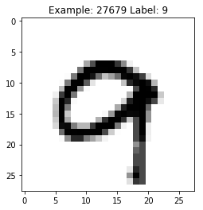

## TensorFlow Intro


```python
import tensorflow as tf
hello = tf.constant('Hello, TensorFlow!')
sess = tf.Session()
print(sess.run(hello).decode())
```

    Hello, TensorFlow!
    

**tf.constant:** creates a new constant tensor. We can change it's dimensions by using **_'shape'_** argument.

**tf.Session:** is a class for performing defined operations. After we define operations, in order to execute them, we invoke tf.Session(). Once the operations are performed, it is recommended to close the session using _**tf.Session.close**_

#### Code for Optical Character Recognition in Tensorflow


```python
import tensorflow as tf
old_v = tf.logging.get_verbosity()
tf.logging.set_verbosity(tf.logging.ERROR)
from tensorflow.examples.tutorials.mnist import input_data
mnist = input_data.read_data_sets('MNIST_data', one_hot=True)
tf.logging.set_verbosity(old_v)
```

    Extracting MNIST_data\train-images-idx3-ubyte.gz
    Extracting MNIST_data\train-labels-idx1-ubyte.gz
    Extracting MNIST_data\t10k-images-idx3-ubyte.gz
    Extracting MNIST_data\t10k-labels-idx1-ubyte.gz
    

### Q1) Explain the above code

    MNIST dataset is considered 'Hello, World!' of machine learning. MNIST is a database of handwritten digits. It is divided into training (60,000) and test sets (10,000). In order to use the MNIST dataset, we import it using aforementioned code where it comes pre-loaded from tensorflow examples.

### Q2) What is the usage of one_hot in read_data_sets() command?
    
    The MNIST dataset comprises of 10 digits, 0 through 9. In machine learning it is recommended to use one hot encoding format for vectors. It converts the input to a vector that has 1 in a single dimension and 0/false in the rest of the dimensions. for example 9 is represented as [0 0 0 0 0 0 0 0 0 1]


```python
def TRAIN_SIZE(num):
    print ('Total Training Images in Dataset = ' + str(mnist.train.images.shape))
    print ('--------------------------------------------------')
    x_train = mnist.train.images[:num,:]
    print ('x_train Examples Loaded = ' + str(x_train.shape))
    y_train = mnist.train.labels[:num,:]
    print ('y_train Examples Loaded = ' + str(y_train.shape))
    print('')
    return x_train, y_train

def TEST_SIZE(num):
    print ('Total Test Examples in Dataset = ' + str(mnist.test.images.shape)) 
    print ('--------------------------------------------------') 
    x_test = mnist.test.images[:num,:] 
    print ('x_test Examples Loaded = ' + str(x_test.shape)) 
    y_test = mnist.test.labels[:num,:] 
    print ('y_test Examples Loaded = ' + str(y_test.shape)) 
    return x_test, y_test
```


```python
import matplotlib.pyplot as plt
import random as ran 
import numpy as np 

def display_digit(num): 
    print(y_train[num])
    label = y_train[num].argmax(axis=0) 
    image = x_train[num].reshape([28,28]) 
    plt.title('Example: %d Label: %d' % (num, label)) 
    plt.imshow(image, cmap=plt.get_cmap('gray_r')) 
    plt.show()
    
def display_mult_flat(start, stop): 
    images = x_train[start].reshape([1,784]) 
    for i in range(start+1,stop): 
        images = np.concatenate((images, x_train[i].reshape([1,784]))) 
    plt.imshow(images, cmap=plt.get_cmap('gray_r')) 
    plt.show()
```


```python
x_train, y_train = TRAIN_SIZE(55000)

x_test, y_test = TEST_SIZE(10000)
```

    Total Training Images in Dataset = (55000, 784)
    --------------------------------------------------
    x_train Examples Loaded = (55000, 784)
    y_train Examples Loaded = (55000, 10)
    
    Total Test Examples in Dataset = (10000, 784)
    --------------------------------------------------
    x_test Examples Loaded = (10000, 784)
    y_test Examples Loaded = (10000, 10)
    


```python
display_digit(ran.randint(0, x_train.shape[0]))
```

    [0. 0. 0. 0. 0. 0. 0. 0. 0. 1.]
    





```python
sess = tf.Session()
```


```python
x = tf.placeholder(tf.float32, shape=[None, 784]) # input image 28*28 = 784 
y_ = tf.placeholder(tf.float32, shape=[None, 10]) # 0-9 digits (10 classes)
```


```python
# Model parameters 
W = tf.Variable(tf.zeros([784, 10])) 
b = tf.Variable(tf.zeros([10]))
```


```python
y = tf.nn.softmax(tf.matmul(x,W) + b)
```

### Q3) It appears that tf.placeholder() , tf.Variable() and tf.constant() all are for assigning variables so what is the difference between them?

**tf.constant:** As mentioned earlier, this creates a constant tensor. Meaning its value can not be modified.

**tf.variable:** This is inherited from the superclass: Variable. It is used to specify inputs for other operations in a graph and its future state can be modified using the method tf.assign(). We can also change its shape unlike tf.constant.

**tf.placeholder():** Creates a placeholder for a tensor which will be used at a later point but not actually create a tensor. It can be of either constant or variable shape.


```python
# Initialize variables
init = tf.global_variables_initializer()
sess.run(init)
```


```python
# Train the model

LEARNING_RATE = 0.1 
cross_entropy = tf.reduce_mean(-tf.reduce_sum(y_ * tf.log(y), reduction_indices=[1])) 
training = tf.train.GradientDescentOptimizer(LEARNING_RATE).minimize(cross_entropy) 
correct_prediction = tf.equal(tf.argmax(y,1), tf.argmax(y_,1)) 
accuracy = tf.reduce_mean(tf.cast(correct_prediction, tf.float32))
```

### Q4) Write a few sentences about tf.train.GradientDescentOptimizer and tf.equal commands. What is the effect of tf.argmax() ?

   **tf.train.GradientDescentOptimizer:** In order to minimize our weights or cost function for most accurate prediction, we use gradient descent algorithm. In tensorflow, use tf.train.GradientDescentOptimizer to implement this algorithm with carefully selection of learning rate.
   
   **tf.equal:** This is used to check if our prediction is equal to the actual value. This is an element wise equality check.
   
   **tf.argmax:** This function returns the index of the tensor where the largest value is present. Using tf.equal, we check to see if the predicted label "*tf.argmax(y,1)*" is equal to actual label "*tf.argmax(y_,1)*"


```python
TRAIN_STEPS = 250 
for i in range(TRAIN_STEPS+1): 
    sess.run(training, feed_dict={x: x_train, y_: y_train}) 
    if i%100 == 0:
        print('Training Step:' + str(i) + ' Accuracy = ' + str(sess.run(accuracy, feed_dict={x: x_test, y_: y_test})) + ' Loss = ' + str(sess.run(cross_entropy, {x: x_train, y_: y_train})))
```

    Training Step:0 Accuracy = 0.6705 Loss = 2.1970644
    Training Step:100 Accuracy = 0.8713 Loss = 0.60858333
    Training Step:200 Accuracy = 0.8857 Loss = 0.4907095
    

### Q5) Explain the above code.

   Here, we are running the training step 251 times each time implementing gradient descent algorithm to minimize the cost function. _tf.session_ initiates the session and _sess.run()_ runs the session. To input the placeholders created earlier, we call *feed_dict* argument to _sess.run_ to input the training variables.
   We then check to see accuracy for every 100th step by calling the variable _accuracy_


```python
X = tf.placeholder(tf.float32, shape=[None, 784]) # input image 28*28 = 784 
Y_ = tf.placeholder(tf.float32, shape=[None, 10]) #0-9 digits (10 classes)

L = 100
M = 30
```


```python
W1 = tf.Variable(tf.truncated_normal([784, L], stddev=0.1)) # 784 = 28 * 28 
B1 = tf.Variable(tf.zeros([L])) 
W2 = tf.Variable(tf.truncated_normal([L, M], stddev=0.1)) 
B2 = tf.Variable(tf.zeros([M])) 
W3 = tf.Variable(tf.truncated_normal([M, 10], stddev=0.1)) 
B3 = tf.Variable(tf.zeros([10]))
```


```python
XX = tf.reshape(X, [-1, 784]) 
Y1 = tf.nn.sigmoid(tf.matmul(XX, W1) + B1) 
Y2 = tf.nn.sigmoid(tf.matmul(Y1, W2) + B2) 
Ylogits = tf.matmul(Y2, W3) + B3 
Y = tf.nn.softmax(Ylogits)
```


```python
cross_entropy = tf.nn.softmax_cross_entropy_with_logits(logits=Ylogits, labels=Y_) 
cross_entropy = tf.reduce_mean(cross_entropy)*100
```


```python
correct_prediction = tf.equal(tf.argmax(Y, 1), tf.argmax(Y_, 1)) 
accuracy = tf.reduce_mean(tf.cast(correct_prediction, tf.float32))
```


```python
init = tf.global_variables_initializer()
sess = tf.Session()
sess.run(init)
```


```python
LEARNING_RATE = 0.01 #cross_entropy = tf.reduce_mean(-tf.reduce_sum(y_ * tf.log(y), reduction_indices=[1])) 
training = tf.train.GradientDescentOptimizer(LEARNING_RATE).minimize(cross_entropy) 
#correct_prediction = tf.equal(tf.argmax(y,1), tf.argmax(y_,1)) 
#accuracy = tf.reduce_mean(tf.cast(correct_prediction, tf.float32)) 
TRAIN_STEPS = 1000 
for i in range(TRAIN_STEPS+1): 
    sess.run(training, feed_dict={X: x_train, Y_: y_train}) 
    if i%100 == 0: 
        print('Training Step:' + str(i) + ' Accuracy = ' + str(sess.run(accuracy, feed_dict={X: x_test, Y_: y_test})) + ' Loss = ' + str(sess.run(cross_entropy, {X: x_train, Y_: y_train})))
```

    Training Step:0 Accuracy = 0.0945 Loss = 230.11156
    Training Step:100 Accuracy = 0.7759 Loss = 88.98657
    Training Step:200 Accuracy = 0.8752 Loss = 46.921757
    Training Step:300 Accuracy = 0.9008 Loss = 35.84331
    Training Step:400 Accuracy = 0.9132 Loss = 30.771156
    Training Step:500 Accuracy = 0.9221 Loss = 27.455639
    Training Step:600 Accuracy = 0.9286 Loss = 24.896826
    Training Step:700 Accuracy = 0.9339 Loss = 22.775522
    Training Step:800 Accuracy = 0.9392 Loss = 20.966084
    Training Step:900 Accuracy = 0.944 Loss = 19.405066
    Training Step:1000 Accuracy = 0.9486 Loss = 18.04591
    

#### Drop out


```python
X = tf.placeholder(tf.float32, shape=[None, 784]) # input image 28*28 = 784 
Y_ = tf.placeholder(tf.float32, shape=[None, 10]) #0-9 digits (10 classes)

pkeep = tf.placeholder(tf.float32)

L = 100 
M = 30 
N = 60 
O = 30
```


```python
W1 = tf.Variable(tf.truncated_normal([784, L], stddev=0.1)) # 784 = 28 * 28 
B1 = tf.Variable(tf.ones([L])/10) 
W2 = tf.Variable(tf.truncated_normal([L, M], stddev=0.1)) 
B2 = tf.Variable(tf.ones([M])/10) 
W3 = tf.Variable(tf.truncated_normal([M, 10], stddev=0.1)) 
B3 = tf.Variable(tf.zeros([10]))
```


```python
XX = tf.reshape(X, [-1, 784]) 
Y1 = tf.nn.relu(tf.matmul(XX, W1) + B1) 
Y1d = tf.nn.dropout(Y1, pkeep) 
Y2 = tf.nn.relu(tf.matmul(Y1, W2) + B2) 
Y2d = tf.nn.dropout(Y2, pkeep) 
Ylogits = tf.matmul(Y2d, W3) + B3 
Y = tf.nn.softmax(Ylogits)
```


```python
cross_entropy = tf.nn.softmax_cross_entropy_with_logits_v2(logits=Ylogits, labels=Y_) 
cross_entropy = tf.reduce_mean(cross_entropy)*100
```


```python
correct_prediction = tf.equal(tf.argmax(Y, 1), tf.argmax(Y_, 1)) 
accuracy = tf.reduce_mean(tf.cast(correct_prediction, tf.float32))
```


```python
init = tf.global_variables_initializer() 
sess = tf.Session() 
sess.run(init)
```


```python
LEARNING_RATE = 0.01 #cross_entropy = tf.reduce_mean(-tf.reduce_sum(y_ * tf.log(y), reduction_indices=[1])) 
training = tf.train.GradientDescentOptimizer(LEARNING_RATE).minimize(cross_entropy) 
#correct_prediction = tf.equal(tf.argmax(y,1), tf.argmax(y_,1)) 
#accuracy = tf.reduce_mean(tf.cast(correct_prediction, tf.float32)) 
TRAIN_STEPS = 1000 
for i in range(TRAIN_STEPS+1): 
    sess.run(training, feed_dict={X: x_train, Y_: y_train, pkeep: 0.75 }) 
    if i%100 == 0: 
        print('Training Step:' + str(i) + ' Accuracy = ' + str(sess.run(accuracy, feed_dict={X: x_test, Y_: y_test, pkeep: 1.0})) + ' Loss = ' + str(sess.run(cross_entropy, {X: x_train, Y_: y_train , pkeep: 0.75})))
```

    Training Step:0 Accuracy = 0.2395 Loss = 221.54562
    Training Step:100 Accuracy = 0.9313 Loss = 31.408978
    Training Step:200 Accuracy = 0.9454 Loss = 22.176956
    Training Step:300 Accuracy = 0.9586 Loss = 16.372051
    Training Step:400 Accuracy = 0.9652 Loss = 12.615747
    Training Step:500 Accuracy = 0.9687 Loss = 10.954941
    Training Step:600 Accuracy = 0.9665 Loss = 10.405638
    Training Step:700 Accuracy = 0.9724 Loss = 8.120609
    Training Step:800 Accuracy = 0.9732 Loss = 7.180957
    Training Step:900 Accuracy = 0.9746 Loss = 6.557978
    Training Step:1000 Accuracy = 0.9756 Loss = 5.9417152
    

### Stochastic Gradient Descent


```python
LEARNING_RATE = 0.01 
training = tf.train.GradientDescentOptimizer(LEARNING_RATE).minimize(cross_entropy)  
TRAIN_STEPS = 1000 
for i in range(TRAIN_STEPS+1): 
    batch_x, batch_y = mnist.train.next_batch(200) # batches of 200
    sess.run(training, feed_dict={X: batch_x, Y_: batch_y}) 
    if i%100 == 0: 
        print('Training Step:' + str(i) + ' Accuracy = ' + str(sess.run(accuracy, feed_dict={X: mnist.test.images, Y_: mnist.test.labels})) + ' Loss = ' + str(sess.run(cross_entropy, {X: batch_x, Y_: batch_y})))
```

    Training Step:0 Accuracy = 0.9429 Loss = 14.882618
    Training Step:100 Accuracy = 0.9428 Loss = 14.45898
    Training Step:200 Accuracy = 0.9442 Loss = 13.607838
    Training Step:300 Accuracy = 0.9505 Loss = 9.100786
    Training Step:400 Accuracy = 0.9555 Loss = 7.4269786
    Training Step:500 Accuracy = 0.9554 Loss = 16.843094
    Training Step:600 Accuracy = 0.9558 Loss = 8.730303
    Training Step:700 Accuracy = 0.9538 Loss = 14.17187
    Training Step:800 Accuracy = 0.9575 Loss = 8.248997
    Training Step:900 Accuracy = 0.9605 Loss = 12.847105
    Training Step:1000 Accuracy = 0.961 Loss = 12.975003
    

### Drop out using Stochastic Gradient


```python

LEARNING_RATE = 0.01 #cross_entropy = tf.reduce_mean(-tf.reduce_sum(y_ * tf.log(y), reduction_indices=[1])) 
training = tf.train.GradientDescentOptimizer(LEARNING_RATE).minimize(cross_entropy) 
#correct_prediction = tf.equal(tf.argmax(y,1), tf.argmax(y_,1)) 
#accuracy = tf.reduce_mean(tf.cast(correct_prediction, tf.float32)) 
TRAIN_STEPS = 1000 
for i in range(TRAIN_STEPS+1): 
    batch_x, batch_y = mnist.train.next_batch(200)
    sess.run(training, feed_dict={X: batch_x, Y_: batch_y, pkeep: 0.75 }) 
    if i%100 == 0: 
        print('Training Step:' + str(i) + ' Accuracy = ' + str(sess.run(accuracy, feed_dict={X: mnist.test.images, Y_: mnist.test.labels, pkeep: 1.0})) + ' Loss = ' + str(sess.run(cross_entropy, {X: batch_x, Y_: batch_y , pkeep: 0.75})))
```

    Training Step:0 Accuracy = 0.1428 Loss = 220.7165
    Training Step:100 Accuracy = 0.768 Loss = 77.83908
    Training Step:200 Accuracy = 0.9211 Loss = 23.778736
    Training Step:300 Accuracy = 0.9305 Loss = 28.15566
    Training Step:400 Accuracy = 0.9507 Loss = 14.243515
    Training Step:500 Accuracy = 0.9458 Loss = 14.118492
    Training Step:600 Accuracy = 0.9516 Loss = 7.4539194
    Training Step:700 Accuracy = 0.961 Loss = 4.611766
    Training Step:800 Accuracy = 0.9604 Loss = 5.43583
    Training Step:900 Accuracy = 0.96 Loss = 4.9964643
    Training Step:1000 Accuracy = 0.9519 Loss = 13.705051
    
